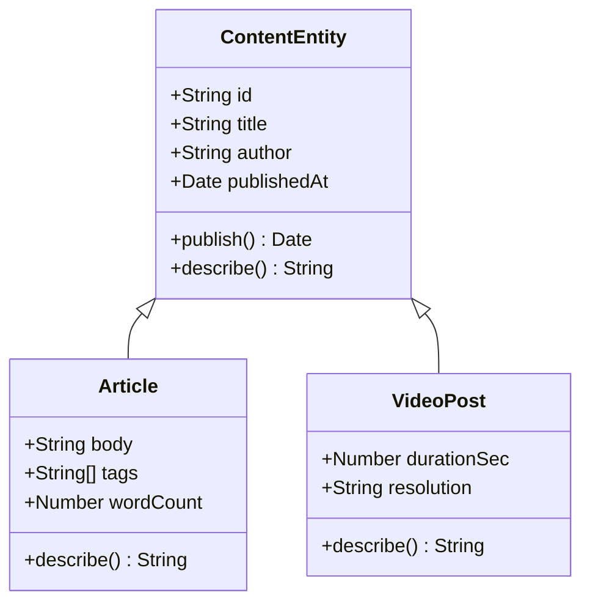
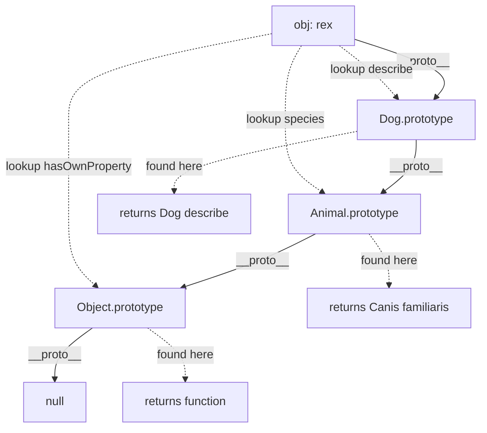
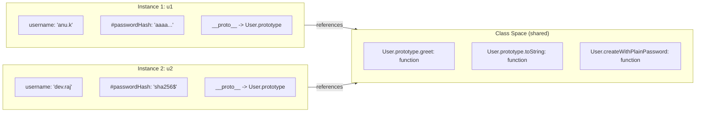
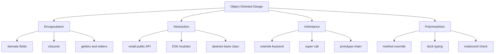

# Object-Oriented Design

<!-- SECTION_1_START -->
# Object-Oriented Design in Node.js — Core Definition & Intuitive Overview

## Formal Academic Definition (KTU 2024 Syllabus Terminology)

**Object-Oriented Design (OOD)** is a software design methodology that models a system as a collection of cooperating **objects**, each representing an instance of a **class**. In the JavaScript / Node.js runtime, OOD is implemented primarily through **ES6 Classes**, **constructor functions**, and the underlying **prototype chain**. The paradigm is governed by four foundational principles — **Encapsulation**, **Abstraction**, **Inheritance**, and **Polymorphism** — collectively referred to as the *four pillars of OOP*.

> [!IMPORTANT]
> **KTU 2024 Module Highlight:** The syllabus explicitly demands coverage of both **prototype-based inheritance** (the classical JS model) and **ES6 class-based inheritance** (the modern syntactic sugar over prototypes). Both must be implemented in the Node.js runtime.

## Conceptual Analogy — The "Blueprint and the Building" Model

Imagine an architect's **blueprint** for a residential house. The blueprint itself is **not a house** — it is a *plan* describing attributes (number of rooms, color, area) and behaviours (door opens, lights switch on). A real house built *from* the blueprint is a **concrete instance**. In Object-Oriented Design:

- The **Blueprint** → the **Class** (e.g., `User`, `Order`, `Invoice`).
- A **Real House** → an **Object / Instance** created from that class using the `new` keyword.
- **Renovations across all houses** → **Methods** defined once on the class, callable on every instance.
- **Inheritance** → a "Villa Blueprint" extending the "House Blueprint" inherits all base features but adds a swimming pool.

> [!NOTE]
> **Why OOD in Node.js?** Modern back-end systems (Express middlewares, Mongoose models, Sequelize entities, NestJS controllers) are predominantly built using OOD because it cleanly maps database entities to runtime objects, supports testability, and enables modular scaling across microservices.

## Mathematical / Structural View of an Object

An object $O$ can be formally represented as a 2-tuple:

$$
O = \langle \mathcal{S}, \mathcal{M} \rangle
$$

where $\mathcal{S}$ is the set of **state variables** (properties) and $\mathcal{M}$ is the set of **member functions** (methods). For an instance $o_i$ of class $C$:

$$
o_i = \text{new } C(a_1, a_2, \dots, a_n) \quad \Rightarrow \quad o_i.\mathcal{S} = \{ a_1, a_2, \dots, a_n \}
$$

> [!VISUALIZATION CONTROL]
> **Concept:** Class vs Object Memory Layout
> **Coordinate Representation:**
> * Class `Rectangle`: $\text{width} = w$, $\text{height} = h$
> * Method: $\text{area}() = w \times h$
> * Instance $r_1$ at coordinates $(4, 6)$: $\text{area}(r_1) = 4 \times 6 = 24$
> * Instance $r_2$ at coordinates $(2, 9)$: $\text{area}(r_2) = 2 \times 9 = 18$
> **Visual Description:** A single class blueprint (left) acts as a template; multiple distinct instances (right) occupy different memory addresses but share the same method definition through the prototype reference.

---

<!-- SECTION_1_END -->

<!-- SECTION_2_START -->
# Deep Theoretical Analysis & KTU High-Yield Cheat Sheet

## The Four Pillars — Operational Mechanics in Node.js

### 1. Encapsulation
Encapsulation binds **state** (data) and **behaviour** (methods) into a single unit and restricts direct external access to some of the object's components. In ES2022+, true private fields use the `#` prefix.

- **Public members**: accessible via `this.propertyName`.
- **Private members** (`#field`): accessible **only** within the declaring class.
- **Protected convention** (`_field`): a community convention (not enforced) signalling "do not touch externally".

### 2. Abstraction
Abstraction hides **complex implementation details** and exposes only the essential interface. In JavaScript this is achieved through:
- Classes that expose a small public API.
- ES6 **Modules** (`export` / `import`) that hide internal helper functions.
- Abstract base classes (implemented via convention — JS does not have built-in `abstract` keyword).

### 3. Inheritance
Inheritance allows a class (subclass / child) to acquire properties and methods of another class (superclass / parent), enabling **code reuse** and the establishment of an **"is-a"** relationship.
- ES6 Syntax: `class Child extends Parent { ... }`
- Keyword `super()` invokes the parent constructor.
- The `super.method()` call invokes an overridden parent method.

### 4. Polymorphism
Polymorphism allows the **same interface** to invoke **different underlying behaviours** depending on the actual object type at runtime.
- Achieved via **method overriding** in subclasses.
- Exploited in JavaScript through **duck typing**: *"If it walks like a duck and quacks like a duck, it is a duck."*

## The Prototype Chain — JavaScript's Hidden Inheritance Engine

Every JavaScript object has a hidden internal link called `[[Prototype]]` (accessed via `Object.getPrototypeOf(obj)` or the legacy `__proto__`). When a property is accessed, the engine walks up the chain:

$$
\text{obj} \rightarrow \text{obj.\_\_proto\_\_} \rightarrow \text{Object.prototype} \rightarrow \text{null}
$$

ES6 `class` syntax is **syntactic sugar** over this prototype mechanism.

## KTU High-Yield Cheat Sheet

| Concept | ES5 (Constructor Function) | ES6+ (Class Syntax) | KTU Exam Cue |
|---|---|---|---|
| Class definition | `function User(name) { this.name = name; }` | `class User { constructor(name) { this.name = name; } }` | Prefer ES6 unless asked otherwise |
| Instance creation | `const u = new User('Anu')` | `const u = new User('Anu')` | Always use `new` for traditional classes |
| Method on prototype | `User.prototype.greet = function() { ... }` | Defined inside class body | OOP methods live on prototype, not on each instance |
| Inheritance | `Admin.prototype = Object.create(User.prototype)` | `class Admin extends User { ... }` | `extends` + `super()` is mandatory |
| Private field | Closure variable | `#password` (ES2022) | `#` is the only true private modifier |
| Static member | `User.count = 0` | `static count = 0` | Accessed via class, not instance |
| Polymorphism | Manual prototype override | `methodOverride()` in subclass | Subclass redefines parent method |
| Abstraction | IIFE / Module pattern | Abstract base class via convention | No native `abstract` keyword |
| `instanceof` check | Built-in | Built-in | Tests prototype chain membership |

## Real-World Engineering Utility

- **Express.js Middleware**: Express apps are built using class-based controllers (especially in TypeScript-based NestJS frameworks) that extend base controller classes.
- **Mongoose ORM**: Every MongoDB schema is defined as a class extending `mongoose.Model`.
- **Design Patterns in Node.js**: Singleton (DB connection pool), Factory (logger creation), Observer (EventEmitter), and Decorator (method wrapping) are all expressed through OOD.
- **Microservice Architecture**: Each service in a microservice deployment is a class managing its own state, dependencies injected via constructors (Dependency Injection).

> [!NOTE]
> **Memory Insight for KTU:** Methods defined inside a class body are stored on the **prototype object** (shared across all instances, saving memory). Properties defined in the `constructor` are stored on each **instance object** (unique per object).

---

<!-- SECTION_2_END -->

<!-- SECTION_3_START -->
# Step-by-Step Derivations & Code Implementation

## Example 1 — Defining a Class and Creating Instances (ES6 Syntax)

```javascript
/**
 * @file User.mjs
 * @description Demonstrates ES6 class definition, constructor, instance methods,
 *              static members, getters/setters, and encapsulation.
 */

/**
 * Represents a registered user in the web application.
 * @class User
 */
class User {
  // Private field — true encapsulation (ES2022+)
  #passwordHash;

  /** @type {string} */
  #role;

  /**
   * @param {string} username - Unique login identifier.
   * @param {string} passwordHash - Pre-hashed password (never store plain text).
   * @param {string} [role='viewer'] - User role for authorization.
   */
  constructor(username, passwordHash, role = 'viewer') {
    if (typeof username !== 'string' || username.length === 0) {
      throw new TypeError('[User] username must be a non-empty string.');
    }
    if (typeof passwordHash !== 'string' || passwordHash.length < 32) {
      throw new TypeError('[User] passwordHash must be a SHA-256 hex string.');
    }
    this.username = username;
    this.#passwordHash = passwordHash;
    this.#role = role;
    this.createdAt = new Date();
  }

  /**
   * Authenticate a candidate password (delegated to a hashing service in production).
   * @param {string} candidateHash - SHA-256 hash of the candidate password.
   * @returns {boolean} True if the candidate matches the stored hash.
   */
  authenticate(candidateHash) {
    return this.#passwordHash === candidateHash;
  }

  /** @returns {string} Public-safe role descriptor. */
  get role() {
    return this.#role;
  }

  /**
   * @param {string} newRole - One of 'viewer', 'editor', 'admin'.
   */
  set role(newRole) {
    const allowed = ['viewer', 'editor', 'admin'];
    if (!allowed.includes(newRole)) {
      throw new RangeError(`[User] Invalid role: ${newRole}`);
    }
    this.#role = newRole;
  }

  /**
   * Static factory method — alternative construction path.
   * @param {string} username
   * @param {string} plainPassword
   * @returns {User}
   */
  static createWithPlainPassword(username, plainPassword) {
    // In production, use bcrypt or argon2 here.
    const mockHash = 'sha256$' + plainPassword.split('').reverse().join('') + '00000000000000000000000000';
    return new User(username, mockHash, 'viewer');
  }

  /** @returns {number} Total number of User instances created. */
  static get totalUsers() {
    return User.#registry.length;
  }

  static #registry = [];

  /**
   * Override of toString for human-readable inspection.
   * @returns {string}
   */
  toString() {
    return `User<username=${this.username}, role=${this.#role}, createdAt=${this.createdAt.toISOString()}>`;
  }
}

// ---- Execution Block ----
try {
  const u1 = new User('anu.k', 'a'.repeat(32), 'editor');
  const u2 = User.createWithPlainPassword('dev.raj', 'MySecret@123');
  console.log(u1.toString());
  console.log(u2.toString());
  console.log('Auth u2 with reversed:', u2.authenticate('321@tcerceSyM'));
  u1.role = 'admin';
  console.log('Updated role:', u1.role);
} catch (err) {
  console.error('User construction failed:', err.message);
}
```

**Step-by-step Explanation:**

1. The `#passwordHash` and `#role` declarations create **true private fields** — attempting to read `u1.#passwordHash` outside the class throws a `SyntaxError`.
2. The **constructor** validates inputs and throws a `TypeError` on invalid data, enforcing the class's invariant.
3. `authenticate(candidateHash)` performs a constant-time style equality check on the hash.
4. The `get role()` and `set role(newRole)` are **accessor properties** — invoking `u1.role` (no parentheses) returns the role; `u1.role = 'admin'` validates before assignment.
5. `static createWithPlainPassword()` is a **factory method** — it lives on the class itself, not on instances.
6. `static #registry` and `static get totalUsers()` demonstrate **static private fields** and **static getters**.

## Example 2 — Inheritance and Polymorphism

```javascript
/**
 * @file ContentModel.mjs
 * @description Demonstrates ES6 inheritance (extends), super() chaining,
 *              method overriding, polymorphism, and instance-of checks.
 */

/** Base class representing any content entity on the platform. */
class ContentEntity {
  /**
   * @param {string} id
   * @param {string} title
   * @param {string} author
   */
  constructor(id, title, author) {
    if (typeof id !== 'string' || id.length === 0) {
      throw new TypeError('[ContentEntity] id is required.');
    }
    this.id = id;
    this.title = title;
    this.author = author;
    this.publishedAt = null;
  }

  /** Mark the entity as published. */
  publish() {
    this.publishedAt = new Date();
    return this;
  }

  /**
   * @returns {string} Human-readable summary of the entity.
   */
  describe() {
    return `[${this.constructor.name}] "${this.title}" by ${this.author}`;
  }
}

/** A textual article. */
class Article extends ContentEntity {
  /**
   * @param {string} id
   * @param {string} title
   * @param {string} author
   * @param {string} body
   * @param {string[]} [tags=[]]
   */
  constructor(id, title, author, body, tags = []) {
    super(id, title, author);
    if (typeof body !== 'string' || body.length === 0) {
      throw new TypeError('[Article] body must be a non-empty string.');
    }
    this.body = body;
    this.tags = tags;
    this.wordCount = body.split(/\s+/).filter(Boolean).length;
  }

  /**
   * Polymorphic override — different formatting for an article.
   * @returns {string}
   */
  describe() {
    return `${super.describe()} — ${this.wordCount} words, tags: [${this.tags.join(', ')}]`;
  }
}

/** A short-form video entity. */
class VideoPost extends ContentEntity {
  /**
   * @param {string} id
   * @param {string} title
   * @param {string} author
   * @param {number} durationSec
   * @param {string} resolution
   */
  constructor(id, title, author, durationSec, resolution) {
    super(id, title, author);
    if (typeof durationSec !== 'number' || durationSec <= 0) {
      throw new TypeError('[VideoPost] durationSec must be a positive number.');
    }
    this.durationSec = durationSec;
    this.resolution = resolution;
  }

  /** Polymorphic override. */
  describe() {
    return `${super.describe()} — ${this.durationSec}s @ ${this.resolution}`;
  }
}

// ---- Polymorphic Dispatch Demonstration ----
const library = [
  new Article('a-001', 'Intro to Node.js', 'Anu K', 'Node.js is a JavaScript runtime ...', ['nodejs', 'js']),
  new VideoPost('v-101', 'V8 Internals', 'Rajeev M', 1840, '1080p'),
  new ContentEntity('p-001', 'Generic Note', 'System')
];

for (const entity of library) {
  entity.publish();
  console.log(entity.describe());
  console.log('instanceof ContentEntity:', entity instanceof ContentEntity);
}
```

**Step-by-step Explanation:**

1. `class Article extends ContentEntity` establishes a prototype link: `Article.prototype.__proto__ === ContentEntity.prototype`.
2. `super(id, title, author)` inside the child constructor **must** be called before `this` is used — this is enforced by the engine.
3. The `describe()` method is **overridden** in both `Article` and `VideoPost`, but the child can still invoke the parent's version via `super.describe()`.
4. The `for-of` loop exercises **runtime polymorphism**: the same `entity.describe()` call dispatches to the correct overridden method based on the object's actual constructor.
5. `instanceof ContentEntity` returns `true` for all three objects because the prototype chain still includes `ContentEntity.prototype`.

## Example 3 — The Underlying ES5 Prototype Model (For KTU Conceptual Clarity)

```javascript
/**
 * @file ProtoModel.mjs
 * @description Re-implementation of the OOP model using ES5 prototype syntax
 *              to reveal what the ES6 `class` keyword compiles to internally.
 */

// ---- Parent constructor (ES5) ----
function Animal(species) {
  this.species = species;
}

// Method on prototype — shared across all instances.
Animal.prototype.describe = function () {
  return `I am a ${this.species}.`;
};

// ---- Child constructor (ES5) ----
function Dog(name, breed) {
  // Re-use parent initialization logic.
  Animal.call(this, 'Canis familiaris');
  this.name = name;
  this.breed = breed;
}

// Set up prototype chain: Dog.prototype -> Animal.prototype -> Object.prototype -> null.
Object.setPrototypeOf(Dog.prototype, Animal.prototype);

// Restore constructor pointer (Object.setPrototypeOf may clobber it).
Dog.prototype.constructor = Dog;

// Override describe in the subclass.
Dog.prototype.describe = function () {
  return `${Animal.prototype.describe.call(this)} My name is ${this.name}, a ${this.breed}.`;
};

// ---- Test ----
const rex = new Dog('Rex', 'Labrador');
console.log(rex.describe());
console.log('Prototype chain check:', rex instanceof Dog);   // true
console.log('Prototype chain check:', rex instanceof Animal); // true
```

**Step-by-step Explanation:**

1. `Animal.call(this, species)` invokes the parent constructor with the new object's `this`, replicating `super(species)` in ES6.
2. `Object.setPrototypeOf(Dog.prototype, Animal.prototype)` is the explicit ES5 equivalent of `class Dog extends Animal`.
3. The line `Dog.prototype.constructor = Dog` is **mandatory** because `Object.setPrototypeOf` can lose the `constructor` reference; forgetting this is a common KTU pitfall.
4. `Animal.prototype.describe.call(this)` invokes the parent's `describe` while keeping the child's `this` — equivalent to `super.describe()`.
5. `instanceof` walks the entire prototype chain, confirming both the immediate and inherited relationships.

## Example 4 — Composition Over Inheritance (Modern Best Practice)

```javascript
/**
 * @file Composition.mjs
 * @description Demonstrates HAS-A composition as an alternative to deep IS-A inheritance.
 */

class Logger {
  constructor(prefix = '[App]') {
    this.prefix = prefix;
  }
  log(message) {
    console.log(`${this.prefix} ${new Date().toISOString()} ${message}`);
  }
}

class Repository {
  constructor(database, logger) {
    this.db = database;
    this.logger = logger;
  }
  findAll() {
    this.logger.log('Repository.findAll invoked.');
    return this.db.query('SELECT * FROM items');
  }
}

class UserService {
  constructor() {
    this.logger = new Logger('[UserService]');
    this.repository = new Repository({ query: (sql) => [`result of: ${sql}`] }, this.logger);
  }
  listUsers() {
    return this.repository.findAll();
  }
}

const svc = new UserService();
console.log(svc.listUsers());
```

**Step-by-step Explanation:**

1. `UserService` does **not** extend `Logger` or `Repository` — it **has-a** `Logger` and **has-a** `Repository` (composition).
2. This avoids the brittle deep inheritance tree problem and follows the **"favour composition over inheritance"** guideline from the *Gang of Four* design patterns book.
3. Dependencies are passed through the **constructor**, enabling **dependency injection** — a key technique for unit testability in Node.js back-ends.

---

<!-- SECTION_3_END -->

<!-- SECTION_4_START -->
# Structural Diagrams & Schematics

## Diagram 1 — Class Hierarchy and Inheritance Topology



**Reading the diagram:**
- `ContentEntity` is the **base / superclass**.
- `Article` and `VideoPost` are **derived / subclasses**.
- The arrow `<|--` denotes the **"is-a" inheritance** relationship in UML.
- The `+` symbol denotes **public visibility**; `#` would denote private; `-` would denote protected.

## Diagram 2 — Prototype Chain Lookup Walk



**Reading the diagram:**
- Each `__proto__` edge is a hop in the prototype chain.
- Property lookups walk **left to right** until a hit is found or `null` is reached (signalling `undefined`).
- Methods like `hasOwnProperty`, `toString`, `valueOf` are inherited from `Object.prototype`.

## Diagram 3 — Memory Layout: Class vs Instance



**Reading the diagram:**
- Methods are stored **once** on the prototype object (Class Space).
- Each instance carries its **own data** but shares the same method references via the `__proto__` link.
- This is why OOD is memory-efficient at scale: 1 million `User` objects do not duplicate method storage.

## Diagram 4 — OOP Pillar Coverage Map



---

<!-- SECTION_4_END -->

<!-- SECTION_5_START -->
# KTU 2024 Scheme Examination Question Bank & Topic Recap

## Part A — Short Answer Questions (3 Marks Each)

### Question 1

> **[KTU University Exam — July 2024]** Explain the four pillars of Object-Oriented Programming with one-line Node.js examples for each. **(CO1, Remember) — 3 Marks**

**Model Answer (Valuation Key):**

The four pillars of OOP are:

1. **Encapsulation** — Bundling data and methods together and restricting outside access.
   ```javascript
   class Account { #balance = 0; deposit(amt) { this.#balance += amt; } }
   ```
   *`#balance` is a true private field — not accessible outside the class.* **[1 Mark]**

2. **Abstraction** — Hiding implementation details, exposing only essentials.
   ```javascript
   class Db { connect() { /* complex pool init */ } query(sql) { /* ... */ } }
   ```
   *Consumers call `query()` without knowing connection internals.* **[1 Mark]**

3. **Inheritance** — A subclass acquiring parent class properties/methods.
   ```javascript
   class Admin extends User { constructor(n) { super(n); this.role = 'admin'; } }
   ```
   *`Admin` inherits all public methods of `User`.* **[0.5 Mark]**

4. **Polymorphism** — Same interface, different behaviour at runtime.
   ```javascript
   class Cat { speak() { return 'meow'; } } class Dog { speak() { return 'woof'; } }
   ```
   *Both expose `speak()` but produce different outputs.* **[0.5 Mark]**

---

### Question 2

> **[KTU University Exam — Dec 2023]** Differentiate between ES5 prototype-based inheritance and ES6 class-based inheritance in JavaScript. **(CO1, Understand) — 3 Marks**

**Model Answer (Valuation Key):**

| Aspect | ES5 Prototype-Based | ES6 Class-Based |
|---|---|---|
| Syntax | `function Foo() {}` + `Foo.prototype.method` | `class Foo { method() {} }` |
| Inheritance setup | `Object.setPrototypeOf(Child.prototype, Parent.prototype)` | `class Child extends Parent` |
| Parent constructor call | `Parent.call(this, args)` | `super(args)` |
| `constructor` property | Must be manually restored after `setPrototypeOf` | Automatically set |
| Readability | Lower — boilerplate-heavy | Higher — declarative |
| Engine behaviour | Native, no syntactic translation | Syntactic sugar over the same prototype mechanism |

*Both ultimately mutate the `[[Prototype]]` chain — ES6 is **not** a new inheritance model, it is cleaner syntax for the same engine-level mechanism.* **[Closing statement: 0.5 Mark]**

---

## Part B — Long Answer Questions (14 Marks Each, Internal Choice)

### Question A (Choice 1)

> **[KTU University Exam — July 2024, Module 3]** (a) Design an ES6 class hierarchy in Node.js for a Library Management System with a base class `LibraryItem` and two derived classes `Book` and `Magazine`. Include appropriate private fields, getters, setters, and a polymorphic `getDetails()` method. **(7 Marks, CO2, Apply)**

#### Model Solution

```javascript
class LibraryItem {
  #id;
  #title;
  #isCheckedOut;

  constructor(id, title) {
    if (typeof id !== 'string' || id.length === 0)
      throw new TypeError('id must be a non-empty string');
    if (typeof title !== 'string' || title.length === 0)
      throw new TypeError('title must be a non-empty string');
    this.#id = id;
    this.#title = title;
    this.#isCheckedOut = false;
  }

  get id() { return this.#id; }
  get title() { return this.#title; }
  get isCheckedOut() { return this.#isCheckedOut; }

  checkOut() {
    if (this.#isCheckedOut) throw new Error('Item already checked out');
    this.#isCheckedOut = true;
  }

  returnItem() {
    this.#isCheckedOut = false;
  }

  getDetails() {
    return `ID: ${this.#id} | Title: ${this.#title} | Status: ${this.#isCheckedOut ? 'Out' : 'Available'}`;
  }
}

class Book extends LibraryItem {
  #author;
  #isbn;
  #pageCount;

  constructor(id, title, author, isbn, pageCount) {
    super(id, title);
    this.#author = author;
    this.#isbn = isbn;
    this.#pageCount = pageCount;
  }

  getDetails() {
    return `${super.getDetails()} | Book by ${this.#author} | ISBN: ${this.#isbn} | ${this.#pageCount} pages`;
  }
}

class Magazine extends LibraryItem {
  #issueNumber;
  #publicationDate;

  constructor(id, title, issueNumber, publicationDate) {
    super(id, title);
    this.#issueNumber = issueNumber;
    this.#publicationDate = publicationDate;
  }

  getDetails() {
    return `${super.getDetails()} | Magazine Issue #${this.#issueNumber} | ${this.#publicationDate}`;
  }
}

const shelf = [
  new Book('B-001', 'Clean Code', 'Robert C. Martin', '978-0132350884', 464),
  new Magazine('M-205', 'National Geographic', 205, '2024-03-15')
];

for (const item of shelf) console.log(item.getDetails());
```

**Incremental Valuation Key:**

- Correct base class definition with private fields and validation: **[2 Marks]**
- Proper `extends` and `super()` usage in both derived classes: **[2 Marks]**
- `getDetails()` polymorphic override with `super.getDetails()` chaining: **[2 Marks]**
- Working test block showing runtime polymorphism: **[1 Mark]**

> (b) Implement the same `LibraryItem` system using **ES5 prototype syntax**. Explain two advantages of the ES6 `class` keyword over the prototype approach. **(7 Marks, CO2, Understand + Apply)**

#### Model Solution

```javascript
function LibraryItem(id, title) {
  this._id = id;
  this._title = title;
  this._isCheckedOut = false;
}
LibraryItem.prototype.getDetails = function () {
  return 'ID: ' + this._id + ' | Title: ' + this._title + ' | Status: ' +
    (this._isCheckedOut ? 'Out' : 'Available');
};

function Book(id, title, author, isbn, pageCount) {
  LibraryItem.call(this, id, title);
  this._author = author;
  this._isbn = isbn;
  this._pageCount = pageCount;
}
Object.setPrototypeOf(Book.prototype, LibraryItem.prototype);
Book.prototype.constructor = Book;
Book.prototype.getDetails = function () {
  return LibraryItem.prototype.getDetails.call(this) +
    ' | Book by ' + this._author + ' | ISBN: ' + this._isbn;
};

function Magazine(id, title, issueNumber, publicationDate) {
  LibraryItem.call(this, id, title);
  this._issueNumber = issueNumber;
  this._publicationDate = publicationDate;
}
Object.setPrototypeOf(Magazine.prototype, LibraryItem.prototype);
Magazine.prototype.constructor = Magazine;
Magazine.prototype.getDetails = function () {
  return LibraryItem.prototype.getDetails.call(this) +
    ' | Magazine Issue #' + this._issueNumber;
};
```

**Two Advantages of ES6 `class`:**

1. **Declarative `extends` / `super`** — replaces the verbose `Object.setPrototypeOf` + manual `Parent.call(this, ...)` boilerplate, eliminating a common source of bugs (forgotten `constructor` restoration). **[1.5 Marks]**
2. **Built-in true private fields (`#field`)** — ES5 only had closure-based or convention-based privacy (`_underscore`), which is not enforced by the engine. ES6+ provides engine-enforced privacy. **[1.5 Marks]**

**Incremental Valuation Key:**

- Correct prototype chain setup with `Object.setPrototypeOf` and `constructor` restoration: **[2 Marks]**
- Functioning overrides: **[1 Mark]**
- Two clearly explained advantages: **[3 Marks]**
- Final test output / conclusion: **[1 Mark]**

---

### Question B (Choice 2 — Alternative)

> **[KTU University Exam — Dec 2023, Module 3]** (a) Explain the concept of polymorphism in JavaScript with a real-world banking example. Implement an `Account` base class and derived classes `SavingsAccount` and `CurrentAccount`, each with a differently behaving `calculateInterest()` method. **(7 Marks, CO2, Apply)**

#### Model Solution

```javascript
class Account {
  #accountNumber;
  #holderName;
  #balance;

  constructor(accountNumber, holderName, openingBalance) {
    this.#accountNumber = accountNumber;
    this.#holderName = holderName;
    this.#balance = openingBalance;
  }

  get balance() { return this.#balance; }
  get holderName() { return this.#holderName; }

  deposit(amount) {
    if (amount <= 0) throw new RangeError('Deposit must be positive');
    this.#balance += amount;
  }

  withdraw(amount) {
    if (amount > this.#balance) throw new Error('Insufficient funds');
    this.#balance -= amount;
  }

  /** Default interest calculation (overridden by subclasses). */
  calculateInterest() {
    return 0;
  }
}

class SavingsAccount extends Account {
  #interestRate;

  constructor(accountNumber, holderName, openingBalance, interestRate) {
    super(accountNumber, holderName, openingBalance);
    this.#interestRate = interestRate;
  }

  calculateInterest() {
    return this.balance * this.#interestRate;
  }
}

class CurrentAccount extends Account {
  #monthlyFee;

  constructor(accountNumber, holderName, openingBalance, monthlyFee) {
    super(accountNumber, holderName, openingBalance);
    this.#monthlyFee = monthlyFee;
  }

  // Current accounts "earn" a negative interest (they pay a fee instead).
  calculateInterest() {
    return -1 * this.#monthlyFee;
  }
}

const accounts = [
  new SavingsAccount('SA-001', 'Anu', 50000, 0.045),
  new CurrentAccount('CA-101', 'Rajeev', 200000, 500)
];

for (const acc of accounts) {
  const interest = acc.calculateInterest();
  console.log(`${acc.holderName} -> Interest/Fee: ${interest.toFixed(2)}`);
}
```

**Incremental Valuation Key:**

- `Account` base class with proper encapsulation: **[2 Marks]**
- `SavingsAccount` with positive interest formula: **[1.5 Marks]**
- `CurrentAccount` with override yielding negative interest: **[1.5 Marks]**
- Polymorphic iteration proof via `acc.calculateInterest()`: **[2 Marks]**

> (b) Discuss the **prototype chain** in JavaScript. Using a diagram in text form, show the chain for an object of class `SavingsAccount` from Example (a). Explain what happens when you access a property that does not exist on the object or any of its prototypes. **(7 Marks, CO1, Understand)**

#### Model Solution

**Prototype Chain for `savingsObj = new SavingsAccount(...)`:**

$$
\text{savingsObj}
\;\xrightarrow{\_\_proto\_\_}\;
\text{SavingsAccount.prototype}
\;\xrightarrow{\_\_proto\_\_}\;
\text{Account.prototype}
\;\xrightarrow{\_\_proto\_\_}\;
\text{Object.prototype}
\;\xrightarrow{\_\_proto\_\_}\;
\text{null}
$$

**Diagram (text form):**

```
savingsObj
   |
   v
SavingsAccount.prototype   (holds: calculateInterest)
   |
   v
Account.prototype          (holds: deposit, withdraw, get balance, etc.)
   |
   v
Object.prototype           (holds: hasOwnProperty, toString, valueOf)
   |
   v
null
```

**Lookup Mechanism:**

When you write `savingsObj.calculateInterest()`, the engine performs the following:

1. Check `savingsObj` — not found.
2. Check `savingsObj.__proto__` → `SavingsAccount.prototype` — **found**, return the function.
3. Call it with `this = savingsObj`.

When you write `savingsObj.nonExistentMethod`:

1. Check `savingsObj` — not found.
2. Check `SavingsAccount.prototype` — not found.
3. Check `Account.prototype` — not found.
4. Check `Object.prototype` — not found.
5. Reached `null` — return `undefined` (no error is thrown).

**Incremental Valuation Key:**

- Correct chain ordering: **[2 Marks]**
- Lookup algorithm explained step-by-step: **[3 Marks]**
- Behaviour on missing property: **[1 Mark]**
- Distinction between `undefined` and error: **[1 Mark]**

---

> [!WARNING]
> **KTU Examiner's Valuation Warning — Common Pitfalls**
>
> 1. **Forgetting `super()` in subclass constructors** — engine throws `ReferenceError: Must call super constructor in derived class before accessing 'this'`. Always invoke `super()` first. **[−2 Marks]**
> 2. **Confusing `__proto__` with `prototype`** — `prototype` is a property of **functions/classes**; `__proto__` (or `[[Prototype]]`) is the internal link of an **object instance**.
> 3. **Restoring `constructor` after `Object.setPrototypeOf`** — failing to write `Child.prototype.constructor = Child` breaks `instanceof` checks in some edge cases.
> 4. **Treating `_private` (underscore) as truly private** — it is only a convention. Always use `#private` for engine-enforced privacy in modern Node.js.
> 5. **Skipping input validation in the constructor** — KTU examiners reward `throw new TypeError(...)` for invalid arguments; omit and lose 1 mark.
> 6. **Calling overridden method without `super.`** — use `super.methodName()` to invoke the parent version; calling `this.methodName()` would recurse infinitely.

---

## Topic Recap & Important Things to Remember

- **OOP in JS is built on prototypes**, not classical classes — ES6 `class` is syntactic sugar.
- **Four pillars**: Encapsulation (`#field`), Abstraction (small public API), Inheritance (`extends` + `super`), Polymorphism (method override + duck typing).
- **`extends` creates a prototype link**: `Child.prototype.__proto__ === Parent.prototype`.
- **`super(args)` must be called before `this`** in derived constructors.
- **Methods live on the prototype** (shared, memory-efficient); properties live on each instance.
- **Private fields** use `#` prefix; **static members** use `static` keyword; **accessors** use `get`/`set`.
- **ES5 inheritance recipe**: `Object.setPrototypeOf(Child.prototype, Parent.prototype)` + `Parent.call(this, args)` + restore `Child.prototype.constructor`.
- **Polymorphism proof**: store mixed subclass objects in a base-typed array, call the overridden method in a loop.
- **`instanceof`** walks the prototype chain; `Object.prototype.toString.call(obj)` is the most reliable type check.
- **Favour composition over inheritance** for deep hierarchies — use `has-a` rather than `is-a` when behaviour is shared but identity is not.
- **Validation in constructors** is a KTU expectation — always `throw` on invalid input.
- **Class body structure**: fields → constructor → instance methods → static members → accessors.
- **`super.method()`** inside an overridden method invokes the parent's implementation while preserving `this`.
- **Real-world Node.js usage**: Express controllers, Mongoose models, NestJS providers, Sequelize entities, dependency-injected services.

---

<!-- SECTION_5_END -->
