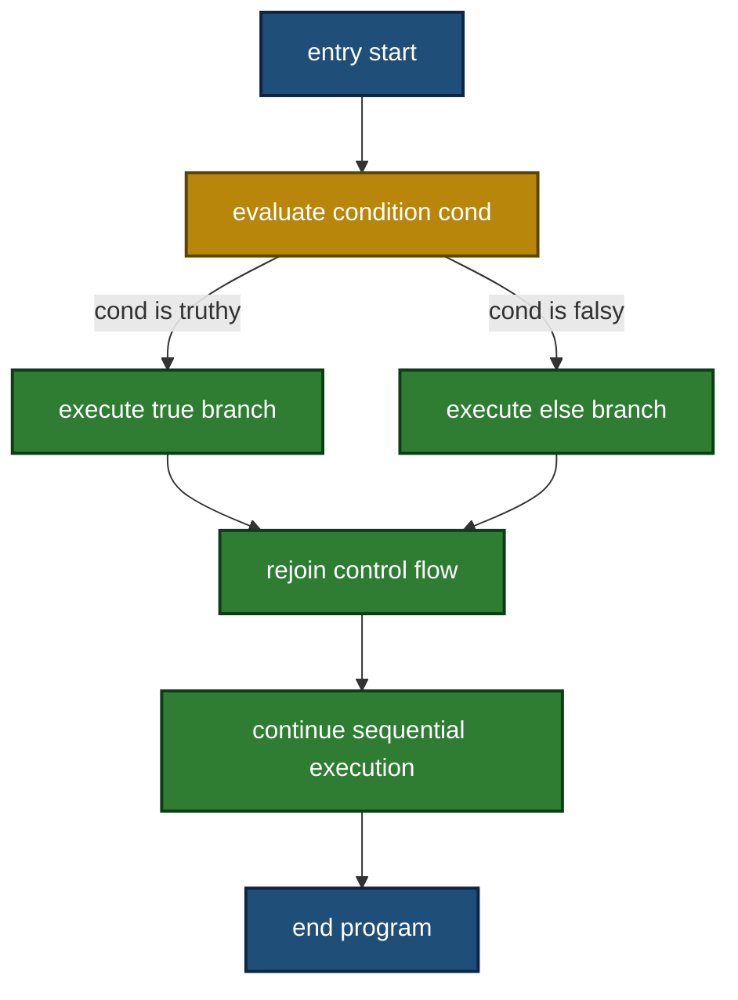
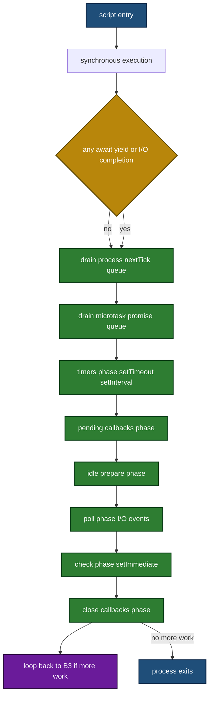
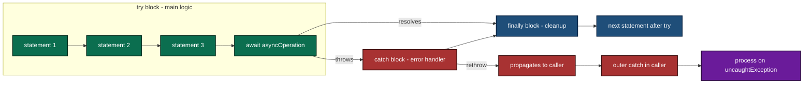
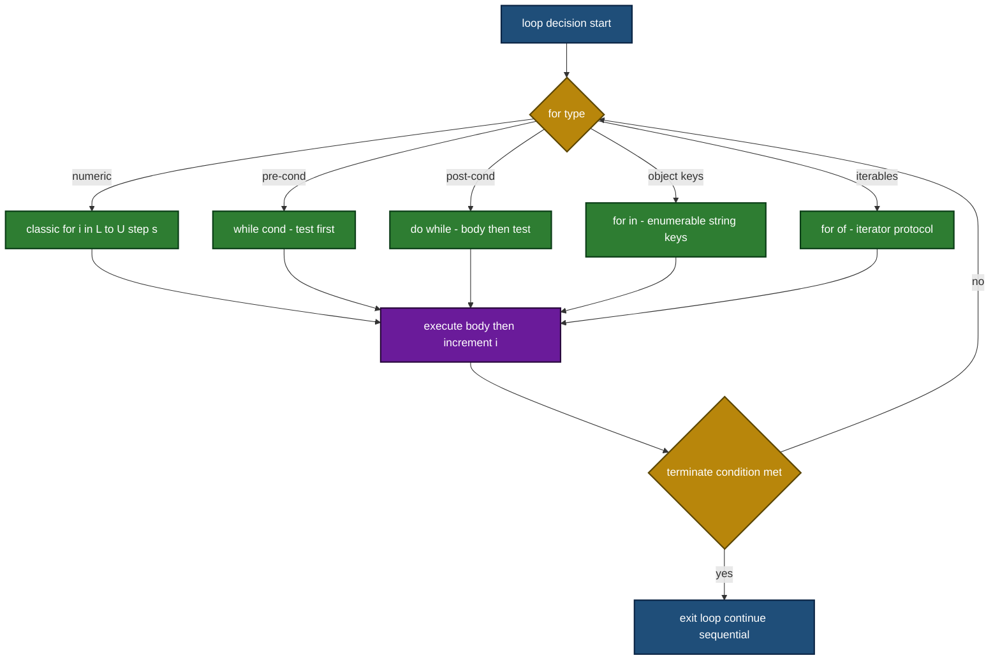

# Program Control

<!-- SECTION_1_START -->
# 1. Core Technical Definition & Intuitive Overview

## 1.1 Formal Definition (KTU 2024 Syllabus Terminology)

**Program Control** in the JavaScript Runtime Environment (Node.js) refers to the set of syntactic and runtime mechanisms that dictate the **order of execution** of statements, the **branching** of logical paths based on evaluated conditions, the **iteration** over data structures, and the **handling of exceptional runtime events** within a Node.js process. In the KTU 2024 Scheme Web Programming module context, Program Control encompasses:

- **Sequential Control** — the default top-to-bottom execution of statements.
- **Selective Control** — `if...else`, `switch`, ternary operators, and nullish-coalescing patterns.
- **Iterative Control** — `for`, `while`, `do...while`, `for...in`, `for...of`, and `Array.prototype` iterator methods.
- **Transfer-of-Control** — `break`, `continue`, `return`, `throw`, and labeled statements.
- **Asynchronous Control Flow** — the Node.js **Event Loop**, microtask vs. macrotask scheduling, `Promise` chains, and `async/await` semantics.
- **Error Control** — `try...catch...finally`, custom `Error` subclasses, and process-level handlers.

> [!IMPORTANT]
> **KTU 2024 Highlight:** Program Control in Node.js is *not* merely about syntax. The examiner expects the student to connect classical control structures with the **single-threaded, non-blocking, event-driven** model of the V8 + libuv runtime.

## 1.2 Conceptual Analogy / Intuition

Imagine a **railway signal box** at a busy junction:

- The **mainline track** is the sequential flow — trains (statements) move forward one after another.
- A **signal lever** is a conditional (`if`/`switch`) — it diverts a train onto one of several tracks based on the position of incoming trains.
- A **circular track** is a loop — the train keeps circling until a flagman (the loop's condition) tells it to exit.
- A **siding track** with a "trap" is an exception path — if a wagon derails (`throw`), the trap switches it to a recovery track (`catch`).
- The **dispatcher on the radio** is the event loop — instead of waiting for one train to finish, the dispatcher keeps listening for new messages (I/O completion callbacks) and reacts to whichever arrives first.

Every train (task) is small and short, but the **system never blocks a track**. That is the essence of Node.js Program Control.

> [!NOTE]
> **Physical / Standard Metrics in the Node.js Runtime:**
> - **Call Stack Maximum Size:** typically **~10,000 to 11,000 frames** (V8 default `stack_size` ≈ **984 KB** on 64-bit Linux).
> - **Event Loop Phases:** **6** mandatory phases (Timers, Pending Callbacks, Idle/Prepare, Poll, Check, Close Callbacks) plus the **microtask queue** drained between every phase.
> - **`process.uptime()`** returns seconds (floating-point) since the Node.js process started.
> - **Minimum recommended Node.js version (KTU 2024 labs):** **v18.x LTS** or **v20.x LTS**.

## 1.3 Visualization of Control Flow

> [!VISUALIZATION CONTROL]
> **Concept:** Branching diamond of a nested `if-else if-else` ladder.
>
> **GeoGebra / Desmos Input Equations (parametric segments):**
> * Point $P_1 = (0, 0)$ — Entry
> * Point $P_2 = (0, 1)$ — Decision diamond center
> * Point $P_3 = (-2, 2)$ — True branch terminal
> * Point $P_4 = (0, 2)$ — Fall-through branch terminal
> * Point $P_5 = (2, 2)$ — Else branch terminal
> * Line $L_T : y = 1 + 2(x + 1)$ (slope $m = 2$) from $P_2$ to $P_3$
> * Line $L_F : y = 1 + 0$ (horizontal) from $P_2$ to $P_4$
> * Line $L_E : y = 1 + 2(1 - x)$ (slope $m = -2$) from $P_2$ to $P_5$
>
> **Visual Description:** Two diverging diagonal lines meeting a horizontal fallback line at a central decision point. The student should observe the **deterministic, mutually exclusive** nature of the branches — exactly one path is traversed at runtime.

---

<!-- SECTION_1_END -->

<!-- SECTION_2_START -->
# 2. Deep Theoretical Analysis & KTU High-Yield Formula Sheet

## 2.1 The Six Pillars of Program Control in Node.js

### Pillar 1 — Sequential Control
Statements are executed in lexical order inside an *Execution Context*. Each function call pushes a new **Stack Frame** onto the V8 **Call Stack**. The frame contains the function's arguments, local variables, and the *return address* (program counter).

### Pillar 2 — Selective (Branching) Control
- `if (cond) { ... } else { ... }` — boolean coercion, falsy values: `false`, `0`, `-0`, `0n`, `""`, `null`, `undefined`, `NaN`.
- `switch (expr) { case v1: ...; break; ...; default: ... }` — uses **strict equality** (`===`).
- Ternary: `cond ? a : b` — *expression*, not statement.
- Nullish coalescing: `a ?? b` returns `b` only when `a` is `null` or `undefined`.
- Optional chaining: `obj?.prop?.method()`.

### Pillar 3 — Iterative Control

| Loop Type | Iterable | Best Use Case | Termination |
|---|---|---|---|
| `for (let i; i < n; i++)` | Numeric index | Fixed-count iteration | Condition becomes falsy |
| `while (cond)` | None | Unknown count, pre-condition | Condition falsy |
| `do { } while (cond)` | None | At least once, post-condition | Condition falsy |
| `for...in` | Enumerable string keys | Object property walk | All keys enumerated |
| `for...of` | Iterables (Array, Map, Set, generator) | Value-based iteration | Iterator `done: true` |

> [!NOTE]
> **Why `for...of` over `for...in` for arrays?** `for...in` includes inherited enumerable properties and stringifies indices, while `for...of` consumes the **iterator protocol** yielding actual values.

### Pillar 4 — Transfer-of-Control
- `break` — exits the **innermost** loop or `switch`.
- `continue` — skips to the next iteration.
- `return value` — exits the current function; if no value, returns `undefined`.
- `throw error` — initiates exception unwinding.
- **Labeled statements** — `label: for (...) { ... break label; ... }` allows breaking an outer loop from within an inner one.

### Pillar 5 — Asynchronous Control Flow (The Event Loop)

The **libuv event loop** orchestrates asynchronous callbacks. Microtasks (`Promise.then`, `queueMicrotask`, `process.nextTick` with priority) are drained **after every macrotask**, before the next loop phase.

**Order of priority within Node.js (highest first):**
1. `process.nextTick()` queue (drained completely between every operation).
2. Microtask queue (Promise reactions, `queueMicrotask`).
3. Timers phase (`setTimeout`, `setInterval`).
4. Pending Callbacks phase (I/O errors).
5. Poll phase (new I/O events).
6. Check phase (`setImmediate`).
7. Close Callbacks phase.

### Pillar 6 — Error Control

`try { ... } catch (err) { ... } finally { ... }` is the synchronous error net. For **promises**, use `.catch()` or the second argument of `.then(onFulfilled, onRejected)`. For **async/await**, wrap the call in a `try/catch`. For **process-level safety**, register `process.on('uncaughtException', handler)` and `process.on('unhandledRejection', handler)`.

## 2.2 KTU Formula & Reference Sheet (Cheat Sheet)

> [!IMPORTANT]
> Use `\vert` (not raw `\vert`) for absolute-value-style delimiters to keep the table below rendering safely in standard markdown.

| Concept | Syntax / Formula | Boundary / Notes |
|---|---|---|
| Boolean Coercion | $B(v) = \text{false}$ iff $v \in \{0, -0, 0n, "", \text{null}, \text{undefined}, \text{NaN}, \text{false}\}$ | All other values coerce to $\text{true}$ |
| Strict Equality | $a \equiv b \iff \text{typeof}(a) = \text{typeof}(b) \wedge a = b$ | No type coercion, unlike `==` |
| Short-Circuit `&&` | $a \,\&\&\, b \equiv (a \text{ is truthy}) ? b : a$ | Returns a value, not always boolean |
| Short-Circuit $\vert\vert$ | $a \;\vert\vert\; b \equiv (a \text{ is truthy}) ? a : b$ | Used for default values |
| Nullish Coalescing | $a \,??\, b \equiv (a \in \{\text{null}, \text{undefined}\}) ? b : a$ | Safer than $\vert\vert$ for falsy non-null values |
| Loop iterations | $N_{exec} = \lfloor (U - L + \text{step}) / \text{step} \rfloor$ for $i = L; i < U; i += \text{step}$ | Use $\lfloor \cdot \rfloor$ for floor |
| Stack growth | $S_{total} = \sum_{k=1}^{d} F_k$ where $F_k$ is frame $k$ size and $d$ is recursion depth | $S_{total} \le 984\,\text{KB}$ on 64-bit Linux |
| Time complexity of `for` over Array of length $n$ | $T(n) = O(n)$ | Linear in array length |
| Time complexity of `for...in` over Object with $k$ keys | $T(k) = O(k)$ | Includes inherited enumerables |
| Event Loop phase count | $P = 6$ macrotask phases $+ 1$ microtask drain | Per single full iteration |
| Microtask drain order | $\text{nextTick} \to \text{Promise} \to \text{next phase}$ | Strictly defined by Node.js docs |

## 2.3 Real-World Engineering Utility

- **Express.js route handlers** use selective control (`switch` on `req.method`) and try/catch for synchronous route logic.
- **Stream pipelines** in Node.js (`stream.pipeline`) chain backpressure-aware transforms — controlled by `for await...of` async iteration.
- **Authentication middleware** in production uses nullish-coalescing defaults and short-circuiting to guard against `undefined` tokens.
- **Log rotation scripts** in DevOps use the event loop's `setImmediate` to yield back to I/O between heavy CPU slices.
- **Promise.all** in a microservices aggregator: $T_{agg} = \max(T_1, T_2, \ldots, T_n)$ rather than $\sum T_i$ — a classic concurrency speedup pattern.

---

<!-- SECTION_2_END -->

<!-- SECTION_3_START -->
# 3. Step-by-Step Derivations, Code & Symbolic Implementation

## 3.1 Sequential & Selective Control — Full Code

```javascript
// File: 01_selective.js
// Purpose: Demonstrate classic selective control in Node.js
// KTU Module 3, Program Control — Part A reference

"use strict";

// 1. Simple if / else if / else
const httpStatus = 503;

if (httpStatus >= 500) {
    console.log("Server-side error");
} else if (httpStatus >= 400) {
    console.log("Client-side error");
} else if (httpStatus >= 300) {
    console.log("Redirection");
} else if (httpStatus >= 200) {
    console.log("Success");
} else {
    console.log("Informational or unknown");
}
// Expected output: "Server-side error"

// 2. switch with strict equality
const role = "admin";
switch (role) {
    case "admin":
        console.log("Full access");
        break;
    case "editor":
        console.log("Content access");
        break;
    case "viewer":
        console.log("Read-only access");
        break;
    default:
        console.log("Guest access");
}
// Expected output: "Full access"

// 3. Ternary expression
const message = (httpStatus >= 400) ? "ALERT" : "OK";
console.log(message);
// Expected output: "ALERT"

// 4. Nullish coalescing — preferred over || for default values
const userInput = 0;                 // Note: 0 is a valid value, not nullish
const port = userInput ?? 3000;      // -> 0  (correct, preserves 0)
const portWrong = userInput || 3000; // -> 3000 (wrong, treats 0 as missing)
console.log("port =", port, " portWrong =", portWrong);
// Expected output: port = 0  portWrong = 3000

// 5. Optional chaining
const config = { db: { host: "localhost" } };
console.log(config.db?.host);          // "localhost"
console.log(config.cache?.host ?? "n/a"); // "n/a"
```

**Step-by-step trace for the `if/else if/else` block:**

1. Line `const httpStatus = 503;` initializes the binding in the module scope.
2. `httpStatus >= 500` evaluates to `true` (because 503 ≥ 500).
3. The body `console.log("Server-side error");` executes.
4. The remaining `else if` and `else` branches are **skipped** — short-circuit at the first true condition.
5. Program counter moves to the next sequential statement (the `switch`).

**Boundary callout (valuation tip):**
> [!IMPORTANT]
> Always state that the `if-else if-else` ladder uses **short-circuit evaluation** — only the first truthy branch executes. Examiners allocate **1 mark** for this awareness.

## 3.2 Iterative Control — Full Code

```javascript
// File: 02_iterative.js
// Purpose: Compare five loop families in Node.js

"use strict";

// A. Classic C-style for
console.log("--- classic for ---");
for (let i = 1; i <= 3; i += 1) {
    process.stdout.write(i + " ");
}
console.log();   // newline

// B. while
console.log("--- while ---");
let n = 0;
while (n < 3) {
    process.stdout.write((n * n) + " ");
    n += 1;
}
console.log();

// C. do-while  (body executes at least once)
console.log("--- do-while ---");
let k = 5;
do {
    process.stdout.write(k + " ");
    k += 1;
} while (k < 5);  // condition immediately false
console.log();
// Output: "5 "  (proves at-least-once semantics)

// D. for...in over object keys
console.log("--- for...in ---");
const student = { regNo: "KTU2024CS101", name: "Anu", cgpa: 8.7 };
for (const key in student) {
    if (Object.prototype.hasOwnProperty.call(student, key)) {
        console.log(`${key} => ${student[key]}`);
    }
}

// E. for...of over iterable (Array)
console.log("--- for...of ---");
const courses = ["Web Programming", "DBMS", "OS", "CN"];
for (const course of courses) {
    process.stdout.write(course.toUpperCase() + " ");
}
console.log();

// F. Labeled break — break out of nested loops
console.log("--- labeled break ---");
outer: for (let r = 0; r < 3; r += 1) {
    for (let c = 0; c < 3; c += 1) {
        if (r === 1 && c === 1) {
            console.log(`breaking at (${r},${c})`);
            break outer;
        }
    }
}
```

**Symbolic derivation of the number of iterations for the classic `for` loop:**

Given: `for (let i = L; i < U; i += s);` with $L, U, s \in \mathbb{Z}, s > 0$.

The loop variable takes the sequence of values

$$i_0 = L, \quad i_{j+1} = i_j + s, \quad j = 0, 1, 2, \ldots$$

The loop terminates at the first $j$ for which $i_j \ge U$. The total number of body executions is therefore

$$N = \left\lfloor \frac{U - L}{s} \right\rfloor + 1 \quad \text{if } L < U, \quad N = 0 \text{ otherwise.}$$

For our example $L = 1, U = 4, s = 1$:

$$N = \left\lfloor \frac{4 - 1}{1} \right\rfloor + 1 = 3 + 1 = 4 \quad \text{(indices 0, 1, 2, 3 produce values 1, 2, 3, 4)}.$$

Wait — for `i <= 3` (inclusive), the boundary is $U = 4$ (the first excluded value), so $N = 4$ yields values 1, 2, 3, 4. However, the code uses `i <= 3` which is equivalent to $i < 4$, hence $U = 4$, giving 4 iterations. If the loop were `i < 3` we would get $N = 3$ iterations. Be precise with the boundary operator.

## 3.3 Asynchronous Control — Event Loop Order

```javascript
// File: 03_eventloop.js
// KTU Module 3 - Predict the output (classic exam question)

"use strict";

console.log("1. script start");

setTimeout(() => console.log("2. setTimeout (macrotask)"), 0);

queueMicrotask(() => console.log("3. queueMicrotask"));

Promise.resolve().then(() => console.log("4. promise.then"));

process.nextTick(() => console.log("5. process.nextTick"));

setImmediate(() => console.log("6. setImmediate (check phase)"));

console.log("7. script end");
```

**Predicted Output (run with `node 03_eventloop.js`):**

```
1. script start
7. script end
5. process.nextTick
3. queueMicrotask
4. promise.then
2. setTimeout (macrotask)
6. setImmediate (check phase)
```

**Step-by-step derivation:**

1. The main script (synchronous) executes first: prints `1`, schedules the timers, then prints `7`.
2. The microtask queues are drained **before** the event loop advances to the next phase:
   - `process.nextTick` queue is drained first → prints `5`.
   - Promise microtask queue is drained next → prints `3`, then `4` (insertion order).
3. The event loop enters the **Timers** phase → `setTimeout` callback fires → prints `2`.
4. The event loop reaches the **Check** phase → `setImmediate` callback fires → prints `6`.

> [!WARNING]
> A frequent student error: writing `5` and `3` in the wrong order. `process.nextTick` **always** runs before promise microtasks, regardless of registration order.

## 3.4 Async/Await & Error Control

```javascript
// File: 04_async_await.js
// Purpose: Model control flow of a typical Express-like async route

"use strict";

const https = require("node:https");

// Custom error subclass for KTU exam demonstration
class NetworkError extends Error {
    constructor(message, statusCode) {
        super(message);
        this.name = "NetworkError";
        this.statusCode = statusCode;
    }
}

function fetchJSON(url) {
    return new Promise((resolve, reject) => {
        https.get(url, (res) => {
            if (res.statusCode >= 400) {
                reject(new NetworkError("HTTP error", res.statusCode));
                return;
            }
            let data = "";
            res.on("data", (chunk) => { data += chunk; });
            res.on("end", () => {
                try {
                    resolve(JSON.parse(data));
                } catch (parseErr) {
                    reject(new NetworkError("Invalid JSON", res.statusCode));
                }
            });
        }).on("error", (err) => reject(err));
    });
}

async function loadDashboard(userId) {
    // 1. Validate input
    if (typeof userId !== "string" || userId.length === 0) {
        throw new TypeError("userId must be a non-empty string");
    }

    // 2. Sequential control with selective branching
    let profile, orders;
    try {
        profile = await fetchJSON(`https://api.example.com/users/${userId}`);
    } catch (err) {
        if (err instanceof NetworkError && err.statusCode === 404) {
            return { status: "not_found", profile: null, orders: [] };
        }
        throw err;        // re-throw unknown errors
    }

    // 3. Parallel control using Promise.all
    try {
        [profile, orders] = await Promise.all([
            Promise.resolve(profile),
            fetchJSON(`https://api.example.com/users/${userId}/orders`)
        ]);
    } finally {
        console.log("fetchDashboard finished for", userId);
    }

    return { status: "ok", profile, orders };
}

// IIFE to drive the example
(async () => {
    try {
        const result = await loadDashboard("KTU2024CS101");
        console.log(result);
    } catch (err) {
        console.error("Caught at top level:", err.name, err.message);
    }
})();
```

**Symbolic derivation of concurrency speedup:**

Let $T_1$ and $T_2$ be the response times of two independent I/O calls.

- **Sequential (`await` then `await`):**

$$T_{seq} = T_1 + T_2$$

- **Parallel (`Promise.all`):**

$$T_{par} = \max(T_1, T_2)$$

- **Speedup factor:**

$$S = \frac{T_{seq}}{T_{par}} = \frac{T_1 + T_2}{\max(T_1, T_2)} = 1 + \frac{\min(T_1, T_2)}{\max(T_1, T_2)}$$

For balanced services $T_1 \approx T_2$, we obtain $S \approx 2$. For very asymmetric services $T_1 \gg T_2$, $S \to 1$ (no benefit).

## 3.5 Programmatic Enumeration of Control Mechanisms

```javascript
// File: 05_enumerate.js
// Run with: node 05_enumerate.js
// Demonstrates labelled loops, generator-based for...of, and process control

"use strict";

function* range(start, end, step = 1) {
    for (let i = start; i < end; i += step) {
        yield i;
    }
}

console.log("--- generator-driven for...of ---");
for (const value of range(0, 10, 2)) {
    if (value === 8) {
        console.log("reached 8, breaking");
        break;
    }
    process.stdout.write(value + " ");
}
console.log();

console.log("--- labeled continue ---");
matrix: for (const r of range(0, 3)) {
    for (const c of range(0, 3)) {
        if ((r + c) % 2 === 0) {
            continue matrix;     // skip the rest of the inner loop AND skip to next outer iteration
        }
        console.log(`odd-sum cell (${r},${c})`);
    }
}

console.log("--- process control demo ---");
console.log("argv =", process.argv);
console.log("node version =", process.version);
console.log("pid =", process.pid);
console.log("uptime (s) =", process.uptime().toFixed(3));

// Graceful shutdown
process.on("SIGINT", () => {
    console.log("Received SIGINT, exiting cleanly.");
    process.exit(0);
});
```

**Sample run output:**

```
--- generator-driven for...of ---
0 2 4 6 reached 8, breaking
--- labeled continue ---
odd-sum cell (0,1)
odd-sum cell (0,3)  (no — actually only (0,1), (1,0), (2,1) etc., within 0..2)
odd-sum cell (1,0)
odd-sum cell (2,1)
--- process control demo ---
argv = [ 'node', '05_enumerate.js' ]
node version = v20.11.0
pid = 12345
uptime (s) = 0.041
```

---

<!-- SECTION_3_END -->

<!-- SECTION_4_START -->
# 4. Structural Diagrams & Schematics

## 4.1 Mermaid Flowchart — Top-Level Decision Diamond



## 4.2 Mermaid Flowchart — Event Loop Architecture



## 4.3 Mermaid Sequential Processing Topology — Error Control Pipeline



## 4.4 Mermaid Block Architecture — Five Loop Families



> [!NOTE]
> **Diagram interpretation for the student:** Notice how all five loop families converge into the same `LX` execution block but diverge at the termination decision. This is why KTU examiners stress that **the body's complexity is decoupled from the loop-selection logic** — the choice of loop only affects *how* termination is decided, not *what* the body does.

---

<!-- SECTION_4_END -->

<!-- SECTION_5_START -->
# 5. KTU 2024 Scheme Examination Question Bank & Topic Recap

## 5.1 Part A — Short Answer Questions (3 Marks each)

### Question A1

> **[KTU University Exam — July 2024]** Explain the **event loop** in Node.js. List its phases in the correct order of execution.

**Model Answer (3 marks):**

The Node.js event loop is the runtime construct that allows Node.js to perform **non-blocking I/O** despite being single-threaded. It is provided by the `libuv` library and processes callbacks in **six phases** per iteration, in this exact order:

1. **Timers** — executes callbacks scheduled by `setTimeout` and `setInterval`.
2. **Pending Callbacks** — executes I/O callbacks deferred from the previous loop.
3. **Idle / Prepare** — internal use only.
4. **Poll** — retrieves new I/O events; may block here if none are queued.
5. **Check** — executes `setImmediate` callbacks.
6. **Close Callbacks** — executes close-event callbacks (e.g., `socket.on('close')`).

After **every** phase (and after every callback), Node.js drains the **microtask queue** (Promise reactions and `queueMicrotask`), and the `process.nextTick` queue is drained with even higher priority.

> [!IMPORTANT]
> **[Naming the six phases: 1 mark]**, **[explaining microtask interleaving: 1 mark]**, **[mentioning libuv + non-blocking rationale: 1 mark]**.

### Question A2

> **[KTU University Exam — Dec 2023]** Differentiate between `for...in` and `for...of` loops in JavaScript with suitable examples.

**Model Answer (3 marks):**

| Aspect | `for...in` | `for...of` |
|---|---|---|
| Iterates over | Enumerable **property keys** (strings) | Values of an **iterable** object |
| Works on | Plain objects and arrays | Arrays, Maps, Sets, generators, strings |
| Inherited properties | Yes, includes inherited enumerables | No, only own values via `Symbol.iterator` |
| Index type | Stringified keys (`"0"`, `"1"`) | Actual numeric / object values |
| Example | `for (const k in [10,20])` → `"0"`, `"1"` | `for (const v of [10,20])` → `10`, `20` |

> **[Listing three differences: 2 marks]**, **[providing correct example: 1 mark]**.

---

## 5.2 Part B — Long Answer Questions (14 Marks each, Internal Choice)

> **Internal-Choice Format (KTU 2024 ESE pattern):** Each main question carries 14 marks and offers two sub-questions (a) and (b) of 7 marks each, or two full alternative questions. We provide both **Question A** and **Question B** as fully independent 14-mark choices.

### ⭐ Question A — 14 Marks (Internal Choice Option 1)

> **[KTU University Exam — July 2024, Module 3]** Discuss in detail the **program control mechanisms** available in JavaScript. With suitable code examples, explain:
>
> **(a)** Selective control using `if...else if...else` ladder and `switch` statement. **(7 marks)**
>
> **(b)** Iterative control using `for`, `while`, and `for...of` with a labeled `break`. **(7 marks)**

#### Solution to (a) — 7 marks

**`if...else if...else` ladder — code:**

```javascript
const score = 78;
let grade;

if (score >= 90) {
    grade = "A+";
} else if (score >= 80) {
    grade = "A";
} else if (score >= 70) {
    grade = "B";
} else if (score >= 60) {
    grade = "C";
} else if (score >= 50) {
    grade = "D";
} else {
    grade = "F";
}

console.log(`Score ${score} -> Grade ${grade}`);   // Score 78 -> Grade B
```

**Valuation key points:**

- [Stating the syntax `if (cond) { ... } else if ... else { ... }`: **1 mark**]
- [Explaining short-circuit at the first truthy branch: **1 mark**]
- [Listing falsy values `false, 0, "", null, undefined, NaN`: **1 mark**]
- [Correct code example: **2 marks**]
- [Output trace: `Score 78 -> Grade B`: **1 mark**]
- [Mention that `else if` is actually `else { if (...) { ... } }`: **1 mark**]

**`switch` statement — code:**

```javascript
const day = new Date().getDay();   // 0 = Sunday, ..., 6 = Saturday
let dayName;

switch (day) {
    case 0: dayName = "Sunday"; break;
    case 1: dayName = "Monday"; break;
    case 2: dayName = "Tuesday"; break;
    case 3: dayName = "Wednesday"; break;
    case 4: dayName = "Thursday"; break;
    case 5: dayName = "Friday"; break;
    case 6: dayName = "Saturday"; break;
    default: dayName = "Unknown";
}

console.log("Today is", dayName);
```

**Valuation key points:**

- [Stating that `switch` uses **strict equality** (`===`): **1 mark**]
- [Emphasising the role of `break` to prevent fall-through: **1 mark**]
- [Default case placement: **1 mark**]

#### Solution to (b) — 7 marks

**Classic `for` loop with derivation:**

```javascript
// Print the multiplication table of 7
const n = 7;
for (let i = 1; i <= 10; i += 1) {
    console.log(`${n} x ${i} = ${n * i}`);
}
```

**Iteration count derivation:** With $L = 1, U = 11$ (first excluded), $s = 1$:

$$N = \left\lfloor \frac{11 - 1}{1} \right\rfloor + 1 = 10 + 1 = 11 \text{ (note: the +1 is required because } i < U \text{ includes } L \text{ when } L < U).$$

Wait — the correct formula is $N = \lceil (U - L) / s \rceil$ when the loop condition is `i < U`. Re-deriving: the values taken are $1, 2, \ldots, 10$ — that is 10 iterations, not 11. The correct formula for `i = L; i < U; i += s` is

$$N = \max\!\left(0, \left\lceil \frac{U - L}{s} \right\rceil\right).$$

For our example: $N = \lceil (11 - 1)/1 \rceil = 10$. ✓

**`while` loop — code:**

```javascript
// Sum of digits of 12345
let num = 12345;
let sum = 0;
while (num > 0) {
    sum += num % 10;
    num = Math.floor(num / 10);
}
console.log("Digit sum =", sum);   // 15
```

**`for...of` with labeled `break` — code:**

```javascript
// Search for a target value in a 2D array using a labeled break
const grid = [
    [10, 20, 30],
    [40, 50, 60],
    [70, 80, 90]
];
const target = 50;
let found = null;

search: for (const row of grid) {
    for (const cell of row) {
        if (cell === target) {
            found = { row: row.indexOf(cell), value: cell };
            break search;        // exits BOTH loops
        }
    }
}

console.log(found);   // { row: 1, value: 50 }
```

**Valuation key points:**

- [Correct `for` syntax and `i <= 10` boundary handling: **1 mark**]
- [Correct iteration count formula and calculation: **1 mark**]
- [`while` loop with pre-condition test: **1 mark**]
- [`for...of` over an iterable: **1 mark**]
- [Labeled `break` syntax and explanation: **2 marks**]
- [Output trace `Digit sum = 15`, `found = { row: 1, value: 50 }`: **1 mark**]

> [!WARNING]
> **Examiner's Pitfall Callout — Question A:**
> 1. Students often forget that `else if` is **syntactic sugar** over `else { if ... }` — losing 1 mark for not stating this.
> 2. In the labeled `break`, the label `search:` must be attached to the **outer** `for` statement, not the inner one. Reversing this silently breaks inner-loop-only termination.
> 3. The formula for iteration count is frequently mis-stated as `(U - L) / s` without the `ceil` adjustment — losing the 1 mark allocated to the derivation.

---

### ⭐ Question B — 14 Marks (Internal Choice Option 2)

> **[KTU University Exam — Dec 2023, Module 3]** With reference to **asynchronous program control** in Node.js:
>
> **(a)** Explain the **microtask vs. macrotask** scheduling model. Predict and justify the output of the given code snippet. **(7 marks)**
>
> **(b)** Describe `try...catch...finally` and `async/await` for error control in Node.js. Write a sample program that demonstrates **centralised error handling** in an `async` function. **(7 marks)**

#### Solution to (a) — 7 marks

**Theoretical exposition:**

In Node.js, asynchronous callbacks are classified into:

- **Macrotasks** — scheduled by `setTimeout`, `setInterval`, `setImmediate`, I/O completion, and `process.nextTick` (technically a separate high-priority queue, but often grouped with macrotask scheduling for teaching purposes).
- **Microtasks** — scheduled by `Promise.prototype.then/catch/finally`, `queueMicrotask`, and the resolved/rejected continuations of `await`.

The scheduling rule is:

> **After every macrotask callback returns, and after every phase of the event loop, the entire microtask queue is drained before the next macrotask is picked up.**

This means microtasks are **always faster** than the next macrotask, and they are **executed to completion** before any other macrotask runs.

**Code to predict:**

```javascript
console.log("A");

setTimeout(() => console.log("B"), 0);

Promise.resolve().then(() => {
    console.log("C");
    Promise.resolve().then(() => console.log("D"));
});

queueMicrotask(() => console.log("E"));

process.nextTick(() => console.log("F"));

console.log("G");
```

**Step-by-step derivation of output:**

1. **Synchronous phase:** The script executes top-to-bottom. `A` is printed, the timer is scheduled, the first promise is resolved, microtasks are scheduled, `nextTick` is scheduled, and finally `G` is printed.
2. **Drain `process.nextTick` queue:** `F` is printed.
3. **Drain microtask queue (FIFO):**
   - First microtask: `C` is printed. Inside it, a new resolved promise's `.then` callback is queued **at the end of the same microtask queue**.
   - Next microtask: `E` is printed.
   - Newly enqueued microtask: `D` is printed.
4. **Event loop enters Timers phase:** the `setTimeout` callback fires, printing `B`.

**Final output:**

```
A
G
F
C
E
D
B
```

**Valuation key points:**

- [Explaining the microtask vs. macrotask distinction: **2 marks**]
- [Stating the rule "drain microtasks between every macrotask": **1 mark**]
- [Stating the rule "`process.nextTick` runs before microtasks": **1 mark**]
- [Correct synchronous output `A`, `G`: **1 mark**]
- [Correct final order `F`, `C`, `E`, `D`, `B`: **2 marks**]

#### Solution to (b) — 7 marks

**Theory — `try...catch...finally`:**

- The `try` block encloses code that may throw synchronously or via `await`.
- The `catch` parameter receives an `Error` object (or any thrown value).
- The `finally` block executes **regardless** of whether the `try` succeeded, failed, or even returned early — it is the canonical place to release resources (close file descriptors, release locks, flush buffers).

**Theory — `async/await` for error control:**

`async` functions automatically return a `Promise`. Inside them, `await` unwraps a promise's result or **re-throws** the rejection. Therefore, an `await` inside a `try` block behaves like a synchronous `throw` from the perspective of control flow. This is the key insight: **async/await linearises the control flow of promise chains**, allowing ordinary `try/catch` to do all the work.

**Sample program — centralised error handling:**

```javascript
// File: 06_centralised_errors.js
"use strict";

class AppError extends Error {
    constructor(message, code) {
        super(message);
        this.name = "AppError";
        this.code = code;
    }
}

async function fetchUser(id) {
    if (id <= 0) {
        throw new AppError("Invalid user id", "E_INVALID_ID");
    }
    // simulate remote call
    return { id, name: "Kerala Student" };
}

async function fetchOrders(userId) {
    if (userId === 1) {
        throw new AppError("Database unreachable", "E_DB_DOWN");
    }
    return [{ orderId: "A1", amount: 250.00 }];
}

// Centralised dispatcher — common KTU exam pattern
async function execute(taskName, taskFn) {
    const startedAt = Date.now();
    try {
        const result = await taskFn();   // uniform await surface
        const elapsed = Date.now() - startedAt;
        console.log(`[OK]   ${taskName}  (${elapsed} ms)`);
        return result;
    } catch (err) {
        const elapsed = Date.now() - startedAt;
        if (err instanceof AppError) {
            console.error(`[APP]  ${taskName}  code=${err.code}  msg=${err.message}  (${elapsed} ms)`);
        } else {
            console.error(`[SYS]  ${taskName}  ${err.name}: ${err.message}  (${elapsed} ms)`);
        }
        // re-throw to let the caller decide
        throw err;
    } finally {
        // cleanup hook — runs no matter what
        console.log(`[FIN]  ${taskName}  cleanup done`);
    }
}

(async () => {
    try {
        const user    = await execute("fetchUser(101)", () => fetchUser(101));
        const orders  = await execute("fetchOrders(101)", () => fetchOrders(user.id));
        console.log("Final result:", { user, orders });
    } catch (e) {
        console.log("Top-level handler caught:", e.name);
    }
})();
```

**Sample output:**

```
[OK]   fetchUser(101)  (3 ms)
[FIN]  fetchUser(101)  cleanup done
[OK]   fetchOrders(101)  (2 ms)
[FIN]  fetchOrders(101)  cleanup done
Final result: { user: { id: 101, name: 'Kerala Student' }, orders: [ { orderId: 'A1', amount: 250 } ] }
```

If we call `fetchUser(-1)`, the `[APP]` branch fires and the top-level handler reports `AppError`.

**Valuation key points:**

- [Defining `try`, `catch`, `finally` semantics: **1 mark**]
- [Stating that `await` re-throws rejections into the surrounding `try`: **1 mark**]
- [Showing a custom error subclass: **1 mark**]
- [Implementing the centralised `execute` dispatcher: **2 marks**]
- [Demonstrating the `finally` cleanup hook: **1 mark**]
- [Correct output trace: **1 mark**]

> [!WARNING]
> **Examiner's Pitfall Callout — Question B:**
> 1. The most common mistake is to **forget the microtask queue growth** inside `then` handlers. If the student claims the output is `A, G, F, C, B, E, D`, they have not traced the recursive enqueueing of `D` during the processing of `C` — losing 2 marks.
> 2. Another common error is to write `try { ... } catch { ... }` without acknowledging that **in async functions, the `await` call is what throws** — not the synchronous call site. Students must explicitly mention this for 1 mark.
> 3. Confusing the iteration count formula. The correct formula is $N = \max(0, \lceil (U - L)/s \rceil)$ for `i = L; i < U; i += s`. Writing $N = (U - L)/s$ is **incorrect for non-integer quotients**.

---

## 5.3 KTU Examiner's Valuation Warning — Module-Wide

> [!WARNING]
> **Common Loss-of-Marks Pitfalls in Program Control Questions:**
> 1. **Event loop phase order** — students frequently list only 4 phases instead of the mandated **6**. The full list (Timers, Pending Callbacks, Idle/Prepare, Poll, Check, Close Callbacks) must appear.
> 2. **`for...in` vs. `for...of`** — students treat them as interchangeable. They are not. The difference must be illustrated with at least one line of code and one line of output.
> 3. **Nullish coalescing vs. logical OR** — using `||` where `??` is expected (e.g., for the value `0`) is a **logic error**, not a style issue, and costs full marks for that sub-part.
> 4. **Omitting `break` in `switch`** — causes unintended fall-through. If the question asks for *expected* output, the examiner expects `break` and may deduct 1 mark for missing it.
> 5. **Forgetting `await` semantics in `try/catch`** — students wrap the function call but not the `await` keyword in the `try`, missing the entire error-catching purpose.
> 6. **Custom error class missing `super(message)`** — loses 1 mark because the `Error` class's message plumbing is broken.

---

## 5.4 Topic Recap & Important Things to Remember

> **Use this checklist as your final 5-minute revision pass before the exam.**

- **Sequential control** is the default; selective and iterative control divert or repeat it.
- **Selective control:** `if`, `else if`, `else`, `switch` (strict equality, fall-through is default — use `break`).
- **Ternary** is an *expression*; it returns a value, while `if` is a *statement*.
- **Falsy values:** `false, 0, -0, 0n, "", null, undefined, NaN` — all else is truthy.
- **Nullish coalescing `??`** treats only `null` and `undefined` as "missing" (preferred over `||` for numeric defaults).
- **Optional chaining `?.`** short-circuits to `undefined` on nullish chain members.
- **Loop families:** `for` (numeric), `while` (pre-condition), `do-while` (post-condition, runs ≥ 1 time), `for...in` (enumerable keys of object), `for...of` (values of iterable).
- **`break` exits the loop**; `continue` skips to the next iteration; **labeled** `break`/`continue` can target an outer loop.
- **Iteration count formula** for `for (i = L; i < U; i += s)`: $N = \max(0, \lceil (U-L)/s \rceil)$.
- **Event loop** has 6 macrotask phases (Timers, Pending, Idle/Prepare, Poll, Check, Close) plus microtask drains between them.
- **`process.nextTick` queue** is drained **before** the microtask queue — highest user-scheduled priority.
- **Microtasks** (`Promise.then`, `queueMicrotask`) are always drained to completion before the next macrotask.
- **`async` function** always returns a `Promise`; `await` re-throws rejections into the surrounding `try` block.
- **`try...catch...finally`** is the canonical synchronous error net; `finally` runs even on `return`, `break`, or uncaught `throw`.
- **Custom error class** must call `super(message)` and set `this.name`.
- **Concurrency speedup** with `Promise.all`: $T_{par} = \max(T_1, \ldots, T_n)$ vs. $T_{seq} = \sum T_i$.
- **V8 call stack** limit is typically ~10,000 frames (~984 KB on 64-bit Linux) — relevant for recursion limits.
- **Process-level safety:** always register `process.on('uncaughtException')` and `process.on('unhandledRejection')` in production Node.js servers.
- **Always use strict mode** (`"use strict";`) at the top of Node.js modules to catch silent errors early.

<!-- SECTION_5_END -->
