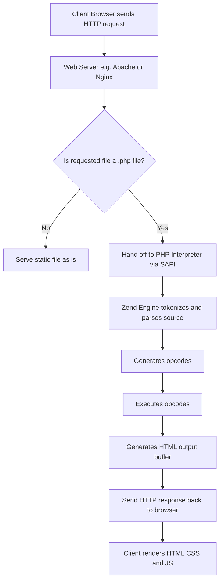
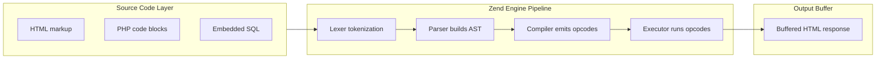
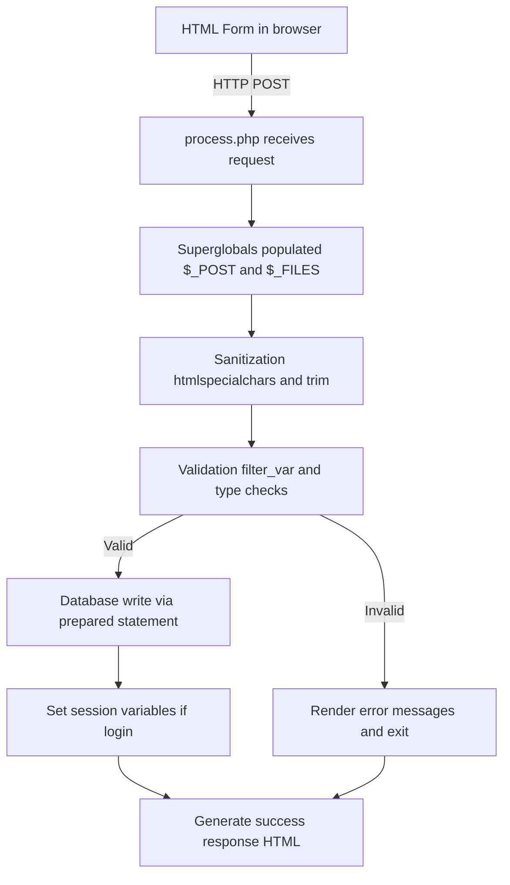
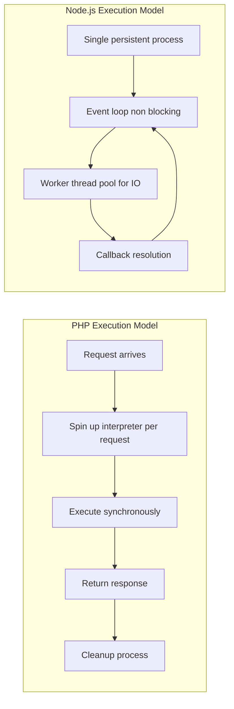
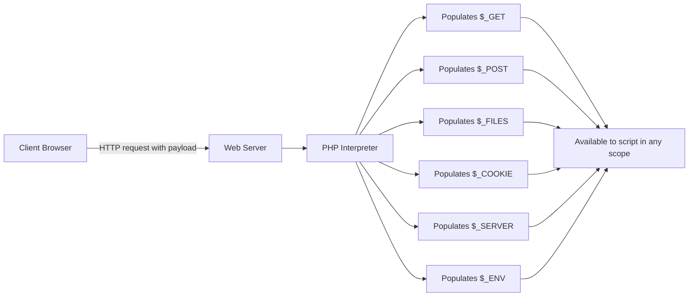

# Quick tour of PHP

<!-- SECTION_1_START -->
# Module 3: Quick Tour of PHP

## 1. Core Technical Definition & Intuitive Overview

### Formal Definition

> [!IMPORTANT]
> **PHP (PHP: Hypertext Preprocessor)** is a widely-used, open-source, **server-side scripting language** specifically designed for web development. It is embedded within HTML and executed on the server to generate dynamic web page content before it is sent to the client's browser.

Originally coined as **Personal Home Page** by **Rasmus Lerdorf** in **1994**, the recursive acronym now better reflects its purpose. PHP files typically carry the `.php` extension and are processed by a PHP interpreter (e.g., the **Zend Engine**) before the resulting HTML is dispatched to the client.

### Conceptual Analogy / Intuition

> [!NOTE]
> **Analogy — "The Restaurant Kitchen":**
> Imagine a restaurant where the dining area is the **client's browser (front-end)** and the kitchen is the **web server (back-end)**.
> - **HTML & CSS** are the **plated food** — the final presentation the customer sees.
> - **PHP** is the **chef working in the kitchen** — it takes raw ingredients (data from a database, user input, files) and cooks them into the final dish (an HTML page) before serving.
> - **Node.js**, by contrast, is a chef who can cook multiple dishes at the same time (asynchronous, event-driven), while **PHP** traditionally follows a more linear, request-by-request cooking style (synchronous, one dish at a time per waiter).

The student should remember the following syllabus highlights:

> [!IMPORTANT]
> **KTU 2024 Syllabus Highlight — Module 3 Context**
> Within this module covering the *JavaScript runtime environment (Node.js)*, PHP is studied as a **comparative server-side scripting paradigm**. Students are expected to understand its **syntax, control flow, form handling, and request lifecycle** so as to contrast it with Node.js's event-driven model.

### Physical Constants / Standard Metrics

The following standard markers are commonly referenced in PHP-based web development:

- **Default Port for Apache + PHP:** **Port 80** (HTTP) and **Port 443** (HTTPS).
- **Maximum Script Execution Time:** Default **30 seconds**, configurable via `max_execution_time` in `php.ini`.
- **Default Upload File Size Limit:** **2 MB** (`upload_max_filesize`).
- **PHP Memory Limit Default:** **128 MB** (`memory_limit`).
- **Current Stable Major Series (as of 2024–2026):** **PHP 8.x** (introducing the **Zend Engine 4.0** with the JIT compiler).

### GeoGebra / Desmos Integration

> [!VISUALIZATION CONTROL]
> **Concept:** *Server-Side vs Client-Side Execution Boundary*
> **Visual Description:** A simple two-region diagram showing the **Browser (Client)** on the left and the **Web Server (with PHP interpreter)** on the right, separated by the network boundary. An arrow labeled "HTTP Request" travels left-to-right, and a second arrow labeled "Rendered HTML Response" travels right-to-left. This visualizes why PHP code is **never visible** to the end user — only its output.
<!-- SECTION_1_END -->

<!-- SECTION_2_START -->
# 2. Deep Theoretical Analysis & KTU High-Yield Formula Sheet

## 2.1 Anatomy of a PHP Script

A PHP file is essentially an HTML document with embedded PHP processing blocks. The PHP parser ignores everything outside its delimiters, treating such content as raw HTML output.

**Core Delimiters:**
- `<?php ... ?>` — Canonical PHP tag (always recommended, XHTML/XML safe).
- `<? ... ?>` — Short-open tag (requires `short_open_tag = On`).
- `<?= ... ?>` — Short echo tag (equivalent to `<?php echo ... ?>`).
- `<script language="php"> ... </script>` — Removed since PHP 7.

## 2.2 Operational Logic Steps

The PHP execution pipeline can be broken down as follows:

- **Step 1 — Request Reception:** The web server (Apache, Nginx, LiteSpeed) receives an HTTP request for a `.php` resource.
- **Step 2 — Delegation to Interpreter:** The server hands the file to the PHP interpreter via SAPI (Server API) — commonly the **mod_php** module, **PHP-FPM**, or **CGI**.
- **Step 3 — Lexical Analysis & Parsing:** The source is tokenized, parsed into an **Abstract Syntax Tree (AST)**, and compiled to **opcodes** by the Zend Engine.
- **Step 4 — Execution:** Opcodes are executed. Any database queries, file reads, or form processing occur at this stage.
- **Step 5 — Output Buffering:** The generated output is buffered, mixed with any pre-existing static HTML, and dispatched as the HTTP response body.
- **Step 6 — Cleanup:** Memory is reclaimed, database connections are closed, and the script terminates.

## 2.3 PHP Data Types

PHP is a **loosely-typed / dynamically-typed** language. The type of a variable is determined by the value it holds at runtime.

| Category | Types |
|---|---|
| **Scalar Types** | `boolean`, `integer`, `float` (a.k.a. `double`), `string` |
| **Compound Types** | `array`, `object`, `callable`, `iterable` |
| **Special Types** | `resource`, `NULL` |

## 2.4 Variables and Scope

- All PHP variables are prefixed with the **dollar sign `$`**.
- A variable name must begin with a letter or underscore, optionally followed by alphanumeric characters or underscores.
- Variable names are **case-sensitive**; keywords and function names are **case-insensitive**.
- Default scope is **global**; variables inside functions are **local** unless declared `global` or accessed via the `$GLOBALS` superglobal array.

## 2.5 Superglobals (Form Handling Pillars)

> [!NOTE]
> **KTU High-Yield Concept:** PHP exposes predefined associative arrays called **superglobals** that are accessible in every scope without the `global` keyword.

| Superglobal | Purpose | HTTP Method |
|---|---|---|
| `$_GET` | Captures URL query parameters | GET |
| `$_POST` | Captures form body parameters | POST |
| `$_REQUEST` | Merged `$_GET`, `$_POST`, and `$_COOKIE` | Both |
| `$_SERVER` | Server and execution environment info | — |
| `$_SESSION` | Session variables stored server-side | — |
| `$_COOKIE` | HTTP cookies sent by the client | — |
| `$_FILES` | Uploaded file metadata | POST (multipart) |
| `$_ENV` | Environment variables | — |
| `$GLOBALS` | References all global-scope variables | — |

## 2.6 KTU Formula Sheet / Cheat Sheet

> [!IMPORTANT]
> The following is the consolidated high-yield reference for exam day.

| Concept | Syntax / Rule | Example |
|---|---|---|
| PHP Opening Tag | `<?php` | `<?php echo "Hello"; ?>` |
| Variable Declaration | `$name = value;` | `$age = 21;` |
| String Concatenation | `.` (dot operator) | `$greet = "Hi " . $name;` |
| String Interpolation | `"$var"` (double quotes) | `echo "Age is $age";` |
| Constant Definition | `define("NAME", value)` or `const NAME = value;` | `const PI = 3.14;` |
| Array Definition | `array()` or `[]` | `$nums = [1, 2, 3];` |
| Associative Array | `["key" => "value"]` | `$user = ["id" => 7];` |
| If-Else | `if (cond) { ... } else { ... }` | Standard conditional |
| For Loop | `for ($i = 0; $i < n; $i++)` | Indexed iteration |
| Foreach Loop | `foreach ($arr as $val)` or `foreach ($arr as $k => $v)` | Array traversal |
| Function Definition | `function name($p) { return $p; }` | `function add($a, $b) { return $a + $b; }` |
| Include File | `include "file.php";` | Optional inclusion |
| Require File | `require "file.php";` | Fatal on failure |
| Form Get | `$_GET["field"]` | URL params |
| Form Post | `$_POST["field"]` | Body params |
| Start Session | `session_start();` | Session handling |
| Set Cookie | `setcookie("name", "val", time()+3600);` | Client persistence |
| MySQLi Connect | `mysqli_connect(host, user, pass, db)` | DB layer |

## 2.7 Real-World Engineering Utility

PHP powers a substantial portion of the modern web. Its **Why** and **How** in production:

- **Why:** Rapid prototyping, ubiquitous hosting support, mature ecosystem (WordPress, Laravel, Symfony, CodeIgniter).
- **How:**
  - **Content Management:** WordPress (≈ 43% of all websites worldwide) is PHP-based.
  - **E-Commerce:** Magento, WooCommerce, OpenCart.
  - **REST APIs:** Frameworks like **Laravel** and **Slim** enable JWT-authenticated microservices.
  - **Server-Side Rendering (SSR):** Acts as a templating engine for HTML output.
  - **CLI Scripting:** Used for cron jobs, log parsers, and DevOps automation tasks.

> [!NOTE]
> **Comparison Anchor (with Node.js):**
> - **PHP** = synchronous, multi-process (or hybrid via PHP-FPM), interpreted, embedded in HTML.
> - **Node.js** = asynchronous, single-threaded event loop, runs JS outside the browser, requires an explicit HTTP server.
<!-- SECTION_2_END -->

<!-- SECTION_3_START -->
# 3. Step-by-Step Derivations & Code Implementation

## 3.1 Demonstration 1 — Basic PHP Syntax and Echo

```php
<!DOCTYPE html>
<html>
<head>
    <title>Quick PHP Tour</title>
</head>
<body>
    <h1>
        <?php
            // This is a single-line comment.
            # This is also a single-line comment (shell-style).
            /* This is a
               multi-line comment. */

            echo "Hello, KTU Web Programming World!";
            // echo can take multiple comma-separated arguments.
        ?>
    </h1>

    <?= "<p>Generated on: " . date("Y-m-d H:i:s") . "</p>"; ?>
</body>
</html>
```

**Execution Walkthrough:**
- The PHP block between `<?php` and `?>` is executed server-side.
- `echo` outputs the literal string to the response buffer.
- `<?= ... ?>` is a shorthand for `<?php echo ... ?>` — useful for templating.
- `date("Y-m-d H:i:s")` invokes PHP's built-in `date()` function, returning the current timestamp formatted as `YYYY-MM-DD HH:MM:SS`.

## 3.2 Demonstration 2 — Variables, Constants, and Type Juggling

```php
<?php
    // --- Scalar Variable Declarations ---
    $studentName  = "Ananya";          // string
    $rollNumber   = 42;                // integer
    $cgpa         = 9.15;              // float
    $isPassed     = true;              // boolean
    $noValue      = NULL;              // NULL

    // --- String Interpolation vs Concatenation ---
    echo "$studentName scored $cgpa CGPA.<br>";          // Interpolation (double quotes)
    echo $studentName . " has roll no. " . $rollNumber; // Concatenation (dot operator)

    // --- Constant Definition ---
    define("INSTITUTE", "APJ Abdul Kalam Technological University");
    const PASS_MARKS = 50;

    echo "<br>Institute: " . INSTITUTE;
    echo "<br>Pass Marks: " . PASS_MARKS;

    // --- Type Juggling (Dynamic Typing) ---
    $result = "0";        // string
    if ($result == false) {
        // Loose comparison: "0" == false evaluates to TRUE.
        echo "<br>Result is loosely false.";
    }
    if ($result === false) {
        // Strict comparison: "0" === false evaluates to FALSE.
        echo "<br>Result is strictly false.";
    } else {
        echo "<br>Result is NOT strictly false.";
    }

    // --- Variable Variables ---
    $framework = "Laravel";
    $$framework = "PHP Framework";  // Creates $Laravel = "PHP Framework"
    echo "<br>" . $Laravel;
?>
```

**Step-by-step Logical Conversion:**

- `$studentName = "Ananya"` — string stored.
- `"$studentName scored $cgpa CGPA"` — inside double quotes, the variable names are **expanded** to their values.
- The dot (`.`) operator **joins** two strings into a new string; the original strings are untouched.
- `define()` defines a **runtime constant**; `const` defines a **compile-time constant** (slightly faster, class-scope aware).
- Loose comparison `==` triggers PHP's **type juggling** rules; strict comparison `===` requires **identical type and value**.
- The `$$framework` syntax creates a **variable variable** — the value of `$framework` becomes the new variable's name.

## 3.3 Demonstration 3 — Control Structures

### 3.3.1 Conditional Branching

```php
<?php
    $marks = 78;

    if ($marks >= 90) {
        $grade = "A+";
    } elseif ($marks >= 80) {
        $grade = "A";
    } elseif ($marks >= 70) {
        $grade = "B+";
    } elseif ($marks >= 60) {
        $grade = "B";
    } elseif ($marks >= 50) {
        $grade = "C";
    } else {
        $grade = "F (Fail)";
    }

    echo "Marks: $marks &nbsp;&nbsp; Grade: $grade";
?>
```

### 3.3.2 Switch Statement

```php
<?php
    $day = date("N"); // 1 (Monday) to 7 (Sunday)

    switch ($day) {
        case 1:  $type = "Weekday";    break;
        case 2:  $type = "Weekday";    break;
        case 3:  $type = "Weekday";    break;
        case 4:  $type = "Weekday";    break;
        case 5:  $type = "Weekday";    break;
        case 6:  $type = "Weekend";    break;
        case 7:  $type = "Weekend";    break;
        default: $type = "Unknown";    break;
    }

    echo "Today is a $type.";
?>
```

### 3.3.3 Loops — for, while, foreach

```php
<?php
    // --- for loop: known iteration count ---
    echo "<h3>For Loop (1 to 5):</h3>";
    for ($i = 1; $i <= 5; $i++) {
        echo "Iteration $i <br>";
    }

    // --- while loop: condition-driven ---
    echo "<h3>While Loop (countdown):</h3>";
    $countdown = 5;
    while ($countdown > 0) {
        echo "T-minus $countdown <br>";
        $countdown--;
    }

    // --- do-while: executes at least once ---
    echo "<h3>Do-While Loop:</h3>";
    $attempt = 0;
    do {
        echo "Attempt number $attempt <br>";
        $attempt++;
    } while ($attempt < 3);

    // --- foreach: array iteration ---
    echo "<h3>Foreach over Indexed Array:</h3>";
    $languages = ["PHP", "JavaScript", "Python", "Java"];
    foreach ($languages as $index => $lang) {
        echo "[$index] $lang <br>";
    }

    echo "<h3>Foreach over Associative Array:</h3>";
    $student = [
        "name"  => "Rahul",
        "age"   => 20,
        "course"=> "B.Tech CSE"
    ];
    foreach ($student as $key => $value) {
        echo "$key : $value <br>";
    }
?>
```

## 3.4 Demonstration 4 — User-Defined and Built-in Functions

```php
<?php
    // --- User-defined function with default arguments ---
    function greet($name = "Guest", $greeting = "Welcome") {
        return "$greeting, $name!";
    }

    echo greet();                          // "Welcome, Guest!"
    echo "<br>" . greet("Ananya");         // "Welcome, Ananya!"
    echo "<br>" . greet("Rahul", "Hello"); // "Hello, Rahul!"

    // --- Built-in string functions ---
    $text = "  Web Programming with PHP  ";
    echo "<br>Length: " . strlen($text);
    echo "<br>Trimmed: '" . trim($text) . "'";
    echo "<br>Upper: " . strtoupper($text);
    echo "<br>Lower: " . strtolower($text);
    echo "<br>Position of 'PHP': " . strpos($text, "PHP");
    echo "<br>Substring (5, 12): " . substr($text, 5, 12);
    echo "<br>Replaced: " . str_replace("PHP", "Node.js", $text);

    // --- Variable-length argument list (PHP 5.6+) ---
    function sumAll(...$numbers) {
        $total = 0;
        foreach ($numbers as $n) {
            $total += $n;
        }
        return $total;
    }

    echo "<br>Sum (1..5): " . sumAll(1, 2, 3, 4, 5);

    // --- Arrow functions (PHP 7.4+) ---
    $square = fn($x) => $x * $x;
    echo "<br>Square of 7: " . $square(7);
?>
```

## 3.5 Demonstration 5 — Arrays in Depth

```php
<?php
    // --- Indexed array ---
    $fruits = ["Apple", "Banana", "Cherry"];
    array_push($fruits, "Date");
    echo "Count: " . count($fruits) . "<br>";

    // --- Associative array ---
    $capital = [
        "India"   => "New Delhi",
        "Japan"   => "Tokyo",
        "France"  => "Paris"
    ];
    echo "Capital of Japan: " . $capital["Japan"] . "<br>";

    // --- Multidimensional array ---
    $students = [
        ["roll" => 1, "name" => "Asha", "marks" => 88],
        ["roll" => 2, "name" => "Vivek", "marks" => 76],
        ["roll" => 3, "name" => "Meera", "marks" => 92]
    ];

    echo "<table border='1' cellpadding='5'>";
    echo "<tr><th>Roll</th><th>Name</th><th>Marks</th></tr>";
    foreach ($students as $row) {
        echo "<tr>";
        echo "<td>" . $row["roll"]   . "</td>";
        echo "<td>" . $row["name"]   . "</td>";
        echo "<td>" . $row["marks"]  . "</td>";
        echo "</tr>";
    }
    echo "</table>";

    // --- Useful array functions ---
    $nums = [5, 2, 8, 1, 9, 3];
    sort($nums);                          // Ascending sort
    echo "<br>Sorted: " . implode(", ", $nums);

    rsort($nums);                         // Descending
    echo "<br>Reverse Sorted: " . implode(", ", $nums);

    $squared = array_map(fn($x) => $x * $x, $nums);
    echo "<br>Squared: " . implode(", ", $squared);

    $filtered = array_filter($nums, fn($x) => $x > 3);
    echo "<br>Filtered (>3): " . implode(", ", $filtered);
?>
```

## 3.6 Demonstration 6 — Form Handling (GET vs POST)

### 3.6.1 The HTML Form (`form.html`)

```html
<!DOCTYPE html>
<html>
<head><title>Registration Form</title></head>
<body>
    <h2>Student Registration</h2>
    <form action="process.php" method="POST">
        <label>Name: <input type="text" name="fullname" required></label><br><br>
        <label>Email: <input type="email" name="email" required></label><br><br>
        <label>Age: <input type="number" name="age" min="16" max="60"></label><br><br>
        <label>Course:
            <select name="course">
                <option value="CSE">B.Tech CSE</option>
                <option value="ECE">B.Tech ECE</option>
                <option value="ME">B.Tech ME</option>
            </select>
        </label><br><br>
        <input type="submit" value="Register">
    </form>
</body>
</html>
```

### 3.6.2 The PHP Processor (`process.php`)

```php
<?php
    if ($_SERVER["REQUEST_METHOD"] !== "POST") {
        // Reject any direct access that is not a POST request.
        http_response_code(405);
        die("Method Not Allowed. Submit the form properly.");
    }

    // --- Sanitization helper ---
    function clean($data) {
        $data = trim($data);
        $data = stripslashes($data);
        $data = htmlspecialchars($data, ENT_QUOTES, "UTF-8");
        return $data;
    }

    $fullname = clean($_POST["fullname"] ?? "");
    $email    = clean($_POST["email"]    ?? "");
    $age      = filter_var($_POST["age"] ?? 0, FILTER_VALIDATE_INT);
    $course   = clean($_POST["course"]  ?? "");

    // --- Server-side validation ---
    $errors = [];
    if (empty($fullname))                      $errors[] = "Name is required.";
    if (!filter_var($email, FILTER_VALIDATE_EMAIL)) $errors[] = "Invalid email.";
    if ($age === false || $age < 16)           $errors[] = "Age must be \u{2265} 16.";

    if (!empty($errors)) {
        echo "<h3>Validation Errors:</h3><ul>";
        foreach ($errors as $e) {
            echo "<li>" . htmlspecialchars($e) . "</li>";
        }
        echo "</ul>";
        echo '<a href="form.html">Go Back</a>';
        exit;
    }

    echo "<h3>Registration Successful</h3>";
    echo "Name  : $fullname <br>";
    echo "Email : $email <br>";
    echo "Age   : $age <br>";
    echo "Course: $course <br>";
?>
```

**Detailed Step-by-Step Conversion Logic:**

- **Step 1:** The form's `action="process.php"` tells the browser to send a POST request to that file.
- **Step 2:** PHP's built-in `$_POST` superglobal is auto-populated from the request body.
- **Step 3:** The `clean()` function applies defense-in-depth: `trim()` removes whitespace, `stripslashes()` removes backslashes added by magic quotes (legacy), and `htmlspecialchars()` prevents **XSS (Cross-Site Scripting)**.
- **Step 4:** `filter_var(..., FILTER_VALIDATE_EMAIL)` and `FILTER_VALIDATE_INT` use PHP's filter extension for robust validation.
- **Step 5:** If validation fails, errors are listed and execution halts via `exit`.
- **Step 6:** On success, a confirmation message is rendered.

> [!IMPORTANT]
> **Security Note (KTU-relevant):** Always use `htmlspecialchars()` on output to prevent XSS and `prepared statements` (via **PDO** or **MySQLi**) to prevent **SQL Injection**.

## 3.7 Demonstration 7 — File Inclusion and Reusability

```php
<?php
    // --- header.php ---
    // <html><head><title>My Site</title></head><body>
    // <h1>Welcome to My PHP Site</h1>
?>
```

```php
<?php
    // --- footer.php ---
    // <hr><p>&copy; 2025 KTU Web Programming.</p></body></html>
?>
```

```php
<?php
    // --- index.php ---
    require "header.php";   // Fatal error if missing (use for mandatory files)
    // include "header.php"; // Warning if missing (use for optional fragments)

    echo "<p>This is the main content of the page.</p>";

    include "footer.php";
?>
```

**Conversion Logic:**

- `require` halts the script with a **fatal error** if the file is missing — used for **mandatory** dependencies.
- `include` emits a **warning** and continues — used for **optional** templates.
- `require_once` and `include_once` prevent the same file from being included multiple times, avoiding **function redeclaration** errors.

## 3.8 Demonstration 8 — Sessions and Cookies

### 3.8.1 Session Example

```php
<?php
    // --- page1.php ---
    session_start();                       // Must be called BEFORE any output.
    $_SESSION["username"] = "admin";
    $_SESSION["role"]     = "superuser";
    echo "Session data set. <a href='page2.php'>Go to Page 2</a>";
?>
```

```php
<?php
    // --- page2.php ---
    session_start();
    if (isset($_SESSION["username"])) {
        echo "Hello, " . $_SESSION["username"] . "!<br>";
        echo "Role: " . $_SESSION["role"];
    } else {
        echo "No active session.";
    }
?>
```

### 3.8.2 Cookie Example

```php
<?php
    // --- set a cookie valid for 1 hour ---
    setcookie("user_pref", "dark_mode", time() + 3600, "/");

    // --- read the cookie (available on NEXT request) ---
    if (isset($_COOKIE["user_pref"])) {
        echo "Preferred theme: " . $_COOKIE["user_pref"];
    } else {
        echo "Cookie not yet set or expired.";
    }
?>
```

## 3.9 Demonstration 9 — Database Connectivity (MySQLi)

```php
<?php
    $servername = "localhost";
    $username   = "root";
    $password   = "";
    $database   = "ktu_students";

    // --- Create connection ---
    $conn = new mysqli($servername, $username, $password, $database);

    // --- Check connection ---
    if ($conn->connect_error) {
        die("Connection failed: " . $conn->connect_error);
    }

    // --- Safe prepared statement ---
    $stmt = $conn->prepare("SELECT roll, name, marks FROM results WHERE course = ?");
    $courseCode = "CSE";
    $stmt->bind_param("s", $courseCode);
    $stmt->execute();
    $result = $stmt->get_result();

    echo "<table border='1' cellpadding='5'>";
    echo "<tr><th>Roll</th><th>Name</th><th>Marks</th></tr>";
    while ($row = $result->fetch_assoc()) {
        echo "<tr>";
        echo "<td>" . $row["roll"]  . "</td>";
        echo "<td>" . $row["name"]  . "</td>";
        echo "<td>" . $row["marks"] . "</td>";
        echo "</tr>";
    }
    echo "</table>";

    $stmt->close();
    $conn->close();
?>
```

**Step-by-Step Conversion Logic:**

- **Step 1:** The `new mysqli(...)` constructor establishes a TCP connection to the MySQL server.
- **Step 2:** `connect_error` is checked — if the connection fails, `die()` halts execution and prints the error.
- **Step 3:** A **prepared statement** is created. The `?` placeholder is a **parameter binding slot**.
- **Step 4:** `bind_param("s", $courseCode)` binds the variable as a string (`"s"`), preventing SQL injection.
- **Step 5:** `execute()` runs the query; `get_result()` returns a `mysqli_result` object.
- **Step 6:** `fetch_assoc()` retrieves each row as an associative array until exhausted.

> [!NOTE]
> **Why Prepared Statements?** They separate SQL logic from user data, making injection impossible because the database engine never interprets user input as SQL syntax.
<!-- SECTION_3_END -->

<!-- SECTION_4_START -->
# 4. Structural Diagrams & Schematics

## 4.1 PHP Request–Response Lifecycle



## 4.2 PHP Script Internal Architecture



## 4.3 Form Processing Topology Matrix



## 4.4 PHP vs Node.js Execution Model



## 4.5 Superglobal Data Flow


<!-- SECTION_4_END -->

<!-- SECTION_5_START -->
# 5. KTU 2024 Scheme Examination Question Bank & Topic Recap

## Part A — Short Answer Questions (3 Marks Each)

### Question 1

> **[KTU University Exam – July 2024]**
> **Q:** What is PHP? List any four features of PHP.
> **Course Outcome:** CO1 | **RBT Level:** Remember

**Model Answer:**

PHP (PHP: Hypertext Preprocessor) is a **server-side, open-source scripting language** embedded within HTML, used to develop dynamic web applications.

**Four key features:**

1. **Open Source and Free** — Distributed under the PHP License; no licensing cost.
2. **Cross-Platform** — Runs on Windows, Linux, macOS, and supports most web servers.
3. **Embedded in HTML** — PHP code can be placed directly inside HTML using `<?php ?>` tags.
4. **Database Integration** — Native support for MySQL, PostgreSQL, SQLite, MongoDB, and more.

> *(Self-explanation: 1 mark for definition, 0.5 mark per feature, total 3 marks)*

---

### Question 2

> **[KTU University Exam – Dec 2023]**
> **Q:** Differentiate between `include` and `require` in PHP.
> **Course Outcome:** CO2 | **RBT Level:** Understand

**Model Answer:**

| Aspect | `include` | `require` |
|---|---|---|
| **Behavior on missing file** | Emits a **warning** and continues execution | Emits a **fatal error** and halts the script |
| **Use case** | Optional templates, non-critical fragments | Mandatory dependencies, critical library files |
| **Performance** | Slightly slower (allows conditional loading) | Marginal performance benefit on missing file |
| **Variants** | `include`, `include_once` | `require`, `require_once` |

> *(1.5 marks for the table-based comparison, 1.5 marks for the explanation/use case)*

---

## Part B — Long Answer Questions (14 Marks Each) — Module Internal Choice

### Question A (14 Marks)

> **[KTU University Exam – July 2024]**
> **Q (a):** Explain the different data types supported by PHP with examples. (7 Marks)
> **Q (b):** Write a PHP script to accept a student's name and three subject marks through an HTML form (using POST method) and display the total, average, and grade based on the average. (7 Marks)
> **Course Outcome:** CO1, CO2, CO3 | **RBT Level:** Understand, Apply

---

#### Model Solution — Part (a) (7 Marks)

**PHP Data Types:**

**1. Scalar Types:**

- **Integer:** Whole numbers (positive, negative, zero).  
  `$rollNo = 101;`  
  `[Statement: 1 Mark]`

- **Float (Double):** Decimal numbers.  
  `$cgpa = 8.76;`  
  `[Statement: 1 Mark]`

- **String:** Sequence of characters.  
  `$name = "Anjali";`  
  `[Statement: 0.5 Mark]`

- **Boolean:** Logical true/false.  
  `$isEligible = true;`  
  `[Statement: 0.5 Mark]`

**2. Compound Types:**

- **Array:** Ordered map of key-value pairs.  
  `$subjects = ["CS301", "CS302", "CS303"];`  
  `[Statement: 1 Mark]`

- **Object:** Instance of a class.  
  `$obj = new stdClass(); $obj->id = 1;`  
  `[Statement: 0.5 Mark]`

**3. Special Types:**

- **NULL:** Represents a variable with no value.  
  `$nothing = NULL;`  
  `[Statement: 0.5 Mark]`

- **Resource:** Special handle to external resources (e.g., file pointer, DB connection).  
  `$file = fopen("data.txt", "r");`  
  `[Statement: 0.5 Mark]`

**Final comprehensive answer script: 1 Mark for clean summary table or diagram.**

---

#### Model Solution — Part (b) (7 Marks)

**HTML Form (`form.html`):**

```html
<!DOCTYPE html>
<html>
<head><title>Marks Entry</title></head>
<body>
    <h2>Student Marks Entry</h2>
    <form action="calculate.php" method="POST">
        Name: <input type="text" name="sname" required><br><br>
        Mark 1: <input type="number" name="m1" min="0" max="100" required><br><br>
        Mark 2: <input type="number" name="m2" min="0" max="100" required><br><br>
        Mark 3: <input type="number" name="m3" min="0" max="100" required><br><br>
        <input type="submit" value="Calculate">
    </form>
</body>
</html>
```

`[Form creation: 2 Marks]`

**PHP Processor (`calculate.php`):**

```php
<?php
    if ($_SERVER["REQUEST_METHOD"] !== "POST") {
        die("Invalid Request");
    }

    $name = htmlspecialchars(trim($_POST["sname"]));
    $m1   = (int) $_POST["m1"];
    $m2   = (int) $_POST["m2"];
    $m3   = (int) $_POST["m3"];

    $total   = $m1 + $m2 + $m3;
    $average = $total / 3.0;

    if ($average >= 90)       $grade = "A+";
    elseif ($average >= 80)   $grade = "A";
    elseif ($average >= 70)   $grade = "B+";
    elseif ($average >= 60)   $grade = "B";
    elseif ($average >= 50)   $grade = "C";
    else                       $grade = "F (Fail)";

    echo "<h2>Result Sheet</h2>";
    echo "Name    : $name <br>";
    echo "Total   : $total / 300 <br>";
    echo "Average : " . number_format($average, 2) . " <br>";
    echo "Grade   : $grade <br>";
?>
```

`[Reading superglobals: 1 Mark]`
`[Computation logic (total and average): 1 Mark]`
`[Grading logic using if-elseif-else: 2 Marks]`
`[Clean output formatting: 1 Mark]`

---

### Question B (14 Marks)

> **[KTU University Exam – Dec 2023]**
> **Q (a):** Explain the concept of superglobals in PHP. List at least five superglobals and their uses. (7 Marks)
> **Q (b):** Write a PHP program to demonstrate the use of arrays (indexed, associative, and multidimensional) with appropriate examples. (7 Marks)
> **Course Outcome:** CO2, CO3 | **RBT Level:** Understand, Apply

---

#### Model Solution — Part (a) (7 Marks)

**Concept of Superglobals:**

Superglobals are **predefined associative arrays in PHP** that are accessible in every scope (global, function, class methods) without requiring the `global` keyword. They are automatically populated by the PHP runtime with information from the HTTP request, server environment, sessions, and cookies. They were introduced in PHP 4.1.0 to simplify web data access.

`[Concept explanation: 2 Marks]`

**Five Important Superglobals:**

| Superglobal | Purpose | Example Use |
|---|---|---|
| `$_GET` | Holds URL query parameters | `$_GET["id"]` from `?id=10` |
| `$_POST` | Holds form body parameters from POST | `$_POST["username"]` |
| `$_REQUEST` | Merged `$_GET`, `$_POST`, `$_COOKIE` | `$_REQUEST["email"]` |
| `$_SERVER` | Server and execution environment | `$_SERVER["REQUEST_METHOD"]` |
| `$_SESSION` | Server-side session storage | `$_SESSION["user_id"]` |
| `$_COOKIE` | HTTP cookies from client | `$_COOKIE["theme"]` |
| `$_FILES` | Uploaded file metadata | `$_FILES["resume"]["name"]` |
| `$_ENV` | Environment variables | `$_ENV["DB_HOST"]` |
| `$GLOBALS` | All global-scope variables | `$GLOBALS["counter"]` |

`[Listing superglobals: 1 Mark per superglobal up to 5 = 5 Marks]`

---

#### Model Solution — Part (b) (7 Marks)

```php
<?php
    // --- Indexed Array ---
    $languages = ["PHP", "JavaScript", "Python", "Java"];
    echo "<h3>Indexed Array</h3>";
    for ($i = 0; $i < count($languages); $i++) {
        echo "Index $i : $languages[$i] <br>";
    }

    // --- Associative Array ---
    $capital = [
        "Kerala"   => "Thiruvananthapuram",
        "Tamil Nadu"=> "Chennai",
        "Karnataka" => "Bengaluru"
    ];
    echo "<h3>Associative Array</h3>";
    foreach ($capital as $state => $cap) {
        echo "$state : $cap <br>";
    }

    // --- Multidimensional Array ---
    $marks = [
        "Anu"  => ["Maths" => 95, "Physics" => 88, "CS" => 92],
        "Vivek"=> ["Maths" => 80, "Physics" => 75, "CS" => 85],
        "Meera"=> ["Maths" => 90, "Physics" => 93, "CS" => 96]
    ];
    echo "<h3>Multidimensional Array</h3>";
    echo "<table border='1' cellpadding='5'>";
    echo "<tr><th>Student</th><th>Maths</th><th>Physics</th><th>CS</th></tr>";
    foreach ($marks as $student => $subjects) {
        echo "<tr><td>$student</td>";
        foreach ($subjects as $subj => $score) {
            echo "<td>$score</td>";
        }
        echo "</tr>";
    }
    echo "</table>";
?>
```

`[Indexed array declaration and traversal: 2 Marks]`
`[Associative array with key-value pairs: 2 Marks]`
`[Multidimensional array with nested foreach: 2 Marks]`
`[Output formatting with HTML table: 1 Mark]`

---

## KTU Examiner's Valuation Warning / Pitfall Callout

> [!WARNING]
> **Common Mark-Loss Pitfalls in PHP Questions:**
> 1. **Forgetting `session_start()`** before any HTML output when using sessions — causes "headers already sent" errors. **[-2 Marks]**
> 2. **Using `==` instead of `===`** for validation — fails strict comparison, may accept wrong types. **[-1 Mark]**
> 3. **Not sanitizing input** with `htmlspecialchars()` or `mysqli_real_escape_string()` — considered a security flaw; examiner deducts for failing to mention XSS/SQLi prevention. **[-1 to -2 Marks]**
> 4. **Missing `$` prefix** on variables or wrong use of single vs. double quotes in interpolation. **[-1 Mark per error]**
> 5. **Not checking `$_SERVER["REQUEST_METHOD"]`** before accessing `$_POST` — leads to undefined index warnings. **[-1 Mark]**
> 6. **Confusing `include` with `require`** semantics in theoretical questions. **[-1 Mark]**
> 7. **Skipping the `</table>` closing tag** in HTML rendering questions — incomplete output. **[-1 Mark]**

---

## Topic Recap & Important Things to Remember

> [!IMPORTANT]
> **Rapid-Revision Checklist — Quick Tour of PHP**

- **Full form:** PHP = **PHP: Hypertext Preprocessor** (recursive acronym).
- **Inventor:** **Rasmus Lerdorf**, 1994.
- **Engine:** **Zend Engine** (introduced PHP 4; PHP 8 uses **Zend Engine 4.0 with JIT**).
- **File extension:** `.php`.
- **Delimiter:** `<?php ... ?>`.
- **Server-side execution:** Code runs on the **web server**, not the client browser.
- **Embedding:** PHP can be **embedded directly into HTML**.
- **Case-sensitivity:** Variables are case-sensitive; function names and keywords are case-insensitive.
- **Variable prefix:** All variables begin with **$** (e.g., `$name`, `$_GET`).
- **String handling:** Concatenation uses **`.`** (dot); interpolation works only with **double quotes** `"..."`.
- **Loosely typed:** PHP automatically converts types during operations (**type juggling**).
- **Strict comparison:** `===` (value + type) vs. loose `==` (value only).
- **Superglobals:** `$_GET`, `$_POST`, `$_REQUEST`, `$_SERVER`, `$_SESSION`, `$_COOKIE`, `$_FILES`, `$_ENV`, `$GLOBALS`.
- **Control structures:** `if / elseif / else`, `switch`, `for`, `while`, `do-while`, `foreach`.
- **Arrays:** Indexed (`$a = [10, 20]`), Associative (`$a = ["k" => "v"]`), Multidimensional.
- **Functions:** `function name($p) { return $p; }`; supports default args, variadic args (`...$args`), arrow functions (`fn($x) => ...`).
- **File inclusion:** `include` (warning on failure) vs. `require` (fatal error); use `_once` variants to prevent duplication.
- **Sessions:** `session_start()` must precede any output; stores data server-side.
- **Cookies:** `setcookie()` must precede any output; stored client-side with expiry.
- **Database:** Use **MySQLi** or **PDO** with **prepared statements** to prevent SQL injection.
- **Security triad:** Always apply `htmlspecialchars()` for XSS, prepared statements for SQLi, CSRF tokens for state-changing forms.
- **Default limits:** Execution time **30 s**, upload size **2 MB**, memory **128 MB** (configurable in `php.ini`).
- **PHP vs Node.js (key contrast):**
  - **PHP** — synchronous, multi-request, embedded in HTML, file-based routing.
  - **Node.js** — asynchronous, single-threaded event loop, JS-based, requires explicit server (e.g., `http.createServer`).
- **Built-in functions to remember:** `strlen`, `strpos`, `substr`, `str_replace`, `trim`, `htmlspecialchars`, `filter_var`, `date`, `count`, `array_push`, `array_map`, `array_filter`, `sort`, `implode`, `explode`, `isset`, `empty`.
- **Form methods:** `GET` — visible in URL, idempotent, bookmarkable. `POST` — hidden in body, used for sensitive/large data.
- **Server validation:** Always validate on the server; client-side validation is a UX nicety, not a security measure.
- **Current trend:** PHP 8.x with **JIT compilation**, **named arguments**, **union types**, **attributes**, and **match expression** for modern development.
<!-- SECTION_5_END -->
