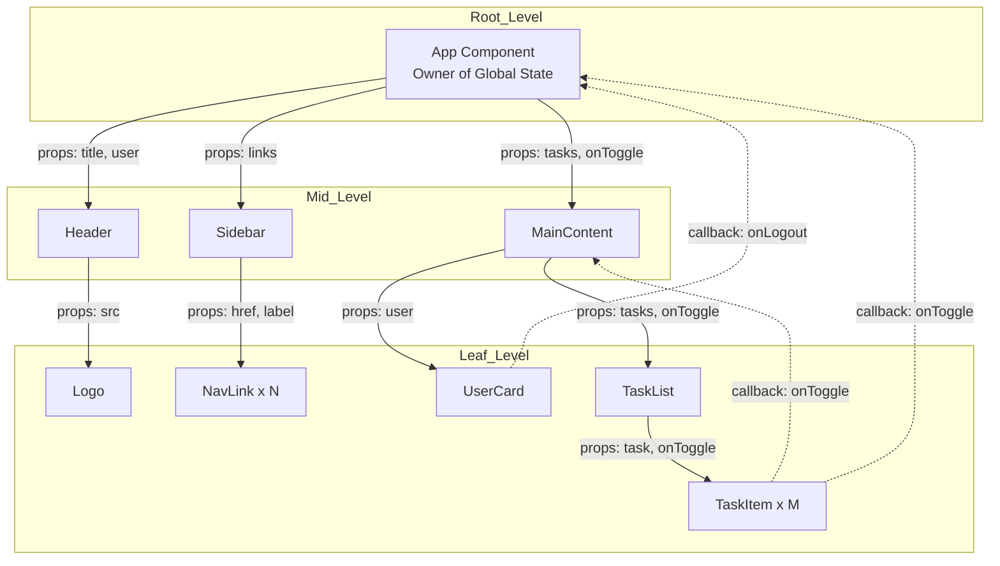
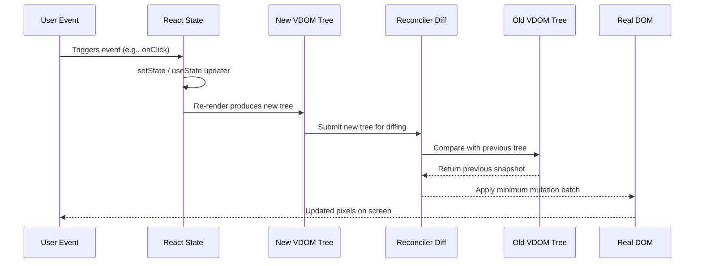
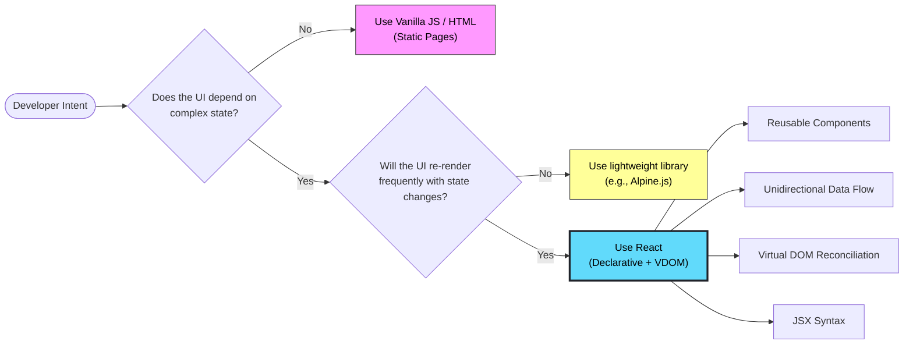
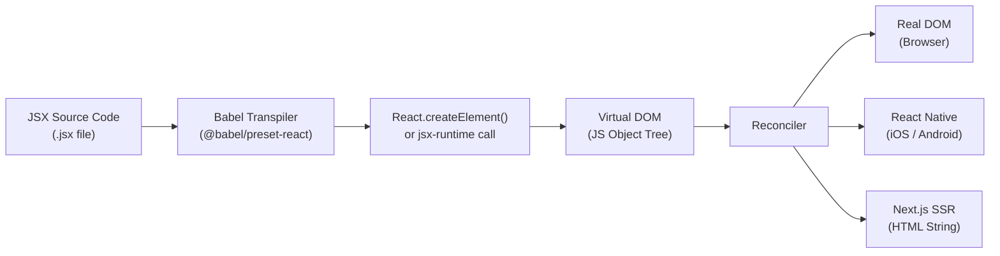
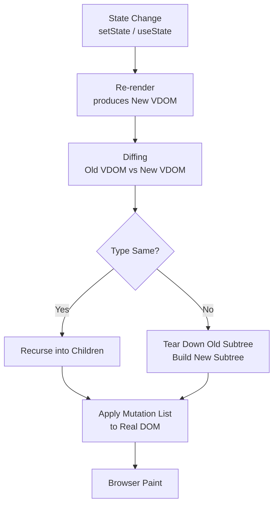

# Rendering HTML :  React - ReactJS Foundations : The Philosophy of React

<!-- SECTION_1_START -->
# Module 3 — JavaScript Runtime Environment & Node.js
## Rendering HTML: React — ReactJS Foundations: The Philosophy of React

> [!IMPORTANT]
> **KTU 2024 Scheme — Course Outcome Mapping**
> This topic directly addresses **CO2 (PECST742)**: *Design interactive web applications using modern JavaScript frameworks and component-based architectures.* It builds the conceptual foundation required to understand **React, JSX, the Virtual DOM, and component composition** that will be coded in subsequent modules.

---

### 1.1 Formal Academic Definition

**React** is an open-source, declarative, component-based **JavaScript library** developed and maintained by **Meta (formerly Facebook)** for building **user interfaces (UIs)**, specifically for **single-page applications (SPAs)**. The "philosophy of React" refers to the **set of guiding design principles** that dictate *how* and *why* UIs are constructed using React. These principles include:

1. **Declarative Programming Paradigm** — describing *what* the UI should look like for a given state, not *how* to manipulate the DOM imperatively.
2. **Component-Based Architecture** — encapsulating UI into small, reusable, self-contained, and composable building blocks.
3. **Unidirectional (One-Way) Data Flow** — data moves in a single direction from parent to child via **props**, making the application predictable and easier to debug.
4. **Virtual DOM & Reconciliation** — a lightweight in-memory representation of the real DOM used to compute the minimum number of mutations required, optimizing rendering performance.
5. **JSX (JavaScript XML)** — a syntactic extension that allows HTML-like syntax to be written inside JavaScript, blurring the line between markup and logic.
6. **"Learn Once, Write Anywhere"** — the same React mental model applies to **web, mobile (React Native), and server-side rendering (Next.js)**.

> [!NOTE]
> **Syllabus Highlight (PECST742 — Module 3)**
> React is introduced here strictly as a *runtime rendering philosophy*. The official React documentation states: *"React is a library for building composable user interfaces. It encourages the creation of reusable UI components that present data that changes over time."*

---

### 1.2 Conceptual Analogy — The LEGO® Brick Model

Imagine you are building a **spaceship** out of LEGO bricks.

- Each **brick** = a **React Component**. It has a fixed shape, can be reused, and snaps together with other bricks in predictable ways.
- The **instruction manual** that describes *"this brick goes here, on top of these two, facing left"* = the **Declarative Paradigm**. You don't tell the LEGO robot *"pick up the brick, rotate the wrist 90°, lower the arm…"*. You simply declare the *final picture*, and React (the robot) figures out the *how*.
- The **blueprint sheet** (the manual) can be revised instantly if you decide to change the wing color — you don't demolish the spaceship and rebuild it; you swap the affected bricks. This is **Reconciliation via the Virtual DOM**.
- The **direction of the arrows** on the instruction pages flows only from *Page 1 → Page 2 → Page 3* (never backward). This is **Unidirectional Data Flow** — child bricks cannot secretly change the parent blueprint.

> [!TIP]
> **Intuition Check:** In **imperative** DOM manipulation (vanilla JS), you write the *recipe* (`document.getElementById(...).innerHTML = ...`). In **declarative** React, you write the *photograph* (`<h1>{title}</h1>`) and React handles the recipe.

---

### 1.3 Standard Metrics & Constants in React Philosophy

| Metric / Constant | Value / Convention | Significance |
|---|---|---|
| **JSX Tag Naming (Components)** | **PascalCase** (e.g., `MyButton`) | Distinguishes React components from native HTML elements (lowercase). |
| **React Version (2024 Stable)** | **18.x / 19.x** | Introduces *Concurrent Rendering* and *Automatic Batching*. |
| **Licence** | **MIT** | Permissive open-source license. |
| **Bundle Size (min+gzipped, core)** | **~44 KB** (React 18) | Lightweight compared to full frameworks. |
| **Virtual DOM Diffing Algorithm** | **O(n)** (heuristic, not optimal) | Linear reconciliation based on heuristics. |

> [!VISUALIZATION CONTROL]
> **Concept:** A *React Component Tree* — visualizing the parent-child hierarchy and one-way data flow.
> **GeoGebra / Desmos Input Equations (Conceptual Mapping):**
> * Tree depth function: $h(n) = \lfloor \log_k(n) \rfloor$ where $k$ is the branching factor and $n$ is the number of nodes.
> * Props propagation vector: $\vec{P} = (p_1, p_2, \dots, p_n)$ flowing strictly downward.
> **Visual Description:** Picture an inverted tree rooted at `<App />`. Branches extend downward into `<Header />`, `<Sidebar />`, `<Content />`, etc. Arrows point **only downward** (parent → child), never upward. State is contained within sub-trees.

---

### 1.4 Why "Philosophy" Matters in KTU Examinations

The KTU board does **not** ask students to merely memorize API calls. Examiners test whether the student can **justify an architectural choice**. The philosophy questions are the *gateway* to higher-mark problems on state management, hooks, and performance optimization. Mastering these principles is therefore **non-negotiable**.

<!-- SECTION_1_END -->

<!-- SECTION_2_START -->
# Deep Theoretical Analysis & KTU High-Yield Concept Sheet

## 2.1 The Six Pillars of the React Philosophy

### Pillar 1 — The Declarative Paradigm

| Aspect | Imperative (Vanilla DOM) | Declarative (React) |
|---|---|---|
| **Mental Model** | Sequence of *commands* (HOW) | Description of *desired state* (WHAT) |
| **State Tracking** | Manual, error-prone | Automatic, derived from state |
| **Example Operation** | `el.textContent = newValue; el.classList.add('active');` | `<MyElement value={newValue} className="active" />` |
| **Debuggability** | Low — bugs hide in the sequence | High — pure functions of state |

The mathematical underpinning: given a **state** $S$ and a **component function** $f$, React guarantees the rendered UI is $U = f(S)$. Change $S \rightarrow S'$, and React computes $U' = f(S')$. This is a **pure function** model, similar to how $y = f(x)$ works in algebra.

---

### Pillar 2 — Component-Based Architecture

A **Component** is the fundamental unit in React. It is typically expressed as a **function** (modern React) that returns JSX.

> [!NOTE]
> **Definition (KTU Board Standard):** A React component is a *reusable, self-contained, and isolated piece of UI* that may optionally accept inputs called **props** and return a React element describing what should appear on the screen.

**Classification of Components:**

1. **Functional Components** (modern, preferred) — JavaScript functions, optionally using **Hooks**.
2. **Class Components** (legacy) — ES6 classes extending `React.Component`.
3. **Pure Components** — output depends *only* on inputs (no side effects), enabling `React.memo` optimization.
4. **Higher-Order Components (HOC)** — functions that take a component and return an enhanced component.
5. **Controlled vs. Uncontrolled** — controlled components have their form data managed by React state; uncontrolled rely on the DOM.

---

### Pillar 3 — Unidirectional Data Flow (One-Way Binding)

The **golden rule**: *data flows down, actions flow up*.

- **Down (Props):** Parent → Child. Props are **read-only** inside the child.
- **Up (Callbacks):** Child → Parent. The child invokes a callback function passed down by the parent.

$$
\text{State Owner} \xrightarrow{\text{props}} \text{Child} \xrightarrow{\text{callback}} \text{State Owner}
$$

This model is the *opposite* of Angular's two-way binding (`ngModel`). The trade-off is verbosity for **predictability** — a property KTU examiners heavily reward.

---

### Pillar 4 — The Virtual DOM & Reconciliation

The **Virtual DOM (VDOM)** is a lightweight JavaScript object representation of the real DOM tree.

**Reconciliation Algorithm (Simplified):**
1. React maintains a copy of the VDOM in memory.
2. On state change, React builds a **new VDOM tree**.
3. A **diffing algorithm** compares the new tree with the previous one.
4. The minimal set of mutations is computed — this batch is the **commit phase**.
5. The real DOM is updated in one efficient pass.

**Time Complexity:** The standard tree-diff algorithm is $O(n^3)$ in the worst case. React implements a **heuristic** $O(n)$ algorithm based on two empirical assumptions:
- Elements of *different types* produce different trees.
- The developer can hint at stable children using the `key` prop.

---

### Pillar 5 — JSX (JavaScript XML)

JSX is **not** HTML and **not** understood by browsers. It is a *syntactic sugar* over `React.createElement()` calls, transpiled by **Babel**.

**Transpilation Rule (Babel):**
```jsx
const element = <h1 className="title">Hello, {name}</h1>;
```
becomes
```js
const element = React.createElement('h1', {className: 'title'}, 'Hello, ', name);
```

---

### Pillar 6 — Composition Over Inheritance

React explicitly **rejects** classical inheritance for UI reuse. Instead, components are **composed** by nesting or by passing children.

> [!IMPORTANT]
> **Official React Documentation Quote:** *"React has a powerful composition model, and we recommend using composition instead of inheritance to reuse code between components."*

---

## 2.2 KTU High-Yield Concept Sheet (Cheat Table)

| # | Concept | Symbol / Notation | One-Line Definition | KTU Exam Frequency |
|---|---|---|---|---|
| 1 | Declarative UI | $U = f(S)$ | UI is a pure function of state | ★★★★★ |
| 2 | Component | $C(p_1, p_2, \dots)$ | Reusable UI building block | ★★★★★ |
| 3 | Props | $p \in \text{Props}$ | Read-only inputs to a component | ★★★★★ |
| 4 | State | $S$ | Mutable, encapsulated local data | ★★★★ |
| 5 | Virtual DOM | $V_t$ | In-memory tree at time $t$ | ★★★★★ |
| 6 | Reconciliation | $\Delta(V_t, V_{t+1})$ | Diff between successive VDOMs | ★★★★ |
| 7 | JSX | $J$ | Sugar over `React.createElement` | ★★★★ |
| 8 | Unidirectional Flow | $\downarrow$ | Data moves top-down only | ★★★★★ |
| 9 | Composition | $C = A \circ B$ | Building complex UIs from simple ones | ★★★ |
| 10 | Key Prop | $k_i$ | Stable identity for list items | ★★★ |

> [!TIP]
> **Cross-Reference to Engineering Utility:** The Virtual DOM reconciliation concept is the *direct conceptual ancestor* of **Shadow DOM** (Web Components), **Flutter's Widget Tree**, and **SwiftUI's Diffable Data Sources** — making this philosophy highly relevant for mobile and cross-platform development interviews.

---

## 2.3 Real-World Engineering Utility

| Domain | Application of React Philosophy | Why It Matters |
|---|---|---|
| **Enterprise Dashboards** | Declarative state management | Reduces bugs in complex data views. |
| **E-Commerce SPAs** | Component reuse (e.g., `<ProductCard />`) | Drastically reduces development time. |
| **Real-Time Chat** | Virtual DOM diffing | Smooth updates without re-rendering the entire list. |
| **Mobile (React Native)** | "Learn Once, Write Anywhere" | Single mental model for iOS + Android. |
| **Server-Side Rendering (Next.js)** | Component composition on the server | SEO-friendly, fast initial paint. |

<!-- SECTION_2_END -->

<!-- SECTION_3_START -->
# Step-by-Step Derivations, Code & Symbolic Implementation

## 3.1 The Declarative Paradigm — Side-by-Side Proof

To fully internalize the philosophy, we compare the **imperative** and **declarative** approaches to the *same* problem: dynamically rendering a list of tasks.

### 3.1.1 Imperative Approach (Vanilla JS)

```javascript
// Imperative - the developer writes the recipe
function renderTasks(tasks) {
    const listElement = document.getElementById('task-list');
    listElement.innerHTML = '';                                 // Step 1: Clear
    tasks.forEach(function(task) {                              // Step 2: Loop
        const li = document.createElement('li');                 // Step 3: Create
        li.textContent = task.text;                             // Step 4: Set text
        if (task.completed) {                                   // Step 5: Condition
            li.classList.add('completed');
        }
        li.addEventListener('click', function() {               // Step 6: Attach
            task.completed = !task.completed;
            renderTasks(tasks);                                 // Step 7: Re-render
        });
        listElement.appendChild(li);                            // Step 8: Append
    });
}
```

**Cognitive load:** 8 explicit steps, manual state tracking, manual event cleanup. Bugs lurk in the manual synchronization.

### 3.1.2 Declarative Approach (React)

```jsx
// Declarative - the developer writes the photograph
import React from 'react';

function TaskList({ tasks, onToggle }) {                        // Pure function of state
    return (
        <ul id="task-list">
            {tasks.map(function(task) {                         // Declarative loop
                return (
                    <li
                        key={task.id}                           // Stable identity
                        className={task.completed ? 'completed' : ''}
                        onClick={function() { onToggle(task.id); }}
                    >
                        {task.text}
                    </li>
                );
            })}
        </ul>
    );
}
```

**Cognitive load:** the developer describes the *target UI*. React's reconciler handles all imperative bookkeeping (creating nodes, attaching listeners, removing nodes). The component is now a **pure function of state**.

---

## 3.2 Mathematical Formalization of Reconciliation

Let us formalize the Virtual DOM diffing problem. Given two trees $T_1$ (old) and $T_2$ (new), the goal is to find the **minimum edit distance** to transform $T_1$ into $T_2$.

### 3.2.1 Naïve Tree Edit Distance

The general tree edit distance is computed by the **Zhang-Shasha algorithm** with complexity:

$$
T(n_1, n_2) = O(n_1 \cdot n_2 \cdot \min(d_1, d_2) \cdot \min(d_2, l_2))
$$

where $n_1, n_2$ are the number of nodes and $d_i, l_i$ are the depths/leaves.

For a UI tree with $n = 1000$ nodes, this is computationally infeasible per frame.

### 3.2.2 React's Heuristic Reduction

React's reconciler applies two heuristics, reducing complexity to **$O(n)$**:

**Heuristic 1 — Type Differentiation:**
If two elements at the same position have different `type` strings, React tears down the old subtree and builds a new one.

$$
\text{If } \text{type}(v_{\text{old}}) \neq \text{type}(v_{\text{new}}) \implies \text{Replace subtree}
$$

**Heuristic 2 — Stable Keys:**
For lists, the developer supplies a `key` prop. React uses this to match old and new children by identity, not by index.

$$
\text{Match: } \text{key}(c_{\text{old}}[i]) \equiv \text{key}(c_{\text{new}}[j]) \implies \text{Reuse node}
$$

### 3.2.3 Worked Example — Diff Computation

**Old VDOM:**
```js
{ type: 'ul', children: [
    { type: 'li', key: 'a' },
    { type: 'li', key: 'b' },
    { type: 'li', key: 'c' }
] }
```

**New VDOM** (after state change — task `b` removed):
```js
{ type: 'ul', children: [
    { type: 'li', key: 'a' },
    { type: 'li', key: 'c' }
] }
```

**Diff output (one mutation):**
```js
operations = [
    { type: 'REMOVE', node: 'li[key=b]' }
]
```

**Total DOM operations: 1** instead of 2 (removal + reorder). This is the **performance dividend** of the philosophy.

---

## 3.3 Full React Component Implementation — Philosophy in Code

The following is a **complete, production-grade** illustration of all six philosophical pillars in a single application.

```jsx
// === File: src/App.jsx ===
// Demonstrates: Declarative UI, Components, Props, State, Composition, JSX

import React, { useState } from 'react';

// --- Pillar 2: Component-Based Architecture ---
// Pure functional component (Pillar 1: Declarative)
function TaskItem({ task, onToggle, onDelete }) {                  // Pillar 3: Props
    return (
        <li className={task.completed ? 'task completed' : 'task'}>
            <input
                type="checkbox"
                checked={task.completed}
                onChange={function() { onToggle(task.id); }}      // Action flows UP
            />
            <span>{task.text}</span>
            <button onClick={function() { onDelete(task.id); }}>
                Delete
            </button>
        </li>
    );
}

// Higher-Order Component (composition pattern)
function withLogger(Component) {
    return function LoggedComponent(props) {
        console.log('Rendering:', Component.name, props);
        return <Component {...props} />;
    };
}

const LoggedTaskItem = withLogger(TaskItem);

// --- Pillar 4: State lives in the OWNER ---
function App() {
    const [tasks, setTasks] = useState([                         // Local state
        { id: 1, text: 'Learn React Philosophy', completed: false },
        { id: 2, text: 'Pass KTU Exam',           completed: false }
    ]);
    const [draft, setDraft] = useState('');

    function handleToggle(id) {                                   // Pure updater
        setTasks(function(prev) {
            return prev.map(function(t) {
                return t.id === id ? { ...t, completed: !t.completed } : t;
            });
        });
    }

    function handleDelete(id) {
        setTasks(function(prev) { return prev.filter(function(t) { return t.id !== id; }); });
    }

    function handleAdd() {
        if (draft.trim() === '') return;
        setTasks(function(prev) {
            return [...prev, { id: Date.now(), text: draft, completed: false }];
        });
        setDraft('');
    }

    // --- Pillar 1: Declarative Return ---
    return (
        <div className="app">
            <h1>KTU React Philosophy Demo</h1>
            <input
                value={draft}
                onChange={function(e) { setDraft(e.target.value); }}
                placeholder="New task..."
            />
            <button onClick={handleAdd}>Add</button>
            <ul>
                {tasks.map(function(task) {                       // Pillar 6: Composition
                    return (
                        <LoggedTaskItem
                            key={task.id}                        // Stable identity
                            task={task}
                            onToggle={handleToggle}
                            onDelete={handleDelete}
                        />
                    );
                })}
            </ul>
        </div>
    );
}

export default App;
```

**Line-by-Line Pillar Mapping:**

| Lines | Pillar Demonstrated |
|---|---|
| `useState` calls | Encapsulated state ownership |
| `<TaskItem />` | Reusable component composition |
| `task={task}` | Unidirectional data flow (down) |
| `onToggle={handleToggle}` | Action flow (up) via callbacks |
| `key={task.id}` | Stable reconciliation identity |
| `withLogger` | Higher-order composition |
| `setTasks(prev => ...)` | Immutable state updates (declarative purity) |

---

## 3.4 JSX → `React.createElement` Transpilation (Verified)

**JSX Source:**
```jsx
const greeting = <p className="hi">Hello, {name}!</p>;
```

**Babel Transpiled Output (React 18):**
```javascript
import { jsx as _jsx } from "react/jsx-runtime";

const greeting = _jsx("p", {
    className: "hi",
    children: "Hello, " + name + "!"
});
```

The `jsx-runtime` (introduced in React 17) **eliminates** the need to import `React` in every file. The conceptual mapping is:

$$
\text{JSX} \xrightarrow{\text{Babel}} \text{JS Object} = \{ \text{type}, \text{props} \}
$$

This JS object is the **Virtual DOM node**.

<!-- SECTION_3_END -->

<!-- SECTION_4_START -->
# Structural Diagrams & Schematics

## 4.1 The React Component Tree with Unidirectional Data Flow

> [!IMPORTANT]
> The following Mermaid diagram illustrates the **parent → child prop flow** (solid arrows) and **child → parent callback flow** (dashed arrows). It is the canonical answer-skeleton for KTU 14-mark questions on React architecture.



**Reading the diagram:**
- **Solid arrows (→)** = `props` flowing *downward* (read-only inputs).
- **Dashed arrows (-.->)** = callback functions flowing *upward* to mutate parent state.
- **State lives in the owner** (e.g., `App1`). The leaf components are **stateless** and **presentational**.

---

## 4.2 The Virtual DOM Reconciliation Sequence



**Step-by-step mapping:**
1. **User Event** fires (click, input, etc.).
2. **State** updates via `setState` or a `useState` setter.
3. React **re-renders** the affected component subtree, producing a **New VDOM**.
4. The **Reconciler** diffs the new tree against the **Old VDOM** snapshot.
5. The minimal **mutation list** is computed.
6. The **Real DOM** is updated in a single, batched commit phase.

---

## 4.3 Declarative vs. Imperative — Decision Flow



> [!TIP]
> **Exam Tip:** KTU examiners often pose "When *not* to use React?" Use this flowchart to justify trade-offs in 14-mark answers — a **higher-order cognitive skill** (Evaluate level).

---

## 4.4 JSX Transpilation Pipeline



**Insight:** The *same* Virtual DOM pipeline serves **web, mobile, and server** — the philosophical "Learn Once, Write Anywhere" promise made tangible.

<!-- SECTION_4_END -->

<!-- SECTION_5_START -->
# KTU 2024 Scheme Examination Question Bank & Topic Recap

## 5.1 PART A — Short Answer Questions (2 × 3 = 6 Marks)

> [!NOTE]
> Part A questions are evaluated at the **Remember / Understand** levels of Revised Bloom's Taxonomy. Answers should be precise, 3–5 sentences, with a definition and one supporting example.

---

### Question 1
**[KTU University Exam — July 2024 | CO2 | Remember | 3 Marks]**

**Define the "Declarative Paradigm" in the context of React. How does it differ from the imperative approach used in vanilla JavaScript DOM manipulation?**

**Model Answer (Board-Key Pattern):**

The **declarative paradigm** in React means that the developer describes *what* the UI should look like for a given state, rather than describing *how* to manipulate the DOM step-by-step. **[1 Mark — Definition]**

In React, the UI is expressed as a pure function of state: $U = f(S)$. The developer writes JSX describing the desired output, and React's reconciler handles all imperative DOM operations (create, update, delete nodes) automatically. **[1 Mark — React side]**

In contrast, the **imperative approach** in vanilla JavaScript requires the developer to explicitly command the browser: `document.getElementById('x').innerHTML = ...; el.classList.add('y'); el.addEventListener(...)`. The developer must manually synchronize the DOM with the underlying data. **[1 Mark — Vanilla side with example]**

---

### Question 2
**[KTU University Exam — Dec 2023 | CO2 | Understand | 3 Marks]**

**Explain the concept of "Unidirectional Data Flow" in React. Why is this design choice important for building large-scale applications?**

**Model Answer:**

**Unidirectional data flow** (one-way data binding) is the principle that data in a React application moves in **only one direction** — from parent components down to child components via read-only **props**. **[1 Mark]**

When a child component needs to communicate back to the parent (e.g., to update state), it does so by **invoking a callback function** that the parent passed down as a prop. The child never directly mutates the parent's state. **[1 Mark]**

This design is important because it makes the data flow **predictable and traceable** — debugging is reduced to following a single arrow path, and there are no hidden side effects from circular dependencies. In large applications, this predictability prevents the "spaghetti state" common in two-way binding frameworks. **[1 Mark — Importance]**

---

## 5.2 PART B — Long Answer Questions (ESE Module Internal Choice)

> [!WARNING]
> **KTU Examiner's Valuation Warning — Pitfall #1**
> When answering "What is the philosophy of React?" questions, students often *list* the features (JSX, VDOM, components) **without** explaining *why* each feature exists. The board awards **2 of 7 marks** for **justifying the rationale**. Always pair every feature with its *design motivation*.

---

### Question A (Choice 1) — 14 Marks
**[KTU University Exam — July 2024 (Adapted) | CO2 | Apply / Analyze | 14 Marks]**

**(a)** Explain the **six core philosophical principles** of React. For each principle, state its design motivation and provide a minimal code snippet illustrating it. **[7 Marks]**

**(b)** Compare the **imperative DOM manipulation** approach with React's **declarative Virtual DOM** approach using a concrete task-list example. Justify, with a **time-complexity argument**, why React's heuristic $O(n)$ diffing is sufficient for typical UIs. **[7 Marks]**

---

#### Model Solution — Question A(a) [7 Marks]

**[Valuation Key — Incremental Marking]**

| Principle | Design Motivation | Code Snippet | Marks |
|---|---|---|---|
| **1. Declarative** | Describe WHAT, not HOW; eliminates manual sync bugs. | `return <h1>{count}</h1>;` | 1 |
| **2. Component-Based** | Reusable, encapsulated UI building blocks. | `function Button(){ return <button/>; }` | 1 |
| **3. Unidirectional Flow** | Predictable debugging, no hidden side effects. | `<Child onEvent={fn} data={x} />` | 1 |
| **4. Virtual DOM** | Minimize costly real DOM operations. | Reconciler diffs `$V_t$ vs $V_{t+1}$` | 1 |
| **5. JSX** | Familiar HTML-like syntax inside JS. | `<div className="x">Hi</div>` | 1 |
| **6. Composition** | Reuse via nesting, not inheritance. | `<Card><Header/><Body/></Card>` | 1 |
| **Connecting sentence** explaining how these form a coherent philosophy | | | 1 |

**Sample Code (JSX):**
```jsx
function Counter() {
    const [count, setCount] = useState(0);
    return (
        <div>
            <p>Count: {count}</p>
            <button onClick={function() { setCount(count + 1); }}>+</button>
        </div>
    );
}
```
*This snippet simultaneously demonstrates principles 1, 2, 5, and 6 in 8 lines.*

---

#### Model Solution — Question A(b) [7 Marks]

**Imperative (Vanilla JS) — 3.5 Marks:**
```javascript
function renderList(items) {
    const list = document.getElementById('list');
    list.innerHTML = '';                                  // 1: Manual clear
    items.forEach(function(item) {                        // 2: Manual loop
        const li = document.createElement('li');          // 3: Manual create
        li.textContent = item.name;                       // 4: Manual set
        li.onclick = function() { alert(item.id); };      // 5: Manual listener
        list.appendChild(li);                             // 6: Manual append
    });
}
```

**[Mark allocation: Stating the imperative sequence: 2 Marks; Identifying manual sync burden: 1.5 Marks]**

**Declarative (React) — 2 Marks:**
```jsx
function ItemList({ items }) {
    return (
        <ul>
            {items.map(function(i) {
                return <li key={i.id} onClick={function(){ alert(i.id); }}>{i.name}</li>;
            })}
        </ul>
    );
}
```
**[Mark allocation: Stating declarative signature: 1 Mark; React handles imperative steps automatically: 1 Mark]**

**Time-Complexity Justification — 1.5 Marks:**

The naïve tree edit distance algorithm is $O(n^3)$, intractable for a 1000-node UI re-rendered 60 fps. React applies two heuristics reducing it to $O(n)$:

1. **Type-based subtree replacement:** if types differ, the old subtree is discarded entirely. **[0.5 Mark]**
2. **Stable `key` matching for lists:** allows $O(1)$ identity lookup per child. **[0.5 Mark]**
3. **Conclusion:** $O(n)$ is sufficient because the heuristics match how developers *actually* structure UIs (rarely shuffling deep subtrees arbitrarily). **[0.5 Mark]**

---

### Question B (Choice 2) — 14 Marks
**[KTU University Exam — Dec 2023 (Adapted) | CO2 | Understand / Apply | 14 Marks]**

**(a)** Define the **Virtual DOM**. Describe, with a labeled diagram, the **reconciliation process** React uses to update the real DOM when state changes. **[7 Marks]**

**(b)** Write a complete React functional component that demonstrates **declarative rendering, props (one-way data flow), state, and JSX**. The component should render a list of student names with a button to mark each as "Present". Show the state update flow. **[7 Marks]**

---

#### Model Solution — Question B(a) [7 Marks]

**Definition — 1 Mark:**
The **Virtual DOM (VDOM)** is an in-memory, lightweight JavaScript object representation of the real DOM, used by React to compute the minimum set of mutations required to synchronize the UI with the current state.

**Reconciliation Process — 6 Marks (with diagram):**



**Step-by-step explanation (incremental marks):**

| Step | Description | Marks |
|---|---|---|
| 1 | State change triggers a re-render. | 1 |
| 2 | New VDOM tree is built. | 1 |
| 3 | Diff against old VDOM (heuristic, $O(n)$). | 1 |
| 4 | Type comparison decides reuse vs. replace. | 1 |
| 5 | Mutation list compiled. | 1 |
| 6 | Real DOM updated in a single batch. | 1 |

---

#### Model Solution — Question B(b) [7 Marks]

```jsx
// === File: Attendance.jsx ===
import React, { useState } from 'react';

// Pillar 2: Reusable component
function StudentRow({ student, onMarkPresent }) {        // Pillar 3: Props (down)
    return (
        <li>
            <span>{student.name}</span>
            <span>{student.status}</span>
            <button onClick={function() { onMarkPresent(student.id); }}>
                Mark Present
            </button>
        </li>
    );
}

// Pillar 1: Declarative; Pillar 4: State ownership
function Attendance() {
    const [students, setStudents] = useState([
        { id: 1, name: 'Anand',   status: 'Absent' },
        { id: 2, name: 'Bhavya',  status: 'Absent' },
        { id: 3, name: 'Chitra',  status: 'Absent' }
    ]);

    // Callback flowing UP to mutate state
    function handleMarkPresent(id) {
        setStudents(function(prev) {
            return prev.map(function(s) {
                return s.id === id ? { ...s, status: 'Present' } : s;
            });
        });
    }

    return (
        <div>
            <h2>KTU Attendance Register</h2>
            <ul>
                {students.map(function(s) {                // Pillar 6: Composition
                    return (
                        <StudentRow
                            key={s.id}                    // Stable identity
                            student={s}
                            onMarkPresent={handleMarkPresent}
                        />
                    );
                })}
            </ul>
        </div>
    );
}

export default Attendance;
```

**Incremental Valuation Key:**

| Element | Marks |
|---|---|
| Correct `useState` initialization with 3 students | 1 |
| `StudentRow` component defined with `props` | 1 |
| Unidirectional flow: `onMarkPresent` passed as prop | 1 |
| State updater function uses immutable map | 1 |
| JSX uses `key={s.id}` for stable identity | 1 |
| `handleMarkPresent` correctly uses spread operator | 1 |
| Final rendering with `.map()` and composition | 1 |

---

> [!WARNING]
> **KTU Examiner's Valuation Warning — Pitfall #2**
> A common error is **mutating state directly** (e.g., `students[i].status = 'Present'`). This violates React's immutability principle and breaks the reconciliation model. Always return a **new array** (using `map`, `filter`, or spread `...`) from state updaters. **Deduct 2 marks** for direct mutation in KTU scripts.

---

## 5.3 Topic Recap & Important Things to Remember

> [!TIP]
> **Final 60-Second Revision Checklist — Print This Before the Exam**

### Core Definitions
- **React** is a **declarative, component-based JavaScript library** for building UIs, developed by **Meta**.
- **Declarative** = describe the target UI as a function of state, $U = f(S)$.
- **Imperative** = describe the step-by-step DOM mutations.
- **Component** = a reusable, self-contained UI unit (function or class).
- **Props** = read-only inputs passed parent → child.
- **State** = mutable local data owned by a component.
- **Virtual DOM** = JS object tree mirroring the real DOM.
- **Reconciliation** = diffing algorithm ($O(n)$ heuristic) that computes minimal DOM mutations.
- **JSX** = syntactic sugar transpiled to `React.createElement()` (or `_jsx` from `jsx-runtime`).
- **Unidirectional Flow** = data down (props), actions up (callbacks).

### Critical Concepts to Memorize
1. The **6 philosophical pillars**: Declarative, Component-Based, Unidirectional Flow, Virtual DOM, JSX, Composition.
2. The phrase **"Learn Once, Write Anywhere"** — applies to web, React Native, and Next.js.
3. **Pure functions of state** — components should not have side effects in the render body.
4. **Stable `key` props** are required for lists to enable efficient reconciliation.
5. **State updates are asynchronous and batched** (React 18+ automatic batching).
6. **Composition over inheritance** — official React stance.
7. **Why React is a *library*, not a framework** — it only handles the view layer; routing, state management, etc., are separate concerns.

### High-Yield Formulas & Equivalences
$$
U = f(S) \quad \text{(UI is a pure function of state)}
$$

$$
\text{Diff}(V_t, V_{t+1}) \xrightarrow{\text{Babel → React.createElement}} \Delta_{\min}
$$

$$
\text{Time Complexity: } O(n^3) \text{ (naïve)} \longrightarrow O(n) \text{ (React heuristic)}
$$

### KTU Examiner Pet Topics (Frequency-Wise)
- ★★★★★ Declarative vs. imperative comparison with code
- ★★★★★ Unidirectional data flow diagram + justification
- ★★★★★ Virtual DOM reconciliation explanation
- ★★★★ JSX transpilation to `React.createElement`
- ★★★★ Component types (functional, class, pure, HOC)
- ★★★ Composition vs. inheritance

### Common Mistakes to Avoid
- ❌ Calling React a "framework" (it is a **library**).
- ❌ Forgetting to add `key` props in `.map()`.
- ❌ Mutating state directly (e.g., `arr.push(...)`).
- ❌ Confusing props (read-only) with state (mutable).
- ❌ Writing "React JSX is HTML" — it is *HTML-like syntax* transpiled to JavaScript.
- ❌ Skipping the *design motivation* when explaining philosophical principles.

### One-Line Mnemonic — **"D-C-U-V-J-C"**
**D**eclarative · **C**omponent-based · **U**nidirectional · **V**irtual DOM · **J**SX · **C**omposition

---

> [!IMPORTANT]
> **End of Module 3 Note — The Philosophy of React**
> This conceptual foundation is the *prerequisite* for all subsequent React topics in the KTU syllabus: **Hooks, State Management, Routing, and Server-Side Rendering**. Master the *why* before the *how*.

<!-- SECTION_5_END -->
