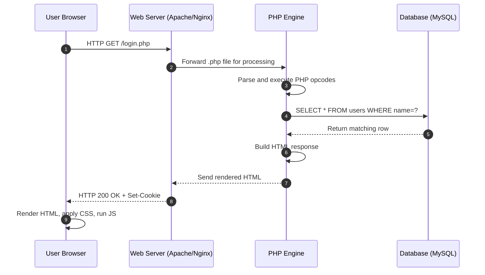
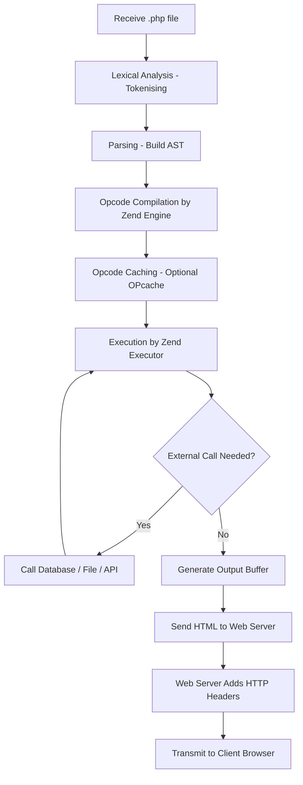
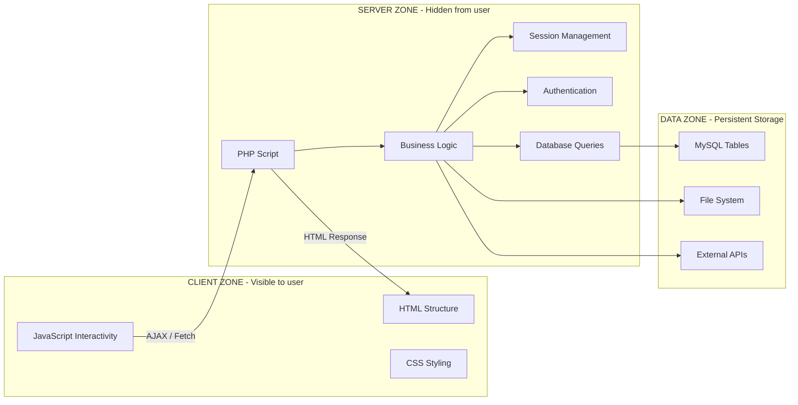
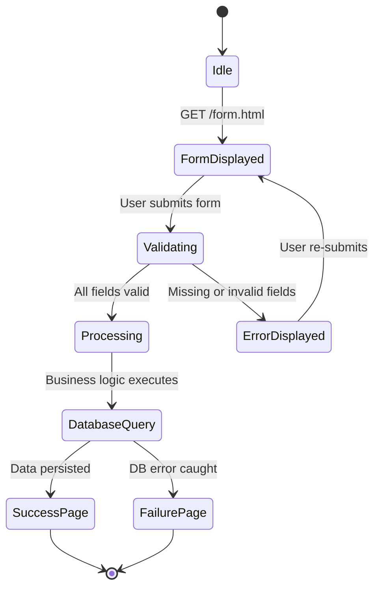
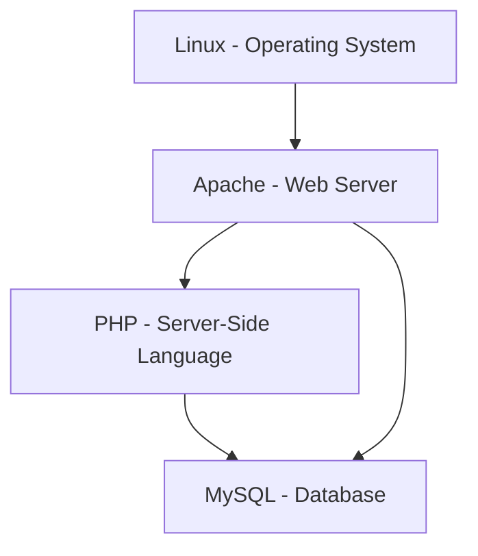

# Server-side programming language : PHP  - What Is Server-Side Development?

<!-- SECTION_1_START -->
# What Is Server-Side Development?

## 1.1 Formal Academic Definition (KTU 2024 Syllabus Terminology)

> [!NOTE]
> **Definition — Server-Side Development**
> Server-side development (also called *back-end development*) refers to the process of writing, deploying, and maintaining code that runs on a **web server** rather than inside the user's browser. It is responsible for handling HTTP/HTTPS requests, executing business logic, interacting with databases, generating dynamic HTML, and sending the response back to the client.

In the **KTU 2024 Scheme (PECST742 – Web Programming)**, server-side programming is introduced as the engine that powers dynamic web applications. The most common languages used for this purpose are **PHP**, **Python (Django/Flask)**, **Node.js (JavaScript)**, **Java (Spring)**, **C# (ASP.NET)**, and **Ruby on Rails**.

### PHP — The Course Focus Language

> [!IMPORTANT]
> **Definition — PHP (PHP: Hypertext Preprocessor)**
> **PHP** is a widely-used, open-source, general-purpose **server-side scripting language** that is especially suited for web development and can be embedded directly into HTML. PHP scripts are executed on the server, generating HTML which is then sent to the client browser.

Key markers of PHP (per KTU module expectations):
- **Typed language flavor:** Dynamically / loosely typed
- **Paradigm:** Multi-paradigm (procedural, object-oriented, functional)
- **Standard file extension:** `.php`
- **Default port for development server:** **Port 80** (or **8000** for `php -S`)
- **Latest stable line (relevant to KTU labs):** **PHP 8.x**

---

## 1.2 Conceptual Analogy — The Restaurant Kitchen

Think of a website as a **restaurant**:

| Component | Real-world Analogy | Technical Equivalent |
|---|---|---|
| **Dining area** | Where customers sit and look at the menu | **Client-side (Browser, HTML, CSS, JS)** |
| **Waiter** | Takes your order and brings the food | **HTTP Request / Response cycle** |
| **Kitchen** | Where food is actually cooked | **Server (running PHP code)** |
| **Refrigerator / Pantry** | Where ingredients are stored | **Database (MySQL, PostgreSQL, MongoDB)** |
| **Chef** | Prepares the dish using a recipe | **PHP script executing business logic** |

> When a customer (**browser**) places an order (**HTTP request**), the waiter (**HTTP protocol**) carries it to the kitchen (**server**). The chef (**PHP engine**) looks in the refrigerator (**database**), cooks the meal (**processes data**), and hands it back to the waiter who delivers it to the customer as a finished plate (**HTML response**).

The customer **never** sees the kitchen — that is the essence of server-side processing.

---

## 1.3 Why Server-Side Development is Required

Static HTML alone is **read-only** and **identical for every visitor**. Real applications need:

1. **Personalisation** — greeting the user by name
2. **Persistence** — storing form submissions in a database
3. **Security** — hiding credentials, encrypting passwords (e.g., `password_hash()`)
4. **Authentication & Sessions** — login/logout, shopping carts
5. **Third-party API integration** — payment gateways, maps
6. **Business logic** — calculating totals, validating rules

> [!TIP]
> A useful KTU rule of thumb: **"If the logic involves secret data, a database, or a user-specific result — it MUST be server-side."**

---

## 1.4 Visualisation Control — Client vs. Server Boundary

> [!VISUALIZATION CONTROL]
> **Concept:** Round-trip time of an HTTP request showing where PHP executes.
> **GeoGebra / Desmos Input Equations:**
> * `f(x) = piecewise{1, 0 ≤ x ≤ 3 (Client render zone), 5, 3 < x ≤ 7 (Network transit zone), 12, 7 < x ≤ 11 (Server execution zone), 5, 11 < x ≤ 15 (Network return), 1, 15 < x ≤ 18 (Client paint zone)}`
> * `x-axis = Time (ms)` &nbsp;&nbsp; `y-axis = Activity intensity`
> **Visual Description:** The student should observe a **low flat zone** (client static), a **sharp spike at the server zone** (where PHP runs), then a symmetric return. The PHP execution zone is where *all* dynamic content is born.

---

## 1.5 Architecture Diagram (Conceptual)

$$
\underbrace{\text{Browser (HTML/CSS/JS)}}_{\text{Client}} \;\;\xrightarrow[\text{HTTP Request}]{\text{over the Internet}} \;\; \underbrace{\text{Web Server (Apache/Nginx)} \rightarrow \text{PHP Engine} \rightarrow \text{Database}}}_{\text{Server-Side}}
$$

The **arrow direction** is critical:
- The request travels *Client → Server*.
- The response travels *Server → Client*.
- PHP **never** executes inside the browser.
<!-- SECTION_1_END -->

<!-- SECTION_2_START -->
# Deep Theoretical Analysis & KTU High-Yield Cheat Sheet

## 2.1 The Request-Response Lifecycle (Step-by-Step)

When a user types `https://example.com/login.php` into the browser, the following sequence unfolds:

1. **DNS Resolution** — The domain `example.com` is translated into an IP address (e.g., `93.184.216.34`).
2. **TCP Handshake** — A reliable connection is established (3-way handshake: `SYN → SYN-ACK → ACK`).
3. **HTTP Request** — The browser sends an HTTP message:

   ```http
   GET /login.php HTTP/1.1
   Host: example.com
   User-Agent: Mozilla/5.0
   Accept: text/html
   Cookie: session_id=abc123
   ```

4. **Web Server Receives Request** — Software like **Apache** or **Nginx** identifies the file extension `.php` and forwards it to the **PHP interpreter** (mod_php, PHP-FPM, or built-in dev server).
5. **PHP Engine Executes Script** — The PHP parser tokenises the file, builds an AST (Abstract Syntax Tree), and the **Zend Engine** compiles it to **opcodes** which are then executed.
6. **Optional Database Call** — Using extensions such as `mysqli` or `PDO`, the script may read/write a **MySQL/MariaDB** database.
7. **Response Generation** — PHP outputs a raw HTML stream (anything outside `<?php ... ?>` is echoed as-is).
8. **HTTP Response** — Web server wraps the output with headers:

   ```http
   HTTP/1.1 200 OK
   Content-Type: text/html; charset=UTF-8
   Set-Cookie: session_id=xyz789
   ```

9. **Browser Renders** — The browser parses the HTML, applies CSS, executes JavaScript, and displays the page.

---

## 2.2 Core PHP Characteristics (High-Yield for KTU)

- **Interpreted** — No separate compilation step; the Zend Engine compiles to opcodes on the fly.
- **Loosely typed** — Variables do not require explicit type declarations (`$x = 5;` and `$x = "hello";` are both valid).
- **Case-sensitive for variables**, **case-insensitive for keywords/function names** (a common exam trap).
- **Statement terminator:** semicolon `;` (mandatory).
- **Variable prefix:** dollar `$` (e.g., `$username`).
- **Embedding:** PHP code is enclosed in `<?php ... ?>` tags.
- **Superglobals:** `$_GET`, `$_POST`, `$_REQUEST`, `$_SERVER`, `$_SESSION`, `$_COOKIE`, `$_FILES`, `$_ENV`, `$GLOBALS`.

---

## 2.3 KTU High-Yield Cheat Sheet

> [!IMPORTANT]
> The following table is the **must-memorise reference** for Module-3 KTU exams. Memorising the symbols, codes, and status values is worth easy 3–5 marks on the paper.

| Concept / Symbol | Meaning / Value | Notes / KTU Pitfall |
|---|---|---|
| `.php` | Standard PHP file extension | Files saved as `.html` will **not** be processed by the PHP engine |
| `<?php ... ?>` | PHP opening/closing tags | Outside this, content is echoed literally |
| `echo` | Outputs one or more strings | No return value, marginally faster than `print` |
| `print` | Outputs a string, returns `1` | Only one argument allowed |
| `$variable` | Variable prefix | PHP variables **always** begin with `$` |
| `$_GET` | Super-global for URL parameters | Data visible in the address bar |
| `$_POST` | Super-global for form POST data | Data hidden from URL; required for sensitive data |
| `$_SERVER['REQUEST_METHOD']` | Returns `'GET'` or `'POST'` | Used to detect form submission |
| `$_SESSION` | Per-user storage across pages | Requires `session_start()` at the top of every script |
| `$_COOKIE` | Small client-side key-value store | Max ~**4 KB** per cookie; sent with every request |
| `phpinfo()` | Outputs full PHP configuration | Useful for debugging; **never** expose on production |
| `var_dump($x)` | Prints type + value | Preferred for debugging in labs |
| `php -S localhost:8000` | Starts built-in dev server (PHP 5.4+) | Used in KTU lab exams |
| Port **80** | Default HTTP port | Apache default |
| Port **443** | Default HTTPS port | TLS/SSL encrypted |
| Port **3306** | Default MySQL port | Used by `mysqli`/`PDO` |
| HTTP **200** | OK — request succeeded | Standard success code |
| HTTP **301** | Moved permanently | SEO-friendly redirect |
| HTTP **302** | Found (temporary redirect) | Default for `header("Location: ...")` |
| HTTP **404** | Not Found | Missing file / wrong path |
| HTTP **500** | Internal Server Error | PHP fatal error or misconfiguration |
| HTTP **405** | Method Not Allowed | `POST` sent to a route that only accepts `GET` |
| `isset($_POST['x'])` | Checks if form field was submitted | **Always** use this before accessing `$_POST` |
| `empty($x)` | True for `""`, `0`, `"0"`, `null`, `false`, `[]` | Common source of bugs |
| `htmlspecialchars($s)` | Escapes HTML to prevent **XSS** | Always apply on user input before echoing |
| `password_hash($p, PASSWORD_DEFAULT)` | Securely hashes a password | Uses **bcrypt** by default |
| `password_verify($p, $hash)` | Verifies a hashed password | Constant-time comparison |

---

## 2.4 Static vs. Dynamic vs. Server-Side — The Distinction

| Feature | Static (HTML/CSS only) | Client-Side Dynamic (JS) | Server-Side (PHP) |
|---|---|---|---|
| **Runs on** | Browser | Browser | Web server |
| **Source visible to user?** | Yes | Yes (View Source) | **No** |
| **Can access database?** | No | No | **Yes** |
| **Can access filesystem?** | No | Limited (sandboxed) | **Yes** |
| **Performance** | Fastest | Fast (no round trip) | Slower (network + processing) |
| **Security for secrets** | None | None | **High** |
| **Example use** | Brochure page | Form validation, animations | Login, payment, search |

---

## 2.5 Real-World Engineering Utility

PHP powers a significant slice of the modern web:

- **WordPress** runs **~43%** of all websites globally (2024 data) — entirely PHP-based.
- **Facebook** originated in PHP (later optimised to **HipHop/HHVM**, then largely rewritten).
- **Wikipedia** uses PHP for its rendering pipeline.
- **Magento**, **Drupal**, **Laravel**, **Symfony** — all PHP frameworks used in production.

In an industry context, server-side PHP is the **glue** between:
1. **Front-end frameworks** (React, Vue) talking to it via **REST APIs** or **GraphQL**.
2. **Relational databases** (MySQL, PostgreSQL) where the canonical state of the application lives.
3. **Caching layers** (Redis, Memcached) for high-traffic performance.
4. **Message queues** (RabbitMQ, Kafka) for asynchronous jobs.
<!-- SECTION_2_END -->

<!-- SECTION_3_START -->
# Step-by-Step Implementation — PHP Code Walkthroughs

## 3.1 The Simplest PHP Program — "Hello, KTU!"

```php
<!DOCTYPE html>
<html lang="en">
<head>
    <meta charset="UTF-8">
    <title>First PHP Program</title>
</head>
<body>
    <h1>
        <?php
            // PHP block — runs on the SERVER
            echo "Hello, KTU!";
        ?>
    </h1>
    <p>This text is rendered as static HTML.</p>
</body>
</html>
```

**Execution trace (what the server actually sends to the browser):**
```html
<!DOCTYPE html>
<html lang="en">
<head>
    <meta charset="UTF-8">
    <title>First PHP Program</title>
</head>
<body>
    <h1>
        Hello, KTU!</h1>
    <p>This text is rendered as static HTML.</p>
</body>
</html>
```
The browser **never** sees the PHP tags — it only receives the rendered output.

---

## 3.2 Demonstrating `$_GET` — Reading URL Parameters

**Form (`form_get.html`):**
```html
<!DOCTYPE html>
<html>
<body>
    <h2>GET Method Demo</h2>
    <form action="welcome_get.php" method="GET">
        Name: <input type="text" name="username">
        <input type="submit" value="Submit">
    </form>
</body>
</html>
```

**Handler (`welcome_get.php`):**
```php
<?php
    // 1. Check if the form was actually submitted
    if (isset($_GET['username']) && !empty($_GET['username'])) {
        // 2. Sanitise input to prevent XSS
        $name = htmlspecialchars($_GET['username']);
        // 3. Render personalised response
        echo "<h1>Welcome, " . $name . "!</h1>";
        echo "<p>You arrived via a GET request.</p>";
    } else {
        echo "<p>Please enter your name using the form.</p>";
    }
?>
```

**URL after submission:** `welcome_get.php?username=Anand`

> [!TIP]
> **Why sanitisation matters:** Without `htmlspecialchars()`, an attacker can submit `<script>alert('XSS')</script>` as the username and inject executable JavaScript into your page. This is one of the **OWASP Top 10** vulnerabilities.

---

## 3.3 Demonstrating `$_POST` — Secure Form Processing

**Form (`form_post.html`):**
```html
<!DOCTYPE html>
<html>
<body>
    <h2>Login (POST Method)</h2>
    <form action="login.php" method="POST">
        Username: <input type="text" name="user" required><br><br>
        Password: <input type="password" name="pwd" required><br><br>
        <input type="submit" value="Login">
    </form>
</body>
</html>
```

**Handler (`login.php`):**
```php
<?php
    // Always start output BEFORE any HTML when using header()
    if ($_SERVER['REQUEST_METHOD'] !== 'POST') {
        http_response_code(405);
        echo "405 — Method Not Allowed. Please use the login form.";
        exit;
    }

    if (!isset($_POST['user'], $_POST['pwd'])) {
        http_response_code(400);
        echo "400 — Bad Request. Missing fields.";
        exit;
    }

    $user = trim($_POST['user']);
    $pwd  = $_POST['pwd'];

    // Hard-coded demo credentials (NEVER do this in production)
    $validUser = "admin";
    $validHash = password_hash("secret123", PASSWORD_DEFAULT);

    if ($user === $validUser && password_verify($pwd, $validHash)) {
        // Start a session and store user info
        session_start();
        $_SESSION['logged_in'] = true;
        $_SESSION['username']  = $user;
        echo "<h1>Login successful! Welcome, " . htmlspecialchars($user) . ".</h1>";
        echo '<p><a href="dashboard.php">Go to dashboard</a></p>';
    } else {
        echo "<p style='color:red;'>Invalid credentials.</p>";
    }
?>
```

**Line-by-line reasoning:**

1. `if ($_SERVER['REQUEST_METHOD'] !== 'POST')` — Rejects direct URL access and GET-based CSRF attempts.
2. `http_response_code(405)` — Sends the **correct** HTTP status code (board examiners love this).
3. `isset($_POST['user'], $_POST['pwd'])` — PHP supports checking multiple keys in one call.
4. `trim($user)` — Strips leading/trailing whitespace.
5. `password_hash()` — Generates a bcrypt hash; the plaintext password is **never** stored.
6. `password_verify()` — Constant-time comparison (prevents **timing attacks**).
7. `session_start()` — Initializes the session, sending a `Set-Cookie` header.
8. `htmlspecialchars($user)` — Output encoding right before echoing.

---

## 3.4 Using Sessions Across Multiple Pages

**`page1.php`** — Set session data:
```php
<?php
    session_start();            // MUST be the very first thing
    $_SESSION['visits']  = 1;
    $_SESSION['username'] = "Anand";
    echo "Session started. <a href='page2.php'>Go to page 2</a>";
?>
```

**`page2.php`** — Read session data:
```php
<?php
    session_start();

    if (!isset($_SESSION['username'])) {
        echo "Please log in first.";
        exit;
    }

    if (isset($_SESSION['visits'])) {
        $_SESSION['visits']++;
    } else {
        $_SESSION['visits'] = 1;
    }

    echo "Hello, " . htmlspecialchars($_SESSION['username']) . "!<br>";
    echo "You have visited " . $_SESSION['visits'] . " pages in this session.";
?>
```

**Key rule:** `session_start()` must be called **before any output** (including whitespace) is sent to the browser. Violating this triggers the famous *"headers already sent"* warning.

---

## 3.5 Database Connectivity — PDO with MySQL

```php
<?php
    $host = "localhost";
    $db   = "krutu_db";
    $user = "root";
    $pass = "";
    $charset = "utf8mb4";

    // Data Source Name
    $dsn = "mysql:host=$host;dbname=$db;charset=$charset";

    $options = [
        PDO::ATTR_ERRMODE            => PDO::ERRMODE_EXCEPTION,
        PDO::ATTR_DEFAULT_FETCH_MODE => PDO::FETCH_ASSOC,
        PDO::ATTR_EMULATE_PREPARES   => false,
    ];

    try {
        $pdo = new PDO($dsn, $user, $pass, $options);

        // Prepared statement (prevents SQL injection)
        $stmt = $pdo->prepare("SELECT id, name, email FROM students WHERE id = :id");
        $stmt->execute(['id' => 101]);
        $student = $stmt->fetch();

        if ($student) {
            echo "Student: " . htmlspecialchars($student['name'])
               . " (" . htmlspecialchars($student['email']) . ")";
        } else {
            echo "No student found.";
        }
    } catch (PDOException $e) {
        error_log("DB Error: " . $e->getMessage());
        echo "A database error occurred. Please try again later.";
    }
?>
```

**Why prepared statements?** They separate **code** from **data**. The query template is sent to MySQL first, then the parameters are bound — the database engine knows the difference, making SQL injection impossible.

---

## 3.6 Sending an HTTP Redirect

```php
<?php
    // Must be called BEFORE any output
    if (!isset($_SESSION['logged_in'])) {
        header("Location: login.html");
        exit;   // CRITICAL — prevents script from continuing
    }
?>
```

`exit;` after a `header("Location: ...")` is **mandatory** in exam answers. Examiners specifically check for it because the script could otherwise continue and leak sensitive data before the redirect actually fires.

---

## 3.7 Symbolic Derivation — The HTTP Status Code Math

Although PHP is not a math-heavy subject, the HTTP semantics map neatly to a decision tree:

$$
\text{HTTPStatus}(r) =
\begin{cases}
200, & \text{if } \text{auth}(r) \text{ AND } \text{resource}(r) \text{ exists} \\
301, & \text{if } \text{resource}(r) \text{ moved permanently} \\
302, & \text{if } \text{resource}(r) \text{ moved temporarily} \\
400, & \text{if } \text{request}(r) \text{ malformed} \\
401, & \text{if } \neg \text{auth}(r) \\
403, & \text{if } \text{auth}(r) \text{ AND } \neg \text{permission}(r) \\
404, & \text{if } \text{resource}(r) \text{ not found} \\
405, & \text{if } \text{method}(r) \notin \text{allowed}(r) \\
500, & \text{if } \text{server error during } \text{process}(r)
\end{cases}
$$

where:
- $r$ = incoming HTTP request
- $\text{auth}(r)$ = user is authenticated
- $\text{resource}(r)$ = target resource exists on the server
- $\text{method}(r) \in \text{allowed}(r)$ = HTTP method is permitted for that route
<!-- SECTION_3_END -->

<!-- SECTION_4_START -->
# Structural Diagrams & Schematics

## 4.1 Client–Server Request-Response Flow



---

## 4.2 PHP Execution Pipeline (Inside the Server)



---

## 4.3 Topological Matrix of Server-Side Responsibilities



---

## 4.4 Form Processing State Machine



---

## 4.5 The LAMP Stack Architecture (Industry Context)



> [!TIP]
> **LAMP** (Linux, Apache, MySQL, PHP) is the most-deployed web stack in history. KTU lab examinations frequently use **XAMPP** (cross-platform LAMP) or **WAMP** (Windows variant) — both ship with Apache, MySQL/MariaDB, and PHP pre-configured.
<!-- SECTION_4_END -->

<!-- SECTION_5_START -->
# KTU 2024 Scheme Examination Question Bank & Topic Recap

---

## Part A — Short Answer Questions (3 Marks Each)

> [!NOTE]
> Each Part-A question below is mapped to a specific KTU Course Outcome (CO) and Revised Bloom's Taxonomy (RBT) cognitive level. Memorise the model answers verbatim — they follow the **KTU valuation key** style of crisp 3-mark responses.

### Q1. **[KTU University Exam – July 2024]**
**Define server-side development. List any four server-side scripting languages.** &nbsp;&nbsp; **[CO1 | Remember — 3 Marks]**

**Model Answer (3 Marks):**
- **[1 Mark]** Server-side development refers to writing code that runs on a **web server** rather than the client's browser. It is responsible for processing HTTP requests, executing business logic, interacting with databases, and generating dynamic responses.
- **[1 Mark]** Any four of the following:
  1. **PHP**
  2. **Python** (Django / Flask)
  3. **Node.js** (JavaScript)
  4. **Java** (Spring / JSP / Servlets)
  5. **C#** (ASP.NET)
  6. **Ruby** (Ruby on Rails)
- **[1 Mark]** Server-side code is **never visible** to the end user — only its output is sent over HTTP. This makes it the appropriate place for secret data, database access, and authentication logic.

---

### Q2. **[KTU University Exam – Dec 2023]**
**Differentiate between client-side and server-side scripting with a minimum of four points.** &nbsp;&nbsp; **[CO1 | Understand — 3 Marks]**

**Model Answer (3 Marks):**

| # | Client-Side Scripting | Server-Side Scripting |
|---|---|---|
| 1 | Executes inside the **browser** | Executes on the **web server** |
| 2 | Source code visible via "View Source" | Source code **hidden** from user |
| 3 | Cannot access databases / filesystems | Can access databases / filesystems |
| 4 | Used for validation, animation, UI effects | Used for authentication, persistence, business logic |
| 5 | Example: JavaScript, HTML, CSS | Example: PHP, Python, JSP, ASP.NET |

> **[1 Mark]** for each valid contrasting point; minimum 3 points expected for full marks. Examiners specifically look for the *security* angle.

---

## Part B — Long Answer Questions (14 Marks Each — Internal Choice)

> [!IMPORTANT]
> KTU ESE Part-B questions carry **14 marks** with internal choice. Each question is split into two sub-parts: **Part (a) = 7 marks**, **Part (b) = 7 marks**. The cognitive level typically escalates: Part (a) = Understand, Part (b) = Apply or higher.

---

### Question A (14 Marks)

**Q3(a). [KTU University Exam – July 2024]**
**Explain the architecture of server-side development with a neat diagram. Describe the role of the web server, PHP engine, and database in processing a request.** &nbsp;&nbsp; **[CO1 | Understand — 7 Marks]**

**Model Solution (7 Marks):**

1. **[Diagram — 3 Marks]** The diagram should show the following components in sequence:
   - **Client (Browser)** → **Internet / Network** → **Web Server (Apache/Nginx)** → **PHP Engine** → **Database (MySQL)** → response back along the same path.

   ```mermaid
   flowchart LR
       B[Browser] -->|HTTP Request| W[Web Server]
       W -->|Forward .php| P[PHP Engine]
       P -->|SQL Query| D[MySQL Database]
       D -->|Result Set| P
       P -->|HTML Output| W
       W -->|HTTP Response| B
   ```

2. **[Web Server Role — 1.5 Marks]** Apache/Nginx listens on **port 80** (HTTP) or **port 443** (HTTPS). It receives the HTTP request, identifies the file extension, and routes `.php` files to the PHP engine.

3. **[PHP Engine Role — 1.5 Marks]** The PHP engine (Zend Engine) parses the script, compiles to opcodes, executes them line by line, optionally calls the database, and outputs the resulting HTML stream.

4. **[Database Role — 1 Mark]** The database stores persistent data (users, products, posts). The PHP engine uses `mysqli` or `PDO` extensions to query it.

---

**Q3(b). [KTU University Exam – July 2024]**
**Write a complete PHP program that accepts a student's name and three subject marks through a POST form, calculates the total, average, and grade, and displays the result. Apply input sanitisation.** &nbsp;&nbsp; **[CO2 | Apply — 7 Marks]**

**Model Solution (7 Marks):**

**`student_form.html`:**
```html
<!DOCTYPE html>
<html>
<head><title>Student Grade Calculator</title></head>
<body>
    <h2>Student Marks Entry</h2>
    <form action="grade.php" method="POST">
        Name: <input type="text" name="name" required><br><br>
        Subject 1: <input type="number" name="m1" min="0" max="100" required><br>
        Subject 2: <input type="number" name="m2" min="0" max="100" required><br>
        Subject 3: <input type="number" name="m3" min="0" max="100" required><br><br>
        <input type="submit" value="Calculate Grade">
    </form>
</body>
</html>
```

**`grade.php`:**
```php
<?php
    // [Checking HTTP method — 1 Mark]
    if ($_SERVER['REQUEST_METHOD'] !== 'POST') {
        http_response_code(405);
        echo "Method Not Allowed";
        exit;
    }

    // [Validating inputs exist — 1 Mark]
    if (!isset($_POST['name'], $_POST['m1'], $_POST['m2'], $_POST['m3'])) {
        echo "All fields are required.";
        exit;
    }

    // [Sanitisation + type casting — 1 Mark]
    $name = htmlspecialchars(trim($_POST['name']));
    $m1   = (int) $_POST['m1'];
    $m2   = (int) $_POST['m2'];
    $m3   = (int) $_POST['m3'];

    // [Validation — 1 Mark]
    if ($m1 < 0 || $m1 > 100 || $m2 < 0 || $m2 > 100 || $m3 < 0 || $m3 > 100) {
        echo "Marks must be between 0 and 100.";
        exit;
    }

    // [Calculation — 1 Mark]
    $total  = $m1 + $m2 + $m3;
    $avg    = $total / 3;

    // [Grade logic — 1 Mark]
    if ($avg >= 90)      $grade = 'A+';
    elseif ($avg >= 80)  $grade = 'A';
    elseif ($avg >= 70)  $grade = 'B';
    elseif ($avg >= 60)  $grade = 'C';
    elseif ($avg >= 50)  $grade = 'D';
    else                 $grade = 'F';

    // [Output — 1 Mark]
    echo "<h2>Result for " . $name . "</h2>";
    echo "<p>Total: $total / 300</p>";
    echo "<p>Average: " . number_format($avg, 2) . "</p>";
    echo "<p>Grade: <strong>$grade</strong></p>";
?>
```

**Valuation Key Distribution:**
- [Method check + early exit: 1 Mark]
- [Input validation with `isset`: 1 Mark]
- [Sanitisation with `htmlspecialchars` + `trim` + type casting: 1 Mark]
- [Range validation of marks: 1 Mark]
- [Total & average calculation: 1 Mark]
- [Grade `if-elseif` ladder: 1 Mark]
- [Formatted output: 1 Mark]

---

### Question B (14 Marks) — *Alternative Choice*

**Q4(a). [KTU University Exam – Dec 2023]**
**Describe PHP superglobals. Explain the differences between `$_GET`, `$_POST`, `$_REQUEST`, and `$_SESSION` with one real-world use case for each.** &nbsp;&nbsp; **[CO1 | Understand — 7 Marks]**

**Model Solution (7 Marks):**

1. **[Definition — 2 Marks]** PHP superglobals are **built-in associative arrays** that are available in every scope of a script without needing the `global` keyword. They were introduced in PHP 4.1.0 and include `$_GET`, `$_POST`, `$_REQUEST`, `$_SERVER`, `$_SESSION`, `$_COOKIE`, `$_FILES`, `$_ENV`, and `$GLOBALS`.

2. **[Comparison table — 4 Marks]**

| Super-global | Source | Visibility | Typical Use Case |
|---|---|---|---|
| `$_GET` | URL query string | Visible in address bar | **Search filters** — `search.php?q=php` |
| `$_POST` | HTTP request body | Hidden from URL | **Login forms** — username + password |
| `$_REQUEST` | Merged `$_GET`, `$_POST`, `$_COOKIE` | Depends on `request_order` ini setting | **Fallback reads** when method is unknown |
| `$_SESSION` | Server-side store, identified by cookie | Persists across pages | **Shopping cart** — items added in one page, viewed in another |

3. **[Security warning — 1 Mark]** Always validate and sanitise superglobal values before use; never trust client input.

---

**Q4(b). [KTU University Exam – Dec 2023]**
**Write a PHP script to demonstrate session management: create a login page that authenticates against a hard-coded username/password, starts a session on success, displays a welcome message with the visit count, and provides a logout link that destroys the session.** &nbsp;&nbsp; **[CO2 | Apply — 7 Marks]**

**Model Solution (7 Marks):**

**`login_session.php`:**
```php
<?php
    // [session_start at the very top — 1 Mark]
    session_start();

    $validUser = "admin";
    $validPass = "ktu2024";

    // [Handle logout link — 1 Mark]
    if (isset($_GET['action']) && $_GET['action'] === 'logout') {
        $_SESSION = [];                    // clear session array
        session_destroy();                 // destroy server-side session
        header("Location: login_session.php");
        exit;
    }

    $error = "";
    if ($_SERVER['REQUEST_METHOD'] === 'POST') {
        $u = $_POST['username'] ?? '';
        $p = $_POST['password'] ?? '';

        // [Authentication check — 1 Mark]
        if ($u === $validUser && $p === $validPass) {
            $_SESSION['user']  = $u;
            $_SESSION['visits'] = ($_SESSION['visits'] ?? 0) + 1;
        } else {
            $error = "Invalid credentials.";
        }
    }

    // [Output — conditional welcome or form — 2 Marks]
    if (isset($_SESSION['user'])) {
        $visits = $_SESSION['visits'];
        echo "<h1>Welcome, " . htmlspecialchars($_SESSION['user']) . "!</h1>";
        echo "<p>You have visited this page $visits time(s).</p>";
        echo '<p><a href="login_session.php?action=logout">Logout</a></p>';
    } else {
        if ($error) echo "<p style='color:red;'>$error</p>";
        echo '<form method="POST">
                Username: <input type="text" name="username"><br>
                Password: <input type="password" name="password"><br>
                <input type="submit" value="Login">
              </form>';
    }
?>
```

**Valuation Key Distribution:**
- [`session_start()` at top of script: 1 Mark]
- [Logout handling with `session_destroy()` + redirect: 1 Mark]
- [POST request authentication logic: 1 Mark]
- [Visit count increment using `??` null-coalesce: 1 Mark]
- [Conditional rendering of welcome vs. form: 1 Mark]
- [HTML escaping with `htmlspecialchars`: 1 Mark]
- [Proper use of `exit` after `header()`: 1 Mark]

---

> [!WARNING]
> **KTU Examiner's Valuation Warning — Common Pitfalls**
> 1. **Forgetting `session_start()`** — without it, `$_SESSION` is empty, and the script silently fails. Examiners check for this on the **very first line** of the PHP block.
> 2. **Output before `header("Location: ...")`** — causes the *"headers already sent"* error. Always call `header()` and `exit` before any HTML/whitespace.
> 3. **Echoing raw `$_POST`/`$_GET` data** — XSS vulnerability; always use `htmlspecialchars()`.
> 4. **String comparison with `==` for passwords** — should use `===` for strict comparison, or better, `password_verify()`.
> 5. **Missing `exit` after `header()`** — the script keeps running and may leak data.
> 6. **Not checking `$_SERVER['REQUEST_METHOD']`** — accepting GET requests on a POST-only endpoint is a security hole.
> 7. **Spelling `$_SESSION` as `$__SESSION` or `$_SESSIONS`** — this is a common typo. Double-check.
> 8. **Using `mysql_*` functions** — these are **removed in PHP 7+**; always use `mysqli` or `PDO`.

---

## 📌 Topic Recap & Important Things to Remember

- **Server-side development** = code that runs on the **web server**, not in the browser. It handles requests, executes logic, talks to databases, and returns HTML/JSON.
- **PHP** is the canonical server-side language for KTU Module-3; file extension is **`.php`**, embedded in `<?php ... ?>` tags.
- **Client vs Server**: client-side (HTML/CSS/JS) runs in the browser, source visible; server-side (PHP/Python/Java) runs on the server, source hidden, has access to DB and filesystem.
- **HTTP methods**: `GET` (read, visible in URL, idempotent) and `POST` (create/update, hidden, body-based). Use `$_SERVER['REQUEST_METHOD']` to detect.
- **Superglobals** are the core I/O arrays: `$_GET`, `$_POST`, `$_REQUEST`, `$_SERVER`, `$_SESSION`, `$_COOKIE`, `$_FILES`.
- **Session lifecycle**: `session_start()` → use `$_SESSION` → `session_destroy()` for logout. Session data lives on the **server**, identified by a **cookie**.
- **Cookies** are small (~4 KB) client-side key-value stores, sent with every HTTP request; **sessions** are server-side and more secure.
- **Status codes** to memorise: **200** (OK), **301/302** (redirects), **400** (bad request), **401** (unauthorised), **403** (forbidden), **404** (not found), **405** (method not allowed), **500** (server error).
- **LAMP stack** = Linux + Apache + MySQL + PHP — the industry-standard PHP deployment. XAMPP/WAMP is the lab-friendly variant.
- **Security triad** for every PHP script:
  1. **Input validation** — `isset()`, range checks.
  2. **Output escaping** — `htmlspecialchars()`.
  3. **Secure storage** — `password_hash()`, prepared statements.
- **Built-in dev server**: `php -S localhost:8000` (since PHP 5.4) — perfect for KTU lab exams.
- **The Zend Engine** parses, compiles to opcodes, and executes PHP scripts; **OPcache** stores opcodes in memory for performance.
- **Prepared statements** with `PDO` or `mysqli` are the **only** safe way to query databases — they prevent **SQL injection**.
- **Always** call `exit` immediately after `header("Location: ...")` to prevent script continuation.
- **Top 3 PHP exam mistakes**: missing `session_start()`, no `htmlspecialchars()` on output, no `exit` after `header()`.
<!-- SECTION_5_END -->
