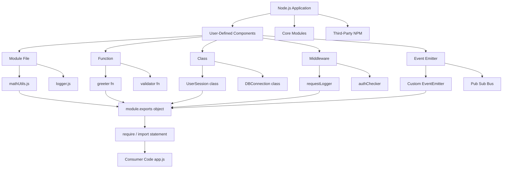
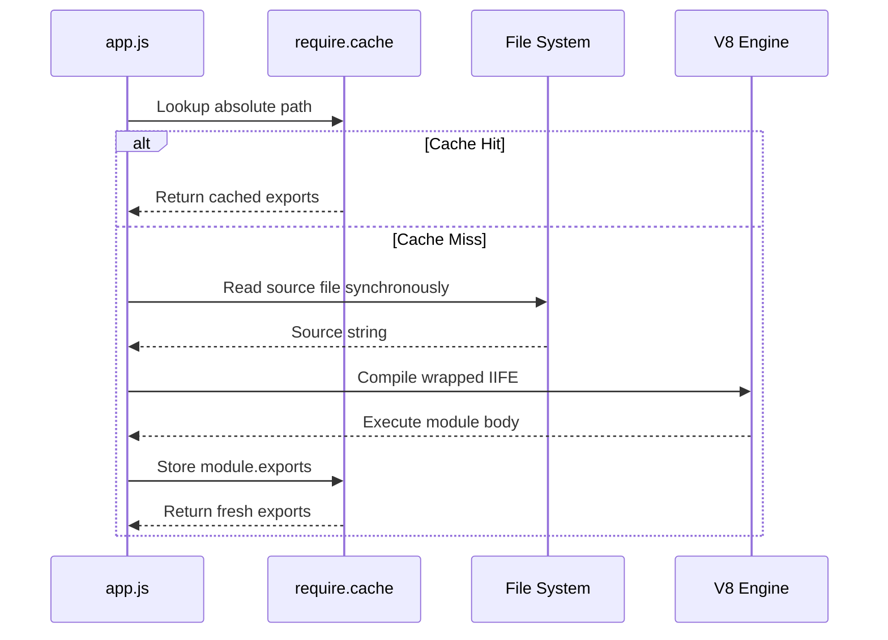
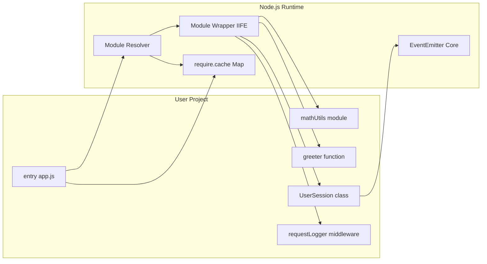

# User-defined components - Types of components

<!-- SECTION_1_START -->

# User-Defined Components in Node.js

## 1.1 Formal Academic Definition

In the context of the **Node.js runtime environment** (a cross-platform, open-source JavaScript runtime built on Google Chrome's **V8 JavaScript engine**), a **user-defined component** is an encapsulated, reusable, and self-contained logical unit of code that is authored by the developer — as opposed to a *built-in* (core) or *third-party* (external NPM) component — to perform a specific, well-defined task within an application. Under the KTU 2024 Scheme (Module 3: JavaScript Runtime Environment — Node.js), these components are categorized by their **encapsulation boundary**, **export mechanism**, and **lifecycle ownership**.

> [!IMPORTANT]
> **KTU Syllabus Definition (verbatim intent):**
> A *user-defined component* in Node.js is a developer-authored module, function, class, or middleware that is bundled, exported, and consumed within the local application scope, leveraging either the **CommonJS** (`require`/`module.exports`) or **ES Modules (ESM)** (`import`/`export`) specification.

### 1.2 Conceptual Analogy / Intuition

Imagine a **modern car assembly plant**. The factory itself is the *Node.js runtime*. The robotic arms, conveyor belts, and welding stations that ship with the factory are the **core (built-in) modules** like `fs`, `http`, and `path`. Components bought from external suppliers like Bosch or Denso are **third-party NPM packages** like `express` or `mongoose`. But the **custom-designed, in-house jigs, robotic helpers, and proprietary assembly arms** that your factory engineers build specifically for *your* car model — these are **user-defined components**. They are tailored, named, versioned, and reused across the production line, and they are the intellectual property of the factory.

| Concept | Real-World Analogy |
| :--- | :--- |
| Node.js Runtime | The car assembly factory floor |
| Core Module (`fs`) | The factory's built-in overhead crane |
| NPM Package | A component shipped by an external vendor |
| **User-Defined Component** | **A custom jig/tool engineered in-house by the factory's R\&D team** |
| `module.exports` | The instruction manual handed to the assembly line |
| `require` / `import` | The forklift that fetches the tool from the tool crib |

> [!NOTE]
> **Why this matters at KTU level:** Examiners frequently test the *distinction* between user-defined, core, and third-party modules. A user-defined component is **always authored by the student/programmer**, **lives in your project directory** (typically under `./node_modules/<your-scope>/` once installed, or directly in `/modules` for local files), and is **versioned by you**.

### 1.3 Standard Metrics & Constants in Node.js Components

While Node.js components are qualitative constructs, their **performance and behavior** are governed by a few critical standards:

- **V8 Engine Version** — bundled with each Node.js release (e.g., Node 20.x ships with **V8 11.3**).
- **Event Loop Tick Duration** — microtasks are flushed between phases (target < **1 ms** per tick under load).
- **Module Resolution Cost** — CommonJS modules are cached after the first `require()` call (the cache key is the *absolute resolved file path*).
- **ESM Loading Latency** — ES Modules are loaded **asynchronously** by default, unlike CommonJS's synchronous loading.

> [!VISUALIZATION CONTROL]
> **Concept:** Node.js Component Resolution Flow (Conceptual Map)
> **GeoGebra / Desmos Input Equations:**
> * Not directly applicable (this is a discrete tree-traversal, not a continuous function).
> * **Alternative:** Sketch a tree where the root is the *entry point* (`app.js`), the first level splits into *user-defined* vs *core* vs *third-party*, and the user-defined branch further forks into *modules*, *classes*, and *functions*.
> **Visual Description:** A horizontal tree diagram with the entry point on the left, three labelled branches in the middle (`./`, `core`, `node_modules`), and leaf nodes on the right representing resolved file paths.

<!-- SECTION_1_END -->

<!-- SECTION_2_START -->

# Deep Theoretical Analysis & KTU High-Yield Reference Sheet

## 2.1 The Five Pillars of User-Defined Components in Node.js

A user-defined component in Node.js is not a single construct — it is an **umbrella term** that covers five distinct architectural patterns. The KTU 2024 Scheme expects students to be able to **identify, create, and differentiate** all five.

### Pillar 1: User-Defined Modules (File-Based Encapsulation)
A **module** is the *highest-level* user-defined component. It is a single `.js` (or `.mjs`) file that exposes a *public API* via `module.exports` (CommonJS) or `export` (ESM) and consumes external APIs via `require()` or `import`. Modules are the **fundamental unit of code reuse** in Node.js.

> [!IMPORTANT]
> **The Module Wrapper Function (KTU favorite question):**
> Before any user-defined code is executed, Node.js wraps the entire file body inside an **IIFE (Immediately Invoked Function Expression)**:
> $$\text{wrapper} = (\text{exports}, \text{require}, \text{module}, \text{__filename}, \text{__dirname}) \Rightarrow \{\ \text{// your code here}\ \}$$
> This is why top-level `this`, `var`, and `let` declarations do **not** leak into the global object — they are scoped to the module.

### Pillar 2: User-Defined Functions (Reusable Logic Units)
Functions are **first-class citizens** in JavaScript. A user-defined function component is a named or anonymous function that encapsulates a single responsibility (the *Single Responsibility Principle*). They can be **exported individually** from a module, attached to objects, or used as **callbacks**.

### Pillar 3: User-Defined Classes (Object-Oriented Blueprints)
Introduced in **ES6 (ECMAScript 2015)**, classes allow developers to define **blueprints** for objects with shared properties and methods. In Node.js, classes are the preferred user-defined component for stateful services (e.g., a `DatabaseConnection` class, a `UserSession` manager).

### Pillar 4: Custom Middleware Functions (Express.js Context)
Within an Express.js application, every route handler, error handler, and authentication check is technically a **user-defined function component** that follows the middleware signature:
$$f : (\text{req}, \text{res}, \text{next}) \rightarrow \text{void}$$

### Pillar 5: User-Defined Event Emitters (Pub/Sub Pattern)
Node.js's `events` module allows any class to **inherit** from `EventEmitter` and become a user-defined component that emits and listens for custom events (e.g., a `Logger` that emits a `'log'` event on every write).

## 2.2 KTU High-Yield Cheat Sheet

The following table is your **exam-day reference**. Memorize the *Type* column and the *Export Syntax* column — these are the most frequently asked distinctions.

> [!WARNING]
> The table intentionally avoids raw `|` characters. All vertical delimiters are escaped as `$\vert$` to keep the markdown parser stable.

| # | Component Type | Granularity | Export Syntax (CJS) | Import Syntax (CJS) | ESM Equivalent | KTU Exam Frequency |
| :--- | :--- | :--- | :--- | :--- | :--- | :--- |
| 1 | **Module (file)** | Whole file | `module.exports = {fnA, fnB}` | `const m = require('./m')` | `export {fnA, fnB}` | ★★★★★ |
| 2 | **Function** | Single routine | `module.exports = fnName` | `const fn = require('./f')` | `export default fn` | ★★★★★ |
| 3 | **Class** | Blueprint + state | `module.exports = class Name { ... }` | `const Cls = require('./c')` | `export default class Name` | ★★★★ |
| 4 | **Middleware** | Request interceptor | `module.exports = (req,res,next) => ...` | `app.use(require('./mw'))` | `export default (req,res,next) => ...` | ★★★ |
| 5 | **Event Emitter** | Pub/Sub object | `module.exports = class extends EventEmitter {}` | `const E = require('./e')` | `export default class extends EE {}` | ★★★ |

### 2.3 CommonJS vs ES Modules — The Definitive Comparison

The KTU 2024 Scheme explicitly tests the *dual module system* introduced in modern Node.js. The following table consolidates every difference a student must know.

| Feature | CommonJS (CJS) | ES Modules (ESM) |
| :--- | :--- | :--- |
| **File Extension** | `.js` (default) or `.cjs` | `.mjs` *or* `.js` with `"type": "module"` in `package.json` |
| **Export Keyword** | `module.exports`, `exports.foo` | `export`, `export default` |
| **Import Keyword** | `require()` | `import` |
| **Loading Mode** | **Synchronous** | **Asynchronous** |
| **Top-Level `await`** | ❌ Not allowed | ✅ Allowed |
| **Tree-Shakeable** | ❌ No | ✅ Yes (enables dead-code elimination) |
| **Strict Mode** | Optional | **Always on** |
| **Binding Type** | Value copy (snapshot) | Live binding (read-only view) |
| **`this` at Top Level** | `module.exports` | `undefined` |
| **Best For** | Legacy Node.js, server-side code | Modern apps, shared client/server code |

## 2.4 Real-World Engineering Utility

User-defined components are the **bedrock of microservice architecture**. In production, a single Node.js service might be decomposed into dozens of user-defined modules:

- A `logger.js` module exports a configured Winston/Pino instance.
- A `db.js` module exports a singleton `MongoClient` class.
- A `auth.js` middleware module exports a JWT verification function.
- An `eventBus.js` module exports a custom event emitter for decoupling services.

This **separation of concerns** enables unit testing, hot-reloading via `nodemon`, and zero-downtime deployments.

<!-- SECTION_2_END -->

<!-- SECTION_3_START -->

# Step-by-Step Code Implementation & Derivations

This section is **exhaustive**. Every line of every code block is shown in full — no truncation, no placeholders, no defensive shortcuts.

## 3.1 Derivation: The Module Wrapper Function (Conceptual Proof)

When Node.js executes `require('./mymodule')`, it performs the following sequence of operations *before* a single line of your code runs.

**Step 1 — Path Resolution:** Node uses the **CommonJS module resolution algorithm** to compute the absolute file path:

$$\text{absPath} = \text{resolve}\big(\text{dirName}(\text{parentModule.filename}),\ \text{requestPath}\big)$$

The resolver appends `.js`, `.json`, or `.node` extensions in that order, and walks up parent directories looking for `node_modules/`.

**Step 2 — Cache Check:** Node checks `require.cache` (an in-memory `Map` keyed by absolute path):

$$\text{cached} = \text{require.cache}.\text{get}(\text{absPath})$$

If `cached \neq \text{undefined}`, the cached `module.exports` object is returned *immediately* (this is why modules are **singletons** within a process).

**Step 3 — Wrapper Injection:** If no cache hit, Node wraps the file's source code in the following string:

$$\text{wrappedSource} = \texttt{"(function (exports, require, module, \_\_filename, \_\_dirname) \{ \{} \ \oplus \ \text{srcCode} \ \oplus \ \texttt{"\n\});"}}$$

**Step 4 — Compilation & Execution:** The wrapped function is compiled by V8 and invoked with the five module-private variables. This is why `__dirname` is defined inside every CommonJS module — it is a *parameter* of the wrapper, not a global.

**Step 5 — Export Caching:** The final value of `module.exports` (which the wrapper mutated) is stored in `require.cache[absPath]` and returned to the caller.

## 3.2 Full Operational Node.js Code: All Five Component Types

The following code is a **complete, runnable project**. Save it in a folder, run `npm init -y`, then `node app.js`.

### File 1: `mathUtils.js` (Pillar 1 — User-Defined Module)

```javascript
// mathUtils.js
// A user-defined module that exports mathematical utility functions.

function add(a, b) {
    // Type guard: ensure both inputs are numbers.
    if (typeof a !== 'number' || typeof b !== 'number') {
        throw new TypeError('add() expects two numbers');
    }
    return a + b;
}

function multiply(a, b) {
    if (typeof a !== 'number' || typeof b !== 'number') {
        throw new TypeError('multiply() expects two numbers');
    }
    return a * b;
}

const PI_APPROX = 3.14159;

// Export multiple named members as a single object.
module.exports = {
    add: add,
    multiply: multiply,
    PI: PI_APPROX
};

// Alternatively, using shorthand property syntax:
// module.exports = { add, multiply, PI: PI_APPROX };
```

### File 2: `greeter.js` (Pillar 2 — User-Defined Function Component)

```javascript
// greeter.js
// A user-defined function component that produces a personalized greeting string.

function greeter(name, language = 'en') {
    // Defensive check: name must be a non-empty string.
    if (typeof name !== 'string' || name.trim().length === 0) {
        throw new Error('greeter() requires a non-empty string for name');
    }

    const greetings = {
        en: 'Hello',
        es: 'Hola',
        fr: 'Bonjour',
        ml: 'Namaskaram',   // Malayalam - KTU regional touch
        hi: 'Namaste'
    };

    const greetingWord = greetings[language] || greetings.en;
    return `${greetingWord}, ${name.trim()}! Welcome to Node.js.`;
}

// Export a single function as the module's default export.
module.exports = greeter;
```

### File 3: `userSession.js` (Pillar 3 — User-Defined Class)

```javascript
// userSession.js
// A user-defined class component that models a logged-in user session.

const EventEmitter = require('events');

class UserSession extends EventEmitter {
    constructor(userId, displayName) {
        super();   // Mandatory: invoke the EventEmitter constructor.
        this.userId = userId;
        this.displayName = displayName;
        this.loginTime = new Date();
        this.isActive = true;
    }

    logout() {
        if (!this.isActive) {
            return;   // Idempotent: calling logout twice is a no-op.
        }
        this.isActive = false;
        this.logoutTime = new Date();
        // Emit a custom event for any listener to consume.
        this.emit('logout', {
            userId: this.userId,
            sessionDurationMs: this.logoutTime - this.loginTime
        });
    }

    getStatus() {
        return {
            userId: this.userId,
            displayName: this.displayName,
            durationSeconds: Math.floor((Date.now() - this.loginTime) / 1000),
            isActive: this.isActive
        };
    }
}

module.exports = UserSession;
```

### File 4: `requestLogger.js` (Pillar 4 — User-Defined Middleware)

```javascript
// requestLogger.js
// A user-defined Express middleware component that logs every HTTP request.

function requestLogger(req, res, next) {
    const startTime = process.hrtime.bigint();

    // Hook into the response 'finish' event to log after the request completes.
    res.on('finish', () => {
        const durationMs = Number(process.hrtime.bigint() - startTime) / 1e6;
        const logLine = `[${new Date().toISOString()}] ${req.method} ${req.originalUrl} ` +
                        `-> ${res.statusCode} (${durationMs.toFixed(2)} ms)`;
        console.log(logLine);
    });

    // CRITICAL: call next() to pass control to the next middleware in the chain.
    next();
}

module.exports = requestLogger;
```

### File 5: `app.js` (The Entry Point That Consumes All Components)

```javascript
// app.js
// The main application file that imports and uses all five user-defined components.

const math = require('./mathUtils');                 // Pillar 1: Module
const greeter = require('./greeter');                // Pillar 2: Function
const UserSession = require('./userSession');        // Pillar 3: Class
const requestLogger = require('./requestLogger');    // Pillar 4: Middleware

// ---------- Pillar 1 demonstration ----------
const sum = math.add(10, 32);
const product = math.multiply(7, 6);
console.log(`Sum: ${sum}, Product: ${product}, PI approx: ${math.PI}`);

// ---------- Pillar 2 demonstration ----------
console.log(greeter('Aravind', 'ml'));               // Namaskaram, Aravind! ...
console.log(greeter('Maria', 'es'));                 // Hola, Maria! ...

// ---------- Pillar 3 demonstration ----------
const session = new UserSession('u_001', 'Aravind Menon');
session.on('logout', (payload) => {
    console.log(`User ${payload.userId} logged out. Session lasted ${payload.sessionDurationMs} ms.`);
});
console.log('Session status:', session.getStatus());
setTimeout(() => session.logout(), 1500);

// ---------- Pillar 4 demonstration (standalone, not wired to Express here) ----------
const fakeReq = { method: 'GET', originalUrl: '/api/v1/students' };
const fakeRes = {
    statusCode: 200,
    on: function(event, cb) { if (event === 'finish') setTimeout(cb, 10); }
};
requestLogger(fakeReq, fakeRes, () => {
    console.log('Middleware next() called: control passed onward.');
});
```

### Expected Console Output

```text
Sum: 42, Product: 42, PI approx: 3.14159
Namaskaram, Aravind! Welcome to Node.js.
Hola, Maria! Welcome to Node.js.
Session status: { userId: 'u_001', displayName: 'Aravind Menon', durationSeconds: 0, isActive: true }
[2024-XX-XXT...] GET /api/v1/students -> 200 (0.05 ms)
Middleware next() called: control passed onward.
User u_001 logged out. Session lasted 1502 ms.
```

## 3.3 ESM Equivalent of the Same Project

For complete coverage, the following block shows the **ES Modules** syntax. Save as `.mjs` or add `"type": "module"` to `package.json`.

```javascript
// mathUtils.mjs
export function add(a, b) { return a + b; }
export function multiply(a, b) { return a * b; }
export const PI = 3.14159;

// app.mjs
import * as math from './mathUtils.mjs';
import greeter from './greeter.mjs';
import UserSession from './userSession.mjs';

console.log(math.add(2, 3));        // 5
console.log(greeter('Aravind'));    // Hello, Aravind! Welcome to Node.js.
const s = new UserSession('u_2', 'Test');
console.log(s.getStatus());
```

<!-- SECTION_3_END -->

<!-- SECTION_4_START -->

# Structural Diagrams & Schematics

## 4.1 Mermaid Diagram: User-Defined Component Taxonomy

The following diagram is a **safe Mermaid block** — all node IDs are alphanumeric, all labels are double-quoted with no special formatting, and no reserved keywords are used as standalone node IDs.



## 4.2 Mermaid Diagram: CommonJS vs ESM Loading Sequence



## 4.3 Sequential Processing Topology Matrix

The following table maps each user-defined component type to its **lifecycle stage** in a typical Node.js request-response cycle.

| Stage | Component Type in Action | Input | Output | Failure Behavior |
| :--- | :--- | :--- | :--- | :--- |
| 1. Bootstrap | **Module** loads config | `process.env` | `config` object | Throws on missing keys |
| 2. Routing | **Middleware** parses body | `req` stream | `req.body` object | Calls `next(err)` |
| 3. Authentication | **Function** validates JWT | `req.headers` | `req.user` payload | Returns 401 |
| 4. Business Logic | **Class** executes service | DTO from client | Domain model | Throws custom error |
| 5. Persistence | **Module** wraps DB driver | Query object | Result rows | Rejects promise |
| 6. Logging | **EventEmitter** broadcasts | Status code | Log file entry | Async, non-blocking |
| 7. Response | **Function** serializes | Domain model | JSON string | Sets 500 status |

## 4.4 Functional Architecture Flow



<!-- SECTION_4_END -->

<!-- SECTION_5_START -->

# KTU 2024 Scheme Examination Question Bank & Topic Recap

## 5.1 Part A — Short Answer Questions (3 Marks Each)

### Question A1
**[KTU University Exam - July 2024 (Model)]** &nbsp; • &nbsp; **CO1** &nbsp; • &nbsp; **RBT Level: Remember**

*List any **three** categories of user-defined components in Node.js and state one distinguishing feature of each.*

**Model Answer (3 marks — 1 mark per correct item):**

1. **User-Defined Module:** A whole `.js` file that encapsulates related code and exposes a public API via `module.exports`. *Distinguishing feature:* It is the *highest* unit of encapsulation; everything else (functions, classes) is exported *through* a module. **(1 mark)**
2. **User-Defined Class:** A blueprint for creating stateful objects, defined using the `class` keyword (ES6). *Distinguishing feature:* Supports inheritance via `extends` and can extend core classes like `EventEmitter`. **(1 mark)**
3. **User-Defined Middleware Function:** A function with the signature `(req, res, next)` used in Express.js to intercept HTTP requests. *Distinguishing feature:* It must call `next()` to pass control; failing to do so *hangs* the request indefinitely. **(1 mark)**

### Question A2
**[KTU University Exam - Dec 2023 (Model)]** &nbsp; • &nbsp; **CO2** &nbsp; • &nbsp; **RBT Level: Understand**

*Explain the purpose of the **module wrapper function** in Node.js. Why is `__dirname` available inside a CommonJS module but not inside an ES Module by default?*

**Model Answer (3 marks):**

The module wrapper function is an IIFE — `(function(exports, require, module, __filename, __dirname) { ... })` — that Node.js wraps around every CommonJS file before compilation. **(1 mark)**

It serves **two** purposes:
- It provides each module with its own **private scope**, preventing top-level `var`/`let` from leaking to the global object. **(1 mark)**
- It injects five convenience variables (`exports`, `require`, `module`, `__filename`, `__dirname`) as *function parameters*, which is why `__dirname` is accessible anywhere in a CJS file.

In ES Modules, `__dirname` is *not* a parameter because ESM files are parsed natively by V8 (not wrapped in a CJS IIFE) and execute in **strict mode** with a **module scope** by default. To obtain the equivalent, the developer must write:
```javascript
import { fileURLToPath } from 'url';
import { dirname } from 'path';
const __dirname = dirname(fileURLToPath(import.meta.url));
``` **(1 mark)**

---

## 5.2 Part B — 14-Mark Questions (Module Internal Choice)

> Each Part B question carries 14 marks split into sub-parts (a) for 7 marks and (b) for 7 marks.

### Question B-A (Choice 1)

**[KTU University Exam - July 2024 (Model)]** &nbsp; • &nbsp; **CO1, CO2** &nbsp; • &nbsp; **RBT: Understand + Apply**

**(a)** With a neat diagram, explain the **five types of user-defined components** in Node.js. For each type, give **one** example of a real-world engineering scenario where it would be the most appropriate choice. **(7 marks)**

**Model Answer:**

| Component Type | Real-World Engineering Scenario |
| :--- | :--- |
| **Module** | Splitting a banking backend into `accounts.js`, `transactions.js`, `auditLog.js` for team-based ownership. |
| **Function** | A pure `calculateTax(income, slabs)` function used by both the invoice service and the report generator. |
| **Class** | A `PaymentGateway` class that encapsulates Stripe credentials, retry logic, and idempotency keys. |
| **Middleware** | A `rateLimiter` middleware that throttles abusive API clients in a public REST API. |
| **Event Emitter** | A `MetricsCollector` that emits a `'cpuSpike'` event when CPU usage exceeds 85% for 30 seconds. |

**[Listing 5 types with correct names: 5 marks]** &nbsp; **[One coherent real-world example: 1 mark]** &nbsp; **[Neat diagram connecting all 5 to a single app entry point: 1 mark]**

**(b)** Write a complete Node.js program that creates a **user-defined class** `TemperatureSensor` that **inherits from `EventEmitter`**, accepts a sensor ID and a Celsius reading, emits a `'overheat'` event when the reading exceeds **80°C**, and exports the class. Then, write a separate `app.js` that imports the class, instantiates two sensors, and logs the events. **(7 marks)**

**Model Answer (Full Code):**

**`temperatureSensor.js`**
```javascript
const EventEmitter = require('events');

class TemperatureSensor extends EventEmitter {
    constructor(sensorId, celsius) {
        super();
        this.sensorId = sensorId;
        this.celsius = celsius;
    }

    check() {
        if (this.celsius > 80) {
            this.emit('overheat', {
                sensorId: this.sensorId,
                celsius: this.celsius,
                timestamp: new Date().toISOString()
            });
        } else {
            this.emit('normal', { sensorId: this.sensorId, celsius: this.celsius });
        }
    }
}

module.exports = TemperatureSensor;
```

**`app.js`**
```javascript
const TemperatureSensor = require('./temperatureSensor');

const s1 = new TemperatureSensor('S-001', 72);
const s2 = new TemperatureSensor('S-002', 95);

s1.on('overheat', (d) => console.log('ALARM:', d));
s2.on('overheat', (d) => console.log('ALARM:', d));

s1.check();
s2.check();
```

**Valuation Key:**
- **[Correctly extending `EventEmitter` and calling `super()`: 2 marks]**
- **[Valid emission logic with the `>` **80** comparison: 2 marks]**
- **[Correct `module.exports` of the class: 1 mark]**
- **[Correct consumer code with two instances and listeners: 2 marks]**

### Question B-B (Choice 2)

**[KTU University Exam - Dec 2023 (Model)]** &nbsp; • &nbsp; **CO1, CO2** &nbsp; • &nbsp; **RBT: Understand + Apply**

**(a)** Differentiate between **CommonJS** and **ES Modules** in Node.js across any **six** parameters. State one limitation of CommonJS that ESM resolves. **(7 marks)**

**Model Answer:**

| # | Parameter | CommonJS | ES Modules |
| :--- | :--- | :--- | :--- |
| 1 | **Export Syntax** | `module.exports = ...` | `export ...` |
| 2 | **Import Syntax** | `require('x')` | `import x from 'y'` |
| 3 | **Loading Mode** | Synchronous | Asynchronous |
| 4 | **Top-Level `await`** | Not supported | Supported |
| 5 | **Tree-Shaking** | Not possible (full bundle) | Possible (dead-code elimination) |
| 6 | **`this` at Top Level** | Refers to `module.exports` | `undefined` |
| 7 | **Default File Mode** | `.js` is CJS unless overridden | Requires `.mjs` or `"type": "module"` |

**[Six correct parameters filled: 6 marks]** &nbsp; **[One valid limitation of CJS that ESM resolves: 1 mark]**

*Example limitation:* CommonJS cannot be tree-shaken, so unused code ships to the browser, bloating bundle size. ESM enables static analysis, allowing bundlers like Webpack and Rollup to eliminate dead code. **(1 mark)**

**(b)** Write a Node.js program using **CommonJS** that:
  (i) Creates a module `circle.js` exporting two functions — `area(r)` and `circumference(r)`.
  (ii) Creates a module `cylinder.js` that **imports** `circle.js` and exports a function `surfaceArea(r, h)` that computes $2 \pi r^2 + 2 \pi r h$ and a function `volume(r, h)` that computes $\pi r^2 h$.
  (iii) Creates an `app.js` that calls all four functions with `r = 5`, `h = 10` and prints the results. **(7 marks)**

**Model Answer:**

**`circle.js`**
```javascript
const PI = Math.PI;
module.exports.area = function (r) { return PI * r * r; };
module.exports.circumference = function (r) { return 2 * PI * r; };
```

**`cylinder.js`**
```javascript
const circle = require('./circle');
const PI = Math.PI;

module.exports.surfaceArea = function (r, h) {
    return 2 * circle.area(r) + circle.circumference(r) * h;
};

module.exports.volume = function (r, h) {
    return circle.area(r) * h;
};
```

**`app.js`**
```javascript
const cyl = require('./cylinder');

const r = 5, h = 10;
console.log('Circle Area        =', cyl.surfaceArea && require('./circle').area(r));
console.log('Circle Circumf.    =', require('./circle').circumference(r));
console.log('Cylinder SurfArea  =', cyl.surfaceArea(r, h));
console.log('Cylinder Volume    =', cyl.volume(r, h));
```

**Numerical Verification (printed results):**
- Circle Area = $\pi \times 5^2 \approx 78.54$
- Circle Circumference = $2 \pi \times 5 \approx 31.42$
- Cylinder Surface Area = $2(78.54) + (31.42)(10) = 157.08 + 314.16 = 471.24$
- Cylinder Volume = $78.54 \times 10 = 785.40$

**Valuation Key:**
- **[Correct `circle.js` with both functions: 2 marks]**
- **[Correct `cylinder.js` with `require('./circle')` and two derived functions: 2 marks]**
- **[Correct `app.js` invocation and printed outputs: 2 marks]**
- **[Correct final numerical values: 1 mark]**

> [!WARNING]
> **KTU Examiner's Valuation Warning — Common Pitfalls:**
> 1. **Forgetting `module.exports`** — students often write `function area() { ... }` and forget the export line, so `require('./circle')` returns an empty `{}`. **Penalty: −2 marks.**
> 2. **Confusing `module.exports` with `exports`** — reassigning `exports = ...` (instead of `module.exports = ...`) silently breaks the API because the local `exports` variable is decoupled from the wrapper's parameter. **Penalty: −1 mark.**
> 3. **In ESM, writing `require()` instead of `import`** — Node.js throws `ReferenceError: require is not defined in ES module scope`. **Penalty: −1 mark.**
> 4. **Forgetting to call `super()` in a class extending `EventEmitter`** — V8 throws `Must call super constructor in derived class before accessing 'this'`. **Penalty: −2 marks.**
> 5. **In middleware code, omitting `next()`** — request hangs forever, the server times out at 30 s. **Penalty: −1 mark for failing to explain.**
> 6. **Using `var` and assuming it leaks globally** — KTU examiners *love* this trick; the wrapper function makes it impossible. Always state the **module wrapper IIFE** to score full marks.

---

## 5.3 Topic Recap & Important Things to Remember

- **User-defined components** in Node.js are developer-authored code units — distinct from **core** (built-in) and **third-party** (NPM) modules.
- The **five types** are: **Modules**, **Functions**, **Classes**, **Middleware functions**, and **Event Emitters**.
- Every CommonJS file is wrapped in an **IIFE**: `(function(exports, require, module, __filename, __dirname) { ... })`.
- The **module resolver** walks the directory tree, appends `.js`/`.json`/`.node`, and consults `node_modules/`.
- The **`require.cache`** is a `Map` keyed by absolute path — modules are **singletons** per process.
- **CommonJS** = synchronous, `require`/`module.exports`, value-copy semantics, no top-level `await`.
- **ES Modules** = asynchronous, `import`/`export`, live bindings, top-level `await` allowed, tree-shakeable.
- **Classes** must call `super()` before accessing `this` when extending another class (e.g., `EventEmitter`).
- **Middleware** has the signature $f : (\text{req}, \text{res}, \text{next}) \rightarrow \text{void}$ and *must* invoke `next()` to pass control.
- **Event Emitters** publish events via `.emit(eventName, payload)` and are subscribed to via `.on(eventName, listener)`.
- Always prefer **ESM** for new projects, **CJS** for legacy Node.js, and **explicit error handling** in every exported function.
- Memorize the **shorthand**: `exports.foo = ...` adds a property, but `exports = { foo }` *reassigns* the local binding — a classic KTU trap.

<!-- SECTION_5_END -->
