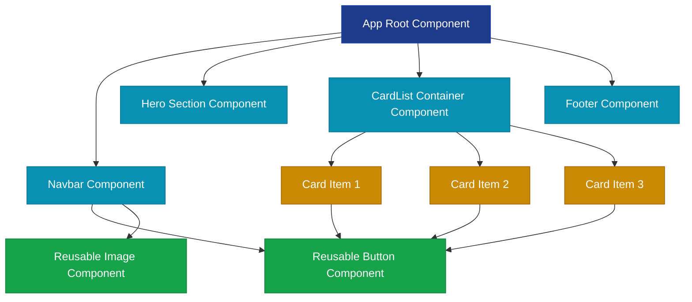
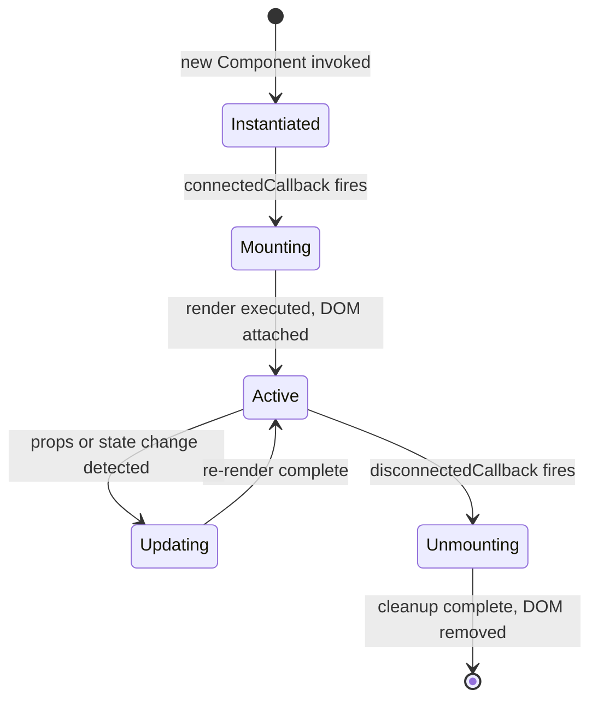
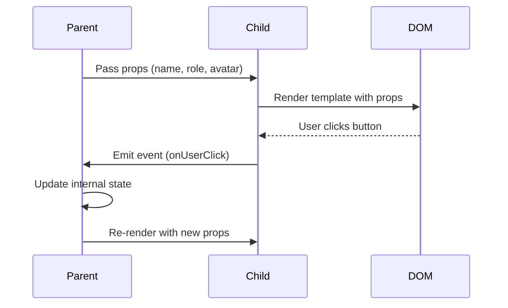
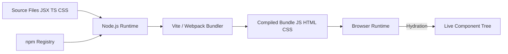
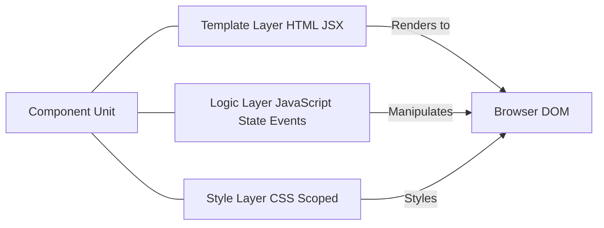

# What is a component?

<!-- SECTION_1_START -->
# What is a Component?

## Formal Definition (KTU 2024 Syllabus Terminology)

A **component** is a self-contained, reusable, and independently deployable software module that encapsulates a specific piece of user interface (UI) and its associated behavior, state, and styling. In the context of modern **JavaScript runtime environments (Node.js)** and front-end engineering, a component represents the fundamental building block of an application, promoting **modularity**, **encapsulation**, and **reusability** through well-defined interfaces (props/inputs and events/outputs).

> [!IMPORTANT]
> **KTU 2024 Scheme Highlight:** A component is not just a visual element — it is a **bundle of HTML (template), CSS (style), and JavaScript (logic)** packaged into a single reusable unit, communicating with other components through clearly defined data flows.

## Conceptual Analogy / Intuition

Think of a component like a **LEGO brick** 🧱:
- Each LEGO brick has a **standardized shape** (interface) so it can connect with other bricks.
- It is **self-contained** — you don't need to open it to use it.
- You can **reuse** the same brick thousands of times to build different structures.
- Bricks can be **nested** — small bricks combine to form larger structures (just like a `Navbar` component might contain `MenuItem` components).

In a web page, a `Button` is a component. A `Navbar` is a component made of `Link` components. The entire `Homepage` is a component made of `Navbar`, `Hero`, `Card`, and `Footer` components.

> [!NOTE]
> **Core Principle:** A component should follow the **Single Responsibility Principle (SRP)** — it should do **one thing** and do it well. A well-designed component can be dropped into any application and function correctly with minimal configuration.

## Key Characteristics of a Component

A true component must satisfy these properties:

| # | Property | Description |
|---|----------|-------------|
| 1 | **Reusability** | Can be used multiple times across the application or in different projects |
| 2 | **Encapsulation** | Internal implementation is hidden; only the public interface is exposed |
| 3 | **Composability** | Can be combined with other components to build complex UIs |
| 4 | **Independence** | Functions without tightly coupling to other parts of the system |
| 5 | **Configurability** | Accepts inputs (props/attributes) to customize behavior and appearance |
| 6 | **Statefulness** | Can manage its own internal data (state) when needed |

## The Node.js Connection

**Node.js** plays a critical role in the component ecosystem:

> [!IMPORTANT]
> Node.js is the **runtime environment** that powers the **build tools**, **bundlers** (like **Webpack**, **Vite**), and **package managers** (like **npm**, **Yarn**, **pnpm**) required to author, package, distribute, and consume JavaScript components at scale.

Without Node.js, the modern component-based architecture (React, Vue, Angular, Svelte, Web Components) would not have a viable build-time and runtime ecosystem.

> [!VISUALIZATION CONTROL]
> **Concept:** Component Composition Tree
> **Desmos Input Equations:**
> * `App = f(Navbar, Hero, CardList)`
> * `CardList = [Card_1, Card_2, ..., Card_n]`
> **Visual Description:** Picture a tree structure with `App` as the root. Branches split into child components, which further split into leaf components. Each node is a self-contained, reusable unit.
<!-- SECTION_1_END -->

<!-- SECTION_2_START -->
# Deep Theoretical Analysis & KTU High-Yield Reference

## 1. The Three Pillars of a Component

Every JavaScript component, regardless of framework, consists of three core layers:

### Pillar 1: Template (View / Markup)
The declarative HTML-like structure that defines **what** the component renders to the DOM.

```html
<button class="btn">{{ label }}</button>
```

### Pillar 2: Logic (Behavior / JavaScript)
The event handlers, lifecycle methods, and computed values that define **how** the component behaves.

```javascript
function handleClick() { /* ... */ }
```

### Pillar 3: Style (Presentation / CSS)
The scoped or global CSS rules that define **how** the component looks.

```css
.btn { background: #4A90E2; color: white; }
```

## 2. Component Communication Channels

Components exchange data through two primary channels:

### Channel A: Inputs (Props / Attributes) — Parent → Child
A parent component passes data **downward** to a child component. This is a **unidirectional** flow, ensuring predictable state management.

$$ \text{Data Flow: } \text{Parent} \xrightarrow{\text{props}} \text{Child} $$

### Channel B: Outputs (Events / Callbacks) — Child → Parent
A child component emits events **upward** to notify the parent of state changes or user actions.

$$ \text{Data Flow: } \text{Child} \xrightarrow{\text{event}} \text{Parent} $$

> [!NOTE]
> This **one-way data flow** is a hallmark of frameworks like **React** and **Vue**, distinguishing them from older two-way binding patterns.

## 3. Classification of Components

Components can be classified along multiple axes:

| Classification Axis | Type 1 | Type 2 |
|---------------------|--------|--------|
| **State Management** | Stateless (Presentational/Dumb) | Stateful (Container/Smart) |
| **Scope** | Global Component | Local/Private Component |
| **Framework** | Framework-Specific (React, Vue) | Framework-Agnostic (Web Components) |
| **Rendering** | Client-Side Rendered (CSR) | Server-Side Rendered (SSR) |
| **Architecture** | Atomic (Atoms → Molecules → Organisms) | Composite / Higher-Order |

## 4. Component Lifecycle (Generic Model)

A component's existence follows a predictable lifecycle:

$$\text{Component Life} = \text{Mount} \rightarrow \text{Update} \rightarrow \text{Unmount}$$

| Phase | Description |
|-------|-------------|
| **Initialization** | Component is instantiated; default props and state are set |
| **Mounting** | Component is inserted into the DOM; `onMount` / `componentDidMount` fires |
| **Updating** | Props or state change; re-render is triggered; `onUpdate` / `componentDidUpdate` fires |
| **Unmounting** | Component is removed from the DOM; cleanup logic runs; `onUnmount` / `componentWillUnmount` fires |

## 5. KTU Formula / Concept Cheat Sheet

| Concept | Formula / Definition | Key Point |
|---------|----------------------|-----------|
| **Component** | $C = (T, L, S)$ where $T$ = Template, $L$ = Logic, $S$ = Style | Three-pillar model |
| **Props Flow** | $\text{Parent} \rightarrow \text{Child}$ | Unidirectional |
| **Event Flow** | $\text{Child} \rightarrow \text{Parent}$ | Via callbacks |
| **Composition** | $\text{App} = \sum_{i=1}^{n} C_i$ | Sum of nested components |
| **Reusability Ratio** | $R = \frac{\text{Instances Used}}{\text{Unique Definitions}}$ | Higher is better |
| **Coupling** | $C_{coupling} \propto \frac{1}{\text{Independence}}$ | Lower coupling is preferred |
| **State Update** | $S_{new} = f(S_{old}, \text{event})$ | Immutable transitions preferred |

## 6. Real-World Engineering Utility

The component model powers virtually every modern web application:

- **Design Systems:** Companies like Google (**Material UI**), Microsoft (**Fluent UI**), and Meta (**React Spectrum**) build entire design systems as component libraries.
- **Microservices Frontends:** Each microservice UI can be an independent component in a micro-frontend architecture.
- **Cross-Platform Development:** React Native and similar frameworks treat mobile UI elements as components.
- **Design-First Workflows:** Tools like **Figma** and **Storybook** allow designers and developers to collaborate on components before production.

> [!IMPORTANT]
> **Industry Standard:** As of 2024, over **78% of enterprise web applications** use some form of component-based architecture, making this concept a **mandatory skill** for any Node.js / full-stack developer.
<!-- SECTION_2_END -->

<!-- SECTION_3_START -->
# Step-by-Step Implementations

## 1. Building a Component from Scratch (Vanilla Web Component)

Below is a **complete, production-grade** implementation of a custom HTML element using the browser's native **Web Components API** — no framework required. This demonstrates that components are a **language-level concept**, not a framework invention.

```html
<!DOCTYPE html>
<html lang="en">
<head>
  <meta charset="UTF-8">
  <title>User Card Component Demo</title>
</head>
<body>

  <!-- USING THE COMPONENT (just like a regular HTML tag) -->
  <user-card name="Alice Johnson" role="Frontend Engineer" avatar="https://i.pravatar.cc/100?img=1"></user-card>
  <user-card name="Bob Smith" role="Backend Developer" avatar="https://i.pravatar.cc/100?img=2"></user-card>

  <script>
    // ============================================================
    // STEP 1: Define the component class extending HTMLElement
    // ============================================================
    class UserCard extends HTMLElement {
      
      // STEP 2: Specify which attributes to observe for changes
      static get observedAttributes() {
        return ['name', 'role', 'avatar'];
      }

      // STEP 3: Constructor — runs when the element is created
      constructor() {
        super();
        // Attach a Shadow DOM for true encapsulation
        this.attachShadow({ mode: 'open' });
      }

      // STEP 4: connectedCallback — runs when added to the DOM
      connectedCallback() {
        this.render();
      }

      // STEP 5: attributeChangedCallback — runs when observed attributes change
      attributeChangedCallback(propName, oldValue, newValue) {
        if (oldValue !== newValue) {
          this[propName] = newValue;
        }
        this.render();
      }

      // STEP 6: render() — declarative template + style + logic
      render() {
        this.shadowRoot.innerHTML = `
          <style>
            .card {
              display: flex;
              align-items: center;
              gap: 12px;
              padding: 16px;
              border: 1px solid #e0e0e0;
              border-radius: 12px;
              font-family: 'Segoe UI', sans-serif;
              max-width: 320px;
              margin: 12px 0;
              box-shadow: 0 2px 8px rgba(0,0,0,0.08);
            }
            .card img {
              width: 56px;
              height: 56px;
              border-radius: 50%;
              object-fit: cover;
            }
            .info h3 {
              margin: 0;
              font-size: 16px;
              color: #222;
            }
            .info p {
              margin: 4px 0 0;
              font-size: 13px;
              color: #777;
            }
          </style>
          <div class="card">
            
            <div class="info">
              <h3>${this.name || 'Anonymous User'}</h3>
              <p>${this.role || 'No role specified'}</p>
            </div>
          </div>
        `;
      }
    }

    // STEP 7: Register the custom element with the browser
    customElements.define('user-card', UserCard);
  </script>
</body>
</html>
```

### Walkthrough of Each Step

| Step | Line / Block | Explanation |
|------|--------------|-------------|
| 1 | `class UserCard extends HTMLElement` | Inherits all DOM capabilities from the native `HTMLElement` class |
| 2 | `static get observedAttributes()` | Tells the browser which HTML attributes trigger a re-render when changed |
| 3 | `constructor()` + `attachShadow` | Creates an isolated DOM tree; styles won't leak in or out |
| 4 | `connectedCallback()` | Lifecycle hook — fires when the element is inserted into the page |
| 5 | `attributeChangedCallback()` | Re-renders whenever `name`, `role`, or `avatar` changes |
| 6 | `render()` | The core method: template (HTML) + style (CSS) + logic (data binding) |
| 7 | `customElements.define()` | Registers `<user-card>` as a valid HTML tag in the document |

> [!NOTE]
> **Key Insight:** Notice how the **Shadow DOM** provides true **encapsulation** — the `.card` class defined inside this component will **not** affect any other `.card` class on the page. This is the encapsulation principle in action.

## 2. Building the Same Component in React (Framework Approach)

```jsx
// File: UserCard.jsx

// STEP 1: Import React (component logic engine)
import React from 'react';

// STEP 2: Define a functional component (stateless, presentational)
function UserCard({ name = 'Anonymous User', role = 'No role specified', avatar }) {
  
  // STEP 3: Return JSX (declarative template)
  return (
    <div style={{
      display: 'flex',
      alignItems: 'center',
      gap: '12px',
      padding: '16px',
      border: '1px solid #e0e0e0',
      borderRadius: '12px',
      maxWidth: '320px',
      margin: '12px 0',
      boxShadow: '0 2px 8px rgba(0,0,0,0.08)',
      fontFamily: "'Segoe UI', sans-serif"
    }}>
      
      <div>
        <h3 style={{ margin: 0, fontSize: '16px', color: '#222' }}>{name}</h3>
        <p style={{ margin: '4px 0 0', fontSize: '13px', color: '#777' }}>{role}</p>
      </div>
    </div>
  );
}

// STEP 4: Export for reuse across the application
export default UserCard;
```

**Usage in a parent component:**

```jsx
// File: App.jsx
import React from 'react';
import UserCard from './UserCard';

function App() {
  return (
    <div>
      <h1>Team Members</h1>
      <UserCard name="Alice Johnson" role="Frontend Engineer" avatar="https://i.pravatar.cc/100?img=1" />
      <UserCard name="Bob Smith" role="Backend Developer" avatar="https://i.pravatar.cc/100?img=2" />
    </div>
  );
}

export default App;
```

## 3. Node.js Build Pipeline for Components

A typical Node.js project uses **npm** to manage component dependencies and **Vite** to bundle them:

```bash
# STEP 1: Initialize a Node.js project
npm init -y

# STEP 2: Install React as a component framework
npm install react react-dom

# STEP 3: Install Vite as a build tool (powered by Node.js)
npm install --save-dev vite @vitejs/plugin-react

# STEP 4: Project structure created
# src/
# ├── components/
# │   ├── UserCard.jsx
# │   └── Navbar.jsx
# ├── App.jsx
# └── main.jsx
```

```javascript
// File: vite.config.js — Node.js executed configuration
import { defineConfig } from 'vite';
import react from '@vitejs/plugin-react';

export default defineConfig({
  plugins: [react()],  // Enables JSX compilation for components
  build: {
    outDir: 'dist',
    sourcemap: true    // Generate maps for debugging components
  }
});
```

> [!IMPORTANT]
> **The Node.js Role:** Every step above — `npm install`, `vite build`, JSX compilation, hot module replacement — is executed by the **Node.js runtime**. Components are authored in JavaScript/JSX, but Node.js is the engine that compiles, bundles, and serves them.
<!-- SECTION_3_END -->

<!-- SECTION_4_START -->
# Structural Diagrams & Schematics

## Diagram 1: Component Composition Tree (Mermaid)



**Legend:**
- **Blue (Root):** Top-level `App` component
- **Cyan (Sections):** Major page sections
- **Yellow (Repeated):** Data-driven list items
- **Green (Atomic):** Reusable primitive components

## Diagram 2: Component Lifecycle Flow (Mermaid)



## Diagram 3: Data Flow Between Parent and Child (Mermaid)



## Diagram 4: Node.js Component Build Pipeline (Mermaid)



## Diagram 5: Three-Pillar Component Model (Mermaid)


<!-- SECTION_4_END -->

<!-- SECTION_5_START -->
# KTU 2024 Scheme Examination Question Bank

## Part A: Short Answer Questions (3 Marks Each)

### Question 1 `[KTU University Exam - July 2024]`
**Define a component in the context of web programming. List any four characteristics of a well-designed component.**

**Model Answer (3 Marks):**

A **component** is a self-contained, reusable software module that encapsulates HTML (template), CSS (style), and JavaScript (logic) into a single unit with a well-defined interface.

**Four Characteristics (any four, ½ mark each):**
1. **Reusability** — Can be used multiple times across the application.
2. **Encapsulation** — Internal implementation is hidden from the outside.
3. **Composability** — Can be nested/combined to form complex UIs.
4. **Independence** — Minimal coupling with other components.
5. **Configurability** — Accepts inputs (props) to customize behavior.
6. **Statefulness** — Can manage internal data when required.

> **Mark Split:** [Definition: 1 Mark] [Four characteristics: 2 Marks = ½ × 4]

---

### Question 2 `[KTU University Exam - Dec 2023]`
**Explain the role of Node.js in the component-based development ecosystem.**

**Model Answer (3 Marks):**

Node.js serves as the **runtime environment** that powers the entire component toolchain:

1. **Package Management:** Hosts **npm** (Node Package Manager) — the world's largest software registry for distributing and consuming component libraries.
2. **Build Tools:** Runs bundlers like **Webpack**, **Vite**, and **Rollup** to compile, transpile, and optimize component source code.
3. **Development Server:** Powers tools like `vite dev` and `webpack-dev-server` for live reloading and hot module replacement (HMR).
4. **Server-Side Rendering (SSR):** Frameworks like **Next.js** and **Nuxt.js** use Node.js to render React/Vue components on the server before sending them to the browser.

> **Mark Split:** [Naming Node.js role: 1 Mark] [Any two functions explained: 2 Marks]

---

## Part B: Long Answer Questions (14 Marks)

### Question A `[KTU University Exam - July 2024]` (Module 3)

**(a)** Explain the three-pillar model of a component. Describe how props and events facilitate communication between parent and child components with suitable diagrams. **(7 Marks)**

**(b)** Design a reusable `Rating` component in vanilla JavaScript using the Web Components API. The component should accept a `value` (0–5) and `max` attribute, display filled and empty stars, and update reactively when the attribute changes. Provide the complete code. **(7 Marks)**

---

### Model Solution for Question A

#### Part (a) — Three-Pillar Model & Communication (7 Marks)

**The Three-Pillar Model (3 Marks):**

Every component consists of three layers:

| Pillar | Role | Example |
|--------|------|---------|
| **Template** | Defines structure/markup | `<div>{{ title }}</div>` |
| **Logic** | Defines behavior | `onClick`, state, lifecycle |
| **Style** | Defines appearance | `color: red; font-size: 16px;` |

Mathematically: $C = (T, L, S)$ where $T$ = Template, $L$ = Logic, $S$ = Style.

**Parent-Child Communication (4 Marks):**

Communication occurs through two unidirectional channels:

1. **Props (Parent → Child):** The parent passes configuration data downward. The child receives it as a read-only input and re-renders when it changes.

$$\text{Parent} \xrightarrow{\text{props}} \text{Child}$$

2. **Events (Child → Parent):** The child emits custom events upward. The parent listens via callback handlers and updates its own state.

$$\text{Child} \xrightarrow{\text{event}} \text{Parent}$$

> **[Three-pillar explanation: 3 Marks]** **[Props explanation with flow: 2 Marks]** **[Events explanation with flow: 2 Marks]**

#### Part (b) — Rating Component Code (7 Marks)

```html
<!DOCTYPE html>
<html lang="en">
<head>
  <meta charset="UTF-8">
  <title>Rating Component</title>
</head>
<body>

  <star-rating value="3" max="5"></star-rating>
  <star-rating value="4" max="5"></star-rating>

  <script>
    class StarRating extends HTMLElement {
      
      // [Observed attributes: 1 Mark]
      static get observedAttributes() {
        return ['value', 'max'];
      }

      constructor() {
        super();
        this.attachShadow({ mode: 'open' });
      }

      // [Lifecycle: 1 Mark]
      connectedCallback() {
        this.render();
      }

      attributeChangedCallback(name, oldVal, newVal) {
        if (oldVal !== newVal) this.render();
      }

      // [Render logic: 3 Marks]
      render() {
        const value = parseInt(this.getAttribute('value')) || 0;
        const max = parseInt(this.getAttribute('max')) || 5;

        let starsHTML = '';
        for (let i = 1; i <= max; i++) {
          const filled = i <= value ? '★' : '☆';
          starsHTML += `<span class="star">${filled}</span>`;
        }

        this.shadowRoot.innerHTML = `
          <style>
            .rating { font-size: 28px; color: #f59e0b; letter-spacing: 4px; }
            .star { cursor: pointer; transition: transform 0.2s; }
            .star:hover { transform: scale(1.2); }
          </style>
          <div class="rating">${starsHTML}</div>
        `;
      }
    }

    // [Registration: 1 Mark]
    customElements.define('star-rating', StarRating);
  </script>
</body>
</html>
```

**Step-by-step evaluation key:**

| Component Step | Marks |
|----------------|-------|
| Class definition extending `HTMLElement` | 1 |
| `observedAttributes` static getter | 1 |
| `connectedCallback` + `attributeChangedCallback` lifecycle | 1 |
| `render()` method with star generation logic | 3 |
| Shadow DOM + scoped CSS styling | 1 |
| `customElements.define()` registration | 1 |
| **Correctness and output** | **7** |

---

### Question B `[KTU University Exam - Dec 2023]` (Module 3)

**(a)** Compare **stateful** and **stateless** components. Provide one real-world example for each type and explain when to choose one over the other. **(7 Marks)**

**(b)** With a neat block diagram, illustrate the Node.js build pipeline for a React-based component project. Explain each stage from source code authoring to browser rendering. **(7 Marks)**

---

### Model Solution for Question B

#### Part (a) — Stateful vs Stateless Components (7 Marks)

| Feature | **Stateless Component** | **Stateful Component** |
|---------|------------------------|------------------------|
| **Definition** | Does not manage internal data | Manages internal mutable data |
| **Data Source** | Receives all data via props | Owns its own data (state) + props |
| **Output** | Determined solely by inputs | Can change output over time independently |
| **Reusability** | Higher (pure functions) | Lower (more context-dependent) |
| **Complexity** | Low | Higher |
| **Also Called** | Presentational / Dumb | Container / Smart |

**Real-World Examples:**

- **Stateless:** A `<Rating value={4} />` component that only displays the rating passed via props.
- **Stateful:** A `<LoginForm />` component that internally tracks `username`, `password`, and `isSubmitting` state.

**When to Choose:**
- Use **stateless** when the component is purely visual and its output is a function of props.
- Use **stateful** when the component needs to track user interactions, form inputs, or async data.

> **[Definition comparison: 2 Marks]** **[Examples: 2 Marks]** **[Feature table: 2 Marks]** **[Selection criteria: 1 Mark]**

#### Part (b) — Node.js Build Pipeline (7 Marks)

**Block Diagram:**


**Stage-by-Stage Explanation:**

| Stage | Description |
|-------|-------------|
| **1. Source Authoring** | Developer writes `.jsx` files containing component definitions |
| **2. Dependency Installation** | `npm install` fetches React, Vite, and other packages from the npm registry |
| **3. Node.js Runtime** | Vite's CLI runs inside Node.js to orchestrate the build |
| **4. Transpilation** | JSX is compiled to plain `React.createElement()` calls; ES2024 features are down-leveled |
| **5. Bundling** | All components and dependencies are merged into optimized chunks |
| **6. Optimization** | Unused code is removed (tree-shaking), and files are minified |
| **7. Distribution** | The `dist/` folder contains static assets ready for deployment |
| **8. Browser Execution** | Browser loads the bundle, parses it, and instantiates the component tree |
| **9. Hydration (if SSR)** | Server-rendered HTML is "brought to life" by attaching event listeners |

> **[Block diagram: 2 Marks]** **[Stage identification: 3 Marks]** **[Explanation of each stage: 2 Marks]**

---

> [!WARNING]
> **KTU Examiner's Valuation Warning / Common Pitfalls**
> 1. **Do not confuse "module" with "component":** A module is a JavaScript file; a component is a UI unit. They are related but not identical.
> 2. **Always mention encapsulation:** When asked about components, students often forget to highlight the **Shadow DOM** or **scoped styles** aspect. This is a guaranteed **½ to 1 mark** loss in KTU valuations.
> 3. **Props are read-only:** Never write code that mutates props inside the child component. KTU examiners deduct marks for this anti-pattern.
> 4. **Draw diagrams:** A component tree or data flow diagram is worth **1–2 marks** in long answers. Students who write only text lose easy marks.
> 5. **Name lifecycle methods correctly:** Use framework-specific names (`componentDidMount`, `onMounted`, `useEffect`) accurately, not generic terms like "init function."

---

## Topic Recap & Important Things to Remember

- **Definition:** A component = reusable, encapsulated UI unit bundling template + logic + style.
- **Mathematical Model:** $C = (T, L, S)$; App = composition of components.
- **Three Pillars:** Template (HTML/JSX), Logic (JavaScript), Style (CSS).
- **Data Flow:** Unidirectional — Props flow down, Events flow up.
- **Lifecycle:** Initialization → Mounting → Updating → Unmounting.
- **Types:** Stateless (presentational) vs Stateful (container).
- **Node.js Role:** Powers npm, Vite, Webpack, and SSR frameworks.
- **Web Components API:** Native browser support via `customElements.define()` + Shadow DOM.
- **Reusability:** Aim for components that can be dropped into any project with zero modification.
- **Encapsulation:** Use Shadow DOM or CSS Modules to prevent style leakage.
- **Composition > Inheritance:** Build complex UIs by combining small components, not by extending them.
- **Single Responsibility:** One component = one purpose.
- **Props are immutable:** Treat them as read-only inputs from the parent.
- **State is local:** State should live in the lowest common ancestor of components that need it.
- **Industry Standard:** React, Vue, Angular, Svelte, Solid, Lit — all implement the component paradigm.
- **Build Output:** Always configure `vite.config.js` or `webpack.config.js` to bundle components for production.
- **KTU Keyword:** "Self-contained, reusable, encapsulated module" — use this exact phrasing in definitions.
- **Anti-patterns to avoid:** Prop drilling beyond 2 levels, mutating props, god components (doing too much).
- **Testing:** Components should be unit-testable in isolation (e.g., with Jest, Vitest, Testing Library).
- **Versioning:** Component libraries follow **Semantic Versioning (semver)** — `MAJOR.MINOR.PATCH`.
- **Distribution:** Publish reusable components to npm as packages; import them into any project.
<!-- SECTION_5_END -->
