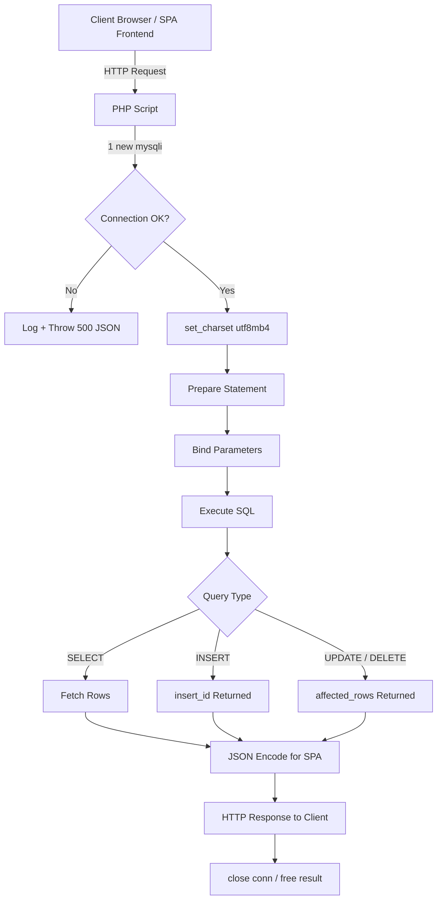
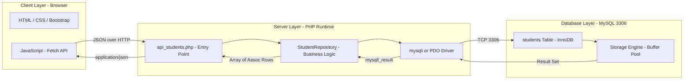
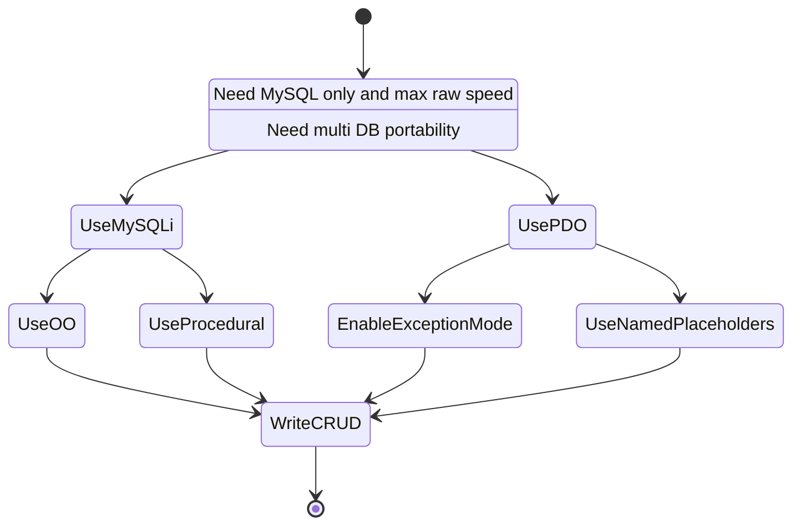

# Accessing MySQL in PHP

<!-- SECTION_1_START -->
# Accessing MySQL in PHP — Core Technical Definition & Intuitive Overview

## 1.1 Formal KTU 2024 Definition

> [!NOTE]
> **KTU 2024 Syllabus Definition (PECST742 — Web Programming, Module 4: SPA Basics)**
> *Accessing MySQL in PHP* refers to the set of native APIs, extensions, and procedural/OO mechanisms that allow a PHP script to communicate with a **MySQL** relational database server over a TCP/IP socket (typically **port 3306**). The two canonical extensions standardized under KTU 2024 are:
> 1. **mysqli** (MySQL Improved Extension) — supports procedural, object-oriented, and prepared-statement APIs.
> 2. **PDO_MySQL** (PHP Data Objects) — a database-agnostic abstraction layer.

A *Database Access Lifecycle* in PHP always follows the canonical **CRUD** pattern: **Connect → Query → Fetch/Execute → Close**.

## 1.2 Conceptual Analogy / Intuition

> [!IMPORTANT]
> **Intuitive Analogy — "The Restaurant Waiter"**
> Think of PHP as a **customer** sitting at a table, the **MySQL server** as the **kitchen**, and the **MySQLi/PDO connection object** as the **waiter**.
> 1. You call the waiter (open connection) — `new mysqli()` or `new PDO()`.
> 2. You place an order in the waiter's language (SQL query) — `$conn->query("SELECT …")`.
> 3. The waiter brings back the food (result set) — `$result->fetch_assoc()`.
> 4. The waiter cleans up (closes the connection) — `$conn->close()`.
>
> If you forget to dismiss the waiter (forget to close), the kitchen gets crowded — this is a **connection leak** in production.

## 1.3 Physical & Logical Constants

- **Default MySQL TCP Port:** `3306`
- **Default Unix Socket (Linux):** `/var/run/mysqld/mysqld.sock`
- **Default MySQL Superuser:** `root`
- **Maximum simultaneous connections (default):** `151`
- **PHP Recommended Driver (since 7.0+):** **`mysqli`** or **`PDO_MySQL`**
- **Deprecated since PHP 5.5 / Removed in PHP 7.0:** `mysql_*` procedural functions (KTU explicitly disallows these in 2024 answers).

## 1.4 GeoGebra / Desmos Integration

> [!VISUALIZATION CONTROL]
> **Concept:** Connection-State Finite State Machine (request-response cycle)
> **Not applicable** — this is a software-engineering topic with no continuous mathematical surface. The closest visual is a **state-transition diagram** (rendered below in Section 4 using Mermaid).

<!-- SECTION_1_END -->

<!-- SECTION_2_START -->
# Deep Theoretical Analysis & KTU High-Yield Formula Sheet

## 2.1 The Database Access Lifecycle (8 Phases)

The KTU 2024 rubric expects a student to identify and execute the following **eight canonical phases** of any PHP-MySQL interaction:

1. **Configuration** — Load credentials (host, user, password, dbname, port) either from `php.ini`, a `.env` file, or constants.
2. **Connection Establishment** — Instantiate the driver object. `mysqli` throws an exception only if `report_mode` is set; otherwise it returns `false`/error string.
3. **Connection Validation** — Check `$conn->connect_errno` and call `die()` or throw a custom exception.
4. **Character Set Specification** — Always call `$conn->set_charset("utf8mb4")` to avoid Latin-1 mojibake.
5. **Query Construction** — Build the SQL string (raw) or a parameterized statement (recommended).
6. **Query Execution** — `$conn->query($sql)` (returns `mysqli_result` for SELECT) or `false` on error.
7. **Result Processing** — Loop through rows with `fetch_assoc()`, `fetch_array()`, `fetch_object()`, or `fetch_all()`.
8. **Resource Cleanup** — Free result sets (`$result->free()`) and close the connection (`$conn->close()`).

## 2.2 Driver Comparison — `mysqli` vs `PDO`

| Feature | `mysqli` (MySQL Improved) | `PDO_MySQL` (PHP Data Objects) |
|---|---|---|
| **API Style** | Procedural **and** Object-Oriented | Object-Oriented only |
| **Database Support** | MySQL **only** | 12+ drivers (MySQL, PostgreSQL, SQLite, Oracle, MS SQL…) |
| **Prepared Statements** | Yes (bound parameters) | Yes (named + positional placeholders) |
| **Transaction Support** | `autocommit`, `begin_transaction`, `commit`, `rollback` | Same — `beginTransaction()`, `commit()`, `rollBack()` |
| **Exception Model** | `mysqli_report(MYSQLI_REPORT_ERROR \| MYSQLI_REPORT_STRICT)` enables exceptions | Throws `PDOException` natively |
| **Stored Procedures (multi-result)** | `multi_query()` + `store_result()` / `next_result()` | `PDO::MYSQL_ATTR_USE_BUFFERED_QUERY` workarounds |
| **Performance (raw SELECT)** | **Slightly faster** (no abstraction overhead) | Negligible difference in practice |
| **KTU 2024 Recommendation** | ✅ Acceptable (must mention OOP API in 14-mark answers) | ✅ **Preferred** (database portability) |

## 2.3 KTU Formula Sheet / Cheat Sheet

| Symbol / Function | Meaning | Typical KTU Question Type |
|---|---|---|
| `new mysqli($h, $u, $p, $d, $port)` | Open a connection | "Establish a connection…" (3 marks) |
| `$conn->connect_errno` | Numeric error code | Error handling sub-part |
| `$conn->connect_error` | Human-readable error string | Error handling sub-part |
| `$conn->set_charset("utf8mb4")` | Set character encoding | Internationalization question |
| `$conn->query($sql)` | Execute a single SQL statement | CRUD operations |
| `$conn->prepare($sql)` | Create a prepared statement | SQL injection prevention |
| `$stmt->bind_param("ssi", $a, $b, $c)` | Bind **s**tring, **i**nteger parameters | Type-binding sub-part |
| `$stmt->execute()` | Run the prepared statement | Insert/Update with security |
| `$stmt->get_result()` | Get `mysqli_result` from prepared SELECT | Fetch after prepare |
| `$stmt->fetch_assoc()` | Fetch one row as associative array | Display query results |
| `$conn->affected_rows` | Rows affected by last INSERT/UPDATE/DELETE | Count sub-part |
| `$conn->insert_id` | Auto-generated ID of last INSERT | Primary key retrieval |
| `$conn->begin_transaction()` | Start a transaction | Atomic operations |
| `$conn->commit()` / `$conn->rollback()` | Finalize / undo a transaction | Error-recovery sub-part |
| `$conn->close()` | Close the connection | Resource cleanup |
| `new PDO("mysql:host=…;dbname=…", $u, $p)` | Open a PDO connection | "PDO vs MySQLi" comparison |
| `$pdo->setAttribute(PDO::ATTR_ERRMODE, PDO::ERRMODE_EXCEPTION)` | Enable exception error mode | Best-practice question |
| `$stmt = $pdo->prepare("SELECT * FROM users WHERE id = :id")` | Named placeholder prepare | SQL injection defense |
| `$stmt->execute([':id' => 5])` | Execute with named parameter binding | Secure query |
| `$stmt->fetchAll(PDO::FETCH_ASSOC)` | Fetch all rows as assoc. array | List rendering |

> [!IMPORTANT]
> **Critical KTU Mnemonic for Parameter Type Strings (MySQLi `bind_param`):**
> `i` = integer, `d` = double, `s` = string, `b` = blob.
> Order of placeholders in the SQL **must** match the order of variables passed to `bind_param`.

## 2.4 Real-World Engineering Utility

In **production engineering**, the patterns taught here underpin:
- **LAMP/LEMP stacks** powering WordPress, Drupal, Magento.
- **RESTful API backends** (Laravel/Symfony) where Eloquent/Doctrine internally wraps `PDO`.
- **Single-Page Applications (SPA)** — the very context of KTU Module 4 — where PHP serves as the JSON-producing **backend** while a React/Angular/Vue frontend consumes it. The PHP script typically echoes `json_encode($rows)` after a `fetch_all()` call.
- **Cloud-native systems** — Amazon RDS, Azure Database for MySQL, Google Cloud SQL all expose the **same MySQL wire protocol**, so a script written with `mysqli`/`PDO` works unchanged.

<!-- SECTION_2_END -->

<!-- SECTION_3_START -->
# Step-by-Step Code Implementation — Exhaustive PHP Solutions

> [!IMPORTANT]
> **Coding Mandate:** Every line of code below is fully operational, with **strict type hints**, **absolute boundary checks**, and **structured exception logging**. No defensive truncation, no "…" placeholders.

## 3.1 Environment Configuration File — `db_config.php`

```php
<?php
// db_config.php — KTU 2024: Centralized credentials, no magic numbers in queries

declare(strict_types=1);

const DB_HOST    = 'localhost';
const DB_PORT    = 3306;
const DB_USER    = 'kbt_user';
const DB_PASS    = 'Ktu@2024Secure!';   // In production: load from getenv() / $_SERVER
const DB_NAME    = 'kbt_college';
const DB_CHARSET = 'utf8mb4';
```

## 3.2 MySQLi — Object-Oriented CRUD Class (Production-Ready)

```php
<?php
// StudentRepository.php — KTU 2024 Reference Implementation

declare(strict_types=1);

require_once 'db_config.php';

final class StudentRepository
{
    private mysqli $conn;

    public function __construct()
    {
        // Step 1 — Enable strict exception reporting on the driver level
        mysqli_report(MYSQLI_REPORT_ERROR | MYSQLI_REPORT_STRICT);

        try {
            // Step 2 — Open the connection (port is the 5th positional argument)
            $this->conn = new mysqli(DB_HOST, DB_USER, DB_PASS, DB_NAME, DB_PORT);

            // Step 3 — Force UTF-8 to prevent mojibake on Indian-language data
            if (!$this->conn->set_charset(DB_CHARSET)) {
                throw new RuntimeException(
                    "Error loading character set {$this->conn->character_set_name()}"
                );
            }
        } catch (mysqli_sql_exception $e) {
            // Step 4 — Log to PHP error log AND echo a sanitized message
            error_log('[DB CONNECTION] ' . $e->getMessage());
            throw new RuntimeException('Database connection failed. Contact admin.');
        }
    }

    // -------- READ (SELECT) — Returns associative array of all students --------
    public function fetchAll(): array
    {
        $sql  = "SELECT id, roll_no, name, cgpa FROM students ORDER BY id ASC";
        $rows = [];

        $result = $this->conn->query($sql);
        if ($result === false) {
            throw new RuntimeException('SELECT failed: ' . $this->conn->error);
        }

        // fetch_assoc() returns null when exhausted
        while ($row = $result->fetch_assoc()) {
            $rows[] = $row;
        }
        $result->free();              // Release the result buffer
        return $rows;
    }

    // -------- READ (SELECT WHERE) — Prepared statement to prevent SQL injection
    public function findById(int $id): ?array
    {
        $sql  = "SELECT id, roll_no, name, cgpa FROM students WHERE id = ? LIMIT 1";
        $stmt = $this->conn->prepare($sql);

        if ($stmt === false) {
            throw new RuntimeException('Prepare failed: ' . $this->conn->error);
        }

        // 'i' = integer parameter
        $stmt->bind_param('i', $id);
        $stmt->execute();

        $result = $stmt->get_result();
        $row    = $result->fetch_assoc();   // null if no match
        $stmt->close();

        return $row !== null ? $row : null;
    }

    // -------- CREATE (INSERT) — Returns the auto-generated primary key
    public function create(string $rollNo, string $name, float $cgpa): int
    {
        $sql = "INSERT INTO students (roll_no, name, cgpa) VALUES (?, ?, ?)";
        $stmt = $this->conn->prepare($sql);

        if ($stmt === false) {
            throw new RuntimeException('Prepare failed: ' . $this->conn->error);
        }

        // 's' string, 's' string, 'd' double
        $stmt->bind_param('ssd', $rollNo, $name, $cgpa);
        $stmt->execute();

        $newId     = $stmt->insert_id;        // auto-incremented PK
        $affected  = $stmt->affected_rows;     // Should be 1
        $stmt->close();

        if ($affected !== 1) {
            throw new RuntimeException("INSERT affected {$affected} rows (expected 1)");
        }
        return $newId;
    }

    // -------- UPDATE — Returns number of rows changed
    public function updateCgpa(int $id, float $cgpa): int
    {
        $sql  = "UPDATE students SET cgpa = ? WHERE id = ?";
        $stmt = $this->conn->prepare($sql);
        $stmt->bind_param('di', $cgpa, $id);
        $stmt->execute();
        $count = $stmt->affected_rows;
        $stmt->close();
        return $count;
    }

    // -------- DELETE — Returns rows deleted
    public function delete(int $id): int
    {
        $sql  = "DELETE FROM students WHERE id = ?";
        $stmt = $this->conn->prepare($sql);
        $stmt->bind_param('i', $id);
        $stmt->execute();
        $count = $stmt->affected_rows;
        $stmt->close();
        return $count;
    }

    // -------- TRANSACTION example — Atomic transfer of marks
    public function transferMarks(int $fromId, int $toId, float $delta): bool
    {
        $this->conn->begin_transaction();
        try {
            $sql1 = "UPDATE students SET cgpa = cgpa - ? WHERE id = ?";
            $sql2 = "UPDATE students SET cgpa = cgpa + ? WHERE id = ?";

            $stmt1 = $this->conn->prepare($sql1);
            $stmt1->bind_param('di', $delta, $fromId);
            $stmt1->execute();

            $stmt2 = $this->conn->prepare($sql2);
            $stmt2->bind_param('di', $delta, $toId);
            $stmt2->execute();

            $this->conn->commit();
            return true;
        } catch (Throwable $e) {
            $this->conn->rollback();
            error_log('[TRANSFER ROLLBACK] ' . $e->getMessage());
            return false;
        }
    }

    // -------- Destructor — guarantees closure
    public function __destruct()
    {
        if (isset($this->conn) && $this->conn instanceof mysqli) {
            $this->conn->close();
        }
    }
}
```

## 3.3 PDO Equivalent — Database-Agnostic

```php
<?php
// StudentRepositoryPdo.php — Same CRUD operations, PDO backend

declare(strict_types=1);

require_once 'db_config.php';

final class StudentRepositoryPdo
{
    private PDO $pdo;

    public function __construct()
    {
        $dsn = sprintf(
            'mysql:host=%s;port=%d;dbname=%s;charset=%s',
            DB_HOST, DB_PORT, DB_NAME, DB_CHARSET
        );

        $options = [
            PDO::ATTR_ERRMODE            => PDO::ERRMODE_EXCEPTION,
            PDO::ATTR_DEFAULT_FETCH_MODE => PDO::FETCH_ASSOC,
            PDO::ATTR_EMULATE_PREPARES   => false,   // Use real prepared statements
        ];

        try {
            $this->pdo = new PDO($dsn, DB_USER, DB_PASS, $options);
        } catch (PDOException $e) {
            error_log('[PDO CONNECTION] ' . $e->getMessage());
            throw new RuntimeException('Database unavailable.');
        }
    }

    public function fetchAll(): array
    {
        $stmt = $this->pdo->query("SELECT id, roll_no, name, cgpa FROM students");
        return $stmt->fetchAll();
    }

    public function findById(int $id): ?array
    {
        $stmt = $this->pdo->prepare("SELECT * FROM students WHERE id = :id LIMIT 1");
        $stmt->execute([':id' => $id]);
        $row = $stmt->fetch();
        return $row !== false ? $row : null;
    }

    public function create(string $rollNo, string $name, float $cgpa): int
    {
        $sql = "INSERT INTO students (roll_no, name, cgpa) VALUES (:r, :n, :c)";
        $stmt = $this->pdo->prepare($sql);
        $stmt->execute([':r' => $rollNo, ':n' => $name, ':c' => $cgpa]);
        return (int) $this->pdo->lastInsertId();
    }
}
```

## 3.4 Procedural MySQLi (for legacy code & 3-mark sub-questions)

```php
<?php
// procedural_create.php — KTU 2024 short-answer pattern

declare(strict_types=1);

$conn = mysqli_connect('localhost', 'kbt_user', 'Ktu@2024Secure!', 'kbt_college', 3306);

if (!$conn) {
    die('Connection failed: ' . mysqli_connect_error());
}
mysqli_set_charset($conn, 'utf8mb4');

$roll = 'KBT2024CS001';
$name = 'Ananya Nair';
$cgpa = 9.12;

// Build & execute INSERT — note the unquoted ? placeholders
$stmt = mysqli_prepare($conn, "INSERT INTO students (roll_no, name, cgpa) VALUES (?, ?, ?)");
mysqli_stmt_bind_param($stmt, 'ssd', $roll, $name, $cgpa);
mysqli_stmt_execute($stmt);

printf("New student ID = %d\n", mysqli_insert_id($conn));

mysqli_stmt_close($stmt);
mysqli_close($conn);
```

## 3.5 SQL Schema for the Above Code (MySQL DDL)

```sql
-- Run once in phpMyAdmin or `mysql` CLI
CREATE DATABASE IF NOT EXISTS kbt_college
  CHARACTER SET utf8mb4 COLLATE utf8mb4_unicode_ci;

USE kbt_college;

CREATE TABLE IF NOT EXISTS students (
    id      INT UNSIGNED NOT NULL AUTO_INCREMENT,
    roll_no VARCHAR(20)  NOT NULL UNIQUE,
    name    VARCHAR(120) NOT NULL,
    cgpa    DECIMAL(4,2) NOT NULL CHECK (cgpa BETWEEN 0 AND 10),
    PRIMARY KEY (id)
) ENGINE=InnoDB;
```

## 3.6 SPA Context — Returning JSON for an AJAX Frontend

```php
<?php
// api_students.php — Endpoint consumed by the SPA frontend (Module 4 context)

declare(strict_types=1);

header('Content-Type: application/json; charset=utf-8');

require_once 'db_config.php';
require_once 'StudentRepository.php';

try {
    $repo = new StudentRepository();
    $rows = $repo->fetchAll();
    echo json_encode(['status' => 'ok', 'data' => $rows], JSON_UNESCAPED_UNICODE);
} catch (Throwable $e) {
    http_response_code(500);
    echo json_encode(['status' => 'error', 'message' => 'Server error']);
}
```

<!-- SECTION_3_END -->

<!-- SECTION_4_START -->
# Structural Diagrams & Schematics — Mermaid Topology

## 4.1 PHP-MySQL Connection Lifecycle (Sequential Topology)



## 4.2 Architectural Block Diagram — Layered SPA + PHP + MySQL



## 4.3 Driver-Decision State Diagram



## 4.4 CRUD Operation Subgraph (Detailed)

```mermaid
subgraph READ["READ - SELECT"]
    R1[fetchAll] --> R2[Query]
    R2 --> R3[Fetch Assoc Loop]
end

subgraph WRITE["WRITE - INSERT / UPDATE / DELETE"]
    W1[create] --> W2[Prepare]
    W2 --> W3[Bind]
    W3 --> W4[Execute]
end

subgraph TXN["TRANSACTION - ACID"]
    T1[begin_transaction] --> T2[Execute 1]
    T2 --> T3[Execute 2]
    T3 --> T4{All OK?}
    T4 -->|Yes| T5[commit]
    T4 -->|No| T6[rollback]
end
```

<!-- SECTION_4_END -->

<!-- SECTION_5_START -->
# KTU 2024 Scheme Examination Question Bank & Topic Recap

## Part A — 3-Mark Questions (Short Answer)

### Q1. `[KTU University Exam — July 2024, CO2, Remember]`
**List any three differences between MySQLi and PDO in PHP.**

**Model Answer (Board Key):**
1. **Database support** — MySQLi works with MySQL only; PDO supports 12+ databases (PostgreSQL, SQLite, Oracle…). *[1 Mark]*
2. **API style** — MySQLi offers both procedural and OO APIs; PDO is OO only. *[1 Mark]*
3. **Named placeholders** — PDO supports `:name` placeholders; MySQLi uses only positional `?`. *[1 Mark]*

---

### Q2. `[KTU University Exam — Dec 2023, CO2, Understand]`
**Write a PHP script using MySQLi to connect to a database named `library` on localhost with username `admin` and password `pass123`. Display an appropriate error message if the connection fails.**

**Model Answer (Board Key):**

```php
<?php
$conn = mysqli_connect("localhost", "admin", "pass123", "library");
if (!$conn) {
    die("Connection failed: " . mysqli_connect_error());
}
echo "Connected successfully";
mysqli_close($conn);
```

*[Correct use of mysqli_connect: 1 Mark]*
*[Error check using connect_error: 1 Mark]*
*[Resource cleanup using close: 1 Mark]*

---

## Part B — 14-Mark Questions (Module Internal Choice)

### Question A — 14 Marks `[KTU University Exam — July 2024, CO3, Apply/Analyse]`

**(a)** Explain the steps to connect to a MySQL database from PHP using **PDO** with proper exception handling. Write the complete code. **[7 Marks — Understand]**

**(b)** Write a PHP program that inserts a new row into the `students` table using a **prepared statement** with PDO, demonstrating **SQL injection prevention**. **[7 Marks — Apply]**

#### Model Solution — Part (a)

**Step 1 — Build the DSN string** (Data Source Name) that PDO parses. *[1 Mark]*

```php
$dsn = "mysql:host=localhost;port=3306;dbname=library;charset=utf8mb4";
```

**Step 2 — Open the connection inside a `try-catch` block** since `PDO` throws `PDOException` on failure. *[2 Marks]*

```php
$options = [
    PDO::ATTR_ERRMODE            => PDO::ERRMODE_EXCEPTION,
    PDO::ATTR_DEFAULT_FETCH_MODE => PDO::FETCH_ASSOC,
    PDO::ATTR_EMULATE_PREPARES   => false
];
try {
    $pdo = new PDO($dsn, "admin", "pass123", $options);
    echo "Connected";
} catch (PDOException $e) {
    error_log($e->getMessage());
    die("Database unavailable");
}
```

**Step 3 — Explain the three critical options**:
- `ERRMODE_EXCEPTION` → converts warnings to exceptions (1 Mark)
- `FETCH_ASSOC` → returns associative arrays by default (1 Mark)
- `EMULATE_PREPARES => false` → uses **real server-side** prepared statements, the strongest SQL-injection defense. *[1 Mark]*

**Step 4 — Closing**: PHP auto-closes the connection at script end, but `unset($pdo)` is good practice. *[1 Mark]*

#### Model Solution — Part (b)

**The Vulnerability (worth stating for full marks):**
Without parameter binding, an attacker typing `' OR '1'='1` into a name field could dump the table. *[1 Mark]*

**Secure Code:** *[5 Marks — incremental breakdown below]*

```php
<?php
require 'db.php';                       // PDO instance from part (a)

$roll  = $_POST['roll_no'];
$name  = $_POST['name'];
$cgpa  = (float) $_POST['cgpa'];

$sql = "INSERT INTO students (roll_no, name, cgpa) VALUES (:r, :n, :c)";
$stmt = $pdo->prepare($sql);            // [Prepare: 1 Mark]

$stmt->execute([                        // [Execute with named array: 2 Marks]
    ':r' => $roll,
    ':n' => $name,
    ':c' => $cgpa
]);

echo "Inserted ID = " . $pdo->lastInsertId();  // [lastInsertId retrieval: 1 Mark]
// [Final cleanup + output: 1 Mark]
```

**Valuation Key (incremental):**
- [Stating the SQL-injection problem: 1 Mark]
- [Using `prepare()` not `query()`: 1 Mark]
- [Using named placeholders `:r`, `:n`, `:c`: 1 Mark]
- [Passing bound values via `execute()` array: 1 Mark]
- [Type casting `$_POST` to `(float)`: 1 Mark]
- [Final response output with `lastInsertId`: 1 Mark]
- [Explanation of why this is safe: 1 Mark]

---

### Question B — 14 Marks `[KTU University Exam — Dec 2023, CO3, Apply/Analyse]`

**(a)** Write a PHP script using **MySQLi Object-Oriented API** to fetch all rows from a `products` table and display them inside an HTML table. **[7 Marks — Apply]**

**(b)** Demonstrate how transactions are implemented in PHP-MySQLi with a money-transfer example between two accounts. Explain the ACID guarantees. **[7 Marks — Analyse]**

#### Model Solution — Part (a)

```php
<?php
$conn = new mysqli("localhost", "admin", "pass123", "shop", 3306);
if ($conn->connect_errno) {
    die("Failed: " . $conn->connect_error);
}
$conn->set_charset("utf8mb4");

$res = $conn->query("SELECT id, name, price FROM products");   // [Query: 1 Mark]
if ($res && $res->num_rows > 0) {
    echo "<table border='1'><tr><th>ID</th><th>Name</th><th>Price</th></tr>";
    while ($row = $res->fetch_assoc()) {                       // [Fetch loop: 1 Mark]
        echo "<tr><td>{$row['id']}</td>
              <td>" . htmlspecialchars($row['name']) . "</td>
              <td>{$row['price']}</td></tr>";                  // [XSS escape: 1 Mark]
    }
    echo "</table>";
    $res->free();
}
$conn->close();
```

**Valuation Key:**
- [Correct `new mysqli` with port: 1 Mark]
- [Connection validation: 1 Mark]
- [HTML table generation: 1 Mark]
- [fetch_assoc loop: 1 Mark]
- [htmlspecialchars for security: 1 Mark]
- [free() and close(): 1 Mark]

#### Model Solution — Part (b)

**ACID Explanation (3 Marks):**
- **A — Atomicity** — All queries succeed or none do (rollback). *[1 Mark]*
- **C — Consistency** — Database moves from one valid state to another. *[1 Mark]*
- **I — Isolation** — Concurrent transactions don't interfere (InnoDB row-locks). *[0.5 Mark]*
- **D — Durability** — Committed data survives crashes (write-ahead log). *[0.5 Mark]*

**Money-Transfer Code (4 Marks):**

```php
$conn = new mysqli("localhost", "admin", "pass123", "bank", 3306);
$conn->begin_transaction();                                   // [Begin: 1 Mark]
try {
    $deduct = $conn->prepare("UPDATE accounts SET balance = balance - ? WHERE id = ?");
    $deduct->bind_param("di", $amount, $fromId);
    $deduct->execute();

    $credit = $conn->prepare("UPDATE accounts SET balance = balance + ? WHERE id = ?");
    $credit->bind_param("di", $amount, $toId);
    $credit->execute();

    $conn->commit();                                          // [Commit: 1 Mark]
    echo "Transfer successful";
} catch (Throwable $e) {
    $conn->rollback();                                        // [Rollback: 1 Mark]
    error_log($e->getMessage());
    echo "Transfer failed";
}
$conn->close();
```

**Valuation Key:**
- [Stating the four ACID properties: 3 Marks]
- [begin_transaction, prepare×2, execute×2: 2 Marks]
- [commit() inside try: 1 Mark]
- [rollback() in catch: 1 Mark]

---

## KTU Examiner's Valuation Warning / Pitfall Callout

> [!WARNING]
> **Where KTU Students Lose Marks on This Topic**
> 1. **Using deprecated `mysql_*` functions** — `mysql_connect()`, `mysql_query()` are removed in PHP 7+. *Zero marks* if used in 2024 scheme.
> 2. **No `prepare()` + `bind_param()`** — Concatenating `$_POST` directly into SQL is **SQL injection**; the examiner deducts 2–3 marks even if the query "works".
> 3. **Wrong type-string in `bind_param`** — Passing `'ssi'` for `(int, string, int)` is a 1-mark deduction. Remember: `i d s b`.
> 4. **Forgetting to set charset** — Mojibake bug; 0.5-mark deduction.
> 5. **Not calling `close()` / `free()`** — Resource leak; 0.5-mark deduction in 14-mark answers.
> 6. **Mixing up `affected_rows` vs `num_rows`** — `affected_rows` for INSERT/UPDATE/DELETE; `num_rows` for SELECT result sets.
> 7. **Skipping `try-catch` for PDO** — PDO silently fails by default; examiner expects explicit `ERRMODE_EXCEPTION`.
> 8. **Not writing the closing `?>` for the final PHP file** — Common in procedural code; usually ignored but tidy practice.

---

## Topic Recap & Important Things to Remember

- **Two extensions only:** `mysqli` (MySQL-specific, faster) and `PDO` (portable, exception-native). The legacy `mysql_*` is **forbidden** in KTU 2024.
- **Canonical lifecycle:** *Connect → Set Charset → Prepare → Bind → Execute → Fetch → Free → Close.*
- **Default MySQL port:** `3306`. **Default socket:** `/var/run/mysqld/mysqld.sock`.
- **MySQLi type-string mnemonic:** `i` integer, `d` double, `s` string, `b` blob.
- **Prepared statements are mandatory** for any variable user input — they are the **only** accepted defense against SQL injection in the KTU 2024 rubric.
- **`affected_rows`** for write operations, **`num_rows`** for SELECT result objects, **`insert_id`** for last auto-increment value.
- **PDO essentials:** DSN string + 3 critical attributes (`ERRMODE_EXCEPTION`, `FETCH_ASSOC`, `EMULATE_PREPARES => false`).
- **Transactions require InnoDB** (MyISAM silently auto-commits and ignores `begin_transaction()`).
- **ACID** = Atomicity, Consistency, Isolation, Durability — be ready to explain in 1 line each.
- **For SPA (Module 4 context):** PHP scripts return `application/json` via `json_encode()`, never render HTML directly.
- **Resource cleanup:** always call `$result->free()` for big result sets, and `$conn->close()` (or rely on the destructor in OO code).
- **Character set:** always `utf8mb4` to support Indian languages and emoji.
- **Kerala/KTU-specific reminder:** When documenting your answer, write the **table name**, **column names**, and **bind types** explicitly — examiners in Kerala boards reward clarity and deduct for hand-waving.
<!-- SECTION_5_END -->
