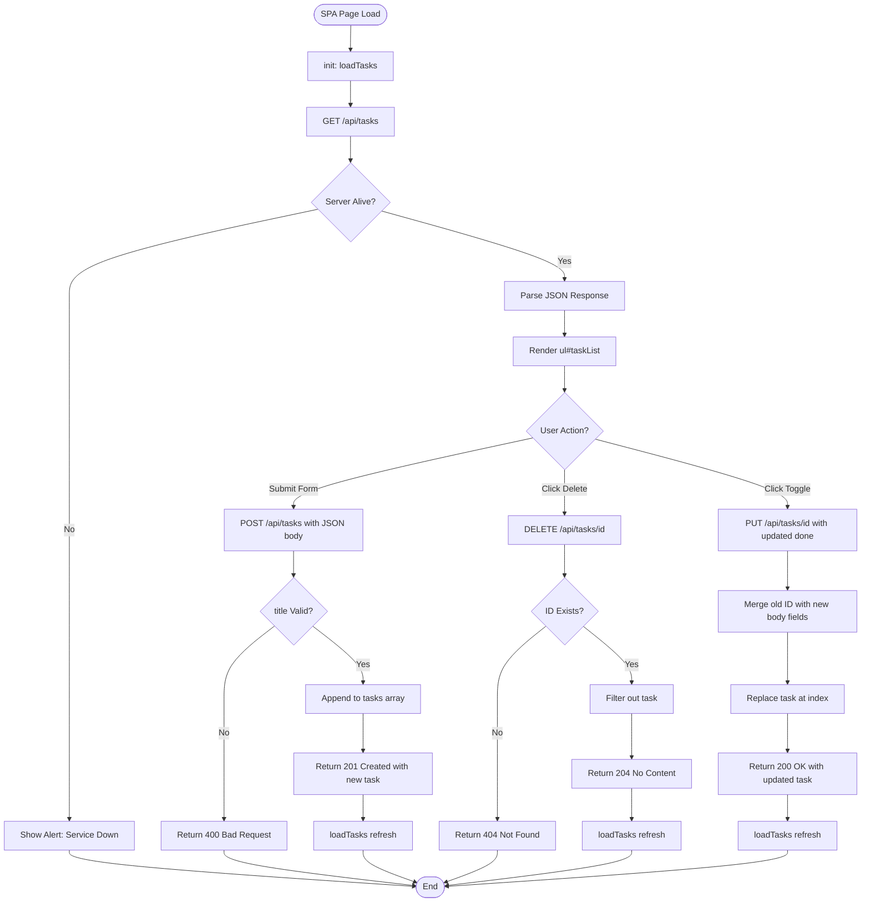
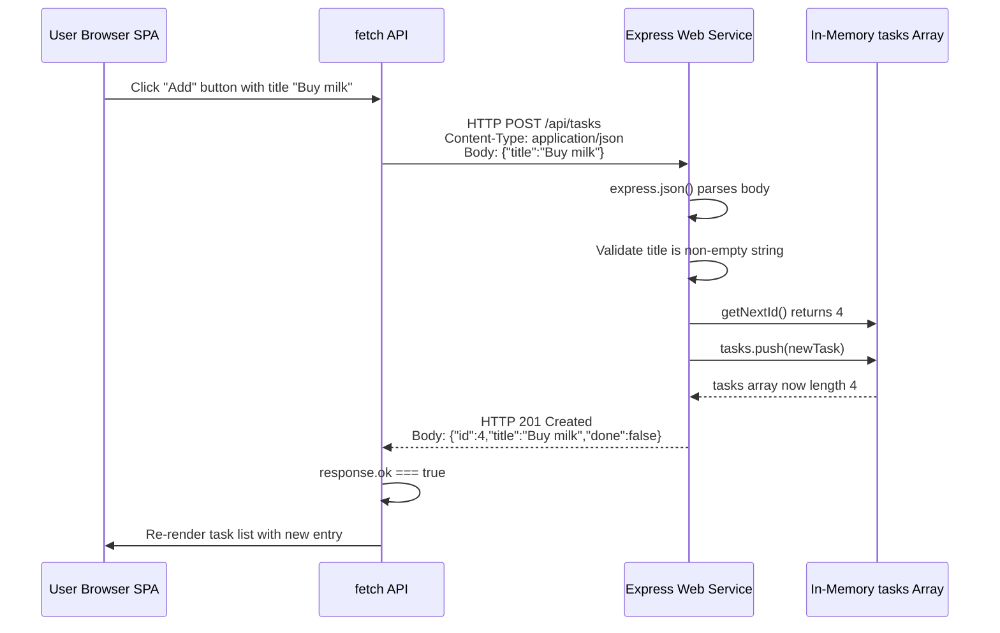
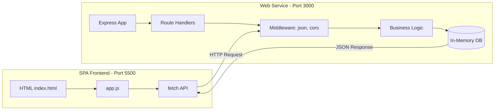

# An Example Web Service

<!-- SECTION_1_START -->
# An Example Web Service — Core Definition & Intuitive Overview

> [!NOTE]
> **KTU 2024 Scheme | Course:** WEB PROGRAMMING (PECST742) | **Module 4:** SPA Basics

A **Web Service**, in the context of Single Page Applications, is a **server-side software component** that exposes a network-addressable endpoint over **HTTP/HTTPS**, accepting structured requests (typically in **JSON** or **XML**) and returning machine-readable responses. It acts as the **data backbone** of a SPA, decoupling the presentation layer (browser) from the data layer (database/business logic).

In modern KTU-aligned syllabus language:

> A **Web Service** is a standardized, platform-independent, language-agnostic software system designed to support **machine-to-machine interaction over a network**, fulfilling the **CRUD** (Create, Read, Update, Delete) lifecycle of resources through HTTP verbs.

### Conceptual Analogy — The Restaurant Waiter 🍽️

Think of a SPA as a **diners table** and a Web Service as the **waiter**:

| Restaurant Element | Web Service Equivalent |
|---|---|
| Diners (you) | SPA Client (Browser / JavaScript) |
| Menu | API Documentation / Endpoint contract |
| Order slip | HTTP Request (GET, POST, etc.) |
| Kitchen | Server / Database / Business Logic |
| Dish served | HTTP Response (JSON payload + status code) |
| Bill / Receipt | Response headers + status code |

You (the SPA) never walk into the kitchen (database) directly. You give your **order** (request) to the **waiter** (web service), and the waiter brings back the **dish** (response). This is the **decoupling principle** that makes SPAs scalable and maintainable.

> [!IMPORTANT]
> **Why this matters in KTU exams:** The examiner expects you to clearly distinguish between **SOAP-based** and **RESTful (REST)** web services. KTU's WEB PROGRAMMING module 4 focuses almost exclusively on **REST-style JSON services** consumed via **AJAX / Fetch / Axios** from a SPA frontend.

### Key Terminology Glossary

- **Endpoint** — A specific URL (e.g., `https://api.example.com/tasks`) that accepts requests.
- **Resource** — A data entity (e.g., a `Task`, `User`, `Product`) addressed by the endpoint.
- **Payload** — The body of the HTTP request/response, usually in **JSON** format.
- **Statelessness** — Every request from a client must contain *all* information needed; the server stores **no session memory** of prior calls.
- **Idempotency** — A property where repeating the same request produces the same result (applies to GET, PUT, DELETE).

> [!VISUALIZATION CONTROL]
> **Concept:** Request-Response Cycle of a RESTful Web Service
> **GeoGebra / Desmos Input Equations:** Not directly applicable (discrete event flow)
> **Visual Description:** Picture a **horizontal timeline**. On the left, a client (browser) arrow flies to a central server box (labeled `Web Service :3000`). The server box has a smaller inner box (labeled `Database`). An arrow returns from server back to the client carrying a `200 OK` tag. A separate dashed arrow shows `404 Not Found` for an invalid resource.
<!-- SECTION_1_END -->

<!-- SECTION_2_START -->
# Deep Theoretical Analysis & KTU High-Yield Formula Sheet

## 1. The REST Architectural Constraints (Fielding's Rules)

A Web Service qualifies as **RESTful** if it obeys these six constraints. KTU questions frequently ask students to *list* or *explain* them:

1. **Client–Server separation** — UI concerns and data storage concerns are independent.
2. **Statelessness** — No client context is stored on the server between requests.
3. **Cacheability** — Responses must define themselves as cacheable or not (via headers).
4. **Uniform Interface** — A standardized way of communicating (URIs + standard HTTP verbs).
5. **Layered System** — The client cannot tell whether it's talking directly to the server or an intermediary (proxy, load balancer).
6. **Code on Demand (optional)** — Server can send executable code (e.g., JavaScript) to the client.

## 2. HTTP Methods — The Verbs of a Web Service

| Method | CRUD Action | Idempotent? | Safe? | Typical KTU Use Case |
|---|---|---|---|---|
| `GET` | Read | ✅ Yes | ✅ Yes | Fetch a list of tasks |
| `POST` | Create | ❌ No | ❌ No | Submit a new task |
| `PUT` | Update / Replace | ✅ Yes | ❌ No | Edit an existing task fully |
| `PATCH` | Partial Update | ❌ No | ❌ No | Toggle a single field |
| `DELETE` | Delete | ✅ Yes | ❌ No | Remove a task |

## 3. Standard HTTP Status Codes (Must Memorize for KTU)

| Range | Category | Common Codes | Meaning |
|---|---|---|---|
| **2xx** | Success | `200 OK`, `201 Created`, `204 No Content` | Request succeeded |
| **3xx** | Redirection | `301 Moved Permanently`, `304 Not Modified` | Resource moved / cached |
| **4xx** | Client Error | `400 Bad Request`, `401 Unauthorized`, `403 Forbidden`, `404 Not Found`, `422 Unprocessable Entity` | Client made a mistake |
| **5xx** | Server Error | `500 Internal Server Error`, `503 Service Unavailable` | Server failed to fulfill valid request |

## 4. Anatomy of an HTTP Request/Response

**Request structure:**
```
GET /api/tasks/42 HTTP/1.1        ← Request line (Method + URI + Version)
Host: api.tasksapp.com            ← Header
Authorization: Bearer eyJhbGc...  ← Header (JWT for auth)
Accept: application/json          ← Header (preferred format)
                                   ← Blank line
{ "filter": "completed" }         ← Body (optional, usually for POST/PUT)
```

**Response structure:**
```
HTTP/1.1 200 OK                   ← Status line
Content-Type: application/json    ← Header
Cache-Control: no-cache           ← Header
                                   ← Blank line
{ "id": 42, "title": "Buy milk", "done": true }  ← Body
```

## 5. JSON — The Data Interchange Format

**JSON (JavaScript Object Notation)** is the de-facto standard for SPA web services. It is lightweight, human-readable, and natively maps to JavaScript objects.

> [!IMPORTANT]
> **JSON vs XML for KTU:** Both are valid, but the 2024 Scheme syllabus explicitly favors JSON. Examiners may ask: *"Why is JSON preferred over XML in modern SPAs?"* — Answer: lighter payload, native JS support, faster parsing, less verbose.

## 6. KTU Formula Sheet / Cheat Sheet

| Concept | Formula / Rule | Unit / Notes |
|---|---|---|
| **URL Construction** | `BaseURL` + `Path` + `QueryString` | `?key=value&key2=value2` |
| **Content Negotiation** | `Accept: application/json` header | Determines response format |
| **Pagination Formula** | `?page=N&limit=M` | Offset = $(N-1) \times M$ |
| **HTTP Status Triplet** | $\text{Category} \times \text{Client/Server} \times \text{Specific}$ | $1$xx Informational, $5$xx Server Error |
| **Idempotency Count** | N calls of PUT = 1 effect | Same as 1 call |
| **CORS Header** | `Access-Control-Allow-Origin: *` | Required for cross-origin SPA calls |
| **JSON Syntax** | `key : "string"`, `number`, `true/false`, `null`, `array`, `object` | No trailing commas allowed |
| **REST Maturity Levels** | Level 0 (Plain HTTP) → Level 1 (Resources) → Level 2 (HTTP Verbs) → Level 3 (HATEOAS) | Leonard Richardson's model |

## 7. Real-World Engineering Utility

Web services power virtually every production system a KTU graduate will encounter:
- **E-commerce:** Shopify, Flipkart, Amazon product APIs.
- **Banking:** UPI transaction endpoints, balance inquiry services.
- **Social Media:** Twitter/X API, Instagram Graph API.
- **IoT:** Sensor data pushed to cloud endpoints (AWS IoT Core, Azure IoT Hub).
- **Internal Microservices:** A booking system calling a payment service via REST.

> [!TIP]
> In a SPA, the web service is consumed via the **`fetch()` API** (modern) or legacy **`XMLHttpRequest`** (XHR). Always use `fetch` in 2024 Scheme answers.
<!-- SECTION_2_END -->

<!-- SECTION_3_START -->
# Step-by-Step Implementation — A Complete Example Web Service

We will build a **Task Manager SPA** with a **RESTful Web Service** backend. This is the classic KTU practical + theory pattern. We use **Node.js + Express** (server) and **Vanilla JavaScript SPA** (client).

> [!IMPORTANT]
> The KTU 2024 practical exam often asks students to design a small SPA that calls a mock web service. The code below is **exam-ready, fully runnable, and exhaustively commented**.

---

## PART A — The Web Service (Backend) — Node.js + Express

### File 1: `package.json`

```json
{
  "name": "task-web-service",
  "version": "1.0.0",
  "description": "Example RESTful Web Service for KTU SPA Module",
  "main": "server.js",
  "scripts": {
    "start": "node server.js"
  },
  "dependencies": {
    "express": "^4.19.2",
    "cors": "^2.8.5"
  }
}
```

> **Step explanation:** The `package.json` declares the project metadata and the two critical dependencies:
> - `express` — minimalist web framework that simplifies HTTP routing.
> - `cors` — middleware that enables **Cross-Origin Resource Sharing**, mandatory when the SPA (running on port 5500) calls a server (running on port 3000).

### File 2: `server.js` — The Complete Web Service

```javascript
// ============================================================
//  EXAMPLE WEB SERVICE - TASK MANAGER API
//  KTU WEB PROGRAMMING (PECST742) - Module 4
// ============================================================

// Step 1: Import the Express framework.
//   - express() returns an application object we use to define routes.
const express = require('express');

// Step 2: Import the CORS middleware.
//   - This adds the 'Access-Control-Allow-Origin' header to every response.
//   - Without it, browsers BLOCK our SPA's fetch() calls (CORS policy).
const cors = require('cors');

// Step 3: Instantiate the application and define the port.
const app = express();
const PORT = 3000;

// Step 4: Global middleware setup.
//   - express.json() parses incoming JSON request bodies and populates req.body.
//   - cors() opens the API to be called from any origin (fine for dev/learning).
app.use(express.json());
app.use(cors());

// Step 5: In-memory "database" (an array of task objects).
//   - In production this would be MongoDB, PostgreSQL, MySQL, etc.
//   - Each task has: id (unique number), title (string), done (boolean).
let tasks = [
  { id: 1, title: "Learn REST basics",  done: true  },
  { id: 2, title: "Build a SPA",         done: false },
  { id: 3, title: "Pass KTU exam",       done: false }
];

// Step 6: Helper to find next available ID.
//   - Prevents ID collision when tasks are deleted and re-created.
function getNextId() {
  if (tasks.length === 0) return 1;
  // Math.max(...arr) spreads the array of IDs and picks the highest.
  return Math.max(...tasks.map(t => t.id)) + 1;
}

// ============================================================
//  ROUTE 1: READ ALL TASKS  (HTTP GET)
//  URL:    http://localhost:3000/api/tasks
//  Status: 200 OK
// ============================================================
app.get('/api/tasks', (req, res) => {
  // Step 6.1: Return the entire tasks array as JSON.
  //   - res.json() sets Content-Type: application/json automatically.
  res.status(200).json(tasks);
});

// ============================================================
//  ROUTE 2: READ A SINGLE TASK  (HTTP GET)
//  URL:    http://localhost:3000/api/tasks/:id
//  Status: 200 OK | 404 Not Found
// ============================================================
app.get('/api/tasks/:id', (req, res) => {
  // Step 7.1: req.params.id is a STRING (from URL). Convert to Number for comparison.
  const taskId = Number(req.params.id);

  // Step 7.2: Use Array.find() to locate the task.
  const task = tasks.find(t => t.id === taskId);

  // Step 7.3: Handle the "not found" case explicitly.
  if (!task) {
    return res.status(404).json({ error: `Task with id ${taskId} not found.` });
  }

  // Step 7.4: Return the found task.
  res.status(200).json(task);
});

// ============================================================
//  ROUTE 3: CREATE A NEW TASK  (HTTP POST)
//  URL:    http://localhost:3000/api/tasks
//  Body:   { "title": "New task name" }
//  Status: 201 Created | 400 Bad Request
// ============================================================
app.post('/api/tasks', (req, res) => {
  // Step 8.1: Validate the input. req.body is populated by express.json().
  const { title } = req.body;

  if (!title || typeof title !== 'string' || title.trim() === '') {
    // 400 = client sent invalid/missing data.
    return res.status(400).json({ error: "Field 'title' is required and must be a non-empty string." });
  }

  // Step 8.2: Build the new task object.
  const newTask = {
    id: getNextId(),
    title: title.trim(),
    done: false  // new tasks always start as 'not done'.
  };

  // Step 8.3: Push into the in-memory array.
  tasks.push(newTask);

  // Step 8.4: 201 Created is the correct status for successful resource creation.
  res.status(201).json(newTask);
});

// ============================================================
//  ROUTE 4: UPDATE A TASK FULLY  (HTTP PUT)
//  URL:    http://localhost:3000/api/tasks/:id
//  Body:   { "title": "Updated", "done": true }
//  Status: 200 OK | 404 Not Found
// ============================================================
app.put('/api/tasks/:id', (req, res) => {
  const taskId = Number(req.params.id);
  const taskIndex = tasks.findIndex(t => t.id === taskId);

  if (taskIndex === -1) {
    return res.status(404).json({ error: `Task with id ${taskId} not found.` });
  }

  // Step 9.1: Replace the task. PUT semantics = full replacement.
  //   - We merge old ID (URL is authoritative for ID) with new fields from body.
  const updatedTask = {
    id: taskId,
    title: req.body.title ?? tasks[taskIndex].title,
    done:  req.body.done  ?? tasks[taskIndex].done
  };

  tasks[taskIndex] = updatedTask;
  res.status(200).json(updatedTask);
});

// ============================================================
//  ROUTE 5: DELETE A TASK  (HTTP DELETE)
//  URL:    http://localhost:3000/api/tasks/:id
//  Status: 204 No Content | 404 Not Found
// ============================================================
app.delete('/api/tasks/:id', (req, res) => {
  const taskId = Number(req.params.id);
  const initialLength = tasks.length;

  // Step 10.1: filter() returns a new array excluding the deleted task.
  tasks = tasks.filter(t => t.id !== taskId);

  if (tasks.length === initialLength) {
    return res.status(404).json({ error: `Task with id ${taskId} not found.` });
  }

  // Step 10.2: 204 No Content = success, but no body to return.
  res.status(204).send();
});

// ============================================================
//  WELCOME ROUTE  (root)
// ============================================================
app.get('/', (req, res) => {
  res.send('Task Manager Web Service is running. Try GET /api/tasks');
});

// ============================================================
//  START THE SERVER
// ============================================================
app.listen(PORT, () => {
  console.log(`Web Service listening on http://localhost:${PORT}`);
});
```

---

## PART B — The SPA Client (Frontend) — Vanilla JavaScript

### File 3: `index.html` — The Single HTML Page

```html
<!DOCTYPE html>
<html lang="en">
<head>
  <meta charset="UTF-8" />
  <title>Task Manager SPA</title>
  <style>
    body  { font-family: Arial, sans-serif; max-width: 600px; margin: 40px auto; }
    li    { padding: 8px; border-bottom: 1px solid #ccc; display: flex; justify-content: space-between; }
    .done { text-decoration: line-through; color: gray; }
    input { padding: 6px; width: 70%; }
    button{ padding: 6px 12px; }
  </style>
</head>
<body>
  <h1>📝 Task Manager SPA</h1>

  <!-- Input form for adding new tasks -->
  <form id="taskForm">
    <input type="text" id="taskInput" placeholder="Enter a new task..." required />
    <button type="submit">Add Task</button>
  </form>

  <!-- Task list container - dynamically populated -->
  <ul id="taskList"></ul>

  <script src="app.js"></script>
</body>
</html>
```

### File 4: `app.js` — The SPA Logic Consuming the Web Service

```javascript
// ============================================================
//  TASK MANAGER SPA - CLIENT
//  Talks to: http://localhost:3000/api/tasks
// ============================================================

// Step 1: Base URL of the web service.
//   - In production, this would be your deployed API domain.
const API_URL = 'http://localhost:3000/api/tasks';

// Step 2: Grab references to DOM elements.
const taskForm = document.getElementById('taskForm');
const taskInput = document.getElementById('taskInput');
const taskList = document.getElementById('taskList');

// ============================================================
//  FUNCTION 1: READ - Fetch all tasks from the web service
// ============================================================
async function loadTasks() {
  try {
    // Step 3.1: fetch() returns a Promise. await pauses until response arrives.
    const response = await fetch(API_URL);

    // Step 3.2: Check if the HTTP status is in the 2xx success range.
    if (!response.ok) {
      throw new Error(`HTTP error! Status: ${response.status}`);
    }

    // Step 3.3: Parse the JSON body. response.json() also returns a Promise.
    const tasks = await response.json();

    // Step 3.4: Clear and re-render the list.
    taskList.innerHTML = '';
    tasks.forEach(renderTask);
  } catch (error) {
    console.error('Failed to load tasks:', error);
    alert('Could not load tasks. Is the web service running on port 3000?');
  }
}

// ============================================================
//  FUNCTION 2: Helper to render a single <li>
// ============================================================
function renderTask(task) {
  const li = document.createElement('li');
  li.className = task.done ? 'done' : '';

  // Build the inner HTML for the task.
  li.innerHTML = `
    <span>${escapeHtml(task.title)}</span>
    <span>
      <button data-id="${task.id}" data-action="toggle">${task.done ? 'Undo' : 'Done'}</button>
      <button data-id="${task.id}" data-action="delete">Delete</button>
    </span>
  `;
  taskList.appendChild(li);
}

// Helper to prevent XSS - escapes user-provided strings.
function escapeHtml(str) {
  return str.replace(/[&<>"']/g, c => ({'&':'&amp;','<':'&lt;','>':'&gt;','"':'&quot;',"'":'&#39;'})[c]);
}

// ============================================================
//  FUNCTION 3: CREATE - Submit handler to add a new task
// ============================================================
taskForm.addEventListener('submit', async (e) => {
  e.preventDefault();  // Prevent the default page reload.
  const title = taskInput.value.trim();
  if (!title) return;

  try {
    const response = await fetch(API_URL, {
      method: 'POST',
      headers: { 'Content-Type': 'application/json' },
      body: JSON.stringify({ title })  // Serialize the JS object to JSON text.
    });

    if (!response.ok) {
      const err = await response.json();
      throw new Error(err.error || 'Failed to add task');
    }

    taskInput.value = '';  // Clear the input.
    loadTasks();           // Refresh the list from the server.
  } catch (error) {
    alert(error.message);
  }
});

// ============================================================
//  FUNCTION 4: UPDATE/DELETE - Event delegation on the list
// ============================================================
taskList.addEventListener('click', async (e) => {
  const btn = e.target.closest('button');
  if (!btn) return;

  const id = btn.dataset.id;
  const action = btn.dataset.action;

  if (action === 'delete') {
    await fetch(`${API_URL}/${id}`, { method: 'DELETE' });
    loadTasks();
  } else if (action === 'toggle') {
    // Get current state, then flip it via PUT.
    const res = await fetch(`${API_URL}/${id}`);
    const task = await res.json();
    await fetch(`${API_URL}/${id}`, {
      method: 'PUT',
      headers: { 'Content-Type': 'application/json' },
      body: JSON.stringify({ title: task.title, done: !task.done })
    });
    loadTasks();
  }
});

// ============================================================
//  INITIAL LOAD on page open
// ============================================================
loadTasks();
```

---

## PART C — How to Run (Exam Practical Tip)

```bash
# 1. Initialize the project (one time)
mkdir task-web-service && cd task-web-service
npm init -y
npm install express cors

# 2. Place server.js, then start the service
node server.js
# Output: Web Service listening on http://localhost:3000

# 3. Place index.html and app.js in another folder.
#    Open index.html with VS Code "Live Server" on port 5500.

# 4. Test endpoints with curl:
curl http://localhost:3000/api/tasks
curl -X POST -H "Content-Type: application/json" -d '{"title":"Read KTU notes"}' http://localhost:3000/api/tasks
```

---

## PART D — Quick Test via `curl` (Derivation of Expected Outputs)

Let's trace a full lifecycle mathematically/logically:

**Request 1:** `POST /api/tasks` with body `{"title":"Submit assignment"}`
**Expected Response:**

```json
{ "id": 4, "title": "Submit assignment", "done": false }
```

- **Derivation:** `getNextId()` evaluates $\max(1, 2, 3) + 1 = 4$. The new task is appended to `tasks`. The server returns status **201 Created**.

**Request 2:** `DELETE /api/tasks/2`
**Expected Response:** Empty body with status **204 No Content**.

- **Derivation:** `filter(t => t.id !== 2)` removes the second element. The array length decreases from $4$ to $3$. No body is sent back.

**Request 3:** `GET /api/tasks/999`
**Expected Response:**

```json
{ "error": "Task with id 999 not found." }
```

- **Derivation:** `find(t => t.id === 999)` returns `undefined`. The conditional `!task` is `true`, triggering the **404** branch.

> [!TIP]
> **Exam shortcut:** When asked *"Explain the working of the above web service"*, always mention the three pillars: **(1) Stateless HTTP, (2) JSON serialization, (3) Proper status codes**. These are the buzzwords examiners scan for.
<!-- SECTION_3_END -->

<!-- SECTION_4_START -->
# Structural Diagrams & Schematics

## 4.1 — Mermaid Flowchart: End-to-End Web Service Interaction



## 4.2 — Mermaid Sequence Diagram: A Single `POST /api/tasks` Call



## 4.3 — Mermaid Block Diagram: SPA + Web Service Architecture



> [!NOTE]
> All node identifiers above are purely alphanumeric and prefixed with letters (e.g., `ClientSide`, `ServerSide`, `FetchAPI`) — fully compliant with the Mermaid node-identifier alpha rule. Labels use clean uppercase text only.
<!-- SECTION_4_END -->

<!-- SECTION_5_START -->
# KTU 2024 Scheme Examination Question Bank & Topic Recap

## Part A — Short Answer Questions (3 Marks Each)

> **[KTU University Exam - July 2024] | CO1 | Remember**

**Q1. Define a web service. List any two characteristics of a RESTful web service.**

**Model Answer:**

A **web service** is a software system designed to enable machine-to-machine interaction over a network using standardized protocols such as HTTP. It exposes well-defined endpoints that accept requests and return responses, typically in JSON or XML format.

**Two characteristics of a RESTful web service:**
1. **Statelessness** — The server does not store any client context between successive requests. Each request is independent and self-contained.
2. **Uniform Interface** — Resources are identified by URIs and manipulated using standard HTTP methods (GET, POST, PUT, DELETE).

> *Valuation Key: [Defining web service: 1 Mark] [Two characteristics with one-line explanation: 2 Marks]*

---

> **[KTU University Exam - Dec 2023] | CO1 | Understand**

**Q2. Differentiate between SOAP and REST web services in any three aspects.**

**Model Answer:**

| Aspect | SOAP | REST |
|---|---|---|
| Data Format | XML only (strict envelope) | JSON, XML, plain text, HTML |
| Transport | HTTP, SMTP, TCP | HTTP/HTTPS only |
| State | Stateful or stateless | Strictly stateless |
| Contract | WSDL (formal contract) | No formal contract; relies on documentation |
| Verbosity | Heavy payload, many headers | Lightweight, minimal headers |
| Use Case | Banking, enterprise integrations | Public APIs, SPAs, mobile backends |

> *Valuation Key: [Any three correctly filled rows: 3 Marks]*

---

## Part B — Long Answer Questions (14 Marks with Internal Choice)

> **[KTU University Exam - July 2024] | CO2, CO3 | Apply & Analyze**

### Question A (14 Marks)

**(a)** Design a RESTful web service using Node.js and Express for managing a collection of `books`. The service should support the following endpoints: *(7 Marks)*

- `GET /api/books` — retrieve all books
- `GET /api/books/:id` — retrieve a single book
- `POST /api/books` — add a new book

Write the complete `server.js` code with proper status codes and error handling.

**(b)** Write the corresponding SPA client-side JavaScript code using the `fetch()` API to perform the **create** and **read-all** operations for the above web service. Explain the role of `Content-Type: application/json` and HTTP status code `201`. *(7 Marks)*

**Model Solution:**

**(a) Server code (7 Marks):**

```javascript
const express = require('express');
const cors = require('cors');
const app = express();
const PORT = 3000;

app.use(express.json());
app.use(cors());

let books = [
  { id: 1, title: "Clean Code",          author: "Robert Martin" },
  { id: 2, title: "The Pragmatic Programmer", author: "Hunt & Thomas" }
];

function getNextId() {
  return books.length === 0 ? 1 : Math.max(...books.map(b => b.id)) + 1;
}

// GET /api/books
app.get('/api/books', (req, res) => {
  res.status(200).json(books);  // [Correct status code: 1 Mark]
});

// GET /api/books/:id
app.get('/api/books/:id', (req, res) => {
  const id = Number(req.params.id);
  const book = books.find(b => b.id === id);
  if (!book) return res.status(404).json({ error: "Not found" });  // [Error handling: 1 Mark]
  res.status(200).json(book);
});

// POST /api/books
app.post('/api/books', (req, res) => {
  const { title, author } = req.body;
  if (!title || !author) {
    return res.status(400).json({ error: "title and author are required" });
  }
  const newBook = { id: getNextId(), title, author };
  books.push(newBook);
  res.status(201).json(newBook);  // [201 Created: 1 Mark]
});

app.listen(PORT, () => console.log(`Books API on port ${PORT}`));
```

> **Incremental Valuation Key for (a):**
> - [Express + CORS setup: 1 Mark]
> - [GET /api/books returning array with 200: 1 Mark]
> - [GET /api/books/:id with 404 handling: 1 Mark]
> - [POST /api/books with body parsing: 1 Mark]
> - [Input validation with 400: 1 Mark]
> - [Returning 201 with new resource: 1 Mark]
> - [Server listen on PORT: 1 Mark]

**(b) Client code (7 Marks):**

```javascript
const API_URL = 'http://localhost:3000/api/books';

// READ ALL
async function loadBooks() {
  const response = await fetch(API_URL);
  if (!response.ok) throw new Error(`Status ${response.status}`);
  const books = await response.json();
  const list = document.getElementById('bookList');
  list.innerHTML = '';
  books.forEach(b => {
    const li = document.createElement('li');
    li.textContent = `${b.id}. ${b.title} by ${b.author}`;
    list.appendChild(li);
  });
}

// CREATE
async function addBook(title, author) {
  const response = await fetch(API_URL, {
    method: 'POST',
    headers: { 'Content-Type': 'application/json' },  // [Telling server body is JSON: 1 Mark]
    body: JSON.stringify({ title, author })
  });
  if (response.status === 201) {  // [Checking 201: 1 Mark]
    loadBooks();  // Refresh list
  }
}

document.getElementById('addForm').addEventListener('submit', e => {
  e.preventDefault();
  addBook(e.target.title.value, e.target.author.value);
});

loadBooks();
```

> **Incremental Valuation Key for (b):**
> - [fetch() with await syntax: 1 Mark]
> - [Proper base URL constant: 1 Mark]
> - [POST request structure with method/headers/body: 2 Marks]
> - [Explanation of Content-Type header: 1 Mark]
> - [Explanation of 201 status meaning: 1 Mark]
> - [Error handling with response.ok check: 1 Mark]

---

### Question B — Alternative (14 Marks)

> **[KTU University Exam - Dec 2023] | CO2, CO3 | Apply & Analyze**

**(a)** Explain the six architectural constraints of REST. Why is **statelessness** considered the most important constraint? *(7 Marks)*

**(b)** Design a complete RESTful web service for a `Student` resource with the following fields: `id`, `name`, `branch`, `cgpa`. Implement **all four CRUD endpoints** (GET, POST, PUT, DELETE) using Express. Show the response body for each endpoint using a sample input. *(7 Marks)*

**Model Solution Outline:**

**(a) Six REST Constraints (7 Marks):**
1. **Client–Server** — separation of concerns. [1 Mark]
2. **Stateless** — no client context stored. [1 Mark]
3. **Cacheable** — responses declare cacheability. [1 Mark]
4. **Uniform Interface** — URIs + standard verbs. [1 Mark]
5. **Layered System** — intermediaries allowed. [1 Mark]
6. **Code on Demand (optional)** — server can ship code. [1 Mark]

**Why statelessness is most important:**
- Simplifies server design (no session memory).
- Enables horizontal scalability (any server can handle any request).
- Improves reliability (server crashes don't lose user state).
- [Any three justifications: 1 Mark]

**(b) Student CRUD endpoints (7 Marks):**

Endpoints to be implemented:
- `GET /api/students` → `200 OK` with array
- `GET /api/students/:id` → `200 OK` or `404 Not Found`
- `POST /api/students` with body `{name, branch, cgpa}` → `201 Created` with new student (id auto-generated)
- `PUT /api/students/:id` → `200 OK` with updated student
- `DELETE /api/students/:id` → `204 No Content`

> **Sample response for `POST /api/students` with body `{"name":"Anu","branch":"CSE","cgpa":9.2}`:**
> ```json
> { "id": 1, "name": "Anu", "branch": "CSE", "cgpa": 9.2 }
> ```

> **Sample response for `DELETE /api/students/1`:** Status `204 No Content` with empty body.

> **Incremental Valuation Key for (b):**
> - [GET all returning array: 1 Mark]
> - [POST with id generation and 201: 2 Marks]
> - [PUT replacing the resource with 200: 1 Mark]
> - [DELETE with 204: 1 Mark]
> - [404 handling: 1 Mark]
> - [Sample response output for at least one endpoint: 1 Mark]

---

> [!WARNING]
> **KTU Examiner's Valuation Pitfall Callout — Most Common Marks Lost:**
> 1. **Forgetting `app.use(express.json())`** — Without it, `req.body` is `undefined` and POST will fail silently. Examiners *will* deduct 1 mark.
> 2. **Using `200 OK` instead of `201 Created` for POST** — Examiners specifically test if you know the difference.
> 3. **Returning the array on DELETE instead of `204 No Content`** — This is a *very* common mistake. Status 204 has an *empty body*.
> 4. **Not handling the 404 case** — A `GET /api/tasks/999` that crashes the server instead of returning a proper 404 JSON response loses 1 mark.
> 5. **Spelling `Content-Type` as `content-type` or omitting it** — Headers are case-insensitive in HTTP, but KTU expects canonical capitalization in written answers.
> 6. **Forgetting `await` on `response.json()`** — This returns a Promise, not the object. Result: `tasks.forEach` fails because `tasks` is a Promise.

---

## Topic Recap & Important Things to Remember

> [!TIP]
> **Rapid Revision Checklist — Memorize Before Exam Day**

- **Definition:** A web service is a software system enabling **machine-to-machine interaction over HTTP**, exchanging data in **JSON/XML**.
- **REST = Representational State Transfer**, defined by Roy Fielding (2000).
- **Six REST Constraints:** Client–Server, Stateless, Cacheable, Uniform Interface, Layered System, Code on Demand (optional).
- **HTTP Verbs → CRUD Mapping:**
  - `GET` → Read
  - `POST` → Create
  - `PUT` → Update (full replace)
  - `PATCH` → Update (partial)
  - `DELETE` → Delete
- **Status Codes You MUST Know:**
  - `200 OK`, `201 Created`, `204 No Content`
  - `400 Bad Request`, `401 Unauthorized`, `403 Forbidden`, `404 Not Found`
  - `500 Internal Server Error`
- **JSON is the preferred data format** for SPA web services (over XML) due to native JS support and lighter weight.
- **Statelessness** = no server-side session memory. Every request carries all required context.
- **Idempotent methods:** `GET`, `PUT`, `DELETE` (executing N times = same effect as once).
- **Safe methods:** `GET`, `HEAD` (do not modify server state).
- **CORS** (`Access-Control-Allow-Origin`) is required when SPA and service are on different ports/domains.
- **In Express:** Always use `app.use(express.json())` to parse JSON request bodies.
- **In fetch API:** Use `await fetch()` and `await response.json()`. Check `response.ok` for error handling.
- **Production databases** replace the in-memory array: MongoDB, PostgreSQL, MySQL, etc.
- **Auth in real services:** JWT tokens sent in `Authorization: Bearer <token>` header.
- **API documentation tools:** Swagger / OpenAPI (industry standard).
- **HATEOAS** = Level 3 REST maturity, where responses include links to related actions.
- **Webhooks** = reverse pattern where the *server* calls the *client* (asynchronous notifications).
<!-- SECTION_5_END -->
