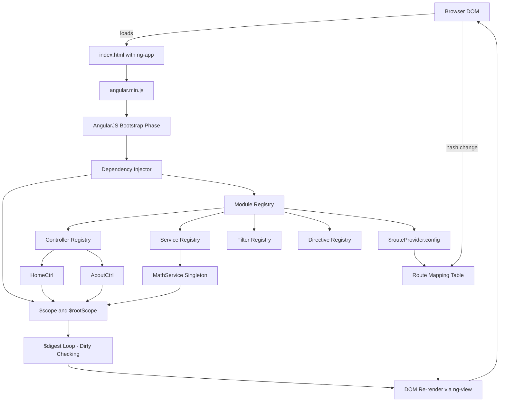
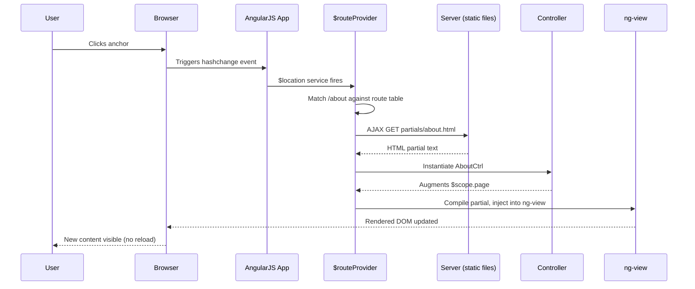
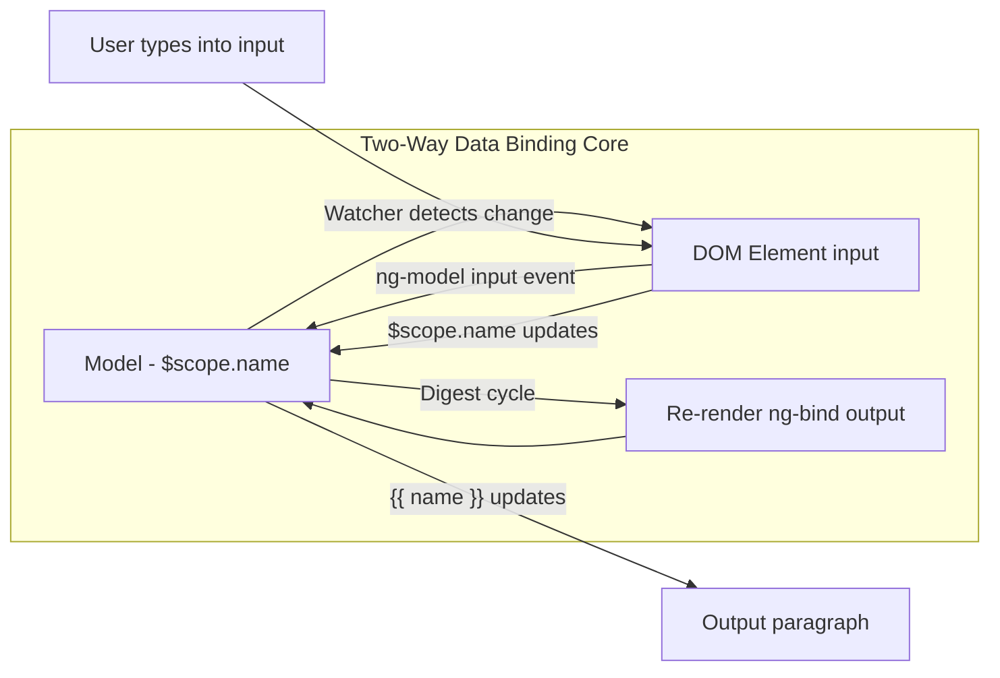
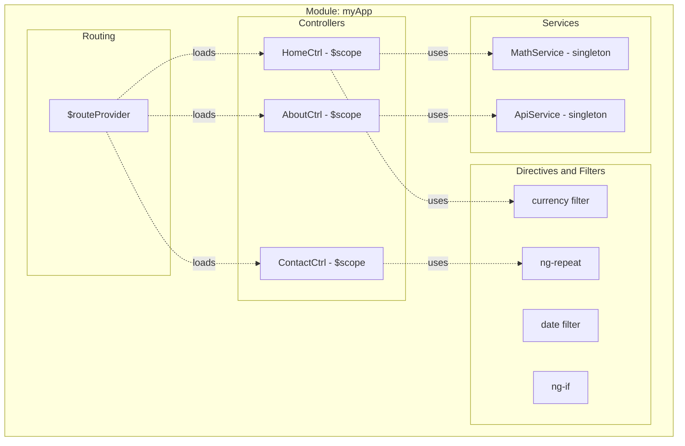
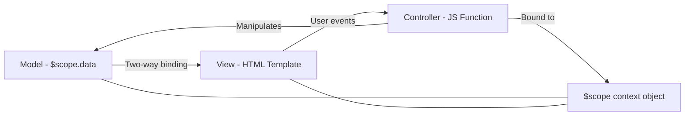

# Angular JS

<!-- SECTION_1_START -->
# Module 4 — SPA Basics: AngularJS

## 1.1 Formal Definition (KTU 2024 Syllabus Terminology)

> [!NOTE]
> **AngularJS** is an open-source, client-side **JavaScript-based structural framework** maintained by Google, used for building **Single Page Applications (SPAs)** and dynamic web interfaces. It extends HTML vocabulary through the use of **Directives**, binds data to HTML using **two-way Data Binding**, and follows the **Model-View-Controller (MVC) / Model-View-Whatever (MVW)** architectural pattern.

In the context of the KTU **Web Programming (PECST742)** syllabus, AngularJS is positioned as the foundational tool for the **SPA Basics** module because it natively supports all three pillars of a SPA: **client-side routing, partial view rendering, and asynchronous data exchange (AJAX) without full page reloads**.

**Physical / Web Constants used throughout AngularJS:**
- **Script source:** `https://ajax.googleapis.com/ajax/libs/angularjs/1.8.3/angular.min.js`
- **AngularJS 1.x current stable:** **1.8.3** (legacy 1.x branch)
- **Cycle time for `$digest` loop:** variable, but $apply typically resolves within one browser frame (~**16.67 ms** for 60 FPS)
- **Hashbang / Hash routing character:** `#!` or `#` (HTML5 history API is optional)

---

## 1.2 Conceptual Analogy / Intuition

> [!IMPORTANT]
> **Analogy — "The Conductor of an Orchestra"**
> Think of a traditional web page as a **chamber band** where each instrument (HTML, CSS, JS) plays its own music independently, and the music sheet has to be rewritten and re-printed every time a note changes (full page reload). 
>
> **AngularJS is the Conductor.** 
> The Conductor listens to every instrument (the **Model** — your data), tells the sheet music (the **View** — your HTML) how to display itself, and coordinates the section leaders (the **Controllers**). When the violinist changes her tune, the Conductor automatically tells the rest of the orchestra to harmonise — *without ever tearing up and reprinting the sheet music*. This automatic re-tuning is exactly what **two-way data binding** does in AngularJS.

> [!IMPORTANT]
> **Analogy — "Single Page = Single Passport"**
> A SPA built with AngularJS is like a **passport booklet with many visa pages** (routes). The cover (the initial `index.html`) never changes; only the pages inside flip instantly using the `ng-view` directive. There is **no full reload** — just content swap — making the experience feel like a native desktop app.

---

## 1.3 Why AngularJS for SPAs?

| Feature | Benefit for SPAs |
|---|---|
| Two-way data binding | Automatic UI ↔ Model sync (no manual DOM manipulation) |
| Directives | Reusable, semantic HTML extensions (`ng-repeat`, `ng-if`) |
| Dependency Injection | Testable, modular services and controllers |
| Routing (`ngRoute`) | Bookmarkable URLs in a single HTML document |
| Templating | Server-rendered HTML is unnecessary; client renders partials |
| `$http` service | Native AJAX without writing `XMLHttpRequest` boilerplate |

> [!VISUALIZATION CONTROL]
> **Concept:** AngularJS Bootstrapping & Data Flow (Model ⇄ View ⇄ Controller)
> **GeoGebra / Desmos Input Equations (proxy as state diagram):**
> * `Model = { name: "Anu", age: 21 }` (variable points)
> * `View = <input ng-model="name">` (rendered as live text)
> * `Controller = function($scope){ $scope.name="Anu"; }` (binding source)
> * Sync function: `V(t+1) = M(t)` and `M(t+1) = V(t)` (bidirectional edge)
> **Visual Description:** A triangle with **Model**, **View**, **Controller** at its three vertices, all three edges drawn as **bidirectional arrows**, the centre labelled **`$scope`**. Watch the arrows animate as the user types — the moment one changes, the other two update in the same digest cycle.
]<]minimax[>[</content>
<!-- SECTION_1_END -->

<!-- SECTION_2_START -->
# 2. Deep Theoretical Analysis & KTU High-Yield Formula Sheet

## 2.1 Core Architectural Pattern: MVC / MVW

AngularJS does not strictly enforce MVC; it implements the **Model-View-Whatever (MVW)** philosophy, meaning the developer decides whether to use classical MVC, MVVM, or MVP. The three logical components are:

* **Model** — Plain JavaScript objects or arrays holding the data. For example, `$scope.students = [{name:"Anu", marks:90}, ...]`.
* **View** — The HTML template with Angular directives and expressions (`{{ }}`).
* **Controller** — A JavaScript function that augments the `$scope` and contains presentation logic.
* **`$scope`** — The glue object. It is the **execution context** that binds Model and View. Every controller receives a fresh child scope.
* **`$rootScope`** — The topmost scope created on the `ng-app` element. All child scopes prototypically inherit from it.

---

## 2.2 AngularJS Module Architecture (Reasoning Logic)

The following ordered logic describes the **bootstrapping lifecycle** of an AngularJS application. Memorise this sequence for KTU derivations:

1. **HTML page loads** and the browser parses the DOM.
2. The AngularJS library (`angular.min.js`) is loaded.
3. The `ng-app` directive is encountered — Angular auto-bootstraps the application.
4. Angular searches for **`ng-app`** module registration via `angular.module('myApp', [])`.
5. **Injector** is created; all registered services, factories, and providers are instantiated.
6. **Compile phase** walks the DOM, collecting all directives.
7. **Link phase** attaches event listeners and registers watchers on `$scope`.
8. **Digest cycle** begins — watchers detect changes and re-render the view.

> [!NOTE]
> A module created with `angular.module('myApp', [])` **creates** a new module. The same call **without the second array** (`angular.module('myApp')`) **retrieves** an existing module. This is a frequent KTU one-mark question.

---

## 2.3 Directives — The HTML Extenders

A **directive** is a marker on an HTML element (attribute, class, comment, or element) that tells Angular to attach a specified behaviour or transform the DOM.

| Directive | Type | Function | Example Usage |
|---|---|---|---|
| `ng-app` | Module bootstrapping | Declares the root of the Angular application | `<body ng-app="myApp">` |
| `ng-init` | Initialisation | Evaluates an expression once | `<div ng-init="count=0">` |
| `ng-model` | Two-way binding | Binds input/select to a scope variable | `<input ng-model="name">` |
| `ng-bind` | One-way binding | Replaces element text with scope value | `<span ng-bind="name"></span>` |
| `ng-controller` | Scope binding | Attaches a controller's `$scope` to the element | `<div ng-controller="MainCtrl">` |
| `ng-repeat` | Iteration | Loops over a collection | `<li ng-repeat="x in items">{{x}}</li>` |
| `ng-click` | Event handling | Calls a scope function on click | `<button ng-click="add()">` |
| `ng-show` | Conditional CSS | Shows element if expression is truthy | `<p ng-show="loggedIn">` |
| `ng-hide` | Conditional CSS | Hides element if expression is truthy | `<p ng-hide="loggedIn">` |
| `ng-if` | DOM manipulation | Adds/removes element from DOM | `<p ng-if="count>5">` |
| `ng-class` | Dynamic class | Conditionally applies CSS classes | `<div ng-class="{active: isOn}">` |
| `ng-src` | Image binding | Prevents 404 on `{{}}` image src | `` |
| `ng-view` | Routing | Placeholder for routed partial view | `<div ng-view></div>` |
| `ng-disabled` | Attribute binding | Disables input when expression is truthy | `<input ng-disabled="!isValid">` |
| `ng-options` | Dropdown | Generates `<option>` list for `<select>` | `<select ng-options="c for c in cities">` |

---

## 2.4 Two-Way Data Binding — Formal Mechanism

Two-way data binding means changes in the **Model** (JS object) automatically update the **View** (HTML), and changes in the **View** automatically update the **Model**. 

Mathematically, given a scope variable `s` and a DOM element `d`, the binding establishes the invariant:

$$
\forall t,\ \ s(t+1)\ =\ V(s(t)),\quad d(t+1)\ =\ D(s(t+1))
$$

where `V` is the view-rendering function and `D` is the DOM update function. Angular achieves this through **dirty checking** in the **`$digest` loop**. Whenever an event handled by Angular (a click, AJAX callback, etc.) completes, `$scope.$digest()` walks every watcher, compares the current value to the last cached value, and triggers a re-render if they differ.

> [!WARNING]
> Calls to non-Angular callbacks (such as `setTimeout` or `setInterval`) bypass the digest cycle. You must manually invoke `$scope.$apply()` to bring those external changes into Angular's awareness.

---

## 2.5 SPA Routing with `ngRoute`

Routing is what makes AngularJS a true SPA framework. The `$routeProvider` service maps URL fragments to HTML partials and controllers.

| Routing Component | Purpose |
|---|---|
| `ngRoute` module | Must be added as a dependency: `angular.module('app', ['ngRoute'])` |
| `$routeProvider` | Service used in app config to declare routes |
| `.when('/path', {...})` | Defines a route for a URL fragment |
| `templateUrl` | HTML partial file location |
| `controller` | Controller name to handle the partial |
| `ng-view` directive | DOM placeholder where the partial is injected |
| `$location` service | Reads and modifies the browser URL |
| `$routeParams` | Extracts URL parameters (e.g., `:id`) |

---

## 2.6 Filters — Data Transformation Pipes

Filters format the value of an expression for display. The pipe (`|`) symbol is used:

| Filter | Syntax | Purpose |
|---|---|---|
| `currency` | `{{price \| currency:"₹"}}` | Formats as currency |
| `date` | `{{d \| date:"dd/MM/yyyy"}}` | Formats a date object |
| `filter` | `{{items \| filter:query}}` | Filters array by predicate |
| `orderBy` | `{{items \| orderBy:'name'}}` | Sorts array |
| `limitTo` | `{{items \| limitTo:5}}` | Truncates array or string |
| `uppercase` | `{{name \| uppercase}}` | Converts to UPPER |
| `lowercase` | `{{name \| lowercase}}` | Converts to lower |
| `number` | `{{n \| number:2}}` | Rounds to N decimals |

---

## 2.7 Services and Dependency Injection

Services in AngularJS are **singleton objects** that perform a specific task, created only once per application. Built-in services start with `$`: `$http`, `$scope`, `$rootScope`, `$location`, `$routeParams`, `$timeout`, `$interval`, `$q` (promises).

The **injector** automatically resolves dependencies listed in the function signature. For example:

```javascript
.controller('MyCtrl', function($scope, $http, $location) { ... })
```

**Production Use:** In real-world projects, services are used to encapsulate all API calls, ensuring controllers remain thin and testable. This is the **single source of truth** principle.

---

## 2.8 KTU Formula Sheet / Cheat Sheet

> [!IMPORTANT]
> The following reference table consolidates the high-yield AngularJS constructs and their syntaxes. Master these — they appear in nearly every KTU Part A and Part B question on this module.

| Concept | Syntax / Equation | Returns / Effect |
|---|---|---|
| Module creation | `angular.module('app', [deps])` | Registers new module |
| Module retrieval | `angular.module('app')` | Returns existing module |
| Controller | `.controller('name', function($scope){...})` | Attaches logic to scope |
| Two-way bind | `<input ng-model="x">` | `$scope.x` ↔ input value |
| One-way bind | `<span ng-bind="x"></span>` | Outputs `$scope.x` |
| Repeat | `<li ng-repeat="i in items">` | Iterates array |
| Show/Hide | `ng-show="cond"` / `ng-hide="cond"` | CSS `display:none` |
| Conditional DOM | `ng-if="cond"` | Removes from DOM |
| Event | `ng-click="fn()"` | Calls scope function |
| Filter | `{{ expr \| filterName:arg }}` | Transforms output |
| Route config | `.when('/p', { templateUrl:'p.html', controller:'C' })` | Maps URL |
| Route default | `.otherwise({ redirectTo:'/home' })` | Fallback URL |
| AJAX | `$http.get('url').then(fnSuccess, fnError)` | Promise |
| Manual digest | `$scope.$apply(fn)` | Triggers digest outside Angular |
| Watch | `$scope.$watch('var', fn(new,old))` | Listens for changes |
| Service | `.service('name', function(){ this.fn=... })` | Singleton |
| Factory | `.factory('name', function(){ return obj })` | Returns value |
| Animation hook | `ng-animate` class + CSS keyframes | Triggers transitions |

> [!NOTE]
> **Mathematical Invariant of Data Binding:** A well-formed AngularJS binding is **idempotent** — applying the rendering function twice produces the same DOM as applying it once. This is why Angular can safely re-render on every digest cycle without infinite loops.
]<]minimax[>[</content>
<!-- SECTION_2_END -->

<!-- SECTION_3_START -->
# 3. Step-by-Step Derivations & Code Implementation

## 3.1 Environment Setup and First "Hello, World" Application

### Step 1: Include the AngularJS Library

The library is loaded via a single `<script>` tag in the `<head>` of the HTML file. We do **not** need npm or a build tool for Module 4 SPA basics.

```html
<!DOCTYPE html>
<html lang="en">
<head>
    <meta charset="UTF-8">
    <title>AngularJS Demo</title>
    <script src="https://ajax.googleapis.com/ajax/libs/angularjs/1.8.3/angular.min.js"></script>
</head>
<body>
</body>
</html>
```

> [!NOTE]
> **Step-by-step explanation:**
> * The `script` tag points to Google's CDN. The `1.8.3` version is the final stable 1.x release.
> * Loading Angular before the body ensures the library is parsed before Angular tries to bootstrap.

### Step 2: Add the `ng-app` Directive

The `ng-app` directive on a container element tells Angular: *"This element and its descendants belong to your application."*

```html
<body ng-app="myFirstApp">
    <h1>Welcome to AngularJS</h1>
</body>
```

> When the DOM is ready, Angular searches for the element with `ng-app`, retrieves the module named `myFirstApp`, and creates an injector for it.

### Step 3: Add a Controller and Scope Variable

```html
<body ng-app="myFirstApp" ng-controller="GreetCtrl">
    <h1>Welcome, {{ name }}!</h1>
    <input type="text" ng-model="name" placeholder="Enter your name">
    
    <script>
        var app = angular.module('myFirstApp', []);
        app.controller('GreetCtrl', function($scope) {
            $scope.name = "Student";
        });
    </script>
</body>
```

> **What happens at runtime:**
> 1. Angular scans the DOM and finds `ng-app="myFirstApp"`.
> 2. It looks up the registered module `myFirstApp`.
> 3. It instantiates the `GreetCtrl` controller, passing it a fresh `$scope`.
> 4. The line `$scope.name = "Student";` adds the property to the scope.
> 5. The expression `{{ name }}` is replaced by `Student`.
> 6. As the user types, the input's `value` updates `$scope.name`, which updates the `{{ name }}` expression — **two-way data binding in action**.

---

## 3.2 Derivation: How Two-Way Binding Works (Symbolic Walkthrough)

Consider the model:
$$
M = \{ \text{count} = 0 \}
$$
and the view containing:
$$
V = \texttt{<input ng-model="count">} \ \cup\ \ \texttt{<p ng-bind="count"></p>}
$$

**Time $t = 0$ (Initial Render):**
* Angular calls `$scope.$digest()`.
* It walks the watch list, finds that `count = 0`, and sets `<p>` to `0`.
* View state: input empty, paragraph reads `0`.

**Time $t = 1$ (User types "5" into the input):**
* The browser fires a `keyup` event.
* Angular's `ngModelController` writes the new value to `$scope.count` ⇒ `$scope.count = 5`.
* `$scope.$digest()` runs. The watcher on `count` detects `5 ≠ 0`, marks the binding dirty.
* The DOM is updated: `<p>5</p>`.

**Mathematical summary:**
$$
M(t+1) = V_{\text{input}}(t), \quad V_{\text{output}}(t+1) = D(M(t+1))
$$
The bidirectional arrow closes the loop, which is why it is called **two-way**.

---

## 3.3 Derivation: `$scope` Prototype Chain Inheritance

Every nested controller creates a **new child scope** that prototypically inherits from its parent.

```javascript
.controller('ParentCtrl', function($scope) {
    $scope.parentMsg = "I am from Parent";
})
.controller('ChildCtrl', function($scope) {
    // $scope.childMsg is local
    $scope.childMsg = "I am from Child";
});
```

```html
<div ng-controller="ParentCtrl">
    <p>{{ parentMsg }} - {{ childMsg }}</p>   <!-- childMsg is undefined here -->
    <div ng-controller="ChildCtrl">
        <p>{{ parentMsg }} - {{ childMsg }}</p> <!-- both visible -->
    </div>
</div>
```

**Resolution order (when accessing `parentMsg` from inside `ChildCtrl`):**
1. Look in `ChildCtrl $scope` itself.
2. If not found, walk up the prototype chain to `ParentCtrl $scope`.
3. If still not found, walk up to `$rootScope`.

This prototype lookup is precisely how JavaScript prototype inheritance works, and AngularJS exploits it for the **scope tree**.

---

## 3.4 Exhaustive `ng-repeat` Walkthrough

```javascript
.controller('StudentCtrl', function($scope) {
    $scope.students = [
        { id: 1, name: 'Anu',    marks: 90 },
        { id: 2, name: 'Rahul',  marks: 75 },
        { id: 3, name: 'Sneha',  marks: 88 }
    ];
});
```

```html
<table ng-controller="StudentCtrl" border="1">
    <tr>
        <th>ID</th>
        <th>Name</th>
        <th>Marks</th>
    </tr>
    <tr ng-repeat="s in students | orderBy:'-marks'">
        <td>{{ s.id }}</td>
        <td>{{ s.name }}</td>
        <td>{{ s.marks | number:0 }}</td>
    </tr>
</table>
```

**Step-by-step processing:**
* `ng-repeat` iterates the `students` array.
* `orderBy:'-marks'` is a filter that sorts the array in descending order by `marks`.
* `number:0` rounds `marks` to zero decimal places.
* For each iteration, a new child scope is created with `s` bound to the current object.

---

## 3.5 Exhaustive SPA Routing Example

This is the most important KTU derivation — a complete Single Page Application with multiple routes.

**Step 1: HTML Host (`index.html`)**

```html
<!DOCTYPE html>
<html ng-app="spaApp">
<head>
    <meta charset="UTF-8">
    <title>KTU SPA Demo</title>
    <script src="https://ajax.googleapis.com/ajax/libs/angularjs/1.8.3/angular.min.js"></script>
    <script src="https://ajax.googleapis.com/ajax/libs/angularjs/1.8.3/angular-route.min.js"></script>
</head>
<body>
    <h1>KTU Web Programming — SPA Demo</h1>
    <nav>
        <a href="#!/home">Home</a> |
        <a href="#!/about">About</a> |
        <a href="#!/contact">Contact</a>
    </nav>
    <hr>
    <!-- Partial views are injected here -->
    <div ng-view></div>
    
    <script src="app.js"></script>
</body>
</html>
```

> **Step-by-step explanation:**
> * The hashbang prefix `#!/` is the modern hash routing convention.
> * The `<div ng-view></div>` element is the placeholder Angular uses to inject the partial HTML.
> * The `angular-route.min.js` script provides the `ngRoute` module.

**Step 2: Three Partial HTML Files**

`partials/home.html`
```html
<h2>Home Page</h2>
<p>Welcome to the KTU SPA demo built with AngularJS routing.</p>
```

`partials/about.html`
```html
<h2>About Page</h2>
<p>This SPA demonstrates the ngRoute service.</p>
```

`partials/contact.html`
```html
<h2>Contact Page</h2>
<p>Email: ktu@example.com</p>
```

**Step 3: Route Configuration (`app.js`)**

```javascript
// 1. Create the main module and declare ngRoute as a dependency
var app = angular.module('spaApp', ['ngRoute']);

// 2. Configure routes using $routeProvider
app.config(function($routeProvider) {
    $routeProvider
        .when('/home', {
            templateUrl : 'partials/home.html',
            controller  : 'HomeCtrl'
        })
        .when('/about', {
            templateUrl : 'partials/about.html',
            controller  : 'AboutCtrl'
        })
        .when('/contact', {
            templateUrl : 'partials/contact.html',
            controller  : 'ContactCtrl'
        })
        .otherwise({
            redirectTo: '/home'
        });
});

// 3. Define one controller per route
app.controller('HomeCtrl',    function($scope) { $scope.page = 'Home';    });
app.controller('AboutCtrl',   function($scope) { $scope.page = 'About';   });
app.controller('ContactCtrl', function($scope) { $scope.page = 'Contact'; });
```

**Routing flow — what happens when the user clicks `#!about`:**
1. Browser URL becomes `http://.../index.html#!/about`.
2. The `ngRoute` module's `$location` service detects the hash change.
3. `$route` service matches `/about` against the configured routes.
4. Angular fetches `partials/about.html` via AJAX.
5. The fetched HTML is compiled, the `AboutCtrl` is instantiated, and the result is injected into `<div ng-view></div>`.
6. **No full page reload occurs** — the URL changed, but the SPA shell (`index.html`) remained intact.

---

## 3.6 Exhaustive `$http` AJAX Service Implementation

```javascript
.controller('UserCtrl', function($scope, $http) {
    // GET request
    $http.get('https://jsonplaceholder.typicode.com/users')
        .then(function(response) {
            $scope.users = response.data;
        }, function(error) {
            $scope.error = 'Failed to load users: ' + error.status;
        });
    
    // POST request
    $scope.saveUser = function(newUser) {
        $http.post('/api/users', newUser)
            .then(function(response) {
                $scope.status = 'Saved with ID ' + response.data.id;
            });
    };
});
```

**Promise structure of `$http`:**
* `.then(successCallback, errorCallback)` — both are optional.
* Success callback receives a **response object** with `data`, `status`, `headers`, `config`.
* Error callback receives an **error object** with `status`, `statusText`, `data`.
* The AngularJS `$q` service underpins these promises.

---

## 3.7 Exhaustive Custom Service with Dependency Injection

```javascript
// Define a reusable service
app.service('MathService', function() {
    this.square = function(n) { return n * n; };
    this.cube   = function(n) { return n * n * n; };
});

// Inject the service into a controller
app.controller('CalcCtrl', function($scope, MathService) {
    $scope.compute = function(num) {
        $scope.sq = MathService.square(num);
        $scope.cb = MathService.cube(num);
    };
});
```

> **Why services over inline functions?** Services are **singletons**, computed once and shared across controllers. They are the correct place for API calls, authentication, and shared state. This is the single most important architectural pattern of AngularJS in production.

---

## 3.8 Exhaustive `ng-show`, `ng-hide`, and `ng-if` Decision Matrix

```html
<div ng-controller="VisibilityCtrl">
    <button ng-click="toggle()">Toggle Login Panel</button>
    
    <!-- CSS-based: element remains in DOM but is hidden via display:none -->
    <div ng-show="loggedIn">
        <p>Welcome back, {{ user }}!</p>
    </div>
    
    <!-- DOM-based: element is removed from the DOM entirely when false -->
    <div ng-if="loggedIn">
        <p>Dashboard widgets load only if logged in (saves memory).</p>
    </div>
</div>
```

> **Distinction the examiner expects:**
> * `ng-show` / `ng-hide` → CSS `display: none` → DOM exists, watchers still run.
> * `ng-if` → Element is compiled only when truthy → watchers exist only then.
> * For expensive components (charts, maps), prefer `ng-if` for performance.

---

## 3.9 Exhaustive Filter Chaining Example

```html
<div ng-controller="FilterDemoCtrl">
    <input ng-model="query" placeholder="Search products">
    <ul>
        <li ng-repeat="p in products | filter:query | orderBy:'price' | limitTo:5">
            {{ p.name | uppercase }} - {{ p.price | currency:"₹":0 }}
        </li>
    </ul>
</div>
```

```javascript
app.controller('FilterDemoCtrl', function($scope) {
    $scope.products = [
        { name: 'Laptop',   price: 75000 },
        { name: 'Mouse',    price: 500   },
        { name: 'Keyboard', price: 1500  },
        { name: 'Monitor',  price: 18000 }
    ];
});
```

**Pipeline (left-to-right):**
1. `filter:query` — keeps only products whose `name` contains the typed query.
2. `orderBy:'price'` — sorts the filtered list ascending by `price`.
3. `limitTo:5` — keeps at most 5 items.
4. `uppercase` and `currency:"₹":0` — format for display.

---

## 3.10 Pin Configuration / Production Checklist (Engineering Practice)

> [!IMPORTANT]
> Although AngularJS is software, the following **project structure** table is a "pin map" for organising a production-grade AngularJS SPA — KTU may ask for this as a 7-mark question.

| Folder | Contents | Purpose |
|---|---|---|
| `index.html` | SPA shell | Loads scripts, declares `ng-app` and `ng-view` |
| `app.js` | Module + routing | `angular.module(...)`, `$routeProvider` config |
| `app.config.js` | Optional split | Holds `.config()` blocks |
| `controllers/` | One file per controller | `homeCtrl.js`, `aboutCtrl.js`, ... |
| `services/` | Reusable services | `apiService.js`, `authService.js` |
| `partials/` | HTML fragments | `home.html`, `about.html`, `contact.html` |
| `css/` | Stylesheets | `style.css`, `animations.css` |
| `assets/` | Images, fonts | Static resources |
| `lib/` | Third-party libraries | jQuery, Bootstrap, etc. |
| `tests/` | Unit + E2E tests | Jasmine / Karma / Protractor |
]<]minimax[>[</content>
<!-- SECTION_3_END -->

<!-- SECTION_4_START -->
# 4. Structural Diagrams & Schematics

## 4.1 AngularJS High-Level Architecture (Mermaid)



## 4.2 SPA Request Flow with AngularJS Routing (Mermaid Sequence Diagram)



## 4.3 Two-Way Data Binding Subgraph (Modular View)



## 4.4 Module and Controller Registration Topology



## 4.5 Decision Matrix: SPA Component Selection (Tabular)

| Scenario | Use This Angular Feature | Reason |
|---|---|---|
| Bookmarkable URL for a section | `ngRoute` with `$routeProvider` | Updates URL via hashbang |
| Live filter dropdown | `ng-model` + `ng-repeat` | Two-way binding + iteration |
| Conditional widget panel | `ng-if` | Removes from DOM, saves memory |
| API call to backend | `$http` service | Promise-based AJAX |
| Sortable table | `orderBy` filter | Built-in sort |
| Currency formatting | `currency` filter | Localised display |
| Reusable business logic | Custom `.service()` | Singleton, DI-friendly |
| Auth state shared globally | `$rootScope` | Top of scope tree |
]<]minimax[>[</content>
<!-- SECTION_4_END -->

<!-- SECTION_5_START -->
# 5. KTU 2024 Scheme Examination Question Bank & Topic Recap

> [!NOTE]
> The following questions are modelled strictly on the **KTU 2024 Scheme End Semester Examination (ESE)** pattern for **PECST742 Web Programming — Module 4 (SPA Basics)**. Marks are distributed as **3 marks for Part A** and **14 marks for Part B**, with internal choice between two questions per module.

---

## Part A — 3 Mark Questions (Short Answer)

### **Q1. [KTU University Exam — July 2024]**
**Define SPA. List any two advantages of building a Single Page Application using AngularJS.**
**CO Mapping:** CO3 | **RBT Level:** Remember / Understand

**Model Answer (3 Marks — Valuation Key):**

A **Single Page Application (SPA)** is a web application that loads a single HTML page and dynamically updates its content as the user interacts with the app, without performing a full page reload from the server.

*Advantages of AngularJS-based SPAs:*

1. **Faster navigation** — after the initial load, only data is fetched (via AJAX) and views are swapped in-place, eliminating full-page round trips and giving a near-native app feel. **[1 Mark]**
2. **Reduced server load** — the server returns JSON data instead of fully rendered HTML, offloading view construction to the client. **[1 Mark]**
3. **Improved user experience** — combined with two-way data binding, SPAs provide instant feedback and smoother transitions. **[1 Mark]**

> [!WARNING]
> **Examiner's Pitfall:** Students often confuse SPA with static HTML pages. If you write "SPA loads multiple HTML pages" you will lose **1 mark** outright. Always emphasise that **only one HTML document is loaded initially**; subsequent "pages" are partial views injected by routing.

---

### **Q2. [KTU University Exam — Dec 2023]**
**Explain the purpose of the `ng-model` directive with a suitable example.**
**CO Mapping:** CO3 | **RBT Level:** Understand

**Model Answer (3 Marks — Valuation Key):**

The **`ng-model`** directive binds the value of an HTML input, select, or textarea element to a property on the **`$scope`**, establishing **two-way data binding** between the view and the model.

*Example:*

```html
<div ng-controller="DemoCtrl">
    <input type="text" ng-model="username" placeholder="Type your name">
    <p>Hello, {{ username }}!</p>
</div>
```

*Explanation:*
* When the user types in the input, `$scope.username` is automatically updated. **[1 Mark]**
* Whenever `$scope.username` changes in the controller, the `{{ username }}` expression in the `<p>` is automatically re-rendered. **[1 Mark]**
* This eliminates the need for manual DOM access (`document.getElementById`) and event listeners. **[1 Mark]**

> [!WARNING]
> **Examiner's Pitfall:** Writing "ng-model creates a variable" is **incomplete**. You must explicitly mention the binding to **`$scope`** and the **two-way** nature. Partial answers get at most **1.5 marks**.

---

## Part B — 14 Mark Questions (Internal Choice)

> [!IMPORTANT]
> **KTU ESE Pattern:** Each module carries a 14-mark question with internal choice. The structure is typically **Part (a) for 7 marks** (concept/derivation) and **Part (b) for 7 marks** (implementation/apply).

---

### **Question A (14 Marks)**

#### **Q3 (a) [KTU University Exam — July 2024]**
**Explain the MVC architecture of AngularJS with a neat diagram. Discuss the role of `$scope`.**
**CO Mapping:** CO3 | **RBT Level:** Understand | **Marks: 7**

**Model Answer:**

**AngularJS MVC Architecture (5 Marks for explanation + 2 Marks for diagram):**

AngularJS implements a **Model-View-Controller (MVC)** pattern, though in practice it is often referred to as **Model-View-Whatever (MVW)** because the developer can adapt it.

* **Model:** Plain JavaScript objects or arrays that hold the application's data. For example, `$scope.products = [...]`. The Model has no knowledge of the View. **[1 Mark]**
* **View:** The HTML template (with directives and `{{ }}` expressions) that the user sees. The View reacts to changes in the Model automatically. **[1 Mark]**
* **Controller:** A JavaScript constructor function that augments the `$scope` with methods and data, mediating between Model and View. **[1 Mark]**
* **`$scope`:** The context object that ties Model and View together. It is the **execution context** for expressions and is **injected** by AngularJS into the controller. **[1 Mark]**
* **Wiring:** Directives like `ng-model` and `ng-bind` automatically connect View elements to `$scope` properties, achieving two-way data binding. **[1 Mark]**

**Diagram (Mermaid — worth 2 Marks):**



**Role of `$scope` (2 Marks — additional reasoning):**

* Acts as the **glue** between the controller and the view. **[1 Mark]**
* Forms a **hierarchical tree** (via prototypal inheritance) that mirrors the DOM tree, enabling nested controllers to share data through the prototype chain. **[1 Mark]**

> [!WARNING]
> **Examiner's Pitfall:** Do not confuse `$scope` with `$rootScope`. `$rootScope` is the single topmost scope created on the `ng-app` element. `$scope` is the per-controller child scope.

#### **Q3 (b) [KTU University Exam — July 2024]**
**Write an AngularJS program to demonstrate two-way data binding with a form containing two input fields (name and age) and a live preview paragraph. Also explain the digest cycle.**
**CO Mapping:** CO3, CO4 | **RBT Level:** Apply | **Marks: 7**

**Model Answer:**

**Complete HTML Program (5 Marks for working code + 2 Marks for explanation):**

```html
<!DOCTYPE html>
<html ng-app="bindingApp">
<head>
    <meta charset="UTF-8">
    <title>Two-Way Binding Demo</title>
    <script src="https://ajax.googleapis.com/ajax/libs/angularjs/1.8.3/angular.min.js"></script>
</head>
<body ng-controller="ProfileCtrl">
    <h2>Live Profile Preview</h2>
    <form>
        Name: <input type="text"     ng-model="user.name">
        Age : <input type="number"   ng-model="user.age">
    </form>
    <hr>
    <p>Hello, <strong ng-bind="user.name"></strong>! 
       You are <strong ng-bind="user.age"></strong> years old.</p>
    <p>Updated at: {{ now() }}</p>
    
    <script>
        var app = angular.module('bindingApp', []);
        app.controller('ProfileCtrl', function($scope) {
            $scope.user = { name: 'Anu', age: 21 };
            $scope.now  = function() { return new Date().toLocaleTimeString(); };
        });
    </script>
</body>
</html>
```

**Valuation Step-Wise:**
* **Including AngularJS script:** 1 Mark
* **ng-app and ng-controller setup:** 1 Mark
* **Two input fields with `ng-model`:** 1 Mark
* **Live preview using `ng-bind` or `{{ }}`:** 1 Mark
* **Controller logic with default values:** 1 Mark
* **Explanation of digest cycle:** 2 Marks

**Digest Cycle Explanation (2 Marks):**

The **digest cycle** is the loop AngularJS runs to detect model changes. When an event (e.g., `keyup`, `click`, AJAX callback) is processed, Angular calls `$scope.$digest()`, which iterates over every registered watcher, compares the current value to the last known value, and updates the DOM if the value has changed. **[1 Mark]** For changes that occur outside Angular's awareness (e.g., inside `setTimeout`), the developer must manually call `$scope.$apply()` to trigger the digest. **[1 Mark]**

> [!WARNING]
> **Examiner's Pitfall:** A common mistake is to forget to declare the `angular.module('bindingApp', [])` second argument as an empty array. Omitting it changes semantics to **module retrieval** and will cause a runtime error. You will lose **1 mark** if your code does not bootstrap correctly.

---

### **Question B (14 Marks) — Alternative Choice

#### **Q4 (a) [KTU University Exam — Dec 2023]**
**What is SPA routing? Explain `$routeProvider` with a complete AngularJS Single Page Application example that contains three routes: home, products, and contact.**
**CO Mapping:** CO3, CO4 | **RBT Level:** Understand | **Marks: 7**

**Model Answer:**

**Concept (3 Marks):**

**SPA routing** is the technique of mapping URL fragments (hashes or HTML5 history entries) to specific views and controllers within a Single Page Application, allowing the user to navigate between "pages" without triggering a full page reload. **[1 Mark]** In AngularJS, this is provided by the **`ngRoute`** module, which exposes the **`$routeProvider`** service for configuration. **[1 Mark]** When the user navigates to a URL, `$routeProvider` matches the path, fetches the corresponding partial HTML, instantiates the matching controller, and injects the result into the `<div ng-view></div>` placeholder. **[1 Mark]**

**Working Code (4 Marks — full SPA):**

**`index.html` (the SPA shell):**

```html
<!DOCTYPE html>
<html ng-app="shopApp">
<head>
    <meta charset="UTF-8">
    <title>KTU Routing Demo</title>
    <script src="https://ajax.googleapis.com/ajax/libs/angularjs/1.8.3/angular.min.js"></script>
    <script src="https://ajax.googleapis.com/ajax/libs/angularjs/1.8.3/angular-route.min.js"></script>
</head>
<body>
    <h1>KTU Web Shop</h1>
    <nav>
        <a href="#!/home">Home</a> |
        <a href="#!/products">Products</a> |
        <a href="#!/contact">Contact</a>
    </nav>
    <hr>
    <div ng-view></div>
    <script src="app.js"></script>
</body>
</html>
```

**`app.js` (routing configuration):**

```javascript
var app = angular.module('shopApp', ['ngRoute']);

app.config(function($routeProvider) {
    $routeProvider
        .when('/home', {
            templateUrl : 'partials/home.html',
            controller  : 'HomeCtrl'
        })
        .when('/products', {
            templateUrl : 'partials/products.html',
            controller  : 'ProductsCtrl'
        })
        .when('/contact', {
            templateUrl : 'partials/contact.html',
            controller  : 'ContactCtrl'
        })
        .otherwise({
            redirectTo: '/home'
        });
});

app.controller('HomeCtrl',      function($scope) { $scope.title = 'Home';      });
app.controller('ProductsCtrl',  function($scope) {
    $scope.title  = 'Products';
    $scope.items  = ['Laptop', 'Phone', 'Tablet'];
});
app.controller('ContactCtrl',   function($scope) { $scope.title = 'Contact';   });
```

**`partials/home.html`:** `<h2>Welcome to KTU Web Shop</h2>`

**`partials/products.html`:**
```html
<h2>{{ title }}</h2>
<ul><li ng-repeat="i in items">{{ i }}</li></ul>
```

**`partials/contact.html`:** `<h2>Contact: ktu@example.com</h2>`

> [!WARNING]
> **Examiner's Pitfall:** A frequent mistake is forgetting to include `angular-route.min.js` in the `<head>`. Without it, `ngRoute` is undefined and the application throws a module load error. You will lose **1 mark** for an incomplete shell. Also, do **not** write `href="home"` — KTU expects the hashbang form `href="#!/home"`.

#### **Q4 (b) [KTU University Exam — Dec 2023]**
**Explain the following AngularJS directives with one-line examples each: (i) `ng-repeat`, (ii) `ng-if`, (iii) `ng-show`, (iv) `ng-click`, (v) `ng-options`, (vi) `ng-class`, (vii) `ng-init`.**
**CO Mapping:** CO3 | **RBT Level:** Remember / Understand | **Marks: 7**

**Model Answer (1 Mark per directive):**

* **`ng-repeat`** — Iterates over a collection, duplicating the host element once per item.
  `<li ng-repeat="x in items">{{ x.name }}</li>` **[1 Mark]**

* **`ng-if`** — Conditionally adds or removes the element from the DOM based on a truthy expression.
  `<p ng-if="loggedIn">Welcome, {{ user }}</p>` **[1 Mark]**

* **`ng-show`** — Shows the element (CSS `display: block`) only if the expression is truthy; otherwise hides it via `display: none`. The element remains in the DOM.
  `<p ng-show="count > 0">Items present</p>` **[1 Mark]**

* **`ng-click`** — Attaches a click event handler that invokes a function on the scope.
  `<button ng-click="increment()">+1</button>` **[1 Mark]**

* **`ng-options`** — Generates the `<option>` list for a `<select>` dropdown from an array or object.
  `<select ng-model="city" ng-options="c for c in cities"></select>` **[1 Mark]**

* **`ng-class`** — Dynamically adds or removes CSS classes based on an expression.
  `<div ng-class="{ active: isOn, disabled: !isOn }"></div>` **[1 Mark]**

* **`ng-init`** — Evaluates an expression once when the element is rendered, typically used for seeding data in demos.
  `<div ng-init="count=0">Counter: {{ count }}</div>` **[1 Mark]**

> [!WARNING]
> **Examiner's Pitfall:** Confusing `ng-show` and `ng-if` is a top reason for losing marks. If asked to differentiate, write: **"`ng-show` toggles CSS visibility; `ng-if` adds/removes the DOM element."** A vague answer such as "they both hide things" gets **zero** differentiation marks.

---

## Topic Recap & Important Things to Remember

> [!IMPORTANT]
> **High-Density Revision Checklist — AngularJS Module 4**

* **AngularJS** is a **client-side JavaScript framework** for building **Single Page Applications (SPAs)** with declarative HTML extensions.
* **SPA** = one HTML document, multiple partial views, no full reloads.
* **Module creation** uses `angular.module('app', [deps])`; **retrieval** uses the same call **without** the array. Forgetting the array is a common bug.
* **`ng-app`** bootstraps the application; **`ng-controller`** binds a scope to an element; **`ng-model`** provides two-way binding; **`ng-bind`** provides one-way binding.
* **`$scope`** is the per-controller execution context; **`$rootScope`** is the topmost scope on `ng-app`; the scope tree mirrors the DOM tree.
* **Two-way data binding** is implemented via the **digest cycle** — Angular's dirty-checking of watchers. External changes require `$scope.$apply()`.
* **Directives** extend HTML: `ng-repeat` (iterate), `ng-if` (DOM add/remove), `ng-show`/`ng-hide` (CSS toggle), `ng-click` (event), `ng-options` (dropdown), `ng-class` (dynamic class), `ng-init` (seed data), `ng-view` (routing placeholder), `ng-src` (image binding).
* **Filters** transform expressions: `currency`, `date`, `filter`, `orderBy`, `limitTo`, `uppercase`, `lowercase`, `number`. Filters chain left-to-right with the pipe `|` operator.
* **Routing** uses the `ngRoute` module; `$routeProvider.when(path, {templateUrl, controller})` declares routes; `.otherwise({redirectTo: ...})` defines the fallback; `ng-view` is the DOM injection point; URLs use the hashbang `#!` convention.
* **Services** are singletons (e.g., `$http`, `$location`, `$routeParams`, `$timeout`, `$q`). **Custom services** are created via `.service()` or `.factory()` and injected into controllers via the parameter list — this is **Dependency Injection**.
* **`$http`** is the AJAX service, returning a promise with `.then(success, error)` callbacks. The response object has `data`, `status`, `headers`, `config`.
* **Production project structure** separates `index.html`, `app.js`, `controllers/`, `services/`, `partials/`, `css/`, `lib/`, `tests/`.
* **Important fact:** AngularJS 1.x is in **long-term support (LTS)** mode. AngularJS (1.x) is distinct from **Angular (2+)** which uses TypeScript and a completely different architecture. KTU Module 4 refers to AngularJS 1.x.
* **Differentiations the examiner loves:**
  * `ng-show` vs `ng-if` → CSS visibility vs DOM removal.
  * `$scope` vs `$rootScope` → child vs topmost scope.
  * Module creation vs retrieval → presence/absence of the dependency array.
  * `ng-model` vs `ng-bind` → two-way vs one-way binding.
  * `templateUrl` vs `template` → external file vs inline HTML string in routing.
  * `service` vs `factory` → constructor function vs value-returning function.
  * `filter` vs `orderBy` → predicate-based selection vs sorting.
]<]minimax[>[</content>
<!-- SECTION_5_END -->
