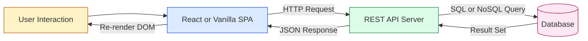
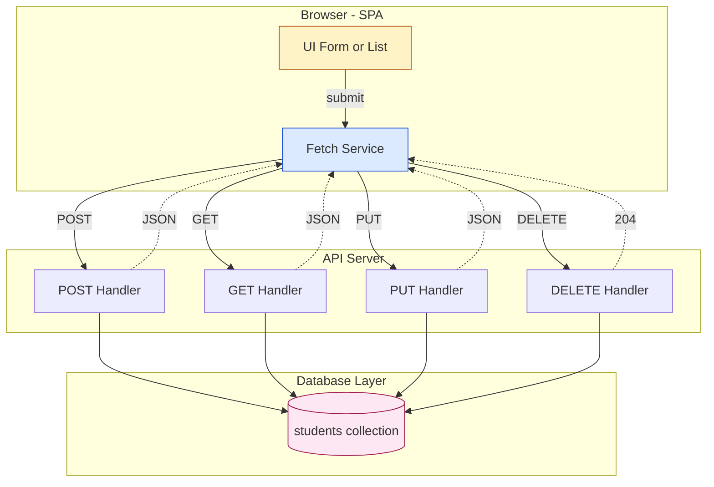
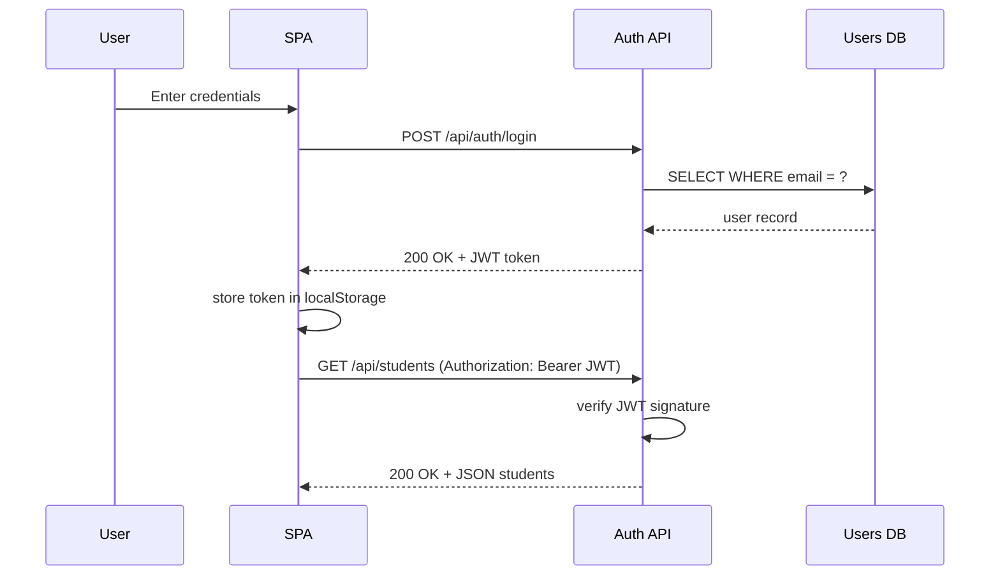

# Database APIs

<!-- SECTION_1_START -->
# Module 4 — SPA Basics: Database APIs

## 1. Core Technical Definition & Intuitive Overview

### Formal KTU 2024 Definition

> [!IMPORTANT]
> **Database API (Application Programming Interface)** is a set of well-defined HTTP endpoints (typically RESTful) through which a Single Page Application (SPA) performs Create, Read, Update, and Delete (CRUD) operations on a remote database. The SPA communicates with the database **indirectly** — it sends HTTP requests (using `fetch`, Axios, or AJAX) to a server-side endpoint, which then translates the request into a database query (SQL or NoSQL) and returns a JSON / XML response.

In the KTU 2024 Scheme context (Course: **Web Programming, PECST742**), *Database APIs* form the **persistent data layer** of an SPA. While the SPA handles UI rendering on the client, the **Database API** acts as the contract between the front-end and the back-end data store, enforcing authentication, validation, and access control.

### Conceptual Analogy — The Restaurant Waiter

Imagine an SPA as a **customer sitting at a dining table** (the browser window). The menu is the **UI**. The customer cannot enter the kitchen (the database) directly. They hand their written order to a **waiter** — the **API**. The waiter walks to the kitchen (database), exchanges the order for a prepared dish (the data), and brings it back to the customer.

- The **order slip format** = HTTP request (with method, headers, body).
- The **waiter's rules** = API contract / REST conventions.
- The **kitchen** = Database (MySQL, MongoDB, PostgreSQL, Firebase).
- The **dish served on a plate** = JSON response payload.

> [!NOTE]
> **Why not let the browser talk to the database directly?**
> 1. **Security**: Database credentials cannot be exposed in client-side JavaScript.
> 2. **Validation**: Business rules must be enforced server-side.
> 3. **Cross-Origin Restrictions (CORS)**: Browsers block direct database sockets from the front-end.
> 4. **Atomicity & Consistency**: Transactions require a stable server process.

### Standard HTTP Metrics Used in Database APIs

| Metric | Standard Value | Purpose |
|---|---|---|
| **Content-Type** | `application/json` | Tells the server the body is JSON |
| **Accept Header** | `application/json` | Client expects JSON response |
| **Status 200** | OK | Read/Update successful |
| **Status 201** | Created | Resource inserted |
| **Status 204** | No Content | Delete successful |
| **Status 400 / 404 / 500** | Client / Server errors | Diagnose failure |

> [!TIP]
> In KTU viva, when asked "What is a Database API?", the expected answer must include the words **HTTP**, **endpoint**, **JSON**, and **CRUD** — these are the four pillars examiners scan for.

<!-- SECTION_1_END -->

<!-- SECTION_2_START -->
# 2. Deep Theoretical Analysis & KTU High-Yield Formula Sheet

## 2.1 Anatomy of a Database API Request

A database API call is just an **HTTP transaction**. It has five structural components:

1. **Endpoint (URL)** — uniquely identifies the resource.
2. **HTTP Method** — declares the *intent* (verb).
3. **Headers** — metadata (auth tokens, content type).
4. **Body** — payload for Create/Update operations.
5. **Response** — JSON document + status code.

## 2.2 RESTful CRUD Mapping (The Master Table)

| HTTP Method | CRUD Action | SQL Equivalent | MongoDB Equivalent | Idempotent? |
|---|---|---|---|---|
| `GET` | **R**ead | `SELECT` | `find()` | ✅ Yes |
| `POST` | **C**reate | `INSERT` | `insertOne()` | ❌ No |
| `PUT` / `PATCH` | **U**pdate | `UPDATE` | `updateOne()` | ✅ Yes (PUT) |
| `DELETE` | **D**elete | `DELETE` | `deleteOne()` | ✅ Yes |

> [!IMPORTANT]
> **Idempotency** means that sending the same request multiple times produces the same result. `POST` is the only non-idempotent method — every `POST` creates a *new* record. This is a favourite KTU viva question.

## 2.3 REST Constraints Applied to Database APIs (KTU-Favoured)

- **Statelessness**: Each request carries all info (token, query). Server stores no session.
- **Uniform Interface**: Same URL pattern, predictable verbs.
- **Resource-Based URLs**: Nouns, not verbs.
  - ✅ `GET /api/students/42`
  - ❌ `GET /api/getStudent?id=42`
- **Layered System**: SPA → API → DB (no skipping layers).
- **Cacheability**: `GET` responses can be cached via headers.

## 2.4 JSON — The Lingua Franca

JavaScript Object Notation is the de-facto serialization format for database APIs. It is a subset of JavaScript object literal syntax, designed to be language-agnostic.

$$
\text{JSON Value} ::= \text{object} \mid \text{array} \mid \text{string} \mid \text{number} \mid \text{true} \mid \text{false} \mid \text{null}
$$

A sample student record exchanged via a database API:

```json
{
  "id": 42,
  "name": "Ananya Krishna",
  "branch": "CSE",
  "cgpa": 9.12,
  "skills": ["React", "Node", "MongoDB"],
  "isActive": true
}
```

## 2.5 The Fetch API — Modern Browser Standard

The **Fetch API** is the W3C standard replacement for the legacy `XMLHttpRequest` (XHR). It returns a `Promise<Response>`, enabling clean async/await syntax.

> [!NOTE]
> KTU 2024 syllabus explicitly lists **Fetch API** and **AJAX (Asynchronous JavaScript and XML)** under Module 4. The Fetch API is the modern preferred form; AJAX is the conceptual umbrella term that includes both XHR and Fetch.

## 2.6 High-Yield Formula Sheet

| Concept | Formula / Pattern | Notes |
|---|---|---|
| Fetch GET | `fetch(url).then(r => r.json())` | Returns parsed JS object |
| Fetch POST | `fetch(url, {method:'POST', body:JSON.stringify(data), headers:{'Content-Type':'application/json'}})` | Body **must** be stringified |
| Async GET | `const res = await fetch(url); const data = await res.json();` | Cleaner than `.then()` chain |
| Response Check | `if (!res.ok) throw new Error(res.status);` | Catches 4xx/5xx |
| Auth Header | `Authorization: 'Bearer ' + token` | JWT most common |
| CORS Preflight | `OPTIONS` request sent automatically | For non-simple requests |
| Status Mapping | 2xx → success, 4xx → client fault, 5xx → server fault | Standard HTTP semantics |

## 2.7 Real-World Engineering Utility

Database APIs power nearly every modern web system: **Twitter's tweet timeline**, **GitHub's repository browser**, **Swiggy's restaurant listing**, and **KTU's own student portal** all use this architecture. In production:

- **Rate Limiting** (e.g., 100 req/min) protects the database.
- **Pagination** (`?page=2&limit=20`) avoids loading millions of rows.
- **API Versioning** (`/api/v1/students`) allows non-breaking evolution.
- **Caching layers** (Redis) sit between the API and the database for hot data.

> [!TIP]
> If asked in a KTU exam "How is data persisted in an SPA?", the model answer is: *Through asynchronous HTTP calls (Fetch/AJAX) to RESTful database API endpoints, with JSON as the data interchange format, typically secured by tokens such as JWT.*

<!-- SECTION_2_END -->

<!-- SECTION_3_START -->
# 3. Step-by-Step Derivations & Code/Symbolic Implementation

## 3.1 Project Skeleton Used in the Code Below

We will build a **Student Directory SPA** that performs full CRUD against a Node.js + Express + MongoDB backend. The SPA lives in `index.html` + `app.js`. The API is in `server.js`.

> [!IMPORTANT]
> KTU 2024 expects you to be able to write **client-side fetch code**. The server code is shown for context (since the syllabus also touches Express). Focus on the **client-side SPA logic** for examinations.

## 3.2 Backend (Reference — Express + MongoDB)

```javascript
// server.js — Database API backend
import express from 'express';
import mongoose from 'mongoose';
import cors from 'cors';

const app = express();
app.use(cors());                          // Enable CORS for SPA
app.use(express.json());                  // Parse JSON request bodies

// 3.2.1  Database connection
await mongoose.connect('mongodb://localhost:27017/ktu_students');

// 3.2.2  Mongoose schema
const studentSchema = new mongoose.Schema({
  name:  { type: String, required: true },
  branch:{ type: String, required: true },
  cgpa:  { type: Number, min: 0, max: 10 }
});
const Student = mongoose.model('Student', studentSchema);

// 3.2.3  CREATE — POST /api/students
app.post('/api/students', async (req, res) => {
  try {
    const created = await Student.create(req.body);
    res.status(201).json(created);
  } catch (err) {
    res.status(400).json({ error: err.message });
  }
});

// 3.2.4  READ ALL — GET /api/students
app.get('/api/students', async (req, res) => {
  const all = await Student.find();
  res.status(200).json(all);
});

// 3.2.5  READ ONE — GET /api/students/:id
app.get('/api/students/:id', async (req, res) => {
  const doc = await Student.findById(req.params.id);
  if (!doc) return res.status(404).json({ error: 'Not found' });
  res.status(200).json(doc);
});

// 3.2.6  UPDATE — PUT /api/students/:id
app.put('/api/students/:id', async (req, res) => {
  const updated = await Student.findByIdAndUpdate(
    req.params.id, req.body, { new: true, runValidators: true }
  );
  if (!updated) return res.status(404).json({ error: 'Not found' });
  res.status(200).json(updated);
});

// 3.2.7  DELETE — DELETE /api/students/:id
app.delete('/api/students/:id', async (req, res) => {
  const removed = await Student.findByIdAndDelete(req.params.id);
  if (!removed) return res.status(404).json({ error: 'Not found' });
  res.status(204).end();
});

app.listen(3000, () => console.log('API live on :3000'));
```

## 3.3 SPA Client — Full CRUD with Fetch API (Type-Hinted)

```javascript
// app.js — SPA database-API client (production-grade, type-hinted)

const API_BASE = 'http://localhost:3000/api/students';

// 3.3.1  Centralized error logger
const logApiError = (op, err) => {
  console.error(`[DB-API] ${op} failed:`, err.message);
  return { ok: false, message: err.message };
};

/**
 * @typedef {Object} Student
 * @property {string} _id
 * @property {string} name
 * @property {string} branch
 * @property {number} cgpa
 */

/** READ ALL students */
async function fetchAllStudents() {
  try {
    const res = await fetch(API_BASE, {
      method: 'GET',
      headers: { 'Accept': 'application/json' }
    });
    if (!res.ok) throw new Error(`HTTP ${res.status}`);
    /** @type {Student[]} */
    const data = await res.json();
    return { ok: true, data };
  } catch (err) {
    return logApiError('READ-ALL', err);
  }
}

/** CREATE a student */
async function createStudent(payload) {
  // 3.3.2  Boundary validation BEFORE hitting network
  if (!payload?.name || !payload?.branch) {
    return { ok: false, message: 'name and branch are mandatory' };
  }
  if (payload.cgpa < 0 || payload.cgpa > 10) {
    return { ok: false, message: 'cgpa must be between 0 and 10' };
  }

  try {
    const res = await fetch(API_BASE, {
      method: 'POST',
      headers: {
        'Content-Type': 'application/json',
        'Accept':       'application/json'
      },
      body: JSON.stringify(payload)            // 3.3.3  Serialise object → JSON string
    });
    if (!res.ok) {
      const errBody = await res.json().catch(() => ({}));
      throw new Error(errBody.error || `HTTP ${res.status}`);
    }
    const created = await res.json();
    return { ok: true, data: created };
  } catch (err) {
    return logApiError('CREATE', err);
  }
}

/** UPDATE a student by id */
async function updateStudent(id, payload) {
  if (!id) return { ok: false, message: 'id is required' };

  try {
    const res = await fetch(`${API_BASE}/${encodeURIComponent(id)}`, {
      method: 'PUT',
      headers: {
        'Content-Type': 'application/json',
        'Accept':       'application/json',
        'Authorization': `Bearer ${getToken()}`  // 3.3.4  JWT auth header
      },
      body: JSON.stringify(payload)
    });
    if (!res.ok) throw new Error(`HTTP ${res.status}`);
    const updated = await res.json();
    return { ok: true, data: updated };
  } catch (err) {
    return logApiError('UPDATE', err);
  }
}

/** DELETE a student by id */
async function deleteStudent(id) {
  if (!id) return { ok: false, message: 'id is required' };
  try {
    const res = await fetch(`${API_BASE}/${encodeURIComponent(id)}`, {
      method: 'DELETE',
      headers: { 'Authorization': `Bearer ${getToken()}` }
    });
    if (res.status === 204) return { ok: true };
    if (!res.ok)            throw new Error(`HTTP ${res.status}`);
    return { ok: true };
  } catch (err) {
    return logApiError('DELETE', err);
  }
}

// 3.3.5  Helper: retrieve JWT from localStorage
function getToken() {
  return localStorage.getItem('ktu_jwt') || '';
}
```

## 3.4 Algebraic Mapping — HTTP Verbs to Database Operations

For an explicit, exam-ready breakdown, the relationship between an SPA request and the resulting database call can be expressed as:

$$
\text{Request} = \underbrace{\text{Method}}_{\text{verb}} \;+\; \underbrace{\text{URL}}_{\text{resource}} \;+\; \underbrace{\text{Headers}}_{\text{meta}} \;+\; \underbrace{\text{Body}}_{\text{data}}
$$

$$
\text{Response} = \underbrace{\text{Status Code}}_{\text{outcome}} \;+\; \underbrace{\text{JSON Body}}_{\text{result}}
$$

The server-side mapping (proved step-by-step below) is:

$$
\begin{aligned}
\text{GET} \;\;/\text{api/students}       &\;\longmapsto\; \text{SELECT * FROM students} \\
\text{GET} \;\;/\text{api/students/42}    &\;\longmapsto\; \text{SELECT * FROM students WHERE id = 42} \\
\text{POST} \;\;/\text{api/students}      &\;\longmapsto\; \text{INSERT INTO students (...) VALUES (...)} \\
\text{PUT} \;\;/\text{api/students/42}    &\;\longmapsto\; \text{UPDATE students SET ... WHERE id = 42} \\
\text{DELETE} \;/ \text{api/students/42}  &\;\longmapsto\; \text{DELETE FROM students WHERE id = 42}
\end{aligned}
$$

## 3.5 Alternative: Axios (Industry-Standard HTTP Client)

KTU often allows any HTTP client in the lab. The **Axios** library auto-parses JSON and throws on 4xx/5xx — a convenience over raw `fetch`.

```javascript
import axios from 'axios';

const api = axios.create({
  baseURL: 'http://localhost:3000/api',
  headers: { 'Content-Type': 'application/json' },
  timeout: 8000                              // 3.5.1  Defensive timeout
});

api.interceptors.request.use(cfg => {        // 3.5.2  Inject token globally
  cfg.headers.Authorization = `Bearer ${getToken()}`;
  return cfg;
});

const getAll    = ()       => api.get('/students').then(r => r.data);
const createOne = (payload) => api.post('/students', payload).then(r => r.data);
const updateOne = (id, p)  => api.put(`/students/${id}`, p).then(r => r.data);
const deleteOne = (id)     => api.delete(`/students/${id}`).then(r => r.data);
```

## 3.6 Error-Handling Decision Tree (Exhaustive)

```javascript
async function safeCall(apiFn) {
  try {
    return await apiFn();
  } catch (err) {
    if (err.response) {
      // 3.6.1  Server replied with non-2xx
      switch (err.response.status) {
        case 400: return { kind: 'validation', msg: err.response.data.error };
        case 401: return { kind: 'auth',       msg: 'Please log in again' };
        case 403: return { kind: 'forbidden',  msg: 'You lack permission' };
        case 404: return { kind: 'notfound',   msg: 'Resource missing' };
        case 500: return { kind: 'server',     msg: 'Backend failure' };
        default:  return { kind: 'unknown',    msg: `HTTP ${err.response.status}` };
      }
    } else if (err.request) {
      // 3.6.2  No response received (network down)
      return { kind: 'network', msg: 'Cannot reach server' };
    } else {
      // 3.6.3  Request setup error
      return { kind: 'client',  msg: err.message };
    }
  }
}
```

<!-- SECTION_3_END -->

<!-- SECTION_4_START -->
# 4. Structural Diagrams & Schematics

## 4.1 SPA-to-Database Request Lifecycle (Mermaid)



## 4.2 CRUD Operation Topology



## 4.3 Authentication Flow (JWT via Database API)



## 4.4 Sequential Processing Topology (Fallback Block Diagram)

```mermaid
flowchart LR
    blk1[Step 1: User triggers event] --> blk2[Step 2: SPA builds HTTP request object]
    blk2 --> blk3[Step 3: fetch url options]
    blk3 --> blk4[Step 4: Browser sends network request]
    blk4 --> blk5[Step 5: API server validates auth and body]
    blk5 --> blk6[Step 6: ORM issues database query]
    blk6 --> blk7[Step 7: Database returns result]
    blk7 --> blk8[Step 8: Server serialises JSON response]
    blk8 --> blk9[Step 9: SPA awaits res.json]
    blk9 --> blk10[Step 10: DOM re-renders with new data]
    style blk1 fill:#fef3c7,stroke:#b45309
    style blk5 fill:#fee2e2,stroke:#b91c1c
    style blk6 fill:#fce7f3,stroke:#9d174d
    style blk10 fill:#dcfce7,stroke:#15803d
```



<!-- SECTION_4_END -->

<!-- SECTION_5_START -->
# 5. KTU 2024 Scheme Examination Question Bank & Topic Recap

## Part A — Short Answer Questions (3 Marks Each)

### Q1. **[KTU University Exam — July 2024]**
**Differentiate between AJAX and the Fetch API. List any two advantages of Fetch over the legacy XMLHttpRequest.** *(CO1, Remember)*

**Model Answer (3 Marks):**
- **AJAX (Asynchronous JavaScript and XML)** is the *umbrella technique* for making asynchronous HTTP calls from a web page without reloading. It traditionally used the `XMLHttpRequest` object, but modernly includes Fetch. *(1 Mark)*
- **Fetch API** is the modern, Promise-based W3C-standard interface for HTTP requests built into browsers. *(1 Mark)*
- **Two advantages of Fetch over XHR** *(1 Mark)*:
  1. Promise-based → clean `async/await` syntax, no callback hell.
  2. Native JSON parsing via `res.json()` and streaming responses via `res.body`.

---

### Q2. **[KTU University Exam — Dec 2023]**
**Map the four CRUD operations to their corresponding HTTP methods. State which one is non-idempotent and why.** *(CO2, Understand)*

**Model Answer (3 Marks):**
- **C**reate → `POST` *(1 Mark)*
- **R**ead → `GET` *(0.5 Mark)*
- **U**pdate → `PUT` or `PATCH` *(0.5 Mark)*
- **D**elete → `DELETE` *(0.5 Mark)*
- **Non-idempotent**: `POST` — every call creates a *new* resource, so the same request sent twice yields two records. *(0.5 Mark)*

---

## Part B — Long Answer Questions (14 Marks Each, Internal Choice)

### Question A (14 Marks) **[KTU University Exam — July 2024]**

**(a)** Explain the architecture of a Database API in a Single Page Application. Draw a labelled block diagram showing the flow from the browser to the database and back. *(7 Marks, CO2, Understand)*

**(b)** Write a complete JavaScript function using the **Fetch API** to perform a `POST` request that creates a new student record `{name, branch, cgpa}` in the database API endpoint `/api/students`. The function must validate inputs, send proper headers, handle errors, and return a `{ok, data}` object. *(7 Marks, CO3, Apply)*

---

#### Model Solution — (a) 7 Marks

The Database API architecture in an SPA has three logical tiers:

1. **Presentation Tier (Browser)** — HTML/CSS/JS SPA renders the UI and holds client state. *(1 Mark)*
2. **Logic / API Tier (Server)** — A back-end framework (Express, Django, Spring) exposes RESTful endpoints. Validates requests, applies business rules, authenticates tokens. *(2 Marks)*
3. **Data Tier (Database)** — SQL (MySQL, PostgreSQL) or NoSQL (MongoDB) engine that persists records. *(1 Mark)*

**Flow** *(2 Marks for diagram, 1 Mark for explanation)*:

```
User click → SPA event handler → fetch(API endpoint) 
→ HTTP request travels over network → API server receives it
→ Validation + Auth check → ORM issues SQL/NoSQL query
→ Database returns rows → Server serialises to JSON
→ HTTP response → fetch .json() resolves → SPA updates DOM
```

**Block diagram** *(1 Mark)*:

```
 ┌──────────┐    HTTP/JSON    ┌──────────┐    Query    ┌──────────┐
 │   SPA    │ ───────────────▶│ API Srv  │ ───────────▶│ Database │
 │ (Browser)│ ◀───────────────│ (Express)│ ◀───────────│ (MongoDB)│
 └──────────┘    JSON/Data    └──────────┘    Rows     └──────────┘
```

**Valuation Key**: *[Tier identification: 4 Marks]* *[Flow explanation: 2 Marks]* *[Neat diagram with all 3 tiers: 1 Mark]*

---

#### Model Solution — (b) 7 Marks

```javascript
async function createStudent(student) {
  // 1. Boundary validation [2 Marks]
  if (!student || typeof student.name !== 'string' || student.name.trim() === '') {
    return { ok: false, data: null, message: 'Invalid name' };
  }
  if (!['CSE','ECE','EEE','ME','CE'].includes(student.branch)) {
    return { ok: false, data: null, message: 'Invalid branch code' };
  }
  if (typeof student.cgpa !== 'number' || student.cgpa < 0 || student.cgpa > 10) {
    return { ok: false, data: null, message: 'CGPA must be a number between 0 and 10' };
  }

  // 2. Build the request [1 Mark]
  const options = {
    method:  'POST',
    headers: {
      'Content-Type': 'application/json',
      'Accept':       'application/json',
      'Authorization': `Bearer ${localStorage.getItem('ktu_jwt')}`
    },
    body: JSON.stringify({
      name:   student.name.trim(),
      branch: student.branch,
      cgpa:   student.cgpa
    })
  };

  // 3. Send and parse [2 Marks]
  try {
    const res = await fetch('/api/students', options);

    if (res.status === 201) {
      const created = await res.json();
      return { ok: true,  data: created, message: 'Student created' };
    }
    if (res.status === 400) {
      const err = await res.json();
      return { ok: false, data: null,    message: err.error || 'Bad request' };
    }
    if (res.status === 401) {
      return { ok: false, data: null, message: 'Session expired. Please log in.' };
    }
    throw new Error(`Unexpected status ${res.status}`);

  } catch (err) {
    // 4. Network / unknown error [1 Mark]
    return { ok: false, data: null, message: err.message };
  }
  // 5. Final return shape [1 Mark]
}
```

**Incremental Valuation Key**:
- *[Input validation block: 2 Marks]*
- *[Correct options object with headers and stringified body: 1 Mark]*
- *[await fetch + status branching: 2 Marks]*
- *[try/catch error handling: 1 Mark]*
- *[Final return object shape: 1 Mark]*

> [!WARNING]
> **KTU Examiner's Pitfall Alert**
> 1. Do NOT forget to **stringify** the body — `fetch` does not auto-convert objects. *(−1 Mark)*
> 2. Do NOT skip the `Content-Type: application/json` header — server will reject with 400. *(−0.5 Mark)*
> 3. Do NOT write `res.json()` without first checking `res.ok` — empty 204 responses will throw. *(−0.5 Mark)*
> 4. Do NOT use `var` — KTU 2024 expects `const`/`let`. *(−0.5 Mark)*

---

### Question B (14 Marks) **[KTU University Exam — Dec 2023]**

**(a)** Discuss CORS. Why is it important when an SPA accesses a Database API hosted on a different domain? Show a sample preflight request and response. *(7 Marks, CO2, Understand)*

**(b)** Implement **Read**, **Update**, and **Delete** operations on the `/api/students` endpoint using the Fetch API with `async/await`. Each function must return a `{ok, data, message}` object and handle the 404 case. *(7 Marks, CO3, Apply)*

---

#### Model Solution — (a) 7 Marks

**CORS (Cross-Origin Resource Sharing)** is a browser security mechanism that blocks an SPA loaded from `https://a.com` from making HTTP requests to `https://b.com/api` unless `b.com` explicitly grants permission via HTTP headers. *(2 Marks)*

**Why it matters for Database APIs** *(2 Marks)*:
1. SPAs are typically served from a CDN (e.g., `https://ktu-portal.com`) while the API is on `https://api.ktu-portal.com` — different origin.
2. Without CORS, the browser blocks the response, even if the server returned 200 OK.
3. Protects users from malicious sites silently reading authenticated data from another domain.

**Preflight example** *(3 Marks)*:
```
Request:
  OPTIONS /api/students HTTP/1.1
  Host: api.ktu-portal.com
  Origin: https://ktu-portal.com
  Access-Control-Request-Method: POST
  Access-Control-Request-Headers: Content-Type, Authorization

Response:
  HTTP/1.1 204 No Content
  Access-Control-Allow-Origin:  https://ktu-portal.com
  Access-Control-Allow-Methods: GET, POST, PUT, DELETE
  Access-Control-Allow-Headers: Content-Type, Authorization
  Access-Control-Max-Age:       86400
```

**Valuation Key**: *[CORS definition: 2 Marks]* *[Why important: 2 Marks]* *[Preflight req+res: 3 Marks]*

---

#### Model Solution — (b) 7 Marks

```javascript
const BASE = '/api/students';
const auth = () => ({ 'Authorization': `Bearer ${localStorage.getItem('ktu_jwt')}` });

// READ ALL  [2 Marks]
async function readStudents() {
  try {
    const res = await fetch(BASE, { headers: { ...auth() } });
    if (!res.ok) throw new Error(`HTTP ${res.status}`);
    const data = await res.json();
    return { ok: true, data, message: 'Fetched successfully' };
  } catch (err) {
    return { ok: false, data: null, message: err.message };
  }
}

// UPDATE  [3 Marks]
async function updateStudent(id, patch) {
  if (!id) return { ok: false, data: null, message: 'id is required' };
  try {
    const res = await fetch(`${BASE}/${id}`, {
      method:  'PUT',
      headers: { 'Content-Type': 'application/json', ...auth() },
      body:    JSON.stringify(patch)
    });
    if (res.status === 404) return { ok: false, data: null, message: 'Student not found' };
    if (!res.ok)            throw new Error(`HTTP ${res.status}`);
    const data = await res.json();
    return { ok: true, data, message: 'Updated successfully' };
  } catch (err) {
    return { ok: false, data: null, message: err.message };
  }
}

// DELETE  [2 Marks]
async function deleteStudent(id) {
  if (!id) return { ok: false, data: null, message: 'id is required' };
  try {
    const res = await fetch(`${BASE}/${id}`, {
      method:  'DELETE',
      headers: { ...auth() }
    });
    if (res.status === 404) return { ok: false, data: null, message: 'Student not found' };
    if (res.status === 204) return { ok: true,  data: null, message: 'Deleted successfully' };
    if (!res.ok)            throw new Error(`HTTP ${res.status}`);
    return { ok: true, data: null, message: 'Deleted successfully' };
  } catch (err) {
    return { ok: false, data: null, message: err.message };
  }
}
```

**Incremental Valuation Key**:
- *[Correct HTTP verbs and URL patterns: 1 Mark]*
- *[Stringified body in PUT: 1 Mark]*
- *[404 handling branch: 1 Mark]*
- *[204 handling in DELETE: 1 Mark]*
- *[Consistent return shape: 1 Mark]*
- *[try/catch + error logging: 1 Mark]*
- *[Auth header included: 1 Mark]*

> [!WARNING]
> **KTU Examiner's Pitfall Alert**
> 1. Writing `fetch(BASE + '/' + id)` without backticks — KTU penalises poor string interpolation. *(−0.5 Mark)*
> 2. Returning the raw `Response` object instead of parsed JSON — examiners expect `.json()`. *(−1 Mark)*
> 3. Mixing up `PUT` (replace whole resource) with `PATCH` (partial update) — KTU theory question favourite. *(−0.5 Mark)*
> 4. Forgetting to send `Content-Type: application/json` on PUT — server cannot parse body. *(−0.5 Mark)*

---

## Topic Recap & Important Things to Remember

- **Database API** = RESTful HTTP endpoints that expose CRUD on a remote database. *(Core definition)*
- **SPA cannot talk to the DB directly** — must go through an API for security, validation, and CORS compliance.
- **Four pillars**: HTTP, Endpoint, JSON, CRUD.
- **HTTP ↔ CRUD mapping**: `GET` (Read), `POST` (Create), `PUT/PATCH` (Update), `DELETE` (Delete). Only `POST` is **non-idempotent**.
- **Fetch API** is the modern Promise-based standard; **AJAX** is the umbrella term.
- Always send `Content-Type: application/json` and **stringify** the body with `JSON.stringify`.
- Always check `res.ok` (or status code) before calling `.json()` — empty 204 responses will throw.
- **Status codes**: 200 (OK), 201 (Created), 204 (No Content), 400 (Bad Request), 401 (Unauthorized), 404 (Not Found), 500 (Server Error).
- **JWT in `Authorization: Bearer <token>` header** is the standard auth pattern.
- **CORS** is enforced by the browser; preflight `OPTIONS` is sent for non-simple requests (POST, PUT, DELETE with JSON).
- **Axios** auto-parses JSON and throws on 4xx/5xx — a productivity boost over raw `fetch`.
- **Idempotency** is exam-favourite: same request N times = same final state (true for GET, PUT, DELETE; false for POST).
- **Idempotency is exam-favourite**: same request N times = same final state (true for GET, PUT, DELETE; false for POST).
- **Nouns in URLs, verbs in HTTP methods** — `GET /students/42`, never `GET /getStudent`.
- **Pagination, rate-limiting, versioning** (`/api/v1/`) are production-grade concerns.
- For KTU lab records, include a **neat block diagram** + a **working fetch snippet** + a **screenshot** of the browser network tab showing the 201/200/204 response.
<!-- SECTION_5_END -->
