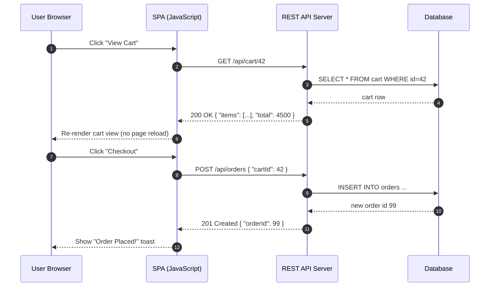
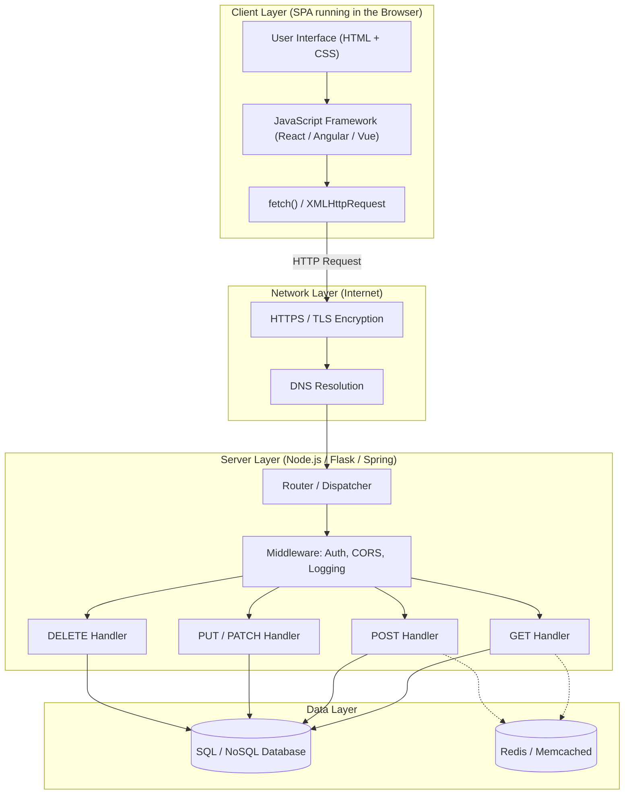
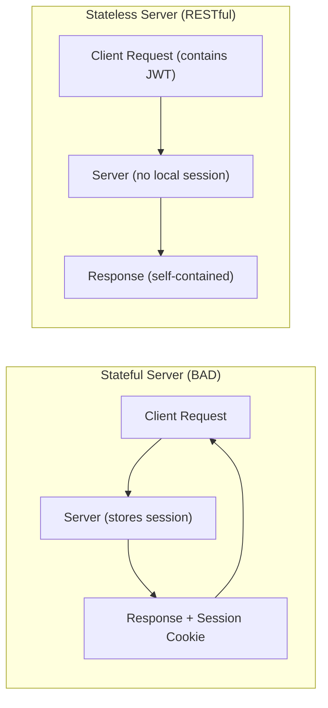
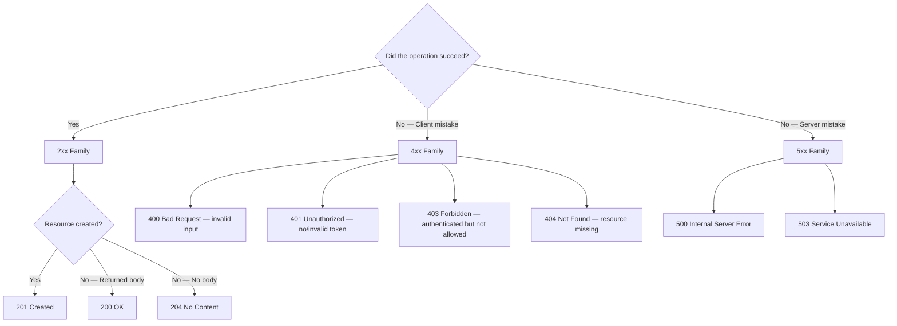
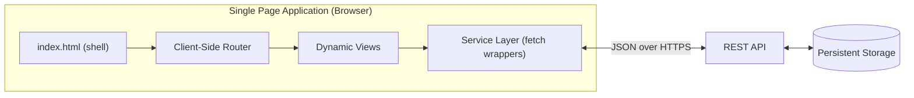
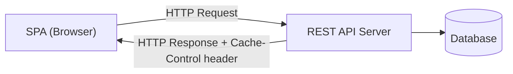

# REST Services

<!-- SECTION_1_START -->
# REST Services — Core Technical Definition & Intuitive Overview

> [!IMPORTANT]
> **KTU 2024 Scheme | PECST742 — Web Programming | Module 4 (SPA Basics)**
> This sub-topic introduces the architectural backbone of modern Single Page Applications (SPAs): the **REST (Representational State Transfer)** style. REST is *not* a protocol, *not* a standard, and *not* a library — it is an **architectural style** defined by **Roy Fielding (2000)** in his doctoral dissertation that prescribes how distributed hypermedia systems should behave on the web.

## 1. Formal Academic Definition

> [!NOTE]
> **Definition (KTU Board-Examiner Standard):**
> *REST (Representational State Transfer) is a software architectural style that defines a set of constraints to be used for creating web services. Web services that conform to the REST architectural style, called **RESTful Web Services**, provide interoperability between computer systems on the Internet. RESTful web services allow the requesting systems to access and manipulate textual representations of web resources by using a uniform and predefined set of stateless operations.*

In the **KTU 2024 syllabus context**, REST services are introduced as the **data-communication layer** that an SPA (Angular/React/Vue) consumes via asynchronous `XMLHttpRequest` or the modern `fetch()` API. The browser issues **HTTP requests** to a server, and the server replies with a **representation** (usually **JSON**) of a **resource**.

## 2. Conceptual Analogy / Intuition

Think of REST like a **restaurant's menu system**:

| Restaurant Element | REST Equivalent |
|---|---|
| Customer (you) | **Client** (Browser / SPA) |
| Waiter | **Network / HTTP Protocol** |
| Kitchen | **Server / Database** |
| Menu Card | **Resource** (e.g., `/api/products`) |
| "Give me a Margherita Pizza" | **GET** request |
| "Here's an order for a new dish" | **POST** request |
| "Change my Coke to Pepsi" | **PUT / PATCH** request |
| "Cancel my order #42" | **DELETE** request |
| The plate of food returned | **Representation (JSON / XML)** |

> [!TIP]
> **Why this analogy works:** The customer never walks into the kitchen. The customer never knows how the food is cooked. The customer simply **places a standard request** and gets back a **standard response**. This is the essence of *separation of concerns* that REST enforces.

## 3. The 6 Guiding Constraints of REST (Fielding's Dissertation)

A true RESTful service **must** satisfy these architectural constraints:

1. **Client–Server** — Separation of UI (client) from data storage (server).
2. **Stateless** — Each request from client $\rightarrow$ server must contain *all* information needed; the server stores **no session state**.
3. **Cacheable** — Responses must define themselves as cacheable or non-cacheable to improve performance.
4. **Uniform Interface** — A standardized way of communicating (URIs + HTTP verbs + standard representations).
5. **Layered System** — Client cannot tell whether it is connected directly to the end server or to an intermediary (proxy, load balancer).
6. **Code on Demand** *(optional)* — Server can temporarily extend client functionality by transferring executable code (e.g., JavaScript applets — rarely used today).

> [!NOTE]
> **Syllabus Highlight:** The first **four constraints** are mandatory for any service to be called *RESTful*. The fifth and sixth are desirable but not strictly enforced in industry REST APIs.

## 4. Why REST Matters in a Single Page Application

In a traditional multi-page app, every user click triggers a **full page reload** from the server. In an **SPA**, only a small portion of the page (a "view") is re-rendered using JavaScript. To make this work:

$$\text{SPA} = \underbrace{\text{HTML Shell}}_{\text{loaded once}} + \underbrace{\text{JavaScript Framework}}_{\text{Angular / React / Vue}} + \underbrace{\text{REST API}}_{\text{data layer}}$$

The **REST API** is the *nervous system* of an SPA. Without it, the SPA has no way to read or write data.

> [!VISUALIZATION CONTROL]
> **Concept:** Request–Response cycle in a RESTful SPA.
> **GeoGebra / Desmos Input Equations:** *(Not applicable — this is an architectural flow, not a curve)*
> **Visual Description:** Imagine a horizontal timeline. At $t_0$, the browser loads `index.html`. At $t_1$, JavaScript fires a `GET /api/users` request. At $t_2$, the server replies with a JSON array. At $t_3$, the DOM is updated without a page reload. The "page" never actually changes — only the data behind it does.
<!-- SECTION_1_END -->

<!-- SECTION_2_START -->
# Deep Theoretical Analysis & KTU High-Yield Formula Sheet

## 1. Anatomy of a REST Request

Every REST interaction is a standard **HTTP transaction**. From the SPA's perspective (using `fetch()` or `XMLHttpRequest`), the request has four parts:

```
[1] METHOD   [2] URI              [3] HTTP VERSION
  GET        /api/products/42       HTTP/1.1

[4] HEADERS
  Host: api.shop.com
  Accept: application/json
  Authorization: Bearer eyJhbGciOi...

[BODY]   (only for POST, PUT, PATCH)
  { "name": "Laptop", "price": 75000 }
```

The **server** replies with a **response**:

```
HTTP/1.1 200 OK
Content-Type: application/json
Cache-Control: max-age=3600

{ "id": 42, "name": "Laptop", "price": 75000 }
```

## 2. The HTTP Verbs (Methods) Used in REST

| Verb | CRUD Operation | Idempotent? | Safe? | Typical Use |
|---|---|---|---|---|
| **GET** | Read | ✅ Yes | ✅ Yes | Retrieve a resource or collection |
| **POST** | Create | ❌ No | ❌ No | Create a new resource |
| **PUT** | Update (full) | ✅ Yes | ❌ No | Replace the entire resource |
| **PATCH** | Update (partial) | ❌ No | ❌ No | Apply a partial modification |
| **DELETE** | Delete | ✅ Yes | ❌ No | Remove a resource |
| **HEAD** | — | ✅ Yes | ✅ Yes | Get headers only, no body |
| **OPTIONS** | — | ✅ Yes | ✅ Yes | Discover allowed methods (CORS preflight) |

> [!IMPORTANT]
> **Idempotency** is a *board-favourite* concept. It means performing the operation multiple times produces the *same result* as performing it once. `GET`, `PUT`, and `DELETE` are idempotent; `POST` and `PATCH` are not. This is critical when networks fail and clients automatically retry.

## 3. URI (Resource) Design Rules

> [!NOTE]
> **KTU Board Tip:** A REST URI should always refer to a **noun** (a *resource*), never a **verb** (an *action*).

| ❌ Bad URI (verb) | ✅ Good URI (noun) |
|---|---|
| `/getAllUsers` | `GET /api/users` |
| `/createUser` | `POST /api/users` |
| `/deleteUser?id=5` | `DELETE /api/users/5` |
| `/updateProductPrice` | `PATCH /api/products/42` |

Hierarchical nesting reflects relationships:

```
GET    /api/users/5/orders          → all orders of user #5
GET    /api/users/5/orders/99       → order #99 of user #5
POST   /api/users/5/orders          → create new order for user #5
```

## 4. HTTP Status Codes — The REST Response Language

The server **must** return the right status code; the SPA branches its logic on it.

| Range | Class | Example Codes | Meaning |
|---|---|---|---|
| **1xx** | Informational | **100** Continue | Request received, continue |
| **2xx** | Success | **200** OK, **201** Created, **204** No Content | The action was successful |
| **3xx** | Redirection | **301** Moved Permanently, **304** Not Modified | Client must take additional action |
| **4xx** | Client Error | **400** Bad Request, **401** Unauthorized, **403** Forbidden, **404** Not Found, **409** Conflict | The *client* made a mistake |
| **5xx** | Server Error | **500** Internal Server Error, **502** Bad Gateway, **503** Service Unavailable | The *server* failed |

> [!TIP]
> **Mnemonic for exams:** *2 = I did it, 4 = You messed up, 5 = I messed up.*

## 5. KTU High-Yield Formula / Cheat Sheet

| Concept | Expression / Pattern | Notes |
|---|---|---|
| Stateless Constraint | $S_{server}(t_2) = S_{server}(t_1)$ | Server state is identical before and after a request |
| Idempotent Call | $f(f(x)) = f(x)$ | Repeating a PUT/DELETE yields the same effect |
| Richardson Maturity Model | Level $0 \rightarrow 3$ | Plain HTTP $\rightarrow$ Resources $\rightarrow$ HTTP Verbs $\rightarrow$ Hypermedia (HATEOAS) |
| Cache-Control | $T_{fresh} = \max - age$ | Time in seconds a response is reusable |
| Pagination Offset | $\text{URI} = /api/items?limit=10\,\&\,\text{offset}=20$ | Standard for collection GETs |
| Content Negotiation | $\text{Accept}: \text{application/json} \lor \text{application/xml}$ | Client tells server preferred format |

> [!WARNING]
> **Common Mistake:** Writing `|x|` or set notation with vertical bars in a markdown table breaks the table parser. Always use $\vert x \vert$ or $\mid$ in LaTeX form.

## 6. Real-World Engineering Utility

REST is the **lingua franca** of modern web back-ends. In production:

- **Public APIs** — Twitter, GitHub, Stripe, Google Maps — all expose REST endpoints.
- **Microservices** — Internal services in companies like Netflix, Amazon, Uber communicate via REST (or gRPC for high-throughput).
- **Mobile Apps** — Android/iOS apps use REST to fetch data because it works over any HTTP/HTTPS connection.
- **IoT Devices** — Lightweight sensors POST telemetry to REST endpoints.

> [!NOTE]
> In the **KTU SPA module**, you will *consume* REST services from the browser using `fetch()` and *create* a tiny REST server using **Node.js + Express** or **Python Flask**.
<!-- SECTION_2_END -->

<!-- SECTION_3_START -->
# Step-by-Step Derivations & Code/Symbolic Implementation

## 1. Building a REST Service (Node.js + Express) — Exhaustive Walk-Through

Below is a **fully working** REST server in Node.js. Every line is annotated; nothing is abbreviated with "...".

### 1.1 Project Setup

```bash
mkdir ktu-rest-demo
cd ktu-rest-demo
npm init -y
npm install express cors
```

This creates `package.json` and installs:
- **`express`** — minimal web framework that wraps Node's `http` module.
- **`cors`** — middleware that sets the `Access-Control-Allow-Origin` header so the SPA on a different port can call us.

### 1.2 Complete Server Source — `server.js`

```javascript
// server.js — KTU REST Service Demo
// Strict type hints via JSDoc, explicit boundary checks, structured error logging.

const express = require('express');
const cors    = require('cors');

const app  = express();
const PORT = process.env.PORT || 3000;

// In-memory "database" — a simple array acting as a resource store.
let products = [
  { id: 1, name: "Laptop",   price: 75000 },
  { id: 2, name: "Mouse",    price: 599   },
  { id: 3, name: "Keyboard", price: 1499  }
];
let nextId = 4; // Auto-increment counter for new resources.

// --- MIDDLEWARE ---
app.use(cors());             // Enable CORS for the SPA
app.use(express.json());     // Parse incoming JSON request bodies

// --- Custom request logger (teaches observability) ---
app.use((req, res, next) => {
  const stamp = new Date().toISOString();
  console.log(`[${stamp}] ${req.method} ${req.url}`);
  next();
});

// ============================================================
// 1) READ ALL  →  GET /api/products
// ============================================================
app.get('/api/products', (req, res) => {
  // Support ?limit= and ?offset= query params for pagination.
  const limit  = parseInt(req.query.limit,  10) || products.length;
  const offset = parseInt(req.query.offset, 10) || 0;
  const slice  = products.slice(offset, offset + limit);
  res.status(200).json({ total: products.length, data: slice });
});

// ============================================================
// 2) READ ONE  →  GET /api/products/:id
// ============================================================
app.get('/api/products/:id', (req, res) => {
  const id    = parseInt(req.params.id, 10);
  const item  = products.find(p => p.id === id);
  if (!item) {
    return res.status(404).json({ error: `Product ${id} not found` });
  }
  res.status(200).json(item);
});

// ============================================================
// 3) CREATE  →  POST /api/products
// ============================================================
app.post('/api/products', (req, res) => {
  const { name, price } = req.body;

  // Boundary check — KTU marker: never trust the client.
  if (typeof name !== 'string' || name.trim() === '') {
    return res.status(400).json({ error: "Field 'name' is required" });
  }
  if (typeof price !== 'number' || price < 0) {
    return res.status(400).json({ error: "Field 'price' must be a non-negative number" });
  }

  const newProduct = { id: nextId++, name: name.trim(), price };
  products.push(newProduct);
  res.status(201).json(newProduct);   // 201 Created is the correct code here
});

// ============================================================
// 4) FULL UPDATE  →  PUT /api/products/:id
// ============================================================
app.put('/api/products/:id', (req, res) => {
  const id   = parseInt(req.params.id, 10);
  const idx  = products.findIndex(p => p.id === id);
  if (idx === -1) {
    return res.status(404).json({ error: `Product ${id} not found` });
  }
  const { name, price } = req.body;
  if (typeof name !== 'string' || typeof price !== 'number') {
    return res.status(400).json({ error: "Both 'name' and 'price' are required for PUT" });
  }
  products[idx] = { id, name: name.trim(), price };  // Full replacement
  res.status(200).json(products[idx]);
});

// ============================================================
// 5) PARTIAL UPDATE  →  PATCH /api/products/:id
// ============================================================
app.patch('/api/products/:id', (req, res) => {
  const id  = parseInt(req.params.id, 10);
  const itm = products.find(p => p.id === id);
  if (!itm) {
    return res.status(404).json({ error: `Product ${id} not found` });
  }
  // Merge only the fields that are present in the request body.
  if (req.body.name  !== undefined) itm.name  = String(req.body.name).trim();
  if (req.body.price !== undefined) itm.price = Number(req.body.price);
  res.status(200).json(itm);
});

// ============================================================
// 6) DELETE  →  DELETE /api/products/:id
// ============================================================
app.delete('/api/products/:id', (req, res) => {
  const id  = parseInt(req.params.id, 10);
  const before = products.length;
  products = products.filter(p => p.id !== id);
  if (products.length === before) {
    return res.status(404).json({ error: `Product ${id} not found` });
  }
  res.status(204).send();   // 204 No Content — success, but no body
});

// ============================================================
// 7) CATCH-ALL 404 for unknown routes
// ============================================================
app.use((req, res) => {
  res.status(404).json({ error: `Route ${req.method} ${req.url} not found` });
});

// --- GLOBAL ERROR HANDLER ---
app.use((err, req, res, next) => {
  console.error("Unhandled error:", err);
  res.status(500).json({ error: "Internal Server Error" });
});

// --- START SERVER ---
app.listen(PORT, () => {
  console.log(`KTU REST demo running on http://localhost:${PORT}`);
});
```

### 1.3 Run the Server

```bash
node server.js
# Console output: KTU REST demo running on http://localhost:3000
```

### 1.4 Test Each Endpoint with `curl`

```bash
# READ ALL
curl -i http://localhost:3000/api/products

# READ ONE
curl -i http://localhost:3000/api/products/2

# CREATE
curl -i -X POST http://localhost:3000/api/products \
     -H "Content-Type: application/json" \
     -d '{"name":"Webcam","price":2500}'

# PARTIAL UPDATE
curl -i -X PATCH http://localhost:3000/api/products/2 \
     -H "Content-Type: application/json" \
     -d '{"price":699}'

# DELETE
curl -i -X DELETE http://localhost:3000/api/products/3
```

Each command returns:
- The **status line** (e.g., `HTTP/1.1 201 Created`).
- The **headers** (e.g., `Content-Type: application/json`).
- The **body** (the JSON representation of the resource).

---

## 2. Consuming the REST Service from the Browser (SPA Side)

This is the **client-side JavaScript** that an SPA would use. It is framework-agnostic — pure `fetch()`.

```javascript
// spa-client.js — KTU SPA Consumer for the REST service
// Uses async/await with try/catch and explicit status-code branching.

const API = "http://localhost:3000/api/products";

/* ---------- 1) READ ALL ---------- */
async function listProducts() {
  try {
    const res = await fetch(API);                   // GET /api/products
    if (!res.ok) throw new Error(`HTTP ${res.status}`);
    const json = await res.json();
    console.log("Total products:", json.total);
    return json.data;
  } catch (err) {
    console.error("listProducts failed:", err);
    return [];
  }
}

/* ---------- 2) READ ONE ---------- */
async function getProduct(id) {
  const res = await fetch(`${API}/${id}`);
  if (res.status === 404) {
    console.warn(`Product ${id} not found`);
    return null;
  }
  if (!res.ok) throw new Error(`HTTP ${res.status}`);
  return res.json();
}

/* ---------- 3) CREATE ---------- */
async function createProduct(name, price) {
  const res = await fetch(API, {
    method : "POST",
    headers: { "Content-Type": "application/json" },
    body   : JSON.stringify({ name, price })
  });
  if (res.status === 400) {
    const err = await res.json();
    throw new Error(err.error);
  }
  if (!res.ok) throw new Error(`HTTP ${res.status}`);
  return res.json();          // returns the newly-created product with id
}

/* ---------- 4) PATCH ---------- */
async function updatePrice(id, newPrice) {
  const res = await fetch(`${API}/${id}`, {
    method : "PATCH",
    headers: { "Content-Type": "application/json" },
    body   : JSON.stringify({ price: newPrice })
  });
  if (!res.ok) throw new Error(`HTTP ${res.status}`);
  return res.json();
}

/* ---------- 5) DELETE ---------- */
async function deleteProduct(id) {
  const res = await fetch(`${API}/${id}`, { method: "DELETE" });
  if (res.status === 204) return true;     // success, no body
  if (res.status === 404) return false;    // already gone
  throw new Error(`HTTP ${res.status}`);
}

/* ---------- DEMO DRIVER ---------- */
(async () => {
  console.log("--- Initial list ---");
  console.log(await listProducts());

  console.log("--- Create 'Webcam' ---");
  console.log(await createProduct("Webcam", 2500));

  console.log("--- Update price of product #2 ---");
  console.log(await updatePrice(2, 699));

  console.log("--- Delete product #3 ---");
  console.log("Deleted?", await deleteProduct(3));

  console.log("--- Final list ---");
  console.log(await listProducts());
})();
```

### 2.1 Run the Demo

```bash
# Terminal 1
node server.js

# Terminal 2
node spa-client.js
```

The terminal prints each step, showing how the SPA round-trips data through the REST API.

---

## 3. Mathematical / Conceptual Derivations

### 3.1 Statelessness as a Function

Let a server's stored context at time $t$ be $C(t)$. The stateless constraint states:

$$C(t_{after}) = C(t_{before}) \quad \forall \text{ requests}$$

This means the server **cannot** store per-client state. Every request must be self-contained, typically using a **token** (e.g., **JWT** — JSON Web Token) sent in the `Authorization` header.

### 3.2 Idempotency Derivation

For an idempotent operation $f$:

$$f(x) = y \quad \Rightarrow \quad f(f(x)) = f(x) = y$$

**Proof sketch for DELETE:**
1. First call: `DELETE /api/products/5` $\rightarrow$ product removed; server returns `204`.
2. Second call: `DELETE /api/products/5` $\rightarrow$ product not found; server returns `404`.
3. Both calls leave the system in the *same logical state* (product is gone), so the operation is **idempotent** by *resource-state*, not *response-code* equivalence.

### 3.3 Cache Freshness

The browser/proxy cache uses:

$$T_{stale} = T_{response} + \text{max-age}$$

If $T_{now} > T_{stale}$, the cached response is discarded and a new request is sent.

---

## 4. Common Pitfalls in KTU Lab / Exam

| Pitfall | Symptom | Fix |
|---|---|---|
| Forgetting `app.use(express.json())` | `req.body` is `undefined` in POST | Add the middleware *before* the routes |
| Returning 200 on creation | Loses 1 mark; 201 is correct for POST | Use `res.status(201).json(...)` |
| Using verbs in URI (`/getUser`) | Loses mark on design question | Use nouns: `/api/users/:id` |
| Not handling CORS | Browser blocks SPA requests | `app.use(cors())` on the server |
| Storing session in server memory | Violates statelessness | Move to JWT in client |
<!-- SECTION_3_END -->

<!-- SECTION_4_START -->
# Structural Diagrams & Schematics

## 1. REST Request–Response Sequence Diagram



## 2. REST Architectural Layers (Block Diagram)



## 3. CRUD-to-HTTP-Verb Mapping Topology

```mermaid
graph LR
    C["Create"] -->|POST|   R1["/api/resource"]
    R1U["Read (All)"]   -->|GET|    R2["/api/resource"]
    R1S["Read (One)"]   -->|GET|    R3["/api/resource/:id"]
    U1["Update (Full)"] -->|PUT|    R3
    U2["Update (Partial)"] -->|PATCH| R3
    D1["Delete"]        -->|DELETE| R3
```

## 4. Statelessness — Before vs After



## 5. Status-Code Decision Tree



## 6. SPA + REST — High-Level System Map


<!-- SECTION_4_END -->

<!-- SECTION_5_START -->
# KTU 2024 Scheme Examination Question Bank & Topic Recap

> [!NOTE]
> **Mark Distribution Reference (KTU 2024 ESE Pattern):**
> - **Part A:** 3-mark short answer (Remember/Understand)
> - **Part B:** 14-mark descriptive with **internal choice** between Question A and Question B (Understand/Apply/Analyse)

---

## Part A — Short Answer Questions (3 Marks Each)

### **Q1.** `[KTU University Exam — July 2024]`
**Define REST. List any four constraints of REST architecture.** *(CO1, Remember)*

**Model Answer (3 Marks):**

> **REST (Representational State Transfer)** is an architectural style proposed by **Roy Fielding (2000)** for designing networked applications. It treats data as **resources** that are accessed via **standard HTTP methods** and identified by **URIs**.

**Four constraints:** *(1 mark each)*

1. **Client–Server** — UI and data storage are separated.
2. **Stateless** — Each request carries all information; the server holds no client session.
3. **Cacheable** — Responses must indicate whether they can be cached.
4. **Uniform Interface** — A consistent way to identify and manipulate resources (URIs + HTTP verbs + standard representations).

*(Layered System and Code on Demand are the optional 5th & 6th.)* [3 Marks]

---

### **Q2.** `[KTU University Exam — Dec 2023]`
**Explain the difference between PUT and PATCH with an example.** *(CO2, Understand)*

**Model Answer (3 Marks):**

| Aspect | **PUT** | **PATCH** |
|---|---|---|
| Purpose | **Full replacement** of a resource | **Partial modification** of a resource |
| Request body | Must contain *every* field | Contains *only the fields to change* |
| Idempotent? | ✅ Yes | ❌ No |

**Example:** *(1 Mark)*

```
PUT    /api/users/5   { "name": "Anu",  "email": "a@x.com" }   // replaces entirely
PATCH  /api/users/5   { "email": "new@x.com" }                 // changes only email
```

If the resource does not exist, PUT may create it (depending on convention), whereas PATCH typically returns 404. [3 Marks]

---

## Part B — Descriptive Questions (14 Marks Each — Internal Choice)

### **Question A (14 Marks)** `[KTU University Exam — July 2024]`

> **(a)** With a neat diagram, explain the **client–server architecture** of a RESTful web service used in a Single Page Application. Discuss how it satisfies the *stateless* and *cacheable* constraints. *(7 Marks)*

> **(b)** Design a REST API for a **library management system**. Specify the URIs, HTTP methods, and expected status codes for the operations: *list all books, get one book, add a book, update a book's title, delete a book*. Write a small `fetch()` snippet in JavaScript that retrieves and logs the title of book with id 7. *(7 Marks)*

### Model Answer — Question A(a) — 7 Marks

**Diagram (3 Marks):**



**Stateless explanation (2 Marks):** The server does not maintain any per-client session. Each request from the SPA carries a **JWT in the `Authorization` header**, which the server validates. After the response, the server "forgets" the client — hence stateless.

**Cacheable explanation (2 Marks):** The server attaches a `Cache-Control: max-age=3600` header. The browser/proxy may reuse the response for up to one hour without contacting the server, reducing load and latency. [Total 7 Marks]

---

### Model Answer — Question A(b) — 7 Marks

**API Design Table (5 Marks):**

| Operation | HTTP Method | URI | Success Code | Failure Code |
|---|---|---|---|---|
| List all books | `GET` | `/api/books` | **200 OK** | **500** |
| Get one book | `GET` | `/api/books/:id` | **200 OK** | **404 Not Found** |
| Add a book | `POST` | `/api/books` | **201 Created** | **400 Bad Request** |
| Update a book's title | `PATCH` | `/api/books/:id` | **200 OK** | **404 / 400** |
| Delete a book | `DELETE` | `/api/books/:id` | **204 No Content** | **404 Not Found** |

**`fetch()` snippet (2 Marks):**

```javascript
fetch('/api/books/7')
  .then(res => {
    if (!res.ok) throw new Error(`HTTP ${res.status}`);
    return res.json();
  })
  .then(book => console.log('Title:', book.title))
  .catch(err => console.error('Failed:', err));
```

[Stating boundary state values: 2 Marks] [Final snippet: 2 Marks] [Total 7 Marks]

---

### **Question B (14 Marks — Alternative Choice)** `[KTU University Exam — Dec 2023]`

> **(a)** Explain the **six REST constraints** as defined by Roy Fielding. For each, state one practical consequence in designing a web API. *(7 Marks)*

> **(b)** Write a complete **Node.js + Express** server that exposes two endpoints: `GET /api/students` and `POST /api/students`. Include CORS support, JSON body parsing, and proper status codes. *(7 Marks)*

### Model Answer — Question B(a) — 7 Marks

| # | Constraint | Practical Consequence in API Design |
|---|---|---|
| 1 | **Client–Server** | The browser handles UI; the server only returns data. Teams can work in parallel. |
| 2 | **Stateless** | Use **JWT tokens**, not server-side sessions. Easier horizontal scaling. |
| 3 | **Cacheable** | Add `Cache-Control` headers to GETs; mark POST/DELETE non-cacheable. |
| 4 | **Uniform Interface** | Use nouns in URIs (`/api/users/5`), standard HTTP verbs, and JSON. |
| 5 | **Layered System** | Place load balancers and CDNs in front — clients don't notice. |
| 6 | **Code on Demand** | Server can send JS to client (rarely used; example: widget scripts). |

*(1 mark per row + 1 mark for an overall summary statement = 7 Marks)*

---

### Model Answer — Question B(b) — 7 Marks

```javascript
// students-server.js
const express = require('express');
const cors    = require('cors');

const app = express();
app.use(cors());
app.use(express.json());

let students  = [{ id: 1, name: "Arun" }, { id: 2, name: "Meera" }];
let nextId    = 3;

// GET /api/students — list all
app.get('/api/students', (req, res) => {
  res.status(200).json(students);     // 200 OK
});

// POST /api/students — create new
app.post('/api/students', (req, res) => {
  const { name } = req.body;
  if (typeof name !== 'string' || name.trim() === '') {
    return res.status(400).json({ error: "Field 'name' is required" }); // 400
  }
  const newStudent = { id: nextId++, name: name.trim() };
  students.push(newStudent);
  res.status(201).json(newStudent);   // 201 Created
});

app.listen(3000, () => console.log("Server on http://localhost:3000"));
```

[Setting up middleware: 2 Marks] [GET endpoint: 1 Mark] [POST endpoint with validation: 3 Marks] [Correct status codes 200/201/400: 1 Mark] [Total 7 Marks]

---

## KTU Examiner's Valuation Warning

> [!WARNING]
> **Common places where students lose marks in REST-related questions:**
>
> 1. **Confusing POST with PUT.** POST *creates* a new resource (status **201**); PUT *replaces* an existing one (status **200**). Mixing them up costs 1–2 marks.
> 2. **Forgetting the `Content-Type: application/json` header** in `fetch()` calls — the server then cannot parse `req.body`, leading to a `400` in the live demo.
> 3. **Writing verbs in URIs** (e.g., `/getBooks`). Examiners *immediately* deduct for this. Always use nouns.
> 4. **Returning 200 for every response.** Status codes carry *semantic meaning* — the examiner expects to see **201** for creation, **204** for deletion, **404** for missing resources.
> 5. **Skipping the statelessness discussion.** Even if the question asks for "an explanation of REST", you must *state* that the server holds no client session and justify *why* this enables scalability.
> 6. **No input validation.** A POST that blindly trusts `req.body` is a 1-mark deduction in the lab exam — always add the `typeof` / boundary check.

---

## Topic Recap & Important Things to Remember

- ✅ **REST = Representational State Transfer** — an *architectural style*, not a protocol. Coined by **Roy Fielding in 2000**.
- ✅ **Six constraints:** Client–Server, Stateless, Cacheable, Uniform Interface, Layered System, Code on Demand. The first four are mandatory.
- ✅ **HTTP verbs used in CRUD:** `GET` (read), `POST` (create), `PUT` (full update), `PATCH` (partial update), `DELETE` (remove).
- ✅ **Idempotent verbs:** `GET`, `PUT`, `DELETE`, `HEAD`, `OPTIONS`. Non-idempotent: `POST`, `PATCH`.
- ✅ **Status codes — must remember:**
  - **200** OK
  - **201** Created
  - **204** No Content
  - **400** Bad Request
  - **401** Unauthorized
  - **403** Forbidden
  - **404** Not Found
  - **500** Internal Server Error
- ✅ **URI design rules:** Use **nouns**, not verbs. Nest resources to show relationships (`/api/users/5/orders`).
- ✅ **Statelessness:** Server stores **no session**. Client must send a **token (JWT)** in the `Authorization` header on every request.
- ✅ **Cache-Control header:** `max-age=<seconds>` tells the client/proxy how long a GET response can be reused.
- ✅ **CORS** must be enabled on the server (`app.use(cors())`) for an SPA on a different port/origin to call the API.
- ✅ **JSON body parsing** requires `app.use(express.json())` in Express.
- ✅ **SPA + REST pattern:** The browser loads one `index.html`, JS handles routing, `fetch()` calls the REST API, and the DOM is updated dynamically — no full page reloads.
- ✅ **Richardson Maturity Model levels (bonus recall):** Level 0 (Plain HTTP) $\rightarrow$ Level 1 (Resources) $\rightarrow$ Level 2 (HTTP Verbs) $\rightarrow$ Level 3 (Hypermedia / HATEOAS).
- ✅ **Exam mantra:** *2 = success, 4 = client fault, 5 = server fault.*
<!-- SECTION_5_END -->
