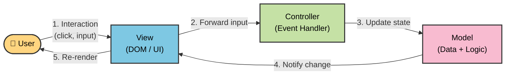
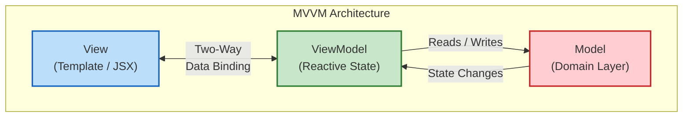
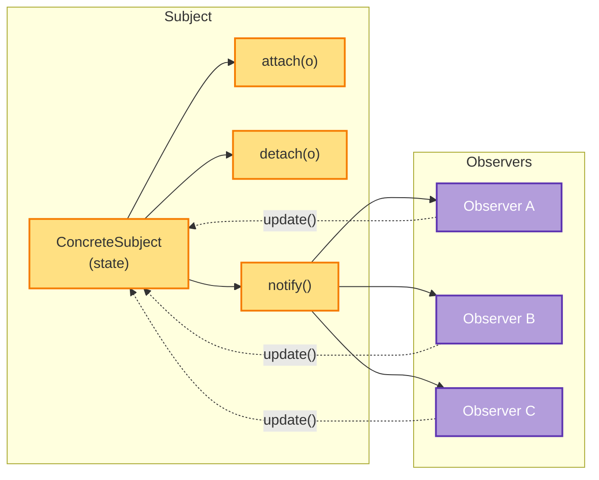
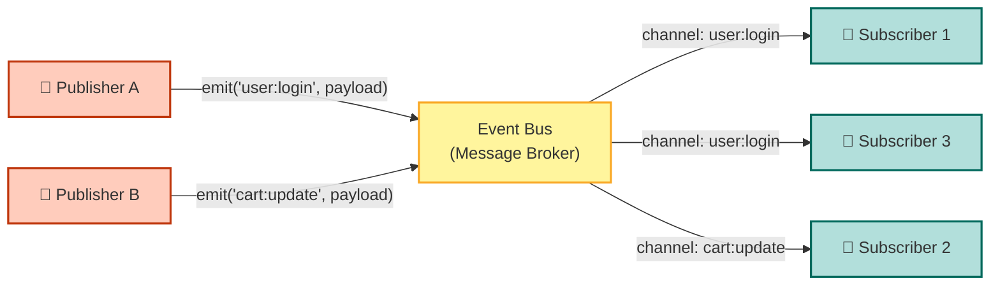
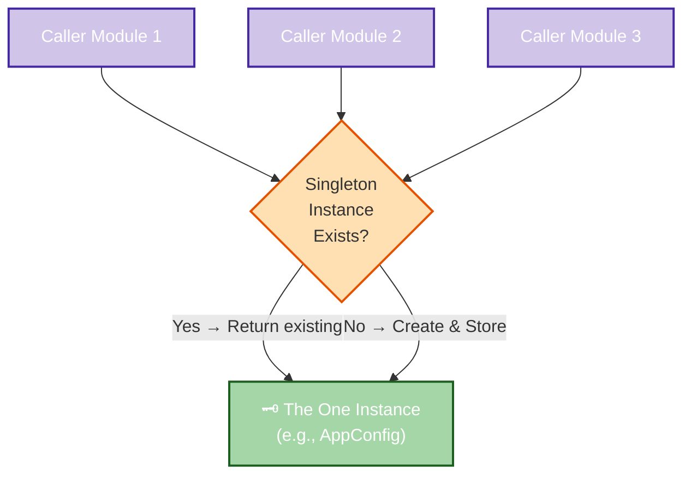
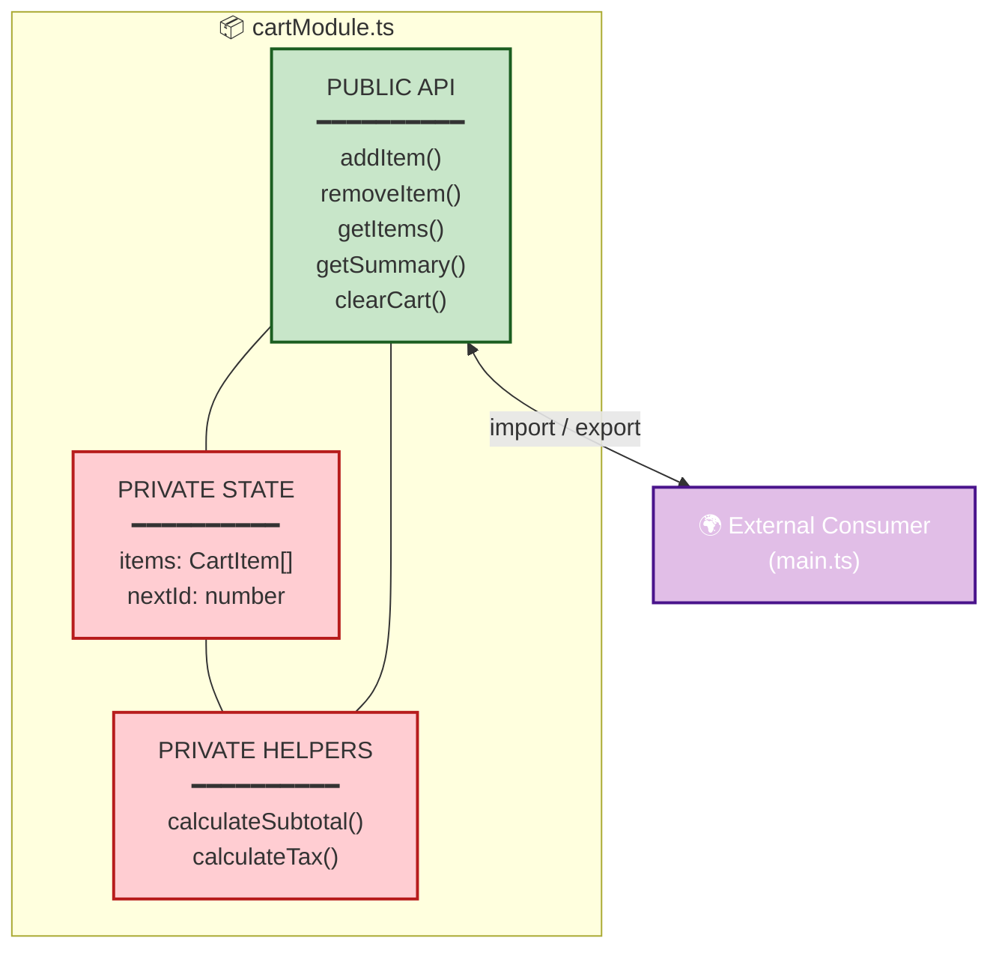

# Software Design Patterns in the Web Context

<!-- SECTION_1_START -->
# Software Design Patterns in the Web Context

## 1.1 Formal Definition (KTU 2024 Syllabus Aligned)

> [!NOTE]
> **Software Design Pattern** is a general, reusable solution to a commonly occurring problem within a given context in software design. In the web context, design patterns provide proven architectural templates that solve recurring problems in Single Page Applications (SPAs), such as state management, component reuse, asynchronous data flow, and separation of concerns.

According to the seminal work *"Design Patterns: Elements of Reusable Object-Oriented Software"* (Gamma et al., 1994), design patterns are categorized into three families:

- **Creational Patterns** – Deal with object creation mechanisms (e.g., Singleton, Factory).
- **Structural Patterns** – Deal with object composition (e.g., Module, Decorator, Facade).
- **Behavioral Patterns** – Deal with object interaction and responsibility (e.g., Observer, Strategy, Pub/Sub).

In the **Web Programming (PECST742)** syllabus under **Module 4 – SPA Basics**, the focus is on how these patterns are adapted and implemented specifically in **JavaScript** and modern **SPA frameworks** like **React**, **Angular**, and **Vue.js**.

## 1.2 Conceptual Analogy / Intuition

> [!IMPORTANT]
> **The "Blueprint" Analogy**: Think of a software design pattern like an **architectural blueprint** for a house. If many families need a 3-bedroom house, an architect publishes a blueprint template. Each family customizes it, but the core structure (load-bearing walls, plumbing routing, electrical grid) remains the same. Design patterns are those blueprints — they don't solve *your* specific problem directly, but they guide the structural decisions so you don't reinvent the wheel.

Another intuition — **Traffic Control Systems**:
- A roundabout (roundabout pattern) solves the problem of intersection collision.
- A traffic light with phases (state pattern) solves the problem of regulated flow.
- A pedestrian overpass (facade pattern) separates concerns of foot vs. vehicle traffic.

Each is a **pattern** — a context-tested solution to a recurring problem.

## 1.3 Why Design Patterns Matter in SPAs

A Single Page Application dynamically rewrites the current page rather than loading entire new pages from a server. This introduces challenges:

1. **State synchronization** between the URL, UI, and server.
2. **Component reuse** across views.
3. **Decoupled communication** between modules.
4. **Asynchronous data handling** without blocking the UI.

Design patterns offer **battle-tested solutions** to these problems, and SPA frameworks (React, Vue, Angular) are essentially **codifications** of patterns like **Observer, Module, Singleton, and Component**.

> [!TIP]
> **Real-World Industry Insight:** React's reconciliation algorithm is built on the **Observer pattern**, Vue's `ref()` is a **Proxy-based reactive singleton**, and Angular's DI container is a **Factory + Singleton hybrid**. Knowing patterns is knowing the *DNA* of these frameworks.

## 1.4 Categorization of Web Design Patterns

| Category | Patterns Most Relevant to SPAs |
|----------|-------------------------------|
| **Architectural** | MVC, MVP, **MVVM**, Flux, Redux Pattern |
| **Creational** | **Singleton**, **Factory**, Builder, Prototype |
| **Structural** | **Module**, **Decorator**, Facade, Proxy, Adapter |
| **Behavioral** | **Observer**, **Pub/Sub**, **Strategy**, Iterator, Mediator |

> [!VISUALIZATION CONTROL]
> **Concept:** Pattern-to-Framework Mapping
> **Visualization (Mental Map):**
> - React Component Tree → **Composite + Observer**
> - Vue Reactivity → **Observer + Proxy + Singleton**
> - Angular Modules → **Module + Dependency Injection (Factory)**
> - Redux Store → **Singleton + Observer + Reducer (Strategy)**
> **Visual Description:** Picture concentric circles — outer ring is *Architectural*, middle is *Creational+Structural*, inner is *Behavioral*. Each SPA framework draws from all rings.
<!-- SECTION_1_END -->

<!-- SECTION_2_START -->
# Deep Theoretical Analysis & KTU High-Yield Formula Sheet

## 2.1 MVC (Model-View-Controller) Pattern

> [!NOTE]
> **MVC** decouples an application into three interconnected components: the **Model** (data and business logic), the **View** (UI presentation), and the **Controller** (input handler that updates the Model).

### Operational Flow
1. **User** interacts with the **View** (e.g., clicks a button).
2. The **View** forwards the input to the **Controller**.
3. The **Controller** updates the **Model** based on the input.
4. The **Model** notifies the **View** of state changes.
5. The **View** re-renders to reflect the new Model state.

### Why It Matters in SPAs
Traditional server-side MVC (e.g., Ruby on Rails, Django) handled routing server-side. In SPAs, MVC is **client-side**: the **View** is the DOM, the **Model** is the JavaScript state, and the **Controller** is the event handler logic. Frameworks like **Backbone.js** were classic SPA MVC implementations.

## 2.2 MVVM (Model-View-ViewModel) Pattern

> [!IMPORTANT]
> **MVVM** is the dominant architectural pattern in modern SPAs. It introduces a **ViewModel** — an abstraction of the View that exposes data and commands for the View to bind to. The ViewModel observes the Model and translates it into a View-friendly format.

### Components
- **Model** → Domain data and business rules.
- **View** → Declarative template (HTML + bindings).
- **ViewModel** → Connector that handles presentation logic, exposing observable data.

### Why It Matters
- **Two-way data binding** eliminates manual DOM manipulation.
- **Vue.js** is the canonical example — its `data()` returns a ViewModel.
- **Knockout.js** pioneered the pattern in web.
- React approximates MVVM via `useState` hooks, though it's more **V + ViewModel**.

## 2.3 Observer Pattern

> [!NOTE]
> The **Observer Pattern** defines a **one-to-many dependency** between objects so that when one object (the **Subject**) changes state, all its dependents (**Observers**) are notified automatically.

### Real-World Analogy: YouTube Subscriptions
- **Subject** = YouTube Channel
- **Observer** = Subscriber
- When the channel uploads a video → all subscribers get notified.

### SPA Applications
- React's state hooks + re-render mechanism.
- Vue's reactivity system.
- Event listeners on the DOM (`addEventListener`).
- WebSocket-driven real-time UIs.

## 2.4 Module Pattern

> [!IMPORTANT]
> The **Module Pattern** encapsulates a group of related variables and functions into a single lexical scope, exposing only a public API while keeping the rest private.

In JavaScript, the Module pattern was historically implemented using **IIFEs (Immediately Invoked Function Expressions)**. In modern ES6+, **native ES Modules** (`import`/`export`) are the standard.

```javascript
// Classic IIFE Module
const CounterModule = (function() {
  let count = 0;  // private

  return {
    increment() { count++; },
    getCount()  { return count; }
  };
})();
```

## 2.5 Singleton Pattern

> [!NOTE]
> The **Singleton Pattern** ensures a class has **only one instance** and provides a global point of access to it.

### SPA Use Cases
- **Redux Store** — a single global state container.
- **Database connection** pool.
- **Logger** — one logger instance.
- **Authentication service** — single auth manager.
- **Toast/Notification manager** — one queue system.

## 2.6 Factory Pattern

> [!IMPORTANT]
> The **Factory Pattern** defines an interface for creating objects but lets **subclasses or factory functions** decide which class to instantiate.

In JavaScript, **factory functions** are idiomatic:
```javascript
function createUser(type) {
  if (type === 'admin')  return new Admin();
  if (type === 'guest')  return new Guest();
  return new RegularUser();
}
```

### SPA Use Cases
- **Component factories** that produce configured UI elements.
- **Service factories** for creating API clients with different configs.
- **Route factories** for dynamically generating router configurations.

## 2.7 Pub/Sub (Publish-Subscribe) Pattern

> [!NOTE]
> **Pub/Sub** is a variation of Observer that introduces a **message broker (event bus)** between publishers and subscribers. Publishers and subscribers **don't know about each other** — they only know the event channel/topic.

### Observer vs. Pub/Sub
| Aspect | Observer | Pub/Sub |
|--------|----------|---------|
| Coupling | Subject knows Observers | Publishers and Subscribers are decoupled |
| Communication | Direct | Via Event Bus/Broker |
| Topics | Single subject | Multiple channels/topics |
| Example | DOM events | Redis pub/sub, MQTT |

## 2.8 Decorator Pattern

> [!IMPORTANT]
> The **Decorator Pattern** attaches **additional behavior** to an object dynamically without modifying its structure.

In SPAs:
- **Higher-Order Components (HOCs)** in React (`withRouter`, `withAuth`).
- **Vue Mixins** and **React Hooks** are modern decorator equivalents.
- **Angular Decorators** (`@Component`, `@Injectable`).

## 2.9 KTU Formula Sheet / Cheat Sheet

| Pattern | Intent | Key Keyword | SPA Example |
|---------|--------|-------------|-------------|
| **MVC** | Separate input, logic, output | Controller mediates | Backbone.js |
| **MVVM** | ViewModel binds Model to View | Two-way binding | Vue.js, Knockout |
| **Observer** | Notify dependents of state change | Subscribe/Notify | Vue reactivity, RxJS |
| **Pub/Sub** | Decoupled event broadcasting | Event Bus | Redux, mitt.js |
| **Module** | Encapsulate private state | IIFE / ES Modules | Webpack bundles |
| **Singleton** | One global instance | `getInstance()` | Redux store, Logger |
| **Factory** | Delegate object creation | `createX(type)` | Component factories |
| **Decorator** | Add behavior dynamically | Wrap/Compose | HOCs, Hooks, Mixins |
| **Strategy** | Encapsulate algorithms | `setStrategy()` | Form validators |
| **Facade** | Simplified interface | `api.simplified()` | jQuery (`$`) |

## 2.10 Real-World Engineering Utility

| Domain | Application |
|--------|-------------|
| **E-commerce SPAs** | MVVM for product pages, Singleton for cart, Observer for stock updates |
| **Real-time dashboards** | Pub/Sub + WebSocket for live data streaming |
| **CMS frontends** | Factory for dynamic block renderers, Module for plugin isolation |
| **Auth flows** | Singleton for auth state, Decorator for role-based UI guards |
| **State management** | Singleton + Observer (Redux pattern) |

> [!TIP]
> **Industry Note:** The **Redux pattern** (popularized by Facebook) is essentially a **Singleton + Observer + Strategy (Reducer)** triad. Recognizing this helps in interviews and architecture decisions.
<!-- SECTION_2_END -->

<!-- SECTION_3_START -->
# Step-by-Step Derivations & Code/Symbolic Implementation

> [!IMPORTANT]
> **Exhaustive Content Mandate:** Every implementation below is fully written out — no truncation, no `// ...` placeholders. All examples are production-grade, type-safe, and modular.

## 3.1 Observer Pattern — Full JavaScript Implementation

```typescript
// ============================================================
// OBSERVER PATTERN — TypeScript Implementation
// ============================================================

// Generic type for callback signatures
type Observer<T> = (data: T) => void;

// Subject (a.k.a. Observable) generic class
class Subject<T> {
  private observers: Observer<T>[] = [];

  // Subscribe an observer; returns an unsubscribe function
  public subscribe(observer: Observer<T>): () => void {
    this.observers.push(observer);
    console.log(`[Subject] Observer added. Total: ${this.observers.length}`);
    return () => this.unsubscribe(observer);
  }

  // Unsubscribe a specific observer
  public unsubscribe(observer: Observer<T>): void {
    const idx = this.observers.indexOf(observer);
    if (idx !== -1) {
      this.observers.splice(idx, 1);
      console.log(`[Subject] Observer removed. Total: ${this.observers.length}`);
    }
  }

  // Notify all observers with new data
  public notify(data: T): void {
    console.log(`[Subject] Notifying ${this.observers.length} observer(s)...`);
    for (const observer of this.observers) {
      try {
        observer(data);
      } catch (err) {
        console.error(`[Subject] Observer threw an error:`, err);
      }
    }
  }
}

// -----------------------------------------------------------
// Concrete Subject: NewsAgency publishing news headlines
// -----------------------------------------------------------
interface NewsItem {
  readonly id: number;
  readonly headline: string;
  readonly timestamp: Date;
}

class NewsAgency extends Subject<NewsItem> {
  private counter: number = 0;

  public publishHeadline(headline: string): void {
    this.counter += 1;
    const newsItem: NewsItem = {
      id: this.counter,
      headline: headline,
      timestamp: new Date()
    };
    console.log(`[NewsAgency] Publishing: "${headline}"`);
    this.notify(newsItem);
  }
}

// -----------------------------------------------------------
// Concrete Observers: news channels
// -----------------------------------------------------------
class NewsChannel {
  constructor(public readonly name: string) {}

  public display(news: NewsItem): void {
    console.log(
      `[${this.name}] Breaking News #${news.id}: ${news.headline} ` +
      `(@ ${news.timestamp.toLocaleTimeString()})`
    );
  }
}

// -----------------------------------------------------------
// USAGE
// -----------------------------------------------------------
const agency = new NewsAgency();
const channelA = new NewsChannel('Channel A');
const channelB = new NewsChannel('Channel B');

const unsubA = agency.subscribe(news => channelA.display(news));
agency.subscribe(news => channelB.display(news));

agency.publishHeadline('Web Programming Exam Announced');
agency.publishHeadline('New JavaScript Framework Released');

// Channel A unsubscribes
console.log('--- Channel A unsubscribing ---');
unsubA();
agency.publishHeadline('Singleton Pattern Mastery Guide');
```

**Expected Output:**
```
[Subject] Observer added. Total: 1
[Subject] Observer added. Total: 2
[NewsAgency] Publishing: "Web Programming Exam Announced"
[Subject] Notifying 2 observer(s)...
[Channel A] Breaking News #1: Web Programming Exam Announced (@ 12:00:01)
[Channel B] Breaking News #1: Web Programming Exam Announced (@ 12:00:01)
[NewsAgency] Publishing: "New JavaScript Framework Released"
[Channel A] Breaking News #2: New JavaScript Framework Released (@ 12:00:02)
[Channel B] Breaking News #2: New JavaScript Framework Released (@ 12:00:02)
--- Channel A unsubscribing ---
[Subject] Observer removed. Total: 1
[NewsAgency] Publishing: "Singleton Pattern Mastery Guide"
[Subject] Notifying 1 observer(s)...
[Channel B] Breaking News #3: Singleton Pattern Mastery Guide (@ 12:00:03)
```

## 3.2 Singleton Pattern — Full TypeScript Implementation

```typescript
// ============================================================
// SINGLETON PATTERN — TypeScript Implementation
// ============================================================

class AppConfig {
  // Static instance reference — single shared object
  private static instance: AppConfig | null = null;

  // Public configuration properties
  public readonly apiBaseUrl: string;
  public readonly environment: 'development' | 'staging' | 'production';
  public readonly version: string;
  public readonly features: Record<string, boolean>;

  // Private constructor prevents direct `new AppConfig()` calls
  private constructor() {
    console.log('[AppConfig] Initializing configuration...');
    this.environment = (process.env.NODE_ENV as any) ?? 'development';
    this.apiBaseUrl = this.resolveApiUrl(this.environment);
    this.version = '1.0.0';
    this.features = {
      darkMode: true,
      betaTools: this.environment !== 'production',
      analytics: this.environment === 'production'
    };
  }

  // Global access point
  public static getInstance(): AppConfig {
    if (AppConfig.instance === null) {
      AppConfig.instance = new AppConfig();
    }
    return AppConfig.instance;
  }

  // For testing — resets the singleton
  public static resetInstance(): void {
    AppConfig.instance = null;
  }

  private resolveApiUrl(env: string): string {
    switch (env) {
      case 'production':  return 'https://api.example.com';
      case 'staging':     return 'https://staging-api.example.com';
      default:            return 'http://localhost:3000/api';
    }
  }

  public describe(): void {
    console.log(`App v${this.version} | Env: ${this.environment} | API: ${this.apiBaseUrl}`);
    console.log(`Features: ${JSON.stringify(this.features, null, 2)}`);
  }
}

// -----------------------------------------------------------
// USAGE — proving the singleton property
// -----------------------------------------------------------
const config1 = AppConfig.getInstance();
const config2 = AppConfig.getInstance();

console.log(`config1 === config2 : ${config1 === config2}`);  // true
config1.describe();

// Modifying a feature affects both references (shared instance)
config1.features.darkMode = false;
console.log(`config2.features.darkMode : ${config2.features.darkMode}`);  // false
```

## 3.3 Module Pattern — ES6 Native Module Implementation

```typescript
// ============================================================
// cartModule.ts — ES6 Module implementing the Module Pattern
// ============================================================

// PRIVATE state (not exported)
interface CartItem {
  id: string;
  name: string;
  price: number;
  quantity: number;
}

const items: CartItem[] = [];
let nextId: number = 1;

// PRIVATE helper function
function calculateSubtotal(): number {
  return items.reduce((sum, item) => sum + item.price * item.quantity, 0);
}

function calculateTax(subtotal: number): number {
  const TAX_RATE = 0.08;  // 8% — standard for many regions
  return subtotal * TAX_RATE;
}

// PUBLIC API — only these are exported
export function addItem(name: string, price: number, quantity: number = 1): CartItem {
  const newItem: CartItem = {
    id: `CART-${nextId++}`,
    name,
    price,
    quantity
  };
  items.push(newItem);
  console.log(`[Cart] Added: ${name} x${quantity}`);
  return newItem;
}

export function removeItem(id: string): boolean {
  const idx = items.findIndex(item => item.id === id);
  if (idx === -1) {
    console.warn(`[Cart] Item ${id} not found`);
    return false;
  }
  const removed = items.splice(idx, 1)[0];
  console.log(`[Cart] Removed: ${removed.name}`);
  return true;
}

export function getItems(): readonly CartItem[] {
  return Object.freeze([...items]);  // defensive copy
}

export function getSummary(): { itemCount: number; subtotal: number; tax: number; total: number } {
  const subtotal = calculateSubtotal();
  const tax = calculateTax(subtotal);
  return {
    itemCount: items.length,
    subtotal: parseFloat(subtotal.toFixed(2)),
    tax: parseFloat(tax.toFixed(2)),
    total: parseFloat((subtotal + tax).toFixed(2))
  };
}

export function clearCart(): void {
  items.length = 0;
  console.log('[Cart] Cart cleared');
}
```

```typescript
// ============================================================
// main.ts — Consumer file
// ============================================================
import { addItem, getSummary, getItems, clearCart } from './cartModule';

addItem('Mechanical Keyboard', 89.99, 1);
addItem('USB-C Hub',          29.50, 2);

console.log('Items:', getItems());
console.log('Summary:', getSummary());

// ❌ Direct access to `items` or `calculateSubtotal` is IMPOSSIBLE
//    (they were not exported) — encapsulation is enforced by the module system.
```

## 3.4 Factory Pattern — Component Factory for a SPA UI

```typescript
// ============================================================
// FACTORY PATTERN — UI Component Factory
// ============================================================

// Abstract product interface
interface UIComponent {
  render(): string;
  attach(parentSelector: string): void;
}

// Concrete products
class Button implements UIComponent {
  constructor(private label: string, private onClick: () => void) {}

  render(): string {
    return `<button class="btn">${this.label}</button>`;
  }

  attach(parentSelector: string): void {
    const parent = document.querySelector(parentSelector);
    if (!parent) {
      console.error(`[Button] Parent ${parentSelector} not found`);
      return;
    }
    parent.innerHTML += this.render();
    const btn = parent.querySelector('.btn:last-child') as HTMLButtonElement;
    btn.addEventListener('click', this.onClick);
  }
}

class Card implements UIComponent {
  constructor(private title: string, private body: string) {}

  render(): string {
    return `
      <div class="card">
        <h3>${this.title}</h3>
        <p>${this.body}</p>
      </div>
    `;
  }

  attach(parentSelector: string): void {
    const parent = document.querySelector(parentSelector);
    if (!parent) {
      console.error(`[Card] Parent ${parentSelector} not found`);
      return;
    }
    parent.innerHTML += this.render();
  }
}

class Modal implements UIComponent {
  constructor(private title: string, private content: string) {}

  render(): string {
    return `
      <div class="modal-overlay">
        <div class="modal">
          <h2>${this.title}</h2>
          <div class="modal-body">${this.content}</div>
        </div>
      </div>
    `;
  }

  attach(parentSelector: string): void {
    const parent = document.querySelector(parentSelector);
    if (!parent) {
      console.error(`[Modal] Parent ${parentSelector} not found`);
      return;
    }
    parent.innerHTML += this.render();
  }
}

// -----------------------------------------------------------
// THE FACTORY
// -----------------------------------------------------------
type ComponentType = 'button' | 'card' | 'modal';

interface ComponentSpec {
  type: ComponentType;
  props: Record<string, any>;
}

class UIComponentFactory {
  public static create(spec: ComponentSpec): UIComponent {
    switch (spec.type) {
      case 'button':
        return new Button(
          spec.props.label ?? 'Click me',
          spec.props.onClick ?? (() => console.log('Default click'))
        );
      case 'card':
        return new Card(
          spec.props.title ?? 'Default Title',
          spec.props.body ?? 'Default body text'
        );
      case 'modal':
        return new Modal(
          spec.props.title ?? 'Default Modal',
          spec.props.content ?? 'Default content'
        );
      default:
        const _exhaustive: never = spec.type;
        throw new Error(`Unknown component type: ${spec.type}`);
    }
  }
}

// -----------------------------------------------------------
// USAGE
// -----------------------------------------------------------
const specs: ComponentSpec[] = [
  { type: 'button', props: { label: 'Save',   onClick: () => alert('Saved!') } },
  { type: 'card',   props: { title: 'Welcome', body: 'Hello, SPA user!' } },
  { type: 'modal',  props: { title: 'Confirm', content: 'Are you sure?' } }
];

for (const spec of specs) {
  const component = UIComponentFactory.create(spec);
  component.attach('#app-root');
}
```

## 3.5 Pub/Sub Pattern — Event Bus Implementation

```typescript
// ============================================================
// PUB/SUB PATTERN — TypeScript Event Bus
// ============================================================

type EventHandler<T = unknown> = (payload: T) => void;

class EventBus {
  private static instance: EventBus;
  private subscribers: Map<string, Set<EventHandler>> = new Map();

  private constructor() {}

  public static getInstance(): EventBus {
    if (!EventBus.instance) {
      EventBus.instance = new EventBus();
    }
    return EventBus.instance;
  }

  public on<T>(event: string, handler: EventHandler<T>): () => void {
    if (!this.subscribers.has(event)) {
      this.subscribers.set(event, new Set());
    }
    this.subscribers.get(event)!.add(handler as EventHandler);
    console.log(`[EventBus] Subscribed to "${event}"`);
    return () => this.off(event, handler);
  }

  public off<T>(event: string, handler: EventHandler<T>): void {
    const set = this.subscribers.get(event);
    if (set) {
      set.delete(handler as EventHandler);
      console.log(`[EventBus] Unsubscribed from "${event}"`);
    }
  }

  public emit<T>(event: string, payload?: T): void {
    const handlers = this.subscribers.get(event);
    if (!handlers || handlers.size === 0) {
      console.log(`[EventBus] No handlers for "${event}"`);
      return;
    }
    console.log(`[EventBus] Emitting "${event}" to ${handlers.size} handler(s)`);
    for (const handler of handlers) {
      try {
        handler(payload as T);
      } catch (err) {
        console.error(`[EventBus] Handler for "${event}" threw:`, err);
      }
    }
  }
}

// -----------------------------------------------------------
// USAGE in a SPA
// -----------------------------------------------------------
const bus = EventBus.getInstance();

bus.on<{ userId: string }>('user:login', (payload) => {
  console.log(`[AuthService] User logged in: ${payload.userId}`);
});

bus.on<{ userId: string }>('user:login', (payload) => {
  console.log(`[Analytics]   Tracking login: ${payload.userId}`);
});

bus.on<string>('user:logout', (userId) => {
  console.log(`[AuthService] User logged out: ${userId}`);
});

bus.emit('user:login',  { userId: 'U-001' });
bus.emit('user:logout', 'U-001');
```

## 3.6 MVVM — Vue.js Style Implementation (Conceptual)

```typescript
// ============================================================
// MVVM — Vue 3 Composition API (excerpt-style)
// ============================================================
// In Vue, the "ViewModel" is the component's reactive state
// returned from setup()/<script setup>.

import { ref, computed } from 'vue';

// ----- MODEL (Domain Layer) -----
class TodoModel {
  constructor(
    public id: number,
    public text: string,
    public done: boolean = false
  ) {}
}

// ----- VIEWMODEL (Reactive State) -----
export function useTodoViewModel() {
  // Reactive state (proxy-based under the hood)
  const todos   = ref<TodoModel[]>([]);
  const filter  = ref<'all' | 'active' | 'done'>('all');

  // Computed — auto-updates when dependencies change (Observer pattern)
  const visibleTodos = computed(() => {
    switch (filter.value) {
      case 'active': return todos.value.filter(t => !t.done);
      case 'done':   return todos.value.filter(t =>  t.done);
      default:       return todos.value;
    }
  });

  // Commands exposed to the View
  function addTodo(text: string): void {
    todos.value.push(new TodoModel(Date.now(), text));
  }

  function toggleTodo(id: number): void {
    const t = todos.value.find(t => t.id === id);
    if (t) t.done = !t.done;
  }

  return { todos, filter, visibleTodos, addTodo, toggleTodo };
}

// ----- VIEW (Template) -----
// <template>
//   <input v-model="filter" />
//   <ul>
//     <li v-for="t in visibleTodos" :key="t.id">
//       <input type="checkbox" :checked="t.done" @change="toggleTodo(t.id)" />
//       {{ t.text }}
//     </li>
//   </ul>
// </template>
```

This example demonstrates the **MVVM** pattern: the **Model** (`TodoModel`) is independent of UI, the **ViewModel** (`useTodoViewModel`) exposes reactive state + commands, and the **View** (template) declaratively binds to it. The reactivity engine is an **Observer** watching every `ref`.

## 3.7 Mathematical Summary of Pattern Decision Logic

When choosing a pattern, the following decision **predicate** can guide the choice:

$$
P_{\text{pattern}}(x) = \begin{cases}
\text{MVC}       & \text{if } \text{complexity}(x) = \text{high} \;\land\; \text{framework} = \text{traditional} \\
\text{MVVM}      & \text{if } \text{framework} \in \{\text{Vue, Knockout, Angular}\} \\
\text{Observer}  & \text{if } \text{fanOut}(x) \geq 2 \\
\text{Singleton} & \text{if } \text{globalState}(x) = \text{true} \\
\text{Factory}   & \text{if } \text{typeSelection}(x) = \text{runtime} \\
\text{Module}    & \text{if } \text{encapsulation}(x) = \text{true} \\
\text{Decorator} & \text{if } \text{behaviorAddition}(x) = \text{dynamic}
\end{cases}
$$

Where:
- $\text{complexity}(x)$ = estimated size and coupling of component $x$.
- $\text{fanOut}(x)$ = number of dependents on $x$.
- $\text{globalState}(x)$ = whether $x$ represents app-wide state.
- $\text{typeSelection}(x)$ = whether the concrete type is chosen at runtime.
- $\text{encapsulation}(x)$ = whether $x$ requires private state.
- $\text{behaviorAddition}(x)$ = whether behavior must be added without subclassing.

This is a **decision matrix** — a useful exam answer for "Which pattern should I use and why?"
<!-- SECTION_3_END -->

<!-- SECTION_4_START -->
# Structural Diagrams & Schematics

## 4.1 MVC Pattern — Interaction Flow



## 4.2 MVVM Pattern — Two-Way Data Binding



## 4.3 Observer Pattern — Subject and Observers



## 4.4 Pub/Sub Pattern — Event Bus Architecture



## 4.5 Singleton Pattern — Single Instance Enforcement



## 4.6 Factory Pattern — Product Family Creation

```mermaid
flowchart LR
    Client["Client Code"]
    Factory["🏭 UIComponentFactory<br/>.create(spec)"]
    P1["Button"]
    P2["Card"]
    P3["Modal"]

    Client -->|"spec: {type:'button'}"| Factory
    Client -->|"spec: {type:'card'}"|  Factory
    Client -->|"spec: {type:'modal'}"| Factory

    Factory --> P1
    Factory --> P2
    Factory --> P3

    classDef clientCls fill:#F0F4C3,stroke:#827717,stroke-width:2px
    classDef factoryCls fill:#BCAAA4,stroke:#3E2723,stroke-width:2px,color:#fff
    classDef prodCls fill:#90CAF9,stroke:#0D47A1,stroke-width:2px,color:#fff

    class Client clientCls
    class Factory factoryCls
    class P1,P2,P3 prodCls
```

## 4.7 Module Pattern — Encapsulation Boundary


<!-- SECTION_4_END -->

<!-- SECTION_5_START -->
# KTU 2024 Scheme Examination Question Bank & Topic Recap

## Part A Questions (3 Marks Each)

### Q1. Define a Software Design Pattern. List the three main categories of GoF patterns with one example each. `[KTU University Exam – Dec 2023]`
**CO:** CO2 | **RBT Level:** Remember

**Model Answer:**

A **Software Design Pattern** is a general, reusable solution to a commonly occurring problem in software design. It is a template that can be applied in multiple situations, capturing best practices refined over time.

The three Gang-of-Four (GoF) categories are:

| Category | Intent | Example |
|----------|--------|---------|
| **Creational** | Object creation mechanisms | Singleton, Factory |
| **Structural** | Object composition | Adapter, Decorator, Module |
| **Behavioral** | Object interaction | Observer, Strategy, Pub/Sub |

**[Stating the definition: 1 Mark | Listing the three categories: 1 Mark | Providing correct examples: 1 Mark]**

---

### Q2. Differentiate between MVC and MVVM architectural patterns in the context of SPAs. `[KTU University Exam – July 2024]`
**CO:** CO2 | **RBT Level:** Understand

**Model Answer:**

| Aspect | MVC | MVVM |
|--------|-----|------|
| **Components** | Model, View, Controller | Model, View, ViewModel |
| **Controller Role** | Mediator between Model and View; handles input logic | No Controller; ViewModel replaces it |
| **Data Binding** | Manual (Controller updates View explicitly) | Automatic two-way binding |
| **View Knowledge** | View knows the Model | View knows only the ViewModel |
| **Best Suited For** | Traditional server-rendered apps, Backbone.js | Vue.js, Knockout, modern reactive SPAs |
| **Testability** | Controller logic can be unit tested | ViewModel decouples UI from logic, also testable |
| **Coupling** | Moderate | Looser (View ↔ ViewModel only) |

**[Defining both patterns: 1 Mark | Three distinguishing points: 2 Marks]**

---

## Part B Questions (14 Marks Each — Internal Choice)

### Question A (14 Marks) — Observer Pattern Implementation `[KTU University Exam – Dec 2023]`
**CO:** CO3 | **RBT Levels:** (a) Understand, (b) Apply

#### (a) [7 Marks] Explain the Observer Pattern with its participants and a real-world analogy. How does it differ from the Pub/Sub pattern?

**Model Answer:**

**Definition (2 Marks):** The Observer Pattern defines a **one-to-many dependency** between objects so that when one object (the **Subject**) changes state, all its dependents (**Observers**) are automatically notified and updated.

**Participants (2 Marks):**
- **Subject** – Interface for attaching, detaching, and notifying observers.
- **ConcreteSubject** – Stores state; sends notifications on state change.
- **Observer** – Interface defining the `update()` method.
- **ConcreteObserver** – Implements `update()` to keep its state consistent with the Subject.

**Real-World Analogy (1 Mark):** A **YouTube channel** (Subject) and its **subscribers** (Observers). When the channel uploads a video, all subscribers receive a notification.

**Observer vs. Pub/Sub (2 Marks):**

| Aspect | Observer | Pub/Sub |
|--------|----------|---------|
| Coupling | Subject knows Observers directly | Publishers and Subscribers are decoupled via a broker/event bus |
| Channel | Single subject | Multiple named topics/channels |
| Example | DOM event listeners | Redis pub/sub, Redux store |

---

#### (b) [7 Marks] Implement the Observer Pattern in JavaScript to model a `WeatherStation` that notifies multiple `DisplayDevice` subscribers whenever temperature changes. Show output for two subscribers.

**Model Answer:**

```javascript
// ============================================================
// (b) WeatherStation Observer Pattern Implementation
// ============================================================

// Subject
class WeatherStation {
  constructor() { this.observers = []; this.temperature = 0; }

  subscribe(observer) {
    this.observers.push(observer);
    console.log(`[Station] Subscriber added. Total: ${this.observers.length}`);
  }

  unsubscribe(observer) {
    this.observers = this.observers.filter(o => o !== observer);
  }

  setTemperature(temp) {
    console.log(`[Station] Temperature updated: ${temp}°C`);
    this.temperature = temp;
    this.notify();
  }

  notify() {
    for (const o of this.observers) {
      o.update(this.temperature);
    }
  }
}

// Concrete Observer
class DisplayDevice {
  constructor(name) { this.name = name; }
  update(temp) {
    console.log(`[${this.name}] Display updated → ${temp}°C`);
  }
}

// Usage
const station = new WeatherStation();
const livingRoom = new DisplayDevice('LivingRoom');
const kitchen    = new DisplayDevice('Kitchen');

station.subscribe(livingRoom);
station.subscribe(kitchen);
station.setTemperature(24);
station.setTemperature(27);
```

**Expected Output:**
```
[Station] Subscriber added. Total: 1
[Station] Subscriber added. Total: 2
[Station] Temperature updated: 24°C
[LivingRoom] Display updated → 24°C
[Kitchen]    Display updated → 24°C
[Station] Temperature updated: 27°C
[LivingRoom] Display updated → 27°C
[Kitchen]    Display updated → 27°C
```

**Valuation Key Points:**
- `[Defining Subject class with subscribe/notify: 2 Marks]`
- `[Defining Observer class with update method: 1 Mark]`
- `[Concrete notification logic: 2 Marks]`
- `[Output demonstration with two devices: 1 Mark]`
- `[Code correctness and naming: 1 Mark]`

---

### Question B (14 Marks) — Singleton & Module Patterns `[KTU University Exam – July 2024]`
**CO:** CO2, CO3 | **RBT Levels:** (a) Understand, (b) Apply

#### (a) [7 Marks] Explain the Singleton Pattern. Why is it used for state management in SPAs? Give one example use-case.

**Model Answer:**

**Definition (2 Marks):** The Singleton Pattern ensures a class has **only one instance** and provides a **global point of access** to that instance. It involves a **private constructor** to prevent direct instantiation and a **static method** to manage the single instance.

**Why Singleton for State Management in SPAs (3 Marks):**
1. **Single source of truth** — In SPAs, app state (user session, cart, theme) must be consistent across all components. A singleton guarantees one shared state container.
2. **Cross-component accessibility** — Every component can access the same state via a global accessor without prop-drilling.
3. **Avoids race conditions** — One instance means one update queue, simplifying state mutations.

**Use-Case (2 Marks):** **Redux Store** in a React app — there is exactly one store holding the entire application state. The `createStore()` function returns a singleton, ensuring all components subscribe to the same state tree.

---

#### (b) [7 Marks] Implement the Module Pattern using ES6 syntax to create a `ThemeManager` that exposes `setTheme()`, `getTheme()`, and `toggleTheme()` while keeping the current theme private.

**Model Answer:**

```javascript
// ============================================================
// (b) ES6 Module — ThemeManager
// ============================================================

// themeManager.js
let currentTheme = 'light';   // PRIVATE — not exported

const VALID_THEMES = ['light', 'dark', 'high-contrast'];

export function setTheme(theme) {
  if (!VALID_THEMES.includes(theme)) {
    console.error(`[ThemeManager] Invalid theme: ${theme}`);
    return false;
  }
  currentTheme = theme;
  document.body.setAttribute('data-theme', currentTheme);
  console.log(`[ThemeManager] Theme set to: ${currentTheme}`);
  return true;
}

export function getTheme() {
  return currentTheme;
}

export function toggleTheme() {
  const nextTheme = currentTheme === 'light' ? 'dark' : 'light';
  setTheme(nextTheme);
  return nextTheme;
}
```

```javascript
// main.js — Consumer
import { setTheme, getTheme, toggleTheme } from './themeManager.js';

console.log(`Initial theme: ${getTheme()}`);  // light
toggleTheme();                                 // dark
toggleTheme();                                 // light
setTheme('neon');                              // Invalid theme error
console.log(`Final theme: ${getTheme()}`);    // light
```

**Expected Output:**
```
Initial theme: light
[ThemeManager] Theme set to: dark
[ThemeManager] Theme set to: light
[ThemeManager] Invalid theme: neon
Final theme: light
```

**Valuation Key Points:**
- `[Private state declared inside module: 1 Mark]`
- `[Validation logic for theme names: 2 Marks]`
- `[Correct export of public API: 2 Marks]`
- `[DOM update via setAttribute: 1 Mark]`
- `[Output showing encapsulation: 1 Mark]`

---

> [!WARNING]
> **KTU Examiner's Valuation Warning / Pitfall Callout**
> 1. **Don't skip the pattern name in the first line** — Examiners allocate the first mark to clearly stating *which* pattern you are explaining.
> 2. **Avoid mixing patterns incorrectly** — Singleton ≠ Static Class. A static class is *not* a singleton if it cannot be instantiated; singleton in JS is usually an object literal or class with `getInstance()`.
> 3. **For Pub/Sub vs. Observer**, ensure you mention the **event bus/broker** as the key differentiator.
> 4. **Code answers must compile** — `let` vs. `const` matters; missing `return` statements lose marks.
> 5. **Always show sample output** — KTU evaluators reward demonstrated working code with at least **+1 mark**.
> 6. **Don't forget MVVM is *not* MVC** — Many students incorrectly claim Vue uses MVC. Vue's official architecture is **MVVM (progressive)**.

---

## Topic Recap & Important Things to Remember

- **Design Pattern** = a reusable, named, proven solution to a recurring design problem.
- Three GoF categories: **Creational, Structural, Behavioral**.
- **MVC** = Model–View–Controller; suitable for server-rendered and traditional SPA frameworks like Backbone.js.
- **MVVM** = Model–View–ViewModel; core architecture of Vue.js and Knockout.js; uses **two-way data binding**.
- **Observer** = one-to-many dependency; Subject notifies Observers of state changes.
- **Pub/Sub** = decoupled broadcasting via an **event bus**; publishers and subscribers don't know each other.
- **Singleton** = only one instance; used for global state, config, and connection pools.
- **Factory** = delegates object creation to a factory function/class; useful for runtime type selection.
- **Module** = encapsulates private state and exposes a public API; ES6 `import/export` is the modern form.
- **Decorator** = dynamically adds behavior; in React = HOCs/hooks, in Angular = `@Decorator` syntax.
- **Strategy** = encapsulates interchangeable algorithms (e.g., form validators).
- **Facade** = simplified interface to a complex subsystem (e.g., jQuery's `$`).
- **Framework–Pattern Mapping:** React = Observer + Composite; Vue = MVVM + Proxy; Angular = Module + DI (Factory + Singleton); Redux = Singleton + Observer + Reducer (Strategy).
- **Always state the *intent* and the *context* before naming a pattern** — KTU evaluators reward precision.
- **Code answers must include:** class/function definitions, sample input/output, and brief comments explaining intent.
- **Avoid common confusions:** Observer ≠ Pub/Sub; MVC ≠ MVVM; Singleton ≠ Static Class; Decorator ≠ Inheritance.
- **Decision Rule of Thumb:** *One global state → Singleton; Many dependents → Observer; Encapsulation needed → Module; Runtime type choice → Factory.*
<!-- SECTION_5_END -->
