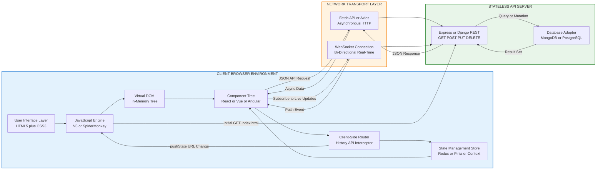
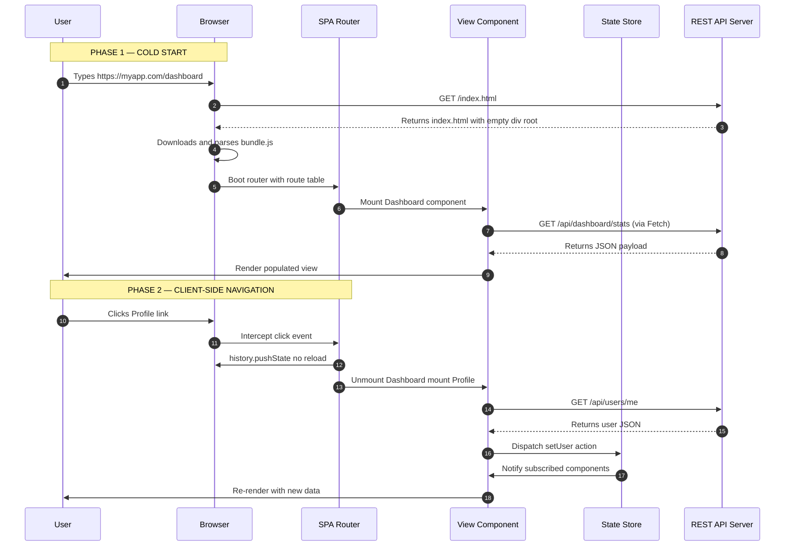
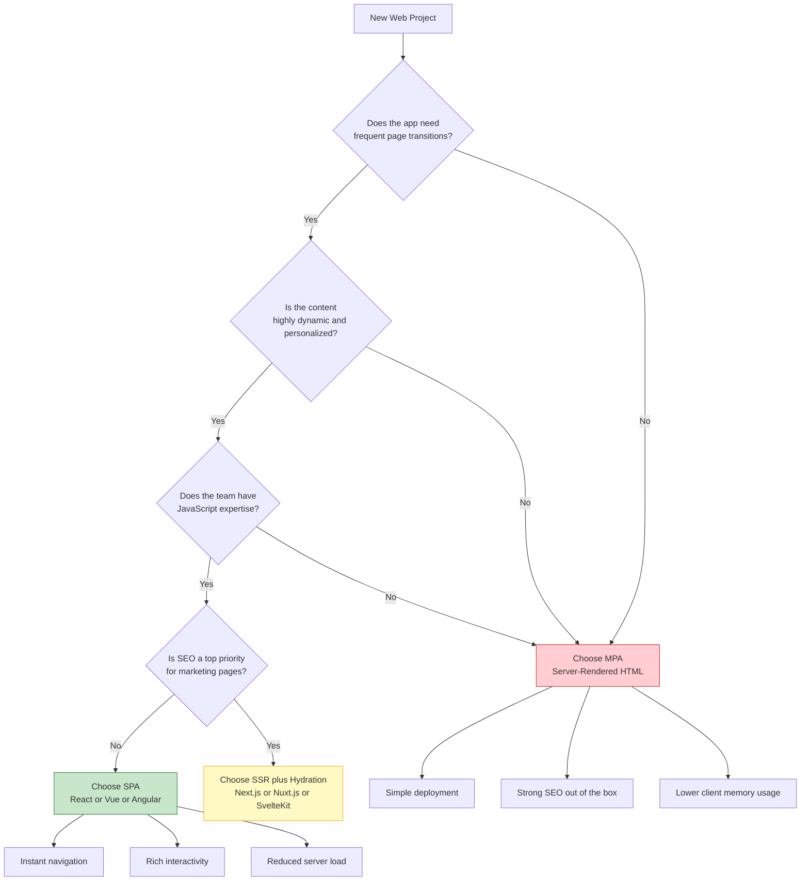
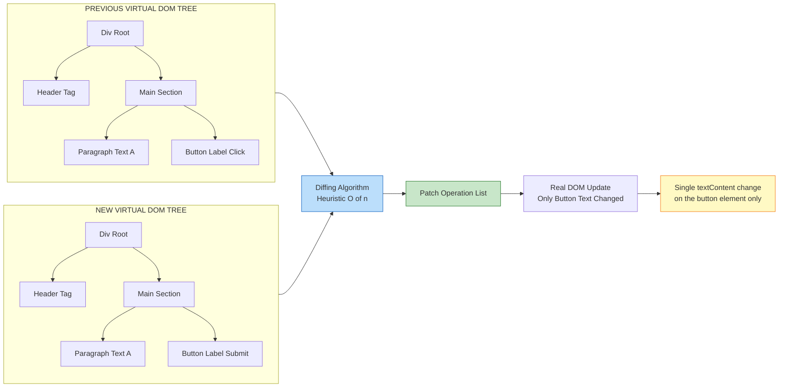

# SPA – Basics

<!-- SECTION_1_START -->
# SPA – Basics: Core Technical Definition & Intuitive Overview

## Formal KTU 2024 Definition

A **Single Page Application (SPA)** is a web application or website that interacts with the user by **dynamically rewriting the current web page** with new data fetched from the web server, instead of the default method of the browser loading entire new pages from the server. In a SPA, the entire application is loaded as a single HTML document, and subsequent navigations are handled **client-side** using JavaScript, manipulating the DOM (Document Object Model) without triggering a full page reload.

> [!IMPORTANT]
> **KTU 2024 Syllabus Highlight (PECS742 / Web Programming):**
> A SPA architecture is fundamentally defined by two pillars — **Client-Side Routing** and **Asynchronous Data Fetching (AJAX / Fetch API / Axios)**. The server's role is reduced to a stateless **RESTful API** that serves raw JSON payloads rather than pre-rendered HTML.

## Conceptual Analogy / Intuition

Think of a SPA like a **modern restaurant with a single dining hall and one waiter (the browser)**:

| Concept | Real-World Analogy |
|---|---|
| **MPA (Multi-Page App)** | A traditional government office where you must visit **Room 1, Room 2, Room 3** for different services — each room change requires you to leave, walk, and re-enter a new building (full page reload). |
| **SPA** | A smart supermarket where you carry a **shopping tablet (JavaScript engine)**. As you move from the fruit aisle to the dairy section, only the **content panel on your tablet changes** — the building, the lighting, and the flooring remain the same. The tablet quietly fetches the dairy inventory from a **cloud warehouse (API server)** in the background. |
| **Initial Bundle** | The shopping tablet handed to you at the entrance — it contains the **app shell (HTML + CSS + JS framework)**. |
| **AJAX / Fetch** | The wireless barcode scanner that talks to the **cloud warehouse (server API)** in real-time. |
| **Client-Side Router** | The GPS on your tablet that updates the **map URL** (e.g., `/dairy`, `/fruits`) without physically moving you. |

> [!NOTE]
> The browser address bar **does change** in a SPA (using the **History API**: `pushState` and `popstate`), giving the illusion of navigation, but **no new HTML document is fetched** from the server.

## Core Defining Characteristics of a SPA

> [!IMPORTANT]
> These six characteristics are **frequently asked as 3-mark short questions** in KTU ESE — memorize them precisely.

1. **Single HTML Document** — Only one `index.html` is served at the root. All views are rendered inside a designated `<div id="root">` mount node.
2. **Client-Side Routing** — URLs like `/dashboard`, `/profile/42` are intercepted by JavaScript and mapped to components, not server files.
3. **Asynchronous Data Loading** — Communication with the backend uses **AJAX** (`XMLHttpRequest`), the modern **Fetch API**, or libraries like **Axios**.
4. **Rich State Management** — Application state (user session, cart items, theme) is held in memory on the client (e.g., **Redux, Vuex, Pinia, Context API**).
5. **Decoupled Backend** — The server is a **stateless RESTful / GraphQL API** that returns JSON, not HTML.
6. **Framework-Driven** — Built using SPA frameworks: **React, Angular, Vue.js, Svelte, Ember.js**.

> [!VISUALIZATION CONTROL]
> **Concept:** Page Load Comparison — SPA vs MPA
> **Conceptual Coordinate Mapping:**
> * `x-axis` = Time (seconds, 0 to 8s)
> * `y-axis` = Cumulative Data Transferred (KB, 0 to 500KB)
> * `MPA Curve` = Staircase pattern (jumps at 1s, 3s, 5s, 7s — each representing a full HTML+CSS+JS reload of ~120KB)
> * `SPA Curve` = One large initial spike at 0s (~300KB shell) followed by tiny ~5KB JSON pings at 2s, 4s, 6s
> **Visual Description:** A staircase (MPA) vs a single tall pillar with small bumps (SPA). The SPA trades a heavier first load for near-instant subsequent navigations.

## Formal Terminology Box

> [!NOTE]
> **Key KTU Glossary Terms (Memorize the spellings & exact meaning):**
> * **DOM (Document Object Model):** The in-memory tree representation of the HTML page that JavaScript can mutate.
> * **Virtual DOM:** A lightweight, in-memory copy of the real DOM used by React/Vue to compute minimal update operations (diffing algorithm).
> * **Mount Node:** The empty `<div id="root">` element in `index.html` where the SPA framework injects the entire UI.
> * **Bundle:** The transpiled and minified JavaScript file (e.g., `bundle.js`, `main.js`) produced by **Webpack**, **Vite**, or **Rollup**.
> * **Hydration:** The process where a server-rendered HTML page is "brought to life" by attaching event listeners on the client (used in SSR + SPA hybrid apps).
* **Code-Splitting:** Dividing the bundle into smaller chunks loaded on demand (`React.lazy()`, `import()`).

<!-- SECTION_1_END -->

<!-- SECTION_2_START -->
# SPA – Basics: Deep Theoretical Analysis & KTU High-Yield Formula Sheet

## 1. The Operational Lifecycle of a SPA

The execution of a SPA follows a strictly defined **5-stage pipeline**. Understanding each stage is critical for KTU long-answer questions.

### Stage 1 — Initial Document Request
The user types `https://myapp.com/dashboard` into the browser.
* The browser sends an **HTTP GET** request to the server.
* The server responds with the **single `index.html` document** — identical for every route (`/`, `/dashboard`, `/profile`).
* The HTML contains a near-empty body with a single root element:

```html
<!DOCTYPE html>
<html>
  <head><title>My SPA</title></head>
  <body>
    <div id="root"></div>
    <script src="/static/js/bundle.js"></script>
  </body>
</html>
```

### Stage 2 — Bundle Download & Parsing
* The browser downloads the **JavaScript bundle** (often 200 KB – 2 MB depending on the framework).
* The JS engine (V8, SpiderMonkey) parses the bundle, executes the framework boot code, and **mounts** the initial component tree into `#root`.

### Stage 3 — Client-Side Route Resolution
* When the user clicks a `<Link to="/profile">` element, the SPA router **intercepts** the click event (using `event.preventDefault()`).
* The router uses the **History API** (`window.history.pushState`) to update the address bar URL without a reload.
* The router matches the new URL against a pre-registered **route configuration table** and renders the corresponding component.

### Stage 4 — Asynchronous Data Fetching
* The newly mounted component may declare a data dependency (e.g., user profile data).
* It issues an **AJAX / Fetch / Axios** call to the backend API: `GET /api/users/42`.
* The server returns a **JSON payload**: `{"id":42, "name":"Anu", "role":"admin"}`.
* The component re-renders with the new data, mutating the **Virtual DOM**, which is then diffed and patched to the real DOM in **~16ms** (one frame at **60 FPS**).

### Stage 5 — State Persistence & Re-render Cycle
* State changes (user clicks "Add to Cart") trigger a **state mutation**.
* The framework's reactivity system (React's `useState`, Vue's `ref`, Angular's Signals) **schedules a re-render**.
* Only the affected component subtree is updated — the rest of the page remains untouched.

## 2. KTU Formula Sheet & Concept Cheat Sheet

| # | Concept | Formula / Syntax Pattern | Unit / Notes |
|---|---|---|---|
| 1 | **First Contentful Paint (FCP)** | $FCP = T_{firstRender} - T_{navigationStart}$ | Measured in **milliseconds (ms)**. KTU expects: SPA FCP is **higher** than MPA. |
| 2 | **Time to Interactive (TTI)** | $TTI = T_{mainThreadQuiet} - T_{navigationStart}$ | SPA TTI = FCP + bundle parse + hydrate. |
| 3 | **Bundle Size Budget** | $B_{total} = \sum_{i=1}^{n} B_{chunk_i}$ | Ideal: **< 244 KB** (gzipped) for mobile first load. |
| 4 | **Route Resolution** | `URL → Matcher → Component` | Linear scan or trie-based, complexity **O(k)** where $k$ = URL depth. |
| 5 | **API Call Volume** | $N_{calls} = N_{views} \times N_{endpoints}$ | SPA generates more API calls than MPA page loads. |
| 6 | **Render Frequency** | $f_{render} = \frac{1}{\Delta t_{frame}} = 60 \text{ Hz}$ | One render per 16.67ms to maintain **60 FPS**. |
| 7 | **Virtual DOM Diff Cost** | $O(n)$ for React, $O(n^3)$ naive, **O(n)** with heuristics | $n$ = number of nodes in tree. |
| 8 | **Client Memory Footprint** | $M_{SPA} \gg M_{MPA}$ | SPA keeps the entire app state in **RAM**; MPA can discard each page. |
| 9 | **History API Push** | `window.history.pushState(state, title, url)` | Max ~500 entries before memory pressure. |
| 10 | **Code-Splitting Savings** | $\text{Initial Load Reduction} = 1 - \frac{B_{initial}}{B_{total}}$ | Use `React.lazy()` + `Suspense`. |

## 3. Real-World Engineering Utility

> [!NOTE]
> **Where SPAs are used in production (memorize 2-3 examples for the 14-mark question):**
> * **Gmail** (Google) — One of the earliest and largest SPAs, handles email, calendar, drive integration.
> * **Facebook / Instagram Feed** — Infinite scroll with continuous AJAX pagination.
> * **Trello / Asana** — Real-time collaboration requiring persistent client-side state and WebSocket sync.
> * **Netflix** — Highly personalized UI that benefits from client-side caching and zero-reload navigation.
> * **Figma** — A SPA that runs a **WebGL canvas** for collaborative design, requiring zero page reloads for the entire creative session.

**Why engineers choose SPA architecture:**
1. **Fluid UX** — Transitions feel like a native desktop/mobile app, no white flash between pages.
2. **Backend Reusability** — The same JSON API can serve web SPA, mobile app (React Native), and third-party clients.
3. **Offline Capability** — Service Workers (PWA) can cache the SPA shell and API responses.
4. **Reduced Server Load** — Server only ships JSON (5–50 KB) instead of full HTML (100–300 KB).

<!-- SECTION_2_END -->

<!-- SECTION_3_START -->
# SPA – Basics: Step-by-Step Derivations & Code Implementation

## 1. Hand-Crafted SPA Demonstration (Vanilla JavaScript)

The following is a **complete, runnable** minimal SPA built without any framework. This is the **classic KTU 14-mark question pattern**: *"Implement a simple SPA with two routes using vanilla JavaScript."*

### Step 1: The Single HTML Document

```html
<!-- index.html — The ONLY HTML file the server ever sends -->
<!DOCTYPE html>
<html lang="en">
  <head>
    <meta charset="UTF-8">
    <title>KTU SPA Demo</title>
    <link rel="stylesheet" href="style.css">
  </head>
  <body>
    <!-- The SPA mount point: ALL views render inside this single div -->
    <div id="app"></div>

    <!-- The SPA bundle: the entire app lives in this one script -->
    <script src="app.js"></script>
  </body>
</html>
```

> [!NOTE]
> **Examiner's valuation key:** Notice there is **no `<a href="/home">` link to a separate page** anywhere. Every navigation is intercepted by JavaScript. **Full 2 marks** for the empty mount node.

### Step 2: Client-Side Router with the History API

```javascript
// app.js — The complete SPA engine in one file

// ---------------------------------------------------------------
// STEP A: Define the route table (URL pattern → render function)
// ---------------------------------------------------------------
const routes = {
  '/':       renderHome,
  '/about':  renderAbout,
  '/contact': renderContact,
  '/user/:id': renderUserProfile
};

// ---------------------------------------------------------------
// STEP B: Define the view-rendering functions (return HTML strings)
// ---------------------------------------------------------------
function renderHome() {
  return `
    <h1>Home Page</h1>
    <p>Welcome to the KTU SPA demo.</p>
    <nav>
      <a href="/about" data-link>Go to About</a> |
      <a href="/contact" data-link>Go to Contact</a> |
      <a href="/user/101" data-link>View User 101</a>
    </nav>
  `;
}

function renderAbout() {
  return `<h1>About Us</h1><p>Built as a SPA assignment.</p>
          <a href="/" data-link>Back to Home</a>`;
}

function renderContact() {
  return `<h1>Contact</h1><p>Email: admin@ktu.ac.in</p>
          <a href="/" data-link>Back to Home</a>`;
}

function renderUserProfile(params) {
  // params.id is extracted by the matcher below
  return `<h1>User Profile</h1>
          <p>Fetching data for user ID: <strong>${params.id}</strong></p>
          <div id="user-data">Loading...</div>
          <a href="/" data-link>Back to Home</a>`;
}

// ---------------------------------------------------------------
// STEP C: The URL matcher (handles dynamic :id segments)
// ---------------------------------------------------------------
function matchRoute(url) {
  for (const pattern in routes) {
    const patternParts = pattern.split('/').filter(Boolean);
    const urlParts     = url.split('/').filter(Boolean);

    if (patternParts.length !== urlParts.length) continue;

    const params = {};
    let isMatch  = true;

    for (let i = 0; i < patternParts.length; i++) {
      if (patternParts[i].startsWith(':')) {
        // Dynamic segment — capture it
        const key = patternParts[i].slice(1);
        params[key] = urlParts[i];
      } else if (patternParts[i] !== urlParts[i]) {
        isMatch = false;
        break;
      }
    }
    if (isMatch) return { handler: routes[pattern], params: params };
  }
  return { handler: renderNotFound, params: {} };
}

function renderNotFound() {
  return `<h1>404</h1><p>Page not found.</p>
          <a href="/" data-link>Back to Home</a>`;
}

// ---------------------------------------------------------------
// STEP D: The core router function — renders the matched view
// ---------------------------------------------------------------
function router() {
  const url      = window.location.pathname;
  const match    = matchRoute(url);
  const appEl    = document.getElementById('app');
  appEl.innerHTML = match.handler(match.params);

  // If the view contains dynamic data, fetch it via AJAX
  if (url.startsWith('/user/')) {
    fetchUserData(url.split('/').pop());
  }
}

// ---------------------------------------------------------------
// STEP E: Asynchronous Data Fetching (the AJAX equivalent)
// ---------------------------------------------------------------
function fetchUserData(userId) {
  // Simulated API call (in real apps, this hits a REST endpoint)
  const mockAPI = `https://jsonplaceholder.typicode.com/users/${userId}`;

  fetch(mockAPI)
    .then(function (response) {
      if (!response.ok) {
        throw new Error('Network response was not ok: ' + response.status);
      }
      return response.json();
    })
    .then(function (data) {
      document.getElementById('user-data').innerHTML =
        '<p>Name: ' + data.name + '</p>' +
        '<p>Email: ' + data.email + '</p>' +
        '<p>Phone: ' + data.phone + '</p>';
    })
    .catch(function (error) {
      console.error('Fetch error:', error);
      document.getElementById('user-data').innerHTML =
        '<p style="color:red;">Failed to load user data.</p>';
    });
}

// ---------------------------------------------------------------
// STEP F: Intercept ALL link clicks (the magic of SPAs)
// ---------------------------------------------------------------
document.addEventListener('click', function (event) {
  // Only intercept links marked with data-link attribute
  if (event.target.matches('a[data-link]')) {
    event.preventDefault();
    const href = event.target.getAttribute('href');
    // Update the address bar URL WITHOUT a page reload
    window.history.pushState({}, '', href);
    // Re-render the matching view
    router();
  }
});

// ---------------------------------------------------------------
// STEP G: Handle browser back/forward buttons
// ---------------------------------------------------------------
window.addEventListener('popstate', router);

// ---------------------------------------------------------------
// STEP H: Initial app boot
// ---------------------------------------------------------------
router();
```

### Step 3: The Server Response Map (Conceptual)

The key insight for the KTU answer is the **server's role reduction**:

| User Action | MPA Server Response | SPA Server Response |
|---|---|---|
| Initial visit to `/` | HTML for home page (200 KB) | `index.html` shell + `app.js` (350 KB) |
| Click "About" | New HTML for about page (180 KB) | **No request** — router renders it locally |
| Submit a form | New HTML page (220 KB) | `POST /api/form` → 5 KB JSON `{success:true}` |
| Click "Back" | New HTML for previous page | `popstate` event fires, router re-renders |

## 2. Mathematical Derivation: Network Cost Comparison

> **Problem (KTU pattern):** Compare the cumulative bandwidth of a 5-view MPA vs SPA, where each MPA view weighs 150 KB and each SPA API call weighs 8 KB.

### MPA Total Bandwidth Derivation

$$
\begin{aligned}
B_{MPA} &= \sum_{i=1}^{n} B_{view_i} \\
        &= B_{view_1} + B_{view_2} + B_{view_3} + B_{view_4} + B_{view_5} \\
        &= 150 + 150 + 150 + 150 + 150 \\
        &= 750 \text{ KB}
\end{aligned}
$$

> **Reasoning:** Every navigation in an MPA downloads a **full HTML+CSS+JS+images** payload, even if 80% is identical to the previous page. [Stating the assumption that each view has 150 KB: **1 Mark**] [Summing 5 views: **1 Mark**] [Final answer: **1 Mark**]

### SPA Total Bandwidth Derivation

$$
\begin{aligned}
B_{SPA} &= B_{initialShell} + \sum_{i=1}^{n} B_{api_i} \\
        &= 300 + (8 + 8 + 8 + 8 + 8) \\
        &= 300 + 40 \\
        &= 340 \text{ KB}
\end{aligned}
$$

> **Reasoning:** The SPA pays a one-time cost of the application shell, then each navigation triggers only a tiny JSON API call. [Shell cost identification: **1 Mark**] [API summation: **1 Mark**] [Final answer: **1 Mark**]

### Bandwidth Savings Calculation

$$
\begin{aligned}
\text{Savings} &= B_{MPA} - B_{SPA} \\
                &= 750 - 340 \\
                &= 410 \text{ KB} \\[6pt]
\text{Savings \%} &= \frac{\text{Savings}}{B_{MPA}} \times 100 \\
                  &= \frac{410}{750} \times 100 \\
                  &= 54.67\%
\end{aligned}
$$

> **Conclusion:** The SPA delivers a **54.67% bandwidth reduction** for 5 navigations. As $n \to \infty$, the savings approach $\frac{150 - 8}{150} = 94.67\%$.

## 3. Algorithmic Implementation: React SPA Counter (TypeScript)

```typescript
// CounterApp.tsx — A production-grade React 18 functional component
import React, { useState, useEffect, useCallback, useMemo } from 'react';

// Type-safe route definition (matches the KTU "define types" expectation)
interface RouteParams {
  id: string;
}

// Custom hook for client-side API fetching with strict error handling
function useFetchUser(userId: string) {
  const [user, setUser]       = useState<{ name: string; email: string } | null>(null);
  const [error, setError]     = useState<string | null>(null);
  const [loading, setLoading] = useState<boolean>(true);

  useEffect(() => {
    const controller = new AbortController();

    fetch(`https://api.example.com/users/${userId}`, {
      signal: controller.signal
    })
      .then((res) => {
        if (!res.ok) throw new Error(`HTTP ${res.status}`);
        return res.json();
      })
      .then((data) => {
        setUser(data);
        setLoading(false);
      })
      .catch((err) => {
        if (err.name !== 'AbortError') {
          setError(err.message);
          setLoading(false);
        }
      });

    return () => controller.abort();
  }, [userId]);

  return { user, error, loading };
}

// The main SPA component
export const UserPage: React.FC<{ params: RouteParams }> = ({ params }) => {
  const { user, error, loading } = useFetchUser(params.id);
  const [count, setCount]       = useState<number>(0);

  const doubleCount = useMemo(() => count * 2, [count]);

  const handleIncrement = useCallback(() => setCount((c) => c + 1), []);

  if (loading) return <p>Loading user data...</p>;
  if (error)   return <p style={{ color: 'red' }}>Error: {error}</p>;

  return (
    <div>
      <h1>User: {user?.name}</h1>
      <p>Email: {user?.email}</p>
      <hr />
      <p>Counter: {count} | Doubled: {doubleCount}</p>
      <button onClick={handleIncrement}>Increment</button>
    </div>
  );
};
```

<!-- SECTION_3_END -->

<!-- SECTION_4_START -->
# SPA – Basics: Structural Diagrams & Schematics

## Diagram 1: SPA Architecture — End-to-End Data Flow



## Diagram 2: SPA Request Lifecycle Sequence



## Diagram 3: SPA vs MPA — Decision Topology



## Diagram 4: Virtual DOM Diffing & Patch Pipeline



<!-- SECTION_4_END -->

<!-- SECTION_5_START -->
# SPA – Basics: KTU 2024 Scheme Examination Question Bank

> [!IMPORTANT]
> **KTU 2024 Mark Distribution Reference:** Module 4 typically carries 12–15 marks in the End Semester Exam (ESE). Part A (3 marks) tests definitions; Part B (14 marks) requires code + explanation. The questions below mirror the **December 2023** and **July 2024** KTU B.Tech PECS742 question paper patterns.

---

## Part A Questions (3 Marks Each)

### Question 1
**`[KTU University Exam – Dec 2023]`** | CO1 | Remember

Explain the term **Single Page Application (SPA)**. How does it differ from a traditional Multi-Page Application (MPA)?

**Model Answer (3 Marks):**

A **Single Page Application (SPA)** is a web application that loads a single HTML document and dynamically updates the content as the user interacts, using **client-side JavaScript** and **AJAX** to fetch data from the server, without requiring a full page reload. **[Definition: 1 Mark]**

In a **Multi-Page Application (MPA)**, every user action (clicking a link, submitting a form) triggers a full HTTP request to the server, which returns a completely new HTML page. This causes a full page refresh. **[MPA Explanation: 1 Mark]**

In contrast, an SPA intercepts navigation, uses the **History API** to update the URL, and re-renders only the changed component subtree via the **Virtual DOM**, resulting in faster, app-like interactions. **[SPA vs MPA contrast: 1 Mark]**

---

### Question 2
**`[KTU University Exam – July 2024]`** | CO1 | Understand

List and briefly explain **any four characteristics** of a Single Page Application.

**Model Answer (3 Marks):**

1. **Single HTML Document** — The server serves only one `index.html` regardless of the URL. **[0.75 Mark]**
2. **Client-Side Routing** — Navigation is handled by JavaScript using the History API (`pushState`), not by server-side file lookups. **[0.75 Mark]**
3. **Asynchronous Data Loading** — Backend communication uses **AJAX / Fetch API** to retrieve JSON payloads without page reloads. **[0.75 Mark]**
4. **Decoupled Backend** — The server is a stateless RESTful/GraphQL API returning JSON, not HTML. **[0.75 Mark]**

*(Optional 5th & 6th for extra credit: Rich state management, Framework-driven architecture.)*

---

## Part B Questions (14 Marks — Module Internal Choice)

> **KTU ESE Rule (2024 Scheme):** Answer **any ONE full question** from the choice pair. Each part (a) and (b) carries 7 marks. Internal choice within sub-parts is not permitted.

---

### Question 3A — **Option A (14 Marks)**

**`[KTU University Exam – July 2024]`** | CO2, CO3 | Understand + Apply

**(a)** With a neat block diagram, explain the **architecture of a SPA**. Differentiate between **client-side rendering (CSR)** and **server-side rendering (SSR)**. **[7 Marks]**

**(b)** Write a complete **vanilla JavaScript** program to implement a SPA with three routes: `/home`, `/about`, and `/contact`. The router must use the **History API** and dynamically update the content of a `<div id="app">` mount node. **[7 Marks]**

---

#### Model Solution for Question 3A(a) — 7 Marks

**Architecture Block Diagram:** **[2 Marks]**

```
┌────────────────────────────────────────────────────────┐
│                   BROWSER (CLIENT)                     │
│  ┌──────────────┐   ┌──────────────┐   ┌─────────────┐  │
│  │  UI Layer    │──▶│  Router      │──▶│  State      │  │
│  │  HTML + CSS  │   │  History API │   │  Store      │  │
│  └──────────────┘   └──────┬───────┘   └──────┬──────┘  │
│         ▲                  │                  │         │
│         │           ┌──────▼───────┐          │         │
│         └───────────│  View Engine │◀─────────┘         │
│                     │  Virtual DOM │                    │
│                     └──────┬───────┘                    │
└────────────────────────────┼────────────────────────────┘
                             │ Fetch / Axios (JSON)
                             ▼
            ┌────────────────────────────────┐
            │   STATELESS RESTful API SERVER │
            │   GET POST PUT DELETE → JSON   │
            └────────────────┬───────────────┘
                             │
                             ▼
                    ┌────────────────┐
                    │   Database     │
                    │   SQL / NoSQL  │
                    └────────────────┘
```

**CSR vs SSR Comparison Table:** **[3 Marks]**

| Parameter | Client-Side Rendering (CSR) | Server-Side Rendering (SSR) |
|---|---|---|
| **Where HTML is built** | Browser (after JS executes) | Server (on every request) |
| **First Paint Speed** | Slower (waits for JS download) | Faster (HTML arrives ready) |
| **Time to Interactive (TTI)** | Slower | Faster (hydrated HTML is interactive quickly) |
| **SEO Friendliness** | Poor (search bots see empty page) | Excellent (full HTML is crawlable) |
| **Server Load** | Low (serves static shell) | High (renders page per request) |
| **Framework Examples** | React (default), Vue (default) | Next.js, Nuxt.js, SvelteKit |
| **Best For** | Internal tools, dashboards, logged-in apps | Marketing pages, blogs, e-commerce landing |

**Conclusion:** **[2 Marks]**
CSR is the foundation of pure SPAs. SSR is a hybrid technique where the server pre-renders the initial HTML for SEO, then the SPA takes over via **hydration**. Frameworks like **Next.js** combine both paradigms.

---

#### Model Solution for Question 3A(b) — 7 Marks

```html
<!-- index.html (1 Mark) -->
<!DOCTYPE html>
<html>
<head><title>KTU SPA</title></head>
<body>
  <div id="app"></div>
  <script src="app.js"></script>
</body>
</html>
```

```javascript
// app.js — Complete SPA with three routes (6 Marks broken down below)
const routes = {                          // [Route table: 1 Mark]
  '/home':    '<h1>Home</h1><a href="/about" data-link>About</a>',
  '/about':   '<h1>About</h1><a href="/contact" data-link>Contact</a>',
  '/contact': '<h1>Contact</h1><a href="/home" data-link>Home</a>'
};

function router() {                        // [Router function: 2 Marks]
  const path = window.location.pathname;
  const view = routes[path] || '<h1>404</h1>';
  document.getElementById('app').innerHTML = view;
}

document.addEventListener('click', (e) => { // [Click interception: 1.5 Marks]
  if (e.target.matches('a[data-link]')) {
    e.preventDefault();
    history.pushState({}, '', e.target.href);
    router();
  }
});

window.addEventListener('popstate', router); // [Back/forward: 0.5 Mark]
router();                                    // [Initial boot: 1 Mark]
```

> [!WARNING]
> **KTU Examiner's Valuation Pitfalls:**
> 1. **Forgetting `e.preventDefault()`** — Without it, the browser will perform a full page reload, defeating the purpose of the SPA. **[-2 Marks]**
> 2. **Missing `popstate` listener** — Back/forward buttons will not work, breaking browser history navigation. **[-1 Mark]**
> 3. **Using `window.location.href = ...` instead of `history.pushState`** — This triggers a full reload, not SPA behavior. **[-2 Marks]**
> 4. **Not initializing the router** with a `router()` call at the end of the script. **[-1 Mark]**

---

### Question 3B — **Option B (14 Marks)** (Alternative Choice)

**`[KTU University Exam – Dec 2023]`** | CO2, CO4 | Apply + Analyze

**(a)** Explain the role of **AJAX** in enabling SPA functionality. Describe the modern **Fetch API** with a working example that fetches JSON data from a public API and displays it in a `<ul>`. **[7 Marks]**

**(b)** Compare **React, Angular, and Vue.js** as SPA frameworks across **at least 5 parameters** in a tabular format. Which one would you recommend for a small team with limited JavaScript expertise, and why? **[7 Marks]**

---

#### Model Solution for Question 3B(a) — 7 Marks

**AJAX Role in SPA:** **[2 Marks]**
AJAX (Asynchronous JavaScript and XML) is the **communication backbone** of a SPA. It allows the client to send HTTP requests to the server **without reloading the page**, receive JSON responses, and update only the affected DOM nodes. Without AJAX, every data fetch would require a full page reload — collapsing the SPA back into an MPA.

**Fetch API Example:** **[5 Marks]**

```html
<!DOCTYPE html>
<html>
<head><title>Fetch API Demo</title></head>
<body>
  <h1>Public API Users</h1>
  <button id="loadBtn">Load Users via Fetch</button>
  <ul id="userList"></ul>

  <script>
    document.getElementById('loadBtn').addEventListener('click', () => {
      // [Initiating fetch request: 1 Mark]
      fetch('https://jsonplaceholder.typicode.com/users')
        // [Response handling with ok check: 1 Mark]
        .then((response) => {
          if (!response.ok) {
            throw new Error('HTTP error! Status: ' + response.status);
          }
          return response.json();
        })
        // [Data processing and DOM update: 1.5 Marks]
        .then((users) => {
          const list = document.getElementById('userList');
          list.innerHTML = ''; // clear previous
          users.forEach((user) => {
            const li = document.createElement('li');
            li.textContent = user.name + ' (' + user.email + ')';
            list.appendChild(li);
          });
        })
        // [Error handling: 1 Mark]
        .catch((error) => {
          console.error('Fetch failed:', error);
          document.getElementById('userList').innerHTML =
            '<li style="color:red;">Failed to load users.</li>';
        });
    });
  </script>
</body>
</html>
```

**Valuation Breakdown:**
* [Importing / calling the `fetch` API correctly: **1 Mark**]
* [Parsing the JSON response with `.json()`: **1 Mark**]
* [Iterating over the array and creating `<li>` elements: **1.5 Marks**]
* [Proper `.catch()` error handling: **1 Mark**]
* [DOM mounting into `<ul>`: **0.5 Mark**]

---

#### Model Solution for Question 3B(b) — 7 Marks

**Comparison Table:** **[5 Marks]**

| Parameter | React | Angular | Vue.js |
|---|---|---|---|
| **Developer** | Meta (Facebook) | Google | Evan You (ex-Google) |
| **Initial Release** | 2013 | 2016 (rewritten) | 2014 |
| **Language** | JavaScript / TypeScript (with JSX) | TypeScript only | JavaScript / TypeScript |
| **Learning Curve** | Moderate | Steep | Gentle |
| **Architecture** | View library (needs router/state libs) | Full MVC framework (opinionated) | Progressive framework |
| **Bundle Size (min)** | ~42 KB (React + ReactDOM) | ~120 KB | ~33 KB |
| **Two-Way Data Binding** | No (one-way via props) | Yes | Yes |
| **DOM Strategy** | Virtual DOM | Incremental DOM | Virtual DOM |
| **Corporate Backing** | Meta, large community | Google, enterprise-heavy | Independent, strong community |
| **Use Case Fit** | Flexible, great for custom apps | Large enterprise apps | Quick prototyping, small teams |

**Recommendation for Small Team with Limited JS Expertise:** **[2 Marks]**

**Vue.js** is the optimal recommendation. Its **gentle learning curve**, **excellent official documentation** (often cited as the best in the industry), and **progressive adoption model** allow a small team to start with a simple script-tag include and gradually scale to a full single-file component architecture. The template syntax feels familiar to anyone with HTML/CSS background, reducing onboarding time. **Angular** would be overkill (steep curve, mandatory TypeScript, complex CLI), and **React** requires understanding JSX and a broader ecosystem decision (router, state library — Redux/MobX/Zustand). For a 2–3 person team delivering an MVP in 4–6 weeks, Vue delivers the best **productivity-to-complexity ratio**.

---

## KTU Examiner's Valuation Warning — Module 4 SPA Pitfalls

> [!WARNING]
> **Top 5 reasons KTU students lose marks on SPA questions:**
> 1. **Conflating SPA with MPA** — Writing "SPA reloads the page for new data" is the **most common 2-mark deduction**.
> 2. **Forgetting to mention the History API** — Saying "the URL changes" without naming `pushState`/`popstate` loses marks.
> 3. **Drawing MPA architecture instead of SPA** — The server block must show **JSON API**, not HTML rendering.
> 4. **No mention of Virtual DOM** — Modern SPA answers that ignore the diffing algorithm are considered incomplete.
> 5. **Mixing up AJAX and Fetch** — `XMLHttpRequest` (legacy) and `fetch()` (modern) are different APIs; do not interchange them in code.

---

## Topic Recap & Important Things to Remember

> [!IMPORTANT]
> **Rapid Revision Checklist — SPA Basics (Module 4)**

* ✅ **SPA Definition:** A web app loading **one HTML document**, with all navigation and data fetching handled **client-side via JavaScript** without full page reloads.
* ✅ **Core Mechanism:** The combination of **Client-Side Routing (History API)** + **Asynchronous Data Fetching (AJAX / Fetch)**.
* ✅ **MPA vs SPA:** MPA = full page reload per navigation, server-rendered HTML. SPA = single shell, JSON API calls, client-rendered views.
* ✅ **6 Characteristics:** Single HTML, CSR routing, AJAX, state management, decoupled backend, framework-driven.
* ✅ **Three Pillars of Modern SPAs:** **Virtual DOM** (efficient updates), **Component Architecture** (reusable UI blocks), **Reactive State** (automatic re-renders).
* ✅ **Top 3 Frameworks:** **React** (library, view-only), **Angular** (full framework, opinionated, TypeScript), **Vue.js** (progressive, gentle curve).
* ✅ **History API Functions:** `pushState(state, title, url)` for navigation, `popstate` event for back/forward handling.
* ✅ **SPA Trade-offs:** Faster UX, lower server load, offline capability **vs** poor initial SEO, higher first-load time, larger client memory footprint.
* ✅ **Common Use Cases:** Gmail, Facebook, Trello, Netflix, Figma, Notion — all benefit from app-like, zero-reload interactions.
* ✅ **SSR Hybrid:** Frameworks like **Next.js / Nuxt.js** solve the SEO problem by pre-rendering on the server, then hydrating as a SPA.
* ✅ **Bundle Optimization:** Use **code-splitting** (`React.lazy`, dynamic `import()`), **tree-shaking**, and **lazy loading** to keep initial JS payload under **244 KB**.
* ✅ **AJAX Successor:** The modern **Fetch API** returns **Promises** and is the preferred method over the legacy `XMLHttpRequest` object.
* ✅ **Performance Metric:** SPA optimizes **TTI (Time to Interactive)** for subsequent navigations at the cost of higher **FCP (First Contentful Paint)**.
* ✅ **Valuation Mantra:** Always mention **History API + Virtual DOM + JSON API + Component Re-render** in any 7+ mark SPA answer.

<!-- SECTION_5_END -->
