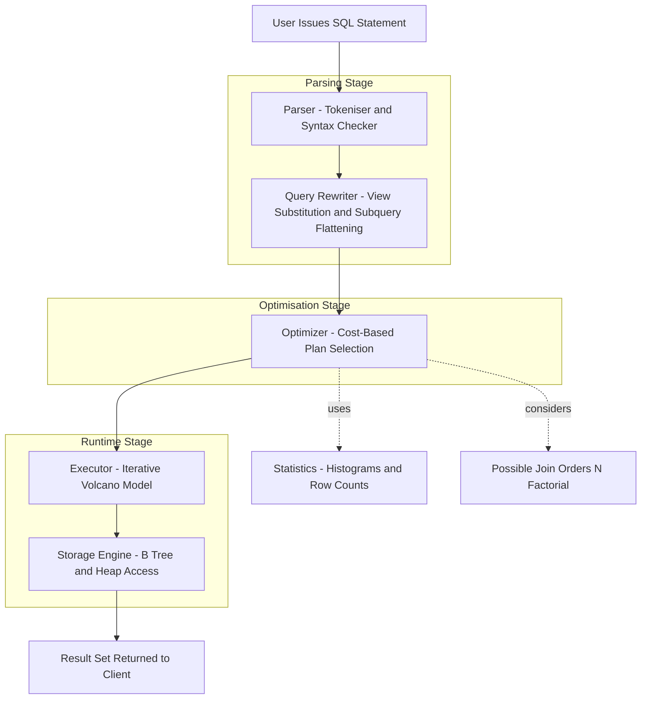
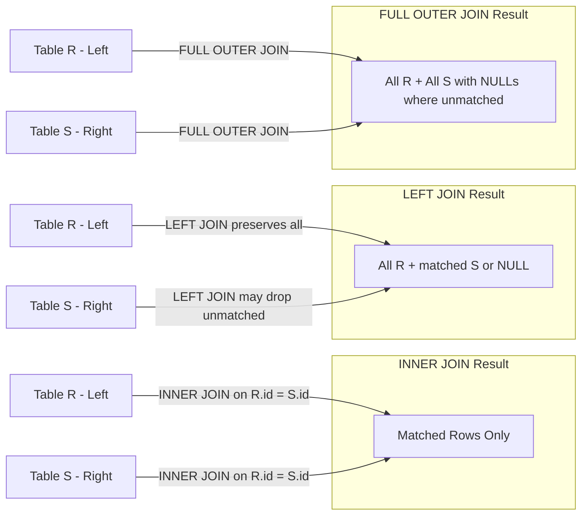
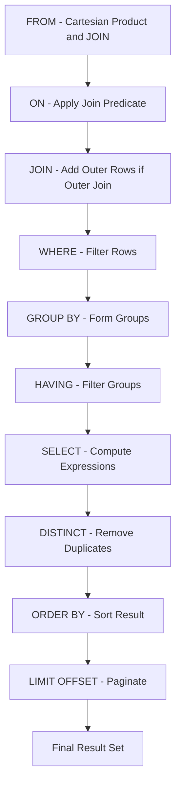
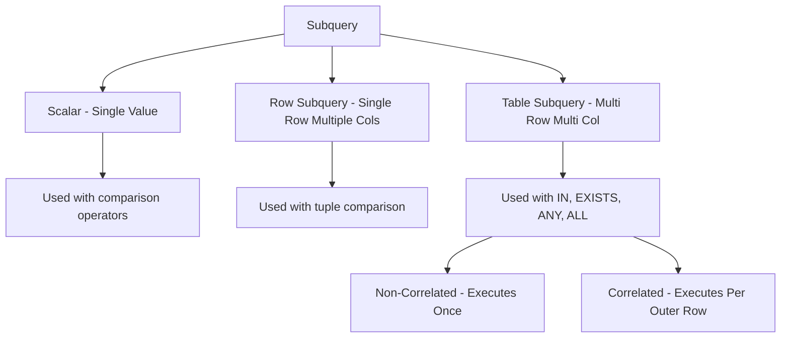

# SQL

<!-- SECTION_1_START -->
# SQL — Structured Query Language

## 1. Core Technical Definition & Intuitive Overview

### Formal Definition (KTU 2024 Syllabus Terminology)
**SQL (Structured Query Language)** is the standard declarative, domain-specific language used to **define, manipulate, retrieve, and control** data held in a **Relational Database Management System (RDBMS)**. SQL operates on the relational algebra foundation, expressing *what* data is needed rather than *how* to fetch it.

> [!IMPORTANT]
> **KTU 2024 Highlight:** SQL is **not** a procedural language — it is *declarative*. The DBMS query optimizer internally translates SQL into an execution plan (relational algebra operators like $\sigma$, $\pi$, $\bowtie$).

### SQL Sub-language Classification
| Sub-language | Full Form | Commands | Purpose |
|---|---|---|---|
| **DDL** | Data Definition Language | `CREATE`, `ALTER`, `DROP`, `TRUNCATE`, `RENAME` | Define/modify schema |
| **DML** | Data Manipulation Language | `INSERT`, `UPDATE`, `DELETE` | Modify table data |
| **DQL** | Data Query Language | `SELECT` | Retrieve data |
| **DCL** | Data Control Language | `GRANT`, `REVOKE` | Permissions / Access control |
| **TCL** | Transaction Control Language | `COMMIT`, `ROLLBACK`, `SAVEPOINT` | Manage transactions |

### Conceptual Analogy / Intuition
> [!NOTE]
> **Real-world Analogy — The Library Filing Cabinet**
> Imagine a giant library where books (rows) are stored in labelled cupboards (tables), each cupboard has index cards describing its drawer structure (schema). 
> - **DDL** is the *architect* who designs the cupboards. 
> - **DML** is the *librarian* who places new books, updates labels, or removes old ones. 
> - **DQL (SELECT)** is a *visitor* who asks, "Give me all mystery novels published after 2020." 
> - **DCL** decides *who* is allowed to enter the librarian's office. 
> - **TCL** ensures that if the librarian drops a stack of books mid-work, the cupboard can be restored to its pre-drop state.

### SQL Statement Properties
- SQL keywords are **case-insensitive**, but identifiers (table/column names) may be case-sensitive depending on the DBMS (e.g., **MySQL** is case-sensitive on Linux, **PostgreSQL** is case-sensitive by default).
- Statements end with a semicolon `;`.
- String literals use **single quotes** `'value'`.
- The standard ANSI-SQL date constant is `'YYYY-MM-DD'` (ISO 8601).

> [!VISUALIZATION CONTROL]
> **Concept:** SQL pipeline from user command to physical disk I/O.
> **Visualization Inputs:**
> * `User SQL: SELECT name FROM student WHERE age > 18`
> * `Parser → Optimizer (uses Statistics) → Executor → Storage Engine`
> **Visual Description:** Show a horizontal flow chart with five nodes. Highlight the optimizer as the decision-making block that chooses indexes vs. full table scan. Use this to clarify why SQL is *declarative* — the optimizer, not the programmer, picks the access path.

---

<!-- SECTION_1_END -->

<!-- SECTION_2_START -->
# 2. Deep Theoretical Analysis & KTU High-Yield Formula Sheet

## 2.1 DDL — Schema Definition

### `CREATE TABLE` — Column-Level Anatomy
A table in the relational model is a mathematical **relation**: a set of tuples sharing the same attributes. The `CREATE TABLE` statement enumerates attributes, their **data types**, and **constraints**.

**Standard SQL Data Types (KTU-mapped):**
| Category | Types | Notes |
|---|---|---|
| Numeric | `INT`, `SMALLINT`, `BIGINT`, `DECIMAL(p,s)`, `NUMERIC`, `FLOAT`, `REAL`, `DOUBLE` | `DECIMAL(7,2)` ⇒ up to 7 digits, 2 after decimal |
| Character | `CHAR(n)`, `VARCHAR(n)`, `TEXT` | `CHAR` is fixed-padded; `VARCHAR` is variable |
| Date/Time | `DATE`, `TIME`, `DATETIME`, `TIMESTAMP`, `YEAR` | `TIMESTAMP` includes timezone |
| Boolean | `BOOLEAN` (true/false) | Stored as 1 byte in most engines |
| Binary | `BLOB`, `BINARY`, `VARBINARY` | For images, files |

### Integrity Constraints
| Constraint | Purpose | Example |
|---|---|---|
| `PRIMARY KEY` | Uniquely identifies a row; not NULL | `roll_no INT PRIMARY KEY` |
| `FOREIGN KEY ... REFERENCES` | Enforces referential integrity | `dept_id INT REFERENCES dept(id)` |
| `UNIQUE` | Disallows duplicate values | `email VARCHAR(100) UNIQUE` |
| `NOT NULL` | Disallows missing values | `name VARCHAR(50) NOT NULL` |
| `CHECK` | Enforces a domain predicate | `CHECK (age >= 0 AND age <= 150)` |
| `DEFAULT` | Supplies a value when none given | `status VARCHAR(10) DEFAULT 'active'` |
| `AUTO_INCREMENT` (MySQL) / `SERIAL` (PostgreSQL) | Auto-generates sequential IDs | `id INT AUTO_INCREMENT` |

> [!IMPORTANT]
> **Referential Actions** (FK behaviour on parent update/delete):
> - `ON DELETE CASCADE` — child rows auto-deleted.
> - `ON DELETE SET NULL` — child FK becomes NULL.
> - `ON DELETE RESTRICT` — parent deletion blocked if children exist (default).
> - `ON DELETE NO ACTION` — deferred check at end of statement.

## 2.2 DML — Data Manipulation

### `INSERT`
Adds new rows to a table.
- **Implicit column form:** `INSERT INTO table VALUES (v1, v2, ...)` — values must match column count and order.
- **Explicit column form (preferred):** `INSERT INTO table (c1, c2) VALUES (v1, v2)`.

### `UPDATE`
Modifies existing rows. **Always pair with a `WHERE` clause** to avoid updating every row in the table.
$$ \text{UPDATE} \; R \; \text{SET} \; A_i = v_i \; \text{WHERE} \; \sigma_{\text{predicate}}(R) $$

### `DELETE`
Removes rows (use `TRUNCATE` to drop all rows faster; `TRUNCATE` is DDL and cannot be rolled back in MySQL).
$$ \text{DELETE FROM} \; R \; \text{WHERE} \; \sigma_{\text{predicate}}(R) $$

## 2.3 DQL — The `SELECT` Statement

The full syntactic shape:
$$ \text{SELECT} \; [DISTINCT] \; \text{column-list} \; \text{FROM} \; \text{table-list} \; [\text{WHERE} \; \text{predicate}] \; [\text{GROUP BY} \; \text{cols}] \; [\text{HAVING} \; \text{predicate}] \; [\text{ORDER BY} \; \text{cols} \; [\text{ASC} \mid \text{DESC}]] \; [\text{LIMIT} \; n] $$

**Logical execution order** (this is *not* the written order, but the order the DBMS evaluates):
1. `FROM` (with `JOIN`s) — choose and combine tables.
2. `WHERE` — filter individual rows.
3. `GROUP BY` — collapse rows into groups.
4. `HAVING` — filter groups.
5. `SELECT` — compute expressions / choose columns.
6. `DISTINCT` — remove duplicates.
7. `ORDER BY` — sort.
8. `LIMIT / OFFSET` — paginate.

> [!NOTE]
> **KTU favourite question:** "Why can't an alias from SELECT be used in WHERE?" — *Because WHERE runs **before** SELECT. Use HAVING or wrap the query as a subquery.*

## 2.4 Joins (Relational Algebra $\bowtie$)
| Join Type | Returns |
|---|---|
| `INNER JOIN` | Rows that have matching values in **both** tables. |
| `LEFT OUTER JOIN` | All rows from left + matched rows from right (NULLs if no match). |
| `RIGHT OUTER JOIN` | Mirror of LEFT. |
| `FULL OUTER JOIN` | All rows from both; NULLs where no match. |
| `CROSS JOIN` | Cartesian product $R \times S$. |
| `SELF JOIN` | A table joined to itself (use aliases). |
| `NATURAL JOIN` | Auto-joins on columns with the same name. |

**Theta-join predicate** (relational algebra form):
$$ R \bowtie_{\theta} S = \sigma_{\theta}(R \times S) $$

## 2.5 Aggregate / Group Functions
- `COUNT(*)`, `COUNT(col)`, `SUM(col)`, `AVG(col)`, `MIN(col)`, `MAX(col)`.
- `NULL` values are **ignored** by all aggregates except `COUNT(*)`.
- Use `GROUP BY` to partition rows; use `HAVING` to filter groups.

## 2.6 Subqueries
- **Scalar subquery** — returns a single value, can appear in `SELECT`/`WHERE`.
- **Correlated subquery** — references an outer query column; evaluated per row.
- **Non-correlated subquery** — independent of outer query; evaluated once.
- Operators: `IN`, `NOT IN`, `EXISTS`, `NOT EXISTS`, `ANY`, `ALL`, comparison operators.

## 2.7 Views
A **view** is a stored `SELECT` query acting as a virtual table. It does not store data (unless *materialized*). Views provide:
- Security (column/row-level access restriction).
- Logical data independence.
- Query simplification.

## 2.8 Indexes
An **index** is a separate data structure (typically B+ Tree) that accelerates look-ups at the cost of extra storage and slower writes (`INSERT`/`UPDATE`/`DELETE` must update the index).

| Index Type | Allows Duplicates | NULLs |
|---|---|---|
| `PRIMARY KEY` | No | No |
| `UNIQUE` | No | Yes (typically one NULL) |
| Non-unique (regular) | Yes | Yes |
| `FULLTEXT` | Yes | Used for text search |
| Composite | Defined on multiple columns | Follows leftmost-prefix rule |

---

## KTU Formula Sheet / Cheat Sheet

| Concept | SQL Construct | Notes |
|---|---|---|
| Define table | `CREATE TABLE` | DDL |
| Modify schema | `ALTER TABLE ... ADD/DROP/MODIFY` | DDL |
| Remove table | `DROP TABLE` | Cannot be rolled back in most engines |
| Insert | `INSERT INTO ... VALUES (...)` | DML |
| Update | `UPDATE ... SET ... WHERE ...` | DML |
| Delete | `DELETE FROM ... WHERE ...` | DML |
| Query | `SELECT ... FROM ... WHERE ...` | DQL |
| Sort | `ORDER BY col [ASC/DESC]` | After SELECT |
| Group | `GROUP BY col` | Precedes HAVING |
| Filter groups | `HAVING predicate` | After GROUP BY |
| Limit rows | `LIMIT n OFFSET m` | MySQL/PostgreSQL syntax |
| Inner join | `A INNER JOIN B ON A.x = B.y` | Default join type |
| Left join | `A LEFT JOIN B ON ...` | All A rows preserved |
| Aggregate | `COUNT, SUM, AVG, MIN, MAX` | NULLs ignored except `COUNT(*)` |
| Subquery | `(SELECT ... FROM ...)` | Nested query |
| Permission | `GRANT SELECT ON db.* TO 'user'@'host'` | DCL |
| Transaction | `START TRANSACTION; ... COMMIT;` | TCL |

### Real-world Utility
> [!NOTE]
> **Engineering & Industry Context:**
> - **Backend web apps** (Node.js/Express, Django, Spring) build SQL via **ORMs** (Sequelize, SQLAlchemy, Hibernate) which generate SQL under the hood. 
> - **Analytics** uses SQL over data warehouses (Snowflake, BigQuery, Redshift). 
> - **Reporting** tools (Tableau, Power BI) translate GUI filters to SQL. 
> - **ACID** transactions in SQL underpin banking ledgers, inventory systems, and reservation engines (e.g., IRCTC, BookMyShow).

---

<!-- SECTION_2_END -->

<!-- SECTION_3_START -->
# 3. Step-by-Step Derivations & Code/Symbolic Implementation

## 3.1 Worked Example: Library Management Schema

Consider a library database with three tables:

**Step 1 — Define the `BOOK` table (DDL):**
```sql
CREATE TABLE book (
    book_id     INT             PRIMARY KEY AUTO_INCREMENT,
    title       VARCHAR(200)    NOT NULL,
    author      VARCHAR(100)    NOT NULL,
    price       DECIMAL(7,2)    CHECK (price >= 0),
    pub_date    DATE            DEFAULT (CURRENT_DATE),
    isbn        VARCHAR(13)     UNIQUE
);
```

**Step 2 — Define the `MEMBER` table:**
```sql
CREATE TABLE member (
    member_id   INT             PRIMARY KEY,
    name        VARCHAR(80)     NOT NULL,
    email       VARCHAR(100)    UNIQUE,
    join_date   DATE            NOT NULL
);
```

**Step 3 — Define the `ISSUE` table with foreign keys:**
```sql
CREATE TABLE issue (
    issue_id    INT             PRIMARY KEY AUTO_INCREMENT,
    book_id     INT             NOT NULL,
    member_id   INT             NOT NULL,
    issue_date  DATE            NOT NULL,
    return_date DATE,
    FOREIGN KEY (book_id)   REFERENCES book(book_id)     ON DELETE CASCADE,
    FOREIGN KEY (member_id) REFERENCES member(member_id) ON DELETE RESTRICT
);
```

**Step 4 — Insert sample data (DML):**
```sql
INSERT INTO book (title, author, price, isbn)
VALUES ('Database System Concepts', 'Korth', 650.00, '9780073525223'),
       ('Clean Code', 'Robert Martin', 450.00, '9780132350884');

INSERT INTO member VALUES
    (101, 'Anjali Krishna', 'anjali@ktu.in', '2024-08-01'),
    (102, 'Rahul Dev', 'rahul@ktu.in', '2024-08-15');

INSERT INTO issue (book_id, member_id, issue_date)
VALUES (1, 101, '2024-09-10'),
       (2, 102, '2024-09-12');
```

## 3.2 Query Derivations

### Q1: List all members who issued *Database System Concepts*.
**Step-by-step logical flow:**
1. Identify target table(s) for output columns — `member.name` → table `member`.
2. Identify filter source — `book.title = 'Database System Concepts'` → table `book`.
3. Identify bridge — `issue` table holds both FK references.
4. Join `member → issue → book` using FKs.
5. Apply predicate on `book.title`.

```sql
SELECT m.name
FROM   member m
JOIN   issue  i ON m.member_id = i.member_id
JOIN   book   b ON i.book_id   = b.book_id
WHERE  b.title = 'Database System Concepts';
```

**Algebraic form:**
$$ \pi_{m.name}\big(\sigma_{b.title = \text{'DSC'}}( member \bowtie_{m.id = i.mid} issue \bowtie_{b.id = i.bid} book )\big) $$

### Q2: For each book, show how many times it has been issued.
**Logical steps:**
1. Group by `book_id`.
2. Apply aggregate `COUNT`.
3. Join with `book` to fetch the title.
4. Use `LEFT JOIN` so books never issued show `0`.

```sql
SELECT  b.book_id,
        b.title,
        COUNT(i.issue_id) AS issue_count
FROM    book b
LEFT JOIN issue i ON b.book_id = i.book_id
GROUP BY b.book_id, b.title
ORDER BY issue_count DESC;
```

**Incremental valuation key (for 7-mark question):**
- Correct use of `LEFT JOIN` (so books with zero issues appear) — **2 marks**.
- Correct `GROUP BY` columns matching non-aggregated SELECT list — **2 marks**.
- Use of `COUNT(i.issue_id)` instead of `COUNT(*)` (the latter would count rows even when issue is NULL) — **1 mark**.
- `ORDER BY` and proper aliasing — **2 marks**.

### Q3: Find members who issued more than one book (subquery form).
```sql
SELECT name
FROM   member
WHERE  member_id IN (
        SELECT member_id
        FROM   issue
        GROUP BY member_id
        HAVING COUNT(*) > 1
);
```

**Alternative — Correlated subquery (row-by-row evaluation):**
```sql
SELECT m.name
FROM   member m
WHERE  (SELECT COUNT(*)
        FROM issue i
        WHERE i.member_id = m.member_id) > 1;
```

### Q4: Find books priced above the average price (scalar subquery).
```sql
SELECT title, price
FROM   book
WHERE  price > (SELECT AVG(price) FROM book);
```

### Q5: Top 3 most expensive books using `LIMIT`.
```sql
SELECT title, price
FROM   book
ORDER BY price DESC
LIMIT 3;
```

## 3.3 Python ↔ SQL Integration (Web Programming Context)

A KTU SPA stack typically uses **Node.js + Express + MySQL** or **Python + Flask/Django + SQLite/MySQL**.

### Python `sqlite3` (built-in, no install)
```python
import sqlite3
import logging
from typing import Optional, List, Tuple

logging.basicConfig(level=logging.INFO,
                    format="%(asctime)s [%(levelname)s] %(message)s")

def get_connection(db_path: str) -> sqlite3.Connection:
    """Return a SQLite connection with row-factory enabled."""
    try:
        conn = sqlite3.connect(db_path)
        conn.row_factory = sqlite3.Row
        return conn
    except sqlite3.Error as e:
        logging.error(f"Connection failed: {e}")
        raise

def fetch_books_above_price(conn: sqlite3.Connection,
                            threshold: float) -> List[Tuple[str, float]]:
    """Return list of (title, price) tuples where price > threshold."""
    if threshold < 0:
        raise ValueError("threshold must be non-negative")
    query = "SELECT title, price FROM book WHERE price > ? ORDER BY price DESC;"
    try:
        cur = conn.execute(query, (threshold,))
        rows = cur.fetchall()
        return [(row["title"], row["price"]) for row in rows]
    except sqlite3.Error as e:
        logging.error(f"Query failed: {e}")
        return []

# ---- Demonstration ----
if __name__ == "__main__":
    conn = get_connection("library.db")
    expensive_books = fetch_books_above_price(conn, 500.00)
    for title, price in expensive_books:
        print(f"{title:40s} ₹{price:.2f}")
    conn.close()
```

### Node.js (Express + mysql2)
```javascript
// db.js
const mysql = require('mysql2/promise');

const pool = mysql.createPool({
    host: 'localhost',
    user: 'root',
    password: 'secret',
    database: 'library',
    waitForConnections: true,
    connectionLimit: 10
});

async function getBooksAbovePrice(threshold) {
    if (typeof threshold !== 'number' || threshold < 0) {
        throw new Error('threshold must be a non-negative number');
    }
    const [rows] = await pool.execute(
        'SELECT title, price FROM book WHERE price > ? ORDER BY price DESC',
        [threshold]
    );
    return rows;
}

module.exports = { getBooksAbovePrice };
```

> [!IMPORTANT]
> **Always use parameterised queries** (`?` placeholders) — never string-concatenate user input. This prevents **SQL Injection** attacks, a frequently tested KTU concept.

## 3.4 Index Creation Example
```sql
-- B-Tree index on author (speeds up WHERE author = '...' and ORDER BY author)
CREATE INDEX idx_book_author ON book(author);

-- Composite index following leftmost-prefix rule
CREATE INDEX idx_issue_member_date ON issue(member_id, issue_date);

-- Drop an index
DROP INDEX idx_book_author ON book;
```

**Decision rule:** Index columns used in `WHERE`, `JOIN ... ON`, and `ORDER BY` — but **not** columns with very low cardinality (e.g., boolean) and **not** small tables.

---

<!-- SECTION_3_END -->

<!-- SECTION_4_START -->
# 4. Structural Diagrams & Schematics

## 4.1 Logical SQL Execution Pipeline



## 4.2 JOIN Operation Topology



## 4.3 SELECT Logical Processing Order



## 4.4 Subquery Classification Matrix

| Subquery Type | Returns | Correlated? | Typical Operator |
|---|---|---|---|
| Scalar | One value | No | `=`, `>`, `<` |
| Single-row | One row | No | `=`, `IN` |
| Multi-row | Many rows | No | `IN`, `ANY`, `ALL` |
| Correlated | Depends on outer | **Yes** | `EXISTS` |
| Derived Table | Virtual table | No | Used in `FROM` clause |
| CTE (`WITH`) | Named virtual table | Optional | Used as building block |



---

<!-- SECTION_4_END -->

<!-- SECTION_5_START -->
# 5. KTU 2024 Scheme Examination Question Bank & Topic Recap

---

## Part A — 3 Mark Questions (Short Answer)

### Q1. `[KTU University Exam — July 2024]`  (CO1, Remember)
**Differentiate between DDL and DML in SQL. Give one example command for each.**

**Model Answer (Valuation Key):**
- **DDL (Data Definition Language):** Defines or alters the *structure* (schema) of database objects such as tables, indexes, and views. Auto-committed in most DBMS. **Example:** `CREATE TABLE student (id INT PRIMARY KEY, name VARCHAR(50));`
- **DML (Data Manipulation Language):** Manages *data* inside existing schema objects. Can be rolled back within a transaction. **Example:** `INSERT INTO student VALUES (1, 'Anjali');`
- [Stating correct distinction: 2 Marks; Correct examples: 1 Mark]

---

### Q2. `[KTU University Exam — Dec 2023]`  (CO1, Understand)
**What is the purpose of the `FOREIGN KEY` constraint? Explain with an example.**

**Model Answer:**
- A `FOREIGN KEY` enforces **referential integrity** — it ensures that a value in a child table's column must either match a value in the parent table's primary key column or be `NULL`.
- This prevents orphan records and maintains logical consistency between related tables.
- **Example:** `member_id INT REFERENCES member(member_id)` in an `issue` table guarantees every `issue` row references an existing `member`.
- [Defining referential integrity: 2 Marks; Example with FK syntax: 1 Mark]

---

## Part B — 14 Mark Questions (Module Internal Choice)

### Question A `[KTU University Exam — July 2024]`  (CO2, Apply + Analyse)

**(a)** Consider the following `EMPLOYEE` table:

| emp_id | name  | dept  | salary  | join_date |
|---|---|---|---|---|
| 1 | Anu | HR | 40000 | 2021-05-10 |
| 2 | Binu | IT | 55000 | 2020-03-15 |
| 3 | Chinu | IT | 60000 | 2019-07-21 |
| 4 | Dinu | HR | 45000 | 2022-01-05 |
| 5 | Esha | Finance | 70000 | 2018-09-12 |

Write SQL queries to:
1. Display the name and salary of employees in the IT department earning more than 50000, ordered by salary descending.
2. Find the average salary per department, but only include departments whose average salary exceeds 50000.
3. Insert a new employee `('Fathima', 'Finance', 72000, '2023-06-01')` with emp_id 6.
4. Add a column `email VARCHAR(100)` to the table.

**Model Answer:**

**(a.1) IT employees earning more than 50000 (sorted):**
```sql
SELECT name, salary
FROM   employee
WHERE  dept = 'IT' AND salary > 50000
ORDER  BY salary DESC;
```
*Valuation:* [Correct WHERE with AND: 1 M; ORDER BY DESC: 1 M → Total 2]

**(a.2) Average salary per department > 50000:**
```sql
SELECT dept, AVG(salary) AS avg_sal
FROM   employee
GROUP  BY dept
HAVING AVG(salary) > 50000;
```
*Valuation:* [GROUP BY: 1 M; HAVING with aggregate: 1 M; Aliasing: 1 M → Total 3]

**(a.3) Insert new employee:**
```sql
INSERT INTO employee (emp_id, name, dept, salary, join_date)
VALUES (6, 'Fathima', 'Finance', 72000, '2023-06-01');
```
*Valuation:* [Explicit column list: 1 M; Values match: 1 M → Total 2]

**(a.4) Add email column:**
```sql
ALTER TABLE employee
ADD COLUMN email VARCHAR(100);
```
*Valuation:* [Correct ALTER syntax: 1 M → Total 1]

**Total Part (a): 7 Marks**

---

**(b)** Explain the differences among `INNER JOIN`, `LEFT JOIN`, and `FULL OUTER JOIN` with a suitable example. Construct a `STUDENT` and `COURSE` table and write a query using each join type.

**Model Answer:**

- **INNER JOIN:** Returns only rows where the join condition matches in **both** tables. Non-matching rows are dropped.
- **LEFT JOIN (LEFT OUTER JOIN):** Returns **all** rows from the left table; for non-matching right rows, columns are filled with `NULL`.
- **FULL OUTER JOIN:** Returns **all** rows from both tables, with `NULL` filling where no match exists. *(Not supported in MySQL — emulated via `UNION` of LEFT and RIGHT.)*

**Schema:**
```sql
CREATE TABLE student (
    sid  INT PRIMARY KEY,
    sname VARCHAR(50)
);

CREATE TABLE course (
    cid  INT PRIMARY KEY,
    cname VARCHAR(50),
    sid  INT REFERENCES student(sid)
);
```

**Sample data:**
- `student`: (1, Anu), (2, Binu), (3, Chinu)
- `course`: (101, DBMS, 1), (102, OS, 2), (103, AI, 4) — note: sid 4 has no matching student.

**Queries:**
```sql
-- INNER JOIN
SELECT s.sname, c.cname
FROM   student s
INNER JOIN course c ON s.sid = c.sid;

-- LEFT JOIN
SELECT s.sname, c.cname
FROM   student s
LEFT JOIN course c ON s.sid = c.sid;

-- FULL OUTER JOIN (PostgreSQL / Oracle)
SELECT s.sname, c.cname
FROM   student s
FULL OUTER JOIN course c ON s.sid = c.sid;
```
*Valuation:*
- [Defining all three join types: 3 Marks]
- [Schema creation with FK: 2 Marks]
- [Three working queries: 2 Marks]

**Total Part (b): 7 Marks**

**Total Question A: 14 Marks**

---

### Question B `[KTU University Exam — Dec 2023]`  (CO3, Apply + Analyse)

**(a)** Consider a database with tables `ORDERS(oid, cust_id, amount, order_date)` and `CUSTOMER(cid, cname, city)`. Write SQL queries to:
1. Display customer name and total order amount for each customer.
2. Display customer names who have **not** placed any order.
3. List the top 2 customers by total amount spent.
4. Create a view `v_high_value` of customers whose total spending exceeds 10000.

**Model Answer:**

**(a.1) Total order amount per customer:**
```sql
SELECT  c.cname, SUM(o.amount) AS total_amount
FROM    customer c
LEFT JOIN orders o ON c.cid = o.cust_id
GROUP BY c.cid, c.cname;
```
*Valuation:* [JOIN choice: 1 M; GROUP BY: 1 M; SUM: 1 M → 3]

**(a.2) Customers with no orders:**
```sql
SELECT cname
FROM   customer
WHERE  cid NOT IN (SELECT cust_id FROM orders);
```
*Valuation:* [NOT IN subquery: 2 M]

**(a.3) Top 2 customers by total amount:**
```sql
SELECT  c.cname, SUM(o.amount) AS total_amount
FROM    customer c
JOIN     orders o ON c.cid = o.cust_id
GROUP BY c.cid, c.cname
ORDER BY total_amount DESC
LIMIT 2;
```
*Valuation:* [Aggregation + sort: 1 M; LIMIT 2: 1 M → 2]

**(a.4) View creation:**
```sql
CREATE VIEW v_high_value AS
SELECT  c.cid, c.cname, SUM(o.amount) AS total_spent
FROM    customer c
JOIN     orders o ON c.cid = o.cust_id
GROUP BY c.cid, c.cname
HAVING SUM(o.amount) > 10000;
```
*Valuation:* [Correct view definition with HAVING: 1 M]

**Total Part (a): 7 Marks**

---

**(b)** Discuss the **ACID** properties of SQL transactions with an example of a money-transfer operation. Write a `START TRANSACTION` block that transfers ₹5000 from account A101 to A102, ensuring all properties are satisfied.

**Model Answer:**

**ACID Properties:**
| Property | Meaning |
|---|---|
| **Atomicity** | All operations in a transaction succeed, or none do. |
| **Consistency** | DB moves from one valid state to another; constraints are preserved. |
| **Isolation** | Concurrent transactions do not interfere with each other. |
| **Durability** | Committed data survives crashes (written to non-volatile storage). |

**SQL Block:**
```sql
START TRANSACTION;

UPDATE account SET balance = balance - 5000 WHERE acc_no = 'A101';
UPDATE account SET balance = balance + 5000 WHERE acc_no = 'A102';

-- Check for errors
-- If everything OK:
COMMIT;
-- Else:
-- ROLLBACK;
```
*Valuation:*
- [Defining all 4 ACID properties in a table: 4 Marks]
- [Correct START TRANSACTION ... COMMIT block: 2 Marks]
- [Mentioning ROLLBACK on failure: 1 Mark]

**Total Part (b): 7 Marks**

**Total Question B: 14 Marks**

---

> [!WARNING]
> **KTU Examiner's Valuation Warning / Pitfall Callout**
> - **Aliasing in `GROUP BY`:** A column alias defined in `SELECT` (e.g., `total_amount`) **cannot** be used in `WHERE`. It can be used in `ORDER BY` and `HAVING`. Many students lose marks by writing `WHERE total_amount > 10000`.
> - **Forgetting `WHERE` in `UPDATE` / `DELETE`:** This silently modifies or removes *all* rows. Always include a `WHERE` clause.
> - **`COUNT(*)` vs `COUNT(col)`:** When counting rows that may have NULLs, `COUNT(col)` ignores NULLs; `COUNT(*)` counts the row regardless. KTU questions often test this distinction.
> - **String quotes:** Use single quotes `'value'` in SQL, not double quotes (those are for identifiers in standard SQL).
> - **Truncate vs Delete:** `TRUNCATE` is DDL, cannot be rolled back, and resets auto-increment. `DELETE` is DML, can be rolled back, and does not reset auto-increment.
> - **Foreign key data type mismatch:** Both the column and the referenced column must be of the **same data type** (or implicitly convertible).

---

## Topic Recap & Important Things to Remember

- **SQL is declarative** — describe *what* you want, not *how* to get it.
- Five sub-languages: **DDL, DML, DQL, DCL, TCL**.
- **Logical SELECT order** ≠ written order: FROM → WHERE → GROUP BY → HAVING → SELECT → DISTINCT → ORDER BY → LIMIT.
- **Constraints:** PRIMARY KEY, FOREIGN KEY, UNIQUE, NOT NULL, CHECK, DEFAULT.
- **Referential actions:** CASCADE, SET NULL, RESTRICT, NO ACTION.
- **JOIN types:** INNER, LEFT, RIGHT, FULL, CROSS, SELF, NATURAL.
- **Aggregates** (SUM, AVG, MIN, MAX, COUNT) ignore NULLs except `COUNT(*)`.
- **HAVING filters groups**; **WHERE filters rows** before grouping.
- **Subquery operators:** `IN`, `EXISTS`, `ANY`, `ALL`; correlated subqueries depend on the outer query.
- **Views** are virtual tables; no data stored (unless materialized).
- **Indexes** (B+ Tree by default) speed reads, slow writes, consume storage.
- **ACID:** Atomicity, Consistency, Isolation, Durability — enforced by transactions (`COMMIT` / `ROLLBACK`).
- **SQL Injection prevention:** always use parameterised queries — never concatenate user input.
- **LIKE wildcards:** `%` matches zero or more characters, `_` matches exactly one character.
- **NULL handling:** `IS NULL` / `IS NOT NULL` (not `= NULL`); use `COALESCE(a, b)` to substitute defaults.
- **Common functions:** `UPPER`, `LOWER`, `LENGTH`, `SUBSTR`, `ROUND`, `NOW`, `DATEDIFF`, `IFNULL`, `CASE WHEN ... THEN ... END`.
- **Pagination:** `LIMIT n OFFSET m` (MySQL/PostgreSQL); `OFFSET n ROWS FETCH NEXT m ROWS ONLY` (SQL Server / Oracle 12c+).

---

<!-- SECTION_5_END -->
