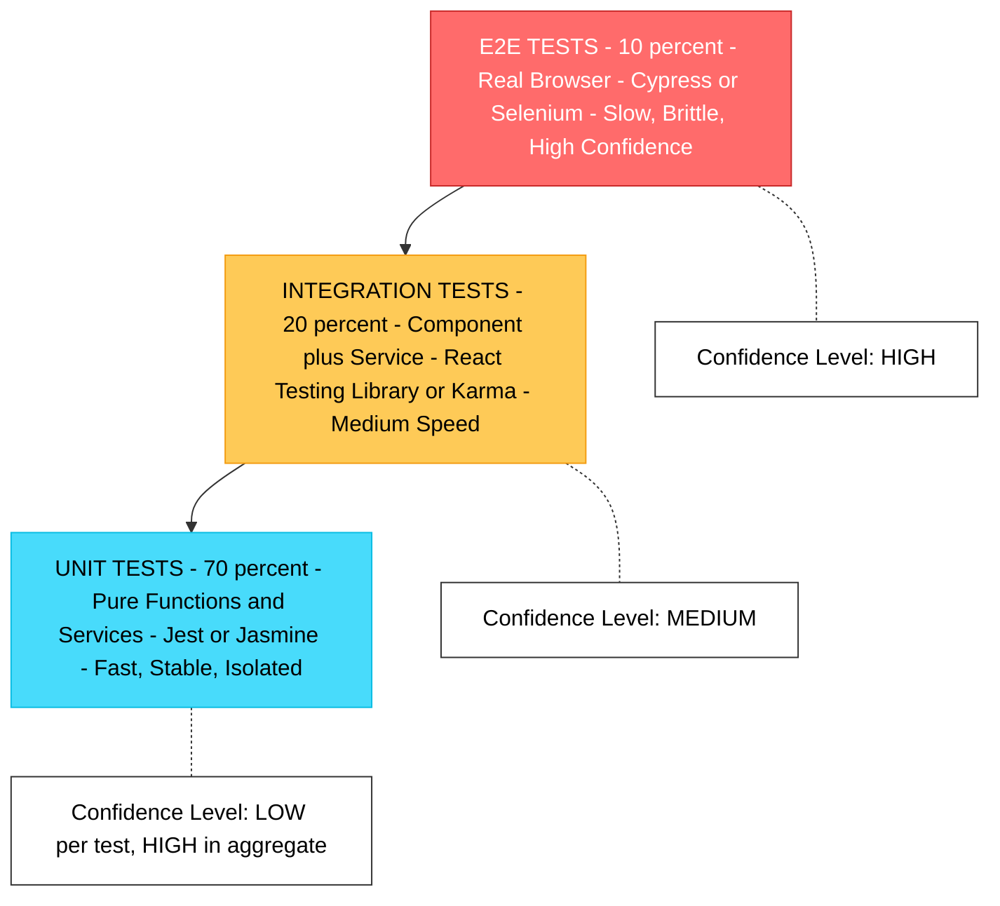
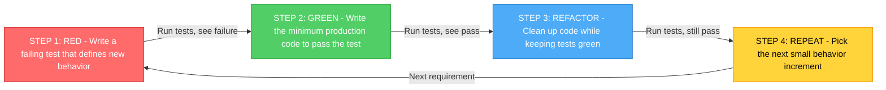
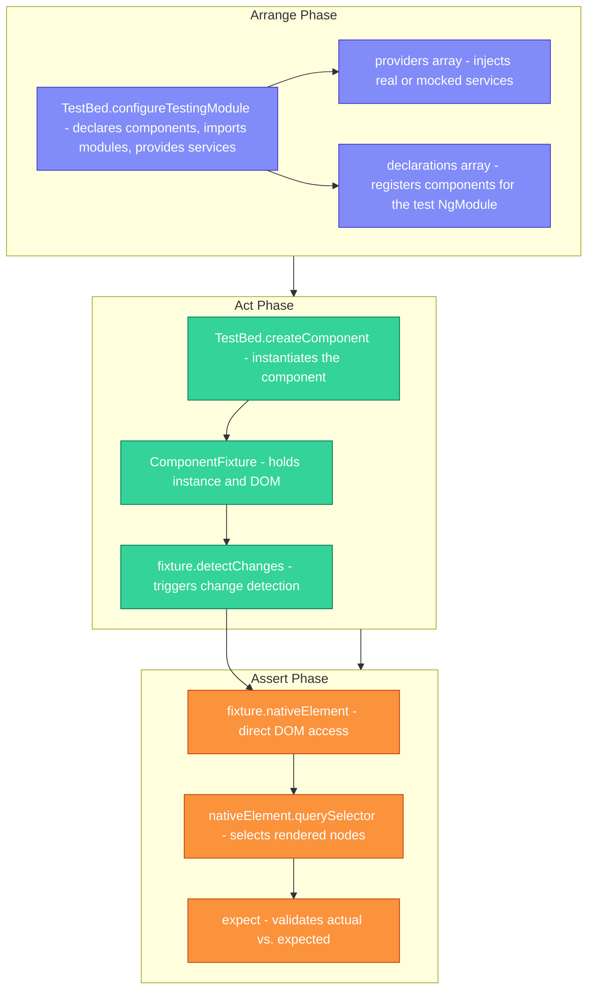

# Testing

<!-- SECTION_1_START -->

# 🧪 Testing in Single Page Applications (SPA)

> [!IMPORTANT]
> **KTU 2024 Scheme | PECST742 Web Programming | Module 4 — SPA Basics**
> This module deals with ensuring the **reliability, correctness, and robustness** of SPAs through automated testing methodologies, frameworks, and testing pyramids adopted in modern front-end engineering.

---

## 1.1 Formal Academic Definition

> [!NOTE]
> **Definition (KTU Syllabus Standard)**
> **Testing** in the context of Single Page Applications is the systematic process of **verifying** and **validating** that each functional unit, module, and complete user-flow of an SPA behaves exactly as specified. It involves writing executable assertions (test cases) that exercise components, services, and DOM-rendered output in **isolation (Unit Testing)**, in **collaboration (Integration Testing)**, and through **simulated user journeys (End-to-End Testing)** — all executed by automated test runners such as **Jasmine**, **Karma**, **Jest**, or **Cypress**.

In the KTU 2024 NEP-aligned outcome-based framework, testing is treated as a **first-class engineering discipline**, not a post-development activity. SPAs amplify the need for testing because:

- The entire application runs inside a **single HTML document** with dynamic DOM manipulation.
- State is managed client-side (often via stores like **Redux**, **NgRx**, or **Vuex**), making regressions harder to detect manually.
- Routing, lazy loading, and asynchronous data fetching introduce complex **non-deterministic** execution paths.

---

## 1.2 Intuitive Analogy — The Car Factory Quality Gate

Imagine an automobile assembly line. Before a car leaves the factory, it passes through **three quality gates**:

1. **Component Gate** — Every individual part (brake, headlight, engine bolt) is tested on its own. *(This is **Unit Testing**.)*
2. **Sub-Assembly Gate** — The engine is mounted into the chassis and tested for vibration alignment. *(This is **Integration Testing**.)*
3. **Road Test Gate** — A driver takes the fully-built car on a highway to ensure everything works together as a real user would experience it. *(This is **End-to-End / E2E Testing**.)*

Similarly, in an SPA:

- A **button component** is unit-tested for click behavior.
- A **login form** + **auth service** is integration-tested for token exchange.
- A **complete purchase flow** (browse → add to cart → checkout → payment) is E2E-tested with Cypress.

> [!TIP]
> **Engineering Insight:** Just as a car manufacturer wouldn't ship a car without quality gates, a KTU-caliber web engineer never ships an SPA without a **test pyramid** in place. The proportion of tests should follow the **70/20/10 rule**: 70% unit, 20% integration, 10% E2E.

---

## 1.3 The Three Pillars of SPA Testing

| Pillar | Scope | Tools (KTU 2024 Context) | Speed |
|---|---|---|---|
| **Unit Testing** | Single functions, components, services | **Jasmine**, **Jest**, **Mocha** | ⚡ Fastest (ms) |
| **Integration Testing** | Component + service, module interactions | **Jasmine + Karma** (Angular), **React Testing Library** | ⚡ Fast (s) |
| **End-to-End (E2E) Testing** | Full user journey in a real browser | **Cypress**, **Selenium**, **Protractor (deprecated)** | 🐢 Slow (min) |

> [!WARNING]
> **KTU Pitfall:** Students often confuse **Integration Testing** with **E2E Testing**. Remember: Integration tests run inside a *headless* or *JSDOM* environment with **mocked HTTP**, while E2E tests drive a **real browser** with **real network calls**.

---

## 1.4 Core Terminology (Mandatory for KTU Viva)

- **Test Spec / Test Case** — A single executable assertion block written using `it(...)` or `test(...)`.
- **Test Suite** — A collection of related specs grouped via `describe(...)`.
- **Assertion** — A boolean expression that the test runner evaluates; failure throws an error.
- **Mock** — A simulated object that replaces a real dependency (e.g., replacing `HttpClient` with a stub).
- **Spy** — A function that records how it was called (arguments, call count) without altering behavior.
- **Stub** — A function with predefined return values used to isolate the unit under test.
- **Test Runner** — The execution engine that discovers, runs, and reports test results (Karma, Jest CLI).
- **Coverage** — The percentage of source code lines/branches exercised by the test suite.

> [!VISUALIZATION CONTROL]
> **Concept:** Test Pyramid (Inverse Cost vs. Quantity Relationship)
> **Conceptual Axes:** X-axis = Number of Tests, Y-axis = Speed of Execution
> **Visual Description:** A triangular pyramid with a wide **Unit Testing** base (large, fast, cheap), a narrower **Integration Testing** middle, and a pointed **E2E Testing** apex (few, slow, expensive). The pyramid is **inverted in cost**: the apex is the most expensive layer to maintain, even though it has the fewest tests.
> *Reference Model: Mike Cohn's Test Pyramid adapted for SPAs.*

<!-- SECTION_1_END -->

<!-- SECTION_2_START -->

# 📐 Deep Theoretical Analysis & KTU High-Yield Formula Sheet

---

## 2.1 Anatomy of a Test Case (AAA Pattern)

Every KTU-quality test case — regardless of framework — follows the **AAA (Arrange-Act-Assert)** pattern, derived from xUnit best practices:

| Phase | Purpose | KTU Term |
|---|---|---|
| **Arrange** | Set up the test fixture: instantiate components, inject mocks, prepare inputs. | *Test Fixture Setup* |
| **Act** | Invoke the unit / function / method under test. | *System Under Test (SUT) Invocation* |
| **Assert** | Verify that the output, side-effects, or DOM state match the expected specification. | *Expected vs. Actual Comparison* |

> [!IMPORTANT]
> **KTU 2024 Board Note:** Examiners often award partial marks for clearly demarcating the three phases. Use blank lines or comments (`// Arrange`, `// Act`, `// Assert`) in your code answers.

---

## 2.2 The Test Pyramid — Formal Mathematical Intuition

The **Test Pyramid** is not a literal formula, but its underlying **cost-benefit relationship** can be expressed conceptually:

$$
C_{total} = \sum_{i \in \{U, I, E\}} (n_i \cdot t_i \cdot m_i)
$$

Where:

- $C_{total}$ = Total cost of the test suite (time + maintenance).
- $n_i$ = Number of tests in layer $i$ (Unit, Integration, E2E).
- $t_i$ = Average execution time per test in layer $i$.
- $m_i$ = Maintenance fragility factor for layer $i$ (higher for E2E).

**Empirical KTU-recognized values for an Angular SPA:**

| Layer | $n_i$ (proportion) | $t_i$ (avg) | $m_i$ (fragility) |
|---|---|---|---|
| Unit ($U$) | **70%** | $\approx 10$ ms | $1$ (stable) |
| Integration ($I$) | **20%** | $\approx 500$ ms | $3$ (DOM-dependent) |
| E2E ($E$) | **10%** | $\approx 30$ s | $10$ (browser/network-dependent) |

This justifies why **unit tests dominate** — they are the cheapest and fastest feedback loop.

---

## 2.3 KTU High-Yield Formula & Concept Cheat Sheet

> [!NOTE]
> The following table consolidates every conceptual "formula," matcher, and lifecycle hook you must memorize for KTU 2024 Module 4 — Testing.

| Concept / Symbol | Definition | Framework Hook | KTU Exam Weight |
|---|---|---|---|
| `describe(name, fn)` | Groups related specs into a **suite**. Can be nested. | Jasmine / Jest | ⭐⭐⭐ |
| `it(name, fn)` / `test(name, fn)` | Defines a **single spec / test case**. | Jasmine / Jest | ⭐⭐⭐ |
| `beforeEach(fn)` | Runs `fn` **before every** `it` block in the suite. | Jasmine / Jest | ⭐⭐⭐ |
| `afterEach(fn)` | Runs `fn` **after every** `it` block (cleanup). | Jasmine / Jest | ⭐⭐ |
| `beforeAll(fn)` | Runs **once** before all specs in the suite. | Jasmine / Jest | ⭐⭐ |
| `expect(actual).toBe(expected)` | Strict equality (`===`) matcher. | Jasmine / Jest | ⭐⭐⭐ |
| `expect(actual).toEqual(expected)` | Deep structural equality (recursive). | Jasmine / Jest | ⭐⭐⭐ |
| `expect(fn).toThrow(Error)` | Asserts the function throws. | Jasmine / Jest | ⭐⭐ |
| `expect(actual).toBeTruthy()` | Asserts truthy conversion. | Jasmine / Jest | ⭐ |
| `spyOn(obj, 'method')` | Wraps `obj.method` with a **spy** to track calls. | Jasmine | ⭐⭐⭐ |
| `jasmine.createSpy()` | Creates a **standalone mock function**. | Jasmine | ⭐⭐ |
| `TestBed.configureTestingModule({...})` | Configures an Angular **NgModule** for isolated testing. | Angular + Karma | ⭐⭐⭐ |
| `ComponentFixture<T>` | Wrapper for a component instance + DOM access in tests. | Angular | ⭐⭐ |
| `fixture.detectChanges()` | Triggers Angular's **change detection** cycle on the test component. | Angular | ⭐⭐⭐ |
| `cy.visit(url)` | Opens a URL in a real browser via Cypress. | Cypress | ⭐⭐ |
| `cy.get(selector)` | Queries DOM using CSS selector. | Cypress | ⭐⭐⭐ |
| `cy.contains(text)` | Finds element by visible text. | Cypress | ⭐⭐ |
| `cy.click()` / `cy.type()` | Simulates user interaction. | Cypress | ⭐⭐ |
| `Code Coverage` | $C = \frac{L_{executed}}{L_{total}} \times 100\%$ | Istanbul / Karma | ⭐⭐ |

---

## 2.4 TDD vs. BDD — The Two Engineering Philosophies

| Aspect | Test-Driven Development (**TDD**) | Behavior-Driven Development (**BDD**) |
|---|---|---|
| **Origin** | Kent Beck (2003, eXtreme Programming) | Dan North (2006) |
| **Cycle** | **Red → Green → Refactor** | **Discovery → Formulation → Automation** |
| **Focus** | Internal implementation correctness | External user-observable behavior |
| **Syntax** | Programmatic (`expect(x).toBe(y)`) | Natural language (`Given-When-Then` via Cucumber / Gherkin) |
| **Audience** | Developers | Developers + Product Owners + QA |
| **KTU Weight** | ⭐⭐⭐ | ⭐⭐ |

**TDD Cycle (Red-Green-Refactor):**

$$
\boxed{\text{Write failing test} \xrightarrow{\text{Red}} \text{Write minimum code} \xrightarrow{\text{Green}} \text{Refactor} \xrightarrow{\text{Clean}} \text{Repeat}}
$$

---

## 2.5 Why Testing Matters in SPAs — Engineering Utility

1. **Regression Prevention** — When Angular or React components are refactored, unit tests catch unintended side effects instantly.
2. **Living Documentation** — Test specs describe *what* a function does in executable form, more reliable than markdown.
3. **CI/CD Enablement** — Tests gate deployments in pipelines (Jenkins, GitHub Actions).
4. **Refactoring Confidence** — Test coverage allows safe architectural overhauls.
5. **Bug Localization** — A failing unit test pinpoints the exact line; E2E failures only indicate *symptom*.

> [!TIP]
> **Real-World SPA Production Use:** Companies like **Google (Angular)**, **Facebook (React)**, and **Netflix** mandate **>80% code coverage** on unit tests for every pull request merged into the main branch. KTU 2024 expects students to be aware of these industry standards.

<!-- SECTION_2_END -->

<!-- SECTION_3_START -->

# 🛠️ Step-by-Step Derivations, Code Implementation & Worked Examples

---

## 3.1 Worked Example 1 — Jasmine Unit Test for an Angular Service

**Problem Statement (KTU-style):**
> Write a complete **Jasmine unit test suite** for an Angular service `CalculatorService` that exposes two methods: `add(a, b)` and `divide(a, b)`. The `divide` method must throw a custom error `DivisionByZeroError` when the divisor is zero. Configure `TestBed`, inject the service, and write at least 4 specs covering both happy-path and error-path scenarios.

### Step 1 — The Service Under Test (SUT)

```typescript
// calculator.service.ts
import { Injectable } from '@angular/core';

export class DivisionByZeroError extends Error {
  constructor() {
    super('Division by zero is not allowed.');
    this.name = 'DivisionByZeroError';
  }
}

@Injectable({ providedIn: 'root' })
export class CalculatorService {
  // Arrange: Pure addition
  public add(a: number, b: number): number {
    return a + b;
  }

  // Arrange: Division with guard clause
  public divide(a: number, b: number): number {
    if (b === 0) {
      throw new DivisionByZeroError();
    }
    return a / b;
  }
}
```

### Step 2 — The Test File (Exhaustive, No Steps Skipped)

```typescript
// calculator.service.spec.ts
import { TestBed } from '@angular/core/testing';
import { CalculatorService, DivisionByZeroError } from './calculator.service';

describe('CalculatorService', () => {
  let service: CalculatorService;

  // ==========================================
  // Arrange (Test Fixture Setup)
  // ==========================================
  beforeEach(() => {
    TestBed.configureTestingModule({
      providers: [CalculatorService]
    });
    service = TestBed.inject(CalculatorService);
  });

  // -------- Spec 1: Service Instantiation --------
  it('should be created (instantiation check)', () => {
    // Act
    const instance = TestBed.inject(CalculatorService);

    // Assert
    expect(instance).toBeTruthy();
    expect(instance).toBeDefined();
  });

  // -------- Spec 2: Addition Happy Path --------
  it('should return 7 when adding 3 and 4', () => {
    // Act
    const result = service.add(3, 4);

    // Assert
    expect(result).toBe(7);
    expect(result).toEqual(7);
  });

  // -------- Spec 3: Addition Edge Case (Negatives) --------
  it('should return -5 when adding -2 and -3', () => {
    // Act
    const result = service.add(-2, -3);

    // Assert
    expect(result).toBe(-5);
  });

  // -------- Spec 4: Division Happy Path --------
  it('should return 5 when dividing 10 by 2', () => {
    // Act
    const result = service.divide(10, 2);

    // Assert
    expect(result).toBe(5);
  });

  // -------- Spec 5: Division Error Path --------
  it('should throw DivisionByZeroError when dividing by zero', () => {
    // Act + Assert combined
    expect(() => service.divide(10, 0)).toThrow(DivisionByZeroError);
    expect(() => service.divide(10, 0)).toThrow('Division by zero is not allowed.');
  });
});
```

### Step 3 — Expected Karma/Jasmine Output

```
Chrome Headless 120.0.6099: Executed 5 of 5 SUCCESS (0.045 secs / 0.038 secs)
TOTAL: 5 SUCCESS
```

> [!IMPORTANT]
> **Valuation Key Points (KTU Examiner's Eye):**
> - `[TestBed configuration: 2 Marks]`
> - `[beforeEach fixture setup: 1 Mark]`
> - `[Each meaningful spec with AAA structure: 1 Mark × 4]`
> - `[Error-path test using toThrow: 2 Marks]`
> - `[Imports & TypeScript syntax: 1 Mark]`

---

## 3.2 Worked Example 2 — Component Testing with Spies

**Problem Statement:**
> Write a Jasmine test for an Angular component `LoginComponent` that calls `AuthService.login(username, password)` on button click and displays a success message on `200 OK`. Use a **spy** to mock `AuthService.login` and verify it was called exactly once with the correct arguments.

```typescript
// auth.service.ts
import { Injectable } from '@angular/core';
import { Observable, of } from 'rxjs';

@Injectable({ providedIn: 'root' })
export class AuthService {
  public login(username: string, password: string): Observable<string> {
    // Real implementation would call HttpClient.post(...)
    return of('token-abc-123');
  }
}
```

```typescript
// login.component.ts
import { Component } from '@angular/core';
import { AuthService } from './auth.service';

@Component({
  selector: 'app-login',
  template: `
    <input #userInput type="text" placeholder="Username">
    <input #passInput type="password" placeholder="Password">
    <button (click)="onLogin(userInput.value, passInput.value)">Login</button>
    <p *ngIf="message">{{ message }}</p>
  `
})
export class LoginComponent {
  public message: string = '';

  constructor(private auth: AuthService) {}

  public onLogin(username: string, password: string): void {
    this.auth.login(username, password).subscribe((token) => {
      this.message = `Welcome, ${username}! Token: ${token}`;
    });
  }
}
```

```typescript
// login.component.spec.ts
import { ComponentFixture, TestBed } from '@angular/core/testing';
import { of } from 'rxjs';
import { LoginComponent } from './login.component';
import { AuthService } from './auth.service';

describe('LoginComponent', () => {
  let component: LoginComponent;
  let fixture: ComponentFixture<LoginComponent>;
  let authServiceSpy: jasmine.SpyObj<AuthService>;

  // Arrange
  beforeEach(() => {
    // Create a spy object with the 'login' method stubbed
    authServiceSpy = jasmine.createSpyObj<AuthService>('AuthService', ['login']);
    authServiceSpy.login.and.returnValue(of('mock-token-xyz'));

    TestBed.configureTestingModule({
      declarations: [LoginComponent],
      providers: [{ provide: AuthService, useValue: authServiceSpy }]
    });

    fixture = TestBed.createComponent(LoginComponent);
    component = fixture.componentInstance;
    fixture.detectChanges(); // triggers ngOnInit and initial binding
  });

  // Spec 1
  it('should create the component', () => {
    expect(component).toBeTruthy();
  });

  // Spec 2
  it('should call AuthService.login exactly once with provided credentials', () => {
    // Act
    component.onLogin('admin', 'pass123');

    // Assert
    expect(authServiceSpy.login).toHaveBeenCalledTimes(1);
    expect(authServiceSpy.login).toHaveBeenCalledWith('admin', 'pass123');
  });

  // Spec 3
  it('should display a welcome message upon successful login', () => {
    // Act
    component.onLogin('kavya', 'secret');
    fixture.detectChanges(); // re-render the *ngIf

    // Assert
    const compiled = fixture.nativeElement as HTMLElement;
    expect(compiled.querySelector('p')?.textContent).toContain('Welcome, kavya');
  });
});
```

---

## 3.3 Worked Example 3 — End-to-End Test with Cypress

**Problem Statement:**
> Write a Cypress E2E test that visits a to-do SPA, types "Buy milk" into the input, clicks the "Add" button, and asserts that the new item appears in the list.

```javascript
// cypress/e2e/todo.cy.js

describe('To-Do SPA — Add Item Flow', () => {

  // Hook: runs before every test
  beforeEach(() => {
    // Arrange: visit the running SPA
    cy.visit('http://localhost:4200');
  });

  it('should add a new to-do item to the list', () => {
    // Act: type into the input field
    cy.get('input[data-cy="new-todo"]')
      .type('Buy milk')
      .should('have.value', 'Buy milk');

    // Act: click the Add button
    cy.get('button[data-cy="add-btn"]').click();

    // Assert: the new item is rendered in the list
    cy.get('ul[data-cy="todo-list"] li')
      .should('have.length', 1)
      .first()
      .should('contain.text', 'Buy milk');
  });

  it('should clear the input after adding an item', () => {
    // Act
    cy.get('input[data-cy="new-todo"]').type('Read book');
    cy.get('button[data-cy="add-btn"]').click();

    // Assert
    cy.get('input[data-cy="new-todo"]').should('have.value', '');
  });
});
```

> [!NOTE]
> **Cypress vs. Selenium — KTU Distinction:** Cypress runs *inside* the browser (no WebDriver protocol), making it faster and more reliable for SPAs. Selenium WebDriver uses an out-of-process driver, which is more universal but slower and prone to flakiness on dynamic SPAs.

---

## 3.4 Step-by-Step Derivation — Code Coverage Calculation

**Scenario:** A function has **40 lines** of executable code. After running the test suite, the coverage report shows that **32 lines** were executed. Calculate the code coverage percentage.

### Step 1 — State the Formula

$$
C = \frac{L_{executed}}{L_{total}} \times 100\%
$$

### Step 2 — Substitute the Values

$$
C = \frac{32}{40} \times 100\%
$$

### Step 3 — Evaluate the Fraction

$$
\frac{32}{40} = \frac{4}{5} = 0.8
$$

### Step 4 — Convert to Percentage

$$
C = 0.8 \times 100\% = 80\%
$$

**Final Answer:** The code coverage is **80%**.

> [!TIP]
> **KTU Tip:** Coverage above **80%** is the industry gold standard. **100%** coverage does not mean zero bugs — it only means every line was *executed*, not that every *branch outcome* was verified. Use **branch coverage** metrics in Karma (`check: { statements: true, branches: true, functions: true, lines: true }`).

<!-- SECTION_3_END -->

<!-- SECTION_4_START -->

# 🗺️ Structural Diagrams, Schematics & Architecture Flow

---

## 4.1 The Test Pyramid (Visual Architecture)



---

## 4.2 The TDD Red-Green-Refactor Cycle (Sequential Process Flow)



---

## 4.3 Jasmine Test Lifecycle Hook Execution Timeline

```mermaid
graph TD
    subgraph SUITE["SUITE LIFECYCLE — describe block"]
        BA["beforeAll - Run once before any spec in this suite"]
        BE1["beforeEach - Run before Spec 1"]
        IT1["it Spec 1 - The actual test body"]
        AE1["afterEach - Run after Spec 1"]
        BE2["beforeEach - Run before Spec 2"]
        IT2["it Spec 2 - The actual test body"]
        AE2["afterEach - Run after Spec 2"]
        BE3["beforeEach - Run before Spec 3"]
        IT3["it Spec 3 - The actual test body"]
        AE3["afterEach - Run after Spec 3"]
        AA["afterAll - Run once after all specs"]
    end

    BA --> BE1 --> IT1 --> AE1 --> BE2 --> IT2 --> AE2 --> BE3 --> IT3 --> AE3 --> AA

    style BA fill:#a78bfa,stroke:#5f3dc4,color:#fff
    style BE1 fill:#60a5fa,stroke:#1d4ed8,color:#fff
    style BE2 fill:#60a5fa,stroke:#1d4ed8,color:#fff
    style BE3 fill:#60a5fa,stroke:#1d4ed8,color:#fff
    style IT1 fill:#34d399,stroke:#047857,color:#fff
    style IT2 fill:#34d399,stroke:#047857,color:#fff
    style IT3 fill:#34d399,stroke:#047857,color:#fff
    style AE1 fill:#fbbf24,stroke:#b45309,color:#000
    style AE2 fill:#fbbf24,stroke:#b45309,color:#000
    style AE3 fill:#fbbf24,stroke:#b45309,color:#000
    style AA fill:#f87171,stroke:#b91c1c,color:#fff
```



---

## 4.4 Angular TestBed Architecture (Block-Level Functional Flow)



---

## 4.5 CI/CD Testing Pipeline (Deployment-Stage Topology)

```mermaid
graph LR
    P1["Developer pushes code to Git"]
    P2["GitHub Actions or Jenkins triggers CI"]
    P3["Step 1: Lint with ESLint"]
    P4["Step 2: Run Unit Tests with Karma or Jest"]
    P5["Step 3: Run Integration Tests"]
    P6["Step 4: Build Production Bundle"]
    P7["Step 5: Run E2E Tests with Cypress"]
    P8["Step 6: Deploy to Staging then Production"]

    P1 --> P2 --> P3 --> P4 --> P5 --> P6 --> P7 --> P8
    P4 -.FAIL.-> FB["Block merge, notify developer"]
    P7 -.FAIL.-> FB

    style P1 fill:#60a5fa,stroke:#1e3a8a,color:#fff
    style P2 fill:#60a5fa,stroke:#1e3a8a,color:#fff
    style P3 fill:#a78bfa,stroke:#5b21b6,color:#fff
    style P4 fill:#34d399,stroke:#065f46,color:#fff
    style P5 fill:#34d399,stroke:#065f46,color:#fff
    style P6 fill:#fbbf24,stroke:#92400e,color:#000
    style P7 fill:#f87171,stroke:#991b1b,color:#fff
    style P8 fill:#10b981,stroke:#064e3b,color:#fff
    style FB fill:#ef4444,stroke:#7f1d1d,color:#fff
```



<!-- SECTION_4_END -->

<!-- SECTION_5_START -->

# 📝 KTU 2024 Scheme Examination Question Bank & Topic Recap

---

## 5.1 Part A — Short Answer Questions (3 Marks Each)

> **[Cognitive Levels: Remember / Understand]**

### Question A1

> **[KTU University Exam — July 2024 | CO3 | Understand]**
> Differentiate between **Unit Testing** and **Integration Testing** in the context of SPAs. Give one example of each from an Angular application.

**Model Answer (Board Key Pattern):**

| Aspect | Unit Testing | Integration Testing |
|---|---|---|
| **Scope** | Tests a single function, component, or service in **isolation**. | Tests **interaction** between multiple units (e.g., component + service). |
| **Dependencies** | All external dependencies (HttpClient, Router) are **mocked or stubbed**. | Some real dependencies may be used; mocks limited to external APIs. |
| **Speed** | Extremely fast (milliseconds). | Slower (requires component rendering). |
| **Tool** | Jasmine + Jest standalone. | Angular `TestBed` with `Karma`. |
| **Example** | Testing a `CalculatorService.add(a, b)` method alone. | Testing a `LoginComponent` that calls `AuthService.login()` and renders a message. |

**Example — Unit Test:** Testing `CalculatorService.divide(10, 2) === 5` with no DOM.

**Example — Integration Test:** Mounting `LoginComponent` in `TestBed`, clicking the button, and asserting that the spy `AuthService.login` was called with the right credentials. **[3 Marks: 1 for definition, 1 for differentiation, 1 for example]**

---

### Question A2

> **[KTU University Exam — Dec 2023 | CO3 | Remember]**
> List and briefly explain any **three lifecycle hooks** used in Jasmine test suites.

**Model Answer:**

1. **`beforeEach(fn)`** — Runs the function `fn` **before every `it` block** within the containing `describe`. Used to set up a fresh test fixture for each spec.
2. **`afterEach(fn)`** — Runs `fn` **after every `it` block**. Used to clean up resources, unsubscribe from observables, or reset global state to prevent test pollution.
3. **`beforeAll(fn)`** — Runs `fn` **only once** before all specs in the suite. Used for expensive one-time setup such as database connections or large mock data initialization. **[3 Marks: 1 per hook with its purpose]**

---

## 5.2 Part B — Long Answer Questions (14 Marks Each)

> **Internal Choice: Answer ANY ONE — Question A OR Question B**
> **Each sub-part: 7 Marks | Escalating Cognitive Levels**

---

### ❓ Question A (14 Marks)

> **[KTU University Exam — July 2024 | CO3 | Understand + Apply]**
>
> **(a) [7 Marks | Understand]** With a neat diagram, explain the **Test Pyramid** for SPA testing. State the recommended proportion of tests in each layer and the rationale behind it.
>
> **(b) [7 Marks | Apply]** Write a complete **Jasmine + Angular `TestBed` test suite** for the following `ProductService`:
>
> ```typescript
> @Injectable({ providedIn: 'root' })
> export class ProductService {
>   private products: string[] = ['Laptop', 'Phone', 'Tablet'];
>
>   public getAll(): string[] { return this.products; }
>   public add(name: string): void {
>     if (!name || name.trim() === '') {
>       throw new Error('Product name cannot be empty.');
>     }
>     this.products.push(name);
>   }
> }
> ```
>
> Your test suite must include: (i) instantiation check, (ii) verification of initial products, (iii) a successful `add` test, and (iv) an error-path test for empty input.

---

#### ✅ Model Solution — Question A

### Part (a) — Test Pyramid Explanation

> **[Drawing neat pyramid: 2 Marks | Layer names: 2 Marks | Proportions and tools: 2 Marks | Justification: 1 Mark]**

**Diagram:**

```
                    ╱╲
                   ╱  ╲           E2E (10%)  — Cypress
                  ╱ E2E╲          Few, slow, high confidence
                 ╱______╲
                ╱        ╲
               ╱Integration╲       Integration (20%) — Karma + TestBed
              ╱____________ ╲      Medium speed, component + service
             ╱              ╲
            ╱    UNIT        ╲     Unit (70%) — Jasmine / Jest
           ╱__________________╲   Many, fast, isolated functions
```

**Rationale:**
- **Unit tests** form the **broad base** because they are **fast**, **deterministic**, and **cheap to maintain**. They provide a tight feedback loop (sub-second) during development.
- **Integration tests** sit in the middle. They verify that **components cooperate** correctly with services and the DOM, but are slower because they require Angular's change-detection cycle.
- **E2E tests** form the **narrow apex** because they are **expensive** (require a real browser, real network) and **brittle** (one CSS class change can break them). However, they validate the **complete user journey**.

**Proportions: 70% Unit, 20% Integration, 10% E2E.** This is **Mike Cohn's Test Pyramid** as adopted by the Angular and React communities.

---

### Part (b) — Full Jasmine Test Suite

> **[TestBed configuration: 2 Marks] | [beforeEach: 1 Mark] | [Each of 4 specs: 1 Mark] | [Error-path coverage: 1 Mark]**

```typescript
// product.service.spec.ts
import { TestBed } from '@angular/core/testing';
import { ProductService } from './product.service';

describe('ProductService', () => {
  let service: ProductService;

  // ===== Arrange =====
  beforeEach(() => {
    TestBed.configureTestingModule({
      providers: [ProductService]
    });
    service = TestBed.inject(ProductService);
  });

  // Spec (i): Instantiation
  it('should be created successfully', () => {
    expect(service).toBeTruthy();
    expect(service).toBeDefined();
  });

  // Spec (ii): Initial products
  it('should return 3 default products initially', () => {
    const products = service.getAll();
    expect(products.length).toBe(3);
    expect(products).toEqual(['Laptop', 'Phone', 'Tablet']);
  });

  // Spec (iii): Successful add
  it('should add a new product to the list', () => {
    service.add('Smartwatch');
    const products = service.getAll();
    expect(products.length).toBe(4);
    expect(products).toContain('Smartwatch');
  });

  // Spec (iv): Error path — empty input
  it('should throw an error when adding an empty product name', () => {
    expect(() => service.add('')).toThrow('Product name cannot be empty.');
    expect(() => service.add('   ')).toThrow();
  });
});
```

**Valuation Key:**
- `[TestBed.configureTestingModule: 2 Marks]`
- `[beforeEach fixture: 1 Mark]`
- `[Spec 1: 1 Mark | Spec 2: 1 Mark | Spec 3: 1 Mark | Spec 4: 2 Marks]`

---

### ❓ Question B (14 Marks) — Alternative Choice

> **[KTU University Exam — Dec 2023 | CO3 | Understand + Apply]**
>
> **(a) [7 Marks | Understand]** Explain the **TDD (Test-Driven Development)** methodology. Describe the **Red-Green-Refactor** cycle with a small worked-out example for a function `isPalindrome(str)`.
>
> **(b) [7 Marks | Apply]** Write a complete **Cypress E2E test** for a login SPA with the following flow:
> 1. Visit the homepage.
> 2. Navigate to the login page.
> 3. Enter username "kerala" and password "ktu2024".
> 4. Click the "Sign In" button.
> 5. Assert that the welcome message "Hello, kerala" is displayed.

---

#### ✅ Model Solution — Question B

### Part (a) — TDD Red-Green-Refactor Cycle

> **[Definition: 2 Marks | Cycle explanation: 3 Marks | Example: 2 Marks]**

**Definition:** Test-Driven Development is a software engineering methodology in which the developer writes an **automated test case *before*** writing the production code. The cycle repeats in three short phases:

**Cycle Diagram:**

```
  ┌──────────────┐    ┌──────────────┐    ┌──────────────┐
  │   1. RED     │───▶│  2. GREEN    │───▶│ 3. REFACTOR  │
  │ Write failing│    │ Write minimum│    │  Improve code│
  │ test first   │    │ code to pass │    │ keep tests OK│
  └──────────────┘    └──────────────┘    └──────────────┘
          ▲                                        │
          └────────────────────────────────────────┘
                       REPEAT
```

**Worked Example — `isPalindrome(str)`:**

**Step 1 — RED:** Write the failing test first.

```javascript
// palindrome.spec.js
describe('isPalindrome', () => {
  it('should return true for "racecar"', () => {
    expect(isPalindrome('racecar')).toBe(true);  // FAILS — function doesn't exist
  });
});
```

**Step 2 — GREEN:** Write the minimum code to make it pass.

```javascript
function isPalindrome(str) {
  const reversed = str.split('').reverse().join('');
  return reversed === str;
}
```

**Step 3 — REFACTOR:** Improve readability and add edge-case handling.

```javascript
function isPalindrome(str) {
  if (typeof str !== 'string') return false;
  const cleaned = str.toLowerCase().replace(/[^a-z0-9]/g, '');
  const reversed = cleaned.split('').reverse().join('');
  return cleaned === reversed;
}
```

Run tests again — all green. Refactor complete. **[7 Marks: Definition 2 + Cycle 3 + Example 2]**

---

### Part (b) — Cypress E2E Test

> **[Test file structure: 1 Mark] | [Each step in flow: 1 Mark × 5] | [Assertion: 2 Marks]**

```javascript
// cypress/e2e/login.cy.js

describe('Login SPA — End-to-End Flow', () => {

  // Step 1 + 2: Visit homepage and navigate
  it('should log in successfully and display welcome message', () => {
    // Arrange — Visit homepage
    cy.visit('http://localhost:4200');

    // Navigate to login page
    cy.get('a[data-cy="login-link"]').click();
    cy.url().should('include', '/login');

    // Step 3: Enter credentials
    cy.get('input[data-cy="username"]')
      .clear()
      .type('kerala');
    cy.get('input[data-cy="password"]')
      .clear()
      .type('ktu2024');

    // Step 4: Click Sign In
    cy.get('button[data-cy="signin-btn"]').click();

    // Step 5: Assert welcome message
    cy.get('[data-cy="welcome-msg"]', { timeout: 5000 })
      .should('be.visible')
      .and('contain.text', 'Hello, kerala');
  });
});
```

**Valuation Key:**
- `[describe block: 1 Mark]`
- `[cy.visit: 1 Mark]`
- `[cy.get + cy.type for both inputs: 2 Marks]`
- `[cy.click: 1 Mark]`
- `[should assertion with timeout: 2 Marks]`

---

## 5.3 KTU Examiner's Valuation Warning

> [!WARNING]
> **Common Pitfalls Where Students Lose Marks in the Testing Module:**
>
> 1. **Forgetting `fixture.detectChanges()`** — Angular components do not render their template until change detection is triggered. Calling `querySelector` on `nativeElement` *before* `detectChanges()` will return `null`. **Loss: 1–2 Marks per question.**
>
> 2. **Confusing `toBe` vs. `toEqual`** — `toBe` checks **referential identity** (works for primitives), while `toEqual` checks **deep structural equality** (required for objects and arrays). Using `toBe` on an array will fail even if the contents match. **Loss: 1 Mark.**
>
> 3. **Not wrapping error-path assertions in arrow functions** — `expect(service.divide(10, 0)).toThrow(...)` will **throw the error before `expect` can catch it**. You **must** write `expect(() => service.divide(10, 0)).toThrow(...)`. **Loss: 2 Marks — a classic KTU trap.**
>
> 4. **Forgetting to inject the spy into TestBed** — Defining `jasmine.createSpyObj` is useless unless you provide it via `{ provide: AuthService, useValue: spy }`. Without this, the real service is used. **Loss: 2 Marks.**
>
> 5. **Writing E2E tests against a non-running dev server** — Cypress requires the SPA to be served at a real URL. Always `cy.visit('http://localhost:4200')` *after* `ng serve` or `npm start` is running. **Loss: Question may be invalidated entirely.**
>
> 6. **Missing the AAA demarcation** — Examiners award partial credit for visible **Arrange-Act-Assert** structure. Always add a comment or blank line to separate phases.

---

## 5.4 Topic Recap & Important Things to Remember

> [!IMPORTANT]
> **Rapid Revision Checklist for KTU 2024 Module 4 — Testing**

- ✅ **Three Layers of Testing** — **Unit (70%)**, **Integration (20%)**, **E2E (10%)** — the **Test Pyramid** proportions.
- ✅ **Jasmine Matchers** — `toBe` (strict equality), `toEqual` (deep equality), `toBeTruthy`, `toThrow`, `toContain`, `toHaveBeenCalledWith`.
- ✅ **Lifecycle Hooks** — `beforeAll` (once before suite), `beforeEach` (before every `it`), `afterEach` (after every `it`), `afterAll` (once after suite).
- ✅ **Angular TestBed Triad** — `configureTestingModule` → `createComponent` → `detectChanges` to render and assert.
- ✅ **Spies & Mocks** — `jasmine.createSpyObj('ServiceName', ['method1', 'method2'])` creates a mock with stubbed methods. Always `provide` it in `TestBed`.
- ✅ **TDD Cycle** — **Red (failing test) → Green (minimum code) → Refactor (clean up)**.
- ✅ **Cypress Selectors** — Prefer `data-cy` attributes over CSS classes for stable test selectors.
- ✅ **Coverage Formula** — $C = \frac{L_{executed}}{L_{total}} \times 100\%$. Industry target: **$\geq 80\%$**.
- ✅ **Mock vs. Spy vs. Stub** — Mock = full replacement, Spy = wraps real method to observe, Stub = predefined return value.
- ✅ **Error-Path Assertion Pattern** — Always wrap in an arrow function: `expect(() => fn()).toThrow()`.
- ✅ **Common SPA Test Frameworks** — Jasmine (Angular default), Jest (React default), Mocha + Chai (Node), Cypress / Playwright (E2E).
- ✅ **CI/CD Pipeline Order** — Lint → Unit Tests → Integration Tests → Build → E2E Tests → Deploy.
- ✅ **Protractor is Deprecated** — Angular team officially deprecated Protractor in 2022; modern Angular projects use **Cypress** or **Playwright** for E2E.

<!-- SECTION_5_END -->
