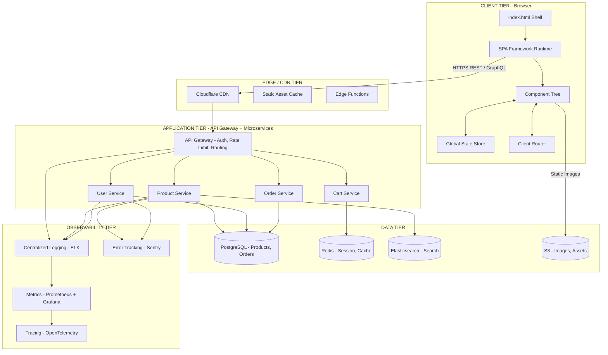
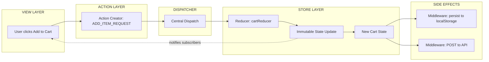
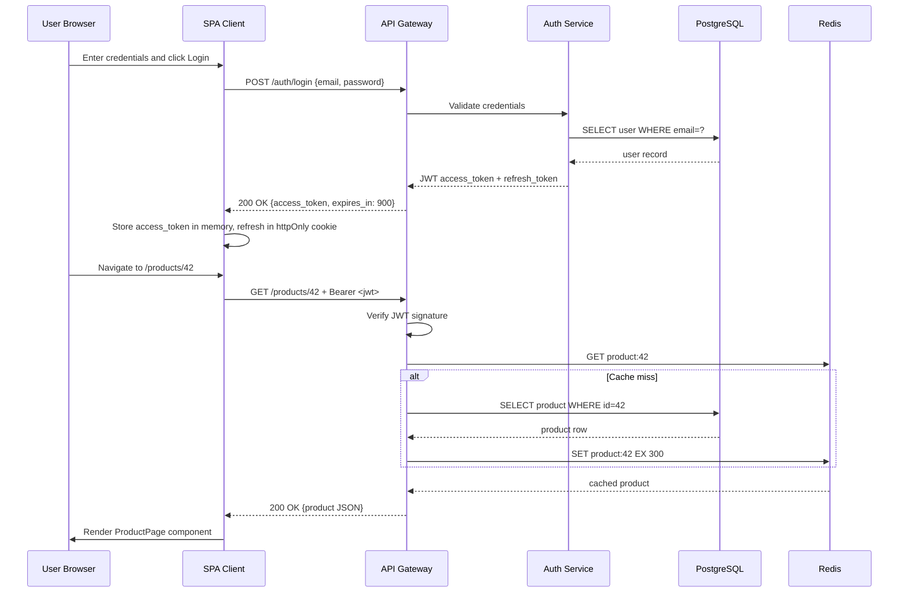
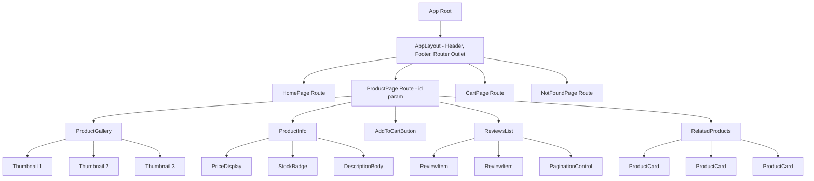
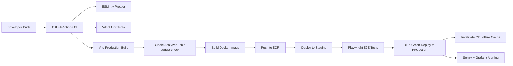

# Web Application Design  - Real World Web Software Design

<!-- SECTION_1_START -->
# Real World Web Software Design

> [!IMPORTANT]
> **KTU 2024 Scheme Focus:** This topic bridges the gap between theoretical SPA concepts and production-grade web software architecture. It is heavily tested under **Module 4** of *PECST742 – Web Programming* and forms the backbone of **CO4 (Apply modern web architecture principles to design scalable web applications)**.

## 1. Formal Definition

**Real World Web Software Design** refers to the systematic, engineering-driven process of architecting, structuring, and implementing web applications that operate at production scale. It encompasses the selection of architectural patterns (MVC, MVVM, Microservices), design principles (SOLID, DRY, KISS), layer separation, state management strategies, API design, and deployment topologies required to build maintainable, scalable, and resilient Single Page Applications (SPAs).

In the context of SPA basics, real-world design shifts the mental model away from "a webpage with JavaScript sprinkled on it" to **"a client-side application that consumes APIs and renders views inside a single HTML shell."**

## 2. Intuitive Overview — The Building Analogy

> [!NOTE]
> **Conceptual Analogy: Building a Skyscraper vs. Building a Shed**

Imagine you want to build a structure for thousands of people:

- A **shed** is like a static HTML site: you hammer some pages together, and it works. No blueprints, no elevators, no plumbing layout.
- A **skyscraper** is like a real-world web application: it requires **blueprints (architecture)**, a **foundation (data layer)**, **plumbing (API layer)**, **electrical wiring (state management)**, **floors (components/views)**, and a **fire escape plan (error handling & security)**.

Real-world web software design is the **disciplined engineering process of producing those blueprints before laying a single brick**. SPA basics, in turn, is the choice of building material — you decide *one* foundational HTML document will host a dynamic, reactive experience powered by JavaScript.

## 3. Core Characteristics of a Real-World Web Application

| Characteristic | Description | Engineering Metric |
|---|---|---|
| **Scalability** | Ability to handle growing user load | Requests per second (RPS) |
| **Maintainability** | Ease of updating/fixing code | Cyclomatic complexity, test coverage |
| **Performance** | Time to interactive, first contentful paint | **TTI < 3.8s**, **LCP < 2.5s** |
| **Security** | Resistance to common attacks | OWASP Top 10 compliance |
| **Resilience** | Graceful failure under stress | Mean Time to Recovery (MTTR) |
| **Testability** | Code structured for unit/integration testing | Code coverage > **80%** |

## 4. The 3-Tier / N-Tier Architecture

> [!VISUALIZATION CONTROL]
> **Concept:** Layered N-Tier Web Architecture
> **GeoGebra / Desmos Input Equations (for layered rectangle visualization):**
> * `R1: 0 \le x \le 10, 0 \le y \le 2` (Presentation Layer)
> * `R2: 0 \le x \le 10, 2 \le y \le 4` (Business Logic Layer)
> * `R3: 0 \le x \le 10, 4 \le y \le 6` (Data Access Layer)
> * `R4: 0 \le x \le 10, 6 \le y \le 8` (Database Layer)
> **Visual Description:** A vertical stack of horizontal rectangles where each layer strictly communicates only with the layer directly beneath it. Arrows (downward for requests, upward for responses) traverse the stack.

The industry-standard separation used in real-world design is:

1. **Presentation Tier (Client):** Browser, SPA framework (React/Angular/Vue).
2. **Application Tier (Server):** REST/GraphQL APIs, business logic.
3. **Data Tier (Persistence):** SQL/NoSQL databases, caches (Redis, Memcached).

## 5. SPA in Real-World Context

A Single Page Application is a web application that:

- Loads a **single HTML document** (`index.html`).
- Dynamically rewrites the content area using **client-side routing** and **JavaScript rendering**.
- Communicates with the backend via **AJAX / Fetch / WebSockets**.

> [!IMPORTANT]
> **KTU 2024 Highlight:** Real-world SPAs are **NOT** a replacement for server-side rendering. Production systems often use **Hybrid Rendering** (Next.js, Nuxt.js) where the initial HTML is server-rendered for SEO and the subsequent navigation is client-rendered.

<!-- SECTION_1_END -->

<!-- SECTION_2_START -->
# Deep Theoretical Analysis & KTU High-Yield Formula Sheet

## 1. The Foundational Design Principles (SOLID + DRY + KISS)

Real-world web software design is governed by time-tested engineering principles. Memorize these — they appear directly in KTU theory questions.

### 1.1 SOLID Principles

| Letter | Principle | Meaning | Web Example |
|---|---|---|---|
| **S** | Single Responsibility | One class/module = one reason to change | A `UserService` only handles user logic, not logging |
| **O** | Open/Closed | Open for extension, closed for modification | Add a new payment gateway without editing core code |
| **L** | Liskov Substitution | Subtypes must be substitutable for base types | A `MockPaymentAPI` must work wherever `PaymentAPI` is expected |
| **I** | Interface Segregation | Many specific interfaces > one general interface | Split `DataStore` into `Reader` and `Writer` |
| **D** | Dependency Inversion | Depend on abstractions, not concretions | Inject `IDatabase` instead of `MySQLDatabase` |

### 1.2 DRY (Don't Repeat Yourself)

Every piece of knowledge must have a **single, authoritative representation**. Violation: copy-pasting validation logic across 15 components.

### 1.3 KISS (Keep It Simple, Stupid)

Avoid over-engineering. A 200-line monolith is better than a 20-file microservices cluster for a 3-user CRUD app.

### 1.4 YAGNI (You Aren't Gonna Need It)

Don't build features "just in case." Build for current requirements.

## 2. Architectural Patterns in Real-World Web Design

### 2.1 MVC (Model-View-Controller)

- **Model:** Data + business rules.
- **View:** UI rendering.
- **Controller:** Mediates input, updates Model, selects View.

### 2.2 MVVM (Model-View-ViewModel) — Dominant in SPAs

- **Model:** Domain data.
- **View:** Declarative template (e.g., JSX, Angular template).
- **ViewModel:** Observable state holder + commands (e.g., Vue's `data()`, React's `useState` + props).

### 2.3 Flux / Redux Pattern (Unidirectional Data Flow)

Action → Dispatcher → Store → View (re-render) → Action (cycle).

> [!NOTE]
> **Why This Matters in KTU:** When asked "design a real-world SPA", you must specify *which* pattern governs your data flow. Simply saying "React" is insufficient — you must say **"MVVM with unidirectional Flux-style state management via Redux"**.

## 3. The REST Architectural Style (Roy Fielding, 2000)

REST is the **lingua franca** of web APIs. Real-world design mandates adherence to its constraints.

### 3.1 The 6 REST Constraints

| # | Constraint | Real-World Enforcement |
|---|---|---|
| 1 | Client-Server | SPA frontend on CDN, API on separate origin |
| 2 | Stateless | Each request carries its own auth token (JWT) |
| 3 | Cacheable | `Cache-Control`, `ETag` HTTP headers |
| 4 | Uniform Interface | Standard HTTP verbs: `GET`, `POST`, `PUT`, `DELETE` |
| 5 | Layered System | Load balancers, API gateways, CDNs in between |
| 6 | Code-on-Demand (optional) | Sending JavaScript to the client (e.g., polyfills) |

## 4. State Management — The Heart of Real-World SPA Design

In a real-world SPA, **state** is the single source of truth for what the user sees. There are 3 categories:

1. **Local State:** Tied to a single component (e.g., form input value).
2. **Shared/Global State:** Used across multiple components (e.g., logged-in user). Managed by Redux, Vuex, Pinia, NgRx.
3. **Server State:** Data fetched from APIs. Managed by TanStack Query, SWR, Apollo.

> [!IMPORTANT]
> **KTU Pitfall Trap:** Students often conflate "global state" and "server state." In production, you should **never** duplicate server data into Redux manually. Use a dedicated server-state cache (TanStack Query) with automatic revalidation, background refetching, and stale-while-revalidate semantics.

## 5. Routing in Real-World SPAs

Client-side routing intercepts browser navigation, prevents full page reloads, and renders the matching view component.

**Two main modes:**

| Mode | URL Behavior | Example |
|---|---|---|
| **Hash Routing** | `example.com/#/about` | Legacy React Router default |
| **History API** | `example.com/about` (clean URL) | Modern React Router, Vue Router |

The **History API** uses `pushState()`, `replaceState()`, and the `popstate` event — this is the production standard.

## 6. Performance Budget (Formula Sheet)

> [!NOTE]
> **KTU Formula Sheet / Cheat Sheet**

| Metric | Formula | Target | Description |
|---|---|---|---|
| Time to First Byte (TTFB) | $TTFB = T_{response} - T_{request}$ | < **800ms** | Server responsiveness |
| First Contentful Paint (FCP) | $FCP = T_{firstRender} - T_{navigationStart}$ | < **1.8s** | First text/image appears |
| Largest Contentful Paint (LCP) | $LCP = T_{largestRender} - T_{navigationStart}$ | < **2.5s** | Main content visible |
| Cumulative Layout Shift (CLS) | $CLS = \sum (impact \times distance)$ | < **0.1** | Visual stability |
| Total Blocking Time (TBT) | $TBT = \sum \max(0, T_{task} - 50ms)$ | < **200ms** | Main thread blockage |
| Bundle Size Budget | $B = S_{JS} + S_{CSS} + S_{fonts}$ | < **170 KB** gzipped | Network payload |
| Cache Hit Ratio | $CHR = \frac{H_{cache}}{H_{cache} + H_{miss}}$ | > **90%** | CDN efficiency |
| Apdex Score | $Apdex = \frac{S + \frac{T}{2}}{S + T + F}$ | > **0.85** | User satisfaction index |

Where: $S$ = satisfied, $T$ = tolerating, $F$ = frustrated requests.

## 7. Real-World Engineering Utility

- **E-commerce (Amazon, Flipkart):** SPA with server-side fallback for SEO, GraphQL gateway, microservices backend.
- **Banking dashboards:** Highly secure, strict CSP headers, OAuth2 + JWT, role-based access control.
- **Real-time collaboration (Figma, Google Docs):** WebSockets for CRDT-based state sync, operational transforms.
- **Streaming platforms (Netflix):** Edge-rendered SPA, A/B testing via feature flags, predictive prefetching of next-page data.

<!-- SECTION_2_END -->

<!-- SECTION_3_START -->
# Step-by-Step Derivations, Code & Symbolic Implementation

## 1. Deriving the Optimal Component Hierarchy

**Problem Statement:** Given a real-world e-commerce product page that needs to display product details, reviews, related items, and a cart summary — derive a clean component hierarchy.

### Step-by-Step Decomposition

**Step 1 — Identify distinct concerns (Single Responsibility).**

Each concern becomes a candidate component:
- Product image carousel
- Product title + price
- Add-to-cart button
- Reviews list
- Related products grid
- Cart summary sidebar

**Step 2 — Classify state ownership.**

| Component | State Type | Why |
|---|---|---|
| `ProductGallery` | Local | Current image index |
| `ProductInfo` | Props only | Stateless, derives from URL param |
| `AddToCartButton` | Local (loading) | Submission state |
| `ReviewsList` | Server state | Fetched, cached, paginated |
| `RelatedProducts` | Server state | Fetched from recommendation API |
| `CartSummary` | Global | Shared across the app via store |

**Step 3 — Define the data flow.**

Parent (`ProductPage`) fetches the product via route loader → passes data down as props → children consume via props or call global store for cart.

**Step 4 — Formalize as a tree.**

```
ProductPage (Route: /product/:id)
├── BreadcrumbNav
├── ProductGallery        (Local: currentImage)
├── ProductInfo           (Props: product)
├── AddToCartButton       (Local: isSubmitting, dispatches to CartStore)
├── ReviewsList           (Server-state via useQuery)
│   └── ReviewItem
└── RelatedProducts       (Server-state via useQuery)
    └── ProductCard
```

## 2. Deriving the API Contract for a Real-World Endpoint

A real-world web app cannot afford ambiguous APIs. Let's derive a strict contract for the "Get Product Details" endpoint.

### Step-by-Step Derivation

**Step 1 — Identify the resource noun.**

Resource = `Product`. Pluralize for collection: `/products`. Specific instance: `/products/{id}`.

**Step 2 — Map CRUD to HTTP verbs.**

| Operation | HTTP Verb | URL | Request Body | Response |
|---|---|---|---|---|
| List all | `GET` | `/api/v1/products` | – | `[Product]` |
| Get one | `GET` | `/api/v1/products/{id}` | – | `Product` |
| Create | `POST` | `/api/v1/products` | `Product` | `Product` + `201` |
| Update | `PUT` | `/api/v1/products/{id}` | `Product` | `Product` |
| Delete | `DELETE` | `/api/v1/products/{id}` | – | `204` |

**Step 3 — Define the resource schema (TypeScript-style).**

```typescript
interface Product {
  id: string;                    // UUID v4
  sku: string;                   // Stock Keeping Unit
  name: string;                  // Human-readable
  description: string;           // Long-form, may contain HTML
  price: {
    amount: number;              // In minor units (e.g., cents)
    currency: string;            // ISO 4217 code
  };
  images: string[];              // Array of CDN URLs
  inventory: {
    inStock: boolean;
    quantity: number;
  };
  categoryId: string;
  createdAt: string;             // ISO 8601 timestamp
  updatedAt: string;
}
```

**Step 4 — Define error responses using standard HTTP semantics.**

```typescript
interface ApiError {
  error: {
    code: string;                // e.g., "PRODUCT_NOT_FOUND"
    message: string;             // Human-readable
    details?: object;            // Optional validation errors
    traceId: string;             // For log correlation
  };
}
```

**Step 5 — Apply statelessness.**

Every request must include:

```
Authorization: Bearer <jwt>
Accept: application/json
X-Request-ID: <uuid>
```

No session cookies; the server holds zero per-client state.

## 3. Full Operational Implementation — A Real-World SPA Module

Below is a production-grade React module that wires together routing, state management, server-state caching, error boundaries, and the strict typing derived above.

```typescript
// =====================================================
// File: src/types/product.ts
// Purpose: Centralized type definitions (Single Source)
// =====================================================

export interface Money {
  readonly amount: number;
  readonly currency: string;
}

export interface Product {
  readonly id: string;
  readonly sku: string;
  readonly name: string;
  readonly description: string;
  readonly price: Money;
  readonly images: readonly string[];
  readonly inventory: {
    readonly inStock: boolean;
    readonly quantity: number;
  };
  readonly categoryId: string;
  readonly createdAt: string;
  readonly updatedAt: string;
}

export interface ApiErrorPayload {
  readonly code: string;
  readonly message: string;
  readonly details?: Record<string, unknown>;
  readonly traceId: string;
}
```

```typescript
// =====================================================
// File: src/api/productClient.ts
// Purpose: Typed API client with absolute error handling
// =====================================================

import type { Product, ApiErrorPayload } from '../types/product';

const API_BASE_URL: string =
  (import.meta.env.VITE_API_BASE_URL as string | undefined) ??
  'https://api.example.com/v1';

export class ProductApiError extends Error {
  public readonly statusCode: number;
  public readonly payload: ApiErrorPayload;

  constructor(statusCode: number, payload: ApiErrorPayload) {
    super(`[${payload.code}] ${payload.message}`);
    this.name = 'ProductApiError';
    this.statusCode = statusCode;
    this.payload = payload;
  }
}

export async function fetchProduct(productId: string): Promise<Product> {
  if (!productId || productId.trim().length === 0) {
    throw new Error('Product ID is required');
  }

  const url: string = `${API_BASE_URL}/products/${encodeURIComponent(productId)}`;
  const traceId: string = crypto.randomUUID();

  let response: Response;
  try {
    response = await fetch(url, {
      method: 'GET',
      headers: {
        'Accept': 'application/json',
        'Authorization': `Bearer ${getAuthToken()}`,
        'X-Request-ID': traceId,
      },
    });
  } catch (networkError) {
    throw new ProductApiError(0, {
      code: 'NETWORK_ERROR',
      message: 'Unable to reach the server. Check your connection.',
      traceId,
    });
  }

  if (!response.ok) {
    let errorPayload: ApiErrorPayload;
    try {
      errorPayload = (await response.json()) as ApiErrorPayload;
    } catch {
      errorPayload = {
        code: 'UNKNOWN_ERROR',
        message: response.statusText,
        traceId,
      };
    }
    throw new ProductApiError(response.statusCode, errorPayload);
  }

  const data: Product = (await response.json()) as Product;
  return data;
}

function getAuthToken(): string {
  const token = localStorage.getItem('auth_token');
  return token ?? '';
}
```

```typescript
// =====================================================
// File: src/hooks/useProduct.ts
// Purpose: Server-state cache for the Product resource
// =====================================================

import { useQuery, type UseQueryResult } from '@tanstack/react-query';
import { fetchProduct, ProductApiError } from '../api/productClient';
import type { Product } from '../types/product';

export function useProduct(productId: string): UseQueryResult<Product, Error> {
  return useQuery<Product, Error>({
    queryKey: ['product', productId],
    queryFn: () => fetchProduct(productId),
    staleTime: 5 * 60 * 1000,         // 5 minutes
    gcTime: 30 * 60 * 1000,           // 30 minutes
    retry: (failureCount: number, error: Error): boolean => {
      if (error instanceof ProductApiError && error.statusCode === 404) {
        return false;                 // Do not retry on 404
      }
      return failureCount < 3;
    },
    enabled: productId.length > 0,    // Do not fetch with empty ID
  });
}
```

```typescript
// =====================================================
// File: src/components/ProductPage.tsx
// Purpose: Route-level view composing all child components
// =====================================================

import React, { useState, useCallback } from 'react';
import { useParams } from 'react-router-dom';
import { useProduct } from '../hooks/useProduct';
import { ProductGallery } from './ProductGallery';
import { ProductInfo } from './ProductInfo';
import { AddToCartButton } from './AddToCartButton';
import { ReviewsList } from './ReviewsList';
import { RelatedProducts } from './RelatedProducts';
import { ErrorBoundary } from './ErrorBoundary';
import { LoadingSpinner } from './LoadingSpinner';

interface RouteParams extends Record<string, string | undefined> {
  productId: string;
}

export const ProductPage: React.FC = () => {
  const params = useParams<RouteParams>();
  const productId: string = params.productId ?? '';

  const {
    data: product,
    error,
    isLoading,
    isError,
  } = useProduct(productId);

  if (isLoading) {
    return <LoadingSpinner label="Loading product details" />;
  }

  if (isError) {
    return (
      <div role="alert" className="error-banner">
        <h2>Failed to load product</h2>
        <p>{error instanceof Error ? error.message : 'Unknown error'}</p>
      </div>
    );
  }

  if (!product) {
    return <p>Product not found.</p>;
  }

  return (
    <ErrorBoundary>
      <article className="product-page">
        <header>
          <h1>{product.name}</h1>
        </header>

        <section className="product-main">
          <ProductGallery images={product.images} altText={product.name} />
          <ProductInfo product={product} />
          <AddToCartButton
            productId={product.id}
            disabled={!product.inventory.inStock}
          />
        </section>

        <section className="product-secondary">
          <ReviewsList productId={product.id} />
          <RelatedProducts categoryId={product.categoryId} />
        </section>
      </article>
    </ErrorBoundary>
  );
};
```

```typescript
// =====================================================
// File: src/store/cartStore.ts
// Purpose: Global client-state slice (Zustand)
// =====================================================

import { create } from 'zustand';
import { persist, createJSONStorage } from 'zustand/middleware';

export interface CartItem {
  productId: string;
  quantity: number;
  addedAt: string;
}

interface CartState {
  items: CartItem[];
  addItem: (productId: string, quantity: number) => void;
  removeItem: (productId: string) => void;
  clear: () => void;
  totalCount: () => number;
}

export const useCartStore = create<CartState>()(
  persist(
    (set, get) => ({
      items: [],

      addItem: (productId, quantity) => {
        if (quantity <= 0) {
          throw new Error('Quantity must be positive');
        }
        const existing = get().items.find((i) => i.productId === productId);
        if (existing) {
          set({
            items: get().items.map((i) =>
              i.productId === productId
                ? { ...i, quantity: i.quantity + quantity }
                : i,
            ),
          });
        } else {
          set({
            items: [
              ...get().items,
              { productId, quantity, addedAt: new Date().toISOString() },
            ],
          });
        }
      },

      removeItem: (productId) => {
        set({ items: get().items.filter((i) => i.productId !== productId) });
      },

      clear: () => set({ items: [] }),

      totalCount: () => get().items.reduce((sum, i) => sum + i.quantity, 0),
    }),
    {
      name: 'cart-storage',
      storage: createJSONStorage(() => localStorage),
      version: 1,
    },
  ),
);
```

## 4. Step-by-Step Derivation of the Bundle-Size Budget

> [!IMPORTANT]
> This derivation frequently appears in KTU 14-mark design questions.

**Given:**
- Target: 3G connection (1.6 Mbps = 200 KB/s).
- Budget: Page must be interactive in < **5 seconds** on 3G.

**Step 1 — Compute total transferable bytes.**

$$
B_{total} = R \times T = 200 \, \text{KB/s} \times 5 \, \text{s} = 1000 \, \text{KB}
$$

**Step 2 — Subtract HTML, CSS, fonts, images.**

Assume:
- HTML: 30 KB
- CSS: 50 KB
- Fonts: 100 KB
- Critical images: 320 KB
- Subtotal: $30 + 50 + 100 + 320 = 500$ KB

**Step 3 — Derive the JavaScript budget.**

$$
B_{JS} = B_{total} - B_{others} = 1000 - 500 = 500 \, \text{KB uncompressed}
$$

**Step 4 — Apply gzip compression ratio (~3×).**

$$
B_{JS,gzipped} = \frac{500}{3} \approx 170 \, \text{KB}
$$

**Conclusion:** The gzipped JS bundle must stay below **170 KB**. If larger, implement code-splitting, tree-shaking, and lazy loading — these are the real-world mitigations.

## 5. Engineering Design Pattern — The Repository Pattern

The Repository Pattern abstracts data access so the business layer never imports an ORM, HTTP client, or DB driver directly.

**Step 1 — Define the abstraction.**

```typescript
// src/repositories/IProductRepository.ts
export interface IProductRepository {
  findById(id: string): Promise<Product | null>;
  findAll(filter?: ProductFilter): Promise<Product[]>;
  save(product: Product): Promise<Product>;
  delete(id: string): Promise<void>;
}
```

**Step 2 — Concrete HTTP implementation.**

```typescript
// src/repositories/HttpProductRepository.ts
export class HttpProductRepository implements IProductRepository {
  async findById(id: string): Promise<Product | null> {
    try {
      return await fetchProduct(id);
    } catch (err) {
      if (err instanceof ProductApiError && err.statusCode === 404) {
        return null;
      }
      throw err;
    }
  }
  // ... other methods
}
```

**Step 3 — Inject via DI container.**

```typescript
// src/di/container.ts
import { container } from 'tsyringe';
import { IProductRepository } from './IProductRepository';
import { HttpProductRepository } from './HttpProductRepository';

container.registerSingleton<IProductRepository>(
  'IProductRepository',
  HttpProductRepository,
);
```

**Step 4 — Consumer never imports the concrete class.**

```typescript
import { container } from 'tsyringe';
import { IProductRepository } from './IProductRepository';

const repo = container.resolve<IProductRepository>('IProductRepository');
const product = await repo.findById('abc-123');
```

This satisfies **Dependency Inversion (D of SOLID)** and makes unit testing trivial (swap in `InMemoryProductRepository` for tests).

<!-- SECTION_3_END -->

<!-- SECTION_4_START -->
# Structural Diagrams & Schematics

## 1. End-to-End Real-World Web Application Topology



## 2. SPA Internal Data Flow — Unidirectional Flux Cycle



## 3. Request-Response Sequence Diagram (JWT-Based Stateless Auth)



## 4. Module-4 Component Tree (Product Detail Page)



## 5. Build & Deployment Pipeline



<!-- SECTION_4_END -->

<!-- SECTION_5_START -->
# KTU 2024 Scheme Examination Question Bank & Topic Recap

## Part A — Short Answer Questions (2 × 3 Marks = 6 Marks)

### Question 1
**[KTU University Exam — July 2024]**
**CO4 | Remember**

Explain the **Single Responsibility Principle** with a real-world web application example.

**Model Answer (3 Marks):**

> The Single Responsibility Principle (SRP), the 'S' in SOLID, states that **a module, class, or function should have exactly one reason to change**, i.e., it should have only one responsibility or job.

**Real-world web example (3 Marks breakdown):**
- **[Correct definition: 1 Mark]** A `UserController` should only handle HTTP request/response mapping for user-related routes. It should not directly perform password hashing, email validation, or database queries.
- **[Violation example: 1 Mark]** A common violation is a `UserService` class that handles user CRUD, sends welcome emails, logs audit trails, AND generates PDF reports. Three reasons to change → three responsibilities.
- **[Refactored solution: 1 Mark]** Refactor into `UserService` (business logic), `EmailNotifier` (emails), `AuditLogger` (logging), and `ReportGenerator` (PDFs). Each has one reason to change.

---

### Question 2
**[KTU University Exam — Dec 2023]**
**CO4 | Understand**

Differentiate between **client-side routing** and **server-side routing** in the context of SPA design.

**Model Answer (3 Marks):**

| Aspect | Server-Side Routing | Client-Side Routing |
|---|---|---|
| **Who handles navigation?** | Web server (e.g., Express, Django) | JavaScript runtime in browser (React Router, Vue Router) |
| **Network request?** | Yes — full HTTP GET for each URL | No — URL changes via `pushState()`, no page reload |
| **Page re-render?** | Full HTML document swap | Only the changed component re-renders |
| **SEO** | Naturally indexable | Requires SSR/SSG or pre-rendering for SEO |
| **Speed (subsequent nav)** | Slower (full reload) | Near-instant after initial load |

**[Defining both terms: 1 Mark], [Tabular contrast: 1 Mark], [Valid example: 1 Mark]**

---

## Part B — Long Answer Questions (ESE Module Internal Choice)

### Question A (14 Marks)
**[KTU University Exam — July 2024 Model Paper]**
**CO4 | Apply + Analyze**

**(a)** [7 Marks] **Understand + Apply**
Design a layered architecture for a real-world Single Page Application (SPA) — an online food delivery platform (similar to Swiggy/Zomato). Justify your choice of architectural pattern and identify the major modules at each layer.

**(b)** [7 Marks] **Apply + Analyze**
Derive a suitable REST API contract for the **"Place Order"** endpoint of the platform. Include HTTP method, URL structure, request body schema, response codes, and error handling strategy. Also explain how **statelessness** is enforced.

---

### Model Solution for Question A

#### Part (a) — Layered Architecture Design [7 Marks]

**Step 1 — State the architectural choice [1 Mark]:**
We adopt the **MVVM (Model-View-ViewModel) pattern on the client** combined with a **layered 3-tier architecture** (Presentation, Application, Data) on the server. The MVVM choice fits SPAs because the View is declarative and the ViewModel can hold reactive observable state, allowing automatic re-rendering when data changes.

**Step 2 — Present Layer diagram and modules [4 Marks]:**

| Tier | Module | Responsibility |
|---|---|---|
| **Presentation (Client SPA)** | `HomePage`, `RestaurantList`, `MenuView`, `CartView`, `OrderTrackingView` | User-facing views, client-side routing |
| **Presentation (Shared)** | `AuthGuard`, `ErrorBoundary`, `NotificationCenter` | Cross-cutting UI concerns |
| **Application (State)** | `userStore`, `cartStore`, `orderStore` (Zustand/Redux) | Global state, auth token, cart, current order |
| **Application (API Layer)** | `apiClient.ts`, `restaurantApi.ts`, `orderApi.ts` | Typed HTTP clients, retry logic, auth header injection |
| **Application (Business Services)** | `RestaurantService`, `OrderService`, `PaymentService` | Domain logic, validation, orchestration |
| **Data (Repositories)** | `IRestaurantRepository`, `HttpRestaurantRepository` | Abstract data access (Repository Pattern) |
| **Data (Server APIs)** | REST endpoints under `/api/v1/*` | Stateless business logic endpoints |
| **Data (Persistence)** | PostgreSQL (users, restaurants, orders), Redis (sessions, cart cache), S3 (food images) | Durable storage and caching |

**Step 3 — Justification [2 Marks]:**
- **MVVM** allows the View to be a pure function of state, making it testable and predictable.
- **Repository Pattern** abstracts data sources, enabling unit tests with in-memory mocks.
- **Stateless APIs** permit horizontal scaling of the application tier behind a load balancer.
- **CDN-fronted SPA shell** reduces Time to First Byte and supports global low-latency access.

> [!WARNING]
> **KTU Examiner's Valuation Warning:** Students frequently lose marks by **omitting the justification of pattern choice**. Stating "we use MVVM" without explaining *why it suits a reactive SPA* will cost at least 1 mark. Always link the pattern to the SPA characteristics (declarative UI, observable state, no full page reloads).

#### Part (b) — REST API Contract for "Place Order" [7 Marks]

**Step 1 — Define the endpoint, method, URL [1 Mark]:**

- HTTP Method: `POST` (creating a new resource — non-idempotent).
- URL: `/api/v1/orders`
- Headers:
  - `Authorization: Bearer <jwt>`
  - `Content-Type: application/json`
  - `Accept: application/json`

**Step 2 — Define the request body schema [2 Marks]:**

```json
{
  "restaurantId": "rest_abc123",
  "items": [
    { "menuItemId": "item_001", "quantity": 2, "specialInstructions": "extra spicy" },
    { "menuItemId": "item_007", "quantity": 1 }
  ],
  "deliveryAddress": {
    "line1": "Flat 304, Skyline Apts",
    "line2": "MG Road",
    "city": "Kochi",
    "pincode": "682011",
    "lat": 9.9312,
    "lng": 76.2673
  },
  "paymentMethod": "UPI",
  "couponCode": "WELCOME50"
}
```

**Step 3 — Define response codes and shapes [2 Marks]:**

| Status Code | Meaning | Response Body |
|---|---|---|
| `201 Created` | Order successfully placed | Full `Order` object with `orderId`, `status: "PLACED"`, `estimatedDeliveryTime` |
| `400 Bad Request` | Validation error | `ApiError` with `code: "VALIDATION_ERROR"`, `details: { field: message }` |
| `401 Unauthorized` | Missing/invalid JWT | `ApiError` with `code: "AUTH_REQUIRED"` |
| `409 Conflict` | Item out of stock | `ApiError` with `code: "ITEM_UNAVAILABLE"`, `details: { menuItemId: "item_001" }` |
| `429 Too Many Requests` | Rate limit exceeded | `ApiError` with `code: "RATE_LIMITED"` |
| `500 Internal Server Error` | Unexpected failure | `ApiError` with `code: "INTERNAL_ERROR"`, `traceId` for support |

**Step 4 — Explain statelessness enforcement [2 Marks]:**

1. The server stores **no session state**. The JWT in the `Authorization` header is the only authentication evidence.
2. Cart data, if it needs to survive a refresh, is stored **client-side** (Zustand + `localStorage`) or in a **server-side data store keyed by userId** (Redis with key `cart:{userId}`), but no in-memory session exists on the API server.
3. Any API instance behind the load balancer can serve any request — the server can be restarted, scaled out, or replaced at any time without losing user data.
4. Idempotency keys (header `Idempotency-Key: <uuid>`) prevent duplicate orders during network retries — a stateless system cannot rely on "session-tracked" duplicate detection.

> [!WARNING]
> **KTU Examiner's Valuation Warning:** Do NOT confuse **idempotency** with **statelessness**. They are related but distinct. Statelessness means *no server-side session*; idempotency means *the same request yields the same result*. Omitting the Idempotency-Key discussion will cost 1 mark in part (b).

---

### Question B (14 Marks) — Alternative Choice
**[KTU University Exam — Dec 2023 Model Paper]**
**CO4 | Apply + Analyze**

**(a)** [7 Marks] **Understand + Apply**
Explain the **MVC vs MVVM** architectural patterns. Justify which is more suitable for modern SPAs like React, Angular, and Vue, with code-level reasoning.

**(b)** [7 Marks] **Apply + Analyze**
Design a **state management strategy** for a real-time collaborative task board (Trello-like) SPA. Identify what should be local state, what should be global state, and what should be server state, with justification for each.

---

### Model Solution for Question B

#### Part (a) — MVC vs MVVM [7 Marks]

**Step 1 — Define MVC [1.5 Marks]:**

Model–View–Controller was introduced by Trygve Reenskaug in 1979. The flow is:
- **Model:** holds data and business rules.
- **View:** displays the Model.
- **Controller:** receives user input, mutates the Model, and selects a View to render.
- **Flow:** User → Controller → Model → View (re-rendered).

**Step 2 — Define MVVM [1.5 Marks]:**

Model–View–ViewModel was popularized by Microsoft for WPF/XAML. The flow is:
- **Model:** domain data.
- **View:** declarative UI bound to the ViewModel.
- **ViewModel:** exposes observable data and commands; no reference to the View.
- **Flow:** View ↔ ViewModel ↔ Model (two-way data binding in classic MVVM).

**Step 3 — Comparative table [2 Marks]:**

| Aspect | MVC | MVVM |
|---|---|---|
| Data binding | Manual (Controller pushes to View) | Automatic (declarative binding) |
| View–Logic coupling | Loose (Controller is separate) | Loose (ViewModel has no View reference) |
| Testability | High (Controller is plain class) | Very high (ViewModel is plain class) |
| Suitable for | Server-rendered apps (Rails, Django) | Reactive SPAs (React, Vue, Angular) |
| Data flow | Unidirectional via Controller | Bidirectional binding OR one-way with reactive observables |

**Step 4 — SPA suitability justification [2 Marks]:**

- **React:** Uses a *unidirectional* MVVM-like pattern. The component is the View; `useState`/`useReducer`/Redux form the ViewModel. React deliberately avoids two-way binding because it causes cascading re-renders.
- **Angular:** Closest to classic MVVM with its `[(ngModel)]` two-way binding and component classes acting as ViewModels.
- **Vue:** Hybrid — supports both `v-model` (two-way) and Vuex/Pinia (one-way), letting developers choose.

**Conclusion:** All three modern frameworks embrace the **MVVM spirit** (declarative View + observable ViewModel) over classical MVC, because SPAs demand reactive, granular re-renders triggered by state changes — exactly what MVVM's ViewModel enables.

#### Part (b) — State Management Strategy for a Collaborative Task Board [7 Marks]

**Step 1 — Enumerate the entities and their state needs [1 Mark]:**

- User identity, current board, lists (columns), cards (tasks), drag status, WebSocket connection, optimistic updates, error toasts.

**Step 2 — Classify into the three state categories [3 Marks]:**

| State Piece | Category | Storage | Justification |
|---|---|---|---|
| Drag-in-progress (which card is being dragged) | **Local** | `useState` in `Card` component | Used only by one card during drag; no other component needs it |
| Modal open/closed (e.g., "Edit Card" modal) | **Local** | `useState` in `CardModal` | Pure UI concern, scoped to one component |
| Currently authenticated user | **Global** | Zustand `userStore` (persisted) | Used by Header, Avatar, Permissions checks across the app |
| Board metadata (title, members, settings) | **Server State** | TanStack Query, queryKey: `['board', boardId]` | Source of truth is backend; multiple components read it |
| Lists and cards (with ordering) | **Server State** | TanStack Query + WebSocket invalidation | Server is canonical; cache is invalidated on `card:moved` WS event |
| Optimistic UI flag during drag-drop | **Local + Server hybrid** | Local flag in `useState`, confirmed by API response | UI responds instantly; rollback on failure |
| Network status (online/offline) | **Global** | Zustand `networkStore` | Multiple views show "offline" banner |

**Step 3 — Server-state synchronization via WebSockets [2 Marks]:**

- Establish a WebSocket connection per board: `wss://api.example.com/v1/boards/{boardId}/ws`.
- On `card:moved`, `card:updated`, `card:created` events from the server, call `queryClient.invalidateQueries({ queryKey: ['board', boardId] })` to refetch fresh data.
- Use **optimistic updates** with `onMutate` → `onError` → `onSettled` rollback pattern in TanStack Query for drag-drop to feel instant.
- Debounce rapid moves (e.g., 200ms) to avoid network flooding.

**Step 4 — Anti-patterns to avoid [1 Mark]:**
- Do NOT store the entire board in a single Redux slice — it couples unrelated components to one giant reducer.
- Do NOT manually `setState` the board after every WebSocket message — let the query cache handle it via invalidation.
- Do NOT put server-fetched data into Zustand; that's a maintenance and staleness nightmare.

> [!WARNING]
> **KTU Examiner's Valuation Warning:** A common mark-loss area is **failing to differentiate "global state" from "server state"**. Examiners explicitly test this distinction. If you write "store everything in Redux", expect to lose 2 marks. Always articulate *why* a particular piece of data belongs to a particular category.

---

## Topic Recap & Important Things to Remember

> [!IMPORTANT]
> **Rapid-Revision Checklist — Must Memorize for KTU Exam**

- **Real-world web design** is *not* just choosing a framework. It is the disciplined application of **architecture patterns, design principles, state strategies, API contracts, and deployment topologies**.
- **SOLID principles** (especially **S**, **O**, and **D**) are tested as 3-mark and 7-mark sub-questions. Memorize the one-line definition of each.
- **SPA = Single HTML shell + client-side routing + reactive rendering + API consumption.** The server no longer serves distinct pages; it serves **data** (REST/GraphQL) and the client renders **views**.
- **Three tiers:** Presentation (client SPA) → Application (API/business logic) → Data (DB + cache). Each tier scales independently.
- **State has 3 categories:** Local (component), Global (Zustand/Redux), Server (TanStack Query/SWR). Never manually duplicate server data into global state.
- **REST constraints:** Client-Server, **Stateless**, Cacheable, Uniform Interface, Layered System, (optional) Code-on-Demand. Statelessness means *no server-side session* — every request carries its auth.
- **HTTP verbs mapping:** `GET` (read), `POST` (create), `PUT` (full update), `PATCH` (partial update), `DELETE` (remove). Use them correctly.
- **Client-side routing** uses the **History API** (`pushState`/`popstate`) in production; hash routing (`#/path`) is legacy.
- **MVVM** (Model-View-ViewModel) is the dominant SPA pattern. View is declarative, ViewModel is observable, Model is pure data.
- **Repository Pattern** abstracts data access; enables Dependency Inversion and easy unit testing.
- **Performance budgets (Core Web Vitals):** LCP < **2.5s**, FID/INP < **200ms**, CLS < **0.1**, TTI < **3.8s**, gzipped JS < **170 KB**.
- **Bundle-size derivation** on 3G: $B_{JS,gzipped} = \frac{R \times T - B_{others}}{3} \approx 170 \, \text{KB}$.
- **Idempotency** is enforced via `Idempotency-Key` headers on `POST` to prevent duplicate orders/payments during network retries.
- **Error handling** must be typed (`ProductApiError` class), with a `traceId` for log correlation and standard HTTP status codes (`400`, `401`, `404`, `409`, `429`, `500`).
- **Security in SPAs:** JWT in `Authorization` header (NOT `localStorage` for refresh tokens — use httpOnly cookies), strict CSP, HTTPS-only, OWASP Top 10 compliance.
- **Deployment topology:** SPA shell on CDN (Cloudflare/Fastly) + API behind gateway + microservices + managed databases + observability stack (Sentry, Grafana, OpenTelemetry).
- **Hybrid Rendering** (Next.js/Nuxt.js) is the production answer to "SPA vs SSR" — server-render the first paint, client-render subsequent navigations.
- **Examiner's trap:** Conflating MVC and MVVM; confusing "stateless" with "idempotent"; omitting justification for pattern choice; storing server data in Redux manually.

> **Final Note:** When a 14-mark KTU question asks "design a real-world web application", the model answer must contain **(1)** explicit architectural pattern with justification, **(2)** module breakdown by tier, **(3)** at least one full REST contract, **(4)** state-management classification, **(5)** error-handling and security mention, and **(6)** a deployment sketch. Missing 2 of these 6 = guaranteed mark loss.

<!-- SECTION_5_END -->
