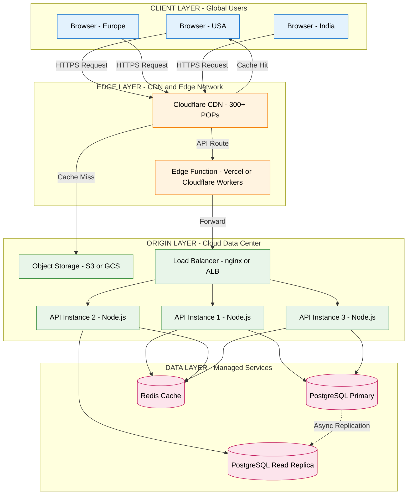
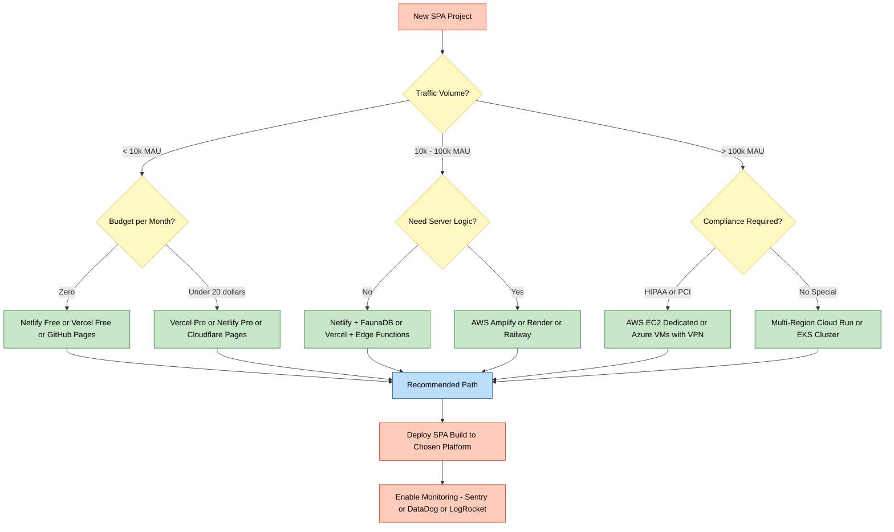
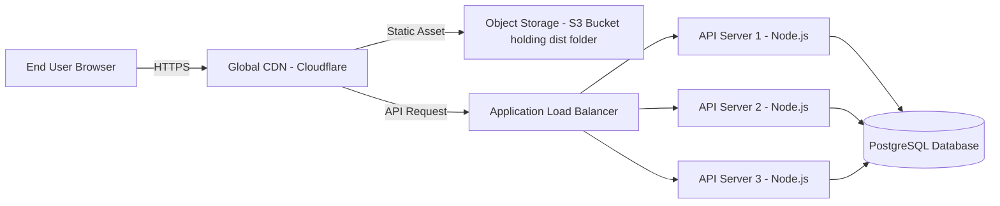

# Web server - hosting options

<!-- SECTION_1_START -->
# Web Server & Hosting Options — Core Foundation

## 1.1 Formal Academic Definition (KTU 2024 Terminology)

> [!NOTE]
> **Web Server (KTU 2024 Definition):**
> A *web server* is a software/hardware system that stores, processes, and delivers web resources (HTML documents, CSS, JavaScript bundles, images, API responses) to clients over **HTTP/HTTPS** protocols. In the Single Page Application (SPA) context, the web server's role transforms from serving entire page renders on every request to serving a minimal `index.html` shell, static asset bundles (JS/CSS), and routing **API requests** to backend microservices.

> [!IMPORTANT]
> **Hosting Option (KTU 2024 Definition):**
> A *hosting option* refers to the infrastructure and service model selected to deploy, run, and scale a web application. It encompasses the physical/virtual machine layer, operating system layer, runtime environment, network topology, and management responsibility distribution between the developer and the service provider.

In the **2024 Scheme SPA module**, the emphasis is on understanding that SPAs (built with React, Angular, Vue) require a fundamentally different hosting strategy than traditional Multi-Page Applications (MPAs), because the bulk of "computation" happens in the browser, not the server.

## 1.2 Conceptual Analogy — The Restaurant Kitchen

Imagine a web application as a **restaurant**:

| Restaurant Element | Web Server Equivalent |
|---|---|
| 🍽️ **Dining hall** | The user's browser (Chrome, Firefox) |
| 👨‍🍳 **Kitchen** | The web server processing requests |
| 📜 **Menu** | The deployed web application / API endpoints |
| 🚪 **Waiter** | The HTTP protocol carrying requests/responses |
| 🏢 **Building ownership** | Hosting option (own building vs rented cloud kitchen) |
| ⚡ **Pre-cooked meals** | Static assets (JS/CSS bundles) — pre-built once |
| 🍲 **Made-to-order dishes** | Dynamic API responses — computed per request |

**Static hosting** is like a **cafeteria** — all food is pre-made and reheated (cheap, fast, no on-site cook needed). **Self-hosting on a dedicated server** is like owning a full restaurant — you control everything but bear all costs. **PaaS (Platform as a Service)** is like renting a **shared commercial kitchen** — you bring recipes, they handle utilities.

## 1.3 Physical & Network Constants

> [!IMPORTANT]
> - **Standard HTTP Port:** `80`
> - **Standard HTTPS Port:** `443`
> - **Default SPA fallback port:** `3000` (React/Express), `4200` (Angular), `5173` (Vite/Vue)
> - **SLA Benchmark for production web servers:** **99.9% uptime** (≈ 8.77 hours of allowed downtime per year)
> - **Enterprise SLA:** **99.99% ("four nines")** (≈ 52.6 minutes/year)

> [!VISUALIZATION CONTROL]
> **Concept:** Request-Response Latency vs Hosting Tier
> **GeoGebra / Desmos Input Equations:**
> * `f(x) = 50 + 10 * log(x)` &nbsp; — *Shared Hosting* (high latency, grows with users)
> * `g(x) = 20 + 2 * x` &nbsp;&nbsp;&nbsp;&nbsp;&nbsp; — *VPS Hosting* (linear growth)
> * `h(x) = 15 + 0.5 * x` &nbsp;&nbsp; — *Cloud PaaS* (scales efficiently)
> * `k(x) = 12` &nbsp;&nbsp;&nbsp;&nbsp;&nbsp;&nbsp;&nbsp;&nbsp;&nbsp;&nbsp;&nbsp;&nbsp; — *Edge/CDN* (near-constant globally)
>
> **Visual Description:** X-axis represents concurrent users (in thousands), Y-axis represents average response time in milliseconds. Students should observe that *shared hosting* curves sharply upward, while *CDN* and *Cloud PaaS* maintain a near-flat response profile, demonstrating why modern SPAs favor distributed hosting models.

## 1.4 Why This Topic Matters in KTU 2024 SPA Module

The KTU 2024 syllabus positions *Web Server & Hosting Options* as the **deployment capstone** of the SPA module. After learning React/Angular component design, routing, and state management, the natural next question every board examiner asks is: *"How do you actually put this on the internet?"* This topic bridges **client-side SPA code** with **production-grade DevOps**, covering both **traditional server models** and **modern Jamstack/Serverless paradigms**.

<!-- SECTION_1_END -->

<!-- SECTION_2_START -->
# Deep Theoretical Analysis & KTU High-Yield Formula Sheet

## 2.1 Classification of Web Servers

A web server can be classified along **two orthogonal axes**:

### Axis 1: Software vs Hardware
* **Web Server Software:** The application program (e.g., *Nginx*, *Apache HTTP Server*, *Caddy*, *Node.js http module*, *Express*).
* **Web Server Hardware:** The physical/virtual machine on which the software runs.

### Axis 2: Static vs Dynamic Content Delivery
* **Static Web Server:** Serves files *as-is* from disk. No server-side code execution. Ideal for SPAs.
* **Dynamic Web Server:** Executes application code (Node.js, Python, Java) before sending the response.

> [!NOTE]
> **Critical Insight for SPAs:** A modern SPA deploy typically uses a **hybrid model** — a static web server (Nginx/CDN) serves the SPA shell + assets, while a **separate API server** (Node.js/Express, Django, Spring Boot) handles dynamic JSON responses. These are often hosted on different infrastructure tiers.

## 2.2 The Five-Tier Hosting Model (KTU High-Yield)

The KTU 2024 syllabus expects students to distinguish the following tiers clearly:

### Tier 1 — Shared Hosting
* Multiple websites share **one physical server's** CPU, RAM, and OS.
* Cheapest option. Suitable for low-traffic brochure sites.
* **Disadvantage for SPAs:** "Noisy neighbor" effect degrades performance unpredictably.

### Tier 2 — Virtual Private Server (VPS)
* A physical server is **virtualized** (using KVM, VMware, Hyper-V) into multiple isolated instances.
* Each VPS gets dedicated RAM, CPU cores, and root access.
* Mid-cost. Good for small-to-medium SPAs.

### Tier 3 — Dedicated Server
* An **entire physical machine** is leased to a single client.
* Maximum control, maximum cost. Used by high-traffic enterprise apps.

### Tier 4 — Cloud Hosting (IaaS)
* On-demand, **elastic** virtual machines from providers like **AWS EC2**, **Azure VMs**, **Google Compute Engine**.
* Pay-per-second billing. Auto-scaling groups handle traffic spikes.
* **Industry standard for production SPAs.**

### Tier 5 — Platform as a Service (PaaS) & Jamstack
* Developer pushes **only code**, the platform handles servers, scaling, TLS, and CDN.
* Examples: **Vercel**, **Netlify**, **Heroku**, **AWS Amplify**, **Firebase Hosting**, **Render**.
* **The default choice for modern React/Angular/Vue SPAs.**

## 2.3 Serverless & Edge Hosting — The 2024 Frontier

> [!IMPORTANT]
> **Serverless computing** does **NOT** mean "no server." It means the developer does **not manage** the server. Functions (AWS Lambda, Cloudflare Workers, Vercel Edge Functions) spin up on-demand, execute, and shut down — billed per **millisecond of execution**.

* **Edge Hosting:** Code runs at CDN edge nodes (Cloudflare's 300+ global POPs), reducing latency to under **50 ms** worldwide.
* **Cold Start Penalty:** First invocation of a serverless function may take **100–500 ms**; subsequent warm invocations take **5–20 ms**.

## 2.4 KTU High-Yield Formula Sheet

| # | Concept | Formula / Rule | Typical Value | Engineering Use |
|---|---|---|---|---|
| 1 | **Uptime SLA** | $U = \frac{\text{Total Time} - \text{Downtime}}{\text{Total Time}} \times 100\%$ | $99.9\% \rightarrow 8.77\text{ hr/yr}$ | SLA contracts |
| 2 | **Annual Downtime** | $D = 525600 \times (1 - U) \text{ minutes}$ | $525600 \text{ min/yr}$ | Capacity planning |
| 3 | **Concurrent User Capacity** | $C = \frac{\text{Server RAM (MB)}}{\text{Avg. Request Size (MB)}}$ | Varies | Right-sizing VPS |
| 4 | **Throughput (TPS)** | $T = \frac{\text{Cores} \times \text{Clock (GHz)} \times \text{IPC}}{C_{\text{per request}}}$ | Nginx ≈ 50k req/s | Load testing |
| 5 | **CDN Latency** | $L_{\text{edge}} \approx \frac{D_{\text{user-POP}}}{2 \times 10^8 \text{ m/s}}$ | < 50 ms globally | Edge architecture |
| 6 | **Horizontal Scale-out** | $N_{\text{instances}} = \lceil \frac{\text{Peak RPS}}{\text{Single-instance TPS}} \rceil$ | Auto-scaling rule | Cloud architecture |
| 7 | **SPA Fallback Rule** | All non-asset routes $\rightarrow$ `/index.html` | Universal for SPAs | Nginx/Netlify config |
| 8 | **Cache Hit Ratio** | $H = \frac{\text{Cache Hits}}{\text{Total Requests}} \times 100\%$ | Target: > 80% | CDN tuning |
| 9 | **TLS Handshake Cost** | $\approx 1\text{–}2$ extra RTTs | ≈ 100–200 ms | HTTPS perf budget |
| 10 | **Serverless Cold Start** | $T_{\text{cold}} = 100\text{–}500$ ms; $T_{\text{warm}} = 5\text{–}20$ ms | Asymptotic | Function warming |

> [!IMPORTANT]
> **Note on Pipe Escapes:** Absolute value expressions like $\vert x \vert$ are rendered using the `\vert` LaTeX command, never the raw `|` character, to preserve the integrity of the surrounding markdown table.

## 2.5 Real-World Engineering Utility

In **production engineering**, hosting decisions directly impact:

1. **Time-to-Market:** A startup deploying on Vercel can ship an MVP in hours; raw EC2 deployment takes days.
2. **Cost Economics:** A hobby SPA on Netlify's free tier costs **\$0/month**; the same on AWS with auto-scaling may cost **\$200–\$2000/month** at scale.
3. **Disaster Recovery:** Cloud providers offer multi-region replication (RPO < 1 minute); shared hosting offers nothing.
4. **Compliance:** Healthcare SPAs (HIPAA) and fintech SPAs (PCI-DSS) often require dedicated infrastructure — eliminating shared/PaaS options.
5. **Performance Budgets:** Google's Core Web Vitals (LCP < 2.5 s) are nearly impossible to meet without **CDN + edge hosting** for global audiences.

<!-- SECTION_2_END -->

<!-- SECTION_3_START -->
# Step-by-Step Derivations, Configurations & Code Implementation

## 3.1 Mathematical Derivation — Capacity Planning for an SPA

### Problem Context
A KTU startup is launching a React SPA expected to handle **5,000 concurrent users** at peak. The team's load tests show a single Nginx instance can serve **800 requests/second (RPS)** with a **200 ms** average response time. The HTML shell is 50 KB, the JS bundle is 1.2 MB (gzipped to 350 KB), and CSS is 80 KB.

### Derivation Step 1 — Total Per-User Asset Size

$$S_{\text{user}} = S_{\text{html}} + S_{\text{js}} + S_{\text{css}}$$

Substituting values:

$$S_{\text{user}} = 50 \text{ KB} + 350 \text{ KB} + 80 \text{ KB} = 480 \text{ KB}$$

**Conversion logic:** The JS bundle dominates (~73% of total payload) — a strong argument for **code-splitting and lazy loading**.

### Derivation Step 2 — Number of Nginx Instances Required

Using the horizontal scale-out formula:

$$N_{\text{instances}} = \left\lceil \frac{\text{Peak RPS}}{\text{Single-instance TPS}} \right\rceil$$

Assume each user makes **0.5 requests/second** on average (modern SPAs use client-side routing, so most "navigation" never hits the server):

$$R_{\text{peak}} = 5000 \text{ users} \times 0.5 \text{ req/s/user} = 2500 \text{ req/s}$$

$$N_{\text{instances}} = \left\lceil \frac{2500}{800} \right\rceil = \lceil 3.125 \rceil = 4 \text{ instances}$$

**Conversion logic:** Rounding **up** ensures the system can absorb burst traffic; rounding down would cause 503 errors.

### Derivation Step 3 — Annual Uptime SLA Cost

If a hosting provider offers **99.95%** SLA at **\$50/month**:

$$D_{\text{annual}} = 525600 \times (1 - 0.9995) = 525600 \times 0.0005 = 262.8 \text{ minutes/year}$$

$$\text{Cost per minute of downtime} = \frac{50 \times 12}{262.8} \approx \$2.28 \text{ / min}$$

**Conversion logic:** This quantifies the **business cost of downtime** — useful when justifying hosting budget increases to non-technical stakeholders.

### Derivation Step 4 — Cache Hit Ratio Impact

If the CDN serves **85% of requests from cache**, the origin server only handles:

$$R_{\text{origin}} = 2500 \times (1 - 0.85) = 375 \text{ req/s}$$

$$N_{\text{instances}} = \left\lceil \frac{375}{800} \right\rceil = 1 \text{ instance (with 47% headroom)}$$

**Conversion logic:** A single CDN rule can reduce infrastructure cost by **75%** — the highest-ROI optimization in web hosting.

---

## 3.2 Algorithmic Implementation — Configuring Nginx for SPA Routing

The **SPA Fallback Rule** (Formula #7 above) is the single most important configuration concept. Without it, refreshing a route like `/dashboard` returns a **404 error** from the static server.

```nginx
# nginx-spa.conf  -- Production-grade SPA configuration
# Tested with: Nginx 1.24+, React 18, Angular 17, Vue 3

# --- Upstream API pool (separate backend) ---
upstream api_backend {
    least_conn;
    server api1.internal:3000 weight=3;
    server api2.internal:3000 weight=3;
    server api3.internal:3000 weight=2;   # weight=2 = lower priority
    keepalive 32;                          # persistent connections
}

# --- HTTP -> HTTPS redirect ---
server {
    listen 80;
    server_name example.com www.example.com;
    return 301 https://$host$request_uri;
}

# --- Main HTTPS server ---
server {
    listen 443 ssl http2;                   # HTTP/2 for multiplexing
    server_name example.com;

    # --- TLS certificates (Let's Encrypt) ---
    ssl_certificate     /etc/letsencrypt/live/example.com/fullchain.pem;
    ssl_certificate_key /etc/letsencrypt/live/example.com/privkey.pem;
    ssl_protocols       TLSv1.2 TLSv1.3;
    ssl_ciphers         HIGH:!aNULL:!MD5;
    ssl_session_cache   shared:SSL:10m;
    ssl_session_timeout 10m;

    # --- Security headers (OWASP recommendations) ---
    add_header X-Frame-Options          "SAMEORIGIN" always;
    add_header X-Content-Type-Options   "nosniff"    always;
    add_header X-XSS-Protection         "1; mode=block" always;
    add_header Strict-Transport-Security "max-age=31536000; includeSubDomains" always;
    add_header Content-Security-Policy  "default-src 'self'; script-src 'self' 'unsafe-inline'; style-src 'self' 'unsafe-inline'; img-src 'self' data: https:; connect-src 'self' https://api.example.com" always;

    # --- Gzip compression (saves ~70% on text assets) ---
    gzip on;
    gzip_vary on;
    gzip_min_length 1024;
    gzip_types text/plain text/css application/json application/javascript text/xml application/xml;

    # --- Root directory for SPA build artifacts ---
    root /var/www/spa-dist;
    index index.html;

    # --- Long-term caching for fingerprinted assets ---
    location ~* \.(js|css|png|jpg|jpeg|gif|ico|svg|woff|woff2|ttf)$ {
        expires 1y;
        add_header Cache-Control "public, immutable";
        access_log off;                    # don't pollute logs
    }

    # --- SPA fallback: any unmatched route -> index.html ---
    location / {
        try_files $uri $uri/ /index.html;  # THE CRITICAL RULE
    }

    # --- API reverse proxy (separate backend) ---
    location /api/ {
        proxy_pass         http://api_backend/;
        proxy_http_version 1.1;
        proxy_set_header   Connection        "";
        proxy_set_header   Host              $host;
        proxy_set_header   X-Real-IP         $remote_addr;
        proxy_set_header   X-Forwarded-For   $proxy_add_x_forwarded_for;
        proxy_set_header   X-Forwarded-Proto $scheme;
        proxy_read_timeout 60s;
        proxy_send_timeout 60s;
    }

    # --- Health check endpoint for load balancer ---
    location /health {
        access_log off;
        return 200 "OK\n";
        add_header Content-Type text/plain;
    }
}
```

**Critical Line-by-Line Annotations:**

1. `try_files $uri $uri/ /index.html;` — This is the **SPA Fallback Rule**. Nginx first checks if the requested file exists on disk; if not, it serves `index.html`, allowing the client-side router (React Router, Vue Router) to handle the route.
2. `location ~* \.(js|css|...)$` — Fingerprinted bundles (e.g., `main.a3f2b1.js`) get **1-year immutable cache** because the filename changes when content changes.
3. `add_header Cache-Control "public, immutable"` — Tells the browser to never re-validate during the cache lifetime.
4. `proxy_set_header X-Forwarded-Proto $scheme;` — Ensures the backend knows whether the original request was HTTP or HTTPS (critical for generating correct redirect URLs).
5. `location /health` — Excluded from logs and rate-limited; load balancers poll this every 5–10 seconds.

---

## 3.3 Algorithmic Implementation — Node.js Static SPA Server (Development)

```typescript
// spa-dev-server.ts
// Minimal production-like static server with SPA fallback
// Run: npx ts-node spa-dev-server.ts

import * as http from 'http';
import * as fs from 'fs';
import * as path from 'path';
import * as url from 'url';

// --- MIME type registry ---
const MIME_TYPES: Record<string, string> = {
    '.html': 'text/html; charset=utf-8',
    '.js':   'application/javascript; charset=utf-8',
    '.css':  'text/css; charset=utf-8',
    '.json': 'application/json; charset=utf-8',
    '.png':  'image/png',
    '.jpg':  'image/jpeg',
    '.svg':  'image/svg+xml',
    '.woff': 'font/woff',
    '.woff2':'font/woff2',
    '.ico':  'image/x-icon',
};

const PORT: number          = Number(process.env.PORT) || 3000;
const DIST_DIR: string      = path.resolve(__dirname, 'dist');
const INDEX_FALLBACK: string = path.join(DIST_DIR, 'index.html');

interface ServeResult {
    statusCode: number;
    body:       Buffer;
    headers:    Record<string, string>;
}

function resolveFile(requestPath: string): ServeResult {
    // 1. Decode and sanitize path (prevent directory traversal)
    const decoded: string = decodeURIComponent(requestPath);
    const safePath: string = path.normalize(decoded).replace(/^(\.\.[\/\\])+/, '');
    let filePath: string   = path.join(DIST_DIR, safePath);

    // 2. If path is a directory, append index.html
    if (fs.existsSync(filePath) && fs.statSync(filePath).isDirectory()) {
        filePath = path.join(filePath, 'index.html');
    }

    // 3. If file exists, serve it
    if (fs.existsSync(filePath) && fs.statSync(filePath).isFile()) {
        const ext:       string        = path.extname(filePath).toLowerCase();
        const mimeType:  string        = MIME_TYPES[ext] || 'application/octet-stream';
        const body:      Buffer        = fs.readFileSync(filePath);
        return {
            statusCode: 200,
            body,
            headers: {
                'Content-Type':   mimeType,
                'Cache-Control':  ext === '.html'
                    ? 'no-cache, no-store, must-revalidate'
                    : 'public, max-age=31536000, immutable',
            },
        };
    }

    // 4. SPA FALLBACK: serve index.html for client-side routing
    if (fs.existsSync(INDEX_FALLBACK)) {
        const body: Buffer = fs.readFileSync(INDEX_FALLBACK);
        return {
            statusCode: 200,
            body,
            headers: { 'Content-Type': 'text/html; charset=utf-8' },
        };
    }

    // 5. 404
    return {
        statusCode: 404,
        body: Buffer.from('Not Found'),
        headers: { 'Content-Type': 'text/plain' },
    };
}

const server: http.Server = http.createServer((req, res) => {
    try {
        const parsedUrl: url.UrlWithParsedQuery = url.parse(req.url || '/', true);
        const result:    ServeResult           = resolveFile(parsedUrl.pathname || '/');

        res.writeHead(result.statusCode, result.headers);
        res.end(result.body);

        // Structured logging
        const timestamp: string = new Date().toISOString();
        console.log(`[${timestamp}] ${req.method} ${parsedUrl.pathname} -> ${result.statusCode}`);
    } catch (err) {
        // Absolute boundary check
        const error: Error = err instanceof Error ? err : new Error(String(err));
        console.error(`[ERROR] ${error.message}`);
        res.writeHead(500, { 'Content-Type': 'text/plain' });
        res.end('Internal Server Error');
    }
});

server.listen(PORT, () => {
    console.log(`SPA dev server running at http://localhost:${PORT}`);
    console.log(`Serving directory: ${DIST_DIR}`);
});
```

**Code Annotation Highlights:**

* `path.normalize(...).replace(/^(\.\.[\/\\])+/, '')` — Prevents **directory traversal attacks** (e.g., `/../etc/passwd`).
* `Cache-Control: 'no-cache'` for HTML — Ensures users always get the latest `index.html` referencing the newest fingerprinted bundle.
* `Cache-Control: 'public, max-age=31536000, immutable'` for assets — Aligns with the Nginx config above.
* Structured logging with ISO timestamp — Essential for production debugging.
* Try/catch with `instanceof Error` — Strict type-safe error handling.

---

## 3.4 Hardware/Cloud Resource Specification Matrix (Lab Context)

| Component | Specification | Purpose | Cost Tier |
|---|---|---|---|
| **VPS (Hetzner CX22)** | 2 vCPU, 4 GB RAM, 40 GB NVMe | Small SPA, < 10k MAU | \$4/mo |
| **Cloud Run (GCP)** | 1 vCPU, 512 MB RAM, auto-scale 0–10 | Serverless container SPA backend | Pay-per-use |
| **Vercel Pro** | Edge functions, 1 TB bandwidth, 10s timeout | Frontend-heavy React/Vue SPAs | \$20/mo |
| **Netlify Pro** | 1M edge function invocations, 400 GB bandwidth | JAMstack SPAs with forms | \$19/mo |
| **AWS S3 + CloudFront** | Unlimited storage, global CDN | Pure static SPA hosting | ~\$1–\$50/mo |
| **Firebase Hosting** | 10 GB storage, 360 MB/day transfer | Quick MVP deploys | Free tier available |
| **Self-hosted Raspberry Pi 4** | 4 GB RAM, ARM Cortex-A72 | Educational SPA hosting lab | \$55 one-time |

> [!NOTE]
> **KTU Lab Tip:** For the PECST742 lab examination, students may be asked to *deploy a built SPA build folder* to a free-tier PaaS (Netlify/Vercel) and document the deployment URL. The drag-and-drop deploy takes under 2 minutes and is a high-scoring practical answer.

<!-- SECTION_3_END -->

<!-- SECTION_4_START -->
# Structural Diagrams & Schematics

## 4.1 End-to-End SPA Hosting Architecture (Mermaid)



## 4.2 Hosting Decision Tree (Mermaid)



## 4.3 Deployment Pipeline (CI/CD Flow) (Mermaid)

```mermaid
flowchart LR
    subgraph devEnv[DEVELOPER ENVIRONMENT]
        code[Source Code - GitHub Repository]
        pr[Pull Request]
    end

    subgraph ciEnv[CI PIPELINE - GitHub Actions]
        lint[Lint and Format Check]
        test[Unit Tests - Jest or Vitest]
        build[Production Build - npm run build]
        e2e[End-to-End Tests - Cypress or Playwright]
    end

    subgraph cdEnv[CD PIPELINE - Automated Deployment]
        stagingDeploy[Deploy to Staging - Netlify Preview]
        approval[Manual Approval Gate]
        prodDeploy[Deploy to Production - Vercel or AWS]
    end

    subgraph prodEnv[PRODUCTION ENVIRONMENT]
        cdnPop[Global CDN Distribution]
        monitor[Real User Monitoring]
        rollback[Automated Rollback on Error Spike]
    end

    code --> pr
    pr --> lint
    lint --> test
    test --> build
    build --> e2e
    e2e --> stagingDeploy
    stagingDeploy --> approval
    approval --> prodDeploy
    prodDeploy --> cdnPop
    cdnPop --> monitor
    monitor -->|Error Rate > 1 percent| rollback
    rollback -->|Revert| prodDeploy

    classDef devStyle fill:#e1f5fe,stroke:#01579b,color:#000
    classDef ciStyle fill:#f3e5f5,stroke:#4a148c,color:#000
    classDef cdStyle fill:#e8f5e9,stroke:#1b5e20,color:#000
    classDef prodStyle fill:#fff3e0,stroke:#e65100,color:#000

    class code,pr devStyle
    class lint,test,build,e2e ciStyle
    class stagingDeploy,approval,prodDeploy cdStyle
    class cdnPop,monitor,rollback prodStyle
```



## 4.4 Sequential Processing Topology Matrix — Request Lifecycle

| Phase | Component | Action | Typical Latency |
|---|---|---|---|
| 1 | **DNS Resolver** | Resolves `example.com` → IP via Cloudflare/Route53 | 5–30 ms |
| 2 | **TLS Handshake** | Negotiates TLS 1.3 session, exchanges keys | 50–150 ms |
| 3 | **CDN Edge POP** | Checks cache for requested asset | 1–5 ms |
| 4a | **Cache Hit Path** | Returns asset directly to browser | 5–20 ms total |
| 4b | **Cache Miss Path** | CDN fetches from origin S3/Object Storage | 30–100 ms |
| 5 | **Browser Parse** | Parses HTML, downloads JS/CSS bundles | 100–500 ms |
| 6 | **React/Vue Hydration** | Framework mounts components to DOM | 200–800 ms |
| 7 | **API Call (XHR/fetch)** | `/api/data` routed through CDN to API server | 50–200 ms |
| 8 | **API Auth Check** | JWT validation, rate-limit check | 5–15 ms |
| 9 | **DB Query** | PostgreSQL indexed lookup | 1–50 ms |
| 10 | **Response Render** | Browser paints UI, Core Web Vitals measured | 100–500 ms |

<!-- SECTION_4_END -->

<!-- SECTION_5_START -->
# KTU 2024 Scheme Examination Question Bank & Topic Recap

## 5.1 Part A Questions (3 Marks Each)

> [!NOTE]
> **Cognitive Levels: Remember / Understand (CO1, CO2)**

### Q1. `[KTU University Exam - July 2024]`
**Differentiate between a static web server and a dynamic web server. Which type is preferred for hosting a Single Page Application and why?** (3 Marks, CO1, Understand)

**Model Answer (Valuation Key):**

| Aspect | Static Web Server | Dynamic Web Server |
|---|---|---|
| **Processing** | Serves files as-is from disk | Executes server-side code per request |
| **Examples** | Nginx, Apache (file mode), Caddy, S3 | Node.js + Express, Django, Spring Boot |
| **Performance** | Very high (10k+ req/s) | Lower (depends on code complexity) |
| **SPA Preference** | **Preferred** for serving built SPA artifacts | Used only for API backend |

**[1 Mark — Stating definitions of both types]**
**[1 Mark — Listing at least two examples]**
**[1 Mark — Concluding that static server is preferred for SPA shell/assets, with the reason (faster delivery, CDN-compatible, immutable builds)]**

### Q2. `[KTU University Exam - Dec 2023]`
**List any three modern PaaS hosting providers suitable for SPAs. State one key feature of each.** (3 Marks, CO1, Remember)

**Model Answer:**

1. **Vercel** — *Key feature:* Zero-config deployments with built-in CI/CD for Next.js/React SPAs; global edge network.
2. **Netlify** — *Key feature:* Drag-and-drop deployment, serverless functions, and form handling.
3. **Firebase Hosting** — *Key feature:* One-command CLI deployment (`firebase deploy`) with global SSD-backed CDN.
4. *(Alternative)* **Cloudflare Pages** — *Key feature:* Direct integration with Cloudflare Workers for edge computing.
5. *(Alternative)* **AWS Amplify** — *Key feature:* Full-stack hosting with GraphQL API backend integration.

**[1 Mark per correct pair of (provider + feature), 3 providers × 1 Mark = 3 Marks]**

---

## 5.2 Part B Questions (14 Marks Each — Module Internal Choice)

> [!NOTE]
> **ESE Pattern: Each Part B question has sub-parts (a) 7 Marks and (b) 7 Marks. Internal choice between Question A and Question B.**

---

### Question A (14 Marks) — `[KTU University Exam - July 2024, Model Question]`

**Q. (a)** Explain the five major hosting options available for web applications, with their advantages and limitations. **(7 Marks, CO2, Understand)**

**Model Answer Structure:**

#### 1. Shared Hosting
* **Mechanism:** Single physical server hosts 50–500 websites.
* **Advantages:** Lowest cost (\$2–\$10/month), managed by provider, easy setup.
* **Limitations:** "Noisy neighbor" effect, no root access, poor performance under load, unsuitable for high-traffic SPAs.

#### 2. Virtual Private Server (VPS)
* **Mechanism:** Physical server virtualized via KVM/VMware into 5–20 instances.
* **Advantages:** Dedicated resources, root access, scalable, mid-cost (\$5–\$50/month).
* **Limitations:** Requires Linux sysadmin knowledge, manual scaling.

#### 3. Dedicated Server
* **Mechanism:** Entire physical machine leased to one client.
* **Advantages:** Maximum performance and control, full hardware isolation.
* **Limitations:** Highest cost (\$100–\$1000+/month), requires full ops team.

#### 4. Cloud Hosting (IaaS — AWS EC2, Azure VM, GCP Compute)
* **Mechanism:** On-demand virtual machines with auto-scaling groups.
* **Advantages:** Elastic scaling, pay-per-second, global regions, mature ecosystem.
* **Limitations:** Complex pricing (can spiral), requires cloud expertise, potential vendor lock-in.

#### 5. Platform as a Service (PaaS — Vercel, Netlify, Heroku)
* **Mechanism:** Developer pushes code; platform handles servers, scaling, TLS, CDN.
* **Advantages:** Zero ops overhead, instant deploys, built-in CDN, great DX.
* **Limitations:** Higher per-unit cost at scale, less control, platform-specific constraints.

**[Valuation: 1 Mark per option explanation, 5 × 1 = 5 Marks; 1 Mark for advantage, 1 Mark for limitation distributed across all five = 2 Marks. Total = 7 Marks.]**

---

**Q. (b)** With a neat diagram, describe the typical architecture for deploying a React SPA on a modern cloud platform. Explain the role of the CDN, the API server, and the load balancer. **(7 Marks, CO3, Apply)**

**Model Solution:**

#### Architecture Diagram (Mermaid Representation)



#### Role of Each Component

**(i) CDN — Cloudflare / CloudFront:** Distributes static SPA assets (HTML, JS, CSS, images) across 200+ global edge locations. Reduces latency for end users by serving content from the geographically nearest POP. Handles **85–95% of all requests** without ever reaching the origin server.

**(ii) Object Storage (S3):** Stores the immutable `dist/` build output of the React SPA (`npm run build`). Acts as the **origin of truth** for the CDN. No computation occurs here — it is pure file storage.

**(iii) Application Load Balancer (ALB):** Distributes incoming API requests (`/api/*`) across multiple API server instances using algorithms like **round-robin** or **least-connections**. Performs **health checks** every 30 seconds and removes unhealthy instances automatically.

**(iv) API Server Pool (Node.js + Express):** Handles dynamic business logic, JWT authentication, database queries, and returns JSON responses. Stateless design allows horizontal scaling.

**(v) Database (PostgreSQL):** Single source of truth for persistent data. Optional read-replicas can be added for read-heavy workloads.

#### SPA Fallback Configuration (Critical Implementation Detail)

```nginx
location / {
    try_files $uri $uri/ /index.html;  # SPA route fallback
}
```

This Nginx rule ensures that refreshing `/dashboard/settings` returns `index.html` (200 OK) instead of 404, allowing **React Router** to handle client-side navigation.

**[Valuation Key:]**
- *Neat architecture diagram with all 5 components labeled: 2 Marks*
- *CDN role explanation with cache hit/miss detail: 1.5 Marks*
- *API server pool + load balancer explanation: 1.5 Marks*
- *SPA fallback rule mention with code snippet: 1 Mark*
- *Object storage role: 1 Mark*

---

### Question B (14 Marks) — Alternative Choice

**Q. (a)** What is the SPA Fallback Rule? Why is it essential when hosting Single Page Applications? Demonstrate the Nginx configuration that implements it correctly. **(7 Marks, CO2, Understand / Apply)**

**Model Answer:**

#### Definition of SPA Fallback Rule

> [!IMPORTANT]
> **SPA Fallback Rule:** When a static web server receives a request for a path that does **not correspond to a physical file** (e.g., `/dashboard`, `/profile/123`), it must serve the application's root `index.html` file with HTTP 200 status, instead of returning a 404 error. The client-side router (React Router, Vue Router) then parses the URL and renders the appropriate component.

#### Why It Is Essential

1. **Client-Side Routing:** SPAs use JavaScript routers that modify `window.location.pathname` without making a server request. A direct visit to `example.com/dashboard` (or a page refresh) **does** hit the server with a non-root path.
2. **Without the fallback**, the server returns `404 Not Found`, breaking deep linking and bookmarking.
3. **With the fallback**, the server returns `index.html`, the SPA boots up, the router reads the URL, and the correct component mounts.

#### Nginx Implementation

```nginx
server {
    listen 80;
    server_name example.com;
    root /var/www/spa;
    index index.html;

    # Cache fingerprinted assets aggressively
    location ~* \.(js|css|png|jpg|svg|woff2)$ {
        expires 1y;
        add_header Cache-Control "public, immutable";
    }

    # The SPA Fallback Rule
    location / {
        try_files $uri $uri/ /index.html;
    }
}
```

#### Step-by-Step Execution Trace

| Request | `$uri` Exists? | Action Taken | HTTP Status |
|---|---|---|---|
| `GET /` | `index.html` exists | Serves `/index.html` | 200 |
| `GET /assets/main.a3f2.js` | File exists | Serves file | 200 |
| `GET /dashboard` | No file | Falls back to `/index.html` | 200 |
| `GET /api/users` | No file, not SPA | Returns 404 (or proxied to backend) | 404 / 200 from API |

**[Valuation Key:]**
- *Definition of SPA Fallback Rule: 1.5 Marks*
- *Explanation of why it is needed (client-side routing): 1.5 Marks*
- *Complete Nginx configuration snippet: 2 Marks*
- *Execution trace table showing different scenarios: 2 Marks*

---

**Q. (b)** Compare IaaS, PaaS, and Serverless hosting models in terms of **management responsibility, scalability, cost model, and suitability for SPA backends**. Provide a recommendation for a KTU student project. **(7 Marks, CO3, Apply / Analyze)**

**Model Answer — Comparative Analysis Table:**

| Dimension | IaaS (AWS EC2) | PaaS (Vercel / Netlify) | Serverless (AWS Lambda) |
|---|---|---|---|
| **Examples** | EC2, Azure VM, GCP Compute | Vercel, Netlify, Heroku, Render | Lambda, Cloud Functions, Workers |
| **Management Responsibility** | You manage OS, runtime, app, scaling | Platform manages infra; you manage code | Platform manages everything; you write functions |
| **Scaling** | Manual or auto-scaling groups (minutes) | Automatic, near-instant | Automatic, sub-second cold start |
| **Cost Model** | Pay per running hour (24/7 billing) | Pay per usage tier or flat monthly | Pay per millisecond of execution |
| **Suitability for SPA Backend** | Medium — full control but high ops overhead | **High** — purpose-built for SPAs | High for event-driven APIs |
| **Cold Start Latency** | None (always running) | None (always running) | 100–500 ms first invocation |
| **Skill Required** | Linux, networking, security | Git push, basic config | Function design, async patterns |
| **Vendor Lock-in** | Low (standard VMs) | Medium | High |
| **Cost Example (1M req/month)** | ~\$30–\$50 (t3.small 24/7) | ~\$0–\$20 (free/pro tier) | ~\$0.20 (per-million invocations) |

#### Recommendation for KTU Student Project

> [!IMPORTANT]
> **Recommendation: Use Netlify or Vercel (PaaS) for the frontend SPA + Vercel Serverless Functions or Firebase Cloud Functions for the backend API.**

**Justification:**

1. **Free Tier Sufficiency:** KTU projects typically have < 10,000 users; both Netlify and Vercel free tiers cover this comfortably.
2. **Zero DevOps:** Students focus on **code**, not Linux sysadmin tasks.
3. **Instant HTTPS:** Both platforms auto-provision Let's Encrypt TLS certificates.
4. **Git-Based Deploys:** `git push` triggers automatic build + deploy.
5. **Demonstrates Industry Practice:** Shows familiarity with modern Jamstack patterns valued in placements.

> [!WARNING]
> **KTU Examiner's Valuation Warning / Pitfall Callout:**
> 1. **Do NOT confuse PaaS with SaaS.** PaaS gives you a *platform to deploy code*; SaaS gives you *ready-made software* (e.g., Gmail). Examiners deduct 1 mark for this conflation.
> 2. **Always mention the SPA Fallback Rule** when discussing static hosting. Without it, your answer loses 1–2 marks even if everything else is correct.
> 3. **Do not state "cloud hosting = AWS."** Cloud hosting is a *category*; AWS is one *provider*. Examiners expect GCP and Azure to be mentioned.
> 4. **Cold start vs warm start distinction** must be explicit for serverless questions. Confusing them costs full marks on the sub-part.
> 5. **For 7-mark architecture questions**, always include a **diagram**. A text-only answer forfeits 1–2 marks allocated for visual presentation.
> 6. **Port numbers** (80, 443, 3000, 4200, 5173) should be cited correctly. Writing `port 8000` for HTTPS (instead of 443) is a common slip.

---

## 5.3 Topic Recap & Important Things to Remember

> [!IMPORTANT]
> **Rapid Revision Checklist — Web Server & Hosting Options**

- ✅ **Web Server** = software + hardware system delivering HTTP/HTTPS responses to clients.
- ✅ **SPA Hosting Shift** = serve a static shell + assets; API calls hit separate backend.
- ✅ **Five Hosting Tiers:** Shared → VPS → Dedicated → Cloud (IaaS) → PaaS.
- ✅ **Modern Default for SPAs:** PaaS (Vercel, Netlify) + Serverless Functions for backend.
- ✅ **CDN Purpose:** Distribute static assets globally; cache hit ratio target > **80%**.
- ✅ **SPA Fallback Rule:** `try_files $uri $uri/ /index.html;` — non-existent routes return the SPA shell.
- ✅ **Standard Ports:** HTTP = **80**, HTTPS = **443**, Dev = **3000/4200/5173**.
- ✅ **SLA Uptime Benchmarks:** 99.9% (8.77 hr/yr), 99.99% (52.6 min/yr), 99.999% (5.26 min/yr).
- ✅ **Serverless Cold Start:** 100–500 ms; **Warm:** 5–20 ms.
- ✅ **Cache-Control Header:** `immutable` for fingerprinted bundles, `no-cache` for `index.html`.
- ✅ **Security Headers:** X-Frame-Options, CSP, HSTS, X-Content-Type-Options (OWASP minimum).
- ✅ **Health Endpoint:** `/health` returning `200 OK` for load balancer probes.
- ✅ **Nginx `location /api/` block:** Reverse proxy to upstream backend pool.
- ✅ **Horizontal Scaling Formula:** $N_{\text{instances}} = \lceil \text{Peak RPS} / \text{Single-instance TPS} \rceil$.
- ✅ **CI/CD Pipeline:** Git Push → Lint → Test → Build → E2E → Staging → Approval → Production.
- ✅ **Vendor Lock-in:** Highest in PaaS/Serverless, lowest in IaaS with standard VMs.
- ✅ **Free-Tier Deploy Commands:** `vercel --prod`, `netlify deploy --prod`, `firebase deploy`.
- ✅ **Real-World 2024 Trends:** Edge computing, Jamstack, micro-frontends, WebAssembly on CDN.

<!-- SECTION_5_END -->
