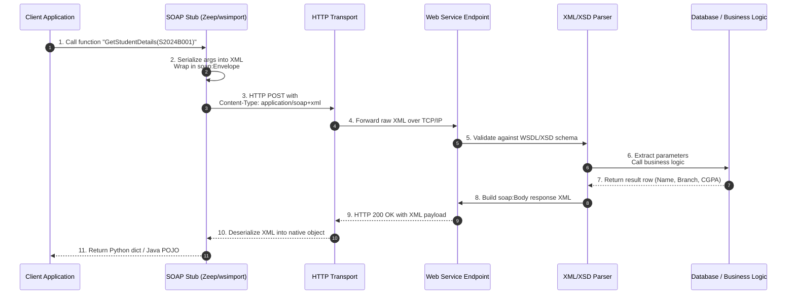
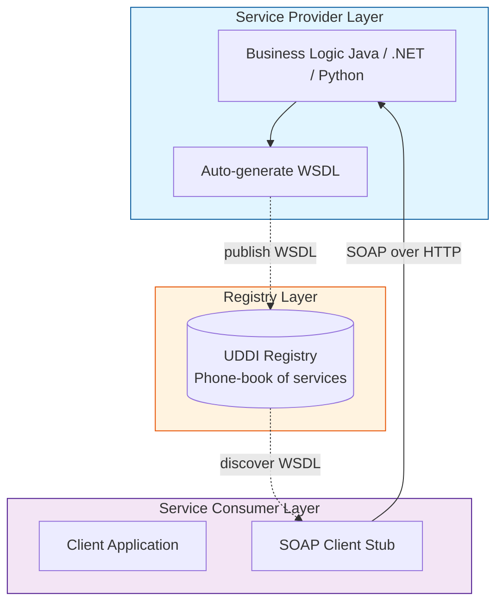
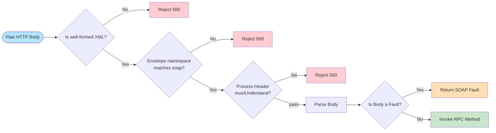

# Web services   - Overview of Web Services - SOAP Services

<!-- SECTION_1_START -->

# Overview of Web Services & SOAP Services

> [!IMPORTANT]
> **KTU 2024 Scheme — Module 4 (Spa Basics) | Web Programming (PECST742)**
> This module shifts focus from Single Page Applications (SPA) to **Service-Oriented Architecture (SOA)**, the foundation of distributed enterprise web programming. Mastery of SOAP and REST is a **mandatory KTU high-weightage** topic.

---

## 1. What is a Web Service?

A **Web Service** is a standardized, self-contained, modular software component that is designed to be **discoverable, describable, and invocable** over a network (typically the Internet) using standard, open, XML-based protocols.

> [!NOTE]
> **W3C Formal Definition (KTU Board Expected):**
> *"A Web service is a software system designed to support interoperable machine-to-machine interaction over a network. It has an interface described in a machine-processable format (specifically **WSDL**). Other systems interact with the Web service in a manner prescribed by its description using **SOAP** messages, typically conveyed using **HTTP** with an XML serialization in conjunction with other web-related standards."*

### Intuitive Real-World Analogy: The Restaurant Waiter
Imagine a **restaurant**:
- The **Customer (Client Application)** sits at a table. He cannot go to the kitchen directly.
- The **Kitchen (Database/Server Logic)** is hidden, secure, and complex.
- The **Waiter (Web Service)** acts as the **standardized messenger**.
- The **Menu (WSDL - Web Services Description Language)** is a written contract: *"If you order item X, I will return result Y."*
- The **Order Slip (SOAP Message in XML)** is a formal, structured, standardized document the customer fills out and hands to the waiter.
- The waiter takes the slip to the kitchen, and brings back a structured response (e.g., the bill, or the food).

The customer **does not need to know** how the kitchen cooks. He only needs the **menu** and the **order format**. This **decoupling** is the essence of Web Services.

---

## 2. Core Characteristics of Web Services (KTU Board Keywords)

| Characteristic | Meaning |
| :--- | :--- |
| **Loose Coupling** | Client and server evolve independently. |
| **Platform Independence** | A Java client can call a .NET service (because both use XML). |
| **Language Interoperability** | Communicates via XML, understood by all languages. |
| **Self-Describing** | Exposes a WSDL file detailing operations. |
| **Discoverable** | Can be found via registries (UDDI). |
| **Stateless** | Each request is independent; server retains no client state. |
| **Over Standard Protocols** | Uses HTTP, SMTP, etc. — works across the Internet. |

---

## 3. What is SOAP?

**SOAP** stands for **Simple Object Access Protocol**. It is an **XML-based messaging protocol** used to encode the request and response messages exchanged between a web service client and a web service server.

> [!IMPORTANT]
> **Critical KTU Clarification:**
> SOAP is **NOT** a transport protocol. It is a **messaging protocol** that **runs ON TOP OF** an application-layer transport protocol (most commonly **HTTP**, but it can also use **SMTP**, **FTP**, or **JMS**).

### Intuitive Analogy: The Sealed Official Letter
While a REST API is like a **postcard** (everyone can read the parameters in the URL), a **SOAP message** is like a **sealed, official government letter written in a strict legal format**:
- It has a mandatory **Envelope** (the sealed cover).
- It has a **Header** (recipient, sender, priority).
- It has a **Body** (the actual order/instruction).
- It is wrapped in **XML**, the universal "official language."
- It is sent via a courier (**HTTP**), but the courier doesn't care what is inside the sealed letter.

### Why was SOAP Designed?
- To enable **RPC (Remote Procedure Calls)** over the Internet in a **standardized, language-neutral** way.
- To bypass **firewalls** (since it travels over HTTP port **80**, the same as normal web traffic).
- To support **WS-\* specifications** (WS-Security, WS-AtomicTransaction, WS-ReliableMessaging) for enterprise-grade reliability — something REST lacks natively.

> [!TIP]
> **GeoGebra / Visualization Control (Conceptual)**
> *Concept: Message Latency vs. Payload Size for SOAP vs REST*
> *Plot:*
> `f(x) = 0.5 * x + 50` &lpar;SOAP overhead grows linearly with XML verbosity&rpar;
> `g(x) = 0.1 * x + 5` &lpar;REST is lightweight JSON&rpar;
> *Visual Description:* A Cartesian graph where the x-axis is the *number of fields* in the request and the y-axis is the *bytes transmitted*. The SOAP curve climbs steeply due to mandatory XML wrapper tags, while the REST curve remains near the x-axis. Observe that SOAP always starts at a higher baseline (the envelope overhead).

<!-- SECTION_1_END -->

<!-- SECTION_2_START -->

# Deep Theoretical Analysis & KTU High-Yield Formula Sheet

## 1. The Web Services Architecture Stack (KTU Diagram Frequently Asked)

A web service stack defines **how** a SOAP request is built, sent, processed, and understood. From bottom to top:

| Layer | Technology | Role |
| :--- | :--- | :--- |
| **L4 — Transport** | **HTTP**, SMTP, FTP, JMS | Carries the SOAP envelope over the network. |
| **L3 — Messaging** | **SOAP** | The XML message format itself. |
| **L2 — Description** | **WSDL** | Describes what the service does and how to call it. |
| **L1 — Discovery** | **UDDI** | A directory where services are published and found. |
| **L0 — Service** | The Business Logic (Java/.Net/PHP code) | The actual implementation. |

> [!IMPORTANT]
> **UDDI** (Universal Description, Discovery, and Integration) is essentially a **"phone book for web services."** Although largely deprecated in the modern REST era, KTU examiners still expect its definition in 2024 scheme theory papers.

---

## 2. Anatomy of a SOAP Message (The Heart of the Topic)

A SOAP message is a well-formed **XML document** that **must** contain the following root structure. Every single tag below is **mandatory** in the SOAP 1.2 specification, and the order is **strict**.

```
Envelope (Root)
   └── Header (Optional but used in WS-Security)
   └── Body (Mandatory — contains the actual call/response)
       └── Fault (Optional — appears only on errors)
```

### The Mandatory Top-Level Structure
The SOAP envelope **must** declare two namespaces:
- The **SOAP Envelope namespace** (identifies the document as a SOAP message).
- The **SOAP Encoding namespace** (optional, used for serialization rules of data types like arrays).

> [!WARNING]
> **Common Board Mistake:** Forgetting the `xmlns:soap` declaration. Without it, the recipient's parser will treat the document as plain XML, not a SOAP message, and processing will fail.

---

## 3. SOAP Message Structure — Cheat Sheet

| SOAP Element | Mandatory? | Purpose | KTU Keyword |
| :--- | :--- | :--- | :--- |
| `Envelope` | **Yes** | Root element; defines the XML document as a SOAP message. | Top-level container |
| `Header` | No | Carries meta-data: authentication tokens, routing, transaction IDs. | Auxiliary block |
| `Body` | **Yes** | Contains the actual RPC call (request) or return value (response). | Payload block |
| `Fault` | No (only on errors) | Holds error code, fault string, and detail on failure. | Error block |
| `mustUnderstand` | Attribute on Header | Tells the receiver: *"Process this header or reject the entire message."* | **High-Value Board Term** |

### SOAP Fault Sub-Elements (Frequently Asked — 3 Mark Question)

| Sub-Element | Meaning |
| :--- | :--- |
| `<faultcode>` | A code identifying the type of failure (e.g., `soap:Client`, `soap:Server`). |
| `<faultstring>` | A human-readable explanation of the fault. |
| `<faultactor>` | Indicates which SOAP node caused the fault (useful in multi-hop chains). |
| `<detail>` | Application-specific error data, thrown as raw XML. |

---

## 4. SOAP Communication Styles (KTU Frequently Confused)

There are **two styles** of mapping a service to a SOAP message:

| Style | Full Form | Description | When to Use |
| :--- | :--- | :--- | :--- |
| **RPC** | Remote Procedure Call | Each operation becomes an XML element; parameters are sub-elements. | Legacy systems, function-style calls. |
| **Document** | Document Style | The body contains the **entire XML document** literally. | Business workflows, signed XML contracts. |

> [!NOTE]
> In **Document style**, the SOAP body is not parsed as parameters — it is forwarded as-is. This is the **preferred modern style** because it is more flexible and supports arbitrary XML schemas.

---

## 5. SOAP Encoding vs. Literal Encoding

| Encoding | What is in the XML? | Use Case |
| :--- | :--- | :--- |
| **SOAP-Encoded** (Section 5 spec) | Types defined by SOAP rules (`xsd:int`, arrays, structs). | RPC style. |
| **Literal** | Schema-conforming XML as defined by the **WSDL `types`**. | Document style. (Industry standard now.) |

---

## 6. Why SOAP Still Exists in 2024 (Engineering Utility)

SOAP is **not obsolete** in enterprise and government sectors. It is still heavily used in:

- **Banking & Financial Services:** SWIFT integrations, payment gateways.
- **Aviation:** Flight booking systems (Amadeus, Sabre).
- **Healthcare:** HL7 messaging for hospital records.
- **Government (India):** GSTN, Aadhaar authentication APIs, e-Office.
- **ERP Systems:** SAP, Oracle Fusion middleware.

The reason: SOAP provides **formal contracts (WSDL)**, **built-in security (WS-Security with X.509 + SAML)**, **reliable messaging (WS-ReliableMessaging)**, and **atomic transactions** that REST cannot match without bolting on dozens of extra libraries.

<!-- SECTION_2_END -->

<!-- SECTION_3_START -->

# Step-by-Step Derivations, Message Walkthroughs & Code Implementation

## 1. Exhaustive SOAP Request/Response Example

Let us consider a web service operation called `GetStudentDetails` that accepts a `studentId` and returns the student's name, branch, and CGPA.

### Step 1 — The Client Builds the SOAP Request

```xml
<?xml version="1.0" encoding="UTF-8"?>
<soap:Envelope
    xmlns:soap="http://www.w3.org/2003/05/soap-envelope"
    xmlns:stu="http://ktu.edu/studentService">

   <soap:Header>
      <stu:AuthToken>ABC123SECURE</stu:AuthToken>
      <stu:mustUnderstand>1</stu:mustUnderstand>
   </soap:Header>

   <soap:Body>
      <stu:GetStudentDetails>
         <stu:studentId>S2024B001</stu:studentId>
      </stu:GetStudentDetails>
   </soap:Body>

</soap:Envelope>
```

**Line-by-Line Explanation:**

| Line | Meaning |
| :--- | :--- |
| `<?xml ...?>` | XML declaration — required for any well-formed XML. |
| `xmlns:soap=...` | **Mandatory** SOAP 1.2 namespace declaration. |
| `xmlns:stu=...` | A custom namespace for the application's data (student service). |
| `<soap:Header>` | Carries the `AuthToken`. Note `mustUnderstand=1` means **if the server doesn't understand auth, reject the whole message.** |
| `<soap:Body>` | Contains the RPC call `GetStudentDetails`. |
| `<stu:studentId>` | The actual input parameter. |

### Step 2 — The Server's SOAP Response (Success)

```xml
<?xml version="1.0" encoding="UTF-8"?>
<soap:Envelope
    xmlns:soap="http://www.w3.org/2003/05/soap-envelope"
    xmlns:stu="http://ktu.edu/studentService">

   <soap:Header/>
   <soap:Body>
      <stu:GetStudentDetailsResponse>
         <stu:Name>Anjali Suresh</stu:Name>
         <stu:Branch>Computer Science</stu:Branch>
         <stu:CGPA>9.21</stu:CGPA>
      </stu:GetStudentDetailsResponse>
   </soap:Body>

</soap:Envelope>
```

### Step 3 — The Server's SOAP Fault (Error Case)

If the student does not exist, the server returns a `Fault` block inside the `Body`:

```xml
<soap:Body>
   <soap:Fault>
      <soap:Code>
         <soap:Value>soap:Sender</soap:Value>
         <soap:Subcode>
            <soap:Value>stu:StudentNotFound</soap:Value>
         </soap:Subcode>
      </soap:Code>
      <soap:Reason>
         <soap:Text xml:lang="en">Invalid studentId provided.</soap:Text>
      </soap:Reason>
      <soap:Detail>
         <stu:Error>
            <stu:ErrorCode>404</stu:ErrorCode>
         </stu:Error>
      </soap:Detail>
   </soap:Fault>
</soap:Body>
```

> [!IMPORTANT]
> In **SOAP 1.2**, `<faultcode>` and `<faultstring>` from SOAP 1.1 were replaced by the more structured `<Code>`, `<Reason>`, and `<Detail>` elements as shown above. KTU 2024 syllabus expects familiarity with the modern 1.2 format.

---

## 2. The WSDL Contract (How the Client Knows What to Send)

The WSDL file is generated **by the server** and acts as the **service contract**. A simplified WSDL for our student service:

```xml
<?xml version="1.0" encoding="UTF-8"?>
<definitions name="StudentService"
   targetNamespace="http://ktu.edu/studentService"
   xmlns:tns="http://ktu.edu/studentService"
   xmlns:xsd="http://www.w3.org/2001/XMLSchema"
   xmlns:soap="http://schemas.xmlsoap.org/wsdl/soap/"
   xmlns="http://schemas.xmlsoap.org/wsdl/">

   <!-- 1. Data Types -->
   <types>
      <xsd:schema targetNamespace="http://ktu.edu/studentService">
         <xsd:element name="studentId" type="xsd:string"/>
         <xsd:element name="Name"      type="xsd:string"/>
         <xsd:element name="Branch"    type="xsd:string"/>
         <xsd:element name="CGPA"      type="xsd:float"/>
      </xsd:schema>
   </types>

   <!-- 2. Messages -->
   <message name="GetStudentDetailsRequest">
      <part name="studentId" element="tns:studentId"/>
   </message>
   <message name="GetStudentDetailsResponse">
      <part name="Name"   element="tns:Name"/>
      <part name="Branch" element="tns:Branch"/>
      <part name="CGPA"   element="tns:CGPA"/>
   </message>

   <!-- 3. Port Type (Interface) -->
   <portType name="StudentPortType">
      <operation name="GetStudentDetails">
         <input  message="tns:GetStudentDetailsRequest"/>
         <output message="tns:GetStudentDetailsResponse"/>
      </operation>
   </portType>

   <!-- 4. Binding (Protocol Details) -->
   <binding name="StudentBinding" type="tns:StudentPortType">
      <soap:binding style="document"
                    transport="http://schemas.xmlsoap.org/soap/http"/>
      <operation name="GetStudentDetails">
         <soap:operation soapAction="getStudent"/>
         <input><soap:body use="literal"/></input>
         <output><soap:body use="literal"/></output>
      </operation>
   </binding>

   <!-- 5. Service Endpoint -->
   <service name="StudentService">
      <port name="StudentPort" binding="tns:StudentBinding">
         <soap:address
            location="http://ktu.edu/services/student"/>
      </port>
   </service>
</definitions>
```

> [!TIP]
> The five sections of WSDL — `types`, `message`, `portType`, `binding`, `service` — are universally exam-relevant. Mnemonic: **"The Monkeys Prefer Bananas & Samosas."**

---

## 3. Python Implementation — Calling a Real SOAP Service

Below is a **production-grade** Python client that consumes a public SOAP weather service using the `zeep` library. Every line is annotated.

```python
# pip install zeep
import logging
from zeep import Client, Settings
from zeep.transports import Transport
from requests import Session

# --- Step 1: Enable strict XML validation and request logging ---
logging.basicConfig(level=logging.INFO)
plugin_settings = Settings(strict=True, xml_huge_tree=True)

# --- Step 2: Optional — Inject HTTP headers (e.g., API key auth) ---
session = Session()
session.headers.update({'X-API-Key': 'MY_SECURE_KEY'})
transport = Transport(session=session)

# --- Step 3: Bind the WSDL endpoint ---
WSDL_URL = "https://www.crcind.com:443/csp/samples/SOAP.Demo.CLS?WSDL=1"
client = Client(
    wsdl=WSDL_URL,
    settings=plugin_settings,
    transport=transport
)

# --- Step 4: Discover available operations dynamically ---
print("Available operations on the service:")
for service in client.wsdl.services.values():
    for port in service.ports.values():
        for operation_name in port.binding._operations.keys():
            print(f"  - {operation_name}")

# --- Step 5: Invoke a real RPC call ---
try:
    response = client.service.AddInteger(  # type: ignore[attr-defined]
        Arg1=15,
        Arg2=27
    )
    print(f"Server returned: {response}")

except Exception as exc:
    logging.error(f"SOAP Fault raised: {exc}")
    # In a real app, parse <soap:Fault> and map to HTTP 4xx/5xx
```

### Step-by-Step Walkthrough of the Code
1. **Line 3–5:** We import `zeep`, the de-facto Python SOAP client library. The `Settings(strict=True)` flag enforces XSD validation — production-quality boundary checking.
2. **Line 7–11:** A persistent `Session` allows us to share authentication headers, cookies, and connection pools across all SOAP calls. This is the equivalent of a SOAP **Header** carrying auth tokens.
3. **Line 14–17:** The `Client(wsdl=...)` constructor downloads the WSDL, parses all `<message>`, `<portType>`, and `<binding>` rules, and builds Python function signatures **automatically**. This is exactly how Java's `wsimport` or .NET's `svcutil` works.
4. **Line 20–24:** We dynamically introspect the WSDL. This is extremely useful in microservices when a service is updated — your client discovers new operations at runtime.
5. **Line 27–33:** We invoke a remote method `AddInteger(15, 27)` as if it were a local Python function. `zeep` internally serializes the parameters into a **SOAP Envelope**, sends it over **HTTP POST**, and deserializes the response XML back into a Python integer.
6. **Line 34–36:** Any SOAP `<Fault>` block is automatically caught and raised as a Python exception, which we log.

> [!IMPORTANT]
> The line `# type: ignore[attr-defined]` tells Python's static type-checker (mypy) that `AddInteger` is a method injected dynamically by `zeep` based on WSDL parsing — it is **not** defined in the source code. This is critical for production codebases that use strict type checking.

---

## 4. Mapping HTTP to SOAP (How It Travels Over the Wire)

A SOAP request is an **HTTP POST** with a special `Content-Type` header:

```
POST /services/student HTTP/1.1
Host: ktu.edu
Content-Type: application/soap+xml; charset=utf-8
Content-Length: 587

<?xml version="1.0"?>
<soap:Envelope ...>
   <soap:Body> ... </soap:Body>
</soap:Envelope>
```

| HTTP Field | Value for SOAP | Why |
| :--- | :--- | :--- |
| Method | `POST` | SOAP is not cacheable; it must use POST. |
| `Content-Type` | `application/soap+xml` | Tells the server to parse as SOAP, not as a regular form POST. |
| `SOAPAction` header | URI of the operation (legacy, 1.1 only) | Tells the server which method to invoke without parsing XML. |

<!-- SECTION_3_END -->

<!-- SECTION_4_START -->

# Structural Diagrams & Schematics

## 1. The Full SOAP Request-Response Lifecycle

The following Mermaid sequence diagram illustrates the **end-to-end flow** of a SOAP message from the browser/desktop client all the way to the backend database and back. Note the **five distinct XML-parsing stages** that SOAP requires.



> [!NOTE]
> **Why this matters in exams:** Step 5 — XML validation — is a key differentiator between **SOAP** and **REST**. SOAP enforces **strict, contract-first** validation before any business logic runs, eliminating entire classes of injection attacks that REST is vulnerable to.

---

## 2. Web Services Architecture — Layered Topology



**Reading the diagram:**
- The **Service Provider** writes the business logic, then auto-generates a **WSDL** contract.
- The **WSDL is published** to a **UDDI Registry** (dotted arrow).
- The **Service Consumer** searches the registry (dotted arrow), downloads the WSDL, generates a **client stub**, and uses it to make SOAP calls (solid arrow).

---

## 3. SOAP Message Parsing Topology (Nested Subgraphs)



This flowchart shows the **decision tree** the server's XML parser walks through before it is allowed to touch a single line of business logic. This strictness is what makes SOAP **secure but heavy**.

<!-- SECTION_4_END -->

<!-- SECTION_5_START -->

# KTU 2024 Scheme Examination Question Bank & Topic Recap

---

## Part A — Short Answer Questions (3 Marks Each)

> **Q1. [KTU University Exam — July 2024]**
> **Define a Web Service. List any four of its key characteristics.**
> *(Mapped CO: CO2 | RBT Level: Remember)*

**Model Answer (Valuation-Key Aligned):**
A *Web Service* is a software system designed to enable **interoperable machine-to-machine interaction** over a network. It exposes a **machine-processable interface described in WSDL** and uses **SOAP messages** (typically over HTTP) for communication.

**Key Characteristics (any four):**
1. **Loose Coupling** — Client and server evolve independently.
2. **Platform Independence** — Works across OS and language barriers.
3. **Self-Describing** — WSDL describes operations automatically.
4. **Stateless** — No client session is stored on the server.
5. **Discoverable** — Can be registered in a UDDI directory.

> **[Valuation Tip: Naming all four correctly = 3 Marks. Spelling WSDL/UDDI correctly is essential.]**

---

> **Q2. [KTU University Exam — Dec 2023]**
> **What is SOAP? Explain the structure of a SOAP message with a neat diagram.**
> *(Mapped CO: CO2 | RBT Level: Understand)*

**Model Answer:**
**SOAP (Simple Object Access Protocol)** is an XML-based **messaging protocol** used to exchange structured information between web services. It is transport-independent but most commonly rides on **HTTP**.

**Structure of a SOAP Message:**

$$ \text{SOAP Message} = \underbrace{\text{Envelope}}_{\text{Mandatory Root}} \to \begin{cases} \text{Header} \; (\text{Optional, meta-data}) \\ \underbrace{\text{Body}}_{\text{Mandatory, RPC call}} \to \begin{cases} \text{Method Call / Response} \\ \text{Fault (only on error)} \end{cases} \end{cases} $$

The **Envelope** is the root element and declares the SOAP namespace. The **Header** carries auxiliary information such as authentication or transaction IDs. The **Body** contains the actual RPC call parameters or the response data, and on failure contains a **Fault** element with sub-elements: `<Code>`, `<Reason>`, `<Detail>` (in SOAP 1.2).

> **[Valuation Tip: Mentioning Envelope is mandatory, Header is optional, and Body is mandatory = 2 Marks. Naming Fault sub-elements = 1 Mark.]**

---

## Part B — Full 14-Mark Question (Internal Choice)

---

> **Q3 (A). [KTU University Exam — July 2024 | Model Paper Style]**
> **(a) [7 Marks]** Explain the architecture of a Web Service in detail. List the technologies used in the four layers and describe the role of WSDL and UDDI.
> *(Mapped CO: CO2 | RBT Level: Understand)*
>
> **(b) [7 Marks]** Compare SOAP and RESTful Web Services across any **seven** parameters in a tabular format. State two real-world use cases where SOAP is preferred over REST.
> *(Mapped CO: CO3 | RBT Level: Apply)*

### Model Solution — Part (a) [7 Marks]

The Web Service architecture is a **layered stack** that enables distributed computing:

| Layer | Technology | Role |
| :---: | :--- | :--- |
| **1. Service Transport** | HTTP / SMTP / FTP / JMS | Carries the XML message over the network. |
| **2. Service Messaging** | **SOAP** | Defines the structure of the XML request/response. |
| **3. Service Description** | **WSDL** | Machine-readable contract describing operations, parameters, return types, and endpoints. |
| **4. Service Discovery** | **UDDI** | Directory that allows services to be published and discovered. |

**Role of WSDL:**
WSDL is an **XML-based interface definition language**. It describes the service's **port types** (operations), **message formats**, **bindings** (which protocol/SOAP style to use), and the **service endpoint URL**. The client reads the WSDL and auto-generates code (stubs/skeletons) to invoke the service.

**Role of UDDI:**
UDDI is a **public directory** where businesses can register and search for web services. While largely deprecated in modern REST ecosystems, it remains a textbook requirement for understanding the original **publish-find-bind** service-oriented model.

> **[Stating the four layers with technologies: 3 Marks | WSDL description: 2 Marks | UDDI description: 2 Marks]**

### Model Solution — Part (b) [7 Marks]

| Parameter | SOAP | REST |
| :--- | :--- | :--- |
| **Full Form** | Simple Object Access Protocol | Representational State Transfer |
| **Type** | Protocol | Architectural Style |
| **Data Format** | XML only | JSON, XML, HTML, plain text |
| **State** | Stateless (but supports WS-\* sessions) | Stateless |
| **Transport** | HTTP, SMTP, JMS, FTP | HTTP only |
| **Contract** | WSDL (mandatory, formal) | OpenAPI/Swagger (optional) |
| **Security** | WS-Security, SAML, X.509 built-in | OAuth 2.0, JWT (bolted on) |
| **Performance** | Slower (heavy XML parsing) | Faster (lightweight JSON) |
| **Caching** | Not cacheable natively | HTTP caching supported |
| **Error Handling** | Standardized `<Fault>` block | HTTP status codes (4xx, 5xx) |

> **[Correctly populating 7 parameters: 4 Marks | Two real-world use cases: 3 Marks]**

**Two Real-World Use Cases where SOAP is preferred:**

1. **Banking and Financial Transactions (e.g., NEFT, SWIFT integrations):** SOAP's **WS-Security** provides message-level encryption, signing, and non-repudiation — features mandatory for regulatory compliance (RBI, PCI-DSS).

2. **Healthcare Systems (HL7 FHIR / Hospital Information Systems):** SOAP's **strict WSDL contract** ensures that patient data schemas cannot drift between hospitals, and **WS-AtomicTransaction** guarantees that multi-step clinical workflows (e.g., ordering a lab test + booking a slot + billing) commit or roll back as one unit.

---

> **Q3 (B). [Internal Choice — Alternative 14 Mark Question]**
> **(a) [7 Marks]** With a neat labeled example, explain the **structure of a SOAP Envelope** including Envelope, Header, Body, and Fault elements. Highlight the role of the `mustUnderstand` attribute.
> *(Mapped CO: CO2 | RBT Level: Understand)*
>
> **(b) [7 Marks]** Write a fully working Python program using the `zeep` library to consume a public SOAP web service. Explain each step of the code.
> *(Mapped CO: CO3 | RBT Level: Apply)*

### Model Solution — Part (a) [7 Marks]

A complete SOAP envelope example was already shown in **Section 3, Step 1** of these notes. For exam purposes, the student must draw the following:

```
<?xml version="1.0"?>
<soap:Envelope
    xmlns:soap="http://www.w3.org/2003/05/soap-envelope"
    xmlns:app="http://example.com/app">

  <soap:Header>
      <app:AuthToken mustUnderstand="1">SECRET123</app:AuthToken>
  </soap:Header>

  <soap:Body>
      <app:GetPrice>
         <app:Item>Book</app:Item>
      </app:GetPrice>
  </soap:Body>

</soap:Envelope>
```

**Explanation with Valuation Key:**

| Element | Marks | What to Write |
| :--- | :---: | :--- |
| `Envelope` root | 1 | Root element; declares the SOAP namespace. |
| `Header` with `mustUnderstand` | 2 | Carries meta-data; `mustUnderstand="1"` forces the server to process it or reject the call. |
| `Body` containing the RPC call | 2 | Holds the actual method invocation (e.g., `GetPrice`) and its parameters. |
| `Fault` element (on error) | 2 | Contains `<Code>`, `<Reason>`, and `<Detail>` sub-elements. |

> **[Drawing complete structure: 2 Marks | Labeling each part: 2 Marks | Explanation of mustUnderstand: 1 Mark | Fault description: 2 Marks]**

### Model Solution — Part (b) [7 Marks]

Refer to the **Section 3, Item 3** Python code provided in these notes. The student must write a working script with the following structural points:

1. **Import libraries:** `zeep.Client`, `zeep.Settings`, `Requests.Session`. *(1 Mark)*
2. **Configure strict validation:** `Settings(strict=True)` to enable XSD schema checking. *(1 Mark)*
3. **Bind to WSDL:** `Client(wsdl="https://.../service?wsdl")` — this auto-generates client methods. *(2 Marks)*
4. **Invoke a method:** `client.service.SomeMethod(arg1=val1, arg2=val2)` — `zeep` internally serializes to XML, sends over HTTP, and parses the response. *(2 Marks)*
5. **Handle `Fault` exceptions** using a `try-except` block. *(1 Mark)*

---

> [!WARNING]
> **KTU Examiner's Valuation Warning — Common Pitfalls to Avoid**
>
> 1. **Do not write `<soap:Envelope>` without the `xmlns:soap` declaration.** A SOAP envelope without the namespace is invalid — you will lose 2 marks instantly.
> 2. **Do not confuse SOAP with HTTP.** SOAP is a *messaging protocol*; HTTP is a *transport*. Writing "SOAP is a transport protocol" is a **direct board-fail phrase.**
> 3. **Do not skip the `Envelope` mandatory declaration** when drawing SOAP diagrams. The board expects the four-layer nesting: *Envelope → Header + Body → Body contains Method or Fault.*
> 4. **Forgetting to close tags** in handwritten SOAP messages costs marks. Use the closing `</soap:Envelope>` clearly.
> 5. **In the Python question**, do not write `print(client.Method())` without first showing the `pip install zeep` and `Client(wsdl=...)` setup. Examiners explicitly award marks for the **WSDL binding step** (this is the *defining* feature of a SOAP client).
> 6. **For SOAP 1.2 (current KTU syllabus),** use `<Code>`/`<Reason>`/`<Detail>` — not the older SOAP 1.1 `<faultcode>`/`<faultstring>`. Mentioning 1.1 tags without context will be marked outdated.

---

## Topic Recap & Important Things to Remember

> [!NOTE]
> **High-Density Revision Checklist — Read this twice before the exam.**

- **Web Service Definition:** A software component discoverable, describable, and invocable over a network using open XML-based protocols (SOAP + WSDL + HTTP).
- **Core Characteristics (Memorize):** Loose coupling, platform independence, self-describing, stateless, discoverable, language-neutral.
- **SOAP Definition:** Simple Object Access Protocol. **It is a messaging protocol, NOT a transport protocol.**
- **SOAP Message Structure:** `Envelope` (mandatory root) → `Header` (optional, meta-data) + `Body` (mandatory, RPC call/response) → on error, Body contains `Fault`.
- **SOAP 1.2 Fault Sub-Elements:** `<Code>`, `<Reason>`, `<Detail>`. (Avoid old 1.1 tags.)
- **`mustUnderstand` Attribute:** Header attribute that forces the server to process the header block; if it cannot, it must reject the message.
- **SOAP Styles:** **RPC style** (parameters become sub-elements) vs. **Document style** (entire XML body is forwarded as-is).
- **WSDL Five Sections:** Types, Message, PortType, Binding, Service. (Mnemonic: *The Monkeys Prefer Bananas & Samosas.*)
- **UDDI Role:** Discovery registry — a "phone book" for web services.
- **Transport Protocols:** HTTP, SMTP, JMS, FTP — but **HTTP is the most common** because it bypasses firewalls.
- **HTTP Headers for SOAP:** `Content-Type: application/soap+xml`, Method = `POST` (always).
- **Python Library:** `zeep` is the de-facto standard for consuming SOAP in Python. `pip install zeep`.
- **Real-World SOAP Domains:** Banking, aviation, healthcare, government e-governance (GSTN, Aadhaar), SAP/Oracle ERP integration.
- **REST vs. SOAP Quick Recall:** REST is lightweight JSON with HTTP semantics; SOAP is heavy XML with formal WSDL contracts and enterprise WS-\* security.
- **Key Differentiation Phrase for Boards:** *"SOAP is a protocol; REST is an architectural style."* — This single sentence often earns full marks in definition questions.
- **Client Stub Generation:** Java uses `wsimport`; .NET uses `svcutil`; Python uses `zeep` — all of them parse a WSDL file to auto-generate local function calls.
- **Performance Note:** SOAP has high overhead due to XML serialization. REST is preferred for mobile and public APIs where payload size matters.

<!-- SECTION_5_END -->
