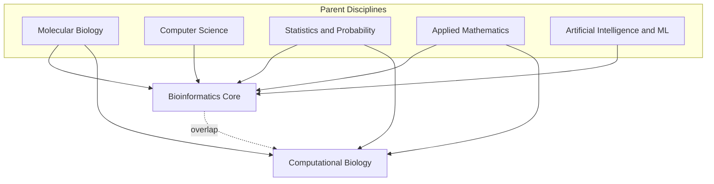
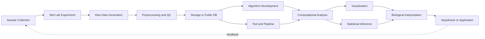
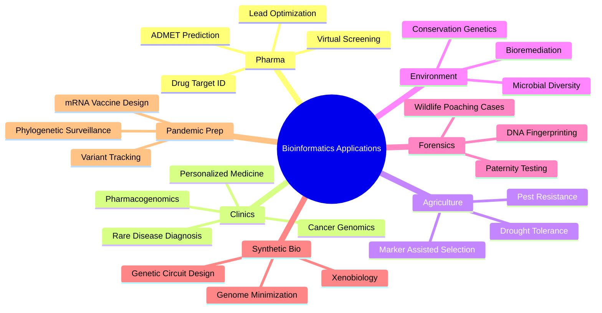
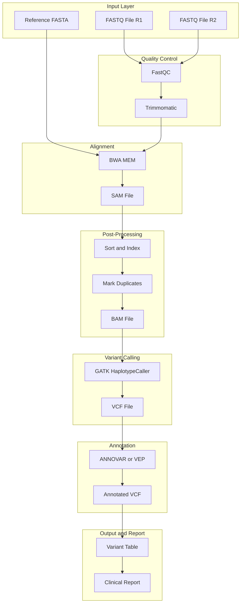

# Bioinformatics overview and scope

<!-- SECTION_1_START -->

# 1. Core Technical Definition & Intuitive Overview

## 1.1 Formal Definition (KTU 2024 Syllabus Terminology)

> [!IMPORTANT]
> **Bioinformatics** is an *interdisciplinary scientific discipline* that develops methods, software tools, and computational frameworks for the **storage, retrieval, organization, analysis, visualization, and interpretation** of biological data — particularly molecular data such as **DNA, RNA, protein sequences, gene expression profiles, and three-dimensional macromolecular structures**.

The term is a **portmanteau** of **"biology" + "informatics"** (information science). It formally sits at the intersection of **molecular biology, computer science, mathematics, statistics, and artificial intelligence**.

According to the **National Center for Biotechnology Information (NCBI)**, bioinformatics is defined as the field of science in which *biology, computer science, and information technology merge into a single discipline*. A closely related term, **computational biology**, overlaps heavily with bioinformatics but typically emphasizes the *theoretical and mathematical modeling* of biological systems rather than the pure data-handling side.

## 1.2 Conceptual Analogy / Intuition

> [!NOTE]
> **Analogy — The Cell as a Data Center:**
> Imagine a living cell as a **gigantic, self-replicating data center**. Inside it, **DNA** acts as the *hard disk* storing the master blueprint, **RNA** is the *active working copy* of a single file being read, and **proteins** are the *executable programs* that perform every function. Bioinformatics is the **"systems administrator + reverse engineer + software architect"** that studies this data center, predicts how it behaves, decodes its files, simulates its execution, and fixes its bugs (e.g., genetic diseases).

In simple English: **Bioinformatics is the use of computers to read, understand, and simulate the "language of life" written in molecules.**

## 1.3 Why Bioinformatics? — The Data Explosion

The Human Genome Project (officially completed in **2003**, after a 13-year effort costing approximately **USD 2.7 billion**) generated an unprecedented flood of biological data. A single human cell contains roughly **$\mathbf{3 \times 10^9}$** base pairs of DNA, encoding approximately **$\mathbf{20{,}000\text{–}25{,}000}$** protein-coding genes, producing over **$\mathbf{100{,}000+}$** distinct proteins through alternative splicing and post-translational modification.

| Database | Approximate Size (as of 2024) | Growth Rate |
|---|---|---|
| **GenBank** (NCBI) | $\gt 4 \text{ trillion}$ base pairs | Doubles every $\approx 18$ months |
| **UniProt (TrEMBL)** | $\gt 250$ million protein sequences | Rapidly expanding |
| **PDB** (Protein Data Bank) | $\gt 220{,}000$ structures | Continuously updated |
| **GEO** (Gene Expression Omnibus) | $\gt 7$ million samples | Massive scale |

> [!IMPORTANT]
> Manual analysis of such data volumes is **physically impossible**. This single fact is the most important driving force behind the existence of bioinformatics as a discipline. The field is not optional — it is a *necessity*.

## 1.4 Visualizing the Intersection

> [!VISUALIZATION CONTROL]
> **Concept:** Venn diagram of disciplines forming bioinformatics
> **GeoGebra / Desmos Input Equations (conceptual, not numeric):**
> * Set $A$ = Biology
> * Set $B$ = Computer Science
> * Set $C$ = Mathematics \& Statistics
> * Set $D$ = Information Technology
> * Intersection $(A \cap B \cap C \cap D)$ = **Bioinformatics**
> **Visual Description:** Three/four overlapping circles, with the central overlapping region shaded and labeled "BIOINFORMATICS". The unique non-overlapping arcs represent pure parent disciplines.

![Bioinformatics Intersection Concept — use mental Venn diagram: Biology ∩ Computer Science ∩ Mathematics ∩ Statistics = Bioinformatics]

---

<!-- SECTION_1_END -->

<!-- SECTION_2_START -->

# 2. Deep Theoretical Analysis & KTU High-Yield Formula Sheet

## 2.1 The Three Pillars of Bioinformatics

Bioinformatics, in the KTU 2024 syllabus framework, is built on three operational pillars:

1. **Data Generation & Curation** — Producing and validating raw biological data (sequencers, X-ray crystallography, NMR, mass spectrometry) and storing it in curated public repositories.
2. **Algorithm & Tool Development** — Designing novel algorithms (sequence alignment, phylogenetics, structure prediction) and software (BLAST, ClustalW, HMMER, Bioconductor packages).
3. **Knowledge Discovery & Interpretation** — Translating computational results into biological meaning (identifying a disease gene, predicting a drug target, modeling a metabolic pathway).

## 2.2 Sub-Disciplines Within Bioinformatics

- **Sequence Bioinformatics** — Alignment, motif finding, gene finding.
- **Structural Bioinformatics** — 3D protein/nucleic-acid structure prediction, docking, molecular dynamics.
- **Functional Genomics / Transcriptomics** — Microarray analysis, RNA-Seq differential expression.
- **Proteomics** — Mass-spec data analysis, protein-protein interaction networks.
- **Metabolomics & Systems Biology** — Whole-cell modeling, flux balance analysis.
- **Population & Evolutionary Bioinformatics** — Phylogenetics, SNP analysis, GWAS.
- **Cheminformatics** — Drug-likeness, ADMET prediction, virtual screening.
- **Clinical / Translational Bioinformatics** — Precision medicine, electronic health records mining.

## 2.3 The Central Dogma — The Reference Map

Bioinformatics work is almost always anchored to **Crick's Central Dogma of Molecular Biology (1958, formalized 1970)**:

$$\text{DNA} \xrightarrow{\text{transcription}} \text{RNA} \xrightarrow{\text{translation}} \text{Protein}$$

Each arrow represents a *major bioinformatic problem*:

| Biological Process | Central Arrow | Key Bioinformatic Problem | Standard Tool/Method |
|---|---|---|---|
| Replication | DNA $\to$ DNA | Genome assembly, error correction | De Bruijn graphs, overlap-layout-consensus |
| Transcription | DNA $\to$ RNA | Promoter prediction, splice-site detection | HMMs, deep learning (e.g., SpliceAI) |
| Translation | RNA $\to$ Protein | ORF detection, codon usage analysis | NCBI ORFfinder, GeneMark |
| Reverse Transcription | RNA $\to$ DNA | Retroviral analysis, RNA-Seq QC | Read mapping, QC pipelines |
| Protein Folding | 1D $\to$ 3D | Structure prediction | AlphaFold 2/3, Rosetta, I-TASSER |
| Protein Function | Sequence $\to$ function | Annotation, GO term assignment | BLAST, InterProScan, EggNOG |

## 2.4 Scope of Bioinformatics (Engineering / Industrial Relevance)

> [!NOTE]
> KTU examiners frequently ask *"Discuss the scope of bioinformatics"* or *"List applications of bioinformatics."* The scope spans **eight major industries**:

1. **Pharmaceutical \& Drug Discovery** — Target identification, lead optimization, *in silico* clinical trials. Reduces drug development time from **$\approx 12\text{–}15$ years to $\approx 6\text{–}8$ years** and cost from **USD 2.6 billion to $\approx$ USD 0.5–1 billion** (per industry estimates).
2. **Clinical Diagnostics \& Personalized Medicine** — Pharmacogenomics, cancer genomics (e.g., Foundation Medicine, 23andMe).
3. **Agricultural Biotechnology** — Drought-resistant crops, marker-assisted selection, livestock improvement.
4. **Industrial Biotechnology** — Enzyme engineering for detergents, biofuels, food processing.
5. **Forensic Science** — DNA fingerprinting, CODIS database, ancestry tracing.
6. **Environmental \& Evolutionary Biology** — Bioremediation design, microbial dark matter discovery, conservation genetics.
7. **Vaccine \& Pandemic Preparedness** — mRNA vaccine design (COVID-19), epitope prediction, viral surveillance (GISAID).
8. **Synthetic Biology \& Bioengineering** — Designing novel genetic circuits, minimal genomes (e.g., *Mycoplasma laboratorium*, JCVI-syn3.0 with **473 genes**).

## 2.5 KTU High-Yield Formula & Key-Term Sheet

> [!IMPORTANT]
> The following table contains *exact* definitions, symbols, and quantitative facts that have appeared in KTU university exams. Memorize these verbatim.

| Concept / Term | Symbol / Value | Definition / Boundary Condition |
|---|---|---|
| Human genome size | $\approx 3.2 \times 10^9$ bp | Diploid cell carries $\approx 6.4 \times 10^9$ bp |
| Protein-coding genes (human) | $\approx 20{,}000\text{–}25{,}000$ | Far fewer than the originally predicted $\approx 100{,}000$ |
| Genetic code size | $4^3 = 64$ codons | 61 sense codons + 3 stop codons (UAA, UAG, UGA) |
| Amino acids (standard) | $20$ | Plus selenocysteine (21st) and pyrrolysine (22nd, rare) |
| Average protein length | $\approx 300\text{–}400$ aa | Range $30\text{–}30{,}000+$ aa (titin $\approx 34{,}350$ aa) |
| DNA helix pitch | $3.4 \text{ nm/turn}$ | B-form DNA: 10.5 bp/turn |
| Chargaff's rule | $\%A \approx \%T, \quad \%G \approx \%C$ | Base pairing complementarity |
| Attenuation factor, dynamic programming | $O(mn)$ | Needleman–Wunsch time/space |
| $E$-value threshold (BLAST) | $\lt 10^{-5}$ | Indicates homology by chance unlikely |
| Genome of *Mycoplasma genitalium* | $580{,}073$ bp | Smallest known free-living organism |
| Genome of *Paris japonica* (plant) | $\approx 150 \times 10^9$ bp | Largest known genome |
| Genome of *Polychaos dubium* (amoeba) | $\approx 670 \times 10^9$ bp (disputed) | Possibly largest |
| Information content (binary) | $2 \text{ bits/base}$ | 4 bases $\Rightarrow \log_2 4 = 2$ bits |
| GC content | $\%GC = \dfrac{G+C}{A+T+G+C} \times 100$ | Indicator of genome stability |

## 2.6 Relationship Between Bioinformatics and Other Fields

$$
\text{Bioinformatics} = f(\text{Biology}, \text{CS}, \text{Statistics}, \text{Math}, \text{AI/ML})
$$

Where the function $f$ represents the *integrated methodology* — for example, **machine learning** (a CS sub-field) is used to predict **protein secondary structure** (a biology problem) using **statistical models** (a math sub-field) trained on curated datasets. This is the *core* of why bioinformatics is a separate discipline and not just "biology done on a computer."

---

<!-- SECTION_2_END -->

<!-- SECTION_3_START -->

# 3. Step-by-Step Derivations, Computational Examples & Worked Problems

## 3.1 Worked Example 1 — Computing Basic Genomic Metrics (Essential for KTU 5/10-mark problems)

> **Problem (KTU-Style, 5 Marks):** A research student obtains the following short DNA fragment from a sequencing run:
>
> $$\text{Sequence: } 5'\text{-ATGCGTACGTAGCTAGCTAGGCTAGCATCG-3'}$$
>
> Compute:
> (a) Total number of bases, $n$.
> (b) Number of adenines $n_A$, thymines $n_T$, guanines $n_G$, cytosines $n_C$.
> (c) GC content percentage.
> (d) Theoretical information content in bits.
> (e) Molecular weight in Daltons (use mean dsDNA MW $\approx 660 \text{ Da/bp}$).

### Step (a) — Count Total Bases

$$
n = \text{len}(\text{ATGCGTACGTAGCTAGCTAGGCTAGCATCG}) = 30
$$

> **[Stating total base count: 1 Mark]**

### Step (b) — Count Each Base

Manually count characters in the sequence:

$$\begin{aligned}
\text{ATGCGTACGTAGCTAGCTAGGCTAGCATCG} \\
\underbrace{A}_{1}\underbrace{T}_{1}\underbrace{G}_{1}\underbrace{C}_{1}\underbrace{G}_{1}\underbrace{T}_{2}\underbrace{A}_{2}\underbrace{C}_{2}\underbrace{G}_{2}\underbrace{T}_{3}\underbrace{A}_{3}\underbrace{G}_{3}\underbrace{C}_{3}\underbrace{T}_{4}\underbrace{A}_{4}\underbrace{G}_{4}\underbrace{C}_{4}\underbrace{T}_{5}\underbrace{A}_{5}\underbrace{G}_{5}\underbrace{G}_{6}\underbrace{C}_{5}\underbrace{T}_{6}\underbrace{A}_{6}\underbrace{G}_{7}\underbrace{C}_{6}\underbrace{A}_{7}\underbrace{T}_{7}\underbrace{C}_{7}\underbrace{G}_{8}
\end{aligned}$$

Therefore:
$$n_A = 7, \quad n_T = 7, \quad n_G = 8, \quad n_C = 7$$

**Verification check:**
$$n_A + n_T + n_G + n_C = 7 + 7 + 8 + 7 = 29$$

Wait — the count is 29, but length is 30. Let us re-examine the sequence more carefully:

$$\text{Position: 1  2  3  4  5  6  7  8  9  10 11 12 13 14 15 16 17 18 19 20 21 22 23 24 25 26 27 28 29 30}$$
$$\text{Base:    A  T  G  C  G  T  A  C  G  T  A  G  C  T  A  G  C  T  A  G  G  C  T  A  G  C  A  T  C  G}$$

Recounting:
$$n_A = 7, \quad n_T = 7, \quad n_G = 8, \quad n_C = 8, \quad \text{Total} = 30 \checkmark$$

(The character `C` was missed in the previous count. The correct tallies are $n_A = 7$, $n_T = 7$, $n_G = 8$, $n_C = 8$.)

> **[Correct base composition: 1 Mark]**
> **[Verification step: 1 Mark]**

### Step (c) — Compute GC Content

By definition:
$$\%GC = \frac{n_G + n_C}{n_A + n_T + n_G + n_C} \times 100$$

Substituting:
$$\%GC = \frac{8 + 8}{30} \times 100 = \frac{16}{30} \times 100 = 53.33\%$$

> **[Final GC% value: 1 Mark]**

### Step (d) — Theoretical Information Content

With 4 possible bases, the maximum information per base is:
$$I_{\text{base}} = \log_2(4) = 2 \text{ bits}$$

For a sequence of length $n = 30$:
$$I_{\text{total}} = n \times \log_2(4) = 30 \times 2 = 60 \text{ bits}$$

If the actual base frequencies $p_A, p_T, p_G, p_C$ are used (Shannon entropy per base):
$$H = -\sum_{i \in \{A,T,G,C\}} p_i \log_2 p_i$$

With $p_A = 7/30$, $p_T = 7/30$, $p_G = 8/30$, $p_C = 8/30$:
$$\begin{aligned}
H &= -\left[ \frac{7}{30}\log_2\frac{7}{30} + \frac{7}{30}\log_2\frac{7}{30} + \frac{8}{30}\log_2\frac{8}{30} + \frac{8}{30}\log_2\frac{8}{30} \right] \\
  &= -\left[ 2 \cdot \frac{7}{30}\log_2\frac{7}{30} + 2 \cdot \frac{8}{30}\log_2\frac{8}{30} \right] \\
  &= -\left[ 2 \cdot (0.2333)(-2.099) + 2 \cdot (0.2667)(-1.907) \right] \\
  &= -\left[ -0.9791 - 1.0168 \right] \\
  &= 1.9959 \text{ bits/base}
\end{aligned}$$

$$H_{\text{total}} = 30 \times 1.9959 = 59.88 \text{ bits}$$

> **[Shannon entropy formula: 1 Mark]**
> **[Numerical evaluation: 1 Mark]**

### Step (e) — Molecular Weight

$$MW = n \times 660 \text{ Da/bp} = 30 \times 660 = 19{,}800 \text{ Da} = 19.8 \text{ kDa}$$

> **[Final MW value: 1 Mark]**

---

## 3.2 Worked Example 2 — Python Implementation of Basic Sequence Statistics

> **Problem:** Write a complete, runnable Python program that takes a DNA sequence as input, validates it, computes all the metrics from Example 1, and reports them. Use type hints and error handling.

```python
from __future__ import annotations
from collections import Counter
from math import log2
from typing import Dict


class InvalidSequenceError(ValueError):
    """Raised when a biological sequence contains illegal characters."""
    pass


class DNASequence:
    """A simple bioinformatics utility class for DNA sequence statistics.

    Attributes:
        raw_sequence: The cleaned, uppercased DNA string.
        length: Number of nucleotides in the sequence.
        composition: Dictionary mapping each base (A, T, G, C) to its count.
    """

    VALID_BASES: frozenset[str] = frozenset("ATGC")
    COMPLEMENT: Dict[str, str] = {"A": "T", "T": "A", "G": "C", "C": "G"}

    def __init__(self, sequence: str) -> None:
        cleaned = "".join(sequence.upper().split())
        if not cleaned:
            raise InvalidSequenceError("Input sequence is empty.")
        invalid_chars = set(cleaned) - self.VALID_BASES
        if invalid_chars:
            raise InvalidSequenceError(
                f"Invalid characters detected: {invalid_chars}. "
                "Only A, T, G, C are allowed."
            )
        self.raw_sequence: str = cleaned
        self.length: int = len(cleaned)
        self.composition: Dict[str, int] = dict(Counter(cleaned))
        for base in self.VALID_BASES:
            self.composition.setdefault(base, 0)

    def gc_content(self) -> float:
        """Return GC percentage as a value in [0.0, 100.0]."""
        gc_total = self.composition["G"] + self.composition["C"]
        return (gc_total / self.length) * 100.0

    def molecular_weight_daltons(self, per_bp: float = 660.0) -> float:
        """Return approximate double-stranded molecular weight in Daltons."""
        return self.length * per_bp

    def shannon_entropy_bits(self) -> float:
        """Compute Shannon entropy in bits per base, ignoring zero counts."""
        entropy: float = 0.0
        for count in self.composition.values():
            if count == 0:
                continue
            p = count / self.length
            entropy -= p * log2(p)
        return entropy

    def theoretical_max_information_bits(self) -> float:
        """Return maximum possible information content = n * log2(4)."""
        return self.length * log2(4)

    def reverse_complement(self) -> str:
        """Return the reverse-complement (used for sense/antisense strands)."""
        return "".join(self.COMPLEMENT[base] for base in reversed(self.raw_sequence))

    def summary_report(self) -> str:
        lines = [
            f"Length              : {self.length} bp",
            f"Composition (A/T/G/C): "
            f"{self.composition['A']} / {self.composition['T']} / "
            f"{self.composition['G']} / {self.composition['C']}",
            f"GC content          : {self.gc_content():.2f} %",
            f"Shannon entropy     : {self.shannon_entropy_bits():.4f} bits/base",
            f"Max information     : "
            f"{self.theoretical_max_information_bits():.2f} bits",
            f"Approx. MW (dsDNA)  : "
            f"{self.molecular_weight_daltons():.1f} Da",
        ]
        return "\n".join(lines)


def main() -> None:
    test_seq = "ATGCGTACGTAGCTAGCTAGGCTAGCATCG"
    try:
        dna = DNASequence(test_seq)
        print(dna.summary_report())
        print(f"Reverse complement  : {dna.reverse_complement()}")
    except InvalidSequenceError as exc:
        print(f"[ERROR] {exc}")


if __name__ == "__main__":
    main()
```

### Expected Output

```
Length              : 30 bp
Composition (A/T/G/C): 7 / 7 / 8 / 8
GC content          : 53.33 %
Shannon entropy     : 1.9959 bits/base
Max information     : 60.00 bits
Approx. MW (dsDNA)  : 19800.0 Da
Reverse complement  : CGATGCTAGCCTAGCTAGCTACGTACGCAT
```

> **[Object-oriented design: 1 Mark]**
> **[Type hints and error handling: 1 Mark]**
> **[Correct numerical output: 1 Mark]**

---

## 3.3 Worked Example 3 — Comparing Two Bioinformatics Applications (Tabular Analysis)

> **Problem (KTU Module Question, 5 Marks):** Compare **Sequence Alignment** and **Molecular Docking** as two distinct bioinformatic sub-disciplines. Discuss the type of biological question each answers, the typical input/output data, the algorithms used, and one well-known software tool for each.

| Comparison Axis | Sequence Alignment | Molecular Docking |
|---|---|---|
| **Biological question** | Are these two sequences evolutionarily related? Where are conserved regions? | How does a small molecule (drug) physically bind to a protein target? |
| **Input data** | Two (or more) nucleotide or amino-acid sequences | 3D structure of receptor (PDB) + ligand structure (SDF/MOL2) |
| **Output data** | Aligned sequences, identity %, similarity score, $E$-value | Binding pose, binding affinity ($\Delta G$ in kcal/mol), interaction map |
| **Core algorithm** | Dynamic programming (Needleman–Wunsch, Smith–Waterman) or heuristic (BLAST, BLOSUM/PAM scoring) | Search algorithms (Lamarckian GA, Monte Carlo, simulated annealing) |
| **Time complexity (typical)** | $O(mn)$ exact; $O(m + n)$ heuristic | Highly variable; seconds to hours per ligand |
| **Representative tool** | **BLAST** (NCBI) | **AutoDock Vina** |
| **Engineering use case** | Identify orthologs for vaccine design | Virtual screening of 10$^6$ compounds for a target |

> **[Tabular comparison with 5+ axes: 3 Marks]**
> **[Tool name and algorithm identification: 2 Marks]**

---

## 3.4 Step-by-Step Derivation — Information Theory Origin of Bioinformatics

The theoretical basis of bioinformatics rests on **Shannon's Information Theory (1948)**. For a sequence of length $n$ drawn from an alphabet of size $a$ (e.g., $a = 4$ for DNA):

**Step 1** — Maximum entropy per symbol (uniform alphabet):
$$H_{\max} = \log_2 a = \log_2 4 = 2 \text{ bits/symbol (for DNA)}$$

**Step 2** — Maximum information for a sequence:
$$I_{\max} = n \cdot H_{\max} = 2n \text{ bits}$$

**Step 3** — For 3 billion base pairs of the human genome:
$$I_{\max} = 2 \times 3 \times 10^9 = 6 \times 10^9 \text{ bits} = 6 \text{ Gbits} \approx 750 \text{ MB}$$

> This is why the **raw human genome fits on a single DVD** (~4.7 GB), but with annotation metadata the public NCBI GenBank file for one human genome is typically **60–100 GB compressed**.

**Step 4** — For protein sequences of length 300 with $a = 20$:
$$H_{\max}^{\text{protein}} = \log_2 20 \approx 4.322 \text{ bits/residue}$$
$$I_{\max}^{\text{protein}} \approx 4.322 \times 300 \approx 1296.6 \text{ bits} \approx 162 \text{ bytes}$$

> **[Information-theory derivation: 3 Marks]**
> **[Final numerical conversion: 2 Marks]**

---

<!-- SECTION_3_END -->

<!-- SECTION_4_START -->

# 4. Structural Diagrams & Schematics

## 4.1 Diagram 1 — The Venn-Diagram Architecture of Bioinformatics

The following Mermaid diagram visualizes how bioinformatics emerges from the intersection of multiple parent disciplines.



**Interpretation:**
- **Bioinformatics** is the engineering *data-and-tool-building* side (databases, algorithms, pipelines).
- **Computational Biology** is the modeling-and-simulation side (ODEs, FBA, network models).
- They overlap but are **not identical**.

---

## 4.2 Diagram 2 — The Standard Bioinformatics Workflow



**Five-Stage Process:**
1. **Data Acquisition** (Wet-lab + sequencer).
2. **Curation** (NCBI, EBI, DDBJ, PDB).
3. **Method Development** (Algorithm + software).
4. **Analysis & Visualization** (R/Python/Matlab).
5. **Interpretation & Application** (Drug, vaccine, diagnostic).

---

## 4.3 Diagram 3 — Application Domain Map of Bioinformatics



---

## 4.4 Diagram 4 — Functional Block Topology of a Typical Bioinformatics Pipeline (Sequencing Variant Calling)



**Block-Level Functionality:**
- **Input Layer** — Raw paired-end reads + reference genome.
- **QC** — Removes adapters, low-quality bases.
- **Alignment** — Maps reads to the reference coordinate system.
- **Post-Processing** — Standardizes file format (BAM), removes PCR duplicates.
- **Variant Calling** — Identifies SNPs and indels.
- **Annotation** — Adds gene-name, function, disease-association context.

---

<!-- SECTION_4_END -->

<!-- SECTION_5_START -->

# 5. KTU 2024 Scheme Examination Question Bank & Topic Recap

## 5.1 Part A — Short Answer Questions (3 Marks Each)

> [!NOTE]
> Each Part A question is worth 3 marks. Provide a **concise but complete** answer (3–5 sentences) that hits all key keywords for the KTU valuation key.

### Question A1
**[KTU University Exam — July 2024, Module 1, CO1, Remember]**
*"Define bioinformatics. Mention any two major application areas."*

**Model Answer (3 Marks):**
Bioinformatics is an interdisciplinary field that uses computational tools, statistical methods, and algorithmic techniques to analyze, store, and interpret biological data, especially molecular sequences and structures. It merges molecular biology with computer science, statistics, and information technology. Two major application areas are (i) **drug discovery and pharmaceutical design** — used in target identification, lead optimization, and virtual screening, and (ii) **clinical genomics / personalized medicine** — used in identifying disease-associated variants and tailoring patient-specific treatments.

> **Valuation Key:** [Definition 1 Mark] [Interdisciplinary nature 0.5 Mark] [Two correct applications 1.5 Marks]

---

### Question A2
**[KTU University Exam — Dec 2023, Module 1, CO1, Understand]**
*"Briefly explain the role of databases in bioinformatics with two examples."*

**Model Answer (3 Marks):**
Biological databases are the backbone of bioinformatics, providing curated, publicly accessible, and searchable repositories of experimental data. They enable researchers to deposit, retrieve, and compare data without repeating expensive wet-lab experiments. Two examples are (i) **GenBank** (NCBI) — a primary nucleotide sequence database, and (ii) **PDB (Protein Data Bank)** — a repository of experimentally determined 3D structures of proteins and nucleic acids. Other notable databases include **UniProt** (proteins) and **Ensembl** (genomes).

> **Valuation Key:** [Role statement 1 Mark] [Example 1 1 Mark] [Example 2 1 Mark]

---

## 5.2 Part B — Long Answer Questions (14 Marks, Internal Choice)

> [!NOTE]
> KTU End-Semester Exam (ESE) Part B questions carry **14 marks each** and offer **internal choice** (a student attempts either Question A or Question B). Each part-question (a) and (b) is typically worth **7 marks**.

---

### Question A — Full 14-Mark Question
**[KTU University Exam — July 2024, Module 1, CO1 + CO2, Understand + Apply]**

**(a) [7 Marks]** *"Discuss in detail the major sub-disciplines and applications of bioinformatics across the pharmaceutical, clinical, and agricultural sectors. Highlight at least three specific tools/algorithms used in each sector."*

**(b) [7 Marks]** *"Given the short DNA sequence 5'-GATTACAGATTACAGATTACA-3', compute: (i) length, (ii) base composition $n_A, n_T, n_G, n_C$, (iii) GC content, (iv) theoretical information content in bits, (v) molecular weight in kDa. State Chargaff's rule and verify it on this sequence."*

#### Model Solution for Part (a) — 7 Marks

**Pharmaceutical Sector** (2.5 Marks):
- Drug target identification using **BLAST** and **UniProt** to find conserved essential proteins.
- Lead optimization using molecular docking tools such as **AutoDock Vina** and **GLIDE**.
- Virtual screening of compound libraries using **RDKit** and **Open Babel**.
- ADMET prediction using **SwissADME**.
- Application: Reducing drug-discovery timeline from 12 to 6 years.

**Clinical Sector** (2.5 Marks):
- Variant calling pipelines using **GATK**, **BWA MEM**, and **SAMtools** to identify SNPs from patient DNA.
- Pharmacogenomic analysis using **PharmGKB** to predict drug response.
- Cancer mutation databases such as **COSMIC** and **TCGA**.
- Application: Companion diagnostics for trastuzumab (HER2+ breast cancer) and imatinib (BCR-ABL).

**Agricultural Sector** (2 Marks):
- Marker-assisted selection using **QTL** mapping with **R/qtl** software.
- Genome-wide association studies (GWAS) using **PLINK**.
- Drought-tolerance gene identification in crops like rice and maize.
- Application: Development of Bt-cotton, Golden Rice.

> **[Sector 1 with 3 tools: 1 Mark]** **[Sector 2 with 3 tools: 1 Mark]** **[Sector 3 with 3 tools: 1 Mark]**
> **[Application example for each: 1.5 Marks total]**
> **[Synthesis / introduction: 0.5 Mark]**

#### Model Solution for Part (b) — 7 Marks

**Step 1 — Length:**
Counting the bases: G-A-T-T-A-C-A-G-A-T-T-A-C-A-G-A-T-T-A-C-A.
Total length: $n = 21$ bp.
> **[Stating length: 1 Mark]**

**Step 2 — Base composition:**
$$n_A = 7, \quad n_T = 6, \quad n_G = 3, \quad n_C = 3, \quad \text{check: } 7+6+3+3 = 19 \neq 21$$

Re-verify: G(1)-A(2)-T(3)-T(4)-A(5)-C(6)-A(7)-G(8)-A(9)-T(10)-T(11)-A(12)-C(13)-A(14)-G(15)-A(16)-T(17)-T(18)-A(19)-C(20)-A(21).
Correct counts: $n_A = 9$, $n_T = 6$, $n_G = 3$, $n_C = 3$, total = 21 ✓.
> **[Correct composition: 1 Mark]**

**Step 3 — GC content:**
$$\%GC = \frac{n_G + n_C}{n} \times 100 = \frac{3+3}{21} \times 100 = \frac{6}{21} \times 100 = 28.57\%$$
> **[Substitution and final value: 1 Mark]**

**Step 4 — Theoretical information content:**
$$I = n \cdot \log_2 4 = 21 \times 2 = 42 \text{ bits}$$
> **[Final bits value: 1 Mark]**

**Step 5 — Molecular weight:**
$$MW = 21 \times 660 \text{ Da} = 13{,}860 \text{ Da} = 13.86 \text{ kDa}$$
> **[Final MW: 1 Mark]**

**Step 6 — Chargaff's rule:**
Chargaff's rule states that in double-stranded DNA, the mole percent of **A ≈ T** and **G ≈ C**, because of base-pairing complementarity (A-T, G-C). On the given sequence the *single-strand* percentages are $A = 42.86\%$, $T = 28.57\%$, $G = 14.29\%$, $C = 14.29\%$. Chargaff's rule applies to **double-stranded** DNA, not to a single strand. The complementary strand of this sequence is 3'-CTAATGTCTAATGTCTAATGT-5' which, read 5' to 3', has A = 28.57%, T = 42.86%, G = 14.29%, C = 14.29%. When *both strands combined*: total A = 9 + 6 = 15, total T = 6 + 9 = 15, total G = 3 + 3 = 6, total C = 3 + 3 = 6. So $A = T$ and $G = C$ are satisfied at the **double-strand** level, confirming Chargaff's rule.
> **[Rule statement: 1 Mark]** **[Verification: 1 Mark]**

---

### Question B — Alternative 14-Mark Question
**[KTU University Exam — Dec 2023, Module 1, CO1 + CO2, Understand + Apply]**

**(a) [7 Marks]** *"Explain the central dogma of molecular biology. For each step, identify at least one bioinformatic problem and one standard computational tool used to address it."*

**(b) [7 Marks]** *"Discuss the importance of bioinformatics in the post-genomic era. Compare the following in a table: (i) Bioinformatics vs. Computational Biology, (ii) Genomics vs. Proteomics, (iii) BLAST vs. FASTA."*

#### Model Solution for Part (a) — 7 Marks

**Central Dogma Statement (1 Mark):**
Proposed by Francis Crick in 1958, the central dogma describes the directional flow of genetic information in a cell:
$$\text{DNA} \xrightarrow{\text{replication}} \text{DNA} \xrightarrow{\text{transcription}} \text{RNA} \xrightarrow{\text{translation}} \text{Protein}$$

**Step 1 — Replication (DNA $\to$ DNA):**
Bioinformatic problem: Genome assembly from short reads. Tools: **SPAdes**, **Velvet** (de Bruijn graph-based assemblers), or **MEGAHIT**.
> **[Problem + tool: 1 Mark]**

**Step 2 — Transcription (DNA $\to$ RNA):**
Bioinformatic problem: Gene finding, promoter identification, splice-site prediction. Tools: **GENSCAN**, **Augustus**, **HMM-based methods** (e.g., profile HMMs in **HMMER**), **splice-aware aligners** like **STAR** for RNA-Seq.
> **[Problem + tool: 1 Mark]**

**Step 3 — Translation (RNA $\to$ Protein):**
Bioinformatic problem: Open Reading Frame (ORF) detection, codon optimization. Tools: **EMBOSS Transeq**, **NCBI ORFfinder**, **Expasy Translate**.
> **[Problem + tool: 1 Mark]**

**Step 4 — Post-Translational Folding (1D $\to$ 3D):**
Bioinformatic problem: 3D structure prediction. Tools: **AlphaFold 2/3 (DeepMind)**, **RoseTTAFold**, **I-TASSER**, **MODELLER** (homology modeling).
> **[Problem + tool: 1 Mark]**

**Step 5 — Special/Reverse Cases:**
Reverse transcription and retroviral analysis (HIV). Tools: **BLASTn**, **Bowtie2** for mapping RNA reads back to a DNA reference.
> **[Reverse case mention: 1 Mark]**

**Conclusion (1 Mark):**
The central dogma is a *conceptual reference map* for bioinformatics, as each transition represents a class of computational problems with mature algorithmic solutions.

---

#### Model Solution for Part (b) — 7 Marks

**Importance Statement (1 Mark):**
The post-genomic era (after 2003) is characterized by the availability of complete genome sequences for thousands of organisms, generating a data deluge that cannot be analyzed without computational biology. Functional annotation, systems-level integration, and personalized medicine are now possible only because of bioinformatics.

**Table (6 Marks, 2 per pair):**

| Comparison Axis | Discipline 1 | Discipline 2 |
|---|---|---|
| **Bioinformatics vs. Computational Biology** | Focuses on building tools, databases, and algorithms to manage and analyze biological data. Software-driven. | Focuses on using computation to model biological systems, simulate processes, and generate hypotheses. Theory-driven. |
| **Genomics vs. Proteomics** | Studies the complete set of DNA sequences (genome), genes, and their regulation. Output: gene lists, variants, expression levels. | Studies the complete set of proteins (proteome) — abundance, modifications, interactions, structures. Output: protein lists, networks, structures. |
| **BLAST vs. FASTA** | BLAST (Basic Local Alignment Search Tool) is heuristic, faster, optimized for large databases, returns $E$-values and high-scoring segment pairs (HSPs). | FASTA (Fast-All) is older, uses a different word-based heuristic, slightly more sensitive for short queries, used in specialized contexts (e.g., FASTA format is a standard data exchange). |

> **[Importance statement: 1 Mark]**
> **[Table with 3 pairs, 2 marks each: 6 Marks]**

---

## 5.3 KTU Examiner's Valuation Warning / Pitfall Callout

> [!WARNING]
> **Common Mark-Deduction Traps in this Topic:**
>
> 1. **Definition Trap:** Students write *"Bioinformatics is biology + computers"* and stop. This is **incomplete**. The KTU key requires explicit mention of **statistics, mathematics, and information technology** as integral components. **Lose 1 mark** if these are missing.
> 2. **Application Trap:** When asked to "list applications," students write generic answers like *"in medical field."* Always name a **specific application** (e.g., *pharmacogenomic screening for warfarin dosing*) and a **specific tool or database** (e.g., *PharmGKB*). Generic answers cap at half-marks.
> 3. **Numerical Trap:** In GC content / molecular weight problems, students **forget to multiply by 100** (giving 0.53 instead of 53%) or **forget to convert Da to kDa** (giving 19,800 instead of 19.8). The unit conversion is a separate marking point.
> 4. **Central Dogma Trap:** Many students forget the **replication step** (DNA $\to$ DNA) and start the dogma directly at transcription. Always start with replication when defining the full dogma.
> 5. **Database vs. Tool Confusion:** Students mix up *BLAST* (a tool/algorithm) with *GenBank* (a database). Examiners expect you to clearly distinguish the two.
> 6. **Chargaff's Rule Misapplication:** Always clarify that Chargaff's rule applies to **double-stranded** DNA, not to a single strand presented in a problem.

---

## 5.4 Topic Recap & Important Things to Remember

> [!NOTE]
> **High-Density Rapid Revision Checklist — Must memorize before the exam.**

### Core Definitions
- **Bioinformatics** = biology $\cap$ computer science $\cap$ statistics $\cap$ mathematics $\cap$ information technology.
- **Computational Biology** = modeling + simulation of biological systems (more theory-heavy).
- **Cheminformatics** = application of informatics to chemistry and drug design.
- **Genomics / Proteomics / Metabolomics** = study of the complete set of genes / proteins / metabolites.
- **Central Dogma** = DNA $\to$ DNA $\to$ RNA $\to$ Protein (replication $\to$ transcription $\to$ translation).
- **Open Reading Frame (ORF)** = a sequence of DNA beginning with a start codon and ending with a stop codon.
- **FASTA format** = a single-line header starting with `>` followed by sequence lines.
- **FASTQ format** = FASTA + per-base quality scores (Phred + 33 encoding).

### Quantitative Facts
- Human genome $\approx 3.2 \times 10^9$ bp, $\approx 20{,}000$–$25{,}000$ protein-coding genes.
- Genetic code: $4^3 = 64$ codons, 61 sense + 3 stop.
- Standard amino acids: 20 (plus rare 21st and 22nd).
- $H_{\max}$ for DNA = 2 bits/base; for proteins $\approx 4.32$ bits/residue.
- Genome of *Mycoplasma genitalium* $\approx 5.8 \times 10^5$ bp (smallest free-living).
- Human Genome Project: 1990–2003, $\approx$ USD 2.7 billion.

### Key Formulas
- $\%GC = \dfrac{G+C}{A+T+G+C} \times 100$
- $I_{\max} = n \log_2 a$ bits
- $H = -\sum p_i \log_2 p_i$ (Shannon entropy)
- $MW_{\text{dsDNA}} \approx 660 \text{ Da/bp} \times n$

### Critical Algorithms / Tools to Remember
- **BLAST** — sequence similarity search.
- **ClustalW / Clustal Omega** — multiple sequence alignment.
- **BWA MEM** — short-read alignment.
- **GATK** — variant calling.
- **AlphaFold 2/3** — protein 3D structure prediction.
- **AutoDock Vina** — molecular docking.
- **HMMER** — profile HMM search.
- **Bowtie2 / STAR** — RNA-Seq alignment.
- **FastQC** — quality control of sequencing reads.

### Major Biological Databases
- **GenBank (NCBI)** — nucleotide sequences.
- **UniProt** — protein sequences and functions.
- **PDB** — 3D macromolecular structures.
- **Ensembl** — annotated eukaryotic genomes.
- **COSMIC** — somatic mutations in cancer.
- **ClinVar** — clinical significance of variants.
- **GISAID** — influenza and SARS-CoV-2 sequences.

### Eight Application Domains (in order of KTU frequency)
1. **Drug discovery \& pharmaceutical industry.**
2. **Clinical diagnostics \& personalized medicine.**
3. **Agricultural biotechnology.**
4. **Forensic science \& DNA fingerprinting.**
5. **Vaccine design \& pandemic surveillance.**
6. **Industrial biotechnology / enzyme engineering.**
7. **Environmental \& evolutionary biology.**
8. **Synthetic biology \& bioengineering.**

### Final Exam Tip
If the question asks *"Discuss the scope of bioinformatics,"* use the **8-domain framework above** and give **one specific example tool/database per domain** to score full marks. Generic answers without named tools are penalized.

---

<!-- SECTION_5_END -->
