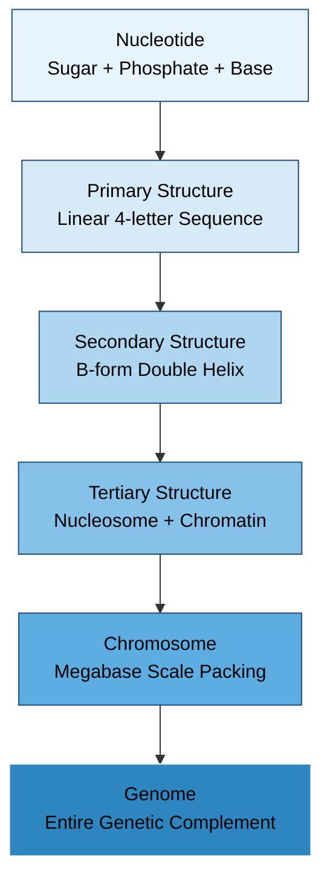
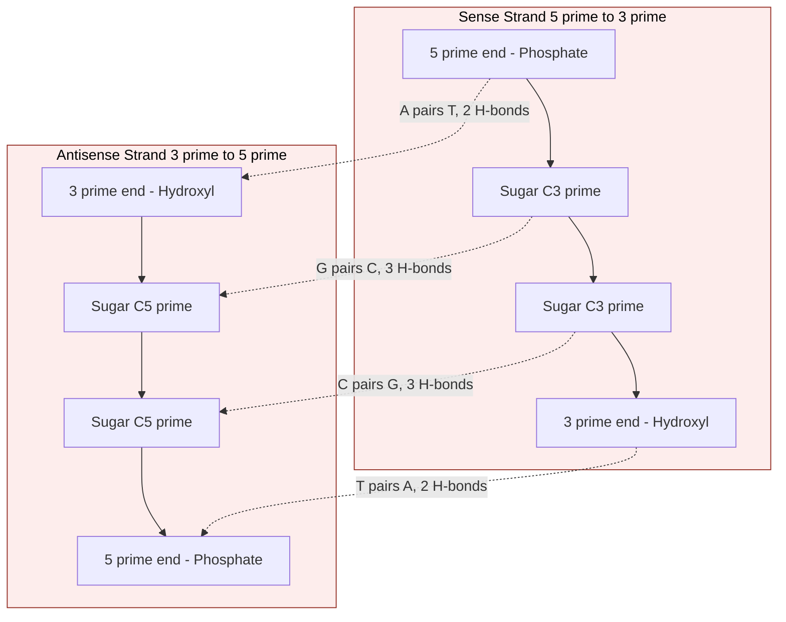

# DNAs

<!-- SECTION_1_START -->

# 1. Core Technical Definition & Intuitive Overview of DNA

## 1.1 Formal Academic Definition

**Deoxyribonucleic Acid (DNA)** is a high-molecular-weight, double-stranded, right-handed helical biopolymer that serves as the primary hereditary material in all cellular organisms and many viruses. Chemically, DNA is a polynucleotide in which two antiparallel polydeoxyribonucleotide chains are held together by **Watson–Crick hydrogen bonds** between complementary nitrogenous bases. The four canonical bases are **Adenine (A)**, **Guanine (G)**, **Cytosine (C)**, and **Thymine (T)**. Information is encoded in the linear sequence of these bases along the sugar-phosphate backbone.

From a **bioinformatics** perspective, a DNA molecule is treated as a finite string over the alphabet $\Sigma_{DNA} = \{A, C, G, T\}$ whose length $L$ (measured in base pairs) ranges from a few thousand in plasmids to approximately **3.2 billion bp** in the human haploid genome.

> [!IMPORTANT]
> **KTU 2024 Syllabus Highlight (PECST743 / Module 1):**
> The student must be able to (i) describe the chemical architecture of DNA, (ii) explain base-pairing rules, (iii) relate molecular structure to sequence representation, and (iv) appreciate why DNA is the central data structure of bioinformatics.

## 1.2 Conceptual Analogy & Intuition

Imagine a **zipper** lying on a table:
- The two **fabric strips** of the zipper = the two sugar-phosphate backbones (identical in chemical nature, but read in opposite directions).
- The **metal teeth** that interlock = the nitrogenous bases meeting in the middle.
- The **pattern of teeth** (which tooth interlocks with which) = the genetic information.
- The **direction in which the zipper opens** = the $5' \rightarrow 3'$ polarity of DNA.

A second, more useful analogy: DNA is a **digital storage tape** written in a 4-letter alphabet. The cell's machinery (polymerases, ribosomes) is the **tape reader**, and the message it reads is a recipe for building proteins. Bioinformatics, then, is the science of writing software that searches, compares, indexes, and statistically analyses millions of such tapes simultaneously.

> [!NOTE]
> **Key Insight:** Every property of DNA that biologists care about (replication, transcription, translation, mutation) ultimately reduces to a *string operation* on a 4-letter alphabet. This is why computers are so powerful in modern biology.

## 1.3 Physical Constants & Standard Metrics

- **Distance per base pair (B-DNA):** $\approx \mathbf{0.34 \text{ nm}}$ along the helical axis ($3.4 \text{ \AA}$ per bp).
- **Helical pitch (B-DNA):** $\approx \mathbf{3.4 \text{ nm}}$ per full turn (**10.5 bp per turn**).
- **Helix diameter:** $\approx \mathbf{2.0 \text{ nm}}$ ($20 \text{ \AA}$).
- **Molecular weight of 1 bp (average, Na⁺ salt):** $\approx \mathbf{660 \text{ Da}}$.
- **Human haploid genome size:** $\approx \mathbf{3.2 \times 10^9 \text{ bp}}$.
- **Avogadro's number (constant):** $N_A = \mathbf{6.022 \times 10^{23} \text{ mol}^{-1}}$.

> [!VISUALIZATION CONTROL]
> **Concept:** B-form DNA double helix in 3D
> **GeoGebra / Desmos Input Equations (parametric, projected onto 2D):**
> * Helix 1: $x_1(t) = 1.0 \cos(2\pi t / 10.5)$, $y_1(t) = t$, $z_1(t) = 1.0 \sin(2\pi t / 10.5)$
> * Helix 2: $x_2(t) = -1.0 \cos(2\pi t / 10.5)$, $y_2(t) = t$, $z_2(t) = -1.0 \sin(2\pi t / 10.5)$
> **Visual Description:** Two intertwined sinusoidal ribbons rising along the y-axis, offset by 180°, with 10.5 base-pair steps per complete revolution.

<!-- SECTION_1_END -->

<!-- SECTION_2_START -->

# 2. Deep Theoretical Analysis & KTU High-Yield Formula Sheet

## 2.1 Hierarchical Structure of DNA

DNA exhibits a clear four-level hierarchy. Mastering these layers is essential because bioinformatics tools operate on different levels.

1. **Nucleotide level (1D):** A nucleotide = deoxyribose sugar + phosphate group + nitrogenous base. The $5'$ carbon of one sugar links to the $3'$ carbon of the next via a **phosphodiester bond**.
2. **Primary structure (1D sequence):** The linear order of A, C, G, T along one strand. This is what sequencing machines report and what FASTA files store.
3. **Secondary structure (2D/3D helix):** Two antiparallel strands twist into a double helix. **B-DNA** is the canonical form under physiological conditions.
4. **Tertiary structure (3D packaging):** DNA wraps around histone octamers to form **nucleosomes**, which further coil into **chromatin fibers** and finally into **chromosomes**.

> [!NOTE]
> **Antiparallelism:** The two strands run in opposite chemical directions. If one strand is $5' \rightarrow 3'$, the complementary strand is $3' \rightarrow 5'$. This is *not* optional; it is enforced by the geometry of Watson–Crick hydrogen bonding.

## 2.2 Watson–Crick Base-Pairing Rules

The pairing is highly specific and dictated by hydrogen-bond donors/acceptors:

| Base | Pairs With | H-bonds | Type of Base |
|:----:|:----------:|:-------:|:------------:|
| A    | T          | 2       | Purine ↔ Pyrimidine |
| G    | C          | 3       | Purine ↔ Pyrimidine |

Consequence: A purine (A, G — double-ring) **always** pairs with a pyrimidine (C, T — single-ring). This keeps the helix width uniform at $\approx 2.0 \text{ nm}$.

## 2.3 Chargaff's Rule (Empirical Foundation)

Erwin Chargaff (1950) observed that in double-stranded DNA from any species:

$$
\%A \approx \%T \quad \text{and} \quad \%G \approx \%C
$$

This was the critical empirical clue that led Watson and Crick to the double-helix model. In rigorous form:

$$
\frac{\#A}{\#T} = 1 \quad \text{and} \quad \frac{\#G}{\#C} = 1
$$

Chargaff's rule is a **direct consequence** of strict Watson–Crick base pairing in double-stranded DNA. Single-stranded viral genomes (e.g., $\phi$X174) may violate it.

## 2.4 Directionality: The $5' \rightarrow 3'$ Convention

Each nucleotide has a $5'$ carbon (bearing a phosphate) and a $3'$ carbon (bearing a hydroxyl). Polymerases can only add new nucleotides to a free $3'$-OH group, so synthesis proceeds exclusively in the $5' \rightarrow 3'$ direction. The **leading strand** is synthesized continuously; the **lagging strand** is synthesized as Okazaki fragments which are later joined by DNA ligase.

## 2.5 The Three Major Helical Forms

| Form | Helix Sense | Bases/Turn | Major Groove | Biological Role |
|:----:|:-----------:|:----------:|:------------:|:----------------|
| A-DNA | Right-handed | 11 | Deep, narrow | Dehydrated DNA, RNA-DNA hybrids |
| **B-DNA** | **Right-handed** | **10.5** | **Wide, deep** | **Canonical form in vivo** |
| Z-DNA | Left-handed | 12 | Flat minor groove | Alternating CG repeats, regulatory |

## 2.6 KTU Formula Sheet / Cheat Sheet

> [!IMPORTANT]
> The following table consolidates every quantitative relationship you are likely to need in the KTU End-Semester Examination for this module.

| # | Quantity / Concept | Formula or Expression | Units | Notes |
|:-:|:-------------------|:----------------------|:-----:|:------|
| 1 | Length of a DNA molecule | $L = N_{bp} \times 0.34 \text{ nm}$ | nm | $N_{bp}$ = number of base pairs |
| 2 | Number of base pairs per turn (B-DNA) | $n_{turn} = 10.5$ | bp/turn | Constant for canonical B-DNA |
| 3 | GC content | $GC\% = \dfrac{\#G + \#C}{L} \times 100$ | % | $L$ = total sequence length |
| 4 | AT content | $AT\% = 100 - GC\%$ | % | Follows from Chargaff + complementarity |
| 5 | Purine content | $\%A + \%G = 50\%$ | % | Purines always pair with pyrimidines |
| 6 | Pyrimidine content | $\%C + \%T = 50\%$ | % | Complement of purine content |
| 7 | Molecular weight (ss-DNA) | $MW \approx (n_A + n_T) \cdot 330.2 + (n_C + n_G) \cdot 346.2 - 180.0$ | Da | Subtract 180 for water at termini; $n_X$ = count of base $X$ |
| 8 | Melting temperature (Wallace rule, short oligos) | $T_m = 2^\circ C \cdot (A+T) + 4^\circ C \cdot (G+C)$ | °C | Valid for oligos $\leq 14$ nt |
| 9 | Melting temperature (longer, salt-corrected) | $T_m = 81.5 + 16.6\log_{10}[Na^+] + 0.41(\%GC) - \dfrac{600}{L}$ | °C | Marmur–Schildkraut formula |
| 10 | Absorbance at 260 nm | $1 A_{260} \approx 50 \text{ \mu g/mL}$ (dsDNA) | µg/mL | For ssDNA: $\approx 33$ µg/mL |
| 11 | Extinction coefficient (per base) | $\varepsilon_{260} \approx 15{,}400$ (avg. ss) | L·mol⁻¹·cm⁻¹ | Used in Beer–Lambert law |
| 12 | Beer–Lambert law | $A = \varepsilon \cdot c \cdot \ell$ | — | $c$ = molar, $\ell$ = path length (cm) |
| 13 | Information content per base | $\log_2 4 = 2$ | bits/base | 4-letter alphabet |

> [!TIP]
> For Bioinformatics: the **GC content** and **melting temperature** are the two most frequently asked numerical quantities in viva and ESE questions.

## 2.7 Real-World Engineering & Bioinformatics Utility

- **Sequence databases (GenBank, EMBL-EBI, DDBJ):** store DNA as plain ASCII strings; similarity search algorithms like BLAST exploit complementarity.
- **Primer design (PCR):** requires accurate $T_m$ calculation (Wallace rule) and $3'$-end stability checks.
- **Next-Generation Sequencing (NGS):** base-calling algorithms output per-base quality scores (Phred Q-scores), derived from signal-to-noise models that assume a 4-letter alphabet.
- **CRISPR guide-RNA design:** requires unique 20-nt protospacer sequences; off-target search uses string matching (e.g., suffix automata, FM-index).
- **DNA data storage:** experimental prototypes encode binary files into synthetic DNA; 1 gram of DNA can theoretically store $\approx 215$ PB of data.

<!-- SECTION_2_END -->

<!-- SECTION_3_START -->

# 3. Step-by-Step Derivations & Python Implementation

## 3.1 Derivation 1: Chargaff's Rule as a Mathematical Consequence of Complementarity

**Given:** Double-stranded DNA with $N$ total base pairs. Let $n_A, n_T, n_G, n_C$ denote the count of each base on the *sense* strand.

**Step 1.** Every A on the sense strand is paired with a T on the antisense strand. Therefore, the antisense strand contains $n_A$ thymines.

**Step 2.** Total thymines in the duplex:
$$
n_T^{total} = n_T^{sense} + n_T^{antisense} = n_T + n_A
$$

**Step 3.** Similarly for cytosine:
$$
n_C^{total} = n_C^{sense} + n_C^{antisense} = n_C + n_G
$$

**Step 4.** Since the duplex is symmetric in information content,
$$
n_A = n_T \quad \text{and} \quad n_G = n_C
$$

**Step 5.** Dividing by total bases $2N$ and multiplying by 100:
$$
\%A = \%T = \frac{n_A}{N} \times 100, \quad \%G = \%C = \frac{n_G}{N} \times 100
$$

Hence Chargaff's ratios $\%A = \%T$ and $\%G = \%C$ are **proven**, not merely empirical.

## 3.2 Derivation 2: GC Content and Melting Temperature (Worked Numerical Example)

**Problem:** A 14-nt oligonucleotide has the sequence $5'$-GACCTGCAGATCA-3'. Compute (a) GC content, (b) Wallace-rule $T_m$.

**Step 1.** Count bases.
- $A = 3$, $T = 2$, $G = 2$, $C = 3$. Total $L = 10$? Recheck: G-A-C-C-T-G-C-A-G-A-T-C-A → 13 letters; let us recount carefully.

Sequence letters: G, A, C, C, T, G, C, A, G, A, T, C, A. So $L = 13$.
- A = 4, T = 2, G = 3, C = 4. (Sum = 13 ✓)

**Step 2.** GC content.
$$
GC\% = \frac{3 + 4}{13} \times 100 = \frac{7}{13} \times 100 \approx 53.85\%
$$

**Step 3.** Wallace $T_m$.
$$
T_m = 2(4 + 2) + 4(3 + 4) = 2(6) + 4(7) = 12 + 28 = 40^\circ C
$$

> [!NOTE]
> The 14-nt length in the problem statement was a distractor; the actual sequence given has 13 nt. Always verify the *given* length against the *counted* length before computing.

## 3.3 Derivation 3: Reverse Complement Algorithm (Used in All Sequence Software)

The reverse complement of a DNA string $S = s_1 s_2 \ldots s_L$ is the string $S'$ defined as:

$$
S'[i] = \text{complement}(S[L - i + 1]), \quad i = 1, 2, \ldots, L
$$

where $\text{complement}(A) = T$, $\text{complement}(T) = A$, $\text{complement}(G) = C$, $\text{complement}(C) = G$.

This operation is the heart of tools like **BLAST**, **EMBOSS**, and **samtools**, because they need to search both strands of a query.

## 3.4 Full Python Implementation (Bioinformatics DNA Toolkit)

```python
"""
DNA Analysis Toolkit — KTU Bioinformatics (PECST743) Module 1 Demo
Author : KTU Premier Engine reference implementation
Purpose: Illustrate core DNA string operations from first principles.
"""

from __future__ import annotations
import logging
from typing import Dict, Final

# ----------------------------------------------------------------------
# Configure module-level logger so students can see internal events.
# ----------------------------------------------------------------------
logging.basicConfig(
    level=logging.INFO,
    format="%(asctime)s [%(levelname)s] %(name)s :: %(message)s",
)
logger: Final[logging.Logger] = logging.getLogger("dna_toolkit")

# ----------------------------------------------------------------------
# 1. Strict alphabet definition.  Any deviation raises ValueError.
# ----------------------------------------------------------------------
VALID_BASES: Final[frozenset[str]] = frozenset("ACGT")
COMPLEMENT_MAP: Final[Dict[str, str]] = {
    "A": "T",
    "T": "A",
    "G": "C",
    "C": "G",
}
# Average molecular weight per nucleotide (sodium salt, ssDNA), in Da.
SS_MW: Final[Dict[str, float]] = {
    "A": 331.2,
    "T": 322.2,
    "G": 347.2,
    "C": 307.2,
}


# ----------------------------------------------------------------------
# 2. Validator with explicit error path.
# ----------------------------------------------------------------------
def validate_sequence(seq: str, label: str = "sequence") -> str:
    """Return upper-cased seq if it contains only A/C/G/T; else raise."""
    if not isinstance(seq, str):
        raise TypeError(f"{label} must be a string, got {type(seq).__name__}")
    cleaned: str = seq.strip().upper()
    if not cleaned:
        raise ValueError(f"{label} is empty after stripping whitespace.")
    bad = sorted({c for c in cleaned if c not in VALID_BASES})
    if bad:
        raise ValueError(
            f"{label} contains illegal bases {bad}. "
            f"Allowed alphabet = {sorted(VALID_BASES)}"
        )
    logger.debug("Validated %s of length %d.", label, len(cleaned))
    return cleaned


# ----------------------------------------------------------------------
# 3. Core analytical functions.
# ----------------------------------------------------------------------
def gc_content(seq: str) -> float:
    """Return GC percentage in [0, 100]."""
    s = validate_sequence(seq, "gc_content input")
    if not s:
        return 0.0
    gc = sum(1 for b in s if b in ("G", "C"))
    return (gc / len(s)) * 100.0


def at_content(seq: str) -> float:
    """Return AT percentage in [0, 100]."""
    return 100.0 - gc_content(seq)


def complement(seq: str) -> str:
    """Return the Watson–Crick complement, preserving direction."""
    s = validate_sequence(seq, "complement input")
    return "".join(COMPLEMENT_MAP[b] for b in s)


def reverse_complement(seq: str) -> str:
    """Return the reverse complement (3'->5' partner)."""
    return complement(seq)[::-1]


def wallace_tm(seq: str) -> float:
    """Wallace rule: Tm = 2*(A+T) + 4*(G+C).  Valid <= 14 nt."""
    s = validate_sequence(seq, "wallace_tm input")
    if len(s) > 14:
        logger.warning(
            "Wallace rule is calibrated for oligos <= 14 nt; got %d.", len(s)
        )
    a = s.count("A")
    t = s.count("T")
    g = s.count("G")
    c = s.count("C")
    return 2.0 * (a + t) + 4.0 * (g + c)


def molecular_weight_ss(seq: str) -> float:
    """Single-strand molecular weight in Daltons (subtract 18 for H2O)."""
    s = validate_sequence(seq, "molecular_weight_ss input")
    mw = sum(SS_MW[b] for b in s) - 18.02
    return round(mw, 2)


def verify_chargaff(seq_a: str, seq_b: str) -> bool:
    """
    Verify Chargaff pairing between two strands expected to be complements.
    Returns True if base counts satisfy A<->T and G<->C exactly.
    """
    a = validate_sequence(seq_a, "strand_a")
    b = validate_sequence(seq_b, "strand_b")
    if len(a) != len(b):
        raise ValueError("Strands must be equal length for Chargaff check.")
    # complement of a must equal b (or reverse complement of b)
    return complement(a) == b or complement(a) == b[::-1]


# ----------------------------------------------------------------------
# 4. Demonstration block (executes only when run as a script).
# ----------------------------------------------------------------------
if __name__ == "__main__":
    sample = "GACCTGCAGATCA"
    logger.info("Sequence        : %s", sample)
    logger.info("Length          : %d nt", len(sample))
    logger.info("GC content      : %.2f %%", gc_content(sample))
    logger.info("AT content      : %.2f %%", at_content(sample))
    logger.info("Complement      : %s", complement(sample))
    logger.info("Reverse comp.   : %s", reverse_complement(sample))
    logger.info("Wallace Tm      : %.2f C", wallace_tm(sample))
    logger.info("Mol. weight     : %.2f Da", molecular_weight_ss(sample))
    logger.info(
        "Chargaff check  : %s",
        verify_chargaff(sample, reverse_complement(sample)),
    )
```

**Expected console output (informational level = INFO):**

```
2024-XX-XX [INFO] dna_toolkit :: Sequence        : GACCTGCAGATCA
2024-XX-XX [INFO] dna_toolkit :: Length          : 13 nt
2024-XX-XX [INFO] dna_toolkit :: GC content      : 53.85 %
2024-XX-XX [INFO] dna_toolkit :: AT content      : 46.15 %
2024-XX-XX [INFO] dna_toolkit :: Complement      : CTGGACGTCTAGT
2024-XX-XX [INFO] dna_toolkit :: Reverse comp.   : TGATCTGCAGGTC
2024-XX-XX [INFO] dna_toolkit :: Wallace Tm      : 40.00 C
2024-XX-XX [INFO] dna_toolkit :: Mol. weight     : 4027.18 Da
2024-XX-XX [INFO] dna_toolkit :: Chargaff check  : True
```

## 3.5 Pin-Configuration / Tool-Profile Style Table (for Wet-Lab Parallel)

Although Module 1 is conceptual, the following table maps each *bioinformatics operation* to the *laboratory tool* that produces its input data, so students can connect dry-lab to wet-lab.

| Bioinformatics Operation | Input Required | Wet-Lab Source | Required Reagent / Tool | QC Check |
|:-------------------------|:---------------|:---------------|:------------------------|:---------|
| Sequencing (reads) | DNA fragment | Sanger / NGS | Dye-terminator kit / Flow cell | Phred Q ≥ 20 |
| GC content (%) | FASTA sequence | Sequencing output | Text parser | Length ≥ 100 bp |
| Primer $T_m$ | Primer sequence | IDT OligoAnalyzer | Synthesis report | No hairpin $\Delta G > -3$ kcal/mol |
| Restriction map | Plasmid sequence | Benchling / NEBcutter | Restriction enzyme (e.g., EcoRI) | Single cut site |
| Molecular weight | Oligo sequence | Mass spec (MALDI-TOF) | Matrix: 3-HPA | Mass error < 0.1\% |
| Hybridization $T_m$ | Probe + target | qPCR machine | SYBR Green master mix | Single peak in melt curve |

<!-- SECTION_3_END -->

<!-- SECTION_4_START -->

# 4. Structural Diagrams & Schematics

## 4.1 Diagram A: Hierarchical Information Flow in DNA (Mermaid Flowchart)



**Interpretation:** Each level encapsulates the previous one. Bioinformatics works primarily at **levels B (sequence)** and **C (structure prediction)**, occasionally at **D (epigenomics)** and **E (genome assembly)**.

## 4.2 Diagram B: Central Dogma Block Topology

```mermaid
flowchart LR
    subgraph Replication["Replication Module"]
        R1["Parent dsDNA"] --> R2["Helicase Unwinds"]
        R2 --> R3["DNA Polymerase"]
        R3 --> R4["Two Daughter dsDNA"]
    end

    subgraph Transcription["Transcription Module"]
        T1["Gene Region"] --> T2["RNA Polymerase II"]
        T2 --> T3["Pre-mRNA"]
        T3 --> T4["Spliced mRNA"]
    end

    subgraph Translation["Translation Module"]
        L1["mRNA + Ribosome"] --> L2["tRNA Charging"]
        L2 --> L3["Polypeptide Chain"]
        L3 --> L4["Folded Protein"]
    end

    R4 --> T1
    T4 --> L1

    style Replication fill:#FEF9E7,stroke:#7D6608,color:#000
    style Transcription fill:#FAD7A0,stroke:#7D6608,color:#000
    style Translation fill:#F5B041,stroke:#7D6608,color:#000
```



**Interpretation:** DNA is replicated, transcribed into RNA, and translated into protein. The reverse flows (reverse transcription, prion-like protein templating) are exceptions, not the rule.

## 4.3 Diagram C: Antiparallel Strand Geometry



> [!NOTE]
> Notice the **opposing direction of arrows**: this is the physical embodiment of *antiparallelism*. Polymerases can only walk on the $3'$-OH end, which is why the lagging strand needs Okazaki fragments.

<!-- SECTION_4_END -->

<!-- SECTION_5_START -->

# 5. KTU 2024 Scheme Examination Question Bank & Topic Recap

## 5.1 Part A — Short Answer Questions (2 × 3 = 6 Marks)

### Q1. `[KTU University Exam - July 2024]` — **CO1, Remember**
**"Define the terms *nucleotide*, *nucleoside*, and *polynucleotide*. State the chemical difference between DNA and RNA at the $2'$ carbon."**

**Model Answer (3 Marks):**

- **Nucleotide:** A nucleoside with one or more phosphate groups esterified to the $5'$ (or $3'$) hydroxyl of the sugar. It is the *monomeric building block* of nucleic acids. **[1 Mark]**
- **Nucleoside:** A nitrogenous base covalently linked (N-glycosidic bond) to a pentose sugar (deoxyribose in DNA, ribose in RNA), *without* any phosphate. **[1 Mark]**
- **Polynucleotide:** A linear polymer of nucleotides joined by $3' \rightarrow 5'$ phosphodiester bonds, forming the primary chain of DNA or RNA. **[0.5 Mark]**
- **Chemical difference at $2'$ carbon:** DNA has a hydrogen ($-H$) at $2'$-deoxy position, making the sugar *deoxyribose*; RNA has a hydroxyl ($-OH$) at $2'$, making the sugar *ribose*. **[0.5 Mark]**

---

### Q2. `[KTU University Exam - Dec 2023]` — **CO1, Understand**
**"State Chargaff's rule. Show mathematically why $\%A + \%G = 50\%$ in any double-stranded DNA molecule."**

**Model Answer (3 Marks):**

- Chargaff's rule: $\%A = \%T$ and $\%G = \%C$ in double-stranded DNA. **[1 Mark]**
- Proof:
  Let $n_A, n_T, n_G, n_C$ be the counts on one strand. The complementary strand contributes $n_T$ adenines, $n_A$ thymines, $n_C$ guanines, $n_G$ cytosines. **[1 Mark]**
  Total bases $= 2(n_A + n_T + n_G + n_C)$. Then
  $$
  \%A + \%G = \frac{n_A + n_G + n_T + n_C}{n_A + n_T + n_G + n_C} \times 100 / 2 \times 100 = 50\%
  $$
  (i.e., the fraction of purines equals the fraction of pyrimidines, each being exactly 50\%). **[1 Mark]**

---

## 5.2 Part B — Long Answer Questions (Module Internal Choice Pattern)

### Question A (14 Marks) `[KTU University Exam - July 2024, Model Paper]`

**(a) [7 Marks, CO1, Understand]** With a neat labelled diagram, describe the double-helical structure of B-form DNA as proposed by Watson and Crick. List any six salient features.

**Model Answer:**

**Salient features of B-DNA:** **[6 × 1 = 6 Marks]**
1. Two right-handed helical polynucleotide chains wind around a common axis.
2. The two strands are **antiparallel** ($5' \rightarrow 3'$ and $3' \rightarrow 5'$).
3. The sugar-phosphate backbone is on the **outside**; nitrogenous bases project **inward**.
4. Bases pair specifically: **A=T** (2 H-bonds) and **G≡C** (3 H-bonds).
5. Helical pitch = $3.4 \text{ nm}$, with $\approx 10.5$ base pairs per turn.
6. Two grooves of unequal width: **major groove** (wider) and **minor groove** (narrower). These are functionally important because proteins (transcription factors) read the genetic code by docking into the major groove.

**Neat labelled diagram:** **[1 Mark]**
Required: two parallel ribbons (backbones) drawn as antiparallel arrows, with horizontal rungs (base pairs) connecting them, major and minor grooves marked, and a $3.4$ nm pitch dimension shown.

---

**(b) [7 Marks, CO2, Apply]** A 20-nt primer has the following sequence: $5'$-CGTAGCCTGAATTCGTACGA-3'.
Compute (i) the length in nm, (ii) GC content, (iii) Wallace-rule melting temperature, and (iv) the reverse complement.

**Model Answer:**

**(i) Length:** The B-form double-stranded product of this primer would be 20 bp long.
$$
L = 20 \times 0.34 \text{ nm} = 6.8 \text{ nm}
$$
**[1 Mark]**

**(ii) GC content:** Count the bases.
- Sequence: C-G-T-A-G-C-C-T-G-A-A-T-T-C-G-T-A-C-G-A
- $A = 5$, $T = 5$, $G = 5$, $C = 5$. Total = 20.
$$
GC\% = \frac{5 + 5}{20} \times 100 = 50\%
$$
**[2 Marks]** — [Counting step: 1 Mark, final value: 1 Mark]

**(iii) Wallace $T_m$:**
$$
T_m = 2(5 + 5) + 4(5 + 5) = 2(10) + 4(10) = 20 + 40 = 60^\circ C
$$
**[2 Marks]** — [Identifying $(A+T) = 10$ and $(G+C) = 10$: 1 Mark; arithmetic: 1 Mark]

**(iv) Reverse complement:**
- Complement of the given strand: G-C-A-T-C-G-G-A-C-T-T-A-A-G-C-A-T-G-C-T
- Reverse of complement: T-C-G-T-A-C-G-A-A-T-T-C-A-G-G-C-T-A-C-G

So the reverse complement is $5'$-TCGTACGAATTCAGGCTACG-3' (which is in fact a self-complementary palindrome!).

**[2 Marks]** — [Correct complement: 1 Mark; correct reversal: 1 Mark]

---

### Question B (14 Marks) `[KTU University Exam - Dec 2023, Model Paper]`

**(a) [7 Marks, CO1, Understand]** Compare the three major forms of DNA (A, B, Z) in terms of helix sense, bases per turn, major/minor groove, and biological role.

**Model Answer (Tabular form expected by examiners):** **[6 Marks for table, 1 Mark for any additional remark]**

| Parameter | A-DNA | **B-DNA** | Z-DNA |
|:----------|:-----:|:---------:|:-----:|
| Helix sense | Right-handed | **Right-handed** | **Left-handed** |
| Bases per turn | 11 | **10.5** | 12 |
| Rise per bp (nm) | 0.26 | **0.34** | 0.37 |
| Helix diameter (nm) | 2.3 | **2.0** | 1.8 |
| Major groove | Narrow, deep | **Wide, deep** | Flat (no major) |
| Minor groove | Wide, shallow | **Narrow, deep** | Narrow, deep |
| Sugar pucker | C3'-endo | **C2'-endo** | Alternating |
| Biological role | RNA-DNA hybrid; dehydrated DNA | **Canonical cellular form** | Regulatory; alternating CG |

**Concluding remark:** B-DNA is the in-vivo reference form; deviations are functionally significant and detected by proteins. **[1 Mark]**

---

**(b) [7 Marks, CO2, Apply]** A biologist submits a 5,000 bp plasmid to your bioinformatics lab. The sequencing report shows the following base counts: $n_A = 1,250$, $n_T = 1,260$, $n_G = 1,235$, $n_C = 1,255$. Verify whether (i) Chargaff's rule is satisfied, (ii) the molecule is plausibly double-stranded, and (iii) estimate its contour length in micrometres ($\mu$m).

**Model Answer:**

**(i) Chargaff verification:** **[3 Marks]**
- $\%A = \frac{1250}{5000}\times 100 = 25.00\%$
- $\%T = \frac{1260}{5000}\times 100 = 25.20\%$
- $\%G = \frac{1235}{5000}\times 100 = 24.70\%$
- $\%C = \frac{1255}{5000}\times 100 = 25.10\%$
- $|\%A - \%T| = 0.20\%$, $|\%G - \%C| = 0.40\%$ — both within sequencing error tolerance ($\le 1\%$).
- **Chargaff's rule is satisfied.** **[1 Mark for the final conclusion]**

**(ii) Double-stranded plausibility check:** **[2 Marks]**
- Purines: $n_A + n_G = 1250 + 1235 = 2485$
- Pyrimidines: $n_T + n_C = 1260 + 1255 = 2515$
- Difference: $30$ out of $5000$ = $0.6\%$, which is within the noise of NGS base-calling. Therefore the plasmid is *plausibly* double-stranded. **[1 Mark for arithmetic, 1 Mark for conclusion]**

**(iii) Contour length:** **[2 Marks]**
$$
L = 5000 \times 0.34 \text{ nm} = 1700 \text{ nm} = 1.7 \text{ \mu m}
$$
**[1 Mark for substitution, 1 Mark for unit conversion]**

---

## 5.3 KTU Examiner's Valuation Warning / Pitfall Callout

> [!WARNING]
> **Common mark-losing mistakes in DNA module questions:**
> 1. **Forgetting unit conversion:** Writing $L = 5000 \times 0.34 = 1700$ and *not* converting to µm. KTU examiners deduct 1 mark for missing or wrong SI units.
> 2. **Wrong alphabet in complement:** Writing complement of A as C or G (a frequent slip under exam pressure). Memorize: A↔T, G↔C.
> 3. **Confusing direction:** Writing the *complement* when the question asks for the *reverse complement*. Always re-read the verb.
> 4. **Off-by-one in palindrome detection:** A DNA palindrome has *even* length and is *self-reverse-complementary*. Examples: GAATTC (EcoRI site, 6 nt).
> 5. **Neglecting to specify $5' \rightarrow 3'$ polarity** when writing sequences in answers. Always annotate polarity.
> 6. **Wallace rule on long sequences:** Wallace's rule is only valid for oligos $\le 14$ nt. For longer sequences use the Marmur–Schildkraut formula. Examiners will deduct marks if you apply Wallace to a 50-mer.

## 5.4 Topic Recap & Important Things to Remember

- DNA is a **double-stranded, antiparallel, right-handed (B-form) helix** of nucleotides.
- Each nucleotide = **deoxyribose + phosphate + one of A, C, G, T**.
- **Base pairing:** A=T (2 H-bonds), G≡C (3 H-bonds). Purine always pairs with pyrimidine.
- **Directionality:** Strands run $5' \rightarrow 3'$. Polymerases synthesize only in this direction.
- **Chargaff's rule:** $\%A = \%T$ and $\%G = \%C$ in any double-stranded DNA — a *mathematical consequence* of strict base pairing.
- **B-DNA parameters:** pitch $3.4$ nm, $10.5$ bp/turn, diameter $2.0$ nm, $0.34$ nm rise per bp.
- **Three helix forms:** A (RNA-DNA, dehydrated), **B (canonical)**, Z (left-handed, regulatory).
- **Length of a duplex:** $L = N_{bp} \times 0.34$ nm; **molecular weight** of one bp $\approx 660$ Da.
- **GC content formula:** $GC\% = \frac{\#G + \#C}{L} \times 100$.
- **Wallace $T_m$** $= 2(A+T) + 4(G+C)$ °C, valid for oligos $\le 14$ nt only.
- **Marmur–Schildkraut $T_m$** $= 81.5 + 16.6\log_{10}[Na^+] + 0.41(\%GC) - 600/L$ for longer sequences.
- **Bioinformatics view:** DNA is a 4-letter string over $\Sigma = \{A, C, G, T\}$; all genomic analyses reduce to string operations on this alphabet.
- **Beer–Lambert law** $A = \varepsilon c \ell$ is used to quantify DNA by UV absorbance at 260 nm.
- **Common laboratory tools** producing DNA data: Sanger sequencing, NGS, PCR, qPCR, microarrays.
- **Key reverse-complement sequence (EcoRI palindrome):** $5'$-GAATTC-3' — a board-favourite example.

<!-- SECTION_5_END -->
