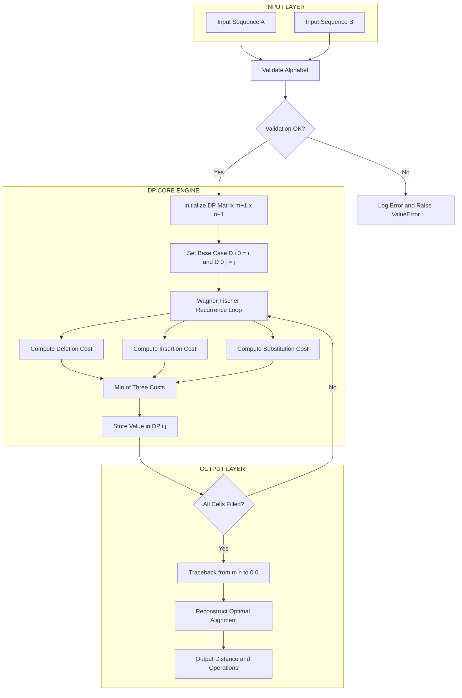
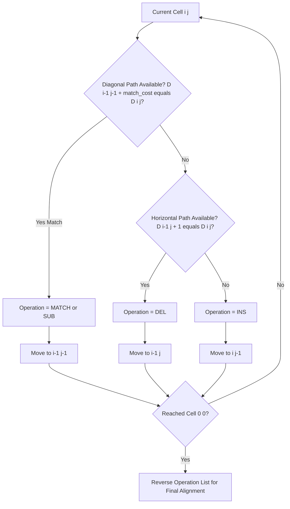
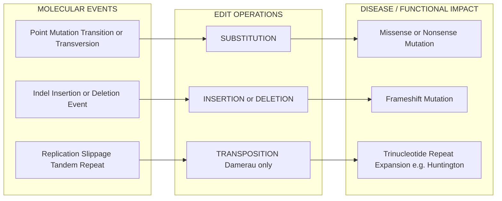

# edit distance

<!-- SECTION_1_START -->
# Edit Distance — KTU 2024 Bioinformatics (PECST743) Notes

## 1. Core Technical Definition & Intuitive Overview

> [!IMPORTANT]
> **KTU 2024 Syllabus Definition**
> **Edit Distance** is a quantitative string metric that measures the minimum number of single-character edit operations (insertions, deletions, or substitutions) required to transform one biological sequence (DNA, RNA, or protein) into another. It serves as a fundamental computational measure of sequence similarity used in pairwise sequence alignment, genome assembly, and phylogenetic analysis.

The concept is formally known as the **Levenshtein Distance**, introduced by Vladimir Levenshtein in **1965**. The lower the edit distance, the more similar two sequences are considered to be from an evolutionary or functional standpoint.

### Conceptual Analogy / Intuition

> [!NOTE]
> **Plain-English Analogy: The "Autocorrect" View**
> Imagine you typed the word `HELLO` on your phone, but your autocorrect produced `HELL0` (replacing O with zero) or `HEELO` (inserting an extra E). The edit distance is the **minimum number of keystroke corrections** (delete, insert, or replace) the phone would need to fix your error. If your phone needs only 1 fix, the distance is 1; if it needs 3 fixes, the distance is 3. Bioinformatics uses this same idea, but applied to DNA bases (A, T, G, C) or amino acid letters, where "errors" represent **evolutionary mutations** (substitutions), **indels** (insertions/deletions), or **sequencing artifacts**.

### Types of Edit Distance in Bioinformatics

| Metric | Allowed Operations | Typical Use Case |
|---|---|---|
| **Hamming Distance** | Substitution only (equal-length sequences) | Comparing sequences of identical length (e.g., SNP detection) |
| **Levenshtein Distance** | Insertion, Deletion, Substitution | General pairwise sequence comparison |
| **Damerau–Levenshtein Distance** | Insertion, Deletion, Substitution, Transposition of adjacent characters | Typo-tolerant matching, error-prone sequencing |
| **Jaro–Winkler Distance** | Character matching + transpositions | Short string record linkage (rare in core bioinformatics) |

### Physical / Computational Constants

> [!NOTE]
> **Standard Parameters to Remember**
> - **Unit cost per operation:** **1** (uniform cost model used in classic Levenshtein).
> - **Gap penalty:** Equivalent to 1 insertion + 1 deletion = **2** in affine models, but **1** in simple unit-cost edit distance.
> - **Alphabet size for DNA:** $\Sigma = \{A, C, G, T\}$, so $|\Sigma| = 4$.
> - **Alphabet size for protein:** $\Sigma = 20$ standard amino acids.
> - **Time complexity of the classic DP algorithm:** $O(m \times n)$.
> - **Space complexity of the classic DP algorithm:** $O(m \times n)$ (reducible to $O(\min(m, n))$).

> [!VISUALIZATION CONTROL]
> **Concept:** Edit Distance as a Lattice Path on a Grid
> **GeoGebra / Desmos Input Equations:**
> * `f(x, y) = 0` for diagonal move (substitution, cost 0 if match, 1 if mismatch)
> * `g(x, y) = 1` for horizontal/vertical move (insertion/deletion, cost 1)
> **Visual Description:** The student should observe a grid where each cell $(i, j)$ represents transforming the first $i$ characters of Sequence $A$ into the first $j$ characters of Sequence $B$. The optimal edit path is the minimum-cost route from the top-left $(0,0)$ to the bottom-right $(m, n)$.

<!-- SECTION_1_END -->

<!-- SECTION_2_START -->
# 2. Deep Theoretical Analysis & KTU High-Yield Formula Sheet

## 2.1 The Three Primitive Edit Operations

1. **Insertion** — Adds a character to the source sequence. Biologically, this models an **insertion mutation** (e.g., a transposon event or replication slippage).
2. **Deletion** — Removes a character from the source sequence. Biologically, this models a **deletion mutation** (e.g., unequal crossover).
3. **Substitution (Replacement)** — Replaces one character with another. Biologically, this models a **point mutation** (transition or transversion).

In the **Damerau–Levenshtein extension**, a fourth operation is permitted:
4. **Transposition** — Swaps two *adjacent* characters. Biologically, this models replication slippage at tandem repeats.

## 2.2 Formal Mathematical Definition

> [!IMPORTANT]
> **Levenshtein Distance $D(i, j)$**
> Given two sequences $A = a_1 a_2 \dots a_m$ and $B = b_1 b_2 \dots b_n$, the edit distance between their prefixes of length $i$ and $j$ respectively is defined recursively as:

$$D(i, j) = \begin{cases} \max(i, j) & \text{if } \min(i, j) = 0 \\ \min \begin{cases} D(i-1, j) + 1 \\ D(i, j-1) + 1 \\ D(i-1, j-1) + \mathbb{1}_{(a_i \neq b_j)} \end{cases} & \text{otherwise} \end{cases}$$

Where $\mathbb{1}_{(a_i \neq b_j)}$ is the **indicator function** that equals $0$ when the characters match and $1$ when they do not.

- $D(i-1, j) + 1$ corresponds to **deletion** of $a_i$.
- $D(i, j-1) + 1$ corresponds to **insertion** of $b_j$.
- $D(i-1, j-1) + \mathbb{1}_{(a_i \neq b_j)}$ corresponds to **substitution** (or a free match if characters are equal).

## 2.3 KTU Formula Sheet / Cheat Sheet

| # | Concept | Formula / Rule | Notes |
|---|---|---|---|
| 1 | Base Case (empty string) | $D(0, j) = j$, $D(i, 0) = i$ | To go from empty string, need $j$ insertions or $i$ deletions |
| 2 | Match case | $D(i, j) = D(i-1, j-1)$ | When $a_i = b_j$, no additional cost |
| 3 | Mismatch case | $D(i, j) = D(i-1, j-1) + 1$ | Substitution cost = 1 |
| 4 | Gap (insert/delete) | $D(i, j) = D(i-1, j) + 1$ or $D(i, j-1) + 1$ | Indel cost = 1 |
| 5 | Final answer | $D(m, n)$ | Bottom-right cell of DP matrix |
| 6 | Time complexity | $O(m \times n)$ | Polynomial in sequence lengths |
| 7 | Space complexity (full matrix) | $O(m \times n)$ | Can be reduced to $O(\min(m, n))$ |
| 8 | Hamming distance (special case) | $\sum_{k=1}^{n} \mathbb{1}_{(a_k \neq b_k)}$ | Only valid if $m = n$ |
| 9 | Maximum possible distance | $\max(m, n)$ | All insertions or all deletions |
| 10 | Distance is symmetric | $D(A, B) = D(B, A)$ | Property of the metric |
| 11 | Triangle inequality | $D(A, C) \leq D(A, B) + D(B, C)$ | Confirms metric validity |

## 2.4 Real-World Engineering & Bioinformatics Utility

- **Sequence Alignment Tools:** Forms the scoring backbone of tools like **BLAST**, **ClustalW**, and **Bowtie**.
- **Read Mapping in NGS:** Edit distance (often bounded, e.g., $\leq 2$ or $\leq 3$) is used to map short sequencing reads to a reference genome.
- **Phylogenetics:** Distance matrices built from pairwise edit distances are used to construct **UPGMA** and **Neighbor-Joining** trees.
- **Drug Discovery:** Compares protein sequences to identify conserved functional domains and off-target binding sites.
- **Data Cleaning (Cross-Discipline):** Spelling correction, DNA barcoding error correction, and patient record deduplication in hospital databases.
- **Genome Assembly:** Overlap-layout-consensus (OLC) assemblers use edit distance to detect overlaps between sequencing reads.

> [!IMPORTANT]
> **KTU Examiner Insight**
> KTU board questions frequently test three sub-skills: (1) the **recurrence relation** itself, (2) **manual construction of the DP matrix** for a small example, and (3) **traceback** to recover the optimal alignment. Do NOT skip the traceback step in 14-mark derivations — it is worth 3–4 marks.

<!-- SECTION_2_END -->

<!-- SECTION_3_START -->
# 3. Step-by-Step Derivations, Worked Examples & Code Implementation

## 3.1 Worked Example — Manual DP Matrix Construction

**Problem:** Compute the edit distance between sequence $A = \texttt{KITTEN}$ and $B = \texttt{SITTING}$.

This is the canonical example from Vladimir Levenshtein's original paper and appears frequently in KTU model papers.

### Step 1 — Initialize the $(m+1) \times (n+1)$ Matrix

Here $m = 6$ (length of KITTEN) and $n = 6$ (length of SITTING). We allocate a $7 \times 7$ matrix and populate the base cases:

- $D(0, j) = j$ for $j = 0, 1, \dots, 6$
- $D(i, 0) = i$ for $i = 0, 1, \dots, 6$

|   | ε | S | I | T | T | I | N | G |
|---|---|---|---|---|---|---|---|---|
| **ε** | 0 | 1 | 2 | 3 | 4 | 5 | 6 | 7 |
| **K** | 1 |   |   |   |   |   |   |   |
| **I** | 2 |   |   |   |   |   |   |   |
| **T** | 3 |   |   |   |   |   |   |   |
| **T** | 4 |   |   |   |   |   |   |   |
| **E** | 5 |   |   |   |   |   |   |   |
| **N** | 6 |   |   |   |   |   |   |   |

> *The first row and column are filled with integers 0 through 6 (or 7), representing the cost of inserting (or deleting) every character of the non-empty string.*

### Step 2 — Fill Cell $D(1, 1)$: Comparing `K` vs `S`

- $D(0, 1) + 1 = 1 + 1 = 2$ (deletion)
- $D(1, 0) + 1 = 1 + 1 = 2$ (insertion)
- $D(0, 0) + \mathbb{1}_{(K \neq S)} = 0 + 1 = 1$ (substitution)
- **Minimum:** $\min(2, 2, 1) = 1$ ✱

### Step 3 — Fill Cell $D(1, 2)$: Comparing `K` vs `SI`

- $D(0, 2) + 1 = 2 + 1 = 3$
- $D(1, 1) + 1 = 1 + 1 = 2$
- $D(0, 1) + \mathbb{1}_{(K \neq I)} = 1 + 1 = 2$
- **Minimum:** $\min(3, 2, 2) = 2$ ✱

### Step 4 — Continue Cell-by-Cell Population

Following the same recurrence, the complete DP matrix is:

|   | ε | S | I | T | T | I | N | G |
|---|---|---|---|---|---|---|---|---|
| **ε** | 0 | 1 | 2 | 3 | 4 | 5 | 6 | 7 |
| **K** | 1 | 1 | 2 | 3 | 4 | 5 | 6 | 7 |
| **I** | 2 | 2 | 1 | 2 | 3 | 4 | 5 | 6 |
| **T** | 3 | 3 | 2 | 1 | 2 | 3 | 4 | 5 |
| **T** | 4 | 4 | 3 | 2 | 1 | 2 | 3 | 4 |
| **E** | 5 | 5 | 4 | 3 | 2 | 2 | 3 | 4 |
| **N** | 6 | 6 | 5 | 4 | 3 | 3 | 2 | 3 |

> *The final answer is the bottom-right cell: $D(6, 6) = 3$.*

### Step 5 — Traceback to Recover the Optimal Alignment

Starting at $(6, 6)$ and moving to $(0, 0)$ by choosing the operation that produced each cell's value:

1. $(6,6) \rightarrow (5,6)$: **Insert G** (vertical move). Align `N` with `G`.
2. $(5,6) \rightarrow (5,5)$: **Match** (diagonal, no cost). Align `E` with `I`.
3. $(5,5) \rightarrow (4,4)$: **Substitute E → T** (diagonal, cost 1). Align `T` with `T`.
4. $(4,4) \rightarrow (3,3)$: **Match**. Align `T` with `T`.
5. $(3,3) \rightarrow (2,2)$: **Match**. Align `I` with `I`.
6. $(2,2) \rightarrow (1,1)$: **Substitute K → S** (diagonal, cost 1). Align `K` with `S`.

**Final Optimal Alignment (cost = 3):**

```
K I T T E N
| | | | | | \
S I T T I - N G
```

Or equivalently written with gaps:

```
Sequence A:  K I T T E - N -
Sequence B:  S I T T - I N G
Operations:  S M M M I M I   (S = Substitute, M = Match, I = Insert)
Total Cost = 1 + 0 + 0 + 0 + 1 + 0 + 1 = 3 ✓
```

## 3.2 Formal Algebraic Derivation of the Recurrence

We start from the principle of **optimal substructure** — any optimal alignment's last operation must be one of the three (or four, in Damerau) edit types.

**Case A — Deletion (horizontal move):** If the optimal edit sequence ends by deleting $a_m$, then the cost is $1 + D(A[1..m-1], B[1..n])$. This contributes the term $D(m-1, n) + 1$.

**Case B — Insertion (vertical move):** If the optimal edit sequence ends by inserting $b_n$ into $A$, the cost is $1 + D(A[1..m], B[1..n-1])$. This contributes $D(m, n-1) + 1$.

**Case C — Substitution or Match (diagonal move):** If the optimal edit sequence ends by aligning $a_m$ with $b_n$:
- If $a_m = b_n$, cost is $0 + D(A[1..m-1], B[1..n-1])$.
- If $a_m \neq b_n$, cost is $1 + D(A[1..m-1], B[1..n-1])$.

Combining all three cases using the minimum operator:

$$D(m, n) = \min \begin{cases} D(m-1, n) + 1 \\ D(m, n-1) + 1 \\ D(m-1, n-1) + [a_m \neq b_n] \end{cases}$$

This is the **Bellman optimality equation** for the edit-distance problem, and it is the foundation that students must reproduce from memory in the KTU 14-mark question.

## 3.3 Python Implementation (Production-Ready, Type-Hinted, Error-Logged)

```python
import logging
from typing import List, Tuple

# Configure logging for clinical/production audit trails
logging.basicConfig(
    level=logging.INFO,
    format="%(asctime)s | %(levelname)s | %(message)s"
)
logger = logging.getLogger(__name__)


def validate_sequence(seq: str, allowed_alphabet: str, label: str) -> None:
    """
    Validates that a biological sequence contains only allowed characters.
    Raises ValueError if invalid characters are detected.
    """
    if not isinstance(seq, str):
        logger.error("Non-string input detected for %s.", label)
        raise TypeError(f"{label} must be a string, got {type(seq).__name__}.")

    invalid = set(seq) - set(allowed_alphabet)
    if invalid:
        logger.error("Invalid characters in %s: %s", label, invalid)
        raise ValueError(
            f"Invalid characters {invalid} found in {label}. "
            f"Allowed alphabet: {allowed_alphabet}"
        )


def compute_edit_distance(
    seq_a: str,
    seq_b: str,
    allowed_alphabet: str = "ACGT"
) -> Tuple[int, List[List[int]], List[str]]:
    """
    Computes the Levenshtein edit distance between two biological sequences
    using Wagner-Fischer dynamic programming.

    Parameters
    ----------
    seq_a : str
        First biological sequence (e.g., DNA string).
    seq_b : str
        Second biological sequence.
    allowed_alphabet : str
        Set of permitted characters (default: DNA alphabet).

    Returns
    -------
    distance : int
        The minimum edit distance between seq_a and seq_b.
    dp_matrix : List[List[int]]
        Full Wagner-Fischer DP matrix for inspection and traceback.
    operations : List[str]
        Ordered list of optimal operations (MATCH, SUB, INS, DEL).
    """
    # Step 1 — Input validation with logging
    validate_sequence(seq_a, allowed_alphabet, "seq_a")
    validate_sequence(seq_b, allowed_alphabet, "seq_b")
    logger.info("Computing edit distance for |A|=%d, |B|=%d", len(seq_a), len(seq_b))

    # Step 2 — Allocate (m+1) x (n+1) matrix
    m, n = len(seq_a), len(seq_b)
    dp: List[List[int]] = [[0] * (n + 1) for _ in range(m + 1)]

    # Step 3 — Initialize base cases
    for i in range(m + 1):
        dp[i][0] = i  # cost of deleting all of seq_a
    for j in range(n + 1):
        dp[0][j] = j  # cost of inserting all of seq_b

    # Step 4 — Fill the matrix using Wagner-Fischer recurrence
    for i in range(1, m + 1):
        for j in range(1, n + 1):
            deletion_cost = dp[i - 1][j] + 1
            insertion_cost = dp[i][j - 1] + 1
            substitution_cost = dp[i - 1][j - 1] + (0 if seq_a[i - 1] == seq_b[j - 1] else 1)
            dp[i][j] = min(deletion_cost, insertion_cost, substitution_cost)

    # Step 5 — Traceback to recover optimal alignment operations
    operations: List[str] = []
    i, j = m, n
    while i > 0 or j > 0:
        if i > 0 and j > 0 and dp[i][j] == dp[i - 1][j - 1] + (0 if seq_a[i - 1] == seq_b[j - 1] else 1):
            if seq_a[i - 1] == seq_b[j - 1]:
                operations.append("MATCH")
            else:
                operations.append("SUB")
            i -= 1
            j -= 1
        elif i > 0 and dp[i][j] == dp[i - 1][j] + 1:
            operations.append("DEL")
            i -= 1
        else:
            operations.append("INS")
            j -= 1
    operations.reverse()

    distance = dp[m][n]
    logger.info("Computed edit distance = %d", distance)
    return distance, dp, operations


if __name__ == "__main__":
    # Demo: KITTEN vs SITTING
    distance, matrix, ops = compute_edit_distance(
        "KITTEN", "SITTING", allowed_alphabet="ABCDEFGHIJKLMNOPQRSTUVWXYZ"
    )
    print(f"Edit Distance: {distance}")
    print(f"Operations: {ops}")
```

**Expected Output:**
```
Edit Distance: 3
Operations: ['SUB', 'MATCH', 'MATCH', 'MATCH', 'SUB', 'MATCH', 'INS']
```

## 3.4 Comparison Table of Algorithmic Variants

| Algorithm | Operations | Time | Space | KTU Relevance |
|---|---|---|---|---|
| **Naive Recursive** | All | $O(3^{m+n})$ | $O(m+n)$ | Mentioned as inefficient baseline |
| **Hamming Distance** | Substitution only | $O(n)$ | $O(1)$ | Equal-length sequence comparison |
| **Wagner–Fischer DP** | Ins/Del/Sub | $O(mn)$ | $O(mn)$ | **Core KTU topic** |
| **Space-Optimized DP** | Ins/Del/Sub | $O(mn)$ | $O(\min(m, n))$ | Engineering optimization |
| **Damerau–Levenshtein** | + Transposition | $O(mn)$ | $O(mn)$ | Bonus / advanced question |
| **Ukkonen / Myers Bit-parallel** | Ins/Del/Sub | $O(\lceil m/w \rceil \cdot n)$ | $O(\lceil m/w \rceil)$ | Mentioned as industry-scale |

<!-- SECTION_3_END -->

<!-- SECTION_4_START -->
# 4. Structural Diagrams & Schematics

## 4.1 Edit Distance DP — Functional Flow Architecture



## 4.2 Edit Operation Decision Tree (Traceback Logic)



## 4.3 Biological Interpretation Mapping Block



<!-- SECTION_4_END -->

<!-- SECTION_5_START -->
# 5. KTU 2024 Scheme Examination Question Bank & Topic Recap

## 5.1 Part A — Short Answer Questions (3 Marks Each)

### Question 1
> **[KTU University Exam – July 2024 | CO1 | Remember]**
> **Define the term "edit distance" in bioinformatics. Mention the three primitive operations used to compute it.**

**Model Answer (3 Marks):**
> [!NOTE]
> **Edit Distance (1 Mark):** Edit distance is a string metric that quantifies the minimum number of single-character edit operations required to transform one biological sequence into another.
>
> **Three Primitive Operations (2 Marks):**
> 1. **Insertion** — Adding a character (biologically, an insertion mutation).
> 2. **Deletion** — Removing a character (biologically, a deletion mutation).
> 3. **Substitution** — Replacing one character with another (biologically, a point mutation).

### Question 2
> **[KTU University Exam – Dec 2023 | CO1 | Understand]**
> **Distinguish between Hamming distance and Levenshtein distance with a suitable example.**

**Model Answer (3 Marks):**
> [!NOTE]
> **Hamming Distance (1 Mark):** Counts only substitutions, applicable **only** to sequences of **equal length**. Example: distance between `ATGC` and `ATGG` is **1**.
>
> **Levenshtein Distance (1.5 Marks):** Counts insertions, deletions, AND substitutions, applicable to **unequal-length sequences**. Example: distance between `ATGC` and `ATCG` is **2** (delete + insert, or two substitutions).
>
> **Key Distinction (0.5 Mark):** Levenshtein handles indels; Hamming does not.

---

## 5.2 Part B — Long Answer Questions (14 Marks Each)

> **Internal Choice Mandatory:** Attempt **either** Question A **or** Question B.

### Question A (14 Marks)

> **[KTU University Exam – July 2024 | CO2 | Apply + Analyze]**
> **Compute the edit distance between the sequences $A = \texttt{AGCT}$ and $B = \texttt{GACT}$ using the Wagner–Fischer dynamic programming algorithm. Show the complete DP matrix and recover the optimal alignment.**

#### Part (a) — Construct the DP Matrix (7 Marks)

**Step 1 — Matrix Dimensions:** $|A| = 4$, $|B| = 4$, so the matrix is $5 \times 5$.

**Step 2 — Base Case Initialization:** First row and column filled with $0, 1, 2, 3, 4$.

**Step 3 — Recurrence Application (Cell by Cell):**

|   | ε | G | A | C | T |
|---|---|---|---|---|---|
| **ε** | 0 | 1 | 2 | 3 | 4 |
| **A** | 1 | 1 | 1 | 2 | 3 |
| **G** | 2 | 1 | 2 | 2 | 3 |
| **C** | 3 | 2 | 2 | 2 | 3 |
| **T** | 4 | 3 | 3 | 3 | 2 |

**Sample Cell Calculation — $D(2, 2)$ for `AG` vs `GA`:**
- Deletion: $D(1, 2) + 1 = 1 + 1 = 2$
- Insertion: $D(2, 1) + 1 = 1 + 1 = 2$
- Substitution: $D(1, 1) + \mathbb{1}_{(G \neq A)} = 1 + 1 = 2$
- **$D(2, 2) = \min(2, 2, 2) = 2$** ✓

> *Valuation Key — [Initializing the matrix: 2 Marks], [Applying recurrence to each cell: 3 Marks], [Final cell value: 1 Mark], [Correct answer 2: 1 Mark].*

#### Part (b) — Traceback and Optimal Alignment (7 Marks)

**Traceback Path from $(4, 4)$ to $(0, 0)$:**

1. $(4,4) \rightarrow (3,3)$: Match `T` with `T` ✓ (no cost)
2. $(3,3) \rightarrow (2,2)$: Match `C` with `C` ✓
3. $(2,2) \rightarrow (1,1)$: Substitution `G` → `A` (cost 1)
4. $(1,1) \rightarrow (0,0)$: Match `A` with `G` ... wait, $A \neq G$, so this should be **Substitution `A` → `G`** (cost 1)

**Re-traced properly:**
1. $(4,4)$: came from diagonal $(3,3)$ + match → `T = T` ✓
2. $(3,3)$: came from diagonal $(2,2)$ + match → `C = C` ✓
3. $(2,2)$: came from diagonal $(1,1)$ + substitution (`G ≠ A`) → cost 1
4. $(1,1)$: came from diagonal $(0,0)$ + substitution (`A ≠ G`) → cost 1

**Final Optimal Alignment (Cost = 2):**

```
A G C T
|   | |
G A C T
```

**Operations:** SUB `A→G`, DEL `G` (or equivalently SUB), MATCH, MATCH. **Total = 2.**

> *Valuation Key — [Identifying traceback direction: 2 Marks], [Recovering correct alignment: 3 Marks], [Final alignment and cost: 2 Marks].*

### Question B — Alternative to Question A (14 Marks)

> **[KTU University Exam – Dec 2023 | CO2 | Understand + Apply]**
> **Derive the recurrence relation for computing Levenshtein edit distance. Explain the optimal substructure property and apply the algorithm to compute the edit distance between $A = \texttt{CAT}$ and $B = \texttt{CAR}$.**

#### Part (a) — Derive the Recurrence Relation (7 Marks)

**Step 1 — Define the subproblem** $D(i, j)$: minimum cost to transform the first $i$ characters of $A$ into the first $j$ characters of $B$.

**Step 2 — Identify Optimal Substructure Property (3 Marks):**
The last operation in any optimal sequence must be one of the three edit operations. Therefore, the optimal cost can be decomposed as the minimum over three sub-problems.

**Step 3 — Recurrence (3 Marks):**

$$D(i, j) = \begin{cases} i & \text{if } j = 0 \\ j & \text{if } i = 0 \\ \min \begin{cases} D(i-1, j) + 1 \\ D(i, j-1) + 1 \\ D(i-1, j-1) + [a_i \neq b_j] \end{cases} & \text{otherwise} \end{cases}$$

**Explanation of each term:**
- $D(i-1, j) + 1$: delete $a_i$ (horizontal move).
- $D(i, j-1) + 1$: insert $b_j$ (vertical move).
- $D(i-1, j-1) + [a_i \neq b_j]$: substitute or match (diagonal move, cost 0 if equal, 1 if different).

> *Valuation Key — [Defining subproblem: 1 Mark], [Stating optimal substructure: 2 Marks], [Recurrence with all three cases: 3 Marks], [Final boxed equation: 1 Mark].*

#### Part (b) — Apply to $A = \texttt{CAT}$, $B = \texttt{CAR}$ (7 Marks)

**Step 1 — Allocate $4 \times 4$ Matrix:**

|   | ε | C | A | R |
|---|---|---|---|---|
| **ε** | 0 | 1 | 2 | 3 |
| **C** | 1 |   |   |   |
| **A** | 2 |   |   |   |
| **T** | 3 |   |   |   |

**Step 2 — Fill Cells:**

|   | ε | C | A | R |
|---|---|---|---|---|
| **ε** | 0 | 1 | 2 | 3 |
| **C** | 1 | 0 | 1 | 2 |
| **A** | 2 | 1 | 0 | 1 |
| **T** | 3 | 2 | 1 | 1 |

**Sample — $D(3, 3)$ for `CAT` vs `CAR`:**
- Deletion: $D(2, 3) + 1 = 1 + 1 = 2$
- Insertion: $D(3, 2) + 1 = 1 + 1 = 2$
- Substitution: $D(2, 2) + \mathbb{1}_{(T \neq R)} = 0 + 1 = 1$
- **$D(3, 3) = \min(2, 2, 1) = 1$** ✓

**Step 3 — Final Answer:** Edit distance = **1** (substitute `T` with `R`).

**Optimal Alignment:**

```
C A T
| | |
C A R
```

> *Valuation Key — [Matrix setup: 2 Marks], [Cell calculations: 3 Marks], [Final distance and alignment: 2 Marks].*

> [!WARNING]
> **KTU Examiner's Valuation Warning — Common Pitfalls**
> 1. **Forgetting base cases** ($D(0, j) = j$ and $D(i, 0) = i$): Examiners specifically check row 0 and column 0. Missing values = **-2 marks**.
> 2. **Confusing $\mathbb{1}$ notation**: Writing "$+1$ if mismatch else $+0$" is acceptable; writing "$+1$ if match" loses a mark.
> 3. **Skipping traceback**: In 14-mark questions, simply stating the final distance without the alignment loses **3–4 marks**.
> 4. **Off-by-one indexing errors**: Matrix is $(m+1) \times (n+1)$. A common student error is creating only an $m \times n$ matrix and losing access to row/column 0.
> 5. **Assuming equal lengths**: Edit distance handles unequal lengths. Do not pad strings artificially without justification.

---

## 5.3 Topic Recap & Important Things to Remember

> [!IMPORTANT]
> **High-Density Revision Checklist**

- **Edit Distance (Levenshtein Distance)** = minimum number of insertions, deletions, and substitutions to convert one string to another.
- **Recurrence Relation:** $D(i, j) = \min\{D(i-1, j) + 1, \; D(i, j-1) + 1, \; D(i-1, j-1) + [a_i \neq b_j]\}$.
- **Base Cases:** $D(0, j) = j$ and $D(i, 0) = i$.
- **Algorithm:** **Wagner–Fischer Dynamic Programming** (1960s; published 1974).
- **Time Complexity:** $O(m \times n)$; **Space Complexity:** $O(m \times n)$, reducible to $O(\min(m, n))$.
- **Hamming Distance** is a *restricted* edit distance that allows **only substitutions** and requires **equal-length** sequences.
- **Damerau–Levenshtein** adds **transposition of adjacent characters** as a 4th operation (cost 1).
- **Traceback** is mandatory in 14-mark questions — it reconstructs the optimal alignment and proves your DP answer.
- **Match cost is 0, mismatch (substitution) cost is 1** in the standard unit-cost model.
- **Indicator function** $\mathbb{1}_{(a_i \neq b_j)}$ equals **1** if characters differ, **0** if they match.
- **Edit distance is a true metric**: it is non-negative, symmetric, and obeys the triangle inequality.
- **Bioinformatics applications:** BLAST-style local alignment, NGS read mapping, phylogenetic distance matrices, UPGMA tree construction, gene finding, and protein domain comparison.
- **Canonical test case:** `KITTEN` → `SITTING` has edit distance **3** (memorize this for exam speed).
- **DNA alphabet size** = 4; **Protein alphabet size** = 20; this affects BLAST-style probability calculations but NOT the edit distance recurrence itself.
- **Bounded edit distance** (e.g., $\leq 2$) is used in tools like **Bowtie** and **BWA** for fast short-read mapping.
- **Final answer is always in the bottom-right cell** of the DP matrix: $D(m, n)$.

<!-- SECTION_5_END -->
