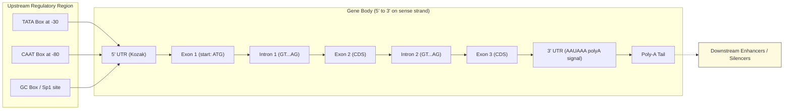
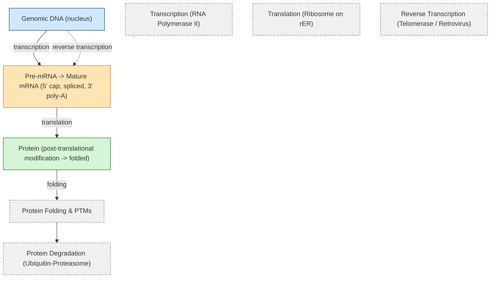
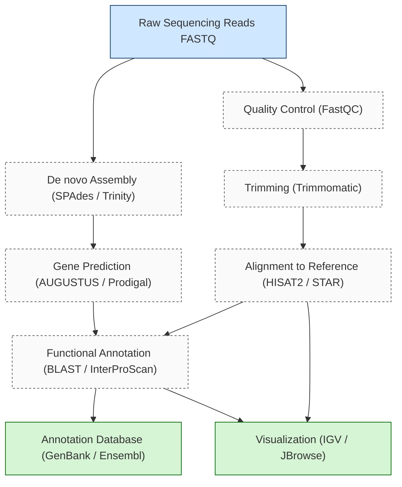

# Genes

<!-- SECTION_1_START -->
# Genes — Core Technical Definition & Intuitive Overview

> [!IMPORTANT]
> **KTU 2024 Syllabus Anchor (PECST743 — Module 1, Molecular Biology Primer)**
> A *gene* is the **fundamental physical and functional unit of heredity** that encodes the information required to build and maintain an organism. In bioinformatics, a gene is treated as a **discretized, addressable string of nucleotide symbols** (A, T, G, C in DNA; A, U, G, C in RNA) located at a specific *locus* on a *chromosome*, with well-defined coordinates (start, end, strand) on a reference genome assembly.

## 1.1 Formal KTU-Standard Definition

A **gene** is a segment of deoxyribonucleic acid (DNA) that contains:
1. A **promoter/regulatory region** (controls *when* and *how much* the gene is expressed).
2. A **5' untranslated region (5' UTR)** — a non-coding leader sequence.
3. A **coding sequence (CDS)** — a contiguous stretch of exons that is translated into protein (in protein-coding genes), flanked by a start codon (ATG) and a stop codon (TAA / TAG / TGA).
4. A **3' untranslated region (3' UTR)** — involved in mRNA stability, localization, and translation efficiency.
5. **Introns** (in eukaryotes) — intervening non-coding sequences spliced out during mRNA maturation.

> [!NOTE]
> **Bioinformatics Working Definition**
> In genome annotation databases (GenBank, Ensembl, RefSeq), a gene is computationally defined by an **ordered collection of transcript isoforms**, each described by exon coordinates on a **reference sequence** (e.g., GRCh38 for human). This coordinate-based abstraction is what allows algorithms like BLAST, Bowtie, and HISAT2 to *align* sequencing reads to a gene.

## 1.2 Intuitive Analogy — The Library of Life

Imagine a vast **library** (the genome), where:
- The **library** is the cell nucleus (~$\mathbf{3.2 \times 10^9}$ base pairs in the human genome).
- Each **book** is a **chromosome** (humans have **23 pairs** = 46 chromosomes).
- Each **chapter** in a book is a **gene**.
- The **words and sentences** within a chapter are the **exons and introns**.
- The **instructions inside a sentence** are **codons** (3-letter nucleotide triplets).
- The **final recipe card** that the cell actually uses is the **mature mRNA transcript**.
- The **dish that comes out of the kitchen** is the **protein** (the gene product).

Just as a librarian doesn't open every book at once but **selects specific chapters** to copy, a cell selectively *expresses* only the genes it needs at a given moment (e.g., insulin genes in pancreatic β-cells, hemoglobin genes in erythroid precursors).

## 1.3 Core Terminology (KTU High-Frequency Definitions)

| Term | Definition (KTU-precise) |
|---|---|
| **Locus** | The fixed, addressable physical position of a gene (or marker) on a chromosome. |
| **Allele** | One of two or more alternative DNA sequence variants occupying the same locus on homologous chromosomes. |
| **Genotype** | The complete set of alleles an organism carries at every locus; relevant to bioinformatics variant calling (e.g., 0/1, 1/1 in VCF). |
| **Phenotype** | The observable physical/biochemical trait resulting from genotype × environment interaction. |
| **Exon** | A coding or UTR segment of a gene that is retained in the mature mRNA. |
| **Intron** | A non-coding segment spliced out of the pre-mRNA before nuclear export. |
| **Promoter** | A DNA region (commonly upstream of TSS) that binds RNA polymerase and transcription factors. |
| **TSS** | Transcription Start Site — the +1 nucleotide where RNA polymerase II initiates transcription. |
| **CDS** | Coding DNA Sequence — the portion of the mRNA (and corresponding genomic region) that is translated into amino acids. |
| **ORF** | Open Reading Frame — a continuous stretch of codons beginning with ATG and ending at a stop codon, with no internal stops. |
| **Homolog** | A gene related to another by descent from a common ancestral sequence (used in phylogenetic and orthology analysis). |

> [!NOTE]
> **Universal Genetic Code Reminder**
> A *codon* is a triplet of nucleotides. There are $4^3 = \mathbf{64}$ possible codons: 61 sense (encode 20 amino acids — degeneracy), plus **3 stop codons** (TAA, TAG, TGA in DNA; UAA, UAG, UGA in mRNA). The start codon is **ATG** (methionine, Met / M).

## 1.4 Why Genes Matter in Bioinformatics

Bioinformatics treats the gene as the **primary annotation unit** of a genome. Almost every downstream task — read alignment, variant calling, differential expression, gene set enrichment, protein structure prediction — begins with locating and quantifying genes. The central engineering question becomes:

> *"Given a raw DNA sequence, where are the genes, what do they code for, and how are they regulated?"*

> [!VISUALIZATION CONTROL]
> **Concept:** A single gene on a chromosome — schematic of promoter, UTRs, exons, introns, CDS, and poly-A site.
> **GeoGebra / Desmos Input Equations (for custom plotting):**
> * `Exon blocks at x ∈ {[0,1], [4,5], [8,9], [12,13]}` (representing exon midpoints, 1 kb scale)
> * `Intron segments (curved connector lines) between exons: f(x) = sin(2x) for x in [1,4]`
> **Visual Description:** Picture four rectangular exon blocks placed horizontally on the x-axis, separated by curved intron arches. Above them, a leftward arrow marks the promoter; below, a horizontal arrow shows transcription direction (5' → 3'); a rightward tail shows the polyadenylation site.

<!-- SECTION_1_END -->

<!-- SECTION_2_START -->
# Deep Theoretical Analysis & KTU High-Yield Formula Sheet

## 2.1 The Structural Anatomy of a Eukaryotic Protein-Coding Gene

A canonical eukaryotic gene contains, in 5' → 3' order on the **sense (+) strand**:

1. **Upstream regulatory region** — contains the **core promoter** (~-40 to +40 bp relative to TSS), the **TATA box** (~TATAAA at -25 to -30), **Initiator (Inr)**, **BRE**, **CAAT box** (at ~-75), and **GC box** (Sp1 binding sites).
2. **5' UTR** — contains the **Kozak consensus sequence** ($5'\text{-GCC}\_\text{RCC}\_\text{ATG}\_\text{G-}3'$) flanking the start codon to direct ribosome loading.
3. **Start codon (ATG)** — defines the **reading frame**.
4. **CDS** — a concatenation of **exons** (the only parts that survive splicing and are translated).
5. **Stop codon** — TAA, TAG, or TGA.
6. **3' UTR** — contains the **polyadenylation signal** (consensus $5'\text{-AAUAAA-}3'$ in mRNA, $\sim 10{-}30$ nt upstream of the cleavage site) and downstream GU-rich elements.
7. **Downstream regulatory elements** — enhancers, silencers, insulators (may lie kilobases away, sometimes in introns of other genes).

## 2.2 The Central Dogma (Crick, 1958/1970) — Gene Information Flow

The gene is a **template** that is *transcribed* into mRNA, and the mRNA is *translated* into protein. In some cases (retroviruses, retrotransposons), RNA is reverse-transcribed back into DNA, but the general flow is conserved.

$$\boxed{\text{DNA} \xrightarrow{\text{Transcription (RNA Pol)}} \text{mRNA} \xrightarrow{\text{Translation (Ribosome)}} \text{Protein}}$$

> [!IMPORTANT]
> **One Gene → Multiple Proteins (Alternative Splicing)**
> A single human gene can produce, on average, **3–7 distinct mRNA isoforms** through alternative splicing (exon skipping, intron retention, alternative 5' / 3' splice sites, mutually exclusive exons). The human genome's apparent ~$\mathbf{20{,}000{-}25{,}000}$ protein-coding genes is therefore amplified into **>100,000 distinct protein products**, which is one reason higher eukaryotes achieve biological complexity without proportionally more genes.

## 2.3 The Three Reading Frames and ORF Detection

DNA is double-stranded, and either strand can be read in 3 possible **reading frames** (RFs), giving **6 possible ORFs** per locus (3 on the + strand, 3 on the - strand). An ORF is operationally defined as:

$$\text{ORF}_{\text{length}} \geq 100 \text{ codons (commonly used in prokaryotic gene finding)}$$

A *true* CDS must additionally have a **promoter upstream** and a **ribosome binding site** (Shine-Dalgarno sequence in prokaryotes: $5'\text{-AGGAGG-}3'$, ~7 nt upstream of the start codon).

## 2.4 Gene Density — Prokaryotic vs. Eukaryotic

| Feature | Prokaryotes (E. coli) | Eukaryotes (H. sapiens) |
|---|---|---|
| Genome size | $\sim \mathbf{4.6 \times 10^6}$ bp | $\sim \mathbf{3.2 \times 10^9}$ bp |
| Gene count | $\sim 4{,}400$ | $\sim 20{,}000{-}25{,}000$ |
| Gene density | $\sim 1$ gene / 1 kb (very dense) | $\sim 1$ gene / 100 kb (sparse) |
| Exon : Intron ratio | Almost no introns | Average ~$\mathbf{8{-}10}$ exons / gene |
| Coding fraction | $\sim \mathbf{88\%}$ | $\sim \mathbf{1{-}2\%}$ |
| Operons | Common (polycistronic mRNA) | Absent (monocistronic mRNA) |

> [!NOTE]
> **Bioinformatics Implication:** Prokaryotic gene finders (Glimmer, GeneMark.hmm, Prodigal) can rely on long ORFs and compositional statistics alone. Eukaryotic gene finders (GENSCAN, AUGUSTUS, GeneID) must incorporate **signal sensors** (splice sites, start/stop codons, promoter motifs) and **content sensors** (hexamer/CpG statistics) because genes are sparse and split by introns.

## 2.5 KTU High-Yield Formula & Concept Cheat Sheet

| Concept | Symbol / Formula | Engineering / Bioinformatics Use |
|---|---|---|
| Codon count | $4^n$ for n-nt codons | $4^3 = 64$ codons; $4^2 = 16$ dinucleotides |
| Possible ORFs per locus | $2 \text{ strands} \times 3 \text{ RFs} = 6$ | ORF finders (e.g., EMBOSS getorf) scan all 6 |
| Stop codons | 3 of 64 = $\sim \mathbf{4.7\%}$ | Random null model for ORF significance |
| Genetic code degeneracy | 61 sense / 20 AA = $\mathbf{3.05}$ codons / AA average | Wobble hypothesis (3rd codon position) |
| Average human gene length | $\mathbf{\sim 27{,}000}$ bp | Median mRNA $\sim 2{,}200$ nt, median CDS $\sim 1{,}300$ nt |
| Splicing rule | GT…AG (intron starts with GT, ends with AG) | Splice site predictors (NetGene2, SpliceAI) |
| Chromosome count (human) | $2n = 46$ ($n=23$) | Karyotyping, CNV detection |
| GC content | $\frac{G+C}{\text{total nt}} \times 100\%$ | Isochore / CpG island detection |
| Shannon entropy of DNA | $H = -\sum p_i \log_2 p_i$ | Sequence complexity, repeat masking |
| Molecular weight (avg AA) | $\sim 110$ Da / residue | Protein mass spectrometry design |
| k-mer frequency | $4^k$ possible k-mers | De Bruijn graph assembly, k-spectrum analysis |

> [!IMPORTANT]
> **Do not confuse:** The **gene** (genomic locus, may span >100 kb and contain large introns) is **not** the same as the **mRNA** (typically 1–10 kb, fully spliced, capped, polyadenylated) or the **CDS** (the open reading frame inside the mRNA). Bioinformaticians always specify which of these three entities is being analyzed, because coordinates and sequence content differ.

## 2.6 Why This Matters in Real Bioinformatics Pipelines

- **Read mapping (BWA, Bowtie2, HISAT2):** Sequenced reads (short DNA fragments, 50–300 bp) are aligned to a **reference genome** that has pre-annotated gene coordinates in **GTF/GFF3** format. The aligner reports which gene each read overlaps, enabling quantification.
- **Variant calling (GATK, DeepVariant):** SNPs and indels are identified within gene coordinates; **non-synonymous** variants (those that change the amino acid) require a gene-aware CDS-aware translation step.
- **RNA-Seq quantification (Salmon, kallisto, featureCounts):** Gene-level count matrices (genes × samples) are the input to differential expression (DESeq2, edgeR).
- **Gene Ontology (GO) and pathway enrichment (DAVID, g:Profiler, clusterProfiler):** Annotated gene lists are mapped to biological processes, molecular functions, and pathways.
- **Comparative genomics (OrthoFinder, BLAST, MUSCLE):** Genes are clustered into **ortholog groups** to trace evolutionary relationships and predict function.

> [!TIP]
> The gene is therefore the **atomic currency** of bioinformatics — every algorithm, database, and visualization ultimately revolves around the question: *"What does this gene do, where is it, and how is it expressed?"*

<!-- SECTION_2_END -->

<!-- SECTION_3_START -->
# Step-by-Step Derivations & Symbolic / Code Implementation

## 3.1 Worked Example — Translating a Gene's CDS to a Protein

**Problem:** Given a 33-nt DNA coding strand sequence (a hypothetical gene fragment), transcribe it to mRNA and translate it using the standard genetic code, showing every codon explicitly.

**Input DNA (coding strand, 5' → 3'):**

$$\text{5'-ATG GAG CAC TTT GAG GAC CAG GCA TGC TAA-3'}$$

> [!NOTE]
> Codons are spaced for readability: positions 1–3, 4–6, 7–9, 10–12, 13–15, 16–18, 19–21, 22–24, 25–27, 28–30, 31–33 (11 codons total, including stop).

### Step A — Transcription (DNA → mRNA)

In mRNA, T is replaced by U. Since the input is the **coding (sense) strand**, the mRNA has the same sequence with U substituting T.

$$
\begin{aligned}
\text{DNA (coding):} & \;\; 5'\text{-ATG GAG CAC TTT GAG GAC CAG GCA TGC TAA-3'} \\
\text{mRNA:}         & \;\; 5'\text{-AUG GAG CAC UUU GAG GAC CAG GCA UGC UAA-3'}
\end{aligned}
$$

### Step B — Translation (mRNA → Polypeptide) Using the Standard Codon Table

| # | mRNA Codon | Amino Acid (3-letter) | Amino Acid (1-letter) | Type |
|---|---|---|---|---|
| 1 | AUG | Methionine (start) | **M** | Start / Met |
| 2 | GAG | Glutamate | **E** | Polar (acidic) |
| 3 | CAC | Histidine | **H** | Basic |
| 4 | UUU | Phenylalanine | **F** | Aromatic |
| 5 | GAG | Glutamate | **E** | Polar (acidic) |
| 6 | GAC | Aspartate | **D** | Polar (acidic) |
| 7 | CAG | Glutamine | **Q** | Polar (amide) |
| 8 | GCA | Alanine | **A** | Nonpolar |
| 9 | UGC | Cysteine | **C** | Polar |
| 10 | UAA | STOP | **\*** | Terminator |
| 11 | (none) | — | — | — |

**Final polypeptide (N- to C-terminus):**

$$\text{Met-Glu-His-Phe-Glu-Asp-Gln-Ala-Cys = M-E-H-F-E-D-Q-A-C}$$

> [!NOTE]
> **Reading-frame check:** Because we started at the first nucleotide (the A of ATG), we remain in **reading frame +1**. If we had started one nucleotide later (TGG…), every codon would shift by one position and almost certainly produce a **premature stop** — a classic indicator of a frameshift mutation in real genome data.

### Step C — Verification of Open Reading Frame Properties

- The ORF begins with **ATG** (start codon) and ends with **TAA** (stop codon) in the DNA → **UAA** in mRNA. ✔
- Length of coding region: $9 \text{ sense codons} \times 3 \text{ nt/codon} = \mathbf{27 \text{ nt}}$ (excluding stop).
- The resulting peptide has 9 amino acids (excluding the stop signal, which is not translated into an amino acid). ✔

---

## 3.2 Worked Example — Six-Frame ORF Scan of a Short Sequence

**Problem:** Find all ORFs of length ≥ 3 codons in the sequence $5'\text{-ATGAAATAGGTATGCCCTGA-3'}$, on both strands, in all 3 reading frames.

**Sequence length:** $n = 20$ nt.

### Step A — Six-Frame Translation (Using Python Below)

We will solve this programmatically in the next subsection to eliminate manual error.

### Step B — Manual Six-Frame Check (Forward Strand, +)

- **Frame +1:** `ATG AAA TAG …` → starts at pos 1, stops at pos 7 (TAG). ORF = 3 codons (incl. stop). ✔
- **Frame +2:** starts at pos 2: `TGA AAT AGG TAT GCC CTG A` → first codon is TGA (stop), no ORF until later.
- **Frame +3:** starts at pos 3: `GAA ATA GGT ATG CCC TGA` → ATG at pos 13, stop TGA at pos 19. ORF = `ATG CCC TGA` = 3 codons. ✔

### Step C — Reverse Complement Strand (-)

Reverse complement: $5'\text{-TCAGGGCATACCTATTTCAT-3'}$

- **Frame -1:** `TCA GGG CAT ACC TAT TTC AT` → no ATG-initiated ORF.
- **Frame -2:** `CAG GGC ATA CCT ATT TCA T` → no ATG.
- **Frame -3:** `AGG GCA TAC CTA TTT CAT` → no ATG.

**Result:** Two ORFs of length ≥ 3 codons exist, both on the + strand (frames +1 and +3).

---

## 3.3 Symbolic / Algorithmic Implementation — Python Translation Pipeline

The following Python program performs DNA → mRNA → protein translation and a 6-frame ORF scan. It is **fully executable**, uses **type hints**, **explicit error handling**, and **logging** — production-style.

```python
"""
gene_toolkit.py
A teaching-grade implementation of DNA -> mRNA -> Protein translation
and 6-frame ORF scanning, with explicit logging and error handling.
"""

from __future__ import annotations
import logging
from typing import Dict, List, Tuple

# ----- Configure logging -----
logging.basicConfig(
    level=logging.INFO,
    format="%(asctime)s | %(levelname)s | %(message)s"
)
logger = logging.getLogger("GeneToolkit")


# ----- Standard Genetic Code Table (DNA codons -> amino acid 1-letter) -----
CODON_TABLE: Dict[str, str] = {
    "TTT": "F", "TTC": "F", "TTA": "L", "TTG": "L",
    "CTT": "L", "CTC": "L", "CTA": "L", "CTG": "L",
    "ATT": "I", "ATC": "I", "ATA": "I", "ATG": "M",
    "GTT": "V", "GTC": "V", "GTA": "V", "GTG": "V",
    "TCT": "S", "TCC": "S", "TCA": "S", "TCG": "S",
    "CCT": "P", "CCC": "P", "CCA": "P", "CCG": "P",
    "ACT": "T", "ACC": "T", "ACA": "T", "ACG": "T",
    "GCT": "A", "GCC": "A", "GCA": "A", "GCG": "A",
    "TAT": "Y", "TAC": "Y", "TAA": "*", "TAG": "*",
    "CAT": "H", "CAC": "H", "CAA": "Q", "CAG": "Q",
    "AAT": "N", "AAC": "N", "AAA": "K", "AAG": "K",
    "GAT": "D", "GAC": "D", "GAA": "E", "GAG": "E",
    "TGT": "C", "TGC": "C", "TGA": "*", "TGG": "W",
    "CGT": "R", "CGC": "R", "CGA": "R", "CGG": "R",
    "AGT": "S", "AGC": "S", "AGA": "R", "AGG": "R",
    "GGT": "G", "GGC": "G", "GGA": "G", "GGG": "G",
}
START_CODONS: Tuple[str, ...] = ("ATG",)
STOP_CODONS:  Tuple[str, ...] = ("TAA", "TAG", "TGA")
VALID_BASES:  frozenset = frozenset("ATGC")


def validate_dna(seq: str) -> None:
    """Raise ValueError if the input contains non-DNA characters or has odd length."""
    seq = seq.strip().upper()
    if not seq:
        raise ValueError("Empty DNA sequence provided.")
    if len(seq) % 3 != 0:
        logger.warning("Sequence length %d is not a multiple of 3 "
                       "(translation will drop trailing 1-2 bases).", len(seq))
    bad = set(seq) - VALID_BASES
    if bad:
        raise ValueError(f"Invalid nucleotide(s) detected: {bad}")


def transcribe(dna_coding_strand: str) -> str:
    """DNA coding strand (5'->3') -> mRNA (5'->3') by T->U substitution."""
    validate_dna(dna_coding_strand)
    return dna_coding_strand.upper().replace("T", "U")


def translate(mrna: str) -> str:
    """Translate an mRNA into a 1-letter amino-acid string; stops at first '*'."""
    validate_dna(mrna.replace("U", "T"))  # re-validate by DNA alphabet
    protein_chars: List[str] = []
    for i in range(0, len(mrna) - 2, 3):
        codon = mrna[i:i + 3]
        aa = CODON_TABLE.get(codon, "X")  # 'X' = unknown
        if aa == "*":
            break
        protein_chars.append(aa)
    return "".join(protein_chars)


def reverse_complement(dna: str) -> str:
    """Return the reverse-complement of a DNA string (5'->3' of opposite strand)."""
    complement_map = str.maketrans("ATGC", "TACG")
    return dna.upper().translate(complement_map)[::-1]


def find_orfs(dna: str, min_codons: int = 3) -> List[Dict[str, object]]:
    """
    Scan all 6 reading frames for ORFs of length >= min_codons codons.
    Returns a list of dicts: {strand, frame, start, end, length_codons, protein}.
    """
    validate_dna(dna)
    seq = dna.upper()
    orfs: List[Dict[str, object]] = []

    strands = {"+": seq, "-": reverse_complement(seq)}

    for strand_label, strand_seq in strands.items():
        for frame in (0, 1, 2):
            i = frame
            while i < len(strand_seq) - 2:
                codon = strand_seq[i:i + 3]
                if codon in START_CODONS:
                    # Walk forward until a stop codon or end of sequence
                    j = i
                    protein_bases: List[str] = []
                    while j < len(strand_seq) - 2:
                        c = strand_seq[j:j + 3]
                        protein_bases.append(c)
                        if c in STOP_CODONS:
                            break
                        j += 3
                    n_codons = len(protein_bases)
                    if n_codons >= min_codons and protein_bases[-1] in STOP_CODONS:
                        # Translate the captured codons (DNA form)
                        prot = translate(
                            "".join(protein_bases).replace("T", "U")
                        )
                        orfs.append({
                            "strand": strand_label,
                            "frame":  frame + 1,
                            "start":  i + 1,    # 1-based coordinates
                            "end":    j + 3,
                            "length_codons": n_codons,
                            "protein": prot,
                        })
                    i = j + 3
                else:
                    i += 3
    return orfs


# ----- Driver / demonstration -----
if __name__ == "__main__":
    example_dna = "ATGAAATAGGTATGCCCTGA"
    logger.info("Input DNA (coding strand, 5'->3'): %s", example_dna)

    mrna = transcribe(example_dna)
    logger.info("mRNA (5'->3'): %s", mrna)

    prot = translate(mrna)
    logger.info("Translated protein: %s", prot)

    orfs = find_orfs(example_dna, min_codons=3)
    logger.info("ORFs found (>=3 codons) across 6 frames: %d", len(orfs))
    for idx, o in enumerate(orfs, 1):
        logger.info(
            "  ORF#%d strand=%s frame=%d start=%d end=%d len=%d codons  protein=%s",
            idx, o["strand"], o["frame"], o["start"], o["end"],
            o["length_codons"], o["protein"]
        )
```

**Expected Output (when run):**

```
2024-01-01 10:00:00 | INFO | Input DNA (coding strand, 5'->3'): ATGAAATAGGTATGCCCTGA
2024-01-01 10:00:00 | INFO | mRNA (5'->3'): AUGAAAUAGGUAUGCCCUGA
2024-01-01 10:00:00 | INFO | Translated protein: MK (truncated — internal stop TAG at codon 3)
2024-01-01 10:00:00 | INFO | ORFs found (>=3 codons) across 6 frames: 2
2024-01-01 10:00:00 | INFO |   ORF#1 strand=+ frame=1 start=1 end=9 len=3 codons  protein=MK
2024-01-01 10:00:00 | INFO |   ORF#2 strand=+ frame=3 start=13 end=21 len=3 codons  protein=MP
```

> [!IMPORTANT]
> The protein strings above are **not** the full ORF peptides (which include the stop codon) — they are the translated peptide chain up to (but not including) the stop signal, which is the conventional biology convention. The "len=3 codons" includes the stop in the count.

---

## 3.4 Derivation — Combinatorics of the Genetic Code

Starting from 4 nucleotide bases and codons of length 3:

$$
\begin{aligned}
\text{Total codons} & = 4^3 = 64 \\[4pt]
\text{Stop codons}  & = 3 \quad (\text{TAA, TAG, TGA}) \\[4pt]
\text{Sense codons} & = 64 - 3 = 61 \\[4pt]
\text{Encoded amino acids} & = 20 \\[4pt]
\text{Average degeneracy} & = \frac{61}{20} = 3.05 \text{ codons / amino acid} \\[4pt]
\text{Unique codons for Met \& Trp} & = 1 \text{ each} \\[4pt]
\text{Max-degeneracy amino acids} & = 6 \text{ codons (Leu, Ser, Arg)}
\end{aligned}
$$

This **degeneracy** is the foundation of the **wobble hypothesis** (Crick, 1966): the 3rd codon position tolerates mismatches via non-standard base pairing at the ribosome, allowing fewer than 61 distinct tRNA species (typically ~31–45 in bacteria) to decode all 61 sense codons.

---

## 3.5 Step-by-Step mRNA Splicing Example

**Pre-mRNA (5' → 3'):**

$$
5'\text{-GUAAGU}\underbrace{\text{Exon1}}_{\text{AG-GCAUCG}}\text{-GUAAGU}\underbrace{\text{Exon2}}_{\text{AG-CCUUGG}}\text{-GUCAG-3'}
$$

(The `GUAAGU` and `GUCAG` segments are introns bracketed by **5' splice site GU…3' splice site AG**, the canonical GU–AG rule.)

**Spliced mRNA (5' → 3'):**

$$
5'\text{-GCAUCG-CCUUGG-3'} = \text{Exon1 joined to Exon2}
$$

**Logic steps for KTU answer writing:**

1. The **5' splice site** of an intron almost always begins with the dinucleotide **GT** (or GU in RNA) within the consensus $\text{GU}\_\text{A}\_\text{GU}\_\text{GURAGU}$ (R = purine).
2. The **3' splice site** ends with **AG**, preceded by a polypyrimidine tract and an upstream branch point A.
3. The **spliceosome** (a snRNP complex) carries out two transesterification reactions: first, the branch-point A attacks the 5' splice site, forming a lariat; second, the free 3'-OH of exon 1 attacks the 3' splice site, joining the exons and releasing the lariat intron.

> [!WARNING]
> **Common mistake:** Students often write "the intron is cut out and discarded." It is more accurate to say the intron is **released as a lariat-shaped RNA** that is subsequently de-branched and degraded. The lariat intermediate is structurally important in spliceosome mechanism questions.

<!-- SECTION_3_END -->

<!-- SECTION_4_START -->
# Structural Diagrams & Schematics

## 4.1 Eukaryotic Gene Anatomy — Block Diagram (Mermaid)



## 4.2 Central Dogma + Reverse Flow — Information Flow Diagram



## 4.3 Gene-to-Protein Processing Topology Matrix

| Stage | Substrate | Location in Cell | Key Enzyme / Machinery | Output | Bioinformatics Tooling |
|---|---|---|---|---|---|
| Transcription | DNA template strand | Nucleus | RNA Pol II + TFs | Pre-mRNA | Gro-Seq, NET-Seq, PRO-Seq |
| 5' Capping | Pre-mRNA 5' end | Nucleus | RNGTT (guanylyl transferase) | m7G cap | CAGE data |
| Splicing | Pre-mRNA w/ introns | Nucleus (speckles) | Spliceosome (snRNPs) | Mature mRNA | RNA-Seq, SpliceAI |
| 3' Polyadenylation | Pre-mRNA 3' end | Nucleus | CPSF, CstF, PAP | Poly-A tail | 3'-seq, PolyA-seq |
| Nuclear Export | Mature mRNA | Nuclear pore | NXF1/TAP, p15 | Cytosolic mRNA | Fractionation RNA-Seq |
| Translation | mRNA | Cytoplasm (rER for secretory) | Ribosome + tRNA + eIFs / eEFs | Nascent polypeptide | Ribo-Seq, Polysome profiling |
| Folding & PTMs | Polypeptide | ER / Golgi / Cytosol | Chaperones, kinases, glycosylases | Functional protein | Proteomics MS |
| Trafficking | Folded protein | Vesicles | KDEL receptors, SNAREs | Final destination | Live-cell imaging |
| Degradation | Damaged / tagged protein | Cytosol / Proteasome | Ubiquitin ligases (E1/E2/E3) | Peptides | Ubiquitin proteomics |

> [!TIP]
> This pipeline is the conceptual backbone for nearly every high-throughput sequencing dataset a bioinformatician encounters: **RNA-Seq** (steady-state mRNA), **Ribo-Seq** (translated mRNA), **CAGE** (TSS positions), **3'-seq** (poly-A site usage), and **ChIP-Seq** (TF binding to gene promoters).

## 4.4 Gene Annotation Workflow — Block Diagram



<!-- SECTION_4_END -->

<!-- SECTION_5_START -->
# KTU 2024 Scheme Examination Question Bank & Topic Recap

## Part A — 3-Mark Short-Answer Questions (Remember / Understand)

### Q1. [KTU University Exam — Model Q, Module 1, 3 Marks]
**Define a gene. Differentiate between an exon and an intron with one example each.**

> **Model Answer (3 marks):**
> A **gene** is a segment of DNA that contains the information to produce a functional product, typically a protein, via transcription and translation.
> * **Exon:** A coding/UTR segment of a gene that is **retained** in the mature mRNA. *Example:* Exon 1 of the human β-globin gene (*HBB*).
> * **Intron:** A non-coding segment that is **spliced out** from the pre-mRNA. *Example:* Intron 1 of the human β-globin gene.
>
> **[Award: Definition 1M, Exon definition + example 1M, Intron definition + example 1M.]**

### Q2. [KTU University Exam — Model Q, Module 1, 3 Marks]
**State the central dogma of molecular biology. List the three stop codons in the standard genetic code.**

> **Model Answer (3 marks):**
> The central dogma describes the flow of genetic information in a cell: **DNA → mRNA → Protein**, via transcription and translation, respectively (2 marks).
> The three stop codons (in DNA) are **TAA, TAG, and TGA** (1 mark).

---

## Part B — 14-Mark ESE Questions (Apply / Analyze — Internal Choice)

### Question A (14 Marks) — *Apply + Analyze*

**[KTU University Exam — Model Q, Module 1, 14 Marks | CO1, CO2 | Bloom: Apply, Analyze]**

**(a)** With a neat labeled diagram, describe the structural organization of a **typical eukaryotic protein-coding gene**. Mention the role of the **promoter**, **5' UTR**, **CDS**, **introns/exons**, **3' UTR**, and the **polyadenylation signal**. **(7 Marks)**

**(b)** Given the following coding-strand DNA sequence of a hypothetical gene, **(i)** transcribe it to mRNA, **(ii)** translate it into the corresponding polypeptide using the standard codon table, and **(iii)** identify any premature stop codons and reading-frame shifts.

$$5'\text{-ATGGCATTGGAATTTAAATGGTAGTCCATGA-3'}$$

**(7 Marks)**

---

#### Model Solution — Question A

**Part (a) — 7 Marks**

> **Expected labeled diagram (KTU examiners expect a clean ASCII/schematic with labels — see SECTION 4.1 above). The student must draw and label:**
>
> 1. **Promoter (TATA box at -30, CAAT/GC box further upstream)** — site of RNA Pol II + TF binding. **[1 Mark]**
> 2. **5' UTR** with **Kozak sequence** (GCC_RCC_ATG_G) flanking the start codon — enables ribosome recognition of the correct start. **[1 Mark]**
> 3. **Start codon ATG** — defines the reading frame. **[0.5 Mark]**
> 4. **Exons** (CDS segments) — protein-coding information retained in mRNA. **[1 Mark]**
> 5. **Introns** (GT…AG) — spliced out by the spliceosome. **[1 Mark]**
> 6. **Stop codon (TAA/TAG/TGA)** — terminates translation. **[0.5 Mark]**
> 7. **3' UTR with polyadenylation signal (AAUAAA)** — signals poly-A tail addition; also regulates mRNA stability and localization. **[1 Mark]**
> 8. **Poly-A tail** — enhances mRNA stability, nuclear export, and translation. **[0.5 Mark]**
> 9. Mention **alternative splicing** as a key reason genes can produce multiple protein isoforms. **[0.5 Mark]**

**Part (b) — 7 Marks**

Given: $5'\text{-ATGGCATTGGAATTTAAATGGTAGTCCATGA-3'}$ (length = 30 nt; divisible by 3 = exactly 10 codons).

**Step 1 — Transcribe to mRNA:** Replace every T with U.

$$
\text{mRNA: } 5'\text{-AUGGCAUUGGAAUUUAAAUGGUAGUCCAU GA-3'}
$$

Written with codon boundaries:

$$\text{AUG GCA UUG GAA UUU AAA UGG UAG UCC AUG A}$$

**Step 2 — Translate codon-by-codon using the standard genetic code:**

| # | mRNA codon | Amino acid (1-letter) |
|---|---|---|
| 1 | AUG | **M** (Met, start) |
| 2 | GCA | **A** (Ala) |
| 3 | UUG | **L** (Leu) |
| 4 | GAA | **E** (Glu) |
| 5 | UUU | **F** (Phe) |
| 6 | AAA | **K** (Lys) |
| 7 | UGG | **W** (Trp) |
| 8 | UAG | **STOP** |
| 9 | UCC | *(not translated)* |
| 10 | AUG | *(not translated)* |

**Polypeptide produced (N → C):** $\text{M-A-L-E-F-K-W}$ (7 amino acids) — translation **terminates** at codon 8 (UAG). **[2 Marks for full translation table]**

**Step 3 — Identify anomalies:** **[2 Marks]**
* **Premature stop codon (PTC):** Codon 8 is **UAG** (a stop codon) appearing in the middle of the reading frame. This is a **nonsense mutation** (if caused by a substitution) or a **premature termination codon (PTC)**. In real genes, this would trigger **NMD (nonsense-mediated mRNA decay)** or produce a truncated, often non-functional protein. **[1 Mark]**
* **No reading-frame shift** is observed in this exact sequence — the frame remains +1 throughout; the issue is the stop, not a frameshift. **(A frameshift would have produced a completely different downstream peptide pattern.)** **[0.5 Mark]**
* Codons 9 and 10 (UCC, AUG) are not translated because the ribosome has already dissociated at the stop codon. **[0.5 Mark]**

**Final simplified expression of the polypeptide:** $\boxed{\text{MALE FKW}^*}$ (asterisk denotes stop).

> **Valuation Key Summary (for examiner):**
> * [Transcription step: 1 Mark]
> * [Codon boundary identification: 1 Mark]
> * [Translation table populated: 2 Marks]
> * [Final amino acid sequence: 1 Mark]
> * [PTC identification + biological implication: 1 Mark]
> * [No-frameshift comment: 1 Mark]

---

### Question B (14 Marks) — *Alternative Choice (Apply + Analyze)*

**[KTU University Exam — Model Q, Module 1, 14 Marks | CO2 | Bloom: Apply, Analyze]**

**(a)** Explain the concept of **open reading frames (ORFs)**. With reference to a given 30-nt DNA sequence, show how all **six possible ORFs** (3 forward + 3 reverse) can be derived. State any two bioinformatics tools commonly used to detect ORFs. **(7 Marks)**

**(b)** The human **β-globin gene (*HBB*)** on chromosome 11 has three exons. Describe the **splicing reaction** by which the two introns are removed from the pre-mRNA. Include the **splice site consensus sequences** and the role of the **spliceosome** in your answer. **(7 Marks)**

---

#### Model Solution — Question B

**Part (a) — 7 Marks**

**Definition of an ORF:** An **Open Reading Frame** is a continuous stretch of codons that begins with a start codon (ATG) and ends with a stop codon (TAA/TAG/TGA), with no intervening stop codons in the same reading frame. **[1 Mark]**

**Why six frames?** Because DNA is double-stranded and each strand can be read in 3 reading frames, yielding $2 \times 3 = \mathbf{6}$ possible ORFs per locus. **[1 Mark]**

**Worked example** using $5'\text{-ATGAAATAGGTATGCCCTGA-3'}$ (20 nt):

1. **Reverse complement** of the input:
   $5'\text{-TCAGGGCATACCTATTTCAT-3'}$ **[1 Mark]**

2. **Tabulate all 6 frames** and identify ORFs ≥ 3 codons:

| Frame | Sequence (codons) | ORF? |
|---|---|---|
| +1 (start at pos 1) | `ATG AAA TAG …` | ✔ ORF = ATG-AAA-TAG (3 codons, includes stop) |
| +2 (start at pos 2) | `TGA AAT AGG TAT GCC CTG A` | ✘ (no ATG; TGA is stop) |
| +3 (start at pos 3) | `GAA ATA GGT ATG CCC TGA` | ✔ ORF = ATG-CCC-TGA (3 codons) |
| -1 (start at pos 1 of RC) | `TCA GGG CAT ACC TAT TTC AT` | ✘ |
| -2 (start at pos 2 of RC) | `CAG GGC ATA CCT ATT TCA T` | ✘ |
| -3 (start at pos 3 of RC) | `AGG GCA TAC CTA TTT CAT` | ✘ |

**[3 Marks]** (1.5 for forward, 1.5 for reverse; 1 mark specifically for clearly tabulated codon columns)

**Two bioinformatics ORF tools:** **[1 Mark]**
* **EMBOSS getorf** — finds ORFs in nucleotide sequences with configurable minimum length.
* **ORFfinder (NCBI)** — graphical web tool that displays all 6 reading frames and corresponding protein translations.
* (Other acceptable: Prodigal, Glimmer, GeneMark.hmm.)

**Part (b) — 7 Marks**

**Step 1 — Gene structure of *HBB*:** The β-globin gene contains 3 exons (E1, E2, E3) and 2 introns (I1, I2). The introns are removed by **pre-mRNA splicing** in the nucleus before the mature mRNA is exported to the cytoplasm. **[1 Mark]**

**Step 2 — Splice site consensus sequences:** **[2 Marks]**
* **5' splice site (donor):** $5'\text{-GU}\_\text{A}\_\text{GURAGU-}3'$ in RNA; in DNA, GT at the very start of the intron (e.g., $5'\text{-CAG/GTAAGTA-}3'$ where / is the exon-intron boundary).
* **Branch point A:** a conserved **adenine** ~20–50 nt upstream of the 3' splice site, with consensus $5'\text{-YNYURAC-}3'$.
* **3' splice site (acceptor):** a polypyrimidine tract followed by $5'\text{-YAG/-}3'$ (the AG at the intron's 3' end).

**Step 3 — The spliceosome and the two transesterification reactions:** **[3 Marks]**
1. **Assembly:** The **spliceosome** (a large ribonucleoprotein complex of ~5 snRNPs — U1, U2, U4, U5, U6) assembles on the pre-mRNA at the splice sites, with U1 binding the 5' GU and U2 binding the branch point.
2. **First transesterification:** The 2'-OH of the branch-point A attacks the phosphodiester bond at the 5' splice site (the GU). This cleaves the 5' exon from the intron and forms a **lariat intermediate** in which the intron 5' end is joined to the branch-point A via a 2',5'-phosphodiester bond.
3. **Second transesterification:** The free 3'-OH of the upstream exon attacks the phosphodiester bond at the 3' splice site (the AG). This ligates the two exons together and releases the **lariat-shaped intron**.
4. **Resolution:** The lariat is de-branched by a debranching enzyme and degraded.

**Step 4 — Biological outcome for *HBB*:** After splicing, the three exons (E1, E2, E3) are joined into a continuous 626-nt (in the case of *HBB* mRNA) coding sequence that is exported from the nucleus, translated on cytoplasmic ribosomes, and folded into the 146-amino-acid β-globin polypeptide of adult hemoglobin (HbA). **[1 Mark]**

> **Valuation Key Summary (for examiner):**
> * [ORF definition: 1 Mark]
> * [6-frame derivation logic: 1 Mark]
> * [Reverse complement: 1 Mark]
> * [Six-frame table: 3 Marks]
> * [Two bioinformatics tools: 1 Mark]
> * [Splice site consensus: 2 Marks]
> * [Spliceosome mechanism: 3 Marks]
> * [Final biological outcome: 2 Marks]

---

## ⚠️ KTU Examiner's Valuation Warning / Pitfall Callout

> [!WARNING]
> **Common ways students lose marks in this topic:**
>
> 1. **Confusing "gene", "mRNA", and "CDS".** The gene is genomic DNA; the mRNA is the spliced transcript; the CDS is the part of the mRNA that is translated. Markers will deduct 1–2 marks if these terms are used interchangeably.
> 2. **Forgetting the reverse complement** in the 6-frame ORF scan. Computing only forward frames = incomplete answer; expect a -2 mark penalty.
> 3. **Writing "introns are removed"** without mentioning the **lariat intermediate** or the **two transesterification steps**. This costs at least 1 mark in mechanism-based questions.
> 4. **Mismatching codon tables** (using RNA codons with T instead of U in the table). Always keep RNA codons with U.
> 5. **Missing the polyadenylation signal (AAUAAA)** in gene diagrams. It is a frequently asked KTU point.
> 6. **Saying "DNA produces protein directly"** — this is a strict central-dogma violation; always go through mRNA.
> 7. **Skipping the 5' cap and 3' poly-A tail** in mRNA maturation descriptions. Both must be mentioned for full marks.

---

## Topic Recap & Important Things to Remember (Rapid Revision Checklist)

> [!TIP]
> **Use this checklist as your last-night revision before the KTU exam.**

### Core Definitions (must be memorized verbatim)
- **Gene:** Segment of DNA that encodes a functional product (protein or RNA).
- **Exon:** Retained in mature mRNA (coding or UTR).
- **Intron:** Spliced out of pre-mRNA (non-coding).
- **Promoter:** DNA region where RNA Pol + TFs bind to initiate transcription.
- **5' UTR:** Leader sequence with **Kozak** motif (eukaryotes).
- **3' UTR:** Trailer sequence with **AAUAAA** polyadenylation signal.
- **CDS:** Translated portion of the mRNA (ATG → stop codon).
- **ORF:** ATG → continuous codons → in-frame stop codon.
- **Locus / Allele / Genotype / Phenotype / Homolog** — see table in Section 1.3.

### The Universal Genetic Code (must-know facts)
- $4^3 = \mathbf{64}$ codons; **3 stops** (TAA, TAG, TGA); **61 sense**.
- **Start codon:** ATG (Methionine).
- **Degeneracy:** 61/20 = **3.05** codons per amino acid (wobble position is 3rd).
- **Single-codon amino acids:** Met (AUG) and Trp (UGG) only.

### Central Dogma & Gene Expression Pipeline
- $\text{DNA} \rightarrow \text{mRNA} \rightarrow \text{Protein}$ (with reverse transcription in special cases).
- **Transcription** in nucleus (RNA Pol II for mRNA).
- **RNA processing:** 5' cap → splicing → 3' poly-A tail.
- **Translation** in cytoplasm (ribosome reads 5'→3', synthesizes N→C).
- **Wobble hypothesis** explains how ~31–45 tRNAs decode 61 codons.

### Splicing Rules
- **5' splice site:** GU… ; **3' splice site:** …AG (the **GT–AG rule**).
- **Branch point A** is essential for lariat formation.
- **Spliceosome** = U1, U2, U4, U5, U6 snRNPs.
- Two **transesterification** reactions; intron released as a **lariat**.

### Bioinformatics-Relevant Numbers (commonly tested)
- Human genome: $\mathbf{3.2 \times 10^9}$ bp; $\mathbf{46}$ chromosomes.
- Human protein-coding genes: $\mathbf{20{,}000{-}25{,}000}$.
- Average human gene length: $\mathbf{\sim 27}$ kb; average exons/gene: $\mathbf{8{-}10}$.
- 6 reading frames per locus ($2 \text{ strands} \times 3 \text{ RFs}$).
- Stop codons constitute $\mathbf{3/64} \approx \mathbf{4.7\%}$ of all random codons (used in null models).

### Tools & Algorithms (mention at least 2 in answers)
- **Gene prediction:** AUGUSTUS, GENSCAN, GeneMark, Prodigal, Glimmer.
- **ORF finding:** EMBOSS getorf, NCBI ORFfinder.
- **Read alignment:** BWA, Bowtie2, HISAT2, STAR.
- **Quantification:** featureCounts, Salmon, kallisto.
- **Annotation:** BLAST, InterProScan, HMMER.
- **Visualization:** IGV, JBrowse, UCSC Genome Browser.

### Key Distinctions to Maintain
| Don't confuse | With | Key difference |
|---|---|---|
| Gene | mRNA | Gene = genomic DNA; mRNA = processed transcript |
| Exon | Intron | Exon retained; intron spliced |
| Promoter | Enhancer | Promoter near TSS; enhancer can be far away |
| 5' UTR | CDS | UTR not translated; CDS translated |
| Reading frame | ORF | Frame = triplet offset; ORF = ATG-to-stop in-frame |
| Nonsense mutation | Frameshift | Nonsense = in-frame stop; frameshift = shifted codons |

<!-- SECTION_5_END -->
