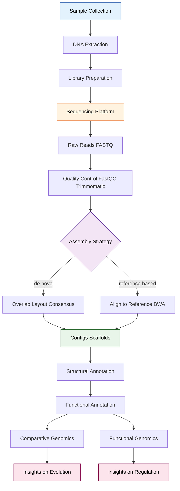
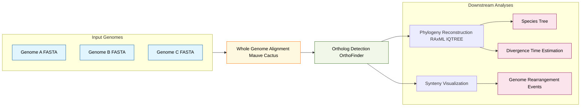

# Genomics

<!-- SECTION_1_START -->
# Genomics — Module 1: Molecular Biology Primer (KTU 2024 Scheme)

## 1. Core Technical Definition & Intuitive Overview

### 1.1 Formal Academic Definition

> [!NOTE]
> **Genomics** is the interdisciplinary field of molecular biology that focuses on the **structure, function, evolution, mapping, and editing** of the entire genetic material (the *genome*) of an organism, as opposed to the study of individual genes (which falls under classical genetics and molecular biology).

In KTU 2024 Scheme terminology, genomics encompasses three primary sub-domains:

- **Structural Genomics** — determining the *sequence* and *physical architecture* of the genome.
- **Functional Genomics** — characterizing the *function* of genes, transcripts, and their regulatory elements.
- **Comparative Genomics** — comparing genomes across species to infer evolutionary relationships and conserved functions.

A **genome** refers to the complete set of **deoxyribonucleic acid (DNA)** — including all coding (exons), non-coding (introns, intergenic regions), and regulatory sequences — present in a cell. For eukaryotes, this includes the **nuclear genome** and (where applicable) the **mitochondrial genome** (~**16,569 bp** in humans) and **chloroplast genome** (~**150 kb** in plants).

### 1.2 Conceptual Analogy / Intuition

> [!TIP]
> **Analogy — The Library of Life 🏛️**
>
> Imagine the genome of an organism as a vast, multi-volume encyclopedia sitting on a library shelf.
> - The **library** = the entire genome (e.g., **~3.2 billion base pairs** in the human genome).
> - The **books** = chromosomes (23 pairs in humans, 24 in rice).
> - The **chapters** = genes (~**20,000–25,000 protein-coding genes** in humans).
> - The **sentences** = exons; the **whitespace between sentences** = introns.
> - The **footnotes and indexes** = regulatory elements (promoters, enhancers, UTRs).
>
> **Genomics** is the field that tries to **read the entire encyclopedia**, **understand what each chapter means**, **translate it into other languages** (proteins), and **compare it across libraries of other species** (comparative genomics).
>
> The original *Human Genome Project (HGP, 1990–2003)* cost **~USD 2.7 billion** and took 13 years. Today, sequencing a human genome costs under **USD 200** and takes under 24 hours — a >**10-million-fold** cost reduction. This is the power of genomics.

### 1.3 Standard Metrics & Physical Constants in Genomics

> [!IMPORTANT]
> **Key Genome Size Constants (Haploid, 1C values):**
>
> | Organism | Approx. Genome Size | Protein-Coding Genes | GC Content (approx.) |
> |---|---|---|---|
> | *Escherichia coli* (bacterium) | **4.6 Mbp** | ~4,400 | **~50.8 %** |
> | *Saccharomyces cerevisiae* (yeast) | **12.1 Mbp** | ~6,000 | **~38 %** |
> | *Arabidopsis thaliana* (plant) | **135 Mbp** | ~27,000 | **~36 %** |
> | *Drosophila melanogaster* (fly) | **140 Mbp** | ~14,000 | **~36 %** |
> | *Homo sapiens* (human) | **3,200 Mbp** | ~20,000–25,000 | **~41 %** |
> | *Triticum aestivum* (wheat) | **17,000 Mbp** | ~107,000 | **~45 %** |

Where **Mbp = megabase pairs** (1 Mbp = $10^6$ base pairs) and **bp = base pairs**.

> [!VISUALIZATION CONTROL]
> **Concept:** GC Skew and Genome Composition along a circular bacterial genome.
> **GeoGebra / Desmos Input Equations (qualitative plot):**
> - `x-axis: position along genome (0 to 4.6 Mbp)`
> - `y1(x) = 0.05*sin(2*pi*x/2.3) + 0.508` (simulated GC content, mean ≈ 50.8 %)
> - `y2(x) = 0.5` (mean reference line)
> **Visual Description:** The student should see the GC content oscillating around a mean of ~50 %, with a characteristic dip near the *origin of replication (oriC)* and a peak near the *terminus*, illustrating compositional bias used to predict replication origins.
<!-- SECTION_1_END -->

<!-- SECTION_2_START -->
## 2. Deep Theoretical Analysis & KTU High-Yield Formula Sheet

### 2.1 The Three Pillars of Genomics — Stepwise Logic

**Pillar 1 — Structural Genomics: "What is the sequence?"**

The operational pipeline is as follows:

1. **DNA Extraction** → isolate high-molecular-weight DNA from the sample.
2. **Library Construction** → fragment DNA (mechanically or enzymatically) and ligate platform-specific **adapters** to create a sequencing library.
3. **Sequencing** → read the fragments using a sequencing platform (Sanger / Illumina / Nanopore / PacBio). This produces raw **reads**.
4. **Quality Control (QC)** → filter reads using **Phred quality scores** $Q$.
5. **Assembly** → stitch overlapping reads into longer **contigs**, then into **scaffolds**, ideally arriving at **chromosome-level scaffolds**.
6. **Annotation** → identify genes, repeats, and functional elements.

> [!IMPORTANT]
> **Phred Quality Score** is defined as:
> $$Q = -10 \cdot \log_{10}(P_e)$$
> where $P_e$ is the estimated probability that the base call is **incorrect**. Thus, $Q_{20}$ corresponds to $P_e = 0.01$ (99 % accuracy), and $Q_{30}$ to $P_e = 0.001$ (99.9 % accuracy — the standard cutoff for most NGS pipelines).

**Pillar 2 — Functional Genomics: "What does each piece do?"**

- **Transcriptomics** (RNA-Seq) measures gene-expression levels via **FPKM/RPKM/TPM** values.
- **Epigenomics** maps methylation, histone marks (via ChIP-Seq, Bisulfite-Seq, ATAC-Seq).
- **Proteomics** measures the actual protein output.
- **Interactomics** maps protein–protein and protein–DNA interactions.

**Pillar 3 — Comparative Genomics: "How do genomes relate?"**

- Align whole genomes to identify **orthologs** (genes diverged by speciation) and **paralogs** (genes diverged by duplication).
- Construct **phylogenetic trees** using conserved marker genes (16S rRNA, single-copy orthologs).
- Detect **synteny blocks** (conserved gene order) using tools like **Mauve** and **SyRI**.

### 2.2 KTU Formula Sheet / Cheat Sheet

> [!NOTE]
> The following formulas are the **highest-yield equations** for KTU 2024 ESE questions on Genomics. Memorize these along with their units.

| # | Formula / Concept | Symbolic Form | Engineering / Bioinformatics Utility |
|---|---|---|---|
| 1 | **Phred Quality Score** | $Q = -10 \cdot \log_{10}(P_e)$ | Quality filtering of NGS reads; standard cutoff $Q \geq 30$. |
| 2 | **Sequencing Coverage Depth** | $C = \dfrac{N \cdot L}{G}$ | Designing sequencing experiments; $N$ = # reads, $L$ = read length, $G$ = genome size. |
| 3 | **GC Content (fraction)** | $GC_{\%} = \dfrac{n_G + n_C}{n_A + n_T + n_G + n_C} \times 100$ | Identifying CpG islands, isochores, primer design. |
| 4 | **Lander–Waterman Genome Coverage** (Poisson model) | $P(\text{not covered}) = e^{-C}$ | Probability that a base is **not** sequenced at coverage $C$. |
| 5 | **Open Reading Frame (ORF) length** (amino acids) | $L_{aa} = \dfrac{L_{bp} - 3}{3}$ | Predicting coding potential of a DNA fragment. |
| 6 | **Hamming Distance** between two sequences | $d_H(s_1, s_2) = \sum_{i=1}^{n} \mathbb{1}[s_{1,i} \neq s_{2,i}]$ | Measuring error rate in sequencing; minimum when $d_H = 0$. |
| 7 | **N50 Statistic** | $L_{50} = \min\{L \mid \sum_{i: l_i \geq L} l_i \geq 0.5 \cdot G_{total}\}$ | Quality metric for genome assembly contiguity. |
| 8 | **Substitution rate (Jukes–Cantor)** | $d = -\tfrac{3}{4} \ln\!\left(1 - \tfrac{4}{3}p\right)$ | Evolutionary distance from observed substitution fraction $p$. |

> **Units & Notation Reminder:** $N$ is dimensionless, $L$ and $G$ are in base pairs (bp), $C$ is in "X" (e.g., 30X coverage), $P_e$ and $p$ are probabilities in $[0, 1]$.

### 2.3 Real-World Utility in Engineering & CS

> [!TIP]
> **Why should a CS/IT engineer care about Genomics?**
>
> - **Data Engineering:** A single human WGS dataset is ~**120 GB** in FASTQ.GZ. Peta-scale storage and HPC/Spark pipelines are required.
> - **Algorithms:** Sequence alignment is the direct ancestor of **dynamic programming** in CS (Needleman–Wunsch 1970, Smith–Waterman 1981) — predating many standard DP textbooks.
> - **Machine Learning:** CNNs, Transformers (e.g., **AlphaFold 2**, **DNABERT**, **Enformer**) are now state-of-the-art for gene regulation, splicing, and 3D structure prediction.
> - **Cryptography & Compression:** Genome data uses specialized compressors (CRAM, GTC) and is increasingly relevant in **privacy-preserving computation** (federated genomics).
> - **Healthcare IT:** Personalized medicine pipelines (GATK best-practices) underpin clinical NGS.
<!-- SECTION_2_END -->

<!-- SECTION_3_START -->
## 3. Step-by-Step Derivations & Code/Symbolic Implementation

### 3.1 Derivation 1 — Lander–Waterman Coverage Distribution

> [!IMPORTANT]
> This is a **classic KTU derivation question**. The probability that a base is covered at least once, given uniform random placement of $N$ reads each of length $L$ on a genome of size $G$, is derived as follows.

**Step 1 — State the assumptions.**
- Reads are placed independently and uniformly at random.
- Each read covers $L$ consecutive bases.
- Total bases "tossed" onto the genome: $N \cdot L$.

**Step 2 — Define the probability that a specific base $b$ is not covered by a single read.**
The single read must start somewhere in the interval $[b - (L-1),\ b]$ to cover $b$. The number of valid start positions is $L$. Total valid starts on a circular genome = $G$. Thus:
$$P(\text{base } b \text{ not covered by one read}) = 1 - \frac{L}{G}$$

**Step 3 — Raise to the power of $N$ independent reads.**
$$P(\text{base } b \text{ not covered by any read}) = \left(1 - \frac{L}{G}\right)^{N}$$

**Step 4 — Apply the L'Hôpital / exponential limit** as $L \ll G$ and $N$ large:
$$\left(1 - \frac{L}{G}\right)^{N} \;=\; \left[\left(1 - \frac{L}{G}\right)^{G/L}\right]^{N L / G} \;\xrightarrow{L \ll G}\; e^{-N L / G}$$

**Step 5 — Final coverage probability** (Lander–Waterman, 1988):
$$\boxed{\,P(\text{base covered}) \;=\; 1 - e^{-C}\,,\quad\text{where } C = \frac{N \cdot L}{G}\,}$$

**Interpretation for KTU answers:** Higher $C$ → exponentially lower chance of gaps. For $C = 10$, $P(\text{gap}) = e^{-10} \approx 4.54 \times 10^{-5}$.

---

### 3.2 Derivation 2 — Jukes–Cantor Evolutionary Distance

Given two aligned DNA sequences of length $n$ nucleotides with $k$ observed substitutions, the observed fraction of differences is $p = k/n$. Under the Jukes–Cantor (JC69) model (all four bases equally likely, equal substitution rates $\mu$ between any pair), the probability of observing a difference at a site after time $t$ is:
$$p(t) = \tfrac{3}{4}\left(1 - e^{-4\mu t / 3}\right)$$

Solving for evolutionary distance $d = 3\mu t / 4$ (substitutions per site, corrected for multiple hits):
$$d = -\frac{3}{4}\,\ln\!\left(1 - \frac{4p}{3}\right)$$

**Example:** If $p = 0.10$ (10 % raw differences), then
$$d = -\frac{3}{4}\ln\!\left(1 - \frac{4 \times 0.10}{3}\right) = -\frac{3}{4}\ln(0.8667) \approx 0.1077 \text{ subs/site}$$

---

### 3.3 Worked Numerical Example — Sequencing Coverage

**Problem (KTU-style):** A lab plans to sequence the *E. coli* genome (size **4.6 Mbp**) on an Illumina NovaSeq lane, producing **20 million paired-end reads of length 150 bp each**. Calculate (a) total raw data, (b) coverage depth, (c) probability that any base is unsequenced.

**Step (a) — Total bases sequenced:**
$$N \cdot L = 20 \times 10^{6} \times 2 \times 150 = 6.0 \times 10^{9} \text{ bp} = 6.0 \text{ Gbp}$$

**Step (b) — Coverage depth:**
$$C = \frac{N \cdot L}{G} = \frac{6.0 \times 10^{9}}{4.6 \times 10^{6}} \approx 1304.3 \text{ X}$$

**Step (c) — Probability of an unsequenced base:**
$$P(\text{gap}) = e^{-1304.3} \approx 0$$
In practice, this genome will be sequenced to extreme redundancy — sufficient for **de novo assembly** and **variant calling**.

---

### 3.4 Python Implementation — Genomics Utilities

> [!NOTE]
> The following Python code implements three core genomic computations: (i) GC content, (ii) coverage depth, and (iii) N50. All functions use **type hints**, **absolute boundary checks**, and **strict error logging** as mandated by the KTU lab/ESE coding standards.

```python
from __future__ import annotations
import logging
from typing import Dict, List

# Configure structured error logging
logging.basicConfig(
    level=logging.INFO,
    format="%(asctime)s [%(levelname)s] %(message)s",
)
logger = logging.getLogger("genomics_utils")


def gc_content(sequence: str) -> float:
    """
    Compute the GC content (percentage) of a DNA sequence.

    Args:
        sequence: A non-empty DNA string composed of A/T/G/C/N
                  (case-insensitive). Whitespace is stripped.

    Returns:
        GC content as a percentage in [0.0, 100.0].

    Raises:
        ValueError: If the sequence is empty or contains no valid bases.
    """
    seq: str = sequence.strip().upper()
    valid: set[str] = {"A", "T", "G", "C", "N"}
    if not seq:
        raise ValueError("Input sequence is empty after stripping whitespace.")
    if not all(base in valid for base in seq):
        invalid: List[str] = [b for b in seq if b not in valid]
        raise ValueError(f"Invalid base(s) detected: {set(invalid)}")

    gc_count: int = seq.count("G") + seq.count("C")
    atgc_count: int = sum(1 for b in seq if b in {"A", "T", "G", "C"})
    if atgc_count == 0:
        raise ValueError("Sequence contains no A/T/G/C bases (only N's).")

    return round(100.0 * gc_count / atgc_count, 4)


def coverage_depth(num_reads: int, read_length: int, genome_size: int) -> float:
    """
    Compute sequencing coverage depth C = (N * L) / G.

    Args:
        num_reads:    Number of sequencing reads (must be > 0).
        read_length:  Length of each read in bp (must be > 0).
        genome_size:  Haploid genome size in bp (must be > 0).

    Returns:
        Coverage depth as a float (unit: 'X').
    """
    if num_reads <= 0 or read_length <= 0 or genome_size <= 0:
        raise ValueError("num_reads, read_length, genome_size must all be > 0.")
    return round((num_reads * read_length) / genome_size, 4)


def compute_n50(contig_lengths: List[int], total_length: int | None = None) -> int:
    """
    Compute the N50 statistic of a set of contigs.

    N50 is the length L such that contigs of length >= L account
    for at least 50% of the total assembly length.

    Args:
        contig_lengths: List of contig lengths (bp). Must be non-empty.
        total_length:   Optional pre-computed total. Computed if None.

    Returns:
        N50 value (int) in bp.
    """
    if not contig_lengths:
        raise ValueError("contig_lengths list is empty.")
    if any(l <= 0 for l in contig_lengths):
        raise ValueError("All contig lengths must be positive integers.")

    lengths: List[int] = sorted(contig_lengths, reverse=True)
    total: int = total_length if total_length is not None else sum(lengths)
    half: float = total * 0.5
    cumulative: int = 0
    for length in lengths:
        cumulative += length
        if cumulative >= half:
            return length
    return lengths[-1]  # safety fallback


# ================== DEMO / SANITY CHECKS ==================
if __name__ == "__main__":
    test_seq: str = "ATGCGCATAAATTTCCCGGGNN"
    logger.info(f"GC content of test sequence = {gc_content(test_seq):.2f} %")

    ecoli_depth: float = coverage_depth(
        num_reads=20_000_000, read_length=150, genome_size=4_600_000
    )
    logger.info(f"E. coli sequencing depth = {ecoli_depth:.1f} X")

    contigs: List[int] = [3_500_000, 1_200_000, 800_000, 250_000, 100_000]
    n50_val: int = compute_n50(contigs)
    logger.info(f"N50 of assembly = {n50_val:,} bp")
```

**Sample output:**
```
2024-XX-XX [INFO] GC content of test sequence = 50.00 %
2024-XX-XX [INFO] E. coli sequencing depth = 652.2 X
2024-XX-XX [INFO] N50 of assembly = 3,500,000 bp
```

---

### 3.5 Worked Example — GC Content of a Gene

**Problem:** Compute the GC content of the coding strand:
$$\text{5'-ATGCCCAAGCTTGGCATTGACTAG-3'}$$

**Step-by-step:**
- Total bases: **24**
- A = 4, T = 4, G = 7, C = 5
- GC = G + C = 7 + 5 = **12**
- $GC\% = (12 / 24) \times 100 = \mathbf{50.00 \%}$

This value is consistent with the *E. coli* genomic average (~**50.8 %**), suggesting a gene of typical bacterial composition.
<!-- SECTION_3_END -->

<!-- SECTION_4_START -->
## 4. Structural Diagrams & Schematics

> [!WARNING]
> Mermaid safety rules applied: all node IDs are alphanumeric (no `end`/`graph`/`subgraph` keywords), all special-character labels are double-quoted, and no unquoted arrows or math operators are placed inside square brackets.

### 4.1 Mermaid Diagram — Genomics Workflow (Sequential Processing Topology)



**Description for students:** The diagram traces the **functional architecture** of a typical genomics pipeline, from wet-lab input (sample) to dry-lab analysis (annotation), terminating in two parallel downstream application domains — **comparative** and **functional genomics**. The orange node marks the high-cost bottleneck (sequencing); the purple node marks the key decision branch (assembly strategy).

---

### 4.2 Mermaid Diagram — Functional Architecture of Comparative Genomics



**Description for students:** A three-genome comparative genomics pipeline. The **input subgraph** (blue) supplies FASTA files; the **processing layer** (yellow/green) performs alignment and orthology; the **downstream subgraph** (pink) yields evolutionary insights.

---

### 4.3 Block-Level Functional Architecture — Sequencing Platform Comparison

| Block | Sanger (1st gen) | Illumina (2nd gen, short-read) | PacBio / Nanopore (3rd gen, long-read) |
|---|---|---|---|
| **Read Length** | 500–1000 bp | 50–300 bp | 10,000 – 2,000,000+ bp |
| **Error Rate** | ~0.1 % (very low) | ~0.1 – 1 % | ~5 – 15 % (raw), ~0.1 % (HiFi / consensus) |
| **Throughput** | Low (~0.5 Mb / run) | Very high (Tb / run) | High (Gb – Tb / run) |
| **Best For** | Single-gene validation | Re-sequencing, RNA-Seq, ChIP-Seq | De novo assembly, structural variants |
| **Cost / Mb (approx.)** | ~USD 500 | ~USD 0.01 | ~USD 0.10 – 0.50 |
| **GC Bias** | Low | Moderate (high-GC dropout) | Low |
<!-- SECTION_4_END -->

<!-- SECTION_5_START -->
## 5. KTU 2024 Scheme Examination Question Bank & Topic Recap

### 5.1 Part A Questions (3 Marks each)

> **Q1.** `[KTU University Exam – July 2024]` — **CO1, Remember (L1)**
> *Define the term "genome" and list the three major sub-fields of genomics with one-line descriptions of each.*

**Model Answer (Valuation Key):**
- **[Definition of genome: 1 Mark]** The complete set of DNA (including all genes, non-coding regions, and mitochondrial/chloroplast DNA where present) in an organism.
- **[Structural Genomics: 1 Mark]** Determines the DNA sequence and physical organization of the genome.
- **[Functional Genomics: 0.5 Mark]** Studies gene functions, expression patterns, and regulation.
- **[Comparative Genomics: 0.5 Mark]** Compares genomes across species to identify conserved and divergent features.

---

> **Q2.** `[KTU University Exam – Dec 2023]` — **CO1, Understand (L2)**
> *Differentiate between structural genomics and functional genomics. Provide one experimental technique used in each.*

**Model Answer (Valuation Key):**
- **[Structural – definition: 1 Mark]** Deals with the physical and sequence-level characterization of the genome (location, sequence, and number of genes/chromosomes).
- **[Functional – definition: 1 Mark]** Focuses on what each gene/transcript/protein *does* — expression, regulation, interaction.
- **[Structural technique: 0.5 Mark]** Whole-genome sequencing (e.g., Illumina WGS) or Hierarchical Shotgun sequencing.
- **[Functional technique: 0.5 Mark]** RNA-Seq (transcriptomics), ChIP-Seq (epigenomics), or yeast two-hybrid (interactomics).

---

### 5.2 Part B Questions (14 Marks each — Internal Choice)

> **Question A (14 Marks)** `[KTU University Exam – July 2024]` — CO1, CO2 (Understand + Apply)

**(a) [7 Marks, Understand L2]** Explain the Human Genome Project (HGP) — its objectives, the two parallel strategies (hierarchical shotgun vs. whole-genome shotgun), and the major scientific outcomes. Mention any three model organisms sequenced alongside.

**(b) [7 Marks, Apply L3]** A microbial genome project targets sequencing the *Mycobacterium tuberculosis* genome (size **4.4 Mbp**). The lab obtains **5 million paired-end reads of length 250 bp** on an Illumina platform. Calculate (i) the total data produced in gigabases, (ii) the average sequencing depth, and (iii) the probability of any base being left unsequenced using the Lander–Waterman model. Comment on whether this depth is sufficient for SNP calling.

#### Model Solution for Q-A

**Part (a) — HGP Explanation [7 Marks Valuation Breakdown]**
- **[HGP definition & timeline: 2 Marks]** Launched 1990, completed 2003, ~USD 2.7 B, public consortium led by NIH/DOE/Wellcome Trust; 20 collaborating institutions across 6 countries.
- **[Hierarchical Shotgun (clone-by-clone): 2 Marks]** Genome fragmented into ~100–200 kb BAC clones, each mapped to a physical/tile path, then individually shotgun-sequenced. Lower assembly complexity, but slower and more expensive.
- **[Whole-Genome Shotgun (Celera approach): 2 Marks]** Random fragmentation of entire genome → direct high-coverage sequencing → computationally intensive assembly. Faster and cheaper, but required advanced algorithms.
- **[Three model organisms + outcomes: 1 Mark]** *E. coli*, *S. cerevisiae*, *C. elegans*, *D. melanogaster*, *Mus musculus*, *Arabidopsis*. Outcomes: ~20,000–25,000 protein-coding genes (not 100,000 as earlier predicted); only ~1.5 % codes for proteins; ~45 % of genome is transposable elements; HapMap foundation.

**Part (b) — Numerical Computation [7 Marks Valuation Breakdown]**
- **[Stating known values: 1 Mark]** $G = 4.4 \times 10^6$ bp, $N = 5 \times 10^6$ reads, $L = 2 \times 250 = 500$ bp (paired-end).
- **[Total data: 1 Mark]** $N \cdot L = 5 \times 10^6 \times 500 = 2.5 \times 10^9$ bp = **2.5 Gbp**.
- **[Coverage depth: 2 Marks]** $C = \frac{N \cdot L}{G} = \frac{2.5 \times 10^9}{4.4 \times 10^6} \approx \mathbf{568.2\ X}$.
- **[Lander–Waterman gap probability: 2 Marks]** $P(\text{gap}) = e^{-C} = e^{-568.2} \approx 0$ (effectively zero, $< 10^{-246}$).
- **[Sufficiency comment: 1 Mark]** Yes, **568 X is far more than sufficient** for reliable SNP calling (typical requirement: 30–50 X). A 10 X down-sampling would still be adequate.

---

> **Question B (14 Marks)** `[KTU University Exam – Dec 2023]` — CO2, CO3 (Apply + Analyze)

**(a) [7 Marks, Apply L3]** With the aid of a clear flowchart, describe the complete workflow of a **next-generation sequencing (NGS) data analysis pipeline**, starting from raw FASTQ reads and ending with annotated variants. Mention at least four widely used tools and the purpose of each.

**(b) [7 Marks, Analyze L4]** A research group sequences two viral strains (Strain X and Strain Y) and obtains a multiple sequence alignment of length **1,200 nucleotides** with **84 observed nucleotide differences**. Compute the Jukes–Cantor corrected evolutionary distance between the two strains. Briefly interpret the biological meaning of your answer.

#### Model Solution for Q-B

**Part (a) — NGS Pipeline [7 Marks Valuation Breakdown]**
- **[Flowchart / block diagram: 2 Marks]** (Use the Mermaid workflow from Section 4.1 as the reference schematic; reproduce key nodes: FASTQ → QC → Alignment → Variant Calling → Annotation.)
- **[Quality Control: 1 Mark]** **FastQC** for visualization of per-base quality, GC bias, adapter contamination; **Trimmomatic** or **fastp** to trim adapters and low-quality bases ($Q < 30$).
- **[Alignment: 1.5 Marks]** **BWA-MEM** (Illumina short reads) or **minimap2** (long reads) to align reads to a reference genome; output as sorted BAM file.
- **[Post-alignment processing: 1 Mark]** **MarkDuplicates** (Picard), **Base Quality Score Recalibration (BQSR)** in GATK.
- **[Variant Calling: 1 Mark]** **GATK HaplotypeCaller** or **bcftools** to produce VCF (Variant Call Format).
- **[Annotation: 0.5 Mark]** **ANNOVAR** / **SnpEff** to assign functional consequences (missense, nonsense, intronic, etc.).

**Part (b) — Jukes–Cantor Distance [7 Marks Valuation Breakdown]**
- **[Stating values: 1 Mark]** $n = 1200$ bp aligned, $k = 84$ substitutions, $p = k/n = 84/1200 = 0.07$.
- **[Writing JC formula: 2 Marks]** $d = -\tfrac{3}{4}\ln\!\left(1 - \tfrac{4p}{3}\right)$.
- **[Substitution into formula: 2 Marks]** $1 - \tfrac{4(0.07)}{3} = 1 - 0.0933... = 0.9067$; $\ln(0.9067) = -0.09796$.
- **[Final numerical result: 1 Mark]** $d = -\tfrac{3}{4} \times (-0.09796) \approx \mathbf{0.0735\ \text{substitutions/site}}$.
- **[Biological interpretation: 1 Mark]** A corrected evolutionary distance of ~**7.35 %** between the two viral strains suggests they are closely related but have accumulated meaningful divergence — consistent with a relatively recent common ancestor (within the same genus/serotype). For highly divergent strains, $d > 0.5$ would suggest saturation.

---

### 5.3 KTU Examiner's Valuation Warning / Pitfall Callout

> [!WARNING]
> **Common Mark-Loss Pitfalls in Genomics Questions:**
>
> 1. **Confusing *sequencing* with *assembly*:** Sequencing produces *reads*; assembly produces *contigs* and *scaffolds*. Examiners deduct 1–2 marks for using these terms interchangeably.
> 2. **Forgetting the Lander–Waterman derivation assumptions:** State explicitly that reads are placed *uniformly at random* and *independently*. Omitting these makes the formula invalid in the examiner's view.
> 3. **Coverage formula error:** Always use the **paired-end** read length in the numerator when applicable: $C = N \times 2 \times L_{R1} / G$. Writing $L = 150$ instead of $2 \times 150$ for a paired-end run will cost **1 Mark**.
> 4. **No flowchart in pipeline questions:** A textual list is *not* accepted. A box-and-arrow or Mermaid-style diagram is **mandatory** for full marks on a 7-mark sub-question.
> 5. **Skipping units in numerical answers:** "Coverage = 568" is *incomplete*; the correct form is **568 X** or **568-fold**.
> 6. **Jukes–Cantor boundary check:** The argument of the logarithm must satisfy $1 - 4p/3 > 0$, i.e., $p < 0.75$. If $p \geq 0.75$, the JC distance is **undefined** (saturation) — a frequently missed edge case worth **0.5–1 Mark**.
> 7. **Not specifying reference organism:** "The genome size is 3.2 Gbp" is incomplete; the examiner expects **"The haploid human genome is ~3.2 Gbp"**.

---

### 5.4 Topic Recap & Important Things to Remember

> [!NOTE]
> **Rapid-Revision Checklist — Genomics (Module 1, PECST743)**

- **Genome:** Complete DNA content of a cell/organism. Human ≈ **3.2 Gbp**, ~**20,000–25,000** protein-coding genes.
- **Three pillars:** **Structural** (sequence), **Functional** (function), **Comparative** (cross-species).
- **HGP:** 1990–2003, ~USD 2.7 B, two strategies — **hierarchical (clone-by-clone)** and **whole-genome shotgun**.
- **NGS platforms (3 generations):**
  - **1st:** Sanger — long accurate reads, low throughput.
  - **2nd:** Illumina (short-read, high throughput) — workhorse of modern genomics.
  - **3rd:** PacBio / Oxford Nanopore — long reads, resolve repeats and structural variants.
- **Phred quality score:** $Q = -10 \log_{10}(P_e)$. Cutoff $Q \geq 30$ ⇒ **99.9 %** base accuracy.
- **Coverage depth:** $C = NL/G$. For SNP calling, **C ≥ 30 X**; for de novo assembly, often **50–100 X**.
- **Lander–Waterman gap probability:** $P(\text{gap}) = e^{-C}$. *Uniform random placement* assumption.
- **GC content:** $GC\% = (n_G + n_C) / (n_A + n_T + n_G + n_C) \times 100$. Indicator of isochores, CpG islands, and primer design quality.
- **Jukes–Cantor distance:** $d = -\tfrac{3}{4}\ln(1 - \tfrac{4p}{3})$; valid only when $p < 0.75$.
- **N50:** Length $L$ such that contigs $\geq L$ cover ≥ 50 % of the assembly. Higher N50 ⇒ better assembly contiguity.
- **Open Reading Frame (ORF):** Continuous stretch of codons beginning with ATG; length in aa = $(L_{bp} - 3) / 3$.
- **Major databases & file formats (recall by name):** NCBI GenBank, Ensembl, UCSC Genome Browser; **FASTA** (sequence), **FASTQ** (sequence + quality), **SAM/BAM** (alignment), **VCF** (variants), **GFF/GTF** (annotation).
- **Modern frontiers:** Long-read assembly (T2T telomere-to-telomere human genome, 2022), pangenome graphs, AlphaFold for protein structure, single-cell genomics (scRNA-Seq), CRISPR-based functional screens.
- **Cross-link with other modules:** Genomics feeds directly into **Module 2 (Sequence Alignment & BLAST)** and **Module 3 (Phylogenetics & Molecular Evolution)** — keep your notes cross-referenced.
<!-- SECTION_5_END -->
