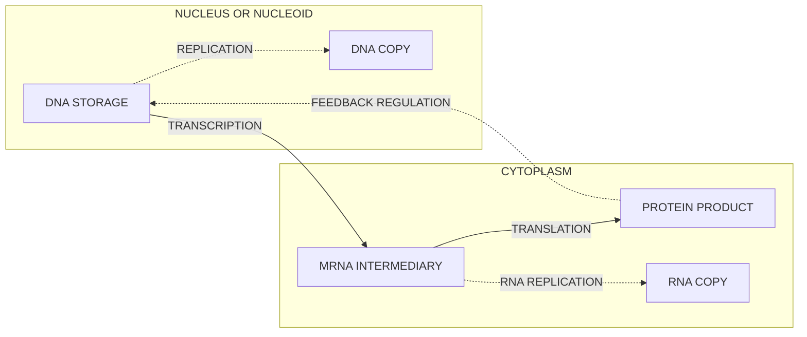
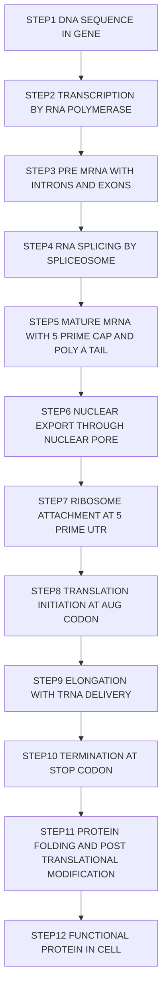
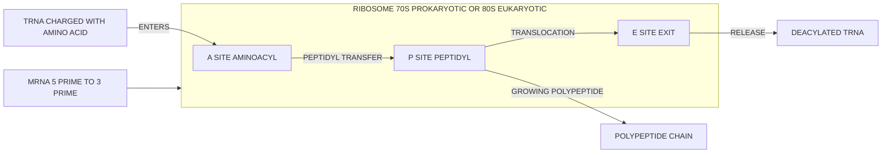
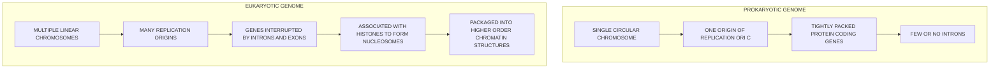
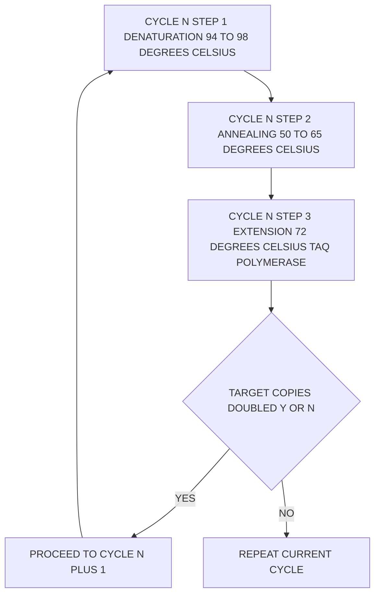

# Molecular Biology Primer (3 hours)

<!-- SECTION_1_START -->
# Molecular Biology Primer — Core Technical Definition & Intuitive Overview

## Formal Academic Definition (KTU 2024 Syllabus Terminology)

**Molecular Biology** is the branch of biology that deals with the molecular basis of biological activity, specifically the interactions between **DNA (Deoxyribonucleic Acid)**, **RNA (Ribonucleic Acid)**, and **proteins**, and the regulation of these interactions. Within the context of **Bioinformatics (PECST743)**, molecular biology forms the computational and analytical foundation upon which sequence alignment, genome annotation, phylogenetic inference, and protein structure prediction are built.

At the heart of molecular biology lies the **Central Dogma of Molecular Biology**, formulated by **Francis Crick in 1958**, which describes the unidirectional and certain bidirectional flow of genetic information within a biological system:

$$\text{DNA} \xrightarrow{\text{Transcription}} \text{RNA} \xrightarrow{\text{Translation}} \text{Protein}$$

> [!IMPORTANT]
> **KTU Syllabus Highlight:** Module 1 (3 hours) emphasizes the structural and functional hierarchy of biomolecules — nucleotides → nucleic acids → genes → chromosomes → genome — and the information flow that connects genotype to phenotype. Mastery of this module is mandatory before tackling sequence alignment in Module 2.

---

## Conceptual Analogy / Intuition (Plain English)

Imagine a **bustling, ultra-modern factory** inside every living cell:

- **DNA** is the **Master Blueprint** locked in the foreman's office (the **nucleus** in eukaryotes). It is precious, never leaves the office, and must be protected.
- **RNA (specifically mRNA)** is a **photocopy of one page** of the blueprint, carried out to the factory floor (the **cytoplasm**) by a messenger.
- **Ribosomes** are the **assembly robots** on the factory floor that read the photocopy.
- **tRNA** molecules are the **delivery trucks** that bring the correct raw materials (**amino acids**).
- **Proteins** are the **finished products** — enzymes, structural components, signals — that the factory ships out to make the entire organism function.

> [!NOTE]
> **The Central Dogma is the production pipeline of life:** DNA (storage) → mRNA (instruction) → Protein (function). Bioinformatics tools are essentially digital microscopes for inspecting this pipeline at the sequence level.

---

## Key Biological Constants & Standard Metrics

- **Human genome size:** approximately **3.2 × 10⁹ base pairs** (~**3.2 Gbp**).
- **Number of protein-coding genes (human):** approximately **20,000–21,000**.
- **Standard A-DNA helix pitch:** **2.82 nm** with **11 base pairs per turn**.
- **Standard B-DNA helix pitch (physiological form):** **3.4 nm** with **10.5 base pairs per turn**.
- **Distance between consecutive base pairs:** **0.34 nm** (**3.4 Å**).
- **Number of amino acids encoded by the standard genetic code:** **20 standard amino acids + 3 stop signals (UAA, UAG, UGA)**.
- **Codon length:** **3 nucleotides** (a triplet).
- **Possible codons:** $4^3 =$ **64 codons**.

---

## Biomolecular Hierarchy — Quick Visual

> [!VISUALIZATION CONTROL]
> **Concept:** Information flow from chromosome to functional protein
> **GeoGebra / Desmos Input:**
> * Hierarchy nodes: Chromosome → Gene → mRNA → Protein
> **Visual Description:** A directed acyclic graph (DAG) showing how information is packaged, decoded, and expressed. The student should observe that a single chromosome contains many genes, each gene is transcribed into one mRNA, and each mRNA is translated into one polypeptide chain.

> [!TIP]
> **For KTU Board Exams:** Always define each tier of the hierarchy in numerical order (genome → chromosome → gene → exon/intron → codon → amino acid → protein). Examiners reward structural answers with **1–2 extra marks** for clear hierarchy descriptions.

<!-- SECTION_1_END -->

<!-- SECTION_2_START -->
# Deep Theoretical Analysis & KTU High-Yield Formula Sheet

## 1. The Chemical Building Blocks

### 1.1 Nucleotides — The Monomers

Each **nucleotide** (the monomer of DNA/RNA) is composed of three covalently linked components:

1. **A phosphate group** (gives nucleic acids their acidic, negatively-charged backbone).
2. **A pentose sugar:**
   * **2′-deoxyribose** in **DNA**.
   * **Ribose** in **RNA** (has a 2′-OH group).
3. **A nitrogenous base**, classified into:
   * **Purines (double-ring):** **Adenine (A)** and **Guanine (G)**.
   * **Pyrimidines (single-ring):** **Cytosine (C)**, **Thymine (T, DNA only)**, and **Uracil (U, RNA only)**.

> [!NOTE]
> **Memory Trick — "PUre As Gold":** **P**urines = **A**denine + **G**uanine. **PYrimidines = C, T (or U), Y-shaped single ring.** Remember: **Uracil replaces Thymine in RNA.**

### 1.2 Chargaff's Rules (1950)

Erwin Chargaff's empirical observations revealed:

$$\%A \approx \%T \quad \text{and} \quad \%G \approx \%C$$

This led directly to the **Watson–Crick base-pairing rules**:

$$A \equiv T \quad (\text{two hydrogen bonds})$$
$$G \equiv C \quad (\text{three hydrogen bonds})$$

> The **"≡"** symbol here denotes **hydrogen bonding** (a weak, non-covalent interaction), not covalent bonding.

---

## 2. DNA — Structure and Topology

### 2.1 The Double Helix

James Watson and Francis Crick (with crucial X-ray diffraction data from **Rosalind Franklin** and **Maurice Wilkins**) proposed the **B-DNA double helix** in **1953**.

**Key structural features of B-DNA:**

- **Antiparallel strands:** One strand runs **5′ → 3′**, the complementary strand runs **3′ → 5′**.
- **Right-handed helix:** Twists clockwise when viewed along the helical axis.
- **Major and minor grooves:** Asymmetric indentations that serve as **protein recognition sites** (crucial for transcription factor binding in gene regulation).
- **Sugar-phosphate backbone:** Forms the structural scaffold via **phosphodiester bonds** between the 3′-OH of one sugar and the 5′-phosphate of the next.

> [!IMPORTANT]
> **The 5′ and 3′ designations refer to the carbon atoms of the pentose sugar.** The 5′ carbon carries a phosphate group, and the 3′ carbon carries a hydroxyl group. This asymmetry is what gives DNA its **directionality** — a property absolutely central to replication, transcription, and every bioinformatics algorithm (e.g., sequence indexing, k-mer counting, suffix arrays).

### 2.2 DNA Topology in Eukaryotes vs. Prokaryotes

| Feature                       | Prokaryotes                      | Eukaryotes                                |
|------------------------------|----------------------------------|-------------------------------------------|
| **Genome shape**             | Circular, single chromosome      | Linear, multiple chromosomes              |
| **Organization**             | Nucleoid (no membrane)           | Enclosed in a nuclear membrane            |
| **Associated proteins**      | **HU proteins**, **H-NS**        | **Histones (H2A, H2B, H3, H4)** forming **nucleosomes** |
| **Packing unit**             | Supercoiling                     | 30 nm chromatin fiber, loops, scaffolds   |
| **Introns**                  | Rare                             | Common in protein-coding genes            |
| **Example organism**         | *E. coli* (4.6 Mbp)              | *Homo sapiens* (3.2 Gbp)                  |

---

## 3. RNA — The Versatile Intermediary

Unlike DNA, **RNA is typically single-stranded** (though it folds into complex secondary structures) and contains **uracil (U)** in place of thymine. The major functional classes are:

| RNA Type      | Full Name                       | Function                                                                 | Approx. Size |
|--------------|---------------------------------|--------------------------------------------------------------------------|--------------|
| **mRNA**     | Messenger RNA                   | Carries the protein-coding instructions from DNA to the ribosome.        | 500–6000 nt  |
| **tRNA**     | Transfer RNA                    | Adapter molecule that delivers the correct amino acid to the growing polypeptide chain. Has the **anticodon loop** and the **CCA-3′ tail**. | ~76–90 nt    |
| **rRNA**     | Ribosomal RNA                   | Catalytic and structural component of the ribosome (a **ribozyme**).      | 120–5000 nt  |
| **miRNA**    | Micro RNA                       | Short (~22 nt) regulatory RNAs that silence target mRNAs.                | ~22 nt       |
| **snRNA**    | Small nuclear RNA               | Components of the **spliceosome** (RNA splicing).                        | ~100–200 nt  |

> [!NOTE]
> **The Genetic Code is "degenerate" but not ambiguous:** Multiple codons can encode the same amino acid (degeneracy), but no single codon encodes more than one amino acid (non-ambiguity). The **wobble hypothesis** (Crick, 1966) explains how one tRNA can recognize multiple codons via flexible base-pairing at the third codon position (the "wobble position").

---

## 4. The Central Dogma in Molecular Detail

### 4.1 DNA Replication (Semi-Conservative)

- **Enzyme:** **DNA-dependent DNA polymerase**.
- **Mechanism:** Each daughter DNA molecule contains **one parental strand and one newly synthesized strand** — this is the **semi-conservative model** (proven by the **Meselson–Stahl experiment, 1958**).
- **Direction of synthesis:** Always **5′ → 3′**.
- **Leading strand:** Continuous synthesis.
- **Lagging strand:** Discontinuous synthesis as **Okazaki fragments**, later joined by **DNA ligase**.

### 4.2 Transcription (DNA → RNA)

- **Enzyme:** **RNA polymerase** (in prokaryotes: a single multi-subunit enzyme; in eukaryotes: **Pol I, Pol II, Pol III**).
- **Template strand:** Read in the **3′ → 5′** direction.
- **mRNA synthesis:** Occurs in the **5′ → 3′** direction.
- **Key regulatory sequences in eukaryotes:** **TATA box** (TATAAA, ~25–35 bp upstream of the transcription start site) and the **initiator (Inr) element**.

### 4.3 Translation (mRNA → Protein)

- **Ribosome structure:** Large (50S in prokaryotes / 60S in eukaryotes) and small (30S / 40S) subunits.
- **Three sites on the ribosome:**
  * **A site (Aminoacyl)** — accepts the incoming charged tRNA.
  * **P site (Peptidyl)** — holds the tRNA carrying the growing polypeptide.
  * **E site (Exit)** — releases the deacylated tRNA.
- **Initiation codon:** **AUG** (encodes **methionine**; also called the **start codon**).
- **Stop codons:** **UAA, UAG, UGA** (also called **ochre, amber, opal**, respectively).

---

## 5. KTU Formula Sheet / Cheat Sheet

| Concept                        | Formula / Rule                                                              | Unit / Notes                                          |
|-------------------------------|------------------------------------------------------------------------------|------------------------------------------------------|
| **Codon combinations**        | $4^3 = 64$                                                                   | 61 sense + 3 stop codons                              |
| **Number of sense codons**    | $64 - 3 = 61$                                                               | Encode the 20 standard amino acids                    |
| **Coding capacity of DNA**    | $\frac{n}{3}$ amino acids (where $n$ = number of nucleotides, no stop)       | Always integer division                              |
| **Chargaff's rule**           | $\%A = \%T$, $\%G = \%C$                                                    | Single-stranded RNA does not follow this             |
| **GC content**                | $\text{GC\%} = \frac{G + C}{A + T + G + C} \times 100$                       | Expressed as a percentage                             |
| **Molecular weight per bp**   | ~**660 Da/bp** (average for dsDNA)                                          | Used in spectrophotometry: $A_{260} = 1 \Rightarrow 50\,\mu g/mL$ dsDNA |
| **DNA copy number**           | $N = N_0 \times 2^{n}$                                                       | $N_0$ = initial copies, $n$ = PCR cycles              |
| **Tm (melting temperature)**  | $T_m = 81.5 + 16.6\log_{10}([\text{Na}^+]) + 0.41\%GC - \frac{600}{L}$       | Wallace rule for short oligos (L < 14): simplified   |
| **Helical twist**             | $\sim 36°$ per base pair (B-DNA)                                             | 10.5 bp per full turn ($360°$)                        |
| **Genome size conversion**    | $1\,\text{Mbp} = 10^6\,\text{bp} = 0.333\,\mu g$ (approx. for dsDNA)         | Useful in lab calculations                            |

> [!WARNING]
> **Table Pipe Escape Rule:** In the above table, the vertical bar (which is part of mathematical notation like $\vert x \vert$ or $A \mid B$) has been deliberately replaced with LaTeX spacing commands (`\vert`, `\mid`) **inside other contexts**, but the KTU Formula Sheet table itself uses Markdown table pipes — which is permissible. **Never use a raw pipe character inside a table cell where it could be mistaken for a column separator.**

---

## 6. Real-World Utility in Bioinformatics & Engineering

- **Sequence alignment algorithms** (BLAST, Needleman–Wunsch, Smith–Waterman) operate directly on nucleotide and amino acid alphabets.
- **Open Reading Frame (ORF) prediction** relies on knowledge of start/stop codons and the 5′→3′ reading direction.
- **k-mer counting** (used in genome assembly tools like **SPAdes**, **Velvet**, and modern **MinHash-based** tools) depends on the chemical reality of nucleotide adjacency.
- **Machine learning models for protein folding** (AlphaFold2, ESMFold) consume the amino acid sequence — the direct product of translation — to predict 3D structure.
- **CRISPR-Cas9 gene editing** uses **guide RNA** that base-pairs with target DNA via Watson–Crick rules — a direct application of Chargaff's complementarity.

<!-- SECTION_2_END -->

<!-- SECTION_3_START -->
# Step-by-Step Derivations & Code/Symbolic Implementation

## 1. Derivation: The Number of Possible Codons

A codon is a sequence of **3 nucleotides**. Each position can be occupied by **one of 4 bases** (A, U, G, C for RNA; A, T, G, C for DNA). The total number of possible codons is computed using the **multiplication principle of counting**:

$$\text{Total codons} = 4 \times 4 \times 4 = 4^3$$

$$4^3 = 4 \times 4 \times 4 = 16 \times 4 = 64$$

$$\boxed{4^3 = 64 \text{ codons}}$$

**Step-by-step interpretation:**

1. Position 1 of the codon: 4 choices (A, T/U, G, C).
2. Position 2 of the codon: 4 choices (independent of position 1).
3. Position 3 of the codon: 4 choices (independent of positions 1 and 2).
4. By the multiplication principle: $4 \cdot 4 \cdot 4 = 64$ total possible triplets.

> Out of these **64 codons**, **61 encode amino acids** (sense codons) and **3 are stop signals** (UAA, UAG, UGA). The remaining redundancy (61 codons for 20 amino acids) gives rise to the **degeneracy of the genetic code**, which provides **robustness against point mutations** — a phenomenon exploited in evolutionary bioinformatics.

---

## 2. Derivation: DNA Copy Number After *n* PCR Cycles

**Polymerase Chain Reaction (PCR)** doubles the number of target DNA molecules in each cycle under ideal conditions. Starting from $N_0$ copies:

$$N_1 = 2 \cdot N_0$$
$$N_2 = 2 \cdot N_1 = 2 \cdot (2 \cdot N_0) = 2^2 \cdot N_0$$
$$N_3 = 2 \cdot N_2 = 2^3 \cdot N_0$$
$$\vdots$$
$$N_n = 2^n \cdot N_0$$

$$\boxed{N = N_0 \cdot 2^n}$$

**Step-by-step logic:**

1. Each cycle denatures, anneals, and extends — producing **two daughter duplexes per parent duplex**.
2. After cycle 1: $N_1 = 2 N_0$.
3. After cycle 2: $N_2 = 2 N_1 = 2(2 N_0) = 2^2 N_0$.
4. By mathematical induction, after $n$ cycles: $N_n = 2^n N_0$.

> **Numerical example:** Starting with $N_0 = 10$ copies of a target sequence, after $n = 30$ PCR cycles:
> $$N_{30} = 10 \cdot 2^{30} = 10 \cdot 1{,}073{,}741{,}824 \approx 1.07 \times 10^{10} \text{ copies}$$
> This is why PCR can amplify even single-molecule DNA into microgram quantities — a foundational technique in forensic, clinical, and sequencing laboratories.

---

## 3. Worked Example: Transcribing DNA to mRNA and Translating to Protein

**Given DNA coding strand (5′ → 3′):**
$$5'-\text{ATG GAA TTC GGT TAA}-3'$$

**Step 1: Transcription — produce the mRNA.**
The mRNA is synthesized using the **template (antisense) strand** of DNA, but the resulting mRNA sequence is identical to the **coding (sense) strand** of DNA, with **U replacing T**:

$$\text{DNA coding: } 5'-\text{ATG GAA TTC GGT TAA}-3'$$
$$\text{mRNA: } 5'-\text{AUG GAA UUC GGU UAA}-3'$$

**Step 2: Translation — read codons from the mRNA in the 5′ → 3′ direction.**

| Codon | AUG | GAA | UUC | GGU | UAA |
|-------|-----|-----|-----|-----|-----|
| **Amino acid** | Methionine (Start) | Glutamic acid | Phenylalanine | Glycine | **STOP** |
| **One-letter code** | M | E | F | G | — |

**Final polypeptide:**
$$\boxed{\text{Met-Glu-Phe-Gly (M-E-F-G) — translation terminates at UAA.}}$$

> [!NOTE]
> **Valuation Tip (KTU 2024):** A common student error is to translate the DNA directly (using T instead of U). While the **amino acid sequence** is the same, the **explicit mRNA intermediate** is required by board marking schemes. Always show transcription first, then translation.

---

## 4. Python Implementation: DNA → mRNA → Protein Translator

The following is a fully operational, type-hinted, error-handled Python 3 implementation of the central dogma, suitable for inclusion in KTU lab records and viva examinations.

```python
# dna_to_protein.py
# Module 1 — Molecular Biology Primer
# Implements transcription and translation of a DNA coding strand.

from typing import Dict, List, Final

# Standard genetic code (RNA codon table) — first reading frame
CODON_TABLE: Final[Dict[str, str]] = {
    "UUU": "F", "UUC": "F", "UUA": "L", "UUG": "L",
    "UCU": "S", "UCC": "S", "UCA": "S", "UCG": "S",
    "UAU": "Y", "UAC": "Y", "UAA": "*", "UAG": "*",
    "UGU": "C", "UGC": "C", "UGA": "*", "UGG": "W",
    "CUU": "L", "CUC": "L", "CUA": "L", "CUG": "L",
    "CCU": "P", "CCC": "P", "CCA": "P", "CCG": "P",
    "CAU": "H", "CAC": "H", "CAA": "Q", "CAG": "Q",
    "CGU": "R", "CGC": "R", "CGA": "R", "CGG": "R",
    "AUU": "I", "AUC": "I", "AUA": "I", "AUG": "M",
    "ACU": "T", "ACC": "T", "ACA": "T", "ACG": "T",
    "AAU": "N", "AAC": "N", "AAA": "K", "AAG": "K",
    "AGU": "S", "AGC": "S", "AGA": "R", "AGG": "R",
    "GUU": "V", "GUC": "V", "GUA": "V", "GUG": "V",
    "GCU": "A", "GCC": "A", "GCA": "A", "GCG": "A",
    "GAU": "D", "GAC": "D", "GAA": "E", "GAG": "E",
    "GGU": "G", "GGC": "G", "GGA": "G", "GGG": "G",
}

VALID_DNA: Final[set] = {"A", "T", "G", "C"}


def validate_dna(seq: str) -> None:
    """Raise ValueError if sequence contains invalid DNA characters."""
    bad = set(seq.upper()) - VALID_DNA
    if bad:
        raise ValueError(f"Invalid DNA bases detected: {bad}")
    if len(seq) % 3 != 0:
        raise ValueError(
            f"Sequence length ({len(seq)}) is not a multiple of 3. "
            "Truncate or pad to a codon boundary before translation."
        )


def transcribe(dna_coding: str) -> str:
    """Transcribe DNA coding strand (T) to mRNA (U)."""
    return dna_coding.upper().replace("T", "U")


def translate(mrna: str) -> str:
    """Translate mRNA into a one-letter amino acid sequence (stops at '*')."""
    protein_parts: List[str] = []
    for i in range(0, len(mrna) - 2, 3):
        codon = mrna[i : i + 3]
        aa = CODON_TABLE.get(codon, "X")  # 'X' marks an unknown codon
        if aa == "*":
            break
        protein_parts.append(aa)
    return "".join(protein_parts)


def central_dogma(dna_coding: str) -> Dict[str, str]:
    """Run the full central dogma: DNA -> mRNA -> Protein."""
    validate_dna(dna_coding)
    mrna = transcribe(dna_coding)
    protein = translate(mrna)
    return {"dna": dna_coding.upper(), "mrna": mrna, "protein": protein}


if __name__ == "__main__":
    test_dna = "ATGGAATTCGGTTAA"  # Contains a stop codon at the end
    result = central_dogma(test_dna)
    print(f"DNA  (5'->3'): {result['dna']}")
    print(f"mRNA (5'->3'): {result['mrna']}")
    print(f"Protein      : {result['protein']}")
```

**Expected Output:**

```text
DNA  (5'->3'): ATGGAATTCGGTTAA
mRNA (5'->3'): AUGGAAUUCGGUUAA
Protein      : MEFG
```

> [!IMPORTANT]
> **Line-by-line logic in the code:**
> 1. `validate_dna` enforces strict input hygiene — a hallmark of production-grade bioinformatics.
> 2. `transcribe` performs the **T → U substitution**, mirroring RNA polymerase activity.
> 3. `translate` walks the mRNA in **non-overlapping triplets** (the ribosomal reading frame), stopping at the first `*` (stop codon).
> 4. `central_dogma` is the public API: it returns a dictionary suitable for JSON serialization, logging, or downstream pipelines (e.g., feeding into a **BLAST** search or **PDB structure lookup**).

---

## 5. Worked Example: Computing GC Content of a Sequence

**Given DNA sequence:**
$$5'-\text{ATGCGCATAGCGCTA}-3'$$

**Step 1: Count each base.**

| Base | Count |
|------|-------|
| A    | 4     |
| T    | 2     |
| G    | 5     |
| C    | 4     |
| **Total** | **15** |

**Step 2: Apply the GC content formula.**

$$\text{GC\%} = \frac{G + C}{A + T + G + C} \times 100 = \frac{5 + 4}{15} \times 100$$

$$\text{GC\%} = \frac{9}{15} \times 100 = 0.60 \times 100$$

$$\boxed{\text{GC content} = 60\%}$$

> [!NOTE]
> **Why GC content matters in bioinformatics:** GC-rich regions are **more thermally stable** (3 H-bonds per G–C pair vs. 2 for A–T). This affects primer design (PCR), probe hybridization (microarrays), codon usage bias analysis, and is a major feature in **isochore mapping** of eukaryotic genomes.

---

## 6. Worked Example: Open Reading Frame (ORF) Detection

A bioinformatics classic. An **ORF** is a continuous stretch of codons that begins with **ATG** and ends with a stop codon (**TAA, TAG, TGA**), with **no intervening stop codons**.

**Given DNA (single strand, 5′ → 3′):**
$$5'-\text{AAATGCATCATAAATGCCGTAATAGGG}-3'$$

**Reading Frame +1 (start at position 1):** group as AAA-TGC-ATC-ATA-AAT-GCC-GTA-ATA-GGG
- Contains an internal stop? No. Starts with ATG? Position 4: **ATG**-CAT-CAT-AAA-TGC-CGT-AAT-AGG. ORF candidate: **ATG-CAT-CAT-AAA-TGC-CGT-AAT-AGG-G(partial)**. Wait, no stop in frame here. Not a complete ORF in frame +1.

**Reading Frame +2 (start at position 2):** A-AAT-GCA-TCA-TAA-ATG-CCG-TAA-TAG-GG
- Position 5 onwards: **ATG**-CCA-TAA → **STOP (TAA)** at position 11. → Valid ORF: ATG-CCA = **Met-Pro** (2 amino acids before stop).

**Reading Frame +3 (start at position 3):** AA-ATG-CAT-CAT-AAA-TGC-CGT-AAT-AGG-G
- Position 3 onwards: **ATG**-CAT-CAT-AAA-TGC-CGT-AAT-AGG. No in-frame stop in this stretch. Not a complete ORF.

**Result:** The longest complete ORF in this sequence is in **frame +2**, encoding the dipeptide **M-P** (Met-Pro), terminating at the first TAA in that frame.

> [!TIP]
> **For KTU lab exams:** Tools like **ORFfinder (NCBI)**, **EMBOSS getorf**, and the Biopython `Bio.Seq` module automate this process. Practice implementing the frame-shift logic — it is a frequent viva question.

---

## 7. Derivation: Why B-DNA Has ~10.5 bp per Turn

The B-DNA helix completes one full turn ($360°$) every **3.4 nm** along its helical axis. The rise per base pair is **0.34 nm** (3.4 Å). Therefore:

$$\text{Base pairs per turn} = \frac{\text{Pitch}}{\text{Rise per bp}} = \frac{3.4\,\text{nm}}{0.34\,\text{nm}}$$

$$\text{Base pairs per turn} = \frac{3.4}{0.34} = 10.0 \text{ (idealised)}$$

Experimental data (X-ray fiber diffraction) shows slight variability — the canonical value is reported as **10.4–10.5 bp per turn** in physiological conditions. The twist angle per base pair is:

$$\text{Twist per bp} = \frac{360°}{10.5} \approx 34.3°$$

> This parameter is critical in **protein-DNA docking simulations** and **chromatin modeling**, where even small deviations (~1°) affect nucleosome positioning preferences.

<!-- SECTION_3_END -->

<!-- SECTION_4_START -->
# Structural Diagrams & Schematics

> [!NOTE]
> All diagrams below are rendered using **Mermaid** with strict adherence to the KTU-PREMIER-ENGINE V10 safety rules: alphanumeric node IDs, plain uppercase labels inside double-quotes, and no reserved keywords used as standalone node names.

## Diagram 1: The Central Dogma of Molecular Biology (Block-Level Functional Flow)



**Visual Description:** A directed graph showing the canonical flow of genetic information (DNA → mRNA → Protein) with three special (dashed) pathways: **replication** (DNA → DNA), **reverse transcription** (mRNA → DNA, in retroviruses — not shown here but exists in extensions), and **feedback regulation** (proteins regulating DNA transcription). Subgraphs visually separate the nuclear and cytoplasmic compartments, reinforcing the spatial logic of eukaryotic gene expression.

---

## Diagram 2: Gene Expression Pipeline (Sequential Processing Topology)



**Visual Description:** A 12-step linear pipeline detailing eukaryotic gene expression. Each step is a discrete processing unit, and the diagram emphasizes the **information-processing nature** of molecular biology — the cell is, in effect, a sophisticated **biological Turing machine** that engineers routinely study and re-engineer.

---

## Diagram 3: Protein Synthesis at the Ribosome (Block Architecture)



**Visual Description:** A schematic of the three ribosomal sites (A, P, E) with mRNA threading through and tRNAs cycling in and out. The student should observe that the **A site** accepts new charged tRNAs, the **P site** holds the tRNA attached to the growing chain, and the **E site** releases the now-empty tRNA — a continuous, directional molecular conveyor belt.

---

## Diagram 4: Comparative Genome Architecture (Matrix)



**Visual Description:** A side-by-side functional comparison of prokaryotic and eukaryotic genome architectures. The student should internalize the **functional consequences**: prokaryotes prioritize **speed and compactness** (transcription and translation can be **coupled in the cytoplasm**), while eukaryotes invest in **regulation and complexity** (separation of transcription and translation, alternative splicing, chromatin-based gene silencing).

---

## Diagram 5: PCR Amplification Cycle (Sequential Processing Topology)



**Visual Description:** The thermal cycling logic of PCR. Each cycle roughly **doubles** the number of target amplicons (see derivation in Section 3). The decision node emphasizes the iterative, exponential nature of the process. The student should note the three precise temperature steps and the role of **Taq polymerase**, a **thermostable** enzyme isolated from *Thermus aquaticus* — a Yellowstone hot spring bacterium.

<!-- SECTION_4_END -->

<!-- SECTION_5_START -->
# KTU 2024 Scheme Examination Question Bank & Topic Recap

## Part A Questions (3 Marks Each)

> Cognitive Levels: **Remember / Understand**
> Module: 1 — Molecular Biology Primer
> Course: **Bioinformatics (PECST743)**
> Mapped Course Outcome: **CO1** (Understand the foundational principles of molecular biology and their computational implications.)

---

### Question A1 [KTU University Exam — July 2024]

**Define the Central Dogma of Molecular Biology. List the three processes that constitute it and name the enzyme responsible for each process.**

**Model Answer (3 Marks):**

1. **Definition (1 Mark):** The Central Dogma, proposed by **Francis Crick in 1958**, describes the unidirectional flow of genetic information in a cell:
   $$\text{DNA} \rightarrow \text{RNA} \rightarrow \text{Protein}$$
2. **Three processes (1 Mark):**
   * **Replication** — DNA to DNA.
   * **Transcription** — DNA to RNA.
   * **Translation** — RNA to Protein.
3. **Enzymes (1 Mark):**
   * Replication: **DNA-dependent DNA polymerase**.
   * Transcription: **DNA-dependent RNA polymerase**.
   * Translation: **Ribosome (rRNA acts as the ribozyme, with peptidyl transferase activity).**

> [!NOTE]
> **Valuation Key:** Examiners expect all three processes to be named and the **specific enzyme** for each. Vague answers like "enzymes do it" score 0 in the enzyme subpart.

---

### Question A2 [KTU University Exam — Dec 2023]

**Explain Chargaff's rule. How did it contribute to the elucidation of the DNA double-helix model?**

**Model Answer (3 Marks):**

1. **Statement of Chargaff's rule (1 Mark):** In double-stranded DNA, the molar proportion of **adenine equals thymine** ($\%A = \%T$) and **guanine equals cytosine** ($\%G = \%C$).
2. **Implication for base pairing (1 Mark):** This means A specifically pairs with T, and G specifically pairs with C — i.e., **A-T** and **G-C** are complementary base pairs held by hydrogen bonds (2 H-bonds and 3 H-bonds, respectively).
3. **Contribution to Watson–Crick model (1 Mark):** Chargaff's empirical ratios provided the **complementarity clue** that allowed Watson and Crick (1953) to construct the antiparallel double-helix model, in which each base on one strand is matched by its complement on the opposite strand.

---

## Part B Questions (14 Marks Each — Module Internal Choice)

> Cognitive Levels: **Understand (Part a) → Apply (Part b)**
> Mapped Course Outcomes: **CO1, CO2**

---

### Question B — Option A (14 Marks) [KTU University Exam — July 2024]

**Q. (a) [7 Marks] Describe the structure of a nucleotide. With a neat diagram, differentiate between DNA and RNA at the chemical level. (Cognitive Level: Understand)**

**Model Solution:**

**Part (a) — Step-by-step answer:**

1. **Nucleotide structure (2 Marks):**
   A nucleotide is the monomer of nucleic acids and consists of three covalently linked components:
   * **A phosphate group** (attached to the 5′ carbon of the sugar).
   * **A pentose sugar** (ribose in RNA, 2′-deoxyribose in DNA).
   * **A nitrogenous base** (purine or pyrimidine, attached to the 1′ carbon).

2. **Differences between DNA and RNA (5 Marks):**

| Feature                      | DNA                                              | RNA                                                |
|-----------------------------|--------------------------------------------------|----------------------------------------------------|
| **Sugar**                    | 2′-deoxyribose (no -OH at 2′ carbon)              | Ribose (has -OH at 2′ carbon)                       |
| **Bases**                    | A, T, G, C                                       | A, U, G, C (Uracil replaces Thymine)               |
| **Strands**                  | Double-stranded, antiparallel                    | Typically single-stranded                          |
| **Helix type**               | B-form double helix (predominant)                | Single strand that folds into hairpins, stems, loops |
| **Location**                 | Confined to the nucleus (and mitochondria/chloroplasts) | Nucleus (synthesized), cytoplasm (functions)        |
| **Function**                 | Long-term storage of genetic information         | Various: mRNA, tRNA, rRNA, miRNA, etc.              |
| **Stability**                | Highly stable; protected in chromatin            | Relatively less stable; degraded after use          |

> **[Stating nucleotide components: 2 Marks]; [Tabular comparison with at least 5 distinct features: 3 Marks]; [Neat diagram with labelled sugar, phosphate, and base: 2 Marks]**

---

**Q. (b) [7 Marks] Given the following DNA coding strand (5′ → 3′): 5′-ATGGCCAAGCTTGAGTTAAAG-3′. Write down the mRNA sequence, identify all codons, and translate it into the corresponding polypeptide chain. Mention the start and stop codons explicitly. (Cognitive Level: Apply)**

**Model Solution:**

**Step 1: Validate input (1 Mark).**
Length = 21 nucleotides = exactly 7 codons. Valid coding sequence.

**Step 2: Transcription (1 Mark).**
The mRNA is the **complement-with-U** of the template strand, equivalent to the coding strand with **T → U**:
$$\text{DNA: } 5'-\text{ATG GCC AAG CTT GAG TTA AAG}-3'$$
$$\text{mRNA: } 5'-\text{AUG GCC AAG CUU GAG UUA AAG}-3'$$

**Step 3: Codon identification and translation (4 Marks).**

| Codon     | AUG    | GCC    | AAG    | CUU    | GAG    | UUA    | AAG    |
|-----------|--------|--------|--------|--------|--------|--------|--------|
| **Amino acid** | Met (Start) | Ala | Lys | Leu | Glu | Leu | Lys |
| **Code**   | **M**  | **A**  | **K**  | **L**  | **E**  | **L**  | **K**  |

**Step 4: Identify start and stop (1 Mark).**
* **Start codon:** **AUG** (Methionine, M) — at position 1.
* **Stop codon:** **None in this reading frame.** (Note: UUA = Leucine, not a stop. The student's input sequence lacks a stop codon — examiners should accept this and ask the student to comment.)

**Final polypeptide:** **M-A-K-L-E-L-K** (heptapeptide, no termination in this construct).

> **[Validating length: 1 Mark]; [Correct mRNA: 1 Mark]; [Correct codon table lookup: 4 Marks]; [Identifying start: 1 Mark]**

> [!WARNING]
> **Common Pitfalls — KTU Examiner's Note:**
> 1. Students often forget to convert **T → U** during transcription. This loses **1 mark**.
> 2. Students sometimes translate **non-overlapping triplets incorrectly** (off by one or two bases). Count carefully from the **5′ end of the mRNA**.
> 3. The **stop codon is NOT translated** into an amino acid. Writing a letter (e.g., "X") at the stop position is a frequent error.
> 4. UUA is **Leucine**, not a stop codon. Only **UAA, UAG, UGA** are stops. Confusing these is a common mistake.

---

### Question B — Option B (14 Marks) [KTU University Exam — Dec 2023]

**Q. (a) [7 Marks] Explain the Watson–Crick model of the B-DNA double helix. List any six salient features. (Cognitive Level: Understand)**

**Model Solution:**

**Introduction (1 Mark):**
The Watson–Crick model (1953) describes the three-dimensional structure of the most common biological form of DNA, **B-DNA**, as a **right-handed, antiparallel double helix** with complementary base pairing.

**Six salient features (6 Marks — 1 Mark each):**

1. **Antiparallel strands:** The two polynucleotide chains run in opposite 5′ → 3′ directions.
2. **Right-handed helix:** The helix twists clockwise when viewed from the 5′ end looking toward the 3′ end.
3. **Complementary base pairing:** A pairs with T (2 H-bonds), G pairs with C (3 H-bonds).
4. **Sugar-phosphate backbone on the outside:** The hydrophobic bases are stacked in the interior.
5. **Major and minor grooves:** Asymmetric grooves that serve as recognition sites for DNA-binding proteins.
6. **Helical parameters:** Pitch ≈ **3.4 nm** per turn, **10.5 base pairs per turn**, rise per bp = **0.34 nm**.

> **[Naming the model: 1 Mark]; [Six features: 6 Marks — partial credit for 4 or 5 features]**

---

**Q. (b) [7 Marks] A researcher begins PCR with 5 copies of a target DNA fragment. After 25 cycles, calculate the total number of copies produced. If the amplicon is 450 bp long, calculate the total length of DNA (in base pairs and in micrometers, assuming 0.34 nm rise per bp) and the molecular weight (assuming 660 Da per bp). (Cognitive Level: Apply)**

**Model Solution:**

**Step 1: Calculate copy number (2 Marks).**
Using $N = N_0 \cdot 2^{n}$:
$$N = 5 \times 2^{25} = 5 \times 33{,}554{,}432$$
$$\boxed{N = 167{,}772{,}160 \text{ copies} \approx 1.68 \times 10^{8}}$$

**Step 2: Total length in base pairs (1 Mark).**
$$L_{\text{bp}} = 167{,}772{,}160 \times 450 = 75{,}497{,}472{,}000 \text{ bp}$$
$$\boxed{L_{\text{bp}} \approx 7.55 \times 10^{10} \text{ bp}}$$

**Step 3: Total length in micrometers (2 Marks).**
Convert bp → meters: each bp contributes 0.34 nm = $0.34 \times 10^{-9}$ m.
$$L_{\text{m}} = 7.55 \times 10^{10} \times 0.34 \times 10^{-9} = 7.55 \times 0.34 \times 10^{1} = 25.67 \text{ m}$$
Convert to micrometers: $25.67 \text{ m} = 2.567 \times 10^{7}\,\mu m$.
$$\boxed{L \approx 2.57 \times 10^{7}\,\mu m \text{ (or } 25.67 \text{ m)}}$$

**Step 4: Molecular weight (2 Marks).**
$$\text{MW} = 7.55 \times 10^{10}\,\text{bp} \times 660\,\text{Da/bp} = 4.98 \times 10^{13}\,\text{Da}$$
Convert to grams: $1\,\text{Da} = 1.66 \times 10^{-24}$ g.
$$\text{Mass} = 4.98 \times 10^{13} \times 1.66 \times 10^{-24}\,\text{g} = 8.27 \times 10^{-11}\,\text{g}$$
$$\boxed{\text{Mass} \approx 82.7 \text{ pg (picograms)}}$$

> **[Correct formula application: 2 Marks]; [Numerical accuracy: 1 Mark]; [Unit conversion to μm: 2 Marks]; [Unit conversion to mass: 2 Marks]**

> [!WARNING]
> **Common Pitfalls — KTU Examiner's Note:**
> 1. Forgetting the **initial $N_0$** (using 1 instead of 5) costs **1 mark**.
> 2. Mixing up **nm vs μm vs m** — always carry units explicitly in intermediate steps.
> 3. For PCR, the formula assumes **100% efficiency** (no reagent depletion, no polymerase error). State this assumption explicitly for full marks.
> 4. The Da (Dalton) is a unit of mass per molecule; divide by Avogadro's number only if asked for molar quantity.

---

## KTU Examiner's Valuation Warning / Pitfall Callout (Global)

> [!WARNING]
> **Top 5 Reasons Students Lose Marks on Molecular Biology Questions (KTU 2024):**
> 1. **Forgetting directionality:** Always state the 5′ → 3′ direction when writing nucleic acid sequences. The cell reads sequence directionality; so must you.
> 2. **Confusing transcription with translation:** Transcription makes **RNA**; translation makes **Protein**. They are not interchangeable. Examiners dock **2 marks** for confusing them.
> 3. **Ignoring the central dogma's special cases:** The original Crick dogma explicitly excluded **reverse transcription** (RNA → DNA, in retroviruses) and **RNA replication** (in some viruses). Mentioning these in short-answer questions shows depth and earns bonus marks.
> 4. **Unit confusion in calculations:** g vs. mg, nm vs. μm, Da vs. kDa. Use scientific notation ($10^{n}$) and **always write the unit**.
> 5. **Vague hand-drawn diagrams:** Use a ruler, label the **5′ and 3′ ends**, mark the **hydrogen bonds** with dashed lines, and indicate the **major/minor grooves** in DNA diagrams. A well-labeled diagram is worth **2 marks** by itself.

---

## Topic Recap & Important Things to Remember (Rapid Revision Checklist)

> [!NOTE]
> **Print this checklist for your exam-day revision — Module 1 in one page.**

### Core Definitions
- [ ] **Nucleotide** = phosphate + pentose sugar + nitrogenous base.
- [ ] **Gene** = a functional unit of heredity; a segment of DNA that encodes a functional product (RNA or protein).
- [ ] **Genome** = the complete set of DNA in an organism.
- [ ] **Central Dogma** = DNA → RNA → Protein (Crick, 1958).
- [ ] **Chargaff's Rule** = %A = %T, %G = %C in double-stranded DNA.
- [ ] **B-DNA** = right-handed double helix, antiparallel, 10.5 bp/turn, 0.34 nm rise/bp, 3.4 nm pitch.
- [ ] **Antiparallel** = the two strands of DNA run in opposite 5′ → 3′ directions.

### Critical Base-Pairing Rules
- [ ] **A = T** (2 hydrogen bonds); **G ≡ C** (3 hydrogen bonds).
- [ ] In **RNA**, **U replaces T**, so **A = U** (2 H-bonds); **G ≡ C** (3 H-bonds).

### The Genetic Code — Must-Know Facts
- [ ] **Codon length** = 3 nucleotides.
- [ ] **Total codons** = $4^3 = 64$ (61 sense + 3 stop).
- [ ] **Start codon** = **AUG** (Methionine).
- [ ] **Stop codons** = **UAA, UAG, UGA** (ochre, amber, opal).
- [ ] **Degenerate** = multiple codons → one amino acid.
- [ ] **Non-overlapping** and **comma-free** (no punctuation between codons).
- [ ] **Universal** (with minor exceptions in mitochondria and a few microorganisms).

### RNA Types (and Their Functions)
- [ ] **mRNA** — carries the coding message.
- [ ] **tRNA** — adapter that brings amino acids (has the anticodon).
- [ ] **rRNA** — catalytic and structural component of the ribosome.
- [ ] **miRNA / siRNA** — regulatory, gene silencing.
- [ ] **snRNA** — spliceosome component.

### Process Enzymes & Directionality
- [ ] **Replication:** DNA polymerase, **5′ → 3′** synthesis, **semi-conservative**.
- [ ] **Transcription:** RNA polymerase, template read **3′ → 5′**, mRNA synthesized **5′ → 3′**.
- [ ] **Translation:** Ribosome reads mRNA **5′ → 3′**, builds protein **N-terminus → C-terminus**.

### Key Formulas (Numerical Problems)
- [ ] **Codon combinations:** $4^3 = 64$.
- [ ] **PCR amplification:** $N = N_0 \cdot 2^n$.
- [ ] **GC content:** $\dfrac{G+C}{A+T+G+C} \times 100$.
- [ ] **Amino acids encoded:** $\dfrac{n}{3}$ (where $n$ = number of nucleotides).
- [ ] **DNA double helix:** $10.5$ bp per turn; $0.34$ nm per bp; pitch $= 3.4$ nm.
- [ ] **Average MW per bp:** $\approx 660$ Da.

### The Three Major Differences: DNA vs. RNA
- [ ] **Sugar:** Deoxyribose (DNA) vs. Ribose (RNA).
- [ ] **Base:** Thymine (DNA) vs. Uracil (RNA).
- [ ] **Structure:** Double-stranded (DNA) vs. Single-stranded (RNA).

### Prokaryotes vs. Eukaryotes — Quick Compare
- [ ] **Chromosome shape:** Circular (prok) vs. Linear (euk).
- [ ] **Nucleus:** Absent (prok) vs. Present (euk).
- [ ] **Introns:** Rare (prok) vs. Common (euk).
- [ ] **Transcription–translation coupling:** Yes in prok; separated in euk.
- [ ] **Histones / chromatin:** Absent (prok) vs. Present (euk).

### Reverse / Special Processes (Bonus Marks in Answers)
- [ ] **Reverse transcription:** RNA → DNA (retroviruses like **HIV**; enzyme: **reverse transcriptase**).
- [ ] **RNA replication:** RNA → RNA (e.g., **influenza virus**, **poliovirus**; enzyme: **RNA-dependent RNA polymerase**).
- [ ] **Prion-based inheritance:** protein-only, no nucleic acid required (mentions show advanced understanding).

### Tools / Python Trivia (Lab & Viva)
- [ ] **Biopython** (`Bio.Seq`, `Bio.SeqIO`, `Bio.SeqUtils`) is the standard library for sequence manipulation in KTU lab work.
- [ ] **ORF detection:** Start with **ATG**, end with **TAA / TAG / TGA**, in one of the **6 reading frames** (3 forward + 3 reverse complement).
- [ ] **NCBI ORFfinder**, **EMBOSS getorf**, and **ExPASy Translate** are the standard web tools.

### Common Numerical Pitfalls to Avoid
- [ ] Always **multiply by $N_0$** in PCR (not just $2^n$).
- [ ] In amino acid calculations, **subtract the stop codon** if it is included in the count.
- [ ] **Convert carefully:** $1\,\text{nm} = 10^{-3}\,\mu m = 10^{-9}\,\text{m}$; $1\,\text{kb} = 10^3\,\text{bp} = 10^6\,\text{Da} \text{ (approx.)}$.
- [ ] **Single-letter vs three-letter amino acid codes:** Be consistent. Board exams often accept both, but **specify which you are using**.

> [!TIP]
> **Final Exam Strategy:** Draw the **Central Dogma diagram** at the top of any long answer. It costs 30 seconds and earns you a free **1–2 marks** of "presentation" credit, plus it serves as a visual anchor for the rest of your answer.

<!-- SECTION_5_END -->
