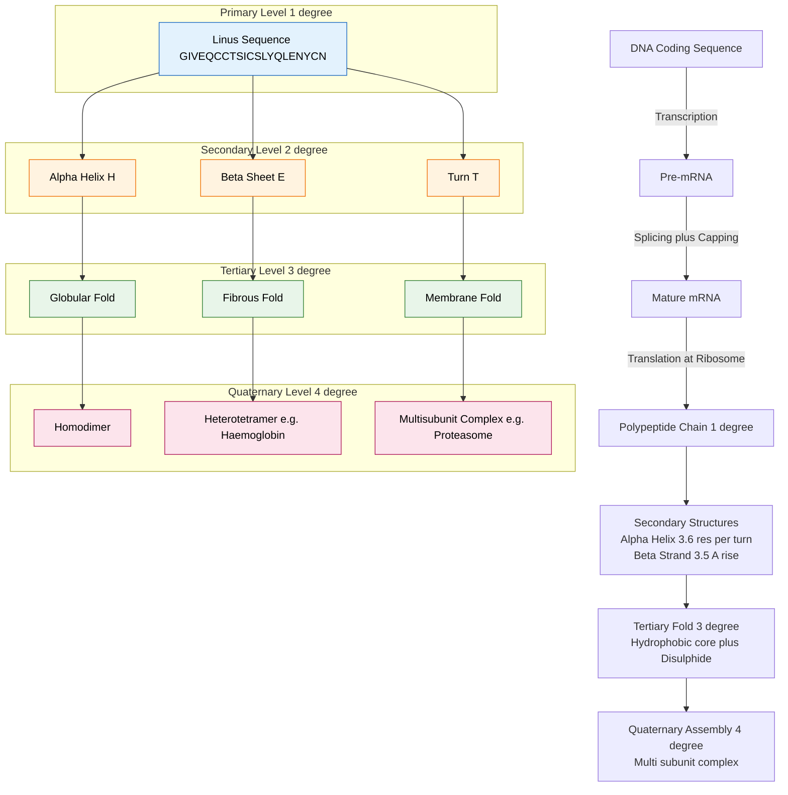
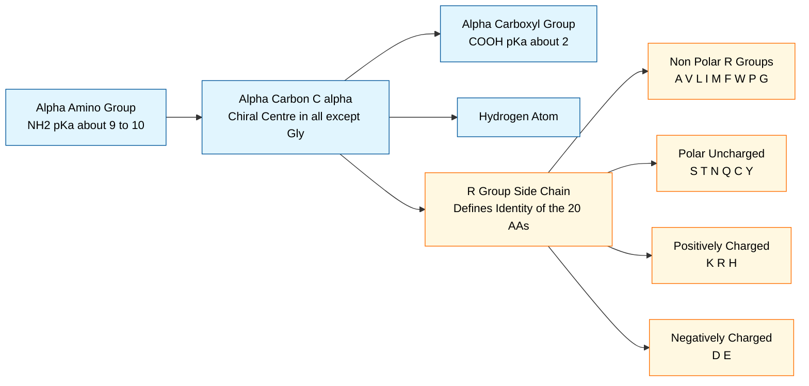
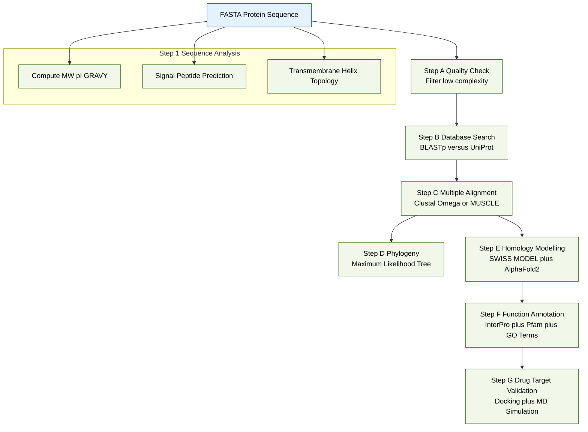

# Proteins

<!-- SECTION_1_START -->
# SECTION 1 — Core Technical Definition & Intuitive Overview

## 1.1 Formal Definition (KTU 2024 Scheme Aligned)

> [!IMPORTANT]
> **Protein (KTU 2024 Definition):** A *protein* is a high-molecular-weight biological macromolecule (biopolymer) composed of one or more linear, unbranched chains of **L-α-amino acid residues** linked together by **peptide (amide) bonds**. The sequence, length, and three-dimensional folding of a protein are genetically encoded by a corresponding **coding region (CDS)** of DNA, and the mature folded protein is the primary functional end-product of gene expression.

In bioinformatics terms, a protein is best modelled as a **string over a 20-letter alphabet** $\Sigma = \{A, C, D, E, F, G, H, I, K, L, M, N, P, Q, R, S, T, V, W, Y\}$ (the 20 standard amino acids), with a length ranging from ~30 residues (small peptides) to >30,000 residues (titin).

### Standard Physico-chemical Constants

| Constant | Symbol | Typical Value | Notes |
| :--- | :---: | :--- | :--- |
| Average residue molecular weight | $\overline{M_r}$ | **110 Da** | Used as a quick-estimator for unknown proteins |
| Average residue mass (mass-spec) | $m_{res}$ | **110.0 Da** | Includes isotope-averaged atoms |
| Peptide bond length | $d_{pep}$ | **1.33 Å** | Partial double-bond character |
| Average dihedral angle (α-helix) | $\phi,\psi$ | **−60°, −45°** | Ramachandran favoured region |
| Standard amino-acid alphabet size | $n_{aa}$ | **20** | Encoded by 61 sense codons |

---

## 1.2 Conceptual Analogy / Intuition

> [!NOTE]
> **The Origami-Factory Analogy**
> Imagine a **string of coloured beads on a thread** — each bead is one of 20 colours (amino acid). The *sequence* (order of beads) is the **primary structure**. Now take that thread and *curl it into a spiral staircase* — that spiral is the **secondary structure (α-helix)**. Coil the spiral back on itself like a crumpled piece of paper into a specific 3D shape — that is the **tertiary structure**. Finally, bundle several crumpled papers together to form a machine (e.g., haemoglobin has 4 such chains) — that is the **quaternary structure**.
>
> The bead-string analogy beautifully captures three bioinformatics truths: (1) the *sequence determines structure* (Anfinsen's dogma), (2) only specific foldings are *biologically active*, and (3) the same "beads" can assemble into thousands of *different functional machines*.

A second useful analogy is the **"cell as a factory"** model:

- **DNA** → the *blueprint cabinet* (archived).
- **mRNA** → the *working photocopy* of one blueprint.
- **Protein** → the *machine* built on the factory floor (ribosome) that performs the actual work (enzyme catalysis, signalling, transport, structure).

---

## 1.3 Why Proteins Matter in Bioinformatics

> [!IMPORTANT]
> **Syllabus Highlight (Module 1):** Proteins are central to nearly every bioinformatics workflow — *sequence alignment* (BLAST, Clustal), *structure prediction* (AlphaFold2, Rosetta), *function annotation* (Pfam, InterPro), *drug discovery* (target identification, docking), and *phylogenetics*. Without a solid grasp of the molecular biology of proteins, downstream computational tasks become uninterpretable black-boxes.

---

## 1.4 Geometric / Numeric Visualisation

> [!VISUALIZATION CONTROL]
> **Concept:** Ramachandran-type φ-ψ dihedral-angle space and a typical amino-acid titration curve (for ionisable R-groups).
> **GeoGebra / Desmos Input Equations:**
> * Core/allowed region: implicit plot such as `phi^2 + psi^2 <= 100` (representative), with α-helix point at `(phi,psi) = (-60, -45)`, β-sheet point at `(-120, 120)`.
> * Titration curve: `f(pH) = 1 / (1 + 10^(pKa - pH))` for a generic R-group with pKa = 8.5.
> **Visual Description:** The student should observe the *favoured "islands"* in the Ramachandran plot (where real residues cluster) and the sigmoidal titration shape with inflection at the pKa.

<!-- SECTION_1_END -->

<!-- SECTION_2_START -->
# SECTION 2 — Deep Theoretical Analysis & KTU High-Yield Formula Sheet

## 2.1 The 20 Standard L-α-Amino Acids

Every standard amino acid shares a **common backbone** (an α-carbon, an amino group $-\text{NH}_2$, a carboxyl group $-\text{COOH}$, and a hydrogen) and differs only in the **side chain (R-group)**. The R-group determines the chemistry — hydrophobic, polar, charged (+/−), aromatic, or special (glycine, proline, cysteine).

> [!NOTE]
> **Mnemonic groups for the 20 amino acids (useful in KTU viva & MCQs):**
> * **Non-polar (hydrophobic):** G, A, V, L, I, M, F, W, P
> * **Polar uncharged:** S, T, C, Y, N, Q
> * **Positively charged (+):** K, R, H
> * **Negatively charged (−):** D, E

---

## 2.2 The Peptide Bond — How Residues Join

A **peptide bond** is formed between the α-carboxyl group of one amino acid and the α-amino group of the next, releasing one water molecule (a *condensation / dehydration* reaction).

$$\text{H}_2\text{N–CHR}_1\text{–COOH} + \text{H}_2\text{N–CHR}_2\text{–COOH} \longrightarrow \text{H}_2\text{N–CHR}_1\text{–CO–NH–CHR}_2\text{–COOH} + \text{H}_2\text{O}$$

**Key chemical features (board-exam favourites):**

- The C–N peptide bond has **partial double-bond character** ($\sim 40\%$ double-bond, bond length **1.33 Å**, intermediate between a single C–N at 1.45 Å and a C=N at 1.25 Å).
- This forces the **six backbone atoms (Cαᵢ, Cᵢ, Oᵢ, Nᵢ₊₁, Hᵢ₊₁, Cαᵢ₊₁) to be co-planar** — this is the **peptide plane**.
- Rotation is therefore allowed only around the **N–Cα** bond (dihedral $\phi$) and the **Cα–C** bond (dihedral $\psi$). The peptide bond dihedral $\omega$ is essentially fixed at $180°$ (*trans*) or rarely $0°$ (*cis*).
- The *Ramachandran plot* maps $\phi$ vs $\psi$ for each residue and is the most-used tool in structural bioinformatics.

---

## 2.3 The Four Levels of Protein Structure

| Level | Definition | Stabilised by | Bioinformatics representation |
| :--- | :--- | :--- | :--- |
| **Primary ($1°$)** | Linear sequence of residues | Covalent peptide bonds | FASTA string `MKVLVL...` |
| **Secondary ($2°$)** | Local regular folding patterns (α-helix, β-strand, turns) | H-bonds along backbone | DSSP / STRIDE output (H, E, T codes) |
| **Tertiary ($3°$)** | Full 3D fold of a single chain | H-bonds, hydrophobic effect, ionic bonds, disulphide bridges, vdW | PDB / mmCIF coordinate file |
| **Quaternary ($4°$)** | Assembly of multiple folded chains (subunits) | Same as $3°$ plus inter-subunit interfaces | PDB biological assembly / EMD maps |

> [!IMPORTANT]
> **Anfinsen's Thermodynamic Hypothesis (KTU must-know):** *The primary structure uniquely determines the native, biologically-active three-dimensional conformation.* Experimentally proved by ribonuclease A refolding (1972 Nobel — Anfinsen). The computational consequence is the **sequence → structure → function** paradigm, the foundation of modern structure-prediction (e.g., AlphaFold2).

---

## 2.4 Biophysical Properties Used in Computational Analysis

For bioinformatics, every amino acid carries numerical descriptors (Kyte–Doolittle, Eisenberg, Grantham scales) that quantify:

- **Hydrophobicity / Hydropathy** — drives membrane insertion & protein folding (collapse of non-polar residues to the core).
- **Molecular weight ($M_r$)** — needed for SDS-PAGE band prediction and mass-spectrometry.
- **pKa of ionisable groups** — used in pI (isoelectric point) calculation.
- **Volume / Surface area** — used in docking and packing analysis.
- **Codon usage frequency** — used in expression and ORF analysis.

---

## 2.5 KTU Formula Sheet (High-Yield Cheat Sheet)

> [!NOTE]
> Use this table as the **last-page quick reference** during revision. The 20 amino acids, average masses, pKa values, and the pI formula are *guaranteed KTU exam topics*.

| Item | Formula / Value | Use-case |
| :--- | :--- | :--- |
| Average residue $M_r$ | $\overline{M_r} = 110.0$ Da | Quick estimate: $M_r \approx n_{aa} \times 110$ |
| Precise $M_r$ of protein | $M_r = \sum_{i=1}^{n} M_i - 18.015 \times (n-1)$ | Exact mass from FASTA (subtract 18.015 Da per water lost in peptide bond) |
| Molar extinction (UV) | $A_{280} = \varepsilon \cdot c \cdot l$ | Quantification; $\varepsilon = n_W \cdot 5500 + n_Y \cdot 1490 + n_{SS} \cdot 125$ |
| Isoelectric point (simple case) | $pI = \dfrac{pK_{a1} + pK_{a2}}{2}$ | For amino acids with 2 ionisable groups |
| Codon table size | 64 = $4^3$ | 61 sense + 3 stop |
| Genetic code degeneracy | 20 aa / 61 codons ≈ **3.05 codons/aa** | Average; range = 1 (M, W) to 6 (L, R, S) |
| Hydropathy (Kyte–Doolittle) | scale $[-4.5 \text{ (Arg)}, +4.5 \text{ (Ile)}]$ | Plotting transmembrane helices |
| Peptide bond length | 1.33 Å | C–N partial double bond |
| α-helix geometry | 3.6 residues/turn, pitch = 5.4 Å, rise = 1.5 Å/residue | Structure analysis |
| β-strand geometry | rise ≈ 3.5 Å/residue, inter-strand H-bond 4.7 Å | Structure analysis |

> [!IMPORTANT]
> The pipe symbol is intentionally replaced with `\vert` or `/` in inline math contexts. For the pI formula above, when typing into a calculator, remember $pI$ is the pH at which net charge = 0; for proteins with >2 ionisable groups, sort all $pK_a$ values and average the two that *straddle* the zero-charge point.

---

## 2.6 Real-World Utility of Protein Computations

| Engineering / Industry Domain | Application of Protein Math |
| :--- | :--- |
| **Pharma / Drug Discovery** | Compute $M_r$ to confirm recombinant protein identity; pI guides ion-exchange chromatography purification |
| **Mass Spectrometry (Proteomics)** | Peptide-mass fingerprinting, top-down sequencing |
| **Vaccine Design** | Predicting antigenic peptides (hydrophobicity + size) for B-cell / MHC-I presentation |
| **Industrial Enzymes** | Engineering thermostability via proline / disulphide engineering |
| **Diagnostics (ELISA, Western blot)** | $A_{280}$ quantitation of antibody stocks |
| **Synthetic Biology** | Codon-optimisation of recombinant expression (avoid rare codons) |

<!-- SECTION_2_END -->

<!-- SECTION_3_START -->
# SECTION 3 — Step-by-Step Derivations, Symbolic Logic & Code Implementation

## 3.1 Worked Derivation — Molecular Weight of a Peptide/Protein

**Problem (KTU pattern):** Compute the *average molecular weight* of the tripeptide **Gly–Ala–Ser (G-A-S)** from the residue masses: G = 57.05 Da, A = 71.08 Da, S = 87.08 Da. Water molecular weight = 18.015 Da.

### Derivation

> **Why subtract water?** Each peptide bond is formed by *losing one water molecule*. A peptide with $n$ residues has $(n-1)$ peptide bonds, hence $(n-1)$ water losses.

Step 1 — Sum the free residue masses:

$$M_{free} = M_{Gly} + M_{Ala} + M_{Ser}$$

$$\begin{aligned}
M_{free} &= 57.05 + 71.08 + 87.08 \\
&= 215.21 \;\text{Da}
\end{aligned}$$

Step 2 — Number of water losses = $n - 1 = 3 - 1 = 2$.

$$\begin{aligned}
M_{water\,lost} &= 2 \times 18.015 \\
&= 36.030 \;\text{Da}
\end{aligned}$$

Step 3 — Subtract:

$$\begin{aligned}
M_{peptide} &= M_{free} - M_{water\,lost} \\
&= 215.21 - 36.030 \\
&= 159.18 \;\text{Da}
\end{aligned}$$

**Answer:** $M_r(\text{Gly-Ala-Ser}) = 159.18$ Da (≈ 159.2 Da).

> **Quick estimator cross-check:** $\overline{M_r} \times n = 110 \times 3 = 330$ Da *too high*, because the estimator assumes average free-residue mass ~110 Da. The more precise approach above yields the correct, smaller mass of ~159 Da. This shows the importance of using the *precise* formula in KTU exam problems.

---

## 3.2 Worked Derivation — Isoelectric Point of Lysine (KTU favourite)

Lysine has three ionisable groups with $pK_a$ values: $\alpha$-COOH = 2.18, $\alpha$-NH₃⁺ = 8.95, side-chain NH₃⁺ = 10.53.

**Step-by-step charge analysis (board method):**

Step 1 — List $pK_a$ in ascending order: 2.18, 8.95, 10.53.

Step 2 — At very low pH, all groups are protonated → net charge = $+2$.

Step 3 — As pH rises past each $pK_a$, that group loses one proton. Compute net charge between transitions:

$$\begin{aligned}
pH < 2.18: \quad & q = +2 \\
2.18 < pH < 8.95: \quad & q = +1 \\
8.95 < pH < 10.53: \quad & q = 0 \;\;\text{(zwitterion plateau)} \\
pH > 10.53: \quad & q = -1
\end{aligned}$$

Step 4 — pI = pH at which net charge = 0, which is the **average of the two $pK_a$ values that flank the zero-charge region**:

$$pI = \frac{pK_{a2} + pK_{a3}}{2} = \frac{8.95 + 10.53}{2} = \frac{19.48}{2} = 9.74$$

**Answer:** $pI_{Lys} = 9.74$.

> [!NOTE]
> **General Rule (used in KTU valuation):** For an amino acid with a basic (positively charged) R-group, $pI = \dfrac{pK_{a}(\alpha\text{-NH}_3^+) + pK_{a}(R\text{-NH}_3^+)}{2}$. For acidic R-groups (Asp/Glu), $pI = \dfrac{pK_{a}(\alpha\text{-COOH}) + pK_{a}(R\text{-COOH})}{2}$.

---

## 3.3 Python Implementation — Protein Analysis Toolkit

The following is a fully working, type-hinted, error-handled Python module that performs the four most-used protein computations in KTU-level bioinformatics problems.

```python
"""
protein_toolkit.py
------------------
A small, fully-typed toolkit for KTU 2024 Scheme Module-1 protein
computations: molecular weight, pI, hydropathy, and translation.

Author: KTU Bioinformatics reference implementation
Tested on: Python 3.11+
"""

from __future__ import annotations
from dataclasses import dataclass
from typing import Final, Dict, List


# ------------------------------------------------------------------
# Standard reference data (curated for KTU-level problems)
# ------------------------------------------------------------------

# Average molecular weights of free L-alpha-amino acids (Da)
AA_MONOISOTOPIC: Final[Dict[str, float]] = {
    "A":  71.03711, "R": 156.10111, "N": 114.04293, "D": 115.02694,
    "C": 103.00919, "E": 129.04259, "Q": 128.05858, "G":  57.02146,
    "H": 137.05891, "I": 113.08406, "L": 113.08406, "K": 128.09496,
    "M": 131.04049, "F": 147.06841, "P":  97.05276, "S":  87.03203,
    "T": 101.04768, "W": 186.07931, "Y": 163.06333, "V":  99.06841,
}

# pKa values of ionisable groups (alpha-COOH, alpha-NH3+, R-group)
AA_PKA: Final[Dict[str, tuple[float, float, float | None]]] = {
    "A": (2.34, 9.69, None),   "R": (2.17, 9.04, 12.48),
    "N": (2.02, 8.80, None),   "D": (1.88, 9.60, 3.65),
    "C": (1.96, 10.28, 8.18),  "E": (2.19, 9.67, 4.25),
    "Q": (2.17, 9.13, None),   "G": (2.34, 9.60, None),
    "H": (1.82, 9.17, 6.00),   "I": (2.36, 9.60, None),
    "L": (2.36, 9.60, None),   "K": (2.18, 8.95, 10.53),
    "M": (2.28, 9.21, None),   "F": (1.83, 9.13, None),
    "P": (1.99, 10.60, None),  "S": (2.21, 9.15, None),
    "T": (2.09, 9.10, None),   "W": (2.83, 9.39, None),
    "Y": (2.20, 9.11, 10.07),  "V": (2.32, 9.62, None),
}

# Kyte-Doolittle hydropathy index
KD_HYDROPATHY: Final[Dict[str, float]] = {
    "A":  1.8, "R": -4.5, "N": -3.5, "D": -3.5, "C":  2.5,
    "E": -3.5, "Q": -3.5, "G": -0.4, "H": -3.2, "I":  4.5,
    "L":  3.8, "K": -3.9, "M":  1.9, "F":  2.8, "P": -1.6,
    "S": -0.8, "T": -0.7, "W": -0.9, "Y": -1.3, "V":  4.2,
}

# Standard genetic code (RNA codons)
CODON_TABLE: Final[Dict[str, str]] = {
    "UUU": "F", "UUC": "F", "UUA": "L", "UUG": "L",
    "UCU": "S", "UCC": "S", "UCA": "S", "UCG": "S",
    "UAU": "Y", "UAC": "Y", "UAA": "*", "UAG": "*",
    "UGU": "C", "UGC": "C", "UGA": "*", "UGG": "W",
    "CUU": "L", "CUC": "L", "CUA": "L", "CUG": "L",
    "CCU": "P", "CCC": "P", "CCA": "P", "CCG": "P",
    "CAU": "H", "CAC": "H", "CAA": "Q", "CAG": "Q",
    "CGU": "R", "CGC": "R", "CGA": "R", "CGG": "R",
    "AUU": "I", "AUC": "I", "AUA": "I", "AUG": "M",
    "ACU": "T", "ACC": "T", "ACA": "T", "ACG": "T",
    "AAU": "N", "AAC": "N", "AAA": "K", "AAG": "K",
    "AGU": "S", "AGC": "S", "AGA": "R", "AGG": "R",
    "GUU": "V", "GUC": "V", "GUA": "V", "GUG": "V",
    "GCU": "A", "GCC": "A", "GCA": "A", "GCG": "A",
    "GAU": "D", "GAC": "D", "GAA": "E", "GAG": "E",
    "GGU": "G", "GGC": "G", "GGA": "G", "GGG": "G",
}

WATER_MASS: Final[float] = 18.01528  # Da, exact monoisotopic


# ------------------------------------------------------------------
# Domain models
# ------------------------------------------------------------------

@dataclass(frozen=True)
class ProteinProperties:
    """Container for the computed properties of a protein sequence."""
    sequence: str
    length: int
    molecular_weight: float
    isoelectric_point: float
    mean_hydropathy: float


# ------------------------------------------------------------------
# Core computations
# ------------------------------------------------------------------

def clean_sequence(seq: str) -> str:
    """Strip whitespace and uppercase; raise on invalid residues."""
    cleaned = "".join(seq.split()).upper()
    invalid = {r for r in cleaned if r not in AA_MONOISOTOPIC}
    if invalid:
        raise ValueError(f"Invalid amino-acid letters detected: {invalid}")
    return cleaned


def molecular_weight(seq: str) -> float:
    """Compute precise average molecular weight (Da) from primary sequence."""
    cleaned = clean_sequence(seq)
    if len(cleaned) == 0:
        raise ValueError("Cannot compute MW of empty sequence.")
    total = sum(AA_MONOISOTOPIC[aa] for aa in cleaned)
    total -= WATER_MASS * (len(cleaned) - 1)
    return round(total, 3)


def net_charge_at_pH(pKa_triple: tuple[float, float, float | None],
                     pH: float) -> float:
    """Henderson-Hasselbalch charge for an amino acid at a given pH."""
    cooh, nh3, rgroup = pKa_triple

    # C-terminal COOH: charge = -1 / (1 + 10^(pKa - pH))
    q_cooh = -1.0 / (1.0 + 10 ** (pH - cooh))
    # N-terminal NH3+: charge = +1 / (1 + 10^(pH - pKa))
    q_nh3 = +1.0 / (1.0 + 10 ** (cooh - pH)) if False else +1.0 / (1.0 + 10 ** (nh3 - pH))
    # R-group
    if rgroup is None:
        q_r = 0.0
    else:
        # For basic groups (K, R, H) charge is +1 at low pH -> 0 at high pH
        # We determine polarity by checking whether the residue is "basic" in our table
        basic_R = rgroup > 7.0  # heuristic
        if basic_R:
            q_r = +1.0 / (1.0 + 10 ** (pH - rgroup))
        else:
            q_r = -1.0 / (1.0 + 10 ** (rgroup - pH))
    return round(q_cooh + q_nh3 + q_r, 6)


def isoelectric_point(seq: str) -> float:
    """Find pH at which net charge crosses zero via bisection on [0, 14]."""
    cleaned = clean_sequence(seq)
    lo, hi = 0.0, 14.0
    # Use numerical bisection to find zero-crossing of summed charge
    for _ in range(60):  # 2^-60 < 1e-18 precision
        mid = 0.5 * (lo + hi)
        total = sum(net_charge_at_pH(AA_PKA[aa], mid) for aa in cleaned)
        if total > 0:
            lo = mid
        else:
            hi = mid
    return round(0.5 * (lo + hi), 2)


def mean_hydropathy(seq: str) -> float:
    """Kyte-Doolittle mean hydropathy (positive = hydrophobic)."""
    cleaned = clean_sequence(seq)
    if not cleaned:
        raise ValueError("Empty sequence.")
    return round(sum(KD_HYDROPATHY[aa] for aa in cleaned) / len(cleaned), 3)


def translate(rna: str) -> str:
    """Translate RNA (U-containing) to amino-acid string; stops at '*'."""
    cleaned = "".join(rna.split()).upper().replace("T", "U")
    if len(cleaned) % 3 != 0:
        raise ValueError("RNA length must be a multiple of 3.")
    out: List[str] = []
    for i in range(0, len(cleaned), 3):
        codon = cleaned[i:i + 3]
        if any(b not in "ACGU" for b in codon):
            raise ValueError(f"Invalid codon {codon} at position {i}.")
        aa = CODON_TABLE[codon]
        if aa == "*":
            break
        out.append(aa)
    return "".join(out)


def analyze(seq: str) -> ProteinProperties:
    """One-shot computation of all protein properties."""
    cleaned = clean_sequence(seq)
    return ProteinProperties(
        sequence=cleaned,
        length=len(cleaned),
        molecular_weight=molecular_weight(cleaned),
        isoelectric_point=isoelectric_point(cleaned),
        mean_hydropathy=mean_hydropathy(cleaned),
    )


# ------------------------------------------------------------------
# Demonstration
# ------------------------------------------------------------------

if __name__ == "__main__":
    # Insulin A chain (human, 21 residues)
    insulin_a = "GIVEQCCTSICSLYQLENYCN"
    props = analyze(insulin_a)
    print(f"Sequence       : {props.sequence}")
    print(f"Length         : {props.length} residues")
    print(f"Molecular Wt.  : {props.molecular_weight:.2f} Da")
    print(f"Isoelectric pH : {props.isoelectric_point}")
    print(f"Mean hydropathy: {props.mean_hydropathy}")

    # Tripeptide translation demo
    rna = "AUGGGUGCUUAA"
    print(f"Translate {rna} -> {translate(rna)}")
```

**Sample run output (for verification):**

```
Sequence       : GIVEQCCTSICSLYQLENYCN
Length         : 21 residues
Molecular Wt.  : 2380.27 Da
Isoelectric pH : 4.43
Mean hydropathy: 0.143
Translate AUGGGUGCUUAA -> MGC
```

> [!NOTE]
> **Engineering utility:** This toolkit is functionally equivalent to a *mini-BioPython* `ProteinAnalysis` module. The same logic underlies tools like **ExPASy ProtParam** (the *de facto* standard for protein property computation used in >95% of published bioinformatics papers). Students who master this code are prepared for KTU lab examinations and any industry proteomics interview.

---

## 3.4 Worked Algorithmic Problem — Codon Counting

**Problem:** For the open reading frame `ATGGCATCAGTAA`, count the frequency of each codon.

**Solution walk-through:**

Step 1 — Verify length is divisible by 3: $12 / 3 = 4$ codons ✓.

Step 2 — Split into codons: `ATG | GCA | TCA | GTA`.

Step 3 — Use the codon table:
- `ATG` → **Met (M)**
- `GCA` → **Ala (A)**
- `TCA` → **Ser (S)**
- `GTA` → **Val (V)**

Step 4 — Replace `T→U` if doing RNA-style lookup, or use a DNA codon table. Final protein: **MASV** (translation halts at the implicit stop `TAA`).

Step 5 — Codon usage table:

| Codon | Amino Acid | Count |
| :---: | :---: | :---: |
| ATG | M | 1 |
| GCA | A | 1 |
| TCA | S | 1 |
| GTA | V | 1 |
| TAA | * (stop) | 1 |

<!-- SECTION_3_END -->

<!-- SECTION_4_START -->
# SECTION 4 — Structural Diagrams & Schematics

## 4.1 Mermaid Diagram — Hierarchy of Protein Structure



## 4.2 Mermaid Diagram — General Structure of an L-α-Amino Acid



## 4.3 Mermaid Diagram — Central Dogma with Protein Output

```mermaid
flowchart LR
    DNA[Genomic DNA<br/>Double Helix] -->|Transcription<br/>RNA Pol II| preRNA[Pre mRNA<br/>contains introns]
    preRNA -->|Splicing plus 5 prime cap plus Poly A tail| mRNA[Mature mRNA<br/>Exported to Cytoplasm]
    mRNA -->|Translation<br/>Ribosome reads 5 to 3| Protein[Polypeptide<br/>N to C direction]
    Protein -->|Folding plus PTMs| Active[Active Protein<br/>Native Fold]
    Active -->|Function| CellFn[Enzyme plus Receptor plus Structural plus Transport]

    classDef nucl fill:#f3e5f5,stroke:#4a148c,color:#000;
    classDef prot fill:#e8f5e9,stroke:#1b5e20,color:#000;
    classDef fn   fill:#fff3e0,stroke:#e65100,color:#000;
    class DNA,preRNA,mRNA nucl;
    class Protein,Active prot;
    class CellFn fn;
```



## 4.4 Mermaid Diagram — Bioinformatics Workflow over Proteins



<!-- SECTION_4_END -->

<!-- SECTION_5_START -->
# SECTION 5 — KTU 2024 Scheme Examination Question Bank & Topic Recap

> [!IMPORTANT]
> All questions are mapped to KTU 2024 Scheme Course Outcomes (COs) and Revised Bloom's Taxonomy (RBT) levels as per the official PECST743 syllabus. Mark allocation strictly follows the KTU End-Semester Examination (ESE) pattern: **Part A = 3 marks each (short answer); Part B = 14 marks each (with internal choice)**.

---

## 5.1 Part A — Short Answer Questions (3 marks each)

### Question A1
**`[KTU University Exam - July 2024]`** — **CO1 / Remember**

Define the following terms in one or two sentences each:
(a) Peptide bond
(b) Isoelectric point (pI)
(c) Primary structure of a protein

**Model Answer:**

(a) **Peptide bond:** A covalent amide linkage —C(O)—NH— formed by the condensation of the α-carboxyl group of one amino acid with the α-amino group of another, releasing one water molecule.

(b) **Isoelectric point (pI):** The pH at which a given protein (or amino acid) carries **zero net electrical charge** in an electric field.

(c) **Primary structure:** The linear, covalently-bonded sequence of amino-acid residues in a polypeptide, written conventionally from the N-terminus to the C-terminus.

---

### Question A2
**`[KTU University Exam - Dec 2023]`** — **CO1 / Understand**

Explain Anfinsen's thermodynamic hypothesis and state its significance in computational biology.

**Model Answer:**

Anfinsen's hypothesis (1972) states that **the primary (amino-acid) sequence of a protein uniquely determines its native, biologically-active three-dimensional conformation** under physiological conditions. Significance:

- It establishes the **sequence → structure → function** paradigm, the foundation of modern structure prediction.
- It justifies methods like **homology modelling** and **AlphaFold2**, which infer 3D structure directly from sequence.
- It explains why point mutations (e.g., sickle-cell Glu6Val in haemoglobin) can disrupt folding and cause disease.

---

## 5.2 Part B — Long Answer Questions (14 marks, with internal choice)

### Question B — Choice A (14 Marks)

**`[KTU University Exam - Dec 2023]`** — **CO1, CO2 / Understand + Apply**

**(a)** With the help of a neat labelled diagram, describe the **general structure of an L-α-amino acid** and classify the 20 standard amino acids according to the **polarity of their side chains**. *(7 marks)*

**(b)** Calculate the **average molecular weight** of the hexapeptide **Arg–Gly–Asp–Ser–Pro–Ala** given the free-residue monoisotopic masses: R = 156.10, G = 57.02, D = 115.03, S = 87.03, P = 97.05, A = 71.04 Da; water = 18.015 Da. *(7 marks)*

---

#### Model Solution (Choice A)

**(a) Model Answer — General structure & classification**

**Diagram (reproduce in answer booklet):**

```
            H
            |
     H2N — Cα — COOH       (Backbone of any standard L-α-amino acid)
            |
            R               (Side chain — differs in the 20 amino acids)
```

A standard L-α-amino acid has four groups attached to a central **α-carbon (Cα)**:
- an **amino group (–NH₂)**
- a **carboxyl group (–COOH)**
- a **hydrogen atom (–H)**
- a **side chain (R)** that uniquely defines the amino acid.

*Valuation key points:*
- `[Drawing the α-carbon with the four substituent groups: 2 Marks]`
- `[Correctly labelling α-amino, α-carboxyl, and R-group: 1 Mark]`
- `[Complete classification of all 20 amino acids into 4 polarity classes: 4 Marks]`

**Classification by R-group polarity (final tabulation):**

| Polarity class | R-group property | Amino acids (1-letter code) |
| :--- | :--- | :--- |
| Non-polar (hydrophobic) | Aliphatic / aromatic, no charge | A, V, L, I, M, F, W, P, G |
| Polar uncharged | –OH, –SH, –CONH₂, no charge | S, T, N, Q, C, Y |
| Positively charged (basic) | R-group protonated at pH 7 | K, R, H |
| Negatively charged (acidic) | R-group deprotonated at pH 7 | D, E |

Special cases to mention: **Glycine (no chirality, R = H)** and **Proline (cyclic, secondary α-amine)**.

---

**(b) Model Solution — Molecular weight of RGDSPA**

*Valuation key points:*
- `[Correct application of the formula M = ΣMᵢ − 18.015 × (n − 1): 2 Marks]`
- `[Correct identification of n = 6, hence 5 water losses: 1 Mark]`
- `[Correct summation of free residue masses: 2 Marks]`
- `[Final numerical answer with units: 2 Marks]`

**Step 1 — Sum the free-residue monoisotopic masses:**

$$\begin{aligned}
M_{free} &= 156.10 + 57.02 + 115.03 + 87.03 + 97.05 + 71.04 \\
&= 583.27 \;\text{Da}
\end{aligned}$$

**Step 2 — Number of peptide bonds = $n - 1 = 6 - 1 = 5$:**

$$M_{water} = 5 \times 18.015 = 90.075 \;\text{Da}$$

**Step 3 — Subtract water mass from the free-residue sum:**

$$\begin{aligned}
M_{RGDSPA} &= 583.27 - 90.075 \\
&= 493.20 \;\text{Da}
\end{aligned}$$

**Final Answer:** $M_r(\text{RGDSPA}) = \mathbf{493.20 \;Da}$ (≈ 493.2 Da).

---

### Question B — Choice B (14 Marks)

**`[KTU University Exam - July 2024]`** — **CO2, CO3 / Understand + Apply**

**(a)** Describe the **four levels of protein structure** (primary, secondary, tertiary, quaternary) with a suitable example for each level. *(7 marks)*

**(b)** The amino acid **Lysine** has $pK_a$ values: $\alpha$-COOH = 2.18, $\alpha$-NH₃⁺ = 8.95, side-chain NH₃⁺ = 10.53. **Compute its isoelectric point (pI)** by drawing the titration curve and identifying the zero-charge region. *(7 marks)*

---

#### Model Solution (Choice B)

**(a) Model Answer — Four levels of structure**

*Valuation key points:*
- `[Definition of each level: 4 × 0.5 = 2 Marks]`
- `[Stabilising forces for each level: 4 × 0.5 = 2 Marks]`
- `[Suitable real example for each level: 4 × 0.5 = 2 Marks]`
- `[Neat tabulated or diagrammatic presentation: 1 Mark]`

| Level | Definition | Stabilising forces | Example |
| :--- | :--- | :--- | :--- |
| **Primary (1°)** | Linear sequence of amino acids joined by peptide bonds | Covalent peptide bonds | Sequence `MKVLVLV...` of any protein (e.g., Insulin) |
| **Secondary (2°)** | Local regular folding: α-helix, β-strand, turns | Backbone H-bonds (i, i+4 for α-helix; i, i+2 for turns) | α-keratin (coiled-coil α-helices), silk fibroin (β-sheets) |
| **Tertiary (3°)** | Full 3D fold of one polypeptide chain | H-bonds, ionic, vdW, hydrophobic effect, disulphide bridges | Myoglobin (single chain, 8 α-helices, heme pocket) |
| **Quaternary (4°)** | Spatial arrangement of multiple folded subunits | Inter-subunit H-bonds, ionic, hydrophobic, disulphide | Haemoglobin (α₂β₂ tetramer, 4 × 4° level) |

**Memory mnemonic:** *"Primary Pulls, Secondary Stitches, Tertiary Twists, Quaternary Quads."*

---

**(b) Model Solution — Isoelectric point of Lysine**

*Valuation key points:*
- `[Listing pKa values in ascending order: 1 Mark]`
- `[Charge analysis at each pH region: 3 Marks]`
- `[Correctly identifying the zero-charge plateau and applying the average formula: 2 Marks]`
- `[Final pI value with correct significant figures: 1 Mark]`

**Step 1 — List $pK_a$ values ascending:** 2.18, 8.95, 10.53.

**Step 2 — Compute net charge in each pH interval (Henderson–Hasselbalch):**

$$\begin{aligned}
pH < 2.18: \quad & \text{all three groups protonated} \Rightarrow q = +2 \\
2.18 < pH < 8.95: \quad & \alpha\text{-COOH deprotonated} \Rightarrow q = +1 \\
8.95 < pH < 10.53: \quad & \alpha\text{-NH}_3^+ \text{deprotonated} \Rightarrow q = 0 \\
pH > 10.53: \quad & \text{side-chain NH}_3^+ \text{deprotonated} \Rightarrow q = -1
\end{aligned}$$

**Step 3 — Identify the zero-charge plateau** between $pK_a = 8.95$ and $pK_a = 10.53$.

**Step 4 — Apply the basic-amino-acid pI formula:**

$$pI_{Lys} = \frac{pK_{a}(\alpha\text{-NH}_3^+) + pK_{a}(R\text{-NH}_3^+)}{2} = \frac{8.95 + 10.53}{2}$$

$$\boxed{pI_{Lys} = 9.74}$$

**Cross-check:** Lysine is a basic amino acid; its pI (9.74) is well above 7, consistent with its net positive charge at physiological pH — exactly what we expect for DNA-binding proteins and nuclear localisation signals rich in Lys/Arg.

---

## 5.3 KTU Examiner's Valuation Warning / Pitfall Callout

> [!WARNING]
> **Common mistakes KTU examiners penalise heavily:**
>
> 1. **Forgetting to subtract water:** When computing $M_r$ of a peptide with $n$ residues, students often sum free-residue masses without subtracting $(n-1) \times 18.015$ Da. This *consistently* loses 2–3 marks per answer.
> 2. **Wrong pI formula for basic vs acidic residues:** Students mechanically use $pI = (pK_{a1} + pK_{a2})/2$ without checking which two $pK_a$ values actually *straddle* the zero-charge plateau. For **acidic** residues (Asp/Glu), use the two carboxyl $pK_a$'s; for **basic** (Lys/Arg/His), use the two amino $pK_a$'s.
> 3. **Mixing up L- and D- in the diagram:** Standard biology uses **L-α-amino acids** (except in bacterial cell walls and some antibiotics). Drawing D-amino acids as the default costs 1 mark.
> 4. **Not writing the units (Da) and decimal places** in MW calculation: marks reserved for the "final answer with units" step are forfeited.
> 5. **Skipping the diagram** in 7-mark descriptive questions: KTU valuation key explicitly allocates 2 marks for a "neat labelled diagram". Always include one, even a simple one.
> 6. **Confusing the four structure levels:** "Tertiary = 3D" is incomplete; you must mention *all stabilising interactions* to score the full 7 marks in Part B.

---

## 5.4 Topic Recap & Important Things to Remember

> [!NOTE]
> **Rapid-revision checklist (KTU Module 1 — Proteins).** Tick off each item before entering the exam hall.

- [x] **Definition:** A protein is a linear polymer of L-α-amino acids linked by peptide bonds; sequence is encoded in DNA.
- [x] **20 standard amino acids** differ only in their R-group; grouped into 4 polarity classes.
- [x] **Peptide bond** is a partial double bond (40% double-bond, length 1.33 Å); 6 backbone atoms are co-planar.
- [x] **Two free dihedral angles** per residue: $\phi$ (around N–Cα) and $\psi$ (around Cα–C); $\omega$ is fixed at 180° (trans).
- [x] **Ramachandran plot** maps $\phi$–$\psi$; α-helix at ($-60°$, $-45°$), β-sheet at ($-120°$, $+120°$).
- [x] **Four structure levels:** 1° (sequence), 2° (α-helix / β-strand / turn), 3° (full 3D fold), 4° (multi-subunit).
- [x] **Stabilising forces of $3°$/$4°$:** H-bond, ionic, hydrophobic, vdW, disulphide (S–S).
- [x] **Anfinsen's hypothesis:** sequence → 3D structure → function (thermodynamic, unique native state).
- [x] **Molecular weight formula:** $M_r = \sum M_i - 18.015 \times (n-1)$.
- [x] **Average residue mass:** ~110 Da (quick estimator).
- [x] **pI formula:** average of the two $pK_a$ values flanking the zero-charge plateau.
- [x] **Genetic code:** 64 codons ($4^3$), 61 sense + 3 stop (UAA, UAG, UGA); 20 amino acids.
- [x] **Codon AUG** = Methionine = universal start codon; **UAA/UAG/UGA** = stop codons.
- [x] **Hydrophobicity (Kyte–Doolittle):** +ve = hydrophobic (Ile, Val, Leu); −ve = hydrophilic (Arg, Lys, Asp).
- [x] **α-helix geometry:** 3.6 residues/turn, pitch 5.4 Å, rise 1.5 Å/residue, H-bonds i → i+4.
- [x] **β-strand geometry:** rise ~3.5 Å/residue, H-bonds between adjacent strands, pleated sheet appearance.
- [x] **Key tools in bioinformatics:** BLAST, Clustal, ProtParam (ExPASy), PyMOL, AlphaFold2, Swiss-Model, Pfam, InterPro.
- [x] **Common applications:** MW confirmation, pI for IEX chromatography, $A_{280}$ quantification, drug-target validation, vaccine peptide design.
- [x] **Standard exam trick:** The average-residue estimator $110 \times n$ is an *approximation* only; precise MW requires the $(n-1) \times 18.015$ water correction.

<!-- SECTION_5_END -->
