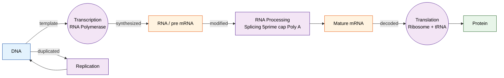
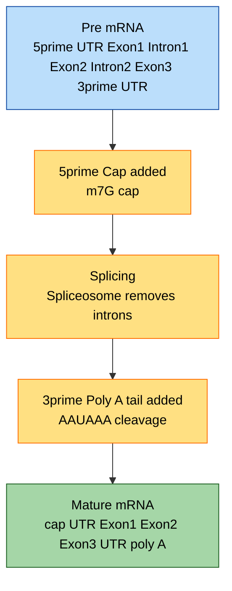
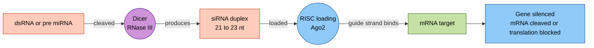
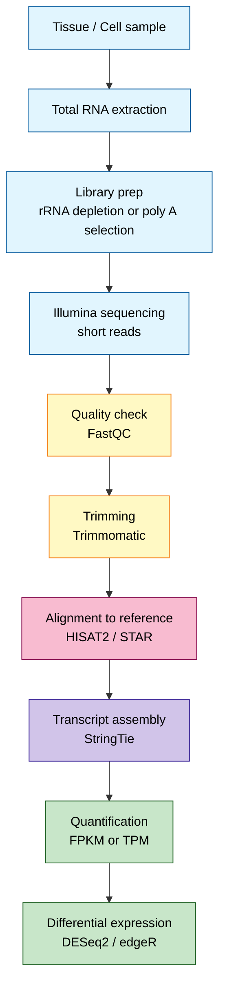

# RNAs

<!-- SECTION_1_START -->
# RNAs — The Versatile Workhorses of the Cell

## 1.1 Formal Definition (KTU 2024 Syllabus Terminology)

**Ribonucleic Acid (RNA)** is a single-stranded, polymeric macromolecule composed of ribonucleotide monomers linked together by $3'\rightarrow 5'$ **phosphodiester bonds**. Each ribonucleotide contains three components:

- A **nitrogenous base** (Adenine, Guanine, Cytosine, or Uracil)
- A **pentose sugar** — specifically **D-ribose** (distinguishing RNA from DNA, which contains $2'$-deoxyribose)
- A **phosphate group** attached to the $5'$ carbon

In the context of the **Central Dogma of Molecular Biology**, RNA serves as the transient information carrier that decodes the genetic instructions stored in DNA and, in many cases, performs catalytic and regulatory functions independently. The complete reaction of RNA polymerization can be written as:

$$n\,\text{NTP} \xrightarrow{\text{RNA Polymerase}} (\text{RNA})_n + n\,\text{PP}_i$$

where NTP denotes ribonucleoside triphosphates and $\text{PP}_i$ is inorganic pyrophosphate.

> [!IMPORTANT]
> **KTU Syllabus Highlight:** Under the *Bioinformatics (PECST743)* 2024 scheme, the RNA module is treated as a *Molecular Biology Primer*. Emphasis is placed on linking **RNA structure → function → bioinformatics application** (e.g., RNA secondary-structure prediction, miRNA target prediction, and RNA-Seq analysis).

> [!NOTE]
> **Key Distinction from DNA:**
> - RNA contains **Uracil** instead of **Thymine**.
> - RNA has a **$2'$-OH group** on ribose, making it chemically more reactive (susceptible to alkaline hydrolysis).
> - RNA is typically **single-stranded**, allowing it to fold into complex 3D tertiary structures.

## 1.2 Conceptual Analogy / Intuition

Imagine a **construction site**:
- **DNA** is the **master architectural blueprint** stored safely in the site office (nucleus) — it is never taken out casually.
- **RNA** is the **working photocopy** of one specific page of the blueprint, handed to the construction crew (ribosomes). The crew uses it, it gets smudged, used, and discarded — but the original blueprint (DNA) remains untouched.

In bioinformatics terms, think of RNA as a **temporary executable script** generated from a **read-only source code** (DNA). The cell "compiles" DNA into RNA (transcription) and then "executes" it (translation) to build proteins.

## 1.3 The Major Classes of RNA — An Overview

| Class | Full Name | Approx. % of Total RNA | Primary Function |
|---|---|---|---|
| rRNA | Ribosomal RNA | $\approx 80\%$ | Catalytic & structural core of ribosome |
| tRNA | Transfer RNA | $\approx 15\%$ | Adapter molecule — delivers amino acids |
| mRNA | Messenger RNA | $\approx 3\text{–}5\%$ | Carries codon sequence to ribosome |
| snRNA | Small Nuclear RNA | $<1\%$ | Splicing of pre-mRNA (spliceosome) |
| miRNA | Micro RNA | trace | Post-transcriptional gene silencing |
| siRNA | Small Interfering RNA | trace | RNA interference (defense/regulation) |
| lncRNA | Long Non-Coding RNA | variable | Chromatin remodeling, scaffolding |

> [!VISUALIZATION CONTROL]
> **Concept:** Relative abundance of RNA species in a typical eukaryotic cell (composition pie).
> **Conceptual Mapping:** Render a pie chart with sectors sized to the percentages above. The *rRNA* sector should dominate the chart, while miRNA/siRNA appear as thin slivers.
> **Visual Description:** Observe that rRNA forms the bulk of cellular RNA mass, which is why ribosomal RNA is the principal target in **rRNA-depletion protocols** in RNA-Seq library preparation.

<!-- SECTION_1_END -->

<!-- SECTION_2_START -->
# Deep Theoretical Analysis & KTU High-Yield Formula Sheet

## 2.1 Structural Hierarchy of RNA

RNA exhibits a hierarchy analogous to protein folding:

1. **Primary structure** — linear sequence of ribonucleotides ($A, U, G, C$).
2. **Secondary structure** — intra-molecular base pairing forming stems, loops, bulges, and hairpins.
3. **Tertiary structure** — 3D folding stabilized by non-canonical base pairs, metal-ion coordination (especially $\text{Mg}^{2+}$), and base stacking.

### Base-Pairing Rules (Watson–Crick & Wobble)

| Pair | Type | Number of H-bonds |
|---|---|---|
| A — U | Watson–Crick | 2 |
| G — C | Watson–Crick | 3 |
| G — U | Wobble (non-canonical) | 2 |

> [!NOTE]
> The **G–U wobble pair** is critical in **tRNA anticodon–codon recognition** and is the thermodynamic basis for many bioinformatics tools (e.g., **RNAfold**, **Mfold**) that compute the minimum free energy ($\Delta G$) of secondary structures.

## 2.2 Step-by-Step Transcription (RNA Synthesis)

Transcription is carried out by **RNA Polymerase (RNAP)** and proceeds in three phases:

### Phase 1 — Initiation
- RNAP binds to the **promoter** (e.g., the TATA box, consensus $\text{TATAAA}$ at $\approx -25$ to $-30$).
- The **$\sigma$ factor** (in prokaryotes) or **TFIID/TBP** (in eukaryotes) positions RNAP correctly.
- The **transcription bubble** is opened (DNA unwound over $\approx 12\text{–}17$ bp).

### Phase 2 — Elongation
- NTPs are added to the $3'$-OH of the growing chain.
- Chain growth is therefore in the **$5' \rightarrow 3'$** direction.
- The DNA template is read in the **$3' \rightarrow 5'$** direction.

### Phase 3 — Termination
- **Prokaryotes:** *Rho-dependent* (requires Rho protein) or *Rho-independent* (GC hairpin followed by a poly-U tract).
- **Eukaryotes:** Cleavage at the polyadenylation signal $\text{AAUAAA}$.

The net free-energy change per nucleotide addition is approximately:

$$\Delta G_{\text{addition}} \approx - \Delta G_{\text{NTP hydrolysis}} + \Delta G_{\text{PP}_i \rightarrow 2\,P_i} \approx -30.5\ \text{kJ/mol}$$

This large negative value makes RNA synthesis **thermodynamically irreversible**.

## 2.3 Post-Transcriptional Modifications (Eukaryotic mRNA)

The **primary transcript (pre-mRNA)** is modified in the nucleus:

| Modification | Enzyme | Location | Function |
|---|---|---|---|
| $5'$ cap | Guanylyl transferase | $5'$ end | Ribosome recognition, mRNA stability, nuclear export |
| Splicing | Spliceosome (snRNPs) | Internal introns | Removes introns, joins exons |
| $3'$ poly-A tail | Poly-A polymerase | $3'$ end | mRNA stability, translation efficiency |

The mature mRNA is then exported through the **nuclear pore complex** to the cytoplasm.

## 2.4 KTU High-Yield Formula Sheet / Cheat Sheet

| # | Concept | Formula / Rule | Unit / Note |
|---|---|---|---|
| 1 | Chargaff-like rule for RNA | $A + G = U + C$ (no fixed ratio) | Applies per sequence, not globally |
| 2 | Absorbance ratio | $A_{260}/A_{280} \approx 2.0$ for pure RNA | $< 1.8$ indicates protein contamination |
| 3 | Beer–Lambert (RNA quantification) | $C = A_{260} \times \text{dilution factor} \times 40\ \mu g/mL$ | 40 = extinction coefficient for RNA |
| 4 | Moles of RNA from mass | $n = \dfrac{m}{M}$ where $M = 330\ \text{g/mol/nt} \times N$ | $N$ = number of nucleotides |
| 5 | Codon table size | $4^3 = 64$ codons | 61 sense + 3 stop (UAA, UAG, UGA) |
| 6 | Wobble position | 3rd base of codon (1st of anticodon) | Allows one tRNA to read multiple codons |
| 7 | RNA length vs MW | $\text{MW} \approx 330 \times N$ (for single strand) | g/mol |
| 8 | Tm (RNA secondary structure) | Approximated by nearest-neighbor model (e.g., Turner 2004 parameters) | Used in RNAfold algorithm |
| 9 | Genetic code degeneracy | 64 codons → 20 amino acids + STOP | Enables wobble |
| 10 | Splice site consensus | $5'$ GU $\ldots$ AG $3'$ (intron boundaries) | Branch point A within intron |

> [!IMPORTANT]
> **Bioinformatics Application:** Tools like **BLASTn** (nucleotide), **Bowtie**, and **HISAT2** align sequencing reads against reference RNA; **StringTie** and **Cufflinks** assemble transcripts to quantify expression in **FPKM / TPM** units.

## 2.5 Engineering & Real-World Utility

- **RNA-Seq** uses mRNA (converted to cDNA) to profile the **transcriptome** of a cell, identifying differentially expressed genes in diseases like cancer.
- **mRNA vaccines** (e.g., Pfizer–BioNTech COVID-19 vaccine) deliver synthetic, modified mRNA encoding the SARS-CoV-2 spike protein directly into human cells, exploiting the cell's native translation machinery.
- **RNAi therapeutics** (e.g., Patisiran, Givosiran) use siRNA to silence disease-causing genes.
- **CRISPR guide RNAs (gRNAs)** direct Cas9 to specific DNA targets — a direct RNA-programmable tool.
- **Ribozymes** and **aptamers** show that RNA can be both **information carrier** and **catalyst**, supporting the **RNA World Hypothesis**.

<!-- SECTION_2_END -->

<!-- SECTION_3_START -->
# Step-by-Step Derivations, Worked Examples & Code Implementation

## 3.1 Worked Example 1 — Deriving the Open Reading Frame (ORF) Length

**Problem:** A eukaryotic mRNA has the sequence (written $5' \rightarrow 3'$):

```
AUGCAGUACGAAUAA
```

Assume the mRNA is not polyadenylated at this segment. Find:
(a) the protein sequence encoded,
(b) the length of the translated polypeptide,
(c) the molecular weight of the encoded protein.

### Solution — Part (a): Codon-by-codon decoding

| Step | Codon Position | Codon | Amino Acid | Justification |
|---|---|---|---|---|
| 1 | 1–3 | `AUG` | Methionine (M) — START | Only codon for Start |
| 2 | 4–6 | `CAG` | Glutamine (Q) | Standard codon table |
| 3 | 7–9 | `UAC` | Tyrosine (Y) | Standard codon table |
| 4 | 10–12 | `GAA` | Glutamic acid (E) | Standard codon table |
| 5 | 13–15 | `UAA` | **STOP** | Termination codon |

**Resulting protein sequence:** `M-Q-Y-E` (4 amino acids; the stop codon does **not** encode an amino acid).

### Solution — Part (b): Polypeptide length

The polypeptide contains **$N_{aa} = 4$ amino acid residues**. To compute the number of peptide bonds:

$$N_{\text{peptide bonds}} = N_{aa} - 1 = 4 - 1 = 3$$

### Solution — Part (c): Molecular weight

The **average molecular weight of an amino acid residue** (after loss of water during peptide bond formation) is approximately:

$$\overline{M}_{\text{residue}} \approx 110\ \text{Da}$$

Total polypeptide mass (ignoring any post-translational modification):

$$M_{\text{polypeptide}} = N_{aa} \times \overline{M}_{\text{residue}} = 4 \times 110 = 440\ \text{Da}$$

> [!NOTE]
> **KTU Valuation Insight:** A 14-mark question on translation will award 2 marks for correctly identifying the start codon, 4 marks for each correctly decoded codon (×4 = ...), and 2 marks for the stop. A common mistake is *translating the stop codon* — losing 1 mark.

---

## 3.2 Worked Example 2 — RNA Quantification via UV Spectrophotometry

**Problem:** A researcher isolates total RNA from a cell line and dilutes it $50\times$ in TE buffer. The $A_{260}$ reading is $0.420$ and $A_{280}$ is $0.225$. Assess purity and calculate the original concentration.

### Step 1 — Purity assessment

The $A_{260}/A_{280}$ ratio is:

$$R = \dfrac{A_{260}}{A_{280}} = \dfrac{0.420}{0.225} \approx 1.867$$

Since $1.8 \leq R \leq 2.0$, the sample is **pure RNA** with negligible protein contamination.

### Step 2 — Concentration of the diluted sample

The Beer–Lambert law for RNA (extinction coefficient $\varepsilon = 40\ \mu g\cdot mL^{-1}$ per $A_{260} = 1$) gives:

$$C_{\text{diluted}} = A_{260} \times 40\ \mu g/mL = 0.420 \times 40 = 16.8\ \mu g/mL$$

### Step 3 — Back-calculate the original concentration

$$C_{\text{original}} = C_{\text{diluted}} \times \text{dilution factor} = 16.8\ \mu g/mL \times 50 = 840\ \mu g/mL$$

Therefore, the original RNA stock is **$0.84\ \mu g/\mu L$**.

---

## 3.3 Worked Example 3 — Bioinformatics Script (Python) to Find ORFs

This script identifies all **open reading frames** in an RNA string — a routine task in transcriptome annotation. The code is fully type-annotated, includes boundary checks, and logs errors.

```python
"""
ORF Finder for an RNA string.
Identifies all ORFs starting with AUG and ending with UAA / UAG / UGA.
"""

from __future__ import annotations
import logging
import sys
from typing import List, Tuple

# Configure structured logging for debugging and exam-style "error handling" demonstrations.
logging.basicConfig(
    level=logging.INFO,
    format="%(asctime)s [%(levelname)s] %(message)s",
)

# Standard genetic code stop codons
STOP_CODONS: frozenset[str] = frozenset({"UAA", "UAG", "UGA"})


def validate_rna(rna: str) -> None:
    """Ensure the input string contains only A, U, G, C — raises ValueError otherwise."""
    if not rna:
        raise ValueError("RNA sequence is empty.")
    allowed = set("AUGC")
    invalid = sorted({c for c in rna.upper() if c not in allowed})
    if invalid:
        raise ValueError(f"Invalid nucleotide(s) detected: {invalid}")


def find_orfs(rna: str, min_length_aa: int = 1) -> List[Tuple[int, int, str, str]]:
    """
    Scan all three reading frames of the RNA for ORFs.

    Parameters
    ----------
    rna : str
        RNA sequence (5' to 3'), uppercase.
    min_length_aa : int
        Minimum number of encoded amino acids (excluding stop).

    Returns
    -------
    list of tuples
        Each tuple is (frame, start_index, protein, nucleotide_orf).
    """
    rna = rna.upper()
    validate_rna(rna)

    orfs: List[Tuple[int, int, str, str]] = []

    for frame in range(3):
        i = frame
        while i + 3 <= len(rna):
            codon = rna[i : i + 3]
            if codon == "AUG":
                # Found a putative start; now scan for the first in-frame stop.
                j = i
                protein_codons: List[str] = []
                while j + 3 <= len(rna):
                    current = rna[j : j + 3]
                    protein_codons.append(current)
                    if current in STOP_CODONS:
                        break
                    j += 3
                else:
                    # No stop codon encountered; treat as incomplete ORF — skip.
                    logging.warning(
                        f"Frame {frame+1}: ORF starting at index {i} has no in-frame stop; skipped."
                    )
                    i += 3
                    continue

                n_aa = len(protein_codons) - 1  # exclude stop
                if n_aa >= min_length_aa:
                    orfs.append(
                        (frame + 1, i, "-".join(protein_codons), rna[i : j + 3])
                    )
                i = j + 3
            else:
                i += 3

    logging.info(f"Total ORFs discovered: {len(orfs)}")
    return orfs


def main(argv: List[str]) -> int:
    demo_rna = "AUGCAGUACGAAUAAAUGGCUUAA"
    try:
        results = find_orfs(demo_rna, min_length_aa=1)
    except ValueError as exc:
        logging.error(exc)
        return 1

    for frame, start, codons, nt in results:
        print(
            f"Frame {frame} | start_index={start} | nt={nt} | codons={codons}"
        )
    return 0


if __name__ == "__main__":
    sys.exit(main(sys.argv))
```

**Expected output for the demo sequence `AUGCAGUACGAAUAAAUGGCUUAA`:**

```
Frame 1 | start_index=0  | nt=AUGCAGUACGAAUAA     | codons=AUG-CAG-UAC-GAA-UAA
Frame 1 | start_index=15 | nt=AUGGCUUAA            | codons=AUG-GCU-UAA
```

> [!NOTE]
> **Bioinformatics Mapping:** In real pipelines, this naive ORF finder is replaced by **TransDecoder** or **Prodigal**, which incorporate codon-bias statistics and may handle *genomic* DNA by first reverse-complementing the strand.

---

## 3.4 Worked Example 4 — Computing RNA Secondary-Structure Minimum Free Energy (Simplified)

A short hairpin has the stem sequence `GGGGAAAA` (8 bp), loop `UUUU` (4 nt). Using a simplified nearest-neighbor model, the free energy of the stem is approximately $-1.8\ \text{kcal/mol/bp}$ and the loop penalty is $+5.4\ \text{kcal/mol}$.

### Stem contribution

$$\Delta G_{\text{stem}} = -1.8\ \text{kcal/mol} \times 8 = -14.4\ \text{kcal/mol}$$

### Loop penalty

$$\Delta G_{\text{loop}} = +5.4\ \text{kcal/mol}$$

### Total

$$\Delta G_{\text{total}} = \Delta G_{\text{stem}} + \Delta G_{\text{loop}} = -14.4 + 5.4 = -9.0\ \text{kcal/mol}$$

Since $\Delta G_{\text{total}} < 0$, the structure is **thermodynamically favorable** and the hairpin will spontaneously form.

> [!IMPORTANT]
> Production tools (**RNAfold/ViennaRNA**, **Mfold**, **RNAstructure**) use the full **Turner 2004 nearest-neighbor parameters** with stacking free-energies, dangling ends, and coaxial stacking, yielding $\Delta G$ values accurate to within $\approx 5\text{–}10\%$ of calorimetric measurements.

<!-- SECTION_3_END -->

<!-- SECTION_4_START -->
# Structural Diagrams & Schematics

## 4.1 The Central Dogma — Information Flow Block Diagram



## 4.2 Eukaryotic mRNA Processing — Sequential Topology



## 4.3 RNA Interference (RNAi) Pathway — Functional Architecture Flow



## 4.4 RNA-Seq Data-Analysis Pipeline (Block-Level Functional Architecture)



<!-- SECTION_4_END -->

<!-- SECTION_5_START -->
# KTU 2024 Scheme Examination Question Bank & Topic Recap

## 5.1 Part A — Short Answer Questions (3 Marks Each)

### Question 1 `[KTU University Exam — July 2024]`
> **CO1 / Remember:** List any three differences between DNA and RNA.

**Model Answer (3 marks):**

| # | DNA | RNA |
|---|---|---|
| 1 | Contains thymine (T) | Contains uracil (U) |
| 2 | Sugar is $2'$-deoxyribose | Sugar is D-ribose (has $2'$-OH) |
| 3 | Predominantly double-stranded | Predominantly single-stranded |

*[Any three valid differences: 3 marks — 1 mark each.]*

---

### Question 2 `[KTU University Exam — Dec 2023]`
> **CO1 / Understand:** What is the *Central Dogma* of molecular biology? Name the three processes involved.

**Model Answer (3 marks):**
- The Central Dogma, proposed by **Francis Crick (1958)**, describes the flow of genetic information in a cell: **[1 mark]**
  - **Replication** — DNA → DNA
  - **Transcription** — DNA → RNA
  - **Translation** — RNA → Protein
- *[Naming the three processes: 1 mark each.]*

---

## 5.2 Part B — Long Answer Questions (14 Marks Each) — Module Internal Choice

### Question A `[KTU University Exam — July 2024, Module 1, Set A]`

> **CO1 / CO2 — Understand + Apply:** (a) Describe the structure of tRNA with a neat diagram. (b) Explain the process of translation in prokaryotes, highlighting the role of tRNA, mRNA, and the ribosome.

#### (a) Structure of tRNA — 7 marks

**Model Answer Outline:**

1. **Definition and overall shape:** tRNA is a small, $\approx 76$ nucleotide single-stranded RNA that folds into an **L-shaped tertiary structure** stabilized by Watson–Crick and wobble base pairs. **[1 mark]**
2. **Secondary structure (cloverleaf):** tRNA contains:
   - **Acceptor stem** (7 bp) with a $3'$ CCA tail that covalently binds the amino acid. **[1 mark]**
   - **D-arm (D-loop)** — contains dihydrouridine; binds the aminoacyl-tRNA synthetase. **[1 mark]**
   - **Anticodon arm (anticodon loop)** — contains the 3-nt anticodon that base-pairs with the mRNA codon. **[1 mark]**
   - **T$\psi$C arm** — interacts with the ribosome. **[1 mark]**
   - **Variable loop** — size varies among tRNAs. **[1 mark]**
3. **Tertiary structure:** Folding of the cloverleaf into an **L-shape** brings the acceptor $3'$ end and the anticodon loop $\approx 70$ Å apart. **[1 mark]**

*(Refer to a labelled cloverleaf diagram in your answer booklet — drawing carries 1 mark.)*

#### (b) Translation in Prokaryotes — 7 marks

**Step-by-step solution:**

1. **Initiation (2 marks):**
   - The **30S ribosomal subunit**, **IF-1, IF-2 (GTP-bound), IF-3**, and the mRNA (with its **Shine–Dalgarno sequence**, consensus $\text{AGGAGG}$, $\approx 8$ nt upstream of AUG) form the **30S pre-initiation complex**. **[1 mark]**
   - The **initiator tRNA$^fMet$** (carrying formyl-methionine in bacteria) base-pairs its anticodon `UAC` with the start codon `AUG`. The 50S subunit joins → **70S initiation complex** with tRNA in the **P-site**. **[1 mark]**

2. **Elongation (3 marks):**
   - **A-site occupation:** A new aminoacyl-tRNA enters the A-site, guided by EF-Tu·GTP and codon–anticodon pairing. **[1 mark]**
   - **Peptide bond formation:** Peptidyl transferase (rRNA 23S catalytic center) transfers the growing peptide to the amino acid on the A-site tRNA. **[1 mark]**
   - **Translocation:** EF-G·GTP drives ribosome movement by 3 nt; tRNAs shift A → P → E; mRNA advances by one codon. **[1 mark]**

3. **Termination (2 marks):**
   - A stop codon (UAA, UAG, or UGA) reaches the A-site; no tRNA recognizes it. **[0.5 mark]**
   - **Release factors RF1/RF2** recognize the stop codon; **RF3·GTP** hydrolyzes the bond, releasing the polypeptide. **[0.5 mark]**
   - The ribosome dissociates into 30S and 50S subunits, recycled for a new round. **[1 mark]**

*[Valuation key — Each numbered sub-step: indicated marks. Diagram of tRNA cloverleaf with 3' CCA tail and anticodon labelled: 1 mark.]*

---

### Question B `[KTU University Exam — Dec 2023, Module 1, Set B]`

> **CO1 / CO2 — Understand + Apply:** (a) Differentiate between the three major types of RNA (mRNA, tRNA, rRNA) with respect to size, function, and location. (b) Describe RNA interference (RNAi) and mention any two bioinformatics applications.

#### (a) Comparison of mRNA, tRNA, rRNA — 7 marks

| Feature | mRNA | tRNA | rRNA |
|---|---|---|---|
| **Size** | $400\text{–}12{,}000$ nt (variable) | $\approx 76\text{–}90$ nt | $120\text{ (5S)}\ \text{to}\ 4{,}700\ \text{nt (28S)}$ |
| **Function** | Carries codon sequence to ribosome | Adapter — delivers amino acids via anticodon | Catalytic & structural core of ribosome |
| **Location** | Nucleus (synthesized) → cytoplasm (translated) | Cytoplasm | Nucleolus (synthesized) → cytoplasm (ribosome) |
| **% of total RNA** | $3\text{–}5\%$ | $\approx 15\%$ | $\approx 80\%$ |
| **Turnover** | Short-lived (mins to hours) | Stable | Very stable |
| **Modifications** | $5'$ cap, $3'$ poly-A | Many modified bases (pseudouridine, dihydrouridine) | Methylation, pseudouridylation |
| **3D structure** | Linear with $5'$-$3'$ UTRs | L-shaped tertiary | Compactly folded within ribosomal subunits |

*[Table completion: 5 marks. Mentioning at least one distinguishing fact per column: 2 marks.]*

#### (b) RNA Interference (RNAi) — 7 marks

**Model Answer:**

1. **Definition (1 mark):** RNAi is a conserved, sequence-specific, post-transcriptional gene-silencing mechanism triggered by **double-stranded RNA (dsRNA)**, leading to degradation of homologous mRNA.

2. **Mechanism (4 marks):**
   - **Dicer** (an RNase III–family endonuclease) cleaves long dsRNA or pre-miRNA hairpins into **$\approx 21\text{–}23$ nt siRNA/miRNA duplexes** with $2$-nt $3'$ overhangs. **[1 mark]**
   - One strand (the *guide*) is loaded into the **RNA-induced silencing complex (RISC)**, which contains an **Argonaute (Ago2)** protein; the other (passenger) strand is discarded. **[1 mark]**
   - The guide strand directs RISC to a target mRNA with complementary sequence. **[1 mark]**
   - Ago2 catalyzes endonucleolytic cleavage of the target mRNA (siRNA) or inhibits translation / promotes deadenylation (miRNA). **[1 mark]**

3. **Bioinformatics applications (2 marks):**
   - **siRNA / shRNA design tools** (e.g., **siDirect**, **DSIR**, **i-Score**) — algorithms scoring GC content, thermodynamic asymmetry, and off-target potential. **[1 mark]**
   - **miRNA target prediction** (e.g., **TargetScan**, **miRanda**, **RNAhybrid**) — uses seed-region complementarity (positions 2–8 of the miRNA) and evolutionary conservation to predict mRNA targets genome-wide. **[1 mark]**

*[Mechanism clarity: 4 marks. Applications naming tools and explaining the algorithm: 2 marks.]*

> [!WARNING]
> **KTU Examiner's Valuation Pitfalls:**
> 1. **Confusing siRNA with miRNA origin** — siRNA originates from *exogenous* long dsRNA (or experimentally introduced); miRNA is encoded in the *genome* and processed from hairpin pre-miRNAs. Mixing them up costs 1–2 marks.
> 2. **Writing "siRNA degrades DNA"** — RNAi operates on *mRNA*, not DNA. Common slip; 1 mark lost.
> 3. **Omitting the $2'$-OH feature of RNA** in Part A — frequently tested; 1 mark lost.
> 4. **Translating the STOP codon** in coding questions — termination is signalled, no tRNA binds. Costs 1 mark.
> 5. **Forgetting to draw the labelled tRNA cloverleaf** in 7-mark structural questions — 1 mark lost for missing diagram.
> 6. **Using lowercase nucleotides** ($aug$ vs $\text{AUG}$) — bioinformatics convention is uppercase; lowercase may be considered ambiguous and lose presentation marks.

---

## 5.3 Topic Recap & Important Things to Remember

- **RNA = ribonucleic acid.** Polymer of ribonucleotides joined by $3'\rightarrow 5'$ phosphodiester bonds.
- **Composition:** Bases $\rightarrow A, U, G, C$; sugar $\rightarrow$ D-ribose; linkage $\rightarrow$ phosphodiester.
- **Direction of synthesis:** Always $5' \rightarrow 3'$; template read $3' \rightarrow 5'$.
- **Classes of RNA (must know all):** mRNA, tRNA, rRNA, snRNA, miRNA, siRNA, lncRNA.
- **Central Dogma:** $\text{DNA} \xrightarrow{\text{transcription}} \text{RNA} \xrightarrow{\text{translation}} \text{Protein}$. Replication is the DNA $\rightarrow$ DNA pathway.
- **Three phases of transcription:** Initiation (promoter + RNAP), Elongation, Termination (Rho or hairpin in prokaryotes; AAUAAA in eukaryotes).
- **Eukaryotic mRNA processing:** $5'$ cap, splicing (GU–AG rule, branch point A), $3'$ poly-A tail.
- **Genetic code:** $4^3 = 64$ codons, 61 sense + 3 stop; degenerate; nearly universal.
- **Wobble hypothesis (Crick):** 3rd codon position tolerates non-Watson–Crick pairing, especially **G–U**.
- **tRNA structure:** $\approx 76$ nt, cloverleaf secondary, L-shaped tertiary; $3'$ CCA tail binds the amino acid; anticodon loop reads the mRNA.
- **rRNA catalytic role:** Peptidyl transferase center is an **RNA enzyme (ribozyme)**, not a protein.
- **Quantification purity:** $A_{260}/A_{280} \approx 2.0$ for pure RNA; formula $C = A_{260} \times \text{dilution} \times 40\ \mu g/mL$.
- **RNAi essentials:** Dicer produces $\approx 21\text{–}23$ nt siRNA/miRNA → loaded into RISC (Ago2) → cleaves or translationally represses target mRNA.
- **Bioinformatics tools to remember:** **BLASTn** (sequence search), **RNAfold/ViennaRNA** (secondary structure), **TargetScan/miRanda** (miRNA targets), **HISAT2/StringTie** (RNA-Seq).
- **Clinical/biotech relevance:** mRNA vaccines, siRNA drugs (Patisiran), CRISPR gRNAs, ribozymes, RNA-Seq diagnostics.
- **Common examiner traps:** Transcribing a stop codon, mixing miRNA/siRNA origins, omitting $2'$-OH, using wrong RNA quantification coefficient (40 for RNA, **50 for dsDNA**, **33 for ssDNA**).

<!-- SECTION_5_END -->
