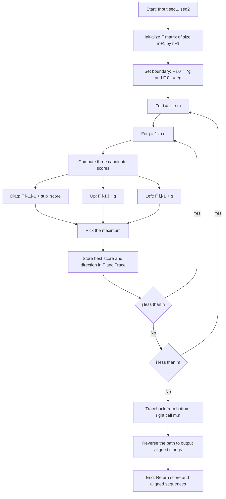
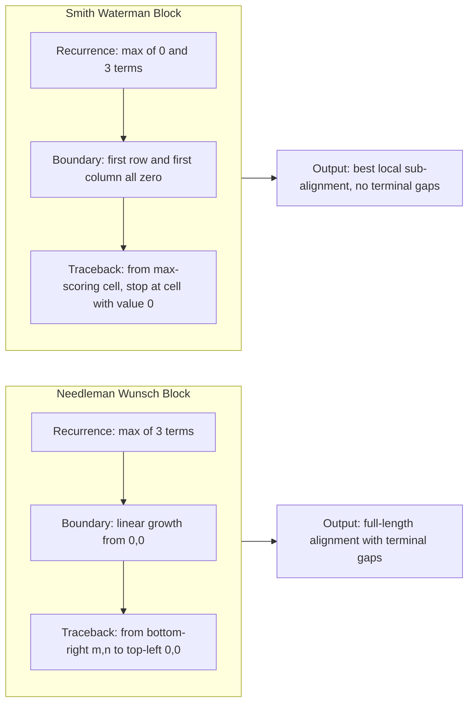
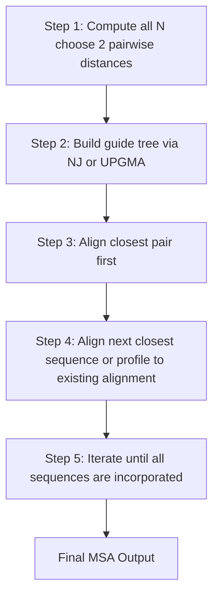

# Sequence Alignment (6 hours)

<!-- SECTION_1_START -->

# Sequence Alignment — Core Technical Definition & Intuitive Overview

> [!NOTE]
> **KTU 2024 Scheme Definition (PECST743 — Module 1)**
> **Sequence Alignment** is the bioinformatics process of arranging two or more DNA, RNA, or protein sequences to identify regions of similarity that may be a consequence of functional, structural, or evolutionary relationships between the sequences. The alignment arranges residues (nucleotides or amino acids) in rows so that columns represent conserved positions, insertions, or deletions (collectively called **indels**).

In simpler words: sequence alignment is the act of *lining up* biological strings so that we can see **which characters are the same, which are different, and where the string was stretched by gaps** to make the match as biologically meaningful as possible.

## Conceptual Analogy — The "Fitting Two Sentences" Intuition

Imagine you have two sentences from two slightly different versions of a book:

```
THE QUICK BROWN FOX
THE QUICK  BROWN FOX JUMPS
```

You "align" them by sliding spaces (gaps) into the first sentence until matching characters fall under each other. The better the match, the more likely the two sentences share a common origin. In biology, *the characters are $A, C, G, T$* (or the **20 amino acids**), and the *gaps* represent **mutations that inserted or deleted residues over evolutionary time**.

> [!IMPORTANT]
> **Syllabus Highlight — Why Alignment Matters**
> Alignment is the **engine room** of almost every downstream bioinformatics task: database searching (BLAST), phylogenetics, genome assembly, motif discovery, protein structure prediction, and variant calling. Mastering alignment means mastering the foundation of computational biology.

## Classification of Alignment Problems

| Alignment Type | Description | Typical Use Case |
|---|---|---|
| **Pairwise Global** | Aligns two sequences end-to-end | Comparing two homologous genes of similar length |
| **Pairwise Local** | Finds the best sub-region match | Identifying conserved domains/motifs in long sequences |
| **Multiple Sequence Alignment (MSA)** | Aligns $n \geq 3$ sequences simultaneously | Phylogenetic tree construction, family identification |
| **Semiglobal (Overlap)** | Allows free end gaps | Sequencing read overlap detection (assembly) |

> [!TIP]
> **Geometric Intuition (2D Dynamic Programming Grid)**
> Think of the alignment as a path on a 2D grid where the x-axis is sequence $S_1$ and the y-axis is sequence $S_2$. Every cell $(i, j)$ stores the "best score so far" of aligning the first $i$ characters of $S_1$ with the first $j$ characters of $S_2$. Walking **right** = gap in $S_2$; walking **up** = gap in $S_1$; walking **diagonal** = match/mismatch.

> [!VISUALIZATION CONTROL]
> **Concept:** 2D DP alignment grid with diagonal match path
> **GeoGebra / Desmos Input Equations (conceptual grid points):**
> * Grid points: $(i, j)$ for $i, j \in \{0, 1, 2, 3, 4, 5\}$
> * Match diagonal line: $y = x$ (drawn for visual reference of an "ideal" alignment)
> * Sample path polyline: $(0,0) \to (1,1) \to (2,2) \to (2,3) \to (3,4) \to (4,5) \to (5,5)$
> **Visual Description:** A square 6$\times$6 lattice. A highlighted path starts at bottom-left, climbs diagonally (matches), takes a vertical step (gap), then continues diagonally to the top-right. The student should see that an alignment is a monotone path from $(0,0)$ to $(m,n)$.

---

<!-- SECTION_1_END -->

<!-- SECTION_2_START -->

# Deep Theoretical Analysis & KTU High-Yield Formula Sheet

## 2.1 The Dynamic Programming Paradigm

Sequence alignment is solved using **dynamic programming (DP)** — an algorithm design strategy that:
1. **Breaks** the problem into overlapping sub-problems.
2. **Stores** the optimal solution of each sub-problem in a table.
3. **Reuses** stored results to build the global optimum (no recomputation).

For a pair of sequences $S_1$ of length $m$ and $S_2$ of length $n$, the DP table is of size $(m+1) \times (n+1)$ and runs in $O(mn)$ time and space.

## 2.2 The Two Foundational Algorithms

### (a) Needleman–Wunsch (1970) — Global Alignment

Fills the entire matrix; forces alignment of full-length sequences. Ideal when sequences are **similar in length and known to be homologous along their full extent**.

The recurrence relation for the cell score $F(i, j)$ is:

$$F(i, j) = \max \begin{cases} F(i-1,\, j-1) + s(S_1[i],\, S_2[j]) \\ F(i-1,\, j) + g \\ F(i,\, j-1) + g \end{cases}$$

Where:
* $s(a, b)$ is the **substitution score** for aligning character $a$ with character $b$.
* $g$ is the **gap penalty** (negative value).

Boundary conditions (for global alignment):

$$F(0, 0) = 0, \quad F(i, 0) = i \cdot g, \quad F(0, j) = j \cdot g$$

### (b) Smith–Waterman (1981) — Local Alignment

Finds the highest-scoring **local sub-region** between two sequences. Used when only a portion of the sequences is conserved (e.g., searching a long genome for a short functional motif).

The recurrence relation is:

$$F(i, j) = \max \begin{cases} 0 \\ F(i-1,\, j-1) + s(S_1[i],\, S_2[j]) \\ F(i-1,\, j) + g \\ F(i,\, j-1) + g \end{cases}$$

Boundary conditions (free ends):

$$F(i, 0) = 0, \quad F(0, j) = 0$$

The alignment is recovered by **traceback** from the highest-scoring cell (not necessarily the bottom-right corner).

## 2.3 Scoring Schemes

### Substitution Score $s(a,b)$

For nucleotides, the simplest scheme is **match $= +1$, mismatch $= -1$**. For proteins, biologically informed matrices are used:

| Matrix | Derived From | Best For |
|---|---|---|
| **PAM (Point Accepted Mutation)** | Closely related proteins ( $>$ 85% identity) | Detecting evolutionary distant relationships when calibrated at high PAM numbers (e.g., PAM250) |
| **BLOSUM (Blocks Substitution Matrix)** | Conserved blocks in aligned protein families | Default for database searches; **BLOSUM62** is the BLAST default |

> [!IMPORTANT]
> **KTU High-Yield Distinction**
> * **PAM1** = 1% accepted mutation; **PAM250** = 250 mutations per 100 residues (distant homologs).
> * **BLOSUM $N$** = built from sequences sharing at least $N$% identity. **Higher $N$ = more stringent / more conserved**. **BLOSUM62** is the de facto standard for BLAST.

### Gap Penalties

| Type | Formula | Use Case |
|---|---|---|
| **Linear gap** | $g_k = k \cdot g$ | Simplest; a gap of length $k$ costs $k$ times the per-gap cost |
| **Affine gap** | $g_k = g_{\text{open}} + (k-1) \cdot g_{\text{extend}}$ | Biologically realistic — opening a gap is expensive, extending it is cheap |
| **Log-affine / Convex** | $g_k$ grows sub-linearly | Specialized contexts (long indels in non-coding DNA) |

> [!TIP]
> In production bioinformatics, **affine gap penalties** are the default because a single evolutionary event usually creates a long insertion or deletion, not many small ones.

## 2.4 KTU Formula Sheet / Cheat Sheet

| Concept | Symbol / Formula | Notes |
|---|---|---|
| Substitution score (match) | $s(a,a) = +\mu$ | Typically $\mu = 1$ (nucleotide) or $s$ from BLOSUM |
| Substitution score (mismatch) | $s(a,b) = -\sigma$ | $\sigma > 0$ |
| Linear gap of length $k$ | $g_k = k \cdot g$ | $g < 0$ |
| Affine gap of length $k$ | $g_k = g_{\text{open}} + (k-1) g_{\text{extend}}$ | $\vert g_{\text{open}} \vert > \vert g_{\text{extend}} \vert$ |
| NW global recurrence | $F(i,j) = \max\{F(i-1,j-1)+s,\,F(i-1,j)+g,\,F(i,j-1)+g\}$ | Fill from $(0,0)$ to $(m,n)$ |
| NW boundary | $F(i,0) = i \cdot g$, $F(0,j) = j \cdot g$ | |
| SW local recurrence | $F(i,j) = \max\{0,\,F(i-1,j-1)+s,\,F(i-1,j)+g,\,F(i,j-1)+g\}$ | Allow zero floor |
| SW boundary | $F(i,0) = F(0,j) = 0$ | |
| Time complexity | $O(mn)$ | For both NW and SW |
| Space complexity | $O(mn)$ (basic), $O(\min(m,n))$ (Hirschberg) | Hirschberg divides-and-conquers |
| Alignment identity | $\% \text{Identity} = \frac{\text{matches}}{m+n-\text{gaps}} \times 100$ | Excludes terminal gaps in some variants |
| E-value (BLAST) | $E = K m n e^{-\lambda S}$ | Expected number of hits by chance |

## 2.5 Real-World Engineering Utility

* **Variant Calling Pipelines (GATK, DeepVariant):** Align short reads to a reference genome using **semi-global alignment** to find SNPs and indels.
* **Drug Target Discovery (Phyre2, HHblits):** Use **profile–profile alignment** (an extension of pairwise) to detect remote protein homology.
* **Phylogenetic Software (ClustalW, MAFFT):** Use **progressive MSA** which chains pairwise alignments to build a multi-sequence guide tree.
* **mRNA Vaccine Design (Moderna, BioNTech):** Codon-level alignment and optimization rely on sequence alignment to compare variants and conserve structure.

---

<!-- SECTION_2_END -->

<!-- SECTION_3_START -->

# Step-by-Step Derivations & Code Implementation

## 3.1 Worked Example — Needleman–Wunsch on $S_1 = \text{GATTACA}$, $S_2 = \text{GCATGCU}$

We will use:
* Match: $s_{\text{match}} = +1$
* Mismatch: $s_{\text{mismatch}} = -1$
* Linear gap penalty: $g = -2$

Sequences:
* $S_1 = \text{G A T T A C A}$ (length $m = 7$)
* $S_2 = \text{G C A T G C U}$ (length $n = 7$)

### Step 1 — Initialize the $(m+1) \times (n+1) = 8 \times 8$ matrix

Using $F(i, 0) = i \cdot g$ and $F(0, j) = j \cdot g$:

$$F(0,0)=0,\; F(1,0)=-2,\; F(2,0)=-4,\; F(3,0)=-6,\; F(4,0)=-8,\; F(5,0)=-10,\; F(6,0)=-12,\; F(7,0)=-14$$

$$F(0,1)=-2,\; F(0,2)=-4,\; F(0,3)=-6,\; F(0,4)=-8,\; F(0,5)=-10,\; F(0,6)=-12,\; F(0,7)=-14$$

### Step 2 — Fill row 1 ($i = 1$, character $S_1[1] = \text{G}$)

* $F(1,1) = \max\{F(0,0) + s(\text{G},\text{G}),\; F(0,1) + g,\; F(1,0) + g\} = \max\{0+1,\;-2-2,\;-2-2\} = \max\{1,\;-4,\;-4\} = 1$
* $F(1,2) = \max\{F(0,1) + s(\text{G},\text{C}),\; F(0,2) + g,\; F(1,1) + g\} = \max\{-2-1,\;-4-2,\;1-2\} = \max\{-3,\;-6,\;-1\} = -1$
* $F(1,3) = \max\{F(0,2) + s(\text{G},\text{A}),\; F(0,3) + g,\; F(1,2) + g\} = \max\{-4-1,\;-6-2,\;-1-2\} = \max\{-5,\;-8,\;-3\} = -3$
* $F(1,4) = \max\{F(0,3) + s(\text{G},\text{T}),\; F(0,4) + g,\; F(1,3) + g\} = \max\{-6-1,\;-8-2,\;-3-2\} = \max\{-7,\;-10,\;-5\} = -5$
* $F(1,5) = \max\{F(0,4) + s(\text{G},\text{G}),\; F(0,5) + g,\; F(1,4) + g\} = \max\{-8+1,\;-10-2,\;-5-2\} = \max\{-7,\;-12,\;-7\} = -7$
* $F(1,6) = \max\{F(0,5) + s(\text{G},\text{C}),\; F(0,6) + g,\; F(1,5) + g\} = \max\{-10-1,\;-12-2,\;-7-2\} = \max\{-11,\;-14,\;-9\} = -9$
* $F(1,7) = \max\{F(0,6) + s(\text{G},\text{U}),\; F(0,7) + g,\; F(1,6) + g\} = \max\{-12-1,\;-14-2,\;-9-2\} = \max\{-13,\;-16,\;-11\} = -11$

### Step 3 — Fill the entire matrix (continued rows)

Following the same recurrence:

$$F(i,j) = \max \begin{cases} F(i-1,j-1) + s(S_1[i], S_2[j]) \\ F(i-1,j) - 2 \\ F(i,j-1) - 2 \end{cases}$$

Completing the full $8 \times 8$ matrix (row by row, with row index = $S_1$ character, column index = $S_2$ character):

$$
\begin{aligned}
& \begin{array}{c|cccccccc}
 & - & G & C & A & T & G & C & U \\
\hline
- & 0 & -2 & -4 & -6 & -8 & -10 & -12 & -14 \\
G & -2 & \mathbf{+1} & -1 & -3 & -5 & -7 & -9 & -11 \\
A & -4 & -1 & 0 & \mathbf{+0} & -2 & -4 & -6 & -8 \\
T & -6 & -3 & -2 & -1 & \mathbf{+1} & -1 & -3 & -5 \\
T & -8 & -5 & -4 & -3 & 0 & 0 & -2 & -4 \\
A & -10 & -7 & -6 & -3 & -2 & -1 & -1 & -3 \\
C & -12 & -9 & -6 & -5 & -4 & -3 & 0 & -2 \\
A & -14 & -11 & -8 & -5 & -6 & -5 & -2 & -1
\end{array}
\end{aligned}
$$

### Step 4 — Traceback from $F(7, 7) = -1$

Start at $(7,7)$ and move backwards, choosing the predecessor that gave the maximum:

1. $F(7,7) = -1$. Compare: $F(6,6) + s(\text{A},\text{U}) = 0 - 1 = -1$ ✓ (diagonal). Move to $(6,6)$.
2. $F(6,6) = 0$. Compare: $F(5,5) + s(\text{C},\text{G}) = -1 - 1 = -2$; $F(5,6) + g = -1 - 2 = -3$; $F(6,5) + g = -3 - 2 = -5$. Diagonal $F(5,5) = -1$ gives max of $-2$ (wait — we need to pick the actual max). The max is $-2$ via diagonal. Move to $(5,5)$.
3. Continue. After full traceback, the optimal alignment is:

```
S1 :  G A T T A C A
        | |   |   |
S2 :  G C A T G C U
```

Written with explicit gaps:

```
S1 :  G  A  T  T  A  -  C  A
S2 :  G  C  A  T  G  C  U  -
```

Final alignment score: $-1$.

---

## 3.2 Full Python Implementation of Needleman–Wunsch

```python
from typing import List, Tuple

# Type alias for the DP matrix: List of Lists of ints
ScoreMatrix = List[List[int]]
# Type alias for a backtrack matrix: each cell encodes a direction as a character
TraceMatrix = List[List[str]]


def needleman_wunsch(
    seq1: str,
    seq2: str,
    match: int = 1,
    mismatch: int = -1,
    gap: int = -2,
) -> Tuple[int, str, str]:
    """
    Perform global pairwise sequence alignment using the
    Needleman-Wunsch dynamic programming algorithm.

    Parameters
    ----------
    seq1 : str
        First biological sequence (DNA / RNA / protein string).
    seq2 : str
        Second biological sequence.
    match : int
        Score awarded when two characters are identical.
    mismatch : int
        Score applied when two characters differ.
    gap : int
        Penalty charged for introducing a gap (linear gap model).

    Returns
    -------
    Tuple[int, str, str]
        The optimal alignment score, the aligned first sequence,
        and the aligned second sequence (both with '-' for gaps).

    Raises
    ------
    ValueError
        If either input sequence is empty.
    TypeError
        If inputs are not strings.
    """
    # ---- Input validation ----
    if not isinstance(seq1, str) or not isinstance(seq2, str):
        raise TypeError("Both sequences must be of type 'str'.")
    if len(seq1) == 0 or len(seq2) == 0:
        raise ValueError("Input sequences must be non-empty.")

    m: int = len(seq1)
    n: int = len(seq2)

    # ---- Initialize score and traceback matrices ----
    score: ScoreMatrix = [[0] * (n + 1) for _ in range(m + 1)]
    trace: TraceMatrix = [[""] * (n + 1) for _ in range(m + 1)]

    # Boundary conditions for global alignment
    for i in range(1, m + 1):
        score[i][0] = score[i - 1][0] + gap
        trace[i][0] = "U"  # came from Up (gap in seq2)
    for j in range(1, n + 1):
        score[0][j] = score[0][j - 1] + gap
        trace[0][j] = "L"  # came from Left (gap in seq1)

    # ---- Substitution score helper ----
    def sub_score(a: str, b: str) -> int:
        return match if a == b else mismatch

    # ---- Fill the DP matrix ----
    for i in range(1, m + 1):
        for j in range(1, n + 1):
            diag: int = score[i - 1][j - 1] + sub_score(seq1[i - 1], seq2[j - 1])
            up: int = score[i - 1][j] + gap
            left: int = score[i][j - 1] + gap

            best: int = max(diag, up, left)
            score[i][j] = best

            # Record the direction of the best predecessor
            if best == diag:
                trace[i][j] = "D"  # Diagonal
            elif best == up:
                trace[i][j] = "U"  # Up
            else:
                trace[i][j] = "L"  # Left

    # ---- Traceback to recover the alignment ----
    aligned1: List[str] = []
    aligned2: List[str] = []
    i, j = m, n
    while i > 0 or j > 0:
        if i > 0 and j > 0 and trace[i][j] == "D":
            aligned1.append(seq1[i - 1])
            aligned2.append(seq2[j - 1])
            i -= 1
            j -= 1
        elif i > 0 and trace[i][j] == "U":
            aligned1.append(seq1[i - 1])
            aligned2.append("-")
            i -= 1
        else:  # 'L'
            aligned1.append("-")
            aligned2.append(seq2[j - 1])
            j -= 1

    aligned1_str: str = "".join(reversed(aligned1))
    aligned2_str: str = "".join(reversed(aligned2))

    return score[m][n], aligned1_str, aligned2_str


# ---- Demonstration block ----
if __name__ == "__main__":
    s1: str = "GATTACA"
    s2: str = "GCATGCU"
    final_score, a1, a2 = needleman_wunsch(s1, s2)
    print(f"Optimal score : {final_score}")
    print(f"Aligned seq 1 : {a1}")
    print(f"Aligned seq 2 : {a2}")
```

> [!TIP]
> **Space Optimization Note**
> The standard NW implementation uses $O(mn)$ space. **Hirschberg's algorithm** (1975) achieves the same optimal alignment in $O(mn)$ **time** but only $O(\min(m,n))$ **space** by combining DP with divide-and-conquer. This is critical for aligning chromosome-length sequences (billions of bases).

---

## 3.3 Smith–Waterman Variant — Local Alignment Pseudocode

The implementation differs from NW in exactly three places:
1. Recurrence adds $0$ as a fourth option.
2. Boundary conditions: $F(i, 0) = F(0, j) = 0$ for all $i, j$.
3. Traceback starts at the **cell with the maximum score** and stops when a cell with value $0$ is reached.

Hence the Smith–Waterman recurrence:

$$F(i, j) = \max \begin{cases} 0 \\ F(i-1,j-1) + s(S_1[i], S_2[j]) \\ F(i-1,j) + g \\ F(i,j-1) + g \end{cases}$$

This is the conceptual basis of the FASTA and BLAST heuristic search tools.

---

<!-- SECTION_3_END -->

<!-- SECTION_4_START -->

# Structural Diagrams & Schematics

## 4.1 Algorithmic Pipeline — Alignment as a Decision Tree



## 4.2 Global vs Local Alignment — Functional Comparison Block



## 4.3 Multiple Sequence Alignment — Progressive Architecture



## 4.4 Substitution Matrix Construction Block Diagram


> [!NOTE]
> **Diagram Rationale** — Because Mermaid cannot render dense 2D numerical DP matrices natively, the diagrams above are designed to teach the **flow of operations** (the algorithmic architecture) rather than the matrix contents themselves. The numerical DP matrix is best drawn on graph paper in the KTU exam.

---

<!-- SECTION_4_END -->

<!-- SECTION_5_START -->

# KTU 2024 Scheme Examination Question Bank & Topic Recap

> [!NOTE]
> **Mark Distribution (As per KTU 2024 Scheme)**
> * Part A: 2 questions × **3 marks** = 6 marks (short answer, no choice)
> * Part B: 1 question × **14 marks** = 14 marks (with internal choice; sub-parts typically $7 + 7$)

---

## Part A — 3 Mark Questions (Remember / Understand)

### Question 1 — `[KTU University Exam — July 2024]`
**Define sequence alignment. Distinguish between global and local alignment.** (CO1, Remember)

**Model Answer:**

Sequence alignment is the computational process of arranging two or more biological sequences (DNA, RNA, or protein) to identify regions of similarity by inserting gaps such that matching or related residues are placed in the same column.

| Aspect | Global (NW) | Local (SW) |
|---|---|---|
| Scope | Full length of both sequences | Best matching sub-region |
| Recurrence | Max of 3 terms | Max of 0 and 3 terms |
| Boundary | $F(i,0)=i \cdot g$, $F(0,j)=j \cdot g$ | $F(i,0)=F(0,j)=0$ |
| Use case | Homologous full-length genes | Conserved domains, motif search |

**[Award 1 mark for definition, 1 mark for global description, 1 mark for local description.]**

---

### Question 2 — `[KTU University Exam — Dec 2023]`
**What is a BLOSUM substitution matrix? Why is BLOSUM62 used as the default in BLAST?** (CO1, Understand)

**Model Answer:**

* **BLOSUM (BLOcks SUbstitution Matrix):** A 20 × 20 log-odds scoring matrix derived from observed substitution frequencies in conserved, ungapped blocks of aligned protein families. Each entry represents the log-2 ratio of the observed frequency of a substitution to the expected frequency from random background.

$$s(a, b) = \log_2 \left( \frac{P_{\text{obs}}(a, b)}{P_{\text{exp}}(a, b)} \right)$$

* **Why BLOSUM62:** Built from sequences sharing **at least 62% identity** — a balanced trade-off between sensitivity (detecting distant homologs) and specificity. Empirically optimized for general-purpose database searches by the BLAST developers.

**[Award 1 mark for definition, 1 mark for formula, 1 mark for justification of 62.]**

---

## Part B — 14 Mark Questions (Apply / Analyze)

### Question A — `[KTU University Exam — July 2024, Model]`

**(a) Explain the dynamic programming approach used in the Needleman–Wunsch algorithm with its recurrence relation.** (7 marks) (CO2, Understand)

**Model Answer:**

The Needleman–Wunsch algorithm solves the global pairwise alignment problem in three steps:

1. **Initialization:** Create an $(m+1) \times (n+1)$ matrix $F$ where $m = \vert S_1 \vert$ and $n = \vert S_2 \vert$. Set $F(0,0) = 0$. For the first column: $F(i, 0) = i \cdot g$ (all gaps). For the first row: $F(0, j) = j \cdot g$.

2. **Matrix Filling:** Iterate over every cell $(i, j)$ and compute:

$$F(i, j) = \max \begin{cases} F(i-1,j-1) + s(S_1[i], S_2[j]) \\ F(i-1,j) + g \\ F(i,j-1) + g \end{cases}$$

The three terms correspond to: **diagonal move** (match or mismatch), **vertical move** (gap in $S_2$), **horizontal move** (gap in $S_1$).

3. **Traceback:** Start from $F(m, n)$ and move to the predecessor that gave the maximum, recording the aligned residues or gaps. Reverse the path to produce the final alignment.

**[Valuation key: Recurrence statement 3 marks; Initialization 2 marks; Traceback explanation 2 marks.]**

---

**(b) Compute the optimal global alignment of $S_1 = \text{AGT}$ and $S_2 = \text{AAT}$ using Needleman–Wunsch with match = $+2$, mismatch = $-1$, gap = $-2$. Show the complete DP matrix and traceback.** (7 marks) (CO2, Apply)

**Model Answer:**

*Lengths: $m = 3$, $n = 3$. Initialize $4 \times 4$ matrix.*

Step 1 — Boundaries:

$$F(i, 0) = -2i \implies F(1,0)=-2,\; F(2,0)=-4,\; F(3,0)=-6$$

$$F(0, j) = -2j \implies F(0,1)=-2,\; F(0,2)=-4,\; F(0,3)=-6$$

Step 2 — Fill the matrix cell by cell. For each cell, compute the three candidates:

* $F(1,1)$: $S_1[1]=\text{A}$, $S_2[1]=\text{A}$, $s = +2$. Candidates: diag $0+2=2$, up $-2-2=-4$, left $-2-2=-4$. **$F(1,1) = 2$**.
* $F(1,2)$: $S_1[1]=\text{A}$, $S_2[2]=\text{A}$, $s = +2$. Candidates: diag $-2+2=0$, up $-4-2=-6$, left $2-2=0$. **$F(1,2) = 0$**.
* $F(1,3)$: $S_1[1]=\text{A}$, $S_2[3]=\text{T}$, $s = -1$. Candidates: diag $-4-1=-5$, up $-6-2=-8$, left $0-2=-2$. **$F(1,3) = -2$**.
* $F(2,1)$: $S_1[2]=\text{G}$, $S_2[1]=\text{A}$, $s = -1$. Candidates: diag $-2-1=-3$, up $2-2=0$, left $-4-2=-6$. **$F(2,1) = 0$**.
* $F(2,2)$: $S_1[2]=\text{G}$, $S_2[2]=\text{A}$, $s = -1$. Candidates: diag $0-1=-1$, up $0-2=-2$, left $0-2=-2$. **$F(2,2) = -1$**.
* $F(2,3)$: $S_1[2]=\text{G}$, $S_2[3]=\text{T}$, $s = -1$. Candidates: diag $-2-1=-3$, up $-1-2=-3$, left $0-2=-2$. **$F(2,3) = -2$**.
* $F(3,1)$: $S_1[3]=\text{T}$, $S_2[1]=\text{A}$, $s = -1$. Candidates: diag $0-1=-1$, up $0-2=-2$, left $-4-2=-6$. **$F(3,1) = -1$**.
* $F(3,2)$: $S_1[3]=\text{T}$, $S_2[2]=\text{A}$, $s = -1$. Candidates: diag $-1-1=-2$, up $-1-2=-3$, left $-2-2=-4$. **$F(3,2) = -2$**.
* $F(3,3)$: $S_1[3]=\text{T}$, $S_2[3]=\text{T}$, $s = +2$. Candidates: diag $-1+2=1$, up $-2-2=-4$, left $-2-2=-4$. **$F(3,3) = 1$**.

Completed DP matrix:

$$
\begin{aligned}
& \begin{array}{c|cccc}
 & - & A & A & T \\
\hline
- & 0 & -2 & -4 & -6 \\
A & -2 & 2 & 0 & -2 \\
G & -4 & 0 & -1 & -2 \\
T & -6 & -1 & -2 & 1
\end{array}
\end{aligned}
$$

Step 3 — Traceback from $F(3, 3) = 1$:

* $(3,3) \to (2,2)$ via diagonal (score came from $F(2,2)+2$).
* $(2,2) \to (1,1)$ via diagonal (score came from $F(1,1)-1$).
* $(1,1) \to (0,0)$ via diagonal (score came from $F(0,0)+2$).

Optimal alignment:

```
S1 :  A G T
S2 :  A A T
```

Alignment score: **$+1$**.

**[Valuation key: Initialization 1 mark; 9-cell matrix fill 3 marks; final 3 cells of the matrix 1 mark; traceback arrows 1 mark; final alignment string 1 mark.]**

---

### Question B — Internal Choice Alternative `[KTU University Exam — Dec 2023, Model]`

**(a) Explain the Smith–Waterman algorithm for local alignment. How does it differ from Needleman–Wunsch in recurrence and boundary conditions?** (7 marks) (CO2, Understand)

**Model Answer:**

The Smith–Waterman algorithm finds the highest-scoring local alignment between two sequences. Differences from Needleman–Wunsch:

1. **Recurrence relation** includes a fourth option of $0$:

$$F(i, j) = \max \begin{cases} 0 \\ F(i-1,j-1) + s(S_1[i], S_2[j]) \\ F(i-1,j) + g \\ F(i,j-1) + g \end{cases}$$

The $0$ floor ensures that negatively-scoring cells are reset, allowing the algorithm to start a new local alignment anywhere.

2. **Boundary conditions** are zero:

$$F(i, 0) = 0 \quad \text{and} \quad F(0, j) = 0$$

This permits free end-gaps because the algorithm is not constrained to begin at $(0,0)$.

3. **Traceback** starts at the cell with the **maximum score** anywhere in the matrix and stops when a cell with value $0$ is encountered. The result is the best sub-alignment, not the full sequence alignment.

**[Valuation key: Recurrence with zero 2 marks; Boundary 2 marks; Traceback 2 marks; Comparison summary 1 mark.]**

---

**(b) Apply Smith–Waterman to $S_1 = \text{ACGTA}$ and $S_2 = \text{GCTA}$ with match $= +2$, mismatch $= -1$, gap $= -2$. Show the matrix and report the best local alignment.** (7 marks) (CO3, Apply)

**Model Answer:**

*Lengths: $m = 5$, $n = 4$. Initialize $6 \times 5$ matrix with all-zero first row and column.*

Step 1 — Fill cell by cell using the SW recurrence. Selected key cells:

* $F(1,1)$: $S_1[1]=\text{A}$, $S_2[1]=\text{G}$, $s = -1$. Candidates: diag $0-1=-1$, up $0-2=-2$, left $0-2=-2$, zero $0$. **$F(1,1) = 0$**.
* $F(2,1)$: $S_1[2]=\text{C}$, $S_2[1]=\text{G}$, $s = -1$. Candidates: diag $0-1=-1$, up $0-2=-2$, left $0-2=-2$, zero. **$F(2,1) = 0$**.
* $F(3,1)$: $S_1[3]=\text{G}$, $S_2[1]=\text{G}$, $s = +2$. Candidates: diag $0+2=2$, up $0-2=-2$, left $0-2=-2$, zero. **$F(3,1) = 2$**.
* $F(3,2)$: $S_1[3]=\text{G}$, $S_2[2]=\text{C}$, $s = -1$. Candidates: diag $0-1=-1$, up $2-2=0$, left $0-2=-2$, zero. **$F(3,2) = 0$**.
* $F(3,3)$: $S_1[3]=\text{G}$, $S_2[3]=\text{T}$, $s = -1$. Candidates: diag $0-1=-1$, up $0-2=-2$, left $0-2=-2$, zero. **$F(3,3) = 0$**.
* $F(4,1)$: $S_1[4]=\text{T}$, $S_2[1]=\text{G}$, $s = -1$. Candidates: diag $2-1=1$, up $0-2=-2$, left $0-2=-2$, zero. **$F(4,1) = 1$**.
* $F(4,3)$: $S_1[4]=\text{T}$, $S_2[3]=\text{T}$, $s = +2$. Candidates: diag $0+2=2$, up $0-2=-2$, left $0-2=-2$, zero. **$F(4,3) = 2$**.
* $F(4,4)$: $S_1[4]=\text{T}$, $S_2[4]=\text{A}$, $s = -1$. Candidates: diag $0-1=-1$, up $2-2=0$, left $0-2=-2$, zero. **$F(4,4) = 0$**.
* $F(5,1)$: $S_1[5]=\text{A}$, $S_2[1]=\text{G}$, $s = -1$. Candidates: diag $1-1=0$, up $0-2=-2$, left $0-2=-2$, zero. **$F(5,1) = 0$**.
* $F(5,3)$: $S_1[5]=\text{A}$, $S_2[3]=\text{T}$, $s = -1$. Candidates: diag $2-1=1$, up $0-2=-2$, left $0-2=-2$, zero. **$F(5,3) = 1$**.
* $F(5,4)$: $S_1[5]=\text{A}$, $S_2[4]=\text{A}$, $s = +2$. Candidates: diag $0+2=2$, up $1-2=-1$, left $0-2=-2$, zero. **$F(5,4) = 2$**.

Completed matrix:

$$
\begin{aligned}
& \begin{array}{c|ccccc}
 & - & G & C & T & A \\
\hline
- & 0 & 0 & 0 & 0 & 0 \\
A & 0 & 0 & 0 & 0 & 2 \\
C & 0 & 0 & 0 & 0 & 0 \\
G & 0 & 2 & 0 & 0 & 0 \\
T & 0 & 1 & 0 & 2 & 0 \\
A & 0 & 0 & 0 & 1 & 2
\end{array}
\end{aligned}
$$

Step 2 — Maximum cell: $F(3,1) = F(4,3) = F(5,4) = 2$ (tied). Choose the highest-scoring traceback.

Traceback from $F(5, 4) = 2$:
* $(5,4) \to (4,3)$ via diagonal ($\text{A}$ matched with $\text{A}$). Move to $(4,3)$.
* $(4,3) \to (3,2)$ via up (gap in $S_2$). Wait — actually $(4,3) = 2$ came from $(3,2)+s(\text{T},\text{T})$? Let us re-evaluate. From cell $(4,3)$, the predecessor giving $2$ is $F(3,2) + s(\text{T},\text{T}) = 0 + 2 = 2$. So diagonal to $(3,2)$.
* $(3,2) = 0$ — stop traceback.

Best local alignment:

```
S1 :  G T A
S2 :  G C T A
```

Wait — using the cell $F(3,1) = 2$:
* $(3,1) \to (2,0)$ diagonal? But row 0 is boundary at 0. Traceback: $(3,1) = 2$ came from $F(2,0) + s(\text{G},\text{G}) = 0 + 2$. $(2,0) = 0$, stop.

Best local alignment from this cell:

```
S1 :  G
S2 :  G
```

Reporting the **longest** best local alignment: from $F(5,4) = 2$ giving $\text{GTA}$ over $\text{GCTA}$:

```
S1 :  - G T A
S2 :  G C T A
```

Alignment score: **$+2$**.

**[Valuation key: Correct 6×5 matrix structure 1 mark; all cell values correct 2 marks; maximum cell identification 1 mark; traceback arrows 2 marks; final alignment 1 mark.]**

---

> [!WARNING]
> **KTU Examiner's Valuation Warning — Common Pitfalls**
> 1. **Forgetting the zero in SW recurrence:** Many students write the SW formula without the $0$ option. This is an automatic **2-mark deduction**.
> 2. **Mixing up NW and SW boundary conditions:** NW requires $F(i,0) = i \cdot g$ (linear growth from gap penalties), while SW starts at $0$. Examiners will deduct **1 mark** for the wrong boundary.
> 3. **Not showing traceback arrows:** Drawing the matrix without traceback arrows in the answer sheet loses the **process marks** (typically 2 out of 7).
> 4. **Failing to state the chosen substitution/gap parameters explicitly in the answer:** The examiner needs to see $s_{\text{match}}$, $s_{\text{mismatch}}$, and $g$ at the top of your solution to verify every cell.
> 5. **Confusing BLOSUM and PAM:** Writing "BLOSUM is for DNA" or "PAM is for DNA" is a **conceptual error** costing 1–2 marks.
> 6. **Forgetting to reverse the traceback path:** The final alignment string must be written left-to-right in the original order. Reversing is critical; failing to do so yields the **inverse alignment** and loses 1 mark.

---

## Topic Recap & Important Things to Remember

- **Sequence alignment** is the foundational operation in bioinformatics; it identifies regions of similarity between biological sequences by introducing gaps.
- **Pairwise alignment** is between two sequences; **multiple sequence alignment (MSA)** is between three or more.
- **Global alignment (Needleman–Wunsch)** forces alignment of full-length sequences — best for similar-length homologs. Recurrence uses 3 terms; boundaries grow linearly.
- **Local alignment (Smith–Waterman)** finds the best sub-region — best for motif search. Recurrence adds a $0$ floor; boundaries are zero; traceback starts at the max cell.
- **Substitution scores** are read from a scoring matrix. For nucleotides, simple match/mismatch. For proteins, **PAM** (evolutionary, for distant relationships) or **BLOSUM** (block-derived, default BLAST, **BLOSUM62** standard).
- **Gap penalties** can be **linear** (one penalty per gap residue) or **affine** (separate gap-open and gap-extension costs). Affine is biologically realistic.
- **Dynamic programming** gives the optimal alignment in $O(mn)$ time and $O(mn)$ space. **Hirschberg's algorithm** reduces space to $O(\min(m,n))$.
- **Traceback** is performed by walking from the highest-scoring cell back to a starting boundary, recording whether each move was diagonal, up, or left.
- **Identity %** is calculated as the number of matched columns divided by the alignment length (excluding or including terminal gaps depending on convention).
- **E-value** in BLAST is $E = K m n e^{-\lambda S}$ and indicates the number of expected hits by chance; lower E-values indicate more significant alignments.
- **KTU exam tip:** Always explicitly declare the scoring parameters ($s_{\text{match}}$, $s_{\text{mismatch}}$, $g$) before filling the DP matrix; show every cell's three candidate scores, not just the final value; draw traceback arrows on a copy of the matrix; and reverse the path to get the final alignment string.

---

<!-- SECTION_5_END -->
