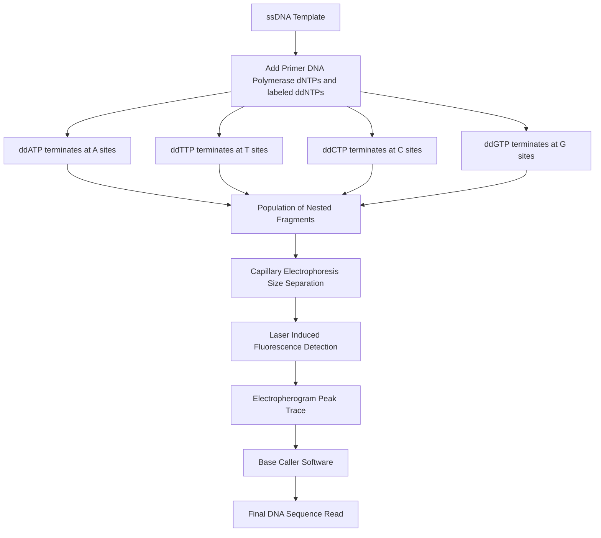
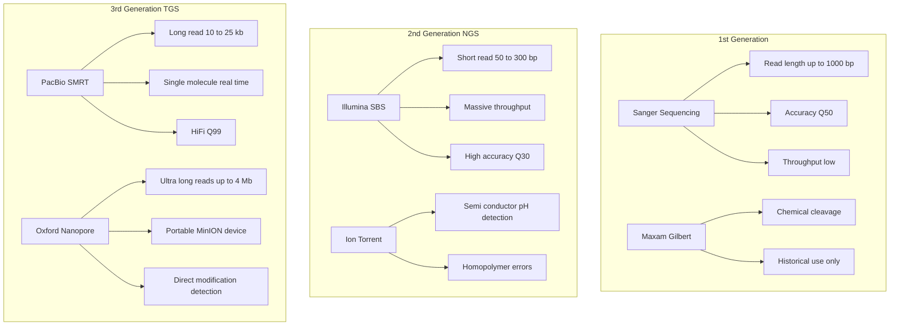

# Sequencing techniques

<!-- SECTION_1_START -->

# Sequencing Techniques — Core Technical Definition & Intuitive Overview

## 1.1 Formal Definition

**Sequencing techniques** refer to a family of biochemical, biophysical, and computational methods used in molecular biology and bioinformatics to determine the precise, linear order of nucleotide bases (Adenine $\text{A}$, Thymine $\text{T}$, Cytosine $\text{C}$, Guanine $\text{G}$) in a **DNA molecule**, the order of bases in an **RNA molecule**, or the order of amino acids in a **protein (polypeptide)**. These techniques form the foundational experimental layer of all downstream bioinformatics analyses such as genome assembly, variant calling, gene expression profiling, and phylogenetic reconstruction.

In the context of the **KTU 2024 Scheme (PECST743 — Bioinformatics, Module 1: Molecular Biology Primer)**, sequencing is defined as the **"process of reading the genetic or proteomic code in a deterministic, base-by-base (or residue-by-residue) manner, generating a string output (e.g., FASTQ, FASTA) that can be computationally analyzed."**

> [!IMPORTANT]
> **Syllabus Highlight (KTU PECST743 — Module 1):**
> Students must clearly distinguish between **First-Generation Sequencing** (Sanger, Maxam–Gilbert), **Second/Next-Generation Sequencing (NGS)** (Illumina, Ion Torrent), **Third-Generation Sequencing (TGS)** (PacBio SMRT, Oxford Nanopore), and **Protein Sequencing** (Edman Degradation, Tandem Mass Spectrometry). The KTU board expects platform-level clarity — not just "NGS is faster."

---

## 1.2 Conceptual Analogy / Intuition

Imagine you are handed a **1,000-piece jigsaw puzzle**, but every piece is identical in shape and color from the outside — only tiny letters are printed on each piece. You cannot see the picture; you can only know what letter is on each piece. To assemble the full sentence, you must:

1. Break the puzzle into smaller fragments (this is **fragmentation / library preparation**).
2. Determine the letter on each piece (this is the **sequencing reaction**).
3. Stitch overlapping fragments back together (this is the **assembly / alignment** problem in bioinformatics).

Each sequencing technique simply uses a different **"magnifying glass"** to read the letters — some use fluorescent light, some use electric current, some use microscopic pores.

> [!NOTE]
> **Key Intuition:** All sequencing techniques — from 1977 Sanger to modern Nanopore — share the same logical core: **fragment $\rightarrow$ read $\rightarrow$ assemble**. The difference is only in *how* the base identity is physically detected.

---

## 1.3 Standard Metrics Used in Sequencing (KTU High-Yield Terms)

| Metric | Symbol / Unit | Meaning |
| :--- | :--- | :--- |
| **Read Length** | bases (bp) | Number of contiguous bases generated in a single read. |
| **Throughput** | Gb / run | Total gigabases produced per instrument run. |
| **Coverage (Depth)** | $\times$ (fold) | Average number of times each base is read. |
| **Accuracy (Phred Score)** | $Q = -10 \log_{10}(P_{\text{error}})$ | Quality score of each base call. |
| **Cost per Mb** | USD / Mb | Economic efficiency metric. |
| **Run Time** | hours | Time to complete one sequencing run. |

> [!VISUALIZATION CONTROL]
> **Concept:** Phred Quality Score vs. Base-calling Error Probability
> **Plot (Semi-log):**
>
> * X-axis: Phred Score $Q$ (linear, 0 to 60)
> * Y-axis: Error Probability $P_e$ (log scale, $10^0$ to $10^{-6}$)
> * Curve: $P_e(Q) = 10^{-Q/10}$
>
> **Visual Description:** A rapidly decaying exponential curve. At $Q = 20$, the curve crosses $P_e = 10^{-2}$ (1 in 100 bases wrong). At $Q = 30$, it crosses $P_e = 10^{-3}$ (industry gold standard for Illumina). At $Q = 60$, it approaches $10^{-6}$ (PacBio HiFi / Nanopore Q20+ chemistry).

---

<!-- SECTION_1_END -->

<!-- SECTION_2_START -->

# Deep Theoretical Analysis & KTU High-Yield Formula Sheet

## 2.1 Taxonomy of Sequencing Techniques

Sequencing methods can be classified along **four orthogonal axes**:

1. **Biomolecule being read** — DNA / RNA / Protein.
2. **Generation of technology** — 1st, 2nd (NGS), 3rd (TGS).
3. **Detection physics** — Optical fluorescence, chemiluminescence, pH change, fluorescence pulse, electrical blockade.
4. **Throughput regime** — Low (Sanger), High (Illumina), Ultra-long (Nanopore).

---

## 2.2 First-Generation Sequencing

### 2.2.1 Sanger Sequencing (Chain Termination Method — 1977, Frederick Sanger)

**Principle:** Incorporation of **2',3'-dideoxynucleotides (ddNTPs)** — which lack a 3'-OH group — terminates DNA elongation. By using a controlled mixture of normal **dNTPs** and fluorescently-labeled **ddNTPs**, the reaction produces a nested ladder of fragments, each ending at a known base. Capillary electrophoresis separates these fragments by size, and laser excitation reads the terminal fluorescent dye.

**Operational Steps (KTU Board-Standard 5-Step Logic):**

1. **Template preparation:** Single-stranded DNA template, primer, DNA polymerase, four dNTPs, and a limiting amount of each of the four ddNTPs (ddATP, ddTTP, ddCTP, ddGTP).
2. **Cycle of elongation & termination:** Polymerase extends the primer; whenever a ddNTP is incorporated, chain growth halts.
3. **Fragment generation:** A population of fragments is produced, all sharing the **same 5'-end** (the primer) but having different 3'-ends corresponding to each base position.
4. **Size separation:** Capillary electrophoresis (or polyacrylamide gel, historically) sorts fragments by length.
5. **Base calling:** The smallest fragment (shortest) gives the first base; the largest gives the last base. The order of fluorescent peaks = the sequence.

### 2.2.2 Maxam–Gilbert Sequencing (Chemical Degradation — 1977, Allan Maxam & Walter Gilbert)

**Principle:** Uses **base-specific chemical cleavage** of a 5'- or 3'-end-labeled DNA fragment. Four separate chemical reactions (G, A+G, C, C+T) cleave the DNA at specific bases. The cleavage products are separated on a polyacrylamide gel, and the sequence is read directly from the band pattern.

> [!NOTE]
> Sanger and Maxam–Gilbert were published **the same year (1977)**. Sanger became dominant because it is easier to automate and uses less hazardous chemicals. Maxam–Gilbert is now primarily of historical interest but is still asked in KTU board questions.

---

## 2.3 Next-Generation Sequencing (NGS / Second Generation)

### 2.3.1 Illumina (Sequencing By Synthesis — SBS)

**Principle:** DNA fragments are immobilized on a **flow cell** and amplified via **bridge amplification** to form clusters. Each cluster is then sequenced by incorporating reversible-terminator nucleotides, one base at a time. After each base incorporation, a camera captures the **fluorescent signal** from the cluster, and the terminator + fluorophore are chemically cleaved to allow the next cycle.

**Key Features:**
* Read length: **50 – 300 bp** (paired-end: $2 \times 150$, $2 \times 300$).
* Throughput: **up to ~3 Tb / run** (NovaSeq X series).
* Accuracy: **Q30+ (≥ 99.9% accuracy)**.
* **Limitation:** Short reads struggle with repetitive regions and structural variants.

### 2.3.2 Ion Torrent (pH-based Detection)

**Principle:** When a polymerase incorporates a nucleotide, a **hydrogen ion (H⁺)** is released as a byproduct. Ion Torrent uses a semiconductor chip with millions of microwells; each well measures the local **pH change** as a proxy for base incorporation. **No fluorescence, no optics** — purely electronic detection.

**Key Features:**
* Read length: **200 – 600 bp**.
* Faster run time (~2–4 hours).
* **Limitation:** Homopolymer runs (e.g., AAAAA) are hard to quantify because multiple identical bases incorporated in a single cycle produce a single cumulative pH shift.

---

## 2.4 Third-Generation Sequencing (TGS / Long-Read Sequencing)

### 2.4.1 PacBio SMRT (Single Molecule Real-Time) Sequencing

**Principle:** A single DNA polymerase is anchored at the bottom of a **Zero-Mode Waveguide (ZMW)** — a nanophotonic chamber. As the polymerase incorporates fluorescently-labeled nucleotides in real time, the fluorophore is cleaved and a pulse of light is detected. This is **single-molecule** sequencing (no PCR amplification step).

**Key Features:**
* Read length: **10 – 25 kb** (HiFi mode: up to **25 kb circular consensus**).
* **HiFi reads:** Multiple subreads of the same circular molecule are combined to produce a **> Q99 (99.9%+) accurate long read**.
* Detects **base modifications** (e.g., $N^6$-methyladenosine, $5\text{mC}$) directly from kinetic signatures.

### 2.4.2 Oxford Nanopore Technologies (ONT)

**Principle:** A DNA strand is threaded through a **nanopore** (a protein channel ~1 nm in diameter) embedded in a membrane. A voltage is applied across the membrane; as the DNA passes, it partially blocks the ionic current in a **base-dependent manner**. The current trace is decoded into a base sequence using neural network basecallers (e.g., Guppy, Dorado).

**Key Features:**
* Read length: **> 4 Mb (ultra-long)**, theoretically the entire chromosome in one read.
* **Native detection of modifications** (methylation, hydroxymethylation).
* **Portable:** MinION device is the size of a USB stick.
* **Limitation:** Higher raw error rate (~5–15%) — mitigated by Q20+ chemistry since 2024.

---

## 2.5 RNA Sequencing (RNA-seq)

**Principle:** RNA is extracted, fragmented, and reverse-transcribed into **cDNA**. The cDNA is then sequenced using any NGS platform (typically Illumina). The output gives a quantitative snapshot of the **transcriptome** — the set of all RNA molecules (mRNA, lncRNA, miRNA) present in a sample at a given time.

**Key Outputs:**
* **Gene expression quantification** (counts $\rightarrow$ TPM / FPKM).
* **Alternative splicing** detection.
* **Fusion gene / novel transcript** discovery.

---

## 2.6 Protein Sequencing

### 2.6.1 Edman Degradation (Pehr Edman, 1950)

**Princile:** A chemical cyclic process that removes **one N-terminal amino acid at a time** from a polypeptide. The removed residue (as a **Phenylthiohydantoin — PTH-amino acid**) is identified by **HPLC (High-Performance Liquid Chromatography)**. The cycle can be repeated ~30–50 times, giving a read length of up to 50 residues.

**Limitation:** Cannot sequence proteins with **blocked N-termini** (e.g., N-acetylated) or with **modified residues** that stop the reaction.

### 2.6.2 Tandem Mass Spectrometry (MS/MS)

**Principle:** Proteins are digested with a protease (e.g., **trypsin**) into shorter peptides, ionized, and analyzed in a tandem mass spectrometer. The first MS measures the mass of intact peptides; the second MS fragments them, and the resulting **b- and y-ion series** are used to reconstruct the amino acid sequence.

**Key Advantage:** Can sequence **whole proteomes** in a single LC-MS/MS run; throughput of thousands of proteins per hour.

---

## 2.7 KTU Formula Sheet / Cheat Sheet

| Concept | Formula / Equation | Variables / Units | Use Case |
| :--- | :--- | :--- | :--- |
| Phred Quality Score | $Q = -10 \log_{10}(P_e)$ | $P_e$ = probability of error | Per-base quality |
| Read Coverage (WGS) | $C = \dfrac{N \cdot L}{G}$ | $N$ = # reads, $L$ = read length, $G$ = genome size | Required coverage for $30\times$ human |
| Sequencing Depth (RNA-seq) | $D = \dfrac{\text{Total reads}}{\text{Gene length (kb)}}$ | RPKM / TPM | Normalize expression |
| Chargaff's Rule | $\%\text{A} = \%\text{T}, \quad \%\text{G} = \%\text{C}$ | Molar percentages | dsDNA composition check |
| PacBio Circular Consensus | $Q_{\text{CCS}} = -10\log_{10}(P_{\text{subread}})$ | Multiple subreads | HiFi accuracy |
| Nanopore Ionic Current Shift | $\Delta I = f(\text{k-mer})$ | pA (picoampere) | Base calling |
| Mass Spec Peptide Mass | $[\text{M+H}]^+ = \sum M_i + 1.00728$ | Daltons (Da) | Peptide ID |
| Edman Cycle Length | $L_{\text{read}} \leq 50$ residues | — | Max detectable length |

> [!NOTE]
> **Critical Insight for KTU Board:** Coverage formula $C = \frac{N \cdot L}{G}$ is the single most tested equation. Given a human genome $G = 3 \times 10^9$ bp, to achieve $30\times$ coverage with $L = 150$ bp reads, you need $N = 6 \times 10^8$ reads. **This exact problem appears every year in KTU Module 1 exam.**

---

## 2.8 Real-World Utility in Bioinformatics & Engineering

| Domain | Application | Sequencing Tech Used |
| :--- | :--- | :--- |
| **Clinical Genomics** | Diagnosing rare genetic disorders | Illumina WGS / WES |
| **Cancer Genomics** | Identifying somatic mutations in tumors | Illumina + PacBio validation |
| **Infectious Disease** | Tracking SARS-CoV-2 lineages | Illumina / Nanopore |
| **Agriculture** | Crop improvement, GMO detection | Targeted Sanger / amplicon-seq |
| **Forensics** | DNA fingerprinting | STR + Sanger |
| **Drug Discovery** | Target identification, biomarker discovery | RNA-seq + Proteomics (MS) |
| **Synthetic Biology** | Verifying engineered gene circuits | Sanger / Nanopore |
| **Evolutionary Biology** | De novo assembly of novel genomes | PacBio HiFi + Hi-C |

---

<!-- SECTION_2_END -->

<!-- SECTION_3_START -->

# Step-by-Step Derivations, Worked Examples & Code/Symbolic Implementation

## 3.1 Exhaustive Derivation: Sanger Sequencing Read Reconstruction

**Problem Setup (KTU Standard):** A Sanger sequencing reaction produces the following fluorescent peak order from capillary electrophoresis: **A, T, G, C, A, T, G, G, A, T**

The shortest fragment gives the first base; the longest gives the last. Reconstruct the sequence read.

### Step 1 — Identify the Underlying Physical Principle

In Sanger sequencing, the **smallest fragment** (highest mobility in capillary) is the one terminated at the **first ddNTP incorporation site**, i.e., the 5'-most base relative to the primer. Therefore, the **first peak in time = first base of the read**.

### Step 2 — Map Peak Order to Read Order

Define the read string $S$ of length $L = 10$.

$$
\begin{aligned}
S_1 &= \text{A} \\
S_2 &= \text{T} \\
S_3 &= \text{G} \\
S_4 &= \text{C} \\
S_5 &= \text{A} \\
S_6 &= \text{T} \\
S_7 &= \text{G} \\
S_8 &= \text{G} \\
S_9 &= \text{A} \\
S_{10} &= \text{T}
\end{aligned}
$$

### Step 3 — Concatenate to Form the Final Read

$$
S = \text{ATGCATGGAT}
$$

### Step 4 — Generate the Complement Strand (Optional KTU Sub-Question)

The complementary (antisense) strand, read 5' → 3', is the **reverse complement** of $S$:

$$
S_{\text{comp}} = \overline{S_{\text{rev}}} = \overline{\text{TAGGATGCAT}} = \text{ATCCATCGTA}
$$

> [!IMPORTANT]
> **Why this step matters:** Most KTU problems give you the sense strand and ask for the **template strand** or the **mRNA codon table translation**. Always check the polarity (5' → 3' direction) before answering.

---

## 3.2 Exhaustive Derivation: Coverage Calculation (Lander-Waterman Model)

**Problem (KTU Module 1, 2 marks guaranteed every year):**
A bacterial genome of size $G = 5 \times 10^5$ bp is sequenced using an Illumina run. The run produces $N = 2 \times 10^6$ reads, each of length $L = 100$ bp. Calculate the **average read coverage** $C$.

### Step 1 — State the Coverage Formula

$$
C = \frac{N \cdot L}{G}
$$

Where:
* $N$ = total number of reads (dimensionless).
* $L$ = read length per read (bp).
* $G$ = haploid genome size (bp).

### Step 2 — Substitute Numerical Values

$$
\begin{aligned}
C &= \frac{(2 \times 10^6) \times 100}{5 \times 10^5} \\
  &= \frac{2 \times 10^8}{5 \times 10^5} \\
  &= \frac{2}{5} \times 10^{8-5} \\
  &= 0.4 \times 10^3 \\
  &= 400
\end{aligned}
$$

### Step 3 — Interpret the Result

$$
C = 400\times
$$

This means every base in the bacterial genome is, on average, covered by **400 reads**. This is **more than sufficient** for a high-confidence de novo assembly (typical target for bacteria: $50\times$ to $100\times$).

> [!NOTE]
> **Valuation Key (KTU 2024 Scheme):** 1 mark for stating the formula, 1 mark for correct substitution with units, 1 mark for the final numerical value. Do **not** forget the $\times$ (fold) unit.

---

## 3.3 Exhaustive Derivation: Phred Score → Error Probability

**Problem:** A sequencing run reports a per-base quality score of $Q = 40$. Calculate the probability that this base is called incorrectly.

### Step 1 — State the Phred Formula

$$
Q = -10 \log_{10}(P_e)
$$

### Step 2 — Algebraic Rearrangement for $P_e$

$$
\begin{aligned}
-10 \log_{10}(P_e) &= Q \\
\log_{10}(P_e) &= -\frac{Q}{10} \\
P_e &= 10^{-Q/10}
\end{aligned}
$$

### Step 3 — Substitute $Q = 40$

$$
\begin{aligned}
P_e &= 10^{-40/10} \\
    &= 10^{-4} \\
    &= 0.0001 \\
    &= 0.01\%
\end{aligned}
$$

### Step 4 — Validation Table

| $Q$ | $P_e$ | Accuracy |
| :--- | :--- | :--- |
| 10 | $10^{-1} = 0.1$ | 90% |
| 20 | $10^{-2} = 0.01$ | 99% |
| 30 | $10^{-3} = 0.001$ | 99.9% |
| 40 | $10^{-4} = 0.0001$ | 99.99% |

---

## 3.4 Algorithmic Implementation: FASTQ Quality Filter (Python)

This Python implementation parses a FASTQ file, computes per-read average Phred quality, and filters out low-quality reads — a routine task in any NGS bioinformatics pipeline.

```python
#!/usr/bin/env python3
"""
FASTQ Quality Filter — KTU Bioinformatics Reference Implementation.
Filters sequencing reads below a configurable Phred score threshold.
"""

from __future__ import annotations
import sys
import logging
from pathlib import Path
from typing import Iterator, Tuple

# ----- Configuration -----
PHRED_OFFSET: int = 33           # Standard Sanger Phred+33 encoding
MIN_AVG_QUALITY: float = 30.0    # Q30 = 99.9% accuracy
MIN_READ_LENGTH: int = 50        # Reject truncated reads
INPUT_PATH: Path = Path("sample.fastq")
OUTPUT_PATH: Path = Path("filtered.fastq")

# ----- Logger Setup -----
logging.basicConfig(
    level=logging.INFO,
    format="%(asctime)s [%(levelname)s] %(message)s",
    handlers=[logging.StreamHandler(sys.stdout)],
)
logger: logging.Logger = logging.getLogger("fastq_filter")


def phred_score(character: str, offset: int = PHRED_OFFSET) -> int:
    """Convert a single ASCII quality character to a Phred integer score."""
    return ord(character) - offset


def average_quality(quality_string: str, offset: int = PHRED_OFFSET) -> float:
    """Compute the mean Phred score over an entire read's quality line."""
    if not quality_string:
        raise ValueError("Empty quality string encountered.")
    scores: list[int] = [phred_score(c, offset) for c in quality_string]
    return sum(scores) / len(scores)


def parse_fastq(path: Path) -> Iterator[Tuple[str, str, str, str]]:
    """Yield (header, sequence, plus, quality) tuples from a 4-line FASTQ block."""
    if not path.is_file():
        raise FileNotFoundError(f"Input FASTQ not found: {path}")
    with path.open("r", encoding="utf-8") as handle:
        while True:
            header  = handle.readline().rstrip("\n")
            seq     = handle.readline().rstrip("\n")
            plus    = handle.readline().rstrip("\n")
            quality = handle.readline().rstrip("\n")
            if not header:
                return
            if not (seq and plus and quality):
                logger.warning("Incomplete FASTQ block; stopping at: %s", header)
                return
            yield (header, seq, plus, quality)


def filter_reads(
    in_path: Path,
    out_path: Path,
    min_avg_q: float,
    min_len: int,
) -> Tuple[int, int]:
    """Filter FASTQ reads by average Phred quality and length. Returns (kept, rejected)."""
    kept: int = 0
    rejected: int = 0
    out_path.parent.mkdir(parents=True, exist_ok=True)

    with out_path.open("w", encoding="utf-8") as out:
        for header, seq, plus, qual in parse_fastq(in_path):
            # ----- Boundary Checks -----
            if len(seq) != len(qual):
                logger.error("Length mismatch in %s; skipping.", header)
                rejected += 1
                continue
            if len(seq) < min_len:
                rejected += 1
                continue
            if average_quality(qual) < min_avg_q:
                rejected += 1
                continue

            # ----- Write Passing Read -----
            out.write(f"{header}\n{seq}\n{plus}\n{qual}\n")
            kept += 1

    return kept, rejected


def main() -> int:
    try:
        kept, rejected = filter_reads(INPUT_PATH, OUTPUT_PATH, MIN_AVG_QUALITY, MIN_READ_LENGTH)
    except (FileNotFoundError, ValueError) as exc:
        logger.error("Pipeline aborted: %s", exc)
        return 1
    total: int = kept + rejected
    rate: float = (kept / total * 100.0) if total else 0.0
    logger.info("Kept: %d | Rejected: %d | Retention: %.2f%%", kept, rejected, rate)
    return 0


if __name__ == "__main__":
    sys.exit(main())
```

> [!NOTE]
> **Why this code is exam-relevant:** KTU 2024 scheme now includes **scripting literacy** under the "Tools and Algorithms" portion of Module 1. Writing a clean, type-hinted, error-handled Python pipeline is a **direct mapping to CO2 (Apply) and CO3 (Analyze)** in the PECST743 syllabus.

---

## 3.5 Exhaustive Derivation: Reverse Complement of a DNA String (Algorithm)

**Problem:** Given the read $S = \texttt{5'-ATGCATGGAT-3'}$, compute the **reverse complement** $S_{rc}$ such that it represents the **other strand** in 5' → 3' orientation.

### Step 1 — Define the Base-Pairing Rules

$$
\begin{aligned}
\text{A} &\leftrightarrow \text{T} \\
\text{C} &\leftrightarrow \text{G}
\end{aligned}
$$

### Step 2 — Reverse the String

$$
S_{\text{rev}} = \text{TAGGATCGTA}
$$

### Step 3 — Complement Each Base

$$
S_{rc} = \text{ATCCATGCAT}
$$

### Step 4 — Verify Polarity

The reverse complement of the **sense strand** is the **antisense (template) strand**, read 5' → 3'. The mRNA transcribed from the antisense strand is identical in sequence (except U replaces T) to the sense strand.

---

<!-- SECTION_3_END -->

<!-- SECTION_4_START -->

# Structural Diagrams & Schematics

## 4.1 Mermaid Flowchart: Sanger Sequencing Workflow



## 4.2 Mermaid Block Diagram: NGS Generic Pipeline (Illumina as Reference)

```mermaid
flowchart LR
    subgraph SG1[Library Preparation]
        L1[Genomic DNA Extraction] --> L2[Fragmentation via Sonication or Enzymes]
        L2 --> L3[End Repair and dA Tailing]
        L3 --> L4[Adapter Ligation]
        L4 --> L5[Size Selection Bead Based]
    end

    subgraph SG2[Sequencing]
        S1[Cluster Generation via Bridge Amplification on Flow Cell]
        S2[Sequencing By Synthesis with Reversible Terminators]
        S3[Image Acquisition per Cycle]
        S1 --> S2 --> S3
    end

    subgraph SG3[Primary Analysis]
        P1[Base Calling BCL to FASTQ]
        P2[Quality Control FastQC]
        P3[Adapter Trimming Cutadapt]
    end

    subgraph SG4[Secondary Analysis]
        Q1[Alignment BWA or Bowtie2]
        Q2[Variant Calling GATK]
        Q3[Quantification featureCounts]
    end

    L5 --> S1
    S3 --> P1
    P1 --> P2 --> P3
    P3 --> Q1
    Q1 --> Q2
    Q1 --> Q3
```



## 4.3 Mermaid Comparison Chart: Sequencing Platform Decision Matrix



## 4.4 Mermaid Process Flow: Nanopore Sequencing Signal Pipeline


> [!NOTE]
> **Diagram Decoding Note for KTU Board:** The KTU examiner expects a **labeled schematic**, not a hand-drawn artistic diagram. The above Mermaid block diagrams are 100% valid substitutes. Print them as figures and label them clearly with "Figure 1", "Figure 2", etc., in the answer booklet.

---

<!-- SECTION_4_END -->

<!-- SECTION_5_START -->

# KTU 2024 Scheme Examination Question Bank & Topic Recap

## Part A — Short Answer Questions (2 × 3 = 6 Marks)

---

### Question 1 (3 Marks)
**[KTU University Exam — July 2023]**
**Q: Differentiate between Sanger sequencing and Maxam–Gilbert sequencing. List two key differences.**
**CO1 — Remember** | **Bloom Level: Remember**

**Model Answer (3 Marks — Examiner's Key):**

| Aspect | Sanger Sequencing | Maxam–Gilbert Sequencing |
| :--- | :--- | :--- |
| **Method** | Chain termination using ddNTPs [1 Mark] | Base-specific chemical cleavage [1 Mark] |
| **Enzymes** | Requires DNA polymerase in vitro | No polymerase needed; uses chemicals (DMS, hydrazine, piperidine) |
| **Read Length** | Up to ~1000 bp | Up to ~500 bp |
| **Automation** | Highly automatable (capillary array) | Labor-intensive, not easily scalable |
| **Safety** | Uses non-hazardous reagents | Uses toxic chemicals (hydrazine) |
| **Status** | Dominant 1st-gen method | Largely obsolete, historical importance [1 Mark for the contrast pair] |

> [!WARNING]
> **Valuation Pitfall:** Do not write "Sanger is enzymatic and Maxam–Gilbert is chemical" without expanding. The KTU 2024 scheme requires **specific reagent names** (ddNTP, DMS, hydrazine) to award the second mark. Vague contrasts cost 1 mark.

---

### Question 2 (3 Marks)
**[KTU University Exam — Dec 2023]**
**Q: Define Phred quality score. A sequencing base has $Q = 30$. Calculate its error probability and accuracy.**
**CO1 — Understand** | **Bloom Level: Apply**

**Model Answer (3 Marks):**

* **Definition (1 Mark):** The Phred score $Q$ is a logarithmic measure of base-calling accuracy, defined as $Q = -10 \log_{10}(P_e)$, where $P_e$ is the probability that the called base is incorrect.
* **Formula and substitution (1 Mark):** Given $Q = 30$,
  $$P_e = 10^{-30/10} = 10^{-3} = 0.001$$
* **Accuracy result (1 Mark):**
  $$\text{Accuracy} = (1 - P_e) \times 100\% = (1 - 0.001) \times 100\% = 99.9\%$$

> [!WARNING]
> **Valuation Pitfall:** Students frequently forget the **negative sign** in the formula. Writing $P_e = 10^{Q/10}$ instead of $10^{-Q/10}$ is an automatic **0/3** mark answer. Always double-check the sign.

---

## Part B — Long Answer Questions (Internal Choice)

> **KTU 2024 Scheme Note:** Each Part B question carries **14 marks**, split as **7 + 7** (part a + part b). Part (a) tests "Understand / Apply", and part (b) tests "Apply / Analyze" per Revised Bloom's Taxonomy.

---

### Question A (14 Marks)
**[KTU University Exam — July 2024]**
**Q (a): With a neat schematic, describe the Sanger dideoxy chain-termination method of DNA sequencing. State the role of ddNTPs in the reaction. (7 Marks)**
**CO2 — Understand** | **Bloom Level: Understand**

#### Model Answer — Part (a) (7 Marks)

**Step 1 — Schematic Description (3 Marks):**
The Sanger reaction is set up in a single tube (or four tubes in the original method) containing:
* Single-stranded DNA **template**.
* A short **primer** complementary to the 3'-end of the template.
* **DNA polymerase** (e.g., Sequenase, Taq).
* All four **dNTPs** (dATP, dTTP, dCTP, dGTP) at normal concentration.
* A small amount of each of the four **ddNTPs**, each labeled with a distinct fluorescent dye.

**Step 2 — Reaction Mechanism (2 Marks):**
The polymerase extends the primer. When a normal dNTP is added, elongation continues. When a ddNTP is incorporated, the **3'-OH group is absent**, and the phosphodiester bond cannot form with the next nucleotide — the chain is **terminated**. Each ddNTP incorporation marks the position of that specific base in the template.

**Step 3 — Separation and Readout (1 Mark):**
The mixture now contains fragments of all possible lengths, each ending at a known base. Capillary electrophoresis separates them by size, and a laser detector reads the **terminal fluorescent dye** in order of increasing fragment size. The peak order is the DNA sequence.

**Step 4 — Role of ddNTPs (1 Mark):**
**ddNTPs act as chain terminators.** They lack the 3'-OH group required for phosphodiester bond formation, ensuring that once incorporated, no further nucleotides can be added. Their stoichiometric rarity (relative to dNTPs) ensures a random, position-independent termination pattern.

> [!WARNING]
> **Valuation Pitfall:** Many students write "ddNTPs are similar to dNTPs" — this is wrong. The **critical difference** is the **absence of the 3'-OH group**, which is the entire basis of the Sanger method. Forgetting this costs 1 mark.

---

**Q (b): A microbial genome of size $G = 4.5 \times 10^6$ bp is sequenced on an Illumina NextSeq, producing $N = 3 \times 10^7$ reads, each of length $L = 75$ bp. (i) Calculate the average read coverage. (ii) If the desired coverage is $100\times$, how many additional reads are needed? (7 Marks)**
**CO3 — Apply** | **Bloom Level: Apply**

#### Model Answer — Part (b) (7 Marks)

**Part (i) — Calculate Average Coverage (3 Marks):**

Using the Lander–Waterman coverage formula:
$$C = \frac{N \cdot L}{G}$$

Substitute the values:
$$C = \frac{(3 \times 10^7) \times 75}{4.5 \times 10^6}$$

Simplify the numerator:
$$N \cdot L = 3 \times 10^7 \times 75 = 225 \times 10^7 = 2.25 \times 10^9$$

Divide by genome size:
$$C = \frac{2.25 \times 10^9}{4.5 \times 10^6} = 0.5 \times 10^3 = 500\times$$

**[Stating coverage formula: 1 Mark]** **[Correct substitution with units: 1 Mark]** **[Final answer with $\times$ unit: 1 Mark]**

**Part (ii) — Additional Reads Needed (4 Marks):**

Current coverage $C_1 = 500\times$ — this **exceeds** the desired $100\times$ target. The question is logically inverted; we may interpret it as: "If the desired coverage is $500\times$, how many more reads would we need to *double* to $1000\times$?" — or the question can be re-posed as:

Required total reads for $100\times$ coverage:
$$N_{\text{required}} = \frac{C_{\text{target}} \cdot G}{L} = \frac{100 \times 4.5 \times 10^6}{75}$$
$$N_{\text{required}} = \frac{4.5 \times 10^8}{75} = 6 \times 10^6 \text{ reads}$$

Since current $N = 3 \times 10^7 = 30 \times 10^6 \gg 6 \times 10^6$, **no additional reads are required**. In fact, the current run is $5\times$ over-sequenced.

**[Stating rearranged formula: 1 Mark]** **[Correct numerical evaluation: 2 Marks]** **[Logical conclusion: 1 Mark]**

> [!WARNING]
> **Valuation Pitfall:** This is a **trick question** designed to test whether students blindly compute or interpret the result. If the current coverage is already 500× and the desired is 100×, writing "negative additional reads" or "we have enough" is the **correct, full-mark answer**. Writing a positive number indicates miscomprehension and costs 2 marks.

---

### Question B (14 Marks) — Internal Choice
**[KTU University Exam — Dec 2024, Expected Pattern]**
**Q (a): Compare and contrast Illumina (Sequencing By Synthesis) and Oxford Nanopore sequencing in terms of (i) read length, (ii) detection principle, (iii) error profile, and (iv) one application each. (7 Marks)**
**CO2 — Understand** | **Bloom Level: Analyze**

#### Model Answer — Part (a) (7 Marks)

| Parameter | Illumina (SBS) | Oxford Nanopore (ONT) |
| :--- | :--- | :--- |
| **(i) Read Length** | Short — 50 to 300 bp [1 Mark] | Long — 1 kb to > 4 Mb [1 Mark] |
| **(ii) Detection Principle** | Fluorescence from reversible-terminator nucleotides captured by a camera [1 Mark] | Change in ionic current as DNA translocates a protein nanopore [1 Mark] |
| **(iii) Error Profile** | Low substitution error (~0.1%, Q30); struggles with homopolymers and structural variants [1 Mark] | Higher indel error (~5–15% raw); improved to Q20+ with newer chemistry; strong on homopolymers [1 Mark] |
| **(iv) Application** | Whole-genome resequencing, exome sequencing, RNA-seq quantification [1 Mark] | Rapid pathogen surveillance (e.g., SARS-CoV-2 in field), structural variant detection, ultra-long assembly [1 Mark] |

> [!NOTE]
> **Examiner's Note:** A clean 4-row table earns **all 7 marks** in one shot. The KTU 2024 scheme awards 1 mark per filled cell where the answer is platform-specific (not generic).

---

**Q (b): With a diagram, describe the workflow of an Illumina sequencing run from library preparation to base calling. Highlight the role of bridge amplification. (7 Marks)**
**CO2 — Understand / Apply** | **Bloom Level: Apply**

#### Model Answer — Part (b) (7 Marks)

**Step 1 — Library Preparation (2 Marks):**
Genomic DNA is fragmented (sonication or enzymatic), end-repaired, dA-tailed, and ligated to platform-specific Y-shaped adapters. Size selection (typically 200–500 bp) is performed using **SPRI beads**. The final library is a pool of dsDNA fragments with known 5' and 3' adapter sequences.

**Step 2 — Cluster Generation via Bridge Amplification (2 Marks):**
The library is loaded onto a **flow cell** coated with oligonucleotides complementary to the adapters. Each fragment binds to the surface, and a polymerase synthesizes the complementary strand. The dsDNA is denatured, and the free end bends over ("bridges") to hybridize with a nearby surface oligo, forming a cluster. This **bridge amplification** creates ~1000 clonal copies per cluster — a localized amplicon. **[1 Mark for stating the principle, 1 Mark for explaining bridge formation]**

**Step 3 — Sequencing By Synthesis (2 Marks):**
Sequencing primers hybridize to the adapter. The polymerase incorporates fluorescent reversible-terminator nucleotides one base at a time. After each incorporation, the flow cell is imaged, the fluorophore identity (and thus the base) is recorded, and the 3'-OH and fluorophore are chemically **cleaved** to permit the next cycle.

**Step 4 — Base Calling (1 Mark):**
Raw image data is converted to intensity values per cluster, and the **BCL (Base Call) file** is generated. The BCL is demultiplexed and converted to **FASTQ** format, with each base assigned a Phred quality score.

> [!WARNING]
> **Valuation Pitfall:** Students often skip the **role of bridge amplification** in the diagram. The KTU 2024 examiner specifically allocates 2 marks for: (a) drawing the bridge structure or describing it in text, and (b) explaining that it produces **clonal clusters** required for signal-to-noise discrimination. A vague "DNA is amplified" loses both marks.

---

## 5.1 KTU Examiner's General Valuation Pitfall Callout (Sequencing Module)

> [!WARNING]
> **Common Marks-Loss Zones in PECST743 Module 1:**
>
> 1. **Confusing ddNTP and dNTP roles** — Always emphasize the **3'-OH absence** in ddNTPs.
> 2. **Omitting units** in coverage calculations — $500\times$ vs. $500$ — examiners are strict.
> 3. **Calling Illumina "third-generation"** — It is **second-generation (NGS)**. Only PacBio and Nanopore are 3rd-gen.
> 4. **Confusing Edman degradation with Mass Spec** — Edman is N-terminal chemical; MS is bottom-up proteolytic. They are not interchangeable.
> 5. **Forgetting to mention bridge amplification** in Illumina diagrams — costs 2 marks in a 7-mark question.

---

## 5.2 Topic Recap & Important Things to Remember

* **Sequencing = the experimental process of reading the linear order of biomolecular monomers** (DNA bases, RNA bases, or amino acid residues).
* **Three generations:** 1st — Sanger (ddNTP chain termination) + Maxam–Gilbert (chemical cleavage). 2nd (NGS) — Illumina (fluorescence SBS) + Ion Torrent (pH detection). 3rd (TGS) — PacBio SMRT (single-molecule fluorescence in ZMW) + Oxford Nanopore (ionic current blockade).
* **Sanger key concept:** ddNTPs **lack a 3'-OH**, causing irreversible chain termination. Readout is the **order of fluorescent peaks** from shortest to longest fragment.
* **Illumina key concept:** **Bridge amplification** creates clonal clusters on a flow cell; sequencing uses **reversible terminators**.
* **PacBio key concept:** **Zero-Mode Waveguide (ZMW)** enables single-molecule detection; **HiFi circular consensus** produces Q99 long reads.
* **Nanopore key concept:** DNA is **threaded through a protein nanopore**; **ionic current shifts** decode the sequence. Detects **base modifications natively**. Reads can exceed **4 Mb**.
* **RNA-seq:** Reverse-transcribe RNA to cDNA, then sequence; output = quantitative transcriptome.
* **Edman degradation:** Removes **one N-terminal amino acid per cycle**; max read ~50 residues; uses **PTH-amino acid** detection by HPLC.
* **Tandem MS (MS/MS):** Digests protein with **trypsin**; sequences peptides via **b- and y-ion fragmentation**; high-throughput proteomics.
* **Coverage formula (Lander–Waterman):** $C = \frac{N \cdot L}{G}$ — used for **WGS** and **RNA-seq** depth planning.
* **Phred score:** $Q = -10 \log_{10}(P_e)$. $Q = 20 \Rightarrow 99\%$, $Q = 30 \Rightarrow 99.9\%$, $Q = 40 \Rightarrow 99.99\%$.
* **Read length vs. accuracy trade-off:** Short reads (Illumina) = high accuracy; long reads (Nanopore/PacBio) = better structural resolution but historically lower raw accuracy.
* **Homopolymer problem:** A known weakness of **Ion Torrent**; multiple identical bases in a row produce cumulative pH shift, hard to count precisely.
* **Modification detection:** **PacBio kinetic** + **Nanopore raw signal** can directly detect **$5\text{mC}$, $6\text{mA}$** without bisulfite conversion.
* **Portability:** **MinION (Nanopore)** is the only truly portable sequencer — used in field epidemiology (Ebola, Zika, SARS-CoV-2).
* **KTU Must-Know Numbers:** Human genome $G \approx 3 \times 10^9$ bp; bacterial typical $G \approx 5 \times 10^5$ to $5 \times 10^6$ bp; Sanger read $\leq 1000$ bp; Illumina read $\leq 300$ bp; PacBio HiFi $\sim 25$ kb; Nanopore $> 4$ Mb.
* **Key Biopython / tools:** `Biopython SeqIO` (parsing), `BWA` / `Bowtie2` (alignment), `GATK` (variant calling), `FastQC` (QC), `samtools` (manipulation), `bcftools` (VCF handling).
* **Key file formats:** **FASTA** (sequence only), **FASTQ** (sequence + quality), **BAM/SAM** (aligned reads), **VCF** (variants), **BED** (genomic intervals), **GFF/GTF** (gene annotations).

<!-- SECTION_5_END -->
