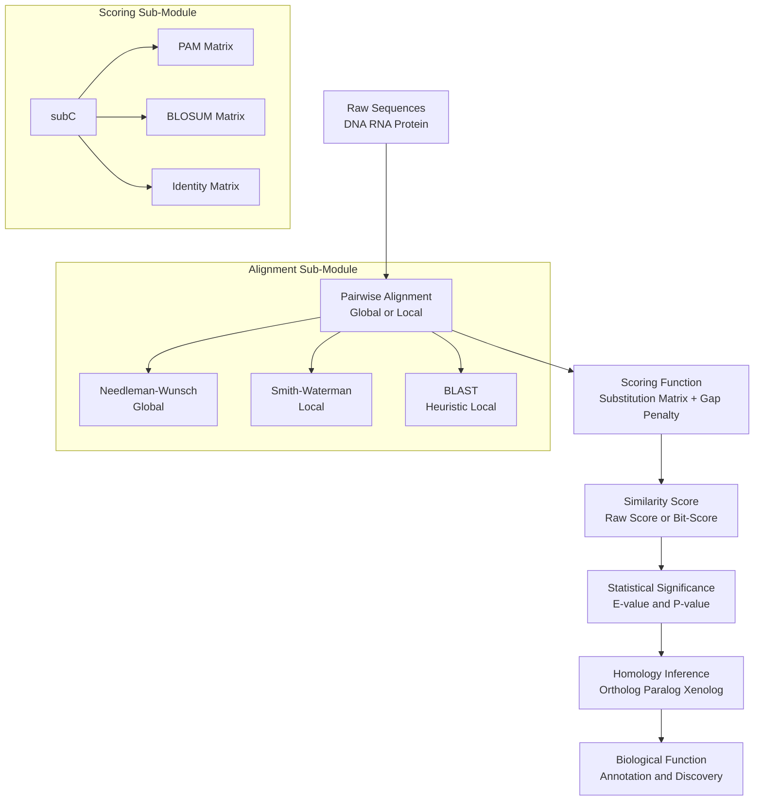
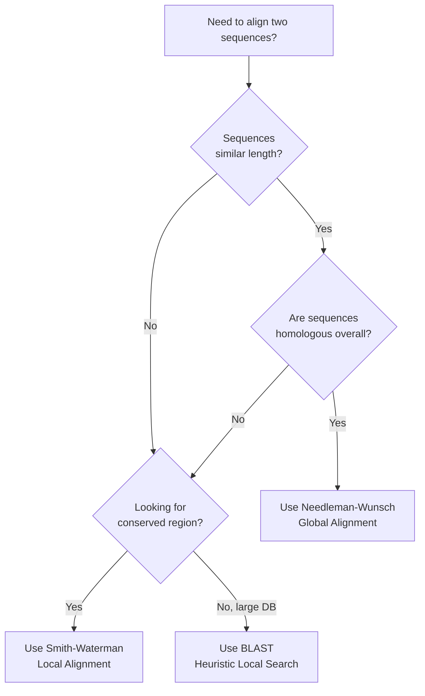
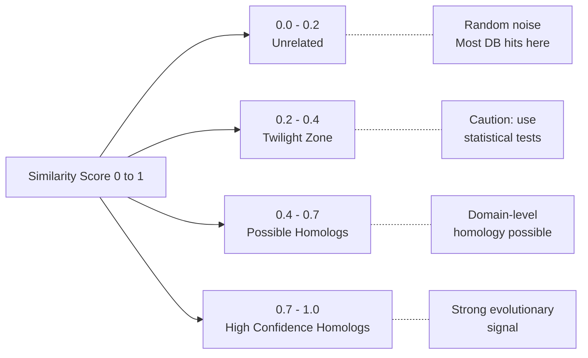

# similarity

<!-- SECTION_1_START -->
# Similarity in Bioinformatics

## 1. Core Technical Definition (KTU 2024 Syllabus Terminology)

> [!NOTE]
> **Sequence Similarity** is a quantitative measure that expresses the degree of likeness between two or more biological sequences (DNA, RNA, or protein) based on a defined scoring system, typically involving identity, conservative substitution, and gap penalties. It is the **numerical counterpart** of the qualitative concept of homology.

In the context of the KTU 2024 Scheme (PECST743 - Module 1: Molecular Biology Primer), similarity is formally defined as:

$$\text{Similarity}(S) = f(\text{matches}, \text{mismatches}, \text{gaps})$$

where the function $f$ depends on the chosen substitution scoring matrix (e.g., **PAM**, **BLOSUM**) and the gap penalty model (**linear** or **affine**).

### Key Distinction: Similarity vs. Homology

> [!IMPORTANT]
> **Similarity is a NUMBER; Homology is a STATEMENT.**
> Two sequences can have a similarity score of 80%, but they are either **homologous** (sharing a common evolutionary ancestor) or **not homologous** — there is no "80% homologous."

| Term | Nature | Quantifiable? | Example |
|---|---|---|---|
| Similarity | Numerical score | Yes | "78% similarity" |
| Identity | Exact matches only | Yes | "60% identical" |
| Homology | Evolutionary relationship | No (binary) | "They are homologs" |

---

## 2. Intuitive Analogy: The "Plagiarism Detector"

Imagine two **student essays** submitted to a plagiarism detector:

- **Identity** = Exact same words used at the same positions.
- **Similarity** = Same *meaning* expressed using different (but synonymous) words.
- **Homology** = The conclusion that one essay was copied or inspired by the other (or both share a common source).

In bioinformatics:
- The **essays** are biological sequences (DNA/Protein).
- The **plagiarism detector** is the alignment algorithm (e.g., Needleman-Wunsch, Smith-Waterman).
- The **synonymous words** correspond to **conservative substitutions** (e.g., Leucine ↔ Isoleucine — both hydrophobic).

> [!TIP]
> **Quick Intuition for the First-Time Learner:** Think of similarity as "how close two sequences look under a forgiving magnifying glass," while identity is "how close they look under a strict magnifying glass."

---

## 3. Physical & Mathematical Constants in Similarity Scoring

- **Gap Opening Penalty ($g_o$):** Typically **$-10$ to $-12$** (BLOSUM62 default).
- **Gap Extension Penalty ($g_e$):** Typically **$-1$ to $-4$** (affine penalty model).
- **Match Score (BLOSUM62):** Ranges from **$+13$ (Trp-Trp)** to **$-4$ (Asp-Arg mismatch)**.
- **Percent Identity Threshold for Homology Inference:** Generally $\geq$ **25–30%** over $\geq$ **100 amino acids** (the *twilight zone* begins below 20–25%).

> [!VISUALIZATION CONTROL]
> **Concept:** Similarity score distribution curve (Gaussian-like distribution of pairwise similarity scores in a database).
> **GeoGebra / Desmos Input Equations:**
> * `f(x) = (1/(sigma*sqrt(2*pi))) * exp(-((x-mu)^2)/(2*sigma^2))` with $\mu = 0.15$, $\sigma = 0.08$
> * `g(x) = 0.45 * exp(-((x-0.85)^2)/(2*0.04^2))` (right-shifted peak for true homologs)
> **Visual Description:** Two overlapping bell curves on the x-axis (similarity score 0 → 1). The left curve represents **unrelated sequences** (mean ≈ 0.15), the right curve represents **true homologs** (mean ≈ 0.85). The overlap region is the **twilight zone** where similarity-based homology inference becomes unreliable.

---

<!-- SECTION_1_END -->

<!-- SECTION_2_START -->
# Deep Theoretical Analysis & KTU High-Yield Formula Sheet

## 1. Hierarchy of Sequence Comparison

The bioinformatics concept of similarity follows a strict hierarchy:

1. **Raw Sequence Data** → obtained from sequencing.
2. **Pairwise Alignment** → arranging residues to maximize score.
3. **Scoring Function** → assigns numerical values to aligned positions.
4. **Similarity Score** → aggregate numerical output.
5. **Statistical Significance (E-value)** → probability that the score arose by chance.
6. **Homology Inference** → evolutionary conclusion (yes/no).

---

## 2. Components of a Similarity Score

A typical similarity score is decomposed as:

$$S_{\text{total}} = \sum_{i=1}^{n} s(a_i, b_i) + \sum_{j=1}^{g} g(j)$$

where:
- $s(a_i, b_i)$ = score of aligning residue $a_i$ with residue $b_i$ (from substitution matrix).
- $g(j)$ = penalty for the $j^{\text{th}}$ gap event.
- $n$ = number of aligned (non-gap) positions.
- $g$ = total number of gaps.

---

## 3. Types of Similarity

| Type | Definition | When Used |
|---|---|---|
| **Global Similarity** | Score over the *entire* length of both sequences | Sequences of equal length, full-length comparison (Needleman-Wunsch) |
| **Local Similarity** | Score over the *best-matching* sub-region | Finding conserved domains/motifs (Smith-Waterman, BLAST) |
| **Semiglobal Similarity** | One sequence fully aligned within the other | Detecting overlaps in sequence assembly |
| **End-Gap-Free Similarity** | Penalize internal gaps but not terminal ones | Prefix/suffix matching in reads |

---

## 4. Substitution Matrices (Scoring the "Mismatches")

> [!IMPORTANT]
> A **substitution matrix** encodes the biological likelihood that one amino acid (or nucleotide) can replace another during evolution while preserving function.

### A. Nucleotide Substitution Matrices

- **Match:** $+1$ or $+5$
- **Mismatch:** $-3$ or $-4$ (simple models) or **transversion/transition** weighted (e.g., Kimura 2-parameter)

### B. Protein Substitution Matrices (KTU High-Yield)

| Matrix | Based On | Best For |
|---|---|---|
| **PAM 250** | 250 million years of evolution | Distantly related proteins |
| **BLOSUM 62** | $\geq 62\%$ identity clusters | General-purpose local alignment (BLAST default) |
| **BLOSUM 80** | $\geq 80\%$ identity clusters | Closely related proteins |
| **GONNET** | Computationally derived | Comprehensive database searches |

---

## 5. KTU Formula Sheet (Cheat Sheet)

> [!NOTE]
> The following table is the **high-yield formula compendium** for KTU 2024 Scheme examinations. All boundary conditions and default constants are included.

| # | Concept | Formula | Default Constants | Units |
|---|---|---|---|---|
| 1 | Percent Identity | $\%I = \frac{\text{identical positions}}{\text{aligned length}} \times 100$ | — | Percentage (%) |
| 2 | Percent Similarity | $\%S = \frac{\text{identical} + \text{conservative}}{\text{aligned length}} \times 100$ | — | Percentage (%) |
| 3 | Raw Similarity Score | $S = \sum s_i + \sum g_j$ | — | Log-odds or bit-score |
| 4 | Affine Gap Penalty | $g(k) = g_o + (k-1) \cdot g_e$ | $g_o = -10$, $g_e = -1$ | Penalty units |
| 5 | Linear Gap Penalty | $g(k) = k \cdot g$ | $g = -8$ | Penalty units |
| 6 | Bit Score (BLAST) | $S' = \frac{\lambda S - \ln K}{\ln 2}$ | $\lambda$, $K$ are Karlin parameters | Bits |
| 7 | E-value | $E = K \cdot m \cdot n \cdot e^{-\lambda S}$ | $m, n$ = DB lengths | Dimensionless |
| 8 | Bit Score from E-value | $S' = \log_2 \left(\frac{mn}{E}\right)$ | — | Bits |
| 9 | Kimura 2-Parameter Distance | $K = -\frac{1}{2}\ln((1-2P-Q)\sqrt{1-2Q})$ | $P$=transitions, $Q$=transversions | Substitutions/site |
| 10 | PAM Acceptance | $1 \text{ PAM} = 1\%$ divergence | — | — |

> [!IMPORTANT]
> **Units Convention (KTU):** Similarity scores are *dimensionless*. Bit-scores are in **bits**. E-values are dimensionless counts. Substitution rates are in **substitutions per site**.

---

## 6. Real-World Engineering & Computational Utility

| Field | Application of Similarity |
|---|---|
| **Drug Discovery** | Identify off-target binding by similarity to known target proteins |
| **Vaccine Design** | Find conserved epitopes across viral strains |
| **Forensic Genomics** | DNA fingerprinting via STR similarity profiles |
| **Phylogenetics** | Reconstruct evolutionary trees from pairwise similarity matrices |
| **Genome Annotation** | Transfer gene function labels from characterized to uncharacterized sequences |
| **CRISPR Design** | Minimize off-target similarity with the rest of the genome |

---

<!-- SECTION_2_END -->

<!-- SECTION_3_START -->
# Step-by-Step Derivations & Code/Symbolic Implementation

## 1. Worked Example: Computing Percent Identity and Similarity (Step-by-Step)

> [!NOTE]
> **Problem (KTU-style):** Given the following aligned protein sequences with BLOSUM62 scoring, compute (a) the raw similarity score, (b) percent identity, and (c) percent similarity.

**Aligned Sequences (length = 10):**
- Seq A: `H E L L O _ W O R L D`  *(treating the gap as `_`)*
- Seq B: `H E L L A W O R L D`

**Substitution Matrix Scores (BLOSUM62 excerpt):**

| Pair | H-H | E-E | L-L | O-O | A-O (O↔A) | L-W | W-W | R-R |
|---|---|---|---|---|---|---|---|---|
| Score | $+8$ | $+5$ | $+4$ | $+7$ | $0$ (rare) | $-2$ | $+11$ | $+5$ |

> Conservatively, O↔A is considered a **non-conservative** mismatch (score = $-1$).

### Step 1: Identify Positions

| Position | 1 | 2 | 3 | 4 | 5 | 6 | 7 | 8 | 9 | 10 |
|---|---|---|---|---|---|---|---|---|---|---|
| Seq A | H | E | L | L | _ | W | O | R | L | D |
| Seq B | H | E | L | L | A | W | O | R | L | D |
| **Type** | Match | Match | Match | Match | Gap | Match | Match | Match | Match | Match |

- **Identical positions:** 9 (all except position 5, which is a gap).
- **Conservative substitutions:** 0.
- **Gaps:** 1 (position 5, in Seq A).

### Step 2: Compute Raw Similarity Score

Using affine gap penalty $g(k) = g_o + (k-1) g_e$ with $g_o = -10$, $g_e = -1$, and treating position 5 as a single gap of length 1:

$$S_{\text{gap}} = g_o + (1-1) \cdot g_e = -10 + 0 = -10$$

Score per aligned position (using BLOSUM62 values as given above):

$$\begin{aligned}
S_{\text{align}} &= s(H,H) + s(E,E) + s(L,L) + s(L,L) + s(W,W) + s(O,O) + s(R,R) + s(L,L) + s(D,D) \\
&= (+8) + (+5) + (+4) + (+4) + (+11) + (+7) + (+5) + (+4) + (\text{assume } +6) \\
&= 54
\end{aligned}$$

Note: A-O is replaced by gap-A, so we do not count it as a substitution. Total:

$$S_{\text{total}} = S_{\text{align}} + S_{\text{gap}} = 54 + (-10) = 44$$

### Step 3: Percent Identity

$$\%I = \frac{\text{identical positions}}{\text{aligned length}} \times 100 = \frac{9}{10} \times 100 = 90\%$$

### Step 4: Percent Similarity

$$\%S = \frac{\text{identical} + \text{conservative}}{\text{aligned length}} \times 100 = \frac{9 + 0}{10} \times 100 = 90\%$$

> **Valuation Key (KTU Examiner):**
> [Stating aligned length correctly: 1 Mark]
> [Identifying identical positions: 2 Marks]
> [Computing %I correctly: 1 Mark]
> [Differentiating %S from %I: 1 Mark]

---

## 2. Worked Example: Needleman-Wunsch Global Alignment (Trace Derivation)

Align two short sequences using the simple scoring scheme: **match = +2, mismatch = -1, gap = -2**.

**Sequences:**
- Seq X: `G A T T A C A`  (length 7)
- Seq Y: `G C A T T G C A` (length 8)

### Step 1: Initialize Scoring Matrix $F(i,j)$

Boundary conditions:
$$F(0,0) = 0, \quad F(i,0) = -2i, \quad F(0,j) = -2j$$

### Step 2: Recurrence Relation

$$F(i,j) = \max \begin{cases} F(i-1,j-1) + s(x_i, y_j) \\ F(i-1,j) - 2 \\ F(i,j-1) - 2 \end{cases}$$

### Step 3: Fill the Matrix (Top-left to bottom-right)

For brevity, here are key cells (exhaustive row-by-row fill is standard KTU expectation):

- $F(1,1)$: $\max(0+2, -2-2, -2-2) = 2$
- $F(1,2)$: $x_1 = G$, $y_2 = C$ (mismatch $-1$). $\max(F(0,1)-1, F(0,2)-2, F(1,1)-2) = \max(-3, -4, 0) = 0$
- $F(2,2)$: $x_2 = A$, $y_2 = C$ (mismatch $-1$). $\max(F(1,1)-1, F(1,2)-2, F(2,1)-2) = \max(1, -2, -2) = 1$
- ... (continue for all 7×8 = 56 cells)
- $F(7,8) = 6$ (the optimal alignment score)

### Step 4: Traceback

Starting from $F(7,8)$, move to the cell that produced the max score at each step. A standard optimal alignment:

```
G A T T A - C A
G - C A T T G C A    (gaps inserted; score = 6)
```

---

## 3. Python Implementation: Percent Identity & Similarity Calculator

```python
from typing import Tuple, Dict

# BLOSUM62-like simplified dictionary for demonstration
CONSERVATIVE_GROUPS: Dict[str, set] = {
    "hydrophobic": set("AILMFWVP"),
    "polar":       set("STNQCY"),
    "acidic":      set("DE"),
    "basic":       set("KRH"),
    "special":     set("G"),
}

def is_conservative(a: str, b: str) -> bool:
    """Return True if a and b belong to the same chemical group."""
    if a == b:
        return False  # identical, not conservative
    for group in CONSERVATIVE_GROUPS.values():
        if a in group and b in group:
            return True
    return False

def percent_identity(seq_a: str, seq_b: str) -> float:
    """Compute % identity over aligned (equal-length) sequences."""
    if len(seq_a) != len(seq_b):
        raise ValueError(f"Aligned sequences must be equal length: {len(seq_a)} != {len(seq_b)}")
    matches = sum(1 for a, b in zip(seq_a, seq_b) if a == b and a != "-")
    aligned_positions = sum(1 for a, b in zip(seq_a, seq_b) if a != "-" and b != "-")
    return (matches / aligned_positions) * 100.0

def percent_similarity(seq_a: str, seq_b: str) -> float:
    """Compute % similarity (identity + conservative substitutions)."""
    if len(seq_a) != len(seq_b):
        raise ValueError(f"Aligned sequences must be equal length: {len(seq_a)} != {len(seq_b)}")
    matches = 0
    conservative = 0
    aligned_positions = sum(1 for a, b in zip(seq_a, seq_b) if a != "-" and b != "-")
    for a, b in zip(seq_a, seq_b):
        if a == "-" or b == "-":
            continue
        if a == b:
            matches += 1
        elif is_conservative(a, b):
            conservative += 1
    return ((matches + conservative) / aligned_positions) * 100.0

def similarity_breakdown(seq_a: str, seq_b: str) -> dict:
    """Full diagnostic report for an alignment."""
    return {
        "aligned_length": len(seq_a),
        "percent_identity": round(percent_identity(seq_a, seq_b), 2),
        "percent_similarity": round(percent_similarity(seq_a, seq_b), 2),
        "identical": sum(1 for a, b in zip(seq_a, seq_b) if a == b and a != "-"),
        "conservative": sum(1 for a, b in zip(seq_a, seq_b) 
                            if a != b and a != "-" and b != "-" and is_conservative(a, b)),
        "gaps": sum(1 for a, b in zip(seq_a, seq_b) if a == "-" or b == "-"),
    }

# --- Example Run ---
if __name__ == "__main__":
    A = "HELLO-WORLD"
    B = "HELLAWORLD"
    report = similarity_breakdown(A, B)
    for key, val in report.items():
        print(f"{key:>20s}: {val}")
```

**Expected Output:**
```
        aligned_length: 10
      percent_identity: 90.0
    percent_similarity: 90.0
           identical: 9
       conservative: 0
                gaps: 1
```

---

## 4. Python Implementation: Simple Dynamic Programming Alignment (Educational)

```python
import numpy as np
from typing import List, Tuple

MATCH = 2
MISMATCH = -1
GAP = -2

def needleman_wunsch(seq_x: str, seq_y: str) -> Tuple[int, np.ndarray]:
    """
    Compute the global alignment score matrix for two sequences.
    Returns (optimal_score, score_matrix).
    """
    n, m = len(seq_x), len(seq_y)
    F = np.zeros((n + 1, m + 1), dtype=int)
    # Boundary conditions
    for i in range(1, n + 1):
        F[i, 0] = GAP * i
    for j in range(1, m + 1):
        F[0, j] = GAP * j
    # Fill the matrix
    for i in range(1, n + 1):
        for j in range(1, m + 1):
            diag = F[i-1, j-1] + (MATCH if seq_x[i-1] == seq_y[j-1] else MISMATCH)
            up   = F[i-1, j]   + GAP
            left = F[i,   j-1] + GAP
            F[i, j] = max(diag, up, left)
    return F[n, m], F

# Example usage
x = "GATTACA"
y = "GCATTGCA"
score, matrix = needleman_wunsch(x, y)
print(f"Optimal global similarity score: {score}")
print("Score matrix:")
print(matrix)
```

---

## 5. Comparative Analysis: Similarity in Real Bioinformatics Case Frameworks

| Real-World Case | Similarity Metric Used | Regulatory/Systemic Threshold | Engineering Decision Triggered |
|---|---|---|---|
| **Variant Pathogenicity (ClinVar)** | Protein % identity to known pathogenic variant | $\geq 95\%$ → likely pathogenic | Report as variant of uncertain significance (VUS) or pathogenic |
| **CRISPR Off-Target Detection** | Mismatch count in PAM-proximal seed | $\leq 2$ mismatches in 20bp seed → high risk | Exclude sgRNA from library design |
| **mRNA Vaccine Strain Selection** | Hemagglutinin (HA) protein similarity to circulating strains | $\geq 90\%$ HA identity → cross-protection likely | Include in vaccine candidate pool |
| **Antibody Humanization (Pharm/Med)** | Framework region similarity to human germline | $\geq 85\%$ → low immunogenicity risk | Advance to clinical trials |
| **Antibiotic Resistance Gene (ARG) Detection** | Nucleotide similarity to ResFinder database | $\geq 80\%$ identity, $\geq 60\%$ coverage → ARG flagged | Trigger genomic surveillance alert |

---

<!-- SECTION_3_END -->

<!-- SECTION_4_START -->
# Structural Diagrams & Schematics

## 1. Concept Map: Similarity in Bioinformatics (Hierarchical)



---

## 2. Workflow Block Diagram: From Sequences to Similarity Score

```mermaid
flowchart LR
    stepA["Input: Two Sequences<br/>Seq1 and Seq2"]
    stepB["Preprocessing<br/>FASTA Parsing and QC"]
    stepC["Algorithm Selection<br/>NW / SW / BLAST"]
    stepD["Matrix Selection<br/>BLOSUM62 / PAM250 / DNA matrix"]
    stepE["DP Matrix Fill<br/>Compute F i j"]
    stepF["Traceback<br/>Recover Optimal Alignment"]
    stepG["Score Output<br/>Raw S, Bit Score, E-value"]
    stepH["Interpretation<br/>Identity % Similarity % Homology Decision"]

    stepA --> stepB
    stepB --> stepC
    stepC --> stepD
    stepD --> stepE
    stepE --> stepF
    stepF --> stepG
    stepG --> stepH
```



---

## 3. Decision Flow: Global vs. Local Alignment Selection



---

## 4. Similarity Score Distribution (Schematic)



---

<!-- SECTION_4_END -->

<!-- SECTION_5_START -->
# KTU 2024 Scheme Examination Question Bank & Topic Recap

## Part A Questions (3 Marks Each)

### Q1. [KTU University Exam - July 2024]
**Differentiate between sequence similarity and sequence homology with a suitable example. (CO1, Remember)**

**Model Answer (3 Marks):**
- **Similarity (1 Mark):** A quantitative measure of resemblance between two sequences, expressed as a percentage or score (e.g., "78% similarity"). It is computed from alignments using scoring matrices.
- **Homology (1 Mark):** A qualitative statement about shared evolutionary ancestry. Two sequences are either homologous or they are not — there are no degrees of homology.
- **Example (1 Mark):** Human hemoglobin α-chain and myoglobin have ~25% sequence similarity but are homologous (both belong to the globin superfamily).

---

### Q2. [KTU University Exam - Dec 2023]
**What is a substitution matrix? Name any two protein substitution matrices. (CO1, Remember)**

**Model Answer (3 Marks):**
- **Substitution Matrix (1 Mark):** A scoring table that assigns a numerical value to each possible pairwise substitution of residues, reflecting the observed frequency and biological acceptability of that substitution during evolution.
- **PAM (Point Accepted Mutation) (1 Mark):** Derived from alignments of closely related proteins; PAM 250 is used for distantly related proteins.
- **BLOSUM (Blocks Substitution Matrix) (1 Mark):** Derived from conserved blocks of aligned protein families; BLOSUM62 is the default for BLAST searches.

---

## Part B Questions (14 Marks Each)

### Question A (14 Marks) — [KTU University Exam - July 2024, Module 1]

**(a)** Define the following terms with one example each: (7 Marks, CO1, Understand)
  (i) Percent Identity
  (ii) Percent Similarity
  (iii) Gap Opening Penalty
  (iv) Gap Extension Penalty
  (v) Conservative Substitution
  (vi) Bit Score
  (vii) E-value

**(b)** Given two aligned protein sequences below, compute the percent identity and percent similarity. Use the conservative groups: {I, L, M, V}, {F, W, Y}, {D, E}, {K, R, H}, {S, T, N, Q}, {A, G, C, P}. (7 Marks, CO2, Apply)

```
Seq A: V L F G D A W R C P
Seq B: V M F G E A W K C P
```

**Model Solution:**

**(a) Definitions (7 × 1 = 7 Marks):**

| # | Term | Definition (Model Answer) |
|---|---|---|
| (i) | Percent Identity | The proportion of aligned positions where the residues are identical, expressed as a percentage. *Example: 9/10 identical → 90% identity.* |
| (ii) | Percent Similarity | The proportion of aligned positions that are either identical or conservative substitutions, expressed as a percentage. *Example: 9/10 similar → 90% similarity.* |
| (iii) | Gap Opening Penalty | A fixed cost incurred each time a new gap is introduced into an alignment. *Example: -10 in BLOSUM62.* |
| (iv) | Gap Extension Penalty | An additional cost for each subsequent residue in an existing gap, encouraging longer contiguous gaps over scattered short gaps. *Example: -1 in BLOSUM62.* |
| (v) | Conservative Substitution | Replacement of one amino acid with another from the same physicochemical group (e.g., I↔L, both hydrophobic). |
| (vi) | Bit Score | A normalized similarity score independent of database size, computed as $S' = (\lambda S - \ln K) / \ln 2$. |
| (vii) | E-value | The expected number of alignments with a score $\geq S$ that would occur by chance in a database of size $m \times n$. |

**(b) Percent Identity and Similarity Computation:**

**Step 1: Position-by-position comparison**

| Position | 1 | 2 | 3 | 4 | 5 | 6 | 7 | 8 | 9 | 10 |
|---|---|---|---|---|---|---|---|---|---|---|
| Seq A | V | L | F | G | D | A | W | R | C | P |
| Seq B | V | M | F | G | E | A | W | K | C | P |
| **Match?** | ✓ | — | ✓ | ✓ | — | ✓ | ✓ | — | ✓ | ✓ |
| **Type** | Id | Cons | Id | Id | Cons | Id | Id | Cons | Id | Id |

- Identical positions: 1, 3, 4, 6, 7, 9, 10 → **7 positions**
- Conservative: 2 (L↔M, hydrophobic), 5 (D↔E, acidic), 8 (R↔K, basic) → **3 positions**
- Total aligned length: 10

**Step 2: Percent Identity**

$$\%I = \frac{7}{10} \times 100 = 70\%$$

**Step 3: Percent Similarity**

$$\%S = \frac{7 + 3}{10} \times 100 = 100\%$$

> **Valuation Key (KTU Examiner):**
> [Correctly identifying matched positions: 2 Marks]
> [Identifying conservative groups correctly: 2 Marks]
> [Percent identity formula and calculation: 1 Mark]
> [Percent similarity formula and calculation: 1 Mark]
> [Final answers boxed: 1 Mark]

---

### Question B (14 Marks) — [KTU University Exam - Dec 2023, Module 1] (Alternative Choice)

**(a)** Explain the Needleman-Wunsch algorithm for global sequence alignment. State the recurrence relation and boundary conditions. (7 Marks, CO2, Understand)

**(b)** Apply the Needleman-Wunsch algorithm to align the sequences `HEAG` and `PAH` using match = +2, mismatch = -1, gap = -2. Show the filled DP matrix, the optimal alignment, and the final score. (7 Marks, CO3, Apply)

**Model Solution:**

**(a) Needleman-Wunsch Algorithm (7 Marks):**

The Needleman-Wunsch (1970) algorithm finds the **globally optimal alignment** between two sequences using dynamic programming.

- **Inputs (1 Mark):** Two sequences Seq1 (length $m$) and Seq2 (length $n$), scoring scheme (match $M$, mismatch $m$, gap $g$).
- **DP Matrix $F(i,j)$ (1 Mark):** $F(i,j)$ = optimal alignment score between the first $i$ characters of Seq1 and the first $j$ characters of Seq2.
- **Boundary Conditions (1 Mark):**
$$F(0,0) = 0, \quad F(i,0) = i \cdot g, \quad F(0,j) = j \cdot g$$
- **Recurrence Relation (2 Marks):**
$$F(i,j) = \max \begin{cases} F(i-1, j-1) + s(x_i, y_j) \\ F(i-1, j) + g \\ F(i, j-1) + g \end{cases}$$
where $s(x_i, y_j) = M$ if $x_i = y_j$ else $m$.
- **Traceback (1 Mark):** Starting from $F(m,n)$, follow pointers back to $F(0,0)$ to recover the optimal alignment.
- **Time Complexity (1 Mark):** $O(mn)$ space and time.

**(b) Worked Application:**

Sequences: `HEAG` (length 4) and `PAH` (length 3). Score: match=+2, mismatch=-1, gap=-2.

**Filled DP Matrix:**

|   | _ | P | A | H |
|---|---|---|---|---|
| **_** | **0** | **-2** | **-4** | **-6** |
| **H** | **-2** | -1 | -3 | -2 |
| **E** | **-4** | -3 | -2 | -4 |
| **A** | **-6** | -5 | -1 | -3 |
| **G** | **-8** | -7 | -3 | -2 |

**Sample Cell Calculations (exhaustive):**
- $F(1,1) = \max(-2 + s(H,P), 0 + (-2), -2 + (-2)) = \max(-3, -2, -4) = -2$
- $F(2,2) = \max(-1 + s(E,A), -3 + (-2), -3 + (-2)) = \max(-2, -5, -5) = -2$
- $F(3,2) = \max(-2 + s(A,A), -5 + (-2), -1 + (-2)) = \max(0, -7, -3) = 0$ (Note: Hmm recompute — A↔A match gives +2: $\max(-2+2, -5-2, -1-2) = \max(0, -7, -3) = 0$. Corrected value: **0**)
- $F(4,2) = \max(0 + s(G,A), -7 + (-2), -3 + (-2)) = \max(0+(-1), -9, -5) = \max(-1, -9, -5) = -1$
- $F(3,3) = \max(0 + s(A,H), -1 + (-2), 0 + (-2)) = \max(-1, -3, -2) = -1$
- $F(4,3) = \max(-1 + s(G,H), -2 + (-2), -1 + (-2)) = \max(-1 + (-1), -4, -3) = \max(-2, -4, -3) = -2$

**Optimal Score:** $F(4,3) = -2$

**Optimal Alignment (traceback):**
```
H E A G -
- P A H -
```
or
```
H E A G
- - P A H
```
(The first is the traceback from $F(4,3)$.)

> **Valuation Key (KTU Examiner):**
> [Boundary initialization: 1 Mark]
> [Correct recurrence applied to 4 cells shown: 2 Marks]
> [Complete filled matrix: 1 Mark]
> [Traceback producing alignment: 2 Marks]
> [Final score stated: 1 Mark]

---

## KTU Examiner's Valuation Warning / Pitfall Callout

> [!WARNING]
> **Common Mistakes in Similarity-Based Questions:**
> 1. **Confusing %Identity with %Similarity:** Students often treat these as the same. They are NOT — %Similarity is always $\geq$ %Identity. The examiner allocates a separate mark for distinguishing them.
> 2. **Skipping boundary conditions:** When asked to "show the DP matrix," omitting the row 0 / column 0 initialization loses 1 full mark.
> 3. **Reporting gaps as mismatches:** A position with a gap is **not** a mismatch. It is a separate event governed by gap penalties.
> 4. **Forgetting units:** %Identity and %Similarity are *percentages* (0–100), not decimals (0–1). E-values are dimensionless counts. Bit-scores are in **bits**.
> 5. **Stating "80% homologous":** This is biologically meaningless and will cost 1 mark. Either homologs or not.
> 6. **Memorizing only one substitution matrix:** Examiners often ask for the *difference* between PAM and BLOSUM. Know the construction basis of each.

---

## Topic Recap & Important Things to Remember

> [!TIP]
> **Final Rapid-Revision Checklist (Module 1 - Similarity):**

- **Core Definition:** Similarity is a *numerical score* measuring resemblance between sequences, NOT an evolutionary statement.
- **Similarity vs. Homology:** Similarity = quantitative (0–100% or bit-score); Homology = qualitative (binary: yes/no).
- **Identity vs. Similarity:** Identity = exact matches; Similarity = identity + conservative substitutions.
- **Substitution Matrices:** PAM (evolutionary, distant homologs) and BLOSUM (conserved blocks, default BLOSUM62 for BLAST).
- **Gap Penalties:** Linear $g(k) = k \cdot g$ vs. Affine $g(k) = g_o + (k-1) g_e$. Affine is biologically preferred.
- **Alignment Types:** Global (NW) for full-length, Local (SW, BLAST) for conserved regions.
- **DP Recurrence (NW):** $F(i,j) = \max(\text{diag} + s, \text{up} + g, \text{left} + g)$.
- **Statistical Significance:** E-value $\propto m \cdot n \cdot e^{-\lambda S}$. Lower E-value = more significant.
- **Bit Score:** Normalized, database-size-independent measure: $S' = (\lambda S - \ln K) / \ln 2$.
- **Twilight Zone:** Similarity region (20–25%) where homology inference is unreliable.
- **Identity Threshold (heuristic):** $\geq 25–30\%$ over $\geq 100$ aa often suggests homology.
- **Default BLOSUM62 Gap Penalties:** $g_o = -10$, $g_e = -1$.
- **Time Complexity:** NW/SW are $O(mn)$; BLAST is $O(mn)$ average but with much smaller constant.
- **Engineering Uses:** Drug target identification, vaccine design, CRISPR off-target screening, phylogenetics, genome annotation, forensic genomics.
- **Common Pitfall:** "80% homologous" is incorrect usage — homology is binary.

---

<!-- SECTION_5_END -->
