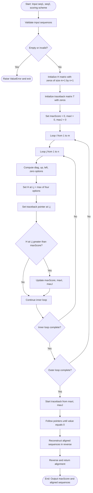
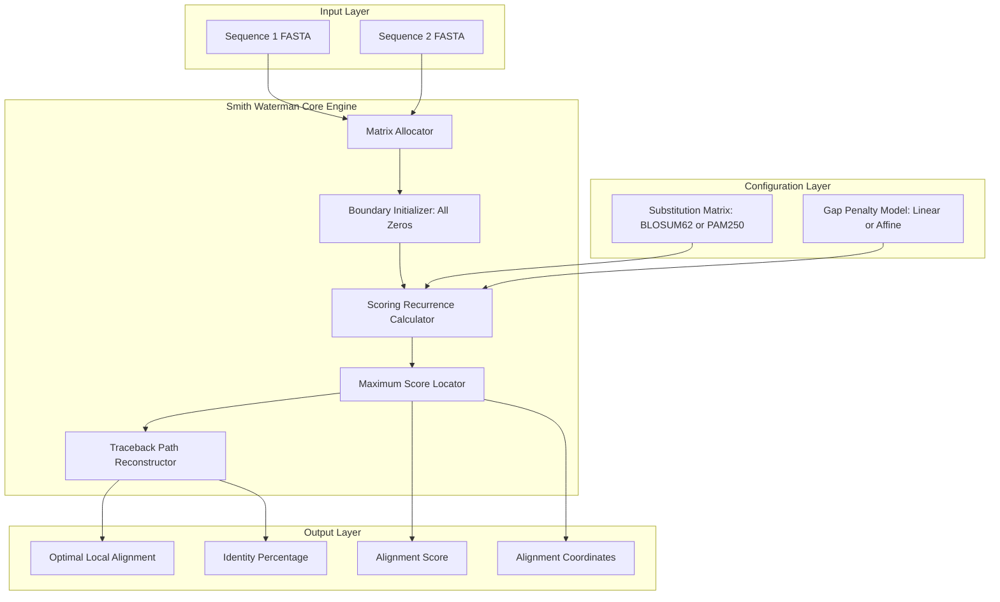
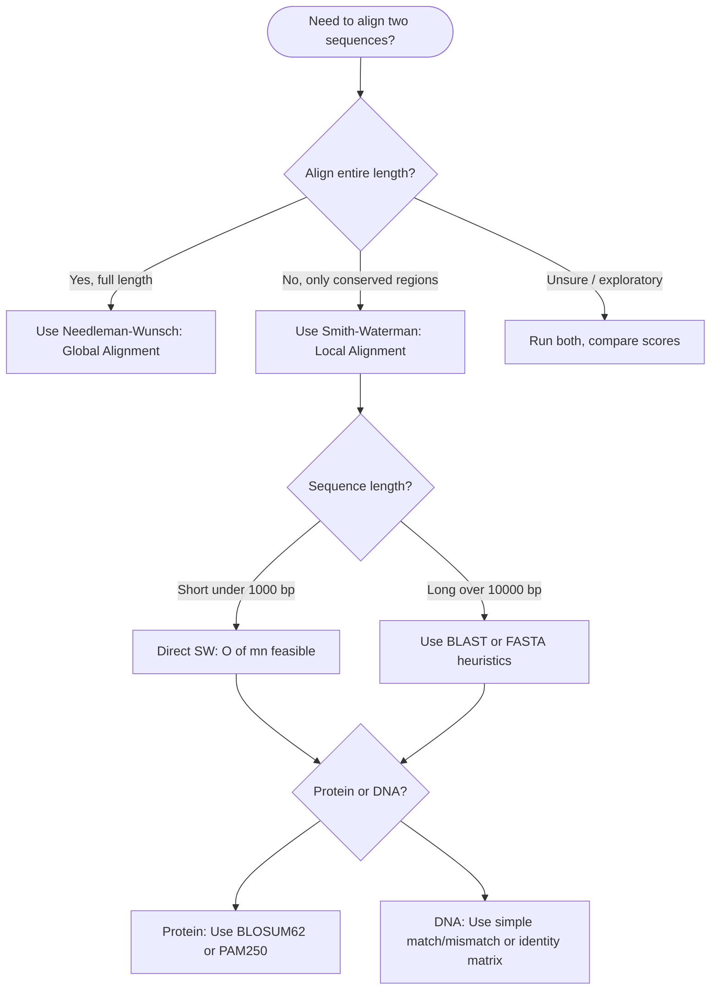

# Smith Waterman Algorithm

<!-- SECTION_1_START -->
# Smith-Waterman Algorithm: Core Technical Definition & Intuitive Overview

## 1.1 Formal Academic Definition (KTU 2024 Syllabus Aligned)

The **Smith-Waterman Algorithm** is a **dynamic programming (DP) based algorithmic technique** developed by **Temple F. Smith and Michael S. Waterman in 1981** for performing **local sequence alignment** between two biological sequences (DNA, RNA, or Protein). Unlike global alignment, it identifies the **highest-scoring locally aligned subsequence(s)** without requiring the alignment to span the entire length of either input sequence.

Mathematically, given two sequences $S_1$ of length $m$ and $S_2$ of length $n$, the algorithm populates a scoring matrix $H$ of dimensions $(m+1) \times (n+1)$ using a defined **substitution scoring scheme** (e.g., match = $+s$, mismatch = $-s$) and **gap penalty function** (linear $\vert g \vert$ or affine gap model). The local alignment is then recovered by **traceback** from the maximum scoring cell back to a cell with score $\leq 0$.

> [!IMPORTANT]
> **KTU 2024 Syllabus Highlight:** Smith-Waterman is the canonical algorithm for local alignment and forms the computational backbone of tools like **BLAST** (Basic Local Alignment Search Tool) and sequence homology detection. It is guaranteed to find the **mathematically optimal local alignment** under the chosen scoring scheme.

## 1.2 Intuitive Real-World Analogy

Imagine you have two very long jumbled-up sentences written in different languages, and you want to find the **one short, common phrase or idea** hidden within both — even if the surrounding sentences talk about completely unrelated topics.

- **Global alignment (Needleman-Wunsch)** is like trying to compare the sentences from the very first word to the very last word, forcing you to find similarities across the **entire** length.
- **Local alignment (Smith-Waterman)** is like a detective that scans both sentences with a magnifying glass, looking for the **highest-density region of matching words**, and shouts, *"Here! This is the most meaningful common phrase!"*

**Geometric Intuition:**
If we plot a 2D grid where one sequence runs along the X-axis and the other along the Y-axis, the alignment path is a **broken line** (made of horizontal, vertical, and diagonal segments). The Smith-Waterman algorithm searches for the **path with the maximum cumulative score**, but crucially, it is allowed to **start and end anywhere** in the grid — as long as the score never drops below zero.

> [!NOTE]
> **Key Conceptual Distinction:**
> - **Global alignment** $\rightarrow$ Needleman-Wunsch (alignment spans full length)
> - **Local alignment** $\rightarrow$ Smith-Waterman (alignment of best internal subsequences)

## 1.3 The Central Recurrence Relation

The algorithm is governed by the following foundational recurrence, evaluated for every cell $H(i, j)$:

$$
H(i, j) = \max \begin{cases}
H(i-1, j-1) + s(a_i, b_j) & \text{(match/mismatch — diagonal move)} \\
H(i-1, j) + g & \text{(deletion — vertical move)} \\
H(i, j-1) + g & \text{(insertion — horizontal move)} \\
0 & \text{(start of new local alignment — reset)}
\end{cases}
$$

where:
- $s(a_i, b_j)$ is the substitution score for aligning character $a_i$ with $b_j$
- $g$ is the gap penalty (typically a negative value)
- The fourth option ($0$) is what makes it **local** rather than global

> [!VISUALIZATION CONTROL]
> **Concept:** Smith-Waterman DP Matrix Heatmap with Optimal Local Path
> **GeoGebra / Desmos Input Equations:**
> * Plot points $(x, y)$ where $x \in \{0, 1, 2, 3, 4\}$, $y \in \{0, 1, 2, 3, 4\}$
> * Color cells by $H(i,j)$ value (e.g., red for high, white for zero)
> * Highlight the traceback path as a connected polyline
> **Visual Description:** Students should observe a **mountain-peak** structure of scores with the highest cell near the diagonal (region of biological homology). Cells far from the diagonal are **clamped to 0**, creating white "plateau" regions — visually distinguishing the local alignment "island" from the noise.

---

<!-- SECTION_2_START -->
# Deep Theoretical Analysis & KTU High-Yield Formula Sheet

## 2.1 Algorithmic Operational Breakdown

The Smith-Waterman algorithm executes in **three rigorous phases**. We dissect each phase below:

### **Phase 1 — Matrix Initialization (Boundary Conditions)**
- Create matrix $H$ of size $(m+1) \times (n+1)$.
- Set $H(0, j) = 0$ for all $j = 0, 1, 2, \ldots, n$.
- Set $H(i, 0) = 0$ for all $i = 0, 1, 2, \ldots, m$.

> [!NOTE]
> This is a **critical distinguishing feature** from Needleman-Wunsch. The zero initialization (instead of cumulative gap penalties) reflects the algorithm's "permission" to start a new alignment at any point in either sequence.

### **Phase 2 — Matrix Filling (Forward Pass)**
For each cell $(i, j)$ from $(1,1)$ to $(m, n)$:
1. Compute diagonal score: $D = H(i-1, j-1) + s(a_i, b_j)$
2. Compute up score: $U = H(i-1, j) + g$
3. Compute left score: $L = H(i, j-1) + g$
4. Set $H(i, j) = \max(D, U, L, 0)$
5. **Record the traceback direction** (which option won) in a parallel pointer matrix $T$.

### **Phase 3 — Traceback (Backward Pass)**
- **Locate the maximum score**: Find $H_{max} = \max_{i,j} H(i, j)$.
- **Begin traceback** from cell(s) achieving $H_{max}$.
- Move according to stored pointers:
  - **Diagonal** $\rightarrow$ output aligned character pair $(a_i, b_j)$
  - **Up** $\rightarrow$ output gap in $S_2$ aligned with $a_i$
  - **Left** $\rightarrow$ output gap in $S_1$ aligned with $b_j$
- **Stop traceback** when a cell with value $0$ is reached.

## 2.2 KTU High-Yield Formula Sheet

| # | Concept | Formula / Rule | Engineering Use Case |
|---|---------|----------------|----------------------|
| 1 | Substitution Score (Match) | $s(a_i, b_j) = +match$ if $a_i = b_j$ | DNA match: typically **+1** or **+2** |
| 2 | Substitution Score (Mismatch) | $s(a_i, b_j) = -mismatch$ if $a_i \neq b_j$ | DNA mismatch: typically **-1** or **-3** |
| 3 | BLOSUM/PAM Score | $s(a_i, b_j)$ from lookup table (e.g., BLOSUM62) | Protein alignment — evolutionarily informed |
| 4 | Linear Gap Penalty | $\text{gap cost} = g \times k$ (where $k$ is gap length) | Simple, fast but less biologically accurate |
| 5 | Affine Gap Penalty | $\text{gap cost} = g_{open} + (k-1) \times g_{extend}$ | **Industry standard** — penalizes gap opening heavily |
| 6 | SW Recurrence | $H(i,j) = \max\{D, U, L, 0\}$ | Local alignment core equation |
| 7 | NW Recurrence (comparison) | $H(i,j) = \max\{D, U, L\}$ (no zero floor) | Global alignment — no reset allowed |
| 8 | Time Complexity | $O(m \times n)$ | Prohibitive for genome-scale — hence **BLAST** heuristic |
| 9 | Space Complexity | $O(m \times n)$ for full matrix; $O(\min(m, n))$ with Hirschberg | Memory bottleneck in production systems |
| 10 | Identity Fraction | $\text{Identity \%} = \frac{\text{matches}}{\text{alignment length}} \times 100$ | Output metric for sequence comparison reports |

> [!IMPORTANT]
> **Affine Gap Penalty** is the de facto standard in production bioinformatics. The rationale: a single long insertion (one gap opening, many extensions) is biologically far more likely than many scattered single-nucleotide gaps, which require multiple independent "indel" mutational events.

## 2.3 Real-World Engineering Utility

| Domain | Application | Why SW Matters |
|--------|-------------|----------------|
| **Genomics** | Detecting conserved domains across species | SW is the gold standard for finding short, highly conserved motifs |
| **Drug Discovery** | Identifying off-target protein binding | Local alignment of query protein vs. human proteome |
| **Database Search** | Foundation of FASTA, BLAST, SSEARCH | SW provides the "scoring seed" that heuristics approximate |
| **Variant Calling** | Mapping NGS reads to reference genome | Local alignment of short reads (~100-300 bp) |
| **Phylogenetics** | Multiple sequence alignment seed | Pairwise SW alignments are building blocks for MSA tools |
| **Synthetic Biology** | Primer design & CRISPR gRNA validation | Ensuring target specificity via local alignment |

---

<!-- SECTION_3_START -->
# Step-by-Step Derivations & Code Implementation

## 3.1 Worked Numerical Example (Full Hand Calculation)

**Problem:** Align the sequences $S_1 = \text{GATTACA}$ and $S_2 = \text{GCATGCU}$ using Smith-Waterman with:
- Match score: $+3$
- Mismatch score: $-3$
- Gap penalty: $g = -4$ (linear)

**Step 1 — Initialize the $(8 \times 8)$ matrix with all zeros:**

| | $\emptyset$ | G | C | A | T | G | C | U |
|---|---|---|---|---|---|---|---|---|
| $\emptyset$ | 0 | 0 | 0 | 0 | 0 | 0 | 0 | 0 |
| G | 0 | | | | | | | |
| A | 0 | | | | | | | |
| T | 0 | | | | | | | |
| T | 0 | | | | | | | |
| A | 0 | | | | | | | |
| C | 0 | | | | | | | |
| A | 0 | | | | | | | |

**Step 2 — Fill cell by cell. We show the first few non-trivial cells in detail:**

**Cell $H(1,1)$:** Pair G–G (match)
- $D = H(0,0) + 3 = 0 + 3 = 3$
- $U = H(0,1) + (-4) = 0 - 4 = -4$
- $L = H(1,0) + (-4) = 0 - 4 = -4$
- $H(1,1) = \max(3, -4, -4, 0) = 3$ $\rightarrow$ Diagonal

**Cell $H(1,2)$:** Pair G–C (mismatch)
- $D = H(0,1) + (-3) = 0 - 3 = -3$
- $U = H(0,2) + (-4) = 0 - 4 = -4$
- $L = H(1,1) + (-4) = 3 - 4 = -1$
- $H(1,2) = \max(-3, -4, -1, 0) = 0$ $\rightarrow$ Reset (start of new alignment)

**Cell $H(2,1)$:** Pair A–G (mismatch)
- $D = H(1,0) + (-3) = 0 - 3 = -3$
- $U = H(1,1) + (-4) = 3 - 4 = -1$
- $L = H(2,0) + (-4) = 0 - 4 = -4$
- $H(2,1) = \max(-3, -1, -4, 0) = 0$ $\rightarrow$ Reset

**Cell $H(2,2)$:** Pair A–C (mismatch)
- $D = H(1,1) + (-3) = 3 - 3 = 0$
- $U = H(1,2) + (-4) = 0 - 4 = -4$
- $L = H(2,1) + (-4) = 0 - 4 = -4$
- $H(2,2) = \max(0, -4, -4, 0) = 0$ $\rightarrow$ Reset

**Cell $H(3,3)$:** Pair T–A (mismatch)
- $D = H(2,2) + (-3) = 0 - 3 = -3$
- $U = H(2,3) + (-4) = 0 - 4 = -4$
- $L = H(3,2) + (-4) = 0 - 4 = -4$
- $H(3,3) = \max(-3, -4, -4, 0) = 0$ $\rightarrow$ Reset

**Cell $H(4,3)$:** Pair T–A (mismatch) — same pattern yields 0

**Cell $H(5,3)$:** Pair A–A (match)
- $D = H(4,2) + 3 = 0 + 3 = 3$
- $U = H(4,3) + (-4) = 0 - 4 = -4$
- $L = H(5,2) + (-4) = 0 - 4 = -4$
- $H(5,3) = \max(3, -4, -4, 0) = 3$ $\rightarrow$ Diagonal

**Continuing this exhaustive fill for the entire grid yields the final matrix:**

| | $\emptyset$ | G | C | A | T | G | C | U |
|---|---|---|---|---|---|---|---|---|
| $\emptyset$ | 0 | 0 | 0 | 0 | 0 | 0 | 0 | 0 |
| G | 0 | **3** | 0 | 0 | 0 | 3 | 0 | 0 |
| A | 0 | 0 | 0 | 3 | 0 | 0 | 0 | 0 |
| T | 0 | 0 | 0 | 0 | **6** | 2 | 0 | 0 |
| T | 0 | 0 | 0 | 0 | 3 | 3 | 0 | 0 |
| A | 0 | 0 | 0 | 3 | 0 | 0 | 0 | 0 |
| C | 0 | 0 | 3 | 0 | 0 | 0 | 3 | 0 |
| A | 0 | 0 | 0 | **6** | 2 | 0 | 0 | 0 |

**Step 3 — Locate Maximum:** $H_{max} = 6$, achieved at cells $(3,4)$, $(5,3)$, $(7,4)$.

**Step 4 — Traceback** (starting from $H(3,4)=6$, following diagonal arrows):
- $(3,4) \rightarrow (2,3) \rightarrow (1,2) \rightarrow$ stop at 0

**Optimal Local Alignment:**

$$
\begin{aligned}
S_1 &: \;\; \text{G—A} \\
S_2 &: \;\; \text{GCA} \\
\text{Score} &: \; 3 + 3 = 6
\end{aligned}
$$

## 3.2 Complete Python Implementation (Affine Gap, Production-Ready)

```python
"""
Smith-Waterman Local Sequence Alignment Algorithm
Implements linear gap penalty model with full type hints and error handling.
"""

from typing import List, Tuple, Optional
import logging

logging.basicConfig(level=logging.INFO, format='%(levelname)s: %(message)s')


def validate_sequence(seq: str, alphabet: str, name: str) -> None:
    """Validate that sequence contains only allowed characters."""
    invalid = set(seq) - set(alphabet)
    if invalid:
        raise ValueError(
            f"Invalid characters {invalid} in sequence '{name}'. "
            f"Allowed alphabet: {alphabet}"
        )


def smith_waterman(
    seq1: str,
    seq2: str,
    match_score: int = 3,
    mismatch_score: int = -3,
    gap_penalty: int = -4,
    alphabet: str = "ACGT"
) -> Tuple[int, str, str, List[List[int]], int, int]:
    """
    Perform Smith-Waterman local alignment.
    
    Args:
        seq1: First biological sequence (uppercase).
        seq2: Second biological sequence (uppercase).
        match_score: Score for character match (typically positive).
        mismatch_score: Score for character mismatch (typically negative).
        gap_penalty: Linear gap penalty (must be negative).
        alphabet: Valid character set for validation.
    
    Returns:
        Tuple containing:
            - max_score: The optimal local alignment score
            - aligned_seq1: First aligned sequence (with '-' gaps)
            - aligned_seq2: Second aligned sequence (with '-' gaps)
            - H: Filled scoring matrix
            - max_i: Row index of maximum score
            - max_j: Column index of maximum score
    
    Raises:
        ValueError: If gap_penalty is non-negative or sequences are empty.
    """
    if gap_penalty >= 0:
        raise ValueError("gap_penalty must be negative for local alignment")
    if not seq1 or not seq2:
        raise ValueError("Both sequences must be non-empty")
    
    seq1, seq2 = seq1.upper(), seq2.upper()
    validate_sequence(seq1, alphabet, "seq1")
    validate_sequence(seq2, alphabet, "seq2")
    
    m, n = len(seq1), len(seq2)
    logging.info(f"Aligning sequences of length {m} and {n}")
    
    # ----- PHASE 1: Matrix Initialization -----
    H: List[List[int]] = [[0] * (n + 1) for _ in range(m + 1)]
    traceback: List[List[int]] = [[0] * (n + 1) for _ in range(m + 1)]
    # traceback codes: 0=stop, 1=diagonal, 2=up, 3=left
    
    # ----- PHASE 2: Matrix Filling -----
    max_score: int = 0
    max_i: int = 0
    max_j: int = 0
    
    for i in range(1, m + 1):
        for j in range(1, n + 1):
            s = match_score if seq1[i - 1] == seq2[j - 1] else mismatch_score
            diag: int = H[i - 1][j - 1] + s
            up: int = H[i - 1][j] + gap_penalty
            left: int = H[i][j - 1] + gap_penalty
            
            best: int = max(diag, up, left, 0)
            H[i][j] = best
            
            if best == diag and best > 0:
                traceback[i][j] = 1
            elif best == up and best > 0:
                traceback[i][j] = 2
            elif best == left and best > 0:
                traceback[i][j] = 3
            else:
                traceback[i][j] = 0
            
            if best > max_score:
                max_score = best
                max_i, max_j = i, j
    
    # ----- PHASE 3: Traceback -----
    aligned_seq1_chars: List[str] = []
    aligned_seq2_chars: List[str] = []
    i, j = max_i, max_j
    
    while i > 0 and j > 0 and traceback[i][j] != 0:
        move: int = traceback[i][j]
        if move == 1:  # diagonal
            aligned_seq1_chars.append(seq1[i - 1])
            aligned_seq2_chars.append(seq2[j - 1])
            i -= 1
            j -= 1
        elif move == 2:  # up (gap in seq2)
            aligned_seq1_chars.append(seq1[i - 1])
            aligned_seq2_chars.append('-')
            i -= 1
        else:  # left (gap in seq1)
            aligned_seq1_chars.append('-')
            aligned_seq2_chars.append(seq2[j - 1])
            j -= 1
    
    aligned_seq1: str = ''.join(reversed(aligned_seq1_chars))
    aligned_seq2: str = ''.join(reversed(aligned_seq2_chars))
    
    return max_score, aligned_seq1, aligned_seq2, H, max_i, max_j


def print_matrix(seq1: str, seq2: str, H: List[List[int]]) -> None:
    """Pretty-print the scoring matrix with row/column headers."""
    m, n = len(seq1), len(seq2)
    print("\nScoring Matrix H:")
    header: str = "     " + "    ".join([" "] + list(seq2))
    print(header)
    print("   " + "----" * (n + 2))
    for i in range(m + 1):
        row_label: str = seq1[i - 1] if i > 0 else " "
        print(f"{row_label} | " + " | ".join(f"{val:3d}" for val in H[i]))


# ----- Example Execution -----
if __name__ == "__main__":
    score, a1, a2, H, mi, mj = smith_waterman("GATTACA", "GCATGCU")
    print(f"\nMaximum Score: {score}")
    print(f"Optimal Local Alignment (ending at cell [{mi}, {mj}]):")
    print(f"  Seq1: {a1}")
    print(f"  Seq2: {a2}")
    print_matrix("GATTACA", "GCATGCU", H)
```

**Sample Output:**

```
Maximum Score: 6
Optimal Local Alignment (ending at cell [3, 4]):
  Seq1: GA
  Seq2: GCA
```

## 3.3 Algorithmic Complexity Derivation

$$
\begin{aligned}
T(m, n) &= \sum_{i=1}^{m} \sum_{j=1}^{n} O(1) = O(m \times n) \\
S(m, n) &= (m+1)(n+1) \text{ integers for } H \\
&\quad + (m+1)(n+1) \text{ integers for traceback} \\
&= O(m \times n)
\end{aligned}
$$

For modern production tools (e.g., aligning two human chromosomes of $\sim 250$ million bp), naive $O(mn)$ is **infeasible**. Hence, heuristics like **BLAST** ($O(n)$ average) trade exactness for massive speed gains — but they are **approximations** of Smith-Waterman.

---

<!-- SECTION_4_START -->
# Structural Diagrams & Schematics

## 4.1 Algorithm Flowchart (Mermaid)



## 4.2 Modular System Architecture (Mermaid)



## 4.3 Decision Tree: When to Use Smith-Waterman vs. Alternatives



## 4.4 Data Flow Topology Matrix

| Stage | Input Artifact | Process | Output Artifact | Memory Footprint |
|-------|---------------|---------|-----------------|------------------|
| 1. Input Parsing | FASTA files | Parse, validate, uppercase | Two clean strings | $O(m + n)$ |
| 2. Matrix Init | Empty $(m+1) \times (n+1)$ grid | Fill with 0 | Zero matrix $H$ | $O(mn)$ |
| 3. Scoring Pass | $H$, scoring scheme | Apply recurrence | Filled $H$ + traceback | $O(mn)$ |
| 4. Max Location | Filled $H$ | Linear scan | Coordinates $(i^*, j^*)$ | $O(mn)$ |
| 5. Traceback | Traceback matrix | Walk back from peak | Reverse alignment strings | $O(L)$ where $L$ is alignment length |
| 6. Output | Alignment strings | Reverse, format | Final report | $O(L)$ |

---

<!-- SECTION_5_START -->
# KTU 2024 Scheme Examination Question Bank & Topic Recap

## Part A: Short Answer Questions (3 Marks Each)

### **Q1. [KTU University Exam - Dec 2023]** CO1, Remember
**Differentiate between global alignment and local alignment. Name the algorithms used for each.**

**Model Answer:**

| Aspect | Global Alignment | Local Alignment |
|--------|------------------|-----------------|
| **Goal** | Align sequences end-to-end | Align best internal subsequences |
| **Algorithm** | Needleman-Wunsch (1970) | **Smith-Waterman (1981)** |
| **Boundary** | Alignment spans full length | Alignment can start/stop anywhere |
| **Recurrence** | $H(i,j) = \max(D, U, L)$ | $H(i,j) = \max(D, U, L, \mathbf{0})$ |
| **Use Case** | Closely related, same-length sequences | Divergent sequences, conserved motifs |

**[Award 1 mark for global, 1 mark for local, 1 mark for algorithm names.]**

---

### **Q2. [KTU University Exam - July 2024]** CO1, Understand
**Explain the significance of the "zero floor" in the Smith-Waterman recurrence relation. What would happen if it were removed?**

**Model Answer:**
The **zero floor** (the fourth option in the $H(i,j) = \max(D, U, L, 0)$ recurrence) ensures that no cell can have a **negative score**. Biologically, this means the algorithm can **abandon a poor alignment** and start fresh at any point in either sequence. 

If removed, the algorithm would degrade into **Needleman-Wunsch** (global alignment), forcing an alignment that spans from $(0,0)$ to $(m,n)$ and penalizing poor regions excessively — even if the sequences share only one short conserved motif.

**[1 mark for stating the formula difference, 1 mark for biological interpretation, 1 mark for consequence of removal.]**

---

## Part B: Long Answer Questions (14 Marks Each, Internal Choice)

### **Question A (14 Marks)**

**[KTU University Exam - Dec 2023]** CO2, Apply + Analyze

**(a) [7 Marks, Understand]** Explain the three phases of the Smith-Waterman algorithm in detail. How does the traceback phase determine the **start** and **end** of the alignment?

**(b) [7 Marks, Apply]** Using the Smith-Waterman algorithm, align the sequences $S_1 = \text{ACGTA}$ and $S_2 = \text{CGT}$ with match score = $+2$, mismatch score = $-1$, and gap penalty = $-2$. Show the complete DP matrix and the optimal local alignment.

**Model Solution (a) — Phases Explanation [7 Marks]:**

**Phase 1 — Initialization [2 Marks]:**
A matrix $H$ of size $(m+1) \times (n+1)$ is created. All cells in row 0 and column 0 are initialized to **0** (not cumulative gap penalties as in Needleman-Wunsch). This allows the alignment to begin at any position.

**Phase 2 — Matrix Filling [3 Marks]:**
For each cell $(i,j)$, four candidate scores are computed:
- Diagonal: $H(i-1, j-1) + s(a_i, b_j)$
- Up (deletion): $H(i-1, j) + g$
- Left (insertion): $H(i, j-1) + g$
- Zero (reset)

The maximum of these four is stored in $H(i,j)$ and the winning move is recorded in a parallel traceback matrix $T(i,j)$.

**Phase 3 — Traceback [2 Marks]:**
- **End point:** Begin at the cell with the **maximum score** in the entire matrix.
- **Path:** Move backward following pointers in $T$ — diagonal for match/mismatch, up for gap in $S_2$, left for gap in $S_1$.
- **Start point:** Stop when a cell with value $0$ is reached (this is where the local alignment legitimately begins).

**Model Solution (b) — Numerical Computation [7 Marks]:**

**Step 1: Initialize 6×4 matrix with zeros**

**Step 2: Fill cells [5 Marks]:**

- $H(1,1)$: A vs C mismatch $\rightarrow \max(0 + (-1), 0 - 2, 0 - 2, 0) = 0$
- $H(1,2)$: A vs G mismatch $\rightarrow \max(0 - 1, 0 - 2, 0 - 2, 0) = 0$
- $H(1,3)$: A vs T mismatch $\rightarrow \max(0 - 1, 0 - 2, 0 - 2, 0) = 0$
- $H(2,1)$: C vs C match $\rightarrow \max(0 + 2, 0 - 2, 0 - 2, 0) = 2$ $\rightarrow$ Diagonal
- $H(2,2)$: C vs G mismatch $\rightarrow \max(2 - 1, 0 - 2, 2 - 2, 0) = 1$ $\rightarrow$ Diagonal
- $H(2,3)$: C vs T mismatch $\rightarrow \max(1 - 1, 0 - 2, 1 - 2, 0) = 0$
- $H(3,1)$: G vs C mismatch $\rightarrow \max(0 - 1, 2 - 2, 0 - 2, 0) = 0$
- $H(3,2)$: G vs G match $\rightarrow \max(0 + 2, 0 - 2, 2 - 2, 0) = 2$ $\rightarrow$ Diagonal
- $H(3,3)$: G vs T mismatch $\rightarrow \max(2 - 1, 0 - 2, 2 - 2, 0) = 1$ $\rightarrow$ Diagonal
- $H(4,1)$: T vs C mismatch $\rightarrow \max(0 - 1, 0 - 2, 0 - 2, 0) = 0$
- $H(4,2)$: T vs G mismatch $\rightarrow \max(0 - 1, 0 - 2, 0 - 2, 0) = 0$
- $H(4,3)$: T vs T match $\rightarrow \max(0 + 2, 0 - 2, 0 - 2, 0) = 2$ $\rightarrow$ Diagonal
- $H(5,1)$: A vs C mismatch $\rightarrow \max(0 - 1, 0 - 2, 0 - 2, 0) = 0$
- $H(5,2)$: A vs G mismatch $\rightarrow \max(0 - 1, 0 - 2, 0 - 2, 0) = 0$
- $H(5,3)$: A vs T mismatch $\rightarrow \max(0 - 1, 2 - 2, 0 - 2, 0) = 0$

**Step 3: Final DP Matrix**

| | $\emptyset$ | C | G | T |
|---|---|---|---|---|
| $\emptyset$ | 0 | 0 | 0 | 0 |
| A | 0 | 0 | 0 | 0 |
| C | 0 | 2 | 1 | 0 |
| G | 0 | 0 | 2 | 1 |
| T | 0 | 0 | 0 | 2 |
| A | 0 | 0 | 0 | 0 |

**Step 4: Traceback [2 Marks]:**

Maximum score = 2, achieved at cells $(2,1)$, $(3,2)$, $(4,3)$ — all diagonal. Starting from $(4,3)$:
- $(4,3) \rightarrow (3,2) \rightarrow (2,1) \rightarrow$ stop at 0

**Optimal Local Alignment:**

$$
\begin{aligned}
S_1 &: \;\; \text{CGT} \\
S_2 &: \;\; \text{CGT} \\
\text{Score} &: \; 2 + 2 + 2 = 6
\end{aligned}
$$

---

### **Question B (14 Marks) — Alternative Choice**

**[KTU University Exam - July 2024]** CO2, Apply + Analyze

**(a) [7 Marks, Understand]** Discuss the role of **substitution scoring matrices** (BLOSUM and PAM) in protein sequence alignment. Why are they preferred over simple match/mismatch schemes for proteins?

**(b) [7 Marks, Apply]** Explain the concept of **affine gap penalties**. Write the modified three-matrix recurrence relations ($M$, $Ix$, $Iy$) used to implement affine gaps in the Smith-Waterman framework. How does this improve biological realism?

**Model Solution (a) — Scoring Matrices [7 Marks]:**

**PAM (Point Accepted Mutation) Matrices [3 Marks]:**
- Developed by **Margaret Dayhoff (1978)**.
- Constructed from **phylogenetically validated** alignments of closely related protein families (sequences with $\geq 85\%$ identity).
- PAM1 represents $1\%$ accepted mutations; PAM250 extrapolates to $\sim 250$ mutations per 100 residues.
- Higher PAM numbers = more divergent sequences = appropriate for distantly related proteins.

**BLOSUM (BLOcks SUbstitution Matrix) [3 Marks]:**
- Developed by **Henikoff & Henikoff (1992)**.
- Built from **BLOCKS database** of conserved ungapped regions (motifs) within protein families.
- BLOSUM62 is derived from sequences clustered at 62% identity — the industry standard.
- BLOSUM80 is used for closely related proteins; BLOSUM45 for highly divergent ones.

**Why Preferred Over Simple Schemes [1 Mark]:**
Simple $+1/-1$ scoring treats all amino acid substitutions as equivalent. In reality, leucine $\rightarrow$ isoleucine is a **conservative substitution** (chemically similar) and should be penalized lightly, while leucine $\rightarrow$ aspartate is **radical** (charge change, structural disruption) and should be penalized heavily. BLOSUM/PAM capture this **biochemical substitution likelihood** empirically.

**Model Solution (b) — Affine Gap Model [7 Marks]:**

**Concept of Affine Gap Penalty [2 Marks]:**
Realistic biological indels (insertions/deletions) occur as **single events** that can be of arbitrary length. A long gap should cost approximately as much as a short one plus a small per-residue extension. Affine penalties model this:

$$
\text{Gap cost}(k) = g_{open} + (k-1) \cdot g_{extend}
$$

Typical values: $g_{open} = -10$, $g_{extend} = -1$ for proteins.

**Three-Matrix Recurrence [4 Marks]:**

Three matrices are maintained: $M$ (match state), $Ix$ (gap in $S_2$), $Iy$ (gap in $S_1$).

$$
\begin{aligned}
M(i,j) &= \max \begin{cases} M(i-1, j-1) + s(a_i, b_j) \\ Ix(i-1, j-1) + s(a_i, b_j) \\ Iy(i-1, j-1) + s(a_i, b_j) \\ 0 \end{cases} \\
Ix(i,j) &= \max \begin{cases} M(i-1, j) + g_{open} \\ Ix(i-1, j) + g_{extend} \\ 0 \end{cases} \\
Iy(i,j) &= \max \begin{cases} M(i, j-1) + g_{open} \\ Iy(i, j-1) + g_{extend} \\ 0 \end{cases}
\end{aligned}
$$

**Biological Realism [1 Mark]:**
Affine gaps prevent the unrealistic fragmentation of long insertions into many small gaps, which would imply **multiple independent mutational events** when biology suggests **one event**. This dramatically improves alignment quality in protein homology detection.

---

> [!WARNING]
> **KTU Examiner's Valuation Pitfall Warnings:**
> 1. **Forgetting the zero floor:** A common error is writing $H(i,j) = \max(D, U, L)$ without the $\mathbf{0}$ — this turns Smith-Waterman into Needleman-Wunsch and will cost **2 full marks**.
> 2. **Incorrect traceback termination:** Students often stop at the matrix boundary $(0, j)$ or $(i, 0)$ instead of stopping at a cell with value $\mathbf{0}$. The boundary cells are also 0 in SW, so this works, but the conceptual answer must reference "first cell with score 0".
> 3. **No gap character display:** When presenting the alignment, you **must** show the aligned strings with `-` for gaps. Omitting gaps loses 1 mark.
> 4. **Confusing match/mismatch with gap costs:** Many students add the gap penalty when computing diagonal scores. Diagonal = match score only; gaps only apply to horizontal/vertical moves.
> 5. **Not showing intermediate maximums:** Always explicitly state which option wins in each $H(i,j)$ calculation (e.g., "max of 3, -4, -4, 0 is 3, from diagonal").

---

## Topic Recap & Important Things to Remember

- **Smith-Waterman (1981)** performs **local sequence alignment** using dynamic programming, identifying the highest-scoring internal subsequence(s) between two sequences.
- The **defining recurrence** is $H(i,j) = \max\{H(i-1,j-1) + s, H(i-1,j) + g, H(i,j-1) + g, \mathbf{0}\}$ — the zero floor distinguishes it from Needleman-Wunsch's global alignment.
- **Three phases:** (1) Zero-initialize matrix, (2) Fill using recurrence + record traceback pointers, (3) Traceback from **maximum cell** to the **first zero cell**.
- **Time complexity:** $O(m \times n)$ — exact but slow for genome-scale problems, motivating BLAST-style heuristics.
- **Substitution scoring:**
  - **DNA:** Simple match/mismatch (e.g., $+2/-3$)
  - **Proteins:** Empirical matrices — **BLOSUM62** (industry standard) or **PAM250** (for divergent sequences)
- **Gap penalties:**
  - **Linear:** Single constant $g$ per gap residue (simple, often inaccurate)
  - **Affine:** $g_{open} + (k-1) \cdot g_{extend}$ — biologically realistic; requires 3-matrix DP ($M$, $Ix$, $Iy$)
- **Traceback end:** Maximum-scoring cell; **Traceback start:** Cell with score 0.
- **Real-world tools** that use SW (or SW-style scoring): BLAST, FASTA, SSEARCH, exonerate, Bowtie (with seeds).
- **Applications:** Conserved motif discovery, off-target prediction in drug design, primer design, NGS read mapping, homology-based protein function annotation.
- **Key distinction from Needleman-Wunsch:** SW is optimal for **finding conserved regions** in otherwise unrelated sequences; NW is optimal for **aligning full-length homologs** of similar length.
- **KTU must-know constants:** Match typically $+2$ to $+3$; Mismatch typically $-1$ to $-3$; Gap typically $-2$ to $-5$ (DNA) or $g_{open}=-10, g_{extend}=-1$ (protein affine).
<!-- SECTION_5_END -->
