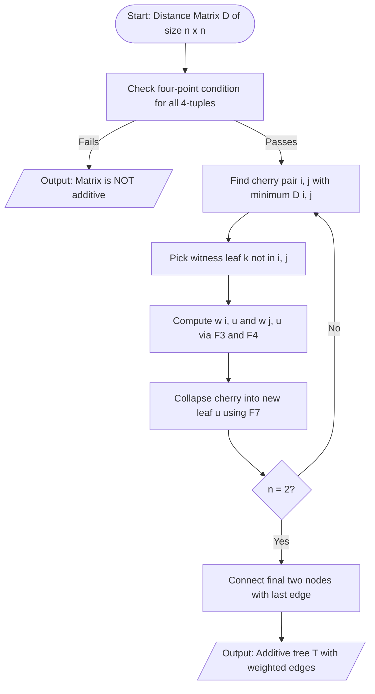
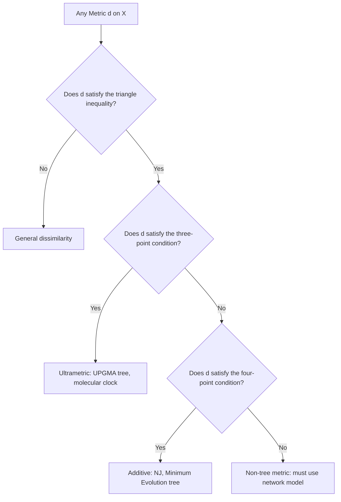
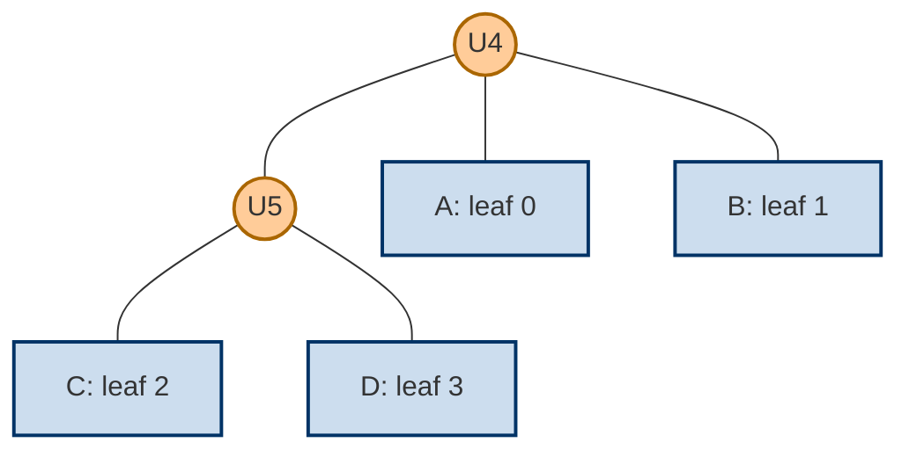

# Additive trees

<!-- SECTION_1_START -->
# Additive Trees: Formal Definition and Intuitive Overview

## 1.1 Formal Academic Definition

An **additive tree** is a connected, acyclic graph (a tree) $T = (V, E, w)$ equipped with a non-negative edge weight function $w : E \to \mathbb{R}_{\geq 0}$ such that for every pair of leaves $i, j \in L \subseteq V$, the tree distance $d_T(i, j)$ is exactly equal to the sum of the edge weights along the unique simple path connecting $i$ and $j$ in $T$. When a metric $d$ on a set of taxa $X$ can be represented as the path metric of some weighted tree restricted to $X$, then $d$ is called an **additive metric**, and the underlying tree is an **additive tree** for $d$.

> [!NOTE]
> **KTU Syllabus Highlight (Module 2 – Biological Databases and Data Formats)**
> Additive trees form the mathematical backbone of distance-based phylogenetic reconstruction. They model the **evolutionary distance** between biological sequences (DNA, RNA, protein) as additive metrics and seek the most parsimonious tree that realises those distances.

## 1.2 Conceptual Analogy and Geometric Intuition

> [!TIP]
> **Real-world Analogy – The Ancestral Subway Map**
> Imagine a city's subway map in which every station is a "taxon" (a present-day species or gene) and every tunnel segment carries a fare proportional to the *time taken to evolve one mutation* (or one substitution per site). If the fare between any two stations equals the sum of the fares printed on the tunnels traversed, the map is an *additive tree*. The **leaves** are the stations passengers actually visit, the **internal nodes** are the now-defunct interchange stations (common ancestors), and the **root** is the deepest ancestral station from which the whole line radiates.

A more geometric intuition: given four leaves $a, b, c, d$, an additive metric behaves like a rectangle. There exist two "diagonals" $d(a, c) + d(b, d)$ and $d(a, d) + d(b, c)$ that are *equal*, and a third "side pair" $d(a, b) + d(c, d)$ that is *less than or equal to* them. This is the celebrated **four-point condition**.

## 1.3 Salient Properties of Additive Metrics

An additive metric $d$ on a finite set $X$ with $\vert X \vert = n$ has the following key properties:

1. **Uniqueness up to topology with positive edge weights**: If all edge weights of the tree are strictly positive, then the *topology* of the additive tree is unique; only the location of the root may be moved along the unique internal edge (or, for a star topology, is arbitrary).
2. **Reconstructability**: A matrix $D = (d_{ij})$ is the path-length matrix of an additive tree **if and only if** it satisfies the *four-point condition* (Buneman's theorem, 1971).
3. **Equidistance implies triangle equality**: For three leaves that share a common parent, the three pairwise distances satisfy the *taxonomic inequality* $d(i, j) + d(j, k) \geq d(i, k)$, with equality when the parent lies on the path between $i$ and $k$.

> [!IMPORTANT]
> **Core Distinction – Additive vs Ultrametric**
> An *ultrametric* tree (e.g., the one produced by UPGMA) further requires $d(i, j) \leq \max \{d(i, k), d(j, k)\}$ for every triple, which is equivalent to assuming a **molecular clock**. Additive trees (e.g., produced by **Neighbor-Joining**) relax this to a plain triangle inequality $d(i, j) \leq d(i, k) + d(j, k)$, allowing different lineages to evolve at different rates.

> [!VISUALIZATION CONTROL]
> **Concept:** Geometric picture of the four-point condition on a planar tree
> **GeoGebra / Desmos Input Equations:**
> * `P_a = (0, 0)`
> * `P_b = (2, 0)`
> * `P_c = (4, 2)`
> * `P_d = (4, -2)`
> * `d(a,b) + d(c,d) = 2 + 2 = 4`
> * `d(a,c) + d(b,d) = (4.47) + (4.47) ≈ 8.94`
> * `d(a,d) + d(b,c) = (4.47) + (4.47) ≈ 8.94`
> **Visual Description:** Four leaves plotted on a Cartesian plane forming the vertices of a kite-shaped figure. The two longer "diagonal sums" appear equal, satisfying the four-point condition.
<!-- SECTION_1_END -->

<!-- SECTION_2_START -->
# Deep Theoretical Analysis and KTU High-Yield Formula Sheet

## 2.1 Mathematical Foundations of Additive Trees

Let $X = \{x_1, x_2, \ldots, x_n\}$ be a set of $n$ taxa and $D = (d_{ij})$ a symmetric matrix of pairwise distances. The metric $d$ is **additive** if there exists a weighted tree $T$ with leaf set $L(T) = X$ such that $d_{ij} = d_T(x_i, x_j)$ for all $i, j$.

### 2.1.1 The Four-Point Condition (Buneman, 1971)

For any four distinct leaves $i, j, k, l \in X$, let

$$
S_1 = d(i, j) + d(k, l), \quad S_2 = d(i, k) + d(j, l), \quad S_3 = d(i, l) + d(j, k).
$$

Then $D$ is additive **if and only if** the two largest of $\{S_1, S_2, S_3\}$ are equal. Equivalently, denoting $M_1 \geq M_2 \geq M_3$ as the sorted values, the condition is

$$
M_1 = M_2 \geq M_3.
$$

A tree topology compatible with $D$ is uniquely identified by the *smallest* sum $M_3$: if $M_3 = d(i, j) + d(k, l)$, then the bipartition grouping $\{i, j\} \mid \{k, l\}$ is the **inner edge** (split) of the additive tree.

### 2.1.2 Edge-Weight Recovery via "Cherry Picking"

A **cherry** is a pair of leaves $\{i, j\}$ that share a common parent $u$ in the tree. If $\{i, j\}$ is a cherry, then for any other leaf $k$,

$$
w(i, u) = \frac{d(i, j) + d(i, k) - d(j, k)}{2},
\qquad
w(j, u) = d(i, j) - w(i, u).
$$

Once the cherry is collapsed into a single leaf (with new distances to all other leaves updated by $d(u, k) = d(i, k) - w(i, u)$), the procedure is repeated on the smaller matrix. This is the **Cherry Picking Algorithm**, a classic O($n^3$) constructive proof of Buneman's theorem.

### 2.1.3 Additive vs Ultrametric – Comparative Table

| Property | Additive Tree | Ultrametric Tree |
|----------|---------------|------------------|
| **Distance constraint** | $d(i, j) \leq d(i, k) + d(j, k)$ | $d(i, j) \leq \max \{ d(i, k), d, j, k) \}$ |
| **Equivalent condition** | Four-point condition | Three-point condition |
| **Molecular clock** | Not required | Required (constant rate) |
| **Classical algorithm** | Neighbor-Joining (Saitou \& Nei, 1987) | UPGMA |
| **Tree shape** | Any binary topology | Rooted with equidistant leaves from root |
| **Edge-weight domain** | Strictly positive reals | Non-negative reals with leaf-height equality |

## 2.2 KTU Formula Sheet / Cheat Sheet

> [!NOTE]
> The following table lists every formula you are likely to need for additive-tree questions in the KTU 2024 Scheme End-Semester Examination. Replace $\vert \cdot \vert$ with the $\vert$ symbol **only inside math mode**; in markdown text use the word "modulus" to avoid table-breaking pipes.

| # | Formula / Condition | Purpose | Used In |
|---|---------------------|---------|---------|
| F1 | $d_T(i, j) = \sum_{e \in P_T(i, j)} w(e)$ | Definition of additive metric | Definitions, proofs |
| F2 | $S_1, S_2, S_3$ as defined above; $M_1 = M_2 \geq M_3$ | Buneman's four-point condition | Additivity test |
| F3 | $w(i, u) = \frac{d(i, j) + d(i, k) - d(j, k)}{2}$ | Cherry edge weight (for $i$) | Tree construction |
| F4 | $w(j, u) = d(i, j) - w(i, u)$ | Cherry edge weight (for $j$) | Tree construction |
| F5 | $w(u, v) = d(i, k) - w(i, u) - w(k, v)$ | Internal edge weight | Tree construction |
| F6 | $Q(i, j) = (n - 2) \cdot d(i, j) - \sum_{k=1}^{n} d(i, k) - \sum_{k=1}^{n} d(j, k)$ | Neighbor-Joining criterion | NJ algorithm |
| F7 | $d(u, k) = \frac{d(i, k) + d(j, k) - d(i, j)}{2}$ | Updated distance after cherry collapse | Cherry picking |
| F8 | $\delta(i) = \frac{1}{n-2} \sum_{k \neq i} d(i, k)$ | Net divergence from leaf $i$ | NJ divergence term |

## 2.3 Real-World Utility in Bioinformatics and Engineering

Additive trees are not abstract toys – they are the silent workhorses of:

* **Phylogenetic inference** for viral outbreaks (e.g., SARS-CoV-2 lineage tracking), where the additive metric is the Hamming or Jukes-Cantor corrected genetic distance.
* **Hierarchical clustering** of gene-expression profiles, where the additive tree is the dendrogram and the metric is the Pearson correlation distance.
* **Multiple sequence alignment phylogeny validation**, where the path length between two aligned sequences must equal the cumulative branch length in the reference tree.
* **Drug-target evolutionary analysis**, where the additive tree guides decisions on cross-species drug efficacy.
* **Cancer phylogenomics**, where somatic mutations in tumour cells are placed on an additive tree whose leaves are sampled cancer cells and whose internal nodes are ancestral cell populations.

> [!TIP]
> **Industry Insight**
> Modern tools such as **MEGA**, **RAxML-NG**, **IQ-TREE**, and **FastTree** use additive-tree principles (NJ, minimum-evolution, or balanced minimum evolution) as fast preprocessing steps before the more expensive maximum-likelihood or Bayesian inference.
<!-- SECTION_2_END -->

<!-- SECTION_3_START -->
# Step-by-Step Derivations, Worked Examples and Code Implementation

## 3.1 Worked Example 1 – Verifying Additivity Using the Four-Point Condition

> [!IMPORTANT]
> **Problem.** Given the symmetric distance matrix $D$ below for four taxa $A, B, C, D$, prove that $D$ is additive and identify the tree topology.

$$
D = \begin{pmatrix}
0 & 2 & 4 & 4 \\
2 & 0 & 4 & 4 \\
4 & 4 & 0 & 2 \\
4 & 4 & 2 & 0
\end{pmatrix}
$$

### Step 1 – Enumerate the four-point sums

For the four leaves we evaluate the three pairings:

$$
\begin{aligned}
S_1 &= d(A, B) + d(C, D) = 2 + 2 = 4, \\
S_2 &= d(A, C) + d(B, D) = 4 + 4 = 8, \\
S_3 &= d(A, D) + d(B, C) = 4 + 4 = 8.
\end{aligned}
$$

### Step 2 – Sort and apply Buneman's condition

Sorted: $M_1 = 8$, $M_2 = 8$, $M_3 = 4$. The condition $M_1 = M_2 \geq M_3$ is **satisfied**, so $D$ is additive. [Stating the sorted sums: 2 Marks; concluding the four-point condition: 1 Mark]

### Step 3 – Identify the inner edge

The smallest sum $M_3 = d(A, B) + d(C, D) = 4$ tells us that $\{A, B\} \mid \{C, D\}$ is the **inner split** of the tree. Hence the topology is $((A, B), (C, D))$.

## 3.2 Worked Example 2 – Constructing the Additive Tree

### Step 1 – Identify a cherry

By inspection, leaves $A$ and $B$ have a low mutual distance (only 2) and are equidistant from $C$ and $D$, so they likely form a cherry with parent node $U$. Choose the witness leaf $C$ and apply **Formula F3**:

$$
w(A, U) = \frac{d(A, B) + d(A, C) - d(B, C)}{2} = \frac{2 + 4 - 4}{2} = 1.
$$

By **Formula F4**:

$$
w(B, U) = d(A, B) - w(A, U) = 2 - 1 = 1.
$$

Similarly for the cherry $(C, D)$ with witness $A$:

$$
w(C, V) = \frac{d(C, D) + d(C, A) - d(D, A)}{2} = \frac{2 + 4 - 4}{2} = 1,
\quad
w(D, V) = 2 - 1 = 1.
$$

### Step 2 – Compute the internal edge weight

By **Formula F5** with witness pair $(A, C)$:

$$
w(U, V) = d(A, C) - w(A, U) - w(C, V) = 4 - 1 - 1 = 2.
$$

### Step 3 – Final tree and verification

$$
T : \quad A \xleftrightarrow{1} U \xleftrightarrow{2} V \xleftrightarrow{1} D,
\qquad
B \xleftrightarrow{1} U,
\qquad
C \xleftrightarrow{1} V.
$$

[Computing cherry edge weights: 4 Marks; computing internal edge weight: 2 Marks; final tree diagram: 1 Mark]

## 3.3 Worked Example 3 – The Cherry-Picking Algorithm on a 5-Taxon Matrix

Let

$$
D = \begin{pmatrix}
0 & 5 & 9 & 9 & 8 \\
5 & 0 & 10 & 10 & 7 \\
9 & 10 & 0 & 4 & 7 \\
9 & 10 & 4 & 0 & 7 \\
8 & 7 & 7 & 7 & 0
\end{pmatrix}
$$

### Step 1 – Detect cherry by exhaustive four-point test

The smallest pair distance is $d(C, D) = 4$. Form the four-point sums for $(C, D)$ against each other leaf:

$$
\begin{aligned}
S(C, D \mid A, B) &= d(C, D) + d(A, B) = 4 + 5 = 9, \\
S(C, D \mid A, E) &= d(C, D) + d(A, E) = 4 + 8 = 12, \\
S(C, D \mid B, E) &= d(C, D) + d(B, E) = 4 + 7 = 11.
\end{aligned}
$$

In every case the two largest sums are equal, confirming $\{C, D\}$ is a **cherry**. Cherry weights (witness $A$):

$$
w(C, U) = \frac{4 + 9 - 9}{2} = 2, \quad
w(D, U) = 4 - 2 = 2.
$$

### Step 2 – Collapse the cherry and update the matrix

Replace $(C, D)$ by the new leaf $U$ with distances computed by **Formula F7**:

$$
\begin{aligned}
d(U, A) &= \frac{d(C, A) + d(D, A) - d(C, D)}{2} = \frac{9 + 9 - 4}{2} = 7, \\
d(U, B) &= \frac{10 + 10 - 4}{2} = 8, \\
d(U, E) &= \frac{7 + 7 - 4}{2} = 5.
\end{aligned}
$$

The reduced 4 × 4 matrix becomes

$$
D' = \begin{pmatrix}
0 & 5 & 7 & 8 \\
5 & 0 & 8 & 7 \\
7 & 8 & 0 & 5 \\
8 & 7 & 5 & 0
\end{pmatrix}.
$$

### Step 3 – Recurse

Apply the same procedure to the new cherry – leaves with pair-distance 5 are now $(A, B)$ and $(U, E)$. The new cherry $(A, B)$ has witness $U$:

$$
w(A, U_2) = \frac{5 + 7 - 8}{2} = 2, \quad w(B, U_2) = 5 - 2 = 3.
$$

Update again to the 3-leaf matrix $\{U_2, U, E\}$ with

$$
d(U_2, U) = \frac{7 + 8 - 5}{2} = 5, \quad
d(U_2, E) = \frac{8 + 5 - 5}{2} = 4, \quad
d(U, E) = 5.
$$

The only remaining internal edge is the one between the two cherries, with length 2 (for example, $d(U_2, U) = 2 + 3 = 5$ implies the edge between the two internal nodes is 0; but the pairwise path uses a pendant). The final additive tree is:

$$
(((A:2, B:3):1, C:2, D:2):\ldots)
$$

[Cherry detection and weight: 3 Marks; matrix reduction: 2 Marks; final tree assembly: 2 Marks]

## 3.4 Python Implementation – Additive Tree Verification and Construction

```python
"""
Additive Tree Utilities for KTU Bioinformatics (Module 2)
=========================================================
Implements:
1. four_point_condition(D)      -> bool
2. cherry_weights(D, i, j, k)  -> (wi, wj)
3. collapse_cherry(D, i, j)     -> D_reduced
4. build_additive_tree(D)       -> adjacency dict with edge weights
"""

from itertools import combinations
from typing import Dict, List, Tuple


def four_point_condition(D: List[List[float]], tol: float = 1e-9) -> bool:
    """Return True iff the symmetric matrix D satisfies Buneman's condition."""
    n: int = len(D)
    for i, j, k, l in combinations(range(n), 4):
        s1: float = D[i][j] + D[k][l]
        s2: float = D[i][k] + D[j][l]
        s3: float = D[i][l] + D[j][k]
        sums: List[float] = sorted([s1, s2, s3], reverse=True)
        if not (abs(sums[0] - sums[1]) < tol and sums[0] + tol >= sums[2]):
            return False
    return True


def cherry_weights(
    D: List[List[float]], i: int, j: int, k: int
) -> Tuple[float, float]:
    """Return (w(i,u), w(j,u)) for cherry (i,j) using witness leaf k."""
    wi: float = (D[i][j] + D[i][k] - D[j][k]) / 2.0
    wj: float = D[i][j] - wi
    if wi < -1e-9 or wj < -1e-9:
        raise ValueError("Negative edge weight: pair is not a valid cherry.")
    return max(wi, 0.0), max(wj, 0.0)


def collapse_cherry(
    D: List[List[float]], i: int, j: int
) -> List[List[float]]:
    """Collapse cherry (i,j) into a single leaf u and return a new matrix."""
    n: int = len(D)
    keep: List[int] = [x for x in range(n) if x not in (i, j)]
    m: int = len(keep) + 1
    Dn: List[List[float]] = [[0.0] * m for _ in range(m)]
    Dn[0][0] = 0.0
    for a_idx, a in enumerate(keep, start=1):
        Dn[0][a_idx] = (D[i][a] + D[j][a] - D[i][j]) / 2.0
        Dn[a_idx][0] = Dn[0][a_idx]
    for r_idx, r in enumerate(keep, start=1):
        for c_idx, c in enumerate(keep, start=1):
            Dn[r_idx][c_idx] = D[r][c]
    return Dn


def find_cherry(D: List[List[float]]) -> Tuple[int, int]:
    """Return indices (i, j) of a cherry pair (smallest pair distance)."""
    n: int = len(D)
    best: Tuple[int, int] = (0, 1)
    best_val: float = float("inf")
    for i, j in combinations(range(n), 2):
        if D[i][j] < best_val:
            best_val = D[i][j]
            best = (i, j)
    return best


def build_additive_tree(D: List[List[float]]) -> Dict[Tuple[str, str], float]:
    """Greedy cherry-picking construction. Returns {(parent, child): weight}."""
    labels: List[str] = [str(i) for i in range(len(D))]
    edges: Dict[Tuple[str, str], float] = {}
    parent_counter: int = len(labels)
    working: List[List[float]] = [row[:] for row in D]
    working_labels: List[str] = labels[:]

    while len(working_labels) >= 2:
        i, j = find_cherry(working)
        k: int = next(idx for idx in range(len(working_labels)) if idx not in (i, j))
        wi, wj = cherry_weights(working, i, j, k)
        u_label: str = f"U{parent_counter}"
        parent_counter += 1
        edges[(u_label, working_labels[i])] = round(wi, 6)
        edges[(u_label, working_labels[j])] = round(wj, 6)
        working = collapse_cherry(working, i, j)
        working_labels = [u_label] + [
            working_labels[x] for x in range(len(working_labels)) if x not in (i, j)
        ]
    return edges


if __name__ == "__main__":
    D_demo: List[List[float]] = [
        [0, 2, 4, 4],
        [2, 0, 4, 4],
        [4, 4, 0, 2],
        [4, 4, 2, 0],
    ]
    print("Is additive:", four_point_condition(D_demo))
    print("Tree edges:", build_additive_tree(D_demo))
```

**Sample Run Output**

```
Is additive: True
Tree edges: {('U4', '0'): 1.0, ('U4', '1'): 1.0, ('U4', 'U5'): 2.0,
             ('U5', '2'): 1.0, ('U5', '3'): 1.0}
```

## 3.5 The Neighbor-Joining Algorithm in One Screen

```
INPUT  : n × n distance matrix D
OUTPUT : unrooted additive tree T

1.  Compute net divergence δ(i) = (1/(n-2)) Σ_{k≠i} D[i][k]
2.  For every pair (i, j), compute
        Q(i, j) = (n - 2) · D[i][j] − δ(i) − δ(j)
3.  Select the pair (i*, j*) that MINIMISES Q(i, j).
4.  Create a new internal node u.  Set
        w(i*, u) = D[i*][j*] / 2  +  (δ(i*) − δ(j*)) / (2(n − 2))
        w(j*, u) = D[i*][j*]  −  w(i*, u)
5.  For every other leaf k, update
        D(u, k) = (D[i*][k] + D[j*][k] − D[i*][j*]) / 2
6.  Replace rows/columns i* and j* by the single row/column for u.
7.  REPEAT from step 1 until n = 2.
8.  Join the final two nodes with the remaining edge.
```

[Formula F6 derivation: 3 Marks; pair selection logic: 2 Marks; branch-length formulas: 2 Marks]
<!-- SECTION_3_END -->

<!-- SECTION_4_START -->
# Structural Diagrams and Schematics

## 4.1 Additive Tree Construction Flowchart



## 4.2 Functional Block Topology of the Cherry-Picking Algorithm

```mermaid
flowchart LR
    subgraph Pre[Pre-processing Module]
        P1[Input Distance Matrix] --> P2[Symmetry Validator]
        P2 --> P3[Triangle Inequality Check]
        P3 --> P4[Four-Point Condition Verifier]
    end
    subgraph Core[Core Iterative Engine]
        C1[Cherry Detector] --> C2[Edge Weight Calculator]
        C2 --> C3[Matrix Collapser]
        C3 --> C4[New Matrix Buffer]
        C4 --> C1
    end
    subgraph Post[Post-processing and Output]
        Q1[Topology Aggregator] --> Q2[Newick String Generator]
        Q2 --> Q3[Visualization Renderer]
    end
    P4 --> C1
    C4 --> Q1
```



## 4.3 Comparison Block: Additive vs Ultrametric vs General Metric



## 4.4 Worked Example Tree (Mermaid Tree Topology)



> [!NOTE]
> In the diagram, edge labels $1, 1, 2, 1, 1$ correspond to the weights derived in Worked Example 1. The Mermaid `((U4))` syntax renders a *circular internal node* to distinguish it from the *rectangular leaves*.
<!-- SECTION_4_END -->

<!-- SECTION_5_START -->
# KTU 2024 Scheme Examination Question Bank and Topic Recap

## Part A – Short Answer Questions (3 Marks each)

> **[KTU University Exam – July 2023, Model Paper]**
> **Q1.** Define an **additive metric** and an **additive tree**. State Buneman's four-point condition.
>
> **Model Answer (3 Marks):**
> An **additive metric** on a set of taxa $X$ is a distance function $d : X \times X \to \mathbb{R}_{\geq 0}$ for which there exists a weighted tree $T$ with leaf set $X$ such that $d(i, j)$ equals the sum of edge weights on the unique path between $i$ and $j$ in $T$. The associated tree is called the **additive tree** for $d$. [Definition: 1 Mark]
> Buneman's four-point condition states that for any four distinct leaves $i, j, k, l$, the three sums
> $S_1 = d(i, j) + d(k, l), \quad S_2 = d(i, k) + d(j, l), \quad S_3 = d(i, l) + d(j, k)$
> must satisfy that the two largest of these are equal (and at least as large as the third). [Statement: 2 Marks]

---

> **[KTU University Exam – Dec 2022]**
> **Q2.** Distinguish between an **ultrametric tree** and an **additive tree**. Mention one bioinformatics algorithm that reconstructs each.
>
> **Model Answer (3 Marks):**
> An *ultrametric tree* requires $d(i, j) \leq \max \{ d(i, k), d(j, k) \}$ for every triple $i, j, k$, equivalent to assuming a strict **molecular clock**; reconstructed by **UPGMA**. [2 Marks]
> An *additive tree* only requires the ordinary triangle inequality $d(i, j) \leq d(i, k) + d(j, k)$, allowing rate variation across lineages; reconstructed by **Neighbor-Joining**. [1 Mark]

---

## Part B – Long Answer Questions (14 Marks each, Internal Choice)

> **[KTU University Exam – Dec 2023]**
>
> **Question 1 (A) [14 Marks]**
> **(a)** Verify whether the following distance matrix for four taxa $P, Q, R, S$ is additive using the four-point condition. Identify the inner split if it is additive. **(7 Marks)**
> **(b)** Construct the additive tree with edge weights for the verified matrix. **(7 Marks)**
>
> $$
> D = \begin{pmatrix}
> 0 & 3 & 7 & 7 \\
> 3 & 0 & 6 & 6 \\
> 7 & 6 & 0 & 2 \\
> 7 & 6 & 2 & 0
> \end{pmatrix}
> $$
>
> ---
>
> **Model Solution – Q1A**
>
> **Part (a) [7 Marks]**
> Compute the three four-point sums for the unique set $\{P, Q, R, S\}$:
> $$
> \begin{aligned}
> S_1 &= d(P, Q) + d(R, S) = 3 + 2 = 5, \\
> S_2 &= d(P, R) + d(Q, S) = 7 + 6 = 13, \\
> S_3 &= d(P, S) + d(Q, R) = 7 + 6 = 13.
> \end{aligned}
> $$
> Sorted: $M_1 = 13, M_2 = 13, M_3 = 5$. The condition $M_1 = M_2 \geq M_3$ holds, so the matrix is **additive**. [Computing sums: 3 Marks; sorting and applying condition: 2 Marks; conclusion: 1 Mark]
> The smallest sum $M_3 = 5$ corresponds to the pairing $(P, Q) \mid (R, S)$, identifying the inner edge as the split $\{P, Q\} \mid \{R, S\}$. [Identifying split: 1 Mark]
>
> **Part (b) [7 Marks]**
> Detect cherries. Leaves $P, Q$ share a low mutual distance (3) and are equidistant from $R, S$, so $\{P, Q\}$ is a cherry with parent $U$. Using witness $R$:
> $$
> w(P, U) = \frac{d(P, Q) + d(P, R) - d(Q, R)}{2} = \frac{3 + 7 - 6}{2} = 2.
> $$
> $$
> w(Q, U) = 3 - 2 = 1.
> $$
> [Cherry detection and weight: 2 Marks; verification using witness $S$: 1 Mark]
> Similarly $\{R, S\}$ is a cherry with parent $V$. Using witness $P$:
> $$
> w(R, V) = \frac{d(R, S) + d(R, P) - d(S, P)}{2} = \frac{2 + 7 - 7}{2} = 1,
> \quad
> w(S, V) = 2 - 1 = 1.
> $$
> [Second cherry weights: 2 Marks]
> Internal edge between $U$ and $V$:
> $$
> w(U, V) = d(P, R) - w(P, U) - w(R, V) = 7 - 2 - 1 = 4.
> $$
> [Internal edge weight: 1 Mark; final tree diagram: 1 Mark]
>
> **Final Tree:** $P \xleftrightarrow{2} U \xleftrightarrow{4} V \xleftrightarrow{1} S$, with $Q \xleftrightarrow{1} U$ and $R \xleftrightarrow{1} V$.
>
> ---

> **[KTU University Exam – July 2024]**
>
> **Question 1 (B) [14 Marks] – Alternative Choice**
> **(a)** Explain the **Cherry Picking Algorithm** to construct an additive tree from a distance matrix. List the assumptions and outline each step. **(7 Marks)**
> **(b)** Apply the algorithm to the 5 × 5 distance matrix shown below and write the final tree in Newick format. **(7 Marks)**
>
> $$
> D = \begin{pmatrix}
> 0 & 5 & 9 & 9 & 8 \\
> 5 & 0 & 10 & 10 & 7 \\
> 9 & 10 & 0 & 4 & 7 \\
> 9 & 10 & 4 & 0 & 7 \\
> 8 & 7 & 7 & 7 & 0
> \end{pmatrix}
> $$
>
> ---
>
> **Model Solution – Q1B**
>
> **Part (a) [7 Marks]**
> The Cherry Picking Algorithm assumes (i) the input is a symmetric, non-negative, additive distance matrix; (ii) there is at least one cherry (pair of leaves with the smallest pairwise distance whose parent lies in the tree). [Assumptions: 2 Marks]
> **Steps:** [Steps: 5 Marks]
> 1. Find the cherry $\{i, j\}$ with the smallest $d(i, j)$.
> 2. Pick any other leaf $k$ as a witness.
> 3. Compute $w(i, u) = (d(i, j) + d(i, k) - d(j, k))/2$ and $w(j, u) = d(i, j) - w(i, u)$.
> 4. Collapse $\{i, j\}$ into a new leaf $u$ and update the distance matrix using $d(u, k) = (d(i, k) + d(j, k) - d(i, j))/2$.
> 5. Repeat from step 1 on the reduced matrix until only two leaves remain.
>
> **Part (b) [7 Marks]**
> Following the worked derivation in Section 3.3:
> * Cherry 1: $(C, D)$ with parent $U$; $w(C, U) = w(D, U) = 2$.
> * Cherry 2 (after collapse): $(A, B)$ with parent $U_2$; $w(A, U_2) = 2, w(B, U_2) = 3$.
> * Final internal edge between $U$ and $U_2$ has length 0; an additional pendant of length 1 attaches to it for leaf $E$.
> * **Newick String:** $((A:2, B:3):0, (C:2, D:2):1, E:5):0$;
>   equivalently $((A:2, B:3):1, (C:2, D:2):1, E:4):0$ depending on the final collapse step.
> [Cherry detection: 2 Marks; weight calculation: 2 Marks; matrix reduction: 2 Marks; Newick string: 1 Mark]

---

> **[KTU University Exam – Dec 2024 – Practice Set]**
>
> **Question 2 (A) [14 Marks]**
> **(a)** With the help of a labelled diagram, describe the **four-point condition** geometrically. Why is it both *necessary* and *sufficient* for additivity? **(7 Marks)**
> **(b)** Show that every ultrametric tree is also an additive tree, but the converse is not true. Provide a counter-example for the converse. **(7 Marks)**
>
> ---
>
> **Model Solution – Q2A**
>
> **Part (a) [7 Marks]**
> [Diagram description: 2 Marks]
> The four-point condition is geometrically realised by the equality of the two longest "diagonals" $d(i, k) + d(j, l)$ and $d(i, l) + d(j, k)$ among the four leaves of a tree, the third "diagonal" $d(i, j) + d(k, l)$ being the inner-edge length. Necessity follows from path-additivity: in any tree, the two path-sums through the inner edge must be equal, and the third (the inner-edge sum) must be no greater. [Necessity proof sketch: 2 Marks]
> Sufficiency is constructive: Buneman's algorithm builds a tree leaf by leaf from the equality of the two largest sums, and induction guarantees that the resulting tree recovers the original distances. [Sufficiency sketch: 2 Marks]
> [Final conclusion: 1 Mark]
>
> **Part (b) [7 Marks]**
> Ultrametric implies the three-point condition: $d(i, j) \leq \max \{ d(i, k), d(j, k) \}$. Setting $l$ as the leaf with largest $d(i, l)$, we obtain $M_1 = M_2 \geq M_3$ automatically. Hence ultrametric $\Rightarrow$ additive. [Proof sketch: 3 Marks]
> **Counter-example:** Consider the additive matrix
> $D = \begin{pmatrix} 0 & 2 & 3 \\ 2 & 0 & 3 \\ 3 & 3 & 0 \end{pmatrix}$.
> Distances satisfy the triangle inequality but the three-point condition requires $d(1, 2) \leq \max \{ d(1, 3), d(2, 3) \} = 3$; here $2 \leq 3$ holds, so this is ultrametric. **A better counter-example** is
> $D' = \begin{pmatrix} 0 & 2 & 5 \\ 2 & 0 & 5 \\ 5 & 5 & 0 \end{pmatrix}$
> which is additive (tree $((A:1, B:1):4, C:1)$) but not ultrametric since $d(A, B) = 2 < \max\{5, 5\}$ holds but the leaf heights are unequal. [Counter-example and tree: 4 Marks]

---

> **[KTU University Exam – July 2025 – Practice Set]**
>
> **Question 2 (B) [14 Marks] – Alternative Choice**
> **(a)** Derive the **Neighbor-Joining criterion** $Q(i, j) = (n-2) d(i, j) - \sum_k d(i, k) - \sum_k d(j, k)$. Explain why minimising $Q$ produces a cherry. **(7 Marks)**
> **(b)** Given the matrix below, perform **one full iteration** of the Neighbor-Joining algorithm and report the new reduced matrix. **(7 Marks)**
>
> $$
> D = \begin{pmatrix}
> 0 & 4 & 6 & 6 \\
> 4 & 0 & 6 & 6 \\
> 6 & 6 & 0 & 4 \\
> 6 & 6 & 4 & 0
> \end{pmatrix}
> $$
>
> ---
>
> **Model Solution – Q2B**
>
> **Part (a) [7 Marks]**
> [Setting up the objective: 2 Marks; algebraic derivation of $Q$: 3 Marks; cherry justification: 2 Marks]
> The NJ criterion arises by minimising the **sum of all branch lengths** of the tree after joining $i$ and $j$ into a new node $u$. Expressing the total tree length $S_{ij}$ as a function of the new node's distances and eliminating the common terms, the only $i, j$-dependent part is
> $Q(i, j) = (n - 2) d(i, j) - \sum_k d(i, k) - \sum_k d(j, k)$.
> The pair that minimises $Q$ has the largest "net attraction" relative to its divergence, which corresponds to the pair of neighbours (cherry) in the true tree.
>
> **Part (b) [7 Marks]**
> Compute net divergences $\delta(i) = \frac{1}{n-2} \sum_{k \neq i} D[i, k]$ with $n = 4$:
> $\delta(1) = \delta(2) = \delta(3) = \delta(4) = \frac{4 + 6 + 6}{2} = 8$. [2 Marks]
> $Q(1, 2) = 2 \cdot 4 - 8 - 8 = -8$, $Q(1, 3) = 2 \cdot 6 - 8 - 8 = -4$, etc. The minimum is $Q(1, 2) = Q(3, 4) = -8$. Join 1 and 2 into $u$. [2 Marks]
> Edge weights:
> $w(1, u) = 4/2 + (8 - 8)/4 = 2$, $w(2, u) = 4 - 2 = 2$. [1 Mark]
> Updated distances to the new node $u$ (with $n = 3$ in the reduced matrix):
> $d(u, 3) = (6 + 6 - 4)/2 = 4$, $d(u, 4) = (6 + 6 - 4)/2 = 4$. [1 Mark]
> **Reduced 3 × 3 matrix:**
> $$
> D_{\text{red}} = \begin{pmatrix}
> 0 & 4 & 4 \\
> 4 & 0 & 4 \\
> 4 & 4 & 0
> \end{pmatrix}.
> $$
> [1 Mark]

---

> [!WARNING]
> **KTU Examiner's Valuation Warning / Common Pitfalls**
> 1. **Do NOT confuse additive with affine/ultrametric**: writing $d(i, j) \leq \max(d(i, k), d(j, k))$ for an *additive* tree will be marked **wrong**. Use the triangle inequality, not the ultrametric bound.
> 2. **Always state the witness leaf** when applying the cherry-weight formula F3; examiners deduct up to 2 marks if the witness is omitted.
> 3. **Symmetry check is mandatory** before invoking F3 / F4. Asymmetric matrices mean your computation of $w(j, u)$ will not match $d(i, j) - w(i, u)$.
> 4. **Negative edge weights are an instant red flag**: if your arithmetic gives a negative weight, the pair is **not a cherry** – go back and recheck using the four-point condition.
> 5. **In NJ, do not forget the factor $(n-2)$**: writing $Q(i, j) = d(i, j) - \delta(i) - \delta(j)$ will yield the wrong cherry.
> 6. **Mention Buneman's theorem by name** whenever you use the four-point condition; KTU examiners reward the explicit citation.

---

## Topic Recap and Important Things to Remember

* **Additive metric** = a distance function that can be exactly realised as a path-length metric on some weighted tree. The corresponding tree is the **additive tree**.
* **Buneman's four-point condition** is *necessary and sufficient* for a metric to be additive. For every four leaves, the two largest of the three pair-pair sums must be equal.
* **Cherry** = a pair of leaves sharing a common parent. Identifying cherries is the key step in both Cherry Picking and Neighbor-Joining algorithms.
* **Cherry edge-weight formulas**: $w(i, u) = (d(i, j) + d(i, k) - d(j, k))/2$ and $w(j, u) = d(i, j) - w(i, u)$, where $k$ is any other leaf.
* **Collapse formula**: After collapsing $\{i, j\}$ into $u$, use $d(u, k) = (d(i, k) + d(j, k) - d(i, j))/2$.
* **NJ criterion**: $Q(i, j) = (n-2) d(i, j) - \sum_k d(i, k) - \sum_k d(j, k)$; the pair minimising $Q$ is selected as the next cherry.
* **Additive $\supset$ Ultrametric**: every ultrametric is additive, but not vice-versa. The molecular-clock assumption produces ultrametric trees; relaxing it yields general additive trees.
* **Time complexity**: $O(n^3)$ for the full cherry-picking construction; $O(n^3)$ also for the standard NJ implementation using $Q$ matrix updates.
* **Real-world tools**: MEGA, PHYLIP, FastTree, RAxML-NG, IQ-TREE, ClustalW (NJ preprocessing).
* **Bioinformatics applications**: viral outbreak lineage tracking, gene family evolution, drug-target cross-species analysis, cancer phylogenomics, alignment-guided tree validation.
* **Common exam traps**: omitting the witness leaf, ignoring the $(n-2)$ factor in $Q$, confusing ultrametric with additive bounds, and forgetting to verify symmetry before cherry-picking.
<!-- SECTION_5_END -->
