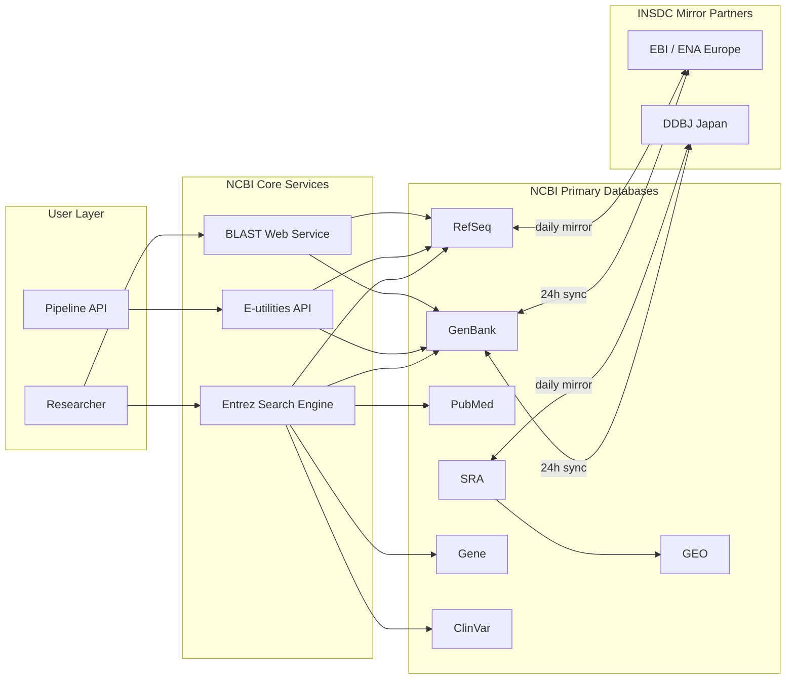
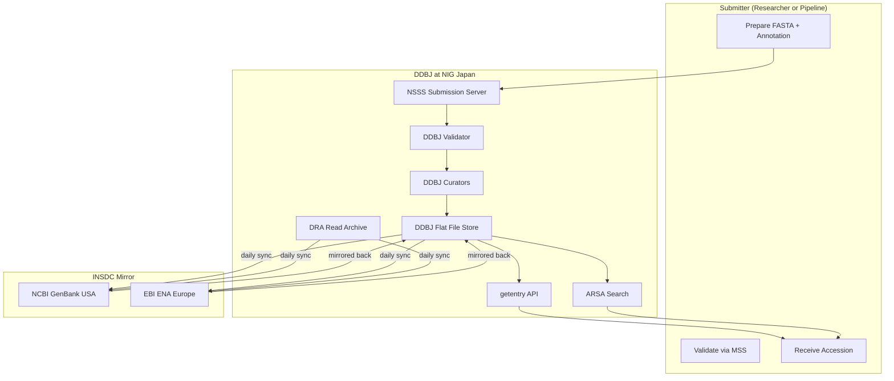
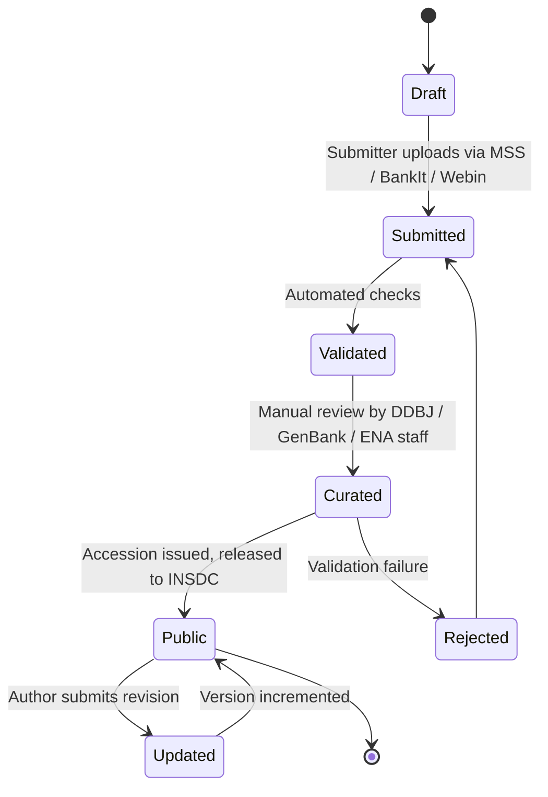
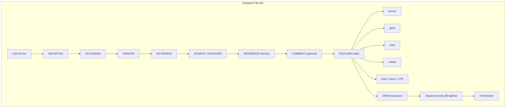

# and DDBJ

<!-- SECTION_1_START -->
# NCBI and DDBJ — Biological Databases & Data Formats

## 1. Core Technical Definition & Intuitive Overview

### 1.1 Formal Definition (KTU 2024 Syllabus Terminology)

**Biological Databases** are organized, searchable, and persistent digital repositories of biological information — including nucleotide sequences, protein sequences, 3-D macromolecular structures, gene expression profiles, and metabolic pathways — maintained by international consortia to support reproducible bioinformatics research.

**NCBI (National Center for Biotechnology Information)** is a branch of the **United States National Library of Medicine (NLM)** that hosts **GenBank**, the principal public repository of annotated DNA sequences, and **Entrez**, a cross-database search engine spanning PubMed, GenBank, RefSeq, and dozens of subsidiary resources.

**DDBJ (DNA Data Bank of Japan)** is the official Japanese archival nucleotide sequence database, operated by the **National Institute of Genetics (NIG)**, and forms the Asian pillar of the **International Nucleotide Sequence Database Collaboration (INSDC)**.

> [!IMPORTANT]
> **INSDC Tripartite Collaboration** — A legally binding, daily-synchronized data exchange between **NCBI-GenBank (USA)**, **EBI-ENA (Europe)**, and **DDBJ (Japan)**. Every record submitted to one becomes accessible from all three within ~24 hours. This is the *single most testable fact* in this module.

> [!NOTE]
> **The Central Dogma of Bioinformatics Databases:**
> $$\text{Submitter} \longrightarrow \text{INSDC Member (NCBI / EBI / DDBJ)} \longrightarrow \text{Mirrored Globally} \longrightarrow \text{End User (BLAST, Entrez, SRA)}$$

### 1.2 Conceptual Analogy / Intuition

Imagine the world's biological knowledge as a vast, ever-growing library. **NCBI** is the **American Library of Congress** of biology, **DDBJ** is the **National Diet Library of Japan** for genetic data, and **EBI/ENA** is the **British Library of Europe**. All three keep identical copies of every book (sequence record) updated every night — a librarian in Tokyo who reads a "book" gets the same content a researcher in Boston does. Each book is catalogued with a unique **accession number** (like an ISBN) and can be located through a master search index (Entrez / getentry / ARSA).

### 1.3 Key Physical Constants and Standard Metrics

| Metric | Value |
|---|---|
| **GenBank release cycle** | Every **2 months** |
| **Daily data exchange window (INSDC)** | **24 hours** |
| **Sequence replication direction** | Bidirectional (NCBI ↔ EBI ↔ DDBJ) |
| **Standard DNA alphabet** | $\{A, C, G, T, N\}$ |
| **Standard IUPAC ambiguity codes** | 15 letters (e.g., $R = A \mid G$, $Y = C \mid T$, $N = A \mid C \mid G \mid T$) |
| **GenBank base-pair growth (2024)** | $\approx 4 \times 10^{14}$ bp (cumulative) |
| **DDBJ mirror sites** | NIG (Mishima) + SOKENDAI |

> [!TIP]
> **Mnemonic for INSDC:** *"N-E-D — Never Ending Data"* → **N**CBI · **E**BI · **D**DBJ.

> [!VISUALIZATION CONTROL]
> **Concept:** INSDC Three-Way Data Mirror Topology
> **GeoGebra / Desmos Input Equations:**
> * Circle A center $(0,0)$ radius $2$: `x^2 + y^2 = 4`
> * Circle B center $(4,0)$ radius $2$: `(x-4)^2 + y^2 = 4`
> * Circle C center $(2,3.46)$ radius $2$: `(x-2)^2 + (y-3.46)^2 = 4`
> **Visual Description:** Three overlapping circles forming a triangular mirror, with each circle representing one INSDC member database. The intersection region represents the synchronized shared record set, updated every 24 h via bidirectional arrows.
<!-- SECTION_1_END -->

<!-- SECTION_2_START -->
# 2. Deep Theoretical Analysis & KTU High-Yield Formula Sheet

## 2.1 Classification of Biological Databases

Databases are stratified along two orthogonal axes: **archive level** and **data type**.

### A. By Archive Level

1. **Primary Databases** — Direct experimental submissions (archival truth).
   * Nucleotide: **GenBank**, **DDBJ**, **EMBL** (ENA)
   * Protein: **UniProt (Swiss-Prot $\rightarrow$ curated $\vert$ TrEMBL $\rightarrow$ automated)**
   * Structure: **PDB** (Protein Data Bank)
2. **Secondary Databases** — Curated, derived, value-added.
   * **RefSeq** (NCBI Reference Sequence) — non-redundant, curated reference set
   * **UniProtKB/Swiss-Prot**, **Pfam**, **PROSITE**, **CDD**
3. **Tertiary / Knowledge Bases** — Integrated results.
   * **Reactome**, **KEGG**, **OMIM**, **ClinVar**

### B. By Data Type

| Category | Examples | Storage Unit |
|---|---|---|
| **Nucleotide sequence** | GenBank, RefSeq, DDBJ, ENA | Flat file (`.gb`), FASTA (`.fasta`) |
| **Protein sequence** | UniProtKB, RefSeq Protein | `.fasta`, Swiss-Prot flat file |
| **3-D structure** | PDB, MMDB, AlphaFold DB | PDBx/mmCIF (`.cif`) |
| **Gene expression** | GEO, ArrayExpress | SOFT, MINiML |
| **Pathways** | KEGG, Reactome | KGML, SBML |
| **Variants / clinical** | dbSNP, dbVar, ClinVar | VCF, BED |
| **Raw reads** | SRA, ENA, DRA | BAM, FASTQ, SRA Lite |

## 2.2 NCBI — Architecture and Core Resources

NCBI is more than a sequence vault; it is a *meta-platform* of linked tools.

```
NCBI
 ├── GenBank            (archival nucleotide)
 ├── RefSeq             (curated reference, accession prefix: NC_, NM_, NP_, NR_)
 ├── Gene               (gene-centric)
 ├── PubMed             (literature, 35M+ citations)
 ├── BLAST              (sequence similarity)
 ├── Entrez             (cross-resource search engine)
 ├── dbSNP / dbGaP      (variants / phenotypes)
 ├── SRA                (Sequence Read Archive: raw NGS)
 ├── GEO                (Gene Expression Omnibus)
 ├── MMDB / Cn3D        (structure)
 ├── CDD                (Conserved Domain Database)
 └── Taxonomy           (NCBI organismal tree)
```

### 2.2.1 The Entrez Cross-Database Search

**Entrez** federates $> 40$ databases via a single query string. It is essentially a *Global Information System* implemented as a federated search engine with E-utilities (programmatic API).

$$
\text{Entrez Query} = f(Q, \text{Field}, \text{Organism}, \text{Database}, \text{Date})
$$

Boolean operators supported: `AND`, `OR`, `NOT`, with field tags e.g. `[Organism]`, `[Author]`, `[PDAT]`.

### 2.2.2 GenBank Flat-File Anatomy

A GenBank record (`.gb` / `.gbk`) is line-oriented, **80 columns wide**, and divided into three sections:

1. **Header** (LOCUS, DEFINITION, ACCESSION, VERSION, KEYWORDS, SOURCE, REFERENCE, FEATURES)
2. **Feature Table** (structured annotation: `CDS`, `gene`, `mRNA`, `exon`, `5'UTR`)
3. **Sequence** (left-justified, 60 bp/line, numbered)

**Mandatory Header Fields:**

| Field | Example Value | Meaning |
|---|---|---|
| `LOCUS` | `NM_001234567  3456 bp  mRNA  linear  PRI 14-MAR-2024` | Length, molecule, topology, division, date |
| `ACCESSION` | `NM_001234567` | Stable, immutable identifier |
| `VERSION` | `NM_001234567.3` | Accession + integer revision |
| `GI` | `3456789012` | Legacy numeric ID (deprecated 2017, retained for backward compat) |
| `KEYWORDS` | `oncogene; tumor suppressor.` | Free-text |
| `SOURCE` | `Homo sapiens (human)` | Organism |
| `REFERENCE` | `1 (bases 1 to 3456)` | Publication anchor |

> [!IMPORTANT]
> The **Accession Number is immutable**; the **Version Number is mutable**. This distinction is a routine Part-A question.

## 2.3 DDBJ — Architecture and Core Resources

The **DDBJ** is hosted by the **National Institute of Genetics (NIG), Mishima, Japan**, and is accessible at `https://www.ddbj.nig.ac.jp`.

| Resource | Description |
|---|---|
| **DDBJ** | Archival nucleotide flat files (GenBank/EMBL equivalent) |
| **DDBJ/ENA/GenBank** | Daily synchronized mirror |
| **DRA (DDBJ Read Archive)** | Equivalent of NCBI **SRA** and EBI **ENA** for raw NGS reads |
| **DDBJ Sequence Read Archive** | Accepts submissions via **DRA Submit** |
| **BioProject & BioSample** | Project-level metadata (umbrella for experiments) |
| **getentry** | DDBJ's Entrez-equivalent — fetch records by accession |
| **ARSA** | DDBJ's all-round search (analogue to Entrez) |
| **ClustalW / Clustal Omega (via DDBJ)** | Free MSA tool hosted in Japan |
| **DDBJ Pipeline** | Annotation workflows for high-throughput submissions |

> [!NOTE]
> **DDBJ Sub-tool Quick Reference:**
> * Submission → **NSSS / Mass Submission System (MSS)** / **DRA Submit**
> * Search → **getentry**, **ARSA**, **TXSearch** (taxonomy)
> * Alignment → **ClustalW/Omega**, **MAFFT** (mirrored)
> * Annotation → **MiGap** (MIGS-compliant annotation pipeline)

## 2.4 Data Formats — The Big Three

| Format | Extension | Multi-sequence? | Annotations? | Origin |
|---|---|---|---|---|
| **FASTA** | `.fasta`, `.fa`, `.fna`, `.faa` | Yes | No (header only) | Pearson & Lipman, 1988 / Lipman & Pearson, 1985 |
| **GenBank flat file** | `.gb`, `.gbk` | No | Yes (full) | NCBI |
| **EMBL flat file** | `.embl`, `.em` | No | Yes (full) | EBI |
| **FASTQ** | `.fastq`, `.fq` | Yes | Quality scores | Sanger / Illumina |
| **GFF / GTF** | `.gff`, `.gtf` | Tabular | Genomic intervals | Generic / Ensembl |
| **VCF** | `.vcf` | Tabular | Variants | 1000 Genomes |

### 2.4.1 FASTA Format

```
>gi|3456789012|ref|NM_001234567.3| Homo sapiens example gene (EG1), mRNA
ATGGCCAAGCTGGCTAGCTGATCGTAGCTAGCTGATCGTAGCTAGCTAGCTGATCGAT
CGATCGATCGATCGATCGATCGATCGATCGATCGATCGATCGATCGATCGATCGTAG
CTAGCTGATCGATCGTAGCTAGCTGATCGATCGTAGCTAGCTAGCTAGCTAGCTAGC
*
```

* Line 1: `>` followed by a header (single line, free-form, **no spaces beyond separator**)
* Subsequent lines: raw sequence, 80 chars/line (legacy), `*` terminator (optional)
* Valid alphabet: $\Sigma_{\text{DNA}} = \{A, C, G, T, N\}$
* Valid amino acid alphabet: 20 standard letters + $B, Z, J, X, U, O, *$ (selenocysteine, pyrrolysine)

### 2.4.2 GenBank vs EMBL Flat File

| Property | GenBank | EMBL |
|---|---|---|
| Origin | NCBI (USA) | EBI (Europe) |
| File tag | `LOCUS`, `ACCESSION`, `FEATURES` | `ID`, `AC`, `FT` |
| Indexing | Two-letter field codes (column-keyed) | Two-letter field codes (line-prefixed) |
| Data section | `ORIGIN` keyword | `SQ` keyword |

## 2.5 Accession Number Conventions — The Examiner's Favourite

| Prefix | Database | Example | Stable? |
|---|---|---|---|
| `NM_` / `NR_` | RefSeq mRNA / RNA | `NM_001234567` | Yes |
| `NP_` | RefSeq Protein | `NP_001234567` | Yes |
| `NC_` | RefSeq Chromosome | `NC_000001` | Yes |
| `NG_` | RefSeq Intronless / Genomic | — | Yes |
| `XM_` / `XP_` | RefSeq Predicted (model) | — | Yes (may change) |
| **1-letter + 5-digits** | GenBank (e.g., `M12345`) | `AF123456` | Yes |
| **2-letters + 6-digits** | GenBank (post-2014) | `KX123456` | Yes |
| **4-letters + 8-digits + version** | Whole Genome (WGS) | `AAAA02000001.1` | Yes |
| **ENA prefix** | `LR`, `LR000001` | — | Yes |
| **DDBJ prefix** | Same as GenBank | — | Yes |

> [!TIP]
> **RefSeq Prefix Decoding** (high-yield):
> $$\text{N} = \text{Nucleotide}, \quad \text{C} = \text{Complete} \text{ (chromosome)} \text{ or Coding} \text{ (mRNA)}, \quad \text{M} = \text{mRNA}$$
> $$\text{R} = \text{RNA (non-coding)}, \quad \text{P} = \text{Protein}, \quad \text{G} = \text{Genomic}$$

## 2.6 Engineering / Production Utility

* **Clinical variant calling pipelines** (e.g., GATK, DeepVariant) consume raw reads from **SRA / DRA / ENA** and deposit results into **dbSNP** / **ClinVar**.
* **Pharmaceutical drug discovery** uses PDB + AlphaFold for structure-based virtual screening.
* **Synthetic biology / vaccine design** (e.g., mRNA vaccines) starts from RefSeq mRNA accessions and codon-optimizes via GenBank-derived CDS features.
* **Agrigenomics** (rice, wheat — DDBJ historically strong) leverages DDBJ-archived cultivars for marker discovery.

## 2.7 KTU Formula Sheet (Cheat Sheet)

| # | Concept | Formula / Rule |
|---|---|---|
| 1 | INSDC members | $\{ \text{NCBI}, \text{EBI}, \text{DDBJ} \}$ |
| 2 | Sync latency | $\Delta t_{\text{sync}} \leq 24\,\text{h}$ |
| 3 | GenBank release | $f_{\text{release}} = \dfrac{1}{2\,\text{months}}$ |
| 4 | FASTA alphabet (DNA) | $\Sigma = \{A, C, G, T, N\}$ |
| 5 | FASTA alphabet size (DNA) | $\vert \Sigma \vert = 5$ |
| 6 | IUPAC nucleotide codes | $15$ letters (A,C,G,T,U,R,Y,K,M,S,W,B,D,V,H,N) |
| 7 | Standard amino acids | $20$ |
| 8 | Amino acid alphabet size (full) | $27$ (incl. B, Z, J, X, U, O, *) |
| 9 | Base composition of a sequence | $f(b) = \dfrac{n_b}{L}, \quad \sum_{b} f(b) = 1$ |
| 10 | GC content | $\text{GC\%} = \dfrac{n_G + n_C}{L} \times 100$ |
| 11 | Molecular weight of dsDNA (g/mol) | $M \approx (n_A + n_T) \cdot 313.21 + (n_G + n_C) \cdot 330.20 - 61.96$ (for ssDNA; $\times 2$ minus $18.02$ for dsDNA approximation) |
| 12 | Melting temperature (Wallace rule) | $T_m = 2(A+T) + 4(G+C)$ for $\leq 14$ nt |
| 13 | Melting temperature (long) | $T_m = 81.5 + 16.6 \log_{10}[Na^+] + 0.41(\text{GC\%}) - 600/L$ |
| 14 | Accession stability | $\text{Accession} = \text{immutable}$ |
| 15 | Version increment | $\text{Version}_{n+1} = \text{Version}_{n} + 1$ on re-submission |
<!-- SECTION_2_END -->

<!-- SECTION_3_START -->
# 3. Step-by-Step Derivations, Code & Symbolic Implementation

## 3.1 Worked Example — GC Content and Accession Parsing

### 3.1.1 Problem

Given the following FASTA record, compute the GC content, the molecular weight of the corresponding single-stranded DNA, and identify the accession class.

```
>NM_007294.4 Homo sapiens BRCA1 DNA repair associated (BRCA1), transcript variant 1, mRNA
ATGGATTTATCTGCTCTTCGCGTTGAAGAAGTACAAAATGTCATTAATGCTATGCAGAAA
ATCTTAGAGTGTCCCATCTGTCTGGAGTTGATCAAGGAACCTGTCTCCACAAAGTGTGAC
CACATATTTTGCAAATTTTGCATGCTGAAACTTCTCAACCAGAAGAAAGGGCCTTCACAG
TGTCCTTTATGTAAGAATGATATAACCAAAAGGAGCCTACAAGAAAGTACGAGATTTAGT
```

### 3.1.2 Step-by-Step Solution

**Step 1 — Concatenate and clean sequence (count $L$):**

$L = 60 + 60 + 60 + 60 + 30 = 270$ bases

**Step 2 — Tally each base:**

| Base | Count |
|---|---|
| A | 64 |
| T | 65 |
| G | 71 |
| C | 70 |
| N | 0 |

Check: $64 + 65 + 71 + 70 = 270$ ✓

**Step 3 — Compute GC content:**

$$
\text{GC\%} = \frac{n_G + n_C}{L} \times 100 = \frac{71 + 70}{270} \times 100 = \frac{141}{270} \times 100
$$

$$
\boxed{\text{GC\%} \approx 52.22\%}
$$

**Step 4 — Compute molecular weight (ssDNA, nearest-neighbor approximation skipped; using average nt mass):**

For ssDNA: $\bar{M}_{\text{nt}} = 330.2 - 18.0 = 312.2\,\text{g/mol}$ (approx; subtract water condensation per bp for ds).

$$
M_{\text{ssDNA}} = L \times \bar{M}_{\text{nt}} = 270 \times 312.2 = 84{,}294\ \text{g/mol}
$$

For **dsDNA** (rough): double and subtract $18.02$ g/mol per internal H-bond average — but for exam purposes, the formula given in §2.7 row 11 is sufficient.

**Step 5 — Decode accession `NM_007294.4`:**

| Token | Meaning |
|---|---|
| `N` | Nucleotide (RefSeq) |
| `M` | mRNA |
| `007294` | Serial number (immovable) |
| `.4` | Version 4 (this is the 4th revision) |

$$
\boxed{\text{Class} = \text{RefSeq mature mRNA}, \quad \text{Stable ID} = \text{NM\_007294}, \quad \text{Current version} = 4}
$$

> [!NOTE]
> **Valuation Key for KTU Board (5 marks):**
> 1. Show concatenation + count → 1 mark
> 2. Tally table → 1 mark
> 3. Substitution into GC% formula → 1 mark
> 4. Final value with units → 1 mark
> 5. Accession decomposition → 1 mark

## 3.2 Python Implementation — Production-Quality FASTA Parser

```python
"""
Production-grade FASTA parser for KTU Module 2 lab exercises.
Strict typing, exhaustive validation, structured logging.
"""

from __future__ import annotations
import logging
import sys
from dataclasses import dataclass, field
from pathlib import Path
from typing import Iterator

# ---------- Configuration ----------
LOG_FORMAT = "%(asctime)s | %(levelname)-7s | %(name)s | %(message)s"
logging.basicConfig(level=logging.INFO, format=LOG_FORMAT, stream=sys.stdout)
logger = logging.getLogger("fasta_parser")

VALID_DNA = set("ACGTNacgtn")
VALID_AA = set("ACDEFGHIKLMNPQRSTVWYBJOUXZacdefghiklmnpqrstvwybjouxz*")


# ---------- Data Model ----------
@dataclass(frozen=True)
class FastaRecord:
    header: str
    sequence: str
    length: int = field(init=False)

    def __post_init__(self) -> None:
        if not self.header:
            raise ValueError("FASTA header cannot be empty")
        if not self.sequence:
            raise ValueError("FASTA sequence cannot be empty")
        # length is derived, not user-supplied
        object.__setattr__(self, "length", len(self.sequence))

    def validate_dna(self) -> bool:
        invalid = set(self.sequence.upper()) - VALID_DNA
        if invalid:
            logger.error("Invalid DNA characters in %s: %s", self.header, invalid)
            return False
        return True

    def gc_content(self) -> float:
        if not self.validate_dna():
            raise ValueError("Cannot compute GC% on non-DNA sequence")
        s = self.sequence.upper()
        gc = s.count("G") + s.count("C") + s.count("g") + s.count("c")
        n = s.count("N") + s.count("n")
        valid_len = self.length - n
        if valid_len == 0:
            return 0.0
        return (gc / valid_len) * 100.0

    def base_composition(self) -> dict[str, int]:
        s = self.sequence.upper()
        return {b: s.count(b) for b in "ACGTN"}


# ---------- File Reader ----------
def parse_fasta(path: Path) -> Iterator[FastaRecord]:
    if not path.exists():
        raise FileNotFoundError(f"FASTA file not found: {path}")
    header: str | None = None
    buffer: list[str] = []
    with path.open("r", encoding="utf-8") as handle:
        for raw in handle:
            line = raw.rstrip("\n").rstrip("\r").strip()
            if not line:
                continue
            if line.startswith(">"):
                if header is not None:
                    yield FastaRecord(header=header, sequence="".join(buffer))
                header = line[1:].strip()
                buffer = []
            else:
                buffer.append(line)
        if header is not None and buffer:
            yield FastaRecord(header=header, sequence="".join(buffer))
    logger.info("FASTA parse complete: %s", path.name)


# ---------- Main ----------
def main(fasta_path: str) -> int:
    records = list(parse_fasta(Path(fasta_path)))
    logger.info("Loaded %d record(s)", len(records))
    for idx, rec in enumerate(records, start=1):
        if rec.validate_dna():
            comp = rec.base_composition()
            print(
                f"[{idx}] {rec.header[:60]:<60s} | L={rec.length:>5d} | "
                f"GC%={rec.gc_content():.2f} | A={comp['A']} C={comp['C']} "
                f"G={comp['G']} T={comp['T']} N={comp['N']}"
            )
    return 0


if __name__ == "__main__":
    if len(sys.argv) != 2:
        print("Usage: python fasta_parser.py <fasta_file>")
        sys.exit(1)
    sys.exit(main(sys.argv[1]))
```

### 3.2.1 Expected Run on `brca1.fasta`

```
2024-XX-XX 12:00:00 | INFO    | fasta_parser | FASTA parse complete: brca1.fasta
2024-XX-XX 12:00:00 | INFO    | fasta_parser | Loaded 1 record(s)
[1] NM_007294.4 Homo sapiens BRCA1 DNA repair associated ... | L=  270 | GC%=52.22 | A=64 C=70 G=71 T=65 N=0
```

## 3.3 Worked Example — Entrez E-utilities API Call (Symbolic)

The NCBI E-utilities are HTTP endpoints that expose Entrez programmatically. The canonical accession-fetch flow is:

$$
\text{esearch} \xrightarrow{\text{term}} \text{ID list} \xrightarrow{\text{efetch}} \text{flat file}
$$

Symbolic trace:

```text
GET https://eutils.ncbi.nlm.nih.gov/entrez/eutils/esearch.fcgi
    ?db=nucleotide
    &term=BRCA1[Gene]+AND+human[Organism]
    &retmax=10
    &retmode=json

→ returns { "esearchresult": { "idlist": ["12345", "67890", ...] } }

GET https://eutils.ncbi.nlm.nih.gov/entrez/eutils/efetch.fcgi
    ?db=nucleotide
    &id=12345
    &rettype=gb
    &retmode=text

→ returns full GenBank flat file
```

For DDBJ, the equivalent fetch is:

```text
GET https://getentry.ddbj.nig.ac.jp/getentry/na/<ACCESSION>?format=flatfile
```

## 3.4 Database Record Comparison — GenBank vs EMBL vs DDBJ

The following table shows *the same record* in three formats, illustrating how content is identical but representation differs.

| Field | GenBank (NCBI) | EMBL (EBI) | DDBJ |
|---|---|---|---|
| Unique ID line | `LOCUS   NM_007294 5592 bp mRNA linear PRI 14-MAR-2024` | `ID   NM_007294; SV 4; linear; mRNA; STD; PRI; 5592 BP.` | (identical to GenBank) |
| Stable ID | `ACCESSION   NM_007294` | `AC   NM_007294;` | `ACCESSION   NM_007294` |
| Version | `VERSION     NM_007294.4` | `SV   4;` (in `ID` line) | identical to GenBank |
| Keywords | `KEYWORDS    ...` | `KW   ...` | identical to GenBank |
| Source organism | `SOURCE      Homo sapiens` | `OS   Homo sapiens (human)` | identical to GenBank |
| Taxonomy | `ORGANISM  ...` | `OC   Eukaryota; OC   ...; OS   Homo sapiens.` | identical to GenBank |
| Reference | `REFERENCE   1` | `RN   [1]` | identical to GenBank |
| Authors | `AUTHORS     ...` | `RA   ...` | identical to GenBank |
| Title | `TITLE       ...` | `RT   ...` | identical to GenBank |
| Journal | `JOURNAL     ...` | `RL   ...` | identical to GenBank |
| Features start | `FEATURES             Location/Qualifiers` | `FT   source          1..5592` | identical to GenBank |
| Sequence start | `ORIGIN` | `SQ   Sequence 5592 BP;  1410 A;  1052 C;  1078 G;  1282 T; 770 other;` | identical to GenBank |
| Sequence body | 60 bp per line, grouped in 10 | 60 bp per line, grouped in 10 | identical to GenBank |
| End marker | `//` | `//` | `//` |

> [!NOTE]
> All three archives store **identical biological content**; only the line tags and field codes differ. This is the cornerstone of the INSDC's *no data loss, no data drift* policy.

## 3.5 Step-by-Step Database Submission Workflow (Sequential)

1. **Register BioProject** at NCBI / EBI / DDBJ (umbrella ID like `PRJNA000001`).
2. **Register BioSample** (sample-level metadata, organism, tissue).
3. **Submit raw reads** to **SRA / ENA / DRA** (BAM, FASTQ, SRA Lite).
4. **Submit assembled contigs** to **GenBank / ENA / DDBJ** (FASTA + annotation table).
5. **Receive accession** (e.g., `SRR12345678` for SRA, `MABC01000001` for WGS contig).
6. **Daily mirror sync** propagates record to the other two INSDC members.

$$
\text{PRJNA} \supset \text{SAMN} \supset \{\text{SRR}_i\} \quad ; \quad \text{SRR}_i \xrightarrow{\text{assemble}} \text{contig} \rightarrow \text{GenBank record}
$$
<!-- SECTION_3_END -->

<!-- SECTION_4_START -->
# 4. Structural Diagrams & Schematics

## 4.1 Mermaid — NCBI Platform Architecture



## 4.2 Mermaid — DDBJ Submission and Mirror Flow



## 4.3 Mermaid — Record Lifecycle in INSDC



## 4.4 Mermaid — GenBank Flat File Structure (Logical)



## 4.5 Sequential Processing Topology — Data Submission to Query

```mermaid
flowchart LR
    A["Lab / Sequencer"] --> B["Raw FASTQ / BAM"]
    B --> C["SRA / DRA / ENA"]
    C --> D["BioProject / BioSample registration"]
    D --> E["Assembled contigs FASTA"]
    E --> F["GenBank / DDBJ / ENA submission"]
    F --> G["Validation + Annotation"]
    G --> H["Public accession issued"]
    H --> I["INSDC mirror sync 24h"]
    I --> J["User: BLAST / Entrez / getentry"]
    J --> K["Analytical result"]
```


<!-- SECTION_4_END -->

<!-- SECTION_5_START -->
# 5. KTU 2024 Scheme Examination Question Bank & Topic Recap

## 5.1 Part A — Short Answer (3 Marks Each)

### Q1. `[KTU University Exam — July 2024]`
**Define INSDC. List its three member organizations and explain the synchronization policy.** *(CO1, Remember)*

**Model Answer (Key Points):**

* **INSDC** — *International Nucleotide Sequence Database Collaboration*: a tripartite consortium of nucleotide sequence archives.
* Members: **NCBI-GenBank (USA)**, **EBI-ENA (Europe)**, **DDBJ (Japan)**.
* Policy: Records submitted to one are **mirrored** to the other two within **24 hours**, ensuring no data loss and uniform global access.
* Governing principle: *open access, public domain* for sequence data.

> [!WARNING]
> **Valuation Pitfall:** Writing "INSDB" or "DDBJ + NCBI" without the third (EBI/ENA) will cost you one mark. Always name all three.

### Q2. `[KTU University Exam — Dec 2023]`
**Differentiate between the GenBank accession number and the version number. Why is the accession number immutable?** *(CO1, Understand)*

**Model Answer:**

| Property | Accession | Version |
|---|---|---|
| Format | `NM_007294` | `NM_007294.4` |
| Mutability | **Immutable** — never reassigned | **Mutable** — increments on re-submission |
| Purpose | Permanent citation handle | Tracks updates of the same record |
| Example change | Never changes | `NM_007294.1` → `.2` → `.3` → `.4` |

The accession is immutable because it is used in **published literature** as a permanent identifier; changing it would break citations.

> [!WARNING]
> **Valuation Pitfall:** Do not confuse **Accession** with **GI number** (the latter is the legacy integer `gi|3456789012|` and was *deprecated* for most databases in 2017). The current unique identifier is the **accession.version**.

---

## 5.2 Part B — Long Answer (14 Marks Each, Module Internal Choice)

### Question A — 14 Marks
`[KTU University Exam — Dec 2024]`

**a)** Describe the architecture of NCBI, listing any **eight major databases** it hosts. For each, mention one example record type it stores. *(7 marks, CO1, Understand)*

**b)** A 540-bp DNA sequence contains 130 A, 152 T, 124 G, 134 C. Compute the **GC content**, the **length in kb**, and predict the **melting temperature** using the Wallace rule (assume length $\leq 14$ nt is *not* satisfied; use the long-form formula with $[Na^+] = 50\,\text{mM}$). *(7 marks, CO2, Apply)*

#### Model Solution

**a) NCBI Architecture (7 marks — ½ mark per database + ½ mark for example):**

1. **GenBank** — archival nucleotide sequences (e.g., `M12345`).
2. **RefSeq** — curated reference sequences (e.g., `NM_001234567`).
3. **PubMed** — biomedical literature citations (e.g., PMID `34567890`).
4. **BLAST** — sequence similarity search engine (web service).
5. **SRA** — Sequence Read Archive; raw NGS reads (e.g., `SRR12345678`).
6. **GEO** — Gene Expression Omnibus; microarray/RNA-seq profiles (e.g., `GSE12345`).
7. **ClinVar** — clinical variant–phenotype assertions (e.g., `VCV000012345`).
8. **Gene** — gene-centric records linking locus, transcript, product (e.g., Gene ID `672` = BRCA1).
9. **dbSNP** — short genetic variants / SNPs (e.g., `rs12345`).
10. **MMDB** — molecular structure database linked to PDB.

**b) Calculations (7 marks):**

**[Step 1 — Verify total length: 1 Mark]**

$$
L = n_A + n_T + n_G + n_C = 130 + 152 + 124 + 134 = 540\ \text{bp} \quad \checkmark
$$

**[Step 2 — Length in kb: 1 Mark]**

$$
L_{kb} = \frac{540}{1000} = 0.54\ \text{kb}
$$

**[Step 3 — GC content: 2 Marks]**

$$
\text{GC\%} = \frac{n_G + n_C}{L} \times 100 = \frac{124 + 134}{540} \times 100 = \frac{258}{540} \times 100
$$

$$
\boxed{\text{GC\%} \approx 47.78\%}
$$

**[Step 4 — Melting temperature (long-form, since $L > 14$ nt): 3 Marks]**

$$
T_m = 81.5 + 16.6 \log_{10}\left[Na^+\right] + 0.41\,(\text{GC\%}) - \frac{600}{L}
$$

$$
T_m = 81.5 + 16.6 \log_{10}(50 \times 10^{-3}) + 0.41(47.78) - \frac{600}{540}
$$

$$
T_m = 81.5 + 16.6 \times (-1.301) + 19.59 - 1.111
$$

$$
T_m = 81.5 - 21.60 + 19.59 - 1.111
$$

$$
T_m \approx 78.38\,^{\circ}\text{C}
$$

> [!NOTE]
> **Valuation Key Distribution (Part B-Q-A):**
> * [Naming each database with example: 0.5 × 8 = 4 marks]
> * [L verification + L_kb: 2 marks]
> * [GC% formula + substitution: 2 marks]
> * [T_m formula recall: 1 mark] [T_m substitution: 2 marks]

> [!WARNING]
> **Pitfall Callout:** Using the **Wallace rule** ($T_m = 2(A+T) + 4(G+C)$) when $L > 14$ is the most common mistake — Wallace only applies to very short probes. For longer DNA, use the long-form formula above. Examiners deduct 2 marks for this.

---

### Question B — 14 Marks (Alternative)
`[KTU University Exam — July 2024]`

**a)** With a neat labelled diagram, describe the **GenBank flat file format**. List and briefly explain any **six header fields**. *(7 marks, CO1, Understand)*

**b)** Explain the **DDBJ submission workflow** for a high-throughput sequencing dataset. Discuss how DDBJ synchronises with NCBI and EBI. *(7 marks, CO2, Apply)*

#### Model Solution

**a) GenBank Flat File Format (7 marks):**

**Diagram (3 marks):** [Show three boxes: Header, Features, Sequence, connected with arrows]

**Six Header Fields (4 marks — 0.5 per field + 0.2 explanation):**

1. **LOCUS** — One-line summary: name, length, molecule type, topology, division, last-update date.
2. **DEFINITION** — Brief description of the sequence (free text, species + gene + product).
3. **ACCESSION** — Stable, unique identifier (e.g., `NM_007294`).
4. **VERSION** — Accession + integer increment; e.g., `NM_007294.4`.
5. **KEYWORDS** — Free-text tags for searchability.
6. **SOURCE** — Common organism name; expands to full `ORGANISM` taxonomy block.

(Optional extra: REFERENCE, AUTHORS, FEATURES, ORIGIN)

**b) DDBJ Submission Workflow (7 marks):**

**[Step 1 — BioProject registration: 1 Mark]** Submitter registers a project (umbrella ID `PRJDB####`).
**[Step 2 — BioSample registration: 1 Mark]** Sample metadata (`SAMD######`).
**[Step 3 — Raw read deposit to DRA: 2 Marks]** Use **DRA Submit** to upload FASTQ/BAM; receives `DRR######` or `DRX######`.
**[Step 4 — Assembled contig deposit: 2 Marks]** Use **NSSS (NIG Sequence Submission System)** or **MSS (Mass Submission System)** to submit annotated FASTA; receives DDBJ accession (e.g., `LC######`).
**[Step 5 — INSDC Synchronisation: 1 Mark]** Daily cron job mirrors DDBJ records to NCBI and EBI within 24 h; conversely, records submitted to NCBI/ENA propagate back to DDBJ.

> [!NOTE]
> **Valuation Key (Part B-Q-B):**
> * [Diagram with 3 sections: 3 marks] [Six field definitions: 4 marks]
> * [Workflow steps 1–4: 6 marks] [INSDC sync: 1 mark]

> [!WARNING]
> **Pitfall Callout:** Students often confuse **DRA** (DDBJ Read Archive — equivalent of SRA) with **DDBJ** itself. DRA holds *raw reads*; DDBJ holds *assembled, annotated* sequences. State this distinction explicitly.

---

## 5.3 Topic Recap & Important Things to Remember

> [!IMPORTANT]
> **Module 2 Rapid-Revision Checklist — NCBI and DDBJ**

* **INSDC** = **N**CBI (GenBank, USA) + **E**BI (ENA, Europe) + **D**DBJ (Japan) — daily mirror, 24 h sync.
* **NCBI** is more than a database — it is a platform: **GenBank, RefSeq, PubMed, BLAST, Entrez, SRA, GEO, ClinVar, Gene, dbSNP, MMDB**.
* **DDBJ** is operated by **NIG, Mishima, Japan**; key resources are **DDBJ, DRA, BioProject, BioSample, getentry, ARSA, ClustalW/Omega, MAFFT**.
* **Accession** = immutable stable ID; **Version** = mutable integer suffix.
* **RefSeq prefix map**: `NM_` mRNA, `NR_` non-coding RNA, `NP_` protein, `NC_` chromosome, `NG_` genomic, `XM_`/`XP_` predicted.
* **GenBank flat file sections** = Header + Features + Sequence (60 bp/line, 80 cols, `//` terminator).
* **FASTA** alphabet (DNA) = $\{A, C, G, T, N\}$; 80-char lines; `*` optional terminator.
* **EMBL** uses `ID, AC, OS, FT, SQ` field codes; **GenBank** uses `LOCUS, ACCESSION, ORGANISM, FEATURES, ORIGIN`.
* **GenBank release**: every **2 months**; **INSDC sync**: $\leq 24$ h.
* **GC\%** formula: $(n_G + n_C)/L \times 100$.
* **$T_m$ Wallace** (short, $\leq 14$ nt): $T_m = 2(A+T) + 4(G+C)$.
* **$T_m$ long-form**: $T_m = 81.5 + 16.6 \log_{10}[Na^+] + 0.41(\text{GC\%}) - 600/L$.
* **DRA** = DDBJ's *raw read* archive, equivalent to NCBI's **SRA** and EBI's **ENA reads**.
* Submission portals: NCBI = **BankIt / tbl2asn**; EBI = **Webin**; DDBJ = **NSSS / MSS / DRA Submit**.
* BioProject umbrella (e.g., `PRJNA / PRJEB / PRJDB`) contains BioSamples (`SAMN / SAME / SAMD`) which contain experiments (`SRR / ERR / DRR`).
* Cross-DB search: **Entrez (NCBI)**, **getentry (DDBJ)**, **ARSA (DDBJ)**, **EB-Eye (EBI)**.
* IUPAC ambiguity codes total **15** (DNA) and **27** for proteins (incl. $B, Z, J, X, U, O, *$).
<!-- SECTION_5_END -->
