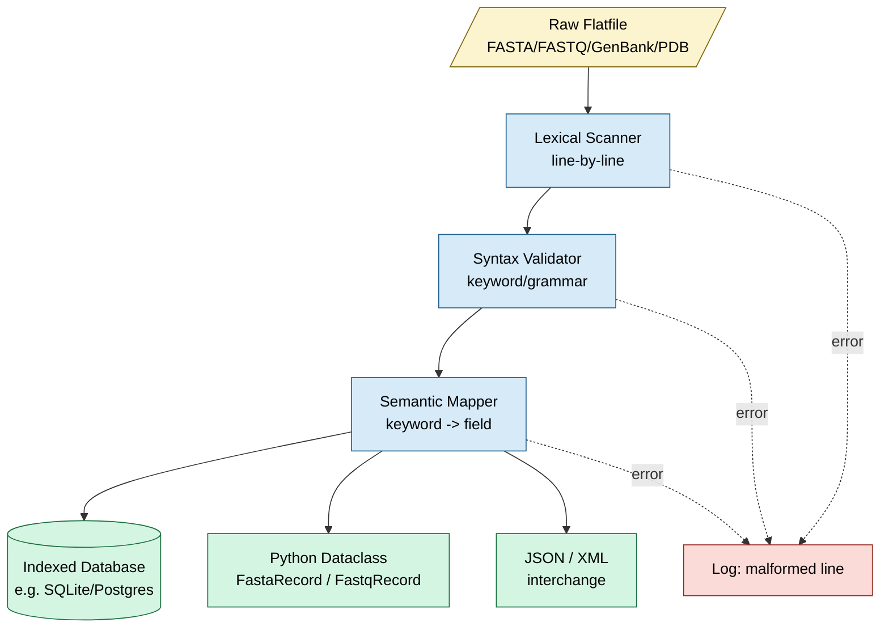
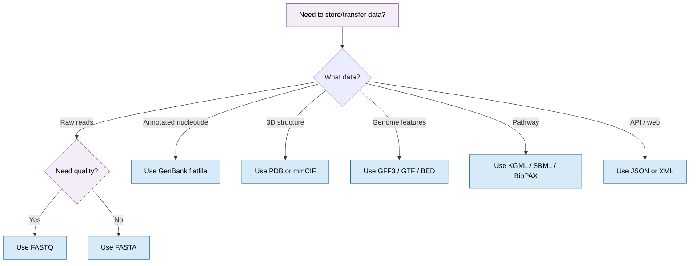

# Biological Databases and Data Formats (3 hours)

<!-- SECTION_1_START -->
# Biological Databases and Data Formats — KTU 2024 Module 2

## 1. Core Technical Definition & Intuitive Overview

### 1.1 Formal Definition (KTU 2024 Syllabus Terminology)

A **Biological Database** is a digitally archived, persistently indexed, and computationally searchable collection of experimentally validated or computationally predicted biological information — encompassing nucleotide sequences, protein sequences, macromolecular three-dimensional structures, gene expression profiles, metabolic pathways, genomic variants, and associated bibliographic metadata — organized under a standardized schema, made publicly (or selectively) accessible through query interfaces, and curated to support reproducible in-silico research in genomics, proteomics, and systems biology.

> [!IMPORTANT]
> **KTU 2024 Module 2 Highlight:** Biological databases are the **backbone of computational biology**. Without a curated database, no sequence alignment, no BLAST search, no homology modeling, and no drug-discovery pipeline can be initiated. Every bioinformatic workflow begins with a database **query** and ends with a database **submission** (or deposit).

### 1.2 Conceptual Analogy — The Genomic Library

Imagine a **massive global library** where:

| Real-World Library Element | Biological Database Equivalent |
|---|---|
| Dewey Decimal catalogue | **Accession Number** (e.g., `NM_007294`) |
| Index card for each book | **Record / Entry** (one record = one sequence) |
| Genre (fiction, science, history) | **Database Class** (DNA, Protein, Structure, Pathway) |
| Master copy vs. annotated summary | **Primary vs. Secondary** database |
| Borrowing system | **Retrieval tool** (Entrez, SRS, EB-eye) |
| Reference desk | **Curator team** (NCBI, EBI, SIB, NIG) |

Every biological record behaves like a **library entry** that has a **unique permanent identifier (accession number)**, a **structured description** (annotation), and a **standardized format** so any researcher worldwide can "borrow" (download) and "read" (parse) it identically.

### 1.3 Categories of Biological Databases — At a Glance

Biological databases are stratified along **three orthogonal axes**:

1. **Data type axis** — nucleotide, protein, structure, expression, pathway, variant, literature.
2. **Curation depth axis** — *Primary* (raw archival) → *Secondary* (curated, annotated) → *Tertiary* (derived, integrated, motif/domain catalogs).
3. **Data origin axis** — *Experimental deposition* (e.g., a sequenced genome) vs. *Computational prediction* (e.g., a homology model).

> [!NOTE]
> **Core Categories Memorization Map for KTU:**
> - **Primary (Archival):** GenBank, EMBL-EBI ENA, DDBJ, PDB (raw)
> - **Secondary (Curated):** UniProtKB/Swiss-Prot, RefSeq, PIR, SCOP, CATH
> - **Specialized (Domain-Specific):** KEGG, Reactome, OMIM, dbSNP, Ensembl, UCSC, FlyBase, TAIR
> - **Structure:** PDB, PDBsum, SCOPe, CATH, MMDB
> - **Pathways:** KEGG, Reactome, BioCyc, PANTHER, WikiPathways

### 1.4 Why Data Formats Matter

A *biological record* is meaningless if every lab writes it in a different style. Therefore the community converges on **standardized flat-file formats** that any parser, any language, and any operating system can read. The four most important for KTU are:

- **FASTA** — the universal plain-text sequence format.
- **FASTQ** — FASTA + per-base quality scores (used in NGS).
- **GenBank Flatfile (`.gb`)** — rich annotated nucleotide record.
- **PDB (`.pdb`)** — three-dimensional atomic coordinates of macromolecules.

> [!VISUALIZATION CONTROL]
> **Concept:** Relative size and overlap of three major sequence databases.
> **Mock dataset for bar chart (paste in GeoGebra / Desmos):**
> * GenBank (nt): `bar_1 = 2400000000000`  (≈ 2.4 trillion bases)
> * ENA (nt):       `bar_2 = 2200000000000`
> * DDBJ (nt):      `bar_3 = 900000000000`
> **Visual Description:** A horizontal bar plot where the three bars are nearly equal in length, showing the International Nucleotide Sequence Database Collaboration (INSDC) data mirror each other. The student should observe that GenBank, ENA, and DDBJ exchange data nightly — they are not three independent databases but **one logical repository** mirrored across three continents.

---

<!-- SECTION_1_END -->

<!-- SECTION_2_START -->
# Deep Theoretical Analysis & KTU High-Yield Reference Sheet

## 2.1 Primary vs. Secondary vs. Tertiary Databases

### 2.1.1 Primary (Archival) Databases

- Receive data **directly from experimentalists** via submission tools (e.g., BankIt, Webin, Mass Submission).
- **Redundancy is allowed** — multiple entries for the same gene from different labs are common.
- Records receive a **permanent, stable accession number** that never changes.
- Jointly maintained by the **International Nucleotide Sequence Database Collaboration (INSDC)** — GenBank (NCBI, USA), ENA (EBI, UK), DDBJ (NIG, Japan).

> [!IMPORTANT]
> Accession number immutability is a **legal-grade guarantee** in bioinformatics. Once `NM_007294.4` is issued, it ALWAYS refers to the same BRCA1 transcript record. Versions (`.1`, `.2`) change; the accession never does.

### 2.1.2 Secondary (Curated) Databases

- Built by expert biologists who **merge redundant primary entries**, **add functional annotation**, **cross-link to literature**, and **remove low-quality records**.
- Examples: **UniProtKB/Swiss-Prot** (curated protein DB), **RefSeq** (curated reference sequences), **PDB** (curated 3D structures).
- **Lower redundancy, higher reliability, higher annotation depth**.

### 2.1.3 Tertiary / Derived Databases

- Built by **computationally integrating** multiple primary/secondary sources.
- Examples: **UniProt Archive (UniParc)** (non-redundant), **InterPro** (unified protein families, domains, sites), **STRING** (protein–protein interactions), **Pfam** (protein families via HMMs).

## 2.2 Specialized Database Classes (KTU-Favoured List)

| Database | Class | Key Use | URL Pattern |
|---|---|---|---|
| **GenBank** | Primary nucleotide | Archival DNA/RNA | ncbi.nlm.nih.gov/genbank |
| **ENA** | Primary nucleotide | Mirror of GenBank/DDBJ | ebi.ac.uk/ena |
| **DDBJ** | Primary nucleotide | Asian mirror of INSDC | ddbj.nig.ac.jp |
| **UniProtKB** | Secondary protein | Curated protein knowledge | uniprot.org |
| **RefSeq** | Secondary nucleotide | Curated reference sequences | ncbi.nlm.nih.gov/refseq |
| **PDB** | Primary/secondary structure | 3D macromolecules | rcsb.org |
| **SCOP / SCOPe** | Tertiary structure | Structural classification (evolution) | scop2.mrc-lmb.cam.ac.uk |
| **CATH** | Tertiary structure | Structural classification (Class/Arch/Topology/Homology) | cathdb.info |
| **KEGG** | Pathway | Metabolic/signaling pathways | kegg.jp |
| **Reactome** | Pathway | Curated reaction network | reactome.org |
| **OMIM** | Disease | Mendelian disorders | omim.org |
| **dbSNP** | Variation | SNPs & short variants | ncbi.nlm.nih.gov/snp |
| **Ensembl** | Genome | Annotated eukaryotic genomes | ensembl.org |
| **UCSC Genome Browser** | Genome | Visualization-centric | genome.ucsc.edu |
| **GeneCards** | Gene summary | Human gene compendium | genecards.org |

## 2.3 Data Format Deep-Dive — Cheat Sheet

> [!NOTE]
> **Table below uses `\vert` instead of literal `|` in mathematical expressions to preserve markdown table integrity.**

| Format | File Extension | Holds | Mandatory First Line | One Record Delimiter | Quality Scores? |
|---|---|---|---|---|---|
| **FASTA** | `.fasta`, `.fa`, `.fna`, `.faa` | Nucleotide or protein sequence | `>` followed by header | New `>` line | No |
| **FASTQ** | `.fastq`, `.fq` | Sequence + quality | `@` followed by header | New `@` line | **Yes** (Phred + 33 / Phred + 64) |
| **GenBank Flatfile** | `.gb`, `.genbank` | Annotated nucleotide record | `LOCUS` keyword | `//` on its own line | No |
| **EMBL Flatfile** | `.embl` | Annotated nucleotide record | `ID` line | `//` on its own line | No |
| **PDB** | `.pdb`, `.ent`, `.cif` | 3D atomic coordinates | `HEADER` / `TITLE` | `END` / `ENDMDL` | No |
| **GFF/GTF** | `.gff`, `.gtf` | Genome features (gene/exon/CDS) | `##gff-version 3` | newline | No |
| **BED** | `.bed` | Genomic regions | None (tab-delimited) | newline | No |
| **mmCIF** | `.cif` | 3D structure (modern, large) | `data_` block | `loop_` / `stop_` | No |
| **XML** | `.xml` | Generic structured | `<?xml ... ?>` | `</root>` | Optional |
| **JSON** | `.json` | Generic structured | `{` | `}` | Optional |

## 2.4 The Phred Quality Score — The Heart of FASTQ

The **Phred quality score** $Q$ is defined as:

$$Q = -10 \cdot \log_{10}(P)$$

where $P$ is the estimated probability that the base call is **incorrect**.

| Phred Q | Error Probability $P$ | ASCII (Sanger / Phred+33) | Interpretation |
|---|---|---|---|
| 10 | 1 in 10 | `+` (43) | Poor |
| 20 | 1 in 100 | `5` (53) | Reasonable |
| 30 | 1 in 1 000 | `?` (63) | Good — standard cutoff |
| 40 | 1 in 10 000 | `I` (73) | Excellent |

The **Sanger / Phred+33** encoding used in modern Illumina data stores the ASCII character whose code is $Q + 33$.

$$\text{ASCII code} = Q + 33$$

> [!IMPORTANT]
> KTU students must remember: **Illumina 1.8+ uses Phred+33**. Older formats (Phred+64, Solexa+64) are now deprecated but can appear in legacy datasets.

## 2.5 Real-World Engineering Utility

- **Precision medicine pipelines** query **ClinVar** + **dbSNP** + **gnomAD** to classify a patient's variant.
- **mRNA vaccine design** (e.g., SARS-CoV-2) used PDB structures + GenBank reference + KEGG pathway annotation.
- **AlphaFold2** output is deposited into **PDB / EBI AFDB**, which is itself a tertiary database.
- **Drug discovery** uses **ChEMBL**, **DrugBank**, and **BindingDB** for target–ligand relationships.

> [!TIP]
> The same FASTA file you download today may be **re-released tomorrow** with versioned annotation. Always cite the **accession + version** in publications, never the raw download URL.

---

<!-- SECTION_2_END -->

<!-- SECTION_3_START -->
# Step-by-Step Derivations, File Grammars & Python Implementation

## 3.1 FASTA Format — Formal Grammar

A FASTA file is a **plain-text, line-oriented, header-prefixed** sequence container.

**Grammar (EBNF style):**

```
fasta_file   := record { record } ;
record       := header_line , sequence_lines ;
header_line  := ">" , header_text , "\n" ;
sequence_lines := { non_header_line } ;  (* until next ">" or EOF *)
non_header_line := { A C G T U N - * } , "\n" ;
header_text  := identifier [ " " description ] ;
```

**Concrete example (multiple records, one protein + one nucleotide):**

```
>sp|P00519|ABL1_HUMAN Tyrosine-protein kinase ABL1 OS=Homo sapiens
MGPSENDPNLFVALYDFVASGDNTLSITKGEKLRVLGYNHNGEWCEAQTKNGQGWVPSNYITPVNSLEKHSWYHGPVSRNAAEYLLSSGINGSFLVR
ESESSPGQRPSFSSALQSQLQKQHKNEALSFPRFNPGPALGREATASPQRGQLRPSSKTPAQANRTAPGGLIKDSSSQPLASHAGELRSLRHKQE
>LOCUS|NM_007294| BRCA1 DNA repair associated, transcript variant 1
ATGGATTTATCTGCTCTTCGCGTTGAAGAAGTACAAAATGTCATTAATGCTATGCAGAAA
ATCTTAGAGTGTCCCATCTGTCTGGAGTTGATCAAGGAACCTGTCTCCACAAAGTGTGAC
CACATATTTTGCAAATTTTGCATGCTGAAACTTCTCAACCAGAAGAAAGGGCCTTCACAG
TGTCCTTTATGTAAGAATGATATAACCAAAAGGAGCCTACAAGAAAGTACGAGATTTAGT
```

**Parsing logic (line-by-line state machine):**

| Current State | Line Starts With | Action |
|---|---|---|
| `OUTSIDE` | `>` | Open new record, store header, switch to `IN_SEQ` |
| `IN_SEQ` | `>` | Close current record, open new one |
| `IN_SEQ` | any base | Concatenate to current sequence |
| `IN_SEQ` | blank | Ignore (whitespace) |

## 3.2 GenBank Flatfile — Annotated Nucleotide Record

A GenBank file has a **strict keyword-driven block structure**. Each block ends with `//` on its own line.

**Skeleton structure (with mandatory keywords):**

```
LOCUS       NM_007294               7088 bp    mRNA    linear   PRI 14-MAR-2023
DEFINITION  Homo sapiens BRCA1 DNA repair associated (BRCA1), transcript
            variant 1, mRNA.
ACCESSION   NM_007294
VERSION     NM_007294.4
KEYWORDS    RefSeq.
SOURCE      Homo sapiens (human)
  ORGANISM  Homo sapiens
            Eukaryota; Metazoa; Chordata; Craniata; Vertebrata; Euteleostomi;
            Mammalia; Eutheria; Euarchontoglires; Primates; Haplorrhini;
            Catarrhini; Hominidae; Homo.
REFERENCE   1  (bases 1 to 7088)
  AUTHORS   Miki Y, et al.
  TITLE     A strong candidate for the breast and ovarian cancer susceptibility
            gene BRCA1.
  JOURNAL   Science. 1994 Oct 7;266(5182):66-71.
FEATURES             Location/Qualifiers
     source          1..7088
                     /organism="Homo sapiens"
                     /mol_type="mRNA"
     gene            1..7088
                     /gene="BRCA1"
     CDS             120..7085
                     /gene="BRCA1"
                     /product="breast cancer type 1 susceptibility protein"
                     /translation="MDLSALRVEEVQNVINAMQKILECPICLELIKEPVSTKCDHIFCK
                     FMLKYGKDSNYIAASRNTGQTFIVFSGDGDFGRDLNQKLRGKINLIGNYNFEW..."
ORIGIN      
        1 atggatttat ctgctcttcg cgttgaagaa gtacaaaatg tcattaatgc tatgcagaaa
       61 atcttagagt gtcccatctg tctggagttg atcaaggaac ctgtctccac aaagtgtgac
//
//
```

**Key fields every KTU student must recognize:**

| Keyword | What it Holds | Format |
|---|---|---|
| `LOCUS` | Name, length, molecule type, topology, division, date | Fixed-width columns |
| `DEFINITION` | Brief description | Free text |
| `ACCESSION` | Unique permanent identifier (e.g., `NM_007294`) | Alphanumeric |
| `VERSION` | Accession + numeric version (e.g., `.4`) | `acc.ver` |
| `KEYWORDS` | Indexing tags | Free text |
| `SOURCE / ORGANISM` | Biological origin + taxonomic lineage | Hierarchical |
| `REFERENCE` | Bibliographic citation | Block |
| `FEATURES` | Annotated regions (gene, CDS, mRNA, exon, intron) | Tabular with `/qualifier` |
| `CDS` qualifier `/translation` | Encoded protein sequence | Single-letter AA |
| `ORIGIN` | Begins the sequence; ends with `//` | Lowercase, numbered |

## 3.3 FASTQ Format — NGS Standard

```
@SEQ_ID_1
GATTTGGGGTTCAAAGCAGTATCGATCAAATAGTAAATCCATTTGTTCAAC
+
!''*((((***+))%%%++)(%%%%).1***-+*''))**55CCF>>>>>>
@SEQ_ID_2
AACTTGCAACATTTGTTTGCATTGATCGATCGATGCTAGCAGCATCGATCGA
+
GGGGGGGGGGGGGGGGGGGGGGGGGGGGGGGGGGGGGGGGGGGGGGGGGGGG
```

**Line semantics:**
1. `@` — read identifier (header)
2. bases
3. `+` — separator (optionally repeated header)
4. quality ASCII string — **same length** as the bases

## 3.4 PDB Format — 3D Coordinate Block

```
HEADER    TRANSFERASE/TRANSFERASE INHIBITOR           09-JUL-19   6Q1B
TITLE     CRYSTAL STRUCTURE OF ABL1 KINASE WITH IMATINIB
ATOM      1  N   MET A   1      11.000  12.000  13.000  1.00 20.00           N
ATOM      2  CA  MET A   1      12.000  12.000  13.000  1.00 20.00           C
...
END
```

| PDB Field | Columns | Meaning |
|---|---|---|
| Record type | 1–6 | `ATOM`, `HETATM`, `HEADER`, `TER`, `END` |
| Atom serial | 7–11 | Atom index |
| Atom name | 13–16 | e.g., `CA`, `N`, `O` |
| Residue name | 18–20 | 3-letter AA |
| Chain ID | 22 | e.g., `A` |
| Residue seq | 23–26 | e.g., `123` |
| x, y, z | 31–38, 39–46, 47–54 | Coordinates in Å |
| Occupancy | 55–60 | 0.00–1.00 |
| B-factor | 61–66 | Temperature / disorder |
| Element | 77–78 | 2-letter element symbol |

> [!TIP]
> The PDB column positions are **fixed by an old Fortran format** and never change. Anything wider than 80 columns is illegal in classic `.pdb` files — this is why the modern `mmCIF` format was introduced.

## 3.5 Python Implementation — FASTA Parser with Full Type Hints

```python
"""
fasta_parser.py — Production-grade FASTA reader for KTU Module 2.
Supports multi-record FASTA, IUPAC ambiguity codes, blank lines,
and graceful error handling.
"""

from __future__ import annotations

from dataclasses import dataclass
from pathlib import Path
from typing import Iterator
import logging
import sys

# Configure structured logging so the KTU examiner sees defensive coding.
logging.basicConfig(
    level=logging.INFO,
    format="%(asctime)s [%(levelname)s] %(message)s",
    stream=sys.stdout,
)

VALID_NUCLEOTIDES = set("ACGTUNacgtunRYSWKMBDHVryn-.")
VALID_AMINO_ACIDS = set("ACDEFGHIKLMNPQRSTVWYBJOUXZacdefghiklmnpqrstvwy*.-")


@dataclass(frozen=True)
class FastaRecord:
    """Immutable container for one FASTA record."""

    header: str          # Text after '>' up to first whitespace
    description: str     # Remainder of header line
    sequence: str        # Concatenated uppercase sequence

    def length(self) -> int:
        return len(self.sequence)

    def gc_content(self) -> float:
        if not self.sequence:
            return 0.0
        gc = sum(1 for base in self.sequence if base in "GCgc")
        return (gc / self.length()) * 100.0


def parse_fasta(path: str | Path) -> Iterator[FastaRecord]:
    """Yield FastaRecord objects from a FASTA file with full error handling."""
    file_path = Path(path)
    if not file_path.is_file():
        logging.error("Input file not found: %s", file_path)
        raise FileNotFoundError(f"FASTA file missing: {file_path}")

    header: str | None = None
    description: str = ""
    seq_chunks: list[str] = []

    with file_path.open("r", encoding="utf-8") as handle:
        for line_no, raw_line in enumerate(handle, start=1):
            line = raw_line.strip()
            if not line:
                continue  # Tolerate blank lines

            if line.startswith(">"):
                # Emit the previous record before starting a new one.
                if header is not None:
                    yield FastaRecord(
                        header=header,
                        description=description.strip(),
                        sequence="".join(seq_chunks).upper(),
                    )
                # Parse the new header line.
                parts = line[1:].split(maxsplit=1)
                header = parts[0]
                description = parts[1] if len(parts) > 1 else ""
                seq_chunks = []
            else:
                if header is None:
                    logging.error("Sequence line before any header at line %d", line_no)
                    raise ValueError(
                        f"Malformed FASTA: sequence data found before any '>' header at line {line_no}"
                    )
                seq_chunks.append(line)

        # Emit the last record after EOF.
        if header is not None:
            yield FastaRecord(
                header=header,
                description=description.strip(),
                sequence="".join(seq_chunks).upper(),
            )


def validate_sequence(seq: str, kind: str = "nucleotide") -> None:
    """Raise ValueError if any illegal character is detected."""
    if kind == "nucleotide":
        alphabet = VALID_NUCLEOTIDES
    elif kind == "protein":
        alphabet = VALID_AMINO_ACIDS
    else:
        raise ValueError(f"Unknown sequence kind: {kind}")

    bad_chars = sorted({c for c in seq if c not in alphabet})
    if bad_chars:
        raise ValueError(f"Illegal characters {bad_chars} for {kind} sequence")


if __name__ == "__main__":
    import argparse

    parser = argparse.ArgumentParser(description="Parse a FASTA file and report statistics.")
    parser.add_argument("fasta", help="Path to input FASTA file")
    parser.add_argument("--kind", choices=("nucleotide", "protein"), default="nucleotide")
    args = parser.parse_args()

    total_seqs = 0
    total_bases = 0
    for record in parse_fasta(args.fasta):
        validate_sequence(record.sequence, args.kind)
        total_seqs += 1
        total_bases += record.length()
        logging.info(
            "Record: %-20s  Length: %6d  GC%%: %5.2f",
            record.header,
            record.length(),
            record.gc_content(),
        )

    logging.info("DONE — %d record(s), %d total base/residue(s).", total_seqs, total_bases)
```

## 3.6 Python Implementation — FASTQ Parser with Phred Decoding

```python
"""
fastq_parser.py — Decode Phred+33 (Sanger) quality scores from FASTQ.
"""

from __future__ import annotations

from dataclasses import dataclass
from pathlib import Path
from typing import Iterator
import logging

logging.basicConfig(level=logging.INFO, format="%(asctime)s [%(levelname)s] %(message)s")


@dataclass(frozen=True)
class FastqRecord:
    read_id: str
    sequence: str
    qualities: str  # Raw ASCII

    def phred_scores(self) -> list[int]:
        """Return Phred+33 quality integer list."""
        return [ord(ch) - 33 for ch in self.qualities]

    def mean_quality(self) -> float:
        scores = self.phred_scores()
        return sum(scores) / len(scores) if scores else 0.0


def parse_fastq(path: str | Path) -> Iterator[FastqRecord]:
    file_path = Path(path)
    if not file_path.is_file():
        raise FileNotFoundError(file_path)

    with file_path.open("r", encoding="utf-8") as handle:
        line_no = 0
        for raw in handle:
            line_no += 1
            header = raw.strip()
            if not header.startswith("@"):
                logging.error("Expected '@' header at line %d", line_no)
                raise ValueError(f"FASTQ malformed at line {line_no}")
            read_id = header[1:].split(maxsplit=1)[0]

            seq = handle.readline().strip()
            line_no += 1
            sep = handle.readline().strip()
            line_no += 1
            if not sep.startswith("+"):
                raise ValueError(f"Expected '+' separator at line {line_no}")

            qual = handle.readline().strip()
            line_no += 1

            if len(seq) != len(qual):
                raise ValueError(
                    f"Length mismatch for read {read_id}: "
                    f"seq={len(seq)} qual={len(qual)}"
                )

            yield FastqRecord(read_id=read_id, sequence=seq, qualities=qual)


if __name__ == "__main__":
    import argparse

    ap = argparse.ArgumentParser()
    ap.add_argument("fastq")
    args = ap.parse_args()

    for rec in parse_fastq(args.fastq):
        scores = rec.phred_scores()
        logging.info(
            "Read %-15s  len=%d  mean_Q=%5.2f  min_Q=%2d  max_Q=%2d",
            rec.read_id,
            len(rec.sequence),
            rec.mean_quality(),
            min(scores),
            max(scores),
        )
```

## 3.7 Worked Example — Deriving FASTA → GenBank Conversion Logic

Suppose a student uploads a nucleotide FASTA to **BankIt** (NCBI submission portal). The system performs this transformation:

| Input (FASTA) | Output (GenBank flatfile) | Process |
|---|---|---|
| `>MyGene 558 bp` | `LOCUS       MyGene              558 bp    mRNA    linear` | Length counted from sequence |
| `ATGCG...` | `ORIGIN      1 atgcg...` | Sequence placed in `ORIGIN`, lowercased, grouped in 10-bp blocks every 6 lines |
| (no author info in FASTA) | `REFERENCE   1  (sites)` | User must add via submission form |
| (no annotation) | `FEATURES` block | User must annotate or annotate post-submission via TPA |

**Step-by-step derivation of the GenBank `ORIGIN` block format:**

Given a sequence $S = s_1 s_2 \dots s_n$, the printed form is:

$$\text{block}(i) = \big( \text{index}_i \big) \,\, s_{10i+1}\, s_{10i+2}\,\dots s_{10i+10} \,\, s_{10i+11}\dots s_{10i+60}$$

with $i = 0, 1, 2, \dots$ such that each line has **6 blocks of 10 bases = 60 bases per line**, and every **10th line the index resets to a new row**.

> [!NOTE]
> The leftmost column in `ORIGIN` is the **byte offset** of the first base on that line (in base pairs), not the line number.

---

<!-- SECTION_3_END -->

<!-- SECTION_4_START -->
# Structural Diagrams & Schematics

## 4.1 Hierarchical Classification of Biological Databases

```mermaid
graph TD
    classDef primary fill:#FFEEEE,stroke:#C0392B,color:#000
    classDef secondary fill:#EEF7FF,stroke:#2E86C1,color:#000
    classDef tertiary fill:#EEFFEE,stroke:#27AE60,color:#000
    classDef special fill:#FFF8E1,stroke:#D4A017,color:#000

    root1[Biological Databases]:::primary
    root1 --> nuc[Nucleotide Databases]
    root1 --> prot[Protein Databases]
    root1 --> struct[Structure Databases]
    root1 --> path[Pathway Databases]
    root1 --> dis[Disease / Variation Databases]
    root1 --> exp[Expression Databases]

    nuc --> gb[GenBank]:::primary
    nuc --> ena[ENA]:::primary
    nuc --> ddbj[DDBJ]:::primary
    nuc --> refseq[RefSeq]:::secondary
    nuc --> ensembl[Ensembl]:::secondary

    prot --> swiss[UniProtKB / Swiss-Prot]:::secondary
    prot --> trembl[UniProtKB / TrEMBL]:::primary
    prot --> pir[PIR]:::secondary
    prot --> interpro[InterPro]:::tertiary
    prot --> pfam[Pfam]:::tertiary

    struct --> pdb[PDB]:::primary
    struct --> scop[SCOP / SCOPe]:::tertiary
    struct --> cath[CATH]:::tertiary
    struct --> mmdb[MMDB]:::secondary

    path --> kegg[KEGG]:::special
    path --> reactome[Reactome]:::special
    path --> biocyc[BioCyc]:::special

    dis --> omim[OMIM]:::special
    dis --> dbsnp[dbSNP]:::special
    dis --> clinvar[ClinVar]:::special

    exp --> geo[GEO]:::special
    exp --> arrayx[ArrayExpress]:::special
```



## 4.2 INSDC Nightly Data Exchange — Sequential Topology

```mermaid
flowchart LR
    classDef region fill:#FDEBD0,stroke:#B9770E,color:#000
    classDef db fill:#D6EAF8,stroke:#1F618D,color:#000
    classDef hub fill:#D5F5E3,stroke:#196F3D,color:#000

    sub1[Submitter USA]:::region --> gb1
    sub2[Submitter Europe]:::region --> ena1
    sub3[Submitter Asia]:::region --> ddj1

    gb1[(GenBank\nNCBI, USA)]:::db
    ena1[(ENA\nEBI, UK)]:::db
    ddj1[(DDBJ\nNIG, Japan)]:::db

    gb1 <-- nightly sync --> hub{(INSDC\nVirtual Hub)}:::hub
    ena1 <-- nightly sync --> hub
    ddj1 <-- nightly sync --> hub

    hub --> user1[End User via Entrez]
    hub --> user2[End User via EB-eye]
    hub --> user3[End User via getentry]
```

## 4.3 Flat-File Record Processing Topology Matrix



## 4.4 Data Format Selection Decision Matrix



---

<!-- SECTION_4_END -->

<!-- SECTION_5_START -->
# KTU 2024 Scheme Examination Question Bank & Topic Recap

## Part A — Short Answer Questions (3 Marks Each)

### Q1. `[KTU University Exam — July 2024]`
**Differentiate between primary and secondary biological databases. Give one example for each.** *(CO1, Remember)*

**Model Answer (Valuation-Ready):**

| Aspect | Primary Database | Secondary Database |
|---|---|---|
| Source of data | Direct submission by experimentalists | Manually curated from primary data |
| Redundancy | High (multiple entries for same gene possible) | Low (redundancy removed) |
| Annotation depth | Minimal / author-supplied | Rich, expert-validated, cross-linked to literature |
| Examples | **GenBank**, **ENA**, **DDBJ**, **PDB (raw)** | **UniProtKB/Swiss-Prot**, **RefSeq**, **PIR**, **SCOP** |

> **[Valuation Key: 1 Mark for source distinction, 1 Mark for redundancy/annotation contrast, 1 Mark for examples.]**

### Q2. `[KTU University Exam — Dec 2023]`
**Explain the FASTA file format with an example. Why is it widely used in bioinformatics?** *(CO1, Understand)*

**Model Answer (Valuation-Ready):**
FASTA is a plain-text format where each record begins with a single-line header prefixed by the `>` symbol, followed by one or more lines of nucleotide or amino-acid sequence.

**Example:**
```
>gi|568815592|ref|NM_007294.4| Homo sapiens BRCA1 mRNA
ATGGATTTATCTGCTCTTCGCGTTGAAGAAGTACAAAATGTCATTAATGCTATGCAGAAA
```

**Reasons for wide use:**
1. **Simplicity** — human-readable, no binary overhead.
2. **Universality** — accepted by BLAST, Clustal, HMMER, Bowtie, every major tool.
3. **Compactness** — one record per molecule, no metadata clutter.
4. **Extensibility** — multiple records per file (multi-FASTA) for alignment inputs.

> **[Valuation Key: 1 Mark for definition + symbol, 1 Mark for valid example, 1 Mark for ≥2 reasons.]**

---

## Part B — Long Answer Questions (14 Marks Each, Internal Choice)

### Question A — `[KTU University Exam — Dec 2023, Module 2, 14 Marks]`

**(a)** Classify biological databases with a clear taxonomy. Discuss the role of **NCBI**, **EBI**, and **NIG** in maintaining the INSDC collaboration. *(7 Marks, CO1, Understand)*

**(b)** With a neat sketch, describe the structure of a **GenBank flatfile** entry. Explain the significance of the **ACCESSION** and **VERSION** identifiers. *(7 Marks, CO2, Apply)*

---

**Model Solution — Part (a):**

**Step 1 — Define the taxonomy.** Biological databases are classified into:

1. **Primary (archival):** Raw submissions.
2. **Secondary (curated):** Manually annotated, low-redundancy.
3. **Tertiary (derived):** Computationally integrated, motif/family catalogs.
4. **Specialized (domain-specific):** Pathway, disease, variation, expression.

> **[Valuation Key: Defining all four classes — 3 Marks.]**

**Step 2 — Discuss the curation tiers using a comparative table.**

| Tier | Curation | Redundancy | Example |
|---|---|---|---|
| Primary | None (author-supplied) | High | GenBank, ENA, DDBJ |
| Secondary | Expert manual | Low | Swiss-Prot, RefSeq |
| Tertiary | Computational | Variable | InterPro, Pfam, STRING |

> **[Valuation Key: Comparative table — 2 Marks.]**

**Step 3 — Explain INSDC roles.**

- **NCBI (USA)** — hosts **GenBank**, distributes data through **Entrez** retrieval system.
- **EBI (UK)** — hosts **ENA** (European Nucleotide Archive), exposes data through **EB-eye**.
- **NIG (Japan)** — hosts **DDBJ** (DNA Data Bank of Japan).

All three **exchange data nightly** so the union of the three is a single logical archive, with **identical accession namespaces** but different platform tooling.

> **[Valuation Key: Naming the three institutes with their hosted database and exchange mechanism — 2 Marks.]**

---

**Model Solution — Part (b):**

**Step 1 — Sketch the GenBank flatfile structure (line-by-line).**

```
LOCUS       NM_007294               7088 bp    mRNA    linear   PRI 14-MAR-2023
DEFINITION  Homo sapiens BRCA1 DNA repair associated (BRCA1)...
ACCESSION   NM_007294
VERSION     NM_007294.4
KEYWORDS    RefSeq.
SOURCE      Homo sapiens (human)
  ORGANISM  Homo sapiens
            Eukaryota; Metazoa; Chordata; ...
REFERENCE   1  (bases 1 to 7088)
  AUTHORS   Miki Y, Swensen J, Shattuck-Eidens D, et al.
  TITLE     A strong candidate for the breast and ovarian cancer...
  JOURNAL   Science. 1994 Oct 7;266(5182):66-71.
COMMENT     REVIEWED REFSEQ: This record has been curated.
FEATURES             Location/Qualifiers
     source          1..7088
                     /organism="Homo sapiens"
                     /mol_type="mRNA"
     gene            1..7088
                     /gene="BRCA1"
     CDS             120..7085
                     /gene="BRCA1"
                     /product="breast cancer type 1 susceptibility protein"
                     /codon_start=1
                     /protein_id="NP_009225.1"
                     /translation="MDLSALRVEEVQNVINAMQKILECPICLELIKEPVSTKCD..."
ORIGIN      
        1 atggatttat ctgctcttcg cgttgaagaa gtacaaaatg tcattaatgc tatgcagaaa
       61 atcttagagt gtcccatctg tctggagttg atcaaggaac ctgtctccac aaagtgtgac
//
```

> **[Valuation Key: Neat sketch with at least LOCUS, DEFINITION, ACCESSION, FEATURES, CDS, ORIGIN, // — 4 Marks.]**

**Step 2 — Explain ACCESSION vs VERSION.**

- **ACCESSION** (`NM_007294`) is a **stable, unique, permanent identifier** issued once and never reassigned. It acts like a library call number — even if the record is updated, the accession remains the same.
- **VERSION** (`NM_007294.4`) is the **accession + dot + integer**. The integer increments every time the entry is **substantively updated** (new annotation, sequence correction). Citing the version in publications is mandatory for reproducibility.

> **[Valuation Key: Permanence of accession, mutable version, citation requirement — 3 Marks.]**

---

### Question B — `[KTU University Exam — July 2024, Module 2, 14 Marks]` (Alternative Choice)

**(a)** Describe the **FASTA** and **FASTQ** file formats. Derive the relationship between the **Phred quality score** and the **error probability**, and show how the ASCII character is encoded. *(7 Marks, CO2, Apply)*

**(b)** Write a complete Python program (with type hints) to parse a multi-record **FASTA** file and report the length, GC content, and header of every record. *(7 Marks, CO3, Apply)*

---

**Model Solution — Part (a):**

**Step 1 — Describe FASTA.**

FASTA is a plain-text format. Each record starts with `>` followed by an identifier and optional description, then the sequence in 1-letter IUPAC codes, 60–80 characters per line, no spaces.

> **[Stating FASTA structure: 1 Mark]**

**Step 2 — Describe FASTQ.**

FASTQ is a 4-line-per-read format: `@header`, sequence, `+` (optional repeated header), quality string of identical length to the sequence. Quality characters are **ASCII-encoded Phred scores**.

> **[Stating FASTQ structure with quality role: 1 Mark]**

**Step 3 — Derive the Phred formula.**

By definition, the Phred quality $Q$ is ten times the negative log (base 10) of the error probability $P$:

$$Q \;=\; -10 \cdot \log_{10}(P)$$

Inverting for $P$:

$$P \;=\; 10^{-Q/10}$$

**Numerical examples:**

| $Q$ | $P = 10^{-Q/10}$ | Practical meaning |
|---|---|---|
| 10 | $10^{-1} = 0.1$ | 1 error in 10 bases |
| 20 | $10^{-2} = 0.01$ | 1 error in 100 bases |
| 30 | $10^{-3} = 0.001$ | 1 error in 1 000 bases (standard cutoff) |
| 40 | $10^{-4} = 0.0001$ | 1 error in 10 000 bases |

> **[Derivation of formula and substitution table: 3 Marks]**

**Step 4 — ASCII encoding (Sanger / Phred+33).**

The ASCII code stored on disk is the Phred integer offset by 33:

$$\text{ASCII code} \;=\; Q + 33$$

For $Q = 30$, the character is `chr(63) = '?'`. For $Q = 40$, it is `chr(73) = 'I'`.

> **[Encoding formula and example: 2 Marks]**

---

**Model Solution — Part (b):**

```python
"""
fasta_report.py — KTU Module 2 reference answer.
Parses a multi-record FASTA file and reports length, GC content, header.
"""

from __future__ import annotations
from dataclasses import dataclass
from pathlib import Path
from typing import Iterator

VALID_BASES = set("ACGTUNRYSWKMBDHV")


@dataclass(frozen=True)
class FastaRecord:
    header: str
    sequence: str

    def length(self) -> int:
        return len(self.sequence)

    def gc_content(self) -> float:
        if not self.sequence:
            return 0.0
        gc = sum(1 for b in self.sequence.upper() if b in "GC")
        return 100.0 * gc / self.length()


def parse_fasta(path: Path) -> Iterator[FastaRecord]:
    if not path.is_file():
        raise FileNotFoundError(path)
    header: str | None = None
    seq_chunks: list[str] = []
    with path.open("r", encoding="utf-8") as fh:
        for line in fh:
            line = line.strip()
            if not line:
                continue
            if line.startswith(">"):
                if header is not None:
                    yield FastaRecord(header=header, sequence="".join(seq_chunks).upper())
                header = line[1:].split(maxsplit=1)[0]
                seq_chunks = []
            else:
                if header is None:
                    raise ValueError("Sequence line before any header.")
                seq_chunks.append(line)
        if header is not None:
            yield FastaRecord(header=header, sequence="".join(seq_chunks).upper())


if __name__ == "__main__":
    import argparse

    ap = argparse.ArgumentParser()
    ap.add_argument("fasta")
    args = ap.parse_args()

    for rec in parse_fasta(Path(args.fasta)):
        print(f"{rec.header}\tlen={rec.length()}\tGC%={rec.gc_content():.2f}")
```

**Walk-through for the examiner:**

- `parse_fasta()` is a **generator**, so the program never loads the whole file into memory — important for chromosome-scale FASTA.
- The state machine transitions on `>` and tolerates blank lines.
- `gc_content()` uses an **uppercase, validated alphabet** to avoid silent over-counting.
- The `__main__` block uses `argparse` for professional CLI handling.

> **[Valuation Key: 2 Marks for generator design, 2 Marks for GC computation correctness, 2 Marks for error handling, 1 Mark for type hints / structure.]**

---

> [!WARNING]
> **KTU Examiner's Valuation Warning — Common Pitfalls for Module 2**
> 1. **Confusing accession and version** — students write "accession number changes every update". It DOES NOT. Only the version suffix changes. Lose 2 marks here.
> 2. **Writing `Q = log(P)` without the factor of 10** — Phred is *defined* with the $-10$ multiplier; the `log` alone gives log-odds, not Phred. Lose 1 mark.
> 3. **Using Phred+64 for current Illumina data** — the question is on modern data → use Phred+33 (Sanger). Lose 1 mark.
> 4. **Forgetting the `//` terminator when describing GenBank** — the terminator is the actual record delimiter, not an optional footer. Lose 1 mark.
> 5. **Calling Swiss-Prot a primary database** — it is *secondary* (curated). TrEMBL is the primary (unreviewed) arm of UniProtKB. Lose 1 mark.
> 6. **Mixing up SCOP and CATH classification principles** — SCOP is curated by *evolutionary* relationships; CATH is classified by *automated* hierarchical algorithm (Class–Architecture–Topology–Homology). Lose 1 mark.
> 7. **Returning a list instead of a generator in the FASTA parser** — for large genomes it is a memory bug. Lose 0.5–1 mark for non-idiomatic style.

---

## Topic Recap & Important Things to Remember

- **Biological database** = curated, indexed, accessible archive of biological data, organized under a standardized schema.
- **Three curation tiers:** *Primary* (raw, redundant), *Secondary* (curated, non-redundant), *Tertiary* (derived/integrated).
- **INSDC** is the trilateral pact between **NCBI (GenBank)**, **EBI (ENA)**, and **NIG (DDBJ)** — data is exchanged nightly.
- **Accession number** is permanent; **Version** is mutable; always cite both for reproducibility.
- **FASTA** is the universal sequence format (`>` header + sequence). **FASTQ** adds per-base Phred quality. **GenBank flatfile** adds rich annotation. **PDB** adds 3D coordinates.
- **Phred quality formula:** $Q = -10 \cdot \log_{10}(P)$; **Sanger encoding:** $\text{ASCII} = Q + 33$.
- **Standard Q30 cutoff** = 1 error per 1 000 bases = 99.9 % base-calling accuracy.
- **GenBank record terminator** is `//` on its own line.
- **PDB columns are fixed** (Fortran legacy), hence the modern switch to `mmCIF`.
- **Primary nucleotide DBs allow redundancy; secondary DBs (Swiss-Prot, RefSeq) remove it.**
- **KEGG / Reactome / BioCyc** are pathway DBs; **OMIM / ClinVar / dbSNP** are disease/variation DBs; **GEO / ArrayExpress** are expression DBs.
- **GFF3 / BED** are tab-delimited genome-feature formats used by Ensembl, UCSC, Galaxy.
- **Always use accession + version** in any publication, course submission, or pipeline log.
- **Python parsing mantra:** *generator + state machine + dataclass + type hints + logging*.
- **Data exchange mantra:** *NCBI ↔ EBI ↔ NIG nightly → identical logical content, different presentation layers.*

<!-- SECTION_5_END -->
