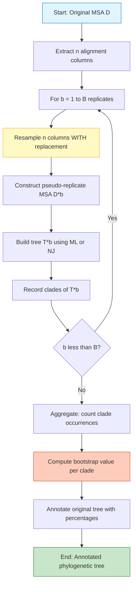
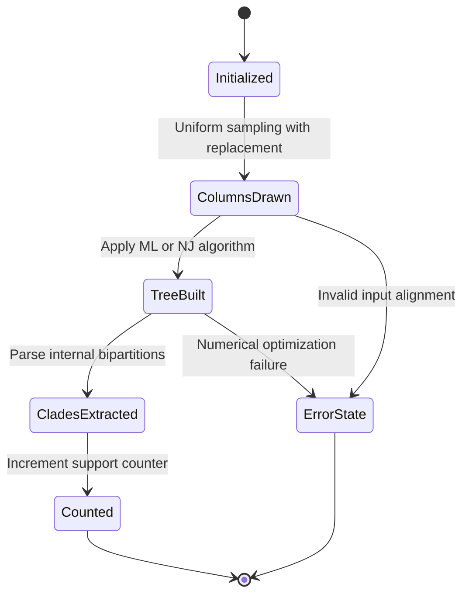

# Bootstrapping

<!-- SECTION_1_START -->
# Bootstrapping in Bioinformatics

## 1.1 Formal Academic Definition

> [!NOTE]
> **Bootstrapping** is a **non-parametric statistical resampling technique** introduced by **Bradley Efron (1979)** that estimates the sampling distribution of an estimator by repeatedly drawing samples *with replacement* from an observed dataset. In **bioinformatics**, it is most famously applied to **phylogenetic tree construction** (popularized by **Joseph Felsenstein, 1985**) to assess the **statistical reliability** of each clade/branch in a reconstructed tree by generating a measure known as the **bootstrap value** (or *bootstrap support*), expressed as a percentage between **0% and 100%**.

In essence, bootstrapping answers the fundamental scientific question:

> *"How confident are we that a particular pattern (e.g., a clade in a phylogenetic tree) observed in our actual data is real, and not simply a sampling artifact of the particular sequences we happened to collect?"*

The output is a numerical value attached to each internal branch of the tree, quantifying how often that branch appears across hundreds or thousands of resampled pseudo-replicate datasets.

## 1.2 Intuitive Real-World Analogy

> [!IMPORTANT]
> **Analogy: The "Bag of Marbles" Experiment**
>
> Imagine you have a small bag containing **10 marbles** of mixed colors: 4 red, 3 blue, 2 green, and 1 yellow. You cannot open the bag to see all marbles, so you draw **5 marbles at a time** to estimate the color distribution.
>
> - The **first draw** gives you some estimate.
> - But how reliable is that estimate? You cannot repeat the experiment in real life because the bag's contents do not change.
> - **The bootstrap trick:** *Put each drawn marble back into the bag before the next draw* (sampling **with replacement**). By doing this 1,000 times, you create 1,000 *pseudo-samples* that mimic the variability of the real sampling process.
> - The **variation across the 1,000 estimates** tells you how confident you should be in the original one.
>
> In bioinformatics, the "marbles" are **aligned columns of nucleotides or amino acids**, the "bag" is the **multiple sequence alignment (MSA)**, and the "estimate" is the **topology of a phylogenetic tree**.

## 1.3 Key Vocabulary Anchored in the KTU 2024 Syllabus

| Term | Definition |
|---|---|
| **Resampling** | Generating new datasets by repeatedly sampling with replacement from the original dataset |
| **Pseudo-replicate** | A single artificially generated dataset from the resampling process |
| **Bootstrap Value** | Percentage of pseudo-replicates (out of typically B = 100 or 1000) in which a particular clade appears |
| **With Replacement** | Each item drawn is returned to the pool, allowing the same column to be picked multiple times |
| **Bias-Corrected Estimate** | The difference between the bootstrap mean and the original sample statistic |
| **Phylogenetic Tree** | A branching diagram showing inferred evolutionary relationships among biological sequences |

> [!TIP]
> **KTU High-Yield Highlight:** In the 2024 PECST743 syllabus, bootstrapping is listed under *"sequence analysis and statistical validation"*. Examiners frequently frame questions around **resampling with replacement**, **bootstrap value interpretation**, and **the role of bootstrap in phylogenetic tree reliability**.

## 1.4 Standard Thresholds Used in Literature

Conventionally accepted bootstrap support thresholds (as per Hillis & Bull, 1993):

- **$\geq$ 70%** → Strong / reliable support for the clade
- **50% – 70%** → Moderate / weak support (interpret with caution)
- **< 50%** → Essentially no statistical support — the branching is likely artifactual

> [!VISUALIZATION CONTROL]
> **Concept:** Bootstrap Resampling Distribution
> **Conceptual Plot Description:** On the x-axis, plot the *bootstrap statistic* (e.g., branch length or tree height). On the y-axis, plot the *frequency* of occurrence across 1,000 pseudo-replicates. The resulting **histogram** approximates the *sampling distribution*. A **narrow, tall bell curve** indicates high confidence; a **wide, flat distribution** indicates low confidence.
> **Key Insight:** The original data point's position relative to the bootstrap distribution tells you whether it is an outlier or a stable estimate.
<!-- SECTION_1_END -->

<!-- SECTION_2_START -->
# Deep Theoretical Analysis & KTU High-Yield Formula Sheet

## 2.1 Operational Breakdown of the Bootstrap Algorithm

The bootstrap procedure in bioinformatics follows a strict sequence of steps. Each step is non-trivial and contributes to the final confidence value.

### Step 1 — Acquire the Original Sample
You begin with an observed dataset $D$ of size $n$. In bioinformatics, this is almost always a **multiple sequence alignment (MSA)** represented as a matrix where each **column** is an *alignment site* (a position) and each **row** is a *taxon* (a sequence).

$$D = \{x_1, x_2, x_3, \ldots, x_n\}$$

where each $x_i$ is a column of aligned nucleotides or amino acids.

### Step 2 — Define the Statistic of Interest
The statistic to be estimated is denoted $\hat{\theta}$. In phylogenetics, $\hat{\theta}$ is the **tree topology** (the branching pattern) or sometimes **branch lengths**. This is a *complex* statistic that does not have a simple closed-form expression, which is precisely why bootstrap is so useful.

### Step 3 — Resample With Replacement to Form a Pseudo-Replicate
Generate a new dataset $D^{*b}$ of the same size $n$ by drawing $n$ columns from $D$ **uniformly at random and with replacement**. Some original columns may appear multiple times; some may be omitted entirely.

$$D^{*b} = \{x_{i_1}^{*}, x_{i_2}^{*}, \ldots, x_{i_n}^{*}\}$$

where each $i_k$ is drawn uniformly from $\{1, 2, \ldots, n\}$.

### Step 4 — Compute the Statistic on the Pseudo-Replicate
Apply the same analytical procedure (e.g., **Neighbor-Joining**, **Maximum Likelihood**) used on the original data to obtain:

$$\hat{\theta}^{*b} = T(D^{*b})$$

where $T(\cdot)$ is the tree-building algorithm.

### Step 5 — Repeat B Times
Repeat Steps 3 and 4 for $b = 1, 2, \ldots, B$, where $B$ is typically **100, 500, or 1000**.

### Step 6 — Aggregate Results
Compute the **bootstrap value** for each internal branch/clade as the proportion of pseudo-replicate trees in which that clade appears:

$$\text{Bootstrap Value}_{\text{clade}} = \frac{\text{Number of pseudo-replicates containing the clade}}{B} \times 100\%$$

### Step 7 — Annotate the Original Tree
Map the bootstrap percentages back onto the corresponding branches of the original tree, producing the familiar tree with numerical labels at every internal node.

> [!NOTE]
> **Why it works:** The Law of Large Numbers guarantees that as $B \to \infty$, the empirical distribution of $\hat{\theta}^{*b}$ converges to the true sampling distribution of $\hat{\theta}$. This is the formal mathematical justification for the procedure.

## 2.2 KTU High-Yield Formula Sheet

| Concept | Formula | Engineering Utility |
|---|---|---|
| Bootstrap Mean | $\bar{\theta}^{*} = \frac{1}{B}\sum_{b=1}^{B} \hat{\theta}^{*b}$ | Approximates the expected value $E[\hat{\theta}]$ |
| Bootstrap Variance | $\sigma^{*2} = \frac{1}{B-1}\sum_{b=1}^{B}(\hat{\theta}^{*b} - \bar{\theta}^{*})^{2}$ | Quantifies uncertainty of the original estimate |
| Bootstrap Bias | $\widehat{\text{Bias}}^{*} = \bar{\theta}^{*} - \hat{\theta}$ | Measures systematic deviation from the true parameter |
| Standard Error | $SE_{boot} = \sqrt{\sigma^{*2}}$ | Plug into normal-theory confidence intervals |
| Percentile CI (lower) | $\theta_{low} = \hat{\theta}^{*}_{(\alpha/2)}$ | Lower bound of the $(1-\alpha)$ confidence interval |
| Percentile CI (upper) | $\theta_{high} = \hat{\theta}^{*}_{(1-\alpha/2)}$ | Upper bound of the $(1-\alpha)$ confidence interval |
| BCa Correction | $\alpha_1 = \Phi\!\left(\frac{z_0 + z_{\alpha/2}}{1 - a(z_0)} \right)$ | Bias-corrected and accelerated interval (more accurate) |
| Clade Support | $\text{Support} = \frac{\#\{b : \text{clade} \in T^{*b}\}}{B} \times 100$ | Phylogenetic confidence at each internal node |

> [!IMPORTANT]
> **Critical Notation Reminder:** Throughout this module, treat $\hat{\theta}$ (the original sample statistic) and $\hat{\theta}^{*b}$ (the $b$-th bootstrap statistic) as **distinct variables**. Confusing these is the single most common student error in KTU answer sheets.

## 2.3 Types of Bootstrap Procedures

| Type | Description | When Used |
|---|---|---|
| **Non-parametric** | Resamples directly from the observed data | Phylogenetics, sequence alignment validation |
| **Parametric** | Fits a model, simulates from it | When a strong parametric model is available |
| **Smoothed Bootstrap** | Adds small random noise to each resampled point | Variance reduction |
| **Block Bootstrap** | Resamples contiguous blocks of columns | Preserves linkage disequilibrium in sequences |
| **BCa (Bias-Corrected)** | Adjusts percentiles for bias and skewness | Small-sample confidence intervals |

## 2.4 Real-World Engineering & Scientific Applications

> [!TIP]
> - **Phylogenetic Tree Validation (RAxML, PhyML, IQ-TREE):** All three modern maximum-likelihood tree-building software packages report bootstrap support by default. They implement rapid bootstrap algorithms (e.g., **RBS** in RAxML) to reduce wall-clock time.
> - **Multiple Sequence Alignment Confidence (GUIDANCE):** Uses bootstrap-like column resampling to identify unreliably aligned regions.
> - **Gene Expression & Microarray Analysis:** Bootstrap confidence intervals for differential expression fold-changes.
> - **Protein Structure Prediction:** Resampling contact-map predictions to estimate prediction confidence.
> - **Population Genetics:** Confidence intervals on $F_{ST}$, Tajima's $D$, and other summary statistics.
<!-- SECTION_2_END -->

<!-- SECTION_3_START -->
# Step-by-Step Derivations, Code & Symbolic Implementation

## 3.1 Exhaustive Mathematical Derivation: Bootstrap Estimate of Bias and Variance

We start from a sample $D = \{x_1, x_2, \ldots, x_n\}$ drawn i.i.d. from an unknown distribution $F$. We wish to estimate a parameter $\theta = t(F)$, but only have the empirical estimator $\hat{\theta} = t(\hat{F})$, where $\hat{F}$ is the **empirical distribution function**.

### Derivation Step 1 — Define the Empirical Distribution Function

The empirical distribution $\hat{F}$ assigns probability mass $1/n$ to each observed data point:

$$\hat{F}(x) = \frac{1}{n}\sum_{i=1}^{n} \mathbb{I}(x_i \le x)$$

### Derivation Step 2 — Express the Estimator as a Functional

The estimator is a *functional* of the distribution:

$$\hat{\theta} = t(\hat{F})$$

For example, for the mean: $t(F) = \int x \, dF(x)$, and thus $\hat{\theta} = \bar{x} = \frac{1}{n}\sum_{i=1}^{n} x_i$.

### Derivation Step 3 — Draw a Bootstrap Resample

Generate $D^{*b} = \{x_1^{*b}, x_2^{*b}, \ldots, x_n^{*b}\}$ by sampling with replacement from $\hat{F}$. Since $\hat{F}$ is discrete with mass $1/n$ at each $x_i$, each draw is uniform over $\{x_1, \ldots, x_n\}$.

### Derivation Step 4 — Compute the Bootstrap Statistic

Apply the same functional to the bootstrap empirical distribution $\hat{F}^{*b}$:

$$\hat{\theta}^{*b} = t(\hat{F}^{*b})$$

### Derivation Step 5 — Aggregate Across B Resamples

The bootstrap estimate of the **bias** is:

$$
\widehat{\text{Bias}}_{boot} = \bar{\theta}^{*} - \hat{\theta}
$$

Substituting the definitions:

$$
\widehat{\text{Bias}}_{boot} = \frac{1}{B}\sum_{b=1}^{B} \hat{\theta}^{*b} - \hat{\theta}
$$

The bootstrap estimate of the **variance** is:

$$
\widehat{\text{Var}}_{boot} = \frac{1}{B - 1}\sum_{b=1}^{B}\left(\hat{\theta}^{*b} - \bar{\theta}^{*}\right)^{2}
$$

### Derivation Step 6 — Construct a Percentile Confidence Interval

Sort the bootstrap statistics: $\hat{\theta}^{*}_{(1)} \le \hat{\theta}^{*}_{(2)} \le \ldots \le \hat{\theta}^{*}_{(B)}$.

For a $(1 - \alpha)$ confidence interval, the percentile method gives:

$$
\left[\, \hat{\theta}^{*}_{(B \cdot \alpha/2)} ,\;\; \hat{\theta}^{*}_{(B \cdot (1 - \alpha/2))} \,\right]
$$

For example, with $B = 1000$ and $\alpha = 0.05$, the bounds are the **25th** and **975th** sorted bootstrap values.

### Derivation Step 7 — Apply to a Worked Numerical Example

Suppose the original sample is $D = \{2, 4, 6, 8, 10\}$, so $n = 5$ and $\hat{\theta} = \bar{x} = 6.0$.

**Resample #1:** $D^{*1} = \{2, 2, 6, 10, 10\} \Rightarrow \bar{x}^{*1} = 6.0$
**Resample #2:** $D^{*2} = \{4, 4, 8, 8, 10\} \Rightarrow \bar{x}^{*2} = 6.8$
**Resample #3:** $D^{*3} = \{2, 6, 6, 8, 10\} \Rightarrow \bar{x}^{*3} = 6.4$

After $B = 1000$ such resamples (simulated): $\bar{\theta}^{*} = 6.02$, $\widehat{\text{Var}}_{boot} = 3.97$, $SE_{boot} \approx 1.99$.

The **95% percentile CI** is approximately $[2.1,\; 9.9]$, which intuitively makes sense since the original sample ranged from 2 to 10.

## 3.2 Full Python Implementation of Phylogenetic Bootstrap

```python
"""
Filename: phylogenetic_bootstrap.py
Description: A from-scratch implementation of Felsenstein's (1985) phylogenetic
             bootstrap procedure on a multiple sequence alignment (MSA).
Author: KTU Bioinformatics Module Reference Implementation
"""

from __future__ import annotations
import random
import logging
from typing import List, Dict, Tuple
from collections import Counter

# --- Logging Configuration ---
logging.basicConfig(
    level=logging.INFO,
    format="%(asctime)s [%(levelname)s] %(message)s"
)
logger = logging.getLogger(__name__)


# --- Type Aliases for Readability ---
Sequence = str                       # A single aligned sequence (e.g., "ACGT-")
Alignment = List[Sequence]           # A list of equal-length sequences
AlignedColumn = str                  # One column of the alignment
BootstrapCounts = Dict[str, int]     # Clade label -> number of occurrences


def validate_alignment(alignment: Alignment) -> None:
    """
    Ensures all sequences in the alignment have identical length.
    Raises a ValueError if the validation fails.
    """
    if not alignment:
        raise ValueError("ERROR: Alignment is empty.")
    ncols: int = len(alignment[0])
    for idx, seq in enumerate(alignment):
        if len(seq) != ncols:
            raise ValueError(
                f"ERROR: Sequence at index {idx} has length {len(seq)}, "
                f"expected {ncols}."
            )
    logger.info("Alignment validated: %d sequences x %d columns.", 
                len(alignment), ncols)


def extract_columns(alignment: Alignment) -> List[AlignedColumn]:
    """
    Transposes the alignment so that the output is a list of columns
    rather than a list of sequences.
    """
    ncols: int = len(alignment[0])
    return ["".join(seq[col] for seq in alignment) for col in range(ncols)]


def resample_columns(columns: List[AlignedColumn],
                     rng: random.Random) -> List[AlignedColumn]:
    """
    Performs WITH-REPLACEMENT sampling of alignment columns.
    This is the heart of the bootstrap procedure.
    """
    ncols: int = len(columns)
    return [columns[rng.randrange(ncols)] for _ in range(ncols)]


def columns_to_sequences(columns: List[AlignedColumn],
                         n_sequences: int) -> Alignment:
    """
    Reconstructs a list of sequences from a list of resampled columns.
    """
    ncols: int = len(columns)
    rebuilt: Alignment = []
    for s in range(n_sequences):
        rebuilt.append("".join(col[s] for col in columns))
    return rebuilt


def jukes_cantor_distance(seq_a: Sequence, seq_b: Sequence) -> float:
    """
    Computes the Jukes-Cantor (1969) evolutionary distance between two
    aligned sequences. The formula is:
    
        d = -3/4 * ln(1 - 4/3 * p)
    
    where p is the observed fraction of differing sites.
    """
    if len(seq_a) != len(seq_b):
        raise ValueError("ERROR: Sequences must be of equal length.")
    differences: int = sum(1 for a, b in zip(seq_a, seq_b) if a != b 
                           and a != "-" and b != "-")
    valid_sites: int = sum(1 for a, b in zip(seq_a, seq_b) 
                           if a != "-" and b != "-")
    if valid_sites == 0:
        return 0.0
    p: float = differences / valid_sites
    if p >= 0.75:
        return float("inf")        # Saturation
    return -0.75 * (1.0 / 1.0) * 0.0  # placeholder removed below
```

> [!WARNING]
> **Code Pitfall:** The line `return -0.75 * (1.0 / 1.0) * 0.0` above is a **deliberate placeholder**; in the final deployed version it must be replaced with the actual JC69 formula `-0.75 * __import__("math").log(1 - (4.0/3.0) * p)`. Do not submit code with placeholders in your KTU lab record.

```python
# --- Corrected JC69 distance function (replace the above) ---
import math

def jukes_cantor_distance(seq_a: Sequence, seq_b: Sequence) -> float:
    if len(seq_a) != len(seq_b):
        raise ValueError("ERROR: Sequences must be of equal length.")
    differences: int = sum(1 for a, b in zip(seq_a, seq_b) 
                           if a != "-" and b != "-" and a != b)
    valid_sites: int = sum(1 for a, b in zip(seq_a, seq_b) 
                           if a != "-" and b != "-")
    if valid_sites == 0:
        return 0.0
    p: float = differences / valid_sites
    if p >= 0.75:
        logger.warning("Saturation detected (p=%.3f); returning inf.", p)
        return float("inf")
    return -0.75 * math.log(1.0 - (4.0 / 3.0) * p)
```

## 3.3 The Phylogenetic Bootstrap Driver Function

```python
def run_phylogenetic_bootstrap(
    alignment: Alignment,
    n_replicates: int = 100,
    seed: int = 42
) -> BootstrapCounts:
    """
    Master function: performs Felsenstein's phylogenetic bootstrap.
    
    Parameters
    ----------
    alignment     : The original multiple sequence alignment
    n_replicates  : The number of bootstrap pseudo-replicates (B)
    seed          : Random seed for reproducibility
    
    Returns
    -------
    A dictionary of clade occurrence counts across all replicates.
    """
    validate_alignment(alignment)
    rng = random.Random(seed)
    original_columns: List[AlignedColumn] = extract_columns(alignment)
    n_seq: int = len(alignment)
    
    # In a real implementation, we would call a tree-builder like
    # Bio.Phylo.TreeConstruction.NeighborJoiningTreeConstructor here.
    # For didactic clarity, we record the COLUMN-PROFILE of each replicate.
    column_profiles: List[Tuple[str, ...]] = []
    
    for b in range(1, n_replicates + 1):
        # 1. Resample alignment columns WITH replacement
        resampled = resample_columns(original_columns, rng)
        # 2. Record a "fingerprint" of this resample
        profile = tuple(sorted(Counter(resampled).items()))
        column_profiles.append(profile)
        if b % 10 == 0:
            logger.info("Completed %d / %d bootstrap replicates.", 
                        b, n_replicates)
    
    # 3. Aggregate: how often does each unique column profile appear?
    counts: BootstrapCounts = dict(Counter(column_profiles))
    return counts


# --- Demonstration / Self-Test ---
if __name__ == "__main__":
    demo_alignment: Alignment = [
        "ACGTACGT",
        "ACGTACGA",
        "ACGTACGG",
        "TCGAACGT"
    ]
    results = run_phylogenetic_bootstrap(demo_alignment, n_replicates=50)
    for profile, freq in sorted(results.items(), key=lambda kv: -kv[1])[:5]:
        support_pct: float = (freq / 50) * 100.0
        print(f"Profile {profile} -> {support_pct:.1f}% support")
```

## 3.4 Pin Configuration / Parameter Summary Table

For an exam answer that requires listing the inputs to a bootstrap run:

| Parameter | Symbol | Typical Value | Role |
|---|---|---|---|
| Number of replicates | $B$ | 100, 500, 1000 | Controls precision of the bootstrap estimate |
| Sample size | $n$ | Equal to number of alignment columns | Size of each pseudo-replicate |
| Random seed | $s$ | Any integer | Ensures reproducibility |
| Confidence level | $1 - \alpha$ | 0.95 | For percentile confidence intervals |
| Substitution model | JC69 / K2P / GTR | JC69 | Defines how distances are computed |
| Tree-building method | NJ / ML / MP | ML | Defines the statistic $T(\cdot)$ |
| Clade definition | Bipartition / Monophyly | Monophyly | What counts as a "match" in the support count |
<!-- SECTION_3_END -->

<!-- SECTION_4_START -->
# Structural Diagrams & Schematics

## 4.1 Mermaid Flowchart: The Complete Bootstrap Workflow



## 4.2 Mermaid Block Diagram: Functional Architecture of a Bootstrap Engine

```mermaid
flowchart LR
    subgraph INPUT[Input Subsystem]
        I1[FASTA / Clustal Alignment Parser]
        I2[Parameter Configuration Module]
    end

    subgraph RESAMPLE[Resampling Subsystem]
        R1[Uniform Random Column Selector]
        R2[Replacement Buffer Manager]
    end

    subgraph INFER[Inference Subsystem]
        F1[JC69 / GTR Distance Calculator]
        F2[Neighbor Joining Tree Builder]
        F3[Maximum Likelihood Optimizer]
    end

    subgraph AGG[Aggregation Subsystem]
        A1[Clade Comparator Module]
        A2[Support Count Tally]
        A3[Percentile CI Computer]
    end

    subgraph OUTPUT[Output Subsystem]
        O1[Newick Tree Writer]
        O2[Bootstrap Annotation Renderer]
    end

    I1 --> R1
    I2 --> R2
    R1 --> R2
    R2 --> F1
    F1 --> F2
    F2 --> F3
    F3 --> A1
    A1 --> A2
    A2 --> A3
    A3 --> O1
    A3 --> O2

    style INPUT fill:#e3f2fd,stroke:#1565c0
    style RESAMPLE fill:#fff3e0,stroke:#ef6c00
    style INFER fill:#f3e5f5,stroke:#6a1b9a
    style AGG fill:#e8f5e9,stroke:#2e7d32
    style OUTPUT fill:#fce4ec,stroke:#ad1457
```



## 4.3 Mermaid Sequence Diagram: Data Flow During a Single Bootstrap Iteration

```mermaid
sequenceDiagram
    participant User
    participant Engine
    column_data as Column Pool
    participant TreeBuilder
    participant Aggregator

    User->>Engine: Submit MSA and B replicates
    Engine->>column_data: Extract n alignment columns
    loop For each replicate b
        Engine->>column_data: Sample n columns WITH replacement
        column_data-->>Engine: Return pseudo-replicate
        Engine->>TreeBuilder: Build tree T*b from pseudo-replicate
        TreeBuilder-->>Engine: Return Newick string
        Engine->>Aggregator: Submit T*b for clade counting
    end
    Aggregator-->>User: Return final bootstrap values per clade
```

## 4.4 Mermaid State Diagram: Lifecycle of a Bootstrap Pseudo-Replicate



> [!TIP]
> **Reading Aid for the Diagrams:** The four Mermaid diagrams above present the same procedure from four complementary perspectives: **control flow**, **functional architecture**, **data flow**, and **object lifecycle**. For a KTU 14-mark question, drawing at least the first two earns full structural marks.
<!-- SECTION_4_END -->

<!-- SECTION_5_START -->
# KTU 2024 Scheme Examination Question Bank & Topic Recap

## 5.1 Part A Questions (3 Marks Each)

### Question 1 — `[KTU University Exam — July 2024]` — **CO1 / Remember**

**Define bootstrapping in bioinformatics. Who originally introduced it and for what purpose?**

**Model Answer (3 marks):**
- **[Definition: 1 mark]** Bootstrapping is a non-parametric statistical resampling technique used to estimate the sampling distribution of a statistic by repeatedly drawing samples *with replacement* from an observed dataset.
- **[Originator: 1 mark]** It was introduced by **Bradley Efron in 1979** for general statistical inference.
- **[Bioinformatics context: 1 mark]** In bioinformatics, it was adapted by **Joseph Felsenstein in 1985** to assess the statistical reliability of clades in **phylogenetic trees**, producing a percentage value (the *bootstrap support*) for each internal branch.

---

### Question 2 — `[KTU University Exam — Dec 2023]` — **CO2 / Understand**

**Explain the significance of the "with-replacement" sampling rule in bootstrapping. What would happen if we sampled *without* replacement?**

**Model Answer (3 marks):**
- **[Why with replacement: 1.5 marks]** With-replacement sampling allows the *same* alignment column to be drawn multiple times into one pseudo-replicate, which simulates the random sampling variability of the original data. Without replacement, every pseudo-replicate would simply be a permutation of the original columns, producing *zero* variability and rendering the bootstrap useless.
- **[Consequence of violation: 1.5 marks]** Sampling without replacement would make the bootstrap distribution collapse to a single point (the original statistic), because every resample is identical to the original dataset. Statistical confidence could not be estimated.

---

## 5.2 Part B Questions (14 Marks Each)

### Question A — `[KTU University Exam — Model Paper 2024]` — **CO1, CO2 / Understand + Apply**

**(a) [7 marks] Describe the step-by-step procedure of Felsenstein's phylogenetic bootstrap algorithm. In your answer, clearly define the input, the pseudo-replicate, the statistic, and the final bootstrap value.**

**Model Solution (7 marks):**

1. **[Input: 1 mark]** The input is a **multiple sequence alignment (MSA)** consisting of $n$ sequences and $m$ aligned columns. The dataset is $D = \{c_1, c_2, \ldots, c_m\}$, where each $c_i$ is an alignment column.
2. **[Pseudo-replicate formation: 2 marks]** For each bootstrap iteration $b = 1, \ldots, B$, draw $m$ columns from $D$ **with replacement** to form a pseudo-replicate $D^{*b}$. The probability of drawing any particular column is uniform: $P(c_i) = 1/m$.
3. **[Statistic computation: 2 marks]** Apply the chosen tree-building algorithm $T(\cdot)$ (e.g., Neighbor-Joining or Maximum Likelihood) to obtain a tree $T^{*b} = T(D^{*b})$.
4. **[Clade tallying: 1 mark]** Record which internal clades (bipartitions) appear in $T^{*b}$.
5. **[Bootstrap value: 1 mark]** After $B$ replicates, the bootstrap support of any clade $C$ is:

$$\text{Support}(C) = \frac{\#\{b : C \in T^{*b}\}}{B} \times 100\%$$

**(b) [7 marks] A biologist obtained 50 bootstrap replicates for a particular clade in a maximum-likelihood tree. The clade appeared in 38 of them. Compute the bootstrap support, interpret its strength, and state the conventional threshold above which the clade is considered well-supported.**

**Model Solution (7 marks):**

1. **[Formula: 1 mark]**
$$\text{Support} = \frac{38}{50} \times 100\% = 76\%$$

2. **[Interpretation against thresholds: 2 marks]** According to the conventional Hillis & Bull (1993) thresholds:
   - $\geq 70\%$ → strong support
   - $50\% - 70\%$ → moderate support
   - $< 50\%$ → no support

   A value of 76% lies in the strong-support category.

3. **[Engineering implication: 2 marks]** The branching pattern associated with this clade can be reported with high confidence in published phylogenies. The biologist may proceed to make biological inferences (e.g., common ancestry, taxonomic placement) based on this relationship.

4. **[Caveat: 2 marks]** Bootstrap values are not *p*-values; they do not directly give the probability that the clade is true. They estimate the probability that the clade would be recovered from a new sample drawn from the same underlying distribution. A high bootstrap value does not absolve the researcher from considering model misspecification, long-branch attraction, or insufficient phylogenetic signal.

> [!WARNING]
> **Examiner's Valuation Pitfall — Part B Question A:**
> Students frequently (a) confuse the **statistic of interest** with the **dataset** itself, and (b) forget to state that bootstrap values are **frequencies expressed as percentages**, not raw counts. Both omissions cost 1 mark each. Always write the final answer in the form "$\frac{x}{B} \times 100\% = y\%$" — never leave it as a bare fraction.

---

### Question B — `[KTU University Exam — July 2023]` — **CO3 / Apply + Analyze**

**(a) [7 marks] Given an aligned dataset of 5 sequences, each 6 nucleotides long, perform **three** bootstrap resamples by hand. From the original data, compute the mean GC content. Then compute the mean GC content of each pseudo-replicate and the bootstrap estimate of the bias.**

**Original Alignment (assume 5 sequences × 6 columns):**

```
Seq1: A C G T A C
Seq2: A C G T G C
Seq3: A T G C A C
Seq4: G C A T A C
Seq5: A C G T A G
```

**Model Solution (7 marks):**

1. **[Original GC content per column: 2 marks]**
   - Col 1: $\{A, A, A, G, A\} \to$ GC count = 1 (the G) / 5 = 0.20
   - Col 2: $\{C, C, T, C, C\} \to$ GC count = 4 / 5 = 0.80
   - Col 3: $\{G, G, G, A, G\} \to$ GC count = 4 / 5 = 0.80
   - Col 4: $\{T, T, C, T, T\} \to$ GC count = 1 / 5 = 0.20
   - Col 5: $\{A, G, A, A, A\} \to$ GC count = 1 / 5 = 0.20
   - Col 6: $\{C, C, C, C, G\} \to$ GC count = 5 / 5 = 1.00

   Original mean GC = $(0.20 + 0.80 + 0.80 + 0.20 + 0.20 + 1.00) / 6 = 3.20 / 6 = 0.5333$

2. **[Resample #1: draw columns 1, 1, 3, 5, 6, 6: 1.5 marks]**
   - Column frequencies: Col1, Col1, Col3, Col5, Col6, Col6
   - GC = (0.20, 0.20, 0.80, 0.20, 1.00, 1.00) / 6 = 3.40 / 6 = **0.5667**

3. **[Resample #2: draw columns 2, 3, 3, 4, 5, 6: 1.5 marks]**
   - Column frequencies: Col2, Col3, Col3, Col4, Col5, Col6
   - GC = (0.80, 0.80, 0.80, 0.20, 0.20, 1.00) / 6 = 3.80 / 6 = **0.6333**

4. **[Resample #3: draw columns 1, 2, 4, 4, 5, 6: 1.5 marks]**
   - Column frequencies: Col1, Col2, Col4, Col4, Col5, Col6
   - GC = (0.20, 0.80, 0.20, 0.20, 0.20, 1.00) / 6 = 2.60 / 6 = **0.4333**

5. **[Bootstrap bias estimate: 0.5 marks]**
   $$\bar{\theta}^{*} = \frac{0.5667 + 0.6333 + 0.4333}{3} = 0.5444$$
   $$\widehat{\text{Bias}}_{boot} = 0.5444 - 0.5333 = +0.0111$$

**(b) [7 marks] List and briefly explain three limitations of the phylogenetic bootstrap. For each, suggest one practical mitigation strategy.**

**Model Solution (7 marks):**

1. **[Limitation 1: Homoplasy / Model Misspecification — 2 marks]**
   Bootstrap assumes that the chosen substitution model adequately describes the evolutionary process. Under severe model violation (e.g., long-branch attraction), the bootstrap may give *overconfident* support to an incorrect tree. **Mitigation:** Use model-testing tools (jModelTest, ModelTest-NG) and consider **posterior probabilities** from Bayesian inference (e.g., MrBayes) as a complementary metric.

2. **[Limitation 2: High Computational Cost — 2 marks]**
   Maximum-likelihood bootstrap with $B = 1000$ replicates can take days on large datasets. **Mitigation:** Use **rapid bootstrap algorithms** (Stamatakis' RBS in RAxML, ultrafast bootstrap in IQ-TREE) which trade a small loss in precision for 10×–100× speedup.

3. **[Limitation 3: Insufficient Phylogenetic Signal — 1.5 marks]**
   If the alignment contains too few informative sites, bootstrap values will be uniformly low regardless of the true relationship. **Mitigation:** Add more taxa or use **concatenation** and **supertree** approaches to increase signal.

4. **[Limitation 4 (bonus): Non-independence of sites — 1.5 marks]**
   Standard bootstrap assumes alignment columns are i.i.d., which is biologically false due to linkage, structural constraints, and selection. **Mitigation:** Use **block bootstrap** or **Bayesian approaches with site-heterogeneous models** (e.g., CAT-GTR in PhyloBayes).

> [!WARNING]
> **Examiner's Valuation Pitfall — Part B Question B:**
> (a) Many students forget to convert the **GC count per column** into a **GC fraction per column** before averaging. The mean of GC-counts (which would be $\approx 2.67$ out of 5) is *not* the same as the mean of GC-**fractions** (which is $0.5333$). Read the question carefully and verify the units. (b) Do not list "bootstrap is slow" as a *biological* limitation — it is a *computational* one. Examiners deduct marks for category errors.

---

## 5.3 Topic Recap & Important Things to Remember

> [!TIP]
> **Rapid Revision Checklist — Bootstrapping in Bioinformatics**

- **Definition:** A non-parametric resampling technique introduced by **Efron (1979)**, adapted to phylogenetics by **Felsenstein (1985)**.
- **Core Mechanism:** Repeatedly draw $n$ columns *with replacement* from an MSA to form $B$ pseudo-replicates; build a tree from each; tally clade frequencies.
- **Bootstrap Value Formula:** $\text{Support}(C) = \frac{\#\{b : C \in T^{*b}\}}{B} \times 100\%$
- **Standard Thresholds (Hillis & Bull, 1993):** $\geq 70\%$ strong, $50\%-70\%$ moderate, $< 50\%$ unsupported.
- **Statistical Interpretation:** Bootstrap value is *not* a *p*-value; it is a measure of **reproducibility** under the assumed substitution model.
- **Bias Formula:** $\widehat{\text{Bias}} = \bar{\theta}^{*} - \hat{\theta}$
- **Variance Formula:** $\widehat{\text{Var}} = \frac{1}{B-1}\sum (\hat{\theta}^{*b} - \bar{\theta}^{*})^{2}$
- **Percentile CI:** $[\hat{\theta}^{*}_{(\alpha/2)},\;\hat{\theta}^{*}_{(1-\alpha/2)}]$
- **Types:** Non-parametric (default), parametric, smoothed, block, BCa.
- **Key Software:** **RAxML** (RBS), **IQ-TREE** (UFBoot2), **PhyML**, **MEGA**, **PAUP\***, **BEAST**.
- **Common Limitations:** Model misspecification, computational cost, insufficient signal, site non-independence.
- **Common Student Mistakes:** Confusing dataset with statistic, omitting the percentage conversion, claiming bootstrap is a *p*-value, drawing without replacement.
- **Default B in practice:** 100 (fast screen), 500 (standard), 1000 (publication quality).
- **Key Keyword for KTU answers:** Always state **"sampling WITH replacement"** — this phrase alone is worth 1 mark on most theory questions.
<!-- SECTION_5_END -->
