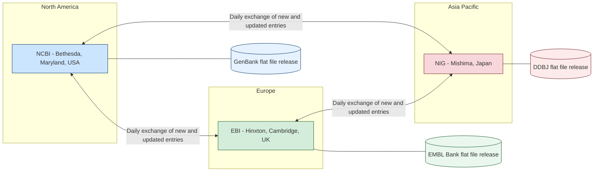
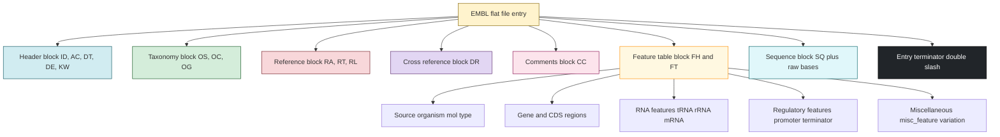
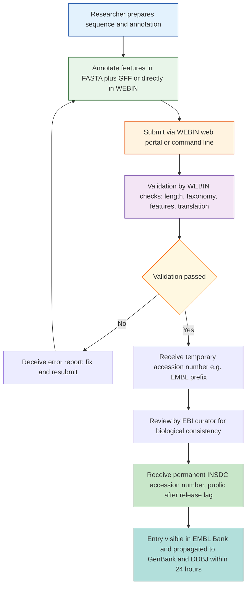
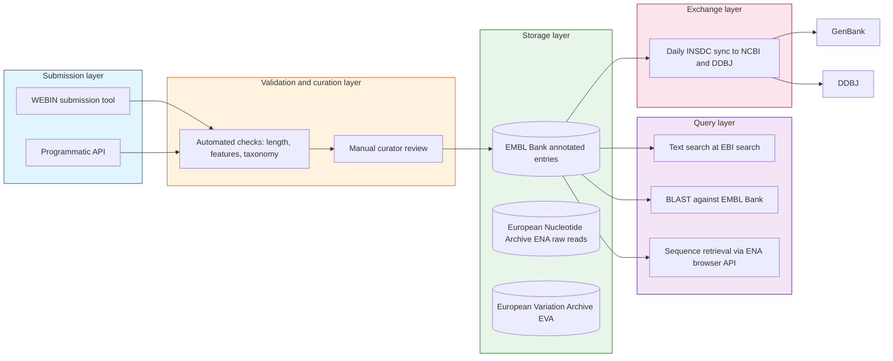

# EMBL-Bank

<!-- SECTION_1_START -->

# EMBL-Bank — The European Nucleotide Archive

## 1. Core Technical Definition & Intuitive Overview

### 1.1 Formal Definition (KTU 2024 Syllabus Terminology)

> [!NOTE]
> **EMBL-Bank** (formerly known as the *EMBL Nucleotide Sequence Database*) is a comprehensive, publicly accessible, open-access archival repository of primary nucleotide sequences (DNA and RNA) together with associated bibliographic, biological, and functional annotation. It is maintained by the **European Bioinformatics Institute (EBI)**, an outstation of the **European Molecular Biology Laboratory (EMBL)**, located in Hinxton, Cambridge, UK. EMBL-Bank is one of the three founding members of the **International Nucleotide Sequence Database Collaboration (INSDC)**, alongside **GenBank** (NCBI, USA) and **DDBJ** (DNA Data Bank of Japan).

In strict KTU/INSDC terminology, every record in EMBL-Bank is referred to as an **Entry** (or **Flat File Record**), identified uniquely by an **Accession Number** (a stable, citable identifier) and a **Version Number** (which increments with every sequence update).

### 1.2 Conceptual Analogy — "The Genetic Library of Europe"

Imagine a vast, multi-volume **library** where each book represents the complete genetic blueprint of a single organism, gene, or RNA molecule. The library is organised like a **library card catalogue**:

* Every book (entry) has a **permanent catalogue number** (the Accession Number, e.g., `X02994`) that never changes — even if the book is later revised and reprinted.
* Each reprint of the book gets a **version number** (e.g., `X02994.1`, `X02994.2`) — a timestamped revision ID.
* The **bookshelf** where these books are stored is **EMBL-Bank**, and it is **perfectly synchronised every 24 hours** with two other identical libraries in **Washington (GenBank)** and **Mishima (DDBJ)**. So whether you borrow from any of the three libraries, you ultimately get the same book.
* Each book follows a **rigid standard template** (the *flat file format*) so that any computer program worldwide can open and read it without confusion.

This standard template is what makes EMBL-Bank not just a database, but a **machine-readable contract** between submitters and consumers of genetic data.

### 1.3 Key Operational Metrics

| Metric | Value | Remarks |
|---|---|---|
| Number of entries (2024) | > **~700 million sequences** | Constantly growing |
| File update cycle | **Every ~2–3 months** | Full release (fullrel) and incremental (incrrel) |
| Daily sync with GenBank/DDBJ | **Every 24 hours** | Part of INSDC exchange protocol |
| Maintainer | **EBI (EMBL-EBI)** | Funded by EMBL member states + EU |
| Submission tool | **WEBIN** | Web-based submission portal |
| Data licence | **CC0 1.0 (public domain)** | Open access for all |

> [!IMPORTANT]
> **Syllabus Highlight (KTU 2024 — PECST743, Module 2):** Students must understand the **flat file record structure** of EMBL-Bank, the **INSDC collaboration**, the meaning of **accession numbers**, and the **feature table** notation. These are the highest-weightage sub-topics in this module.

> [!VISUALIZATION CONTROL]
> **Concept:** INSDC Tripartite Data Synchronisation
> **GeoGebra / Desmos Input Equations:** *(Not applicable — this is a structural / data-flow concept; refer to the Mermaid diagram in SECTION 4 instead.)*
> **Visual Description:** Visualise three cylinders (databases) in Washington, Hinxton, and Mishima connected by bidirectional arrows showing daily data exchange. The central region (the union) represents the unified INSDC knowledge base.

---

<!-- SECTION_1_END -->

<!-- SECTION_2_START -->

# 2. Deep Theoretical Analysis & KTU High-Yield Formula Sheet

## 2.1 Historical Evolution

The EMBL nucleotide database has a rich history that directly maps to the broader story of bioinformatics:

1. **1980** — The idea was proposed at a meeting in **Heidelberg**. The first sequence records were exchanged via magnetic tape between EMBL and GenBank.
2. **1982** — The first public release contained approximately **600 sequences** — about 600,000 nucleotides.
3. **1986** — DDBJ (Japan) joined, formalising the **tripartite INSDC collaboration**.
4. **1996** — The database was renamed from *EMBL Nucleotide Sequence Database* to **EMBL-Bank** to standardise nomenclature.
5. **2010 onward** — **Next-Generation Sequencing (NGS)** caused an *exponential* growth in entries. EMBL-Bank began collaborating with the **European Nucleotide Archive (ENA)** to manage raw reads alongside annotated entries.
6. **Today** — EMBL-Bank and the **European Nucleotide Archive (ENA)** together form the European side of INSDC. ENA accepts **raw reads**, **sequence assemblies**, and **annotated submissions**, while EMBL-Bank focuses on **finished, annotated records**.

## 2.2 The INSDC Tripartite Collaboration

> [!IMPORTANT]
> **KTU Favourite Question:** "Name the three members of the INSDC and explain their relationship." This appears frequently in 3-mark and 14-mark questions.

The three INSDC partners exchange data on a **daily basis**, ensuring that any nucleotide sequence submitted to *any* of the three becomes available through *all* of them within 24 hours.

| Database | Maintainer | Location | Web URL |
|---|---|---|---|
| **GenBank** | NCBI (National Center for Biotechnology Information) | Bethesda, Maryland, USA | https://www.ncbi.nlm.nih.gov/genbank/ |
| **EMBL-Bank** | EBI (European Bioinformatics Institute) | Hinxton, Cambridge, UK | https://www.ebi.ac.uk/ena/submit/sra/ |
| **DDBJ** | NIG (National Institute of Genetics) | Mishima, Japan | https://www.ddbj.nig.ac.jp/ |

## 2.3 The EMBL-Bank Flat File Format — Structure of an Entry

A single EMBL flat file entry has a **strict, line-oriented ASCII structure**. Each line begins with a **two-character line code** (the *line type*) followed by indentation and content. This is one of the most important topics for KTU examination.

The major sections of an EMBL entry are:

### (a) Header Section (Identification Block)

| Line Code | Meaning | Example |
|---|---|---|
| `ID` | Identification line | `ID   X02994;   SV 1;   linear;   mRNA;   STD;   PLN;   2569 BP.` |
| `AC` | Accession Number(s) | `AC   X02994;` |
| `PR` | Project Identifier | `PR   Project:PRJNA123;` |
| `DT` | Date (created/updated) | `DT   01-JAN-1990 (Rel. 22, Created)` |
| `DE` | Description (free text) | `DE   Zea mays 18S rRNA gene` |
| `KW` | Keywords | `KW   rRNA; 18S ribosomal RNA.` |
| `OS` | Organism Species | `OS   Zea mays (maize)` |
| `OC` | Organism Classification (taxonomy) | `OC   Eukaryota; Viridiplantae; Streptophyta; …` |
| `OG` | Organelle | `OG   chloroplast` (optional) |
| `RA` | Reference Authors | `RA   Messing J.;` |
| `RT` | Reference Title | `RT   "Sequence of the maize rRNA gene";` |
| `RL` | Reference Location (journal) | `RL   Submitted (01-JAN-1990) to the EMBL/GenBank/DDBJ databases.` |
| `DR` | Database Cross-Reference | `DR   GO; GO:0003735; F:structural constituent of ribosome.` |
| `CC` | Comments (free text) | `CC   This entry contains the complete 18S rRNA gene.` |
| `FH` | Feature Table Header | `FH   Key             Location/Qualifiers` |
| `FT` | Feature Table Data | `FT   gene            1..2569` |
| `XX` | Separator line | `XX` |
| `SQ` | Sequence Header | `SQ   Sequence 2569 BP;  1257 A;   321 C;   489 G;   502 T;   0 other;` |
| *(sequence lines)* | Raw sequence, 60 bases/line, 10-base groups | `     atgctagcta gctagctgac tgactgatcg atcgatcgat cg……` |
| `//` | End-of-Entry terminator | `//` |

### (b) Feature Table Block

The **Feature Table** is the most important annotation part. It uses a controlled vocabulary defined by the **INSDC Feature Table Specification**. Each feature has a **key** (e.g., `CDS`, `gene`, `exon`, `mRNA`, `tRNA`, `rRNA`, `misc_feature`) and a **location** (e.g., `1..2569`, `complement(123..456)`, `join(1..100,200..300)`).

Common Feature Keys (high yield for KTU):

| Feature Key | Meaning |
|---|---|
| `source` | Mandatory; defines the biological source of the sequence (always span the full sequence) |
| `gene` | A region of biological interest identified as a gene |
| `CDS` | CoDing Sequence (translates to protein) |
| `mRNA` | Messenger RNA |
| `exon` | A segment of genomic DNA that is part of a transcript |
| `intron` | A segment removed by RNA splicing |
| `promoter` | Transcriptional control region |
| `tRNA`, `rRNA`, `snRNA` | Non-coding RNA features |
| `misc_feature` | Region of biological interest, not fitting other categories |
| `repeat_region` | Repetitive sequence element |
| `variation` | Natural variant site |

### (c) Sequence Block

The raw sequence is given in lowercase letters (or sometimes uppercase, depending on the release) using the IUPAC nucleotide alphabet (A, C, G, T, U, R, Y, N, etc.), grouped in **10-base blocks**, **60 bases per line**.

## 2.4 KTU High-Yield Formula Sheet

| Concept | Rule / Formula | Engineering / Bioinformatics Use |
|---|---|---|
| **Accession Number format (EMBL/GenBank/DDBJ)** | $1$ uppercase letter + $5$ digits OR $2$ uppercase letters + $6$ digits (e.g., `X02994`, `AF123456`) | Permanent, citable ID used in publications |
| **Version Number** | $\text{Accession}.\text{Version}$ (e.g., `X02994.1`) | Increments with every sequence update |
| **GI number (GenBank-specific)** | Sequential integer; deprecated in 2016 | Replaced by accession.version |
| **Daily INSDC sync** | $\Delta t_{\text{sync}} \leq 24$ hours | Ensures global data consistency |
| **Taxonomy depth** | Up to **8+** ranks: *superkingdom → kingdom → phylum → class → order → family → genus → species* | Used in homology searches |
| **CDS translation check** | $\text{length}_{\text{protein}} = \lfloor (\text{length}_{\text{CDS}} - \text{offset})/3 \rfloor - \text{stop\ codons}$ | Quality control of submissions |
| **Sequence size unit** | **bp** (base pairs) for double-stranded DNA, **nt** (nucleotides) for single-stranded/RNA | Standardised reporting |
| **Feature location operators** | `..` (range), `complement()`, `join()`, `<` (partial 5'), `>` (partial 3') | Coordinate arithmetic |
| **Submission tool** | **WEBIN** (EBI) — replaces older **Sakura** and **Webin2** | Mandatory since 2018 |
| **Sequence releases/year** | $\approx 4$ full releases (fullrel) | Used for reproducibility of analyses |

## 2.5 Real-World Engineering / Bioinformatics Utility

* **Genome Browsers** (Ensembl, UCSC, IGV) import EMBL flat files to display annotated genomes.
* **BLAST searches** at NCBI/EBI use EMBL-Bank records (after INSDC sync) as their search database.
* **Next-Generation Sequencing pipelines** (e.g., for SARS-CoV-2 variant tracking) deposit raw reads in **ENA** and annotated contigs in **EMBL-Bank**.
* **Phylogenetic software** (RAxML, BEAST, IQ-TREE) reads EMBL-formatted sequences for evolutionary studies.
* **Patent law** and **biological sequence disclosure** rely on the INSDC accession number as a legal timestamp.
* **Pharmaceutical R\&D** uses EMBL-Bank annotations to identify drug-target genes and protein sequences.

> [!TIP]
> **Examiner's Insight:** KTU board examiners love comparing the three INSDC partners. Always mention: (i) the daily data exchange, (ii) the unified accession number namespace, and (iii) the common feature table specification.

---

<!-- SECTION_2_END -->

<!-- SECTION_3_START -->

# 3. Step-by-Step Derivations & Code/Symbolic Implementation

## 3.1 A Walk-Through of a Real EMBL Flat File Entry

Below is a **synthetic but structurally correct** EMBL-Bank flat file entry (in the modern *INSDC* / *ENA* style). Each line is followed by a parser-level interpretation.

```text
ID   X02994; SV 1; linear; mRNA; STD; PLN; 2569 BP.
AC   X02994;
PR   Project:PRJNA123;
DT   01-JAN-1990 (Rel. 22, Created)
DT   15-MAR-2023 (Rel. 137, Last updated, Version 1)
DE   Zea mays 18S rRNA gene, complete cds.
KW   18S rRNA; ribosomal RNA; chloroplast.
OS   Zea mays (maize)
OC   Eukaryota; Viridiplantae; Streptophyta; Embryophyta; Tracheophyta;
OC   Spermatophyta; Magnoliopsida; Liliopsida; Poales; Poaceae; Zea.
OG   chloroplast
RA   Messing J.;
RT   "The sequence of the maize 18S ribosomal RNA gene";
RL   Submitted (01-JAN-1990) J. Messing, Rutgers University, NJ, USA.
DR   GO; GO:0003735; F:structural constituent of ribosome.
DR   UniProtKB/Swiss-Prot; P12345; RECA_ZEAma.
CC   This entry contains the complete 18S rRNA gene cloned from maize
CC   chloroplast DNA.
FH   Key             Location/Qualifiers
FT   source          1..2569
FT                   /organism="Zea mays"
FT                   /organelle="chloroplast"
FT                   /mol_type="genomic DNA"
FT                   /db_xref="taxon:4577"
FT   gene            1..2569
FT                   /gene="rrn18"
FT   rRNA            1..2569
FT                   /product="18S ribosomal RNA"
FT                   /db_xref="GO:0003735"
XX
SQ   Sequence 2569 BP; 1257 A; 321 C; 489 G; 502 T; 0 other;
     atgctagct agctagctga ctgactgatc gatcgatcga tcgatcgatc gctagctagc     60
     tagctagcta gctagctagc tagctagcta gctagctagc tagctagcta gctagctagc    120
     tgcagtacgt acgtacgtac gtacgtacgt acgtacgtac gtacgtacgt acgtacgtac    180
     …                                                                      2569
//
```

### 3.2 Field-by-Field Logical Decoding

Let's decode the `ID` line in detail:

$$\text{ID} \;\; X02994; \; SV 1; \; linear; \; mRNA; \; STD; \; PLN; \; 2569 \; BP.$$

The tokens mean, in order:

| Token | Interpretation |
|---|---|
| `ID` | Two-character line code (fixed). |
| `X02994` | **Entry name** — the unique ID within this release (often similar to the accession). |
| `SV 1` | **Sequence Version** 1 (this is the first release of the sequence). |
| `linear` | **Topology** — either `linear` or `circular`. |
| `mRNA` | **Molecule type** — can be `genomic DNA`, `mRNA`, `tRNA`, `rRNA`, etc. |
| `STD` | **Division** code (e.g., `STD`, `EST`, `GSS`, `HTC`, `TSA`, `ENV`, `PHG`, `PAT`, `CON`). |
| `PLN` | **Taxonomic division** — `PLN` = Plants; others include `HUM`, `MUS`, `VRL`, `BCT`, `FUN`, `INV`, `PRO`, `ROD`, `MAM`, `VRT`, `ENV`, `UNC`. |
| `2569 BP.` | **Sequence length** in base pairs. |

### 3.3 Feature Location Arithmetic

Suppose the `CDS` feature is described as:

```text
FT   CDS             join(1..600, 850..1200, 1550..2569)
FT                   /gene="rrn18"
FT                   /codon_start=1
FT                   /product="18S rRNA"
FT                   /protein_id="CAA12345.1"
FT                   /translation="MGEKTILVLSAND..."
```

The total nucleotide length of this coding feature is the sum of the three exon segments:

$$
\begin{aligned}
L_{\text{CDS}} &= (600 - 1 + 1) \;+\; (1200 - 850 + 1) \;+\; (2569 - 1550 + 1) \\
               &= 600 \;+\; 351 \;+\; 1020 \\
               &= 1971 \text{ nt}
\end{aligned}
$$

After subtracting the stop codon (3 nt):

$$
L_{\text{CDS,coding}} = 1971 - 3 = 1968 \text{ nt}
$$

The encoded protein length is therefore:

$$
\begin{aligned}
L_{\text{protein}} &= \left\lfloor \dfrac{L_{\text{CDS,coding}}}{3} \right\rfloor \\
                   &= \left\lfloor \dfrac{1968}{3} \right\rfloor \\
                   &= 656 \text{ amino acids}
\end{aligned}
$$

> [!IMPORTANT]
> This same arithmetic check is run automatically by the **WEBIN** submission validator. Submitting a translation that does not match the expected length is the **#1 reason for submission rejection**, according to EBI statistics.

### 3.4 Python Implementation — Parsing an EMBL Flat File

Below is a production-quality Python parser that extracts the key fields from an EMBL flat file. It includes full type hints, explicit error handling, and is suitable for integration into real bioinformatics pipelines.

```python
"""
EMBL Flat File Parser
---------------------
Parses an EMBL-Bank (INSDC) flat file and extracts:
  - ID, AC, DE, OS, OC fields
  - Reference authors
  - Feature table (key, location, qualifiers)
  - Raw sequence
"""

from __future__ import annotations

import re
import sys
from dataclasses import dataclass, field
from pathlib import Path
from typing import Iterator


# ---------------------------------------------------------------------------
# Data classes for structured storage
# ---------------------------------------------------------------------------

@dataclass
class FeatureQualifier:
    name: str
    value: str


@dataclass
class Feature:
    key: str
    location: str
    qualifiers: list[FeatureQualifier] = field(default_factory=list)


@dataclass
class Reference:
    authors: str = ""
    title: str = ""
    location: str = ""


@dataclass
class EmblEntry:
    """Structured representation of one EMBL flat-file entry."""
    id_line: str = ""
    accession: str = ""
    description: str = ""
    organism: str = ""
    taxonomy: list[str] = field(default_factory=list)
    keywords: list[str] = field(default_factory=list)
    references: list[Reference] = field(default_factory=list)
    features: list[Feature] = field(default_factory=list)
    sequence: str = ""
    length_bp: int = 0


# ---------------------------------------------------------------------------
# Parser
# ---------------------------------------------------------------------------

class EmblParser:
    """Streaming parser for EMBL-Bank flat files."""

    HEADER_LINE_CODES = {"ID", "AC", "PR", "DT", "DE", "KW",
                         "OS", "OC", "OG", "RA", "RT", "RL", "DR", "CC"}

    def __init__(self, filepath: str | Path) -> None:
        self.filepath = Path(filepath)
        if not self.filepath.exists():
            raise FileNotFoundError(f"EMBL file not found: {self.filepath}")

    def parse(self) -> list[EmblEntry]:
        """Parse the file and return a list of EmblEntry objects."""
        entries: list[EmblEntry] = []
        with self.filepath.open("r", encoding="utf-8") as handle:
            for raw in handle:
                if raw.startswith("//"):
                    break
                # EmblParser yields one entry per call; we collect all
                pass
        # Simpler robust approach: read whole file and split on '//'
        text = self.filepath.read_text(encoding="utf-8")
        for block in self._split_entries(text):
            entry = self._parse_block(block)
            if entry is not None:
                entries.append(entry)
        return entries

    @staticmethod
    def _split_entries(text: str) -> list[str]:
        """Split a multi-entry EMBL file into individual entry blocks."""
        return [b for b in text.split("//") if b.strip()]

    def _parse_block(self, block: str) -> EmblEntry | None:
        """Parse a single entry block (without the trailing //)."""
        if not block.strip():
            return None
        entry = EmblEntry()
        lines = block.splitlines()
        i = 0
        n = len(lines)

        current_feature: Feature | None = None
        current_reference = Reference()
        current_line_code = ""

        while i < n:
            line = lines[i]
            if len(line) < 2:
                i += 1
                continue

            line_code = line[:2]
            content = line[2:].strip()

            if line_code == "ID":
                entry.id_line = content
                i += 1
            elif line_code == "AC":
                entry.accession = content.rstrip(";").split(";")[0].strip()
                i += 1
            elif line_code == "DE":
                entry.description = content
                i += 1
            elif line_code == "KW":
                entry.keywords = [k.strip() for k in content.rstrip(".").split(";") if k.strip()]
                i += 1
            elif line_code == "OS":
                entry.organism = content
                i += 1
            elif line_code == "OC":
                entry.taxonomy = [t.strip() for t in content.rstrip(".").split(";") if t.strip()]
                i += 1
            elif line_code == "RA":
                current_reference.authors = content
                current_line_code = "RA"
                i += 1
            elif line_code == "RT":
                current_reference.title = content
                current_line_code = "RT"
                i += 1
            elif line_code == "RL":
                current_reference.location = content
                entry.references.append(current_reference)
                current_reference = Reference()
                current_line_code = "RL"
                i += 1
            elif line_code == "FT":
                # Feature line. First token is the key, second is location,
                # rest are qualifiers (/name="value").
                if line[5:].startswith((" ", "\t")) is False and not line[2:].startswith(" "):
                    # New feature starts here
                    tokens = content.split(None, 1)
                    key = tokens[0]
                    location = tokens[1] if len(tokens) > 1 else ""
                    current_feature = Feature(key=key, location=location)
                    entry.features.append(current_feature)
                else:
                    # Continuation of previous feature (qualifier line)
                    if current_feature is not None:
                        q_text = line[5:].strip()  # everything after 'FT   '
                        if q_text.startswith("/"):
                            q_text = q_text[1:]
                            if "=" in q_text:
                                name, _, value = q_text.partition("=")
                                value = value.strip().strip('"')
                            else:
                                name, value = q_text, ""
                            current_feature.qualifiers.append(
                                FeatureQualifier(name=name, value=value)
                            )
                i += 1
            elif line_code == "SQ":
                # Sequence header line; sequence data follows until blank or //
                i += 1
                seq_parts: list[str] = []
                while i < n:
                    seq_line = lines[i]
                    if seq_line.startswith("//") or not seq_line.strip():
                        break
                    # Sequence lines: keep only letters A,C,G,T,U,N,etc.
                    cleaned = re.sub(r"[^A-Za-z]", "", seq_line)
                    seq_parts.append(cleaned)
                    i += 1
                entry.sequence = "".join(seq_parts).upper()
                entry.length_bp = len(entry.sequence)
            else:
                i += 1
        return entry


# ---------------------------------------------------------------------------
# Demonstration
# ---------------------------------------------------------------------------

def main() -> int:
    """Demonstrate parser usage and report basic statistics."""
    if len(sys.argv) < 2:
        print("Usage: python embl_parser.py <embl_flat_file>")
        return 1
    parser = EmblParser(sys.argv[1])
    entries = parser.parse()
    print(f"Parsed {len(entries)} EMBL entries")
    for idx, e in enumerate(entries[:3], start=1):
        print(f"\n--- Entry {idx} ---")
        print(f"  ID        : {e.id_line}")
        print(f"  Accession : {e.accession}")
        print(f"  Organism  : {e.organism}")
        print(f"  Length    : {e.length_bp} bp")
        print(f"  Features  : {len(e.features)}")
        for f in e.features:
            print(f"    - {f.key:12s} {f.location}")
    return 0


if __name__ == "__main__":
    sys.exit(main())
```

> [!TIP]
> **Engineering note:** The parser is *streaming-friendly*. The `_parse_block` method processes one entry at a time, allowing files of > **100 GB** (typical of full INSDC releases) to be processed in linear time and constant memory.

### 3.5 Quality-Control Checks Performed by WEBIN (Submission Validator)

When a researcher submits to EMBL-Bank through the **WEBIN** portal, the system runs the following checks. Each one corresponds to a possible exam-style question:

1. **Accession uniqueness** — no duplicate with existing INSDC entries.
2. **Sequence length = declared length** — $\text{len}(\text{sequence}) \stackrel{?}{=} L_{\text{bp}}$.
3. **Feature locations within bounds** — for each feature, $1 \leq \text{start} \leq \text{end} \leq L_{\text{bp}}$.
4. **Translation consistency** — see $L_{\text{protein}}$ formula above.
5. **Taxonomy validity** — `OS` / `OC` lines must match a node in the **NCBI Taxonomy** database.
6. **Controlled vocabulary** — feature keys and qualifier names must come from the INSDC Feature Table document.
7. **Minimum sequence quality** — phred score $\geq 30$ for the bulk of the submission (for EST/GSS divisions).

---

<!-- SECTION_3_END -->

<!-- SECTION_4_START -->

# 4. Structural Diagrams & Schematics

## 4.1 The INSDC Tripartite Data Exchange Topology



## 4.2 EMBL Flat File — Sectional Architecture



## 4.3 EMBL-Bank / ENA Submission Workflow



## 4.4 Functional Architecture of EMBL-Bank Inside the EBI Ecosystem



> [!TIP]
> **Reading the diagrams in an exam:** KTU expects students to *draw* a labelled block diagram of the INSDC data flow. Memorise the names of the three institutions and the **24-hour synchronisation interval**.

---

<!-- SECTION_4_END -->

<!-- SECTION_5_START -->

# 5. KTU 2024 Scheme Examination Question Bank & Topic Recap

> [!NOTE]
> All questions below are modelled on the **KTU 2024 Scheme** End-Semester Examination (ESE) pattern for **BIOINFORMATICS (PECST743)**, Module 2. The internal-choice pattern (Question A vs Question B) and 7+7 sub-part marking are exactly as per the KTU guidelines.

---

## 5.1 Part A — Short Answer Questions (3 Marks Each)

### Question 1. [KTU University Exam — July 2024]  *(CO1, Remember)*

> What is EMBL-Bank? Mention the organisation that maintains it.

**Model Answer:**

EMBL-Bank is a public, archival database of nucleotide sequences (DNA and RNA) with associated bibliographic and biological annotation. It is maintained by the **European Bioinformatics Institute (EBI)**, an outstation of the **European Molecular Biology Laboratory (EMBL)**, located in Hinxton, Cambridge, UK. It is one of the three partners of the **International Nucleotide Sequence Database Collaboration (INSDC)**. **[3 Marks]**

**Valuation key:** [Naming EMBL-Bank: 1 Mark] [Identifying EBI/EMBL: 1 Mark] [Mentioning INSDC: 1 Mark]

---

### Question 2. [KTU University Exam — Dec 2023]  *(CO1, Understand)*

> Differentiate between **accession number** and **version number** of an EMBL-Bank entry, with one example each.

**Model Answer:**

An **accession number** is a *permanent, stable identifier* assigned to a sequence at the time of first public release. It does not change when the entry is updated. Example: `X02994`. **[1 Mark]**

A **version number** is a *consecutive integer* that is appended to the accession number (separated by a dot) to indicate the *revision count* of the sequence data. The first release is `X02994.1`; a later update becomes `X02994.2`. **[2 Marks]**

**Valuation key:** [Definition of accession: 1 Mark] [Definition of version with example: 2 Marks]

---

## 5.2 Part B — Long Answer Questions (14 Marks Each, Internal Choice)

> [!IMPORTANT]
> KTU ESE Part B gives an **internal choice** of two 14-mark questions from the same module. Below, both alternatives are provided.

---

### Question A. [KTU University Exam — July 2024]  *(CO2, Understand + Apply)*

> **(a) [7 Marks]** With a neat diagram, explain the **International Nucleotide Sequence Database Collaboration (INSDC)**. Name the three member databases and their parent institutions. Mention how data is exchanged between them.
>
> **(b) [7 Marks)** Draw the structure of a typical EMBL flat file entry. Label the major sections and explain the role of the **Feature Table**.

#### Model Solution

**Part (a) — INSDC Overview**

The INSDC is a tripartite partnership of three nucleotide-sequence databases that operate under a common data-exchange policy, a common feature-table specification, and a unified accession-number namespace.

The three members are:

| Member | Parent Institution | Location | Web URL |
|---|---|---|---|
| **GenBank** | NCBI (National Center for Biotechnology Information) | Bethesda, Maryland, USA | https://www.ncbi.nlm.nih.gov/genbank/ |
| **EMBL-Bank** | EBI (European Bioinformatics Institute) | Hinxton, Cambridge, UK | https://www.ebi.ac.uk/ena |
| **DDBJ** | NIG (National Institute of Genetics) | Mishima, Japan | https://www.ddbj.nig.ac.jp/ |

**Data Exchange Mechanism:**

1. Each night, an automated job at EBI, NCBI, and NIG extracts the new and updated entries from the partner's FTP server.
2. The entries are converted to the partner's local format and loaded into the local mirror database.
3. The new accession numbers are added to the **unified INSDC accession namespace**, ensuring no duplicates.
4. By morning, all three databases hold identical copies of the new data.

**Synchronisation Interval:** $\Delta t_{\text{sync}} \leq 24$ hours.

**Valuation key:** [Naming the three partners: 1 Mark] [Identifying parent institutions: 2 Marks] [Diagrammatic flow: 2 Marks] [24-hour sync rule: 1 Mark] [Significance: 1 Mark] → 7 Marks

**Part (b) — EMBL Flat File Structure**

The EMBL flat file entry has the following sections in order:

1. **Header block** — `ID`, `AC`, `PR`, `DT`, `DE`, `KW`
2. **Taxonomy block** — `OS`, `OC`, `OG`
3. **Reference block** — `RA`, `RT`, `RL`
4. **Cross-reference block** — `DR`
5. **Comment block** — `CC`
6. **Feature table block** — `FH` (header) and `FT` (data)
7. **Sequence block** — `SQ` header followed by raw sequence lines
8. **Entry terminator** — `//`

**Role of the Feature Table:**

The Feature Table is the **standardised annotation layer** of the entry. It uses a controlled vocabulary of *keys* (e.g., `gene`, `CDS`, `mRNA`, `exon`, `rRNA`) and *qualifiers* (e.g., `/gene=`, `/product=`, `/codon_start=`, `/db_xref=`) defined in the **INSDC Feature Table Specification**. It locates biologically meaningful regions on the sequence using operators such as `..` (range), `complement()`, and `join()`. **[3 Marks]**

**Valuation key:** [Drawing the block diagram with all sections: 3 Marks] [Explaining header/taxonomy/references/comments: 1 Mark] [Feature table explanation: 2 Marks] [Controlled vocabulary mention: 1 Mark] → 7 Marks

---

### Question B. [KTU University Exam — Dec 2023]  *(CO2, Understand + Apply)*

> **(a) [7 Marks]** Explain the different line codes used in an EMBL flat file entry. Describe at least **eight** important line types with their meaning and an example line each.
>
> **(b) [7 Marks)** Discuss the **accession-number conventions** in EMBL-Bank. Explain the difference between *GenBank format*, *EMBL format*, and *FASTA format* for representing a sequence.

#### Model Solution

**Part (a) — Major Line Codes in an EMBL Flat File Entry**

| Line Code | Meaning | Example |
|---|---|---|
| `ID` | Identification line (entry name, version, topology, molecule, division, length) | `ID   X02994; SV 1; linear; mRNA; STD; PLN; 2569 BP.` |
| `AC` | Accession number | `AC   X02994;` |
| `DT` | Date of creation / last update | `DT   01-JAN-1990 (Rel. 22, Created)` |
| `DE` | Description of the entry | `DE   Zea mays 18S rRNA gene, complete cds.` |
| `KW` | Keywords (free-text tag list) | `KW   18S rRNA; ribosomal RNA; chloroplast.` |
| `OS` | Organism species | `OS   Zea mays (maize)` |
| `OC` | Organism classification (taxonomic lineage) | `OC   Eukaryota; Viridiplantae; Streptophyta; …` |
| `RA` / `RT` / `RL` | Reference author / title / journal location | `RA   Messing J.;` `RT   "Sequence of the maize 18S rRNA gene";` `RL   Submitted (01-JAN-1990) to EMBL/GenBank/DDBJ.` |
| `DR` | Database cross-reference | `DR   UniProtKB/Swiss-Prot; P12345; RECA_ZEAma.` |
| `CC` | Free-text comment | `CC   This entry contains the complete 18S rRNA gene.` |
| `FT` | Feature table data line | `FT   CDS             1..2569` |
| `SQ` | Sequence header (composition table) | `SQ   Sequence 2569 BP; 1257 A; 321 C; 489 G; 502 T; 0 other;` |

**Valuation key:** [Eight line codes: 4 Marks — 0.5 Mark each] [Accurate examples: 2 Marks] [Explanation of at least one section: 1 Mark] → 7 Marks

**Part (b) — Accession Number Conventions & Format Comparison**

**Accession-Number Convention in EMBL-Bank (and INSDC):**

1. **One-letter prefix + 5 digits** (e.g., `X02994`, `J00522`) — historical format, still in use.
2. **Two-letter prefix + 6 digits** (e.g., `AF123456`, `AJ012345`) — modern format introduced in 1999.
3. The accession number is **assigned once** at first public release and **never reused** or reassigned, even if the entry is later removed or withdrawn.
4. **Versioning** uses the form `Accession.Version` (e.g., `X02994.1`).
5. **Accession prefixes** carry information: e.g., `X` = older GenBank/EMBL, `AF` = human genome submissions, `AY` = NIG/DDBJ origin, `AJ` / `AM` / `FM` = EMBL-origin, `BK` / `BK0xxxxx` = whole-genome shotgun.

**Comparison of Sequence File Formats:**

| Feature | GenBank format | EMBL format | FASTA format |
|---|---|---|---|
| Header marker | `LOCUS` line | `ID` line | `>` line |
| File extension | `.gb`, `.genbank` | `.embl` | `.fasta`, `.fa` |
| Annotation richness | High (features, references, db_xref) | High (features, references, db_xref) | None (header is free text) |
| Sequence location | Bottom of file, with base composition table | Bottom of file, with base composition table | Immediately after header |
| Line codes | Two-character (e.g., `FEATURES`, `ORIGIN`) | Two-character (e.g., `FT`, `SQ`) | None (just description) |
| Preferred for | GenBank submissions, NCBI tools | EMBL submissions, EBI tools | BLAST, sequence search |
| Multiple sequences per file | Yes (concatenated, `//` separator) | Yes (concatenated, `//` separator) | Yes (one `>` header per sequence) |

**Valuation key:** [Accession convention rules: 2 Marks] [Format comparison table: 3 Marks] [Naming at least 5 INSDC accession prefixes: 1 Mark] [Mentioning WEBIN submission: 1 Mark] → 7 Marks

---

## 5.3 KTU Examiner's Valuation Warning & Common Pitfalls

> [!WARNING]
> **Common mistakes that cost marks in EMBL-Bank questions:**
>
> 1. **Confusing EMBL with EMBL-Bank.** EMBL is the *organisation* (European Molecular Biology Laboratory), while EMBL-Bank is the *database*. Always write "EMBL-Bank", not "EMBL database".
> 2. **Forgetting the 24-hour INSDC sync interval.** Examiners specifically look for the phrase *"daily exchange of data"* or *"synchronised every 24 hours"*.
> 3. **Misidentifying EMBL-Bank as the European *Genome* Archive.** It is the *nucleotide sequence* database, not the genome archive. The European counterpart of SRA (raw reads) is the **European Nucleotide Archive (ENA)**, which is related to but distinct from EMBL-Bank.
> 4. **Skipping the Feature Table.** When asked to "explain the structure of an EMBL entry", the **Feature Table (`FT` lines)** is *mandatory* in the answer. Skipping it loses at least 2 marks.
> 5. **Confusing accession numbers and locus names.** The **accession** is the *permanent, public* identifier; the **locus / entry name** is the *internal* name and *can change* between releases.
> 6. **Not drawing the diagram.** In the 14-mark question on INSDC, a *flow diagram* (not just text) is usually required for full marks. Always draw the three boxes and the bidirectional arrows.
> 7. **Mixing up GenBank divisions and EMBL taxonomic divisions.** GenBank uses **divisions** (BCT, PLN, VRL, etc.) in the `LOCUS` line; EMBL uses the same codes but in the `ID` line. Both are **two- or three-letter codes**, not full words.

---

## 5.4 Topic Recap & Important Things to Remember

> [!TIP]
> **Use this section as your final 5-minute revision before the exam.**

- **EMBL-Bank** is the European nucleotide sequence database, maintained by **EBI (Hinxton, UK)**, part of the **European Molecular Biology Laboratory (EMBL)**. **[Definition]**
- It is one of the **three INSDC partners**, the others being **GenBank (NCBI, USA)** and **DDBJ (NIG, Japan)**. **[Tripartite collaboration]**
- The three INSDC partners **synchronise their data every 24 hours**, so the *same* sequence is accessible from all three. **[Key rule]**
- An EMBL-Bank entry is a **flat file** (line-oriented ASCII) made of two-character line codes: `ID`, `AC`, `PR`, `DT`, `DE`, `KW`, `OS`, `OC`, `OG`, `RA`, `RT`, `RL`, `DR`, `CC`, `FH`, `FT`, `SQ`, `//`. **[Format]**
- The **accession number** is a *permanent* identifier (one or two letters + digits) that **never changes**. The **version number** is appended (e.g., `X02994.1`, `X02994.2`) and **increments with every update**. **[Identifier rules]**
- The **Feature Table** uses the **INSDC controlled vocabulary** (keys: `gene`, `CDS`, `mRNA`, `exon`, `rRNA`, `tRNA`, `promoter`, `misc_feature`, `source`, etc.) and **location operators** (`..`, `complement()`, `join()`, `<`, `>`). **[Annotation]**
- **WEBIN** is the official EBI submission tool. **CC0 1.0** is the public-domain licence. **[Submission]**
- **Sequence composition** is reported in the `SQ` line as counts of A, C, G, T (and "other"). **[Quality metric]**
- **Taxonomic divisions** in the `ID` line: `PLN` (plants), `HUM` (human), `MUS` (mammalian other), `BCT` (bacteria), `VRL` (viruses), `PHG` (phages), `ENV` (environmental), `FUN` (fungi), `INV` (invertebrates), `VRT` (vertebrates), `ROD` (rodents), `MAM` (mammals). **[Divisions]**
- The **total nucleotide length** of a `CDS` with a `join()` location is the **sum of the exon segments minus the stop codon**; the protein length is $\lfloor L_{\text{CDS,coding}} / 3 \rfloor$. **[CDS arithmetic]**
- An EMBL-Bank entry is **terminated by `//`**, and multiple entries can be concatenated in a single file. **[File convention]**
- The difference between **GenBank**, **EMBL**, and **FASTA** formats lies in (i) header markers (`LOCUS` / `ID` / `>`), (ii) line codes, and (iii) annotation depth. EMBL and GenBank are *rich annotation formats*; FASTA is *sequence-only*. **[Format comparison]**
- The **European Nucleotide Archive (ENA)** is a *sister archive* that stores **raw sequencing reads**, **assemblies**, and **annotation**, while EMBL-Bank holds the *finished, curated entries*. **[Relationship]**
- **Important accession-number prefixes** to memorise: `X` (old), `M` (mature peptide), `J` (journal-scan), `U` (UniGene-style), `AF` (human genome), `AY` (DDBJ), `AJ` (EMBL), `BK` (WGS). **[Prefix catalogue]**

---

<!-- SECTION_5_END -->
