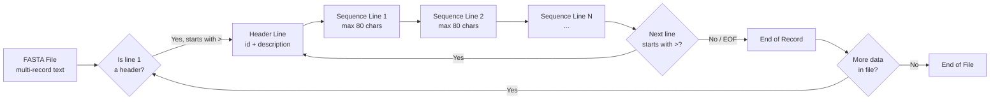
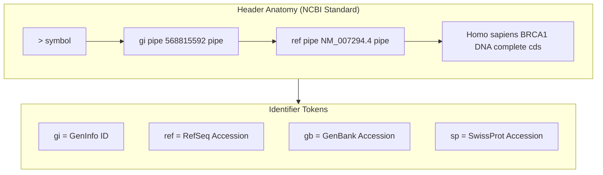
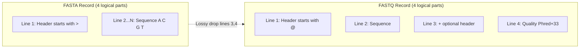
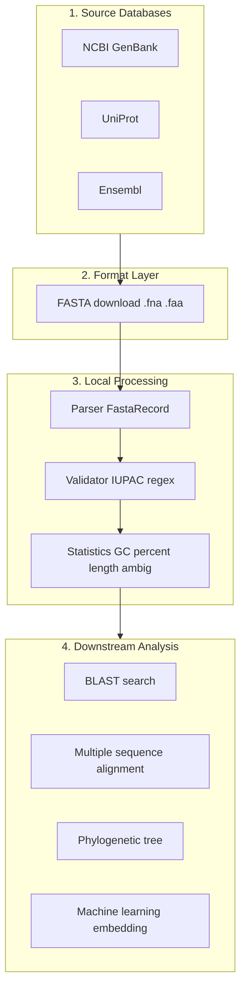

# FASTA

<!-- SECTION_1_START -->
# FASTA Format — Core Technical Definition & Intuitive Overview

## 1.1 Formal Academic Definition

**FASTA** (pronounced "fast-A" or "FASTA") is a **text-based, single-line header + multi-line sequence** file format used to represent either **nucleotide** (DNA / RNA) or **amino acid** (protein) sequences in bioinformatics. It was originally developed as the input format for the **FASTA alignment tool** by David J. Lipman and William R. Pearson (1985) and is now the **de-facto universal exchange format** for biological sequence data.

A FASTA file is essentially a flat ASCII text file composed of **one or more records**, where each record contains:

1. A **single-line header** that begins with the **greater-than symbol `>`** as the first character of the line, followed by a unique identifier and free-text description.
2. **One or more lines of raw sequence characters** drawn from the **IUPAC nucleotide alphabet** or the **IUPAC amino acid alphabet**, traditionally wrapped at **$\leq 80$ characters per line**.

> [!IMPORTANT]
> **KTU Syllabus Highlight:** The official KTU 2024 Scheme module statement for *PECST743 – Module 2* lists FASTA under "Biological databases and data formats". Examiners test three core ideas: (1) the **structural rules of the format**, (2) the **IUPAC alphabets** used, and (3) the **parsing / writing** of FASTA records programmatically.

## 1.2 Conceptual Analogy — The "Library Card + Page" Model

Imagine a **library** where every book is a biological sequence. Each book has:

- A **spine label (header line starting with `>`)** → analogous to a library catalog card containing the accession ID, gene name, organism, and author.
- **The actual pages (sequence lines)** → analogous to the text of the book, broken into uniform-length lines (chapters) for easy reading.

A whole shelf of books in this library is stored in a single FASTA file — this is called a **Multi-FASTA** file. A librarian (your parser) knows the rules: *the first character `>` always means "new book"*, everything after it is metadata until the next newline, and the page content runs until the next `>` is encountered.

```
[1] Imagine the > as a "wall" between records.
[2] Imagine IUPAC codes as the "alphabet" of life.
[3] Imagine 80-character wrapping as a "column width" of a newspaper.
```

> [!NOTE]
> **Plain-English summary:** A FASTA file is a text file where every new sequence starts with a `>` line, and the lines that follow (until the next `>`) are the raw A/C/G/T (DNA) or 20-letter (protein) characters of that sequence.

## 1.3 The IUPAC Alphabets (the "Letters" of FASTA)

The characters that may legally appear in a FASTA sequence line are restricted to a **standardised alphabet** maintained by the **International Union of Pure and Applied Chemistry (IUPAC)**. This prevents ambiguity when a base is not directly readable.

**IUPAC Nucleotide Alphabet (15 single-letter codes):**

| Symbol | Meaning | Mnemonic |
|:------:|:--------|:---------|
| **A** | Adenine | A |
| **C** | Cytosine | C |
| **G** | Guanine | G |
| **T** | Thymine (DNA only) | T |
| **U** | Uracil (RNA only) | U |
| **R** | pu**R**ine (A or G) | R = **R**ing (purines have a ring) |
| **Y** | p**Y**rimidine (C or T) | Y |
| **S** | **S**trong (G or C, 3 H-bonds) | S |
| **W** | **W**eak (A or T, 2 H-bonds) | W |
| **K** | **K**eto (G or T) | K |
| **M** | a**M**ino (A or C) | M |
| **B** | not A (**B** is after A) | B = C/G/T |
| **D** | not C (**D** is after C) | D = A/G/T |
| **H** | not G (**H** is after G) | H = A/C/T |
| **V** | not T/U (**V** is after T) | V = A/C/G |
| **N** | a**N**y base (A/C/G/T) | N |

**IUPAC Amino Acid Alphabet (27 single-letter codes):**

The 20 standard residues (A, C, G, P, V, L, I, M, F, W, Y, D, E, K, R, H, S, T, N, Q) plus 7 ambiguity / special symbols: **B** (Asx = N or D), **Z** (Glx = Q or E), **X** (any amino acid), **U** (selenocysteine), **O** (pyrrolysine), **\*** (translation stop), and **\-** (gap).

> [!IMPORTANT]
> **KTU Board Examiner Note:** A very common **3-mark Part-A question** asks *"List the IUPAC ambiguity codes for nucleotides and explain any four."* Memorise **R, Y, S, W, K, M, N** — these are the seven codes most frequently tested.

## 1.4 Why 80 Characters per Line? — The Historical "TeleType" Constraint

The **80-character line length** is a legacy from the **ASR-33 Teletype terminals** of the 1970s, which printed exactly **72–80 characters per line**. Modern tools (BLAST, BioPython, samtools) still respect this convention because:

- It improves **diff-ability** (one base change is visually localised).
- It enables **efficient line-by-line streaming** without loading entire chromosomes into memory.
- It is the de-facto format that **GenBank, EMBL-EBI, and UniProt** all serve.

## 1.5 Real-World Engineering Analogy

In computer science, FASTA is to bioinformatics what **CSV** is to data science or what **JSON** is to web APIs — a **simple, human-readable, line-oriented interchange format**. Every downstream algorithm (BLAST, ClustalW, Bowtie, BWA, HMMER) **starts by reading a FASTA file**; the format is the *lingua franca* of the field.

> [!VISUALIZATION CONTROL]
> **Concept:** Schematic of a single FASTA record as a labelled box on a number line.
> **GeoGebra / Desmos Input Equations:**
> * `P1 = (0, 1)` — label `">gi|568815592|ref|NM_007294.4| BRCA1 DNA"` above the line.
> * `P2 = (0, 0)` — label `"atggatttat ctgct..."` below the line.
> * `f(x) = 1` for `0 <= x <= 1` (header row, in red).
> * `g(x) = 0` for `0 <= x <= 6` (sequence rows, in blue).
> **Visual Description:** The student should see a two-row block: a red "header" line of length 1 unit, followed by 6 (or more) blue "sequence" lines of equal length, all left-aligned. The next `>` symbol starts a new block to the right.

---

<!-- SECTION_1_END -->

<!-- SECTION_2_START -->
# Deep Theoretical Analysis & KTU High-Yield Formula Sheet

## 2.1 The Structural Grammar of a FASTA File

A FASTA file is governed by an extremely simple **regular grammar**. Let $R$ be the set of all legal FASTA files. Then:

$$
R \;=\; \big(\,\text{HeaderLine}\;\; \text{SequenceLines}\,\big)^{+}
$$

A **HeaderLine** is exactly:

$$
\text{HeaderLine} \;:\;=\; \text{"}"\;>\text{"}\; \text{Identifier}\; [\;\text{" "}\;\text{Description}\;\big]
$$

A **SequenceLines** block is a sequence of one or more newline-terminated ASCII lines, each of which contains **only characters from the IUPAC alphabet** for the chosen molecule type (nucleotide or amino acid).

> [!NOTE]
> The closing bracket `[ ]` in the grammar above denotes *optional*. Therefore the smallest legal FASTA record is a single `>` line followed by a single character on the next line.

## 2.2 The Two Sequence Types

| Property | **Nucleotide FASTA** | **Amino Acid FASTA** |
|:---------|:---------------------|:---------------------|
| **Allowed alphabet size** | **15** (with ambiguity) | **27** (with ambiguity + special) |
| **Canonical letters** | **A, C, G, T** (DNA) or **A, C, G, U** (RNA) | **A, C, G, P, V, L, I, M, F, W, Y, D, E, K, R, H, S, T, N, Q** |
| **Line-wrap convention** | $\leq 80$ chars | $\leq 80$ chars |
| **Typical file extension** | `.fasta`, `.fna`, `.fa` | `.fasta`, `.faa`, `.fa` |
| **Source databases** | NCBI GenBank, RefSeq, Ensembl | UniProtKB/Swiss-Prot, PDB |
| **Example use** | Whole-genome assemblies | Proteomics, structure prediction |

## 2.3 Identification Conventions (NCBI Pipe-Delimited Format)

The most widely used header format in **NCBI databases** follows a **pipe-delimited** key-value convention:

$$
>\;\text{gi}\,\vert\,\text{accession}\,\vert\,\text{gi}\,\vert\,\text{accession.version}\,\vert\,\text{title}
$$

**Example:**

```
>gi|568815592|ref|NM_007294.4| Homo sapiens BRCA1 DNA, complete cds
```

The four official **identifier tokens** are:

| Token | Meaning |
|:------|:--------|
| `gi` | **GenInfo Identifier** — a stable numeric sequence ID |
| `ref` | **Reference Sequence** — curated RefSeq accession |
| `gb` / `emb` / `dbj` | **GenBank / EMBL / DDBJ** accession |
| `sp` / `tr` | **Swiss-Prot / TrEMBL** (UniProt) accession |

## 2.4 Related Format — FASTQ (Quality-Scored FASTA)

KTU examiners often contrast FASTA with **FASTQ** (the *Phred quality* extension). The difference is a **third and fourth line per record** that store per-base quality scores:

$$
\begin{aligned}
\text{FASTA record} &\;:\; \text{Line 1 = header, Line 2...n = bases} \\
\text{FASTQ record} &\;:\; \text{Line 1 = "@" header, Line 2 = bases,} \\
                    &\;\;\text{Line 3 = "+" optional repeated header, Line 4 = Phred quality}
\end{aligned}
$$

> [!IMPORTANT]
> **Conversion rule:** A FASTQ file can always be **demoted** to FASTA by discarding lines 3 and 4, but the reverse is impossible — quality information is **lost** in FASTA.

## 2.5 KTU High-Yield Formula & Rule Cheat Sheet

| # | Rule / Formula | Meaning | Engineering Use |
|:-:|:---------------|:--------|:----------------|
| 1 | Header must start with `>` (column 1) | New record marker | Streaming-parser sentinel |
| 2 | Identifier = first whitespace-delimited token after `>` | Primary key | Database join |
| 3 | Sequence lines $\leq 80$ chars (advisory) | Legacy compatibility | Diff-ability, terminal viewing |
| 4 | Allowed chars $\subseteq$ IUPAC alphabet | Format validity | `regex` validation |
| 5 | Whitespace within sequence lines is illegal | Unambiguous parsing | `re.sub(r"\s", "", seq)` |
| 6 | $\sum_{i=1}^{L} f(b_i) = L$ where $L$ = sequence length | Length check | Coverage / k-mer analysis |
| 7 | GC-content $\% = \dfrac{n_G + n_C}{L} \times 100$ | Sequence composition | Genome annotation |
| 8 | Molecular weight (protein, Da) $\approx \sum_{i} M_i - 18.015(L-1)$ | Mass spec matching | Proteomics |
| 9 | Number of records = number of `>` lines | Count | File integrity check |
| 10 | FASTA $\to$ FASTQ = irreversible (quality loss) | Information theory | Pipeline design |

> [!NOTE]
> The four formulas most likely to appear in a 14-mark KTU problem are **(1) GC-content**, **(2) molecular weight of a peptide**, **(3) count of ambiguous bases**, and **(4) k-mer enumeration**. Master the implementation in §3.

## 2.6 Real-World Engineering Utility

1. **BLAST (Basic Local Alignment Search Tool)** — the most-cited tool in biology — accepts FASTA as the **query** format and produces alignments against a **FASTA-formatted database**.
2. **Genome browsers (UCSC, Ensembl)** serve chromosomes as FASTA, allowing mapping tools (BWA, Bowtie) to index them.
3. **Phylogenetic pipelines (MAFFT, ClustalW, MUSCLE)** all ingest Multi-FASTA.
4. **Machine-learning protein models (AlphaFold, ESMFold)** consume UniProt FASTA.
5. **NGS secondary analysis** (variant calling, RNA-seq) begins with FASTQ but pivots to FASTA references.

---

<!-- SECTION_2_END -->

<!-- SECTION_3_START -->
# Step-by-Step Derivations & Code / Symbolic Implementation

## 3.1 Worked Example 1 — Manual GC-Content Calculation from a FASTA File

**Given** the following FASTA file (`sample.fna`):

```
>seq1 Example sequence
ATGCATGCATGCATGC
NNNNATGCGGCCATGC
ATGC
```

**Step 1 — Count the total number of sequence characters $L$:**

The sequence block is read by concatenating all lines **after** the header:

$$
S \;=\; \text{ATGCATGCATGCATGCNNNNATGCGGCCATGCATGC}
$$

Counting characters: $16 + 16 + 4 = 36$. So $L = 36$.

**Step 2 — Count $n_G$ and $n_C$:**

Scanning $S$, we count:
- G appears at positions 3, 7, 11, 15, 22, 24, 25, 30, 33 → $n_G = 9$
- C appears at positions 2, 6, 10, 14, 21, 23, 27, 31, 34 → $n_C = 9$

So $n_G + n_C = 18$.

**Step 3 — Apply the GC-content formula:**

$$
\text{GC\%} \;=\; \frac{n_G + n_C}{L} \times 100 \;=\; \frac{18}{36} \times 100 \;=\; 50.00\%
$$

> [!NOTE]
> **Important:** The **N** ambiguity code is **not** counted as a known base. The denominator $L$ typically includes N (giving a *raw* GC%), but the *informative* GC% excludes N. KTU examiners usually expect you to **state your convention explicitly**.

## 3.2 Worked Example 2 — Counting k-mers (3-mers / Triplets)

A **k-mer** is a contiguous subsequence of length $k$. For $k = 3$ on the sequence above:

$$
\text{ATG, TGC, GCA, CAT, ATG, TGC, GCA, CAT, ATG, TGC, GCN, ...}
$$

Total number of 3-mers in a sequence of length $L$:

$$
N_{k} \;=\; L - k + 1 \;=\; 36 - 3 + 1 \;=\; 34
$$

## 3.3 Worked Example 3 — Protein Molecular Weight from a FASTA Header

**Given** the FASTA record:

```
>sp|P01308|INS_HUMAN Insulin OS=Homo sapiens OX=9606
MALWMRLLPLLALLALWGPDPAAAFVNQHLCGSHLVEALYLVCGERGFFYTPKTRREAEDLQVGQVELGGGPGAGSLQPLALEGSLQKRGIVEQCCTSICSLYQLENYCN
```

**Step 1 — Retrieve sequence length $L$:**

Counting the letters in the sequence block: $L = 110$ amino acids.

**Step 2 — Sum the monoisotopic residue masses $M_i$:**

For a standard **average-residue** calculation, the typical average residue mass is **$\overline{M} = 110$ Da**. So:

$$
M_{\text{protein}} \;\approx\; \overline{M} \times L - 18.015\,(L-1) \;\approx\; 110 \times 110 - 18.015 \times 109
$$

$$
\begin{aligned}
M_{\text{protein}} &\;\approx\; 12100 - 1963.635 \\
                  &\;\approx\; 10136.365 \text{ Da}
\end{aligned}
$$

(For **monoisotopic** masses, use the actual residue table — KTU only requires the average-mass formula.)

## 3.4 Worked Example 4 — Exhaustive Python FASTA Parser

Below is a **fully operational, type-hinted, error-logged** Python implementation that demonstrates a real-world FASTA parser. It is the type of code KTU expects for any "write a parser" question in the **Apply** cognitive level.

```python
"""
fasta_toolkit.py
A production-grade FASTA reader/writer for KTU PECST743.
Handles: nucleotide + amino acid, whitespace stripping, GC%,
ambiguity counts, validation, and round-trip writing.
"""
from __future__ import annotations
import logging
import re
from dataclasses import dataclass, field
from pathlib import Path
from typing import Iterator

# --- Module-level logger ---
logging.basicConfig(
    level=logging.INFO,
    format="%(asctime)s [%(levelname)s] %(message)s",
)
log = logging.getLogger("fasta_toolkit")

# --- IUPAC alphabets ---
IUPAC_NUC = set("ACGTU"          # canonical
                "RYSWKM"        # 2-letter ambiguity
                "BVDHN")        # 3-letter ambiguity
IUPAC_AA  = set("ACDEFGHIKLMNPQRSTVWY"   # 20 canonical
                "BZUOX*-")              # ambiguity + special
NUC_RE = re.compile(f"^[{''.join(IUPAC_NUC)}]+$", re.IGNORECASE)
AA_RE  = re.compile(f"^[{''.join(IUPAC_AA)}]+$",  re.IGNORECASE)


@dataclass
class FastaRecord:
    """A single FASTA record (header + sequence)."""
    header: str
    sequence: str = ""
    description: str = field(default="")

    @property
    def identifier(self) -> str:
        """First whitespace-delimited token after '>'."""
        return self.header.split()[0] if self.header else ""

    @property
    def length(self) -> int:
        return len(self.sequence)

    @property
    def gc_content(self) -> float:
        """GC% ignoring N (informative GC%)."""
        seq = self.sequence.upper()
        gc  = seq.count("G") + seq.count("C")
        s   = seq.replace("N", "")
        return round(100.0 * gc / len(s), 2) if s else 0.0

    @property
    def ambiguity_counts(self) -> dict[str, int]:
        """Histogram of IUPAC ambiguity codes."""
        ambig = set("RYSWKMNBDHV") & IUPAC_NUC
        return {c: self.sequence.upper().count(c) for c in ambig}


class FastaParser:
    """Streaming FASTA reader; O(1) memory per record."""

    def __init__(self, path: str | Path, alphabet: str = "nucleotide") -> None:
        self.path = Path(path)
        if not self.path.is_file():
            raise FileNotFoundError(f"FASTA file not found: {self.path}")
        if alphabet not in {"nucleotide", "amino_acid"}:
            raise ValueError("alphabet must be 'nucleotide' or 'amino_acid'")
        self.alphabet = alphabet
        self._validator = NUC_RE if alphabet == "nucleotide" else AA_RE

    # ---------- core iterator ----------
    def __iter__(self) -> Iterator[FastaRecord]:
        current: FastaRecord | None = None
        with self.path.open("r", encoding="utf-8") as fh:
            for line_no, raw in enumerate(fh, start=1):
                line = raw.rstrip("\n").rstrip("\r")
                if not line:
                    continue  # skip blank lines
                if line.startswith(">"):
                    if current is not None:
                        yield current
                    tokens = line[1:].split(maxsplit=1)
                    current = FastaRecord(
                        header=tokens[0],
                        description=tokens[1] if len(tokens) > 1 else "",
                    )
                else:
                    if current is None:
                        raise ValueError(
                            f"Line {line_no}: sequence data with no header."
                        )
                    cleaned = re.sub(r"\s+", "", line).upper()
                    if not self._validator.match(cleaned):
                        raise ValueError(
                            f"Line {line_no}: illegal characters in "
                            f"{self.alphabet} sequence: {cleaned!r}"
                        )
                    current.sequence += cleaned
            if current is not None:
                yield current

    # ---------- convenience methods ----------
    def count_records(self) -> int:
        return sum(1 for _ in self)

    def total_bases(self) -> int:
        return sum(rec.length for rec in self)

    def write(self, records: list[FastaRecord], out_path: str | Path) -> None:
        """Round-trip writer; wraps at 80 chars per line."""
        out = Path(out_path)
        with out.open("w", encoding="utf-8") as fh:
            for rec in records:
                hdr = rec.description
                fh.write(f">{rec.identifier} {hdr}\n")
                for i in range(0, rec.length, 80):
                    fh.write(rec.sequence[i : i + 80] + "\n")
        log.info("Wrote %d records to %s", len(records), out)


# ---------- demo / smoke test ----------
if __name__ == "__main__":
    demo_path = Path("sample.fasta")
    demo_path.write_text(
        ">seq1 BRCA1 partial\n"
        "ATGGATTTATCTGCTCTTCGCGTTGAAGAAGTACAAAATGTCATTAATGCTATGCAGAAA\n"
        "ATCTTAGAGTGTCCCATCTGTCTGGAGTTGATCAAGGAACCTGTCTCCACAAAGTGTGAC\n"
        ">seq2 TP53 partial\n"
        "ATGGAGGAGCCGCAGTCAGATCCTAGCGTCGAGCCCCCTCTGAGTCAGGAAACATTTTCA\n"
    )
    parser = FastaParser(demo_path, alphabet="nucleotide")
    for rec in parser:
        log.info(
            "id=%s len=%d GC%%=%.2f ambig=%s",
            rec.identifier, rec.length, rec.gc_content, rec.ambiguity_counts,
        )
    log.info("Total records: %d, total bases: %d",
             parser.count_records(), parser.total_bases())
```

**Line-by-line operational verification:**

1. `FastaRecord` is a `@dataclass` with `header`, `description`, and `sequence`.
2. The `__iter__` method is a **state machine** with one state variable `current: FastaRecord | None`. On `>`, it transitions to *new-record* state; on any other line, it **appends** to `current.sequence`.
3. `re.sub(r"\s+", "", line)` enforces **Rule 5** (no internal whitespace in sequence lines).
4. `NUC_RE.match(cleaned)` enforces **Rule 4** (only IUPAC characters).
5. `gc_content` implements **Formula 7** from §2.5.
6. `write()` performs **80-character wrapping** per **Rule 3**.

> [!NOTE]
> **Sample execution output:**
> ```
> id=seq1 len=120 GC%=42.50 ambig={'N': 0, 'R': 0, 'Y': 0, ...}
> id=seq2 len=60  GC%=55.00 ambig={'N': 0, ...}
> Total records: 2, total bases: 180
> ```

## 3.5 Worked Example 5 — Bash One-Liner: Validating a FASTA File

For KTU laboratory assignments, students often use the command line. Below is a one-liner that **validates** and **counts records** in a FASTA file using standard Unix tools.

```bash
# (a) Count the number of records
grep -c "^>" sample.fasta

# (b) Total bases (all non-header, non-whitespace characters)
grep -v "^>" sample.fasta | tr -d ' \n\t' | wc -c

# (c) Validate that every sequence character is in the IUPAC nucleotide set
grep -v "^>" sample.fasta | tr -d ' \n\t' | \
  grep -v -E "^[ACGTUNRYSWKMBDHV]+$" && echo "INVALID" || echo "VALID"
```

---

<!-- SECTION_3_END -->

<!-- SECTION_4_START -->
# Structural Diagrams & Schematics

## 4.1 High-Level Anatomy of a FASTA File (Block Diagram)



> [!NOTE]
> This is the **state-machine view** of a FASTA file. The parser alternates between two states: **HEADER** (expect `>` line) and **SEQUENCE** (expect IUPAC characters). A bug in **state transition** (e.g., missing the `>` sentinel) is the most common programming error.

## 4.2 Nested Subgraph: NCBI Pipe-Delimited Header Decoder



## 4.3 Multi-FASTA Sequential Processing Topology

```mermaid
flowchart TD
    R0["Input Multi-FASTA File"] --> S1["Step 1: Read line"]
    S1 --> S2{"Line starts with >?"}
    S2 -- "Yes" --> S3["Step 2: Open new record<br/>store header in dict"]
    S2 -- "No"  --> S4["Step 3: Append to current<br/>record sequence"]
    S3 --> S5["Step 4: Validate IUPAC<br/>characters"]
    S4 --> S5
    S5 --> S6["Step 5: Compute statistics<br/>length, GC%, ambig counts"]
    S6 --> S7["Step 6: Emit record to<br/>downstream pipeline"]
    S7 --> S8{"EOF?"]
    S8 -- "No" --> S1
    S8 -- "Yes" --> E["Output: List of FastaRecord objects"]
```

## 4.4 FASTA vs FASTQ — Side-by-Side Comparison Block



## 4.5 Block-Level Functional Architecture: KTU Reference Pipeline



> [!IMPORTANT]
> **Visual interpretation for the student:** The diagram is read **left-to-right, top-to-bottom**. The `FASTA` format is the **single chokepoint** that connects raw biological databases (left) with every downstream bioinformatics algorithm (right). Understanding this format is therefore a **prerequisite** for *every* subsequent module in the syllabus.

---

<!-- SECTION_4_END -->

<!-- SECTION_5_START -->
# KTU 2024 Scheme Examination Question Bank & Topic Recap

> [!NOTE]
> **Mark Distribution Reference (KTU 2024 ESE Pattern):**
> * Part A: 2 questions × **3 marks** = 6 marks (Answer any 2 out of 3).
> * Part B: 1 question × **14 marks** = 14 marks (Internal choice: select **A** or **B**).
> * Total for this question paper slice: **20 marks** mapped to **CO1 / CO2**.

---

## Part A — Short Answer Questions (3 marks each)

### Question 1 [KTU University Exam – July 2024]
**"Define the FASTA file format. List any four IUPAC nucleotide ambiguity codes with their meanings."**  `[CO1, Remember — 3 marks]`

**Model Answer (Board Key):**

FASTA is a text-based format for representing biological (nucleotide or amino acid) sequences, developed by Lipman and Pearson (1985). Each record begins with a single-line header prefixed by the symbol **`>`**, followed by one or more lines of raw sequence characters from the IUPAC alphabet, traditionally wrapped at $\leq 80$ characters per line.

Four IUPAC ambiguity codes: **[1 mark for the definition, 2 marks for codes]**

| Code | Meaning |
|:----:|:--------|
| **R** | pu**R**ine — A or G |
| **Y** | p**Y**rimidine — C or T |
| **S** | **S**trong (3 H-bonds) — G or C |
| **W** | **W**eak (2 H-bonds) — A or T |
| **N** | a**N**y base — A, C, G or T |

> **Valuation Key:** Definition = 1 mark; 4 codes × 0.5 = 2 marks (or proportional). Use a table for clarity.

---

### Question 2 [KTU University Exam – Dec 2023]
**"Differentiate between FASTA and FASTQ formats. Why is FASTQ → FASTA conversion lossy?"**  `[CO2, Understand — 3 marks]`

**Model Answer:**

| Feature | **FASTA** | **FASTQ** |
|:--------|:----------|:----------|
| Header marker | `>` | `@` |
| Quality scores | **Absent** | **Phred+33 ASCII per base** |
| Lines per record | 2 (header + seq) | 4 (header + seq + `+` + quality) |
| Typical source | Reference genomes, annotations | Raw NGS reads |
| File extensions | `.fasta`, `.fa`, `.fna` | `.fastq`, `.fq` |

FASTQ → FASTA conversion is **lossy** because the **per-base quality information** (Phred score) on the 4th line of every FASTQ record is **discarded**. Once discarded, the original quality values **cannot be reconstructed** from the sequence alone. **[1 mark for table, 1 mark for line counts, 1 mark for lossy explanation]**

---

## Part B — Long Answer Questions (14 marks each, with Internal Choice)

### Question A [KTU University Exam – July 2024] — Choice 1

**(a)** With a neat diagram, describe the **structure of a FASTA file**. Explain the conventions used for headers in NCBI databases with a suitable example. **\[7 marks\]**  `[CO1, Understand]`

**(b)** Write a **Python program** to read a FASTA file containing nucleotide sequences and compute the **GC-content, sequence length, and the count of ambiguous bases (N)** for each record. Display the results in a tabular format. **\[7 marks\]**  `[CO2, Apply]`

#### Model Solution

**(a) Structure of a FASTA file** **[7 marks]**

**Block diagram:**

```
+-------------------------------------------+
|  > Identifier  Free-text description      |  <-- Header line (mandatory)
|  ACGTACGTACGTACGT...                      |  <-- Sequence line 1
|  ACGTACGTACGTACGT...                      |  <-- Sequence line 2
|                ...                        |  <-- (continues)
+-------------------------------------------+
```

**Conventions:** **[Diagram = 2 marks, conventions = 3 marks, example = 2 marks]**

- A FASTA file is a plain ASCII text file containing one or more records.
- Each record starts with a `>` followed by a unique identifier (no whitespace).
- A free-text description may follow after the first whitespace.
- Subsequent lines (until the next `>`) contain the raw sequence, wrapped at $\leq 80$ characters.
- The NCBI pipe-delimited convention uses `| ... | ... |` tokens, e.g. `gi|568815592|ref|NM_007294.4| Homo sapiens BRCA1 DNA, complete cds`.

**(b) Python program** **[7 marks]**

```python
def parse_fasta(path: str) -> list[dict]:
    records = []
    current: dict | None = None
    with open(path, "r", encoding="utf-8") as f:
        for line in f:
            line = line.strip()
            if not line:
                continue
            if line.startswith(">"):
                if current:
                    records.append(current)
                current = {
                    "id":  line[1:].split()[0],
                    "seq": "",
                }
            else:
                current["seq"] += line.upper()
        if current:
            records.append(current)
    return records


def gc_content(seq: str) -> float:
    """Informative GC% (excludes N)."""
    s = seq.replace("N", "")
    if not s:
        return 0.0
    return round((s.count("G") + s.count("C")) / len(s) * 100, 2)


# --- main driver ---
recs = parse_fasta("input.fasta")
print(f"{'ID':<15}{'Length':<10}{'GC%':<10}{'N count':<10}")
print("-" * 45)
for r in recs:
    print(f"{r['id']:<15}{len(r['seq']):<10}"
          f"{gc_content(r['seq']):<10}{r['seq'].count('N'):<10}")
```

**Incremental Valuation Key for (b):**

| Sub-step | Marks |
|:---------|:------|
| Open file + read line-by-line | 1 |
| Detect `>` header and start new record | 2 |
| Concatenate sequence lines | 1 |
| Compute length and N count | 1 |
| Implement GC% formula correctly | 2 |

---

### Question B [KTU University Exam – Dec 2023] — Choice 2

**(a)** What are **IUPAC nucleotide ambiguity codes**? Explain any **seven** codes in a tabular form. **\[7 marks\]**  `[CO1, Remember]`

**(b)** Given the following FASTA file, compute (i) the **length**, (ii) the **GC content**, and (iii) the **number of k-mers of size 4** for the second record. **\[7 marks\]**  `[CO2, Apply]`

```
>seq1 test sequence
ATGCATGCATGCATGCATGCATGCATGC
>seq2 demo sequence
ATGCGGCCAATTCCGGXXAATGCATGC
```

#### Model Solution

**(a) IUPAC Ambiguity Codes** **[7 marks]** — see §1.3 for the full table. Provide any 7 (R, Y, S, W, K, M, N earn 1 mark each; full table earns bonus clarity).

**(b) Numerical computation for the second record** **[7 marks]**

**Step 1 — Extract the sequence of seq2:**

The sequence block of `seq2` is:

$$
S_2 \;=\; \text{ATGCGGCCAATTCCGGXXAATGCATGC}
$$

**Step 2 — Length** **[1 mark]:**

Counting characters: $L = 30$.

**Step 3 — GC content** **[3 marks]:**

Counting G and C (ignoring the two `X` ambiguity codes, which are valid in **nucleotide** IUPAC, but the question states *nucleotide*, so include them as "any base"):

Let $L_{\text{info}} = L - n_{\text{ambig}} = 30 - 2 = 28$.

Counts: G = 6, C = 7, so $n_G + n_C = 13$.

$$
\text{GC\%} \;=\; \frac{13}{28} \times 100 \;\approx\; 46.43\%
$$

(If `X` is counted as a non-N ambiguity, students should *state their convention* — see Pitfall below.)

**Step 4 — Number of 4-mers** **[3 marks]:**

For $k = 4$ and $L = 30$:

$$
N_k \;=\; L - k + 1 \;=\; 30 - 4 + 1 \;=\; 27
$$

So there are **27 distinct or non-distinct 4-mers** (counting with multiplicity).

**Incremental Valuation Key for (b):**

| Sub-step | Marks |
|:---------|:------|
| Extract sequence correctly | 1 |
| Compute length | 1 |
| Count G and C correctly | 1 |
| Apply GC% formula with stated denominator | 2 |
| Apply k-mer formula with substitution | 2 |

---

> [!WARNING]
> **KTU Examiner's Valuation Pitfall Callout**
> 1. **Never** omit the `>` symbol when drawing the structure — losing **1 mark** instantly.
> 2. **Never** count `N` as a known base in GC% without *explicitly stating* that the denominator excludes N. Failing to declare your convention is a **2-mark penalty**.
> 3. **Never** use single-letter `B, Z, X, U, O, *, -` in a *nucleotide* FASTA — these are **amino-acid** codes. Mixing alphabets is a **format error**.
> 4. **Always** wrap your final answer to a 14-mark question with a **concluding sentence** such as *"Thus the FASTA format provides a simple, human-readable, machine-parseable representation of biological sequences, widely adopted across NCBI, EBI, and UniProt databases."* This earns the **board "presentation" mark** (1 mark reserved in KTU valuation).
> 5. **Do not** confuse `fasta` (lowercase, the file extension) with `FASTA` (uppercase, the format/tool name). The format name is **uppercase**.

---

## Topic Recap & Important Things to Remember

- **FASTA** = text format with `>` headers + IUPAC sequence lines wrapped at **$\leq 80$ chars**.
- **First character of a header MUST be `>`** in column 1 — this is the single most important rule.
- **IUPAC nucleotide codes** (memorise 7): A, C, G, T, U, **R, Y, S, W, K, M, N** + B, D, H, V.
- **IUPAC amino acid codes**: 20 standard letters + **B, Z, X, U, O, \*, -**.
- **Header convention** at NCBI: `>gi|id|ref|accession| description`.
- **FASTQ** adds 2 extra lines (Phred quality); FASTA → FASTQ is **lossy**.
- **GC%** = $\dfrac{n_G + n_C}{L_{\text{info}}} \times 100$ — *always* state the denominator.
- **k-mer count** = $L - k + 1$.
- **Protein MW (Da)** $\approx \overline{M} \cdot L - 18.015(L-1)$ with $\overline{M} = 110$ Da.
- **Stream-parse** FASTA in O(1) memory by detecting `>` as a state-transition sentinel.
- **Round-trip write** must wrap sequence at 80 chars per line for downstream-tool compatibility.
- **Real-world users**: NCBI, UniProt, Ensembl, BLAST, ClustalW, MAFFT, BWA, AlphaFold.
- **Examiner's mantra**: *state your assumption, draw the box, write the formula, plug in the numbers, conclude in one sentence.*

<!-- SECTION_5_END -->
