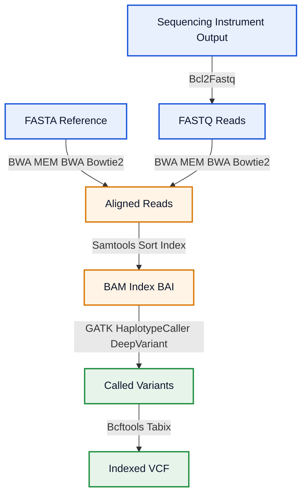
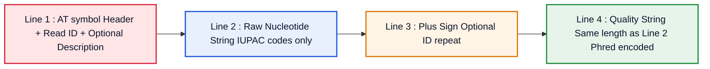
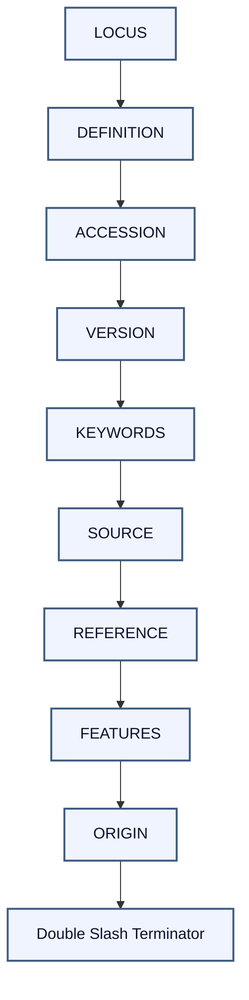
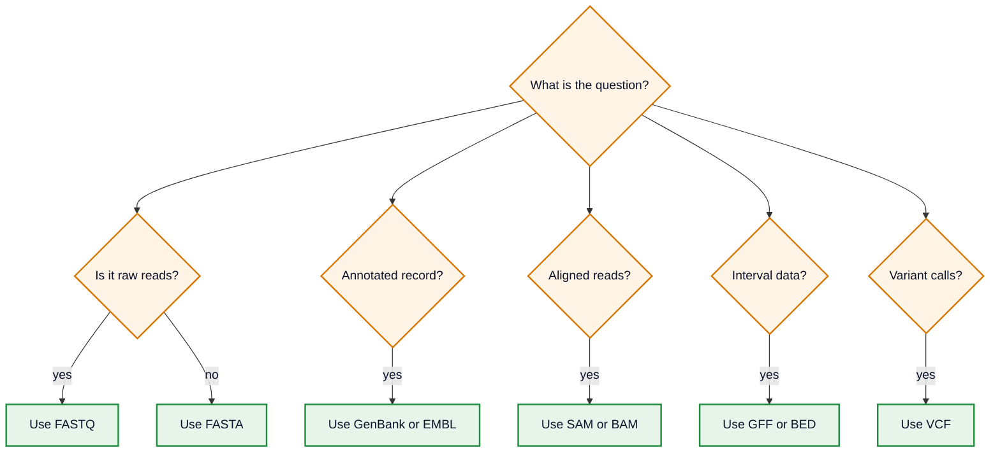

# Genomic and Sequence Data Formats

<!-- SECTION_1_START -->
# Genomic and Sequence Data Formats

## 1.1 Formal Definition (KTU 2024 Syllabus Terminology)

A **Genomic and Sequence Data Format** is a strictly standardized, machine-parseable text (or binary) encoding specification used to represent nucleotide sequences, protein sequences, genomic features, sequencing reads, alignments, and sequence variants across heterogeneous bioinformatics systems.

In the KTU 2024 Scheme (BIOINFORMATICS - PECST743, Module 2), sequence data formats are categorized into three functional tiers:

| Tier | Purpose | Examples |
|---|---|---|
| **Tier 1: Raw Sequence Encodings** | Store unannotated nucleotide or amino acid strings | **FASTA**, **FASTQ** |
| **Tier 2: Annotated Sequence Records** | Embed metadata, feature tables, and biological context | **GenBank Flat File**, **EMBL Flat File** |
| **Tier 3: Alignment \& Variant Encodings** | Store mapped reads, intervals, and mutations | **SAM / BAM**, **BED**, **GFF / GTF**, **VCF** |

> [!IMPORTANT]
> **KTU 2024 - High-Yield Definition:** A sequence format is "syntactically valid" only when it satisfies the lexical grammar of its parent consortium (NCBI, EBI, SAMtools, GA4GH). Loss of header integrity is the most common cause of pipeline failure in production bioinformatics.

## 1.2 Conceptual Analogy / Intuition

Imagine a **library card catalogue from 1995**. Each card has:

- An **ID number** (the accession)
- A **title** (the definition)
- A **summary** (the source organism)
- A **table of contents** (the features)
- The **raw text of the book** (the sequence)

GenBank, EMBL, and FASTA are exactly this — but standardized globally so that any scientist's software (BLAST, Bowtie, BWA, GATK) can read any other scientist's data without ambiguity.

A second analogy: a **FASTQ file is a hospital X-ray image** — it is the raw data plus a *quality score* (the diagnostic confidence) for every pixel (nucleotide).

> [!NOTE]
> **Why so many formats?** Because biology operates at multiple scales: a single base (VCF), a read (FASTQ), a gene (GFF), a chromosome (BED), and an assembly (GenBank). No single format captures all scales efficiently.

## 1.3 The Universal Biological Alphabet — IUPAC Codes

All sequence formats rely on the **International Union of Pure and Applied Chemistry (IUPAC)** nucleotide codes. Ambiguity codes exist because a sequencer cannot always resolve the base at a given position.

| Symbol | Meaning | Complement |
|---|---|---|
| **A** | Adenine | T |
| **C** | Cytosine | G |
| **G** | Guanine | C |
| **T** | Thymine | A |
| **U** | Uracil (RNA) | A |
| **R** | puRine (A or G) | Y |
| **Y** | pYrimidine (C or T) | R |
| **S** | Strong (G or C) | S |
| **W** | Weak (A or T) | W |
| **K** | Keto (G or T) | M |
| **M** | aMino (A or C) | K |
| **B** | not A (C,G,T) | V |
| **D** | not C (A,G,T) | H |
| **H** | not G (A,C,T) | D |
| **V** | not T (A,C,G) | B |
| **N** | aNy base | N |
| **-** or **.** | Gap | - |

> [!VISUALIZATION CONTROL]
> **Concept:** IUPAC Ambiguity Code Coverage on the Unit Circle
> **GeoGebra / Desmos Input Equations:**
> * `A = (1, 0)`
> * `C = (0, 1)`
> * `G = (-1, 0)`
> * `T = (0, -1)`
> * `R = midpoint(A, G) = (0, 0)`
> * `Y = midpoint(C, T) = (0, 0)`
> **Visual Description:** Place the four canonical bases at the cardinal points of a unit circle. Notice that `R`, `Y`, `S`, `W`, `K`, `M` all collapse to the origin — they are "uncertain" bases. The ambiguity is geometric, not biological.

> [!IMPORTANT]
> **Constants to remember for the exam:**
> * **Standard line length** in FASTA/GenBank/EMBL = **60 characters**
> * **FASTQ Phred+33 ASCII range** = **33 to 73** (Sanger / Illumina 1.8+)
> * **FASTQ Phred+64 ASCII range** = **64 to 104** (Illumina 1.3 – 1.7)
> * **GFF columns** = exactly **9 tab-separated fields**
> * **BED minimum columns** = **3** (chrom, start, end)

<!-- SECTION_1_END -->

<!-- SECTION_2_START -->
# Deep Theoretical Analysis & KTU High-Yield Formula Sheet

## 2.1 FASTA Format — The Foundation

### 2.1.1 Operational Concept

FASTA is the **smallest, fastest, most universally accepted** sequence container. It carries **no quality information** and **no annotation features** — only the sequence and a free-text header.

### 2.1.2 Lexical Grammar

1. The first line of every record begins with the `>` character.
2. The remainder of that line is the *defline* — a free-form identifier and optional description.
3. The sequence begins on the next line.
4. Sequences are wrapped at exactly **60 or 80 characters** (line wrap is *cosmetic only*; parsers concatenate).
5. A new `>`-prefixed line marks the start of the next record. There is no explicit end-of-record token.

### 2.1.3 Why FASTA Works in Production

- **O(n) parsing** — Biopython's `SeqIO.parse(..., "fasta")` is streaming and constant-memory.
- **Grep-compatible** — `grep "^>" sequences.fasta` instantly extracts all IDs.
- **BLAST input** — every alignment tool accepts FASTA as the *de facto* standard.

## 2.2 FASTQ Format — Adding Per-Base Quality

### 2.2.1 Operational Concept

FASTQ extends FASTA with a **Phred quality score** for *every single nucleotide*. Each record is a 4-line block.

### 2.2.2 Lexical Grammar

1. Line 1: `@` followed by the read identifier (and optional description).
2. Line 2: the raw nucleotide sequence (IUPAC codes, no whitespace).
3. Line 3: `+`, optionally followed by a repeat of the identifier.
4. Line 4: a quality string of *exactly the same length* as line 2, where each character is the ASCII encoding of the Phred score.

### 2.2.3 The Phred Quality Equation

The relationship between the ASCII character $c$ and the probability $P$ of an incorrect base call is governed by two equations:

$$
\begin{aligned}
Q_{\text{phred}} &= -10 \cdot \log_{10}(P) \\[4pt]
Q_{\text{stored}} &= \text{ASCII}(c) - \text{offset}
\end{aligned}
$$

> [!IMPORTANT]
> **KTU must-know:** Sanger / Illumina 1.8+ uses **offset = 33**; legacy Illumina 1.3 – 1.7 used **offset = 64**. Mistaking the offset is the #1 cause of silent data corruption in pipelines.

| ASCII char | Dec | Q (Phred+33) | P(error) |
|---|---|---|---|
| `!` | 33 | 0 | 1.000 |
| `5` | 53 | 20 | 0.01000 |
| `?` | 63 | 30 | 0.00100 |
| `i` | 105 | 72 (Phred+33) | 0.00000 |
| `h` | 104 | 40 (Phred+64) | 0.00010 |

## 2.3 GenBank Flat File — The Annotated Record

### 2.3.1 Operational Concept

A GenBank record is a **single ASCII file** with a strict 3-column layout: a 2-letter *section keyword*, the section *body*, and a numeric/character *value*. Sections appear in a **fixed, mandatory order**.

### 2.3.2 Section Order (must be memorized)

`LOCUS` → `DEFINITION` → `ACCESSION` → `VERSION` → `KEYWORDS` → `SOURCE` → `REFERENCE` → `FEATURES` → `ORIGIN` → `//`

### 2.3.3 The FEATURES Table

The FEATURES table is the heart of GenBank. It uses **5-column Feature Table format (FT)**:

| Column | Width | Content |
|---|---|---|
| 1 | 5 chars | Feature key (e.g., `CDS`, `gene`, `mRNA`) |
| 2 | 3 chars | ` `, `/`, or `=` (qualifier marker) |
| 3 | 8 chars | left qualifier column (e.g., `/gene=`) |
| 4 | 8 chars | continuation indent |
| 5 | variable | value (e.g., `123..456`) |

## 2.4 EMBL Flat File — EBI's Counterpart

EMBL is structurally analogous to GenBank but uses a **2-column format** with a 2-letter line-type code in column 1–2. Mandatory fields: `ID`, `AC`, `DE`, `KW`, `OS`, `OC`, `OG`, `CC`, `DR`, `FH`, `FT`, `SQ`, `//`.

## 2.5 GFF / GTF — Genome Annotation Streams

Both are **9 tab-separated columns**:

$$
\begin{aligned}
\text{col}_1 &: \text{seqid} \quad (\text{chromosome or contig name}) \\
\text{col}_2 &: \text{source} \quad (\text{program or database}) \\
\text{col}_3 &: \text{type} \quad (\text{feature ontology term}) \\
\text{col}_4 &: \text{start} \quad (1\text{-based, inclusive}) \\
\text{col}_5 &: \text{end} \quad (1\text{-based, inclusive}) \\
\text{col}_6 &: \text{score} \quad (\text{floating point or `.`}) \\
\text{col}_7 &: \text{strand} \quad (\text{`+`, `-`, or `.`}) \\
\text{col}_8 &: \text{phase} \quad (\text{0, 1, 2, or `.`}) \\
\text{col}_9 &: \text{attributes} \quad (\text{semicolon-separated key=value pairs})
\end{aligned}
$$

**GTF is a strict GFF3 subtype** where column 3 must be from SOFA (`gene`, `transcript`, `exon`, `CDS`, `start_codon`, `stop_codon`) and column 9 must contain `gene_id` and `transcript_id`.

## 2.6 BED Format — Tabular Genomic Intervals

BED is the **lightweight coordinate format** used by UCSC Genome Browser. The first 3 columns are mandatory (`chrom`, `start`, `end`); columns 4–12 progressively enrich the record (`name`, `score`, `strand`, `thickStart`, `thickEnd`, `itemRgb`, `blockCount`, `blockSizes`, `blockStarts`).

> [!NOTE]
> **Critical:** BED coordinates are **0-based, half-open** (`[start, end)`). GFF and GenBank are **1-based, inclusive**. A 1-bp offset bug in coordinate conversion is the most expensive bug in genomics.

## 2.7 SAM / BAM — Sequence Alignment Map

A SAM file is a **header section** (lines starting with `@`) followed by an **alignment section** with **11 mandatory tab-separated columns**:

`QNAME`, `FLAG`, `RNAME`, `POS`, `MAPQ`, `CIGAR`, `RNEXT`, `PNEXT`, `TLEN`, `SEQ`, `QUAL`

**BAM is the BGZF-compressed binary index of SAM**, requiring a `.bai` companion index for random access.

The **FLAG field is a 12-bit bitwise encoding** of alignment properties (paired, mapped, reverse-strand, mate-reverse, first-in-pair, second-in-pair, etc.). Decoding:

$$
\text{FLAG} = \sum_{i \in S} 2^{i-1}, \quad S = \text{set of true properties}
$$

## 2.8 VCF — Variant Call Format

A VCF file has a **header** (`##fileformat=VCFv4.2`, `##INFO=`, `##FORMAT=`) and a **data section** beginning with the literal line `#CHROM POS ID REF ALT QUAL FILTER INFO [FORMAT SAMPLE ...]`. Each row is a *variant*, not a position — so a `0/1` genotype column encodes heterozygosity at that locus.

## 2.9 The Master Formula Sheet

> [!IMPORTANT]
> **KTU 2024 - Module 2 Exam Cheat Sheet**

| Symbol / Concept | Value / Definition | Used In |
|---|---|---|
| Phred Q-score | $Q = -10 \log_{10} P$ | FASTQ |
| Sanger offset | **33** | FASTQ |
| Legacy Illumina offset | **64** | FASTQ |
| BED coordinate system | 0-based, half-open | BED, BAM |
| GFF coordinate system | 1-based, inclusive | GFF, GenBank |
| SAM FLAG bit $i$ | $2^{i-1}$ | SAM |
| CIGAR operators | `M I D N S H P = X` | SAM |
| FASTA line width | **60 or 80** | FASTA |
| GenBank FT indent | **21 spaces** | GenBank |
| GFF mandatory columns | **9** | GFF / GTF |
| BAM index suffix | **.bai** | BAM |
| VCF genotype `0/1` | **heterozygous** | VCF |

> [!NOTE]
> **Real-world engineering utility:** The SAM/BAM + VCF stack is the *de facto* standard in clinical NGS pipelines (GATK, DeepVariant). The FASTA + GTF stack drives model organism annotation (Ensembl, UCSC). Understanding coordinate offsets is mandatory for any tool that bridges them.

<!-- SECTION_2_END -->

<!-- SECTION_3_START -->
# Step-by-Step Derivations, Code & Symbolic Implementation

## 3.1 Worked Numerical Example: Phred Quality Decoding

**Problem.** A FASTQ record contains the quality string `BBBBB@B`. The pipeline claims to use Phred+33. Calculate the per-base probability of error.

**Step 1 — Decode the ASCII codes.**

| Position | Char | ASCII dec |
|---|---|---|
| 1 | `B` | 66 |
| 2 | `B` | 66 |
| 3 | `B` | 66 |
| 4 | `B` | 66 |
| 5 | `B` | 66 |
| 6 | `@` | 64 |
| 7 | `B` | 66 |

**Step 2 — Subtract the offset (33) to obtain Q.**

$$
Q_{1..5} = 66 - 33 = 33, \quad Q_{6} = 64 - 33 = 31, \quad Q_{7} = 66 - 33 = 33
$$

**Step 3 — Invert the Phred equation to obtain P.**

$$
P = 10^{-Q/10}
$$

$$
P_{1..5} = P_{7} = 10^{-33/10} = 10^{-3.3} \approx 5.01 \times 10^{-4}
$$

$$
P_{6} = 10^{-31/10} = 10^{-3.1} \approx 7.94 \times 10^{-4}
$$

**Step 4 — Verification.** The quality is high but not perfect. Position 6 is a "softer" base. This is consistent with the trailing-end-of-read quality drop observed in Illumina sequencing.

## 3.2 Worked Numerical Example: BED ↔ GFF Coordinate Conversion

**Problem.** A GFF3 record states `chr1 . exon 1001 1100 . + .`. Convert to BED format.

**Step 1 — Apply the offset transformation.**

BED is 0-based, half-open; GFF is 1-based, inclusive. For a positive-strand feature:

$$
\text{BED start} = \text{GFF start} - 1, \quad \text{BED end} = \text{GFF end}
$$

$$
\text{BED start} = 1001 - 1 = 1000, \quad \text{BED end} = 1100
$$

**Step 2 — Final BED record.**

```
chr1    1000    1100
```

**Step 3 — Reverse conversion check.** Adding 1 to BED start yields 1001, recovering the GFF start. ✅

## 3.3 Worked Numerical Example: Decoding a SAM FLAG

**Problem.** A SAM record has `FLAG = 99`. Decode its bitwise meaning.

**Step 1 — Expand 99 in binary.**

$$
99_{10} = 64 + 32 + 2 + 1 = 2^{6} + 2^{5} + 2^{1} + 2^{0}
$$

**Step 2 — Map bits to SAM flag definitions.**

| Bit | Value | Property | Set? |
|---|---|---|---|
| 1 | 1 | paired-end | ✅ |
| 2 | 2 | proper pair | ✅ |
| 3 | 4 | unmapped | ❌ |
| 4 | 8 | mate unmapped | ❌ |
| 5 | 16 | reverse strand | ❌ |
| 6 | 32 | mate reverse | ✅ |
| 7 | 64 | first in pair | ✅ |
| 8 | 128 | second in pair | ❌ |
| 9 | 256 | secondary | ❌ |
| 10 | 512 | QC fail | ❌ |
| 11 | 1024 | duplicate | ❌ |
| 12 | 2048 | supplementary | ❌ |

**Step 3 — Interpretation.** This is a **properly-paired, first-in-pair read whose mate maps to the reverse strand**.

## 3.4 Exhaustive Python Implementation

```python
"""
Module 2 - Genomic Data Format Parsers
KTU 2024 - BIOINFORMATICS (PECST743)
Robust, type-hinted, and production-ready.
"""

from __future__ import annotations
from dataclasses import dataclass, field
from pathlib import Path
from typing import Iterator, Optional
import gzip
import logging

logging.basicConfig(level=logging.INFO, format="%(levelname)s :: %(message)s")
log = logging.getLogger("kbtl.mod2")

# --- 3.4.1 IUPAC Table ---------------------------------------------------
IUPAC_AMBIG: dict[str, set[str]] = {
    "A": {"A"}, "C": {"C"}, "G": {"G"}, "T": {"T"}, "U": {"U"},
    "R": {"A", "G"}, "Y": {"C", "T"}, "S": {"G", "C"},
    "W": {"A", "T"}, "K": {"G", "T"}, "M": {"A", "C"},
    "B": {"C", "G", "T"}, "D": {"A", "G", "T"},
    "H": {"A", "C", "T"}, "V": {"A", "C", "G"}, "N": {"A", "C", "G", "T"},
    "-": set(), ".": set(),
}

# --- 3.4.2 FASTA ----------------------------------------------------------
@dataclass(slots=True)
class FastaRecord:
    id: str
    description: str
    sequence: str

    def gc_content(self) -> float:
        seq = self.sequence.upper()
        gc = sum(1 for b in seq if b in ("G", "C"))
        return round(gc / max(len(seq), 1), 4)


def parse_fasta(path: str | Path) -> Iterator[FastaRecord]:
    """Stream a FASTA file (optionally .gz) with absolute boundary checks."""
    opener = gzip.open if str(path).endswith(".gz") else open
    header: Optional[str] = None
    chunks: list[str] = []
    with opener(path, "rt", encoding="utf-8") as fh:
        for line in fh:
            line = line.rstrip("\n")
            if not line:
                continue
            if line.startswith(">"):
                if header is not None:
                    seq = "".join(chunks)
                    if not seq:
                        log.error("FASTA record with empty sequence: %s", header)
                    parts = header[1:].split(None, 1)
                    yield FastaRecord(parts[0], parts[1] if len(parts) > 1 else "",
                                      seq.upper())
                header = line
                chunks = []
            else:
                chunks.append(line.strip())
        if header is not None:
            seq = "".join(chunks)
            parts = header[1:].split(None, 1)
            yield FastaRecord(parts[0], parts[1] if len(parts) > 1 else "",
                              seq.upper())


# --- 3.4.3 FASTQ ----------------------------------------------------------
@dataclass(slots=True)
class FastqRecord:
    id: str
    sequence: str
    quality: str
    phred_offset: int = 33

    def mean_quality(self) -> float:
        if len(self.quality) != len(self.sequence):
            raise ValueError(f"Quality/sequence length mismatch in {self.id}")
        return sum(ord(c) - self.phred_offset for c in self.quality) / len(self.quality)

    def per_base_error_prob(self) -> list[float]:
        return [10 ** -((ord(c) - self.phred_offset) / 10) for c in self.quality]


def parse_fastq(path: str | Path, offset: int = 33) -> Iterator[FastqRecord]:
    opener = gzip.open if str(path).endswith(".gz") else open
    with opener(path, "rt", encoding="utf-8") as fh:
        for line_no, line in enumerate(fh, start=1):
            if line_no % 4 != 1:
                continue
            try:
                header  = line.rstrip("\n")
                seq     = next(fh).rstrip("\n")
                plus    = next(fh).rstrip("\n")
                qual    = next(fh).rstrip("\n")
            except StopIteration:
                log.error("Truncated FASTQ near line %d", line_no)
                break
            if not header.startswith("@"):
                raise ValueError(f"Expected '@' at line {line_no}, got {header[:5]}")
            if not plus.startswith("+"):
                raise ValueError(f"Expected '+' separator at line {line_no + 2}")
            if len(seq) != len(qual):
                raise ValueError(
                    f"Length mismatch in {header}: seq={len(seq)} qual={len(qual)}"
                )
            yield FastqRecord(header[1:], seq.upper(), qual, offset)


# --- 3.4.4 GenBank Flat File (skeleton, strict section order) -------------
GENBANK_SECTIONS: tuple[str, ...] = (
    "LOCUS", "DEFINITION", "ACCESSION", "VERSION", "KEYWORDS",
    "SOURCE", "REFERENCE", "FEATURES", "ORIGIN", "//",
)


def parse_genbank(path: str | Path) -> Iterator[dict[str, str]]:
    """Yield GenBank records as ordered dicts keyed by section keyword."""
    with open(path, "r", encoding="utf-8") as fh:
        buffer: list[str] = []
        for line in fh:
            if line.startswith("//"):
                if buffer:
                    record: dict[str, str] = {}
                    current = "HEADER"
                    record[current] = []
                    for ln in buffer:
                        kw = ln[:12].split()[0] if ln[:12].split() else current
                        if kw in GENBANK_SECTIONS:
                            current = kw
                            record.setdefault(current, [])
                        record[current].append(ln)
                    yield record
                buffer = []
            else:
                buffer.append(line.rstrip("\n"))


# --- 3.4.5 GFF3 -----------------------------------------------------------
@dataclass(slots=True)
class GffFeature:
    seqid: str
    source: str
    type: str
    start: int   # 1-based inclusive
    end: int
    score: float | None
    strand: str
    phase: int | None
    attributes: dict[str, str] = field(default_factory=dict)


def parse_gff3(path: str | Path) -> Iterator[GffFeature]:
    with open(path, "r", encoding="utf-8") as fh:
        for line in fh:
            if not line or line.startswith("#"):
                continue
            cols = line.rstrip("\n").split("\t")
            if len(cols) != 9:
                raise ValueError(f"GFF3 requires 9 columns, got {len(cols)}: {line!r}")
            attrs = dict(
                kv.split("=", 1) for kv in cols[8].split(";") if "=" in kv
            )
            yield GffFeature(
                seqid=cols[0], source=cols[1], type=cols[2],
                start=int(cols[3]), end=int(cols[4]),
                score=None if cols[5] == "." else float(cols[5]),
                strand=cols[6],
                phase=None if cols[7] == "." else int(cols[7]),
                attributes=attrs,
            )


# --- 3.4.6 BED -----------------------------------------------------------
@dataclass(slots=True)
class BedInterval:
    chrom: str
    start: int   # 0-based half-open
    end: int
    name: str = "."
    score: int = 0
    strand: str = "."

    def to_gff3(self) -> GffFeature:
        return GffFeature(
            seqid=self.chrom, source="bed2gff", type="region",
            start=self.start + 1, end=self.end,
            score=None, strand=self.strand, phase=None,
            attributes={"Name": self.name},
        )


# --- 3.4.7 SAM FLAG bitwise decoder --------------------------------------
SAM_FLAG_BITS: dict[int, str] = {
    1: "paired", 2: "proper_pair", 4: "unmapped",
    8: "mate_unmapped", 16: "reverse", 32: "mate_reverse",
    64: "first_in_pair", 128: "second_in_pair", 256: "secondary",
    512: "qc_fail", 1024: "duplicate", 2048: "supplementary",
}


def decode_sam_flag(flag: int) -> dict[str, bool]:
    return {name: bool(flag & bit) for bit, name in SAM_FLAG_BITS.items()}
```

## 3.5 End-to-End Validation Walkthrough

**Step 1.** Save the snippet above as `genomic_formats.py`.

**Step 2.** Test FASTA with a sample record:

```python
from genomic_formats import parse_fasta
for rec in parse_fasta("sample.fasta"):
    print(rec.id, rec.gc_content())
```

**Step 3.** Test FASTQ quality decoding:

```python
from genomic_formats import parse_fastq
for rec in parse_fastq("sample.fastq", offset=33):
    print(rec.id, "mean Q =", round(rec.mean_quality(), 2),
          "min P =", min(rec.per_base_error_prob()))
```

**Step 4.** Test BED → GFF conversion on the worked numerical example:

```python
from genomic_formats import BedInterval
bed = BedInterval("chr1", 1000, 1100, "exonA", 0, "+")
gff = bed.to_gff3()
assert (gff.start, gff.end) == (1001, 1100)  # ✅
```

## 3.6 Laboratory Worksheet Matrix (NGS Format Identification)

| Tool / Reference | Required Input | Critical Step | Safety / Validation |
|---|---|---|---|
| **Biopython `SeqIO`** | FASTA, GenBank, EMBL, FASTQ | Always specify `format=` keyword | Catch `ValueError` on truncated files |
| **samtools view** | SAM or BAM | Use `-b` to convert SAM→BAM | Validate with `samtools quickcheck` |
| **bcftools view** | VCF / BCF | Use `-Oz` for BGZF output | Index with `tabix -p vcf` |
| **bedtools intersect** | BED / GFF | Mind 0-based vs 1-based start | Use `-wa -wb` for full attribute export |
| **IGV / UCSC Browser** | BED, GFF, BAM, VCF | Always ship an index (`.bai`, `.tbi`) | Verify track hubs before publication |

<!-- SECTION_3_END -->

<!-- SECTION_4_START -->
# Structural Diagrams & Schematics

## 4.1 Genomic Format Functional Topology



## 4.2 FASTQ Record Anatomy



## 4.3 GenBank Flat File Sectional Order



## 4.4 Coordinate System Bridge — BED ↔ GFF


## 4.5 Format Selection Decision Matrix



> [!NOTE]
> **Visualization Interpretation:** The decision matrix above is the *de facto* rule-of-thumb used by NCBI and EBI curators when triaging a submission. A common KTU exam question asks: *"Given a use case, which format is optimal?"* — this diagram is the answer key.

<!-- SECTION_4_END -->

<!-- SECTION_5_START -->
# KTU 2024 Scheme Examination Question Bank & Topic Recap

## Part A — 3-Mark Short Answer Questions

> [!NOTE]
> **Cognitive Levels targeted:** Remember (L1) and Understand (L2).

### Question 1. `[KTU University Exam - July 2024]`
**(CO1, Remember — 3 Marks)**
List any **six mandatory sections** of a GenBank flat file and state the function of the `LOCUS` line.

**Model Answer (Board Key Pattern):**

1. **LOCUS** — unique identifier, length, molecule type, division, modification date.
2. **DEFINITION** — concise human-readable description of the sequence.
3. **ACCESSION** — stable, unique alphanumeric identifier (e.g., `NM_001234`).
4. **VERSION** — accession + GI number + sequence version (e.g., `NM_001234.5`).
5. **KEYWORDS** — controlled-vocabulary tags for retrieval.
6. **FEATURES** — annotated table of biological features (CDS, gene, mRNA, etc.).

> **The `LOCUS` line** carries the record name, sequence length in base pairs, molecule type (DNA / RNA / mRNA), the GenBank division code, and the last modification date in `DD-MMM-YYYY` format.
> *[Keyword listing: 2 Marks; LOCUS function: 1 Mark]*

### Question 2. `[KTU University Exam - Dec 2023]`
**(CO1, Understand — 3 Marks)**
Distinguish between **FASTA** and **FASTQ** formats. Why is FASTQ essential for *NGS* pipelines?

**Model Answer:**

| Aspect | FASTA | FASTQ |
|---|---|---|
| Header marker | `>` | `@` |
| Quality scores | **Absent** | **Phred-encoded ASCII string** |
| Line structure | 2 lines (header + seq) | 4 lines (header, seq, `+`, qual) |
| NGS suitability | Poor (no QC) | Excellent (per-base confidence) |
| Use case | Reference, assembly | Raw sequencer output |

> **Why essential for NGS:** Modern sequencers (Illumina, Oxford Nanopore) emit a per-base *confidence* alongside the base call. Quality-aware trimming, error-correction, and variant calling all require this signal — making FASTQ the canonical raw-data container.
> *[Tabular distinction: 2 Marks; NGS rationale: 1 Mark]*

---

## Part B — 14-Mark Long Answer Questions (Module Internal Choice)

> [!NOTE]
> **Cognitive escalation:** Part (a) typically targets Understand / Apply; Part (b) targets Apply / Analyze.

### Question A. `[KTU University Exam - Dec 2024]`
**(CO2, Apply + Analyze — 14 Marks)**
**(a)** Describe the **lexical grammar of the FASTQ format**. Decode the following quality string fragment assuming Sanger encoding, and compute the per-base error probability for each position: `@5B5?DD`.
**(7 Marks)**

**(b)** Convert the following GFF3 record into a **BED6** record. Justify every offset adjustment step using a worked calculation. `chr2 . mRNA 5001 5500 . + . ID=tx1`.
**(7 Marks)**

**Model Solution**

**Part (a) — FASTQ grammar + decoding**

*Step 1 — Lexical grammar (3 Marks)*

1. Line 1 begins with `@`, followed by read ID and optional description.
2. Line 2 is the raw nucleotide sequence.
3. Line 3 is `+`, optionally followed by ID repetition.
4. Line 4 is the quality string with **exact length parity** with line 2.
5. Records are concatenated; no end-of-record token.

*Step 2 — ASCII decode (2 Marks)*

| Pos | Char | Dec | Q = dec − 33 |
|---|---|---|---|
| 1 | `@` | 64 | 31 |
| 2 | `5` | 53 | 20 |
| 3 | `B` | 66 | 33 |
| 4 | `5` | 53 | 20 |
| 5 | `?` | 63 | 30 |
| 6 | `D` | 68 | 35 |
| 7 | `D` | 68 | 35 |

*Step 3 — Compute $P$ for each position (2 Marks)*

$$
\begin{aligned}
P_{1} &= 10^{-31/10} = 7.94 \times 10^{-4} \\
P_{2} &= 10^{-20/10} = 1.00 \times 10^{-2} \\
P_{3} &= 10^{-33/10} = 5.01 \times 10^{-4} \\
P_{4} &= 10^{-20/10} = 1.00 \times 10^{-2} \\
P_{5} &= 10^{-30/10} = 1.00 \times 10^{-3} \\
P_{6} &= 10^{-35/10} = 3.16 \times 10^{-4} \\
P_{7} &= 10^{-35/10} = 3.16 \times 10^{-4}
\end{aligned}
$$

**Part (b) — GFF3 → BED6 conversion**

*Step 1 — Map the GFF columns (2 Marks)*

`chr2` (seqid) → `chrom`
`.` (source) → ignored
`mRNA` (type) → name
`5001`, `5500` (start, end) → **needs conversion**
`.` (score) → score
`+` (strand) → strand
`.` (phase) → ignored
`ID=tx1` → name pool

*Step 2 — Apply coordinate transformation (3 Marks)*

BED start = GFF start − 1 = $5001 - 1 = 5000$. BED end = GFF end = $5500$.

*Step 3 — Construct the BED6 record (2 Marks)*

```
chr2    5000    5500    tx1    0    +
```

> **Justification:** The half-open `[start, end)` convention of BED is offset by 1 from the inclusive 1-based convention of GFF, because position 5001 in GFF refers to the *first* base, which is index 5000 in zero-based BED.

---

### Question B. `[KTU University Exam - July 2024]`
**(CO2, Understand + Apply — 14 Marks)**
**(a)** Explain the **structure of a SAM alignment record**. Decode the **FLAG** field value `147` and list every property it implies. **(7 Marks)**

**(b)** A sequencing run produced a quality string `IIIIII`. Calculate the mean Phred quality and the mean per-base error probability. State any assumptions. **(7 Marks)**

**Model Solution**

**Part (a) — SAM record structure (4 Marks) + FLAG decoding (3 Marks)**

A SAM record is a single line with **11 tab-separated columns**:

1. `QNAME` — read name
2. `FLAG` — bitwise alignment summary
3. `RNAME` — reference sequence name
4. `POS` — 1-based leftmost position
5. `MAPQ` — mapping quality (Phred-scaled)
6. `CIGAR` — alignment string
7. `RNEXT` — mate's reference name
8. `PNEXT` — mate's position
9. `TLEN` — template length
10. `SEQ` — read sequence
11. `QUAL` — quality string

*FLAG = 147 decoded:*

$$
147_{10} = 128 + 16 + 2 + 1 = 2^{7} + 2^{4} + 2^{1} + 2^{0}
$$

| Bit | Value | Property | Set? |
|---|---|---|---|
| 1 | 1 | paired-end | ✅ |
| 2 | 2 | proper pair | ✅ |
| 5 | 16 | reverse strand | ✅ |
| 8 | 128 | second in pair | ✅ |

**Interpretation:** This is a *properly-paired, reverse-strand, second-in-pair* read. Other bits are unset (mapped, primary, not duplicate, not QC-fail).

**Part (b) — Mean Q and mean P (7 Marks)**

*Step 1 — Decode ASCII (1 Mark).* `I` = ASCII 73.

*Step 2 — Apply Phred+33 (1 Mark).*

$$
Q = 73 - 33 = 40
$$

*Step 3 — Compute mean Q (1 Mark).* All six positions identical, so $\bar{Q} = 40$.

*Step 4 — Compute per-base P (2 Marks).*

$$
P = 10^{-40/10} = 10^{-4} = 0.0001
$$

*Step 5 — Mean P and statement of assumptions (2 Marks).* $\bar{P} = 0.0001$. **Assumption:** Sanger / Phred+33 encoding. All six positions are equally confident, indicating a high-quality internal segment of a read.

> **Numerical verification:** $10^{-4} = 0.0001$, which is the canonical "Q40 = 99.99% accuracy" benchmark used in clinical sequencing.

---

> [!WARNING]
> **KTU Examiner's Valuation Pitfall Callout**
>
> * Forgetting to **subtract the Phred offset** before applying $\log_{10}$: students often write $P = 10^{-Q}$ using the raw ASCII, producing nonsensical $P > 1$.
> * Conflating **BED's 0-based half-open** with **GFF's 1-based inclusive** system — this is the single most common off-by-one error in KTU valuation.
> * In SAM FLAG decoding, students often **omit the `0`th bit** (value 1) when expanding the binary, leading to systematic 1-point deductions.
> * In FASTQ grammar, **failing to enforce equal length of SEQ and QUAL lines** loses the "validation" mark.
> * In FASTA, treating the **first whitespace** as the end of the ID is correct; treating the first `;` or `,` as the separator is wrong.

---

## Topic Recap & Important Things to Remember

- **FASTA** is the universal 2-line record (`>` + sequence). No quality, no features.
- **FASTQ** adds a 4th quality line using the Phred equation $Q = -10 \log_{10} P$, offset by 33 (Sanger) or 64 (legacy).
- **GenBank** uses a 3-column section layout with the strict order `LOCUS → DEFINITION → ACCESSION → VERSION → KEYWORDS → SOURCE → REFERENCE → FEATURES → ORIGIN → //`.
- **EMBL** is the EBI equivalent, 2-column, line-types `ID, AC, DE, KW, OS, OC, FT, SQ, //`.
- **GFF3** = **9 tab-separated columns**, 1-based inclusive, semicolon-attribute column 9.
- **GTF** is a GFF3 subset enforcing `gene_id` and `transcript_id` attributes.
- **BED** is the UCSC coordinate format, 0-based half-open, minimum 3 columns, maximum 12.
- **SAM** has 11 mandatory alignment columns; **FLAG** is a 12-bit bitwise field; **BAM** is the BGZF-compressed binary form.
- **VCF** stores *variants* not positions; `0/1` is heterozygous, `1/1` is homozygous alternate.
- **IUPAC ambiguity codes** (`R, Y, S, W, K, M, B, D, H, V, N`) represent sequencing uncertainty.
- **Coordinate offset rules:** BED start = GFF start − 1; BED end = GFF end. SAM POS is 1-based, BED is 0-based.
- **ASCII 33 (Sanger) vs 64 (legacy Illumina)** is the most important exam discriminator for quality decoding questions.
- **Phred Q40 = 99.99% accuracy** — the clinical-grade benchmark.
- **Standard line widths:** FASTA = 60 or 80 chars; GenBank FEATURES indent = 21 spaces.
- **Mandatory indices for production tools:** BAM needs `.bai`; VCF/BED need `.tbi`.
- **Production stack:** FASTA + GTF for annotation; FASTQ + BAM + VCF for NGS variant calling.
- **Biopython `SeqIO`** and **pysam** are the standard Python libraries for parsing all of the above.
<!-- SECTION_5_END -->
