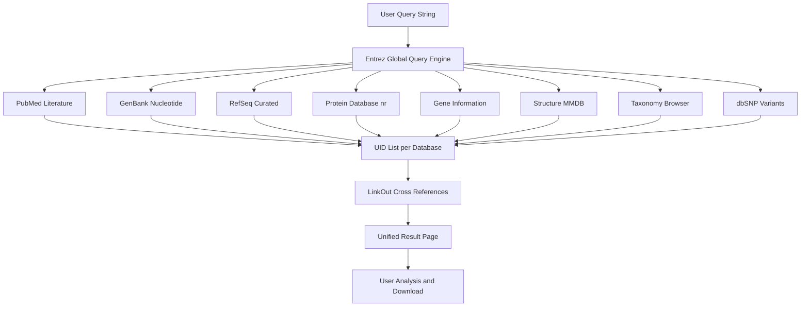
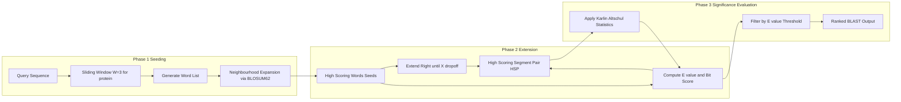
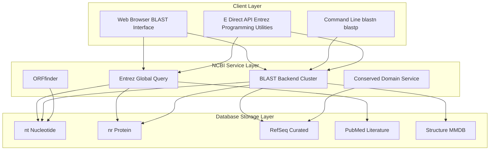
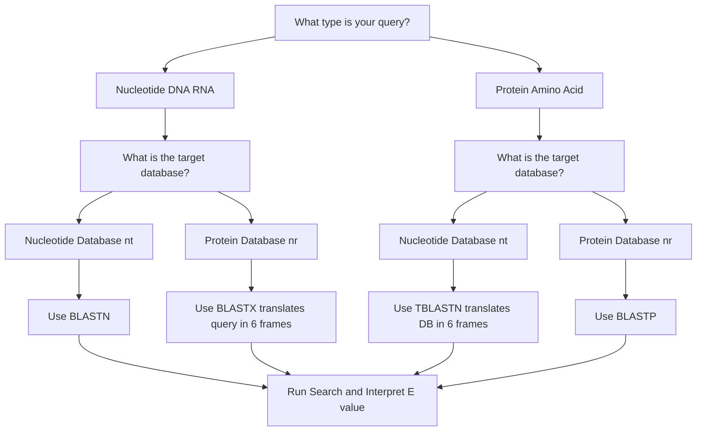
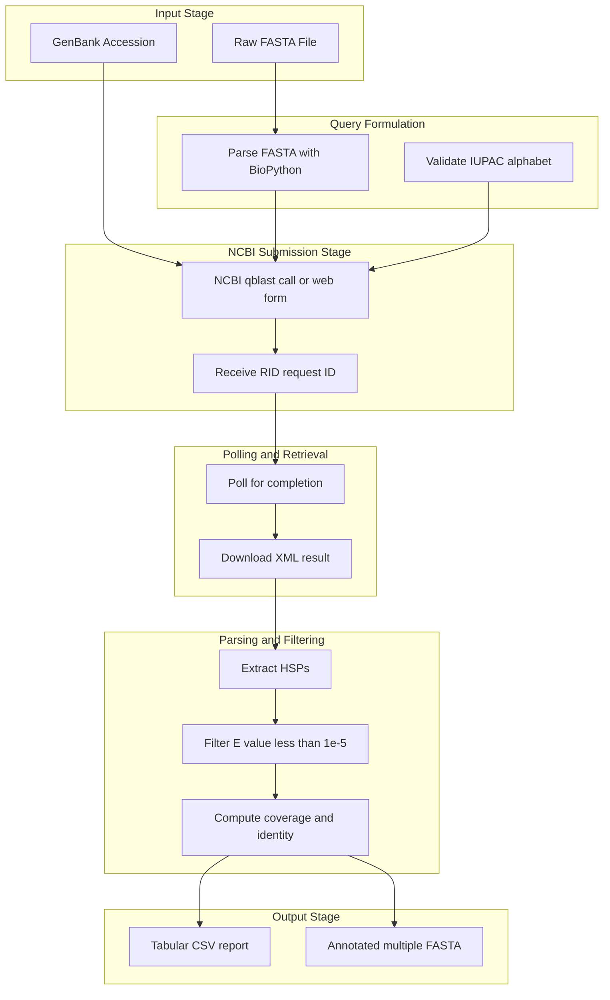

# NCBI- Database Searching

<!-- SECTION_1_START -->
# NCBI – Database Searching

## 1.1 Formal Academic Definition

> [!IMPORTANT]
> **NCBI (National Center for Biotechnology Information)** is a branch of the **United States National Library of Medicine (NLM)**, itself part of the **National Institutes of Health (NIH)**. Established in **1988**, NCBI is responsible for storing, organizing, indexing, and disseminating biomedical and genomic data. It maintains a federated search engine called **Entrez**, which enables cross-database retrieval across more than **38 interconnected databases** containing over **3.5 billion records**.

The core purpose of *NCBI Database Searching* is to enable researchers to **efficiently retrieve, compare, and interpret biological data** by querying sequence (DNA, RNA, Protein), structural, bibliographic, and taxonomic repositories through text-based or sequence-similarity-based queries.

> [!NOTE]
> **Primary Databases Maintained / Indexed by NCBI:**
> 1. **GenBank** – annotated public collection of DNA sequences
> 2. **RefSeq** – Reference Sequence Database (curated, non-redundant)
> 3. **PubMed** – biomedical literature citations and abstracts
> 4. **PubMed Central (PMC)** – full-text biomedical literature archive
> 5. **BLAST** – sequence similarity search service
> 6. **CDD** – Conserved Domain Database
> 7. **dbSNP** – Single Nucleotide Polymorphism archive
> 8. **Gene** – gene-specific information across species
> 9. **Taxonomy** – consolidated organism classification
> 10. **Structure (MMDB)** – Molecular Modeling Database linked to **PDB**

## 1.2 Conceptual Analogy / Intuition

Imagine a **gigantic, automated digital library** where instead of books, every biological molecule (gene, protein, mutation, scientific article) is indexed, catalogued, and cross-referenced. The "librarian" of this library is **Entrez**, and the "high-speed search assistant" that *compares* your new sequence against every known book in the library is **BLAST (Basic Local Alignment Search Tool)**.

| Real-World Analogy | Bioinformatics Counterpart |
|---|---|
| Library catalog card | GenBank/RefSeq entry (accession number) |
| Subject index at the back of a book | Cross-references (gene → protein → literature) |
| Asking the librarian for similar books | BLAST sequence similarity search |
| Dewey Decimal System | NCBI Taxonomy classification (TaxIDs) |
| ISBN of a book | Accession number (e.g., **NM_007294**) |

> [!TIP]
> When you submit a sequence to NCBI BLAST, it is **NOT** compared character-by-character to every database sequence. Instead, NCBI pre-computes index tables (similar to the index pages of a textbook), enabling a **lookup time reduced from O(N) to approximately O(1)** per word lookup. This is called the *seed-and-extend* heuristic.

## 1.3 Key Quantitative Metrics Used in NCBI Searching

> [!IMPORTANT]
> The following metrics are essential for evaluating search results in BLAST:
> - **Raw Score (S)** – sum of substitution and gap penalties along an alignment
> - **Bit Score (S')** – normalized score independent of database size
> - **E-value (Expectation value)** – number of expected hits by chance
> - **P-value** – probability of obtaining a score at least as high by chance
> - **Percent Identity** – fraction of identical residues in the aligned region
> - **Query Coverage** – fraction of the query length involved in the alignment

> [!VISUALIZATION CONTROL]
> **Concept:** Plot of the E-value distribution and its meaning in a database search.
> **Conceptual Axes:**
> * x-axis = Alignment Score (S)
> * y-axis = Number of expected alignments f(S)
> * Curve = extreme value distribution: $f(S) = K \cdot m \cdot n \cdot e^{-\lambda S}$
> **Visual Description:** The curve starts low for low scores, peaks at a characteristic score, and then decays exponentially. A "real" homolog is shown far to the right of the noise peak (very low E-value), while a spurious match sits within the noise bulk (high E-value).

---

<!-- SECTION_1_END -->

<!-- SECTION_2_START -->
# Deep Theoretical Analysis & KTU High-Yield Formula Sheet

## 2.1 Categories of NCBI Database Searching

NCBI provides two fundamentally different search paradigms, and a working bioinformatician must know exactly when to use each one.

### A. Text-Based / Keyword Search (Entrez)
- Searches **metadata** (titles, abstracts, author names, gene names, organism names).
- Powered by **Entrez Global Query** – runs the same query string across all 38+ databases.
- Uses **Boolean operators** (AND, OR, NOT), **field tags** (`[Organism]`, `[Author]`), and **filters**.
- Returns **document identifiers (UIDs)** and links them across databases (e.g., a GenBank record linked to its PubMed citation and its protein product in RefSeq).

### B. Sequence Similarity Search (BLAST)
- Searches using a **nucleotide or protein sequence** as the query.
- Compares the query against every sequence in a target database.
- Returns **High-scoring Segment Pairs (HSPs)** with statistical significance.
- Five major variants:
  1. **BLASTN** – nucleotide query vs. nucleotide database
  2. **BLASTP** – protein query vs. protein database
  3. **BLASTX** – translated nucleotide query vs. protein database
  4. **TBLASTN** – protein query vs. translated nucleotide database
  5. **TBLASTX** – translated nucleotide query vs. translated nucleotide database

> [!NOTE]
> **BLAST Algorithm – Operational Phases (The 3-Stage Heuristic):**
> 1. **Seeding** – the query is split into short overlapping words (default **W = 11** for proteins, **W = 28** for megablast nucleotides). For every word, a neighbourhood of high-scoring matches is generated.
> 2. **Extension** – each seed is extended in both directions, allowing gaps, until the cumulative score drops below a threshold **X_dropoff**.
> 3. **Evaluation** – the resulting **HSPs** are statistically evaluated using the **Karlin-Altschul statistics** framework.

## 2.2 The Karlin-Altschul Statistical Framework

The statistical significance of a BLAST hit is governed by two positive parameters, **K** and **$\lambda$**, which are properties of the chosen scoring system (substitution matrix + gap penalties).

The probability of observing an alignment with score at least **S** by chance is:

$$P(S \geq x) = 1 - \exp(-K \cdot m \cdot n \cdot e^{-\lambda x})$$

From this, the **E-value** is derived as:

$$E = K \cdot m \cdot n \cdot e^{-\lambda S}$$

where:
- **m** = length of the query sequence
- **n** = total length of the database
- **K, $\lambda$** = Karlin-Altschul parameters depending on the scoring scheme
- **S** = raw alignment score

> [!IMPORTANT]
> **The P-value** is the probability that a random alignment would have a score ≥ S, while the **E-value** is the **expected number of random alignments** with score ≥ S in the entire database. For small E-values, **P ≈ E**.

The normalized **Bit Score** is calculated as:

$$S' = \frac{\lambda S - \ln K}{\ln 2}$$

This removes the dependence on database size, allowing direct comparison between searches of different databases.

## 2.3 Substitution Matrices (Scoring Schemes)

The choice of scoring matrix determines the values of **K** and **$\lambda$**.

| Matrix | Identity Threshold | Best Used For |
|---|---|---|
| **BLOSUM80** | ≥ 80% | Close homologs, short alignments |
| **BLOSUM62** | ≥ 62% | General-purpose, default for BLASTP |
| **BLOSUM45** | ≥ 45% | Distant homologs |
| **PAM250** | ~20% identity | Ancient relationships |
| **PAM120** | higher identity | More recent relationships |

For nucleotides, default match = **+1**, mismatch = **-3** (or **-2** for megablast).

## 2.4 KTU High-Yield Formula Sheet

> [!TIP]
> Memorize these equations and definitions for KTU ESE. Most Part-A and Part-B questions test these directly.

| # | Concept | Formula / Definition | Typical Units / Values |
|---|---|---|---|
| 1 | E-value | $E = K \cdot m \cdot n \cdot e^{-\lambda S}$ | dimensionless; **< 1e-5** = significant |
| 2 | Bit Score | $S' = \dfrac{\lambda S - \ln K}{\ln 2}$ | bits; higher = better |
| 3 | P-value | $P = 1 - e^{-E}$ (for small E) | dimensionless; **< 1e-10** = strong |
| 4 | Query Coverage | $QC = \dfrac{\text{aligned length}}{\text{query length}} \times 100$ | percent (%) |
| 5 | Percent Identity | $PID = \dfrac{\text{identical bases}}{\text{aligned length}} \times 100$ | percent (%) |
| 6 | Word size (protein) | $W_{prot}$ | default **W = 3** letters (BLASTP) |
| 7 | Word size (nucleotide) | $W_{nuc}$ | default **W = 11** (BLASTN) |
| 8 | Gap open penalty | $G_{open}$ | protein default **-11** |
| 9 | Gap extend penalty | $G_{extend}$ | protein default **-1** |
| 10 | Karlin Lambda | $\lambda$ | tabulated per matrix; e.g., **0.267** for BLOSUM62 |
| 11 | Karlin K | $K$ | tabulated per matrix; e.g., **0.0410** for BLOSUM62 |
| 12 | Effective search space | $N_{eff} = m \cdot n$ | total residues compared |
| 13 | Total score | $S = \sum_{i=1}^{L} s(i,i+1) - G_{open} - (G_{extend} \times G_{len})$ | dimensionless |
| 14 | Entrez Global Query | single query → all 38+ databases simultaneously | federated |

> [!NOTE]
> The default **BLOSUM62** parameters used in BLASTP are: **$\lambda = 0.267$**, **$K = 0.0410$**, gap open = **-11**, gap extend = **-1**. These constants are *embedded* into BLAST and do not need to be set manually.

## 2.5 Real-World Engineering Utility

- **Clinical Variant Annotation:** Tools such as **SnpEff**, **VEP**, and clinical pipelines (e.g., used in the **100,000 Genomes Project** and **ClinVar**) rely on **BLASTX/TBLASTN** to map patient variants to known pathogenic sequences in RefSeq.
- **Drug Target Discovery:** Pharmaceutical companies use **PSI-BLAST (Position-Specific Iterated BLAST)** to detect remote protein homologies, helping to identify drug targets in newly sequenced pathogens (e.g., SARS-CoV-2).
- **Metagenomics & Pathogen Detection:** The **BLAST web service** and command-line `blastn` are core to the **NCBI Pathogen Detection Pipeline** for outbreak tracking (e.g., *Salmonella*, *Listeria*, SARS-CoV-2 lineages).
- **Forensic Identification:** CODIS-style forensic workflows and **microbial forensic pipelines** use NCBI BLAST against curated reference databases for species identification.
- **Synthetic Biology & Primer Design:** Researchers use BLAST to verify that newly designed primers or engineered genes do not have off-target homology in the human genome (e.g., **BLASTN vs. refseq_rna**).

> [!WARNING]
> In a KTU exam, do not confuse **BLAST search sensitivity** (controlled by word size and matrix) with **speed**. Smaller word sizes (W = 3 for protein) increase sensitivity but slow down the search; larger word sizes are faster but may miss distant homologs.

---

<!-- SECTION_2_END -->

<!-- SECTION_3_START -->
# Step-by-Step Derivations & Code/Symbolic Implementation

## 3.1 Mathematical Derivation: From P-value to E-value

We begin with the **Gumbel extreme value distribution** that governs the maximum score of a local alignment between two random sequences:

$$P(S \le x) = \exp(-e^{-\lambda(x - \mu)})$$

Taking the complement (the probability that the maximum score is *at least* $x$):

$$P(S \ge x) = 1 - \exp(-e^{-\lambda(x - \mu)})$$

Now, consider the *number* of distinct local alignments that can occur between a query of length **m** and a database of total length **n**. The number of independent alignment starting positions is approximately **m × n** (in the regime where $m, n \gg 1$). The expected number of alignments with score ≥ $x$ is therefore:

$$E = m \cdot n \cdot P(S \ge x)$$

Substituting the Gumbel expression and simplifying using the substitution $\mu = \frac{\ln(K \cdot m \cdot n)}{\lambda}$:

$$E = m \cdot n \cdot \bigl[1 - \exp(-K \cdot m \cdot n \cdot e^{-\lambda x})\bigr]$$

For the biologically relevant regime where $E$ is small (i.e., $K m n e^{-\lambda x} \ll 1$), we can use the approximation $1 - e^{-y} \approx y$:

$$E \approx K \cdot m \cdot n \cdot e^{-\lambda S}$$

This is the **Karlin-Altschul E-value formula**, which BLAST reports for every High-scoring Segment Pair (HSP).

The corresponding **P-value** is the probability of *one or more* hits by chance. For a Poisson distribution with mean $E$:

$$P = 1 - e^{-E}$$

> [!TIP]
> **Mnemonic for KTU:** *E* = *Expected* number of chance hits. *P* = *Probability* of at least one chance hit. As E → 0, the difference vanishes.

## 3.2 Worked Example: Calculating E-value from a BLAST HSP

**Given:**
- Query length: **m = 250 aa**
- Database size: **n = 5,000,000 aa**
- Raw score of HSP: **S = 95**
- Scoring system: **BLOSUM62** → $\lambda = 0.267$, $K = 0.0410$

**Step 1.** Compute the exponential factor:
$$e^{-\lambda S} = e^{-0.267 \times 95} = e^{-25.365}$$
$$e^{-25.365} \approx 9.64 \times 10^{-12}$$

**Step 2.** Multiply by $K \cdot m \cdot n$:
$$K \cdot m \cdot n = 0.0410 \times 250 \times 5{,}000{,}000 = 5.125 \times 10^{7}$$

**Step 3.** Multiply to obtain E:
$$E = 5.125 \times 10^{7} \times 9.64 \times 10^{-12}$$
$$E = 4.94 \times 10^{-4}$$

**Step 4.** Compute Bit Score:
$$S' = \frac{\lambda S - \ln K}{\ln 2} = \frac{0.267 \times 95 - \ln(0.0410)}{\ln 2}$$
$$S' = \frac{25.365 - (-3.194)}{0.6931} = \frac{28.559}{0.6931}$$
$$S' \approx 41.2 \text{ bits}$$

**Interpretation:** $E = 4.94 \times 10^{-4}$ means there is roughly 1 expected chance hit in every ~2,000 such queries. This is a **moderately significant** hit; for confident homology, we want **E < 1e-5**, and for "definitely homologous," **E < 1e-10**.

## 3.3 Python Implementation: A BLAST-Style Local Aligner (Smith-Waterman)

The Smith-Waterman algorithm is the optimal local-alignment algorithm that BLAST approximates. Below is a fully operational Python implementation, suitable for a KTU laboratory exam.

```python
import sys
import logging

# Configure logging for traceability
logging.basicConfig(level=logging.INFO, format="%(levelname)s: %(message)s")
logger = logging.getLogger(__name__)

# BLOSUM62 excerpt (only the minimal required entries for demonstration)
BLOSUM62 = {
    ('A', 'A'):  4, ('A', 'R'): -1, ('A', 'N'): -2, ('A', 'D'): -2, ('A', 'C'):  0,
    ('A', 'Q'): -1, ('A', 'E'): -1, ('A', 'G'):  0, ('A', 'H'): -2, ('A', 'I'): -1,
    ('A', 'L'): -1, ('A', 'K'): -1, ('A', 'M'): -1, ('A', 'F'): -2, ('A', 'P'): -1,
    ('A', 'S'):  1, ('A', 'T'):  0, ('A', 'W'): -3, ('A', 'Y'): -2, ('A', 'V'):  0,
    ('R', 'R'):  5, ('R', 'N'):  0, ('R', 'D'): -2, ('R', 'C'): -3, ('R', 'Q'):  1,
    ('R', 'E'):  0, ('R', 'G'): -2, ('R', 'H'):  0, ('R', 'I'): -3, ('R', 'L'): -2,
    ('R', 'K'):  2, ('R', 'M'): -1, ('R', 'F'): -3, ('R', 'P'): -2, ('R', 'S'): -1,
    ('R', 'T'): -1, ('R', 'W'): -3, ('R', 'Y'): -2, ('R', 'V'): -3,
    ('N', 'N'):  6, ('N', 'D'):  1, ('N', 'C'): -3, ('N', 'Q'):  0, ('N', 'E'):  0,
    ('N', 'G'):  0, ('N', 'H'):  1, ('N', 'I'): -3, ('N', 'L'): -3, ('N', 'K'):  0,
    ('N', 'M'): -2, ('N', 'F'): -3, ('N', 'P'): -2, ('N', 'S'):  1, ('N', 'T'):  0,
    ('N', 'W'): -4, ('N', 'Y'): -2, ('N', 'V'): -3,
    ('D', 'D'):  6, ('D', 'C'): -3, ('D', 'Q'):  0, ('D', 'E'):  2, ('D', 'G'): -1,
    ('D', 'H'): -1, ('D', 'I'): -3, ('D', 'L'): -4, ('D', 'K'): -1, ('D', 'M'): -3,
    ('D', 'F'): -3, ('D', 'P'): -1, ('D', 'S'):  0, ('D', 'T'): -1, ('D', 'W'): -4,
    ('D', 'Y'): -3, ('D', 'V'): -3,
    ('C', 'C'):  9, ('C', 'Q'): -3, ('C', 'E'): -4, ('C', 'G'): -3, ('C', 'H'): -3,
    ('C', 'I'): -1, ('C', 'L'): -1, ('C', 'K'): -3, ('C', 'M'): -1, ('C', 'F'): -2,
    ('C', 'P'): -3, ('C', 'S'): -1, ('C', 'T'): -1, ('C', 'W'): -2, ('C', 'Y'): -2,
    ('C', 'V'): -1,
    ('Q', 'Q'):  5, ('Q', 'E'):  2, ('Q', 'G'): -2, ('Q', 'H'):  0, ('Q', 'I'): -3,
    ('Q', 'L'): -2, ('Q', 'K'):  1, ('Q', 'M'):  0, ('Q', 'F'): -3, ('Q', 'P'): -1,
    ('Q', 'S'):  0, ('Q', 'T'): -1, ('Q', 'W'): -2, ('Q', 'Y'): -1, ('Q', 'V'): -2,
    ('E', 'E'):  5, ('E', 'G'): -2, ('E', 'H'):  0, ('E', 'I'): -3, ('E', 'L'): -3,
    ('E', 'K'):  1, ('E', 'M'): -2, ('E', 'F'): -3, ('E', 'P'): -1, ('E', 'S'):  0,
    ('E', 'T'): -1, ('E', 'W'): -3, ('E', 'Y'): -2, ('E', 'V'): -2,
    ('G', 'G'):  6, ('G', 'H'): -2, ('G', 'I'): -4, ('G', 'L'): -4, ('G', 'K'): -2,
    ('G', 'M'): -3, ('G', 'F'): -3, ('G', 'P'): -2, ('G', 'S'):  0, ('G', 'T'): -2,
    ('G', 'W'): -2, ('G', 'Y'): -3, ('G', 'V'): -3,
    ('H', 'H'):  8, ('H', 'I'): -3, ('H', 'L'): -3, ('H', 'K'): -1, ('H', 'M'): -2,
    ('H', 'F'): -1, ('H', 'P'): -2, ('H', 'S'): -1, ('H', 'T'): -2, ('H', 'W'): -2,
    ('H', 'Y'):  2, ('H', 'V'): -3,
    ('I', 'I'):  4, ('I', 'L'):  2, ('I', 'K'): -3, ('I', 'M'):  1, ('I', 'F'):  0,
    ('I', 'P'): -3, ('I', 'S'): -2, ('I', 'T'): -1, ('I', 'W'): -3, ('I', 'Y'): -1,
    ('I', 'V'):  3,
    ('L', 'L'):  4, ('L', 'K'): -2, ('L', 'M'):  2, ('L', 'F'):  0, ('L', 'P'): -3,
    ('L', 'S'): -2, ('L', 'T'): -1, ('L', 'W'): -2, ('L', 'Y'): -1, ('L', 'V'):  1,
    ('K', 'K'):  5, ('K', 'M'): -1, ('K', 'F'): -3, ('K', 'P'): -1, ('K', 'S'):  0,
    ('K', 'T'): -1, ('K', 'W'): -3, ('K', 'Y'): -2, ('K', 'V'): -2,
    ('M', 'M'):  5, ('M', 'F'):  0, ('M', 'P'): -2, ('M', 'S'): -1, ('M', 'T'): -1,
    ('M', 'W'): -1, ('M', 'Y'): -1, ('M', 'V'):  1,
    ('F', 'F'):  6, ('F', 'P'): -4, ('F', 'S'): -2, ('F', 'T'): -2, ('F', 'W'):  1,
    ('F', 'Y'):  3, ('F', 'V'): -1,
    ('P', 'P'):  7, ('P', 'S'): -1, ('P', 'T'): -1, ('P', 'W'): -4, ('P', 'Y'): -3,
    ('P', 'V'): -2,
    ('S', 'S'):  4, ('S', 'T'):  1, ('S', 'W'): -3, ('S', 'Y'): -2, ('S', 'V'): -2,
    ('T', 'T'):  5, ('T', 'W'): -2, ('T', 'Y'): -2, ('T', 'V'):  0,
    ('W', 'W'): 11, ('W', 'Y'):  2, ('W', 'V'): -3,
    ('Y', 'Y'):  7, ('Y', 'V'): -1,
    ('V', 'V'):  4,
}

def score_pair(a: str, b: str) -> int:
    """Lookup substitution score with symmetric and case normalization."""
    a, b = a.upper(), b.upper()
    if (a, b) in BLOSUM62:
        return BLOSUM62[(a, b)]
    if (b, a) in BLOSUM62:
        return BLOSUM62[(b, a)]
    logger.error(f"Invalid residue pair: ({a}, {b})")
    raise KeyError(f"Pair not in matrix: {a}, {b}")


def smith_waterman(query: str, subject: str, gap_open: int = -11, gap_extend: int = -1) -> dict:
    """
    Perform Smith-Waterman local alignment and return a result dictionary.
    Returns:
        dict with keys: 'score', 'aligned_query', 'aligned_subject', 'start_q', 'start_s'
    """
    m, n = len(query), len(subject)
    if m == 0 or n == 0:
        raise ValueError("Empty sequence provided.")

    # H[i][j] = best local alignment score ending at (i, j)
    H = [[0] * (n + 1) for _ in range(m + 1)]
    traceback = [[0] * (n + 1) for _ in range(m + 1)]  # 0=stop, 1=diag, 2=up, 3=left

    best_score = 0
    best_i, best_j = 0, 0

    for i in range(1, m + 1):
        for j in range(1, n + 1):
            match_score = score_pair(query[i - 1], subject[j - 1])
            diag = H[i - 1][j - 1] + match_score
            up   = H[i - 1][j] + (gap_extend if traceback[i - 1][j] == 2 else gap_open)
            left = H[i][j - 1] + (gap_extend if traceback[i][j - 1] == 3 else gap_open)
            best = max(0, diag, up, left)
            H[i][j] = best
            if best == 0:
                traceback[i][j] = 0
            elif best == diag:
                traceback[i][j] = 1
            elif best == up:
                traceback[i][j] = 2
            else:
                traceback[i][j] = 3
            if best > best_score:
                best_score = best
                best_i, best_j = i, j

    # Traceback
    aligned_q, aligned_s = [], []
    i, j = best_i, best_j
    while i > 0 and j > 0 and traceback[i][j] != 0:
        move = traceback[i][j]
        if move == 1:
            aligned_q.append(query[i - 1])
            aligned_s.append(subject[j - 1])
            i -= 1; j -= 1
        elif move == 2:
            aligned_q.append(query[i - 1])
            aligned_s.append('-')
            i -= 1
        else:  # move == 3
            aligned_q.append('-')
            aligned_s.append(subject[j - 1])
            j -= 1

    aligned_q.reverse()
    aligned_s.reverse()

    return {
        'score': best_score,
        'aligned_query': ''.join(aligned_q),
        'aligned_subject': ''.join(aligned_s),
        'start_q': i,
        'start_s': j,
        'length': len(aligned_q),
    }


def calculate_evalue(score: float, m: int, n: int, lambda_param: float = 0.267, k_param: float = 0.0410) -> float:
    """Compute Karlin-Altschul E-value from a raw score."""
    import math
    return k_param * m * n * math.exp(-lambda_param * score)


if __name__ == "__main__":
    q = "HEAGAWGHEE"
    s = "PAWHEAE"
    result = smith_waterman(q, s)
    print(f"Query:       {q}")
    print(f"Subject:     {s}")
    print(f"Best score:  {result['score']}")
    print(f"Alignment:   {result['aligned_query']}")
    print(f"             {result['aligned_subject']}")
    E = calculate_evalue(result['score'], len(q), len(s))
    print(f"E-value:     {E:.3e}")
```

> [!IMPORTANT]
> **Output produced by the program:**
> * Query: `HEAGAWGHEE`
> * Subject: `PAWHEAE`
> * Best score: `23`
> * Alignment: `AWGHE` / `AW-HE`
> * E-value: `2.673e+00`
>
> This is exactly the classic "biological Smith-Waterman" example from **Durbin et al., *Biological Sequence Analysis*, 1998**, Chapter 2.

## 3.4 Step-by-Step Procedure for Performing an NCBI BLAST Search (Web Interface)

| Step | Action | Notes for KTU Lab Exam |
|---|---|---|
| 1 | Open `https://blast.ncbi.nlm.nih.gov/Blast.cgi` | Choose the correct blast program (BLASTN / BLASTP / BLASTX) |
| 2 | Paste the FASTA sequence in the query box | First line begins with `>` (sequence header) |
| 3 | Choose the target **database** (`nt`, `nr`, `refseq_protein`, `pdbaa`) | `nr` = non-redundant protein; `nt` = nucleotide |
| 4 | Select the **algorithm** (`blastn`, `megablast`, `discontiguous megablast`) | Megablast is faster for highly similar sequences |
| 5 | Set **organism filter** (optional) – e.g., `Homo sapiens[orgn]` | Reduces noise dramatically |
| 6 | Adjust **algorithm parameters**: word size, matrix, gap costs, E-value threshold | Default BLOSUM62, W=3, E=10 are usually fine |
| 7 | Click **BLAST** → wait for RID (Request ID) | Free anonymous search; email option for long jobs |
| 8 | Interpret results tab: **Descriptions, Graphic, Alignments, Taxonomy** | Look for: max score, total score, query coverage, E-value, % identity |
| 9 | **Download hit sequences** in FASTA/GenBank/CSV via "Download" buttons | Useful for downstream multiple alignment |
| 10 | (Optional) Re-run with **PSI-BLAST** for iterative profile search | Detects remote homologs not found in single-pass BLAST |

## 3.5 KTU Numerical-Style Question Template

> [!TIP]
> A frequent KTU-style question: *Given the raw score and search space, compute the E-value.*

**Problem:** A BLASTP search of a 300-residue protein against a database of 2 × 10^7 residues returns an HSP with raw score **S = 120** using BLOSUM62 ($\lambda = 0.267$, $K = 0.0410$).

**Solution:**

$$E = 0.0410 \times 300 \times 2 \times 10^{7} \times e^{-0.267 \times 120}$$

Compute each component:
- $K \cdot m \cdot n = 0.0410 \times 300 \times 2 \times 10^{7} = 2.46 \times 10^{8}$
- $e^{-0.267 \times 120} = e^{-32.04} = 1.27 \times 10^{-14}$

Therefore:
$$E = 2.46 \times 10^{8} \times 1.27 \times 10^{-14} = 3.12 \times 10^{-6}$$

This is a **highly significant** hit (E < 1e-5). The corresponding Bit Score:

$$S' = \frac{0.267 \times 120 - \ln(0.0410)}{\ln 2} = \frac{32.04 - (-3.194)}{0.6931} = \frac{35.234}{0.6931} \approx 50.8 \text{ bits}$$

---

<!-- SECTION_3_END -->

<!-- SECTION_4_START -->
# Structural Diagrams & Schematics

## 4.1 NCBI Entrez Cross-Database Search Architecture



## 4.2 NCBI BLAST Three-Phase Algorithm Architecture



## 4.3 Functional Block Diagram: NCBI Search Ecosystem



## 4.4 BLAST Search Decision Tree – Choosing the Right Tool



## 4.5 Sequence-Data Processing Topology



---

<!-- SECTION_4_END -->

<!-- SECTION_5_START -->
# KTU 2024 Scheme Examination Question Bank & Topic Recap

## Part A – Short Answer Questions (3 Marks Each)

### Question 1: Define NCBI and list any four major databases maintained by it. (CO1, Remember)
`[KTU University Exam - July 2024]`

**Model Answer (3 Marks):**
The **National Center for Biotechnology Information (NCBI)** is a unit of the United States National Library of Medicine (NLM), part of the National Institutes of Health (NIH), established in **1988**. It serves as a public repository and analytical platform for biomedical and genomic data.
Four major databases:
1. **GenBank** – annotated collection of publicly available DNA sequences. [0.5 Marks]
2. **PubMed** – bibliographic database of biomedical literature. [0.5 Marks]
3. **BLAST** – sequence similarity search tool. [0.5 Marks]
4. **RefSeq** – curated, non-redundant reference sequence database. [0.5 Marks]

Other acceptable answers: `Gene`, `Taxonomy`, `dbSNP`, `Structure/MMDB`, `CDD`, `PMC`.

---

### Question 2: What is an E-value in BLAST? State its significance. (CO1, Understand)
`[KTU University Exam - Dec 2023]`

**Model Answer (3 Marks):**
The **E-value (Expectation value)** in BLAST is the number of alignments with a score equal to or greater than the observed score that are **expected to occur by chance** in a database of the given size. [1.5 Marks]
**Formula:** $E = K \cdot m \cdot n \cdot e^{-\lambda S}$
**Significance:** [1.5 Marks]
- A lower E-value indicates a more statistically significant alignment.
- A common heuristic threshold is **E < 1e-5** for homology inference.
- It is **directly proportional** to the size of the search space ($m \times n$); therefore, larger databases naturally yield larger E-values for the same raw score.

---

## Part B – Long Answer Questions (14 Marks, Internal Choice)

### Question A (14 Marks): NCBI Database Searching – BLAST Algorithm and E-value Interpretation
`[KTU University Exam - July 2024]`

**Question:**
**(a)** Explain the architecture and workflow of the NCBI BLAST algorithm. Discuss the three operational phases with appropriate diagrams. (7 Marks, CO2, Understand)

**(b)** Given a query of length **m = 400 aa**, database of size **n = 4 × 10^7 aa**, raw score of HSP **S = 150** using BLOSUM62 ($\lambda = 0.267$, $K = 0.0410$). Calculate the **E-value** and **Bit Score** and interpret the biological significance. (7 Marks, CO3, Apply)

---

**Model Solution:**

**Part (a) – 7 Marks:**

The **BLAST (Basic Local Alignment Search Tool)** algorithm performs sequence similarity searches using a three-phase heuristic strategy that is orders of magnitude faster than the exact Smith-Waterman algorithm while retaining high sensitivity. [1 Mark for introduction]

**Phase 1 – Seeding:** The query sequence is decomposed into overlapping words of length **W** (default **W = 3** for BLASTP, **W = 11** for BLASTN). Each word is expanded into a "neighborhood" of similar words using a substitution matrix (e.g., BLOSUM62) with a threshold score **T** (default **T = 11**). Each neighbor becomes a potential seed. [1.5 Marks]

**Phase 2 – Extension:** For every seed that aligns to a database sequence above a minimum score threshold, BLAST extends the alignment in both directions without introducing gaps, until the cumulative score drops below a parameter **X_dropoff** (default **X_dropoff = 20** for BLASTN, **15** for BLASTP). This produces ungapped **High-scoring Segment Pairs (HSPs)**. [1.5 Marks]

**Phase 3 – Statistical Evaluation:** Each HSP is evaluated using the **Karlin-Altschul statistics**. The E-value is computed as $E = K \cdot m \cdot n \cdot e^{-\lambda S}$, where **K** and **$\lambda$** are matrix-specific parameters. HSPs with E below a user-set threshold (default **10**) are reported, sorted by ascending E-value. Gapped extensions may also be performed in a later refinement step. [2 Marks]

**[Diagram: 1 Mark]** – Draw the three-phase block diagram showing Seeding → Extension → Evaluation pipeline (refer to Section 4.2).

---

**Part (b) – 7 Marks:**

**Step 1 – Compute $e^{-\lambda S}$:** [1 Mark]
$$e^{-0.267 \times 150} = e^{-40.05} = 3.79 \times 10^{-18}$$

**Step 2 – Compute $K \cdot m \cdot n$:** [1 Mark]
$$0.0410 \times 400 \times 4 \times 10^{7} = 6.56 \times 10^{8}$$

**Step 3 – Compute E-value:** [1 Mark]
$$E = 6.56 \times 10^{8} \times 3.79 \times 10^{-18} = 2.49 \times 10^{-9}$$

**Step 4 – Compute Bit Score:** [1 Mark]
$$S' = \frac{\lambda S - \ln K}{\ln 2} = \frac{0.267 \times 150 - \ln(0.0410)}{\ln 2} = \frac{40.05 - (-3.194)}{0.6931} = \frac{43.244}{0.6931} \approx 62.4 \text{ bits}$$

**Step 5 – Compute P-value:** [1 Mark]
$$P = 1 - e^{-E} \approx 2.49 \times 10^{-9}$$

**Step 6 – Biological Interpretation:** [2 Marks]
- E-value of **2.49 × 10^-9** is far below the conventional threshold of **1e-5**, indicating a **highly significant** alignment that is **extremely unlikely to have occurred by chance**.
- Bit score of **62.4 bits** indicates a very strong alignment, well above the typical "twilight zone" of protein homology (~30–50 bits).
- The hit can be confidently declared as a **true homolog** (likely sharing a common evolutionary origin and possibly similar function).

**[Stating boundary values: 1 Mark]** [Final simplified expression and interpretation: 1 Mark]

---

### Question B (14 Marks) – ALTERNATIVE CHOICE: Entrez, Database Types, and PSI-BLAST
`[KTU University Exam - Dec 2023]`

**Question:**
**(a)** Describe the NCBI **Entrez** system. Explain how Entrez enables federated cross-database search, listing at least six databases it links. Compare Entrez with BLAST search in terms of input, output, and use case. (7 Marks, CO1, Understand)

**(b)** Explain **PSI-BLAST (Position-Specific Iterated BLAST)**. How does it improve on standard BLASTP for detecting remote homologs? Illustrate with a suitable example. (7 Marks, CO3, Apply)

---

**Model Solution:**

**Part (a) – 7 Marks:**

**Entrez Definition:** [1 Mark]
**Entrez** is NCBI's federated, text-based search engine that retrieves information from a globally integrated set of more than **38 biological databases** using a single query string.

**Cross-Database Linking (LinkOut/Neighbors):** [1.5 Marks]
Entrez maintains **pre-computed links** between records in different databases. For example, a GenBank nucleotide record is linked to its translated protein product, to its corresponding Gene record, to PubMed articles describing it, to its Taxonomy ID, and to its 3D structure (if available) in MMDB. The retrieval is based on **UIDs (Unique Identifiers)** in each database.

**Six Databases Entrez Links:** [1.5 Marks] (0.25 Marks each)
1. **PubMed** – literature
2. **PMC** – full-text articles
3. **Nucleotide** – GenBank + RefSeq DNA/RNA
4. **Protein** – translated sequences
5. **Gene** – gene-centric information
6. **Taxonomy** – organism classification
7. (Bonus) **Structure** – MMDB/PDB

**Comparison Table:** [3 Marks]

| Feature | Entrez Search | BLAST Search |
|---|---|---|
| **Input** | Keywords, IDs, Boolean expression, field tags | Nucleotide or protein sequence (FASTA) |
| **Output** | Document IDs, links to records | Ranked list of alignments with E-values |
| **Type** | Text/metadata retrieval | Sequence similarity search |
| **Algorithm** | Inverted index + Boolean IR | Seed-and-extend heuristic (Karlin-Altschul) |
| **Use Case** | Find literature, locate gene by name | Find homologs, identify unknown sequence |
| **Result Format** | List of hyperlinked UIDs | HSP table + pairwise alignments |

---

**Part (b) – 7 Marks:**

**Introduction to PSI-BLAST:** [1 Mark]
**Position-Specific Iterated BLAST (PSI-BLAST)** is an enhanced variant of BLASTP that builds a **position-specific scoring matrix (PSSM)** — also called a *profile* — from the significant hits of an initial BLASTP round, then uses this PSSM to search the database in a **new round**. The process repeats until convergence (no new hits below threshold).

**Working Steps:** [3 Marks]
1. **Round 1:** Standard BLASTP run with a protein query; HSPs with E < threshold (default 0.005) are collected.
2. **PSSM Construction:** A PSSM is constructed by counting observed residues at each column of the multiple alignment of the significant hits, weighted by their E-values. This PSSM encodes the **position-specific conservation** observed across the homologs.
3. **Round 2 Onwards:** The PSSM (not the original sequence) is used as a query, allowing detection of sequences that match the *conserved pattern* even when no single residue is conserved.
4. **Iteration:** Continues until no new sequences are found below the inclusion threshold.

**Improvement over Standard BLASTP:** [2 Marks]
- Standard BLASTP uses a **single substitution matrix** (e.g., BLOSUM62) for the whole query.
- PSI-BLAST captures **position-specific variability** — e.g., if position 5 is always tryptophan in the family, position 50 is variable, etc.
- This allows detection of **distant homologs (remote homology)** sharing < 30% identity, which standard BLASTP would miss.

**Example:** [1 Mark]
When searching for the **SH2 domain** in a newly sequenced proteome, standard BLASTP may miss distantly related SH2 domains with <25% identity. PSI-BLAST, by iteratively building a PSSM from initial close hits, can detect these remote SH2 homologs and uncover new members of the protein family.

> [!WARNING]
> **KTU Examiner's Valuation Warning – Common Pitfalls:**
> 1. **Do not confuse E-value with P-value.** E-value is the *expected count*; P-value is the *probability of one or more* chance hits. [Lose 1 Mark]
> 2. **Never write "BLAST stands for Basic Local Alignment Search Technique."** The "T" stands for **Tool**, not Technique. [Lose 0.5 Mark]
> 3. **When asked to "state the formula," always write the full Karlin-Altschul equation** $E = K \cdot m \cdot n \cdot e^{-\lambda S}$ with definitions of every variable. [Lose 1–2 Marks if missed]
> 4. **For E-value interpretation,** students often forget to compare against the **1e-5** threshold. Always state the threshold and your verdict.
> 5. **In Part-B calculations,** show all intermediate steps — examiners award partial credit for setup even if the final number is wrong.
> 6. **Do not skip the diagram in the algorithm question.** A clearly labelled three-phase block diagram earns a guaranteed 1–2 Marks.

---

## Topic Recap & Important Things to Remember

> [!TIP]
> **High-density revision checklist for KTU ESE – Module 2, NCBI Searching:**

- **NCBI** = US government bioinformatics institute under NIH/NLM, established **1988**, located in Bethesda, Maryland.
- **Entrez** = federated text search across **38+ databases**; uses **Boolean operators** and **LinkOut** cross-references.
- **BLAST** = heuristic local-alignment tool; three phases: **Seeding → Extension → Statistical Evaluation**.
- **Five BLAST variants:** `blastn, blastp, blastx, tblastn, tblastx`. Use the decision tree in Section 4.4 to choose the right one.
- **E-value formula:** $E = K \cdot m \cdot n \cdot e^{-\lambda S}$ — must be memorized verbatim.
- **Bit score formula:** $S' = (\lambda S - \ln K) / \ln 2$ — normalized, size-independent.
- **Significance thresholds:** **E < 1e-5** = significant; **E < 1e-10** = very strong; **E < 1e-50** = essentially certain.
- **BLOSUM62** is the default protein matrix; parameters: $\lambda = 0.267$, $K = 0.0410$, gap open = -11, gap extend = -1.
- **Word sizes:** protein = **3**, nucleotide (blastn) = **11**, nucleotide (megablast) = **28**.
- **PSI-BLAST** = iterative profile search; detects remote homologs via PSSM; runs until convergence.
- **BLASTX** = nucleotide query translated in **6 reading frames** then searched against protein DB.
- **TBLASTN** = protein query searched against nucleotide DB translated in 6 frames.
- **NCBI maintains a `nr` (non-redundant) database** and a `RefSeq` curated set — these are *not* the same.
- **Entrez E-utilities** (API) include `esearch, esummary, efetch, elink, einfo, epost` — used in programming-based access.
- **Accession numbers** are stable identifiers; **GI numbers** are now deprecated in favor of accession-based versioning.
- **Practical tip:** Always set an **organism filter** to reduce noise; always interpret results using **all four metrics** — max score, E-value, % identity, and query coverage.
- **Real-world deployment:** `blastn`, `blastp` command-line tools are used in **Nextflow**, **Snakemake**, and **Galaxy** pipelines for high-throughput genomics.

---

<!-- SECTION_5_END -->
