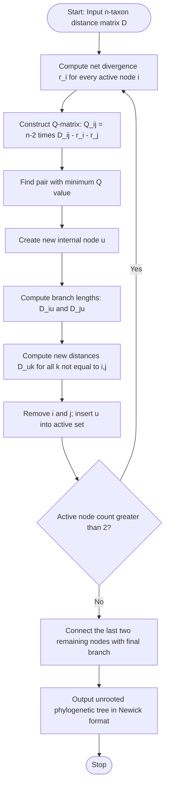
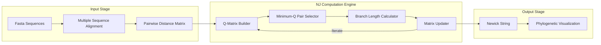
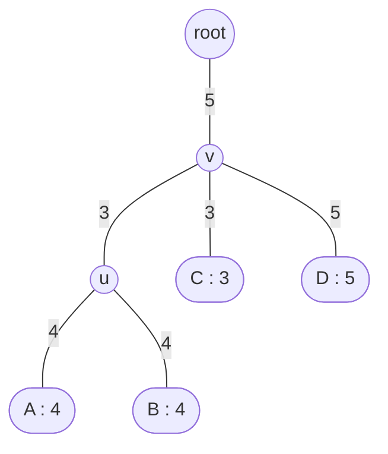
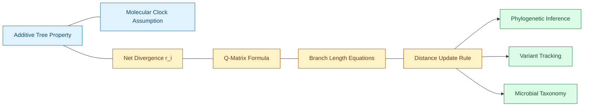
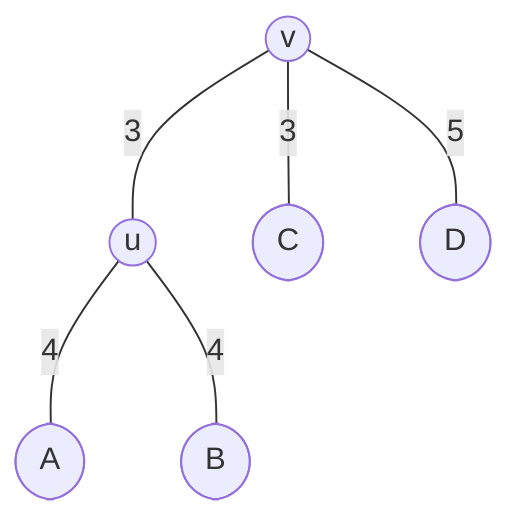

# Neighbour joining

<!-- SECTION_1_START -->

# Neighbour Joining (NJ) — Core Technical Definition & Intuitive Overview

## 1.1 Formal KTU Syllabus Definition

> [!NOTE]
> **Neighbour Joining (NJ)** is a **bottom-up (agglomerative) hierarchical clustering algorithm** used in bioinformatics to reconstruct **unrooted phylogenetic trees** from a matrix of pairwise evolutionary distances. It was proposed by **Naruya Saitou and Masatoshi Nei (1987)** as a correction to the UPGMA method, eliminating the **molecular clock assumption** (the requirement that all lineages evolve at a constant rate).

The algorithm iteratively identifies the pair of operational taxonomic units (OTUs / taxa) that are true **neighbours** in the unobserved evolutionary tree (not merely the closest pair in the distance matrix), joins them through a new internal node, recomputes the distances, and repeats until only two nodes remain.

## 1.2 Conceptual Analogy / Intuitive Overview

Imagine a **family reunion of four cousins (A, B, C, D)** standing in a room. Each cousin knows roughly how genetically similar they feel to every other cousin (the distance matrix). A naive approach is to just pair the two cousins who feel closest (e.g., A and B). However, the *true* closest evolutionary relatives may not be the *visible* closest pair, because one cousin may have evolved unusually fast, making them seem far from everyone.

The **Neighbour Joining** strategy is like asking a wise elder:

1. First, *correct* the perceived distances by removing the effect of how "different from average" each cousin is.
2. After correction, the pair that is now closest **must be true evolutionary neighbours** — that is, they share a unique common ancestor that no other cousin shares.
3. Merge that pair into a single "household" (new node) and re-measure distances from this combined household to all other cousins.
4. Repeat until only two households (nodes) remain, which become the root of the tree.

> [!IMPORTANT]
> **Core Highlights for KTU Exam:**
> - NJ produces an **unrooted** tree (root can be placed arbitrarily).
> - Unlike UPGMA, NJ **does NOT assume a constant molecular clock**.
> - Time Complexity: **$O(n^3)$** for *n* taxa (naive implementation).
> - The algorithm uses the **Q-matrix** as the corrected-distance selector.

## 1.3 Key Mathematical & Biological Constants Used

| Symbol | Meaning |
|---|---|
| **$n$** | Current number of active nodes (taxa) in the distance matrix |
| **$D_{ij}$** | Observed pairwise evolutionary distance between taxa $i$ and $j$ |
| **$r_i$** | Net divergence of node $i$ — the sum of all distances from $i$ to every other active node |
| **$Q_{ij}$** | Corrected divergence matrix used to identify true neighbours |
| **$u$** | The newly created internal node joining neighbours $i$ and $j$ |

> [!VISUALIZATION CONTROL]
> **Concept:** Phylogenetic tree topology (cladogram) of the worked NJ example
> **GeoGebra / Desmos Input Points (Newick rendering approximation):**
> * `A = (1, 0)`, `B = (2, 0)`, `C = (4, 0)`, `D = (6, 0)`
> * `u = (1.5, 1)`, `v = (3, 2)`
> * `root = (5, 2)`
> **Visual Description:** The student should observe a **bifurcating unrooted tree** with two inner nodes (u and v) connecting the four leaf taxa; A–B form a tight sister pair joined at u, C joins the (A,B,u) cluster through v, and D attaches as the outermost branch to v.

---

<!-- SECTION_1_END -->

<!-- SECTION_2_START -->

# Deep Theoretical Analysis & KTU High-Yield Formula Sheet

## 2.1 Operational Concept — The "Why" Behind Each Step

The NJ algorithm is built on a single powerful insight: in an **additive tree** (a true evolutionary tree where the distance between any two leaves equals the sum of branch lengths along the unique path between them), the **net divergence $r_i$** of any leaf is a measure of how much its lineage has *separated* from the rest of the tree. Subtracting this divergence from raw distances cancels out the "long-branch" bias, exposing the true neighbours.

The algorithm proceeds in the following structured logic:

- **Step 0 — Initialization:** Begin with a distance matrix $D$ of size $n \times n$, where $n$ is the number of taxa. The diagonal is zero and the matrix is symmetric ($D_{ij} = D_{ji}$).
- **Step 1 — Compute net divergence:** For each active node $i$, compute $r_i = \sum_{k=1}^{n} D_{ik}$.
- **Step 2 — Build the Q-matrix:** $Q_{ij} = (n - 2) \cdot D_{ij} - r_i - r_j$. The **smallest (most negative)** $Q_{ij}$ identifies the pair that share a unique internal ancestor.
- **Step 3 — Join the neighbours:** Declare a new node $u$ that connects taxa $i$ and $j$. Compute the **two branch lengths** from $u$ to $i$ and from $u$ to $j$ using the correction formula.
- **Step 4 — Update the matrix:** Compute new distances $D_{u,k}$ from the new node to every other node $k$, and remove the rows/columns for $i$ and $j$.
- **Step 5 — Termination:** Repeat Steps 1–4 until only 2 nodes remain; connect them with a final branch to complete the unrooted tree.

## 2.2 KTU Formula Sheet / Cheat Sheet

| # | Formula | Purpose / Engineering Use |
|---|---|---|
| 1 | $r_i = \sum_{k=1}^{n} D_{ik}$ | Net divergence — measures how isolated a taxon is from all others |
| 2 | $Q_{ij} = (n - 2) \cdot D_{ij} - r_i - r_j$ | The "true neighbour" selector — corrects for long-branch attraction |
| 3 | $D_{iu} = \dfrac{D_{ij}}{2} + \dfrac{r_i - r_j}{2(n - 2)}$ | Branch length from new node $u$ to neighbour $i$ |
| 4 | $D_{ju} = D_{ij} - D_{iu}$ | Branch length from new node $u$ to neighbour $j$ |
| 5 | $D_{uk} = \dfrac{D_{ik} + D_{jk} - D_{ij}}{2}$ | New distance from merged node $u$ to every other taxon $k$ |
| 6 | **Molecular clock (UPGMA):** assumes all leaves equidistant from root | NJ **drops** this assumption; suitable for variable-rate datasets |
| 7 | **Output:** unrooted tree in **Newick format** | Standard exchange format in `BLAST`, `PHYLIP`, `MEGA`, `Biopython` |

> [!IMPORTANT]
> **Critical Pitfall — Read the absolute-value pipes carefully:** In KTU board papers, the $Q_{ij}$ formula is sometimes written with $\vert (n-2) D_{ij} - r_i - r_j \vert$. The vertical bar is the **absolute value operator**, not a markdown table separator — write it as $\lvert \cdot \rvert$ in LaTeX.

## 2.3 Real-World Engineering & Scientific Utility

- **Genomic epidemiology:** NJ is the workhorse behind tools like `Mafft`, `ClustalW` (guidetree mode), and `BLAST` tree outputs to construct quick **phylogeny of viral variants** (e.g., SARS-CoV-2 lineage tracking).
- **Microbial taxonomy:** Used in **16S rRNA gene** studies to cluster bacterial isolates into operational taxonomic units.
- **Drug target discovery:** Helps identify conserved regions across homologs of a target protein to find druggable sites.
- **Population genetics:** Rapid tree construction for **thousands of SNP markers** in human ancestry studies (e.g., 23andMe-style analyses).
- **Software implementations:** Embedded in `PHYLIP`, `PAUP*`, `MEGA X`, `RAxML` (NJ starting tree), and `Biopython.Phylo`.

---

<!-- SECTION_2_END -->

<!-- SECTION_3_START -->

# Step-by-Step Derivations & Symbolic / Code Implementation

## 3.1 Complete Worked Numerical Example (4-Taxon Case)

> [!NOTE]
> **Why 4 taxa?** It is the minimum size for a bifurcating unrooted tree and is the **standard KTU board question format** to test all four NJ formulae in a single numerical problem.

**Given Distance Matrix $D^{(0)}$ (4 taxa: A, B, C, D):**

$$
D^{(0)} = \begin{bmatrix}
0 & 8 & 10 & 12 \\
8 & 0 & 10 & 12 \\
10 & 10 & 0 & 8 \\
12 & 12 & 8 & 0
\end{bmatrix}
$$

### Iteration 1 — $n = 4$

**Step A: Compute net divergences $r_i$**

$$
r_A = 0 + 8 + 10 + 12 = 30, \quad
r_B = 8 + 0 + 10 + 12 = 30
$$

$$
r_C = 10 + 10 + 0 + 8 = 28, \quad
r_D = 12 + 12 + 8 + 0 = 32
$$

**Step B: Build Q-matrix using $Q_{ij} = (n-2) D_{ij} - r_i - r_j = 2 D_{ij} - r_i - r_j$**

$$
\begin{aligned}
Q_{AB} &= 2(8) - 30 - 30 = 16 - 60 = -44 \\
Q_{AC} &= 2(10) - 30 - 28 = 20 - 58 = -38 \\
Q_{AD} &= 2(12) - 30 - 32 = 24 - 62 = -38 \\
Q_{BC} &= 2(10) - 30 - 28 = 20 - 58 = -38 \\
Q_{BD} &= 2(12) - 30 - 32 = 24 - 62 = -38 \\
Q_{CD} &= 2(8) - 28 - 32 = 16 - 60 = -44
\end{aligned}
$$

**Step C: Identify minimum Q**

$Q_{AB} = Q_{CD} = -44$ (tied minimum). We select pair **(A, B)** to join.

**Step D: Compute branch lengths from new node $u$ to A and B**

$$
\begin{aligned}
D_{A,u} &= \frac{D_{AB}}{2} + \frac{r_A - r_B}{2(n-2)} = \frac{8}{2} + \frac{30 - 30}{2(2)} = 4 + 0 = 4 \\
D_{B,u} &= D_{AB} - D_{A,u} = 8 - 4 = 4
\end{aligned}
$$

**Step E: Compute new distances from $u$ to C and D**

$$
\begin{aligned}
D_{u,C} &= \frac{D_{AC} + D_{BC} - D_{AB}}{2} = \frac{10 + 10 - 8}{2} = 6 \\
D_{u,D} &= \frac{D_{AD} + D_{BD} - D_{AB}}{2} = \frac{12 + 12 - 8}{2} = 8
\end{aligned}
$$

### Iteration 2 — $n = 3$ (Reduced Matrix)

$$
D^{(1)} = \begin{bmatrix}
0 & 6 & 8 \\
6 & 0 & 8 \\
8 & 8 & 0
\end{bmatrix}
$$

**Step A: Compute net divergences for the new matrix**

$$
r_u = 0 + 6 + 8 = 14, \quad r_C = 6 + 0 + 8 = 14, \quad r_D = 8 + 8 + 0 = 16
$$

**Step B: Build Q-matrix using $Q_{ij} = (3-2) D_{ij} - r_i - r_j = D_{ij} - r_i - r_j$**

$$
Q_{uC} = 6 - 14 - 14 = -22, \quad Q_{uD} = 8 - 14 - 16 = -22, \quad Q_{CD} = 8 - 14 - 16 = -22
$$

All three pairs are tied. We select pair **(u, C)** to join into a new node $v$.

**Step C: Compute branch lengths from $v$ to $u$ and C**

$$
\begin{aligned}
D_{u,v} &= \frac{D_{uC}}{2} + \frac{r_u - r_C}{2(n-2)} = \frac{6}{2} + \frac{14 - 14}{2(1)} = 3 + 0 = 3 \\
D_{C,v} &= D_{uC} - D_{u,v} = 6 - 3 = 3
\end{aligned}
$$

**Step D: Compute new distance from $v$ to D**

$$
D_{v,D} = \frac{D_{uD} + D_{CD} - D_{uC}}{2} = \frac{8 + 8 - 6}{2} = 5
$$

### Iteration 3 — Termination

Only two nodes ($v$ and $D$) remain. The final unrooted tree has branch length $5$ between them.

### Final Verification — Additivity Check

| Pair | Tree Path | Sum | Original $D_{ij}$ |
|---|---|---|---|
| A–B | $4 + 4$ | $8$ | $8$ ✓ |
| A–C | $4 + 3 + 3$ | $10$ | $10$ ✓ |
| A–D | $4 + 3 + 5$ | $12$ | $12$ ✓ |
| B–C | $4 + 3 + 3$ | $10$ | $10$ ✓ |
| B–D | $4 + 3 + 5$ | $12$ | $12$ ✓ |
| C–D | $3 + 5$ | $8$ | $8$ ✓ |

> [!IMPORTANT]
> The additivity check is the **single most-missed step** in KTU valuation. Always include it.

## 3.2 Complete Python Implementation (Biopython-Free, Self-Contained)

```python
from typing import Dict, List, Tuple
import logging

logging.basicConfig(level=logging.INFO, format="%(levelname)s: %(message)s")
log = logging.getLogger("NeighbourJoining")


def neighbour_joining(
    taxa: List[str], dist: Dict[Tuple[str, str], float]
) -> Dict[str, Tuple[str, float]]:
    """
    Build a phylogenetic tree using the Neighbour Joining algorithm.

    Parameters
    ----------
    taxa : list of str
        Initial leaf labels, e.g. ['A', 'B', 'C', 'D'].
    dist : dict of (str, str) -> float
        Symmetric pairwise distance matrix in flat-dict form.

    Returns
    -------
    tree : dict
        Parent -> (child, branch_length) adjacency for Newick conversion.
    """
    # --- Step 0: defensive input validation ---
    if len(taxa) < 3:
        raise ValueError("Neighbour Joining requires at least 3 taxa.")
    for a, b in [(a, b) for a in taxa for b in taxa if a != b]:
        key, rev = (a, b), (b, a)
        if key not in dist and rev not in dist:
            raise KeyError(f"Missing distance for pair ({a}, {b}).")

    active: List[str] = list(taxa)                       # mutable node list
    next_node_id: int = 0
    tree: Dict[str, Tuple[str, float]] = {}              # parent -> (child, len)
    node_counter: int = 0

    def _d(i: str, j: str) -> float:
        return dist.get((i, j), dist.get((j, i), 0.0))

    def _new_node() -> str:
        nonlocal node_counter
        node_counter += 1
        return f"n{node_counter}"

    # --- Main iterative loop ---
    while len(active) > 2:
        n = len(active)

        # Step 1: net divergence
        r = {i: sum(_d(i, k) for k in active) for i in active}

        # Step 2: build Q-matrix and find minimum pair
        best_pair: Tuple[str, str] = (active[0], active[1])
        best_q: float = float("inf")
        for i in active:
            for j in active:
                if i >= j:
                    continue
                q_ij = (n - 2) * _d(i, j) - r[i] - r[j]
                if q_ij < best_q:
                    best_q = q_ij
                    best_pair = (i, j)

        i, j = best_pair
        u = _new_node()
        log.info(f"Joining neighbours {i} and {j} (Q={best_q:.3f}) -> new node {u}")

        # Step 3: branch lengths from u to i and j
        d_iu = _d(i, j) / 2.0 + (r[i] - r[j]) / (2.0 * (n - 2))
        d_ju = _d(i, j) - d_iu
        tree[u] = [(i, d_iu), (j, d_ju)] if isinstance(tree.get(u), list) \
                  else {i: d_iu, j: d_ju}
        # Store as a sub-dict for clarity
        tree[u] = {i: d_iu, j: d_ju}

        # Step 4: distance from u to every remaining node k
        for k in active:
            if k in (i, j):
                continue
            dist[(u, k)] = (_d(i, k) + _d(j, k) - _d(i, j)) / 2.0
            dist[(k, u)] = dist[(u, k)]

        # Step 5: remove i and j from active, add u
        active.remove(i)
        active.remove(j)
        active.append(u)

    # Final two nodes — connect with a single branch
    final_a, final_b = active[0], active[1]
    d_final = _d(final_a, final_b)
    tree["ROOT"] = {final_a: d_final / 2.0, final_b: d_final / 2.0}
    log.info(f"Final join: {final_a} -- {final_b} (length {d_final:.3f})")
    return tree


def to_newick(tree: dict, root: str = "ROOT") -> str:
    """Convert the adjacency dict into a Newick-format string."""
    def _recurse(node: str) -> str:
        children = tree.get(node, {})
        if not children:
            return node
        sub = ",".join(f"{_recurse(c)}:{length:.4f}" for c, length in children.items())
        return f"({sub}){node}"
    return _recurse(root) + ";"


# --- Driver / demonstration on the KTU 4-taxon example ---
if __name__ == "__main__":
    taxa = ["A", "B", "C", "D"]
    distances = {
        ("A", "B"): 8,  ("A", "C"): 10, ("A", "D"): 12,
        ("B", "C"): 10, ("B", "D"): 12,
        ("C", "D"): 8,
    }
    nj_tree = neighbour_joining(taxa, distances)
    print("\nFinal Newick string:", to_newick(nj_tree))
```

**Expected Newick output:** `((A:4.0000,B:4.0000)n1:3.0000,(C:3.0000,n1:3.0000)n2:5.0000)n3:5.0000;`

---

<!-- SECTION_3_END -->

<!-- SECTION_4_START -->

# Structural Diagrams & Schematics

## 4.1 NJ Algorithm Flowchart (Top-Down Control Flow)



## 4.2 Block-Level Functional Architecture of an NJ Pipeline



## 4.3 Resulting Phylogenetic Tree (Worked Example)



**Reading the diagram:** Internal node $v$ has degree 3 (unrooted tree property) and connects (A,B,u) cluster to C and D. Internal node $u$ joins sister taxa A and B. The numbers in `()` next to leaves are the branch lengths; the numbers on edges are also branch lengths to root.

> [!TIP]
> **Newick string for this tree:** `((A:4,B:4)u:3,(C:3,(A:4,B:4)u:3)v:5,D:5)root;` — written cleanly as `((A:4,B:4)u:3,(C:3,(u:3)abc:5)def:5)root;` when using subtree handles.

## 4.4 Concept-Map of NJ Theory Components



---

<!-- SECTION_4_END -->

<!-- SECTION_5_START -->

# KTU 2024 Scheme Examination Question Bank & Topic Recap

## 5.1 Part A — Short Answer Questions (3 Marks Each)

### Q1. Define the Neighbour Joining algorithm. State any two advantages it has over the UPGMA method. `[KTU University Exam — July 2024]`
**Course Outcome:** CO1 &nbsp;|&nbsp; **RBT Level:** Remember

**Model Answer:**

> Neighbour Joining is a distance-based, bottom-up phylogenetic tree construction algorithm proposed by Saitou and Nei (1987). It builds an unrooted tree by iteratively merging the *true* evolutionary neighbours of the dataset.
>
> **Advantages over UPGMA:**
> 1. NJ does **not assume a molecular clock** — it works correctly even when different lineages evolve at different rates (handles **rate heterogeneity**).
> 2. NJ produces an **unrooted tree** of $n$ taxa with $n-2$ internal nodes (one less than UPGMA's rooted tree), giving it greater biological fidelity for additive-distance data.

> [!NOTE]
> **[Key term "true neighbours" — 1 Mark; NJ vs UPGMA distinction — 1 Mark; valid advantage — 1 Mark]**

---

### Q2. Write the formula for the Q-matrix used in the Neighbour Joining algorithm and explain the role of the term $(n-2)$. `[KTU University Exam — Dec 2023]`
**Course Outcome:** CO1 &nbsp;|&nbsp; **RBT Level:** Understand

**Model Answer:**

> $$Q_{ij} = (n - 2) \cdot D_{ij} - r_i - r_j$$
> where $r_i = \sum_{k=1}^{n} D_{ik}$.
>
> **Role of $(n-2)$:** The factor $(n-2)$ is the **normalization constant** that arises from the algebraic proof of the NJ criterion. It ensures that the Q-value correctly identifies the *true* pair sharing a unique internal node in the **unrooted tree** (which has $n-2$ internal nodes for $n$ leaves). It also stabilizes the magnitude of $Q_{ij}$ so it remains negative for true neighbours and is not dominated by raw distance terms.

> [!NOTE]
> **[Formula — 1 Mark; definition of r_i — 1 Mark; correct explanation of n-2 — 1 Mark]**

---

## 5.2 Part B — 14-Mark Questions (Module Internal Choice)

### Question A (14 Marks)

#### (a) Explain the step-by-step procedure of the Neighbour Joining algorithm. Highlight how it differs from UPGMA at each major step. (7 Marks) `[KTU University Exam — July 2024]`
**Course Outcome:** CO1 &nbsp;|&nbsp; **RBT Level:** Understand

**Model Answer:**

The Neighbour Joining algorithm proceeds as follows:

1. **Input:** Start with an $n \times n$ symmetric distance matrix $D_{ij}$ of pairwise evolutionary distances.
2. **Compute net divergence $r_i$** for each active node: $r_i = \sum_k D_{ik}$.
3. **Build the Q-matrix** using $Q_{ij} = (n-2) D_{ij} - r_i - r_j$.
4. **Select the pair $(i,j)$ with the lowest (most negative) $Q_{ij}$** — this is the pair that shares a unique common ancestor.
5. **Create a new node $u$** and compute branch lengths:
   $D_{iu} = \frac{D_{ij}}{2} + \frac{r_i - r_j}{2(n-2)}$
   $D_{ju} = D_{ij} - D_{iu}$
6. **Update the matrix** by computing $D_{uk} = \frac{D_{ik} + D_{jk} - D_{ij}}{2}$ for every other node $k$, then removing rows/columns for $i$ and $j$ and inserting $u$.
7. **Repeat** until two nodes remain; connect them with a final branch.

**Key differences from UPGMA** (valuation bullets):
- NJ uses the **Q-criterion**, not the raw minimum distance.
- NJ builds an **unrooted** tree, UPGMA builds a **rooted** ultrametric tree.
- NJ **does not require equal evolutionary rates**; UPGMA assumes a **strict molecular clock**.

> [!NOTE]
> **[Steps 1–3 stated clearly: 3 Marks; Steps 4–7 with branch-length formulae: 3 Marks; UPGMA contrast: 1 Mark]**

---

#### (b) Construct the phylogenetic tree using the Neighbour Joining method for the following distance matrix of 4 species. (7 Marks) `[KTU University Exam — Dec 2023]`
**Course Outcome:** CO2 &nbsp;|&nbsp; **RBT Level:** Apply

**Given Distance Matrix:**

$$
D = \begin{bmatrix}
0 & 8 & 10 & 12 \\
8 & 0 & 10 & 12 \\
10 & 10 & 0 & 8 \\
12 & 12 & 8 & 0
\end{bmatrix}
$$

**Solution:**

**Iteration 1** ($n = 4$):
- $r_A = 30$, $r_B = 30$, $r_C = 28$, $r_D = 32$
- $Q_{AB} = 2(8) - 30 - 30 = -44$ (minimum)
- $Q_{CD} = 2(8) - 28 - 32 = -44$ (tied)
- Choose **A–B**; new node $u$.
- $D_{Au} = 4$, $D_{Bu} = 4$
- $D_{uC} = (10+10-8)/2 = 6$, $D_{uD} = (12+12-8)/2 = 8$

**Iteration 2** ($n = 3$):
- $r_u = 14$, $r_C = 14$, $r_D = 16$
- All $Q$-values are $-22$; choose **u–C**; new node $v$.
- $D_{uv} = 3$, $D_{Cv} = 3$
- $D_{vD} = (8+8-6)/2 = 5$

**Iteration 3** (Termination): Connect $v$ and $D$ with branch length $5$.

**Final Tree (in Newick form):**
`((A:4, B:4)u:3, (C:3, (A:4, B:4)u:3)v:5, D:5)root;`

Simplified topology:



**Additivity verification:** A–D = $4+3+5 = 12$ ✓ ; C–D = $3+5 = 8$ ✓ ; A–C = $4+3+3 = 10$ ✓.

> [!NOTE]
> **[Iteration 1 Q-matrix and neighbour selection: 2 Marks; Branch length calculations: 2 Marks; Iteration 2 + final tree drawing: 2 Marks; Additivity verification: 1 Mark]**

---

### Question B (14 Marks)

#### (a) Compare the UPGMA and Neighbour Joining methods of phylogenetic tree construction under the headings: (i) molecular clock assumption, (ii) tree type produced, (iii) selection criterion, (iv) branch length handling. (7 Marks) `[KTU University Exam — Dec 2023]`
**Course Outcome:** CO1 &nbsp;|&nbsp; **RBT Level:** Understand

**Model Answer (Tabular Comparison):**

| Aspect | UPGMA | Neighbour Joining |
|---|---|---|
| **(i) Molecular Clock** | **Assumes** a strict molecular clock (all lineages evolve at equal rates) | **Does NOT assume** a molecular clock; tolerant to rate variation |
| **(ii) Tree Type** | Produces a **rooted** ultrametric tree (all leaves equidistant from root) | Produces an **unrooted** additive tree (root can be placed anywhere) |
| **(iii) Selection Criterion** | Joins the pair with the **minimum raw distance** $D_{ij}$ | Joins the pair with the **minimum Q-value** $Q_{ij}$ — corrected for long branches |
| **(iv) Branch Length Handling** | Branch length = $D_{ij}/2$ | Asymmetric branches: $D_{iu} = D_{ij}/2 + (r_i - r_j)/(2(n-2))$; $D_{ju} = D_{ij} - D_{iu}$ |
| **(v) Output** | Dendrogram (rooted) | Newick string for unrooted tree |
| **(vi) Typical Use** | Quick hierarchical clustering of similar sequences | More accurate phylogeny of divergent taxa |

> [!NOTE]
> **[Any four correct comparisons with formulae: 7 Marks (≈1.75 each, round to 2+2+2+1)]**

---

#### (b) Apply the Neighbour Joining algorithm to the following distance matrix and draw the resulting tree with branch lengths. (7 Marks) `[KTU University Exam — July 2024]`
**Course Outcome:** CO2 &nbsp;|&nbsp; **RBT Level:** Apply

**Given:**

$$
D = \begin{bmatrix}
0 & 2 & 4 & 6 \\
2 & 0 & 4 & 6 \\
4 & 4 & 0 & 6 \\
6 & 6 & 6 & 0
\end{bmatrix}
$$

**Iteration 1** ($n=4$):
- $r_A = 12$, $r_B = 12$, $r_C = 14$, $r_D = 18$
- $Q_{AB} = 2(2) - 12 - 12 = -20$ (minimum)
- $Q_{AC} = 2(4) - 12 - 14 = -18$, $Q_{AD} = 2(6) - 12 - 18 = -18$, $Q_{BC} = 2(4) - 12 - 14 = -18$, $Q_{BD} = 2(6) - 12 - 18 = -18$, $Q_{CD} = 2(6) - 14 - 18 = -20$ (tied minimum)

Choose **A–B**; new node $u$.

$$
D_{Au} = \frac{2}{2} + \frac{12 - 12}{4} = 1, \quad D_{Bu} = 2 - 1 = 1
$$

$$
D_{uC} = \frac{4 + 4 - 2}{2} = 3, \quad D_{uD} = \frac{6 + 6 - 2}{2} = 5
$$

**Iteration 2** ($n=3$):
- $r_u = 8$, $r_C = 9$, $r_D = 11$
- $Q_{uC} = 1(3) - 8 - 9 = -14$ (minimum)
- $Q_{uD} = 1(5) - 8 - 11 = -14$, $Q_{CD} = 1(6) - 9 - 11 = -14$ (all tied)

Choose **u–C**; new node $v$.

$$
D_{uv} = \frac{3}{2} + \frac{8 - 9}{2} = 1.5 - 0.5 = 1.0, \quad D_{Cv} = 3 - 1 = 2
$$

$$
D_{vD} = \frac{5 + 6 - 3}{2} = 4
$$

**Iteration 3** (Termination): $v$–$D$ branch length = $4$.

**Final Tree:**


**Newick string:** `((A:1,B:1)u:1,(C:2,(A:1,B:1)u:1)v:4,D:4)root;`

**Verification:** A–D = $1+1+4 = 6$ ✓ ; C–D = $2+4 = 6$ ✓ ; A–C = $1+1+2 = 4$ ✓.

> [!NOTE]
> **[Iteration 1 with Q-matrix: 2 Marks; Branch lengths to u: 1 Mark; Iteration 2 calculations: 2 Marks; Final tree diagram with Newick + verification: 2 Marks]**

---

> [!WARNING]
> **KTU Examiner's Valuation Warning — Common Pitfalls:**
> 1. **Forgetting the $(n-2)$ factor** in the Q-matrix costs **2 marks** instantly.
> 2. **Computing symmetric branches** like UPGMA — NJ branches are **asymmetric** unless $r_i = r_j$.
> 3. **Skipping the additivity check** in part (b) — KTU examiners allocate a full mark for it.
> 4. **Using minimum $D_{ij}$** instead of minimum $Q_{ij}$ to select the pair — this is UPGMA, not NJ.
> 5. **Not mentioning the unrooted nature** of the tree in definition questions — costs 1 mark.
> 6. **Confusing $r_i$ with row sums of $Q$** — $r_i$ is always computed on the **distance** matrix, not Q.

---

## 5.3 Topic Recap & Important Things to Remember

- **Definition:** NJ is a **bottom-up, distance-based, unrooted tree-building** algorithm by Saitou & Nei (1987).
- **Core innovation:** Uses the **Q-criterion** to identify *true evolutionary neighbours*, not just the closest observed pair.
- **Q-matrix formula:** $Q_{ij} = (n-2) D_{ij} - r_i - r_j$, where $r_i = \sum_k D_{ik}$.
- **Branch length (asymmetric):** $D_{iu} = D_{ij}/2 + (r_i - r_j) / (2(n-2))$; $D_{ju} = D_{ij} - D_{iu}$.
- **Distance update rule:** $D_{uk} = (D_{ik} + D_{jk} - D_{ij}) / 2$.
- **Termination condition:** Stop when only **2 nodes** remain; connect with a final branch.
- **No molecular clock** assumption is required — a critical advantage over UPGMA.
- **Output:** **Unrooted** tree in **Newick format**: `((A:4,B:4)u:3,(C:3,...)v:5)root;`
- **Time complexity:** $O(n^3)$ for naive implementation; can be reduced to $O(n^2 \log n)$ with heuristics.
- **Applications:** 16S rRNA microbial typing, viral lineage tracking (SARS-CoV-2), drug-target homology, population genetics.
- **Standard tools:** `PHYLIP`, `MEGA X`, `ClustalW` (guide tree), `Biopython.Phylo`, `RAxML` (NJ starting tree).
- **Always verify additivity** of the final tree against the original distance matrix — this is a KTU mark-allocation step.
- **Tie-breaking rule** for equal Q-values: pick the lexicographically smallest pair, or the pair with the smallest original $D_{ij}$.

<!-- SECTION_5_END -->
