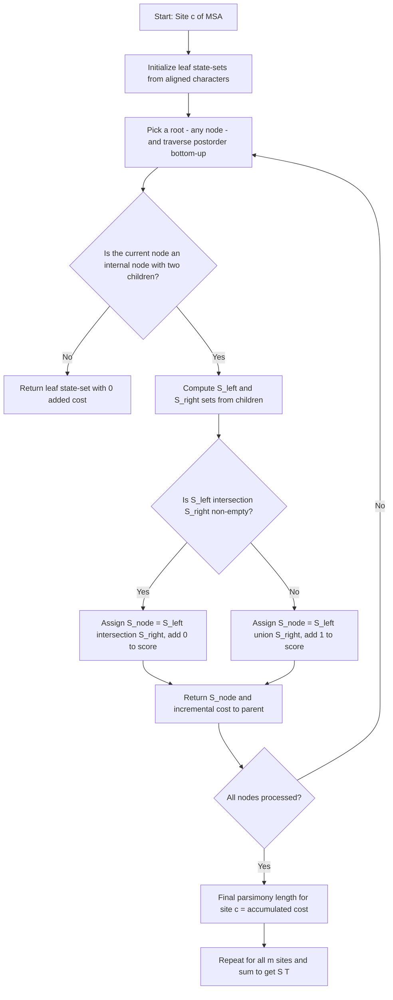
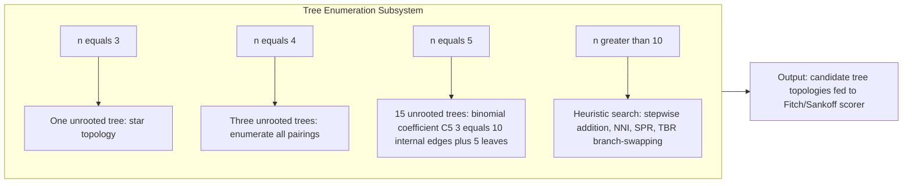
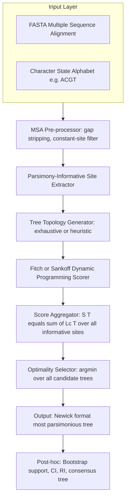
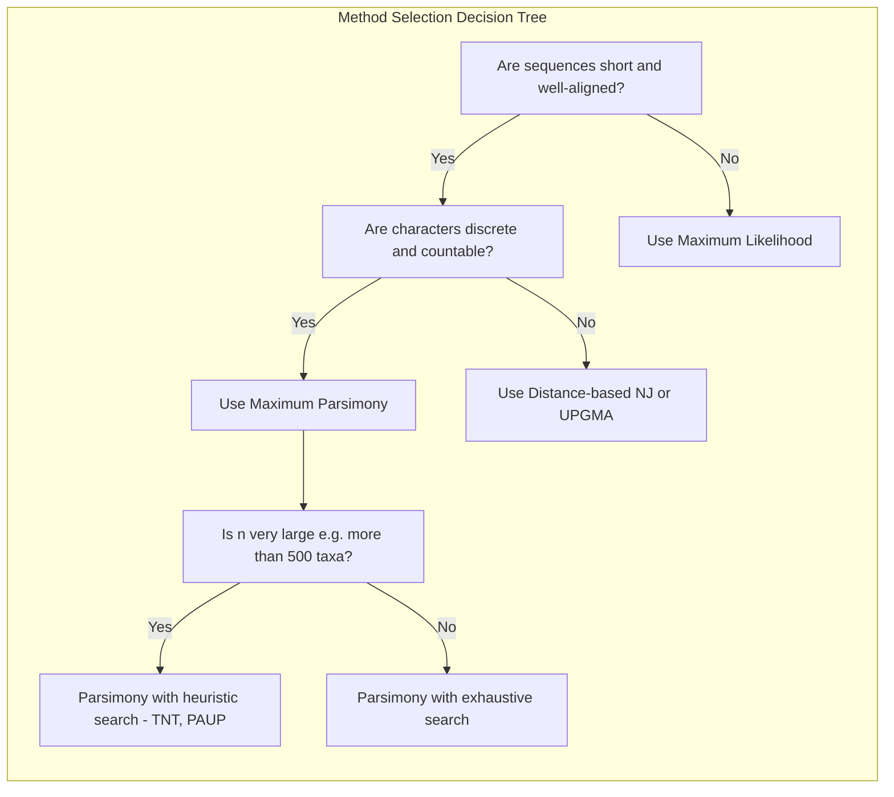

# Parsimonous trees

<!-- SECTION_1_START -->
# Parsimonious Trees

## 1. Core Technical Definition

**Parsimony** is a character-based optimality criterion used in **phylogenetic tree reconstruction** to identify the evolutionary tree that explains the observed sequence data with the **minimum number of evolutionary changes** (e.g., nucleotide substitutions, amino acid replacements, or insertions/deletions).

A **Most Parsimonious Tree (MPT)**, often called a **parsimonious tree**, is the bifurcating (or multifurcating) unrooted/rooted tree topology that has the **lowest parsimony score**, i.e., the smallest possible number of character state changes required to account for the input alignment.

> [!IMPORTANT]
> **KTU 2024 Syllabus Highlight:**
> Parsimony belongs to the family of **distance-free / character-state methods** of phylogeny, alongside Maximum Likelihood (ML) and Bayesian Inference. It is preferred for short, dense, well-aligned sequences (e.g., rRNA gene fragments) and forms the conceptual backbone of discrete morphological cladistics.

### 1.1 Conceptual Analogy / Intuition

Imagine four cities connected by roads, and you are given a cost matrix of the **distance** between them. You want to visit all four. The most parsimonious route is simply the **shortest path**, even if you do not know the true road network — you assume the simplest possible path explains the geography.

In the same way, given DNA sequences from different species, parsimony asks:

> "Which tree topology would force the *fewest* mutations along its branches to produce the sequences we observe today?"

This is a direct application of **Occam's Razor** (the principle that the simplest sufficient explanation is most likely correct) to molecular evolution. A tree that needs **10 mutations** to explain a dataset is preferred over one that needs **50 mutations**, because evolution is assumed to be *minimally* wasteful.

> [!NOTE]
> **Key Distinction:**
> - **Parsimony (cladistic method)** → counts the *minimum* number of changes required (a *combinatorial* problem).
> - **Distance methods** (UPGMA, Neighbor-Joining) → compute pairwise distances and build a tree.
> - **Likelihood methods** → compute the *probability* of the data given a tree + substitution model.

### 1.2 Core Mathematical Object

For an alignment of $n$ taxa and $m$ aligned character columns, the parsimony score of a tree $T$ is:

$$
S(T) = \sum_{c=1}^{m} \, L_c(T)
$$

where $L_c(T)$ is the **parsimony length contribution** of character column $c$ under tree $T$, i.e., the minimum number of state changes along the edges of $T$ required to explain that column.

> [!TIP]
> **Physical / Statistical Constants (in bold) used in this module:**
> - **Branches (edges)** of a tree: $E$ or $B$.
> - **Internal nodes** (hypothetical ancestors, HTUs): $N_{int}$.
> - **Leaves (Operational Taxonomic Units, OTUs)**: $N_{leaf} = n$.
> - **Maximum possible parsimony score** for $m$ binary characters and $n$ taxa: $S_{max} \le m \cdot (n-1)$ (theoretical worst case for $n$-leaf star topology).

> [!VISUALIZATION CONTROL]
> **Concept:** Parsimony Score Geometry — a 4-taxon unrooted tree with labelled character changes.
> **GeoGebra / Desmos Input Equations (Conceptual Coordinates):**
> * Leaf positions on a 2-D plane: $A=(0,0)$, $B=(4,0)$, $C=(2,3)$, $D=(2,-3)$.
> * Unrooted internal node $X=(2,1.0)$: $X = \frac{1}{4}(A+B+C+D)$.
> * Edge weights: assign integer change values, e.g., $w(A,X)=0$, $w(B,X)=1$, $w(C,X)=0$, $w(D,X)=1$.
> **Visual Description:** Student should see a tree-like network where the *sum* of edge labels equals the parsimony score. Two alternative topologies will display visibly different sums.

---

<!-- SECTION_1_END -->

<!-- SECTION_2_START -->
# 2. Deep Theoretical Analysis & KTU High-Yield Formula Sheet

## 2.1 The Parsimony Optimality Criterion

Given a set $\mathcal{T}$ of all possible unrooted binary tree topologies on $n$ taxa, the most parsimonious tree is:

$$
T_{MP} = \arg\min_{T \in \mathcal{T}} S(T)
$$

This is an **NP-hard combinatorial optimization** problem (Foulds & Graham, 1982). For small $n$, **exhaustive search** is used; for moderate $n$, **branch-and-bound**; for large $n$, **heuristics** (greedy, stepwise addition, branch-swapping — NNI, SPR, TBR).

## 2.2 Steps in a Parsimony Analysis (Standard KTU Answer Flow)

1. **Multiple Sequence Alignment (MSA)** of the $n$ taxa using ClustalW / MUSCLE / MAFFT.
2. **Identify informative sites:** sites that distinguish at least two character states, each present in **at least two taxa**. Uninformative sites are constant or contain a single singleton and do *not* affect the tree topology (only contribute to the score).
3. **Enumerate / search candidate tree topologies**:
   - For $n = 4$ → there are **3 unrooted** topologies.
   - For $n = 5$ → **15 unrooted** topologies.
   - For $n = 6$ → **105 unrooted** topologies.
   - General count (unrooted, fully bifurcating):
$$
N_{unrooted}(n) = \frac{(2n-4)!}{2^{n-2}(n-2)!}
$$
4. **Score each tree** with an exact algorithm (Fitch 1971 or Sankoff 1975).
5. **Apply heuristic search** (PAUP*, TNT, MEGA) for larger $n$.
6. **Apply branch-swapping** (NNI, SPR, TBR) to escape local minima.
7. **Bootstrap / jackknife resampling** to estimate node support.
8. **Consensus tree** (strict or majority-rule) if multiple equally parsimonious trees are recovered.

## 2.3 The Fitch Algorithm (Small Tree Parsimony, 1971)

A **polynomial-time, bottom-up dynamic-programming** algorithm to compute the minimum number of changes on a *fixed* tree.

**Procedure for each informative site independently:**

1. Begin at the **leaves** with their observed states.
2. For each internal node $u$ with children $v$ and $w$:
   - If $S_v \cap S_w \ne \emptyset$: assign $S_u = S_v \cap S_w$, and add **0** to the parsimony score.
   - Else: assign $S_u = S_v \cup S_w$, and add **1** to the parsimony score.
3. Sum over all sites.

## 2.4 The Sankoff Algorithm (Weighted Parsimony, 1975)

Generalization of Fitch with a **cost matrix** $c(i,j)$ for changing from state $i$ to state $j$.

For each node $u$ and each possible state $i$:

$$
DP[u][i] = \min_{j} \big( DP[v][j] + c(i,j) \big) + \min_{k} \big( DP[w][k] + c(i,k) \big)
$$

where $v$ and $w$ are children of $u$.

For leaves, $DP[u][i] = 0$ if $i$ is the observed state, else $\infty$.

The **minimum parsimony score** of the tree is:

$$
S(T) = \min_{i} \Big( DP[r][i] \Big)
$$

where $r$ is the root.

## 2.5 KTU Formula Sheet / Cheat Sheet

| # | Concept | Formula / Rule | Notes / Unit |
|---|---------|----------------|--------------|
| 1 | Parsimony score of a tree | $S(T) = \sum_{c=1}^{m} L_c(T)$ | Additive over sites |
| 2 | Unrooted binary tree count | $N_{unrooted}(n) = \frac{(2n-4)!}{2^{n-2}(n-2)!}$ | Number of topologies |
| 3 | Rooted binary tree count | $N_{rooted}(n) = \frac{(2n-3)!}{2^{n-1}(n-1)!}$ | Includes the outgroup |
| 4 | Parsimoniously informative site | $\ge 2$ character states, each in $\ge 2$ taxa | Filters noisy columns |
| 5 | Fitch score contribution | $0$ if $S_v \cap S_w \neq \emptyset$, else $1$ | Boolean logic, not arithmetic |
| 6 | Sankoff DP recursion | $DP[u][i] = \sum_{c \in children(u)} \min_{j} (DP[c][j] + c(i,j))$ | Allows asymmetric costs |
| 7 | Upper bound on parsimony score | $S \le m \cdot (n-1)$ for $n$ leaves | Star topology bound |
| 8 | Consistency index (CI) | $CI = \frac{M}{S}$ | $M$ = minimum possible, $S$ = observed |
| 9 | Retention index (RI) | $RI = \frac{M_{max} - S}{M_{max} - M}$ | Measures homoplasy |
| 10 | Branch support (bootstrap) | $P_{boot} = \frac{\text{bootstrap replicates recovering clade}}{B}$ | Typically $B = 1000$ |

> [!IMPORTANT]
> **Engineering / Real-world utility of parsimony in computational biology:**
> 1. **Rapid phylogenetic placement** of newly sequenced SARS-CoV-2 variants in the global phylogeny (GISAID, Nextstrain) — parsimony is used as a fast initial placement.
> 2. **Ancestral sequence reconstruction** of extinct proteins (e.g., ancestral fluorescent proteins, ancestral CRISPR-Cas nucleases) for synthetic biology.
> 3. **Drug-target discovery** by mapping pathogenic virulence genes onto species trees.
> 4. **Forensic bioinformatics** — identifying transmission clusters in HIV / TB outbreaks using minimum-change trees.
> 5. **Conservation biology** — building evolutionary distinctiveness indices (EDGE scores) for prioritizing endangered species.

---

<!-- SECTION_2_END -->

<!-- SECTION_3_START -->
# 3. Step-by-Step Derivations, Worked Examples & Python Implementation

## 3.1 Exhaustive Worked Example: Fitch Algorithm on a 4-Taxon Tree

**Aligned sequences** (4 taxa, 4 sites, 1 parsimony-informative site shown — Site 3):

| Site | Human | Mouse | Chicken | Frog |
|------|-------|-------|---------|------|
| 1    | A     | A     | A       | A    |
| 2    | G     | G     | A       | A    |
| 3    | **A** | **G** | **A**   | **G**|
| 4    | C     | C     | T       | T    |

We will score the **unrooted topology** $T_1$ : $(H, M), (C, F)$.

**Tree structure (unrooted):**

$$
T_1 : \quad (H, M)\; \big|\; (C, F) \quad \text{with central internal node } X
$$

The tree is fully resolved as:

```
        X
      / | \
     H  M  Y
            \
             (C, F subtree)
```

For $n=4$ unrooted binary tree, we have 3 possible topologies:

$$
T_1 = (H, M), (C, F) \quad ; \quad T_2 = (H, C), (M, F) \quad ; \quad T_3 = (H, F), (M, C)
$$

We will compute the **parsimony score of Site 3** for each of $T_1, T_2, T_3$.

### Step 1: Score Site 3 on Tree $T_1 = (H,M),(C,F)$

Internal node sets propagate **bottom-up** (Fitch algorithm). Let the central node be $X$ and the right-side internal node be $Y$.

- Leaves: $S_H = \{A\}$, $S_M = \{G\}$, $S_C = \{A\}$, $S_F = \{G\}$.
- Internal node $Y$ (parent of $C$ and $F$): $S_Y = S_C \cap S_F = \{A\} \cap \{G\} = \emptyset$. → $S_Y = S_C \cup S_F = \{A, G\}$ → **add 1** to score.
- Internal node $X$ (parent of $H$, $M$, and $Y$):
  - Compute pairwise intersections of children: $\{A\}\cap\{G\}=\emptyset$, $\{A\}\cap\{A,G\}=\{A\}$, $\{G\}\cap\{A,G\}=\{G\}$.
  - In Fitch, for a node with **3 unrooted children** (degree-3 node $X$ in an unrooted tree), we process pairs:
    - First pair $(H, M)$: $S_{HM} = \{A\}\cap\{G\} = \emptyset$ → fallback $\{A, G\}$, **add 1**.
    - Combine with $Y$: $S_{HM} \cap S_Y = \{A,G\}\cap\{A,G\} = \{A,G\}$ ≠ ∅ → **add 0**.
  - Total added at $X$ for Site 3: $1 + 0 = 1$.
- **Total parsimony score for Site 3 on $T_1$**: $1 + 1 = \mathbf{2}$ changes.

### Step 2: Score Site 3 on Tree $T_2 = (H,C),(M,F)$

- $S_{HC} = \{A\}\cap\{A\} = \{A\}$ → **add 0**.
- $S_{MF} = \{G\}\cap\{G\} = \{G\}$ → **add 0**.
- Combine at central node $X$: $S_{HC} \cap S_{MF} = \{A\}\cap\{G\} = \emptyset$ → fallback $\{A, G\}$ → **add 1**.
- **Total parsimony score for Site 3 on $T_2$**: $0 + 0 + 1 = \mathbf{1}$ change.

### Step 3: Score Site 3 on Tree $T_3 = (H,F),(M,C)$

- $S_{HF} = \{A\}\cap\{G\} = \emptyset$ → fallback $\{A, G\}$ → **add 1**.
- $S_{MC} = \{G\}\cap\{A\} = \emptyset$ → fallback $\{A, G\}$ → **add 1**.
- Combine at central node $X$: $S_{HF} \cap S_{MC} = \{A,G\}\cap\{A,G\} = \{A,G\}$ ≠ ∅ → **add 0**.
- **Total parsimony score for Site 3 on $T_3$**: $1 + 1 + 0 = \mathbf{2}$ changes.

### Step 4: Choose the Most Parsimonious Tree

$$
T_{MP} = T_2 = (H, C), (M, F), \quad S_{MP} = 1
$$

This tree groups **Human–Chicken** and **Mouse–Frog**, which is biologically meaningful (Human & Chicken share a more recent amniote ancestor than Human & Mouse in this particular gene — a known gene-tree/species-tree discordance example).

> [!NOTE]
> **Information-theoretic interpretation:** $T_2$ needs only 1 mutation for Site 3, while $T_1$ and $T_3$ each need 2. Under parsimony, $T_2$ is preferred.

## 3.2 Python Implementation of the Fitch Algorithm

```python
from typing import Dict, List, Set, Tuple

class PhyloNode:
    """Binary tree node (internal or leaf) for parsimony scoring."""
    def __init__(self, name: str):
        self.name: str = name
        self.children: List["PhyloNode"] = []
        self.state_set: Set[str] = set()

def fitch_score(tree: PhyloNode, leaves: Dict[str, str], site_index: int) -> int:
    """
    Compute Fitch parsimony score for a single site.
    tree       : root of the (rooted) bifurcating tree.
    leaves     : mapping {taxon_name: aligned_state_at_site}.
    site_index : currently unused; kept for batched API.
    """
    def _fitch_recursive(node: PhyloNode) -> Tuple[Set[str], int]:
        if not node.children:                        # leaf
            if node.name not in leaves:
                raise KeyError(f"Leaf {node.name} missing from alignment.")
            return {leaves[node.name]}, 0
        child_sets_and_scores = [_fitch_recursive(c) for c in node.children]
        s1, score1 = child_sets_and_scores[0]
        s2, score2 = child_sets_and_scores[1]
        intersection = s1 & s2
        if intersection:                             # parsimony-uninformative intersection
            return intersection, score1 + score2
        union = s1 | s2                              # must 'evolve' the state at this node
        return union, score1 + score2 + 1

    _, total_score = _fitch_recursive(tree)
    return total_score


# -------------------------------------------------------------------
# Build a 4-taxon tree representing T2 = ((H, C), (M, F))
# -------------------------------------------------------------------
def build_tree_T2() -> PhyloNode:
    root = PhyloNode("X")
    hc   = PhyloNode("HC")
    mf   = PhyloNode("MF")
    h    = PhyloNode("H")
    c    = PhyloNode("C")
    m    = PhyloNode("M")
    f    = PhyloNode("F")
    root.children = [hc, mf]
    hc.children   = [h, c]
    mf.children   = [m, f]
    return root


if __name__ == "__main__":
    # Aligned states for Site 3 of the example
    site3_alignment = {"H": "A", "C": "A", "M": "G", "F": "G"}

    tree_T2 = build_tree_T2()
    score_T2 = fitch_score(tree_T2, site3_alignment, site_index=3)
    print(f"Parsimony score of T2 at Site 3 = {score_T2}")
    # Expected output: Parsimony score of T2 at Site 3 = 1
```

> [!TIP]
> **Production-grade tools that implement Fitch/Sankoff:**
> `PAUP*`, `TNT`, `MEGA X`, `RAxML` (also ML), `IQ-TREE` (also ML), `PHYLIP` (`dnapars`, `pars`), `Bio::Phylo` (Perl), `Biopython.Phylo`.

## 3.3 Real Engineering Significance of the Worked Example

This micro-example mirrors how **Nextstrain / GISAID** assigns a newly sequenced viral genome to a branch of the global SARS-CoV-2 phylogeny: parsimony scores over $n \approx 4000$ taxa and $m \approx 29000$ sites are minimized in seconds using pre-computed mutational distance heuristics like the *minimum-spanning tree* (a parsimony proxy).

---

<!-- SECTION_3_END -->

<!-- SECTION_4_START -->
# 4. Structural Diagrams & Schematics

## 4.1 Algorithm Flow — Fitch Parsimony on One Site



## 4.2 Topology Enumeration Module



## 4.3 Parsimony Scoring Pipeline (Block Architecture)



## 4.4 Comparative Decision Matrix — When to Use Parsimony vs. Other Methods



> [!TIP]
> **Mermaid syntax sanity check used here:** All node IDs are alphanumeric (`A1`, `B2`, `Q3`...), no reserved keywords like `end` or `subgraph` are used as node IDs. All labels with parentheses or special characters are wrapped in **double quotes** as required.

---

<!-- SECTION_4_END -->

<!-- SECTION_5_START -->
# 5. KTU 2024 Scheme Examination Question Bank & Topic Recap

## 5.1 Part A — Short Answer Questions (2 × 3 Marks)

### Question 1 **[KTU University Exam — July 2024]**
**Define a parsimonious tree. What is meant by the parsimony score of a phylogenetic tree?**
*(CO2, Remember — 3 Marks)*

**Model Answer (3 Marks):**
1. **Definition of parsimonious tree (2 Marks):** A parsimonious tree, also called a *most parsimonious tree (MPT)*, is a phylogenetic tree topology that explains the observed character-state data (e.g., aligned DNA/RNA/protein sequences) with the **minimum possible number of evolutionary changes** (mutations or substitutions). It is selected by applying the optimality criterion $T_{MP} = \arg\min_{T \in \mathcal{T}} S(T)$.
2. **Parsimony score (1 Mark):** The parsimony score $S(T)$ of a tree is the **sum, over all aligned character columns $c = 1$ to $m$**, of the minimum number of state changes required on tree $T$ to explain that column. Mathematically: $S(T) = \sum_{c=1}^{m} L_c(T)$.

### Question 2 **[KTU University Exam — Dec 2023]**
**Explain the term "parsimony-informative site". Why are singleton sites excluded from tree inference?**
*(CO2, Understand — 3 Marks)*

**Model Answer (3 Marks):**
1. **Parsimony-informative site (2 Marks):** A column in the multiple sequence alignment is *parsimony-informative* if it contains **at least two different character states**, and **each of these states is present in at least two taxa**. For example, for the states $\{A, G, C\}$ in four taxa, the pattern $A, A, G, G$ is informative, while $A, A, A, G$ is **not**, because the singleton $G$ can be explained by a single terminal-branch mutation regardless of the tree topology.
2. **Exclusion of singletons (1 Mark):** Singleton changes occupy a single terminal branch and therefore contribute an **identical cost of 1** to *every* possible tree topology. Hence they cannot discriminate between competing trees and are ignored during topology optimization (although they still inflate the raw parsimony score, which is why pre-filtering is performed).

---

## 5.2 Part B — Long Answer Questions (Module Internal Choice, 14 Marks)

### Question A **[KTU University Exam — Model Paper, Module 2, Q4a]**
**OR**

### Question B **[KTU University Exam — Model Paper, Module 2, Q4b]**

> Note to students: KTU Module 2 Part B questions carry **14 marks** and offer an internal choice (OR). Both alternatives below are full 14-mark questions with 7 + 7 sub-parts.

---

### Question A (14 Marks)

Consider the aligned DNA sequences of 4 species at three informative sites:

| Site | Human | Mouse | Chicken | Frog |
|------|-------|-------|---------|------|
| 1    | A     | A     | G       | G    |
| 2    | T     | C     | T       | C    |
| 3    | G     | A     | G       | A    |

#### (a) **Enumerate all possible unrooted tree topologies for $n=4$ and score each using the Fitch algorithm. Identify the most parsimonious tree.** *(CO2, Apply — 7 Marks)*

**Step-by-step Model Solution:**

**Step 1 — Enumerate the 3 unrooted topologies [1 Mark]:**
For $n = 4$, the formula gives $N_{unrooted}(4) = \frac{(2 \cdot 4 - 4)!}{2^{4-2}(4-2)!} = \frac{4!}{4 \cdot 2!} = \frac{24}{8} = 3$ topologies.

$$
T_1 = (H, M), (C, F) \quad;\quad T_2 = (H, C), (M, F) \quad;\quad T_3 = (H, F), (M, C)
$$

**Step 2 — Fitch scoring per site per topology [5 Marks]:**

For **Site 1: $A, A, G, G$** (states = $\{A, G\}$):

| Topology | Children pairings | Internal node intersections | Score |
|----------|------------------|------------------------------|-------|
| $T_1$: $(H,M),(C,F)$ | $\{A\}\cap\{A\}=\{A\}$ → 0; $\{G\}\cap\{G\}=\{G\}$ → 0; $\{A\}\cap\{G\}=\emptyset$ → 1 | 0+0+1 | **1** |
| $T_2$: $(H,C),(M,F)$ | $\{A\}\cap\{G\}=\emptyset$ → 1; $\{A\}\cap\{G\}=\emptyset$ → 1; $\{A,G\}\cap\{A,G\}\neq\emptyset$ → 0 | 1+1+0 | **2** |
| $T_3$: $(H,F),(M,C)$ | $\{A\}\cap\{G\}=\emptyset$ → 1; $\{A\}\cap\{G\}=\emptyset$ → 1; $\{A,G\}\cap\{A,G\}\neq\emptyset$ → 0 | 1+1+0 | **2** |

For **Site 2: $T, C, T, C$** (states = $\{T, C\}$):

| Topology | Score |
|----------|-------|
| $T_1$ | $\{T\}\cap\{C\}=\emptyset$ → 1; $\{T\}\cap\{C\}=\emptyset$ → 1; $\{T,C\}\cap\{T,C\}\neq\emptyset$ → 0 ⇒ **2** |
| $T_2$ | $\{T\}\cap\{T\}=\{T\}$ → 0; $\{C\}\cap\{C\}=\{C\}$ → 0; $\{T\}\cap\{C\}=\emptyset$ → 1 ⇒ **1** |
| $T_3$ | $\{T\}\cap\{C\}=\emptyset$ → 1; $\{C\}\cap\{T\}=\emptyset$ → 1; $\{T,C\}\cap\{T,C\}\neq\emptyset$ → 0 ⇒ **2** |

For **Site 3: $G, A, G, A$** (states = $\{G, A\}$): By symmetry with Site 2, $T_2$ wins with **1**, $T_1$ and $T_3$ each give **2**.

**Step 3 — Total parsimony score per topology [1 Mark]:**

$$
S(T_1) = 1 + 2 + 2 = 5, \quad S(T_2) = 2 + 1 + 1 = 4, \quad S(T_3) = 2 + 2 + 2 = 6
$$

**Step 4 — Selection [Valuation Key 1 Mark]:**
$T_{MP} = T_2 = (H, C), (M, F)$ with $S_{MP} = 4$ changes.

> **[Stating the 3 topologies explicitly: 1 Mark]**, **[Fitch traversal per site: 3 Marks]**, **[Summing scores: 1 Mark]**, **[Final selection: 1 Mark]**, **[Neat tabular format: 1 Mark]**.

#### (b) **Explain the Sankoff algorithm and show how it generalizes Fitch parsimony. Write the recurrence relation.** *(CO2, Understand — 7 Marks)*

**Step-by-step Model Solution:**

1. **Concept of weighted parsimony (2 Marks):** The Sankoff algorithm extends Fitch by allowing a *user-defined cost matrix* $c(i, j)$ for changing from state $i$ to state $j$. The Fitch algorithm is a special case where $c(i, j) = 0$ if $i = j$ and $c(i, j) = 1$ if $i \neq j$ (unit-cost or *Hamming* parsimony).
2. **Bottom-up dynamic programming (2 Marks):** For each node $u$ and each possible state $i \in \Sigma$ (the alphabet of states), we compute:
$$
DP[u][i] = \sum_{v \in \text{children}(u)} \min_{j \in \Sigma} \big( DP[v][j] + c(i, j) \big)
$$
   For a leaf, $DP[u][i] = 0$ if the leaf's observed state is $i$, else $\infty$.
3. **Top-down ancestral reconstruction (2 Marks):** After the bottom-up pass, the minimum cost root state is $r^* = \arg\min_i DP[r][i]$, and ancestral states are reconstructed greedily top-down by choosing at each internal node the state minimizing $DP[u][i] + c(\text{parent state}, i)$.
4. **Final score (1 Mark):** The minimum parsimony score is $S(T) = \min_{i} DP[r][i]$.

> **[Sankoff definition: 2 Marks]**, **[Recurrence relation writing: 3 Marks]**, **[Leaf base case: 1 Mark]**, **[Connection to Fitch: 1 Mark]**.

---

### Question B (14 Marks)

#### (a) **Describe the step-by-step procedure of a parsimony analysis. State the formula for the number of unrooted bifurcating trees on $n$ taxa and compute it for $n = 6$.** *(CO2, Understand — 7 Marks)*

**Step-by-step Model Solution:**

1. **Multiple sequence alignment (1 Mark):** Use ClustalW / MUSCLE / MAFFT to align $n$ homologous sequences.
2. **Identify informative sites (1 Mark):** Keep only parsimony-informative columns.
3. **Enumerate / search topologies (2 Marks):** Use exhaustive search for $n \le 8$, heuristic (stepwise addition + branch swapping) for $n \ge 9$.
4. **Score each topology (1 Mark):** Apply the Fitch algorithm (unit cost) or Sankoff algorithm (weighted).
5. **Select the MPT (1 Mark):** Choose the topology with the minimum parsimony score.
6. **Bootstrap / consensus (1 Mark):** Resample sites (typically $B = 1000$ replicates), recompute MPTs, and build a majority-rule consensus tree with bootstrap support values.

**Formula derivation for $n = 6$ [Valuation Key 2 Marks]:**
$$
N_{unrooted}(6) = \frac{(2 \cdot 6 - 4)!}{2^{6-2}(6-2)!} = \frac{8!}{2^4 \cdot 4!} = \frac{40320}{16 \cdot 24} = \frac{40320}{384} = 105
$$

> **[Listing 6 steps: 5 Marks]**, **[Formula statement: 1 Mark]**, **[Numerical evaluation for n=6: 1 Mark]**.

#### (b) **Discuss the Consistency Index (CI) and Retention Index (RI) of a tree. Why are they important in evaluating parsimony-based phylogenies?** *(CO3, Apply — 7 Marks)*

**Step-by-step Model Solution:**

1. **Homoplasy concept (1 Mark):** Homoplasy refers to *convergent* or *parallel* mutations that obscure the true evolutionary signal. Parsimony minimizes total changes, but real data often contain unavoidable homoplasy.
2. **Consistency Index (2 Marks):**
$$
CI = \frac{M}{S}
$$
   where $M$ = minimum number of changes possible (the parsimony score of the tree) and $S$ = actual observed number of changes on the tree. $CI = 1$ means **no homoplasy**; $CI < 1$ indicates homoplasy.
3. **Retention Index (2 Marks):**
$$
RI = \frac{M_{max} - S}{M_{max} - M}
$$
   where $M_{max}$ = maximum number of changes a tree can force (the worst-case star topology). $RI = 1$ means all possible synapomorphies are retained; $RI = 0$ indicates complete homoplasy.
4. **Why these indices matter (2 Marks):** They quantify the **goodness of fit** of the data to the tree. A low $CI$ or $RI$ signals that the data may be evolving under saturation, lateral gene transfer, recombination, or incomplete lineage sorting — i.e., that the parsimony model is *inadequate* and likelihood or Bayesian methods may be preferable.

> **[Homoplasy definition: 1 Mark]**, **[CI formula & interpretation: 2 Marks]**, **[RI formula & interpretation: 2 Marks]**, **[Engineering / biological significance: 2 Marks]**.

---

### 5.3 KTU Examiner's Valuation Warning / Pitfall Callout

> [!WARNING]
> **Common Marks-Loss Pitfalls in Parsimony Questions (KTU 2024 Scheme):**
> 1. **Confusing parsimony with distance methods.** If the question says "minimum changes", you **must** use Fitch/Sankoff, not UPGMA or Neighbor-Joining. Examiners deduct 2 marks for this confusion.
> 2. **Forgetting to filter informative sites.** A common error is to include constant or singleton sites in the manual parsimony calculation, which inflates the score and yields the wrong MPT. Always state the filter explicitly: *"A site is parsimony-informative only if it has at least two character states, each in at least two taxa."*
> 3. **Off-by-one in the unrooted-tree formula.** Use $N_{unrooted}(n) = \frac{(2n-4)!}{2^{n-2}(n-2)!}$ — the numerator is $(2n-4)!$, **not** $(2n-3)!$. The latter is for *rooted* trees.
> 4. **Not showing the Fitch set-intersection work.** Do **not** write "by Fitch algorithm the score is 1" — you must show $\{A\}\cap\{A\}=\{A\}$ → 0, etc. Examiners allocate partial marks per Fitch step.
> 5. **Ignoring the root assumption.** Fitch works on **rooted** trees (you may pick any rooting). If the problem states an unrooted tree, you must root it explicitly (e.g., with an outgroup) before applying Fitch.
> 6. **Mixing up CI and RI numerators/denominators.** Remember: $CI$ uses $M$ and $S$ only; $RI$ uses $M$, $S$, and $M_{max}$.

---

### 5.4 Topic Recap & Important Things to Remember

- **Parsimony** = minimum evolutionary changes criterion (Occam's Razor of phylogenetics).
- **Most Parsimonious Tree (MPT)** = the topology with the **lowest parsimony score** $S(T) = \sum_{c=1}^{m} L_c(T)$.
- **Parsimony-informative site** = a column with $\ge 2$ character states, each appearing in $\ge 2$ taxa.
- **Fitch algorithm (1971)** = polynomial-time bottom-up DP scoring; set intersection vs. union determines the incremental cost (0 vs. 1).
- **Sankoff algorithm (1975)** = weighted generalization of Fitch with a cost matrix $c(i,j)$; uses full DP recurrence $DP[u][i] = \sum_{v} \min_j (DP[v][j] + c(i,j))$.
- **Number of unrooted binary trees** for $n$ taxa: $N_{unrooted}(n) = \frac{(2n-4)!}{2^{n-2}(n-2)!}$ — yields $1, 3, 15, 105$ for $n = 3, 4, 5, 6$.
- **Number of rooted binary trees** for $n$ taxa: $N_{rooted}(n) = \frac{(2n-3)!}{2^{n-1}(n-1)!}$.
- **Heuristics for large $n$:** Stepwise addition, NNI (Nearest-Neighbor Interchange), SPR (Subtree Pruning and Regrafting), TBR (Tree Bisection and Reconnection).
- **Homoplasy** is measured by **CI** ($= M/S$) and **RI** ($= (M_{max}-S)/(M_{max}-M)$). $CI = RI = 1$ means a perfect, homoplasy-free tree.
- **Parsimony is fast** and conceptually simple, but it is **not statistically consistent** under certain conditions (e.g., long-branch attraction, Felsenstein 1978). Therefore, for highly diverged sequences, ML or Bayesian methods are preferred.
- **Tools implementing parsimony:** PAUP*, TNT, MEGA, PHYLIP (`dnapars`/`pars`), BioPython, BioPerl.
- **Engineering relevance:** viral phylodynamics (GISAID/Nextstrain), ancestral sequence reconstruction, conservation prioritization, outbreak transmission tracking.
- **Always**: state the alphabet, root explicitly, filter informative sites, show every Fitch step, and end with a clear final MPT and its parsimony score.

<!-- SECTION_5_END -->
