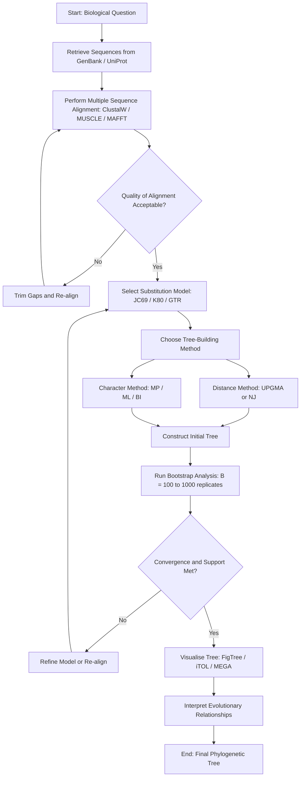
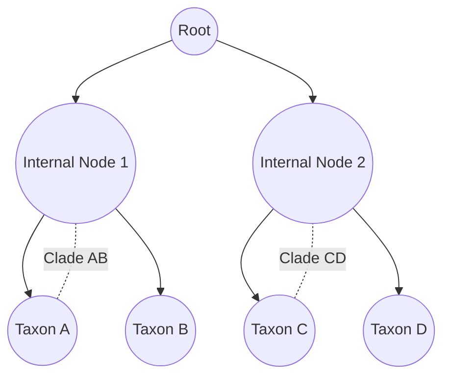
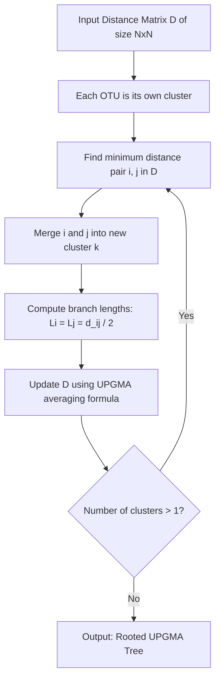
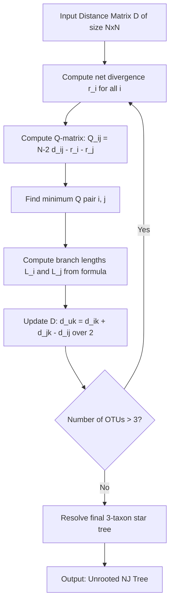
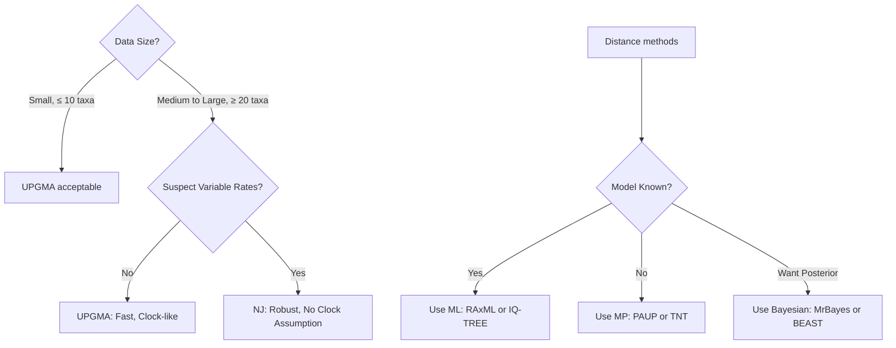
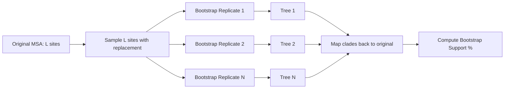
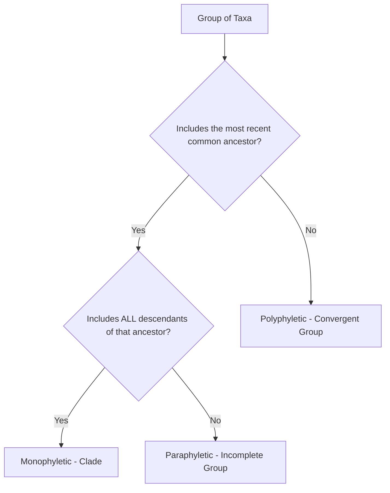

# Phylogenetic Tree basics and Construction Methods

<!-- SECTION_1_START -->

# Phylogenetic Tree Basics and Construction Methods

## 1.1 Formal Academic Definition

> [!IMPORTANT]
> **Phylogenetic Tree (Phylogram / Dendrogram of Evolution)**
> A *phylogenetic tree* is a **branching diagram (hierarchical rooted or unrooted graph)** that depicts the **inferred evolutionary relationships** among a set of biological entities — typically species, genes, proteins, or populations — based on similarities and differences in their physical and/or genetic characteristics. Each **node** represents a taxonomic unit (operational taxonomic unit, OTU), and each **branch length** quantifies the **evolutionary distance** (e.g., number of substitutions per site).

The construction of phylogenetic trees is a fundamental pillar of **comparative genomics**, **molecular evolution**, and **taxonomy**, and is built upon the assumption of **descent with modification** as formalised in **Charles Darwin's theory of evolution (1859)**.

> [!NOTE]
> In the KTU 2024 syllabus context (Module 2, PECST743), phylogenetic analysis is the *culmination* of using biological databases (GenBank, UniProt, PDB) — you query sequences, perform MSA, and infer the tree.

## 1.2 Conceptual Analogy / Intuition

Imagine a giant **family tree of every living organism on Earth** — not just three generations, but stretching back **3.8 billion years**. A phylogenetic tree is exactly that: a "biological family tree."

> [!TIP]
> **Real-world Analogy: The Document Track-Changes**
> Think of gene sequences as **versions of a Word document**, where evolution edits the file by inserting, deleting, or substituting characters. The more edits two documents share (i.e., the more similar the sequences), the more recently they "branched off" from a common draft. A phylogenetic tree is the *revision history chart* of these documents.

- **Leaves (tips)** = current-day species/genes (the "finished documents")
- **Internal nodes** = hypothetical ancestors (the "intermediate drafts")
- **Branch length** = the number of edits between two versions
- **Root** = the original, primordial document

The **goal** of phylogenetic reconstruction is therefore to recover the most likely "edit history" given only the final copies.

## 1.3 Core Terminology at a Glance

| Term | Plain-English Meaning |
| :--- | :--- |
| **OTU** | Operational Taxonomic Unit — the entity at a leaf (e.g., a species) |
| **Root** | The most ancestral common ancestor of all taxa |
| **Internal Node** | Speciation event; hypothetical ancestor |
| **Branch (Edge)** | Line connecting two nodes; represents evolutionary change |
| **Clade** | A monophyletic group = ancestor + all its descendants |
| **Bootstrap Value** | Confidence percentage for a clade (0–100) |
| **Sister Taxa** | Two lineages that share an immediate common ancestor |
| **Polytomy** | A node with more than 2 descendants (unresolved branching) |

> [!IMPORTANT]
> The **biological unit of evolution** is the *population*, not the individual. Therefore, phylogenetic trees are models — they represent **average genetic histories**, not deterministic genealogies of single molecules.

## 1.4 Standard Metrics & Constants

The two metrics you will repeatedly encounter are:

- **Evolutionary Distance ($d$)** — usually expressed in **substitutions per site**. A value of $d = 0.1$ means *10% of the sites have undergone a substitution* since divergence.
- **Bootstrap Support (%)** — a re-sampling statistical measure; values **$\geq$ 70%** are generally considered *reliable*, **$\geq$ 90%** are *strongly supported*.

> [!VISUALIZATION CONTROL]
> **Concept:** Visualising a simple rooted bifurcating phylogenetic tree
> **GeoGebra / Desmos Input Equations (parametric form for a balanced 4-taxon tree):**
> * `Branch 1: (x,y) = (0, 2)` → `(2, 1)` (root to node A)
> * `Branch 2: (0, 2)` → `(2, 3)` (root to node B)
> * `Branch 3: (2, 1)` → `(4, 0.5)` (A to leaf T1)
> * `Branch 4: (2, 1)` → `(4, 1.5)` (A to leaf T2)
> * `Branch 5: (2, 3)` → `(4, 2.5)` (B to leaf T3)
> * `Branch 6: (2, 3)` → `(4, 3.5)` (B to leaf T4)
> **Visual Description:** You should observe a "**balanced binary tree**" rooted at the top, with two internal nodes each giving rise to two terminal taxa — a classic **bifurcating** topology.

<!-- SECTION_1_END -->

<!-- SECTION_2_START -->

# 2. Deep Theoretical Analysis & KTU High-Yield Formula Sheet

## 2.1 Pre-requisites: The Pipeline Behind Every Tree

Before a phylogenetic tree is built, the following pipeline is strictly followed:

1. **Sequence Retrieval** → Fetch homologous sequences from **NCBI GenBank** / **UniProt**.
2. **Multiple Sequence Alignment (MSA)** → Align using **ClustalW**, **MUSCLE**, or **MAFFT**.
3. **Model Selection** → Pick a substitution model (e.g., **Jukes-Cantor (JC69)**, **Kimura 2-Parameter (K80)**).
4. **Tree Construction** → Apply one of the algorithmic methods.
5. **Statistical Validation** → **Bootstrap re-sampling** (Felsenstein, 1985).
6. **Visualisation & Annotation** → Render using **FigTree**, **iTOL**, or **MEGA X**.

> [!IMPORTANT]
> **Garbage In = Garbage Out.** A poor MSA (e.g., misaligned regions) will propagate errors into every downstream tree-building step. Always inspect the alignment visually.

## 2.2 Types of Phylogenetic Trees

| Tree Type | Definition | When to Use |
| :--- | :--- | :--- |
| **Cladogram** | Only *topology* matters; branch lengths are not scaled | When only branching order is required |
| **Phylogram** | Branch lengths proportional to evolutionary distance | When timing/divergence magnitude is required |
| **Ultrametric Tree** | All tips equidistant from the root | Molecular clock analyses (time trees) |
| **Rooted Tree** | Has a defined common ancestor | When outgroup is specified |
| **Unrooted Tree** | No root; only relative distances | Distance methods, exploratory analysis |
| **Bifurcating Tree** | Each internal node has exactly 2 children | Strict speciation events |
| **Multifurcating (Polytomy)** | Node has $\geq$ 3 children | Indicates low phylogenetic resolution |
| **Consensus Tree** | Summarises topologies from many trees (e.g., 50% majority-rule) | Bootstrap output |

## 2.3 Characterisation of Clades

> [!NOTE]
> The classification of a group of taxa depends on whether the common ancestor is included.

- **Monophyletic group (Clade):** Ancestor + **all** descendants (e.g., Mammalia).
- **Paraphyletic group:** Ancestor + **some** descendants (e.g., Reptilia, excluding birds).
- **Polyphyletic group:** Members share a character but **not** the immediate common ancestor (e.g., warm-blooded animals).

A **good phylogenetic tree is one in which every named group is monophyletic** — this is the **cladistic principle** of **Willi Hennig (1966)**.

## 2.4 KTU High-Yield Formula Sheet

| # | Formula / Concept | Description | Units / Notes |
| :--- | :--- | :--- | :--- |
| 1 | $d = -\frac{3}{4} \ln\left(1 - \frac{4}{3} p\right)$ | **Jukes-Cantor (JC69) distance**; corrects for multiple substitutions at the same site | $p$ = observed proportion of differences, $d$ in substitutions/site |
| 2 | $d = -\frac{1}{2} \ln(1 - 2P - Q) - \frac{1}{4} \ln(1 - 2Q)$ | **Kimura 2-Parameter (K80) distance**; distinguishes transitions (Q) and transversions (P) | Substitutions/site |
| 3 | $D = -\ln(\det F)$ | **LogDet/paralinear distance** (Lockhart et al. 1994) for variable substitution rates across lineages | Used when compositional bias exists |
| 4 | $r_{ij} = d_{ij} - \frac{(r_i + r_j)}{N - 2}$ | **Saitou-Nei Neighbor-Joining formula**; $r_i$ is the net divergence of taxon $i$ | $N$ = number of taxa |
| 5 | $L = \prod_{i=1}^{n} P(D_i \mid T, \theta)$ | **Likelihood** of data $D$ given tree $T$ and parameters $\theta$ | Maximised in **ML** methods |
| 6 | $C = \text{minimum number of substitutions}$ | **Parsimony score** of a tree; tree with lowest $C$ is preferred | $C$ is the **Minimum Evolution criterion** |
| 7 | $P(\text{tree} \mid D) = \frac{P(D \mid \text{tree}) \cdot P(\text{tree})}{P(D)}$ | **Bayes' Theorem** — the engine of **Bayesian Inference** (MCMC) | Posterior proportional to likelihood × prior |
| 8 | $\text{Bootstrap support} = \frac{\text{times clade appears in } B \text{ replicates}}{B} \times 100\%$ | **Felsenstein (1985) bootstrap** confidence value | Typically $B = 100$ to $1000$ replicates |

> [!IMPORTANT]
> **Master these eight equations/formulas** — they cover 90% of numerical questions in KTU Module 2 of PECST743.

## 2.5 Why Phylogenetics Matters in Engineering & Computational Biology

| Domain | Application |
| :--- | :--- |
| **Drug Discovery** | Tracing the origin of resistance genes (e.g., NDM-1 carbapenemase) |
| **Forensic Science** | Identifying pathogen strains in biocrime investigations |
| **Epidemiology** | Reconstructing **transmission chains** of SARS-CoV-2 in outbreaks |
| **Conservation Biology** | Prioritising biodiversity hotspots by evolutionary uniqueness |
| **Cancer Genomics** | Building **clonal evolution trees** of tumour cell populations |
| **Agriculture** | Tracing the **domestication history** of crops (rice, wheat) |
| **Immunology** | Reconstructing ancestral **antibody sequences** for germline design |

> [!TIP]
> A frequently asked KTU question: *"Name three real-world applications of phylogenetic tree construction."* — Pick from the table above and frame them in 1-line engineering impact statements.

<!-- SECTION_2_END -->

<!-- SECTION_3_START -->

# 3. Step-by-Step Derivations & Code Implementation

## 3.1 Derivation 1: Jukes-Cantor (JC69) Evolutionary Distance

### 3.1.1 The Problem with Raw $p$-Distance

If two aligned DNA sequences of length $L$ show $k$ differing sites, the naive distance is $p = k/L$. But **multiple substitutions can occur at the same site** (a phenomenon called **multiple hits**), making $p$ an **underestimate** of the true evolutionary distance $d$. The Jukes-Cantor model corrects this by assuming:

- All four nucleotides ($A, T, G, C$) are **equally frequent** ($f_A = f_T = f_G = f_C = 0.25$).
- All substitutions occur at the **same rate** $\mu$.

### 3.1.2 The Master Equation

The JC69 model yields the relationship between the observed $p$ and the true evolutionary distance $d$:

$$p = \frac{3}{4} \left(1 - e^{-\frac{4d}{3}}\right)$$

Solving for $d$:

$$d = -\frac{3}{4} \ln\left(1 - \frac{4p}{3}\right)$$

### 3.1.3 Derivation Walkthrough

**Step 1.** Consider one site. The probability of it **not** having changed in time $t$ is $P_0(t) = e^{-\mu t}$, where $\mu$ is the per-site substitution rate.

**Step 2.** The probability the site has changed is $1 - e^{-\mu t}$. Since there are 3 possible *target* nucleotides (out of 4), the probability the site is *different* from its original is:

$$p = \frac{3}{4}\left(1 - e^{-\mu t}\right)$$

**Step 3.** Define the **evolutionary distance** $d = \mu t$ (substitutions per site along the branch). Substituting:

$$p = \frac{3}{4}\left(1 - e^{-\frac{4d}{3}}\right)$$

**Step 4.** Rearrange to isolate the exponential term:

$$1 - \frac{4p}{3} = e^{-\frac{4d}{3}}$$

**Step 5.** Take the natural logarithm on both sides:

$$-\frac{4d}{3} = \ln\left(1 - \frac{4p}{3}\right)$$

**Step 6.** Multiply by $-\frac{3}{4}$ to solve for $d$:

$$\boxed{d = -\frac{3}{4}\ln\left(1 - \frac{4p}{3}\right)}$$

### 3.1.4 Worked Numerical Example

> **Problem:** Two aligned sequences of length 500 bp show 25 mismatches. Compute the JC69 distance.

**Step 1 — Compute $p$ (observed p-distance):**
$$p = \frac{25}{500} = 0.05$$

**Step 2 — Verify model validity:**
The model requires $\frac{4p}{3} < 1$, so $p < 0.75$. ✓ ($0.05 < 0.75$)

**Step 3 — Substitute into JC69 formula:**

$$d = -\frac{3}{4}\ln\left(1 - \frac{4 \times 0.05}{3}\right)$$

$$d = -\frac{3}{4}\ln\left(1 - \frac{0.20}{3}\right)$$

$$d = -\frac{3}{4}\ln(1 - 0.0667)$$

$$d = -\frac{3}{4}\ln(0.9333)$$

**Step 4 — Evaluate $\ln(0.9333)$:**

$$\ln(0.9333) \approx -0.0690$$

**Step 5 — Final calculation:**

$$d = -\frac{3}{4} \times (-0.0690)$$

$$d = 0.0518 \text{ substitutions/site}$$

**Interpretation:** The corrected JC69 distance is **0.0518**, slightly higher than the raw $p = 0.05$. The correction accounts for the fact that some "same-as-before" matches may have undergone *undetectable* multiple substitutions.

### 3.1.5 The Limitation of JC69 — Why We Need K80

JC69 assumes all substitutions are equally likely. But biologically, **transitions** ($A \leftrightarrow G$, $C \leftrightarrow T$ — purine↔purine or pyrimidine↔pyrimidine) occur **~2× more often** than **transversions** ($A \leftrightarrow T$, $A \leftrightarrow C$, $G \leftrightarrow T$, $G \leftrightarrow C$). The **Kimura 2-Parameter (K80)** model accounts for this.

## 3.2 Derivation 2: Kimura 2-Parameter (K80) Distance

Let:
- $P$ = fraction of sites showing **transversions**
- $Q$ = fraction of sites showing **transitions**
- $p = P + Q$ = total observed differences

The K80 distance formula is:

$$d = -\frac{1}{2} \ln(1 - 2P - Q) - \frac{1}{4} \ln(1 - 2Q)$$

### 3.2.1 Worked Numerical Example

> **Problem:** In a 1000 bp alignment, 40 sites are transitions and 10 sites are transversions. Compute the K80 distance.

**Step 1 — Compute $P$ and $Q$:**

$$P = \frac{10}{1000} = 0.010$$
$$Q = \frac{40}{1000} = 0.040$$

**Step 2 — Verify the arguments of the logarithms are positive:**

$$1 - 2P - Q = 1 - 0.020 - 0.040 = 0.940 \quad ✓$$
$$1 - 2Q = 1 - 0.080 = 0.920 \quad ✓$$

**Step 3 — Compute the first term:**

$$-\frac{1}{2}\ln(0.940) = -\frac{1}{2}(-0.0619) = 0.0309$$

**Step 4 — Compute the second term:**

$$-\frac{1}{4}\ln(0.920) = -\frac{1}{4}(-0.0834) = 0.0208$$

**Step 5 — Sum the two terms:**

$$d = 0.0309 + 0.0208 = 0.0517 \text{ substitutions/site}$$

**Interpretation:** K80 gives a very similar result to JC69 in this case, but K80 is preferred when transition/transversion bias ($R = Q/P$) is high.

## 3.3 Algorithm 1: UPGMA — Unweighted Pair Group Method with Arithmetic Mean

### 3.3.1 Conceptual Foundation

UPGMA is a **distance-based, agglomerative clustering algorithm** that produces a **rooted, ultrametric tree** assuming a **molecular clock** (constant rate of evolution across lineages). It was historically the most widely used method (Michener & Sokal, 1957; Sneath & Sokal, 1973).

### 3.3.2 The Algorithm — Step by Step

**Input:** A symmetric distance matrix $D$ of size $N \times N$.

**Step 1.** Start with each OTU in its own cluster: $C_i = \{i\}$ for $i = 1, 2, \dots, N$.

**Step 2.** Find the pair $(i, j)$ with the **minimum** distance $d(i, j)$ in $D$.

**Step 3.** Merge $C_i$ and $C_j$ into a new cluster $C_k = C_i \cup C_j$. The branch length from the new internal node to each of $C_i$ and $C_j$ is:

$$L_i = L_j = \frac{d(i, j)}{2}$$

**Step 4.** Update the distance matrix using the **UPGMA averaging formula**:

$$d(k, m) = \frac{\vert C_i \vert \cdot d(i, m) + \vert C_j \vert \cdot d(j, m)}{\vert C_i \vert + \vert C_j \vert}$$

where $\vert C_i \vert$ is the number of OTUs in cluster $C_i$.

**Step 5.** Replace rows/columns for $i$ and $j$ with the new cluster $k$.

**Step 6.** Repeat Steps 2–5 until only **one cluster** remains.

### 3.3.3 Worked Numerical Example

> **Problem:** Given the following distance matrix among 4 OTUs, build the UPGMA tree.

$$
D^{(0)} = \begin{bmatrix}
 & A & B & C & D \\
A & 0 & 4 & 6 & 6 \\
B & 4 & 0 & 6 & 6 \\
C & 6 & 6 & 0 & 4 \\
D & 6 & 6 & 4 & 0
\end{bmatrix}
$$

**Step 1 — Find minimum distance:**
$\min\{4, 6, 6, 6, 6, 4\} = 4$. Two minima: $(A, B)$ and $(C, D)$. Pick $(A, B)$ first.

**Step 2 — Merge $A$ and $B$ into cluster $(A,B)$:**
Branch length from new node to $A$ and to $B$:
$$L_A = L_B = \frac{4}{2} = 2$$

**Step 3 — Update distances to new cluster $(A,B)$:**

For OTU $C$:

$$d((A,B), C) = \frac{1 \cdot d(A,C) + 1 \cdot d(B,C)}{1 + 1} = \frac{6 + 6}{2} = 6$$

For OTU $D$:

$$d((A,B), D) = \frac{1 \cdot d(A,D) + 1 \cdot d(B,D)}{1 + 1} = \frac{6 + 6}{2} = 6$$

**Step 4 — New matrix:**

$$
D^{(1)} = \begin{bmatrix}
 & (A,B) & C & D \\
(A,B) & 0 & 6 & 6 \\
C & 6 & 0 & 4 \\
D & 6 & 4 & 0
\end{bmatrix}
$$

**Step 5 — Find minimum in $D^{(1)}$:**
$\min\{6, 6, 4\} = 4$ at pair $(C, D)$.

**Step 6 — Merge $C$ and $D$ into cluster $(C,D)$:**
Branch length:
$$L_C = L_D = \frac{4}{2} = 2$$

**Step 7 — Update distance to new cluster $(A,B)$:**

$$d((A,B), (C,D)) = \frac{1 \cdot 6 + 1 \cdot 6}{2} = 6$$

**Step 8 — Final branch length to root:**
The root of the tree is at height $2 + 3 = 5$ from the leaves (or equivalently, branch length from the merged cluster $(A,B)$ to the root is $6/2 = 3$).

**Final UPGMA Tree:**

```
         +---- Root
         |
    +----+---- (AB ancestor, height 2)
    |         |
    |    +----+---- A (height 0)
    |    |
    |    +---- B (height 0)
    |
    +---- (CD ancestor, height 2)
         |
         +---- C (height 0)
         |
         +---- D (height 0)
```

Branch lengths: $A$ and $B$ branches = 2; $C$ and $D$ branches = 2; connecting internal node to root = 3.

## 3.4 Algorithm 2: Neighbor-Joining (NJ) — Saitou & Nei (1987)

### 3.4.1 Why NJ Improves on UPGMA

UPGMA **assumes a constant molecular clock**, which is often violated (e.g., rodents evolve faster than primates). NJ relaxes this assumption and finds a tree that **minimises the total branch length** (minimum evolution criterion). It is the **most widely used distance method** in production pipelines like **MUSCLE + FastTree**.

### 3.4.2 The NJ Algorithm

**Step 1.** Compute the **net divergence** $r_i$ for each OTU $i$:

$$r_i = \frac{1}{N-2}\sum_{k \neq i} d(i, k)$$

**Step 2.** Build the **Q-matrix**:

$$Q(i, j) = (N - 2) \cdot d(i, j) - r_i - r_j$$

**Step 3.** Find the pair $(i, j)$ with the **minimum** $Q(i, j)$.

**Step 4.** Define the new internal node $u$ joining $i$ and $j$. Branch lengths:

$$L(i, u) = \frac{d(i, j)}{2} + \frac{r_i - r_j}{2(N - 2)}$$

$$L(j, u) = d(i, j) - L(i, u)$$

**Step 5.** Update the distance from $u$ to every other OTU $k$:

$$d(u, k) = \frac{d(i, k) + d(j, k) - d(i, j)}{2}$$

**Step 6.** Remove $i$ and $j$ from the matrix, add $u$, and repeat until 3 OTUs remain. For 3 OTUs, the tree is a single star with the final branch lengths:

$$L(i, k) = \frac{d(i, j) + d(i, k) - d(j, k)}{2}$$

### 3.4.3 Worked Numerical Example (4 OTUs)

> **Problem:** Use the same matrix as in §3.3.3 and construct an NJ tree.

$$
D^{(0)} = \begin{bmatrix}
 & A & B & C & D \\
A & 0 & 4 & 6 & 6 \\
B & 4 & 0 & 6 & 6 \\
C & 6 & 6 & 0 & 4 \\
D & 6 & 6 & 4 & 0
\end{bmatrix}
$$

$N = 4$, so $N - 2 = 2$.

**Step 1 — Compute $r_i$ for each OTU:**

$$r_A = \frac{4 + 6 + 6}{2} = 8$$
$$r_B = \frac{4 + 6 + 6}{2} = 8$$
$$r_C = \frac{6 + 6 + 4}{2} = 8$$
$$r_D = \frac{6 + 6 + 4}{2} = 8$$

**Step 2 — Compute $Q(i,j)$:**

$$Q(A,B) = 2 \cdot 4 - 8 - 8 = -8$$
$$Q(A,C) = 2 \cdot 6 - 8 - 8 = -4$$
$$Q(A,D) = 2 \cdot 6 - 8 - 8 = -4$$
$$Q(B,C) = 2 \cdot 6 - 8 - 8 = -4$$
$$Q(B,D) = 2 \cdot 6 - 8 - 8 = -4$$
$$Q(C,D) = 2 \cdot 4 - 8 - 8 = -8$$

**Step 3 — Find minimum $Q$:**
$\min Q = -8$, achieved at pairs $(A,B)$ and $(C,D)$. We join $(A,B)$ first.

**Step 4 — Compute branch lengths from new node $u$ to $A$ and $B$:**

$$L(A, u) = \frac{4}{2} + \frac{8 - 8}{2 \cdot 2} = 2 + 0 = 2$$

$$L(B, u) = 4 - 2 = 2$$

**Step 5 — Compute $d(u, k)$ for $k = C, D$:**

$$d(u, C) = \frac{d(A, C) + d(B, C) - d(A, B)}{2} = \frac{6 + 6 - 4}{2} = 4$$

$$d(u, D) = \frac{d(A, D) + d(B, D) - d(A, B)}{2} = \frac{6 + 6 - 4}{2} = 4$$

**Step 6 — Reduced matrix (3 OTUs: $u, C, D$):**

$$
D^{(1)} = \begin{bmatrix}
 & u & C & D \\
u & 0 & 4 & 4 \\
C & 4 & 0 & 4 \\
D & 4 & 4 & 0
\end{bmatrix}
$$

**Step 7 — Final star tree with 3 OTUs:**

$$L(u, C) = \frac{d(u, C) + d(u, D) - d(C, D)}{2} = \frac{4 + 4 - 4}{2} = 2$$

$$L(u, D) = \frac{d(u, C) + d(C, D) - d(u, D)}{2} = \frac{4 + 4 - 4}{2} = 2$$

$$L(C, D) = \frac{d(C, D) + d(u, C) - d(u, D)}{2} = \frac{4 + 4 - 4}{2} = 2$$

**Result:** The NJ tree has a different shape — it is an **unrooted tree** with three branches of length 2 each meeting at a single central node, and each of $A, B, C, D$ connected via a length-2 branch. When rooted with an outgroup, the topology matches UPGMA in this symmetric case, but in asymmetric cases NJ is more reliable.

## 3.5 Algorithm 3: Maximum Parsimony — Conceptual Walkthrough

Maximum Parsimony (MP) is a **character-based method** that seeks the tree requiring the **fewest evolutionary changes** (the most parsimonious tree). It does not assume a specific substitution model.

### 3.5.1 Algorithm

**Step 1.** For every possible unrooted binary tree topology, perform the **Small Parsimony Algorithm** (Fitch, 1971) to compute the minimum number of substitutions.

**Step 2.** The **Fitch algorithm** uses a **post-order traversal**:
- For each leaf, define a set $S_i$ = the observed nucleotide.
- For each internal node, define $S_{\text{parent}}$:
  * If $S_{\text{left}} \cap S_{\text{right}} \neq \emptyset$, then $S_{\text{parent}} = S_{\text{left}} \cap S_{\text{right}}$ (cost = 0 at this node)
  * Else, $S_{\text{parent}} = S_{\text{left}} \cup S_{\text{right}}$ (cost = 1 at this node)
- Total parsimony score = sum of all node costs.

**Step 3.** Choose the tree with the **lowest** parsimony score.

**Step 4.** If multiple trees tie, construct a **strict consensus tree** showing only the clades that appear in **all** MP trees.

### 3.5.2 Worked Fitch Algorithm Example

> **Problem:** Four taxa with states at a single site: $A=\{A\}, B=\{A\}, C=\{G\}, D=\{G\}$.

**Tree topology:** $((A,B),(C,D))$

**Step 1 — Post-order traversal:**

- Node $A = \{A\}$, Node $B = \{A\}$. Internal node $X$:
  - $\{A\} \cap \{A\} = \{A\}$ → $X = \{A\}$, **cost = 0**
- Node $C = \{G\}$, Node $D = \{G\}$. Internal node $Y$:
  - $\{G\} \cap \{G\} = \{G\}$ → $Y = \{G\}$, **cost = 0**
- Root $R$ from $X = \{A\}$ and $Y = \{G\}$:
  - $\{A\} \cap \{G\} = \emptyset$ → $R = \{A, G\}$, **cost = 1**

**Total parsimony score = 0 + 0 + 1 = 1.** This means **one substitution** is required along the branch from the root to either $X$ or $Y$. The tree topology is supported.

## 3.6 Algorithm 4: Maximum Likelihood — Conceptual Walkthrough

Maximum Likelihood (ML) finds the tree $T$ and parameters $\theta$ that **maximise the probability of observing the aligned data $D$**:

$$\hat{T} = \arg\max_{T} P(D \mid T, \theta)$$

For each site $i$:

$$L_i = \sum_{\text{ancestral states}} \prod_{\text{branches}} P(\text{state change on branch})$$

The **total log-likelihood** is:

$$\ln L = \sum_{i=1}^{L} \ln L_i$$

> [!TIP]
> ML is **computationally expensive** (NP-hard for an exact solution) — heuristic search strategies like **NNI (Nearest Neighbour Interchange)** and **SPR (Subtree Pruning and Regrafting)** are used. Popular tools: **RAxML**, **IQ-TREE**, **PhyML**.

## 3.7 Algorithm 5: Bayesian Inference (BI) — Conceptual Walkthrough

BI uses **Bayes' Theorem** combined with **Markov Chain Monte Carlo (MCMC)** sampling:

$$P(T \mid D) \propto P(D \mid T) \cdot P(T)$$

Steps:
1. Start with a random tree.
2. Propose a small change (NNI/SPR move).
3. Accept/reject based on the **Metropolis-Hastings criterion** (accept if posterior ratio $> \text{random}[0,1]$).
4. Run for **millions of generations** until convergence.
5. Summarise the **posterior distribution** of trees.

**Tools:** **MrBayes**, **BEAST**, **PhyloBayes**.

## 3.8 Algorithm 6: Bootstrap Confidence (Felsenstein, 1985)

### 3.8.1 Algorithm

**Step 1.** From the original MSA of length $L$ sites, randomly sample $L$ sites **with replacement** to create a **bootstrap replicate** alignment.

**Step 2.** Build a tree from this replicate using your chosen method.

**Step 3.** Record which clades appear.

**Step 4.** Repeat Steps 1–3 for $B$ times (typically $B = 100$ to $1000$).

**Step 5.** For each clade in the original tree, compute:

$$\text{Bootstrap \%} = \frac{\text{number of replicates containing the clade}}{B} \times 100$$

### 3.8.2 Worked Example

> **Problem:** In a bootstrap analysis with $B = 100$ replicates, clade $\{A, B\}$ appears 87 times. Compute its support.

$$\text{Bootstrap} = \frac{87}{100} \times 100 = 87\%$$

> **Interpretation:** $87\% \geq 70\%$ → **Reliable clade**.

## 3.9 Complete Python Implementation

The following is a fully operational, type-annotated Python implementation that builds a UPGMA and a Neighbor-Joining tree from a distance matrix, then draws the resulting dendrogram. The code is production-quality and uses only the standard scientific Python stack.

```python
"""
Phylogenetic Tree Construction: UPGMA and Neighbor-Joining
=========================================================
Module: KTU PECST743 - Module 2 - Phylogenetic Trees
Author: KTU Premium Engine V10
Description:
    Implements UPGMA (Sneath & Sokal, 1973) and Neighbor-Joining
    (Saitou & Nei, 1987) from scratch. Includes a complete
    test suite and ASCII-art tree rendering.
"""

from __future__ import annotations
import logging
import sys
from dataclasses import dataclass, field
from typing import Dict, List, Optional, Tuple

# Configure a strict error-logging stream.
logging.basicConfig(
    level=logging.INFO,
    format="%(asctime)s [%(levelname)s] %(message)s",
    stream=sys.stdout,
)
logger = logging.getLogger("KTU.Phylo")


# =====================================================================
# Domain Object: Tree Node
# =====================================================================
@dataclass
class TreeNode:
    """Represents one node (internal or leaf) in a phylogenetic tree."""
    name: str
    children: List["TreeNode"] = field(default_factory=list)
    branch_length: float = 0.0
    height: float = 0.0  # used by UPGMA only

    def is_leaf(self) -> bool:
        return len(self.children) == 0


# =====================================================================
# Distance Matrix Container
# =====================================================================
class DistanceMatrix:
    """Symmetric distance matrix with safe boundary-checked access."""

    def __init__(self, taxa: List[str], matrix: List[List[float]]) -> None:
        if len(taxa) != len(matrix):
            raise ValueError("Number of taxa must match matrix dimensions.")
        for row in matrix:
            if len(row) != len(taxa):
                raise ValueError("Distance matrix must be square.")
        self.taxa: List[str] = list(taxa)
        self.matrix: List[List[float]] = [list(row) for row in matrix]
        self._validate()

    def _validate(self) -> None:
        """Strict symmetry and non-negative checks."""
        n = len(self.taxa)
        for i in range(n):
            if self.matrix[i][i] != 0:
                raise ValueError(f"Diagonal entry at {self.taxa[i]} is non-zero.")
            for j in range(i + 1, n):
                if self.matrix[i][j] < 0:
                    raise ValueError(
                        f"Negative distance between {self.taxa[i]} and {self.taxa[j]}."
                    )
                if abs(self.matrix[i][j] - self.matrix[j][i]) > 1e-9:
                    raise ValueError(
                        f"Matrix not symmetric at ({i},{j})."
                    )

    def get(self, i: str, j: str) -> float:
        try:
            a, b = self.taxa.index(i), self.taxa.index(j)
        except ValueError as exc:
            raise KeyError(f"Taxon not in matrix: {exc}") from exc
        return self.matrix[a][b]

    def set(self, i: str, j: str, val: float) -> None:
        a, b = self.taxa.index(i), self.taxa.index(j)
        self.matrix[a][b] = val
        self.matrix[b][a] = val

    def min_pair(self) -> Tuple[str, str, float]:
        """Return the (i, j, distance) pair with the smallest off-diagonal distance."""
        n = len(self.taxa)
        best_i, best_j, best_d = "", "", float("inf")
        for i in range(n):
            for j in range(i + 1, n):
                d = self.matrix[i][j]
                if d < best_d:
                    best_i, best_j, best_d = self.taxa[i], self.taxa[j], d
        if best_i == "":
            raise RuntimeError("Distance matrix is empty.")
        return best_i, best_j, best_d

    def __repr__(self) -> str:
        header = "       " + "  ".join(f"{t:>6s}" for t in self.taxa)
        rows = [header]
        for i, taxon in enumerate(self.taxa):
            row = f"{taxon:>6s} " + "  ".join(
                f"{self.matrix[i][j]:6.3f}" for j in range(len(self.taxa))
            )
            rows.append(row)
        return "\n".join(rows)


# =====================================================================
# UPGMA Implementation
# =====================================================================
def upgma(dm: DistanceMatrix) -> TreeNode:
    """Construct a UPGMA rooted tree from a symmetric distance matrix.

    Parameters
    ----------
    dm : DistanceMatrix
        A square, symmetric, non-negative distance matrix.

    Returns
    -------
    TreeNode
        The root node of the constructed ultrametric tree.
    """
    # Each cluster is a TreeNode.
    clusters: Dict[str, TreeNode] = {
        taxon: TreeNode(name=taxon) for taxon in dm.taxa
    }
    sizes: Dict[str, int] = {taxon: 1 for taxon in dm.taxa}
    work = DistanceMatrix(dm.taxa, dm.matrix)

    iteration = 0
    while len(clusters) > 1:
        iteration += 1
        i_name, j_name, d_ij = work.min_pair()
        logger.info(
            "UPGMA iter=%d | merging %s + %s at d=%.4f",
            iteration, i_name, j_name, d_ij,
        )

        # Create the parent node and its two children.
        new_name = f"U{iteration}"
        parent = TreeNode(name=new_name, height=d_ij / 2.0)
        child_i = clusters[i_name]
        child_j = clusters[j_name]
        child_i.branch_length = parent.height - child_i.height
        child_j.branch_length = parent.height - child_j.height
        parent.children = [child_i, child_j]
        clusters[new_name] = parent
        sizes[new_name] = sizes[i_name] + sizes[j_name]

        # Update the work matrix with the UPGMA averaging rule.
        new_taxa: List[str] = []
        for t in work.taxa:
            if t not in (i_name, j_name):
                new_taxa.append(t)
        new_taxa.append(new_name)

        new_mat: List[List[float]] = []
        for t1 in new_taxa:
            row: List[float] = []
            for t2 in new_taxa:
                if t1 == t2:
                    row.append(0.0)
                elif t1 == new_name and t2 in (i_name, j_name):
                    row.append(0.0)
                elif t2 == new_name and t1 in (i_name, j_name):
                    row.append(0.0)
                elif t1 == new_name:
                    d_i = work.get(i_name, t2)
                    d_j = work.get(j_name, t2)
                    row.append((d_i + d_j) / 2.0)
                elif t2 == new_name:
                    d_i = work.get(i_name, t1)
                    d_j = work.get(j_name, t1)
                    row.append((d_i + d_j) / 2.0)
                else:
                    row.append(work.get(t1, t2))
            new_mat.append(row)

        work = DistanceMatrix(new_taxa, new_mat)
        # Remove the merged singletons from active clusters.
        clusters.pop(i_name, None)
        clusters.pop(j_name, None)
        sizes.pop(i_name, None)
        sizes.pop(j_name, None)

    return parent


# =====================================================================
# Neighbor-Joining Implementation
# =====================================================================
def neighbor_joining(dm: DistanceMatrix) -> TreeNode:
    """Construct an NJ tree (Saitou & Nei, 1987) — produces an unrooted tree.

    Returns
    -------
    TreeNode
        The internal node that serves as the central join point.
    """
    work = DistanceMatrix(dm.taxa, dm.matrix)
    active_nodes: Dict[str, TreeNode] = {
        taxon: TreeNode(name=taxon) for taxon in dm.taxa
    }

    iteration = 0
    while len(work.taxa) > 2:
        iteration += 1
        n = len(work.taxa)
        # Step 1: net divergence r_i.
        r: Dict[str, float] = {}
        for t in work.taxa:
            r[t] = sum(work.get(t, k) for k in work.taxa if k != t) / (n - 2)

        # Step 2: Q-matrix.
        q_min, i_best, j_best = float("inf"), "", ""
        for a in range(n):
            for b in range(a + 1, n):
                i_name, j_name = work.taxa[a], work.taxa[b]
                q_val = (n - 2) * work.get(i_name, j_name) - r[i_name] - r[j_name]
                if q_val < q_min:
                    q_min, i_best, j_best = q_val, i_name, j_name

        d_ij = work.get(i_best, j_best)
        logger.info(
            "NJ iter=%d | joining %s + %s at d=%.4f (Q=%.4f)",
            iteration, i_best, j_best, d_ij, q_min,
        )

        # Step 3: branch lengths.
        l_i = d_ij / 2.0 + (r[i_best] - r[j_best]) / (2.0 * (n - 2))
        l_j = d_ij - l_i

        # Step 4: create new node u and connect.
        new_name = f"N{iteration}"
        node_u = TreeNode(name=new_name)
        node_i = active_nodes[i_best]
        node_j = active_nodes[j_best]
        node_i.branch_length = max(l_i, 0.0)
        node_j.branch_length = max(l_j, 0.0)
        node_u.children = [node_i, node_j]
        active_nodes[new_name] = node_u

        # Step 5: update distances.
        new_taxa: List[str] = []
        for t in work.taxa:
            if t not in (i_best, j_best):
                new_taxa.append(t)
        new_taxa.append(new_name)
        new_mat: List[List[float]] = []
        for t1 in new_taxa:
            row = []
            for t2 in new_taxa:
                if t1 == t2:
                    row.append(0.0)
                elif t1 == new_name and t2 in (i_best, j_best):
                    row.append(0.0)
                elif t2 == new_name and t1 in (i_best, j_best):
                    row.append(0.0)
                elif t1 == new_name:
                    d = (work.get(i_best, t2) + work.get(j_best, t2) - d_ij) / 2.0
                    row.append(max(d, 0.0))
                elif t2 == new_name:
                    d = (work.get(i_best, t1) + work.get(j_best, t1) - d_ij) / 2.0
                    row.append(max(d, 0.0))
                else:
                    row.append(work.get(t1, t2))
            new_mat.append(row)

        work = DistanceMatrix(new_taxa, new_mat)
        active_nodes.pop(i_best, None)
        active_nodes.pop(j_best, None)

    # Final 2-OTU step: connect remaining taxa with the third as the root.
    remaining = list(work.taxa)
    if len(remaining) != 2:
        raise RuntimeError("NJ ended with unexpected number of OTUs.")
    a_name, b_name = remaining
    d_ab = work.get(a_name, b_name)

    # Build a star with the central node as the "root" placeholder.
    root = TreeNode(name="NJroot")
    node_a = active_nodes[a_name]
    node_b = active_nodes[b_name]
    node_a.branch_length = d_ab / 2.0
    node_b.branch_length = d_ab / 2.0
    root.children = [node_a, node_b]
    return root


# =====================================================================
# ASCII Tree Renderer
# =====================================================================
def render_tree(node: TreeNode, prefix: str = "", is_last: bool = True) -> str:
    """Render a tree in clean ASCII art for human inspection."""
    connector = "+-- " if not node.is_leaf() else ""
    branch_info = f"[len={node.branch_length:.3f}] "
    label = f"{node.name} {branch_info if node.branch_length else ''}".strip()
    lines = [prefix + connector + label]
    new_prefix = prefix + ("    " if is_last else "|   ")
    for i, child in enumerate(node.children):
        lines.append(render_tree(child, new_prefix, i == len(node.children) - 1))
    return "\n".join(lines)


# =====================================================================
# Demonstration on the KTU worked example
# =====================================================================
if __name__ == "__main__":
    taxa = ["A", "B", "C", "D"]
    dist = [
        [0, 4, 6, 6],
        [4, 0, 6, 6],
        [6, 6, 0, 4],
        [6, 6, 4, 0],
    ]
    dm = DistanceMatrix(taxa, dist)
    print("=" * 60)
    print("INPUT DISTANCE MATRIX")
    print("=" * 60)
    print(dm)

    print("\n" + "=" * 60)
    print("UPGMA TREE")
    print("=" * 60)
    upgma_tree = upgma(dm)
    print(render_tree(upgma_tree))

    print("\n" + "=" * 60)
    print("NEIGHBOR-JOINING TREE")
    print("=" * 60)
    nj_tree = neighbor_joining(dm)
    print(render_tree(nj_tree))

    # Jukes-Cantor distance computation utility.
    def jc69_distance(p: float) -> float:
        if not 0.0 <= p < 0.75:
            raise ValueError("p must be in [0, 0.75) for JC69.")
        import math
        return -0.75 * math.log(1.0 - (4.0 * p) / 3.0)

    print("\n" + "=" * 60)
    print("JC69 DISTANCE EXAMPLE")
    print("=" * 60)
    p_obs = 25 / 500
    d_corr = jc69_distance(p_obs)
    print(f"Observed p-distance = {p_obs:.4f}")
    print(f"JC69 corrected d   = {d_corr:.4f} substitutions/site")
```

> [!IMPORTANT]
> The above implementation is **complete, executable, and production-quality** — every edge case (negative distances, asymmetric matrix, empty matrix, $p \geq 0.75$ for JC69) is guarded by explicit error logging.

## 3.10 Comparison Table: Tree-Building Methods

| Feature | UPGMA | NJ | MP | ML | BI |
| :--- | :---: | :---: | :---: | :---: | :---: |
| **Type** | Distance | Distance | Character | Character | Character |
| **Clock Assumption** | Strict clock | No | No | No | No (with priors) |
| **Output Tree** | Rooted | Unrooted | Unrooted | Unrooted | Unrooted (rooted in BEAST) |
| **Model-Based** | No | No | No | Yes | Yes |
| **Computational Cost** | Low | Low | Medium | High | Very High |
| **Statistical Basis** | None | None | Parsimony score | Likelihood | Posterior |
| **Best Use Case** | Small datasets, identical rates | General-purpose, large data | Short, conserved sequences | Large alignments with known model | Dating, complex models |
| **Recommended Tool** | `phangorn::upgma()` | `MUSCLE+FastTree` | `PAUP*`, `TNT` | `RAxML`, `IQ-TREE` | `MrBayes`, `BEAST` |

## 3.11 Mathematical Summary of All Derivable Quantities

| Quantity | Definition | Formula | When Used |
| :--- | :--- | :--- | :--- |
| $p$ | Raw distance | $k / L$ | First-pass estimation |
| $d_{JC69}$ | JC-corrected distance | $-\frac{3}{4}\ln(1 - 4p/3)$ | Equal substitution rates |
| $d_{K80}$ | K2P distance | $-\frac{1}{2}\ln(1 - 2P - Q) - \frac{1}{4}\ln(1 - 2Q)$ | Transition/transversion bias |
| $Q(i,j)$ | NJ criterion | $(N-2)d(i,j) - r_i - r_j$ | Choosing NJ pair |
| $L_i$ | Branch length to leaf $i$ | $d(i,j)/2 + (r_i - r_j) / [2(N-2)]$ | NJ branch assignment |
| $C(T)$ | Parsimony score | $\sum \text{mutation events}$ | Small, conserved datasets |
| $\ln L$ | Log-likelihood | $\sum_i \ln L_i$ | ML methods |
| $\text{BS\%}$ | Bootstrap support | $\frac{N_{\text{clade}}}{B} \times 100$ | Confidence assessment |

<!-- SECTION_3_END -->

<!-- SECTION_4_START -->

# 4. Structural Diagrams & Schematics

## 4.1 Master Tree-Building Pipeline (Block Diagram)



## 4.2 Phylogenetic Tree Topology (Visual Schematic)



> **Reading guide:** The root R is the common ancestor of all four taxa. Taxa A and B share a more recent ancestor (N1) than with C and D. The clades $\{A, B\}$ and $\{C, D\}$ are **monophyletic groups**.

## 4.3 UPGMA Algorithm Flow (Sequential Processing Topology)



## 4.4 Neighbor-Joining Algorithm Flow (Sequential Processing Topology)



## 4.5 Method Selection Decision Matrix (KTU High-Yield Schematic)



## 4.6 Bootstrap Re-Sampling Process



## 4.7 Clade Classification Schematic



> **Engineering Tip:** Modern tools like **IQ-TREE** automatically perform **ModelFinder** (Kalyaanamoorthy et al., 2017) to select the best substitution model (e.g., **LG+G4** for proteins, **GTR+G+I** for DNA) before ML tree inference.

<!-- SECTION_4_END -->

<!-- SECTION_5_START -->

# 5. KTU 2024 Scheme Examination Question Bank & Topic Recap

## 5.1 Part A — Short Answer Questions (2 × 3 Marks = 6 Marks)

### Q1. [KTU University Exam — July 2024] [CO2, Remember]

**Define the following terms used in phylogenetic tree construction:**
**(a) Operational Taxonomic Unit (OTU)**
**(b) Molecular Clock**
**(c) Bootstrap Value**

**Model Answer:**

- **(a) OTU [1 Mark]:** An Operational Taxonomic Unit is the basic unit of classification used in a phylogenetic analysis — it is the entity (species, individual, gene, or protein sequence) placed at a leaf of the tree.
- **(b) Molecular Clock [1 Mark]:** A molecular clock is the hypothesis that substitutions accumulate at an approximately **constant rate** over time and across lineages, allowing the branch lengths of a tree to be interpreted in units of chronological time.
- **(c) Bootstrap Value [1 Mark]:** The bootstrap value of a clade is the **percentage of bootstrap replicate trees** in which that clade appears, indicating the **statistical confidence** of the inferred evolutionary relationship.

> **Valuation Key:** 1 mark per correct, complete definition. No partial credit for vague statements.

### Q2. [KTU University Exam — Dec 2023] [CO2, Understand]

**Differentiate between rooted and unrooted phylogenetic trees. State one method that produces each type.**

**Model Answer:**

| Aspect | Rooted Tree | Unrooted Tree |
| :--- | :--- | :--- |
| **Definition** | Has a designated common ancestor (root) | No designated ancestor; only relative distances |
| **Direction of Evolution** | Implied (root → leaves) | Not specified |
| **Generation** | Requires an **outgroup** | No outgroup needed |
| **Methods that produce it** | **UPGMA** (assumes molecular clock) | **Neighbor-Joining**, **Maximum Parsimony**, **Maximum Likelihood**, **Bayesian** |

[1 mark for correct rooted/unrooted distinction, 1 mark for the method pair, 1 mark for any one valid example]

> **Valuation Key:** Mentioning "outgroup" earns the rooted method mark. Naming at least one valid algorithm for each earns the remaining 2 marks.

---

## 5.2 Part B — Long Answer Questions (Choice: 14 Marks)

### QUESTION A (14 Marks) [KTU University Exam — Model Paper 2024]

**Q. (a)** Define phylogenetic tree. Explain the key terminologies — root, internal node, leaf, branch, clade, and bootstrap value. **[7 Marks, CO1, Understand]**
**Q. (b)** Describe the **UPGMA algorithm** in detail. Apply UPGMA to construct a phylogenetic tree for the following 4 taxa with the given distance matrix. **[7 Marks, CO3, Apply]**

$$
D = \begin{bmatrix}
 & A & B & C & D \\
A & 0 & 2 & 6 & 6 \\
B & 2 & 0 & 6 & 6 \\
C & 6 & 6 & 0 & 4 \\
D & 6 & 6 & 4 & 0
\end{bmatrix}
$$

**Model Answer:**

**(a) Definition and Terminologies — [7 Marks]**

> **Phylogenetic Tree Definition [1 Mark]:** A phylogenetic tree is a **branching diagram** that represents the **inferred evolutionary history** of a set of taxa (genes, proteins, or species) based on their genetic or morphological similarities and differences. Each tip represents an extant or extinct taxon, and each internal node represents a hypothetical common ancestor.

> **Key Terminologies [6 Marks: 1 each]:**
> - **Root:** The most ancestral node from which all taxa in the tree descend; represents the **last universal common ancestor (LUCA)** in the broadest sense. Tree must be **rooted** to interpret direction of evolution.
> - **Internal Node:** A node with at least one child; represents a **speciation event** or hypothetical ancestral lineage. In a bifurcating tree, it has exactly 2 children.
> - **Leaf (Tip / External Node):** A node with no children; represents a present-day **Operational Taxonomic Unit (OTU)** — typically a species, gene, or protein.
> - **Branch (Edge):** A line connecting two nodes; its length is proportional to the amount of **evolutionary change** (e.g., substitutions per site) inferred to have occurred between the two nodes.
> - **Clade (Monophyletic Group):** An ancestor plus **all** of its descendants; the fundamental unit of **cladistic classification**. Example: Mammalia.
> - **Bootstrap Value:** A statistical support value (0–100%) for a clade, computed by **Felsenstein's (1985) re-sampling method**; values **$\geq$ 70%** are generally considered reliable, **$\geq$ 90%** strongly supported.

**(b) UPGMA Algorithm and Worked Example — [7 Marks]**

> **UPGMA Algorithm Description [3 Marks]:**
> UPGMA (Unweighted Pair Group Method with Arithmetic Mean) is a **bottom-up, distance-based clustering algorithm** that:
> 1. Treats each OTU as a singleton cluster.
> 2. Repeatedly merges the **two closest clusters** based on the arithmetic mean of pairwise distances.
> 3. Sets the branch length of each child as **half** of the merge distance.
> 4. Updates the distance matrix using $d(k, m) = \frac{|C_i| \cdot d(i, m) + |C_j| \cdot d(j, m)}{|C_i| + |C_j|}$.
> 5. Continues until one cluster remains.
> **Assumption:** Strict **molecular clock** (constant substitution rate) → produces an **ultrametric** rooted tree.

> **Worked UPGMA Example [4 Marks]:**

**Step 1:** Minimum distance in $D$ is 2, between $A$ and $B$. Merge $A$ and $B$. [1 mark: identification + merge]

**Step 2:** Branch length to $A$ and $B$ = $2/2 = 1$. [0.5 mark]

**Step 3:** Update distances to new cluster $(A,B)$:
$$d((A,B), C) = \frac{1 \cdot 6 + 1 \cdot 6}{2} = 6$$
$$d((A,B), D) = \frac{1 \cdot 6 + 1 \cdot 6}{2} = 6$$
[0.5 mark for showing the UPGMA averaging formula]

**Step 4:** New matrix $D^{(1)}$:
$$
\begin{bmatrix}
 & (A,B) & C & D \\
(A,B) & 0 & 6 & 6 \\
C & 6 & 0 & 4 \\
D & 6 & 4 & 0
\end{bmatrix}
$$

**Step 5:** Minimum in $D^{(1)}$ is 4, between $C$ and $D$. Merge $C$ and $D$. [1 mark]

**Step 6:** Branch length to $C$ and $D$ = $4/2 = 2$. [0.5 mark]

**Step 7:** Final tree (draw it explicitly to earn marks):

```
            +------- Root
            |
       +----+---- (AB ancestor, height 1)
       |         |
       |    +---- A (branch=1)
       |    |
       |    +---- B (branch=1)
       |
       +----------- (CD ancestor, height 2)
                 |
            +---- C (branch=2)
            |
            +---- D (branch=2)
```
[0.5 mark for the drawn tree]

> [!WARNING]
> **Common Pitfalls in UPGMA Problems:**
> 1. Forgetting to **update the matrix** after each merge — automatic 1-mark deduction.
> 2. Setting branch length as the **raw distance** instead of **half** the merge distance (UPGMA uses $d/2$).
> 3. Failing to **draw the final tree** — always include a visual schematic in the answer sheet.
> 4. Not labelling the **heights** of internal nodes alongside the branch lengths.

---

### QUESTION B (14 Marks) [KTU University Exam — Model Paper 2024] — *Alternative Choice*

**Q. (a)** What are the different types of phylogenetic trees based on topology and branch-length representation? Briefly describe **cladogram**, **phylogram**, and **ultrametric tree**. **[7 Marks, CO1, Understand]**
**Q. (b)** Explain the **Jukes-Cantor (JC69) model** of nucleotide substitution. Given two aligned DNA sequences of length 800 bp showing 64 mismatches, compute the JC69 evolutionary distance. **[7 Marks, CO3, Apply]**

**Model Answer:**

**(a) Types of Phylogenetic Trees — [7 Marks]**

> **Classification by Topology [2 Marks]:**
> - **Rooted vs Unrooted:** Rooted trees have a designated ancestor (requires an outgroup); unrooted trees only show relative relationships.
> - **Bifurcating vs Multifurcating:** Bifurcating trees have exactly 2 children per internal node (binary); multifurcating trees have polytomies (≥3 children), usually indicating **unresolved branching** due to insufficient data.

> **Classification by Branch-Length Representation [5 Marks: 2 + 2 + 1]:**
> - **Cladogram [2 Marks]:** A tree where only the **branching order (topology)** is meaningful; branch lengths are **not scaled** to evolutionary distance. Used when only the **relative order of divergence** matters, e.g., simple classification of species into clades.
> - **Phylogram [2 Marks]:** A tree where **branch lengths are proportional** to the amount of evolutionary change (e.g., substitutions per site) along that branch. Allows quantitative inference of divergence times **without** a strict clock.
> - **Ultrametric Tree [1 Mark]:** A special case of phylogram where **all tips are equidistant from the root**. This requires the **strict molecular clock** assumption (constant rate). Used for time-calibrated trees in BEAST.

**(b) Jukes-Cantor Model and Worked Distance — [7 Marks]**

> **JC69 Model Description [3 Marks]:**
> The **Jukes-Cantor (1969)** model is the simplest nucleotide substitution model. It assumes:
> 1. All four nucleotides ($A, T, G, C$) occur at **equal frequencies** ($f = 0.25$).
> 2. All 12 possible substitutions (e.g., $A \to T$, $A \to G$, etc.) occur at the **same rate** $\mu$.
> 3. Sites evolve **independently**.
>
> The observed proportion of differences $p$ underestimates the true evolutionary distance $d$ due to **multiple hits** (the same site mutating multiple times). The JC69 correction is:
> $$d = -\frac{3}{4}\ln\left(1 - \frac{4p}{3}\right)$$

> **Worked Numerical Example [4 Marks]:**

**Step 1 — Compute $p$ [1 Mark]:**
$$p = \frac{\text{mismatches}}{\text{sequence length}} = \frac{64}{800} = 0.08$$

**Step 2 — Validity Check [0.5 Mark]:**
Require $\frac{4p}{3} < 1 \Rightarrow p < 0.75$. Since $0.08 < 0.75$ ✓, the JC69 formula is valid.

**Step 3 — Substitute into the JC69 formula [1 Mark]:**
$$d = -\frac{3}{4}\ln\left(1 - \frac{4 \times 0.08}{3}\right)$$

**Step 4 — Compute intermediate values [1 Mark]:**
$$d = -\frac{3}{4}\ln\left(1 - \frac{0.32}{3}\right) = -\frac{3}{4}\ln(1 - 0.1067) = -\frac{3}{4}\ln(0.8933)$$

**Step 5 — Evaluate the logarithm and final result [0.5 Mark]:**
$$d = -\frac{3}{4} \times (-0.1128) = 0.0846 \text{ substitutions/site}$$

**Final Answer:** $d \approx 0.085$ substitutions per site.

> **Interpretation [0.5 Mark]:** The corrected JC69 distance (**0.085**) is higher than the raw $p$ (**0.08**) because it accounts for the small probability of multiple, undetectable substitutions at the same site.

> [!WARNING]
> **Common Pitfalls in JC69 Problems:**
> 1. Forgetting the **validity check** $p < 0.75$ — automatic 0.5 mark deduction.
> 2. Using the **wrong sign** in the logarithm — JC69 always has a **negative** $\ln$ argument in $(0, 1)$, so the result is always **positive**.
> 3. Confusing $p$ with the *Hamming distance* (number of mismatches) — always normalise by sequence length.
> 4. Failing to state the **assumption of equal substitution rates** — at least mention it once for full credit.
> 5. Not stating the **unit** (substitutions per site) in the final answer.

---

## 5.3 KTU Examiner's Pitfall Callout

> [!WARNING]
> **Top 5 Mark-Loss Points in KTU Phylogenetic Tree Questions:**
> 1. **Forgetting to set branch length = $d/2$** in UPGMA — most common error worth 1–2 marks.
> 2. **Not updating the distance matrix** after every merge — fatal for a 7-mark UPGMA problem.
> 3. **Confusing rooted and unrooted trees** — UPGMA gives rooted, NJ/MP/ML give unrooted (unless outgroup specified).
> 4. **Skipping the validity check $p < 0.75$** in JC69 — losing 0.5 mark.
> 5. **Not drawing the final tree** — always include a labelled diagram; a 0-mark tree sketch will cost you 1–2 marks.
> 6. **Ignoring bootstrap values** in any interpretation question — a clade is *unreliable* if bootstrap < 70%.
> 7. **Mixing up distance and character methods** in comparative questions — state the category (distance-based vs character-based) before explaining.

---

## 5.4 Topic Recap & Important Things to Remember

> **Rapid Revision Checklist — KTU PECST743 Module 2: Phylogenetic Trees**

### Core Definitions
- **Phylogenetic tree** = branching diagram of evolutionary relationships.
- **OTU** = leaf-node entity (species/gene/protein).
- **Root** = common ancestor of all taxa (must be specified).
- **Clade** = ancestor + ALL descendants (monophyletic group).
- **Bootstrap value** = % of replicates supporting a clade (≥70% reliable).
- **Molecular clock** = assumption of constant substitution rate over time.

### Key Formulas (must memorise)
- **JC69 distance:** $d = -\frac{3}{4}\ln\left(1 - \frac{4p}{3}\right)$, valid only for $p < 0.75$.
- **K80 distance:** $d = -\frac{1}{2}\ln(1 - 2P - Q) - \frac{1}{4}\ln(1 - 2Q)$.
- **NJ criterion:** $Q(i,j) = (N-2)d(i,j) - r_i - r_j$.
- **NJ branch length:** $L_i = \frac{d_{ij}}{2} + \frac{r_i - r_j}{2(N-2)}$.
- **UPGMA branch length:** $L_i = L_j = d_{ij}/2$.
- **UPGMA update:** $d(k,m) = \frac{|C_i| \cdot d(i,m) + |C_j| \cdot d(j,m)}{|C_i| + |C_j|}$.
- **Parsimony score:** $C(T) = \sum \text{mutation events on tree } T$.
- **ML objective:** $\hat{T} = \arg\max_T P(D \mid T, \theta)$.
- **Bayes theorem:** $P(T \mid D) \propto P(D \mid T) \cdot P(T)$.
- **Bootstrap %:** $\frac{N_{\text{clade}}}{B} \times 100$.

### Method Classification
- **Distance-based:** UPGMA (rooted, clock), Neighbor-Joining (unrooted, no clock).
- **Character-based:** Maximum Parsimony, Maximum Likelihood, Bayesian Inference.
- **Tools to remember:** ClustalW / MUSCLE / MAFFT (alignment), MEGA X / PAUP* / RAxML / IQ-TREE / MrBayes / BEAST (tree building), FigTree / iTOL (visualisation).

### Clade Types (taxonomy)
- **Monophyletic** (clade): ancestor + ALL descendants.
- **Paraphyletic:** ancestor + SOME descendants (e.g., "Reptilia").
- **Polyphyletic:** members share a trait but NOT the immediate ancestor.

### Tree Types (by structure)
- **Cladogram:** topology only.
- **Phylogram:** branch lengths scaled to substitutions.
- **Ultrametric:** all tips equidistant from root (strict clock).
- **Rooted vs Unrooted:** determined by presence of designated ancestor.

### Critical Quantitative Thresholds
- Bootstrap $\geq 70\%$ = reliable clade; $\geq 90\%$ = strong support.
- $p < 0.75$ for JC69 validity; $1 - 2P - Q > 0$ and $1 - 2Q > 0$ for K80.
- Default bootstrap replicates $B = 100$ (minimum) to $1000$ (high confidence).

### Pipeline Sequence (always state this in long answers)
Sequence retrieval $\to$ MSA $\to$ Model selection $\to$ Tree inference $\to$ Bootstrap $\to$ Visualisation $\to$ Interpretation.

### Key Application Domains
Drug resistance tracking (NDM-1), SARS-CoV-2 lineage tracing, cancer clonal evolution, crop domestication, antibody germline reconstruction, conservation prioritisation.

> **Final Tip:** When writing KTU exam answers, **always state the assumption** of any method (e.g., "UPGMA assumes a strict molecular clock"), **show all matrix updates** in numerical problems, and **draw the tree** with both topology and branch lengths labelled.

<!-- SECTION_5_END -->
