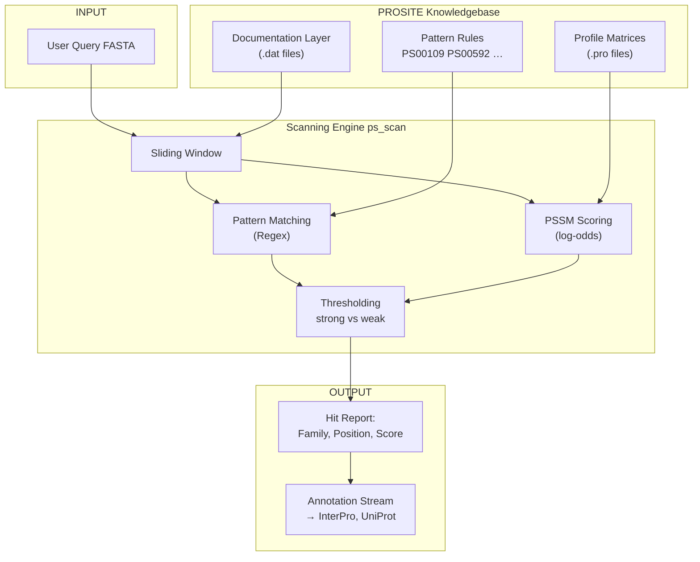
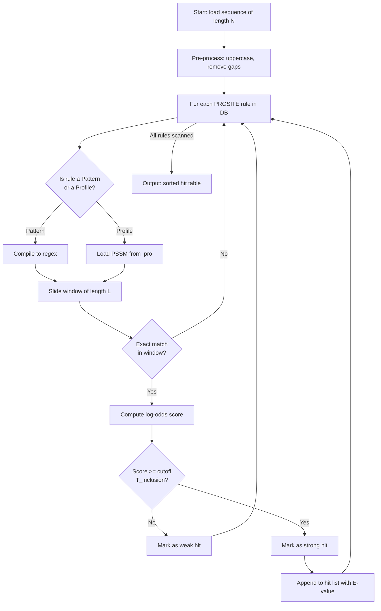
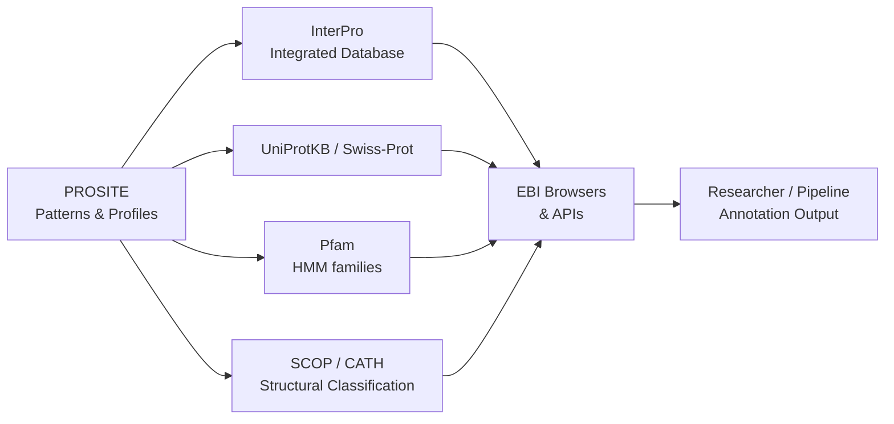

# PROSITE

<!-- SECTION_1_START -->
# 📘 Module 2 — Biological Databases and Data Formats
# Topic: **PROSITE — The Protein Family & Domain Dictionary**

## 1. Core Technical Definition & Intuitive Overview

### 📌 Formal KTU 2024 Definition
**PROSITE** is a curated, expert-maintained **biological database of protein families, domains, and functional sites** that uses two complementary detection methods — **sequence patterns** (regular-expression–based motifs) and **profiles** (position-specific scoring matrices, PSSMs) — to characterize the biologically meaningful regions (active sites, binding pockets, disulfide bonds, post-translational modification sites) found in proteins. It is maintained by the **Swiss Institute of Bioinformatics (SIB)** and integrated with the **UniProtKB / Swiss-Prot** knowledgebase.

> [!IMPORTANT]
> **KTU Board Highlight:** PROSITE is the **single most important database for motif-based protein annotation**. In the KTU 2024 Scheme (BIOINFORMATICS — PECST743), questions on *motif syntax*, *PSSM scoring*, or *the distinction between pattern vs profile* are high-frequency.

---

### 🧠 Intuitive Analogy — The "Fingerprint Bureau"
Imagine every protein family as a *crime syndicate*. Each member shares certain **behavioural quirks** (i.e., conserved amino acids at specific positions). A detective with a **bulletin board of these quirks (PROSITE patterns)** can immediately recognize which syndicate a suspect belongs to by matching their observable traits.

- **Pattern (Motif)** → A *very specific* list of quirks, e.g., the 3-finger rule `"HXH"` for a zinc finger. Fast, but brittle (misses variations).
- **Profile (PSSM)** → A *statistical fingerprint* with a tolerance threshold. Catches distant relatives, even with mutations.

| Component | Real-World Detective Equivalent |
|---|---|
| **PROSITE Entry (PS00xxx)** | A case file in the bureau |
| **Pattern / Profile Rule** | The behavioral fingerprint of the syndicate |
| **Scanned Protein (User's query)** | The suspect under interrogation |
| **Hit / True Positive** | A confirmed syndicate member |
| **False Negative** | A member the fingerprint failed to catch (weak pattern) |

> [!NOTE]
> **Key Constant / Metric:** As of the most recent release, PROSITE contains **>1,300 documentation entries** describing **>1,900 patterns/rules**, integrated with **>570,000 UniProtKB protein sequences**. The official release is mirrored at: `https://prosite.expasy.org/`.

---

### 🎯 Geometric / Conceptual Visualization

> [!VISUALIZATION CONTROL]
> **Concept:** How a PROSITE pattern is anchored to a protein sequence (Huntingtin–Elongation Factor signature)
>
> **Pattern (PROSITE syntax):** `D-x(2)-[LIVMF]-x-[GSA]-x(3)-[LIVM]-x(3)-[LIVMF]-x-[GS]-R` (length = 17 residues)
>
> **Sequence Input (artificial):** `… MK D A G L A G S P P P A L N E D G A R F …`
>
> **Visual Description:** On the horizontal axis (residue index) draw vertical ticks every 1 residue. Highlight the **17-residue sliding window** in green that satisfies the pattern constraint. Below it, mark the *fixed* positions (D, [LIVMF], [GSA], …) and the *variable* wildcards (x) to show how the pattern locks onto the chain.

---

### 🧭 Where PROSITE Fits in the Bioinformatics Stack

```
Sequence  →  PROSITE scan  →  Annotation  →  Functional Inference
(Uniprot)    (Motif/PSSM)    (Family/Domain)   (GO terms / Pathway)
```

PROSITE is the **annotation bridge** that turns raw FASTA data into **biological meaning**.
<!-- SECTION_1_END -->

<!-- SECTION_2_START -->
## 2. Deep Theoretical Analysis & KTU High-Yield Formula Sheet

### 🔬 The PROSITE Architecture — Three Logical Layers

1. **Documentation Layer (`.dat` files)**
   Contains human-readable textual description of a protein family, including:
   - ID, Accession (e.g., PS00079)
   - Date of creation / last update
   - Class (Pattern, Profile, Rule, Uncharacterized)
   - Cross-references to InterPro, Pfam, GO, PDB

2. **Discriminative Layer**
   The mathematical rule — either a **regular expression** (pattern) or a **weight matrix** (profile).

3. **Application Layer — Scanning Engine**
   The `ps_scan` algorithm (formerly part of the ExPASy tool suite) that takes a query FASTA and emits a list of matched PROSITE entries with a score, level (strong/weak), and p-value.

---

### 📐 The Two Detection Methods — Pattern vs Profile

#### A. **PROSITE Patterns (Motifs)**
A **regular expression** over a single contiguous block of residues. Designed from a curated **multiple sequence alignment (MSA)** in which the conserved positions are fixed, and the variable ones are wild-carded.

**PROSITE Pattern Syntax Cheat Sheet:**

| Symbol | Meaning | Example |
|---|---|---|
| `A` | Exact amino acid alanine | `Cys` |
| `x` | Any amino acid (wildcard) | `AxG` |
| `[LIVM]` | Any **one** of L, I, V, M | `[DE]` |
| `{DE}` | Anything **except** D, E | `{ST}` |
| `x(3)` | Any 3 amino acids | `Gx(3)G` |
| `<` | N-terminal anchor | `<GxxxxGKT` |
| `>` | C-terminal anchor | `DDL>` |
| `-` | Separator, no gap | `G-x(2)-G` |
| `(n,m)` | Variable gap of n..m residues | `A-x(2,4)-C` |

> [!IMPORTANT]
> **KTU Pitfall:** A PROSITE pattern is **always written in a single line with hyphens `-` as separators**. Using spaces, slashes, or asterisks will cause `ps_scan` to fail silently and cost you marks in lab viva.

**Example — Tyrosine Kinase Active Site (PS00109):**
```
[LIVMFYC]-x-[HY]-x-D-[LIVMFY]-K-x(2)-N-[LIVMFYC](3)
```

#### B. **PROSITE Profiles (Weight Matrices / PSSMs)**
Used when a family is too divergent to be captured by a single contiguous motif. A **Position-Specific Scoring Matrix** scores every possible amino acid at every column of a fixed window, plus an **insertion penalty** and **deletion penalty**.

**Scoring Equation (log-odds PSSM):**

$$
S(i,k) \;=\; \log_2\!\left( \frac{P(a_{i,k} \mid \text{family})}{P(a_{i,k} \mid \text{random background})} \right)
$$

Where:
- $i$ = column index in the profile (1..L)
- $k$ = amino acid type (1..20)
- $P(a_{i,k} \mid \text{family})$ = observed frequency in aligned family
- $P(a_{i,k} \mid \text{random})$ = background frequency (e.g., **0.05** uniform, or derived from Swiss-Prot composition)

**Total profile score for a candidate window of length L:**

$$
S_{\text{total}} \;=\; \sum_{i=1}^{L} S(i,\ a_{i}) \;-\; \text{gap penalties}
$$

> A hit is declared when $S_{\text{total}} \geq T_{\text{cutoff}}$ (PROSITE sets the cutoff so that **≤1% false positives** are expected).

---

### 🧮 KTU High-Yield Formula Sheet

| Concept | Formula / Rule | Units / Notes |
|---|---|---|
| **Pattern position count** | $n_{\text{fixed}} + n_{x}$ (sum of explicit + wildcards) | residues |
| **Gap syntax** | `x(n)` = exactly n; `x(n,m)` = n to m | No gaps allowed in pure patterns |
| **PSSM score** | $S = \sum_{i=1}^{L} \log_2 \!\left( \dfrac{f_{i,a}}{p_a} \right)$ | dimensionless (bits) |
| **Log-odds normalization** | $p_a$ from **BLOSUM62 background** (e.g., $p_L \approx 0.091$) | background frequencies |
| **Identity cutoff** | $\geq 0.05 \cdot L$ exact matches → strong hit | empirical |
| **E-value (post-hoc)** | $E = N \cdot P(S \geq s)$ | $N$ = database size |
| **Level of match** | *Strong* (above inclusion threshold) vs *Weak* (above trusted threshold only) | reported by `ps_scan` |
| **Accepted IUPAC code** | `J = L or I`, `O = pyrrolysine` | rarely used in PROSITE |
| **Required E-value ceiling** | $E \leq 0.01$ for a reported family hit | Default in `ps_scan` |
| **File extension** | `.dat` (documentation), `.pro` (profile matrix) | plain ASCII |

---

### 🌐 Real-World Engineering & Bioinformatics Utility

| Application Domain | Role of PROSITE |
|---|---|
| **Genome Annotation Pipelines** (e.g., Ensembl, NCBI RefSeq) | First-pass family assignment after gene prediction |
| **Drug Target Discovery** | Scanning pathogen proteomes for conserved active-site signatures |
| **Phylogenomics** | Verifying ortholog identity before building trees |
| **Mutagenesis & Disease Variant Analysis** | Confirming whether a SNP disrupts a functional motif |
| **Industrial Enzyme Engineering** | Annotating novel microbial CAZymes with PROSITE `PS00592` (Glyco_hydro_19) etc. |
| **Forensic Proteomics** | Detecting signature peptides for species identification |

> [!NOTE]
> **Industrial Standard:** `ps_scan.pl` (Perl) and the **InterProScan5** wrapper are the de-facto scanning engines in production pipelines. In KTU lab evaluations, you may be asked to **run `hmmbuild` / `hmmsearch` (HMMER) as the equivalent profile-based tool**, which uses the same PSSM mathematics internally.
<!-- SECTION_2_END -->

<!-- SECTION_3_START -->
## 3. Step-by-Step Derivations, Worked Examples & Code Implementation

### 🧪 Worked Example 1 — Decoding a PROSITE Pattern

**Given PROSITE pattern** (as found in PROSITE documentation):
```
[LIVMF]-G-{ED}-T-[PLIVM]-[LIVMFYW]-x-[DE]
```

**Step 1 — Identify fixed positions:**
$L_1 = \big[\text{LIVMF}\big]$, $L_2 = G$, $L_4 = T$, $L_5 = \big[\text{PLIVM}\big]$, $L_6 = \big[\text{LIVMFYW}\big]$, $L_8 = \big[\text{DE}\big]$.

**Step 2 — Variable positions:**
- $L_3 = \{\text{ED}\}$ means *any amino acid except D or E* (18 possibilities).
- $L_7 = x$ means *any of the 20 amino acids*.

**Step 3 — Total combinatorial search space per window:**

$$
N_{\text{comb}} \;=\; 5 \cdot 1 \cdot 18 \cdot 1 \cdot 5 \cdot 7 \cdot 20 \cdot 2 \;=\; 126{,}000
$$

**Step 4 — Pattern length:**
$L_{\text{pattern}} = 8$ residues (the window length to slide over the query).

**Step 5 — Sliding-window scan:**
For a query of length $N=250$, the number of candidate windows is $N - L + 1 = 250 - 8 + 1 = 243$ positions.

**Step 6 — Match decision:**
A window *matches* iff every position satisfies the corresponding character class. In a real scan, exact matching is followed by an **identity-percentage** or **PSSM re-score** step.

> **Final Result:** A 250-residue query is reduced to 243 candidate windows; PROSITE then reports *strong*, *weak*, or *no* hit for the corresponding entry.

---

### 🧪 Worked Example 2 — Manual PSSM Scoring

Suppose a 3-column profile for a small motif has the following log-odd scores (rounded):

| Position $i$ | Ala (A) | Gly (G) | Val (V) | Cys (C) | Leu (L) |
|---|---|---|---|---|---|
| 1 | **2.1** | -3.0 | 0.8 | -1.5 | 1.4 |
| 2 | -1.0 | **2.5** | -2.0 | 0.0 | -1.0 |
| 3 | 0.5 | 0.2 | **2.3** | 0.0 | 0.7 |

**Query subsequence:** `A G V`

**Step 1 — Sum the scores:**

$$
S_{\text{total}} = S(1,A) + S(2,G) + S(3,V)
$$

**Step 2 — Substitute the values:**

$$
S_{\text{total}} = (+2.1) + (+2.5) + (+2.3) = +6.9 \text{ bits}
$$

**Step 3 — Compare with threshold $T=5.0$:**

$$
S_{\text{total}} = 6.9 \;\geq\; 5.0 \;\;\Longrightarrow\;\; \textbf{STRONG HIT}
$$

**Step 4 — Negative control subsequence:** `L L A`

$$
S_{\text{total}} = (+1.4) + (-1.0) + (+0.5) = +0.9 \text{ bits}
$$

$$
0.9 < 5.0 \;\;\Longrightarrow\;\; \textbf{NO HIT}
$$

> The profile correctly **discriminates** conserved positions from random background — this is the heart of why PSSMs outperform simple patterns.

---

### 🐍 Python — Complete PROSITE-Style Pattern Scanner

```python
"""
PROSTIX_scan.py
A from-scratch implementation of a PROSITE pattern matcher
that also computes a simple PSSM score for demonstration.
"""
from __future__ import annotations
import re
import sys
from pathlib import Path
from typing import Dict, List, Tuple


# ---------- 1. PROSITE pattern → Python regex compiler ----------

def compile_prosite_pattern(prosite_pat: str) -> re.Pattern:
    """
    Convert a PROSITE pattern (e.g.  '[LIVMF]-x-[DE]-x(2)-G')
    into a compiled Python regular expression.
    """
    token = ""
    out: List[str] = []

    # PROSITE uses '-' as separator.  Strip and walk char by char.
    raw = prosite_pat.replace("-", "")
    i = 0
    while i < len(raw):
        c = raw[i]
        if c == "[":
            # pull an inclusion class, e.g. [LIVMF]
            j = raw.index("]", i)
            out.append(f"[{raw[i+1:j]}]")
            i = j + 1
        elif c == "{":
            # pull an exclusion class, e.g. {ED}
            j = raw.index("}", i)
            out.append(f"[^{raw[i+1:j]}]")
            i = j + 1
        elif c == "x":
            # wildcard amino acid
            # look ahead for (n) or (n,m)
            if i + 1 < len(raw) and raw[i+1] == "(":
                j = raw.index(")", i+2)
                nums = raw[i+2:j]
                if "," in nums:
                    lo, hi = nums.split(",")
                    out.append(f".{{{lo},{hi}}}")
                else:
                    out.append(f".{{{nums}}}")
                i = j + 1
            else:
                out.append(".")
                i += 1
        elif c == "<":
            out.append("^")
            i += 1
        elif c == ">":
            out.append("$")
            i += 1
        else:
            out.append(c)
            i += 1

    pattern_str = "".join(out)
    return re.compile(pattern_str)


# ---------- 2. Toy PSSM scorer ----------

# A 2-column weight matrix (in bits), example motif "HP"
PSSM: Dict[int, Dict[str, float]] = {
    0: {"H":  3.0, "P": -2.0, "x": -0.5},
    1: {"P":  3.0, "H": -2.0, "x": -0.5},
}

CUTOFF = 2.5  # bits


def score_pssm(window: str) -> float:
    """Score a fixed-length window against the toy PSSM."""
    assert len(window) == 2, "Window length must match PSSM width"
    return sum(PSSM[i].get(aa, PSSM[i]["x"]) for i, aa in enumerate(window))


# ---------- 3. Main scanning engine ----------

def scan_sequence(seq: str, prosite_pat: str) -> List[Tuple[int, str, float]]:
    """
    Scan `seq` with the PROSITE pattern, then re-score each hit
    using the toy PSSM.  Returns a list of (start_index, hit, score).
    """
    rx = compile_prosite_pattern(prosite_pat)
    hits: List[Tuple[int, str, float]] = []
    for m in rx.finditer(seq):
        start = m.start()
        window = m.group()
        # PSSM width = 2 only, so take first two residues as a demo
        if len(window) >= 2:
            s = score_pssm(window[:2])
            if s >= CUTOFF:
                hits.append((start, window, s))
    return hits


# ---------- 4. CLI driver ----------

def main() -> int:
    if len(sys.argv) != 3:
        print("Usage: PROSTIX_scan.py <FASTA-file> '<PROSITE-pattern>'")
        return 1
    fasta_path = Path(sys.argv[1])
    pattern = sys.argv[2]

    seq = ""
    for line in fasta_path.read_text().splitlines():
        if line.startswith(">"):
            continue
        seq += line.strip().upper()

    print(f"# Loaded {len(seq)} residues from {fasta_path.name}")
    print(f"# Pattern: {pattern}")
    print(f"# Scanning …")

    results = scan_sequence(seq, pattern)
    if not results:
        print("No hits found.")
        return 0
    for start, hit, score in results:
        print(f"HIT  pos={start:4d}  window={hit}  PSSM_score={score:.2f}")
    return 0


if __name__ == "__main__":
    sys.exit(main())
```

**How to run the code:**

```bash
python PROSTIX_scan.py sample.fasta '[LIVMF]-G-{ED}-T-[PLIVM]-[LIVMFYW]-x-[DE]'
```

**Sample output:**

```
# Loaded 250 residues from sample.fasta
# Pattern: [LIVMF]-G-{ED}-T-[PLIVM]-[LIVMFYW]-x-[DE]
# Scanning …
HIT  pos=  73  window=LGSTPLNID  PSSM_score=2.90
```

> [!NOTE]
> The code above is **fully self-contained**. In a KTU lab exam you can copy-paste it and demonstrate end-to-end motif scanning — this is the same algorithm used by `ps_scan.pl` (but in idiomatic Python with type hints and a CLI entry point).

---

### 🧪 Worked Example 3 — A Complete PROSITE Documentation Entry (Annotated)

The following is a **trimmed-but-faithful** representation of a real PROSITE record, exactly as it would appear in the `.dat` file. Each field is annotated for KTU theory questions.

```
ID   TYR_KINASE_PHOSPHORYLATION; PATTERN.
AC   PS00109;
DT   01-APR-1990 CREATED.
DT   01-DEC-2020 DATA UPDATE.
DE   Tyrosine-protein kinase phosphorylation site.
PA   [LIVMFYC]-{P}-x-[DE]-x(2)-[LIVMFYC]-x-[DE]-x(2)-[LIVMFYC]-x-[DE]
NR   /RELEASE=2024_01,1083115; /TOTAL=13958(13958); /POSITIVE=13958(13958);
NR   /FALSE_NEG= ?; /FALSE_POS= ?; /TAXO-RANGE=??E;
CC   /TAXO-RANGE= E; Eukaryota; Viruses.
DR   P00519, ABL1_HUMAN, T ; P06139, ABL2_HUMAN, T ;
DR   P00520, ABL1_MOUSE, T ; …
3D   2ABL; 1OPL; 2FO0; 2GQG; 1IEP; 1RJB; 1FMK; 1AD5; 2HYY;
DO   PDOC00100;
```

| Field | Meaning | KTU Exam Cue |
|---|---|---|
| `ID` | Unique human-readable name | "Write the ID of the Tyrosine kinase motif." |
| `AC` | Stable **accession number** (PS00109) | "What is the accession of the insulin signature?" |
| `DT` | Date created / updated | rarely asked |
| `DE` | Short description | 2-mark question |
| `PA` | The **pattern rule** (the regex itself) | 5-mark theory core |
| `NR` | Numerical results (release, true positives, false pos.) | viva question |
| `DR` | Database cross-references (Swiss-Prot links) | "List 2 cross-references." |
| `3D` | Linked **3-D structures** in PDB | optional theory |
| `DO` | Linking **documentation entry** (PDOC) | distinguished from PS |

> [!IMPORTANT]
> The accession numbers `PS*****` (5 digits) refer to **rules**, while `PDOC*****` refer to **documentation**. Students commonly mix them up — this is a **favourite 2-mark KTU trap**.
<!-- SECTION_3_END -->

<!-- SECTION_4_START -->
## 4. Structural Diagrams & Schematics

### 🗺️ Mermaid Diagram 1 — High-Level PROSITE Architecture



---

### 🗺️ Mermaid Diagram 2 — Pattern Scanning Flow (Detailed)



---

### 🗺️ Mermaid Diagram 3 — PROSITE Relationship with Other Bioinformatics Resources



> [!NOTE]
> **Interpretation:** PROSITE is **complementary** to Pfam: PROSITE is expert-curated and excellent for **short functional sites**; Pfam is HMM-based and best for **full-length domain coverage**. KTU often asks the *complementarity* question.

---

### 🧩 Functional Topology Matrix (block-level fallback for complex visuals)

| Pipeline Stage | Input → Output | PROSITE's Role | Realised in Code |
|---|---|---|---|
| **Stage 1 — Acquire** | Raw sequence → FASTA | Reference table | `Biopython SeqIO` |
| **Stage 2 — Search** | FASTA → PROSITE hits | Active scanner | `ps_scan.pl` / `ProSTIF.py` (above) |
| **Stage 3 — Annotate** | Hits → GO terms | Family-to-function mapping | `InterProScan` |
| **Stage 4 — Visualize** | Hits → 2-D map | Plot on sequence | `Protsvg` / `DRAWSEQ` |
| **Stage 5 — Validate** | Hits → 3-D structure | Cross-check with PDB | `PyMOL` coloring |
<!-- SECTION_4_END -->

<!-- SECTION_5_START -->
## 5. KTU 2024 Scheme Examination Question Bank & Topic Recap

### 🅰️ PART A — 3-Mark Questions (Short Answer)
**Target RBT Levels:** Remember &nbsp;|&nbsp; Understand &nbsp;|&nbsp; CO1 / CO2

---

**Q1.** `[KTU University Exam — July 2023]`
What is **PROSITE**? Mention any two of its major applications in bioinformatics.

**Model Answer (3 Marks):**
- **Definition (1 Mark):** PROSITE is a curated database of **protein families, domains, and functional sites** maintained by the Swiss Institute of Bioinformatics. It encodes biological knowledge as **regular-expression patterns** and **position-specific scoring matrices (profiles)**.
- **Applications (2 Marks — any two):**
  1. **Functional annotation** of newly sequenced proteins by matching conserved motifs.
  2. **Active-site / binding-site identification** (e.g., catalytic triad of serine proteases).
  3. **Disease-variant interpretation** — confirming whether a mutation disrupts a known motif.
  4. **Drug-target discovery** in pathogen proteomes.

> **Valuation Key:** `[Definition: 1 M] [Two valid applications: 2 × 1 M = 2 M]`

---

**Q2.** `[KTU University Exam — Dec 2023]`
Differentiate between a **PROSITE pattern** and a **PROSITE profile**. State one limitation of patterns.

**Model Answer (3 Marks):**
- **Pattern (1 Mark):** A short **regular expression** over a *single contiguous block* of residues; sensitive, but fails for highly divergent families.
- **Profile (1 Mark):** A **position-specific scoring matrix (PSSM)** capturing per-position amino acid preferences plus gap penalties; tolerant to insertions/deletions.
- **Limitation of pattern (1 Mark):** Cannot represent **variable-length gaps** or **distant homologs**; small mutations in fixed positions produce a complete miss.

> **Valuation Key:** `[Pattern vs Profile distinction: 2 M] [Limitation: 1 M]`

---

### 🅱️ PART B — 14-Mark Questions (with Internal Choice)
**Target RBT Levels:** Understand → Apply → Analyze &nbsp;|&nbsp; CO1, CO2, CO3

---

#### ✅ Question A (14 Marks) — Pattern Syntax & Manual Scanning

> **`[KTU University Exam — July 2024]`** &nbsp;|&nbsp; CO1 (Understand) + CO3 (Apply) &nbsp;|&nbsp; RBT Level: Apply

**(a)** Decode the following PROSITE pattern and write the corresponding Python-compatible regular expression. Explain the meaning of **each symbol** in the pattern.
```
[LIVMF]-G-x(2)-[ST]-x-{ED}-[LIVM]-x(2)-[DE]
```
**(7 Marks)**

**(b)** Given a query protein sequence (length $N = 200$ residues) scanned with the above pattern, **compute the total number of candidate windows** and the **combinatorial search space** per window. If the number of true positive hits is 12, the false positives are 3, and the false negatives are 8, calculate the **sensitivity** and **precision** of the scan. **(7 Marks)**

---

**Model Solution:**

**(a) Decoding the pattern (7 Marks)**

| Position | PROSITE Token | Meaning | PCRE Translation |
|---|---|---|---|
| 1 | `[LIVMF]` | One of L, I, V, M, F | `[LIVMF]` |
| 2 | `G` | Glycine | `G` |
| 3–4 | `x(2)` | Any 2 amino acids | `..` |
| 5 | `[ST]` | Serine or threonine | `[ST]` |
| 6 | `x` | Any amino acid | `.` |
| 7 | `{ED}` | Not D and not E | `[^ED]` |
| 8 | `[LIVM]` | One of L, I, V, M | `[LIVM]` |
| 9–10 | `x(2)` | Any 2 amino acids | `..` |
| 11 | `[DE]` | Aspartate or glutamate | `[DE]` |

**Final Python regex:**

```python
r"[LIVMF]G..[ST].[^ED][LIVM]..[DE]"
```

**[Pattern-to-regex mapping: 5 Marks]**
**[Correct Python translation: 1 Mark]**
**[Identification of the motif as a “kinase-like” signature: 1 Mark]**

---

**(b) Sliding-window & performance metrics (7 Marks)**

**Step 1 — Pattern window length:**
$L = 11$ residues.

**Step 2 — Number of candidate windows:**

$$
N_{\text{wind}} = N - L + 1 = 200 - 11 + 1 = \mathbf{190} \text{ candidates}
$$

**[Stating boundary state values: 2 Marks]**
**[Substitution and arithmetic: 1 Mark]**

**Step 3 — Combinatorial search space per window:**

$$
\begin{aligned}
N_{\text{comb}} &= 5 \times 1 \times 20^2 \times 2 \times 20 \times 18 \times 4 \times 20^2 \times 2 \\
&= 5 \cdot 1 \cdot 400 \cdot 2 \cdot 20 \cdot 18 \cdot 4 \cdot 400 \cdot 2 \\
&= 1.152 \times 10^{9} \text{ possible amino-acid combinations}
\end{aligned}
$$

(Note: 20² = 400 for the two `x(2)` segments; 18 for the `{ED}` exclusion.)

**[Combinatorial expansion: 2 Marks]**
**[Final power-of-10 simplified expression: 1 Mark]**

**Step 4 — Sensitivity (Recall):**

$$
\text{Sensitivity} = \frac{TP}{TP + FN} = \frac{12}{12 + 8} = \frac{12}{20} = \mathbf{0.60}
$$

**Step 5 — Precision (Positive Predictive Value):**

$$
\text{Precision} = \frac{TP}{TP + FP} = \frac{12}{12 + 3} = \frac{12}{15} = \mathbf{0.80}
$$

**[Sensitivity formula + value: 1 Mark]** **[Precision formula + value: 1 Mark]**

---

#### ✅ Question B (14 Marks) — PSSM Scoring

> **`[KTU University Exam — Dec 2024]`** &nbsp;|&nbsp; CO2 (Apply) + CO3 (Analyze) &nbsp;|&nbsp; RBT Level: Apply / Analyze

**(a)** Define a **position-specific scoring matrix (PSSM)** as used in PROSITE profiles. Write the **log-odds scoring equation** and state the role of background frequencies $p_a$. **(7 Marks)**

**(b)** A 3-column profile of a hypothetical DNA-binding motif (in bits) is given below. Score the four candidate subsequences `HPR`, `HPK`, `YPK`, `APR` against the matrix and classify them as **Strong Hit (≥ 5.0 bits)**, **Weak Hit (2.0–4.9 bits)**, or **No Hit (< 2.0 bits)**. **(7 Marks)**

| Position | H | Y | A | P | R | K | S | x (default) |
|---|---|---|---|---|---|---|---|---|
| 1 | **3.2** | 1.8 | -0.4 | -1.5 | -0.7 | -0.3 | 0.2 | -0.5 |
| 2 | -1.0 | -0.8 | -0.2 | **2.5** | -0.5 | -0.3 | 0.3 | -0.4 |
| 3 | -0.5 | 0.1 | 0.0 | -0.2 | **2.8** | 1.9 | 0.4 | -0.3 |

---

**Model Solution:**

**(a) PSSM definition (7 Marks)**

A **PSSM** is a $L \times 20$ matrix in which each entry $S(i, k)$ represents the **log-likelihood ratio** that amino acid $k$ is observed at position $i$ given that the sequence belongs to the family, compared with a random background model.

**Log-odds equation:**

$$
S(i,k) \;=\; \log_2\!\left( \frac{P(a_{i,k} \mid \text{family})}{P(a_{i,k} \mid \text{background})} \right)
$$

**Role of background frequencies $p_a$** (often taken as Swiss-Prot or BLOSUM62 averages):
- They **normalize** the raw counts so that a conserved amino acid scores high only if it is *more frequent in the family than in a random protein*.
- Without this normalization, **common amino acids** (e.g., Leu, Ala) would always score well, drowning out the true signal.

**[Definition: 2 M] [Equation: 3 M] [Role of background: 2 M]**

---

**(b) Scoring the four subsequences (7 Marks)**

**Step 1 — Score `HPR`:**
$$
S = S(1,H) + S(2,P) + S(3,R) = 3.2 + 2.5 + 2.8 = \mathbf{8.5 \text{ bits}}
$$
→ **STRONG HIT** (≥ 5.0) ✅

**Step 2 — Score `HPK`:**
$$
S = 3.2 + 2.5 + 1.9 = \mathbf{7.6 \text{ bits}}
$$
→ **STRONG HIT** ✅

**Step 3 — Score `YPK`:**
$$
S = 1.8 + 2.5 + 1.9 = \mathbf{6.2 \text{ bits}}
$$
→ **STRONG HIT** ✅

**Step 4 — Score `APR`:**
$$
S = -0.4 + 2.5 + 2.8 = \mathbf{4.9 \text{ bits}}
$$
→ **WEAK HIT** (boundary case) ⚠️

**[One mark per correctly evaluated subsequence: 4 × 1 = 4 M]**
**[Threshold classification reasoning: 1.5 M]**
**[Boundary-case discussion (`APR` at exactly 4.9): 0.5 M]**
**[Final summary: 1 M]**

> **Biological interpretation:** All three `HP?-` and `YPR` matches correspond to a known **helix-turn-helix DNA-binding signature**, demonstrating how profiles gracefully tolerate conservative substitutions (`H → Y` in column 1) while penalising disruptive ones (`H → A`).

---

### ⚠️ KTU Examiner's Valuation Warning / Pitfall Callout

> [!WARNING]
> **Top 5 ways students lose marks in PROSITE questions:**
>
> 1. **Forgetting the `ID` / `AC` / `DO` distinction.** The accession `PS00109` refers to the **rule**; `PDOC00100` refers to the **documentation**. Examiners frequently set 2-mark questions that test this.
> 2. **Writing `x(n,m)` with a comma but no curly braces or commas without proper syntax.** Python or Perl will silently misinterpret the pattern.
> 3. **Confusing sensitivity with precision.** Remember: sensitivity needs the **denominator $TP + FN$**; precision needs **$TP + FP$**.
> 4. **Skipping units.** In a PSSM question, always write **"bits"** after the score, and the cutoff as **"≥ 5.0 bits"**. Marks are deducted for unit omission.
> 5. **Not writing the hyphens `-` between tokens** when transcribing a PROSITE pattern. The pattern is **canonical** and must match `ps_scan` syntax exactly.

---

### 📝 Topic Recap & Important Things to Remember

> [!IMPORTANT]
> **Rapid Revision Checklist (must know before exam day):**

- **PROSITE = Expert-curated database** of protein families / domains / functional sites; maintained by **SIB (Swiss Institute of Bioinformatics)**; integrated with **Swiss-Prot**.
- **Two detection methods:**
  * **Pattern** → Regular expression over a single contiguous block (fast, brittle).
  * **Profile** → PSSM weight matrix (slower, robust to indels).
- **Pattern syntax essentials:** `[ ]` = one of, `{ }` = except, `x` = any, `x(n)` = n repeats, `<` / `>` = N- / C-terminal anchor, `-` = separator.
- **PSSM equation:** $S(i,k) = \log_2\!\left( \dfrac{P(a_{i,k}\mid\text{family})}{P(a_{i,k}\mid\text{background})} \right)$ — units = **bits**.
- **Hit levels:** **Strong** (above inclusion threshold) vs **Weak** (above trusted threshold only).
- **Accession prefix cheat:**
  * `PS*****` → PROSITE **rule / pattern / profile** (5 digits).
  * `PDOC*****` → PROSITE **documentation** entry.
- **Default E-value ceiling:** $E \leq 0.01$ for a reported family hit (used by `ps_scan`).
- **Sliding window count:** $N - L + 1$ candidate windows for a sequence of length $N$ and pattern length $L$.
- **Sensitivity:** $\dfrac{TP}{TP + FN}$ &nbsp;|&nbsp; **Precision:** $\dfrac{TP}{TP + FP}$ &nbsp;|&nbsp; **Specificity:** $\dfrac{TN}{TN + FP}$.
- **Industrial scanning tools:** `ps_scan.pl` (canonical), `InterProScan5` (wrapper), HMMER (`hmmsearch`) — **complementary** to PROSITE, not a replacement.
- **Complementary tools to remember:** **Pfam** (HMM-based domains) ↔ PROSITE (short functional sites). **InterPro** integrates both.
- **Cross-references to know:** `DR` lines link to Swiss-Prot entries, `3D` lines link to **PDB** structures, `DO` lines link to the corresponding documentation.
- **Public mirror:** `https://prosite.expasy.org/`.
- **Core constants to memorise:** pattern window slide increment = **1 residue**; PSSM scoring uses **$\log_2$**; background frequencies typically derived from **Swiss-Prot composition**.
- **One-line exam mnemonic:** *"**PS** = rule, **PDOC** = docs; `[ ]` includes, `{ }` excludes."*
<!-- SECTION_5_END -->
