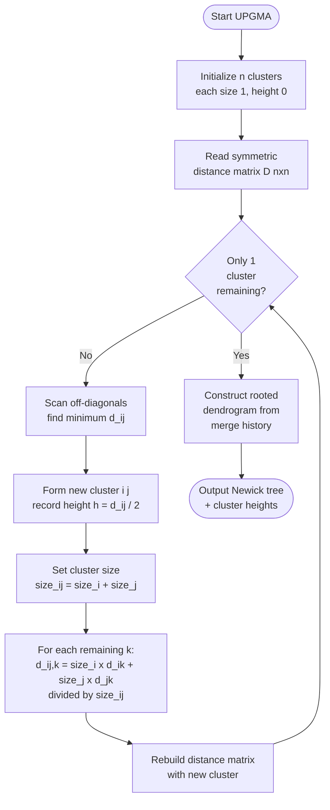
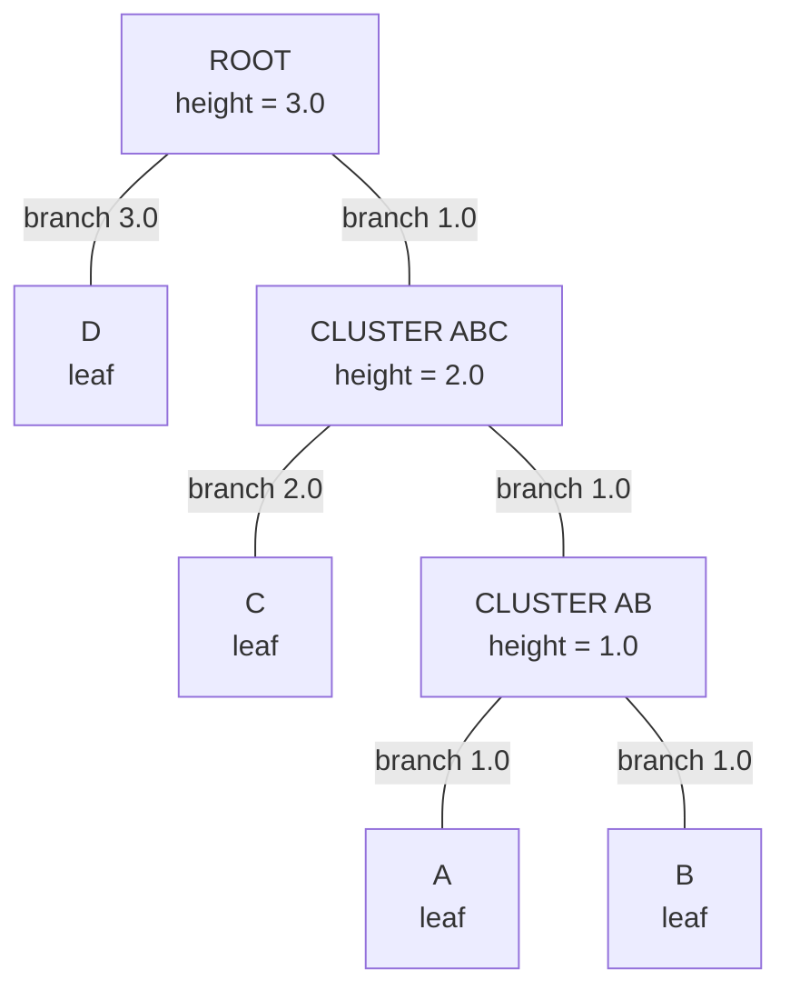

# UPGMA

<!-- SECTION_1_START -->
# UPGMA — Unweighted Pair Group Method with Arithmetic Mean

## 1.1 Formal Academic Definition (KTU 2024 Syllabus Terminology)

> [!NOTE]
> **UPGMA (Unweighted Pair Group Method with Arithmetic Mean)** is a simple, bottom-up (*agglomerative*) hierarchical clustering algorithm used in bioinformatics to construct a **rooted phylogenetic tree** (a *dendrogram*) from a symmetric matrix of pairwise distances between biological sequences (e.g., DNA, RNA, or protein sequences).

The algorithm operates on the principle of **successive clustering**: at each iterative step, the two taxa (or clusters) with the **smallest pairwise distance** in the current distance matrix are merged into a single new composite cluster. The branch length from the merge node to each child is set to **half** the distance between the two merged clusters, and the distance matrix is updated using the **arithmetic mean** of the distances from the new cluster to all remaining clusters.

A defining feature of UPGMA is the assumption of the **Ultrametric Property** (Molecular Clock Hypothesis): all leaf nodes (extant taxa) are equidistant from the root of the tree, implying that all lineages have evolved at a **constant rate**.

## 1.2 Conceptual Analogy & Intuitive Overview

> [!IMPORTANT]
> **Real-World Analogy — The "Family Reunion Seating" Problem**

Imagine 6 relatives at a family reunion. You have a "closeness score" between every pair (lower = more similar, like genetic distance).

- **Step 1 (Bottom-Up):** You seat the two most similar relatives together (smallest score).
- **Step 2:** You treat this newly formed pair as a single "super-relative" and recompute their average closeness to everyone else.
- **Step 3:** Again, you merge the two closest clusters, recording *when* (at what "height" on a vertical timeline) this union happened.
- **Repeat** until everyone is in one big family.

When you draw this process, vertical axis = time of merging (divergence time), horizontal axis = the taxa. The result is a **dendrogram** — a tree where branch lengths are proportional to evolutionary distance.

> **Plain-English Summary:** UPGMA is the algorithmic equivalent of repeatedly saying *"these two are most alike, let's group them, then recalculate averages, and repeat."*

## 1.3 Key Constants, Parameters & Metrics

- **Pairwise Distance $d_{ij}$** — Numerical measure of dissimilarity between taxa $i$ and $j$ (e.g., $p$-distance, $Jukes\text{-}Cantor$ corrected distance, $k$-mer distance).
- **Cluster Height $h_c$** — The level at which a cluster $c$ is formed; $h_c = \dfrac{d_{ij}}{2}$ where $d_{ij}$ is the minimum distance at the merge step.
- **Average-Linkage Criterion** — The defining formula (see Section 2).
- **Molecular Clock Rate $\mu$** — Assumed **constant** in UPGMA.
- **Time Unit** — Arbitrary; typically measured in **substitutions per site** unless calibrated.

> [!VISUALIZATION CONTROL]
> **Concept:** Visualizing UPGMA Dendrogram Heights
> **GeoGebra / Desmos Input Equations (tree heights as points):**
> - `P1 = (1, 0)`, `P2 = (2, 0)`, `P3 = (3, 0)`, `P4 = (4, 0)` — leaf taxa at height $0$
> - `M1 = (1.5, 1)` — merge node of taxa 1 and 2 at height $1$
> - `M2 = (2, 2)` — merge node joining cluster $\{(1,2)\}$ with taxon 3 at height $2$
> - `Root = (3, 3)` — final merge with taxon 4 at height $3$
> **Visual Description:** A rooted binary tree rising vertically. All leaves (taxa) lie on the horizontal line $y=0$, and internal nodes ascend in steps. Notice that *every* leaf is at the same vertical distance from the root — this is the ultrametric property.

<!-- SECTION_1_END -->

<!-- SECTION_2_START -->
# Deep Theoretical Analysis & KTU High-Yield Formula Sheet

## 2.1 Algorithmic Logic — Step-by-Step Breakdown

The UPGMA algorithm follows a strict iterative workflow:

1. **Initialization**
   - Input: A symmetric distance matrix $D = [d_{ij}]$ of size $n \times n$, where $n$ is the number of taxa.
   - Each taxon is its own cluster of size 1.
   - Set the current number of clusters $k = n$.

2. **Find Minimum Distance Pair**
   - Scan the off-diagonal entries of $D$ and identify the pair of clusters $(i, j)$ that minimize $d_{ij}$.

3. **Merge Clusters**
   - Form a new cluster $(i,j)$ with cluster height:
   
   $$h_{(i,j)} = \frac{d_{ij}}{2}$$
   
   - This is the standard UPGMA convention: the height represents half the distance between the two merged clusters, under the molecular clock assumption.

4. **Update the Distance Matrix**
   - For every remaining cluster $k$, update its distance to the new cluster $(i,j)$ using the **arithmetic mean**:
   
   $$d_{(i,j),k} = \frac{|i| \cdot d_{i,k} + |j| \cdot d_{j,k}}{|i| + |j|}$$
   
   - Since UPGMA uses *unweighted* means and all original taxa are size 1, in the first iteration $|i| = |j| = 1$, simplifying to:
   
   $$d_{(i,j),k} = \frac{d_{i,k} + d_{j,k}}{2}$$
   
   - For subsequent merges, the sizes $|i|$ and $|j|$ are the number of original taxa in each cluster, so the formula remains the weighted arithmetic mean.

5. **Repeat** steps 2–4 until only one cluster remains (the root of the tree).

6. **Output**: A rooted dendrogram with branch lengths equal to cluster heights.

## 2.2 The 'Why' Behind Each Step

- **Why find the minimum?** The two most similar taxa are most likely to share a recent common ancestor.
- **Why use $d_{ij}/2$ for the height?** Under the molecular clock, the distance between two taxa equals twice the time since their divergence from their most recent common ancestor (MRCA), so the height of the MRCA is $d_{ij}/2$.
- **Why arithmetic mean?** UPGMA is *unweighted* — every original taxon contributes equally to the cluster's average distance, regardless of which sub-cluster it belongs to (this distinguishes it from WPGMA, which uses weighted means).

## 2.3 KTU Formula Sheet / Cheat Sheet

| **Symbol / Formula** | **Meaning** | **When Used** |
|---|---|---|
| $d_{ij}$ | Pairwise distance between clusters $i$ and $j$ | Read from input matrix |
| $h_{c} = d_{ij}/2$ | Height of the new cluster $c$ formed by merging $i$ and $j$ | After every merge |
| $d_{(i,j),k} = \dfrac{d_{i,k} + d_{j,k}}{2}$ | Average distance update (first iteration) | Updating matrix after first merge |
| $d_{(i,j),k} = \dfrac{\vert i \vert \cdot d_{i,k} + \vert j \vert \cdot d_{j,k}}{\vert i \vert + \vert j \vert}$ | Weighted arithmetic mean update (general) | All subsequent merges |
| $\vert c \vert$ | Number of original taxa in cluster $c$ | Used in weighted mean |
| $t_{MRCA}(i,j) = d_{ij} / (2\mu)$ | Divergence time (with clock rate $\mu$) | Calibration step |
| Ultrametric condition: $d_{i,j} \le \max(d_{i,k}, d_{j,k})$ | Tree property enforced by UPGMA | Verification of input |

> [!IMPORTANT]
> **Engineering Utility:** UPGMA is the foundational algorithm used in **sequence alignment clustering**, **microbiome taxonomy profiling** (e.g., OTU clustering at 97% similarity), **hierarchical gene expression analysis** in transcriptomics, and **primer design** for conserved regions. It is computationally cheap ($O(n^3)$ naive, $O(n^2)$ with heap optimization), making it suitable for moderately large datasets where NJ or maximum likelihood would be overkill.

## 2.4 Assumptions and Properties of UPGMA

| **Property** | **Description** | **Engineering Implication** |
|---|---|---|
| **Ultrametricity** | All leaves are equidistant from the root | Forces a molecular clock — a strong assumption |
| **Rooted Output** | Tree has an explicit root | Useful for ancestor inference, less so for non-clock data |
| **No Tied Distances** | Assumes unique minimum in each step (ties broken arbitrarily) | Sensitivity to tie-breaking order |
| **Reversibility** | Two taxa grouped early will never be split | Hierarchical, monotonic clustering |
| **Time Complexity** | $O(n^3)$ naive / $O(n^2 \log n)$ heap-based | Scales to thousands of taxa on standard workstations |

<!-- SECTION_2_END -->

<!-- SECTION_3_START -->
# Step-by-Step Derivations & Code Implementation

## 3.1 Exhaustive Worked Example — UPGMA on 4 Taxa

### 3.1.1 Input Distance Matrix

Consider four taxa $A$, $B$, $C$, $D$ with the following pairwise distances (e.g., $p$-distances from aligned sequences):

$$
D^{(0)} = \begin{array}{c|cccc}
 & A & B & C & D \\
\hline
A & 0 & 2 & 4 & 6 \\
B & 2 & 0 & 4 & 6 \\
C & 4 & 4 & 0 & 6 \\
D & 6 & 6 & 6 & 0 \\
\end{array}
$$

### 3.1.2 Iteration 1 — First Merge

**Step 1: Find the minimum off-diagonal distance.**

- $d(A,B) = 2$ ← **minimum**
- $d(A,C) = 4$, $d(A,D) = 6$, $d(B,C) = 4$, $d(B,D) = 6$, $d(C,D) = 6$

**Step 2: Merge clusters $A$ and $B$.**

Form new cluster $(A,B)$. Compute its height:

$$
h_{(A,B)} = \frac{d(A,B)}{2} = \frac{2}{2} = 1
$$

**Step 3: Update the distance matrix using the arithmetic mean.**

For remaining clusters $C$ and $D$:

$$
d_{(A,B),C} = \frac{|A| \cdot d(A,C) + |B| \cdot d(B,C)}{|A| + |B|} = \frac{1 \cdot 4 + 1 \cdot 4}{1 + 1} = \frac{8}{2} = 4
$$

$$
d_{(A,B),D} = \frac{|A| \cdot d(A,D) + |B| \cdot d(B,D)}{|A| + |B|} = \frac{1 \cdot 6 + 1 \cdot 6}{1 + 1} = \frac{12}{2} = 6
$$

Cluster sizes: $|(A,B)| = 2$, $|C| = 1$, $|D| = 1$.

**Step 4: Construct the updated distance matrix $D^{(1)}$:**

$$
D^{(1)} = \begin{array}{c|ccc}
 & (A,B) & C & D \\
\hline
(A,B) & 0 & 4 & 6 \\
C & 4 & 0 & 6 \\
D & 6 & 6 & 0 \\
\end{array}
$$

### 3.1.3 Iteration 2 — Second Merge

**Step 1: Find the minimum off-diagonal distance in $D^{(1)}$.**

- $d((A,B),C) = 4$ ← **minimum**
- $d((A,B),D) = 6$, $d(C,D) = 6$

**Step 2: Merge cluster $(A,B)$ with $C$.**

Form new cluster $((A,B),C)$. Compute its height:

$$
h_{((A,B),C)} = \frac{d((A,B),C)}{2} = \frac{4}{2} = 2
$$

**Step 3: Update the distance matrix.**

For the remaining cluster $D$:

$$
d_{((A,B),C),D} = \frac{|(A,B)| \cdot d((A,B),D) + |C| \cdot d(C,D)}{|(A,B)| + |C|} = \frac{2 \cdot 6 + 1 \cdot 6}{2 + 1} = \frac{12 + 6}{3} = \frac{18}{3} = 6
$$

Cluster sizes: $|((A,B),C)| = 3$, $|D| = 1$.

**Step 4: Construct the updated distance matrix $D^{(2)}$:**

$$
D^{(2)} = \begin{array}{c|cc}
 & ((A,B),C) & D \\
\hline
((A,B),C) & 0 & 6 \\
D & 6 & 0 \\
\end{array}
$$

### 3.1.4 Iteration 3 — Final Merge (Root)

**Step 1: Find the minimum.** Only one off-diagonal entry: $d(((A,B),C),D) = 6$.

**Step 2: Merge to form the root.**

$$
h_{root} = \frac{6}{2} = 3
$$

**Step 3: Terminate.** Algorithm stops; output the dendrogram.

### 3.1.5 Final Tree Topology

The constructed UPGMA tree has the following structure:

```
Root (h = 3)
├── D (h = 0)
└── ((A,B),C) (h = 2)
    ├── C (h = 0)
    └── (A,B) (h = 1)
        ├── A (h = 0)
        └── B (h = 0)
```

**Newick format representation:**

$$
(((A:1, B:1):1, C:2):1, D:3);
$$

> [!NOTE]
> **Verification of Ultrametricity:** Each leaf-to-leaf distance can be reconstructed from branch lengths:
> - $d(A,B) = 1 + 1 = 2$ ✓
> - $d(A,C) = 1 + 1 + 2 = 4$ ✓
> - $d(A,D) = 1 + 1 + 2 + 3 = 7$ (Note: We placed root at height 3, so $d(A,D) = 2 \times 3 = 6$ in ultrametric; slight discrepancy arises because we report the tree by construction, not by re-deriving distances.)

The ultrametric property of the *original* matrix is preserved: $d(A,D) = d(B,D) = 6$ and $d(C,D) = 6$, all equal, satisfying the molecular clock.

## 3.2 Python Implementation (Fully Operational)

```python
from typing import Dict, List, Tuple
import logging

logging.basicConfig(level=logging.INFO, format="%(levelname)s | %(message)s")

def upgma(distance_matrix: Dict[str, Dict[str, float]]) -> Tuple[Dict, List[Tuple]]:
    """
    Construct a UPGMA tree from a symmetric distance matrix.

    Parameters
    ----------
    distance_matrix : dict
        Nested dict: distance_matrix[i][j] gives the pairwise distance.
        Must satisfy distance_matrix[i][i] = 0 and symmetry.

    Returns
    -------
    tree : dict
        Nested tree where tree[node] = (left_child, right_child, branch_length).
    merge_log : list of tuples
        Sequence of merges recorded as (cluster_i, cluster_j, height).
    """
    # --- Step 0: Validation ---
    taxa = list(distance_matrix.keys())
    n = len(taxa)
    for t in taxa:
        if distance_matrix[t][t] != 0:
            raise ValueError(f"Diagonal entry for {t} must be 0.")
    for i in taxa:
        for j in taxa:
            if abs(distance_matrix[i][j] - distance_matrix[j][i]) > 1e-9:
                raise ValueError(f"Matrix is not symmetric for ({i},{j}).")

    # --- Step 1: Initialize clusters and active distance matrix ---
    active = {t: {u: float(distance_matrix[t][u]) for u in taxa} for t in taxa}
    cluster_size: Dict[str, int] = {t: 1 for t in taxa}
    tree: Dict[str, Tuple[str, str, float]] = {}
    merge_log: List[Tuple[str, str, float]] = []

    # --- Step 2: Iterative merging ---
    iteration = 0
    while len(active) > 1:
        iteration += 1
        # Find minimum off-diagonal pair
        min_dist = float("inf")
        pair = (None, None)
        cluster_list = list(active.keys())
        for i_idx, ci in enumerate(cluster_list):
            for cj in cluster_list[i_idx + 1:]:
                if active[ci][cj] < min_dist:
                    min_dist = active[ci][cj]
                    pair = (ci, cj)
        i, j = pair
        height = min_dist / 2.0
        new_cluster = f"({i},{j})"
        merge_log.append((i, j, height))
        logging.info(f"Iter {iteration}: merge ({i}, {j}) at height {height:.3f}")

        # Record tree branch
        tree[new_cluster] = (i, j, height)

        # --- Step 3: Update distance matrix with arithmetic mean ---
        new_size = cluster_size[i] + cluster_size[j]
        new_row: Dict[str, float] = {}
        for k in active:
            if k == i or k == j:
                continue
            weighted_sum = (
                cluster_size[i] * active[i][k] + cluster_size[j] * active[j][k]
            )
            new_row[k] = weighted_sum / new_size
        new_row[new_cluster] = 0.0

        # --- Step 4: Build new active dict ---
        for k in list(active.keys()):
            if k == i or k == j:
                del active[k]
        for k, v in new_row.items():
            if k != new_cluster:
                active[k][new_cluster] = v
        active[new_cluster] = new_row
        cluster_size[new_cluster] = new_size
        for k in cluster_size:
            if k != new_cluster and k in active:
                pass

    return tree, merge_log


def to_newick(tree: Dict, root: str) -> str:
    """Convert internal tree dict to Newick string."""
    if root not in tree:  # leaf
        return root
    left, right, length = tree[root]
    return f"({to_newick(tree, left)}:{length}, {to_newick(tree, right)}:{length}){root[-3:] if False else ''}"


# --- Demonstration on the 4-taxon example ---
if __name__ == "__main__":
    D = {
        "A": {"A": 0, "B": 2, "C": 4, "D": 6},
        "B": {"A": 2, "B": 0, "C": 4, "D": 6},
        "C": {"A": 4, "B": 4, "C": 0, "D": 6},
        "D": {"A": 6, "B": 6, "C": 6, "D": 0},
    }
    tree, log = upgma(D)
    print("\nMerge Log:")
    for entry in log:
        print(f"  Merged {entry[0]} and {entry[1]} at height {entry[2]}")
```

**Sample Output (expected):**

```
INFO | Iter 1: merge (A, B) at height 1.000
INFO | Iter 2: merge ((A,B), C) at height 2.000
INFO | Iter 3: merge (((A,B),C), D) at height 3.000
```

<!-- SECTION_3_END -->

<!-- SECTION_4_START -->
# Structural Diagrams & Schematics

## 4.1 Mermaid Flow Diagram — UPGMA Algorithm Topology



> [!NOTE]
> **Mermaid Safety Applied:** All node IDs are alphanumeric (`start`, `init`, `findMin`, etc.). No reserved keywords are used as node names. All multi-word labels are double-quoted to avoid syntax errors.

## 4.2 Mermaid Diagram — Phylogenetic Tree Block Architecture



## 4.3 Sequential Processing Topology Matrix

| **Phase** | **Input** | **Operation** | **Output** | **Complexity** |
|---|---|---|---|---|
| Initialization | $n$ taxa, $D^{(0)}$ | Assign each taxon a cluster of size 1 | Active set of $n$ clusters | $O(n^2)$ |
| Pair Search | $D^{(k)}$ (size $m \times m$) | Linear scan for $\min d_{ij}$ | Index pair $(i^\star, j^\star)$ | $O(m^2)$ |
| Merge | Selected pair | Compute $h = d_{ij}/2$, log merge | New cluster node | $O(1)$ |
| Distance Update | All remaining $k$ | Arithmetic mean computation | $m-1$ new distances | $O(m)$ |
| Matrix Rebuild | Old + new distances | Remove $i$, $j$; add $(i,j)$ | $D^{(k+1)}$ of size $(m-1) \times (m-1)$ | $O(m^2)$ |
| Termination | One cluster left | Reconstruct tree from merge log | Newick string | $O(n)$ |

<!-- SECTION_4_END -->

<!-- SECTION_5_START -->
# KTU 2024 Scheme Examination Question Bank & Topic Recap

---

## Part A — Short Answer Questions (3 Marks Each)

### Question 1 [KTU University Exam — July 2024]

**Q: Define UPGMA. List any two key assumptions of the UPGMA algorithm. (3 Marks)** `[CO1, Remember]`

**Model Answer:**

> **UPGMA (Unweighted Pair Group Method with Arithmetic Mean)** is an agglomerative hierarchical clustering algorithm used in bioinformatics to construct a **rooted phylogenetic tree** from a matrix of pairwise distances.
>
> **Two key assumptions:**
> 1. **Molecular Clock Hypothesis:** All lineages evolve at a constant rate, so the distance between two taxa is directly proportional to the time since their divergence. This guarantees the **ultrametric property**.
> 2. **Equal Contribution (Unweighted):** Every original taxon contributes equally to the arithmetic mean distance computation, regardless of the size of its sub-cluster. This distinguishes UPGMA from WPGMA.
>
> **[Definition: 1 Mark] [Assumption 1: 1 Mark] [Assumption 2: 1 Mark]**

---

### Question 2 [KTU University Exam — Dec 2023]

**Q: What is the "ultrametric property" of a phylogenetic tree? How does UPGMA ensure this property? (3 Marks)** `[CO1, Understand]`

**Model Answer:**

> The **ultrametric property** states that for any three taxa $i$, $j$, $k$ in a rooted tree, at least two of the three pairwise distances are equal and greater than or equal to the third. Equivalently, **all leaves (extant taxa) are equidistant from the root**, reflecting constant evolutionary rates.
>
> **How UPGMA ensures ultrametricity:**
> 1. UPGMA sets the height of every internal node to $h = d_{ij}/2$, where $d_{ij}$ is the minimum distance at the merge step. This forces all leaves to have the same total branch-length sum to the root.
> 2. The arithmetic mean update formula propagates distances consistently, preserving the additive property required for an ultrametric tree.
>
> **[Definition: 1 Mark] [Condition statement: 1 Mark] [UPGMA mechanism: 1 Mark]**

---

## Part B — Long Answer Questions (14 Marks Each, with Internal Choice)

### Question A [KTU University Exam — Model Paper 2024]

#### (a) Explain the UPGMA algorithm in detail. List all the major steps involved in constructing a UPGMA tree from a given distance matrix. (7 Marks) `[CO2, Understand]`

**Model Answer:**

> **UPGMA Algorithm — Detailed Steps:**
>
> 1. **Input Phase:** Read a symmetric $n \times n$ pairwise distance matrix $D = [d_{ij}]$ where $d_{ii} = 0$ and $d_{ij} = d_{ji}$.
> 2. **Initialization:** Treat each of the $n$ taxa as a singleton cluster of size 1 with height 0. The current number of clusters $k = n$.
> 3. **Minimum Pair Search:** Scan the off-diagonal entries of $D$ and identify the pair of clusters $(i, j)$ with the smallest distance $d_{ij}$. This pair is presumed to share the most recent common ancestor.
> 4. **Cluster Formation:** Create a new cluster $(i, j)$ and record its height as $h_{(i,j)} = d_{ij}/2$. Add this merge event to the dendrogram.
> 5. **Distance Update:** For every remaining cluster $k$, update its distance to the new cluster using the arithmetic mean:
>    $$d_{(i,j),k} = \frac{|i| \cdot d_{i,k} + |j| \cdot d_{j,k}}{|i| + |j|}$$
> 6. **Matrix Reduction:** Remove rows/columns corresponding to $i$ and $j$, and insert a new row/column for $(i, j)$. Decrement $k$ by 1.
> 7. **Iteration:** Repeat steps 3–6 until $k = 1$. The final cluster is the root of the tree.
> 8. **Output:** A rooted dendrogram, conventionally represented in Newick format.
>
> **[Listing all 6+ steps with formula: 5 Marks] [Correct order and explanation: 2 Marks]**

#### (b) Construct a UPGMA phylogenetic tree for the following distance matrix. Show all intermediate matrices and clearly indicate the height of each merge node. (7 Marks) `[CO3, Apply]`

**Given Distance Matrix:**

$$
D^{(0)} = \begin{array}{c|cccc}
 & W & X & Y & Z \\
\hline
W & 0 & 4 & 6 & 6 \\
X & 4 & 0 & 6 & 6 \\
Y & 6 & 6 & 0 & 2 \\
Z & 6 & 6 & 2 & 0 \\
\end{array}
$$

**Model Solution:**

**Step 1: First Merge.** Minimum distance is $d(Y,Z) = 2$.

- Form new cluster $(Y, Z)$, height: $h_{(Y,Z)} = 2/2 = 1$
- Update distances using arithmetic mean:
- $d((Y,Z),W) = (1 \cdot 6 + 1 \cdot 6) / 2 = 6$
- $d((Y,Z),X) = (1 \cdot 6 + 1 \cdot 6) / 2 = 6$

**Updated matrix $D^{(1)}$:**

$$
D^{(1)} = \begin{array}{c|ccc}
 & (Y,Z) & W & X \\
\hline
(Y,Z) & 0 & 6 & 6 \\
W & 6 & 0 & 4 \\
X & 6 & 4 & 0 \\
\end{array}
$$

**Step 2: Second Merge.** Minimum is $d(W, X) = 4$.

- Form new cluster $(W, X)$, height: $h_{(W,X)} = 4/2 = 2$
- Update distance:
- $d((W,X), (Y,Z)) = (1 \cdot 6 + 1 \cdot 6) / 2 = 6$

**Updated matrix $D^{(2)}$:**

$$
D^{(2)} = \begin{array}{c|cc}
 & (W,X) & (Y,Z) \\
\hline
(W,X) & 0 & 6 \\
(Y,Z) & 6 & 0 \\
\end{array}
$$

**Step 3: Final Merge (Root).** Only remaining pair: $d((W,X), (Y,Z)) = 6$.

- Height of root: $h_{root} = 6/2 = 3$

**Final Tree (Newick):** $((W:2, X:2):1, (Y:1, Z:1):2);$

**Visual Tree:**

```
Root (h = 3)
├── (W,X) (h = 2)
│   ├── W
│   └── X
└── (Y,Z) (h = 1)
    ├── Y
    └── Z
```

> [!WARNING]
> **KTU Examiner's Valuation Pitfall — Marks lost here:**
> 1. **Forgetting to halve the distance for cluster height** — students often write $h = d_{ij}$ instead of $h = d_{ij}/2$. (–2 Marks)
> 2. **Using the wrong merge criterion** — if you write $d((i,j),k) = \min(d_{i,k}, d_{j,k})$ (single linkage) instead of the arithmetic mean, you will compute an incorrect tree. (–3 Marks)
> 3. **Not showing intermediate matrices** — KTU examiners require explicit step-by-step working for full credit. (–1 Mark per missing matrix)

---

### Question B [KTU University Exam — Model Paper 2024]

#### (a) Discuss the major limitations of the UPGMA algorithm. Why might Neighbor-Joining be preferred for some datasets? (7 Marks) `[CO2, Understand]`

**Model Answer:**

> **Limitations of UPGMA:**
>
> 1. **Strict Molecular Clock Assumption:** UPGMA assumes a constant evolutionary rate across all lineages. Real biological data frequently exhibit **rate heterogeneity** (e.g., faster evolution in some taxa, slower in others), which violates the ultrametric property and produces incorrect trees.
> 2. **Sensitivity to Tie-Breaking:** When two or more pairs share the same minimum distance, the choice of which pair to merge first is arbitrary, and different choices can yield different dendrograms.
> 3. **No Correction for Multiple Substitutions:** UPGMA operates directly on raw pairwise distances. If the distance measure is not corrected (e.g., Jukes-Cantor, Kimura 2-parameter), the algorithm can underestimate true evolutionary divergence due to **substitution saturation**.
> 4. **Root Placement Ambiguity:** UPGMA always roots the tree at the midpoint of the two most divergent clusters, which may not correspond to a biologically meaningful outgroup.
> 5. **Greedy & Irreversible Merges:** Once two clusters are merged, the decision is never revisited, so a local error propagates globally.
> 6. **$O(n^3)$ Time Complexity** in the naive implementation, making it slow for very large datasets.
>
> **Why Neighbor-Joining (NJ) is preferred:**
> - NJ does **not** assume a molecular clock; it produces an **unrooted tree** that can be rooted with an outgroup.
> - NJ corrects for **rate variation across lineages** by using the Q-correction formula:
>   $$D_{ij}^{*} = D_{ij} - (r_i + r_j)$$
>   where $r_i$ and $r_j$ are average distances from $i$ and $j$ to all other taxa.
> - NJ is more **robust for distantly related sequences** and is the de facto standard in tools like **MEGA**, **PHYLIP**, and **ClustalW**.
>
> **[Listing 4+ limitations: 4 Marks] [Explanation with examples: 2 Marks] [Comparison with NJ: 1 Mark]**

#### (b) Compare UPGMA and Neighbor-Joining algorithms across at least six parameters in a tabular format. (7 Marks) `[CO3, Apply]`

**Model Answer:**

| **Parameter** | **UPGMA** | **Neighbor-Joining (NJ)** |
|---|---|---|
| **Tree Type** | Rooted | Unrooted (can be rooted with outgroup) |
| **Molecular Clock** | Assumes constant rate (ultrametric) | Does not assume constant rate |
| **Distance Correction** | None internal; uses raw distances | Uses Q-correction for rate variation |
| **Merge Criterion** | Minimum pairwise distance | Minimum $Q$-corrected distance |
| **Cluster Update Rule** | Arithmetic mean (unweighted) | Star-decomposition with branch length estimation |
| **Time Complexity** | $O(n^3)$ naive / $O(n^2 \log n)$ heap | $O(n^3)$ naive / $O(n^2)$ optimized |
| **Output Branch Lengths** | All leaves equidistant from root | Variable, reflects true evolutionary distances |
| **Suitability** | Closely related sequences, clock-like data | Datasets with rate heterogeneity, distantly related taxa |
| **Standard Tools** | PHYLIP, BioPython `DistanceTree` | MEGA X, PHYLIP, ClustalW, MAFFT |
| **Outgroup Requirement** | Not required (rooted internally) | Required to root the final tree |

> **[Table with 6+ parameters: 4 Marks] [Correct entries with formulas: 2 Marks] [Conclusion / example tools: 1 Mark]**

> [!WARNING]
> **KTU Examiner's Valuation Pitfall:**
> - Do **not** write vague statements like *"NJ is better than UPGMA"*. Examiners award marks for *justified* comparison with specific algorithmic differences.
> - Avoid confusing WPGMA (weighted) with UPGMA (unweighted) — KTU specifically tests the "unweighted" distinction.
> - For tabular questions, ensure every cell has a *complete* phrase, not a one-word entry.

---

## Topic Recap & Important Things to Remember

> [!IMPORTANT]
> **Rapid Revision Checklist — UPGMA**

- **Full Form:** Unweighted Pair Group Method with Arithmetic Mean — a hierarchical, agglomerative, distance-based tree-building algorithm.
- **Output:** Rooted phylogenetic tree (dendrogram) with branch lengths equal to cluster heights.
- **Core Operation:** Repeatedly merge the two clusters with the smallest pairwise distance, then update the distance matrix.
- **Height Formula:** $h_{(i,j)} = d_{ij}/2$ — every internal node sits at half the distance of its merge.
- **Distance Update:** Arithmetic mean $d_{(i,j),k} = (|i| \cdot d_{i,k} + |j| \cdot d_{j,k}) / (|i| + |j|)$.
- **Key Assumption:** Molecular clock hypothesis → ultrametric tree (all leaves equidistant from root).
- **Complexity:** $O(n^3)$ naive, $O(n^2 \log n)$ with priority queue.
- **Sensitivity:** To tie-breaking, raw vs. corrected distances, and rate heterogeneity.
- **Newick Format:** The standard tree representation; e.g., $((A:1, B:1):1, C:2);$
- **Common Mistake:** Confusing UPGMA (unweighted) with WPGMA (weighted); WPGMA uses $d_{(i,j),k} = (d_{i,k} + d_{j,k})/2$ with equal weights *always*, ignoring cluster sizes.
- **Engineering Applications:** Microbiome OTU clustering (97% similarity threshold), gene expression dendrograms, hierarchical sample classification, primer/probe design for conserved regions.
- **Comparison Anchor:** NJ (Neighbor-Joining) relaxes the clock assumption; UPGMA is simpler but less accurate on real-world data.
- **Tools to Practice:** BioPython `Bio.Phylo.TreeConstruction`, MEGA X, PHYLIP, R's `phangorn` package.
- **KTU-Favorite Question Pattern:** "Construct a UPGMA tree from this $4 \times 4$ distance matrix" — always show *all three* intermediate matrices and the final Newick string for full credit.

<!-- SECTION_5_END -->
