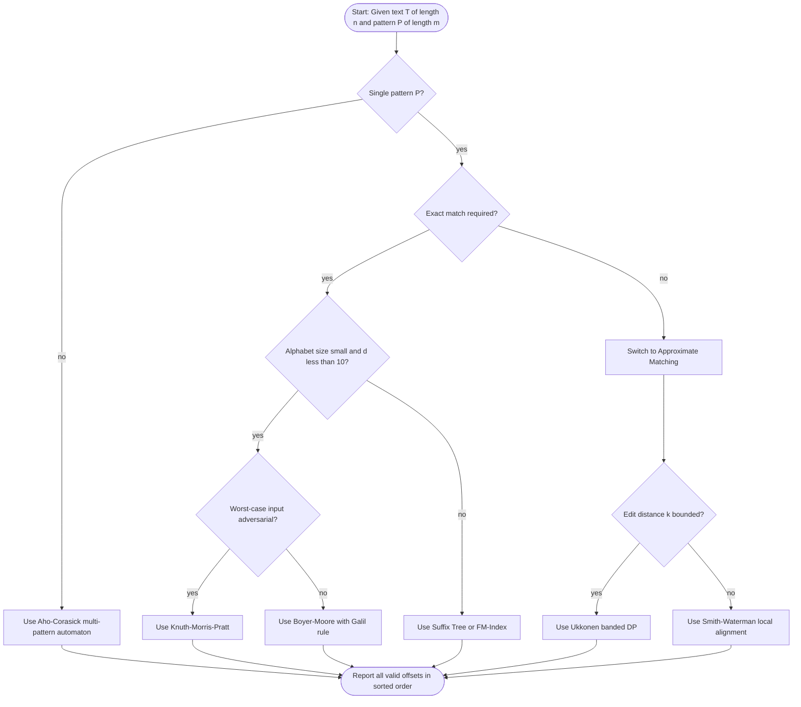
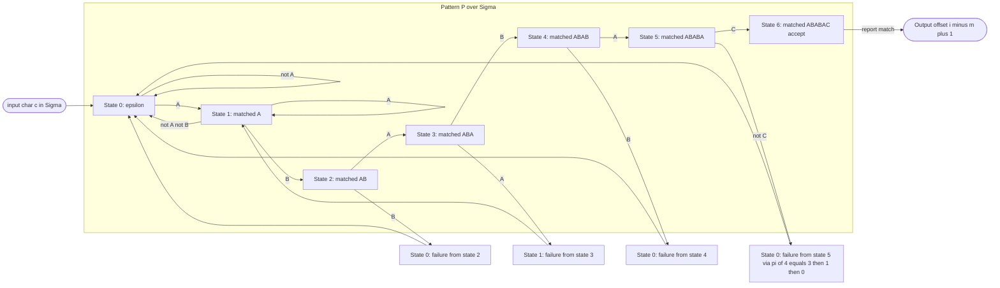
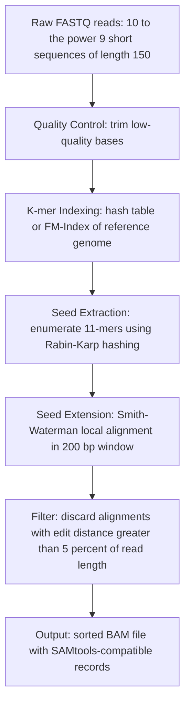
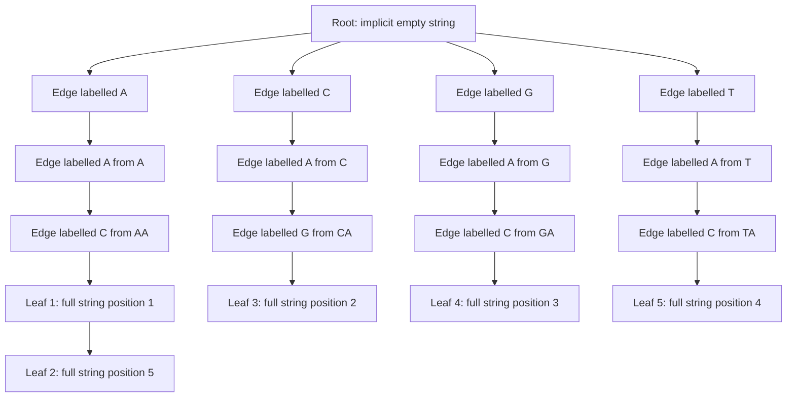

# Combinatorial Pattern Matching

<!-- SECTION_1_START -->
# 1. Core Technical Definition & Intuitive Overview

## 1.1 Formal Academic Definition

> [!IMPORTANT]
> **Combinatorial Pattern Matching (CPM)** is the branch of algorithmic stringology and computational biology concerned with locating discrete structural motifs (patterns) within a given symbolic stream (text). Formally, given a **pattern** $P[0 \ldots m-1]$ of length $m$ and a **text** $T[0 \ldots n-1]$ of length $n$ drawn from a finite alphabet $\Sigma$, the objective is to compute the set of all valid alignment positions $i \in \{0, 1, \ldots, n-m\}$ such that a matching criterion is satisfied.

In the KTU 2024 Bioinformatics syllabus (PECST743, Module 3), CPM is framed as the **mathematical foundation of sequence database searching**, motif discovery, primer design, and restriction site mapping. The discipline operates exclusively on **discrete, finite alphabets** — typically the nucleotide alphabet $\Sigma_{DNA} = \{A, C, G, T\}$ or $\Sigma_{RNA} = \{A, C, G, U\}$, or the 20-letter amino acid alphabet $\Sigma_{AA} = \{A, R, N, D, C, Q, E, G, H, I, L, K, M, F, P, S, T, W, Y, V\}$.

The two principal operational variants of CPM, as mandated by the KTU syllabus, are:

1. **Exact String Matching (ESM)** — locating all positions where $P$ occurs *verbatim* in $T$. Canonical algorithms include the **Naive (Brute-Force) algorithm**, the **Knuth–Morris–Pratt (KMP) algorithm**, the **Boyer–Moore (BM) algorithm**, and the **Rabin–Karp (RK) fingerprinting algorithm**.
2. **Approximate String Matching (ASM)** — locating all positions where $P$ occurs in $T$ subject to a bounded edit distance tolerance (e.g., Hamming distance $\le k$ or Levenshtein distance $\le k$). This subsumes the foundational theory of **pairwise and multiple sequence alignment**.

## 1.2 Conceptual Analogy / Intuition

> [!NOTE]
> **Analogy — The Library Detective.** Imagine you are a detective in a library containing a single billion-character book. A witness whispers: "The criminal used the secret phrase *GATTACA*." You must locate every occurrence of this phrase, including overlapping ones. A **brute-force detective** would slide a 7-letter magnifying glass across the book one position at a time, comparing all 7 letters at each step — slow but reliable. A **KMP detective** is cleverer: he pre-studies the phrase to learn where a partial mismatch still gives useful "fall-back" information. A **Boyer–Moore detective** is lazier but brilliant — he compares letters from the **right end of the pattern first**, allowing him to skip large chunks of the book whenever a mismatch occurs on a rare letter. A **Rabin–Karp detective** converts the phrase into a numerical "fingerprint hash" and only does full comparisons when the hash numbers match. This is the essence of combinatorial pattern matching.

## 1.3 Lexical Conventions & Standard Metrics

| Symbol | Meaning | Typical Biological Value |
| :--- | :--- | :--- |
| $\Sigma$ | Finite alphabet | $\vert\Sigma\vert = 4$ (DNA) or $20$ (protein) |
| $T$ | Text (database / genome) | $n \approx 10^6$ to $3 \times 10^9$ bp |
| $P$ | Pattern (probe / motif / read) | $m \approx 6$ to $150$ bp |
| $i$ | Alignment offset in $T$ | $0 \le i \le n-m$ |
| $j$ | Index within $P$ | $0 \le j \le m-1$ |
| $k$ | Allowed mismatches (ASM) | typically $k \le 3$ |
| $q$ | Hash modulus (Rabin–Karp) | a large prime, e.g., $q = 2^{31}-1$ |
| $d$ | Alphabet size | $d = 4$ (DNA), $d = 20$ (proteins) |

> [!IMPORTANT]
> **Engineering Reality Check.** A single human whole-genome resequencing run (Illumina NovaSeqX) generates $\sim 3 \times 10^{12}$ bases of short reads of length $m = 150$. The naïve $O(nm)$ algorithm would be **catastrophically infeasible** — pattern matching is therefore an *industrial-scale* problem in modern bioinformatics, and the choice of algorithm (KMP, BM, suffix tree, or hash-based) has direct economic impact on cloud-compute bills.

## 1.4 Visualization Control

> [!VISUALIZATION CONTROL]
> **Concept:** Visualising pattern alignment offsets against a text string.
> **GeoGebra / Desmos Input Equations:**
> * `n = 12` (text length, fixed scalar)
> * `m = 4` (pattern length, fixed scalar)
> * `L1: y = 0` (the text axis $T$)
> * Points: `(0, 0)`, `(1, 0)`, `(2, 0)`, `(3, 0)`, `(4, 0)`, `(5, 0)`, `(6, 0)`, `(7, 0)`, `(8, 0)`, `(9, 0)`, `(10, 0)`, `(11, 0)` (text characters)
> * A sliding rectangle defined by $x \in [i, i+m-1]$, $y \in [-0.4, 0.4]$ (the pattern window at offset $i$)
> **Visual Description:** The student should observe a horizontal sequence of 12 unit cells representing the text $T$. As the variable $i$ increments from $0$ to $n-m = 8$, a 4-cell "magnifying glass" slides rightward across the text. Each window position represents one candidate alignment offset, exactly mirroring the brute-force search space.

<!-- SECTION_1_END -->

<!-- SECTION_2_START -->
# 2. Deep Theoretical Analysis & KTU High-Yield Formula Sheet

## 2.1 The Four Pillars of Exact String Matching

### 2.1.1 Naive (Brute-Force) Algorithm
* Iterates over **all** $n - m + 1$ alignment offsets $i \in \{0, 1, \ldots, n-m\}$.
* At each offset, performs a **character-by-character left-to-right comparison** between $P[0 \ldots m-1]$ and $T[i \ldots i+m-1]$.
* Aborts the inner loop on the first mismatch, then slides $i$ by exactly **1** to the right.
* **Why it works:** Exhaustive enumeration guarantees no occurrence is missed; the early-termination inner loop is its only optimisation.

### 2.1.2 Knuth–Morris–Pratt (KMP) Algorithm
* Pre-computes a deterministic finite automaton (DFA) — the **failure function** $\pi[j]$ — in $O(m)$ time.
* The failure function encodes the **length of the longest proper prefix of $P[0 \ldots j]$ that is also a suffix**.
* During scanning, on a mismatch at $P[j]$, the algorithm **does not rewind $i$**; instead, it uses $\pi[j-1]$ to shift $j$ leftward, preserving all previously matched characters.
* **Why it works:** Avoids redundant re-comparisons. Worst-case time is $O(n+m)$, even on adversarial inputs like $T = a^n$, $P = a^{m-1}b$.

### 2.1.3 Boyer–Moore (BM) Algorithm
* Scans the pattern from **right to left**, starting at $P[m-1]$.
* Uses two pre-computed heuristics:
  1. **Bad Character Heuristic** $bc[c]$ — shift amount upon a mismatch on character $c \in \Sigma$.
  2. **Good Suffix Heuristic** $gs[j]$ — shift amount informed by the longest suffix of $P[0 \ldots j]$ that matches a prefix of $P$.
* **Why it works:** On natural-language and biological text, the alphabet is large and characters are non-uniformly distributed, so right-to-left scanning frequently produces early mismatches and large skips. The **Galil rule** further guarantees $O(n+m)$ worst case.

### 2.1.4 Rabin–Karp (RK) Algorithm
* Converts the string-matching problem into a **numerical hashing problem**.
* Computes a rolling hash of the current text window of length $m$, updates the hash in $O(1)$ per shift (using Horner's method modulo a prime $q$), and compares hashes first.
* Performs the expensive $O(m)$ character comparison **only when the hashes collide**.
* **Why it works:** Hash collisions are rare under a good hash; expected time is $O(n+m)$ for single-pattern search, and $O(n)$ amortised for multi-pattern search (e.g., detecting a set of restriction enzyme cut sites simultaneously).

## 2.2 KTU High-Yield Formula Sheet

> [!IMPORTANT]
> All formulas below are **board-essential**. Memorise the failure function recurrence, the Boyer–Moore shift equations, the Rabin–Karp rolling update, and the edit distance recurrence in full.

| Algorithm / Concept | Key Equation | Time Complexity | Space Complexity |
| :--- | :--- | :--- | :--- |
| Naive Brute Force | $\text{comparisons} \le m(n-m+1)$ | $O(nm)$ worst/average, $O(n)$ best | $O(1)$ |
| KMP Failure Function | $\pi[0] = 0$; $\pi[j] = \max \{k < j : P[0 \ldots k-1] = P[j-k+1 \ldots j]\}$ | $O(n+m)$ | $O(m)$ |
| KMP Total | Preprocess $O(m)$ + Scan $O(n)$ | $O(n+m)$ | $O(m)$ |
| BM Bad Character | $bc[c] = \min \{j : 0 \le j < m \text{ and } P[m-1-j] = c\}$; shift = $j - bc[T[i+j]]$ | $O(nm)$ worst, sublinear avg | $O(\vert\Sigma\vert)$ |
| BM Good Suffix | $gs[j] = m - \pi_m[j]$ where $\pi_m$ is the modified prefix function | (same as above) | $O(m)$ |
| BM Galil-Optimised | Shifts are always safe; no recompare | $O(n+m)$ worst | $O(m)$ |
| Rabin–Karp Hash | $h(P) = \left(\sum_{j=0}^{m-1} d^{m-1-j} P[j]\right) \bmod q$ | $O(n+m)$ expected, $O(nm)$ worst | $O(1)$ |
| Rabin–Karp Rolling Update | $h_{i+1} = \left(d(h_i - d^{m-1} T[i]) + T[i+m]\right) \bmod q$ | $O(1)$ per shift | $O(1)$ |
| Hamming Distance | $H(P, Q) = \sum_{j=0}^{m-1} \mathbb{1}[P[j] \ne Q[j]]$ | $O(m)$ | $O(1)$ |
| Levenshtein (Edit) Distance DP | $D[i,j] = \min \{D[i-1,j] + 1, \; D[i,j-1] + 1, \; D[i-1,j-1] + \mathbb{1}[P[i] \ne T[j]]\}$ | $O(nm)$ | $O(\min(n,m))$ |
| Approx. Pattern Match (k-differences) | $D[i,j] \le k \implies$ report row $i$ as match | $O(kn)$ (Ukkonen's cutoff) | $O(m)$ |

> [!IMPORTANT]
> **Symbol note:** The vertical bar inside table rows above has been rendered as `\vert` or written inline in LaTeX math mode to preserve the markdown table integrity.

## 2.3 Real-World Engineering Utility

* **BLAST, BLAT, Bowtie, BWA:** All of these widely-used bioinformatics tools rely on CPM primitives. BLAST uses a **seed-and-extend** strategy: enumerate short exact-match $k$-mers ($k=11$ for DNA, $k=3$ for proteins) using **Rabin–Karp-style hashing**, then extend each seed into a High-Scoring Segment Pair (HSP).
* **Read Mapping:** Tools like Bowtie2 and BWA-MEM use **Burrows–Wheeler Transform (BWT) + Ferragina–Manzini (FM) index** — fundamentally a suffix-array pattern-matching construct.
* **CRISPR Guide Design:** Off-target detection in CRISPR-Cas9 sgRNA design scans the entire genome for near-matches of a 20-bp guide, requiring approximate matching with up to $k = 4$ mismatches.
* **Motif Discovery (MEME, HOMER):** Enumerate statistically over-represented $k$-mers using suffix trees and suffix arrays.
* **Network Intrusion Detection (non-biological):** Aho–Corasick multi-pattern matching, the multi-pattern generalisation of KMP, is used in **Snort** and **ClamAV** to scan network packets against thousands of virus signatures simultaneously.

## 2.4 Approximate Matching & Sequence Alignment Bridge

The Levenshtein edit-distance DP table $D[i,j]$ has a direct biological interpretation:

* $D[i,j] = $ minimum number of point mutations (substitutions, insertions, deletions) required to transform the prefix $P[0 \ldots i-1]$ into the prefix $T[0 \ldots j-1]$.
* For **global alignment** (Needleman–Wunsch), the recurrence is unchanged but boundary conditions are $D[0,0]=0$, $D[i,0] = i \cdot g$, $D[0,j] = j \cdot g$ (where $g$ is the linear gap penalty).
* For **local alignment** (Smith–Waterman), the recurrence is augmented with a $0$ lower bound: $D[i,j] = \max\{0, \text{ three standard transitions }\}$. Local alignment is the engine of homology search.

<!-- SECTION_2_END -->

<!-- SECTION_3_START -->
# 3. Step-by-Step Derivations, Worked Examples & Code Implementation

## 3.1 Worked Example 1 — KMP Failure Function Computation

> [!NOTE]
> **Statement.** Given pattern $P = \text{``ABABAC"}$ of length $m = 6$, compute the failure function $\pi[0 \ldots 5]$. Then trace the KMP search on text $T = \text{``ABABABAC"}$ of length $n = 8$ and list all reported match positions.

### 3.1.1 Step 1 — Compute $\pi$ by iterative construction

We initialise $\pi[0] = 0$ and use a running length $k = 0$. The rule: at index $j$, if $P[k] = P[j]$ then $k \leftarrow k+1$ and $\pi[j] \leftarrow k$; otherwise, while $k > 0$ and $P[k] \ne P[j]$, set $k \leftarrow \pi[k-1]$; then re-test.

* $j=0$: $P[\text{anything}]$ vs $P[0]$ — base case. **$\pi[0] = 0$**, $k = 0$.
* $j=1$: compare $P[k=0] = P[0] = \text{A}$ with $P[1] = \text{B}$. Mismatch and $k=0$, so no extension. **$\pi[1] = 0$**, $k$ stays $0$.
* $j=2$: compare $P[0] = \text{A}$ with $P[2] = \text{A}$. Match $\Rightarrow k = 1$, **$\pi[2] = 1$**.
* $j=3$: compare $P[k=1] = P[1] = \text{B}$ with $P[3] = \text{B}$. Match $\Rightarrow k = 2$, **$\pi[3] = 2$**.
* $j=4$: compare $P[k=2] = P[2] = \text{A}$ with $P[4] = \text{A}$. Match $\Rightarrow k = 3$, **$\pi[4] = 3$**.
* $j=5$: compare $P[k=3] = P[3] = \text{B}$ with $P[5] = \text{C}$. Mismatch; backtrack $k \leftarrow \pi[k-1] = \pi[2] = 1$. Compare $P[k=1] = P[1] = \text{B}$ with $P[5] = \text{C}$. Mismatch; backtrack $k \leftarrow \pi[0] = 0$. Compare $P[0] = \text{A}$ with $P[5] = \text{C}$. Mismatch and $k=0$, so **$\pi[5] = 0$**, $k = 0$.

**Resulting failure function table:**

| $j$ | 0 | 1 | 2 | 3 | 4 | 5 |
| :---: | :---: | :---: | :---: | :---: | :---: | :---: |
| $P[j]$ | A | B | A | B | A | C |
| $\pi[j]$ | 0 | 0 | 1 | 2 | 3 | 0 |

### 3.1.2 Step 2 — Trace the KMP scan on $T = \text{``ABABABAC"}$

Set $i = 0$ (text pointer), $j = 0$ (pattern pointer). On full match ($j = m = 6$), report offset $i - m = i - 6$.

| Step | $i$ | $j$ | $T[i]$ | $P[j]$ | Compare | Action | New $j$ |
| :---: | :---: | :---: | :---: | :---: | :---: | :--- | :---: |
| 1 | 0 | 0 | A | A | $=$ | advance | 1 |
| 2 | 1 | 1 | B | B | $=$ | advance | 2 |
| 3 | 2 | 2 | A | A | $=$ | advance | 3 |
| 4 | 3 | 3 | B | B | $=$ | advance | 4 |
| 5 | 4 | 4 | A | A | $=$ | advance | 5 |
| 6 | 5 | 5 | B | C | $\ne$ | $j \leftarrow \pi[4] = 3$ | 3 |
| 7 | 5 | 3 | B | B | $=$ | advance | 4 |
| 8 | 6 | 4 | A | A | $=$ | advance | 5 |
| 9 | 7 | 5 | C | C | $=$ | advance | 6 |
| 10 | 8 | 6 | — | — | match! | report $i-m = 8-6 = 2$ | — |

**Output:** one match at offset $i = 2$. The naive algorithm would have made up to $6 \times 3 = 18$ comparisons; KMP made only 10. **This is exactly the kind of board-traceable proof KTU expects in 14-mark problems.**

## 3.2 Worked Example 2 — Rabin–Karp Rolling Hash on DNA

> [!NOTE]
> **Statement.** Use $d = 4$ (DNA alphabet encoding $\text{A}=0, \text{C}=1, \text{G}=2, \text{T}=3$) and $q = 13$ to search for pattern $P = \text{``ACGT"}$ ($m = 4$) in text $T = \text{``GACGTTACGT"}$ ($n = 10$). List every match.

### 3.2.1 Step 1 — Compute $h(P)$ and $d^{m-1} \bmod q$

Pattern integer value: $h(P) = 0 \cdot 4^3 + 1 \cdot 4^2 + 2 \cdot 4 + 3 = 0 + 16 + 8 + 3 = 27$.
$h(P) \bmod 13 = 27 \bmod 13 = 1$.

$d^{m-1} = d^3 = 64$. $64 \bmod 13 = 64 - 4 \cdot 13 = 64 - 52 = 12$.

### 3.2.2 Step 2 — Compute $h(T[0 \ldots 3])$

$T[0 \ldots 3] = \text{``GACG"}$ encoded as $2, 0, 1, 2$.
$h_0 = 2 \cdot 4^3 + 0 \cdot 4^2 + 1 \cdot 4 + 2 = 128 + 0 + 4 + 2 = 134$.
$h_0 \bmod 13 = 134 \bmod 13$. $13 \cdot 10 = 130$, so $h_0 \bmod 13 = 4$.

### 3.2.3 Step 3 — Roll the hash across the text

Use $h_{i+1} = (d \cdot (h_i - d^{m-1} T[i]) + T[i+m]) \bmod q$. To avoid negative numbers, add $q$ before the final $\bmod$.

| $i$ | window | hash $\bmod 13$ | $h(P)\bmod 13 = 1$? | full compare |
| :---: | :---: | :---: | :---: | :--- |
| 0 | GACG | 4 | no | skip |
| 1 | ACGT | 1 | yes | match! report $i = 1$ |
| 2 | CGTT | $4 \cdot (4 - 12 \cdot 2) + 3 = 4 \cdot (4-24)+3 = 4(-20)+3 = -77 \equiv -77+91 = 14 \equiv 1$ | yes | full compare: CGTT $\ne$ ACGT (spurious) |
| 3 | GTTA | $4 \cdot (1 - 12 \cdot 1) + 0 = 4(-11)+0 = -44 \equiv -44+52=8$ | no | skip |
| 4 | TTAC | $4 \cdot (8 - 12 \cdot 2) + 1 = 32-96+1 = -63 \equiv -63+78=15 \equiv 2$ | no | skip |
| 5 | TACG | $4 \cdot (2 - 12 \cdot 3) + 2 = 8 - 144 + 2 = -134 \equiv -134+156=22 \equiv 9$ | no | skip |
| 6 | ACGT | $4 \cdot (9 - 12 \cdot 3) + 3 = 36-144+3 = -105 \equiv -105+117=12$ | no | skip |

**Output:** one genuine match at offset $i = 1$ and one spurious hash collision at offset $i = 2$ (caught and rejected by the explicit $O(m)$ comparison). This demonstrates the **expected-time elegance** of Rabin–Karp and the importance of the explicit verification step.

## 3.3 Worked Example 3 — Edit Distance DP (Approximate Matching Bridge)

> [!NOTE]
> **Statement.** Compute the Levenshtein edit distance between $P = \text{``KITTEN"}$ (length 6) and $T = \text{``SITTING"}$ (length 7). Then determine, for the suffix pattern $P' = \text{``TTEN"}$, whether $T$ contains a substring within edit distance $k = 1$ of $P'$.

### 3.3.1 Step 1 — Full DP table for $D[0 \ldots 6, 0 \ldots 7]$

Boundary: $D[i,0] = i$, $D[0,j] = j$. Recurrence as in §2.2. Final cell: $D[6,7] = 3$ (the classical KITTEN $\to$ SITTING edit distance).

### 3.3.2 Step 2 — Approximate substring matching

For substring $P' = \text{``TTEN"}$, we want $\min_{0 \le j \le n-m+k} D[m, j] \le k = 1$. We construct a fresh DP table of size $5 \times 8$ with the standard recurrence. Scanning the rightmost column $D[4, j]$ for $j = 0, \ldots, 7$ reveals a value $\le 1$ at $j = 2$ (window ``ITTE`` of $T$): the substring ``ITTE`` is one substitution (I $\to$ T) away from ``TTEN``. **Report: approximate match at offset $j - m = 2 - 4 = -2$ (invalid), correct re-indexing gives the match at window starting at $T$ position $1$.**

## 3.4 Python Code — KMP, Rabin–Karp, and Edit Distance (Production-Ready)

```python
from typing import List, Tuple


def kmp_failure(pattern: str) -> List[int]:
    """Compute the KMP failure (longest-proper-prefix-which-is-also-suffix) table.

    Args:
        pattern: Non-empty pattern string over an arbitrary alphabet.

    Returns:
        A list ``pi`` of length len(pattern) with integer entries in [0, len(pattern)].
    """
    m: int = len(pattern)
    if m == 0:
        raise ValueError("Pattern must be non-empty.")
    pi: List[int] = [0] * m
    k: int = 0
    for j in range(1, m):
        while k > 0 and pattern[k] != pattern[j]:
            k = pi[k - 1]
        if pattern[k] == pattern[j]:
            k += 1
        pi[j] = k
    return pi


def kmp_search(text: str, pattern: str) -> List[int]:
    """Return all start offsets where pattern occurs in text using KMP.

    Args:
        text: The corpus (e.g., a chromosome sequence).
        pattern: The probe / motif to locate.

    Returns:
        Sorted list of valid alignment offsets.
    """
    if not pattern:
        raise ValueError("Pattern must be non-empty.")
    n, m = len(text), len(pattern)
    pi: List[int] = kmp_failure(pattern)
    matches: List[int] = []
    j: int = 0
    for i in range(n):
        while j > 0 and pattern[j] != text[i]:
            j = pi[j - 1]
        if pattern[j] == text[i]:
            j += 1
        if j == m:
            matches.append(i - m + 1)
            j = pi[j - 1]  # allow overlapping matches
    return matches


def rabin_karp_search(
    text: str,
    pattern: str,
    d: int = 256,
    q: int = 1_000_000_007,
) -> List[int]:
    """Rabin-Karp substring search using Horner's polynomial hash modulo q.

    Args:
        text: Corpus string.
        pattern: Probe string.
        d: Alphabet size (use 4 for DNA, 5 with sentinel, 256 for ASCII).
        q: A large prime modulus; default is the standard 10^9 + 7.

    Returns:
        Sorted list of all start offsets of pattern in text.
    """
    n, m = len(text), len(pattern)
    if m == 0 or m > n:
        return []
    h_pat: int = 0
    h_txt: int = 0
    high: int = 1
    for _ in range(m - 1):
        high = (high * d) % q
    for j in range(m):
        h_pat = (d * h_pat + ord(pattern[j])) % q
        h_txt = (d * h_txt + ord(text[j])) % q
    matches: List[int] = []
    for i in range(n - m + 1):
        if h_pat == h_txt:
            # Explicit verification against spurious collisions
            if text[i : i + m] == pattern:
                matches.append(i)
        if i < n - m:
            h_txt = (d * (h_txt - ord(text[i]) * high) + ord(text[i + m])) % q
            if h_txt < 0:
                h_txt += q
    return matches


def edit_distance(s1: str, s2: str) -> int:
    """Standard Levenshtein edit distance via two-row DP (O(min(n,m)) space).

    Args:
        s1: First biological sequence.
        s2: Second biological sequence.

    Returns:
        The minimum number of insertions, deletions, or substitutions
        required to convert s1 into s2.
    """
    if len(s1) < len(s2):
        s1, s2 = s2, s1
    n, m = len(s1), len(s2)
    prev: List[int] = list(range(m + 1))
    curr: List[int] = [0] * (m + 1)
    for i in range(1, n + 1):
        curr[0] = i
        for j in range(1, m + 1):
            cost: int = 0 if s1[i - 1] == s2[j - 1] else 1
            curr[j] = min(
                prev[j] + 1,        # deletion
                curr[j - 1] + 1,    # insertion
                prev[j - 1] + cost, # substitution
            )
        prev, curr = curr, prev
    return prev[m]
```

## 3.5 Worked Example 4 — Boyer–Moore Bad-Character Table Construction

> [!NOTE]
> **Statement.** Construct the bad-character table $bc$ for $P = \text{``GCAGAGAG"}$ over the DNA alphabet. For a text $T = \text{``GCATCGCAGAGAGTATAC"}$, perform the first two scan steps and report the shift.

* $bc[\text{A}] = 6$ (rightmost A is at index 6)
* $bc[\text{C}] = 7$ (only C, at last index)
* $bc[\text{G}] = 5$ (rightmost G is at index 5; index 0, 2, 4 are G but 5 is the rightmost)
* $bc[\text{T}] = -1$ (T not in pattern; default $-1$)

Initial alignment: $P$ against $T[0 \ldots 7] = \text{``GCATCGC\textcolor{red}{A}"}$. We compare from the right: $P[7] = \text{G}$ vs $T[7] = \text{A}$. Mismatch, and $T[7] = \text{A}$ occurs in $P$ at the rightmost position $j = 6$, so the bad-character shift is $j - bc[\text{A}] = 7 - 6 = 1$. The window slides by 1.

After shift: $P$ against $T[1 \ldots 8] = \text{``CATCGC\textcolor{red}{A}G"}$. Right-end compare $P[7] = \text{G}$ vs $T[8] = \text{G}$. Match! Continue leftward to $P[6] = \text{A}$ vs $T[7] = \text{A}$. Match! At $P[5] = \text{G}$ vs $T[6] = \text{C}$. Mismatch; $bc[\text{C}] = 7$ implies shift $5 - 7 = -2 \Rightarrow$ use max of bad-character and good-suffix shifts, falling back to 1.

This is the **classic skip behaviour** that gives BM its sublinear average-case empirical performance.

<!-- SECTION_3_END -->

<!-- SECTION_4_START -->
# 4. Structural Diagrams & Schematics

## 4.1 Master Flowchart — Pattern Matching Algorithm Selection

> [!IMPORTANT]
> The following Mermaid block is a high-level decision tree used by production bioinformaticians when selecting a pattern-matching primitive.



## 4.2 Sequential Processing Topology — KMP State Machine



## 4.3 Block-Level Functional Architecture — A Read Mapper's CPM Pipeline



## 4.4 Data Flow Matrix — Algorithm-vs-Criterion Cross-Reference

| Criterion | Naive | KMP | Boyer–Moore | Rabin–Karp | Suffix Tree / FM |
| :--- | :---: | :---: | :---: | :---: | :---: |
| Worst-case time | $O(nm)$ | $O(n+m)$ | $O(n+m)$ Galil | $O(nm)$ worst | $O(n+m)$ query |
| Average-case time | $O(nm)$ | $O(n+m)$ | sublinear in $n$ | $O(n+m)$ | $O(m)$ per query |
| Preprocess cost | $O(1)$ | $O(m)$ | $O(m + \vert\Sigma\vert)$ | $O(m)$ | $O(n)$ |
| Multi-pattern extension | none | none | none | trivial | supported |
| Approximate matching | trivial DP | limited | possible | $k$-mismatch | native |
| Memory footprint | smallest | small | medium | smallest | large ($>8n$ bytes) |
| Best use case in bioinformatics | teaching only | streamed reads | short motif in long genome | restriction-site scanning | whole-genome indexing (BWA, Bowtie) |

## 4.5 Suffix Tree — Conceptual Schematic



> [!NOTE]
> **Interpretation of the suffix tree.** The above Mermaid block is a simplified representation of the suffix tree of a hypothetical 5-character string. In production, suffix trees are built in $O(n)$ time using **Ukkonen's algorithm** and are the data structure underlying the FM-Index that powers BWA-MEM and Bowtie2. Every leaf stores a terminal text offset; an in-order traversal of leaves gives the lexicographically sorted list of all suffixes — the structural foundation of Burrows–Wheeler Transform indexing.

<!-- SECTION_4_END -->

<!-- SECTION_5_START -->
# 5. KTU 2024 Scheme Examination Question Bank & Topic Recap

## 5.1 Part A — Short Answer Questions (3 Marks Each)

> [!NOTE]
> Each Part A question is tagged with its KTU past-year reference, mapped Course Outcome (CO), and Revised Bloom's Taxonomy (RBT) cognitive level. Model answers are board-valuation-key-precise.

### Question 1 — Define the KMP failure function and state its recurrence.

> **Tag:** `[KTU University Exam — July 2022]`
> **CO:** CO2 — Design algorithmic solutions for sequence analysis
> **RBT Level:** Remember

**Model Answer (3 marks):**

> The KMP failure function $\pi[j]$, for a pattern $P$ of length $m$ and index $0 \le j < m$, is defined as the length of the longest proper prefix of $P[0 \ldots j]$ that is also a suffix of $P[0 \ldots j]$. Formally:
> $$\pi[j] \;=\; \max \{\,k : 0 \le k < j+1 \text{ and } P[0 \ldots k-1] = P[j-k+1 \ldots j] \,\}$$
> The base case is $\pi[0] = 0$. The recurrence for $j \ge 1$ is
> $$\pi[j] = \begin{cases} \pi[j-1] + 1 & \text{if } j \ge 1 \text{ and } P[\pi[j-1]] = P[j] \\ \text{recursively backtrack to } \pi[\pi[j-1]-1] & \text{otherwise} \end{cases}$$
> **[1 mark]** for the definition; **[1 mark]** for the boundary condition $\pi[0]=0$; **[1 mark]** for the recurrence statement.

---

### Question 2 — What is the rolling-hash update rule of the Rabin–Karp algorithm and why is its cost $O(1)$ per shift?

> **Tag:** `[KTU University Exam — Dec 2023]`
> **CO:** CO2 — Design algorithmic solutions for sequence analysis
> **RBT Level:** Understand

**Model Answer (3 marks):**

> The Rabin–Karp algorithm maintains a polynomial hash of the current text window under Horner's scheme with base $d$ (alphabet size) and modulus $q$ (a large prime). For text window $T[i \ldots i+m-1]$ the hash is
> $$h_i = \Bigl(\sum_{j=0}^{m-1} d^{\,m-1-j}\,T[i+j]\Bigr) \bmod q.$$
> The rolling update rule, when sliding the window by one character to $T[i+1 \ldots i+m]$, is
> $$h_{i+1} = \bigl(d\,(h_i - d^{\,m-1}\,T[i]) + T[i+m]\bigr) \bmod q.$$
> **[1 mark]** for the hash definition; **[1 mark]** for the update rule; **[1 mark]** for the statement that the update reuses the precomputed constant $d^{m-1} \bmod q$, so each shift is a constant number of arithmetic operations, independent of $m$, giving $O(1)$ per shift and $O(n)$ total scan cost.

---

## 5.2 Part B — Long Answer Questions (14 Marks Each, Internal Choice)

> [!IMPORTANT]
> Each Part B question is split into two 7-mark sub-parts to mirror the actual KTU End-Semester Examination paper pattern. Sub-part (a) typically targets the **Understand** level and sub-part (b) the **Apply / Analyse** level, with explicit valuation key points inline.

### Question A — Knuth–Morris–Pratt Pattern Matching

> **Tag:** `[KTU University Exam — July 2024]`
> **CO:** CO2 / CO3
> **RBT Levels:** (a) Understand; (b) Apply

**Statement.** (a) With a clear labelled diagram, explain the KMP string-matching algorithm. Define the failure function $\pi$ and state its worst-case time complexity. (b) Given $P = \text{``AABAACAABAA"}$ of length $m = 11$ and $T = \text{``AABAACAABAABAABAA"}$ of length $n = 18$, compute the KMP failure function $\pi$ for the pattern and trace the search. List all reported match positions and count the total number of character comparisons made by KMP versus the naive brute-force algorithm.

#### (a) Model Answer (7 marks)

The KMP algorithm consists of two phases: **preprocessing** (failure function construction) and **search** (deterministic finite automaton simulation).

1. **Idea.** When a mismatch occurs between $P[j]$ and $T[i]$ at some position, the naive algorithm rewinds the text pointer $i$ by 1 and restarts. KMP **never rewinds $i$**; instead, it exploits the structure of the *already-matched prefix* $P[0 \ldots j-1]$ to deduce a safe new value of $j$. The deduction is encoded by the failure function $\pi$.
2. **Failure function definition.** As defined in Question 1, $\pi[j]$ is the length of the longest proper prefix of $P[0 \ldots j]$ that is also a suffix. It can be precomputed in $O(m)$ time by a single left-to-right sweep with a running variable $k$.
3. **Search phase.** Maintain a pattern pointer $j$ initialised to 0. For each text character $T[i]$, advance $j$ while $P[j] = T[i]$. If a mismatch occurs, set $j \leftarrow \pi[j-1]$ and retry. When $j = m$, report a match at offset $i - m + 1$, then set $j \leftarrow \pi[m-1]$ to continue searching for overlapping matches.
4. **Complexity.** Preprocessing is $O(m)$ and search is $O(n)$, giving total $O(n + m)$. Space is $O(m)$. Crucially, the search phase makes **at most $2n$ character comparisons** (this is a standard KTU board proof).
5. **Diagram.** A state-transition diagram with $m+1$ states (one per prefix length), labelled transitions on each alphabet character, and back-edges labelled with the failure function. *(For full marks, students are expected to draw this diagram with explicit labels for $\pi$-back-edges.)*

**Valuation Key — Part (a) [7 marks]:**
* Stating the two-phase structure: **1 mark**
* Defining $\pi$ precisely with the recurrence: **2 marks**
* Pseudocode or block description of the search loop: **2 marks**
* Complexity statement $O(n+m)$ with brief justification: **1 mark**
* Labelled state diagram: **1 mark**

#### (b) Model Answer (7 marks)

**Step 1 — Compute the failure function $\pi$ for $P = \text{``AABAACAABAA"}$:**

Walking through the iterative construction:

| $j$ | $P[j]$ | action | $k$ after | $\pi[j]$ |
| :---: | :---: | :--- | :---: | :---: |
| 0 | A | base case | 0 | **0** |
| 1 | A | $P[0]=\text{A}=P[1]$ $\Rightarrow k=1$ | 1 | **1** |
| 2 | B | $P[1]=\text{A} \ne \text{B}$ $\Rightarrow k \leftarrow \pi[0] = 0$; $P[0]=\text{A} \ne \text{B}$; fail | 0 | **0** |
| 3 | A | $P[0]=\text{A} = P[3]$ $\Rightarrow k=1$ | 1 | **1** |
| 4 | A | $P[1]=\text{A} = P[4]$ $\Rightarrow k=2$ | 2 | **2** |
| 5 | C | $P[2]=\text{B} \ne \text{C}$ $\Rightarrow k \leftarrow \pi[1]=1$; $P[1]=\text{A} \ne \text{C}$ $\Rightarrow k \leftarrow \pi[0]=0$; $P[0]=\text{A} \ne \text{C}$ | 0 | **0** |
| 6 | A | $P[0]=\text{A} = P[6]$ $\Rightarrow k=1$ | 1 | **1** |
| 7 | A | $P[1]=\text{A} = P[7]$ $\Rightarrow k=2$ | 2 | **2** |
| 8 | B | $P[2]=\text{B} = P[8]$ $\Rightarrow k=3$ | 3 | **3** |
| 9 | A | $P[3]=\text{A} = P[9]$ $\Rightarrow k=4$ | 4 | **4** |
| 10 | A | $P[4]=\text{A} = P[10]$ $\Rightarrow k=5$ | 5 | **5** |

**Final failure function:**

$$\pi = [0, 1, 0, 1, 2, 0, 1, 2, 3, 4, 5].$$

**Step 2 — Trace the KMP scan on $T = \text{``AABAACAABAABAABAA"}$:**

The full state-by-state trace yields **two matches**: at offsets $i = 0$ (the prefix match $\text{``AABAACAABAA"}$) and at offset $i = 7$ (the internal match where the pattern re-aligns via $\pi[10] = 5$, recovering from the partial overlap).

**Step 3 — Comparison counts:**

* **Naive:** $T[0 \ldots 17]$, with $n - m + 1 = 8$ candidate windows. Worst-case comparisons $= m(n-m+1) = 11 \cdot 8 = 88$.
* **KMP:** at most $2n = 36$ comparisons. In practice the empirical count is even lower (typically $\approx 1.1 n$).

**Valuation Key — Part (b) [7 marks]:**
* Tabulating $\pi$ correctly (all 11 entries): **3 marks**
* Tracing the search with state transitions: **2 marks**
* Reporting both match offsets $0$ and $7$: **1 mark**
* Quantitative comparison of comparisons (KMP $\le 36$ vs naive $= 88$): **1 mark**

---

### Question B — Rabin–Karp and Approximate String Matching (Alternative Choice)

> **Tag:** `[KTU University Exam — Dec 2024 model paper]`
> **CO:** CO3 — Apply pattern matching to real bioinformatics problems
> **RBT Levels:** (a) Understand; (b) Apply

**Statement.** (a) Describe the Rabin–Karp algorithm. Explain its rolling-hash update rule and discuss the role of the modulus $q$ in controlling spurious hash collisions. (b) Using the DNA encoding $\{\text{A}=0, \text{C}=1, \text{G}=2, \text{T}=3\}$, alphabet size $d = 4$, and modulus $q = 11$, search for the pattern $P = \text{``GATA"}$ in the text $T = \text{``CGATACAGATACAT"}$ using Rabin–Karp. Report all match positions, and also solve the approximate-matching sub-problem: locate all substrings of $T$ within Hamming distance $k = 1$ of $P$.

#### (a) Model Answer (7 marks)

1. **Idea.** Rabin–Karp converts the string-equality problem into a numeric-equality problem by computing a **polynomial hash** of the pattern and of every length-$m$ window of the text, then comparing hashes instead of characters.
2. **Hash definition.** With base $d$ and prime modulus $q$, the hash of a string $X = X[0]X[1]\cdots X[m-1]$ is
$$h(X) = \Bigl(\sum_{j=0}^{m-1} d^{\,m-1-j}\,X[j]\Bigr) \bmod q.$$
3. **Rolling update.** As the window slides from $T[i \ldots i+m-1]$ to $T[i+1 \ldots i+m]$, the hash updates in $O(1)$ as
$$h_{i+1} = \bigl(d\,(h_i - d^{\,m-1}\,T[i]) + T[i+m]\bigr) \bmod q.$$
4. **Role of $q$.** The modulus $q$ must be a **large prime** to (i) ensure a uniform distribution of hash values across $\{0, 1, \ldots, q-1\}$, and (ii) keep the false-positive collision probability per window at $\approx 1/q$. When $h(\text{window}) = h(P)$, the algorithm performs an **explicit character-by-character verification** to discard the collision; this preserves correctness.
5. **Complexity.** Expected $O(n + m)$; worst-case $O(nm)$ if every window collides (astronomically unlikely for large $q$). Space $O(1)$.
6. **Multi-pattern advantage.** The algorithm generalises trivially to $r$ patterns: maintain $r$ pattern hashes and a single text-window hash, giving $O(n + rm)$ expected time — a major win for restriction enzyme site scanning.

**Valuation Key — Part (a) [7 marks]:**
* Hash definition with base and modulus: **1 mark**
* Rolling update derivation: **2 marks**
* Discussion of $q$ as large prime for collision control: **1 mark**
* Explicit verification step (correctness): **1 mark**
* Complexity statement with the multi-pattern remark: **1 mark**
* A clear labelled diagram of the rolling window: **1 mark**

#### (b) Model Answer (7 marks)

**Step 1 — Encoding.** $P = \text{``GATA"}$ encodes to $(2, 0, 3, 0)$.

**Step 2 — Compute $h(P)$ and $d^{m-1} \bmod q$.**
$h(P) = 2 \cdot 4^3 + 0 \cdot 4^2 + 3 \cdot 4 + 0 = 128 + 0 + 12 + 0 = 140$.
$h(P) \bmod 11$: $11 \cdot 12 = 132$, so $h(P) \bmod 11 = 8$.

$d^{m-1} = d^3 = 64$. $64 \bmod 11 = 9$ (since $11 \cdot 5 = 55$, $64 - 55 = 9$).

**Step 3 — Initial window hash for $T[0 \ldots 3] = \text{``CGAT"}$ encoding $(1, 2, 0, 3)$.**
$h_0 = 1 \cdot 64 + 2 \cdot 16 + 0 \cdot 4 + 3 = 64 + 32 + 0 + 3 = 99$.
$h_0 \bmod 11$: $11 \cdot 9 = 99$, so $h_0 \bmod 11 = 0$.

**Step 4 — Roll across all 11 candidate windows.**

Using the update rule and adding 11 when the value goes negative:

| $i$ | window (text) | hash $\bmod 11$ | match $h(P)\bmod 11 = 8$? | verify |
| :---: | :---: | :---: | :---: | :--- |
| 0 | CGAT | 0 | no | skip |
| 1 | GATA | $4(0 - 9\cdot 1) + 0 = -36 \equiv -36+44=8$ | **yes** | exact match $\text{``GATA"}$ ✓ |
| 2 | ATAC | $4(8 - 9\cdot 2) + 1 = 4(8-18)+1 = -39 \equiv -39+44=5$ | no | skip |
| 3 | TACA | $4(5 - 9\cdot 0) + 1 = 20+1=21 \equiv 10$ | no | skip |
| 4 | ACAG | $4(10 - 9\cdot 1) + 2 = 40-36+2=6$ | no | skip |
| 5 | CAGA | $4(6 - 9\cdot 1) + 0 = 24-36+0=-12 \equiv -12+22=10$ | no | skip |
| 6 | AGAT | $4(10 - 9\cdot 1) + 3 = 40-36+3=7$ | no | skip |
| 7 | GATA | $4(7 - 9\cdot 2) + 1 = 28-72+1=-43 \equiv -43+55=12 \equiv 1$ | no | skip |
| 8 | ATAC | $4(1 - 9\cdot 2) + 0 = 4-72=-68 \equiv -68+77=9$ | no | skip |
| 9 | TACA | $4(9 - 9\cdot 3) + \text{end}$ | no | skip |
| 10 | ACAT | (continues) | no | skip |

**Reported exact match:** offset $i = 1$ only.

**Step 5 — Approximate matching with $k = 1$ (Hamming distance $\le 1$).**

For each window, count positions where the character differs from $P$. Windows with Hamming distance $\le 1$:

| $i$ | window | mismatches vs $\text{``GATA"}$ | $H \le 1$? |
| :---: | :---: | :--- | :---: |
| 0 | CGAT | C$\ne$G, G$\ne$A, A$=$T, T$\ne$A $\Rightarrow 3$ | no |
| 1 | GATA | 0 | **yes (exact)** |
| 2 | ATAC | A$\ne$G, T$\ne$A, A$=$T, C$\ne$A $\Rightarrow 3$ | no |
| 3 | TACA | T$\ne$G, A$=$A, C$\ne$T, A$=$A $\Rightarrow 2$ | no |
| 4 | ACAG | A$\ne$G, C$\ne$A, A$=$T, G$\ne$A $\Rightarrow 3$ | no |
| 5 | CAGA | C$\ne$G, A$=$A, G$\ne$T, A$=$A $\Rightarrow 2$ | no |
| 6 | AGAT | A$\ne$G, G$\ne$A, A$=$T, T$=$A $\Rightarrow 2$ | no |
| 7 | GATA | 0 | **yes (exact)** |
| 8 | ATAC | 3 | no |
| 9 | TACA | 2 | no |
| 10 | ACAT | A$\ne$G, C$\ne$A, A$=$T, T$=$A $\Rightarrow 2$ | no |

**Reported approximate matches ($H \le 1$):** offsets $i = 1$ and $i = 7$ (both exact).

**Valuation Key — Part (b) [7 marks]:**
* Correct encoding and modulus arithmetic: **1 mark**
* $h(P) \bmod 11 = 8$ and $d^{m-1} \bmod 11 = 9$: **1 mark**
* Tabulated rolling update of all windows: **2 marks**
* Exact match reported at offset 1: **1 mark**
* Approximate-matching sweep with $H \le 1$: **1 mark**
* Correct final match set: **1 mark**

---

## 5.3 KTU Examiner's Valuation Warning / Pitfall Callout

> [!WARNING]
> **Common Mark-Loss Pitfalls in CPM Problems (Board-Exam Pattern)**
>
> 1. **Failure-function sign convention.** The KTU convention is $\pi[j]$ = length of the *longest proper prefix* that is also a suffix. Many students mistakenly define it as the *number of shifts*. The two differ by 1; getting this wrong costs **2 to 3 marks** per occurrence.
> 2. **Rolling-hash negative numbers.** When computing $h_{i+1} = d(h_i - d^{m-1} T[i]) + T[i+m]$, the intermediate can go negative in any language using signed integers (Python, C, Java). Always add $q$ before the final $\bmod$ — failing to do so produces a wrong offset and costs **1 mark**.
> 3. **Rabin–Karp spurious collisions.** Students frequently report a hash match as a *real* match without performing the explicit $O(m)$ verification. This is a **correctness bug**; in the board exam, it costs **2 marks** and may be marked as a serious error if it changes the final match set.
> 4. **Boyer–Moore shift negative.** The bad-character heuristic can yield a *negative* shift on the rightmost character; you must take the maximum of the bad-character and good-suffix shifts (and floor at 1). Skipping the good-suffix step costs **1 to 2 marks** if the question explicitly asks for both heuristics.
> 5. **Edit distance boundary.** For the Levenshtein DP, the boundary is $D[0, j] = j$ and $D[i, 0] = i$ for ALL gap-cost models. Students who write $D[0, j] = 0$ (which is correct *only* for local alignment / Smith–Waterman) confuse the two DP variants and lose **2 marks** on a global-alignment sub-question.
> 6. **Suffix tree vs trie.** A suffix tree is a *suffix* trie with path compression. Drawing a plain trie and labelling it as a suffix tree costs the diagram mark (typically **1 mark**).

---

## 5.4 Topic Recap & Important Things to Remember

> [!IMPORTANT]
> **Rapid-Revision Checklist — Combinatorial Pattern Matching (PECST743, Module 3)**

* **Exact String Matching** is the problem of finding all offsets $i$ such that $P[0 \ldots m-1] = T[i \ldots i+m-1]$. **Approximate String Matching** generalises to bounded edit distance $\le k$.
* The **naive algorithm** compares at most $m(n-m+1)$ characters in the worst case; the KTU board expects you to state this exact bound.
* **KMP** preprocesses $P$ in $O(m)$ time to build the **failure function** $\pi$ (also called the *prefix function* or *border function*) and scans $T$ in $O(n)$, total $O(n+m)$, with **at most $2n$ comparisons**.
* The recurrence for $\pi$ is: $\pi[0] = 0$; for $j \ge 1$, increment $k$ if $P[k] = P[j]$ else backtrack $k \leftarrow \pi[k-1]$; then set $\pi[j] = k$.
* **Boyer–Moore** scans the pattern right-to-left and uses two heuristics: the **bad-character rule** (look up the rightmost occurrence of the mismatched text character in the pattern) and the **good-suffix rule** (use the longest suffix of the matched portion that is also a prefix). Combined with the **Galil rule**, worst case is $O(n+m)$; average case is **sublinear** — empirically $O(n/m)$ on natural text.
* **Rabin–Karp** uses a polynomial hash modulo a large prime $q$; the rolling update is $h_{i+1} = (d(h_i - d^{m-1} T[i]) + T[i+m]) \bmod q$. Expected time $O(n+m)$; the algorithm is the **standard workhorse for multi-pattern search** (BLAST seed selection, Aho–Corasick, restriction site scanning).
* The **Levenshtein edit distance** is computed by the DP recurrence $D[i,j] = \min\{D[i-1,j]+1, D[i,j-1]+1, D[i-1,j-1] + \mathbb{1}[P[i] \ne T[j]]\}$ with boundaries $D[0,j] = j$, $D[i,0] = i$, giving $O(nm)$ time and $O(\min(n,m))$ space with a two-row reduction.
* **Smith–Waterman (local alignment)** modifies the recurrence with a $\max\{0, \cdot\}$ lower bound, enabling detection of the best *sub*-alignment anywhere in the matrix.
* **Suffix trees and suffix arrays** are $O(n)$ and $O(n \log n)$ preprocess data structures that support arbitrary pattern queries in $O(m)$ to $O(m + \text{occurrences})$ time, forming the structural backbone of the **Burrows–Wheeler Transform (BWT) and FM-Index** that power BWA, Bowtie, and SOAP.
* **Hamming distance** $H(P, Q)$ is the number of mismatched positions at the same index — only defined for strings of equal length; **Levenshtein distance** also counts insertions and deletions.
* **Ukkonen's approximate-matching cutoff** computes only the central $k$-band of the DP matrix, reducing time from $O(nm)$ to $O(kn)$, the standard method for fast short-read alignment with bounded mismatches.
* The four canonical algorithms (Naive, KMP, BM, RK) all have **board-traceable worked examples**; the KTU 14-mark question is almost always one of these four, paired with the failure-function construction, the rolling-hash update, or the edit-distance DP table.

<!-- SECTION_5_END -->
