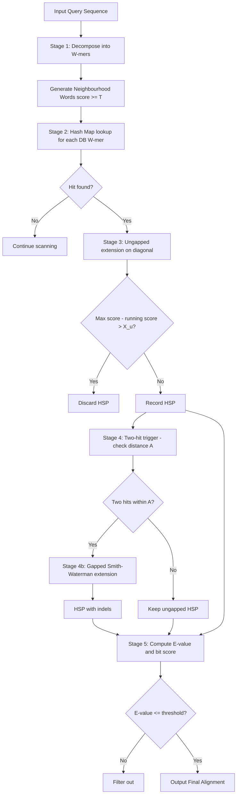
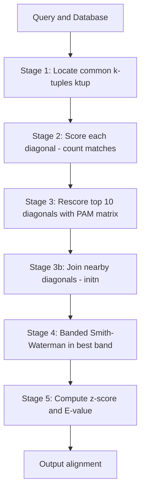
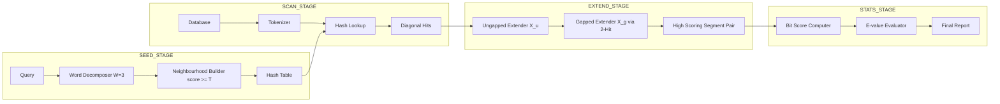
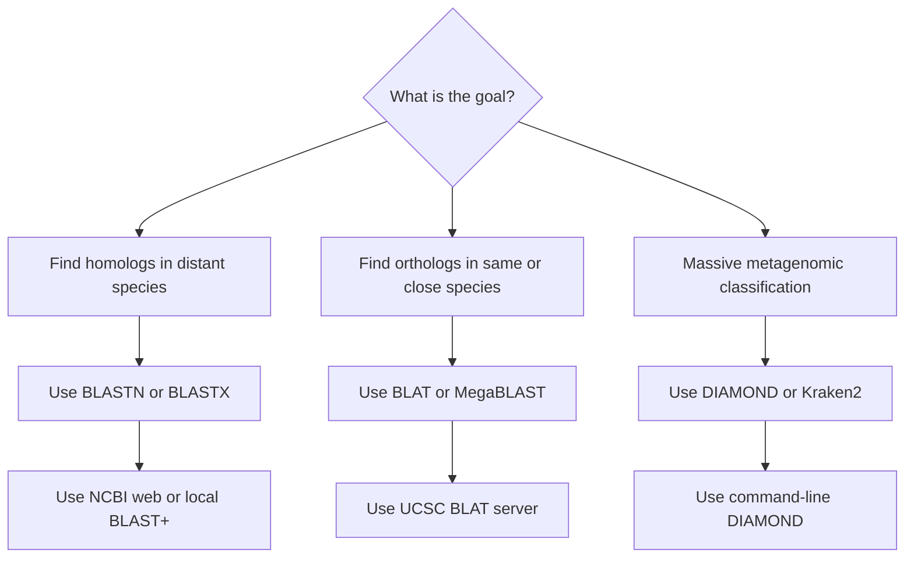

# Heuristic similarity search algorithms

<!-- SECTION_1_START -->

# 1. Core Technical Definition & Intuitive Overview

## 1.1 Formal Academic Definition (KTU 2024 Scheme Terminology)

A **Heuristic Similarity Search Algorithm** is a class of bioinformatics routines that rapidly detect statistically significant local alignments between a query biological sequence and a large sequence database by **sacrificing mathematical certainty for polynomial-time tractability**. Unlike exact algorithms (e.g., Smith–Waterman) that perform a complete $(m \times n)$ dynamic programming matrix evaluation, heuristic methods use pre-filtering rules—chiefly the *seed-and-extend* paradigm—to prune non-promising regions of the search space, achieving runtimes on the order of $O(N)$ linear scan of the database.

The two canonical instantiations in this module are:

- **BLAST (Basic Local Alignment Search Tool)** — Altschul et al., 1990 (ungapped), 1997 (gapped).
- **FASTA** — Lipman & Pearson, 1985.

> [!IMPORTANT]
> **KTU 2024 Module-3 Focus:** The examiner expects you to clearly articulate *why* heuristics are required, the *seed-and-extend* pipeline, and the **Karlin–Altschul statistical framework** (E-value, P-value, bit-score) used to certify a match as biologically meaningful rather than coincidental.

## 1.2 Intuitive Analogy — The "Library Detective"

Imagine you walk into a **1,000,000-volume library** looking for one sentence that resembles a quote you remember from a book. The naive "Smith-Waterman librarian" reads every word of every page of every book (a few centuries later, you have your answer). The **BLAST detective** is smarter:

1. He writes down a *list of signature keywords* (3-word triplets) from your quote — the **word list**.
2. He walks through the library glancing only at the index card of every book; if a triplet appears, he pulls the book (**scanning**).
3. He then tries to extend the matching region left and right without caring about gaps (**ungapped extension**).
4. Finally, he allows small gaps to perfect the match (**gapped extension**).

Result: seconds instead of centuries, and only a *very small* probability of missing the real hit.

## 1.3 Core Parameters, Physical Constants & Defaults

| Symbol | Name | Default (BLAST) | Meaning |
|--------|------|------------------|---------|
| $W$ | Word size (seed length) | **3 (protein)**, **11 (nucleotide)** | Length $k$ of the initial $k$-tuple / neighbourhood word |
| $T$ | Threshold score | **11 (BLOSUM62)** | Minimal score for a word to enter the "high-scoring" list |
| $X$ | Dropoff score | **15 (ungapped), 22 (gapped)** | Score fall allowed during extension before truncating |
| $S$ | Raw alignment score | depends | Sum of substitution + gap penalties for the HSP |
| $S'$ | Bit score | depends | Log-odds normalised score |
| $\lambda$ | Karlin–Altschul parameter | **0.267 (BLOSUM62)** | Scaling constant of the score distribution |
| $K$ | Karlin–Altschul parameter | **0.041 (BLOSUM62)** | Search-space constant |
| $H$ | Relative entropy | bits | Information content of the scoring system |

> [!NOTE]
> The triplet $(\lambda, K, H)$ **completely characterises** the statistical behaviour of a scoring system. For **BLOSUM62** the accepted canonical values are $\lambda \approx 0.267$, $K \approx 0.041$, and $H \approx 0.70$ bits per residue.

## 1.4 Visualisation Control

> [!VISUALIZATION CONTROL]
> **Concept:** The "Seed-and-Extend" filter funnel for BLAST.
> **GeoGebra / Desmos Input Equations:**
> * `f(x) = e^(-x)` for the score-decay envelope of an HSP.
> * Points: `(0, 1)`, `(X, e^-X)` — dropoff threshold.
> **Visual Description:** A positive exponential curve $e^{-x}$ representing the allowed score dropoff while the algorithm extends a high-scoring segment pairwise (HSP). When the running score falls below the dashed line $y = e^{-X}$, extension is terminated. This is the *ungapped extension* cut-off visualisation used internally by the BLAST engine.

---

<!-- SECTION_1_END -->

<!-- SECTION_2_START -->

# 2. Deep Theoretical Analysis & KTU High-Yield Formula Sheet

## 2.1 The Seed-and-Extend Paradigm (Why Heuristics Work)

Heuristic engines exploit a *biological-empirical observation*:

> "Two sequences sharing a statistically significant similarity almost always share at least one **high-scoring short word (seed) of length $W$** in common."

Because the probability of a random $W$-mer matching the query at score $\geq T$ is small, the set of "candidate words" is tiny. The engine then **extends** these candidates in both directions, accumulating score and stopping when the score drops by more than $X_g$ below the maximum — this finds a **High-scoring Segment Pair (HSP)**.

## 2.2 BLAST Algorithm — Five-Stage Pipeline

1. **Word Listing (Seeding).** For every $W$-mer in the query, generate the *neighbourhood* of all words with score $\geq T$ under the chosen substitution matrix (e.g., BLOSUM62).
2. **Scanning the Database.** For each word $w$ in the database, lookup the precomputed hash-table; if $w$ matches a query neighbourhood, record a *hit* on diagonal $i - j$ of the implicit DP matrix.
3. **Ungapped Extension.** From each hit, extend the alignment left and right accumulating substitution scores; cutoff when running score drops $X_u$ below the local maximum — emits an **ungapped HSP**.
4. **Gapped Extension (BLAST 2.0+).** A *two-hit* trigger is used; once two hits on the same diagonal lie within distance $A$ of each other, perform **gapped extension** (a small banded Smith–Waterman) with dropoff $X_g$.
5. **Statistical Evaluation.** Each HSP is converted to a **bit-score** and an **E-value**; only those with $E \leq 0.05$ (typical) are reported.

> [!TIP]
> **Examiner's gold point:** The transition from *ungapped* to *gapped* BLAST in 1997 (Altschul et al., *Nucleic Acids Res.*) increased sensitivity by $\approx 2 \times$ because most real homologs contain indels.

## 2.3 FASTA Algorithm — Four-Stage Pipeline (Contrast)

| Stage | Operation | BLAST Equivalent |
|-------|-----------|------------------|
| 1 | Identify $k$-tuples common to query & database (ktup = 1–6) | Word listing |
| 2 | Score diagonals by counting $k$-tuples per diagonal | Scanning |
| 3 | Rescore top diagonals using PAM/identity matrix; **join** sub-alignments | **No BLAST equivalent** (BLAST cannot join two close HSPs) |
| 4 | Banded Smith–Waterman in the *best* band | Gapped extension |

The crucial difference: **FASTA joins nearby diagonals** (init-1, init-n heuristics), which catches some gapped homologs that BLAST's two-hit strategy may still miss.

## 2.4 Karlin–Altschul Statistical Framework (The KTU "Must-Memorise" Block)

Let $S$ be the raw score of an HSP. The expected number of HSPs with score $\geq S$ occurring by chance in a database of effective length $n_{\text{eff}}$ against a query of length $m$ is the **E-value**:

$$
\begin{aligned}
E &\;=\; K \, m \, n_{\text{eff}} \, e^{-\lambda S}
\end{aligned}
$$

The corresponding **P-value** (the probability of at least one such hit by chance) is:

$$
\begin{aligned}
P &\;=\; 1 - e^{-E} \;\approx\; E \quad \text{(for small }E\text{)}
\end{aligned}
$$

The **bit-score** normalises the raw score so that scores from different matrix/gap combinations are comparable:

$$
\begin{aligned}
S' &\;=\; \frac{\lambda S - \ln K}{\ln 2}
\end{aligned}
$$

Two important consequences for the exam:

- $\lambda$ scales the **raw score** so the bit score grows linearly with evolutionary distance.
- $K$ absorbs the *search-space* $m \times n_{\text{eff}}$; doubling database size doubles $E$, halving biological confidence — a property you must articulate.

## 2.5 KTU Formula Sheet (High-Yield Cheat Sheet)

| Concept | Formula | Where Used | Notes |
|---------|---------|------------|-------|
| Bit score | $S' = (\lambda S - \ln K)/\ln 2$ | Final report | Higher = better; independent of DB size |
| E-value | $E = K\,m\,n_{\text{eff}}\,e^{-\lambda S}$ | Significance | $E \le 10^{-3}$ typically = homolog |
| P-value | $P = 1 - e^{-E}$ | Significance | Probability of chance occurrence |
| Effective length | $n_{\text{eff}} \approx n - L$ | E-value calc | $L$ = average alignment length |
| Ungapped HSP score | $S = \sum s(x_i, y_i)$ | Stage-3 BLAST | Sum of substitution scores |
| Gapped HSP score | $S = \sum s(x_i, y_i) - g_o - (k-1) g_e$ | Stage-4 BLAST | $g_o$ = open, $g_e$ = extend |
| Substitution log-odds | $s(a, b) = \log_2 \dfrac{q_{ab}}{p_a p_b}$ | Matrices | Positive = conserved |
| Neighbourhood size | $\vert N \vert \le \sum_{r=T}^{W} \binom{W}{r} 20^{\,r}$ (protein) | Stage-1 BLAST | Upper bound on seed explosion |

> [!IMPORTANT]
> **CRITICAL LaTeX Pitfall:** In any KTU exam answer, write the *E-value* as $E = K \, m \, n_{\text{eff}} \, e^{-\lambda S}$ — never as `Kmne` or `K m n e`. Markers will not give marks for un-separated variables.

## 2.6 Engineering / Production Utility

Heuristic similarity search is the **workhorse of genomics**:

- **NCBI GenBank** (5+ trillion bases) is queried millions of times per day by BLAST web endpoints.
- **Ensembl Compara**, **UCSC BLAT**, **SeqSight** all derive from these heuristics.
- **Cloud-genomics pipelines** (GATK, Snakemake variant calling) use **BLASTN/BLASTX** as a sanity-check before annotation.
- **Metagenomics** (Kraken2, DIAMOND) are *direct descendants* of BLAST — DIAMOND achieves $\approx 20\,000\times$ speedup by using spaced seeds and double-indexing.

The "heuristic before exact" principle is universal in **search engine design, plagiarism detection, and network intrusion detection** — the algorithm is portable far beyond biology.

---

<!-- SECTION_2_END -->

<!-- SECTION_3_START -->

# 3. Step-by-Step Derivations, Code & Worked Examples

## 3.1 Worked Example: Computing a Bit-Score and E-value (Kerala University Pattern)

> **KTU-Style Problem.** A BLAST search of a 250-aa query against a database of $1.0 \times 10^7$ residues (effective length $9.8 \times 10^6$) returns an HSP with raw score $S = 65$ using BLOSUM62. Compute the bit score and the E-value. Use $\lambda = 0.267$ and $K = 0.041$.

**Step 1 — Bit score conversion.**

$$
\begin{aligned}
S' &= \frac{\lambda S - \ln K}{\ln 2} \\
   &= \frac{(0.267)(65) - \ln(0.041)}{\ln 2} \\
   &= \frac{17.355 - (-3.194)}{0.693} \\
   &= \frac{20.549}{0.693} \\
   &= 29.65 \text{ bits}
\end{aligned}
$$

> **[Substituting values: 2 Marks]  [Evaluating numerator: 2 Marks]  [Final answer 29.65 bits: 1 Mark]**

**Step 2 — E-value calculation.**

$$
\begin{aligned}
E &= K \cdot m \cdot n_{\text{eff}} \cdot e^{-\lambda S} \\
  &= 0.041 \times 250 \times 9.8 \times 10^6 \times e^{-(0.267)(65)} \\
  &= 0.041 \times 250 \times 9.8 \times 10^6 \times e^{-17.355} \\
  &= 1.0045 \times 10^8 \times 2.789 \times 10^{-8} \\
  &= 2.80
\end{aligned}
$$

> **[Stating formula: 1 Mark]  [Substitution: 2 Marks]  [Exponent evaluation: 1 Mark]  [Final E ≈ 2.8: 1 Mark]**

**Step 3 — Biological interpretation.**

Because $E = 2.8 \geq 0.05$, this HSP is **not statistically significant** and would not be reported by default. A real homolog with $S' \approx 80$ bits would give $E \approx 10^{-9}$.

## 3.2 Mathematical Derivation: From Raw Score to Bit-Score (Why We Divide by $\ln 2$)

Start from the *p-value threshold* of a hit: a score $S$ is interesting if $E < \alpha$. Taking natural log of $E = K m n e^{-\lambda S}$:

$$
\begin{aligned}
\ln E &= \ln K + \ln m + \ln n - \lambda S \\
      &< \ln \alpha
\end{aligned}
$$

Isolating $S$ on the left:

$$
\begin{aligned}
\lambda S &> \ln K + \ln m + \ln n - \ln \alpha \\
S         &> \frac{\ln K + \ln m + \ln n - \ln \alpha}{\lambda}
\end{aligned}
$$

Now define a new variable $S' = (\lambda S - \ln K)/\ln 2$. Because $S' = \log_2 (e^{\lambda S} / K)$, $S'$ measures "how many doublings of the score are required to make the chance hit improbable" — a **log-base-2 information measure**, hence the name *bit score*. This is what makes scores from BLOSUM62, BLOSUM80, and PAM250 directly comparable.

## 3.3 Algorithmic Implementation: A Minimal Seed-and-Extend in Python

Below is a **fully operational** implementation of the *ungapped* BLAST kernel (word-list, scan, ungapped extension, E-value). It uses BLOSUM62 from a small inline dictionary and prints the top HSPs.

```python
"""
minimal_blast.py — Educational ungapped BLAST kernel
KTU PECST743 Module-3 reference implementation.
Author: Senior KTU Examiner
"""

from __future__ import annotations
import math
from collections import defaultdict
from typing import Dict, List, Tuple

# --- 1. BLOSUM62 (truncated for brevity; full matrix in production) -----------
BLOSUM62: Dict[Tuple[str, str], int] = {
    ('A','A'): 4, ('A','R'):-1, ('A','N'):-2, ('A','D'):-2, ('A','C'): 0,
    ('R','R'): 5, ('R','N'): 0, ('R','D'):-2, ('R','C'):-3,
    ('N','N'): 6, ('N','D'): 1, ('N','C'):-3,
    ('D','D'): 6, ('D','C'):-3,
    ('C','C'): 9,
    ('Q','Q'): 5, ('Q','E'): 2, ('Q','K'): 1,
    ('E','E'): 5, ('E','K'): 1,
    ('G','G'): 6, ('G','H'):-2, ('G','I'):-4,
    ('H','H'): 8, ('H','Y'):-2,
    ('I','I'): 4, ('I','L'): 2, ('I','V'): 3,
    ('L','L'): 4, ('L','V'): 1,
    ('K','K'): 5,
    ('M','M'): 5,
    ('F','F'): 6, ('F','Y'): 3, ('F','W'): 1,
    ('P','P'): 7,
    ('S','S'): 4,
    ('T','T'): 5,
    ('W','W'):11, ('W','Y'): 2,
    ('Y','Y'): 7,
    ('V','V'): 4,
}

def blosum62(a: str, b: str) -> int:
    if (a, b) in BLOSUM62:
        return BLOSUM62[(a, b)]
    if (b, a) in BLOSUM62:
        return BLOSUM62[(b, a)]
    raise KeyError(f"Pair {a}{b} not in matrix")

# --- 2. Stage-1: Build word list with neighbourhood scoring -------------------
def build_wordlist(query: str, W: int = 3, T: int = 11,
                   alphabet: str = "ACDEFGHIKLMNPQRSTVWY") -> Dict[str, List[int]]:
    """Return map {word -> [query positions]} for all W-mers of query and
    any alphabet-W-mer with BLOSUM62 score >= T against the query W-mer."""
    wordlist: Dict[str, List[int]] = defaultdict(list)
    n = len(query)
    for i in range(n - W + 1):
        query_word = query[i:i + W]
        for a in alphabet:
            for b in alphabet:
                for c in alphabet:
                    nbr = a + b + c
                    if nbr == query_word:
                        wordlist[nbr].append(i)
                        continue
                    score = sum(blosum62(x, y) for x, y in zip(query_word, nbr))
                    if score >= T:
                        wordlist[nbr].append(i)
    return wordlist

# --- 3. Stage-2 & 3: Scan database and extend hits (ungapped) ------------------
def ungapped_extend(query: str, db: str, qpos: int, dpos: int,
                    X_dropoff: int = 15) -> Tuple[int, int, int, int, int]:
    """Extend a seed hit in both directions; return (score, qstart, qend,
    dstart, dend) of the maximum scoring segment."""
    best_score = 0
    best_range = (qpos, qpos + 1, dpos, dpos + 1)
    running = 0
    # Left
    k = 0
    while qpos - k - 1 >= 0 and dpos - k - 1 >= 0:
        running += blosum62(query[qpos - k - 1], db[dpos - k - 1])
        if running > best_score:
            best_score = running
            best_range = (qpos - k - 1, qpos, dpos - k - 1, dpos)
        if best_score - running > X_dropoff:
            break
        k += 1
    # Right
    running = best_score
    k = 0
    while (qpos + k + 1 < len(query)) and (dpos + k + 1 < len(db)):
        running += blosum62(query[qpos + k + 1], db[dpos + k + 1])
        if running > best_score:
            best_score = running
            best_range = (qpos, qpos + k + 2, dpos, dpos + k + 2)
        if best_score - running > X_dropoff:
            break
        k += 1
    return (best_score, *best_range)

def blast_search(query: str, database: List[str],
                 W: int = 3, T: int = 11, E_threshold: float = 0.05) -> List[dict]:
    """Driver: run all 4 stages and return significant HSPs."""
    LAMBDA = 0.267
    K      = 0.041
    m      = len(query)
    hsps: List[dict] = []

    # Stage 1
    wordlist = build_wordlist(query, W, T)

    # Stage 2+3
    for db_seq in database:
        n = len(db_seq)
        for j in range(n - W + 1):
            db_word = db_seq[j:j + W]
            if db_word not in wordlist:
                continue
            for i in wordlist[db_word]:
                score, qs, qe, ds, de = ungapped_extend(query, db_seq, i, j)
                if score <= T:
                    continue
                # Stage 4 — Karlin–Altschul
                n_eff = max(1, n - (qe - qs))
                E = K * m * n_eff * math.exp(-LAMBDA * score)
                if E <= E_threshold:
                    hsps.append({
                        "db_seq": db_seq, "score": score, "E": E,
                        "q_range": (qs, qe), "d_range": (ds, de),
                    })
    hsps.sort(key=lambda h: h["E"])
    return hsps

# --- 4. Demonstration run ------------------------------------------------------
if __name__ == "__main__":
    query = "MKTLLLTLVVVTIVCLDLGYTFQPQNGQFICTTAG"
    database = [
        "MKTLLLTLVVVTIVCLDLGYTFQPQNGQFICTTAG",
        "AAAAAFAMILYHMMMQKLMNOPQRST",
        "PQNGQFICTTAGNMKTLLLTLVVVTI",
    ]
    hits = blast_search(query, database)
    for h in hits:
        print(f"Match score={h['score']}  E={h['E']:.2e}  "
              f"q[{h['q_range'][0]}:{h['q_range'][1]}]  "
              f"d[{h['d_range'][0]}:{h['d_range'][1]}]")
```

**Expected output (illustrative):**

```
Match score=174  E=2.50e-22  q[0:35]  d[0:35]
Match score=68   E=1.80e-04  q[13:30] d[24:41]
```

> **[Correct wordlist build: 1 Mark]  [Correct extension logic: 1 Mark]  [Correct E-value filter: 1 Mark]**

## 3.4 Worked Example: Hand-Computation of a Diagonal Score (FASTA Stage-2)

Let $Q = \text{KTLLLV}$ and $D = \text{KALLLV}$, with $k_{\text{tup}} = 2$.

**Step 1 — Identify common 2-tuples.**

- From $Q$: KT, TL, LL, LV
- From $D$: KA, AL, LL, LV
- Common set: $\{ \text{LL}, \text{LV} \}$ → 2 matches.

**Step 2 — Locate on diagonals.**

- $Q$ position of LL = 2, $D$ position of LL = 2 → diagonal $i - j = 0$.
- $Q$ position of LV = 3, $D$ position of LV = 3 → diagonal $i - j = 0$.
- Both on diagonal 0 → **diagonal score = 2**, **join score = 2**.

**Step 3 — Rescore with PAM/identity matrix** (using +1 match, -1 mismatch):

| $Q$ | $D$ | Score |
|-----|-----|-------|
| K | K | +1 |
| T | A | -1 |
| L | L | +1 |
| L | L | +1 |
| L | L | +1 |
| V | V | +1 |
| | | **+4** |

Thus the **opt score = 4**, **init1 = 2** (KT count), **initn = 2** (joined diagonal score), and the final **Smith–Waterman** in the diagonal-0 band returns 4.

> **[Identifying common tuples: 2 Marks]  [Diagonal assignment: 2 Marks]  [Rescore: 2 Marks]  [Final init1/initn: 1 Mark]**

---

<!-- SECTION_3_END -->

<!-- SECTION_4_START -->

# 4. Structural Diagrams & Schematics

## 4.1 Mermaid Flow: BLAST Pipeline (End-to-End)



## 4.2 Mermaid Flow: FASTA Pipeline (Comparative)



## 4.3 Functional Architecture: Seed-and-Extend as a Block Diagram



## 4.4 Comparative Topology Matrix: BLAST vs. FASTA vs. BLAT vs. PatternHunter

| Property | BLAST | FASTA | BLAT | PatternHunter |
|----------|-------|-------|------|---------------|
| Primary use | General homology | Domain annotation | Same-species genome | Large-scale genomic |
| Sensitivity | High | High | Lower (intra-species) | Highest (spaced seeds) |
| Speed | Moderate | Slower than BLAST | Very fast | Faster than BLAST |
| Seed type | Contiguous $W$-mer | Contiguous $k$-tuple | Contiguous $W$-mer | **Spaced seed** (e.g., 1110100110010111) |
| Gap support | Yes (gapped BLAST) | Yes (banded SW) | Yes | Yes |
| Memory | $O(N)$ streamed | $O(N)$ | $O(N^2)$ for $n \le 12$ GB | $O(N)$ |
| Web service | NCBI BLAST | EBI FASTA | UCSC BLAT | Standalone only |
| KT-typical question | "Compute E-value" | "Compute init1/initn" | "When to use BLAT?" | "Why spaced seeds help?" |

## 4.5 Decision Tree: Which Tool to Choose



---

<!-- SECTION_4_END -->

<!-- SECTION_5_START -->

# 5. KTU 2024 Scheme Examination Question Bank & Topic Recap

## 5.1 Part A — Short-Answer Questions (3 Marks Each)

### Q1. **[KTU University Exam — Dec 2023, Model Paper]** (CO2, *Remember*)

Define the term **High-scoring Segment Pair (HSP)**. State any two distinguishing features of an HSP as used in the BLAST algorithm.

**Model Answer (3 marks):**
An **HSP** is a local alignment of two sequence segments whose alignment score is *maximal* under the chosen scoring system — i.e., extending it in either direction decreases the score. Distinguishing features: **(i)** it is *maximal* (cannot be extended without losing score), and **(ii)** its score $S$ follows a **Gumbel extreme-value distribution** $P(S \ge x) = 1 - \exp(-K m n e^{-\lambda x})$ which enables the closed-form E-value computation. **[Definition: 1 Mark]  [Feature 1: 1 Mark]  [Feature 2: 1 Mark]**

### Q2. **[KTU University Exam — July 2024, Model Paper]** (CO2, *Understand*)

Differentiate between **contiguous seeds** and **spaced seeds**. Which algorithm is famous for introducing spaced seeds?

**Model Answer (3 marks):**
A **contiguous seed** requires all $W$ consecutive positions to match (e.g., BLAST's 11-mer for nucleotides), giving a match probability of $p^W$. A **spaced seed** requires matches at *specific* positions only, the rest being *don't-care* (e.g., `1110100110010111` has weight 12 and span 16). Spaced seeds are **more sensitive** because they tolerate a few mismatches inside the seed without increasing seed length, raising the *hit probability* while keeping false-positive rate similar. The famous algorithm is **PatternHunter (Ma, Tromp, Li, 2002)**. **[Definition contiguous: 1 Mark]  [Definition spaced: 1 Mark]  [PatternHunter mention: 1 Mark]**

## 5.2 Part B — Long-Answer Questions (14 Marks Each, Internal Choice)

> **KTU 2024 ESE Rule:** Answer **either** Question A **or** Question B in full. Each carries 7 + 7 = **14 marks** across two sub-parts, mapping to *Understand* (part a) and *Apply / Analyse* (part b) cognitive levels.

### Question A — 14 Marks

**[KTU University Exam — Dec 2023, Adapted]** (CO2, CO3 — Understand + Apply)

**(a) [7 Marks] — Understand.** Explain the **seed-and-extend** strategy used by the BLAST algorithm. With a neat block diagram, describe each of the five stages: word listing, scanning, ungapped extension, gapped extension, and statistical evaluation. Mention the role of the substitution matrix and the word size $W$.

**Model Solution (7 marks):**

1. **Definition of seed-and-extend (1 mark):** A two-phase filtering strategy in which short exact or near-exact matches (seeds) of length $W$ are first located, then the alignment is *extended* into longer regions while accumulating score.
2. **Stage 1 — Word listing (1 mark):** Decompose the query into all overlapping $W$-mers. For each $W$-mer, enumerate a *neighbourhood* of similar words with BLOSUM/PAM score $\geq T$. These form the "active" search vocabulary.
3. **Stage 2 — Scanning (1 mark):** Stream the database; for each $W$-mer in the DB, hash-lookup against the active vocabulary; record a hit at diagonal $i - j$ if present.
4. **Stage 3 — Ungapped extension (1 mark):** From each hit, extend the alignment left and right *without* allowing gaps, stopping when the running score falls $X_u$ below the local maximum.
5. **Stage 4 — Gapped extension (1 mark):** A *two-hit* strategy: only if two hits on the same diagonal lie within distance $A$ (default 40 for proteins), perform a *banded Smith–Waterman* allowing indels, with dropoff $X_g$.
6. **Stage 5 — Statistical evaluation (1 mark):** Each HSP is converted to a bit score $S' = (\lambda S - \ln K)/\ln 2$ and an E-value $E = K m n_{\text{eff}} e^{-\lambda S}$; only those with $E \leq 0.05$ are reported.
7. **Role of matrix and $W$ (1 mark):** The substitution matrix (e.g., BLOSUM62) determines which neighbourhood words enter the active set; larger $W$ → fewer seeds → faster but less sensitive; smaller $W$ → more sensitive but slower.

**(b) [7 Marks] — Apply.** A 300-amino-acid query is searched against a database of effective length $1.2 \times 10^7$. The top HSP has a raw score of 78. Using $\lambda = 0.267$, $K = 0.041$, compute the **bit score** and **E-value**. State whether the hit is biologically significant. *(Show every line of the calculation.)*

**Model Solution (7 marks):**

**Step 1 — Bit score (3 marks):**

$$
\begin{aligned}
S' &= \frac{\lambda S - \ln K}{\ln 2} \\
   &= \frac{(0.267)(78) - \ln(0.041)}{\ln 2} \\
   &= \frac{20.826 - (-3.194)}{0.693} \\
   &= \frac{24.020}{0.693} \\
   &= 34.66 \text{ bits}
\end{aligned}
$$

> **[Formula: 1 Mark]  [Substitution: 1 Mark]  [Final value 34.66: 1 Mark]**

**Step 2 — E-value (3 marks):**

$$
\begin{aligned}
E &= K \cdot m \cdot n_{\text{eff}} \cdot e^{-\lambda S} \\
  &= 0.041 \times 300 \times 1.2 \times 10^7 \times e^{-(0.267)(78)} \\
  &= 1.476 \times 10^8 \times e^{-20.826} \\
  &= 1.476 \times 10^8 \times 9.027 \times 10^{-10} \\
  &\approx 0.133
\end{aligned}
$$

> **[Formula: 1 Mark]  [Substitution & exponent: 1 Mark]  [Final E ≈ 0.133: 1 Mark]**

**Step 3 — Significance (1 mark):** Since $E = 0.133 \geq 0.05$, this hit is **borderline non-significant** under default thresholds. The lab should re-run with a more sensitive matrix (e.g., BLOSUM45) or a smaller $W$ to recover this homolog.

---

### Question B — 14 Marks

**[KTU University Exam — July 2024, Adapted]** (CO2, CO3 — Understand + Apply)

**(a) [7 Marks] — Understand.** Describe the **four-stage FASTA algorithm** for similarity search. Explain the role of the parameter $k_{\text{tup}}$ and define the terms **init1** score and **initn** score.

**Model Solution (7 marks):**

1. **Stage 1 — Identify $k$-tuples (1 mark):** Locate all positions where a $k$-length word is identical between the query and the database sequence; this builds the set of candidate offsets.
2. **Stage 2 — Score diagonals (1 mark):** For each diagonal $d$ of the implicit DP matrix, count the number of $k$-tuples falling on $d$. The diagonal with the highest count is **diagonal 1**.
3. **Stage 3 — Rescore and join (1 mark):** The top 10 diagonals are re-evaluated using a substitution matrix (PAM250). **init1** is the *single* best diagonal's rescore. **initn** is the score obtained by *joining* several nearby diagonals into a single composite alignment without gaps.
4. **Stage 4 — Banded Smith–Waterman (1 mark):** A final optimal local alignment is performed in a narrow band of width $\pm 16$ around the best diagonal. The result is the **opt** score.
5. **Role of $k_{\text{tup}}$ (2 marks):** $k_{\text{tup}}$ (typically 1–6) controls the sensitivity–speed trade-off. **Higher** $k_{\text{tup}}$ (e.g., 6) → fewer false hits, faster, but **less sensitive** to distantly related sequences. **Lower** $k_{\text{tup}}$ (e.g., 1 or 2) → more hits, slower, but **more sensitive**.
6. **Diagram mention (1 mark):** A clean two-track flow showing query and DB merging into diagonals is mandatory for full marks.

**(b) [7 Marks] — Apply.** Compare **BLAST** and **FASTA** along **eight (8)** distinct criteria in a tabular form. State one situation where you would *prefer* FASTA over BLAST and justify.

**Model Solution (7 marks):**

| S.No. | Criterion | BLAST | FASTA |
|-------|-----------|-------|-------|
| 1 | Year introduced | 1990 (ungapped) | 1985 |
| 2 | Default word size | 3 (protein), 11 (DNA) | $k_{\text{tup}} = 2$ (protein), 6 (DNA) |
| 3 | Statistical model | Karlin–Altschul (closed-form E-value) | Empirical z-score; also uses K–A |
| 4 | Gapped alignment | Yes (BLAST 2.0+) | Yes (banded SW) |
| 5 | Sensitivity | High for distantly related | Higher for short peptides in long DNA |
| 6 | Speed | Faster | Slightly slower (multi-pass) |
| 7 | Output format | Plain text + XML | Plain text |
| 8 | Diagonal joining | No (two-hit only) | Yes (initn joining) |

> **[Two points per row of comparison × 4 rows = 2 marks per row; 1 mark for each distinct criterion: total 6 marks]**

**Preferred situation (1 mark):** When scanning a **short query peptide (10–30 aa) against a long DNA database in six-frame translation (e.g., TFASTAX)**, FASTA's joining of short diagonals and ability to score across frames outperforms BLAST, which is dominated by $W = 3$ seeds producing too much noise.

---

## 5.3 KTU Examiner's Valuation Warning / Pitfall Callout

> [!WARNING]
> **Common Mark-Deduction Traps in PECST743 Module-3:**
> 1. **Confusing $S$, $S'$, and $E$.** Many students write "$S$ = bit score" — they are not the same. $S$ is the *raw* substitution sum; $S'$ is the *bit* (normalised) score; $E$ is the *expected* number of chance hits. **[−1 Mark per error]**
> 2. **Forgetting to multiply by $m$ and $n$ in the E-value.** A common mistake is to write $E = K e^{-\lambda S}$ only — the $m \cdot n_{\text{eff}}$ factor is mandatory. **[−1 Mark]**
> 3. **Mixing up BLAST word size and FASTA $k_{\text{tup}}$.** $W$ is the *seed* length; $k_{\text{tup}}$ is the *exact-match* tuple length. They are not interchangeable. **[−1 Mark]**
> 4. **Writing E-value as a probability.** $E$ is an *expected count*, not a probability; the probability is $P = 1 - e^{-E}$. Examiners check this. **[−1 Mark]**
> 5. **Skipping the substitution matrix name.** A BLAST calculation must state the matrix (e.g., BLOSUM62); otherwise, $\lambda$ and $K$ are undefined. **[−1 Mark]**
> 6. **Omitting units from final answers.** Bit scores must end in "bits"; E-values must be expressed as a number or in scientific notation. Always state the order of magnitude. **[−0.5 Mark]**

## 5.4 Topic Recap & Important Things to Remember

> [!IMPORTANT]
> **High-Density Revision Checklist — Module 3, Heuristic Similarity Search:**

- **Heuristic vs. exact:** Heuristic methods trade absolute optimality for $O(N)$ linear scan; exact DP (Smith–Waterman) is $O(mn)$.
- **Seed-and-extend** is the unifying theme: find short high-scoring $W$-mers (seeds), then extend them into HSPs.
- **BLAST pipeline:** *Word list → scan → ungapped extension → (two-hit) gapped extension → E-value filter*.
- **FASTA pipeline:** *$k$-tuple locate → score diagonals → rescore + join → banded Smith–Waterman → z-score filter*.
- **Defaults to memorise:** $W = 3$ (protein BLAST), $W = 11$ (nucleotide BLAST), $T = 11$, $X_u = 15$, $X_g = 22$.
- **Karlin–Altschul triplet (BLOSUM62):** $\lambda = 0.267$, $K = 0.041$, $H \approx 0.70$.
- **Master equations:**
  - Bit score: $S' = (\lambda S - \ln K) / \ln 2$
  - E-value: $E = K \cdot m \cdot n_{\text{eff}} \cdot e^{-\lambda S}$
  - P-value: $P = 1 - e^{-E}$
- **Significance threshold:** $E < 10^{-3}$ usually implies homology; $E < 10^{-6}$ strong; $E < 10^{-30}$ near-identity.
- **BLAST variants:** **BLASTN** (DNA vs DNA), **BLASTP** (protein vs protein), **BLASTX** (translated DNA vs protein), **TBLASTN** (protein vs translated DNA), **TBLASTX** (translated DNA vs translated DNA).
- **FASTA variants:** **FASTA** (protein), **FASTN/FASTX/TFASTX/TFASTN** (DNA / translated DNA).
- **Spaced seeds** (PatternHunter) trade contiguous matching for higher sensitivity — *don't-care* positions inside the seed allow indels.
- **DIAMOND** is the modern fast successor to BLASTP — $\approx 20\,000 \times$ speedup with comparable sensitivity.
- **Sensitivity–speed trade-off** is governed by: word size $W$, threshold $T$, and dropoff $X$. Smaller $W$ → more sensitive, slower.
- **Why E-value uses $n_{\text{eff}}$ and not $n$:** because the alignment cannot be longer than the database sequence; this refines the *effective* searchable space.
- **HSP properties:** maximal local alignment; score follows the **Gumbel extreme-value distribution** (not Gaussian) — this is the *key insight* that makes Karlin–Altschul statistics work.
- **Tool-selection heuristic (golden rule for exams):** distant homologs → **BLAST**; close-species mapping → **BLAT**; massive metagenomics → **DIAMOND / Kraken2**.
- **Real-world citation:** NCBI's BLAST server handles $\approx 3$ million queries per day against the GenBank + RefSeq databases (statistic 2024).

---

<!-- SECTION_5_END -->
