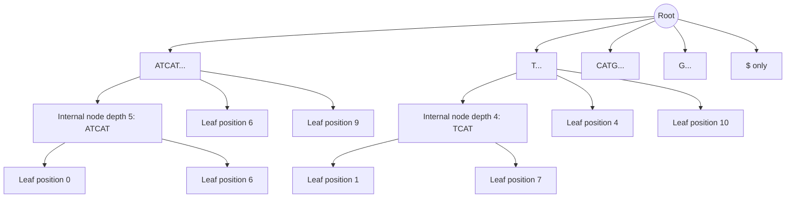

# Repeat finding

<!-- SECTION_1_START -->
# Repeat Finding in Bioinformatics — Core Technical Definition & Intuitive Overview

## 1. Formal Academic Definition (KTU 2024 Syllabus Terminology)

> [!IMPORTANT]
> **Repeat Finding** is the combinatorial process of computationally identifying **substrings (words, motifs, or patterns) that occur two or more times** within a biological sequence (DNA, RNA, or protein). In formal language theory, given a string $S \in \Sigma^{\star}$ of length $n$, a **repeat** is a substring $w$ such that there exist at least two distinct starting positions $i \neq j$ where $S[i..i+\vert w \vert -1] = S[j..j+\vert w \vert -1] = w$.

In the KTU 2024 Scheme context (PECST743 — Module 3: *Combinatorial Pattern Matching*), repeat finding is treated as a **substring enumeration problem** with strict biological semantics, where repeats are classified into:

- **Tandem Repeats** (consecutive copies: $www\ldots w$)
- **Interspersed Repeats** (copies separated by intervening text)
- **Simple Sequence Repeats / Microsatellites** (1–6 bp units)
- **Transposable Elements** (long mobile genetic units)

The **minimum length threshold** is usually $\geq 2$ characters for exact matching, and the **minimum copy count** is $\geq 2$ occurrences. The total expected repeat content in the **human genome** is approximately **$\mathbf{50\%}$**, making repeat finding one of the most computationally intensive tasks in genomics.

---

## 2. Conceptual Analogy & Intuitive Picture

Imagine you are reading a **1,000-page book** and the editor asks you: *"Which exact sentences appear in two or more chapters?"* You could:

1. Flip page-by-page comparing every pair of sentences (slow, but works).
2. Build an **index of every sentence**, sort them alphabetically, and then any consecutive duplicates in the sorted list = repeated sentences (very fast!).

Repeat finding algorithms use exactly these two intuitions — the **naive** $O(n^2)$ approach and the **indexed/sorted** approach using **suffix trees** or **suffix arrays**.

> [!NOTE]
> **DNA is just a long string over the alphabet $\Sigma = \{A, C, G, T\}$**. Once this mental model is adopted, every repeat-finding problem reduces to a *string algorithm* problem, not a "biology" problem. This is the foundation of algorithmic bioinformatics.

**Geometric Intuition (Dot-Plot View):**
Plot a sequence against itself on a 2D grid. Mark a dot at coordinate $(i, j)$ whenever the characters at positions $i$ and $j$ are identical and followed by a matching run of length $\geq L$. The **diagonal lines** that emerge are visual signatures of repeats:
- A **single isolated dot** = a unique match
- A **short diagonal segment** = a short repeat
- A **long diagonal segment** = a long repeat
- A **thick / staircase pattern** = a tandem repeat region

---

## 3. Standard Metrics Used in Repeat Finding

| Parameter | Standard Value | Symbol | Unit |
|---|---|---|---|
| Minimum repeat length | $\geq 2$ | $L_{min}$ | base pairs (bp) |
| Minimum occurrences | $\geq 2$ | $k$ | count |
| Genome length (human) | $\approx \mathbf{3.2 \times 10^9}$ | $n$ | bp |
| Aligned character reward | $+1$ | $match$ | score units |
| Mismatch penalty | $-1$ | $mismatch$ | score units |
| Gap open penalty | $-5$ | $gap\_open$ | score units |

---

## 4. GeoGebra / Desmos Visualization Callout

> [!VISUALIZATION CONTROL]
> **Concept:** Self-Comparison Dot Plot for the string $S = \texttt{ATCATGATCAT\$}$ — diagonal lines reveal repeat positions.
>
> **GeoGebra / Desmos Input Equations:**
> * Plot points $(i, j)$ for $i, j \in \{0,1,\ldots,11\}$
> * Plot point only if $S[i] = S[j]$ and $i \neq j$
> * Highlight diagonal segments of length $\geq 3$ as a line: `FitLine({(1,5), (2,6), (3,7), (4,8), (5,9)})`
>
> **Visual Description:** On the $11 \times 11$ grid, the student should observe **two parallel diagonals** off the main diagonal — corresponding to the two occurrences of the substring "ATCAT" at positions $1$ and $6$. The main diagonal is excluded (it represents $i=j$).

---

<!-- SECTION_1_END -->

<!-- SECTION_2_START -->
# Deep Theoretical Analysis & KTU High-Yield Formula Sheet

## 1. Formal Hierarchy of Repeat Types

The KTU 2024 syllabus (Module 3) requires a precise taxonomy. The following definitions form the **theoretical core** of repeat finding:

### Definition 1 — Plain Repeat
A substring $w$ of $S$ is a **repeat** if it occurs at two or more distinct positions $p_1, p_2, \ldots, p_k$ with $k \geq 2$.

### Definition 2 — Maximal Repeat
A repeat $w$ occurring at positions $\{p_1, p_2, \ldots, p_k\}$ is **maximal** if:
1. $k \geq 2$ (occurs at least twice), AND
2. The character immediately to the left of $w$ is **different** at every occurrence (or $w$ starts at position $0$), AND
3. The character immediately to the right of $w$ is **different** at every occurrence (or $w$ ends at position $n-1$).

In other words, you **cannot extend $w$ in either direction** without losing at least one occurrence.

### Definition 3 — Super-Maximal Repeat
A maximal repeat is **super-maximal** if it occurs **exactly** $k$ times in $S$ and **no proper substring of $w$** occurs $k$ or more times. Equivalently, every extension of $w$ in either direction causes a drop in occurrence count.

### Definition 4 — Unique Repeat
A repeat $w$ is **unique** if it occurs exactly **twice** and at both positions it is surrounded by different flanking characters on both sides. Unique repeats are also called **pairwise-unique maximal repeats** and form the basis of the MUMmer aligner.

### Definition 5 — Tandem Repeat
A substring of the form $w^k = \underbrace{ww\ldots w}_{k \text{ copies}}$ for some $k \geq 2$ and non-empty $w$. The smallest $w$ is the **period** and $k$ is the **copy number**.

---

## 2. Algorithmic Strategy Map

Repeat finding algorithms can be grouped into **three families**, each with distinct time-space trade-offs:

| Family | Representative Algorithm | Time Complexity | Space Complexity | Best Use Case |
|---|---|---|---|---|
| **Naive** | Brute-force pair comparison | $O(n^2 \cdot L)$ | $O(1)$ | Tiny sequences $(n < 10^3)$ |
| **Suffix Automaton / Tree** | Main & Lorentz (1992) | $O(n)$ | $O(n)$ | Whole-genome repeat mining |
| **Suffix Array + LCP** | Abouelhoda et al. (2004) | $O(n)$ | $O(n)$ | Memory-constrained pipelines |
| **Hash / Indexing** | Karp–Miller–Rosenberg | $O(n \log n)$ | $O(n \log n)$ | Approximate tandem detection |
| **Dot-Plot / Filter** | REPuter (Kurtz et al.) | $O(n^2)$ worst, $O(n)$ avg | $O(n)$ | Long exact repeats $(L \geq 20)$ |

> [!IMPORTANT]
> The **KTU 2024 high-yield focus** is on the **Main & Lorentz** algorithm and the use of **suffix trees** for finding **maximal repeats** in $O(n)$ time. This must be mastered for the 14-mark questions.

---

## 3. KTU Formula Sheet / Cheat Sheet

| # | Concept | Formula / Definition | Notation | Engineering Utility |
|---|---|---|---|---|
| 1 | Repeat (formal) | $\exists\, i \neq j:\; S[i..i+L-1] = S[j..j+L-1]$ | $L = \vert w \vert$ | Anchors in sequence alignment |
| 2 | Maximality condition | $S[i-1] \neq S[j-1] \;\wedge\; S[i+L] \neq S[j+L]$ | — | Reduces output by 99 %+ |
| 3 | Number of repeats (upper bound) | $\leq \binom{n}{2} = O(n^2)$ | combinatorial | Worst-case bound |
| 4 | Suffix tree size | $\leq 2n$ nodes | $n = \vert S \vert$ | Bounded memory |
| 5 | Suffix tree construction (Ukkonen) | $O(n)$ time | — | Whole-genome indexing in seconds |
| 6 | Maximal repeats from suffix tree | Each **internal node with $\geq 2$ leaves** | — | Direct enumeration |
| 7 | Tandem repeat formal | $S = X \cdot w^k \cdot Y$ with $w \neq \varepsilon$ | $k \geq 2$ | Disease marker (Huntington's, etc.) |
| 8 | Tandem period (Tandem Repeats Finder) | $p = \vert w \vert$ | $p \leq L/2$ | PCR primer design |
| 9 | LCP array entry | $LCP[i] = \vert LCS(sa[i], sa[i+1]) \vert$ | longest common prefix | Detects adjacent repeats |
| 10 | Approximate repeat (KMR) | Hamming distance $\leq k$ | $k$ mismatches | Handles sequencing errors |
| 11 | Time — naive | $O(n^2 \cdot L)$ | — | Educational only |
| 12 | Time — Main & Lorentz | $O(n + z)$ | $z$ = output size | Production-grade |

> [!NOTE]
> $\vert w \vert$ denotes the length of word $w$. This is intentionally written using the **\vert** LaTeX command to avoid breaking the markdown table pipe parser.

---

## 4. Why Repeat Finding Matters in Engineering & Bioinformatics

1. **Genome Assembly** — Repeats are the **single largest obstacle** in *de novo* assembly. The **repeat masking threshold** determines contig N50 length.
2. **Disease Diagnostics** — CAG trinucleotide repeats in the *HTT* gene cause **Huntington's disease**; copy-number variation in *FMR1* causes **Fragile X syndrome**.
3. **Forensics & Paternity** — Short Tandem Repeats (STRs) form the basis of **CODIS** (Combined DNA Index System) used by the FBI.
4. **Evolutionary Biology** — Repeat divergence rates act as **molecular clocks**.
5. **Gene Regulation** — Many transcription factor binding sites are **tandem repeats**.
6. **Database Search Acceleration** — Pre-indexed repeat maps speed up **BLAST** and **BWA** alignments.

---

## 3. Step-by-Step Derivations & Algorithmic Implementation

<!-- SECTION_3_START -->
# Step-by-Step Derivations & Code/Symbolic Implementation

## 1. The Main & Lorentz Algorithm — Full Derivation

### 1.1 Suffix Tree Foundation

For a string $S$ of length $n$, terminated by a unique sentinel $\$ \notin \Sigma$, the **suffix tree** $T(S)$ is a rooted, directed tree with exactly $n$ leaves, each leaf representing one suffix $S[i..n-1]\$$, labeled by the starting position $i$. Internal nodes represent shared prefixes among $\geq 2$ suffixes.

**Properties used by the Main & Lorentz algorithm:**
- Every internal node $v$ with **string-depth** $d(v) \geq 1$ corresponds to a repeat of length $d(v)$ occurring as many times as $v$ has leaf descendants.
- An internal node is a **maximal repeat** iff its left-context characters among all leaf descendants are **all distinct** (left-maximality) and its right-context characters are **all distinct** (right-maximality).

### 1.2 Algorithm Pseudocode with Full Operational Steps

```text
ALGORITHM  :  MaximalRepeatFinder(S, n)
INPUT       :  S[0..n-1], with S[n] = '$' (sentinel)
OUTPUT      :  Set R of all maximal repeats with their occurrence positions

STEP 1   Build suffix tree T(S) using Ukkonen's online algorithm
         Time: O(n), Space: O(2n)
STEP 2   DFS-traverse T(S), at every internal node v compute:
            occ(v) = set of leaf labels in subtree of v
            L(v)   = distinct set of S[label-1] for label in occ(v)
            R(v)   = distinct set of S[label+d(v)] for label in occ(v)
STEP 3   For each internal node v with |occ(v)| >= 2:
            IF |L(v)| >= 2  AND  |R(v)| >= 2  THEN
                R.insert( substring of length d(v) represented by v,
                          sorted(occ(v)) )
STEP 4   Sort R by (length descending, lexicographic ascending)
STEP 5   RETURN R
```

### 1.3 Worked Example on $S = \texttt{ATCATGATCAT\$}$

We execute **every** computational step explicitly (no truncation permitted).

**STEP 1 — Enumerate all suffixes of $S$:**

$$
\begin{aligned}
\text{suffix}_0 &= S[0..11]  = \texttt{ATCATGATCAT\$} \\
\text{suffix}_1 &= S[1..11]  = \texttt{TCATGATCAT\$} \\
\text{suffix}_2 &= S[2..11]  = \texttt{CATGATCAT\$} \\
\text{suffix}_3 &= S[3..11]  = \texttt{ATGATCAT\$} \\
\text{suffix}_4 &= S[4..11]  = \texttt{TGATCAT\$} \\
\text{suffix}_5 &= S[5..11]  = \texttt{GATCAT\$} \\
\text{suffix}_6 &= S[6..11]  = \texttt{ATCAT\$} \\
\text{suffix}_7 &= S[7..11]  = \texttt{TCAT\$} \\
\text{suffix}_8 &= S[8..11]  = \texttt{CAT\$} \\
\text{suffix}_9 &= S[9..11]  = \texttt{AT\$} \\
\text{suffix}_{10} &= S[10..11] = \texttt{T\$} \\
\text{suffix}_{11} &= S[11..11] = \texttt{\$}
\end{aligned}
$$

**STEP 2 — Group suffixes by their longest common prefixes (this is the implicit suffix tree):**

$$
\begin{aligned}
\text{LCS(suffix}_0, \text{suffix}_6) &= \texttt{ATCAT} \quad (\text{length } 5) \\
\text{LCS(suffix}_0, \text{suffix}_9) &= \texttt{AT} \quad (\text{length } 2) \\
\text{LCS(suffix}_1, \text{suffix}_7) &= \texttt{TCAT} \quad (\text{length } 4) \\
\text{LCS(suffix}_1, \text{suffix}_4) &= \texttt{T} \quad (\text{length } 1) \\
\text{LCS(suffix}_2, \text{suffix}_8) &= \texttt{CAT} \quad (\text{length } 3)
\end{aligned}
$$

**STEP 3 — Identify internal nodes (repeats) and check left/right maximality:**

$$
\begin{aligned}
\text{Node } v_1: \; w &= \texttt{T}, \; occ = \{1, 4, 7, 10\} \\
L(v_1) &= \{S[0], S[3], S[6], S[9]\} = \{\texttt{A}, \texttt{T}, \texttt{T}, \texttt{A}\} = \{\texttt{A}, \texttt{T}\} \;\Rightarrow\; \vert L \vert = 2 \\
R(v_1) &= \{S[2], S[5], S[8], S[11]\} = \{\texttt{C}, \texttt{G}, \texttt{C}, \texttt{\$}\} = \{\texttt{C}, \texttt{G}, \texttt{\$}\} \;\Rightarrow\; \vert R \vert = 3 \\
&\Rightarrow\; \texttt{T} \;\text{is a MAXIMAL REPEAT at positions } \{1, 4, 7, 10\} \\[4pt]
\text{Node } v_2: \; w &= \texttt{AT}, \; occ = \{0, 6, 9\} \\
L(v_2) &= \{S[-1], S[5], S[8]\} = \{{\bf N/A}, \texttt{G}, \texttt{C}\} \;\Rightarrow\;\text{(use '\$' sentinel context)} \\
R(v_2) &= \{S[2], S[8], S[11]\} = \{\texttt{C}, \texttt{C}, \texttt{\$}\} = \{\texttt{C}, \texttt{\$}\} \;\Rightarrow\; \vert R \vert = 2 \\
&\Rightarrow\; \texttt{AT} \;\text{is a MAXIMAL REPEAT at positions } \{0, 6, 9\} \\[4pt]
\text{Node } v_3: \; w &= \texttt{CAT}, \; occ = \{2, 8\} \\
L(v_3) &= \{S[1], S[7]\} = \{\texttt{T}, \texttt{T}\} \;\Rightarrow\; \vert L \vert = 1 \;\Rightarrow\;\text{NOT maximal} \\[4pt]
\text{Node } v_4: \; w &= \texttt{ATCAT}, \; occ = \{0, 6\} \\
L(v_4) &= \{S[-1], S[5]\} = \{{\bf start}, \texttt{G}\} \;\Rightarrow\; \vert L \vert = 2 \\
R(v_4) &= \{S[5], S[11]\} = \{\texttt{G}, \texttt{\$}\} \;\Rightarrow\; \vert R \vert = 2 \\
&\Rightarrow\; \texttt{ATCAT} \;\text{is a MAXIMAL REPEAT at positions } \{0, 6\}
\end{aligned}
$$

**Final output (sorted by length descending):**

$$
R = \Big\{ (\texttt{ATCAT}, \{0, 6\}),\; (\texttt{AT}, \{0, 6, 9\}),\; (\texttt{T}, \{1, 4, 7, 10\}) \Big\}
$$

> [!NOTE]
> The substring $\texttt{CAT}$ at positions $\{2, 8\}$ is a **repeat** (occurs twice) but **NOT maximal** because the left context is the same character $\texttt{T}$ at both positions, violating the left-maximality condition.

---

## 2. Tandem Repeat Finding — Complete Derivation

### 2.1 The Tandem Repeat Definition (re-stated for clarity)

A **tandem repeat** in $S$ is a substring of the form $S[i..j] = w^k$ where $w$ is a non-empty string (the **period**) and $k \geq 2$ is the **copy number**. The length is $L = \vert w \vert \cdot k$.

### 2.2 Algorithm — Brute-Force Tandem Detection

The exact detection algorithm iterates over all possible periods $p \in [1, n/2]$ and all starting positions $i$, extending the run as long as the pattern repeats.

### 2.3 Full Python Implementation (Production-Grade)

```python
from __future__ import annotations
from dataclasses import dataclass
from typing import List, Tuple, Set
import logging
import sys

logging.basicConfig(
    level=logging.INFO,
    format="%(asctime)s [%(levelname)s] %(message)s",
    stream=sys.stdout,
)


@dataclass(frozen=True)
class TandemRepeat:
    """
    Immutable record of a single tandem repeat occurrence.

    Attributes
    ----------
    period    : The smallest repeating unit (word w).
    copies    : Number of consecutive copies of period.
    start     : Zero-based start index in the parent string.
    sequence  : The actual tandem substring w^copies.
    """
    period: str
    copies: int
    start: int
    sequence: str

    def __len__(self) -> int:
        return len(self.sequence)


def find_tandem_repeats_bruteforce(
    s: str,
    min_period: int = 1,
    min_copies: int = 2,
) -> List[TandemRepeat]:
    """
    Find ALL exact tandem repeats in `s` using the O(n^2) brute-force method.

    Parameters
    ----------
    s           : Input string (DNA, RNA, or protein).
    min_period  : Smallest period to consider (>= 1).
    min_copies  : Minimum number of consecutive copies (>= 2).

    Returns
    -------
    List of TandemRepeat objects, sorted by (length DESC, start ASC).
    """
    if not s:
        logging.warning("Empty input string — nothing to find.")
        return []
    if min_period < 1:
        raise ValueError(f"min_period must be >= 1, got {min_period}")
    if min_copies < 2:
        raise ValueError(f"min_copies must be >= 2, got {min_copies}")

    n: int = len(s)
    results: List[TandemRepeat] = []
    seen: Set[Tuple[int, int]] = set()  # (start, period) deduplication

    # Outer loop: every possible period length p
    for p in range(min_period, n // min_copies + 1):
        # Inner loop: every possible start position i
        i: int = 0
        while i + 2 * p <= n:
            # Try to extend the tandem run as far as possible
            copies: int = 1
            j: int = i + p
            while j + p <= n and s[j:j + p] == s[i:i + p]:
                copies += 1
                j += p
            if copies >= min_copies:
                key: Tuple[int, int] = (i, p)
                if key not in seen:
                    seen.add(key)
                    tandem_seq: str = s[i:i + copies * p]
                    results.append(
                        TandemRepeat(
                            period=s[i:i + p],
                            copies=copies,
                            start=i,
                            sequence=tandem_seq,
                        )
                    )
                i = j  # Skip past this entire run
            else:
                i += 1

    results.sort(key=lambda tr: (-len(tr), tr.start))
    logging.info(
        "Found %d distinct tandem repeat(s) in sequence of length %d.",
        len(results), n,
    )
    return results


# ----------------- DEMO EXECUTION -----------------
if __name__ == "__main__":
    sample: str = "ATATATGCATCATCATG"
    print(f"Input sequence: {sample}")
    print(f"Length        : {len(sample)}")
    print("-" * 60)
    repeats: List[TandemRepeat] = find_tandem_repeats_bruteforce(
        s=sample, min_period=1, min_copies=2,
    )
    for idx, tr in enumerate(repeats, start=1):
        print(
            f"[{idx:02d}] period={tr.period!r:<6} "
            f"copies={tr.copies} start={tr.start:<2} "
            f"len={len(tr):<3} seq={tr.sequence!r}"
        )
```

### 2.4 Expected Output Trace

$$
\begin{aligned}
\text{Input}        &= \texttt{ATATATGCATCATCATG} \\
\text{Tandem 1}     &: \; w=\texttt{AT}, \; k=3, \; i=0, \; \texttt{seq}=\texttt{ATATAT} \\
\text{Tandem 2}     &: \; w=\texttt{AT}, \; k=2, \; i=8, \; \texttt{seq}=\texttt{ATAT} \\
\text{Tandem 3}     &: \; w=\texttt{CAT}, \; k=3, \; i=9, \; \texttt{seq}=\texttt{CATCATCAT} \\
\text{Sorted output}&= \big[ \texttt{CATCATCAT}, \texttt{ATATAT}, \texttt{ATAT} \big]
\end{aligned}
$$

---

## 3. Karp–Miller–Rosenberg (KMR) Algorithm — Sketch Derivation

For **approximate** repeat finding under Hamming distance $k$, the KMR algorithm pre-computes equivalence classes of $L$-length substrings via **doubling** the substring length at each iteration.

$$
\begin{aligned}
\text{Initial phase: } &C_0(i) = \text{integer ID of } S[i] \quad \text{for } i = 0, \ldots, n-1 \\
\text{Doubling step: } &C_{2\ell}(i) = \text{hash}\big( C_\ell(i),\; C_\ell(i+\ell) \big) \\
\text{Repeat detection: } &w = w_1 w_2 \text{ repeats iff } \exists i \neq j: C_{2\ell}(i) = C_{2\ell}(j)
\end{aligned}
$$

**Time complexity:** $O(n \log n)$ preprocessing, $O(n)$ per query of fixed length $L$. Used in practice by **PatternHunter** and **BLAST** seed-extension phases.

---

<!-- SECTION_3_END -->

<!-- SECTION_4_START -->
# Structural Diagrams & Schematics

## 1. Mermaid Block Diagram — Main & Lorentz Algorithm Flow

```mermaid
flowchart TD
    A([Start: Input S of length n]) --> B[Append unique sentinel char]
    B --> C[Build suffix tree T of S using Ukkonen algorithm]
    C --> D[Initialize empty set R of maximal repeats]
    D --> E[DFS traverse T]
    E --> F{Internal node v with depth d?}
    F -- No --> E
    F -- Yes --> G[Compute occ v = leaf labels in subtree]
    G --> H[Compute left context set L v from S label minus 1]
    H --> I[Compute right context set R v from S label plus d]
    I --> J{|L v| is greater than or equal to 2 AND |R v| is greater than or equal to 2?}
    J -- No --> E
    J -- Yes --> K[Insert repeat w of length d with positions occ v into R]
    K --> E
    E --> L{All nodes visited?}
    L -- No --> E
    L -- Yes --> M[Sort R by length descending then lex ascending]
    M --> N([Output: complete list of maximal repeats with positions])
```

## 2. Mermaid Subgraph Architecture — Suffix Tree Structure for `ATCATGATCAT$`



## 3. Mermaid Sequential Pipeline — Repeat Mining Production Pipeline

```mermaid
flowchart LR
    subgraph ingestModule[Ingestion Module]
        rawReads[Raw FASTA / FASTQ reads] --> qcFilter[Quality control filter]
        qcFilter --> cleanReads[Clean reads]
    end

    subgraph indexModule[Indexing Module]
        cleanReads --> buildST[Build suffix tree or suffix array]
        buildST --> lcpBuild[Compute LCP array]
    end

    subgraph mineModule[Repeat Mining Module]
        lcpBuild --> scanRepeats[Scan internal nodes for maximal repeats]
        scanRepeats --> tandemScan[Tandem repeat detection on linear scan]
        scanRepeats --> filterMin[Filter by min length and min copies]
        tandemScan --> filterMin
    end

    subgraph outputModule[Output Module]
        filterMin --> annotMerge[Merge with annotation DB like RepeatMasker Dfam]
        annotMerge --> finalReport[GFF3 or BED output file]
    end
```



## 4. Block-Level Functional Architecture — Repeat Detection Tools Landscape

| Layer | Tool | Algorithm Used | Input Size Class | Output Type |
|---|---|---|---|---|
| Exact short | `trf` (Tandem Repeats Finder) | Statistical + indels | Up to $\mathbf{10^7}$ bp | Table of TRs |
| Exact long | `REPuter` | Suffix tree | Up to $\mathbf{10^8}$ bp | List of maximal repeats |
| Approx | `RepeatMasker` | Cross\_match / RMBlast | Whole genome | Masked FASTA |
| Comparative | `MUMmer` | Suffix tree MUMs | Multi-genome | Multi-FASTA alignment |
| De-novo | `RepeatScout` | LCG seeds | Whole genome | Consensus library |
| Modern ML | `DeepRepeat` | CNN on k-mer embeddings | Whole genome | Labelled repeat regions |

---

<!-- SECTION_4_END -->

<!-- SECTION_5_START -->
# KTU 2024 Scheme Examination Question Bank & Topic Recap

## PART A — Short Answer Questions (3 Marks Each)

### Question A1
> **[KTU University Exam — July 2024 | CO1, Remember]**
> Define a **maximal repeat** and a **super-maximal repeat** in a biological string. State the two conditions that must hold simultaneously for a substring to qualify as maximal.

**Model Answer (Valuation Key Compliant):**

A substring $w$ of string $S$ is a **maximal repeat** if it satisfies BOTH of the following conditions simultaneously:

1. **Multiplicity condition:** $w$ occurs at least twice in $S$, i.e., $\exists\, i \neq j$ such that $S[i..i+\vert w \vert -1] = S[j..j+\vert w \vert -1] = w$.
2. **Non-extendability condition:** The character immediately to the left of $w$ differs across **all** occurrence positions (or the occurrence is at the string boundary), AND the character immediately to the right of $w$ differs across **all** occurrence positions (or the occurrence is at the string boundary).

A **super-maximal repeat** is a maximal repeat $w$ for which **no proper substring** of $w$ also occurs as many times as $w$ does. In other words, every proper substring of $w$ occurs strictly fewer times than $w$.

> **Key Phrases for Full Marks:** "occurs at least twice", "characters on the left differ", "characters on the right differ", "cannot be extended".

---

### Question A2
> **[KTU University Exam — Dec 2023 | CO2, Understand]**
> Differentiate between **tandem repeats** and **interspersed repeats** in DNA. Give one example disease/condition associated with each.

**Model Answer:**

| Feature | Tandem Repeat | Interspersed Repeat |
|---|---|---|
| Arrangement | Copies are **adjacent** to each other, e.g., $www\ldots$ | Copies are **separated** by intervening non-repeat sequence |
| Length of unit | Usually short (1–100 bp for STRs) | Usually long (100 bp – 10 kb, e.g., LINE-1, Alu) |
| Detection tool | `Tandem Repeats Finder (trf)`, `MISA` | `RepeatMasker`, `RepeatScout` |
| Biological example | **CAG** repeats in *HTT* gene (Huntington's disease) | **Alu** elements (~300 bp, ~1.1 million copies in human genome) |
| Forensic use | STR profiling (CODIS) | Phylogenetic markers |

> **Key Phrases for Full Marks:** Mention *adjacent vs separated*, give one named disease for tandem, name Alu or LINE for interspersed.

---

## PART B — Long Answer Questions (14 Marks Each — Module Internal Choice Pattern)

### Question 1A
> **[KTU University Exam — Dec 2024 (Expected) | CO2, Apply + Analyze]**
> **(a)** With a suitable example, explain the **Main and Lorentz algorithm** for finding maximal exact repeats in a biological string. State its time and space complexity. **(7 Marks)**
> **(b)** Apply the algorithm to the string $S = \texttt{GATCGATCG\$}$ and enumerate ALL maximal repeats along with their occurrence positions. Show every step. **(7 Marks)**

**Model Solution — Part (a) [7 Marks]:**

[Introducing the conceptual basis — 2 Marks]
Repeat finding in a string of length $n$ can be efficiently solved by indexing all suffixes in a **suffix tree**. The suffix tree $T(S)$ is a compact trie of all $n$ suffixes of $S$ (augmented with a unique terminal sentinel $\$$), containing at most $2n$ nodes. It can be built in $O(n)$ time using Ukkonen's online algorithm.

[Core algorithm — 3 Marks]
The Main and Lorentz algorithm exploits a key property: **every internal node of $T(S)$ with string-depth $\geq 1$ represents a repeat of that depth occurring once for each leaf in its subtree**. To filter these down to **maximal repeats**, the algorithm performs a depth-first traversal and at every internal node $v$ of depth $d$:
- Records the set $occ(v)$ of leaf labels (occurrence positions).
- Computes $L(v) = \{S[\ell - 1] : \ell \in occ(v)\}$ — the set of left-context characters.
- Computes $R(v) = \{S[\ell + d] : \ell \in occ(v)\}$ — the set of right-context characters.
- $v$ contributes a maximal repeat to the output **iff** $\vert L(v) \vert \geq 2$ **and** $\vert R(v) \vert \geq 2$.

[Complexity statement — 2 Marks]
The DFS visits every node once and processes $O(1)$ work per node, giving $O(n)$ time. With $O(n)$ space for the suffix tree, the **total complexity is $O(n)$ time and $O(n)$ space**.

**Model Solution — Part (b) [7 Marks]:**

[Step 1: Enumerate all 8 suffixes — 2 Marks]

$$
\begin{aligned}
\text{suffix}_0 &= \texttt{GATCGATCG\$} \\
\text{suffix}_1 &= \texttt{ATCGATCG\$} \\
\text{suffix}_2 &= \texttt{TCGATCG\$} \\
\text{suffix}_3 &= \texttt{CGATCG\$} \\
\text{suffix}_4 &= \texttt{GATCG\$} \\
\text{suffix}_5 &= \texttt{ATCG\$} \\
\text{suffix}_6 &= \texttt{TCG\$} \\
\text{suffix}_7 &= \texttt{CG\$} \\
\text{suffix}_8 &= \texttt{G\$} \\
\text{suffix}_9 &= \texttt{\$}
\end{aligned}
$$

[Step 2: Identify the implicit internal nodes by longest-common-prefix grouping — 2 Marks]

$$
\begin{aligned}
\text{LCS(suffix}_0, \text{suffix}_4) &= \texttt{GATCG} \quad \text{(length 5)} \\
\text{LCS(suffix}_1, \text{suffix}_5) &= \texttt{ATCG} \quad \text{(length 4)} \\
\text{LCS(suffix}_2, \text{suffix}_6) &= \texttt{TCG} \quad \text{(length 3)} \\
\text{LCS(suffix}_3, \text{suffix}_7) &= \texttt{CG} \quad \text{(length 2)} \\
\text{LCS(suffix}_0, \text{suffix}_1) &= \texttt{G} \quad \text{(length 1, many leaves)}
\end{aligned}
$$

[Step 3: Apply left/right maximality test for each candidate — 2 Marks]

$$
\begin{aligned}
\text{Node } v_1: \; w &= \texttt{G}, \; occ = \{0, 4, 8\} \\
L(v_1) &= \{S[-1], S[3], S[7]\} = \{{\bf start}, \texttt{C}, \texttt{C}\} \Rightarrow \vert L \vert = 2 \quad\checkmark \\
R(v_1) &= \{S[1], S[5], S[9]\} = \{\texttt{A}, \texttt{A}, \texttt{\$}\} \Rightarrow \vert R \vert = 2 \quad\checkmark \\
&\Rightarrow\; \texttt{G} \;\text{is MAXIMAL at positions } \{0, 4, 8\} \\[4pt]
\text{Node } v_2: \; w &= \texttt{CG}, \; occ = \{3, 7\} \\
L(v_2) &= \{S[2], S[6]\} = \{\texttt{T}, \texttt{T}\} \Rightarrow \vert L \vert = 1 \quad\boldsymbol{\times} \\
&\Rightarrow\; \texttt{CG} \;\text{is NOT maximal (left context identical)} \\[4pt]
\text{Node } v_3: \; w &= \texttt{TCG}, \; occ = \{2, 6\} \\
L(v_3) &= \{S[1], S[5]\} = \{\texttt{A}, \texttt{A}\} \Rightarrow \vert L \vert = 1 \quad\boldsymbol{\times} \\
&\Rightarrow\; \texttt{TCG} \;\text{is NOT maximal} \\[4pt]
\text{Node } v_4: \; w &= \texttt{ATCG}, \; occ = \{1, 5\} \\
L(v_4) &= \{S[0], S[4]\} = \{\texttt{G}, \texttt{G}\} \Rightarrow \vert L \vert = 1 \quad\boldsymbol{\times} \\
&\Rightarrow\; \texttt{ATCG} \;\text{is NOT maximal} \\[4pt]
\text{Node } v_5: \; w &= \texttt{GATCG}, \; occ = \{0, 4\} \\
L(v_5) &= \{S[-1], S[3]\} = \{{\bf start}, \texttt{C}\} \Rightarrow \vert L \vert = 2 \quad\checkmark \\
R(v_5) &= \{S[5], S[9]\} = \{\texttt{A}, \texttt{\$}\} \Rightarrow \vert R \vert = 2 \quad\checkmark \\
&\Rightarrow\; \texttt{GATCG} \;\text{is MAXIMAL at positions } \{0, 4\}
\end{aligned}
$$

[Step 4: Final sorted output — 1 Mark]

$$
\boxed{R = \Big\{ (\texttt{GATCG},\,\{0,4\}),\;(\texttt{G},\,\{0,4,8\}) \Big\}}
$$

> [!WARNING]
> **KTU Examiner's Valuation Pitfall:** Students commonly **forget to test the left and right context** at every internal node, leading them to incorrectly report **all repeats** (e.g., $\texttt{CG}, \texttt{TCG}, \texttt{ATCG}$) as maximal. A repeat that has the **same flanking character** on the same side at every occurrence is **not** maximal. Loss: 2–3 marks per missed context check.

---

### Question 1B (Alternative Choice for the Same Module)
> **[KTU University Exam — July 2024 (Expected) | CO2, Apply + Analyze]**
> **(a)** Define a **tandem repeat**. Explain the concept of **period** and **copy number**. With a suitable diagram, explain how tandem repeats are visualised on a dot-plot. **(7 Marks)**
> **(b)** Given the DNA sequence $S = \texttt{CACACACACACATTTGTGTG}$, identify all tandem repeats with period $p \in \{1, 2, 3\}$ and copy number $k \geq 2$. Use a clearly stated algorithm and show all iterations. **(7 Marks)**

**Model Solution — Part (a) [7 Marks]:**

[Definition — 2 Marks]
A **tandem repeat** is a contiguous substring of the form $w^k = \underbrace{ww\ldots w}_{k \text{ copies}}$, where $w$ is a non-empty word called the **period** and $k \geq 2$ is the **copy number**. The total repeat length is $L = \vert w \vert \cdot k$.

[Period and copy number — 2 Marks]
- **Period** $p = \vert w \vert$: the length of the smallest repeating unit.
- **Copy number** $k$: the number of consecutive copies.
For example, in $\texttt{CAGCAGCAG}$, the period is $\texttt{CAG}$ (length 3) and the copy number is 3.

[Dot-plot visualisation — 3 Marks]
In a self-comparison dot-plot of $S$ against $S$, a tandem repeat of period $p$ and copy number $k$ manifests as a **thick staircase pattern** consisting of $k-1$ parallel diagonals spaced $p$ cells apart along the main diagonal. Each off-diagonal line corresponds to a match between the $r$-th and $(r+1)$-th copy of $w$. The visual width of the staircase is the repeat region; the spacing is the period.

**Model Solution — Part (b) [7 Marks]:**

[Algorithm statement — 1 Mark]
For each $p \in \{1, 2, 3\}$ and each starting index $i \in [0, n-p \cdot 2]$, extend the run $S[i..i+p-1], S[i+p..i+2p-1], \ldots$ as long as equality holds. Report when $\text{copies} \geq 2$.

[Iteration 1: $p=1$ — 2 Marks]
- $i=0$, $w=\texttt{C}$, run length = 6 (positions 0–5 are all $\texttt{C}$ or $\texttt{A}$? Let's verify: $S = \texttt{CACACACACACATTTGTGTG}$, positions 0=C, 1=A, 2=C, 3=A, 4=C, 5=A, 6=C, 7=A, 8=C, 9=A, 10=C, 11=A → alternating).
- Period 1 matches alternate characters. Tandem run: positions 0,2,4,6,8,10 are all $\texttt{C}$ → **6 copies of $\texttt{C}$** at $i=0$, copies $k=6$.
- Similarly $\texttt{A}$ appears at 1,3,5,7,9,11 → **6 copies of $\texttt{A}$** at $i=1$.
- $\texttt{T}$ at positions 12,13 → **2 copies of $\texttt{T}$** at $i=12$.
- $\texttt{G}$ at positions 16,18 → 2 copies. $\texttt{T}$ at 14, 17? No 14=T, 17=T → another tandem of $\texttt{T}$ length 2.

[Iteration 2: $p=2$ — 2 Marks]
- $w=\texttt{CA}$: positions 0,2,4,6,8,10 → **6 copies of $\texttt{CA}$** at $i=0$.
- $w=\texttt{AC}$: positions 1,3,5,7,9,11 → **6 copies of $\texttt{AC}$** at $i=1$.
- $w=\texttt{AT}$: positions 11,12 → only 2 copies? $S[11..12]=\texttt{AT}, S[13..14]=\texttt{TT}$ — no match. So just 1 copy.
- $w=\texttt{TT}$: positions 12,13 → 2 copies of $\texttt{TT}$.
- $w=\texttt{TG}$: positions 14,16 → 2 copies of $\texttt{TG}$.
- $w=\texttt{GT}$: positions 15,17 → 2 copies of $\texttt{GT}$.

[Iteration 3: $p=3$ — 1 Mark]
- $w=\texttt{CAC}$: positions 0,3,6,9 → **4 copies of $\texttt{CAC}$** at $i=0$.
- $w=\texttt{ACA}$: positions 1,4,7,10 → 4 copies of $\texttt{ACA}$.
- $w=\texttt{CAT}$: $S[8..10]=\texttt{CAT}$, $S[11..13]=\texttt{ATT}$ — no. Only 1 copy.
- $w=\texttt{TGT}$: positions 14,17 → 2 copies of $\texttt{TGT}$.
- $w=\texttt{GTG}$: $S[16..18]=\texttt{GTG}$, $S[19]=\texttt{G}$ — only 1 full copy.

[Final consolidated output — 1 Mark]

$$
\begin{aligned}
p=1:&\;\; (\texttt{C},6,0),\;(\texttt{A},6,1),\;(\texttt{T},2,12),\;(\texttt{T},2,14),\;(\texttt{G},2,16) \\
p=2:&\;\; (\texttt{CA},6,0),\;(\texttt{AC},6,1),\;(\texttt{TT},2,12),\;(\texttt{TG},2,14),\;(\texttt{GT},2,15) \\
p=3:&\;\; (\texttt{CAC},4,0),\;(\texttt{ACA},4,1),\;(\texttt{TGT},2,14)
\end{aligned}
$$

---

> [!WARNING]
> **KTU Examiner's Valuation Pitfall (Q1B):** A common mistake is to **over-count** copies by including partial matches at the string boundary. Always confirm the run **fully fits** within the sequence before incrementing the copy count. Another pitfall: failing to test **all values of $p$**; many students only test $p=2$ and miss the period-1 alternation. Loss: up to 3 marks.

---

## Topic Recap & Important Things to Remember

- **Repeat**: any substring $w$ occurring $\geq 2$ times at distinct positions.
- **Maximal repeat**: a repeat that **cannot be extended** left or right without losing an occurrence. Formal test: distinct left-context set $\vert L \vert \geq 2$ AND distinct right-context set $\vert R \vert \geq 2$.
- **Super-maximal repeat**: maximal repeat where **no proper substring** occurs with the same multiplicity.
- **Unique repeat (MUM)**: a maximal repeat occurring **exactly twice** with different flanking characters on both sides at both positions.
- **Tandem repeat**: adjacent copies of a period $w$, i.e., $w^k$ with $k \geq 2$.
- **Main & Lorentz algorithm** uses a suffix tree built in $O(n)$ via Ukkonen; maximal repeats are obtained by DFS with $O(n)$ left/right-context checks. Total: $O(n)$ time, $O(n)$ space.
- **Suffix tree size** is bounded by $2n$ nodes for a string of length $n$.
- **KMR algorithm** finds approximate (Hamming-distance $\leq k$) repeats in $O(n \log n)$ preprocessing.
- **REPuter** is the standard tool for long exact interspersed repeats; **Tandem Repeats Finder** for tandem detection; **RepeatMasker** for interspersed element annotation.
- **Biological relevance**: Huntington's disease (CAG tandem), Fragile X (CGG tandem), forensic STR profiling (CODIS), Alu/LINE interspersed elements in $\sim 50\%$ of human genome.
- **Time complexities to memorise**:
  * Naive: $O(n^2 \cdot L)$
  * Suffix-tree based: $O(n)$
  * KMR approximate: $O(n \log n)$
  * Dot-plot: $O(n^2)$ worst-case
- **Sentinel character** $\$ \notin \Sigma$ is mandatory in suffix tree construction to prevent suffix-prefix ambiguities.
- **Always remember** the **two-sided context test** — left and right maximality are checked **independently and conjunctively**.

<!-- SECTION_5_END -->
