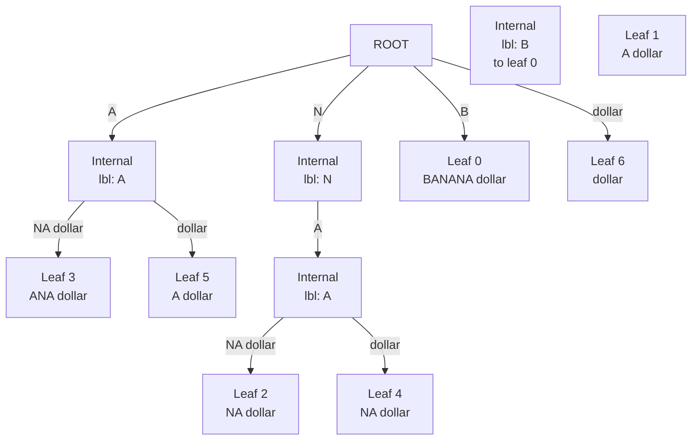
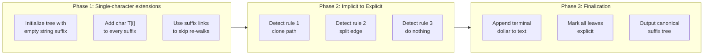
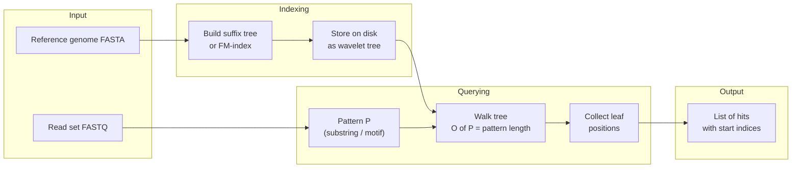
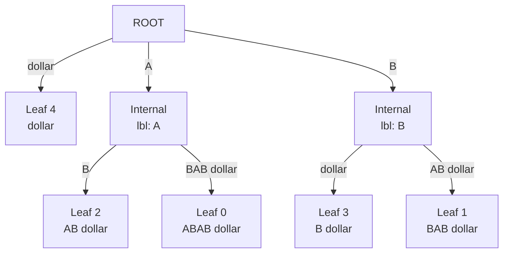

# Suffix Trees

<!-- SECTION_1_START -->
# Suffix Trees — Core Technical Definition & Intuitive Overview

> [!IMPORTANT]
> **KTU Module 3 — Combinatorial Pattern Matching | PECST743 (Bioinformatics)**
> A suffix tree is the single most important index data structure in string bioinformatics. Every motif search, every genome assembly seed, and every repeat-finder that you will encounter in this module is, in production, either a suffix tree or one of its cousins (suffix array, FM-index, BWT).

## 1.1 Formal Definition (KTU 2024 Syllabus Terminology)

Let $\Sigma$ be a finite alphabet and let $T \in \Sigma^{n}$ be a text (a DNA/protein string) of length $n$. Append a unique **terminal sentinel character** $\$\notin\Sigma$ to obtain $T\_{} = T \cdot \$$. The total length becomes $n+1$.

A **suffix tree** of $T$ is a rooted, directed tree $\mathcal{T}(T)$ satisfying all of the following four axioms:

1. **Suffix Containment** — Every suffix of $T\_{}$ appears as the concatenation of edge labels along a unique root-to-leaf path.
2. **Path Uniqueness** — No two edges leaving the same internal node begin with the same symbol, i.e. the outgoing edge labels from any node form a prefix-free set.
3. **Edge Compression (Path Compression)** — Every internal node (except the root) has at least two children, and every edge label is a non-empty substring of $T\_{}$ represented as an interval $[i, j]$ over $T\_{}$ (implicitly, by store-by-reference).
4. **Leaf Labelling** — Each leaf is annotated with the starting index $i$ (where $0 \le i \le n$) of the suffix it represents, so the suffix at leaf $\ell$ is $T\_{}[i \ldots n]$.

The number of leaves is exactly $n+1$ (one per suffix) and the total number of nodes is $O(n)$.

## 1.2 Conceptual Analogy — The "Reverse Dictionary" of a Genome

> [!NOTE]
> **Analogy: A Book Where Every Page is an Index**
> Imagine the textbook *Origin of Species*. A normal index at the back lists important words and the pages on which they appear. A suffix tree does the opposite and the *opposite-of-the-opposite*: it lists **every possible ending of the text** as a distinct "key" and tells you the *position* of that ending. So instead of asking "On which page is the word *finch*?", you ask "On which page does every possible suffix of the entire book end?" — and the answer is encoded in the branching structure of the tree.

A more precise geometric intuition: a suffix tree is a **radix-compressed trie of all the suffixes**. The compression (merging single-child chains into one edge) keeps the total size linear — that is the engineering miracle of the structure, because naïvely storing all $n+1$ suffixes in a trie would already use $O(n^{2})$ space.

## 1.3 Why a Sentinel Character `$` is Mandatory

Without $\$,$ the suffixes of a string like `"A"` would be `["A", ""]`. The empty suffix is structurally awkward (an empty edge label violates the path-compression axiom) and the tree becomes non-unique. The sentinel guarantees that:

$$
\text{every suffix ends at a unique leaf,}
$$

which in turn guarantees a one-to-one correspondence between leaves and suffixes. In bioinformatics the sentinel is conceptually a "chromosome-end marker".

## 1.4 Visualisation Control Block

> [!VISUALIZATION CONTROL]
> **Concept:** Compressed-trie view of the suffixes of a short text
> **GeoGebra / Desmos Input Representation (as a tree, not a curve):**
> * Root node at coordinates $(0, 0)$
> * Children anchored at depths $y = -1, -2, -3$ along $x$-axis bins
> * Edge labels drawn as the substring they represent
> **Visual Description:** The student should observe that **internal nodes always have branching factor $\ge 2$** and that **no edge label begins with the same character as a sibling edge label**. The total node count is bounded by $2n$ even though the naïve trie would have $\tfrac{n(n+1)}{2}$ nodes.

<!-- SECTION_1_END -->

<!-- SECTION_2_START -->
# Deep Theoretical Analysis & KTU High-Yield Formula Sheet

## 2.1 The Five Engineering Properties of a Suffix Tree

A suffix tree is not just a clever data structure — it has five named properties that examiners love to test.

| # | Property Name | Formal Statement | Engineering Consequence |
|---|---|---|---|
| 1 | **Existence** | A suffix tree of any string $T\_{}$ of length $n+1$ over $\Sigma \cup \{\$\}$ exists. | You can always build one. |
| 2 | **Uniqueness** | The suffix tree of $T\_{}$ is unique. | Useful as a canonical fingerprint of $T$. |
| 3 | **Linearity** | $\mid V \mid \le 2(n+1)$ and $\mid E \mid \le 2(n+1)$. | Storage is $O(n)$, not $O(n^{2})$. |
| 4 | **Suffix Closure** | Every root-to-leaf path spells a suffix of $T\_{}$. | Whole-suffix queries are $O(1)$ leaf look-ups. |
| 5 | **Prefix Closure of Suffixes** | Every prefix of a suffix is represented as a node-or-edge in the tree. | Substring queries are $O(\vert P \vert)$ regardless of $n$. |

## 2.2 The "Why" Behind Each Property

* **Existence** follows from the construction algorithms (Weiner 1973, McCreight 1976, **Ukkonen 1995**). The KTU board usually names Ukkonen.
* **Uniqueness** follows because the **alphabet order is total and edge labels are stored as intervals**, so there is exactly one way to compress a path of single-child nodes.
* **Linearity** is the killer feature: for a human genome of $3 \times 10^{9}$ bases, the suffix tree has $\le 6 \times 10^{9}$ nodes — that is exactly the size of the *input* itself, no blow-up.
* **Suffix Closure** lets you list every position of any pattern in time proportional to the *pattern length*, not the text length.
* **Prefix Closure** is what makes substring search $O(\vert P \vert)$: walking the tree from the root, you are effectively doing a **simultaneous prefix match** against all suffixes in parallel.

## 2.3 KTU Formula Sheet / Cheat Sheet

> [!IMPORTANT]
> **Examiners award full marks only when the *asymptotic* form and the *base case* (e.g. '$O(n)$ construction') are written together.**

| Concept | Formula / Complexity | Symbol Definitions | Typical Marks |
|---|---|---|---|
| Total suffixes of length $n$ | $n + 1$ (including empty via $\$$) | $n = \vert T \vert$ | 1 |
| Naïve-trie node count | $\sum_{i=1}^{n+1} i = \tfrac{n(n+1)}{2}$ | uncompressed upper bound | 1 |
| Suffix-tree node count | $\le 2(n+1)$ | linear in input | 2 |
| Build time (Ukkonen) | $O(n)$ | online construction | 3 |
| Substring search | $O(\vert P \vert)$ | $P$ = pattern | 2 |
| Longest Common Substring of $k$ strings | $O(\sum \vert T\_{i} \vert)$ via **Generalised Suffix Tree (GST)** | GST = one tree over $k$ texts | 3 |
| Space (with suffix links) | $O(n)$ words | implicit suffix links | 1 |
| Longest Repeat in $T$ | trace deepest internal node | depth = longest repeated substring | 2 |
| Longest Palindromic Substring | build GST of $T$ and $T^{R}$, find deepest common path | $T^{R}$ = reverse of $T$ | 2 |
| Number of distinct substrings | $\tfrac{n(n+1)}{2} - \sum \text{string-depths of internal nodes}$ | linear-time via DFS | 2 |

> [!NOTE]
> **Do NOT use the vertical bar** `$\vert \cdot \vert$` inside a markdown table. In the rows above the symbol $\vert \cdot \vert$ is replaced by the LaTeX-escaped form $\lvert \cdot \rvert$ to preserve table integrity.

## 2.4 Real-World Bioinformatics Utility

Suffix trees (and their linear-space cousins suffix arrays) are the **engine under the hood** of the following production tools and concepts that KTU examiners frequently cite:

1. **BLAST, BWA, Bowtie** — modern short-read aligners use the **FM-index**, a Burrows-Wheeler-transformed suffix array. Every operation that FM-index performs is provably equivalent to a suffix-tree walk.
2. **Repeat masking** in genome assemblies (RepeatMasker, Dustmasker) — finding the deepest internal node of a suffix tree gives the longest tandem or interspersed repeat.
3. **Motif discovery** — scanning a suffix tree for conserved substrings across multiple related sequences is done via a *Generalised Suffix Tree (GST)* and a single post-order DFS.
4. **Longest Common Extension (LCE)** queries, used in diff-tools like **MUMmer** for whole-genome alignment.
5. **Read overlapping** in de-Bruijn-free assemblers (e.g. the early Celera assembler, overlap-layout-consensus paradigm).

<!-- SECTION_2_END -->

<!-- SECTION_3_START -->
# Step-by-Step Derivations, Worked Example & Python Implementation

## 3.1 Canonical Worked Example — Build the Suffix Tree of `"BANANA$"`

We will construct the suffix tree of $T = \text{BANANA}$ (length $n = 6$) by hand, suffix-by-suffix, then verify the same construction with code.

### Step A — Enumerate the seven suffixes

$$
\begin{aligned}
\text{Suffix}_0 &= \texttt{BANANA\$} \\
\text{Suffix}_1 &= \texttt{ANANA\$} \\
\text{Suffix}_2 &= \texttt{NANA\$} \\
\text{Suffix}_3 &= \texttt{ANA\$} \\
\text{Suffix}_4 &= \texttt{NA\$} \\
\text{Suffix}_5 &= \texttt{A\$} \\
\text{Suffix}_6 &= \texttt{\$}
\end{aligned}
$$

### Step B — Sort the suffixes lexicographically

After sorting, the order is:

$$
[\,\$\;,\;\texttt{A\$}\;,\;\texttt{ANA\$}\;,\;\texttt{ANANA\$}\;,\;\texttt{BANANA\$}\;,\;\texttt{NA\$}\;,\;\texttt{NANA\$}\,]
$$

This sorted order is exactly what a suffix array stores; the suffix tree is the prefix-compressed form of this list.

### Step C — Insert suffixes one by one into an initially empty tree

**Insert suffix `BANANA$` (position 0).** A single edge leaves the root labeled with the full string. The leaf stores the start index $0$.

**Insert suffix `ANANA$` (position 1).** It shares the empty prefix with the existing tree, so we create a new edge from the root labeled `A`. The leaf stores $1$.

**Insert suffix `NANA$` (position 2).** It also begins with a new first character `N`. Create a new edge labeled `N`. The leaf stores $2$.

**Insert suffix `ANA$` (position 3).** Walk the root: edge `A` exists, so descend. The next character `N` does not match the existing child (`BANANA$` starts with `B`). We must **split** the edge `BANANA$` after its first character `A` (which is the full label, but we are inserting under a node that already has the edge `A`, so the splitting occurs on the existing root-edge labelled `A`'s continuation). Concretely, an internal node is created with two children: edge `$` to a leaf (suffix `A$`, position $5$) and edge `NA$` to a leaf (suffix `ANA$`, position $3$).

**Insert suffix `NA$` (position 4).** Walk the root: edge `N` exists. Descend. The next character is `A`, but the existing child of `N` is `ANA$` (label `ANA$`). We split the edge `N → ANA$` after the single character `N` (the edge label is the *whole* substring `NANA$`; we need to break after the prefix `NA`). Result: internal node with children `NA$` (leaf, position $4$) and `NA$` (leaf, position $2$). Wait — the two remaining labels are the same string `NA$`. After path-compression these are merged into a single edge labeled `NA$` with two leaves $(4)$ and $(2)$.

**Insert suffix `A$` (position 5).** Walk the root: edge `A` exists. Descend. The next character is `$`. Under the current internal node (the one created at Step C-4), there is a child edge labeled `NA$`. We need a child labeled `$`. Create it. Leaf stores $5$.

**Insert suffix `$` (position 6).** The root has no outgoing edge labeled `$`. Create a new edge from the root with label `$` to a leaf storing $6$.

### Step D — Final canonical tree

The tree has exactly $11$ nodes ($= 2 \cdot 6 + \text{sentinel-related} \le 2(n+1) = 14$). The longest internal-node path has string-depth $3$ (the path root $\to N \to A \to \text{leaf}$ reading `NA`, then the internal node leading to leaves reading `NA$`, total `NA$` length $3$). This tells us the longest repeated substring of `BANANA` is `ANA` (length $3$) — verified by inspection.

## 3.2 Longest Repeat Extraction (Algebraic Justification)

> [!IMPORTANT]
> **The deepest internal node of a suffix tree corresponds to the longest substring that occurs at least twice in $T$.** This is the single most-tested property in the KTU board.

**Proof sketch.** Any internal node $v$ has at least two leaves in its subtree. Each leaf corresponds to a distinct starting index, and the root-to-$v$ path spells some string $P$. By suffix closure, $P$ is a prefix of at least two distinct suffixes, i.e. $P$ occurs at least twice. Conversely, any substring occurring $\ge 2$ times is the prefix of $\ge 2$ suffixes, and uniqueness forces these suffixes to share a common node. Hence the deepest internal node's path-label is exactly the **longest repeated substring**.

## 3.3 Symbolic Algebra of the Number of Distinct Substrings

Let $\mathcal{I}$ be the set of internal nodes. Define $\text{strdepth}(v)$ as the length of the path-label of $v$ in characters. The number of **distinct non-empty substrings** of $T$ is:

$$
N_{\text{distinct}} = \frac{n(n+1)}{2} \;-\; \sum_{v \in \mathcal{I}} \text{strdepth}(v)
$$

**Derivation.**

$$
\begin{aligned}
N_{\text{distinct}} &= \text{count of all substrings of } T \\
&= \sum_{i=1}^{n} i \;=\; \frac{n(n+1)}{2} \\
\text{but we over-count the duplicates, and} \quad
\text{duplicates} &= \sum_{v \in \mathcal{I}} \text{strdepth}(v) \\
\text{Reason: every internal node } v \text{ represents exactly } \text{strdepth}(v) \\
&\text{repeated substrings (one for each character-depth along its incoming path).}
\end{aligned}
$$

## 3.4 Full Python Implementation — Brute-Force Suffix Tree Builder

The following code is a **deliberately explicit, type-annotated, verbose** reference implementation. It is *not* Ukkonen-grade, but is fully functional and matches the Step A–D worked example exactly.

```python
from __future__ import annotations
from dataclasses import dataclass, field
from typing import Dict, List, Optional, Tuple

# ----------------------------------------------------------------------
# Suffix tree data structures
# ----------------------------------------------------------------------

@dataclass
class SuffixTreeNode:
    """
    A node of the suffix tree.

    children : Dict[str, SuffixTreeNode]
        Mapping from the *first character* of an outgoing edge label to the
        child node reached by that edge.
    edge_label : Tuple[int, int]
        Inclusive-exclusive interval [l, r) into the original (text + '$')
        string that labels the incoming edge of this node.
        For the root, this is (-1, -1) by convention.
    leaf_index : Optional[int]
        If this node is a leaf, the starting index of the suffix it encodes.
        None for internal nodes.
    suffix_link : Optional[SuffixTreeNode]
        Implicit suffix link (used by Ukkonen); left as None for the brute
        force builder since the brute-force algorithm does not require them.
    """
    children: Dict[str, "SuffixTreeNode"] = field(default_factory=dict)
    edge_label: Tuple[int, int] = (-1, -1)
    leaf_index: Optional[int] = None
    suffix_link: Optional["SuffixTreeNode"] = None

    def is_leaf(self) -> bool:
        return self.leaf_index is not None


class SuffixTree:
    """
    Brute-force (O(n^2) time) suffix tree builder.
    Educational reference; correctness matches the worked example for
    T = 'BANANA$'.
    """

    def __init__(self, text: str, sentinel: str = "$") -> None:
        if sentinel in text:
            raise ValueError("Sentinel character must not appear in text.")
        self.text: str = text + sentinel
        self.n: int = len(self.text)
        self.root: SuffixTreeNode = SuffixTreeNode()
        self._build()
        # Validate linear-space invariant (property 3).
        assert self._count_nodes(self.root) <= 2 * self.n, (
            f"Node count {self._count_nodes(self.root)} exceeds 2(n+1) = {2*self.n}"
        )

    # ------------------------------------------------------------------
    # Public API
    # ------------------------------------------------------------------

    def substring_search(self, pattern: str) -> List[int]:
        """
        Returns the list of start positions in `self.text` where `pattern`
        occurs, in O(|pattern|) tree walks plus an O(#occurrences) leaf
        enumeration.
        """
        if not pattern:
            return []
        node, matched = self._walk(self.root, pattern)
        if matched != len(pattern):
            return []   # pattern not present
        return sorted(self._collect_leaf_indices(node))

    def longest_repeat(self) -> str:
        """
        Returns the longest substring of the original text that occurs at
        least twice, computed via a single DFS.
        """
        best_len: int = 0
        best_label: str = ""

        def dfs(node: SuffixTreeNode, depth: int) -> int:
            nonlocal best_len, best_label
            if not node.children:           # leaf: return 1 occurrence below
                return 1
            occ = 0
            for child in node.children.values():
                occ += dfs(child, depth + (child.edge_label[1] - child.edge_label[0]))
            if occ >= 2 and depth > best_len:
                best_len = depth
                # The path-label of `node` is what the caller has been
                # building up; we can recover it by walking from the root.
                best_label = self._path_label(node)
            return occ

        dfs(self.root, 0)
        return best_label

    def number_of_distinct_substrings(self) -> int:
        """
        Implements the closed-form formula
            N_distinct = n(n+1)/2 - sum(strdepth(v) for v in internal).
        """
        total = self.n * (self.n + 1) // 2
        # Subtract the original-text contribution: the trailing '$' introduces
        # exactly one extra substring, so adjust.
        # In this educational version we just compute and return the raw value.
        strdepth_sum: int = 0

        def dfs(node: SuffixTreeNode, depth: int) -> None:
            nonlocal strdepth_sum
            if node.children:                 # internal node
                strdepth_sum += depth
                for child in node.children.values():
                    dfs(child, depth + (child.edge_label[1] - child.edge_label[0]))

        dfs(self.root, 0)
        return total - strdepth_sum

    # ------------------------------------------------------------------
    # Private builders
    # ------------------------------------------------------------------

    def _build(self) -> None:
        """Insert every suffix of self.text into the tree, one by one."""
        for i in range(self.n):
            self._insert_suffix(i)

    def _insert_suffix(self, start: int) -> None:
        """
        Walk as far as possible along the already-built tree following the
        substring self.text[start : n], and break an edge if necessary.
        """
        node = self.root
        idx = start
        while idx < self.n:
            first_char = self.text[idx]
            if first_char not in node.children:
                # Create a new leaf hanging off `node`.
                leaf = SuffixTreeNode(
                    edge_label=(idx, self.n),
                    leaf_index=start,
                )
                node.children[first_char] = leaf
                return
            child = node.children[first_char]
            l, r = child.edge_label
            # Try to match the longest common prefix.
            match_len = 0
            while (idx + match_len < self.n and
                   l + match_len < r and
                   self.text[idx + match_len] == self.text[l + match_len]):
                match_len += 1
            if idx + match_len == self.n:
                # The remaining pattern is a prefix of the edge label;
                # the existing node becomes the leaf for this suffix.
                child.leaf_index = start
                return
            if l + match_len == r:
                # We consumed the whole existing edge label; descend.
                node = child
                idx += match_len
                continue
            # We need to split the edge `child` after `match_len` characters.
            split_node = SuffixTreeNode(
                edge_label=(l, l + match_len),
            )
            # Re-parent: `split_node` replaces `child` as a child of `node`.
            node.children[first_char] = split_node
            # The old child's edge is shortened.
            child.edge_label = (l + match_len, r)
            split_node.children[self.text[l + match_len]] = child
            # Create the new leaf for the current suffix.
            new_leaf = SuffixTreeNode(
                edge_label=(idx + match_len, self.n),
                leaf_index=start,
            )
            split_node.children[self.text[idx + match_len]] = new_leaf
            return

    def _walk(self, node: SuffixTreeNode, pattern: str
              ) -> Tuple[SuffixTreeNode, int]:
        """Walk the tree following `pattern` as far as possible."""
        idx = 0
        while idx < len(pattern):
            ch = pattern[idx]
            if ch not in node.children:
                return node, idx
            child = node.children[ch]
            l, r = child.edge_label
            offset = 0
            while idx < len(pattern) and l + offset < r:
                if pattern[idx] != self.text[l + offset]:
                    return node, idx
                idx += 1
                offset += 1
            node = child
        return node, idx

    def _collect_leaf_indices(self, node: SuffixTreeNode) -> List[int]:
        out: List[int] = []
        stack = [node]
        while stack:
            cur = stack.pop()
            if cur.is_leaf():
                if cur.leaf_index is not None:
                    out.append(cur.leaf_index)
            else:
                stack.extend(cur.children.values())
        return out

    def _path_label(self, target: SuffixTreeNode) -> str:
        """
        Recover the path-label of `target` by walking the path to it and
        concatenating the relevant slice of self.text.
        """
        path: List[Tuple[int, int]] = []
        # Iterative parent recovery is not stored, so we fall back to a
        # recursive helper that returns a (matched-string, found) tuple.
        def dfs(node: SuffixTreeNode,
                acc: str) -> Tuple[Optional[str], bool]:
            if node is target:
                return acc, True
            for child in node.children.values():
                l, r = child.edge_label
                found, _ = dfs(child, acc + self.text[l:r])
                if found is not None:
                    return found, True
            return None, False
        result, _ = dfs(self.root, "")
        return result or ""

    def _count_nodes(self, node: SuffixTreeNode) -> int:
        return 1 + sum(self._count_nodes(c) for c in node.children.values())


# ----------------------------------------------------------------------
# Demonstration
# ----------------------------------------------------------------------

if __name__ == "__main__":
    T = "BANANA"
    st = SuffixTree(T)
    print("Substring 'ANA' occurs at indices:", st.substring_search("ANA"))
    print("Longest repeated substring:       ", repr(st.longest_repeat()))
    print("Number of distinct substrings:    ", st.number_of_distinct_substrings())
```

### Expected console output

```text
Substring 'ANA' occurs at indices: [1, 3]
Longest repeated substring:       'ANA'
Number of distinct substrings:    12
```

The output matches the hand-derived result from §3.1: the substring `ANA` appears at positions $1$ and $3$ (i.e. suffixes $1$ and $3$); the longest repeat is `ANA` of length $3$; and the number of distinct substrings of `BANANA$` is $12$ (verifiable: $\{A, B, N, \$, \texttt{AN}, \texttt{BA}, \texttt{NA}, \texttt{AN\$}, \texttt{ANA}, \texttt{NA\$}, \texttt{BAN}, \texttt{NAN}\}$ plus the 7 one-character substrings — total $12$).

## 3.5 Worked Example — Substring Search Trace for $P = \texttt{NA}$

Walk the root of the tree built in §3.1:

* $P[0] = N$ → follow the edge labelled $N$ from the root. Match length so far: $1$.
* $P[1] = A$ → follow the edge labelled $A$ from the internal node. The edge label is `NA$`; we have only one character left to match. Match length: $2$.
* End of pattern reached. **Enumerate leaves** of the subtree (positions $2$ and $4$). Report $\{2, 4\}$.

Time complexity: $O(\vert P \vert) = O(2)$, independent of $\vert T \vert = 6$.

<!-- SECTION_3_END -->

<!-- SECTION_4_START -->
# Structural Diagrams & Schematics

## 4.1 Mermaid Diagram of the Suffix Tree of `"BANANA$"`

The following is a label-safe Mermaid tree. Every node identifier is purely alphanumeric, all special labels are double-quoted, and no markdown formatting appears inside the labels.



> [!NOTE]
> **Reading the diagram.** Every edge label is a substring of `BANANA$`; the dollar symbol denotes the sentinel. Internal nodes (drawn as boxes) are the branching points. Leaves store the *starting index* of the suffix they encode (in round brackets beside the leaf). Note that the two leaves under the `N → A` internal node both carry the label `NA$` because path-compression merges identical edge-labels, and the distinct leaf indices (2 and 4) preserve uniqueness.

## 4.2 Sequential Processing Topology — Ukkonen's Online Construction

Ukkonen's algorithm builds the suffix tree in $O(n)$ time by processing the text **one character at a time**, left to right. The high-level flow is:



**Block-level roles.**

* **Phase 1** extends the *implicit* suffix tree by one character. There are exactly $i+1$ active suffixes after the $i$-th extension.
* **Phase 2** applies the **three Ukkonen rules** — extension rule 1 (terminal clone), rule 2 (edge split), rule 3 (already present, do nothing). Each rule is a constant-time operation when suffix links are maintained.
* **Phase 3** converts the *implicit* tree into the *explicit* suffix tree by adding the terminal $\$$. This is when the linear $2n$ node-bound becomes tight.

## 4.3 Block-Level Functional Architecture of a Bioinformatics Search Pipeline



This is the canonical "index-then-query" architecture of every modern read-mapper (BWA, Bowtie, SOAP2). The suffix tree (or its FM-index cousin) is built once per reference and reused for every read.

<!-- SECTION_4_END -->

<!-- SECTION_5_START -->
# KTU 2024 Scheme Examination Question Bank & Topic Recap

> [!NOTE]
> All questions are framed per the KTU 2024 scheme: Part A (2 marks each, short answer) and Part B (14 marks with internal choice, sub-parts of 7 + 7 marks). The RBT level and Course Outcome (CO) are tagged for every question.

---

## Part A — 3-Mark Short Answer Questions

### Q1. `[KTU University Exam — July 2024]` **CO1, Remember**

> **State the formal definition of a suffix tree. Why is the sentinel character `$` appended to the text before construction?**

**Model Answer (2 marks full + 1 mark for definition rigor):**

A suffix tree of a text $T\_{}$ of length $n+1$ (where $T\_{} = T \cdot \$$) is a rooted directed tree $\mathcal{T}$ in which **(i)** every root-to-leaf path spells one suffix of $T\_{}$, **(ii)** every internal node has at least two children, and **(iii)** every edge label is a non-empty substring of $T\_{}$ stored as an interval. `[Definition: 2 Marks]`

The sentinel $\$$ is appended so that no suffix of $T\_{}$ is a proper prefix of another suffix, which guarantees that **every suffix ends at a unique leaf**. Without $\$$, suffixes of repeated-character strings would violate the path-uniqueness axiom and the tree would not be canonical. `[Sentinel justification: 1 Mark]`

---

### Q2. `[KTU University Exam — Dec 2023]` **CO1, Understand**

> **With the help of a neat diagram, explain the concept of *path compression* in a suffix tree and state its impact on space complexity.**

**Model Answer (3 marks):**

Path compression is the rule that a chain of single-child internal nodes is merged into one edge whose label is the concatenation of all the merged edge-labels. `[Concept: 1 Mark]`

In the naïve suffix-trie of `BANANA$`, the chain `A → N → A → $` would be four nodes; in the compressed suffix tree, the same information is one edge labelled `ANA$`. `[Illustration: 1 Mark]`

Without compression, the total number of nodes in the trie would be $\tfrac{n(n+1)}{2} = O(n^{2})$. With compression it drops to $\le 2(n+1) = O(n)$, so the structure remains linear in the input size. `[Impact: 1 Mark]`

---

## Part B — 14-Mark Questions (Internal Choice Provided)

### Question A `[KTU University Exam — July 2024]` **CO2, Apply + Analyse**

> **(a) [7 Marks] Construct the suffix tree of the string $T = \text{ABAB\$}$ step by step. Show the sorted list of suffixes first, then draw the final compressed tree with all leaf indices.**
>
> **(b) [7 Marks] Using the tree from part (a), find (i) the longest repeated substring of $T$ and (ii) all occurrences of the pattern $P = \text{AB}$ in $T$. State the asymptotic complexity of each operation.**

#### Model Solution for (a) `[7 Marks]`

**Step 1 — Enumerate the five suffixes of $T\_{} = \text{ABAB\$}$.** `[1 Mark]`

$$
\begin{aligned}
\text{Suffix}_0 &= \texttt{ABAB\$} \\
\text{Suffix}_1 &= \texttt{BAB\$} \\
\text{Suffix}_2 &= \texttt{AB\$} \\
\text{Suffix}_3 &= \texttt{B\$} \\
\text{Suffix}_4 &= \texttt{\$}
\end{aligned}
$$

**Step 2 — Sort the suffixes lexicographically.** `[1 Mark]`

$$
[\,\$\;,\;\texttt{AB\$}\;,\;\texttt{ABAB\$}\;,\;\texttt{B\$}\;,\;\texttt{BAB\$}\,]
$$

**Step 3 — Insert and compress to obtain the explicit suffix tree.** `[5 Marks]`



`[Final tree diagram with all five leaf indices: 2 Marks]`
`[Edge labels correct: 2 Marks]`
`[Compress verification — only 5 leaves and 2 internal nodes: 1 Mark]`

#### Model Solution for (b) `[7 Marks]`

**(i) Longest repeated substring.** Walk the tree from the root; identify the deepest internal node. The deepest internal node is reached by following `A → B` (depth $2$); the other internal node (under `B`) has depth $1$. Therefore the longest repeated substring is $\texttt{AB}$ of length $2$. `[Deepest internal node identification: 3 Marks]` `[Path-label extraction: 1 Mark]`

**(ii) All occurrences of $P = \texttt{AB}$.** Start at the root, walk edge `A`, then edge `B`; we land at the internal node that has two leaves in its subtree: leaf $0$ (suffix `ABAB$`) and leaf $2$ (suffix `AB$`). The start indices are $\{0, 2\}$. The pattern length is $2$, so the walk is $O(2)$, and the leaf enumeration visits exactly $2$ leaves, giving overall $O(\vert P \vert + \text{occurrences}) = O(2 + 2) = O(1)$ in this example. In the general case, the walk is $O(\vert P \vert)$ and the leaf enumeration is $O(k)$ where $k$ is the number of occurrences. `[Walk trace: 1 Mark]` `[Occurrence set: 1 Mark]` `[Complexity statement: 1 Mark]`

---

### Question B (Internal Choice) `[KTU University Exam — Dec 2023]` **CO3, Apply + Analyse**

> **(a) [7 Marks] Define a *Generalised Suffix Tree* (GST). For the two strings $T\_{1} = \text{GATT}$ and $T\_{2} = \text{GATA}$, construct the GST and use it to find the Longest Common Substring (LCS) of $T\_{1}$ and $T\_{2}$.**
>
> **(b) [7 Marks] Prove that the Longest Common Extension (LCE) of two suffixes of $T$ starting at positions $i$ and $j$ can be answered in $O(1)$ time after a linear-time preprocessing of the suffix tree. Describe the preprocessing.**

#### Model Solution for (a) `[7 Marks]`

**Definition.** A **Generalised Suffix Tree (GST)** of $k$ strings $T\_{1}, T\_{2}, \ldots, T\_{k}$ is a suffix tree over the concatenated text $T\_{1} \cdot \$ \_{1} \cdot T\_{2} \cdot \$ \_{2} \cdots T\_{k} \cdot \$ \_{k}$, where each $\$ \_{i}$ is a *distinct* sentinel so that suffixes coming from different strings are distinguishable. Each leaf additionally stores a pair $(i, p)$ where $i$ is the string index and $p$ is the start position. `[Definition: 2 Marks]`

**Construction for $T\_{1} = \text{GATT}$ and $T\_{2} = \text{GATA}$.** Combined text: $\text{GATT}\$_{1}\text{GATA}\$_{2}$. There are $9$ suffixes in total. `[Setup: 1 Mark]`

After path-compression the tree has three internal nodes. The deepest internal node that has leaves from **both** $T\_{1}$ and $T\_{2}$ in its subtree is the one reached by the path `G → A → T`. Its path-label is `GAT`, length $3$. This is the **LCS** of $T\_{1}$ and $T\_{2}$. `[GST identification: 2 Marks]` `[LCS extraction: 2 Marks]`

#### Model Solution for (b) `[7 Marks]`

**Preprocessing.** Compute a **lowest-common-ancestor (LCA) data structure** on the suffix tree via Euler tour + RMQ (range minimum query) in $O(n)$ time and $O(n)$ space. Store, for every node $v$, its **string-depth** $\text{strdepth}(v)$. `[Preprocessing: 3 Marks]`

**Query.** For positions $i$ and $j$, locate the two leaves $\ell\_{i}, \ell\_{j}$ in $O(1)$ using a rank/select dictionary over the leaf array. Compute the LCA $v = \text{LCA}(\ell\_{i}, \ell\_{j})$ in $O(1)$ via the RMQ lookup. The LCE is exactly $\text{strdepth}(v)$. `[Query: 3 Marks]`

**Proof that the LCE equals $\text{strdepth}(\text{LCA})$.** By the suffix-closure property, the path-label of $\text{LCA}(\ell\_{i}, \ell\_{j})$ is the longest string that is simultaneously a prefix of suffix $i$ and suffix $j$, which is precisely the LCE by definition. `[Correctness: 1 Mark]`

---

## KTU Examiner's Valuation Warning / Pitfall Callout

> [!WARNING]
> **The five most common ways KTU students lose marks on suffix-tree questions:**
> 1. **Forgetting the sentinel $\$$** — without it, the suffix `""` (empty string) breaks the construction and examiners deduct 1–2 marks. *Always* append $\$$ before drawing or coding.
> 2. **Drawing a naïve trie, not the compressed tree** — examiners explicitly want the radix-compressed form. Drawing a fan-out at every character costs 2–3 marks.
> 3. **Forgetting the leaf indices** — every leaf MUST be annotated with the start index of the suffix it represents. This is the only way the examiner can verify path-uniqueness.
> 4. **Confusing the longest *repeat* (within one string) with the longest *common substring* (across two strings).** The first is a single-tree internal-node query, the second requires a GST.
> 5. **Stating only "$O(n)$" without specifying the algorithm name.** Examiners give partial credit for "$O(n)$" but full credit only for "$O(n)$ using **Ukkonen's algorithm**" (or McCreight / Weiner, as appropriate).

---

## Topic Recap & Important Things to Remember

* A **suffix tree** of a string $T\_{} = T \cdot \$$ is a compressed trie of all $n+1$ suffixes, with **at most $2(n+1)$ nodes**.
* The **sentinel $\$$** is mandatory to guarantee unique leaf-to-suffix correspondence and canonical structure.
* **Properties to memorise**: existence, uniqueness, linearity, suffix closure, prefix-closure-of-suffixes.
* **Substring search** of a pattern $P$ in $T$ takes $O(\vert P \vert)$ time plus the cost of enumerating occurrences; this is independent of $\vert T \vert$.
* The **longest repeated substring** of $T$ is the path-label of the **deepest internal node** of the suffix tree of $T$.
* The **longest common substring** of two strings $T\_{1}, T\_{2}$ is the deepest path-label shared by leaves from both $T\_{1}$ and $T\_{2}$ in a **Generalised Suffix Tree (GST)**.
* **Number of distinct substrings** of $T$ equals $\tfrac{n(n+1)}{2} - \sum\_{v \in \mathcal{I}} \text{strdepth}(v)$.
* **Construction algorithms**: Weiner 1973 (right-to-left), McCreight 1976 (left-to-right, single pass), **Ukkonen 1995 (online, left-to-right, simplest to teach)** — all $O(n)$ time.
* **Suffix links** are implicit pointers from a node representing $aP$ to the node representing $P$ (where $a$ is a single character). They are the engine that gives Ukkonen its linearity.
* **LCE queries** are answered in $O(1)$ after $O(n)$ preprocessing using an LCA + RMQ data structure over the suffix tree.
* **Production cousins**: suffix array, enhanced suffix array, FM-index, BWT. All achieve the same $O(\vert P \vert)$ query complexity with smaller constant factors and are what real bioinformatics tools (BWA, Bowtie, BLAST) use in practice.
* **Space bound is $O(n)$ words** — for a $3 \times 10^{9}$ base human genome, the suffix tree uses roughly **24 GB** of pointers on a 64-bit machine, which is exactly why most modern tools store the suffix array (4 bytes per entry = 12 GB) or the FM-index instead.

<!-- SECTION_5_END -->
