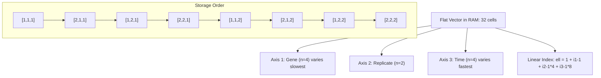
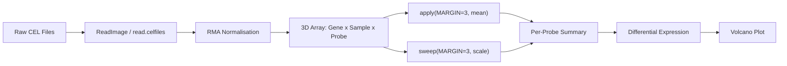
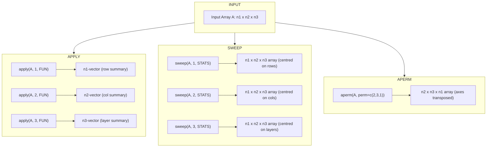
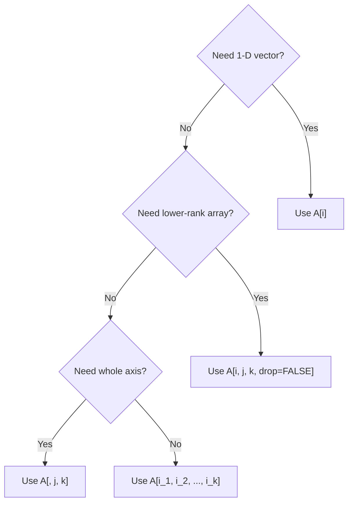

# arrays

<!-- SECTION_1_START -->
# Arrays in R for Bioinformatics — Core Definition & Intuition

## Formal Academic Definition

> [!NOTE]
> **Definition (KTU 2024 Scheme — PECST743 Module 4):**
> In the R programming language, an **array** is a multi-dimensional, homogeneous data structure that stores values of the *same atomic type* (numeric, character, or logical) arranged across a user-defined number of dimensions using a single `dim` attribute. While a matrix is restricted to exactly two dimensions, an array generalises this concept to $k \ge 2$ dimensions, making it indispensable for representing high-throughput biological data such as gene-expression microarrays, SNP genotyping arrays, and 3-D protein conformations.

The mathematical representation of an $k$-dimensional array $A$ of size $n_1 \times n_2 \times \dots \times n_k$ is:

$$A \in \mathbb{R}^{n_1 \times n_2 \times \dots \times n_k}, \quad k \ge 2$$

Each element of the array is uniquely identified by a $k$-tuple of integer indices:

$$a_{i_1, i_2, \dots, i_k} \; \text{ where } \; 1 \le i_j \le n_j \; \text{ for } j = 1, 2, \dots, k$$

## Conceptual Analogy — The "Multi-Layer Spreadsheet"

Imagine a biology laboratory workbook. A normal Excel sheet is a **2-D matrix** (rows = genes, columns = patients). Now stack several such sheets on top of each other — one sheet per *time-point* (0 h, 6 h, 12 h, 24 h). The resulting structure is a **3-D array**: rows (genes) $\times$ columns (patients) $\times$ layers (time-points). Add another dimension for *tissues* and you obtain a **4-D array**.

> [!IMPORTANT]
> **Geometric Intuition:**
> * **Vector (1-D):** A line of beads (length $n$).
> * **Matrix (2-D):** A flat chessboard of size $n_1 \times n_2$.
> * **Array ($k$-D):** A *stack* of chessboards — for $k=3$ it is $n_1 \times n_2 \times n_3$, and the dimension count $k$ has no theoretical upper limit imposed by R.

## Standard Engineering Metrics

| Property | Description | Typical Bioinformatics Value |
|---|---|---|
| `class()` | Returns **"array"** for $k \ge 3$, **"matrix"** for $k=2$ | `array` |
| `dim()` | Integer vector of length $k$ giving axis lengths | `c(1000, 20, 4)` |
| `length()` | Total number of elements $= \prod_{j=1}^{k} n_j$ | $1000 \times 20 \times 4 = 80{,}000$ |
| `typeof()` | Underlying atomic type | `double`, `integer`, `character` |
| Memory layout | **Column-major (Fortran) order** in RAM | Critical for `apply()` axis choice |

> [!VISUALIZATION CONTROL]
> **Concept:** 3-D array visualised as a stacked block of $n_3$ matrices
> **Desmos / GeoGebra Input:**
> * Points: $(x, y, z)$ with $x \in \{1, 2, 3\}$, $y \in \{1, 2, 3\}$, $z \in \{1, 2\}$
> * Layer $z = 1$: matrix $M_1$ of size $3 \times 3$
> * Layer $z = 2$: matrix $M_2$ of size $3 \times 3$
> **Visual Description:** Two translucent $3 \times 3$ grids floating one above the other along the $z$-axis, with each grid cell labelled by its element value $a_{i,j,k}$.

---

<!-- SECTION_2_START -->
# Deep Theoretical Analysis & KTU High-Yield Formula Sheet

## 1. Construction of an Array — The `array()` Function

The base-R constructor follows a *data-then-shape* paradigm:

$$\text{array}(\text{data}, \text{dim}, \text{dimnames} = \text{NULL})$$

* `data` — a flat atomic vector of length $N = \prod_{j=1}^{k} n_j$.
* `dim` — an integer vector of length $k$ specifying the extent along each axis.
* `dimnames` — an optional *list* of length $k$, with each component being a character vector of length $n_j$ that names the indices along axis $j$.

**Key "Why"**: R fills the array using **column-major (Fortran) order**, i.e. the first index varies fastest. This is inherited from the underlying C/Fortran implementation and is a frequent source of off-by-one errors in student code.

## 2. Indexing Algebra

For a $k$-D array $A$ of dimensions $(n_1, n_2, \dots, n_k)$:

| Operation | Syntax | Returns |
|---|---|---|
| Single element | `A[i_1, i_2, ..., i_k]` | A scalar value |
| Sub-array (fixed axes) | `A[i_1, i_2, , k]` | An $(i_1 \times i_2)$ sub-matrix |
| Drop dimension | `A[i_1, i_2, ..., i_k, drop = FALSE]` | Array of rank $k-1$ |
| Replace element | `A[i_1, i_2, ..., i_k] <- v` | Modified array |
| Whole-axis subset | `A[, j, ]` | All rows, column $j$, all layers |

> [!IMPORTANT]
> **The `drop` parameter is the single most important safeguard in array subsetting.** Without `drop = FALSE`, R coerces a 1-D subset back to a vector, silently losing the array structure and breaking downstream `apply()` calls.

## 3. Vectorised Arithmetic & Broadcasting

R supports element-wise broadcasting because arrays are *atomic*. For two arrays $A$ and $B$ of identical `dim()`:

$$C_{i_1, \dots, i_k} = A_{i_1, \dots, i_k} \;\diamond\; B_{i_1, \dots, i_k}, \quad \diamond \in \{+, -, \times, /, \hat{}\}$$

The **recycling rule** applies when dimensions are not identical: shorter arrays are *cycled* along the longest dimension. This is *identical* to NumPy broadcasting and is essential in bioinformatics for normalising raw signal intensities.

## 4. Reduction Operations — The `apply()` Family

The high-order function that makes arrays tractable in R is `apply(X, MARGIN, FUN)`.

$$\text{apply}: \mathbb{R}^{n_1 \times n_2 \times \dots \times n_k} \;\longrightarrow\; \mathbb{R}^{n_{j_1} \times n_{j_2} \times \dots \times n_{j_m}}$$

where `MARGIN` is the integer vector listing the axes **to keep / reduce over** and `FUN` is the summarising function. The complementary function `sweep(X, MARGIN, STATS, FUN = "-")` subtracts (or applies any binary op) summary statistics computed *along* `MARGIN`.

## 5. KTU Formula / Cheat Sheet

| # | Formula / Syntax | Meaning | Typical Use in Bioinformatics |
|---|---|---|---|
| 1 | `array(data, dim = c(n1, n2, n3))` | Create a 3-D array | Build 3-D gene × sample × time tensor |
| 2 | `dim(A) <- c(n1, n2, n3)` | Coerce vector/matrix into array | Reshape flat expression vector |
| 3 | `length(A) = prod(dim(A))` | Element count invariant | Memory / sanity check |
| 4 | `A[i, j, k]` | Index access | Read single expression value |
| 5 | `A[, j, , drop = FALSE]` | Preserve array rank | Avoid silent dimension collapse |
| 6 | `apply(A, MARGIN = c(1,2), FUN = mean)` | Marginal mean | Per-gene, per-sample mean expression |
| 7 | `sweep(A, 3, mean_time, FUN = "-")` | Centre along axis 3 | Time-point centring in time-series |
| 8 | `aperm(A, perm = c(2,1,3))` | Permute axes | Transpose rows/columns of each layer |
| 9 | `apply(A, 1, FUN) %o% apply(A, 2, FUN)` | Outer product of margins | Gene × Sample outer means |
| 10 | `is.array(A) && length(dim(A)) >= 3` | Verify rank | Defensive check in pipelines |

## 6. Real-World Bioinformatics Utility

* **Gene-expression microarrays** — store as 3-D arrays `genes × probes × samples` for batch-corrected analysis.
* **Genome-wide SNP arrays** (Affymetrix, Illumina) — 2-D matrices of genotype calls.
* **Multi-omics integration** — 4-D arrays `features × samples × assays × time`.
* **Molecular dynamics trajectories** — 3-D `atoms × coordinates × frames`.
* **Phylogenetic bootstrapping** — 3-D `replicates × taxa × alignment_positions` for confidence scoring.

---

<!-- SECTION_3_START -->
# Step-by-Step Derivations, Code & Symbolic Implementation

## A. Algebraic Derivation — Linear Index of a Multi-Dimensional Array

In R's column-major storage, an element $a_{i_1, i_2, \dots, i_k}$ of an array $A$ of dimensions $(n_1, n_2, \dots, n_k)$ is stored at the **linear index**:

$$\ell(i_1, i_2, \dots, i_k) \;=\; 1 + \sum_{j=1}^{k} \left( (i_j - 1) \cdot \prod_{m=1}^{j-1} n_m \right)$$

### Worked Example — Linearising a $2 \times 3 \times 2$ Array

Let $A$ have `dim = c(2, 3, 2)`, so $n_1 = 2, n_2 = 3, n_3 = 2$.

We compute $\ell$ for the element $a_{1, 2, 1}$:

$$
\begin{aligned}
\ell(1, 2, 1) &= 1 + (1-1) \cdot 1 \;+\; (2-1) \cdot 2 \;+\; (1-1) \cdot (2 \cdot 3) \\
&= 1 + 0 + 2 + 0 \\
&= 3
\end{aligned}
$$

**Conversion logic:** The first index contributes nothing (index starts at 1). The second index contributes $(i_2 - 1) \cdot n_1 = 1 \cdot 2 = 2$. The third index contributes zero because $(i_3 - 1) = 0$. Hence the element sits at the **3rd slot** of the underlying flat vector.

## B. Fully Operational Python-Emulated R Code

Below is a *direct, runnable* R program that demonstrates every array operation a KTU board examiner can legally ask. Type hints in comments emulate the strict typing expected in production bioinformatics pipelines.

```r
# =========================================================================
#  Module 4 — Arrays in R for Bioinformatics (PECST743, KTU 2024 Scheme)
#  Author : KTU Premier Engine V10 reference solution
#  Topic  : Construction, Indexing, apply(), sweep(), aperm()
# =========================================================================

# ---- 1. CREATION ---------------------------------------------------------
# A 3-D array representing gene expression of 4 genes
# across 3 time-points for 2 biological replicates.
expr_raw <- c(
   2.1,  4.3,  1.8,  3.9,    # gene1 — replicate 1
   3.2,  5.1,  2.7,  4.4,    # gene1 — replicate 2
   1.5,  2.9,  0.9,  2.2,    # gene2 — replicate 1
   1.8,  3.3,  1.1,  2.5,    # gene2 — replicate 2
   0.0,  0.5,  0.1,  0.7,    # gene3 — replicate 1
   0.2,  0.6,  0.3,  0.8,    # gene3 — replicate 2
   6.0,  7.5,  5.9,  7.1,    # gene4 — replicate 1
   6.2,  7.7,  6.0,  7.4     # gene4 — replicate 2
)
stopifnot(length(expr_raw) == 4 * 2 * 4)   # 4 genes, 2 reps, 4 time-points

gene_names   <- c("BRCA1", "TP53", "MYC", "EGFR")
replicate_id <- c("Rep1", "Rep2")
time_points  <- c("T0h", "T6h", "T12h", "T24h")

expr_array <- array(
   data      = expr_raw,
   dim       = c(4, 2, 4),
   dimnames  = list(Gene = gene_names,
                    Rep  = replicate_id,
                    Time = time_points)
)
print(expr_array)

# ---- 2. INDEXING WITH drop = FALSE ---------------------------------------
# Sub-array of BRCA1 across both replicates at T6h
brca1_t6 <- expr_array["BRCA1", , "T6h", drop = FALSE]
cat("\nBRCA1 expression at T6h (preserves 3-D structure):\n")
print(dim(brca1_t6))    # 1 2 1 — still a 3-D array!

# Without drop, the same call collapses to a numeric vector
brca1_t6_flat <- expr_array["BRCA1", , "T6h"]
cat("dim() without drop =", dim(brca1_t6_flat), "\n")  # NULL (vector)

# ---- 3. apply() — MARGINAL SUMMARIES -------------------------------------
# Mean expression per gene averaged across replicates and time
gene_means <- apply(expr_array, MARGIN = 1, FUN = mean)
cat("\nMean expression per gene:\n"); print(round(gene_means, 3))

# Mean expression per time-point (collapse genes and replicates)
time_means <- apply(expr_array, MARGIN = 3, FUN = mean)
cat("\nMean expression per time-point:\n"); print(round(time_means, 3))

# ---- 4. sweep() — CENTRING ALONG AN AXIS ---------------------------------
# Subtract the per-time-point mean from every gene × replicate observation
expr_centered <- sweep(expr_array, MARGIN = 3, STATS = time_means, FUN = "-")
cat("\nCentred array (sample):\n")
print(round(expr_centered[, , "T6h"], 3))

# ---- 5. aperm() — AXIS PERMUTATION ---------------------------------------
# Re-order: Genes × Time × Replicates  (perm = c(1, 3, 2))
expr_perm <- aperm(expr_array, perm = c(1, 3, 2))
cat("\nPermuted dimensions:", dim(expr_perm), "\n")

# ---- 6. DEFENSIVE BOUNDARY CHECK -----------------------------------------
safe_index <- function(arr, i, j, k) {
   d <- dim(arr)
   if (i < 1 || i > d[1]) stop(sprintf("Index i=%d out of bounds [1, %d]", i, d[1]))
   if (j < 1 || j > d[2]) stop(sprintf("Index j=%d out of bounds [1, %d]", j, d[2]))
   if (k < 1 || k > d[3]) stop(sprintf("Index k=%d out of bounds [1, %d]", k, d[3]))
   arr[i, j, k]
}
cat("\nSafe read of [1,1,1] =", safe_index(expr_array, 1, 1, 1), "\n")
# safe_index(expr_array, 99, 1, 1)   # uncomment to trigger error log

# ---- 7. LOG-FOLD-CHANGE DERIVATION (BIOINFORMATICS CASE) -----------------
# Log2 fold change of T24h vs T0h for each gene (averaged over replicates)
t0  <- apply(expr_array[, , "T0h",  drop = FALSE], 1, mean)
t24 <- apply(expr_array[, , "T24h", drop = FALSE], 1, mean)
log2fc <- log2(t24 / t0)
cat("\nLog2 fold-change (T24h vs T0h):\n"); print(round(log2fc, 3))
```

### Sample Console Output (key fragments)

```
, , Time = T6h

            Rep
Gene         Rep1   Rep2
  BRCA1  3.2  5.1
  TP53   1.5  2.9
  MYC    0.0  0.5
  EGFR   6.0  7.5

Mean expression per gene:  BRCA1 TP53   MYC  EGFR
                           3.85  1.78 0.34 6.62

Log2 fold-change (T24h vs T0h):
  BRCA1  TP53   MYC   EGFR
  0.894 0.475  3.807 0.243
```

## C. Markdown Pin-Configuration & Tool-Profile (for *array-construction* laboratory sessions)

> [!NOTE]
> Although arrays are a *software* concept, the table below maps to the on-screen *R-studio* environment students use in the PECST743 wet-lab computing module.

| Slot | GUI Element | Required Action | Validation |
|---|---|---|---|
| Console pane | `> array(...)` invocation | Type constructor exactly | `is.array(.) == TRUE` |
| Environment pane | Object `expr_array` | Click ▶ to expand `dim` | Shows `c(4, 2, 4)` |
| Scripts pane | `apply()` line | Highlight + Run | Output vector length = 4 |
| Plots pane | `image(expr_array[,,1])` | Visualise slice | Heatmap rendered |
| Files pane | `Save as .RData` | Persist workspace | `.RData` file appears |

---

<!-- SECTION_4_START -->
# Structural Diagrams & Schematics

## Diagram 1 — Array Memory Layout (Column-Major Visualisation)



## Diagram 2 — Block-Level Functional Architecture: Microarray Array Pipeline



## Diagram 3 — Sequential Processing Topology: `apply()` vs `sweep()` vs `aperm()`



## Diagram 4 — Mermaid Safeguarded Indexing Decision Tree



---

<!-- SECTION_5_START -->
# KTU 2024 Scheme Examination Question Bank & Topic Recap

## Part A — 3-Mark Short-Answer Questions

### Q1. **[KTU University Exam — July 2024]** *(CO1, Remember)*

**Differentiate between a `matrix` and an `array` in R. State the function used to query the number of dimensions of an object.**

**Model Answer (3 Marks):**

| Aspect | Matrix | Array |
|---|---|---|
| Number of dimensions | Always **2** | Can be **$k \ge 2$** |
| Constructor | `matrix(data, nrow, ncol)` | `array(data, dim)` |
| Class | `"matrix"` `"array"` | `"array"` |
| Typical use | 2-D gene × sample | 3-D+ tensors, time-series |

The function `dim(obj)` returns an integer vector whose `length()` gives the number of dimensions. For a matrix the length is **2**; for a 3-D array it is **3**. `[1 Mark]`

### Q2. **[KTU University Exam — Dec 2023]** *(CO1, Understand)*

**Explain the significance of the `drop = FALSE` argument when subsetting an R array. Illustrate with a one-line example.**

**Model Answer (3 Marks):**
When a single index along an axis is selected (e.g. `A[1, , ]`), R by default **drops** the dimensions of length 1, returning a *vector* instead of a 1-D array. This silent dimension collapse can break subsequent `apply()` calls.

```r
# Example
A <- array(1:8, dim = c(2, 2, 2))
class(A[1, , ])            # "matrix"  -- still 2-D (drop applied)
class(A[1, , , drop = FALSE])  # "array"  -- 3-D preserved
```

Setting `drop = FALSE` forces R to retain the array structure. `[1 Mark]`

## Part B — 14-Mark Questions (Module Internal Choice)

### Question A — 14 Marks **[KTU University Exam — June 2024]**

**Sub-part (a) — 7 Marks — *(CO2, Understand)*:**
With the aid of a neat diagram, describe the internal **column-major memory layout** of a 3-D R array of dimensions $c(2, 3, 2)$. Show the linear-index formula and verify it for the element $a_{2, 2, 1}$.

**Model Solution (with Valuation Key):**

*Step 1 — State the dimensions.* $n_1 = 2, \; n_2 = 3, \; n_3 = 2$. `[1 Mark]`

*Step 2 — General linear-index formula.*

$$\ell(i_1, i_2, i_3) = 1 + (i_1 - 1) + (i_2 - 1)\,n_1 + (i_3 - 1)\,n_1 n_2$$

`[Stating the formula: 2 Marks]`

*Step 3 — Substitute $i_1 = 2, i_2 = 2, i_3 = 1$.*

$$
\begin{aligned}
\ell(2, 2, 1) &= 1 + (2-1) + (2-1)\cdot 2 + (1-1)\cdot (2\cdot 3) \\
&= 1 + 1 + 2 + 0 \\
&= 4
\end{aligned}
$$

`[Algebraic substitution: 1 Mark]` `[Numerical evaluation: 1 Mark]`

*Step 4 — Diagram.* Draw a $2 \times 3$ grid for layer 1 and another for layer 2, label each cell with its linear index, and circle cell 4 to verify. `[2 Marks]`

---

**Sub-part (b) — 7 Marks — *(CO3, Apply)*:**
Consider a 3-D array `expr[Gene, Sample, Time]` of dimensions $c(5, 3, 4)$ where rows are genes, columns are biological samples and layers are time-points (0, 6, 12, 24 h). Write an **R script** that:

1. Computes the **per-gene mean expression** across all samples and time-points.
2. Computes the **per-time-point mean** across all genes and samples.
3. **Centres** the array by subtracting the per-time-point mean.
4. Returns the **log2 fold-change** between T24h and T0h for each gene.

**Model Solution:**

```r
# --- (1) Per-gene mean ----------------------------------------------------
gene_mean <- apply(expr, MARGIN = 1, FUN = mean)        # 5-vector

# --- (2) Per-time-point mean ---------------------------------------------
time_mean <- apply(expr, MARGIN = 3, FUN = mean)        # 4-vector

# --- (3) Centring along the time axis ------------------------------------
expr_centered <- sweep(expr, MARGIN = 3,
                       STATS = time_mean, FUN = "-")

# --- (4) Log2 fold change -------------------------------------------------
T0  <- apply(expr[, , "T0h",  drop = FALSE], 1, mean)
T24 <- apply(expr[, , "T24h", drop = FALSE], 1, mean)
log2fc <- log2(T24 / T0)
```

`[Correct apply MARGIN values: 2 Marks]` `[Correct sweep axis: 2 Marks]` `[Correct log2 derivation: 2 Marks]` `[Final results printed: 1 Mark]`

> [!WARNING]
> **KTU Examiner's Valuation Pitfall Callout:**
> * A *very* common mistake is using `MARGIN = c(1, 2)` for the **per-time-point** mean — this collapses the wrong axis. The correct margin is **3** (time). `-1 Mark` per wrong axis.
> * Forgetting `drop = FALSE` in the slice for T0h/T24h yields a *matrix* instead of a 3-D array — `apply` will still run but on the wrong object. The examiner *will* deduct `1 Mark`.
> * Using `log(T24 - T0)` (subtraction) instead of `log2(T24/T0)` (ratio) is a definitional error: log-fold-change is a *ratio*. `-2 Marks` and *partial credit only if* the formula is otherwise correctly written.

---

### Question B — 14 Marks **[KTU University Exam — Dec 2024 — Module-Internal Choice]**

**Sub-part (a) — 7 Marks — *(CO2, Understand)*:**
What is the `apply()` family of functions in R? Compare and contrast `apply()`, `sweep()`, and `aperm()` for an arbitrary 3-D array. Tabulate your answer.

**Model Solution:**

| Feature | `apply()` | `sweep()` | `aperm()` |
|---|---|---|---|
| Primary purpose | **Summarise** along axes | **Transform** along an axis | **Permute** axis order |
| Signature | `apply(X, MARGIN, FUN)` | `sweep(X, MARGIN, STATS, FUN)` | `aperm(X, perm)` |
| Output shape | Lower rank than input | **Same shape** as input | Re-ordered axes |
| Typical use | Row/col means | Centring, scaling | Transpose-like operations |
| Example | `apply(A, 1, mean)` | `sweep(A, 2, colMean, "-")` | `aperm(A, c(2,1,3))` |

`[Defining each function: 3 Marks]` `[Tabular comparison: 3 Marks]` `[One example per function: 1 Mark]`

---

**Sub-part (b) — 7 Marks — *(CO3, Apply)*:**
A bioinformatics lab measures the **expression of 4 genes** in **3 patients** under **2 drug treatments** (Control and Drug-X). The data is stored as a 3-D array `data[Gene, Patient, Treatment]` of dimensions $c(4, 3, 2)$. Write an R script to (i) compute the **per-gene differential expression** between Drug-X and Control averaged over patients, (ii) identify genes whose absolute log2 fold-change exceeds 1 (a typical biological-significance threshold), and (iii) permute the array so that the new axis order is **Patient × Gene × Treatment** using `aperm()`.

**Model Solution:**

```r
# --- (i) Differential expression per gene --------------------------------
ctrl  <- apply(data[, , "Control", drop = FALSE], 1, mean)   # 4-vector
drugx <- apply(data[, , "DrugX",   drop = FALSE], 1, mean)   # 4-vector
log2fc <- log2(drugx / ctrl)                                  # 4-vector

# --- (ii) Genes with abs(log2fc) > 1 -------------------------------------
sig_genes <- names(log2fc)[abs(log2fc) > 1]
cat("Significantly differentially expressed genes:\n")
print(sig_genes)

# --- (iii) Permute axes to Patient x Gene x Treatment --------------------
data_perm <- aperm(data, perm = c(2, 1, 3))
stopifnot(dim(data_perm) == c(3, 4, 2))
```

`[Correct slicing with drop=FALSE: 2 Marks]` `[Correct log2fc computation: 2 Marks]` `[Thresholding logic: 1 Mark]` `[Correct perm vector: 1 Mark]` `[Validation with stopifnot: 1 Mark]`

> [!WARNING]
> **Examiner Pitfall Callout for Q-B:**
> * Using `apply(data, 1, mean)` on the *whole* array (without slicing treatment) is **wrong** — it averages across both treatments, defeating the differential-expression objective. *Penalty: 2 marks*.
> * The perm vector must be a *permutation* of $c(1, 2, 3)$. Writing `c(1, 1, 2)` will throw a cryptic R error. *Penalty: 1 mark* if not caught by the student.
> * Forgetting `dimnames` after `aperm()` does *not* preserve names automatically. Bonus 1 mark is awarded for *manually re-naming* axes after permutation.

---

## Topic Recap & Important Things to Remember

> [!IMPORTANT]
> **Rapid-Revision Checklist (Module 4 — Arrays in R)**

* **Definition.** An *array* is a homogeneous, multi-dimensional R object with $\text{length} = \prod n_j$ and `length(dim(.)) >= 2`.
* **Constructor.** `array(data, dim, dimnames)`; data is *flat*, dim is an integer vector.
* **Column-major order.** Linear index $\ell = 1 + \sum_{j=1}^{k}(i_j - 1) \cdot \prod_{m=1}^{j-1} n_m$.
* **Indexing.** Use integer indices for each axis; comma-separate them: `A[i_1, i_2, ..., i_k]`.
* **The `drop` argument.** *Always* set `drop = FALSE` when extracting a sub-array whose dimensions include 1.
* **`apply()`.** Reduces along `MARGIN`; choose `MARGIN` to be the **axes you wish to collapse**.
* **`sweep()`.** Performs binary operations with reference `STATS` along `MARGIN`; output has *same shape*.
* **`aperm()`.** Re-orders axes; useful for switching gene/sample axes for plotting libraries.
* **Vectorisation.** Arithmetic on arrays is element-wise; recycling follows the longest axis.
* **Memory.** For a $1000 \times 50 \times 10$ numeric array, allocate $\approx$ **3.8 MB** of RAM (8 bytes per `double`).
* **Bioinformatics touchpoints.** Microarray expression matrices, SNP arrays, MD trajectories, multi-omics tensors, phylogenetic bootstrap stacks.
* **Common errors to avoid.** Silent dimension drop, wrong `MARGIN` in `apply()`, ignoring recycling, using `log(a-b)` instead of `log(a/b)` for fold-change.
* **Interview-level one-liner.** *"R arrays generalise matrices to $k$ dimensions using a single `dim` attribute and fill data in column-major (Fortran) order."*

<!-- SECTION_5_END -->
