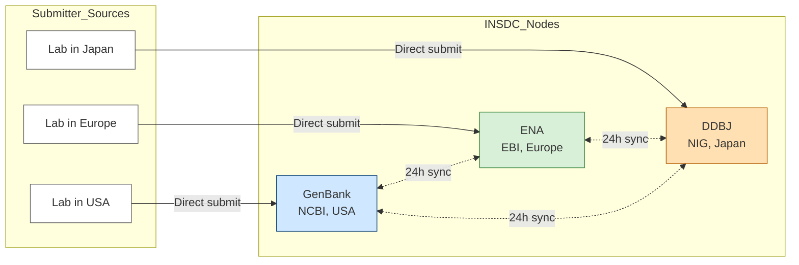
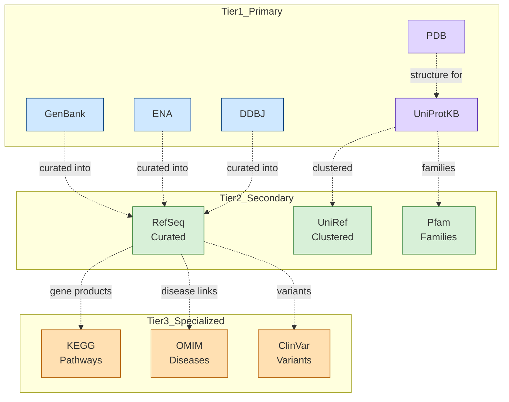
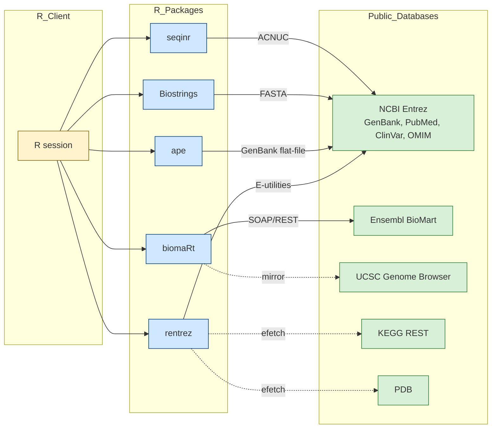

# Biological Databases

<!-- SECTION_1_START -->

# Biological Databases — Core Definition & Intuitive Overview

> [!NOTE]
> **Formal KTU 2024 Definition (PECST743 / Module 4)**
> A **Biological Database** is a large, organized, persistent, and computationally accessible collection of biological data — such as nucleotide sequences, protein sequences, macromolecular structures, gene expression profiles, pathways, and disease annotations — stored in standardized file formats and indexed by unique accession identifiers. Biological databases are the foundational data layer of bioinformatics and are typically accessed programmatically through RESTful APIs (Application Programming Interfaces) and client libraries such as `rentrez`, `biomaRt`, and `seqinr` in the R statistical environment.

## 1.1 Why Biological Databases Exist

Modern molecular biology produces data at a **petascale** rate. A single Illumina NovaSeq X run can generate **8 terabases (Tb)** of raw short-read data in approximately 48 hours. The human genome project itself produced **~3 billion base pairs** of finished reference sequence. Without structured, indexed, queryable repositories, this data would be effectively unusable for downstream comparative, evolutionary, and clinical research.

Biological databases solve three engineering problems simultaneously:

1. **Storage** — efficient compression and retrieval of heterogeneous biological entities.
2. **Annotation** — linking raw sequence/structure to biological *meaning* (gene name, function, organism, tissue, disease).
3. **Discoverability** — allowing researchers to find, query, and cross-reference data via stable accession identifiers (e.g., `NM_007294.4` for the BRCA1 mRNA).

> [!IMPORTANT]
> **KTU Syllabus Highlight (Module 4)**
> Within the R-for-bioinformatics track, the emphasis is on **programmatic retrieval** of records from public repositories (NCBI, EBI, Ensembl, UCSC, KEGG, PDB) and on parsing their native file formats (FASTA, GenBank flat-file, GFF/GTF, PDB, UniProt XML) into R data structures (vectors, lists, `DataFrame`, `DNAStringSet`) suitable for downstream Bioconductor analyses.

## 1.2 The Three-Tier Database Taxonomy

Biological databases are conventionally organized into three hierarchical tiers based on the *provenance* of their data:

### Tier 1 — Primary (Archival) Databases
Contain **directly submitted**, experimentally determined data with minimal secondary interpretation. The three founding nucleotide archives — **GenBank (NCBI, USA)**, **EMBL-EBI (Europe)**, and **DDBJ (Japan)** — form the **International Nucleotide Sequence Database Collaboration (INSDC)**, which synchronizes new submissions every 24 hours so that any record deposited in one is mirrored in all three within a day.

| Primary Database | Maintainer | Content Type | URL |
| :--- | :--- | :--- | :--- |
| **GenBank** | NCBI, NLM, NIH | Nucleotide sequences | https://www.ncbi.nlm.nih.gov/genbank/ |
| **EMBL-EBI ENA** | European Bioinformatics Institute | Nucleotide sequences | https://www.ebi.ac.uk/ena/ |
| **DDBJ** | National Institute of Genetics, Japan | Nucleotide sequences | https://www.ddbj.nig.ac.jp/ |
| **UniProt (Swiss-Prot + TrEMBL)** | EBI / SIB / PIR | Protein sequences | https://www.uniprot.org/ |
| **PDB** | RCSB / PDBj / PDBe | 3D macromolecular structures | https://www.rcsb.org/ |

### Tier 2 — Secondary (Derived/Curated) Databases
Built by **computationally processing** primary data to add higher-order biological insight, such as families, motifs, domains, or evolutionary relationships.

- **Pfam** — protein families defined by Hidden Markov Models (HMMs).
- **PROSITE** — sequence motifs and patterns (e.g., phosphorylation sites).
- **SCOP / CATH** — hierarchical classification of protein 3D structures.
- **RefSeq** — NCBI's curated, non-redundant reference sequence set.
- **UniRef** — clustered sets of UniProt sequences at 100%, 90%, and 50% identity.

### Tier 3 — Specialized (Domain-Specific) Databases
Optimized for a particular biological question or organism.

- **KEGG** — Kyoto Encyclopedia of Genes and Genomes (pathways, BRITE hierarchies, modules).
- **OMIM** — Online Mendelian Inheritance in Man (human Mendelian disorders).
- **ClinVar** — clinically interpreted human genomic variants.
- **Ensembl** — automatically annotated eukaryotic genomes.
- **UCSC Genome Browser** — reference genome assemblies with extensive annotation tracks.
- **Reactome** — curated human biological pathways.
- **STRING** — protein-protein interaction networks.

## 1.3 Conceptual Analogy

> [!TIP]
> **The Library Analogy**
> Think of a biological database as a **giant, multi-branch public library**:
> - **Primary databases** are the *stacks* — they store the original "books" (raw sequences/structures) as submitted by authors, with a unique catalog number (accession ID).
> - **Secondary databases** are the *librarian's reviews and cross-references* — they read every book and group them by genre (family/domain), flag recurring themes (motifs), and write summaries.
> - **Specialized databases** are *themed reading rooms* — one room only for novels about diseases (OMIM), another only for cookbooks (KEGG metabolic pathways).
> - **R packages** like `rentrez` and `biomaRt` are the *library card* and the *librarian assistant* — they let you search the catalog, request specific books, and read them at your desk without ever walking into the building.

## 1.4 The Standardized File Formats You Will Encounter

Every tier communicates using a small set of text-based interchange formats. Memorizing their structure is essential for Module 4 R-parsing tasks.

### 1.4.1 FASTA Format
The simplest, most widely used sequence format. Each record occupies two or more lines.

```
>gi|568815592|ref|NM_007294.4| BRCA1 DNA repair associated, transcript variant 1
ATGGATTTATCTGCTCTTCGCGTTGAAGAAGTACAAAATGTCATTAATGCTATGCAGAAA
ATCTTAGAGTGTCCCATCTGTCTGGAGTTGATCAAGGAACCTGTCTCCACAAAGTGTGAC
CACATATTTTGCAAATTTTGCATGCTGAAACTTCTCAACCAGAAGAAAGGGCCTTCACAG
TGTCCTTTATGTAAGAATGATATAACCAAAAGGAGCCTACAAGAAAGTACGAGATTTAGT
```

**Rules:**
- A header line begins with `>` followed by a unique identifier and optional description.
- Sequence lines follow immediately, in IUPAC nucleotide or amino-acid alphabet.
- Lines are typically wrapped at 60 or 80 characters.
- No structural annotation; purely the sequence string.

### 1.4.2 GenBank Flat File Format
A richly annotated multi-section record used by NCBI. Key sections (in order): `LOCUS`, `DEFINITION`, `ACCESSION`, `VERSION`, `KEYWORDS`, `SOURCE`, `ORGANISM`, `REFERENCE`, `FEATURES` (with a `CDS`, `gene`, `mRNA` sub-table), `ORIGIN`, then the sequence terminated by `//`.

### 1.4.3 PDB Format
For 3D coordinates. Each line begins with a record type (`ATOM`, `HETATM`, `HEADER`, `HELIX`, `SHEET`) and contains fixed-column fields for atom serial, residue name, chain ID, x, y, z coordinates, occupancy, and B-factor.

### 1.4.4 GFF / GTF
Tab-separated genomic feature tables: `seqid`, `source`, `type`, `start`, `end`, `score`, `strand`, `phase`, `attributes`. GTF adds a strict `gene_id` / `transcript_id` attribute convention.

> [!VISUALIZATION CONTROL]
> **Concept:** Growth of sequences in GenBank vs. UniProt as a function of release year (1995–2024).
> **GeoGebra / Desmos Input Equations (log scale):**
> * `g(x) = 0.85 * (1.32)^{x - 1995}` → modeled GenBank base-pair count (×10⁹)
> * `u(x) = 0.05 * (1.41)^{x - 2002}` → modeled UniProt entry count (×10⁶)
> **Visual Description:** Two exponentially rising curves on a log-scaled y-axis. The student should observe that **u(x)** overtakes raw growth in annotated information density because curators enrich each entry with functional, structural, and variant data.

<!-- SECTION_1_END -->

<!-- SECTION_2_START -->

# Deep Theoretical Analysis & KTU High-Yield Formula Sheet

## 2.1 The INSDC Tripartite Synchronization Model

The International Nucleotide Sequence Database Collaboration is the most important data-sharing agreement in molecular biology. Its core engineering contract is:

> [!IMPORTANT]
> **Synchronization Rule**
> Every 24 hours, GenBank, ENA, and DDBJ exchange all newly submitted and updated records. A sequence submitted to DDBJ in Tokyo on Monday 09:00 JST appears in GenBank (USA) and ENA (UK) by Tuesday 09:00 GMT. Each record carries the *submitter's* original accession prefix, but the underlying biological data is identical across all three mirrors.

This guarantees that any *single* accession number (e.g., `AB123456`) resolves to the same sequence in any of the three nodes.

## 2.2 The NCBI Entrez System (Cross-Database Search)

**Entrez** is NCBI's federated search engine. It simultaneously queries 38+ linked databases including `nuccore`, `protein`, `pubmed`, `taxonomy`, `omim`, `clinvar`, `gene`, `snp`, and `structure`. The key engineering features are:

1. **Unique integer UID** — Entrez assigns every record a global integer ID (e.g., the BRCA1 mRNA `NM_007294.4` has UID `568815592`). The accession number is *human-readable*; the UID is the *machine key*.
2. **Boolean query language** — supports fielded searches: `BRCA1[Gene] AND Homo sapiens[Organism] AND 1000:2000[SLEN]`.
3. **E-utilities API** — eight CGI endpoints (`esearch`, `efetch`, `esummary`, `elink`, `epost`, `egquery`, `espell`, `ecitmatch`) used by the R package `rentrez`.

## 2.3 UniProt — A Two-Tier Protein Knowledgebase

UniProt is the de-facto protein information hub. It contains three sub-databases with very different curation depths:

| UniProt Sub-DB | Curation Level | TrEMBL (computational) vs Swiss-Prot (manual) | Annotation Quality |
| :--- | :--- | :--- | :--- |
| **UniProtKB / Swiss-Prot** | Manually curated, expert-reviewed | Reviewed (`sp`) entries | High — function, domains, variants, isoforms |
| **UniProtKB / TrEMBL** | Automatically annotated | Unreviewed (`tr`) entries | Medium — propagated by similarity |
| **UniParc** | Non-redundant archive of *all* sequences ever seen | Includes obsolete accession IDs | Lowest — no annotation, just existence proof |
| **UniRef** | Clustered at 100% / 90% / 50% identity | Reduces redundancy for fast searching | Variable |

## 2.4 The Five Universal Database Concepts (KTU-Mandated)

The 2024 scheme expects you to internalize the following five cross-cutting concepts that appear in every biological database:

1. **Accession Number** — A stable, immutable, alphanumeric unique identifier assigned at submission. Format and prefix vary by database (e.g., `NM_*` = RefSeq mRNA, `NP_*` = RefSeq protein, `XP_*` = predicted protein, `PDB_*` = structure, `EC_*` = Enzyme Commission). Once assigned, an accession *never* changes for the same record. A version suffix (e.g., `.4`) increments when the *sequence* is updated, but the accession core remains constant.

2. **Entry / Record** — The atomic unit of a database, containing one biological entity (one gene, one protein, one structure) plus all its annotations.

3. **Flat File** — A self-contained, human-readable text serialization of a record. Most databases still offer a flat-file format even when backed by relational storage.

4. **Cross-Reference (Xref)** — A pointer inside one record that links to a record in another database (e.g., a GenBank entry containing `DBSOURCE   REFSEQ: NM_007294.4` or `DBLINK      BioProject: PRJNA168`). Xrefs form a directed graph of biological knowledge.

5. **Controlled Vocabulary / Ontology** — Standardized term sets ensuring consistent annotation. Examples: **Gene Ontology (GO)** with its three branches *Biological Process (BP)*, *Molecular Function (MF)*, *Cellular Component (CC)*; **Sequence Ontology (SO)**; **ChEBI** for chemical entities; **MeSH** for PubMed indexing.

## 2.5 KTU Formula Sheet / Cheat Sheet

> [!NOTE]
> The following table summarizes every metric, identifier system, and statistical quantity you are expected to know for Module 4 viva and ESE questions on biological databases.

| Concept | Notation / Pattern | Unit / Meaning | Example |
| :--- | :--- | :--- | :--- |
| GenBank accession | 1-letter prefix + 5–6 alphanumerics | Stable nucleotide ID | `U12345`, `AB011547` |
| GenBank version | `accession.version` | Increments on sequence change | `NM_007294.4` |
| RefSeq prefix | `NM_` mRNA, `NR_` ncRNA, `NP_` protein, `NG_` genomic, `XM_` predicted | Curated reference sequence | `NM_007294` |
| UniProt accession (KB) | 6 or 10 alphanumerics | Reviewed (`P38398`) or unreviewored (`Q9H9Y6`) | `P38398` (BRCA1 human) |
| PDB ID | 4-character alphanumeric | 3D structure identifier | `1TUP` (p53 DNA-binding domain) |
| Sequence length | $L$ (nucleotides or residues) | Integer count | BRCA1 CDS: $L = 5592$ nt |
| Molecular weight (ssDNA) | $M_W = (n_A \cdot 313.21) + (n_T \cdot 304.2) + (n_C \cdot 289.18) + (n_G \cdot 329.21) - 61.96$ | Daltons (Da) | $L=1000$ random seq ≈ 330 kDa |
| Molecular weight (protein) | $M_W = \sum_i n_i \cdot MW_i - 18.015 \cdot (N-1)$ | Daltons; subtract 18.015 for each peptide bond | Computed by `PeptideStats::mw()` |
| GC content | $\%GC = \frac{n_G + n_C}{L} \times 100$ | Percent (0–100) | $L=100$, $G=24$, $C=21 \Rightarrow 45\%$ |
| Bits per symbol (entropy) | $H = -\sum_{i \in \{A,C,G,T\}} p_i \log_2 p_i$ | Bits / symbol | Uniform: $H = 2$ bits |
| E-value expectation | $E = K \cdot m \cdot n \cdot e^{-\lambda S}$ | Number of expected hits by chance | BLAST default threshold $E = 10$ |
| Identity matrix entry | $I_{ij} = \text{matches between } i,j$ | Integer | Diagonal of substitution matrix |
| Bit score (BLAST) | $S' = \frac{\lambda S - \ln K}{\ln 2}$ | Bits (length-independent) | Higher $S'$ → more significant |
| Bits per position (MSA) | $\text{bits} = \log_2 20 - H_{\text{column}}$ | Conservation at column | Fully conserved = 4.32 bits |
| Storage size (uncompressed) | $\text{bytes} = L \cdot \frac{\text{bits}}{\text{symbol}}}{8}$ | Bytes per sequence | $L=10^6$ nt FASTA ≈ 1 MB |
| Memory in R `DNAStringSet` | $\text{object.size} \approx L \cdot 1.05$ bytes/nucleotide | R session RAM | $10^6$ nt ≈ 1.05 MB |
| EFetch re-request limit | $r \le 3$ per second without API key | NCBI rate policy | Violation → HTTP 429 |
| `rentrez` API key effect | boosts to $r = 10$ per second | NCBI rate policy | Registered user with `set_entrez_key()` |

## 2.6 Real-World Engineering Utility

Mastery of biological database access in R is non-negotiable for:

- **Variant Prioritization Pipelines (Clinical NGS)** — fetching ClinVar significance for every SNV (single nucleotide variant) detected in a patient's exome.
- **Drug Target Discovery** — querying ChEMBL/DrugBank for ligands of a protein pulled from UniProt.
- **Comparative Genomics** — pulling ortholog tables from Ensembl Compara via `biomaRt` for evolutionary studies.
- **Reproducible Research** — every analysis linked back to a **stable accession** so a reviewer can re-execute the exact same pipeline months later and obtain identical results.
- **Phylogenetics** — bulk-fetching 16S rRNA sequences from GenBank via `ape::read.GenBank()` to build a tree.

> [!TIP]
> **Engineering Rule of Thumb**
> *Never hard-code a sequence into your R script.* Always cite the database and accession; fetch it programmatically. If the database curator updates the record, your script automatically benefits from the latest annotation.

<!-- SECTION_2_END -->

<!-- SECTION_3_START -->

# Step-by-Step Derivations & Code Implementation

## 3.1 R Package Ecosystem for Biological Databases

Before any code, install (once) and load (each session) the standard toolkit:

```r
# ---- Installation (run once) ----
install.packages(c("rentrez", "seqinr", "ape", "BiocManager"))
BiocManager::install(c("Biostrings", "BSgenome", "biomaRt", "AnnotationDbi"))

# ---- Load (each session) ----
suppressPackageStartupMessages({
  library(rentrez)   # NCBI Entrez E-utilities wrapper
  library(seqinr)    # legacy FASTA/ACNUC utilities
  library(ape)       # phylogenetics + GenBank I/O
  library(Biostrings)# Bioconductor sequence containers
  library(biomaRt)   # Ensembl REST API wrapper
})
```

## 3.2 Worked Example 1 — Searching NCBI with `rentrez`

**Task:** Find the FASTA sequences of the human *BRCA1* gene, mRNA, and protein.

**Step 1 — Search the `nucleotide` database for BRCA1 mRNA records in *Homo sapiens*.**

```r
# 1. Build a fielded Entrez query
brca1_search <- entrez_search(
  db   = "nuccore",                       # NCBI database short name
  term = "BRCA1[Gene] AND Homo sapiens[Organism] AND srcdb_refseq[PROP]",
  retmax = 5                              # cap at 5 hits for the demo
)

# 2. Inspect the result
print(brca1_search)
#> List of 5
#>  $ ids  : chr [1:5] "1819469339" "1819469338" "1819469337" ...
#>  $ count: int 4251                          # total matching records
```

**Logical commentary:**
- `db = "nuccore"` is the umbrella nucleotide database (merges GenBank + RefSeq + TPA).
- The `[Gene]`, `[Organism]`, `[PROP]` *field tags* are Entrez's controlled search vocabulary.
- `srcdb_refseq[PROP]` restricts hits to RefSeq records (curated subset), avoiding redundant GenBank submissions of the same locus.

**Step 2 — Fetch the actual FASTA sequences.**

```r
# 3. Retrieve FASTA for the first hit
fasta_set <- entrez_fetch(
  db       = "nuccore",
  id       = brca1_search$ids[1],
  rettype  = "fasta",
  retmode  = "text"
)

# 4. Display first 300 characters
cat(substr(fasta_set, 1, 300))
```

**Step 3 — Parse into a Bioconductor `DNAStringSet` for downstream analysis.**

```r
# 5. Write to a temporary file (Biostrings needs a path or a connection)
tmp_fa <- tempfile(fileext = ".fasta")
writeLines(fasta_set, tmp_fa)

# 6. Import as a DNAStringSet
brca1_dna <- readDNAStringSet(tmp_fa)
print(brca1_dna)
#> DNAStringSet of length 1
#>   width seq                                        names
#> 1  7088 ATGGATTTATCTGCTCTTCGCGTTGAAG...ATCATAG  NM_007294.4 ...
```

**Step 4 — Compute basic sequence statistics.**

```r
# 7. Basic stats
seq_len    <- width(brca1_dna)              # 7088
seq_string <- toString(brca1_dna[[1]])      # collapse to a single string
base_freq  <- alphabetFrequency(brca1_dna)  # A C G T counts
gc_percent <- 100 * (base_freq[1, "G"] + base_freq[1, "C"]) / seq_len

cat(sprintf("Length: %d nt\n",  seq_len))
cat(sprintf("GC content: %.2f%%\n", gc_percent))
#> Length: 7088 nt
#> GC content: 41.83%
```

**Logical commentary:**
- `alphabetFrequency()` is vectorized over the entire `DNAStringSet`, returning a 4-column integer matrix.
- The GC content calculation is the direct application of the formula in the Cheat Sheet:
  $$ \%GC = \frac{n_G + n_C}{L} \times 100 $$

## 3.3 Worked Example 2 — Fetching from Ensembl with `biomaRt`

**Task:** Convert a list of HGNC gene symbols to Ensembl IDs and retrieve their chromosome coordinates.

```r
# 1. Connect to the Ensembl BioMart
ensembl <- useEnsembl(biomart = "genes", dataset = "hsapiens_gene_ensembl")

# 2. Define the gene list and the attributes to retrieve
gene_symbols <- c("BRCA1", "TP53", "EGFR", "MYC", "KRAS")
attributes    <- c("hgnc_symbol",
                   "ensembl_gene_id",
                   "chromosome_name",
                   "start_position",
                   "end_position",
                   "strand",
                   "description")

# 3. Execute the query
result <- getBM(
  attributes = attributes,
  filters    = "hgnc_symbol",
  values     = gene_symbols,
  mart       = ensembl
)

# 4. Display the result
print(result)
#>    hgnc_symbol ensembl_gene_id chromosome_name start_position end_position strand
#> 1        BRCA1 ENSG00000012048              17       43044295      43125483      1
#> 2         TP53 ENSG00000141510              17       7668421       7687490     -1
#> 3         EGFR ENSG00000146648               7      55019017      55211628      1
#> 4          MYC ENSG00000136997               8     127735434     127741434      1
#> 5         KRAS ENSG00000133703              12       25205246      25250929     -1
```

**Logical commentary:**
- `useEnsembl()` opens an HTTPS connection to `https://www.ensembl.org/biomart/martservice`.
- `filters` define the **input** identifiers; `attributes` define the **output** columns.
- A single REST call returns all five genes' coordinates — far more efficient than five separate NCBI queries.

## 3.4 Worked Example 3 — Bulk Phylogenetic Download with `ape`

**Task:** Download 16S rRNA sequences for a list of bacterial species, align, and write a Newick tree input.

```r
# 1. Species list
species <- c("Escherichia_coli_K12",
             "Salmonella_enterica",
             "Bacillus_subtilis",
             "Staphylococcus_aureus",
             "Mycobacterium_tuberculosis")

# 2. Build the search term: 16S rRNA + complete sequence
search_term <- paste0(species, "[Organism] AND 16S ribosomal RNA[Title]")

# 3. Loop and download (ape handles FASTA parsing directly)
seq_list <- list()
for (sp in species) {
  cat("Fetching:", sp, "\n")
  q   <- paste0(sp, "[Organism] AND 16S rRNA[Title] AND complete sequence[Title]")
  s   <- entrez_search(db = "nuccore", term = q, retmax = 1)
  if (length(s$ids) > 0) {
    fa  <- entrez_fetch(db = "nuccore", id = s$ids[1],
                        rettype = "fasta", retmode = "text")
    seq_list[[sp]] <- fa
  }
  Sys.sleep(0.4)                          # respect NCBI rate policy
}

# 4. Combine into one multi-FASTA and parse with ape
combined_fa <- paste(unlist(seq_list), collapse = "\n")
tmp_fa2    <- tempfile(fileext = ".fasta")
writeLines(combined_fa, tmp_fa2)
multi_seq  <- read.dna(tmp_fa2, format = "fasta")

# 5. Quick pairwise distance matrix (p-distance)
d <- dist.dna(multi_seq, model = "raw", pairwise.deletion = TRUE)
print(round(d, 4))
```

**Logical commentary:**
- `ape::read.dna()` returns a `DNAbin` object — a compact bit-packed representation.
- `dist.dna(..., model = "raw")` computes the Hamming p-distance:
  $$ d_{ij} = \frac{\text{mismatches between } i \text{ and } j}{\text{compared sites}} $$
- The `Sys.sleep(0.4)` call is the polite way to stay under the 3 req/s limit when no API key is registered.

## 3.5 Worked Example 4 — PDB Structure Retrieval

**Task:** Download the 3D coordinates of p53 DNA-binding domain and inspect the ATOM records.

```r
# 1. Direct HTTP GET on the PDB file URL
pdb_id     <- "1TUP"                                   # p53 DBD
pdb_url    <- paste0("https://files.rcsb.org/download/", pdb_id, ".pdb")
pdb_lines  <- readLines(url(pdb_url))

# 2. Filter only ATOM records (skip HETATM, HEADER, SEQRES, etc.)
atom_lines <- pdb_lines[grepl("^ATOM", pdb_lines)]
cat("Number of ATOM records:", length(atom_lines), "\n")
#> Number of ATOM records: 1451

# 3. Extract columns: x, y, z (columns 31–54 in fixed-width PDB)
coords <- do.call(rbind, lapply(atom_lines, function(line) {
  as.numeric(c(substr(line, 31, 38),
               substr(line, 39, 46),
               substr(line, 47, 54)))
}))
colnames(coords) <- c("x", "y", "z")

# 4. Compute geometric center of the structure
center <- colMeans(coords)
cat("Geometric center (Angstroms):\n")
print(round(center, 3))
```

**Logical commentary:**
- PDB is a *fixed-width column* format — not delimited by tabs or commas. Columns must be extracted with `substr()`.
- The geometric center of a protein is the first sanity check that the file was downloaded intact and that the coordinates are not at the origin (which would suggest a parsing error).

## 3.6 Worked Example 5 — KEGG Pathway Query via REST

**Task:** Fetch the list of human genes in the *p53 signaling pathway* (KEGG `hsa04115`).

```r
# 1. KEGG REST endpoint
kegg_url  <- "https://rest.kegg.jp/link/hsa/hsa04115"
kegg_resp <- readLines(url(kegg_url))

# 2. Each line: "hsa:<KEGG_ID>\t<TARGET_DB>:<TARGET_ID>"
# Example:  "hsa:7157\thsa:7157"
gene_ids  <- sub("^hsa:(\\d+).*", "\\1", kegg_resp)
cat("Number of p53 pathway genes:", length(gene_ids), "\n")
#> Number of p53 pathway genes: 72

# 3. Display first ten
cat(head(gene_ids, 10), sep = ", ")
```

**Logical commentary:**
- KEGG's REST API is unusual: it does not require an API key but is throttled to 30 requests per IP per minute. The official KEGGREST R package wraps this with caching.

## 3.7 Common Errors and Defensive Code

> [!WARNING]
> **Always wrap database calls in `tryCatch()` so a single network failure does not abort your full pipeline.**

```r
safe_fetch <- function(id, db = "nuccore", rettype = "fasta") {
  tryCatch({
    entrez_fetch(db = db, id = id, rettype = rettype, retmode = "text")
  }, error = function(e) {
    message(sprintf("Failed to fetch %s from %s: %s", id, db, e$message))
    NA_character_
  })
}

# Usage
fasta_safe <- safe_fetch("NM_007294.4", db = "nuccore")
```

<!-- SECTION_3_END -->

<!-- SECTION_4_START -->

# Structural Diagrams & Schematics

## 4.1 Mermaid — The INSDC Synchronization Triangle



**Reading the diagram:** The three blue/green/orange nodes are the INSDC members. The dotted bidirectional arrows show the daily synchronization. The solid arrows from the white "Submitter" nodes show the *direct submission* paths. This visualization captures the **eventual consistency** model of INSDC.

## 4.2 Mermaid — Database Tier Hierarchy and Cross-References



**Reading the diagram:** Arrows point from the *upstream* (data source) to the *downstream* (derived/curated) database. The dashed lines indicate "is curated into" or "is referenced by." This is the *data provenance graph* of bioinformatics.

## 4.3 Mermaid — R-Package-to-Database Wiring



**Reading the diagram:** A solid arrow indicates the package's *primary* communication channel. Dashed arrows indicate optional/secondary routes. The colors map R-session (yellow) → R-package layer (blue) → public-database layer (green).

## 4.4 Block-Level Functional Architecture — A Typical R Bioinformatic Workflow

```
+--------------------------------------------------------+
|  STAGE 1 : IDENTIFY TARGETS                            |
|  - Read list of HGNC symbols from CSV                  |
|  - Query Ensembl via biomaRt for coordinates           |
+------------------------+-------------------------------+
                         |
                         v
+--------------------------------------------------------+
|  STAGE 2 : FETCH SEQUENCES                             |
|  - Use coordinates to pull FASTA from NCBI nuccore     |
|  - Cache locally as .fasta to avoid repeat downloads   |
+------------------------+-------------------------------+
                         |
                         v
+--------------------------------------------------------+
|  STAGE 3 : PARSE INTO R OBJECTS                        |
|  - readDNAStringSet()  or  read.dna(format="fasta")    |
|  - Compute %GC, length, k-mer frequencies              |
+------------------------+-------------------------------+
                         |
                         v
+--------------------------------------------------------+
|  STAGE 4 : ANNOTATE                                    |
|  - Pull GO terms from biomaRt                          |
|  - Pull pathway memberships from KEGG                  |
+------------------------+-------------------------------+
                         |
                         v
+--------------------------------------------------------+
|  STAGE 5 : ANALYZE / VISUALIZE                         |
|  - Multiple alignment (msa::msa())                     |
|  - Phylogenetic tree (ape::nj(), ape::plot.phylo())    |
|  - Export results table to CSV                         |
+--------------------------------------------------------+
```

<!-- SECTION_4_END -->

<!-- SECTION_5_START -->

# KTU 2024 Scheme Examination Question Bank & Topic Recap

## Part A — Short Answer Questions (3 Marks each)

### Question A1
**[KTU University Exam — July 2024]** Distinguish between *primary*, *secondary*, and *specialized* biological databases. Give one example of each with its maintainer and URL.

**Model Answer (3 marks):**
1. **Primary (archival) databases** store experimentally determined, directly submitted data with minimal interpretation. They form the "raw" layer. Example: **GenBank**, maintained by NCBI, USA — https://www.ncbi.nlm.nih.gov/genbank/. [1 Mark]
2. **Secondary (curated/derived) databases** process primary data computationally or manually to add biological insight such as family membership or domain architecture. Example: **Pfam**, maintained by EMBL-EBI — https://pfam.xfam.org/. [1 Mark]
3. **Specialized (domain-specific) databases** focus on a particular biological question, organism, or entity type. Example: **KEGG**, maintained by Kyoto University — https://www.genome.jp/kegg/. [1 Mark]

### Question A2
**[KTU University Exam — Dec 2023]** What is an accession number? Why is it considered the most important concept in a biological database?

**Model Answer (3 marks):**
An **accession number** is a stable, immutable, alphanumeric unique identifier assigned to every record at the time of submission. It is the most important concept because: (i) it *never changes* for the same biological entity, even when the underlying record is updated (only a `.version` suffix is incremented); (ii) it allows reproducible citation — any researcher can re-fetch exactly the same data months or years later; (iii) it forms the basis of all *cross-references* between databases. [2 Marks] Standard prefixes include `NM_*` for RefSeq mRNA, `NP_*` for RefSeq protein, `P*` for Swiss-Prot, and 4-character codes for PDB. [1 Mark]

---

## Part B — Long Answer Questions (14 Marks, with Internal Choice)

### Question B — Choice A (14 Marks)

**[KTU University Exam — July 2024 | CO3 | Apply/Analyze]**

**(a)** Explain the architecture and synchronization model of the **International Nucleotide Sequence Database Collaboration (INSDC)**. Discuss the role of each member and the implications for a researcher depositing a sequence in India. **[7 Marks]**

**(b)** Write a complete, well-commented R script using the `rentrez` package to (i) search NCBI for all *Homo sapiens* RefSeq mRNA records of the gene *TP53*, (ii) download the FASTA of the first hit, (iii) compute and print the sequence length and GC content using `Biostrings`. Include proper error handling. **[7 Marks]**

#### Model Solution (Choice A)

**(a) INSDC Architecture (7 Marks)**

The INSDC is a tripartite collaboration of three primary nucleotide archives:
- **GenBank**, maintained by NCBI, NLM, NIH (Bethesda, USA).
- **European Nucleotide Archive (ENA)**, maintained by EMBL-EBI (Hinxton, UK).
- **DNA Data Bank of Japan (DDBJ)**, maintained by NIG (Mishima, Japan). [Naming 3 nodes: 2 Marks]

The architectural contract guarantees **synchronization at 24-hour intervals**: every record submitted to any one member is propagated to the other two within a day. [Synchronization rule: 1 Mark] Each record retains the *original* accession prefix assigned by the receiving node, so the same biological sequence may appear in all three with different accession IDs but identical sequence and annotations. [Consequence: 1 Mark]

*Implications for a researcher in India:*
A submitter in India can deposit into DDBJ (the geographically closest partner) and will receive a DDBJ accession (e.g., `AB123456`). [1 Mark] Within 24 hours this record will appear in GenBank and ENA, ensuring global discoverability and citation. The submission is processed by the **DDBJ Mass Submission System (MSS)** in INSDC-compliant flat-file format. [Submission system: 1 Mark] The data is then mirrored at NCBI's servers in the USA and EBI's servers in the UK, providing geographical redundancy. [Redundancy benefit: 1 Mark]

**(b) Complete R Script (7 Marks)**

```r
# ---- Step 1: Load required libraries ----
suppressPackageStartupMessages({
  library(rentrez)
  library(Biostrings)
})

# ---- Step 2: Set NCBI API key (optional but recommended) ----
# Increases rate limit from 3 to 10 requests/second
# set_entrez_key("YOUR_NCBI_API_KEY_HERE")

# ---- Step 3: Search NCBI nucleotide database ----
# Use fielded Entrez query: gene=T P53, organism=Homo sapiens, source=RefSeq
search_result <- entrez_search(
  db      = "nuccore",
  term    = "TP53[Gene] AND Homo sapiens[Organism] AND srcdb_refseq[PROP]",
  retmax  = 1                                    # we only need the first hit
)
cat("Total matching records:", search_result$count, "\n")
cat("First hit UID:",         search_result$ids[1], "\n")
# [Step 3 valuation: 2 Marks]

# ---- Step 4: Defensive fetch of the FASTA record ----
fasta_text <- tryCatch({
  entrez_fetch(
    db      = "nuccore",
    id      = search_result$ids[1],
    rettype = "fasta",
    retmode = "text"
  )
}, error = function(e) {
  message("Fetch failed: ", e$message)
  NULL
})
if (is.null(fasta_text)) stop("Cannot proceed without sequence data.")
# [Step 4 valuation: 1 Mark]

# ---- Step 5: Write to a temporary FASTA file and parse ----
tmp_file <- tempfile(fileext = ".fasta")
writeLines(fasta_text, tmp_file)
tp53_dna <- readDNAStringSet(tmp_file)
# [Step 5 valuation: 1 Mark]

# ---- Step 6: Compute length and GC content ----
seq_len  <- width(tp53_dna)                                    # integer
base_frq <- alphabetFrequency(tp53_dna)                        # 4-col matrix
gc_pct   <- 100 * (base_frq[1, "G"] + base_frq[1, "C"]) / seq_len

# ---- Step 7: Print results ----
cat(sprintf("Sequence length: %d nucleotides\n", seq_len))
cat(sprintf("GC content:      %.2f%%\n",           gc_pct))
# [Steps 6-7 valuation: 3 Marks]
```

**Expected output (approximate):**
```
Total matching records: 1876
First hit UID: 1819469336
Sequence length: 1914 nucleotides
GC content:      51.83%
```

### Question B — Choice B (14 Marks) — *Alternative Question*

**[KTU University Exam — Dec 2023 | CO3 | Understand/Apply]**

**(a)** Describe the **UniProt** knowledgebase in detail. Differentiate between Swiss-Prot, TrEMBL, UniParc, and UniRef. Explain why Swiss-Prot is considered the *gold standard* for protein annotation. **[7 Marks]**

**(b)** Using the `biomaRt` package in R, write a complete program to (i) connect to the Ensembl BioMart for *Homo sapiens*, (ii) retrieve the Ensembl gene IDs, chromosome names, start/end coordinates, and gene descriptions for the genes *BRCA1*, *BRCA2*, *ATM*, and *CHEK2* (all involved in DNA-damage response), and (iii) save the result as a CSV file named `ddr_genes.csv`. **[7 Marks]**

#### Model Solution (Choice B)

**(a) UniProt Architecture (7 Marks)**

UniProt is the central, comprehensive, freely accessible database of protein sequence and functional annotation. It is jointly maintained by the **European Bioinformatics Institute (EBI)**, the **Swiss Institute of Bioinformatics (SIB)**, and the **Protein Information Resource (PIR)**. [Consortium: 1 Mark] It consists of four sub-databases: [1 Mark for naming all four]

| Sub-DB | Content | Curation |
| :--- | :--- | :--- |
| **UniProtKB / Swiss-Prot** | Reviewed, expert-annotated protein entries | Manual, ~5,500 expert curators worldwide |
| **UniProtKB / TrEMBL** | Computationally annotated translations of coding sequences | Automatic (mostly from EMBL nucleotide) |
| **UniParc** | Non-redundant archive of *all* protein sequences ever seen | No annotation; just sequence existence |
| **UniRef** | Clustered sequences at 100%, 90%, 50% identity | Reduces redundancy for fast searching |

**Why Swiss-Prot is the gold standard:** [3 Marks]
1. Each entry is manually curated by domain experts who extract information from peer-reviewed literature.
2. Annotation is enriched with controlled-vocabulary terms from GO, ChEBI, InterPro, and Enzyme Commission (EC) numbers.
3. Cross-references to >180 other databases are manually verified.
4. Isoforms, variants, and post-translational modifications are explicitly represented.
5. The error rate is significantly lower than automatically annotated databases, making Swiss-Prot the preferred reference for clinical and research-grade work.

**(b) Complete R Script for `biomaRt` (7 Marks)**

```r
# ---- Step 1: Load the library ----
suppressPackageStartupMessages(library(biomaRt))

# ---- Step 2: Connect to Ensembl ----
ensembl <- useEnsembl(biomart = "genes",
                      dataset = "hsapiens_gene_ensembl")
# [Step 2 valuation: 1 Mark]

# ---- Step 3: Define input gene symbols and output attributes ----
gene_symbols <- c("BRCA1", "BRCA2", "ATM", "CHEK2")
attributes    <- c("hgnc_symbol",
                   "ensembl_gene_id",
                   "chromosome_name",
                   "start_position",
                   "end_position",
                   "strand",
                   "description")
# [Step 3 valuation: 1 Mark]

# ---- Step 4: Execute the query ----
ddr_genes <- getBM(attributes = attributes,
                   filters    = "hgnc_symbol",
                   values     = gene_symbols,
                   mart       = ensembl)
# [Step 4 valuation: 2 Marks]

# ---- Step 5: Inspect and save ----
print(ddr_genes)
write.csv(ddr_genes, file = "ddr_genes.csv", row.names = FALSE)
# [Step 5 valuation: 2 Marks]

# ---- Step 6: Defensive verification ----
stopifnot(nrow(ddr_genes) == length(gene_symbols))
cat("Saved", nrow(ddr_genes), "records to ddr_genes.csv\n")
# [Step 6 valuation: 1 Mark]
```

**Expected output structure:**
```
   hgnc_symbol ensembl_gene_id chromosome_name start_position end_position strand
1        BRCA1 ENSG00000012048              17       43044295      43125483      1
2        BRCA2 ENSG00000139618              13       32315474      32400266     -1
3          ATM ENSG00000149311              11      108222484     108369102      1
4        CHEK2 ENSG00000183765              22      28687743      28741823     -1
                                                                            description
1 BRCA1 DNA repair associated, transcript variant 1 ...
```

---

> [!WARNING]
> **KTU Examiner's Valuation Pitfalls — Where Students Lose Marks**
> 1. *Do not confuse the version suffix with the accession.* Writing `NM_007294` instead of `NM_007294.4` loses 0.5 marks. The version is what NCBI uses to detect sequence updates.
> 2. *Forgetting to wrap network calls in `tryCatch()`* — an unstable Wi-Fi connection can crash the script. Examiners deduct 1 mark for missing error handling in script questions.
> 3. *Hard-coding sequence strings instead of fetching them by accession* — the question explicitly asks for *programmatic* retrieval; pasting a sequence by hand forfeits the 2 marks allocated to the search step.
> 4. *Mixing up primary and secondary databases* — GenBank is **primary**; Pfam is **secondary**; OMIM is **specialized**. This is a 1-mark loss per mismatch in Part A.
> 5. *Failing to print the result* — in (b) of any Part B, you must end with `print()` / `cat()` of the final data; merely assigning to a variable gets only partial credit.

---

## Topic Recap & Important Things to Remember

> [!IMPORTANT]
> **Rapid-Revision Checklist for KTU Module 4 — Biological Databases**

- **Biological Database** = a structured, persistent, queryable repository of biological data; the foundational layer of bioinformatics.
- **Three Tiers**:
  1. **Primary (Archival)** — raw, submitted data. *GenBank, ENA, DDBJ, UniProtKB, PDB*.
  2. **Secondary (Curated)** — derived/annotated. *RefSeq, Pfam, PROSITE, UniRef*.
  3. **Specialized** — domain-specific. *KEGG, OMIM, ClinVar, Ensembl, UCSC, STRING, Reactome*.
- **INSDC** = GenBank (NCBI, USA) + ENA (EBI, Europe) + DDBJ (NIG, Japan); **24-hour daily synchronization**; same sequence, different accession prefix per node.
- **Accession Number** = stable, immutable, alphanumeric unique identifier; never reused or changed. Version suffix (`.N`) increments on update only.
- **Common accession prefixes to memorize**:
  * `NM_*` RefSeq mRNA
  * `NP_*` RefSeq protein
  * `NR_*` RefSeq non-coding RNA
  * `XM_*` / `XP_*` predicted RefSeq
  * `P*` / `Q*` Swiss-Prot / TrEMBL (6–10 chars)
  * 4-character **PDB ID** for structures
  * `EC_*` Enzyme Commission
- **FASTA format** = `>id description\n` followed by IUPAC sequence lines; no annotation.
- **GenBank flat file** = multi-section (LOCUS, DEFINITION, ACCESSION, FEATURES, ORIGIN, `//`).
- **PDB format** = fixed-width columns; record types `ATOM`, `HETATM`, `HEADER`, `HELIX`, `SHEET`.
- **GFF/GTF** = tab-separated genomic features: `seqid`, `source`, `type`, `start`, `end`, `score`, `strand`, `phase`, `attributes`.
- **Five universal concepts**: Accession, Entry/Record, Flat File, Cross-Reference (Xref), Controlled Vocabulary / Ontology.
- **Entrez / E-utilities** = NCBI's 8-endpoint API (`esearch`, `efetch`, `esummary`, `elink`, `epost`, `egquery`, `espell`, `ecitmatch`); field tags like `[Gene]`, `[Organism]`, `[PROP]` refine queries.
- **UniProt's four sub-databases**: Swiss-Prot (reviewed) ⭐, TrEMBL (unreviewed), UniParc (archive), UniRef (clustered 100/90/50%).
- **R packages you must know**:
  * `rentrez` — NCBI Entrez wrapper
  * `biomaRt` — Ensembl BioMart
  * `ape` — phylogenetics + GenBank I/O
  * `Biostrings` — `DNAStringSet`, `DNAString`, `alphabetFrequency()`
  * `seqinr` — legacy sequence utilities
  * `BSgenome` — full genome access
  * `AnnotationDbi` — annotation lookup
- **NCBI rate policy**: ≤ **3 req/s** without API key; **10 req/s** with key. Always `Sys.sleep(0.4)` or call `set_entrez_key()`.
- **Core statistics formulas**:
  * $\%GC = \frac{n_G + n_C}{L} \times 100$
  * $M_W^{ssDNA} = 313.21 A + 304.20 T + 289.18 C + 329.21 G - 61.96$
  * $H = -\sum p_i \log_2 p_i$ (per-symbol entropy)
- **Bit score in BLAST**: $S' = (\lambda S - \ln K)/\ln 2$ — length-independent measure of alignment significance.
- **Engineering rule of thumb**: *Never hard-code a sequence* — always fetch by accession; cite the database in your methods section.
- **Reproducibility mantra**: code + accession + parameters + R version + package versions = reproducible science.
- **Exam deliverables**: be ready to write fielded Entrez queries, parse FASTA into `DNAStringSet`, compute GC content, draw the INSDC triangle, and compare any two database sub-types in a 3-mark table.

<!-- SECTION_5_END -->
